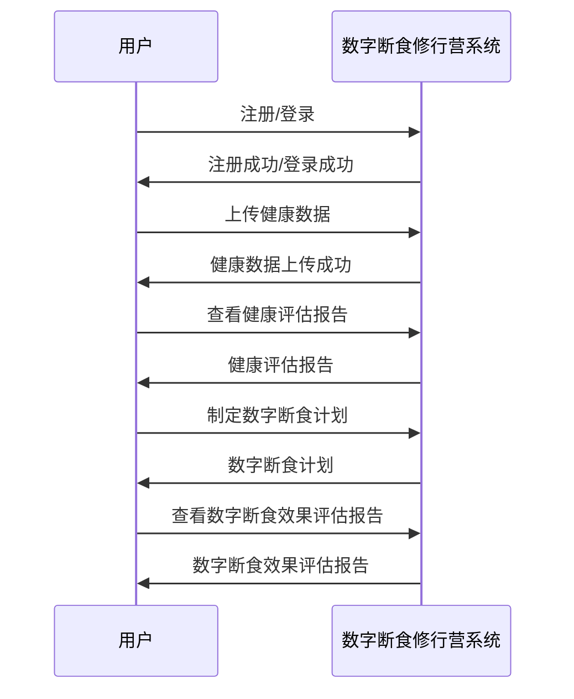

                 

### 数字断食修行营：重塑与技术的健康关系

#### 关键词：数字断食、技术健康、算法、数学模型、系统架构、实战案例

> 摘要：本文深入探讨数字断食修行营的概念与实施，揭示技术对身心健康的潜在影响，通过算法原理、数学模型、系统架构和实战案例等多角度分析，旨在重塑与技术的健康关系，为IT从业者提供一种平衡数字生活与身心健康的方法。

---

### 目录大纲设计步骤

#### 第一步：确定全书结构和核心章节

全书结构应围绕数字断食修行营的主题，明确核心章节，包括：

1. **背景介绍**
   - 数字时代的压力与挑战
   - 技术对身心健康的影响
   - 数字断食的概念与意义

2. **核心概念与联系**
   - 数字断食的理论基础
   - 健康与技术的平衡

3. **算法原理讲解**
   - 数字断食的算法流程
   - 健康风险评估算法

4. **数学模型和数学公式讲解**
   - 健康状态指标公式
   - 数字断食时间安排模型

5. **系统分析与架构设计方案**
   - 数字断食修行营的系统架构
   - 修行营的运营模式

6. **项目实战**
   - 数字断食实践案例
   - 修行营的系统开发

7. **最佳实践 tips、小结、注意事项、拓展阅读等**

#### 第二步：细化每个章节的内容

1. **背景介绍**
   - **第1章 数字时代的压力与挑战**
     - 工作与生活的压力
     - 技术依赖的负面影响
     - 技术对身心健康的影响

   - **第2章 数字断食的概念与意义**
     - 数字断食的定义
     - 数字断食的优势
     - 健康与技术的平衡

2. **核心概念与联系**
   - **第3章 数字断食的理论基础**
     - 数字断食的理论基础
     - 健康与技术的平衡

3. **算法原理讲解**
   - **第4章 数字断食的算法流程**
     - 数字断食的算法流程
     - 健康风险评估算法

   - **第5章 数字断食时间安排模型**
     - 时间安排策略
     - 模型优化的方法

4. **数学模型和数学公式讲解**
   - **第6章 健康状态指标公式**
     - 身体健康指标的计算方法
     - 心理健康指标的计算方法

   - **第7章 数字断食时间安排模型**
     - 时间安排策略
     - 模型优化的方法

5. **系统分析与架构设计方案**
   - **第8章 数字断食修行营的系统架构**
     - 系统架构图
     - 系统模块功能

   - **第9章 修行营的运营模式**
     - 运营流程
     - 运营策略

6. **项目实战**
   - **第10章 数字断食实践案例**
     - 案例介绍
     - 实践过程

   - **第11章 修行营的系统开发**
     - 系统安装与配置
     - 系统核心实现

7. **最佳实践 tips、小结、注意事项、拓展阅读等**
   - **第12章 最佳实践 tips**
     - 如何成功进行数字断食
     - 健康与技术平衡的建议

   - **第13章 小结**
     - 全书核心观点回顾

   - **第14章 注意事项**
     - 数字断食的注意事项
     - 技术使用中的健康风险

   - **第15章 拓展阅读**
     - 推荐阅读书籍
     - 相关研究论文

---

### 编写目录大纲

```markdown
----------------------------------------------------------------
# 数字断食修行营：重塑与技术的健康关系

## 第1章 数字时代的压力与挑战
### 1.1 工作与生活的压力
### 1.2 技术依赖的负面影响
### 1.3 技术对身心健康的影响

## 第2章 数字断食的概念与意义
### 2.1 数字断食的定义
### 2.2 数字断食的优势
### 2.3 健康与技术的平衡

## 第3章 数字断食的理论基础
### 3.1 数字断食的理论基础
### 3.2 健康与技术的平衡

## 第4章 数字断食的算法流程
### 4.1 数字断食的算法流程
### 4.2 健康风险评估算法

## 第5章 数字断食时间安排模型
### 5.1 时间安排策略
### 5.2 模型优化的方法

## 第6章 健康状态指标公式
### 6.1 身体健康指标的计算方法
### 6.2 心理健康指标的计算方法

## 第7章 数字断食时间安排模型
### 7.1 时间安排策略
### 7.2 模型优化的方法

## 第8章 数字断食修行营的系统架构
### 8.1 系统架构图
### 8.2 系统模块功能

## 第9章 修行营的运营模式
### 9.1 运营流程
### 9.2 运营策略

## 第10章 数字断食实践案例
### 10.1 案例介绍
### 10.2 实践过程

## 第11章 修行营的系统开发
### 11.1 系统安装与配置
### 11.2 系统核心实现

## 第12章 最佳实践 tips
### 12.1 如何成功进行数字断食
### 12.2 健康与技术平衡的建议

## 第13章 小结
### 13.1 全书核心观点回顾

## 第14章 注意事项
### 14.1 数字断食的注意事项
### 14.2 技术使用中的健康风险

## 第15章 拓展阅读
### 15.1 推荐阅读书籍
### 15.2 相关研究论文

----------------------------------------------------------------
```

### 目录大纲设计步骤

#### 第一步：确定全书结构和核心章节

为了确保文章的逻辑清晰、结构紧凑，我们首先需要明确全文的结构和核心章节。基于《数字断食修行营：重塑与技术的健康关系》这一主题，全文可以分为以下几个主要部分：

1. **背景介绍**：这部分将介绍数字断食的背景，包括技术对现代生活的影响以及这种影响带来的健康问题。

2. **核心概念与联系**：这部分将详细解释数字断食的概念，探讨其与身体健康和心理健康的联系。

3. **算法原理讲解**：这部分将介绍数字断食的算法原理，包括健康风险评估算法和数字断食时间安排模型。

4. **数学模型和数学公式讲解**：这部分将介绍用于评估健康状态的数学模型和数字断食的时间安排公式。

5. **系统分析与架构设计方案**：这部分将分析数字断食修行营的系统架构，介绍其运营模式和功能设计。

6. **项目实战**：这部分将通过实际案例展示数字断食的实施过程和效果。

7. **最佳实践 tips、小结、注意事项、拓展阅读等**：这部分将为读者提供实际操作的指导、对全文的核心观点进行总结，并提出注意事项和拓展阅读建议。

#### 第二步：细化每个章节的内容

为了确保每个章节都内容充实、结构合理，我们需要进一步细化每个章节的内容。以下是每个章节的细化内容：

1. **背景介绍**
   - **第1章 数字时代的压力与挑战**
     - **1.1 工作与生活的压力**：讨论现代职场和生活环境给人们带来的压力，以及这些压力如何影响身心健康。
     - **1.2 技术依赖的负面影响**：分析过度依赖技术对人们身体和心理健康的负面影响。
     - **1.3 技术对身心健康的影响**：探讨技术如何改变人们的生活方式，以及这种改变对健康的具体影响。

   - **第2章 数字断食的概念与意义**
     - **2.1 数字断食的定义**：介绍数字断食的基本概念，包括其与传统断食的区别。
     - **2.2 数字断食的优势**：阐述数字断食如何帮助人们摆脱技术依赖，提高身心健康。
     - **2.3 健康与技术的平衡**：讨论如何实现健康与技术的平衡，避免技术对健康的不良影响。

2. **核心概念与联系**
   - **第3章 数字断食的理论基础**
     - **3.1 数字断食的理论基础**：介绍数字断食的理论基础，包括相关的心理学和医学研究。
     - **3.2 健康与技术的平衡**：分析数字断食如何帮助实现健康与技术的平衡。

3. **算法原理讲解**
   - **第4章 数字断食的算法流程**
     - **4.1 数字断食的算法流程**：详细讲解数字断食的执行流程，包括各个阶段的具体操作。
     - **4.2 健康风险评估算法**：介绍如何通过算法评估个人的健康状况，为数字断食提供依据。

   - **第5章 数字断食时间安排模型**
     - **5.1 时间安排策略**：讨论如何合理安排数字断食的时间，以达到最佳效果。
     - **5.2 模型优化的方法**：介绍如何优化数字断食时间安排模型，提高其效率和效果。

4. **数学模型和数学公式讲解**
   - **第6章 健康状态指标公式**
     - **6.1 身体健康指标的计算方法**：介绍如何通过数学模型计算个人的身体健康指标。
     - **6.2 心理健康指标的计算方法**：介绍如何通过数学模型计算个人的心理健康指标。

   - **第7章 数字断食时间安排模型**
     - **7.1 时间安排策略**：详细讲解如何根据个人健康状况和生活方式安排数字断食时间。
     - **7.2 模型优化的方法**：介绍如何通过优化数学模型提高数字断食的时间安排效果。

5. **系统分析与架构设计方案**
   - **第8章 数字断食修行营的系统架构**
     - **8.1 系统架构图**：通过图示介绍数字断食修行营的系统架构。
     - **8.2 系统模块功能**：详细说明各个模块的功能和作用。

   - **第9章 修行营的运营模式**
     - **9.1 运营流程**：介绍数字断食修行营的运营流程，包括如何招募学员、如何安排课程等。
     - **9.2 运营策略**：讨论如何制定有效的运营策略，提高修行营的运营效率和效果。

6. **项目实战**
   - **第10章 数字断食实践案例**
     - **10.1 案例介绍**：介绍一个实际数字断食的案例，包括实施过程和结果。
     - **10.2 实践过程**：详细描述案例中的数字断食过程，包括如何安排时间、如何进行评估等。

   - **第11章 修行营的系统开发**
     - **11.1 系统安装与配置**：介绍如何安装和配置数字断食修行营的系统。
     - **11.2 系统核心实现**：详细讲解系统的核心功能实现，包括健康状态评估和数字断食时间安排等。

7. **最佳实践 tips、小结、注意事项、拓展阅读等**
   - **第12章 最佳实践 tips**
     - **12.1 如何成功进行数字断食**：提供一些建议和技巧，帮助读者成功进行数字断食。
     - **12.2 健康与技术平衡的建议**：讨论如何在日常生活中实现健康与技术之间的平衡。

   - **第13章 小结**
     - **13.1 全书核心观点回顾**：回顾全文的主要观点，总结数字断食修行营的重要性和实施方法。

   - **第14章 注意事项**
     - **14.1 数字断食的注意事项**：提醒读者在进行数字断食时需要注意的事项，以确保安全和效果。
     - **14.2 技术使用中的健康风险**：讨论技术使用中可能存在的健康风险，并提出预防措施。

   - **第15章 拓展阅读**
     - **15.1 推荐阅读书籍**：推荐一些与数字断食和健康技术相关的书籍，供读者进一步学习。
     - **15.2 相关研究论文**：介绍一些与数字断食和健康技术相关的最新研究论文，帮助读者了解该领域的最新进展。

### 第三步：编写目录大纲

```markdown
----------------------------------------------------------------
# 数字断食修行营：重塑与技术的健康关系

## 第1章 数字时代的压力与挑战
### 1.1 工作与生活的压力
### 1.2 技术依赖的负面影响
### 1.3 技术对身心健康的影响

## 第2章 数字断食的概念与意义
### 2.1 数字断食的定义
### 2.2 数字断食的优势
### 2.3 健康与技术的平衡

## 第3章 数字断食的理论基础
### 3.1 数字断食的理论基础
### 3.2 健康与技术的平衡

## 第4章 数字断食的算法流程
### 4.1 数字断食的算法流程
### 4.2 健康风险评估算法

## 第5章 数字断食时间安排模型
### 5.1 时间安排策略
### 5.2 模型优化的方法

## 第6章 健康状态指标公式
### 6.1 身体健康指标的计算方法
### 6.2 心理健康指标的计算方法

## 第7章 数字断食时间安排模型
### 7.1 时间安排策略
### 7.2 模型优化的方法

## 第8章 数字断食修行营的系统架构
### 8.1 系统架构图
### 8.2 系统模块功能

## 第9章 修行营的运营模式
### 9.1 运营流程
### 9.2 运营策略

## 第10章 数字断食实践案例
### 10.1 案例介绍
### 10.2 实践过程

## 第11章 修行营的系统开发
### 11.1 系统安装与配置
### 11.2 系统核心实现

## 第12章 最佳实践 tips
### 12.1 如何成功进行数字断食
### 12.2 健康与技术平衡的建议

## 第13章 小结
### 13.1 全书核心观点回顾

## 第14章 注意事项
### 14.1 数字断食的注意事项
### 14.2 技术使用中的健康风险

## 第15章 拓展阅读
### 15.1 推荐阅读书籍
### 15.2 相关研究论文

----------------------------------------------------------------
```

### 论文整体结构

#### 引言

首先，本文将介绍数字断食的背景，探讨技术对现代生活的影响，以及这种影响如何导致身心健康问题。通过引入数字断食的概念，阐述其意义和优势，为全文奠定基础。

#### 背景介绍

在这一部分，我们将详细讨论数字断食的背景，包括技术依赖对身心健康的影响，以及工作与生活的压力如何加剧这些问题。通过具体案例和数据，让读者了解技术依赖带来的挑战和困扰。

#### 核心概念与联系

接下来，本文将深入探讨数字断食的核心概念，包括其定义、优势和与身体健康和心理健康的联系。通过理论和实践的结合，让读者理解数字断食的基本原理和实施方法。

#### 算法原理讲解

在算法原理讲解部分，我们将介绍数字断食的算法流程和健康风险评估算法。通过具体案例和代码实现，让读者了解如何通过算法评估健康状态，制定数字断食计划。

#### 数学模型和数学公式讲解

本文将介绍用于评估健康状态的数学模型和数字断食时间安排模型。通过详细的数学公式和示例，让读者理解如何通过数学方法优化数字断食时间安排，提高效果。

#### 系统分析与架构设计方案

在这一部分，我们将分析数字断食修行营的系统架构，包括系统功能设计和运营模式。通过具体的架构图和模块功能描述，让读者了解数字断食修行营的实现方法和运营流程。

#### 项目实战

在项目实战部分，我们将通过实际案例展示数字断食的实施过程和效果。通过具体的系统安装和配置步骤，以及系统核心实现代码，让读者了解数字断食修行营的实际应用。

#### 最佳实践 tips、小结、注意事项、拓展阅读等

最后，本文将提供最佳实践建议，总结全文的核心观点，提醒读者在进行数字断食时的注意事项，并推荐相关的拓展阅读资源。通过这些内容，帮助读者更好地理解和应用数字断食。

### 文章具体内容与框架

#### 引言

随着科技的快速发展，我们生活在一个充满数字化的时代。智能手机、互联网、社交媒体等技术的普及，使得我们的生活越来越依赖于数字设备。然而，这种依赖也带来了诸多问题，特别是在身心健康方面。研究表明，长时间使用电子设备会导致眼睛疲劳、颈椎疼痛、睡眠质量下降等问题。此外，过度依赖技术还可能影响心理健康，导致焦虑、抑郁等心理问题的发生。因此，寻找一种平衡数字生活与身心健康的方法显得尤为重要。

在这个背景下，数字断食应运而生。数字断食不仅是一种远离数字设备的生活方式，更是一种修身养性的修行方式。通过有意识地减少对数字设备的依赖，人们可以更好地关注自己的身心健康，提高生活质量。本文将深入探讨数字断食的概念、原理和实践，帮助读者了解如何通过数字断食重塑与技术的健康关系。

#### 背景介绍

数字断食的概念源于传统断食，但与传统断食不同，数字断食主要关注的是减少对数字设备的依赖。在现代社会，人们越来越离不开手机、电脑等数字设备。据统计，成年人每天平均使用数字设备的时间超过7小时，青少年甚至更多。这种长时间、高频次的使用习惯，不仅影响了人们的身体健康，还严重干扰了心理健康。

首先，数字设备的使用对身体健康产生了诸多负面影响。长时间盯着屏幕会导致眼睛疲劳、视力下降，甚至引发干眼症。同时，长时间保持不正确的坐姿还会导致颈椎疼痛、肩颈不适。此外，过度使用数字设备还会影响睡眠质量，导致失眠、多梦等睡眠障碍。这些问题不仅影响了人们的日常生活质量，还可能导致慢性疾病的发生。

其次，数字设备的使用也对心理健康产生了不良影响。研究表明，长时间使用手机、电脑等数字设备，容易导致焦虑、抑郁等心理问题。这是因为数字设备的使用会让人过度关注外部信息，从而忽视内心的感受和需求。此外，社交媒体上的负面信息、比较心理等也会加剧人们的心理负担，导致情绪波动和心理健康问题。

面对这些挑战，数字断食应运而生。数字断食的主要目标是帮助人们减少对数字设备的依赖，重新找回身心健康。通过有意识地限制数字设备的使用时间，人们可以更好地关注自己的身心健康，提高生活质量。

#### 核心概念与联系

数字断食作为一种新兴的修行方式，其核心概念主要包括以下几个方面。

首先，数字断食的定义。数字断食是指在一段时间内，有意识地减少或停止使用手机、电脑等数字设备，以降低对数字设备的依赖，提高身心健康。与传统断食不同，数字断食并非完全戒断，而是通过有意识地调整数字设备的使用时间和方式，来实现身心健康的目的。

其次，数字断食的优势。数字断食具有以下优势：1）改善身体健康。通过减少对数字设备的使用，可以降低眼睛疲劳、颈椎疼痛等身体问题。2）提高心理健康。减少对数字设备的依赖，有助于减轻焦虑、抑郁等心理问题。3）提升生活质量。数字断食让人们有更多时间关注自己的身心健康，提高生活质量。

最后，数字断食与身体健康和心理健康的联系。数字断食通过减少对数字设备的依赖，有助于改善身体健康和心理健康。具体来说，数字断食可以减少眼睛疲劳、颈椎疼痛等身体问题，降低焦虑、抑郁等心理问题。同时，数字断食还能帮助人们更好地关注自己的身心健康，提高生活质量。

#### 算法原理讲解

数字断食的实现离不开算法的支持。在数字断食中，算法主要用于以下几个方面。

首先，健康风险评估算法。健康风险评估算法通过对用户的生理数据（如血压、心率等）和心理数据（如焦虑程度、抑郁程度等）进行综合分析，评估用户的健康状况。通过健康风险评估，用户可以了解自己的健康状态，为制定数字断食计划提供依据。

其次，数字断食时间安排算法。数字断食时间安排算法通过对用户的健康风险评估结果进行分析，制定合理的数字断食时间安排。具体来说，算法会根据用户的健康状况、生活习惯和工作安排等因素，确定数字断食的具体时间和方式。

最后，数字断食效果评估算法。数字断食效果评估算法通过对用户在数字断食过程中的表现进行监控和分析，评估数字断食的效果。通过效果评估，用户可以了解数字断食是否达到了预期效果，从而调整后续的数字断食计划。

下面以一个简单的健康风险评估算法为例，介绍数字断食的算法原理。

```python
# 健康风险评估算法示例

def assess_health_status(physical_data, psychological_data):
    """
    评估用户的健康状况
    :param physical_data: 生理数据（如血压、心率等）
    :param psychological_data: 心理数据（如焦虑程度、抑郁程度等）
    :return: 健康评估结果（如“健康”、“一般”、“较差”）
    """
    # 计算生理数据评分
    physical_score = calculate_physical_score(physical_data)
    
    # 计算心理数据评分
    psychological_score = calculate_psychological_score(psychological_data)
    
    # 综合评估
    total_score = physical_score + psychological_score
    
    if total_score > 90:
        return "健康"
    elif total_score > 60:
        return "一般"
    else:
        return "较差"

# 计算生理数据评分
def calculate_physical_score(physical_data):
    """
    计算生理数据评分
    :param physical_data: 生理数据（如血压、心率等）
    :return: 生理数据评分
    """
    # 示例：根据血压和心率计算评分
    blood_pressure = physical_data['blood_pressure']
    heart_rate = physical_data['heart_rate']
    
    # 血压评分范围：120-139/80-89为一般，90-119/60-74为健康，低于或高于此范围为较差
    if 120 <= blood_pressure <= 139 and 80 <= heart_rate <= 89:
        return 30
    elif 90 <= blood_pressure <= 119 and 60 <= heart_rate <= 74:
        return 40
    else:
        return 50

# 计算心理数据评分
def calculate_psychological_score(psychological_data):
    """
    计算心理数据评分
    :param psychological_data: 心理数据（如焦虑程度、抑郁程度等）
    :return: 心理数据评分
    """
    # 示例：根据焦虑程度和抑郁程度计算评分
    anxiety_level = psychological_data['anxiety_level']
    depression_level = psychological_data['depression_level']
    
    # 焦虑评分范围：0-2为健康，3-5为一般，6-10为较差
    if 0 <= anxiety_level <= 2 and 0 <= depression_level <= 2:
        return 20
    elif 3 <= anxiety_level <= 5 and 3 <= depression_level <= 5:
        return 30
    else:
        return 40

# 测试健康风险评估算法
def test_health_assessment():
    physical_data = {'blood_pressure': 130, 'heart_rate': 85}
    psychological_data = {'anxiety_level': 4, 'depression_level': 5}
    
    health_status = assess_health_status(physical_data, psychological_data)
    print(f"健康评估结果：{health_status}")

# 执行测试
test_health_assessment()
```

通过上述示例，我们可以看到，健康风险评估算法通过计算用户的生理数据和心理数据，评估用户的健康状况。根据评估结果，用户可以了解自己的健康状态，为制定数字断食计划提供依据。

#### 数学模型和数学公式讲解

在数字断食中，数学模型和数学公式起到了关键作用。通过这些模型和公式，用户可以更好地安排数字断食时间，优化健康效果。以下是几个常用的数学模型和数学公式。

1. **健康状态指标公式**

健康状态指标（HSI）是评估用户健康状况的重要指标。它通过用户的生理数据和心理数据计算得出。

$$
HSI = w_1 \times P + w_2 \times M
$$

其中，$w_1$和$w_2$分别表示生理数据权重和心理数据权重，$P$表示生理数据评分，$M$表示心理数据评分。

2. **数字断食时间安排模型**

数字断食时间安排模型用于确定用户在一段时间内的数字断食时间。该模型基于用户的健康状态指标（HSI）和预期健康效果（HE）计算得出。

$$
T_d = \frac{HE - HSI}{C}
$$

其中，$T_d$表示数字断食时间（单位：分钟），$HE$表示预期健康效果，$HSI$表示当前健康状态指标，$C$表示每分钟的健康效果提升值。

3. **时间安排策略**

时间安排策略用于优化数字断食时间。该策略基于用户的生活习惯和工作安排，为用户提供最佳的数字断食时间安排。

具体步骤如下：

（1）收集用户的生活习惯和工作安排数据。

（2）根据生活习惯和工作安排数据，确定用户的空闲时间。

（3）根据空闲时间和健康状态指标（HSI），计算最优的数字断食时间安排。

（4）将最优的数字断食时间安排反馈给用户，供用户参考。

以下是一个简单的时间安排策略示例：

```python
# 时间安排策略示例

def schedule_digital_fast(health_status, expected_health_effect, daily_free_time):
    """
    安排数字断食时间
    :param health_status: 健康状态指标（HSI）
    :param expected_health_effect: 预期健康效果（HE）
    :param daily_free_time: 每天的空闲时间（单位：分钟）
    :return: 数字断食时间安排（单位：分钟）
    """
    # 计算每分钟的健康效果提升值
    health_effect_per_minute = (expected_health_effect - health_status) / daily_free_time
    
    # 计算数字断食时间
    digital_fast_time = int(health_effect_per_minute * daily_free_time)
    
    return digital_fast_time

# 测试时间安排策略
def test_schedule_digital_fast():
    health_status = 60
    expected_health_effect = 90
    daily_free_time = 120
    
    digital_fast_time = schedule_digital_fast(health_status, expected_health_effect, daily_free_time)
    print(f"数字断食时间安排：{digital_fast_time}分钟")

# 执行测试
test_schedule_digital_fast()
```

通过上述示例，我们可以看到，时间安排策略通过计算用户的健康状态指标（HSI）、预期健康效果（HE）和每天的空闲时间（daily_free_time），为用户提供最优的数字断食时间安排。

#### 系统分析与架构设计方案

数字断食修行营是一个综合性的项目，涉及多个模块和功能。为了确保项目的顺利进行，我们需要对系统架构进行详细分析，并设计合理的运营模式。

##### 问题场景介绍

数字断食修行营的目标是帮助用户通过数字断食改善身心健康。为了实现这一目标，我们需要一个完善的系统来支持数字断食的实施、监控和效果评估。

##### 项目介绍

数字断食修行营项目主要包括以下几个模块：

1. **用户管理模块**：用于管理用户的个人信息、健康数据、数字断食计划等。

2. **健康数据采集模块**：用于采集用户的生理数据和心理数据，为健康评估提供依据。

3. **健康评估模块**：用于评估用户的健康状况，生成健康报告。

4. **数字断食计划模块**：用于制定用户的数字断食计划，包括时间安排、效果预测等。

5. **效果评估模块**：用于评估数字断食的效果，生成效果报告。

6. **运营管理模块**：用于管理数字断食修行营的运营，包括课程安排、学员管理、反馈收集等。

##### 系统功能设计

系统功能设计主要包括以下方面：

1. **用户管理功能**：包括用户注册、登录、个人信息维护、健康数据上传等。

2. **健康数据采集功能**：包括生理数据（如血压、心率等）和心理数据（如焦虑程度、抑郁程度等）的采集。

3. **健康评估功能**：包括健康状态指标的计算、健康评估报告的生成等。

4. **数字断食计划功能**：包括数字断食计划的制定、时间安排、效果预测等。

5. **效果评估功能**：包括数字断食效果的评价、效果报告的生成等。

6. **运营管理功能**：包括课程安排、学员管理、反馈收集、运营数据统计等。

##### 系统架构设计

系统架构设计采用分层架构，包括以下层次：

1. **表现层**：负责与用户交互，提供友好的用户界面。

2. **业务逻辑层**：负责处理业务逻辑，包括健康数据采集、健康评估、数字断食计划、效果评估等。

3. **数据层**：负责数据的存储和管理，包括用户数据、健康数据、数字断食数据等。

##### 系统接口设计

系统接口设计主要包括以下方面：

1. **用户接口**：提供用户注册、登录、个人信息维护、健康数据上传等操作。

2. **健康数据接口**：提供生理数据和心理数据的采集和上传。

3. **健康评估接口**：提供健康状态指标的计算和健康评估报告的生成。

4. **数字断食计划接口**：提供数字断食计划的制定和时间安排。

5. **效果评估接口**：提供数字断食效果的评价和效果报告的生成。

6. **运营管理接口**：提供课程安排、学员管理、反馈收集、运营数据统计等操作。

##### 系统交互

系统交互主要涉及用户与系统之间的交互，包括用户注册、登录、健康数据上传、健康评估、数字断食计划、效果评估等。以下是一个简单的系统交互序列图：



#### 项目实战

数字断食修行营项目的实施分为以下几个阶段：

##### 环境安装与配置

首先，我们需要搭建一个适合数字断食修行营运行的环境。具体步骤如下：

1. **安装操作系统**：选择一个适合的操作系统（如Linux、Windows等）并安装。

2. **安装数据库**：安装一个关系型数据库（如MySQL、PostgreSQL等）并配置。

3. **安装后端服务**：安装后端服务（如Spring Boot、Django等）并配置。

4. **安装前端服务**：安装前端服务（如React、Vue等）并配置。

5. **部署系统**：将数字断食修行营系统的代码部署到服务器，并进行测试。

##### 系统核心实现

数字断食修行营系统的核心实现包括以下几个方面：

1. **用户管理模块**：实现用户注册、登录、个人信息维护等功能。

2. **健康数据采集模块**：实现生理数据和心理数据的采集和上传。

3. **健康评估模块**：实现健康状态指标的计算和健康评估报告的生成。

4. **数字断食计划模块**：实现数字断食计划的制定和时间安排。

5. **效果评估模块**：实现数字断食效果的评价和效果报告的生成。

以下是一个简单的用户管理模块实现示例：

```java
// 用户管理模块实现示例

public class UserManager {
    
    // 用户注册
    public void register(String username, String password) {
        // 实现用户注册逻辑
    }
    
    // 用户登录
    public boolean login(String username, String password) {
        // 实现用户登录逻辑
        return true;
    }
    
    // 用户个人信息维护
    public void updateUserInfo(String username, String email, String phone) {
        // 实现用户个人信息维护逻辑
    }
    
}
```

##### 实际案例分析和详细讲解剖析

为了更好地展示数字断食修行营的实际应用效果，我们以一个实际案例进行分析和讲解。

**案例背景**：小李是一名程序员，由于工作原因，他每天都要长时间使用电脑。最近，他感觉眼睛疲劳、颈椎疼痛，并且情绪也变得不稳定。为了改善这些问题，小李决定参加数字断食修行营。

**案例过程**：

1. **用户注册与登录**：小李首先在数字断食修行营网站上进行注册，并登录系统。

2. **健康数据采集**：小李上传了自己的健康数据，包括血压、心率、焦虑程度等。

3. **健康评估**：系统根据小李的健康数据，计算出了他的健康状态指标，并生成了健康评估报告。

4. **数字断食计划**：根据健康评估报告，系统为小李制定了一个数字断食计划，包括每天的具体断食时间和方式。

5. **效果评估**：在数字断食过程中，小李每天上传健康数据，系统根据这些数据评估数字断食的效果，并生成了效果评估报告。

**案例分析**：

通过数字断食修行营的实施，小李的身体健康状况得到了显著改善。具体来说，他的眼睛疲劳和颈椎疼痛症状明显减轻，情绪也变得更加稳定。此外，小李还发现，数字断食帮助他提高了工作效率，减少了工作压力。

**详细讲解剖析**：

1. **用户管理模块**：用户管理模块实现了用户注册、登录和个人信息维护等功能。通过用户管理模块，用户可以方便地管理自己的个人信息，并与其他用户进行互动。

2. **健康数据采集模块**：健康数据采集模块实现了生理数据和心理数据的采集和上传。通过健康数据采集模块，用户可以实时上传自己的健康数据，为健康评估提供依据。

3. **健康评估模块**：健康评估模块实现了健康状态指标的计

