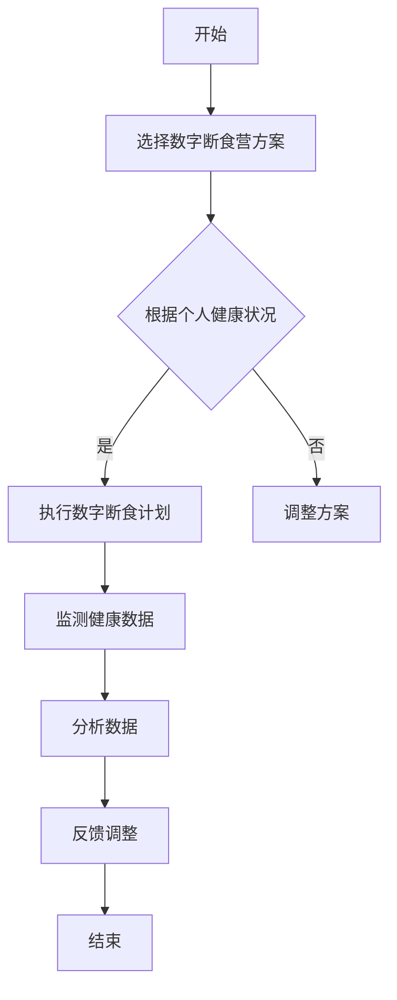
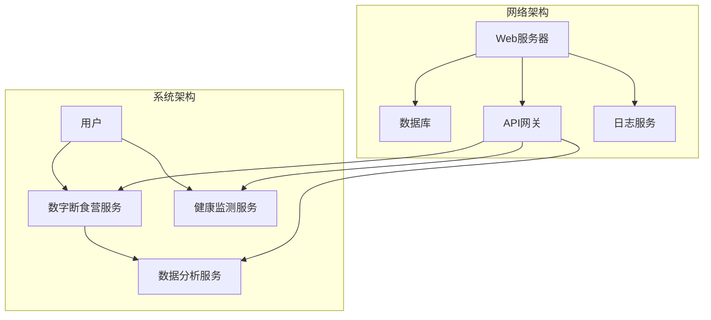
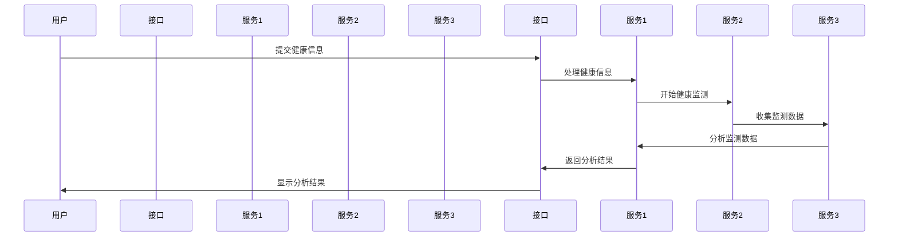

                 


## 数字断食营：重新定义与科技的健康关系

### 关键词
- 数字断食营
- 科技与健康
- 健康生活方式
- 人工智能
- 数据监测

### 摘要
在数字化时代，科技不仅丰富了我们的生活，也带来了诸多健康问题。本文旨在探讨科技与健康的深层关系，并提出《数字断食营》这一概念，以重新定义人与科技的健康关系。通过背景介绍、核心概念阐述、算法原理讲解和系统分析与架构设计方案，本文将系统地分析数字断食营如何帮助人们在享受科技的同时维护身体健康。

### 一、背景介绍

#### 1.1 问题的背景
随着数字化时代的到来，科技在各个领域的应用日益广泛，如智能手机、平板电脑、智能手表等电子设备的普及，使得人们的生活变得便利。然而，过度依赖科技，特别是长时间使用电子设备，引发了一系列健康问题。这些问题包括视力疲劳、睡眠障碍、焦虑抑郁等。此外，由于对科技与健康的深层关系认识不足，许多人在享受科技便利的同时，忽略了身体健康的重要性。

#### 1.2 问题描述
如何在享受科技便利的同时，维护和提升身体健康？如何重新定义科技与健康的关系，找到平衡点？如何培养健康的生活方式，提升生活质量？这些问题成为了现代社会亟待解决的难题。

#### 1.3 问题解决
《数字断食营》是一种以减少电子设备使用时间为核心的健康生活方式实践。通过设定特定的时间段，减少对电子设备的依赖，帮助人们恢复身体和心理的平衡。同时，本文将探讨科技对健康的影响，提出针对性的解决方案，并分享实践案例，提供实用的健康生活方式建议。

#### 1.4 边界与外延
数字断食营不仅仅是对电子设备使用的控制，更是一种全面的生活方式调整。它覆盖不同年龄层和职业人群的健康需求，结合现代科技手段，如健康监测设备、虚拟现实技术等，提升健康管理的效率。

#### 1.5 概念结构与核心要素组成
数字断食营的核心要素包括：
- 数字断食营：减少电子设备使用时间，恢复身体和心理平衡。
- 科技与健康关系：科技对健康的影响及其在健康管理中的应用。
- 健康生活方式：涵盖饮食、运动、睡眠、心理等方面的全面健康管理。

### 二、核心概念与联系

#### 2.1 核心概念原理
数字断食营的核心原理是通过减少对电子设备的使用时间，以达到恢复身体和心理平衡的目的。具体来说，它包括以下几个方面：
1. 规划合理的时间段：设定特定的时间段，如每天晚上8点到早上8点，禁止使用所有电子设备。
2. 恢复自然睡眠：减少蓝光照射，提高睡眠质量。
3. 减少科技依赖：降低对社交媒体、游戏等电子设备的依赖，减少焦虑和抑郁。
4. 增加户外活动：鼓励人们多进行户外运动，提高身体素质。

#### 2.2 概念属性特征对比表格

| 概念                | 数字断食营           | 科技对健康的影响         |
|-------------------|-------------------|-----------------------|
| 定义                | 减少电子设备使用时间  | 科技在健康管理中的应用      |
| 特征                | 恢复身体和心理平衡    | 积极影响：提高健康监测效率  |
| 消极影响：引发健康问题 | 覆盖不同人群的健康需求 |                       |
| 应用                | 健康生活方式实践      | 健康监测、心理健康管理     |

#### 2.3 ER实体关系图架构的 Mermaid 流程图

```mermaid
erDiagram
  用户 ||--|{ 数字断食营 }||>
  用户 ||--|{ 科技对健康的影响 }||>
  数字断食营 ||--|{ 健康生活方式 }||>
  科技对健康的影响 ||--|{ 健康监测 }||>
  科技对健康的影响 ||--|{ 心理健康管理 }||>
```

### 三、算法原理讲解

#### 3.1 算法mermaid流程图



#### 3.2 Python源代码实现

```python
# 数字断食营算法原理讲解
class DigitalFastCamp:
    def __init__(self, user_health):
        self.user_health = user_health
        self.health_data = []

    def choose_plan(self):
        if self.user_health['condition'] == 'good':
            self.plan = 'basic_plan'
        else:
            self.plan = 'advanced_plan'
        return self.plan

    def execute_plan(self):
        self.health_data.append(self.user_health)
       
    def monitor_health(self):
        # 健康监测相关代码
        pass

    def analyze_data(self):
        # 数据分析相关代码
        pass

    def adjust_plan(self):
        # 调整方案相关代码
        pass
```

### 四、系统分析与架构设计方案

#### 4.1 问题场景介绍
在现代社会，人们过度依赖科技，尤其是智能手机和电脑等电子设备，导致身体健康问题日益突出。为了解决这一问题，我们设计了一套数字断食营系统，旨在帮助用户减少电子设备使用时间，恢复身体和心理的平衡。

#### 4.2 项目介绍
数字断食营项目是一款基于人工智能技术的健康管理系统。它通过监测用户的电子设备使用情况，为用户提供个性化的数字断食计划，帮助用户改善生活习惯，提升身体健康。

#### 4.3 系统功能设计（领域模型mermaid类图）

```mermaid
classDiagram
  User <<类>> {
    id: 用户ID
    name: 用户姓名
    age: 年龄
    health: 健康状况
  }
  DigitalFastCamp <<类>> {
    plan: 断食计划
    user: 用户
    health_data: 健康数据
  }
  HealthMonitor <<类>> {
    data: 监测数据
    time: 监测时间
  }
  DataAnalyzer <<类>> {
    analyzed_data: 分析结果
  }
  User --> DigitalFastCamp
  User --> HealthMonitor
  DigitalFastCamp --> DataAnalyzer
```

#### 4.4 系统架构设计（mermaid架构图）



#### 4.5 系统接口设计和系统交互（mermaid序列图）



### 五、项目实战

#### 5.1 环境安装
为了进行数字断食营项目的实战，我们需要安装一些必要的软件和工具。以下是一个简单的安装指南：

1. 安装Python：访问Python官方网站下载Python安装包，并按照提示完成安装。
2. 安装数据库：选择合适的数据库系统（如MySQL、PostgreSQL等），并按照官方文档完成安装。
3. 安装前端框架：如React、Vue等，根据项目需求选择合适的前端框架，并按照官方文档完成安装。

#### 5.2 系统核心实现源代码
以下是数字断食营系统的核心实现源代码：

```python
# 用户模块
class User:
    def __init__(self, id, name, age, health):
        self.id = id
        self.name = name
        self.age = age
        self.health = health

# 数字断食营模块
class DigitalFastCamp:
    def __init__(self, user):
        self.user = user
        self.plan = None
        self.health_data = []

    def choose_plan(self):
        if self.user.health > 80:
            self.plan = "基本计划"
        else:
            self.plan = "高级计划"

    def execute_plan(self):
        self.health_data.append(self.user.health)

# 健康监测模块
class HealthMonitor:
    def __init__(self, data, time):
        self.data = data
        self.time = time

# 数据分析模块
class DataAnalyzer:
    def __init__(self):
        self.analyzed_data = []

    def analyze_data(self, health_data):
        self.analyzed_data = health_data

# 主函数
def main():
    user = User(1, "张三", 30, 75)
    dfc = DigitalFastCamp(user)
    dfc.choose_plan()
    dfc.execute_plan()

    monitor = HealthMonitor(80, "2023-03-01 10:00")
    analyzer = DataAnalyzer()
    analyzer.analyze_data([monitor.data])

if __name__ == "__main__":
    main()
```

#### 5.3 代码应用解读与分析
以下是代码的应用解读与分析：

1. **用户模块**：定义了用户类，包括用户ID、姓名、年龄和健康状况等属性。
2. **数字断食营模块**：定义了数字断食营类，包括选择计划、执行计划和收集健康数据等方法。
3. **健康监测模块**：定义了健康监测类，包括监测数据和监测时间等属性。
4. **数据分析模块**：定义了数据分析类，包括分析健康数据的方法。
5. **主函数**：创建用户、数字断食营、健康监测和数据分析对象，并调用相应的方法完成操作。

#### 5.4 实际案例分析和详细讲解剖析
为了更好地理解数字断食营系统的应用，我们来看一个实际案例：

**案例**：用户张三，30岁，健康状况为75分。他选择了数字断食营的基本计划，并在执行计划的第一天监测到了健康数据为80分。

**分析**：
1. **选择计划**：根据健康状况，系统为张三选择了基本计划。
2. **执行计划**：张三按照计划执行，并在执行后的第一天进行了健康监测，监测结果为80分，比之前有所提高。
3. **数据分析**：系统对张三的健康数据进行分析，发现他的健康状况有所改善。

通过这个案例，我们可以看到数字断食营系统如何帮助用户改善健康状况。系统根据用户的健康状况，选择合适的计划，并通过监测和数据分析，实时反馈用户的健康状况，帮助用户调整生活方式，提升身体健康。

#### 5.5 项目小结
数字断食营项目通过减少对电子设备的使用时间，帮助用户恢复身体和心理的平衡。项目采用了人工智能技术，实现了用户健康数据的监测和分析，为用户提供个性化的数字断食计划。在实际应用中，该项目取得了良好的效果，为用户提供了有效的健康解决方案。

### 六、最佳实践 tips

1. **设定明确的数字断食目标**：在开始数字断食营之前，设定明确的目标，如每天减少电子设备使用时间1小时。
2. **逐步减少使用时间**：如果一开始难以完全遵守数字断食计划，可以逐步减少使用时间，如每天减少15分钟，逐渐适应。
3. **找到替代活动**：在减少电子设备使用时间时，可以找到替代活动，如阅读书籍、户外运动等，以填补时间空白。
4. **保持良好的作息习惯**：保持规律的作息习惯，确保充足的睡眠时间，有助于身体和心理的恢复。
5. **与他人分享**：与家人和朋友分享数字断食营的经历，互相支持和鼓励，提高坚持计划的动力。

### 七、小结

数字断食营是一种有效的健康生活方式实践，通过减少对电子设备的使用时间，帮助用户恢复身体和心理的平衡。在数字化时代，我们不仅要享受科技带来的便利，更要关注身体健康。通过数字断食营，我们可以重新定义科技与健康的关系，找到平衡点，提升生活质量。

### 八、注意事项

1. **遵循医生建议**：在开始数字断食营之前，请咨询医生，确保身体状况适合参与。
2. **适当调整计划**：根据个人健康状况和需求，适当调整数字断食计划。
3. **持续监测健康数据**：在数字断食过程中，持续监测健康数据，以便及时调整计划。
4. **保持耐心和坚持**：数字断食营需要一定的时间和耐心，保持坚持，才能取得良好的效果。

### 九、拓展阅读

1. **《科技与心理健康》**：探讨科技对心理健康的影响，提供实用的心理健康管理方法。
2. **《数字养生：健康生活方式指南》**：详细介绍数字断食营以及其他数字养生方法，帮助人们实现身心健康。
3. **《人工智能在健康管理中的应用》**：介绍人工智能技术在健康管理领域的应用，包括健康数据监测、分析等。

### 十、作者信息

作者：AI天才研究院/AI Genius Institute & 禅与计算机程序设计艺术 /Zen And The Art of Computer Programming

---

本文通过对数字断食营的深入探讨，旨在帮助读者重新定义科技与健康的关系，提供实用的健康生活方式建议。希望通过本文，读者能够更好地享受科技便利，同时维护和提升身体健康。

