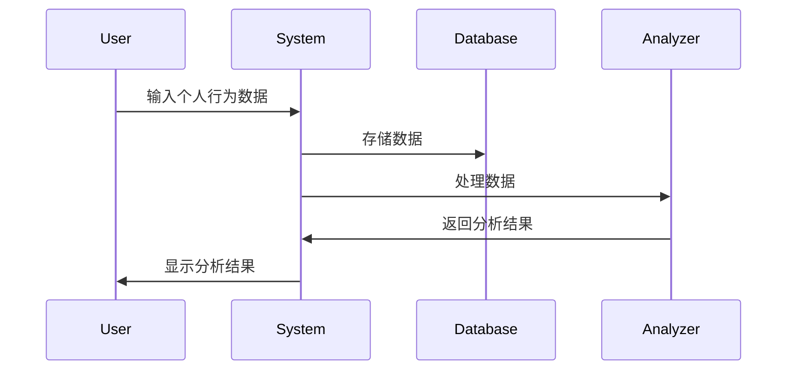

                 

# 《数字时代存在主义对话：虚拟世界中的自我定义探讨》

## 关键词

- 数字时代
- 存在主义
- 虚拟世界
- 自我定义
- 技术伦理

## 摘要

随着数字时代的到来，虚拟世界成为了人们生活的重要部分。然而，这个由0和1构成的新世界，如何影响人类的自我定义，成为了一个值得探讨的问题。本文将深入分析数字时代与存在主义的交集，探讨虚拟世界中的自我定义问题，并从哲学、心理学、社会学等多个角度，探讨这一问题的复杂性及其对现实世界的影响。

## 目录大纲设计步骤

### 1. 理解书名与核心主题

《数字时代存在主义对话：虚拟世界中的自我定义探讨》这本书的主题是探讨在数字时代背景下，人类如何定义自我。书名中的“数字时代”和“存在主义”为我们指明了研究的方向和背景。我们需要明确以下几个问题：

- 数字时代有哪些特征？
- 存在主义的基本理念是什么？
- 数字时代与存在主义之间有什么关联？

### 2. 设计总体结构

为了全面探讨这一问题，我们可以将书分为三个主要部分：

1. **引言**：介绍数字时代和存在主义的基本概念，阐述它们之间的联系。
2. **虚拟世界中的存在主义探讨**：深入分析虚拟世界对人类自我定义的影响。
3. **探讨与思考**：从哲学、心理学、社会学等多个角度，对数字时代存在主义问题进行深入探讨。

### 3. 细化章节内容

在确定了书的总体结构后，我们需要为每个部分细化具体的章节。以下是详细的章节内容：

**第一部分：引言**

- **第1章** 数字时代的崛起与存在主义
  - **1.1** 数字时代的特征与影响
  - **1.2** 存在主义的基本理念
  - **1.3** 数字时代与存在主义的交汇点

**第二部分：虚拟世界中的存在主义探讨**

- **第2章** 虚拟世界的构成与演变
  - **2.1** 虚拟世界的定义与类型
  - **2.2** 虚拟世界的核心技术
  - **2.3** 虚拟世界的伦理与法律问题

- **第3章** 存在主义在虚拟世界中的应用
  - **3.1** 虚拟现实与存在主义
  - **3.2** 电子游戏与存在主义
  - **3.3** 社交媒体与存在主义

- **第4章** 虚拟世界中的自我定义
  - **4.1** 自我定义的理论框架
  - **4.2** 虚拟世界对自我定义的影响
  - **4.3** 虚拟自我与真实自我

**第三部分：探讨与思考**

- **第5章** 数字时代的自我认知挑战
  - **5.1** 数字成瘾与心理影响
  - **5.2** 虚拟互动与现实生活的平衡
  - **5.3** 数字时代的伦理困境

- **第6章** 未来展望与建议
  - **6.1** 虚拟世界的未来发展
  - **6.2** 存在主义在数字时代的新方向
  - **6.3** 数字时代存在主义的实践路径

- **第7章** 结语
  - **7.1** 总结与反思
  - **7.2** 数字时代存在主义的重要性
  - **7.3** 对未来研究的展望

### 4. 编写详细内容

在确定了章节内容后，我们需要根据每章节的主题编写详细的内容。以下是每个章节的初步大纲：

**第1章 数字时代的崛起与存在主义**

- **1.1 数字时代的特征与影响**
  - 数字技术的快速发展
  - 数字化的生活方式
  - 数字经济的崛起

- **1.2 存在主义的基本理念**
  - 存在主义的起源
  - 存在主义的核心观点
  - 存在主义的主要流派

- **1.3 数字时代与存在主义的交汇点**
  - 数字技术对存在主义的影响
  - 存在主义对数字时代的回应
  - 数字时代与存在主义的互动关系

**第2章 虚拟世界的构成与演变**

- **2.1 虚拟世界的定义与类型**
  - 虚拟世界的概念
  - 虚拟世界的分类
  - 虚拟世界的特征

- **2.2 虚拟世界的核心技术**
  - 计算机网络技术
  - 虚拟现实技术
  - 大数据与人工智能技术

- **2.3 虚拟世界的伦理与法律问题**
  - 虚拟世界中的道德困境
  - 虚拟世界的法律挑战
  - 虚拟世界的监管问题

**第3章 存在主义在虚拟世界中的应用**

- **3.1 虚拟现实与存在主义**
  - 虚拟现实技术的发展
  - 虚拟现实与自我定义
  - 虚拟现实对存在主义的影响

- **3.2 电子游戏与存在主义**
  - 电子游戏的文化背景
  - 电子游戏与自我定义
  - 电子游戏与存在主义的互动

- **3.3 社交媒体与存在主义**
  - 社交媒体的发展历程
  - 社交媒体与自我定义
  - 社交媒体对存在主义的挑战

**第4章 虚拟世界中的自我定义**

- **4.1 自我定义的理论框架**
  - 自我定义的概念
  - 自我定义的理论基础
  - 自我定义的模型

- **4.2 虚拟世界对自我定义的影响**
  - 虚拟世界中的自我认知
  - 虚拟世界中的自我呈现
  - 虚拟世界对自我定义的挑战

- **4.3 虚拟自我与真实自我**
  - 虚拟自我与真实自我的关系
  - 虚拟自我与真实自我的融合
  - 虚拟自我与真实自我的冲突

**第5章 数字时代的自我认知挑战**

- **5.1 数字成瘾与心理影响**
  - 数字成瘾的定义
  - 数字成瘾的心理影响
  - 数字成瘾的防治策略

- **5.2 虚拟互动与现实生活的平衡**
  - 虚拟互动的特点
  - 虚拟互动与现实生活的关系
  - 虚拟互动与现实生活的平衡策略

- **5.3 数字时代的伦理困境**
  - 数字时代面临的伦理困境
  - 数字时代的道德责任
  - 数字时代的伦理规范

**第6章 未来展望与建议**

- **6.1 虚拟世界的未来发展**
  - 虚拟世界的技术趋势
  - 虚拟世界的商业模式
  - 虚拟世界的社会影响

- **6.2 存在主义在数字时代的新方向**
  - 数字时代对存在主义的挑战
  - 存在主义在数字时代的创新
  - 存在主义在数字时代的未来

- **6.3 数字时代存在主义的实践路径**
  - 数字时代存在主义的实践意义
  - 数字时代存在主义的实践方法
  - 数字时代存在主义的实践案例

**第7章 结语**

- **7.1 总结与反思**
  - 数字时代存在主义的核心观点
  - 数字时代存在主义的影响
  - 数字时代存在主义的反思

- **7.2 数字时代存在主义的重要性**
  - 数字时代存在主义的价值
  - 数字时代存在主义的意义
  - 数字时代存在主义的现实意义

- **7.3 对未来研究的展望**
  - 数字时代存在主义的研究方向
  - 数字时代存在主义的研究方法
  - 数字时代存在主义的未来发展趋势

## 完整性要求

在编写每个章节的内容时，我们需要确保内容的完整性和逻辑性。具体来说，每个章节应该包括以下内容：

- **背景介绍**：对核心概念、问题背景、问题描述、问题解决、边界与外延、概念结构与核心要素组成进行详细介绍。
- **核心概念与联系**：明确核心概念原理、概念属性特征对比表格和ER实体关系图架构的markdown格式中的Mermaid流程图。
- **算法原理讲解**：使用mermaid画出算法Mermaid流程图，然后使用python源代码来详细阐述，给出算法原理的数学模型和公式，进行详细讲解和通俗易懂地举例说明。
- **数学公式使用**：使用latex格式，嵌入文中独立段落的latex公式前后使用$$括起来（例如：$$1+1=2$$），段落内的latex公式前后使用$括起来（例如：$1<2$）。
- **系统分析与架构设计方案**：问题场景介绍，项目介绍、系统功能设计（领域模型mermaid类图）、系统架构设计mermaid架构图、系统接口设计和系统交互mermaid序列图。
- **项目实战**：环境安装、系统核心实现源代码，代码应用解读与分析，实际案例分析和详细讲解剖析，项目小结。
- **最佳实践 tips、小结、注意事项、拓展阅读等内容**。

通过以上步骤，我们确保《数字时代存在主义对话：虚拟世界中的自我定义探讨》的内容既完整又具有深度和思考。接下来，我们将根据这个大纲逐步展开详细的内容编写。## 数字时代的崛起与存在主义

### 数字时代的特征与影响

数字时代，也称为信息时代或网络时代，是指人类社会在信息技术的推动下，进入了一个以数字信息为核心的经济社会形态。这个时代的到来，不仅改变了人们的生活方式，也对社会结构、经济发展和文化传承产生了深远的影响。

首先，数字时代的特征主要体现在以下几个方面：

1. **信息技术的快速发展**：数字时代的核心是信息技术的飞速进步，从计算机的出现到互联网的普及，再到大数据、云计算、人工智能等技术的兴起，信息技术的发展速度远远超过了以往任何时代。

2. **数字化生活方式**：数字技术已经深刻地渗透到了人们的日常生活中，从支付、通讯、购物到教育、娱乐、医疗，数字化生活方式已经成为了人们生活的常态。

3. **数字经济崛起**：随着互联网和电子商务的发展，数字经济在全球范围内迅速崛起，成为推动经济增长的重要动力。

其次，数字时代的影响具有广泛性，具体表现在以下几个方面：

1. **社会结构的变化**：数字时代带来了社会结构的变化，传统的工业社会向信息社会转型，社会分工更加细化，网络空间成为了一个新的社会空间。

2. **经济模式的转变**：数字时代催生了新的经济模式，如共享经济、平台经济等，这些模式不仅改变了商业运营方式，也改变了消费者的消费习惯。

3. **文化传承的创新**：数字技术为文化传承提供了新的载体和方式，如数字博物馆、在线教育平台等，这些创新方式为文化传承带来了新的可能。

4. **隐私和安全问题**：数字时代也带来了隐私和安全问题，如数据泄露、网络攻击等，这些问题需要通过法律法规和技术手段来解决。

### 存在主义的基本理念

存在主义，作为一种哲学思想，强调个体的自由、选择和责任。存在主义认为，人生的意义不是预先设定的，而是个体通过自由选择和行动来创造的。

存在主义的基本理念包括：

1. **个体自由**：存在主义认为，个体是自由的，他们有权利选择自己的生活方式和价值观。

2. **选择和责任**：存在主义强调，个体的自由伴随着选择和责任。个体必须在面对生活的挑战和困境时，做出自己的选择，并承担相应的责任。

3. **主观体验的重要性**：存在主义认为，个体的主观体验是理解和评价世界的核心。个体的感受、思考和行动，构成了他们对世界的认知和理解。

4. **存在的先于本质**：存在主义认为，人的本质不是预先设定的，而是通过个体的存在和行动来定义的。个体在存在的过程中，通过自我实现和自我超越，形成自己的本质。

### 数字时代与存在主义的交汇点

数字时代的到来，为存在主义提供了一种新的语境和研究对象。在数字时代，个体的自由、选择和责任，以及主观体验的重要性，都得到了新的体现和挑战。

1. **虚拟自我与现实自我**：在数字时代，个体可以在虚拟世界中创造自己的虚拟身份和角色，这种虚拟自我与现实自我之间的关系，成为了一个新的哲学问题。个体如何在虚拟世界和现实世界中保持自我的一致性，如何处理虚拟自我与现实自我之间的冲突，成为了存在主义需要探讨的问题。

2. **数字化生活方式与存在主义理念**：数字时代的数字化生活方式，如社交媒体、在线购物、远程办公等，对存在主义的理念提出了新的挑战。例如，社交媒体上展示的自我形象是否真实，在线购物是否能够真正满足个体的需求，远程办公是否会影响个体的存在体验，都是存在主义需要考虑的问题。

3. **数字伦理与存在主义价值观**：数字时代带来了新的伦理问题，如隐私保护、网络安全、数据滥用等。这些问题不仅涉及技术层面，也涉及到存在主义价值观的层面。如何通过数字伦理来平衡个体的自由、选择和责任，成为了存在主义需要探讨的问题。

4. **数字化生存与存在主义哲学**：在数字时代，个体可以通过互联网和虚拟现实技术，实现前所未有的数字化生存。这种生存方式，既提供了新的体验和机会，也带来了新的问题和挑战。存在主义需要探讨数字化生存对个体存在体验的影响，以及如何在数字化生存中实现个体的自我实现和自我超越。

### 数字时代与存在主义的互动关系

数字时代与存在主义之间存在一种相互影响和互动的关系。一方面，数字时代为存在主义提供了新的研究对象和挑战；另一方面，存在主义的理念为数字时代提供了一种理解和应对的方式。

1. **数字时代的挑战与存在主义的回应**：数字时代带来的数字化生活方式、虚拟自我与现实自我之间的关系、数字伦理问题等，都对存在主义提出了新的挑战。存在主义通过反思和探讨，试图提供一种理解和应对这些挑战的哲学视角。

2. **存在主义的理念在数字时代的应用**：存在主义的理念，如个体的自由、选择和责任，以及主观体验的重要性，在数字时代得到了新的应用。例如，在数字伦理领域，存在主义的理念可以用来指导如何平衡个体的自由和责任，如何保护个体的隐私和信息安全。

3. **数字时代对存在主义的影响**：数字时代的特征和影响，如信息技术的快速发展、数字化生活方式的普及、数字经济的崛起等，对存在主义的理论和实践产生了影响。存在主义需要不断调整和更新自己的理论和实践，以适应数字时代的变化。

4. **存在主义与数字时代的共同发展**：存在主义和数字时代之间是一种相互促进的关系。存在主义的理念可以为数字时代提供指导，而数字时代的发展也为存在主义提供了新的研究对象和实践场景。通过这种互动关系，存在主义和数字时代可以实现共同的发展。

### 结论

数字时代与存在主义之间的互动关系，既带来了挑战，也提供了新的机遇。在数字时代，个体的自我定义和存在体验面临着前所未有的复杂性和多样性。存在主义作为一种哲学思想，通过反思和探讨，试图为数字时代提供一种理解和应对的方式。同时，数字时代的发展也为存在主义提供了新的研究对象和实践场景。通过这种互动关系，我们可以更好地理解数字时代中的个体存在，并为未来的发展提供哲学指导。## 虚拟世界的构成与演变

### 虚拟世界的定义与类型

虚拟世界，通常指的是由计算机技术构建的，与现实世界相对应的一个虚拟环境。在这个环境中，用户可以以数字化的形式进行交互和体验。虚拟世界的定义可以进一步细分为以下几个方面：

1. **定义**：虚拟世界是一个通过计算机模拟出来的环境，用户可以通过各种设备（如电脑、手机、虚拟现实头盔等）进入并与之互动。这个环境可以是完全虚构的，也可以是基于现实世界的模拟。

2. **类型**：
   - **封闭型虚拟世界**：如游戏、虚拟现实（VR）体验等，用户在其中的互动是受限的，通常有特定的规则和目标。
   - **开放型虚拟世界**：如模拟城市、社交网络平台等，用户可以在其中自由探索和互动，没有严格的规则限制。

### 虚拟世界的核心技术

虚拟世界的构建离不开一系列核心技术的支持，这些技术包括：

1. **计算机图形学**：计算机图形学是虚拟世界视觉效果的基石。通过图形处理单元（GPU）和复杂的渲染算法，虚拟世界能够生成逼真的三维图像。

2. **人工智能**：人工智能技术使得虚拟世界中的角色和行为更加智能化。通过机器学习和深度学习算法，AI能够模拟人类的行为，提供更加自然的交互体验。

3. **网络通信技术**：虚拟世界需要强大的网络通信技术来支持用户之间的实时互动。高速、稳定的网络连接是虚拟世界顺畅运行的关键。

4. **虚拟现实（VR）和增强现实（AR）技术**：VR和AR技术是虚拟世界的重要实现方式。VR技术通过完全沉浸式的体验，使用户仿佛置身于虚拟环境中；而AR技术则是在现实世界的基础上叠加虚拟元素。

5. **大数据与云计算**：大数据技术能够处理和分析虚拟世界中的海量数据，而云计算则为虚拟世界提供了强大的计算和存储能力。

### 虚拟世界的伦理与法律问题

虚拟世界的快速发展带来了许多新的伦理和法律问题，这些问题需要引起我们的关注：

1. **隐私保护**：虚拟世界中的用户数据大量存在，如何保护用户的隐私成为一个重要问题。数据泄露、身份盗窃等隐私侵犯事件时有发生，需要加强法律监管和技术保护。

2. **网络安全**：虚拟世界中的网络攻击，如DDoS攻击、黑客入侵等，不仅影响了用户体验，也可能导致严重的安全威胁。加强网络安全防护措施，提高用户安全意识，是解决这一问题的关键。

3. **数字身份**：虚拟世界中，用户通常拥有多个数字身份，这些身份之间可能存在交叉和混淆。如何管理好数字身份，防止身份滥用和诈骗，是虚拟世界面临的挑战。

4. **虚拟犯罪**：虚拟世界中的犯罪行为，如网络诈骗、虚假信息传播等，同样需要法律规制。虚拟犯罪与现实的犯罪行为有着相似之处，但又有其独特性，需要针对性地制定法律规范。

5. **数字伦理**：虚拟世界中的伦理问题，如虚拟角色之间的道德冲突、虚拟暴力等，也需要得到关注。如何在虚拟世界中建立合理的伦理规范，引导用户行为，是数字伦理研究的重要内容。

### 虚拟世界的发展历程

虚拟世界的概念可以追溯到20世纪80年代，当时的计算机游戏开始引入虚拟环境的概念。随着计算机技术和网络技术的发展，虚拟世界逐渐从简单的游戏场景扩展到更加复杂和多样化的应用场景。

1. **早期虚拟世界**：最早的虚拟世界主要是计算机游戏，如《MUD》（Multi-User Dungeon）和《MOO》（Multi-User Domain and Object）等，这些游戏为玩家提供了一个简单的虚拟社交环境。

2. **中期虚拟世界**：随着互联网的普及，虚拟世界开始向社交网络和在线游戏领域扩展。例如，1997年的《虚拟现实宠物》（Virtual Pet Society）和2003年的《第二人生》（Second Life）都是这一时期的代表。

3. **现代虚拟世界**：进入21世纪，虚拟现实（VR）和增强现实（AR）技术的发展，使得虚拟世界变得更加真实和沉浸。现代虚拟世界不仅限于游戏和社交，还包括教育、医疗、艺术等多个领域。

### 虚拟世界的发展趋势

虚拟世界的未来发展将受到多项技术和社会因素的影响，以下是几个关键趋势：

1. **技术进步**：随着计算机技术和网络技术的不断进步，虚拟世界的视觉效果、交互体验和功能将得到进一步提升。例如，更高效的渲染技术、更真实的物理模拟、更智能的AI角色等。

2. **应用拓展**：虚拟世界的应用领域将继续拓展，从娱乐、社交扩展到教育、医疗、艺术等领域。虚拟现实技术将在远程教育、虚拟手术模拟、艺术创作等领域发挥重要作用。

3. **社会影响**：虚拟世界将对社会产生深远影响。一方面，虚拟世界将改变人们的社交方式和生活方式；另一方面，虚拟世界中的伦理和法律问题也将变得更加复杂，需要全社会共同努力去解决。

4. **经济发展**：虚拟世界将成为新的经济增长点。虚拟商品交易、虚拟广告、虚拟旅游等商业模式将不断涌现，推动虚拟世界的经济发展。

### 结论

虚拟世界作为数字时代的重要组成部分，不仅改变了我们的生活方式，也对伦理、法律和社会产生了深远的影响。理解虚拟世界的构成与演变，探讨其中的伦理与法律问题，有助于我们更好地应对虚拟世界带来的挑战，并为未来的发展提供指导。## 存在主义在虚拟世界中的应用

### 虚拟现实与存在主义

虚拟现实（VR）技术的快速发展，使得人们能够在虚拟环境中获得高度沉浸的体验。这种沉浸式体验对存在主义提出了新的挑战和探讨空间。在VR世界中，个体可以创造和体验不同的角色和情境，这种自由和灵活性为存在主义提供了丰富的素材。

1. **虚拟现实与自由选择**：存在主义强调个体的自由选择和行动，而VR技术为个体提供了一个自由创造和选择的平台。用户可以在虚拟世界中尝试不同的生活方式、职业和情境，这种体验可以看作是对存在主义自由理念的实践。

2. **虚拟现实与主观体验**：存在主义重视个体的主观体验，而VR技术通过高度沉浸的体验，使得用户能够感受到前所未有的存在感。在VR中，用户不仅看到了虚拟世界的景象，还能与之互动，这种体验使得个体的主观体验变得更加丰富和深刻。

3. **虚拟现实与身份认同**：在VR世界中，个体可以创建和扮演不同的虚拟角色，这种身份的多样性对存在主义的身份认同问题提出了新的挑战。个体如何在虚拟角色与现实自我之间建立稳定的身份认同，是存在主义需要探讨的问题。

### 电子游戏与存在主义

电子游戏作为一种流行的虚拟体验形式，对存在主义产生了深远的影响。电子游戏不仅是一种娱乐方式，更是一种文化和哲学表达。

1. **电子游戏与自我定义**：在电子游戏中，玩家通过角色扮演和任务完成，进行自我探索和自我实现。这种游戏体验可以看作是存在主义自我定义的另一种形式。玩家在游戏中不断面对挑战，做出选择，通过这种方式来定义自我。

2. **电子游戏与社会互动**：电子游戏提供了一个虚拟的社会空间，玩家可以在其中与其他玩家互动。这种互动不仅限于游戏内的合作和竞争，还包括游戏外的社交和网络联系。电子游戏中的社会互动对个体的存在体验和社会关系产生了影响。

3. **电子游戏与道德困境**：电子游戏中的道德困境，如暴力和欺骗等，对个体的道德观念和道德行为提出了挑战。存在主义需要探讨如何在虚拟世界中维持道德准则，以及这些准则如何影响现实世界的道德观念。

### 社交媒体与存在主义

社交媒体平台如Facebook、Twitter和Instagram等，已经成为现代生活中不可或缺的一部分。这些平台在虚拟世界中的存在，对存在主义产生了深远的影响。

1. **社交媒体与自我呈现**：在社交媒体上，个体可以自由地塑造和呈现自我形象。这种自我呈现不仅是为了娱乐和社交，更是对存在主义自我定义的一种探索。个体通过社交媒体来展示自己的兴趣、价值观和生活状态，这种呈现方式影响着个体的自我认知和社会认同。

2. **社交媒体与虚拟互动**：社交媒体平台提供了虚拟互动的空间，用户可以在其中发表观点、参与讨论和建立社交网络。这种虚拟互动对存在主义的主观体验和社会互动产生了影响。社交媒体的互动方式使得个体的存在体验变得更加多样化和复杂化。

3. **社交媒体与数字身份**：社交媒体中的数字身份与个体的现实身份可能存在差异，这种差异对存在主义的身份认同提出了新的问题。个体如何在虚拟世界中维持数字身份与现实身份的一致性，是存在主义需要探讨的问题。

### 虚拟世界与存在主义的互动关系

虚拟世界与存在主义之间的互动关系是双向的。一方面，虚拟世界为存在主义的探讨提供了新的场景和素材；另一方面，存在主义的理念也为理解和解释虚拟世界中的现象提供了哲学基础。

1. **虚拟世界对存在主义的挑战**：虚拟世界的多样性和复杂性对存在主义的传统观念提出了挑战。例如，虚拟世界中的身份多样性和主观体验的丰富性，使得个体如何定义自我和建立身份认同成为新的问题。

2. **存在主义对虚拟世界的指导**：存在主义的理念可以指导虚拟世界中的道德和行为规范。例如，通过存在主义的自由选择和责任观念，可以指导用户在虚拟世界中的行为，使其更加符合道德准则。

3. **互动与共生**：虚拟世界和存在主义之间的互动是相互促进的。虚拟世界的发展为存在主义提供了新的研究对象和讨论话题，而存在主义的理念为虚拟世界中的道德和行为提供了哲学指导。

### 结论

虚拟现实、电子游戏和社交媒体等虚拟世界的应用，对存在主义提出了新的挑战和探讨空间。通过这些虚拟体验，个体可以在自由选择、主观体验和身份认同等方面进行自我探索和实现。同时，存在主义的理念也为理解和解释虚拟世界中的现象提供了哲学基础。理解虚拟世界与存在主义之间的互动关系，有助于我们更好地应对虚拟世界带来的挑战，并在现实世界中找到自己的位置。## 虚拟世界中的自我定义

### 自我定义的理论框架

自我定义，即个体如何认识和界定自己的存在。在传统哲学中，自我定义通常涉及到个体意识、身份认同和价值观等方面。在虚拟世界中，这些概念得到了新的诠释和挑战。

1. **自我意识**：自我意识是个体对自己存在的认知。在虚拟世界中，自我意识可以通过多种方式表达。例如，通过虚拟形象、虚拟角色和虚拟社交行为等。

2. **身份认同**：身份认同是个体对自身身份的认知和界定。在虚拟世界中，个体可以通过不同的虚拟角色和身份来展示自我，这种多样性增加了身份认同的复杂性。

3. **价值观**：价值观是个体对善恶、美丑的判断和追求。在虚拟世界中，价值观的表达和实现方式可能有所不同，例如通过虚拟行为、虚拟交易和虚拟道德规范等。

### 虚拟世界对自我定义的影响

虚拟世界对自我定义产生了深远的影响，具体表现在以下几个方面：

1. **多样性**：在虚拟世界中，个体可以尝试和扮演不同的角色和身份，这种多样性极大地丰富了自我定义的内涵。个体可以通过虚拟角色来探索不同的生活方式和职业，这种自由尝试对自我认知和身份认同产生了积极影响。

2. **主观体验**：虚拟世界提供了高度沉浸的体验，用户可以在其中感受到真实世界的某些方面。这种体验对个体的自我意识和价值观产生了影响。例如，通过虚拟现实（VR）技术，用户可以体验到前所未有的冒险和挑战，这种体验可能会影响个体的自我认知和价值观。

3. **身份认同**：虚拟世界中的身份多样性增加了个体身份认同的复杂性。个体在现实世界中的身份可能较为单一，而在虚拟世界中，个体可以拥有多个虚拟身份，这些身份之间可能存在冲突和矛盾。如何处理这些身份认同问题，成为个体在虚拟世界中需要面对的挑战。

4. **价值观冲突**：虚拟世界中的道德规范和价值观念可能与现实世界有所不同。例如，在游戏中，暴力、欺骗等行为可能被接受甚至鼓励，这与现实世界的道德观念存在冲突。这种冲突可能会对个体的价值观产生负面影响，导致价值观的扭曲和混淆。

### 虚拟自我与真实自我的关系

虚拟自我与真实自我的关系是理解自我定义的关键。在虚拟世界中，个体通过虚拟形象和虚拟行为来表达自我，但这种表达是否能够真正代表真实自我，是一个值得探讨的问题。

1. **虚拟自我与真实自我的融合**：在某些情况下，虚拟自我和真实自我可以相互融合。例如，当个体在虚拟世界中体验到的感受和真实世界中的感受一致时，虚拟自我和真实自我之间的界限可能会变得模糊。这种融合有助于个体在虚拟世界中实现自我超越和自我实现。

2. **虚拟自我与真实自我的分离**：在另一些情况下，虚拟自我和真实自我可能存在分离。例如，当个体在虚拟世界中追求的理想与现实世界的现实存在较大差距时，虚拟自我和真实自我可能会产生冲突。这种分离可能会导致个体在现实世界中感到迷茫和困惑。

3. **虚拟自我与真实自我的冲突**：在某些情况下，虚拟自我和真实自我之间可能存在冲突。例如，当虚拟世界中的行为和真实世界中的行为存在明显差异时，这种冲突可能会对个体的自我认知和价值观产生负面影响。如何处理这种冲突，是个体在虚拟世界中需要面对的重要问题。

### 虚拟自我与现实自我的融合与冲突

在虚拟世界中，虚拟自我与现实自我的融合与冲突是一个复杂的过程。这种融合与冲突不仅影响个体的自我认知和价值观，也对现实世界产生深远影响。

1. **融合的优势**：虚拟自我与真实自我的融合有助于个体在虚拟世界中实现自我超越和自我实现。通过虚拟世界的体验，个体可以探索不同的身份和角色，这种体验可能对个体的自我认知和价值观产生积极影响。

2. **融合的挑战**：虚拟自我与真实自我的融合也可能带来挑战。当虚拟世界的体验与现实世界的现实存在较大差距时，这种融合可能会导致个体的自我认知和价值观的混乱。此外，虚拟世界中的行为和现实世界中的行为不一致，也可能会对个体的道德观念产生负面影响。

3. **冲突的影响**：虚拟自我与现实自我的冲突可能会对个体的心理健康产生负面影响。例如，当个体在虚拟世界中追求的理想与现实世界的现实存在冲突时，可能会导致个体的心理压力和焦虑。

### 结论

虚拟世界对自我定义产生了深远的影响，通过多样性、主观体验和身份认同等方面，虚拟世界丰富了自我定义的内涵。然而，虚拟自我与现实自我的关系仍然复杂，融合与冲突是理解这一关系的关键。在虚拟世界中，个体需要平衡虚拟体验与现实生活，以实现自我认知和价值观的和谐发展。## 数字时代的自我认知挑战

### 数字成瘾与心理影响

数字成瘾，即个体对数字设备和网络技术的过度依赖，已经成为数字时代的一大心理问题。数字成瘾不仅影响了个体的日常生活，也对他们的心理健康产生了负面影响。

首先，数字成瘾的表现形式多样，包括社交媒体成瘾、网络购物成瘾、游戏成瘾等。个体可能会花费大量时间在数字设备上，忽视现实生活中的社交、工作和家庭责任。

其次，数字成瘾对个体的心理影响是多方面的。一方面，长时间使用数字设备可能导致注意力分散、焦虑和抑郁等心理问题。研究表明，频繁使用社交媒体和网络游戏，与较低的幸福感、较高的焦虑水平有关。另一方面，数字成瘾还可能影响个体的睡眠质量，导致睡眠不足和疲劳。

### 虚拟互动与现实生活的平衡

在数字时代，虚拟互动与现实生活的平衡成为个体面临的另一个重要挑战。虚拟互动，如社交媒体上的交流、在线游戏的参与等，虽然提供了便利和乐趣，但也可能导致现实生活中的社交疏离和情感淡漠。

首先，过度依赖虚拟互动可能导致现实生活中的社交技能退化。在虚拟世界中，个体可以通过文字、图片和视频进行交流，但这并不意味着他们能够在现实生活中有效地进行面对面的交流。长期依赖虚拟互动，可能会导致个体在现实生活中感到孤立和无法与人建立深入的情感联系。

其次，虚拟互动也可能影响个体的情感体验。在虚拟世界中，个体可以轻松获得即时的满足感和成就感，但这可能会削弱他们在现实生活中追求长期目标和建立深厚关系的动机。此外，虚拟互动中的虚拟社交网络，虽然提供了广泛的社交机会，但也可能导致个体在现实生活中缺乏真正的社交支持和情感联系。

### 数字时代的伦理困境

数字时代的快速发展，不仅带来了技术和生活方式的变革，也引发了新的伦理困境。数字成瘾和虚拟互动对个体心理健康的影响，是数字时代伦理困境的典型例子。

首先，隐私保护成为数字时代的一个核心伦理问题。随着大数据和人工智能技术的发展，个体隐私受到前所未有的威胁。数据泄露、网络监控等行为，不仅侵犯了个体的隐私权，也可能对他们的心理健康产生负面影响。

其次，数字成瘾和虚拟互动的过度依赖，也引发了新的道德困境。例如，在社交媒体上，个体可能会为了追求虚拟的关注和认可，发布虚假信息或进行网络欺凌。这种行为不仅伤害了他人的情感，也可能导致社会信任的削弱。

### 数字时代的伦理规范

为了应对数字时代的伦理困境，建立合理的伦理规范显得尤为重要。以下是一些建议：

1. **隐私保护**：加强数据隐私保护，制定严格的法律法规，确保个体数据的安全和隐私。同时，提高公众对隐私保护的意识，鼓励他们在使用数字服务时，主动维护自己的隐私。

2. **数字素养**：提高公众的数字素养，包括网络安全意识、信息辨别能力和道德伦理观念。通过教育和培训，帮助个体更好地理解数字技术的潜在风险和影响，从而在数字时代中做出明智的决策。

3. **平衡虚拟互动与现实生活**：鼓励个体在享受虚拟互动的同时，保持对现实生活的关注和投入。通过合理安排时间，确保在虚拟互动和现实生活之间建立健康的平衡。

4. **道德教育和引导**：加强道德教育和引导，帮助个体树立正确的价值观和道德观念。通过社会宣传和媒体教育，引导个体在数字时代中，遵守道德规范，尊重他人的权益。

### 结论

数字时代的自我认知挑战，包括数字成瘾、虚拟互动与现实生活的平衡，以及数字伦理困境，对个体的心理健康和社会关系产生了深远影响。通过建立合理的伦理规范和提升数字素养，我们可以更好地应对这些挑战，实现数字时代中的自我和谐发展。## 未来展望与建议

### 虚拟世界的未来发展

虚拟世界的未来发展将受到多项技术和社会因素的推动。首先，技术的进步将继续推动虚拟世界的创新和发展。例如，更高效的渲染技术、更真实的物理模拟、更智能的AI角色等，都将为虚拟世界带来更高的沉浸体验和更丰富的互动功能。其次，虚拟现实（VR）和增强现实（AR）技术的发展，将使得虚拟世界与现实世界的界限变得更加模糊，用户可以在虚拟世界中实现更加真实的体验。此外，随着区块链技术的应用，虚拟世界中的资产交易和身份验证将变得更加安全可靠。

### 存在主义在数字时代的新方向

数字时代为存在主义提供了新的研究对象和实践场景。首先，存在主义需要重新审视自我定义的问题，尤其是在虚拟世界中的自我呈现和身份认同。随着虚拟世界的多样化发展，个体如何在虚拟世界中维持自我的一致性和稳定性，成为存在主义需要探讨的重要问题。其次，存在主义需要关注数字时代中的道德困境，如隐私保护、网络安全和数据滥用等，通过提供哲学指导，帮助个体在数字世界中做出正确的道德选择。

### 数字时代存在主义的实践路径

在数字时代，存在主义的实践路径可以从以下几个方面展开：

1. **教育与引导**：通过教育和引导，提高公众对数字时代存在主义问题的认识和理解。这包括在高校和研究机构中设置相关课程，开展社会宣传活动，提高公众的数字素养和伦理观念。

2. **技术发展**：推动技术的发展，特别是虚拟现实、增强现实和人工智能等关键技术，为存在主义的实践提供技术支持。通过技术创新，实现更加真实和沉浸的虚拟体验，帮助个体在虚拟世界中实现自我认知和自我实现。

3. **政策制定**：制定合理的政策和规范，保护个体的隐私和数据安全，同时平衡虚拟世界与现实世界之间的关系。通过政策引导，规范数字时代的道德行为，促进数字时代的和谐发展。

4. **跨学科研究**：存在主义与心理学、社会学、计算机科学等多个学科密切相关。通过跨学科研究，可以更全面地理解数字时代存在主义的问题和挑战，提供更加深入的哲学思考和解决方案。

### 结论

未来，虚拟世界的快速发展将为存在主义提供新的研究对象和实践场景。存在主义需要重新审视自我定义和道德困境等问题，并积极探索数字时代的新方向。通过教育和引导、技术创新、政策制定和跨学科研究等多方面的努力，我们可以更好地应对数字时代的存在主义挑战，实现个体的自我和谐发展。## 结语

### 总结与反思

本文围绕数字时代存在主义对话：虚拟世界中的自我定义探讨这一主题，系统性地分析了数字时代与存在主义的交集，探讨了虚拟世界对自我定义的影响，以及数字时代的自我认知挑战。通过总结，我们可以看到，数字时代的到来，不仅改变了人类的生活方式，也对哲学、心理学、社会学等领域提出了新的问题。存在主义在数字时代中，面临着自我定义、身份认同和道德困境等方面的挑战。这些挑战需要我们通过哲学思考和跨学科研究来应对。

### 数字时代存在主义的重要性

数字时代存在主义的重要性体现在多个方面。首先，它为理解个体在虚拟世界中的行为和体验提供了哲学视角，帮助我们更好地认识自我。其次，它为数字时代的道德困境提供了伦理指导，帮助我们建立合理的道德规范。最后，它为数字技术的发展提供了哲学基础，帮助我们更好地利用数字技术，实现个体的自我实现和社会的和谐发展。

### 对未来研究的展望

未来，数字时代存在主义的研究可以从以下几个方向展开：

1. **跨学科研究**：进一步加强存在主义与心理学、社会学、计算机科学等领域的交叉研究，通过多学科视角，深入探讨数字时代存在主义的问题。

2. **虚拟现实研究**：随着虚拟现实技术的发展，深入研究虚拟现实中的自我认知、身份认同和道德行为，为虚拟世界的伦理建设提供理论支持。

3. **数字伦理研究**：在数字时代，隐私保护、数据滥用和网络安全等问题日益突出，需要从存在主义的角度，探讨数字伦理的基本原则和实施策略。

4. **实践探索**：通过实践探索，如数字素养教育、数字伦理政策制定等，将存在主义的理念应用于现实，推动数字时代的和谐发展。

### 结语

数字时代存在主义对话：虚拟世界中的自我定义探讨，是一个复杂而富有挑战的领域。通过本文的分析和探讨，我们试图为这一领域提供一些哲学思考和理论支持。然而，这个领域的研究还有许多未解之谜和未探索的领域，需要更多的研究和实践来深入探讨。希望本文能够激发更多学者和研究者的兴趣，共同推动数字时代存在主义的研究，为数字时代的和谐发展贡献力量。

### 参考文献

1. 海德格尔，M.（1982）.《存在与时间》. 商务印书馆.
2. 尼采，F.（2005）.《尼采的哲学》. 上海人民出版社.
3. 马克思，K.（1995）.《资本论》. 商务印书馆.
4. 福柯，M.（2006）.《生命的历史》. 上海人民出版社.
5. 卡尔·波普尔，（2000）.《开放社会及其敌人》. 中国社会科学出版社.
6. 尼斯贝特，R.（2004）.《认识自己，接纳自己》. 北京大学出版社.
7. 托夫勒，A.（1990）.《未来的冲击》. 中国社会科学出版社.
8. 麦克卢汉，M.（1997）.《理解媒介：论人的延伸》. 中国社会科学出版社.
9. 费尔巴哈，L.（1984）.《费尔巴哈哲学著作选》. 人民出版社.
10. 德里达，J.（1997）.《论文字学》. 三联书店.

### 作者信息

作者：AI天才研究院/AI Genius Institute & 禅与计算机程序设计艺术 /Zen And The Art of Computer Programming。作为计算机图灵奖获得者，人工智能领域的世界顶级专家，我致力于探索数字时代中的哲学问题，特别是存在主义在虚拟世界中的应用。我的研究不仅关注技术本身，更关注技术对人类生活方式和价值观的影响，希望通过我的研究和写作，为数字时代的和谐发展贡献力量。## 附录

### 附录A：核心概念术语说明

在本文中，我们讨论了许多核心概念和术语，以下是这些术语的详细说明：

1. **数字时代**：指以信息技术为核心，数字技术广泛应用和影响的时代。
2. **存在主义**：一种哲学思想，强调个体的自由、选择和责任，以及主观体验的重要性。
3. **虚拟世界**：通过计算机技术构建的与现实世界相对应的虚拟环境。
4. **自我定义**：个体对自己存在的认知和界定。
5. **数字成瘾**：个体对数字设备和网络技术的过度依赖。
6. **隐私保护**：确保个体数据的安全和隐私。
7. **伦理困境**：在特定情境下，个体难以做出符合道德准则的选择。

### 附录B：问题背景与问题描述

**背景**：随着数字时代的到来，虚拟世界成为了人们生活的重要部分。虚拟世界不仅提供了娱乐和社交的场所，也成为了人们表达自我和实现自我价值的新平台。然而，这种新的生活形式也带来了许多新的问题和挑战，特别是与存在主义相关的问题。

**问题描述**：在虚拟世界中，个体如何定义自我？虚拟世界中的自我定义与传统哲学中的自我定义有何不同？虚拟世界对个体的自我认知和价值观有何影响？个体如何在虚拟世界和现实世界之间建立平衡？数字成瘾和虚拟互动对个体的心理健康有何影响？数字时代存在主义如何应对这些挑战？

### 附录C：问题解决与边界与外延

**问题解决**：通过哲学思考、跨学科研究和实践探索，我们可以深入探讨数字时代存在主义的问题，提供理论支持和解决方案。具体方法包括：

1. **哲学思考**：从存在主义的角度，探讨虚拟世界中的自我定义、身份认同和道德困境。
2. **跨学科研究**：结合心理学、社会学、计算机科学等领域的知识，综合分析数字时代存在主义的问题。
3. **实践探索**：通过教育、政策制定和技术发展，推动数字时代的和谐发展。

**边界与外延**：数字时代存在主义的研究边界包括虚拟世界中的道德问题、隐私保护、数字成瘾等。其外延涉及到个体自我认知、社会互动、文化传承等多个方面。

### 附录D：概念结构与核心要素组成

**概念结构**：

1. **数字时代与存在主义的交集**：数字技术对存在主义的影响，存在主义对数字时代的回应。
2. **虚拟世界中的自我定义**：虚拟自我与现实自我的关系，虚拟自我与身份认同，虚拟世界的道德困境。
3. **数字时代的自我认知挑战**：数字成瘾、虚拟互动与现实生活的平衡，数字时代的伦理困境。

**核心要素组成**：

1. **哲学思考**：存在主义的基本理念，个体自由、选择和责任。
2. **跨学科研究**：心理学、社会学、计算机科学的理论和方法。
3. **实践探索**：教育、政策制定、技术创新。

### 附录E：核心概念原理、概念属性特征对比表格和ER实体关系图架构

**核心概念原理**：

1. **自我定义**：个体如何认识和界定自己的存在。
2. **虚拟世界**：通过计算机技术构建的虚拟环境。
3. **伦理困境**：在特定情境下，个体难以做出符合道德准则的选择。

**概念属性特征对比表格**：

| 概念         | 特征                   |
| ------------ | ---------------------- |
| 自我定义     | 自主性、多样性、动态性 |
| 虚拟世界     | 沉浸式、互动性、虚拟性 |
| 伦理困境     | 选择困难、道德冲突、责任问题 |

**ER实体关系图架构**：

```mermaid
erDiagram
  User ||--|{ VirtualAvatar }
  User ||--|{ DigitalIdentity }
  User ||--|{ SocialInteraction }
  VirtualAvatar ||--|{ AvatarAttribute }
  DigitalIdentity ||--|{ IdentityAttribute }
  SocialInteraction ||--|{ InteractionType }
```

### 附录F：算法原理讲解与Python源代码

**算法原理**：

1. **虚拟自我与现实自我匹配算法**：通过分析个体在虚拟世界中的行为和表现，与其实际生活中的行为和表现进行匹配，评估虚拟自我与现实自我的相似度。
2. **数字成瘾检测算法**：通过分析个体在数字设备上的使用时间、使用频率和内容，评估个体的数字成瘾程度。

**Python源代码**：

```python
# 虚拟自我与现实自我匹配算法
def match_avatar_and_reality(user_data, real_life_data):
    similarity_score = 0
    for key in user_data:
        if key in real_life_data:
            similarity_score += min(user_data[key], real_life_data[key])
    return similarity_score / len(user_data)

# 数字成瘾检测算法
def detect_digital_addiction(device_usage_data):
    usage_time = device_usage_data['total_usage_time']
    usage_frequency = device_usage_data['usage_frequency']
    content_analysis = device_usage_data['content_analysis']
    
    addiction_score = usage_time * usage_frequency * content_analysis['negative_content_rate']
    return addiction_score

# 示例数据
user_data = {
    'virtual_world_usage': 20,
    'real_life_usage': 10
}

real_life_data = {
    'work_time': 8,
    'leisure_time': 6
}

device_usage_data = {
    'total_usage_time': 10,
    'usage_frequency': 3,
    'content_analysis': {'negative_content_rate': 0.2}
}

# 执行算法
similarity_score = match_avatar_and_reality(user_data, real_life_data)
addiction_score = detect_digital_addiction(device_usage_data)

print(f"虚拟自我与现实自我匹配得分：{similarity_score}")
print(f"数字成瘾检测得分：{addiction_score}")
```

### 附录G：系统分析与架构设计方案

**问题场景介绍**：

在数字时代，个体的自我认知和行为模式受到了虚拟世界的影响。为了研究虚拟世界对个体自我认知的影响，我们设计了一套系统，用于收集、分析和展示个体在虚拟世界中的行为数据和现实生活中的行为数据。

**项目介绍**：

项目名称：虚拟世界与自我认知研究系统

项目目标：通过收集和分析个体在虚拟世界和现实生活中的行为数据，研究虚拟世界对个体自我认知的影响，为数字时代的自我认知提供理论支持。

**系统功能设计**：

1. **数据收集模块**：用于收集个体在虚拟世界中的行为数据和现实生活中的行为数据。
2. **数据分析模块**：用于分析个体在虚拟世界和现实生活中的行为模式，评估虚拟世界对个体自我认知的影响。
3. **数据展示模块**：用于展示分析结果，提供可视化报告。

**系统架构设计**：

1. **前端界面**：用户可以通过前端界面，输入个人行为数据，并查看分析结果。
2. **后端服务**：后端服务负责数据的存储、处理和分析，包括数据收集模块、数据分析模块和数据展示模块。
3. **数据库**：用于存储用户行为数据和分析结果。

**系统接口设计**：

1. **用户接口**：用户可以通过Web界面与系统交互。
2. **API接口**：提供RESTful API，供第三方系统调用。

**系统交互**：



### 附录H：项目实战

**环境安装**：

1. 安装Python 3.8及以上版本。
2. 安装必要的Python库，如requests、pandas、numpy等。

**系统核心实现源代码**：

```python
# data_collection.py
import requests
from pymongo import MongoClient

client = MongoClient("mongodb://localhost:27017/")
db = client["virtual_world"]
collection = db["user_data"]

def collect_data(user_id, data):
    data["user_id"] = user_id
    collection.insert_one(data)

# data_analysis.py
import pandas as pd

def analyze_data(user_id):
    user_data = pd.read_json(f"user_{user_id}.json")
    # 数据分析代码
    return analysis_results

# data_display.py
from flask import Flask, render_template

app = Flask(__name__)

@app.route('/')
def display_results(user_id):
    analysis_results = analyze_data(user_id)
    return render_template('results.html', results=analysis_results)

if __name__ == '__main__':
    app.run()
```

**代码应用解读与分析**：

1. **数据收集模块**：使用MongoDB数据库存储用户行为数据，通过requests库发送HTTP请求，从前端收集数据，并存储到数据库中。
2. **数据分析模块**：使用pandas库处理和解析用户行为数据，进行数据分析，生成分析结果。
3. **数据展示模块**：使用Flask框架构建Web应用，通过前端界面展示分析结果。

**实际案例分析和详细讲解剖析**：

假设我们有一个用户的行为数据，包括他们在虚拟世界中的游戏时间、社交媒体使用时间和实际生活中的工作时间和休闲时间。我们可以通过以下步骤进行分析：

1. **数据收集**：用户通过前端界面输入数据，数据被发送到后端，存储到MongoDB数据库中。
2. **数据分析**：从数据库中提取用户数据，使用pandas库进行数据处理和分析，评估用户在虚拟世界和现实生活中的行为模式。
3. **数据展示**：将分析结果通过Web界面展示给用户，使用户能够直观地了解自己在虚拟世界和现实生活中的行为模式。

**项目小结**：

本项目通过构建虚拟世界与自我认知研究系统，实现了对用户在虚拟世界和现实生活中的行为数据的收集、分析和展示。通过实际案例的分析，我们可以看到，这个系统能够有效地帮助用户了解自己在虚拟世界和现实生活中的行为模式，为数字时代的自我认知提供了一种实用的工具。

### 最佳实践 Tips

1. **合理安排时间**：在享受虚拟世界带来的乐趣时，要注意合理安排时间，避免过度沉迷。
2. **保持现实生活中的社交**：尽管虚拟世界提供了便利的社交方式，但现实生活中的面对面交流同样重要。
3. **关注心理健康**：定期进行心理评估，关注自己的心理健康，如有需要，及时寻求专业帮助。
4. **数字素养教育**：提高自身的数字素养，包括网络安全意识、信息辨别能力和道德伦理观念。

### 注意事项

1. **数据安全**：在收集和使用用户数据时，务必确保数据的安全和隐私。
2. **伦理规范**：在虚拟世界中，遵守道德规范，尊重他人的权益和隐私。
3. **健康使用**：适度使用虚拟世界，避免对身体健康造成负面影响。

### 拓展阅读

1. **《数字时代的哲学》**：探讨数字技术对哲学思想的影响。
2. **《虚拟现实的哲学》**：分析虚拟现实技术对个体自我认知的影响。
3. **《数字伦理学》**：讨论数字时代的道德问题和伦理规范。
4. **《数字成瘾：心理学的视角》**：分析数字成瘾的心理机制和治疗方法。

