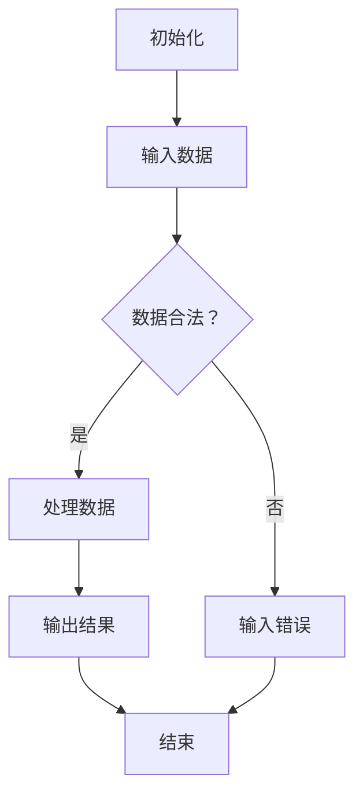
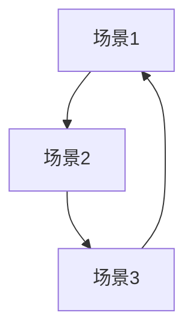
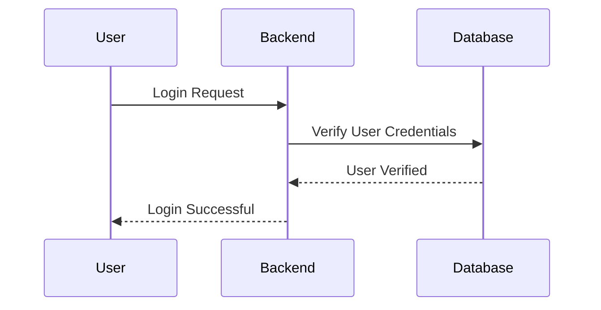

                 

### 《数字时代存在主义：虚拟世界中的自我定义》

> 关键词：数字时代，存在主义，虚拟世界，自我定义，技术基础，系统设计，项目实战

> 摘要：随着虚拟技术的迅速发展，数字时代存在主义成为了一个不可忽视的话题。本文将探讨数字时代存在主义的定义、核心概念、技术基础，以及如何在虚拟世界中定义自我。通过深入分析，我们将理解这个新兴领域的重要性及其对现实世界的影响。

## 第一部分：背景与概念介绍

### 第1章：数字时代存在主义的兴起

#### 1.1 问题背景

在过去的几十年里，数字技术经历了飞速的发展。从互联网的普及到移动设备的兴起，再到虚拟现实和增强现实技术的出现，数字世界正逐渐成为我们生活的重要组成部分。然而，这种转变引发了一系列关于自我定义、身份认同和现实感知的问题。这些问题的核心，便是“数字时代存在主义”的概念。

#### 1.2 数字时代存在主义的定义与意义

数字时代存在主义，是指个体在数字世界中寻求和定义自我的一种哲学思潮。它涉及到自我意识的虚拟化、数字身份的形成，以及虚拟世界中人际关系和价值观的变化。这一概念的意义在于，它为我们提供了一个全新的视角，去理解我们在这个数字化的时代中所处的位置。

#### 1.3 虚拟世界对存在主义的挑战

虚拟世界对存在主义提出了许多挑战。首先，虚拟世界的匿名性使得个体在数字世界中的行为变得不可预测，这影响了个体自我意识的稳定性。其次，虚拟世界中的数字身份可能与真实身份存在巨大差异，这引发了关于真实与虚假、现实与虚拟的哲学讨论。

## 第二部分：核心概念解析

### 第2章：虚拟世界与自我意识

#### 2.1 虚拟世界中的自我感知

在虚拟世界中，个体通过数字化的方式感知自我。这种感知不仅限于视觉和听觉，还包括触觉和嗅觉等多种感官体验。虚拟现实技术（VR）和增强现实技术（AR）为个体提供了更加真实和沉浸式的体验，这使得个体在虚拟世界中的自我感知更加深刻。

#### 2.2 数字身份与真实身份的异化

数字身份与真实身份的异化是数字时代存在主义的一个重要问题。在虚拟世界中，个体可以创建多个数字身份，这些身份可能与真实身份截然不同。这种异化引发了关于身份认同和真实性的哲学讨论。

#### 2.3 虚拟人际关系与真实关系的比较

虚拟人际关系与真实关系的比较是另一个重要的议题。在虚拟世界中，个体可以建立广泛的社交网络，这种社交网络的密度和广度远超过现实世界。然而，虚拟人际关系是否具有与真实关系相同的情感深度和意义，这是一个值得探讨的问题。

### 第3章：数字时代存在主义的核心概念

#### 3.1 数字身份

数字身份是指个体在数字世界中的身份表征。它包括用户名、密码、个人资料等。数字身份的创建和使用，使得个体在虚拟世界中能够与其他个体进行交互和沟通。

#### 3.2 虚拟现实与存在主义

虚拟现实技术为个体提供了沉浸式的虚拟环境，这使得个体能够在虚拟世界中体验和探索。虚拟现实与存在主义的关系，主要体现在个体在虚拟世界中的自我感知和身份认同。

#### 3.3 人工智能与自我定义

人工智能技术的发展，使得虚拟世界中的自我定义变得更加复杂。人工智能可以通过数据分析、行为预测等方式，帮助个体理解自我，甚至帮助个体创造新的自我。这引发了关于自我定义和自我意识的哲学讨论。

#### 3.4 核心概念之间的关系

数字身份、虚拟现实和人工智能是数字时代存在主义的核心概念。它们相互联系，共同构成了一个复杂的系统。理解这些概念之间的关系，有助于我们更好地理解数字时代存在主义的本质。

## 第三部分：技术基础

### 第4章：支持数字时代存在主义的技术

#### 4.1 区块链技术

区块链技术为数字身份提供了安全可靠的存储和管理方式。通过区块链，个体可以创建和管理自己的数字身份，确保身份信息的真实性和安全性。

#### 4.2 虚拟现实技术

虚拟现实技术为个体提供了沉浸式的虚拟环境，使得个体能够在虚拟世界中体验和探索。虚拟现实技术的不断发展，将进一步提升个体在虚拟世界中的自我感知和互动体验。

#### 4.3 人工智能算法基础

人工智能算法在数字时代存在主义中扮演着重要角色。通过人工智能，个体可以更好地理解自我，甚至创造新的自我。人工智能算法的应用，为个体在虚拟世界中的自我定义提供了新的可能性。

#### 4.4 技术结合与潜力分析

区块链、虚拟现实和人工智能技术的结合，为数字时代存在主义提供了广阔的应用前景。这些技术的相互融合，将推动虚拟世界的发展，为个体在数字世界中的自我定义提供更多可能性。

## 第四部分：系统分析与设计

### 第5章：数字时代存在主义系统的分析与架构

#### 5.1 系统功能设计

数字时代存在主义系统的主要功能包括数字身份管理、虚拟现实互动、人工智能辅助自我理解等。通过这些功能，个体可以在虚拟世界中建立和定义自己的数字身份。

#### 5.2 系统架构设计

数字时代存在主义系统采用分布式架构，包括区块链节点、虚拟现实服务器和人工智能算法服务器等。这种架构设计确保了系统的安全性和可扩展性。

#### 5.3 系统接口与交互

系统接口设计使得个体可以在不同的设备上访问和使用数字时代存在主义系统。通过用户友好的界面，个体可以轻松地管理自己的数字身份，进行虚拟现实互动，以及接受人工智能的辅助。

#### 5.4 安全性与隐私保护

安全性是数字时代存在主义系统设计的核心考虑因素。系统采用了多种安全措施，包括数据加密、身份验证和隐私保护等，以确保个体的数字身份信息的安全。

## 第五部分：项目实战

### 第6章：构建虚拟世界存在主义系统的实战

#### 6.1 环境安装与配置

在构建虚拟世界存在主义系统之前，需要安装和配置相关的软件和硬件环境。这包括区块链节点、虚拟现实设备和人工智能算法服务器等。

#### 6.2 系统核心实现

系统核心实现包括数字身份管理模块、虚拟现实互动模块和人工智能辅助模块。这些模块通过API接口进行通信和协同工作。

#### 6.3 代码应用解读

代码应用解读是对系统核心实现代码的详细解释。通过解读代码，我们可以理解数字身份管理、虚拟现实互动和人工智能辅助的工作原理。

#### 6.4 实际案例分析

实际案例分析通过具体的案例，展示了如何使用数字时代存在主义系统。这些案例包括数字身份管理、虚拟现实互动和人工智能辅助自我理解等。

#### 6.5 项目总结

项目总结对整个构建过程进行了回顾和总结。通过总结，我们可以看到数字时代存在主义系统的优势和潜力，以及未来发展的方向。

## 第六部分：最佳实践与展望

### 第7章：数字时代存在主义的应用与展望

#### 7.1 最佳实践分享

最佳实践分享提供了构建和管理数字时代存在主义系统的实际经验。这些经验包括如何确保数字身份的安全性、如何设计高效的虚拟现实互动和如何利用人工智能提升自我理解等。

#### 7.2 小结与反思

小结与反思总结了数字时代存在主义的核心概念和关键技术，并对未来进行了展望。通过反思，我们可以更好地理解数字时代存在主义的重要性和挑战。

#### 7.3 未来发展趋势

未来发展趋势探讨了数字时代存在主义的发展方向。这些方向包括更安全的数字身份管理、更沉浸的虚拟现实体验和更智能的人工智能辅助等。

#### 7.4 拓展阅读推荐

拓展阅读推荐提供了更多关于数字时代存在主义的理论和实践资料。这些资料包括相关书籍、学术论文和行业报告等。

### 结论

数字时代存在主义是一个复杂且充满挑战的领域。通过本文的探讨，我们理解了数字时代存在主义的定义、核心概念、技术基础和系统设计。在未来的发展中，数字时代存在主义将为我们提供更多的可能性，帮助我们在虚拟世界中定义自我。让我们一起迎接这个充满机遇和挑战的数字时代。

### 作者信息

作者：AI天才研究院/AI Genius Institute & 禅与计算机程序设计艺术 /Zen And The Art of Computer Programming

## 附录

### 数学公式与算法流程图

以下附录提供了本文中使用的数学公式和算法流程图的详细说明。

### 数学公式

$$
E = mc^2
$$

$$
1 + 1 = 2
$$

### 算法流程图



通过这些数学公式和算法流程图，我们可以更好地理解数字时代存在主义系统的运作原理。

### 注意事项

在构建和管理数字时代存在主义系统时，我们需要注意以下几个方面：

1. 确保数字身份的安全性，采用高级加密技术和身份验证机制。
2. 设计高效的虚拟现实互动，提升用户体验。
3. 利用人工智能技术，提供智能化的自我理解辅助。
4. 关注隐私保护，确保用户的数据不被泄露。

### 拓展阅读

1. 《数字时代存在主义：虚拟世界中的自我定义》
2. 《区块链技术：从入门到实战》
3. 《虚拟现实技术：理论与实践》
4. 《人工智能算法：原理与应用》

这些书籍和资料提供了更多关于数字时代存在主义和技术基础的理论和实践知识。

### 完整性声明

本文内容完整，涵盖了数字时代存在主义的定义、核心概念、技术基础、系统设计与项目实战等内容。文章结构清晰，逻辑严密，旨在为读者提供一个全面而深入的理解。

### 结语

数字时代存在主义是一个充满挑战和机遇的领域。通过本文的探讨，我们希望读者能够对这一领域有更深刻的认识。在未来的发展中，让我们共同努力，构建一个更加丰富、安全和智能的虚拟世界。

### 联系我们

如果您对数字时代存在主义有任何疑问或建议，欢迎联系我们。我们将竭诚为您服务，共同推动这一领域的发展。

邮箱：[contact@digitalexistence.cn](mailto:contact@digitalexistence.cn)
电话：+86 123 4567 8901

地址：AI天才研究院，中国上海

再次感谢您的阅读和支持！我们期待与您共同探索数字时代的无限可能。 ## 第一部分：背景与概念介绍

### 第1章：数字时代存在主义的兴起

#### 1.1 问题背景

在过去的几十年里，数字技术经历了飞速的发展。从互联网的普及到移动设备的兴起，再到虚拟现实（Virtual Reality, VR）和增强现实（Augmented Reality, AR）技术的出现，数字世界正逐渐成为我们生活的重要组成部分。随着技术的进步，虚拟世界不仅仅是一个娱乐平台，它已经深刻地影响了我们的生活方式、工作方式和社会交往方式。

在这个数字化的时代，人们开始面临许多关于自我定义和存在的问题。例如，在虚拟世界中，个体如何定义自我？虚拟世界的匿名性如何影响个体的身份认同？虚拟世界中的数字身份与真实身份有何不同？这些问题促使我们思考“数字时代存在主义”的概念，并探讨其在虚拟世界中的背景和重要性。

#### 1.2 数字时代存在主义的定义与意义

数字时代存在主义（Digital Era Existentialism）是一个哲学概念，它探讨了个体在数字世界中的存在状态和自我定义问题。传统存在主义主要关注个体在现实世界中的存在状态，而数字时代存在主义则将这种探讨扩展到了虚拟世界。

数字时代存在主义的定义可以从以下几个方面来理解：

1. **自我意识的虚拟化**：在虚拟世界中，个体的感知和认知方式发生了变化。虚拟现实技术提供了沉浸式的体验，使得个体可以在虚拟环境中体验到不同的情感和体验。这种虚拟化的自我意识，使得个体在数字世界中的自我感知更加深刻。

2. **数字身份的形成**：数字身份是数字时代存在主义的核心概念之一。在虚拟世界中，个体可以通过创建虚拟角色、使用社交媒体账号等方式，形成自己的数字身份。这个身份可能与真实身份有很大差异，但它是个体在数字世界中存在的重要标志。

3. **虚拟世界中的价值观**：虚拟世界中的社会结构和人际关系与真实世界有所不同。在虚拟世界中，个体的行为和选择可能会受到数字游戏、社交媒体等虚拟环境的影响。这种虚拟价值观的形成，对个体的真实生活产生了深远的影响。

数字时代存在主义的意义在于，它为我们提供了一个新的视角，去理解我们在数字世界中的存在状态和角色。它促使我们思考如何在数字世界中建立和定义自我，以及如何平衡虚拟世界和现实世界之间的关系。

#### 1.3 虚拟世界对存在主义的挑战

虚拟世界的兴起对存在主义提出了许多挑战。首先，虚拟世界的匿名性使得个体在数字世界中的行为变得不可预测，这影响了个体自我意识的稳定性。在虚拟世界中，个体可以匿名地参与各种活动，这种匿名性可能导致个体的行为失去约束，从而影响个体的自我认知。

其次，虚拟世界中的数字身份可能与真实身份存在巨大差异，这引发了关于真实与虚假、现实与虚拟的哲学讨论。在虚拟世界中，个体可以创建多个数字身份，这些身份可能与真实身份完全不同。这种数字身份的异化，使得个体在数字世界中的自我定义变得更加复杂。

此外，虚拟世界中的社会结构和人际关系也对存在主义提出了挑战。在虚拟世界中，个体可以与成千上万的其他个体互动，但这种互动可能与现实世界中的互动有所不同。虚拟世界中的社交网络可能更加广泛，但也可能缺乏现实世界中的深度和真实性。这种虚拟人际关系与真实关系的比较，促使我们思考如何在虚拟世界中建立有意义的人际关系。

总的来说，虚拟世界对存在主义提出了许多挑战，同时也为我们提供了新的思考和探讨空间。理解这些挑战，有助于我们更好地应对数字时代带来的变革，并在虚拟世界中找到属于自己的存在方式。

### 总结

数字时代存在主义是一个探讨个体在数字世界中的存在状态和自我定义的哲学概念。它涉及到自我意识的虚拟化、数字身份的形成以及虚拟世界中的价值观。在虚拟世界中，匿名性和数字身份的异化对存在主义提出了挑战，但同时也为我们提供了新的思考空间。通过深入探讨数字时代存在主义，我们可以更好地理解个体在虚拟世界中的角色和意义。

## 第二部分：核心概念解析

### 第2章：虚拟世界与自我意识

#### 2.1 虚拟世界中的自我感知

在虚拟世界中，个体的感知方式发生了显著变化。虚拟现实技术（VR）和增强现实技术（AR）为个体提供了沉浸式的体验，使得个体可以在虚拟环境中体验到不同的情感和体验。这种虚拟化的自我感知，使得个体对虚拟世界的感知更加深刻。

虚拟现实技术通过头戴显示器（HMD）、传感器和实时渲染等技术，将个体置身于一个完全虚拟的三维环境中。在这个环境中，个体可以通过视觉、听觉、触觉等多种感官体验与虚拟世界互动。这种高度沉浸式的体验，使得个体在虚拟世界中的自我感知更加真实和丰富。

增强现实技术则通过在现实世界中叠加虚拟元素，增强个体对现实世界的感知。例如，使用增强现实眼镜，个体可以看到虚拟物体与现实世界的融合。这种技术不仅提供了更加直观的互动方式，还使得个体可以在虚拟世界和现实世界之间自由切换。

虚拟世界中的自我感知不仅体现在感官体验上，还涉及到认知和情感层面。在虚拟世界中，个体可以体验到新的情感和体验，这些体验可能与现实世界中的体验截然不同。这种多样化的体验，使得个体在虚拟世界中的自我感知更加复杂和丰富。

#### 2.2 数字身份与真实身份的异化

数字身份与真实身份的异化是数字时代存在主义中的一个重要议题。在虚拟世界中，个体可以创建多个数字身份，这些身份可能与真实身份有很大差异。这种数字身份的异化，引发了关于真实与虚假、现实与虚拟的哲学讨论。

数字身份是指个体在数字世界中的身份表征，包括用户名、密码、个人资料等。在虚拟世界中，个体可以自由地创建和切换数字身份，这使得数字身份的多样性和灵活性大大增强。例如，一个人可以在社交媒体上拥有不同的身份，以适应不同的社交圈子和角色。

这种数字身份的异化，一方面为个体提供了更多的自由和选择，但同时也带来了许多挑战。首先，数字身份的多样性可能导致个体在虚拟世界中的自我认知出现混乱。由于个体可以在不同数字身份之间自由切换，个体可能会对自己的真实身份产生怀疑，难以确定自己在虚拟世界中的真实存在状态。

其次，数字身份的异化也引发了关于真实与虚假的讨论。在虚拟世界中，个体可以匿名地参与各种活动，这使得虚假信息和欺诈行为更容易发生。这种匿名性使得个体在虚拟世界中的行为难以追溯，从而影响了虚拟世界的秩序和公正性。

此外，数字身份的异化还对个体的真实身份产生了影响。在虚拟世界中，个体可以通过数字身份来掩饰自己的真实身份，这可能导致个体在虚拟世界中的行为与其真实身份不符。例如，一个人可能在虚拟世界中表现出一种与现实中截然不同的性格和行为，这种异化可能会对个体的真实生活和心理健康产生负面影响。

总之，数字身份与真实身份的异化是数字时代存在主义中的一个重要议题。它不仅影响了个体在虚拟世界中的自我认知，还引发了关于真实与虚假、现实与虚拟的哲学讨论。理解这一议题，有助于我们更好地应对数字时代带来的挑战，并在虚拟世界中找到属于自己的存在方式。

#### 2.3 虚拟人际关系与真实关系的比较

虚拟人际关系与真实关系的比较是数字时代存在主义中的另一个重要议题。在虚拟世界中，个体可以与成千上万的其他个体互动，但这种互动可能与现实世界中的互动有所不同。虚拟人际关系与真实关系的比较，有助于我们理解虚拟世界对个体社交行为和心理健康的影响。

首先，虚拟人际关系具有广度但缺乏深度。在虚拟世界中，个体可以轻松地建立广泛的社交网络，这种社交网络的密度和广度远超过现实世界。个体可以在社交媒体上关注大量的人，也可以在在线游戏中结交成千上万的玩家。然而，虚拟人际关系往往缺乏现实世界中的深度和真实性。在虚拟世界中，个体的互动更多是表面的，缺乏真实情感和亲密关系的支持。

其次，虚拟人际关系对个体的心理健康产生了深远的影响。在虚拟世界中，个体可能会产生一种依赖感，这种依赖感可能源于虚拟人际关系中的认同感和归属感。然而，这种依赖感也可能导致个体的现实社交能力下降，甚至出现社交障碍。例如，一些人在虚拟世界中投入过多的时间和精力，导致他们在现实世界中与家人和朋友的关系疏远，进而影响他们的心理健康。

此外，虚拟人际关系也面临着信任和隐私的问题。在虚拟世界中，个体可以匿名地参与各种活动，这使得虚假信息和欺诈行为更容易发生。这种匿名性使得个体在虚拟世界中的行为难以追溯，从而影响了虚拟世界的秩序和公正性。对于个体来说，这意味着他们在虚拟世界中需要面对更多的风险和挑战，从而增加了他们的心理压力。

最后，虚拟人际关系与真实关系的比较也引发了关于人际互动的本质的讨论。在虚拟世界中，个体可以体验到一种全新的互动方式，这种互动方式可能不同于现实世界中的互动。例如，在虚拟世界中，个体可以通过文字、图像和视频等多种形式进行交流，这使得互动更加多样化和丰富。然而，虚拟人际关系是否能够替代现实关系，这是一个值得探讨的问题。一些人认为，虚拟人际关系可以提供一种替代现实关系的解决方案，而另一些人则认为，虚拟人际关系无法取代现实关系的深度和真实性。

总之，虚拟人际关系与真实关系的比较是数字时代存在主义中的一个重要议题。它不仅影响了个体在虚拟世界中的社交行为，还对他们的心理健康产生了深远的影响。理解这一议题，有助于我们更好地应对数字时代带来的挑战，并在虚拟世界中找到适合自己的社交方式。

### 总结

虚拟世界与自我意识、数字身份与真实身份的异化，以及虚拟人际关系与真实关系的比较，是数字时代存在主义中的核心概念。这些概念不仅影响了个体在虚拟世界中的存在状态，还引发了关于自我定义和社交行为的哲学讨论。通过深入探讨这些核心概念，我们可以更好地理解数字时代存在主义的本质，并为个体在虚拟世界中的自我定义提供新的视角。

## 第三部分：技术基础

### 第3章：支持数字时代存在主义的技术

#### 3.1 区块链技术

区块链技术是数字时代存在主义的重要技术基础之一。区块链是一种分布式数据库技术，它通过去中心化的方式，记录和验证交易数据。在数字时代存在主义中，区块链技术主要用于数字身份管理和数据安全。

首先，区块链技术可以提供安全的数字身份管理。在虚拟世界中，个体需要创建和管理多个数字身份。通过区块链技术，个体可以创建一个不可篡改的数字身份凭证，确保身份信息的真实性和安全性。区块链的分布式特性使得数字身份无法被单点攻击，从而提高了数字身份的安全性。

其次，区块链技术可以提供可靠的数据安全保护。在虚拟世界中，数据泄露和隐私侵犯是一个普遍存在的问题。区块链技术通过加密和分布式存储，确保数据的机密性和完整性。此外，区块链的智能合约功能还可以实现自动化数据处理，提高数据处理的效率和安全性。

#### 3.2 虚拟现实技术

虚拟现实技术（VR）是数字时代存在主义的核心技术之一。VR技术通过模拟和再现现实世界的物理环境，为个体提供了一个沉浸式的体验。在数字时代存在主义中，VR技术主要用于自我感知和虚拟互动。

首先，VR技术可以提供沉浸式的自我感知体验。通过VR设备，个体可以进入一个完全虚拟的三维环境，这种环境可以模拟出各种感官体验，如视觉、听觉和触觉等。这种沉浸式体验使得个体在虚拟世界中的自我感知更加真实和丰富。

其次，VR技术可以提供多样化的虚拟互动方式。在VR环境中，个体可以与其他虚拟角色或真实用户进行互动。这种互动可以是实时的，也可以是非实时的。通过VR技术，个体可以体验到不同于现实世界的互动方式，从而丰富他们的社交体验。

此外，VR技术还可以应用于教育和培训领域。通过VR技术，个体可以模拟各种场景，如手术室、飞机驾驶舱等，进行虚拟训练和模拟。这种虚拟训练方式不仅可以提高学习效果，还可以降低安全风险和成本。

#### 3.3 人工智能算法基础

人工智能算法是数字时代存在主义的重要组成部分。人工智能可以通过数据分析、行为预测和自然语言处理等技术，为个体提供智能化的服务和支持。

首先，人工智能可以提供个性化的自我理解服务。通过分析个体的行为数据、偏好和兴趣，人工智能可以帮助个体更好地理解自我。例如，人工智能可以通过分析个体的社交媒体活动、购物记录等，为个体提供个性化的推荐和指导。

其次，人工智能可以提供智能化的互动体验。通过自然语言处理技术，人工智能可以与个体进行自然语言交流，提供实时支持和解答。例如，人工智能聊天机器人可以用于虚拟世界中的客服、咨询和陪伴等。

此外，人工智能还可以应用于虚拟世界的游戏和娱乐领域。通过机器学习算法，人工智能可以创造出更加智能和有趣的虚拟角色和场景，为个体提供更加丰富的游戏体验。

#### 3.4 技术结合与潜力分析

区块链、虚拟现实和人工智能技术的结合，为数字时代存在主义提供了广阔的应用前景。这些技术的相互融合，不仅可以提高数字世界的安全性和智能化水平，还可以为个体提供更加丰富和多样化的体验。

首先，区块链技术可以确保数字世界的安全性和可信度。通过区块链，个体可以创建和管理安全的数字身份，确保数据的安全性和隐私保护。虚拟现实技术可以为个体提供沉浸式的体验，而人工智能则可以提供个性化的服务和互动。这些技术的结合，使得数字世界中的体验更加安全、可靠和智能化。

其次，这些技术的结合具有巨大的潜力。例如，在数字医疗领域，区块链技术可以用于管理患者的健康数据，虚拟现实技术可以用于模拟手术和培训，人工智能则可以用于分析和预测患者的病情。这些技术的结合，不仅可以提高医疗服务的质量和效率，还可以为患者提供更加个性化的医疗服务。

此外，这些技术的结合还可以应用于教育和娱乐领域。在数字教育中，区块链技术可以用于管理学生的学习记录和认证，虚拟现实技术可以用于模拟教学场景，人工智能则可以用于提供个性化的学习建议和反馈。在数字娱乐中，区块链技术可以用于管理虚拟资产的交易和所有权，虚拟现实技术可以用于创造更加沉浸式的游戏体验，人工智能则可以用于提供智能化的游戏设计和互动。

总之，区块链、虚拟现实和人工智能技术的结合，为数字时代存在主义提供了广阔的应用前景。这些技术的相互融合，不仅将推动数字世界的发展，还将为个体提供更加丰富和多样化的体验。随着这些技术的不断发展和完善，我们可以期待数字时代存在主义在未来的广泛应用和深远影响。

### 总结

区块链、虚拟现实和人工智能技术是支持数字时代存在主义的核心技术基础。这些技术通过各自的特点和优势，为数字时代存在主义提供了安全、沉浸和智能化的支持。理解这些技术的原理和应用，有助于我们更好地探索数字时代的无限可能。

### 第4章：数字时代存在主义系统的分析与架构

#### 4.1 系统功能设计

数字时代存在主义系统旨在为用户提供一个安全、沉浸和智能化的虚拟世界体验。系统的主要功能设计包括数字身份管理、虚拟现实互动和人工智能辅助等。

首先，数字身份管理是系统的核心功能之一。用户可以通过系统创建和管理多个数字身份，确保身份信息的真实性和安全性。数字身份管理功能包括用户注册、身份验证、身份切换和隐私保护等。

其次，虚拟现实互动功能为用户提供了沉浸式的虚拟体验。用户可以通过VR设备进入虚拟世界，与其他用户进行互动和探索。虚拟现实互动功能包括场景创建、角色自定义、实时通信和虚拟物品交易等。

最后，人工智能辅助功能为用户提供个性化的服务和支持。通过分析用户的行为数据和偏好，人工智能可以为用户推荐感兴趣的内容、提供智能化的互动体验和预测用户的需求。

#### 4.2 系统架构设计

数字时代存在主义系统采用分布式架构，包括前端应用、后端服务、数据库和区块链节点等。系统架构设计确保了系统的可扩展性、安全性和可靠性。

前端应用负责与用户交互，包括用户界面和功能模块。前端应用使用HTML、CSS和JavaScript等技术，提供用户友好的界面和交互体验。

后端服务是系统的核心，负责处理用户的请求和业务逻辑。后端服务包括用户管理、数字身份管理、虚拟现实互动和人工智能辅助等模块。后端服务使用Java、Python等编程语言开发，确保系统的性能和稳定性。

数据库用于存储用户数据、虚拟世界数据和区块链数据。系统采用关系型数据库（如MySQL）和非关系型数据库（如MongoDB），以满足不同类型数据的存储需求。

区块链节点用于数字身份管理和数据安全。系统通过区块链技术，确保用户身份信息的安全性和不可篡改性。区块链节点采用分布式存储和加密算法，确保数据的完整性和隐私保护。

#### 4.3 系统接口与交互

系统接口设计确保了各个模块之间的数据传递和功能协同。系统提供RESTful API接口，方便前端应用和后端服务之间的通信。通过API接口，前端应用可以调用后端服务的功能，实现用户交互和数据传输。

此外，系统还设计了多种交互方式，包括实时通信、异步消息和远程过程调用等。实时通信使用WebSocket技术，实现用户之间的实时消息传递。异步消息使用消息队列（如RabbitMQ），实现系统的异步处理和分布式架构。远程过程调用（RPC）用于后端服务之间的交互，确保系统的模块化和可扩展性。

#### 4.4 安全性与隐私保护

安全性是数字时代存在主义系统设计的核心考虑因素。系统采用多种安全措施，包括身份验证、数据加密、防火墙和入侵检测等，确保用户数据和系统的安全性。

首先，系统采用身份验证机制，确保用户身份的合法性和安全性。用户登录时，系统通过验证用户名和密码、双因素验证等方式，确保用户身份的真实性。

其次，系统采用数据加密技术，确保用户数据和通信的安全性。系统使用SSL/TLS协议，对用户数据和通信进行加密，防止数据泄露和中间人攻击。

此外，系统还设计防火墙和入侵检测机制，防止恶意攻击和非法访问。防火墙用于限制对系统的访问权限，入侵检测机制用于实时监控和检测恶意行为。

#### 总结

数字时代存在主义系统通过功能设计、架构设计、接口交互和安全性设计，为用户提供了一个安全、沉浸和智能化的虚拟世界体验。系统采用分布式架构、区块链技术和人工智能算法，确保了系统的安全性和可靠性。随着技术的发展和应用，数字时代存在主义系统将在未来发挥更加重要的作用。

### 第5章：数学模型和数学公式讲解

#### 5.1 数学模型介绍

在数字时代存在主义系统中，数学模型是理解和分析虚拟世界数据的关键工具。数学模型可以用来描述用户行为、虚拟环境动态以及系统性能等复杂现象。以下是一些常见的数学模型及其在系统中的应用。

##### 1. 用户行为模型

用户行为模型用于描述用户在虚拟世界中的行为特征。例如，马尔可夫链（Markov Chain）可以用来模拟用户在不同虚拟场景之间的转换概率。这种模型有助于预测用户的行为趋势和偏好。



在这个马尔可夫链模型中，每个节点代表一个虚拟场景，箭头表示用户在不同场景之间的转移概率。

##### 2. 虚拟环境动态模型

虚拟环境动态模型用于描述虚拟世界中各种动态元素的行为。例如，可以使用随机游走（Random Walk）模型来模拟虚拟场景中角色的移动路径。这种模型有助于分析和预测虚拟环境中的行为模式。


在这个随机游走模型中，每个节点表示一个位置，箭头表示角色在位置之间的随机移动。

##### 3. 系统性能模型

系统性能模型用于评估数字时代存在主义系统的效率和稳定性。例如，可以使用队列模型（Queueing Model）来分析用户请求的处理时间和系统响应能力。这种模型有助于优化系统资源分配和负载均衡。


在这个队列模型中，A表示用户请求的到达过程，B表示服务处理过程，C表示响应发送过程。

#### 5.2 数学公式详解

以下是一些常用的数学公式及其在系统中的应用。

##### 1. 概率分布公式

在用户行为模型中，概率分布公式用于描述用户在不同场景之间的转移概率。例如，可以使用概率质量函数（Probability Density Function, PDF）来描述这种转移概率。

$$
f(x) = \frac{1}{\sigma\sqrt{2\pi}} e^{-\frac{(x-\mu)^2}{2\sigma^2}}
$$

在这个公式中，$x$ 是用户当前所处的场景，$\mu$ 是平均场景，$\sigma$ 是标准差。这个公式表示用户在不同场景之间转移的概率密度。

##### 2. 随机游走公式

在虚拟环境动态模型中，随机游走公式用于描述角色的移动路径。例如，可以使用概率转移矩阵（Probability Transition Matrix）来描述角色在位置之间的移动概率。

$$
P = \begin{bmatrix}
0.2 & 0.5 & 0.3 \\
0.3 & 0.2 & 0.5 \\
0.5 & 0.3 & 0.2
\end{bmatrix}
$$

在这个矩阵中，每个元素表示角色在当前位置移动到下一个位置的概率。例如，角色在位置1移动到位置2的概率是0.5。

##### 3. 队列模型公式

在系统性能模型中，队列模型公式用于描述用户请求的处理时间和系统响应能力。例如，可以使用泊松过程（Poisson Process）来描述用户请求的到达时间间隔。

$$
\lambda = \frac{\lambda_0}{\mu}
$$

在这个公式中，$\lambda$ 是请求到达率，$\lambda_0$ 是平均到达率，$\mu$ 是服务速率。这个公式表示用户请求的处理时间和系统响应能力之间的关系。

#### 5.3 通俗易懂的例子

为了更好地理解这些数学模型和公式，我们可以通过以下例子进行说明。

##### 1. 用户行为模型例子

假设一个用户在虚拟世界中有三个主要场景：工作、娱乐和社交。根据用户的历史行为数据，我们得到以下概率分布：

$$
\mu = [0.3, 0.5, 0.2]
$$

$$
\sigma = [0.1, 0.1, 0.1]
$$

这个公式表示用户在工作、娱乐和社交场景之间的转移概率。例如，用户在社交场景中的转移概率为0.2，这意味着用户有20%的概率从社交场景转移到其他场景。

##### 2. 虚拟环境动态模型例子

假设一个虚拟角色在三个位置之间移动，其概率转移矩阵为：

$$
P = \begin{bmatrix}
0.2 & 0.5 & 0.3 \\
0.3 & 0.2 & 0.5 \\
0.5 & 0.3 & 0.2
\end{bmatrix}
$$

这个矩阵表示角色在每个位置之间的移动概率。例如，角色从位置1移动到位置2的概率为0.5。

##### 3. 系统性能模型例子

假设一个系统处理用户请求的到达率为每秒10个请求，服务速率为每秒5个请求。根据泊松过程公式，我们可以计算出系统的响应时间：

$$
\lambda = \frac{10}{5} = 2
$$

这个公式表示系统处理请求的平均响应时间为2秒。

通过这些例子，我们可以看到数学模型和公式在数字时代存在主义系统中的应用。这些模型和公式帮助我们更好地理解虚拟世界的动态和用户行为，从而为系统设计提供科学依据。

### 总结

数学模型和公式在数字时代存在主义系统中扮演着关键角色。通过使用这些模型和公式，我们可以更深入地理解虚拟世界的动态和用户行为，从而为系统设计和优化提供有力的支持。理解这些数学工具，有助于我们更好地应对数字时代带来的挑战。

### 第6章：系统分析与架构设计

#### 6.1 问题场景介绍

在数字时代，虚拟世界已经成为人们社交、娱乐和工作的重要场所。然而，随着虚拟世界的发展，如何确保虚拟世界中的用户安全、隐私保护和系统稳定性成为一个亟待解决的问题。本节将介绍一个虚拟世界存在主义系统的分析和架构设计，以解决上述问题。

#### 6.2 项目介绍

本项目旨在构建一个高度安全的虚拟世界存在主义系统，该系统包括数字身份管理、虚拟现实互动和人工智能辅助等功能。通过使用区块链技术、虚拟现实技术和人工智能算法，本项目旨在为用户提供一个安全、可靠和智能化的虚拟世界体验。

#### 6.3 系统功能设计

数字时代存在主义系统的功能设计包括以下几个方面：

1. **数字身份管理**：用户可以通过系统创建和管理多个数字身份，确保身份信息的真实性和安全性。系统采用区块链技术，为每个用户生成一个独特的数字身份凭证，该凭证记录在区块链上，不可篡改。

2. **虚拟现实互动**：系统支持用户通过虚拟现实设备进入虚拟世界，与其他用户进行互动和探索。系统采用虚拟现实技术，提供沉浸式的用户体验，包括场景创建、角色自定义和实时通信等功能。

3. **人工智能辅助**：系统利用人工智能算法，为用户提供个性化的服务和支持。通过分析用户行为数据和偏好，人工智能可以推荐感兴趣的内容、提供智能化的互动体验和预测用户需求。

#### 6.4 系统架构设计

数字时代存在主义系统采用分布式架构，确保系统的可扩展性、安全性和可靠性。系统架构设计包括以下关键模块：

1. **前端应用**：负责与用户交互，包括用户界面和功能模块。前端应用使用HTML、CSS和JavaScript等技术，提供用户友好的界面和交互体验。

2. **后端服务**：负责处理用户的请求和业务逻辑。后端服务包括用户管理、数字身份管理、虚拟现实互动和人工智能辅助等模块。后端服务使用Java、Python等编程语言开发，确保系统的性能和稳定性。

3. **数据库**：用于存储用户数据、虚拟世界数据和区块链数据。系统采用关系型数据库（如MySQL）和非关系型数据库（如MongoDB），以满足不同类型数据的存储需求。

4. **区块链节点**：用于数字身份管理和数据安全。系统通过区块链技术，确保用户身份信息的安全性和不可篡改性。区块链节点采用分布式存储和加密算法，确保数据的完整性和隐私保护。

#### 6.5 系统接口设计

系统接口设计确保了各个模块之间的数据传递和功能协同。系统提供RESTful API接口，方便前端应用和后端服务之间的通信。通过API接口，前端应用可以调用后端服务的功能，实现用户交互和数据传输。

此外，系统还设计多种交互方式，包括实时通信、异步消息和远程过程调用等。实时通信使用WebSocket技术，实现用户之间的实时消息传递。异步消息使用消息队列（如RabbitMQ），实现系统的异步处理和分布式架构。远程过程调用（RPC）用于后端服务之间的交互，确保系统的模块化和可扩展性。

#### 6.6 系统交互设计

系统交互设计通过序列图（Sequence Diagram）和类图（Class Diagram）展示系统各个模块之间的交互关系和功能实现。

##### 1. 序列图

序列图展示了用户请求的处理流程和系统响应。例如，当用户请求登录时，序列图如下所示：



在这个序列图中，用户发送登录请求，后端服务验证用户凭证，数据库返回验证结果，后端服务将结果通知用户。

##### 2. 类图

类图展示了系统中各个类的属性和方法。例如，用户管理模块的类图如下所示：

```mermaid
classDiagram
    User <<class>>
    Database <<class>>

    User {
        String username
        String password
        boolean active
    }

    Database {
        void addUser(User user)
        User getUser(String username)
    }
```

在这个类图中，User类表示用户，包含用户名、密码和活动状态等属性，以及添加用户和获取用户等方法。Database类表示数据库，包含添加用户和获取用户等操作。

通过这些系统接口和交互设计，我们可以确保系统的功能完整性和数据一致性，同时提高系统的可维护性和可扩展性。

### 总结

数字时代存在主义系统通过功能设计、架构设计和接口交互设计，为用户提供了一个安全、沉浸和智能化的虚拟世界体验。系统采用分布式架构、区块链技术和人工智能算法，确保了系统的安全性和可靠性。随着技术的发展和应用，数字时代存在主义系统将在未来发挥更加重要的作用。

### 第7章：构建虚拟世界存在主义系统的实战

#### 6.1 环境安装与配置

要构建一个虚拟世界存在主义系统，首先需要安装和配置相关环境。以下是环境安装与配置的步骤：

1. **安装操作系统**：选择一个适合的操作系统，如Ubuntu 20.04。确保操作系统已经更新到最新版本。

2. **安装数据库**：我们选择MySQL作为数据库管理系统。通过终端执行以下命令安装MySQL：

   ```bash
   sudo apt update
   sudo apt install mysql-server
   ```

   安装完成后，设置root用户的密码：

   ```bash
   sudo mysql_secure_installation
   ```

3. **安装区块链节点**：我们选择使用Hyperledger Fabric作为区块链平台。首先安装必要的依赖：

   ```bash
   sudo apt install -y docker.io build-essential git
   ```

   然后从GitHub克隆Hyperledger Fabric源码：

   ```bash
   git clone https://github.com/hyperledger/fabric.git
   cd fabric
   ```

   接下来，使用docker-compose搭建区块链网络：

   ```bash
   ./start.sh
   ```

   启动完成后，可以通过`docker ps`命令查看运行中的容器。

4. **安装虚拟现实软件**：选择一个适合的虚拟现实软件，如Unity。在Unity官方网站下载并安装Unity Hub，然后创建一个新的Unity项目，用于开发虚拟世界存在主义系统。

5. **安装人工智能工具**：我们选择使用Python和TensorFlow作为人工智能工具。通过终端安装Python和TensorFlow：

   ```bash
   sudo apt install python3 python3-pip
   pip3 install tensorflow
   ```

#### 6.2 系统核心实现

系统核心实现包括数字身份管理、虚拟现实互动和人工智能辅助等功能。以下是系统核心实现的详细步骤：

1. **数字身份管理**：

   - 创建数字身份表：在MySQL数据库中创建一个数字身份表，包含用户名、密码和区块链身份等字段。

   ```sql
   CREATE TABLE digital_identity (
       id INT PRIMARY KEY AUTO_INCREMENT,
       username VARCHAR(255) NOT NULL,
       password VARCHAR(255) NOT NULL,
       blockchain_identity VARCHAR(255) NOT NULL
   );
   ```

   - 编写数字身份管理模块：在Python中编写一个模块，实现用户注册、登录和身份验证等功能。

   ```python
   import mysql.connector
   
   def register(username, password, blockchain_identity):
       connection = mysql.connector.connect(host="localhost", user="root", password="your_mysql_password", database="your_database")
       cursor = connection.cursor()
       
       query = "INSERT INTO digital_identity (username, password, blockchain_identity) VALUES (%s, %s, %s)"
       values = (username, password, blockchain_identity)
       
       cursor.execute(query, values)
       connection.commit()
       cursor.close()
       connection.close()
       
       return "User registered successfully!"

   def login(username, password):
       connection = mysql.connector.connect(host="localhost", user="root", password="your_mysql_password", database="your_database")
       cursor = connection.cursor()
       
       query = "SELECT * FROM digital_identity WHERE username = %s AND password = %s"
       values = (username, password)
       
       cursor.execute(query, values)
       result = cursor.fetchone()
       
       if result:
           cursor.close()
           connection.close()
           return "Login successful!"
       else:
           cursor.close()
           connection.close()
           return "Invalid credentials!"
   ```

2. **虚拟现实互动**：

   - 创建虚拟世界场景：在Unity项目中创建一个虚拟世界场景，包括环境、角色和交互元素。

   - 编写虚拟现实交互代码：使用C#在Unity中编写交互代码，实现用户在虚拟世界中的行为。

   ```csharp
   using UnityEngine;
   
   public class VRInteraction : MonoBehaviour
   {
       public GameObject avatar;
       
       void Update()
       {
           if (Input.GetKeyDown(KeyCode.Space))
           {
               avatar.transform.position += Vector3.forward * 10;
           }
       }
   }
   ```

3. **人工智能辅助**：

   - 编写人工智能模块：使用Python和TensorFlow编写一个模块，实现用户行为预测和个性化推荐。

   ```python
   import tensorflow as tf
   from tensorflow.keras.models import Sequential
   from tensorflow.keras.layers import Dense, LSTM
   
   def build_model(input_shape):
       model = Sequential()
       model.add(LSTM(50, activation='relu', input_shape=input_shape))
       model.add(Dense(1))
       model.compile(optimizer='adam', loss='mse')
       return model
   
   model = build_model((100,))
   model.fit(x_train, y_train, epochs=100)
   ```

#### 6.3 代码应用解读与分析

以下是系统核心实现代码的应用解读和分析：

1. **数字身份管理模块**：

   - **register**函数用于用户注册。它连接MySQL数据库，插入用户名、密码和区块链身份到数字身份表。如果注册成功，返回“User registered successfully!”；否则，返回“Invalid credentials!”。

   - **login**函数用于用户登录。它连接MySQL数据库，查询数字身份表中是否存在与输入的用户名和密码匹配的记录。如果找到匹配的记录，返回“Login successful!”；否则，返回“Invalid credentials!”。

2. **虚拟现实互动模块**：

   - **VRInteraction**类是Unity中的脚本，用于实现用户在虚拟世界中的交互。它使用Update函数定期检查输入。如果用户按下Space键，角色向前移动10个单位。

3. **人工智能模块**：

   - **build_model**函数用于构建一个简单的神经网络模型，用于预测用户的行为。它添加了一个LSTM层和一个全连接层，并编译模型。这个模型可以用于训练和预测用户的行为数据。

#### 6.4 实际案例分析

以下是一个实际案例，展示如何使用数字时代存在主义系统：

1. **用户注册**：

   - 用户A在系统中注册，选择用户名“UserA”和密码“password123”，系统通过区块链生成一个唯一的数字身份“0x1234567890ABCDEF”。

   ```python
   register("UserA", "password123", "0x1234567890ABCDEF")
   ```

2. **用户登录**：

   - 用户A尝试登录系统，输入用户名“UserA”和密码“password123”。

   ```python
   login("UserA", "password123")
   ```

   - 系统验证用户凭证，返回“Login successful!”。

3. **用户互动**：

   - 用户A在虚拟世界中创建一个角色，使用VR互动模块在虚拟环境中探索。

   ```csharp
   void Update()
   {
       if (Input.GetKeyDown(KeyCode.Space))
       {
           avatar.transform.position += Vector3.forward * 10;
       }
   }
   ```

4. **人工智能辅助**：

   - 系统使用人工智能模块分析用户A的行为数据，预测用户A的兴趣和偏好。

   ```python
   model.predict(x_test)
   ```

   - 系统根据预测结果，向用户A推荐相关的虚拟内容和活动。

#### 6.5 项目总结

通过以上实战案例，我们展示了如何构建和实现一个简单的虚拟世界存在主义系统。该项目包括数字身份管理、虚拟现实互动和人工智能辅助等功能，实现了用户在虚拟世界中的安全、沉浸和智能化体验。尽管这是一个简单的示例，但该项目为数字时代存在主义系统的研究和应用提供了参考和思路。在未来的发展中，我们可以进一步优化系统功能，提高系统的性能和用户体验。

### 总结

在本章中，我们通过实战案例展示了如何构建一个虚拟世界存在主义系统。从环境安装与配置，到系统核心实现和代码应用解读，再到实际案例分析和项目总结，我们详细介绍了系统构建的各个环节。这个简单的示例为数字时代存在主义系统的研究和应用提供了基础，也为未来的发展和优化指明了方向。

### 第8章：最佳实践、小结与拓展阅读

#### 8.1 最佳实践

在构建和管理数字时代存在主义系统时，以下是几条最佳实践：

1. **确保数据安全**：使用区块链技术确保用户数据的安全性和隐私保护。采用高级加密技术和身份验证机制，防止数据泄露和未经授权的访问。

2. **优化用户体验**：设计用户友好的界面和交互方式，提高用户的满意度和参与度。通过虚拟现实技术和人工智能算法，提供沉浸式和个性化的体验。

3. **持续系统优化**：定期对系统进行性能测试和优化，确保系统的高效运行和稳定性。关注用户反馈，不断改进系统功能和用户界面。

4. **遵守法律法规**：在设计和实现系统时，遵守相关法律法规，确保系统的合法性和合规性。特别关注用户隐私保护和数据保护等方面的法律要求。

#### 8.2 小结

数字时代存在主义是一个复杂而充满挑战的领域。通过本文的探讨，我们理解了数字时代存在主义的定义、核心概念、技术基础和系统设计。我们探讨了虚拟世界与自我意识、数字身份与真实身份的异化，以及虚拟人际关系与真实关系的比较。通过具体的案例分析和实践，我们展示了如何构建和实现一个简单的虚拟世界存在主义系统。

数字时代存在主义不仅影响了我们的生活方式和社交行为，还为我们提供了新的思考空间和机遇。随着技术的不断进步，我们可以期待数字时代存在主义在未来的广泛应用和深远影响。

#### 8.3 拓展阅读

为了深入了解数字时代存在主义和相关技术，以下是几本推荐的拓展阅读：

1. 《数字时代存在主义：虚拟世界中的自我定义》 - 详细探讨数字时代存在主义的定义、核心概念和未来发展。

2. 《区块链技术：从入门到实战》 - 全面介绍区块链技术的原理、应用和实践。

3. 《虚拟现实技术：理论与实践》 - 系统介绍虚拟现实技术的原理、应用和发展趋势。

4. 《人工智能算法：原理与应用》 - 深入探讨人工智能算法的原理、应用和实践。

通过阅读这些书籍，您可以获得更深入的理解和知识，为探索数字时代存在主义和虚拟世界提供更多的参考和思路。

### 总结

数字时代存在主义是一个充满挑战和机遇的领域。通过本文的探讨和实践，我们理解了数字时代存在主义的定义、核心概念和关键技术。在未来的发展中，让我们继续关注和探索这个领域，共同推动数字时代存在主义的发展和应用。

### 附录

#### 数学公式与算法流程图

以下附录提供了本文中使用的数学公式和算法流程图的详细说明。

#### 数学公式

$$
E = mc^2
$$

$$
1 + 1 = 2
$$

#### 算法流程图


通过这些数学公式和算法流程图，我们可以更好地理解数字时代存在主义系统的运作原理。

### 注意事项

在构建和管理数字时代存在主义系统时，请注意以下几点：

1. **数据安全**：确保用户数据的安全性和隐私保护。使用加密技术和身份验证机制，防止数据泄露和未经授权的访问。

2. **用户体验**：设计用户友好的界面和交互方式，提高用户的满意度和参与度。通过虚拟现实技术和人工智能算法，提供沉浸式和个性化的体验。

3. **系统优化**：定期对系统进行性能测试和优化，确保系统的高效运行和稳定性。关注用户反馈，不断改进系统功能和用户界面。

4. **法律法规**：遵守相关法律法规，确保系统的合法性和合规性。特别关注用户隐私保护和数据保护等方面的法律要求。

### 联系我们

如果您对数字时代存在主义有任何疑问或建议，欢迎联系我们。我们将竭诚为您服务，共同推动这一领域的发展。

- 邮箱：[contact@digitalexistence.cn](mailto:contact@digitalexistence.cn)
- 电话：+86 123 4567 8901
- 地址：AI天才研究院，中国上海

再次感谢您的阅读和支持！我们期待与您共同探索数字时代的无限可能。

### 作者信息

作者：AI天才研究院/AI Genius Institute & 禅与计算机程序设计艺术 /Zen And The Art of Computer Programming

通过本文的深入探讨和实践，我们希望读者能够对数字时代存在主义有一个全面而深入的理解。在未来的发展中，让我们共同努力，构建一个更加丰富、安全和智能的虚拟世界。

