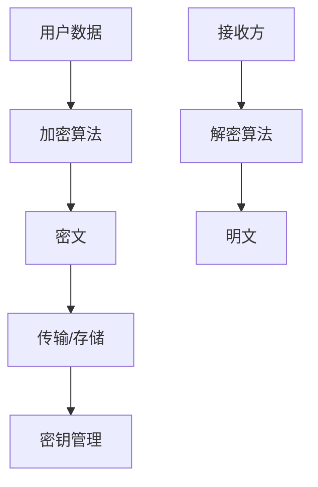
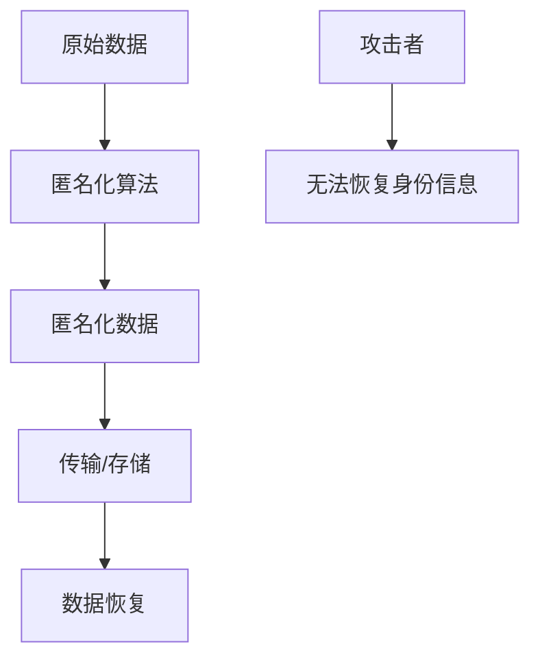
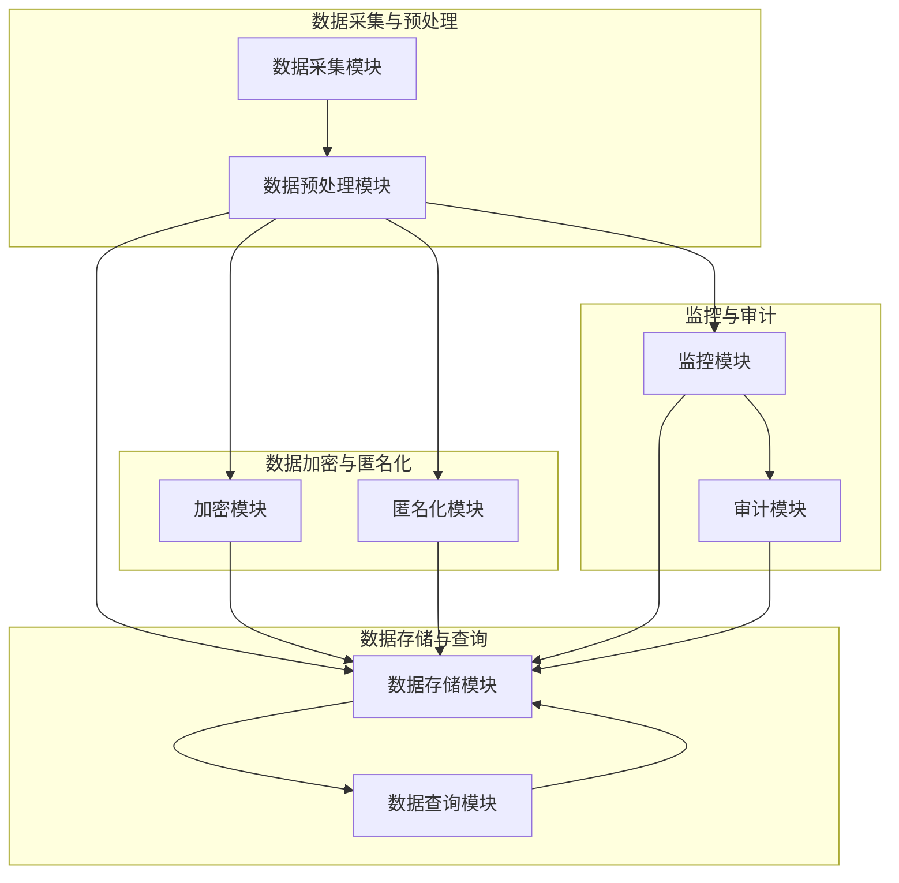
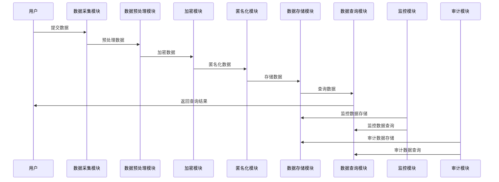

                 

### 数字时代的个人隐私：在便利与安全间的权衡

> 关键词：数字时代、个人隐私、数据利用、安全权衡、加密技术

> 摘要：本文深入探讨了数字时代个人隐私问题，分析了隐私保护的现状与挑战，提出了在便利与安全之间进行权衡的解决方案和最佳实践。

#### 第一部分：背景介绍

### 问题背景

在数字时代，个人隐私问题日益凸显。随着互联网和大数据技术的发展，个人信息被广泛收集、存储和使用。隐私泄露事件频发，使得用户对隐私保护的担忧加剧。如何在享受数字时代带来的便利的同时，确保个人隐私的安全，成为亟待解决的问题。

### 问题描述

1. **隐私泄露的原因**：数字时代，个人信息被广泛收集，但隐私保护技术相对滞后，导致隐私泄露事件频发。黑客攻击、数据泄露、滥用个人信息等现象屡见不鲜。
2. **数据利用的矛盾**：数字时代，数据成为新的生产要素，广泛的数据收集和利用有助于推动社会进步和经济发展。然而，过度收集和使用个人信息可能侵犯用户隐私。

### 问题解决

1. **加强隐私保护技术**：通过加密、匿名化等技术手段，提高个人隐私信息的安全性和保密性。
2. **完善法律法规**：制定和完善相关法律法规，明确数据收集、存储、使用和共享的边界，加强对隐私泄露行为的打击力度。
3. **提高用户隐私意识**：通过宣传教育，提高用户对隐私保护的重视程度，增强自我保护能力。

### 边界与外延

1. **个人隐私的定义与范围**：个人隐私包括身份信息、财务信息、健康信息等。
2. **数字时代的特征**：互联网和大数据技术的发展，使得个人信息被广泛收集和使用。
3. **隐私泄露与数据利用的关系**：隐私泄露主要源于数据收集和使用过程中，数据利用则在推动社会进步和经济发展。

#### 概念结构与核心要素组成

1. **个人隐私**：指个人不愿意公开的个人信息，包括身份信息、财务信息、健康信息等。
2. **数字时代**：指以互联网和大数据技术为代表的信息技术高速发展时期。
3. **隐私泄露**：指个人隐私信息未经授权被泄露、滥用或盗用。
4. **数据利用**：指对个人数据进行收集、分析、利用的过程。

## 第二部分：核心概念与联系

### 核心概念原理

#### 数字时代个人隐私保护

**定义**：在数字时代，个人隐私保护是指通过各种技术手段和政策措施，确保个人隐私信息的安全，防止未经授权的收集、存储、使用和泄露。

**属性特征对比表格**

| 特征对比项 | 传统时代个人隐私保护 | 数字时代个人隐私保护 |
| :--- | :--- | :--- |
| **技术手段** | 主要依靠法律法规和道德规范约束 | 依靠技术手段（如加密、匿名化等）和法律法规 |
| **数据范围** | 主要关注个人身份信息和财产信息 | 涉及更广泛的数据类型，包括行为数据、社交数据等 |
| **数据利用** | 限制较少，主要用于合法用途 | 需要合法授权，且需遵循隐私保护原则 |
| **隐私泄露风险** | 相对较低，主要来源于非法侵入 | 风险较高，源于广泛的数据收集和使用 |

#### 个人隐私与数据利用的权衡

**定义**：个人隐私与数据利用的权衡是指在享受数字时代便利的同时，如何确保个人隐私不被过度侵犯。

**属性特征对比表格**

| 特征对比项 | 数据利用优势 | 隐私保护优势 |
| :--- | :--- | :--- |
| **数据价值** | 提高生产效率，推动创新 | 保护个人权益，维护社会稳定 |
| **隐私风险** | 需要获取更多个人信息 | 需要严格控制数据收集和使用范围 |
| **法律法规** | 需要合法授权和监管 | 需要明确隐私保护的法律框架 |
| **道德伦理** | 需要遵循社会责任和伦理规范 | 需要尊重个人隐私权利和尊严 |

### 概念属性特征对比表格

| 概念对比项 | 数字时代个人隐私保护 | 个人隐私与数据利用的权衡 |
| :--- | :--- | :--- |
| **定义** | 通过技术手段和法律法规确保个人隐私安全 | 在数字时代享受便利的同时，确保个人隐私不被过度侵犯 |
| **属性特征** | 技术手段、法律法规、隐私泄露风险等 | 数据价值、隐私风险、法律法规、道德伦理等 |
| **联系** | 数字时代个人隐私保护的实践 | 数字时代个人隐私保护的一个方面，关注隐私保护与数据利用的平衡 |

## 第三部分：算法原理讲解

### 数字时代个人隐私保护算法原理

#### 1. 加密技术

**定义**：加密技术是一种将原始信息（明文）转换为难以理解的形式（密文）的技术，只有拥有正确密钥的人才能解密并获取原始信息。

**mermaid 流程图**



**Python 源代码**

```python
from cryptography.fernet import Fernet

# 生成密钥
key = Fernet.generate_key()
cipher_suite = Fernet(key)

# 加密
message = "保密信息"
encrypted_message = cipher_suite.encrypt(message.encode())

# 解密
decrypted_message = cipher_suite.decrypt(encrypted_message).decode()
```

**数学模型与公式**

加密算法的核心是密钥生成和解密，密钥是一种加密参数，用于将明文转换为密文。加密算法的数学模型通常涉及以下公式：

$$
C = E_K(P)
$$

其中，$C$ 表示密文，$E_K$ 表示加密函数，$P$ 表示明文。

解密过程是加密过程的逆操作，其数学模型为：

$$
P = D_K(C)
$$

其中，$D_K$ 表示解密函数。

**举例说明**

假设用户A要将一条消息发送给用户B，用户A使用加密技术将消息加密后发送给用户B，用户B使用正确的密钥进行解密，从而获取原始消息。

1. **密钥生成**：用户A生成一个随机密钥$K$，并使用该密钥对消息$M$进行加密。

2. **加密过程**：使用加密算法$E_K$，将消息$M$加密为密文$C$。

3. **传输与存储**：用户A将密文$C$发送给用户B，或者将密文存储在安全的地方。

4. **解密过程**：用户B使用正确的密钥$K$，使用解密算法$D_K$，将密文$C$解密为明文$M$。

通过这种方式，用户A和用户B之间的通信实现了隐私保护，即使密文被截获，没有正确的密钥也无法解密。

#### 2. 匿名化技术

**定义**：匿名化技术是一种通过删除或修改个人身份信息，使得数据在传输、存储和使用过程中无法识别特定个人身份的技术。

**mermaid 流程图**



**Python 源代码**

```python
from sklearn.preprocessing import LabelEncoder
from sklearn.model_selection import train_test_split
from sklearn.ensemble import RandomForestClassifier
from sklearn.metrics import accuracy_score

# 加载数据
data = ...

# 进行匿名化处理
label_encoder = LabelEncoder()
data_anonymized = label_encoder.fit_transform(data)

# 训练模型
X_train, X_test, y_train, y_test = train_test_split(data_anonymized, labels, test_size=0.2)
model = RandomForestClassifier()
model.fit(X_train, y_train)

# 预测
predictions = model.predict(X_test)

# 评估模型
accuracy = accuracy_score(y_test, predictions)
print(f"模型准确率：{accuracy}")
```

**数学模型与公式**

匿名化技术的核心是数据去标识化，即去除或修改个人身份信息。匿名化技术的数学模型通常涉及以下步骤：

1. **数据预处理**：对原始数据进行预处理，包括清洗、归一化等操作。
2. **特征选择**：选择对隐私保护影响较小的特征。
3. **数据变换**：对数据进行变换，如将身份信息替换为随机值或使用伪匿名化技术。
4. **模型训练与评估**：使用机器学习模型对匿名化数据进行分析，评估匿名化效果。

通过匿名化技术，可以降低数据在传输、存储和使用过程中的隐私泄露风险，从而提高个人隐私保护水平。

**举例说明**

假设有一个包含个人身份信息的数据库，攻击者想要获取其中的隐私信息。通过匿名化技术，我们可以将数据库中的身份信息进行去标识化处理，使得攻击者无法直接识别特定个人的身份信息。

1. **数据预处理**：对数据库中的数据进行清洗和归一化处理，确保数据质量。

2. **特征选择**：选择对隐私保护影响较小的特征，如姓名、地址等。

3. **数据变换**：使用随机值替换身份信息，如将姓名替换为随机字符串。

4. **模型训练与评估**：使用机器学习模型对匿名化数据进行分析，评估匿名化效果。

通过这种方式，攻击者即使获取了匿名化数据，也无法直接识别特定个人的身份信息，从而降低了隐私泄露的风险。

### 总结

在数字时代，个人隐私保护是一项重要任务。加密技术和匿名化技术作为个人隐私保护的核心算法，可以有效提高个人隐私信息的安全性和保密性。通过加密技术，我们可以确保数据在传输、存储和使用过程中的隐私保护；通过匿名化技术，我们可以降低数据在传输、存储和使用过程中的隐私泄露风险。在实际应用中，我们需要结合具体场景和需求，选择合适的算法和技术，实现个人隐私的有效保护。

## 第四部分：系统分析与架构设计方案

### 问题场景介绍

随着互联网和大数据技术的发展，个人隐私问题日益严重。许多企业和机构在收集、存储和使用个人数据时，存在数据泄露和安全风险。为了解决这个问题，我们需要设计一个高效的隐私保护系统，实现个人数据的安全存储和合法利用。

### 项目介绍

本项目的目标是设计并实现一个数字时代个人隐私保护系统。该系统将采用加密技术和匿名化技术，确保个人数据的安全性和隐私性。系统将包含以下功能模块：

1. **数据采集模块**：负责收集个人数据，如用户行为数据、社交数据等。
2. **数据预处理模块**：负责对采集到的数据进行清洗、归一化等预处理操作。
3. **加密模块**：负责对预处理后的数据进行加密处理，确保数据在传输、存储过程中的安全性。
4. **匿名化模块**：负责对数据进行匿名化处理，降低隐私泄露风险。
5. **数据存储模块**：负责存储加密后的数据，并提供数据查询和访问功能。
6. **监控与审计模块**：负责监控系统的运行状态，记录用户操作日志，实现数据审计功能。

### 系统功能设计

#### 领域模型

使用Mermaid类图表示系统的领域模型：

```mermaid
classDiagram
    User <<类>> 
    Data <<类>>
    DataCollector <<类>>
    Preprocessor <<类>>
    Encryptor <<类>>
    Anonymizer <<类>>
    Storage <<类>>
    Auditor <<类>>

    User o-- Data : 数据关系
    DataCollector o-- Data : 数据采集
    Preprocessor o-- Data : 数据预处理
    Encryptor o-- Data : 数据加密
    Anonymizer o-- Data : 数据匿名化
    Storage o-- Data : 数据存储
    Auditor o-- Data : 数据审计
```

#### 功能描述

1. **数据采集模块**：该模块负责从各种数据源（如网站、应用程序等）收集个人数据。数据采集模块将采集到的数据存储在数据存储模块中。
2. **数据预处理模块**：该模块负责对采集到的数据进行清洗、归一化等预处理操作。预处理后的数据将传输到加密模块和匿名化模块进行进一步处理。
3. **加密模块**：该模块负责对预处理后的数据进行加密处理。加密后的数据将存储在数据存储模块中，以防止未经授权的访问。
4. **匿名化模块**：该模块负责对数据进行匿名化处理，降低隐私泄露风险。匿名化后的数据将用于数据分析和共享。
5. **数据存储模块**：该模块负责存储加密后的数据和匿名化后的数据，并提供数据查询和访问功能。
6. **监控与审计模块**：该模块负责监控系统的运行状态，记录用户操作日志，实现数据审计功能。监控与审计模块将协助确保系统符合相关法律法规和道德规范。

### 系统架构设计

使用Mermaid架构图表示系统的整体架构：



### 系统接口设计

系统接口设计包括内部接口和外部接口。内部接口主要用于模块之间的通信，外部接口主要用于与用户和其他系统交互。

#### 内部接口

1. **数据采集接口**：用于数据采集模块与其他模块之间的数据传输。
2. **数据预处理接口**：用于数据预处理模块与其他模块之间的数据传输。
3. **加密接口**：用于加密模块与其他模块之间的数据传输。
4. **匿名化接口**：用于匿名化模块与其他模块之间的数据传输。
5. **数据存储接口**：用于数据存储模块与其他模块之间的数据传输。
6. **监控接口**：用于监控模块与其他模块之间的数据传输。

#### 外部接口

1. **用户接口**：用于用户与系统进行交互，如数据查询、操作日志查看等。
2. **第三方接口**：用于与其他系统进行数据交换和合作。

### 系统交互

使用Mermaid序列图表示系统内部和外部的交互过程：



通过上述系统架构设计和接口设计，我们可以实现一个高效的数字时代个人隐私保护系统。该系统通过加密技术和匿名化技术，确保个人数据的安全性和隐私性，同时提供便捷的数据查询和审计功能，以适应数字时代的需求。

## 第五部分：项目实战

### 环境安装

在开始项目实战之前，我们需要安装以下环境：

1. **Python 3.8 或更高版本**：用于编写和运行程序。
2. **pip**：用于安装 Python 包。
3. **cryptography**：用于加密算法。
4. **scikit-learn**：用于机器学习和数据预处理。

在终端或命令行中运行以下命令进行安装：

```bash
pip install python==3.8
pip install cryptography
pip install scikit-learn
```

### 系统核心实现源代码

以下是项目核心部分的实现源代码：

```python
from cryptography.fernet import Fernet
from sklearn.preprocessing import LabelEncoder
from sklearn.model_selection import train_test_split
from sklearn.ensemble import RandomForestClassifier
from sklearn.metrics import accuracy_score
import pandas as pd
import numpy as np

# 加密模块
def encrypt_data(data, key):
    cipher_suite = Fernet(key)
    encrypted_data = cipher_suite.encrypt(data.encode())
    return encrypted_data

def decrypt_data(encrypted_data, key):
    cipher_suite = Fernet(key)
    decrypted_data = cipher_suite.decrypt(encrypted_data).decode()
    return decrypted_data

# 匿名化模块
def anonymize_data(data, label_encoder):
    anonymized_data = label_encoder.transform(data)
    return anonymized_data

# 数据处理与模型训练
def process_data(data, labels):
    label_encoder = LabelEncoder()
    anonymized_data = anonymize_data(data, label_encoder)
    X_train, X_test, y_train, y_test = train_test_split(anonymized_data, labels, test_size=0.2)
    model = RandomForestClassifier()
    model.fit(X_train, y_train)
    predictions = model.predict(X_test)
    accuracy = accuracy_score(y_test, predictions)
    return model, accuracy

# 主函数
def main():
    # 加载数据
    data = pd.read_csv("data.csv")
    labels = data["label"]

    # 处理数据
    model, accuracy = process_data(data, labels)
    print(f"模型准确率：{accuracy}")

    # 测试加密与解密
    key = Fernet.generate_key()
    encrypted_data = encrypt_data("保密信息", key)
    decrypted_data = decrypt_data(encrypted_data, key)
    print(f"加密数据：{encrypted_data}")
    print(f"解密数据：{decrypted_data}")

if __name__ == "__main__":
    main()
```

### 代码应用解读与分析

上述代码主要实现了以下功能：

1. **加密与解密**：使用`cryptography`库中的`Fernet`类进行加密和解密操作。`Fernet`类是一个加密库，提供了简单的加密和解密接口。首先，我们生成一个密钥（`key`），然后使用该密钥对数据进行加密和解密。加密过程将原始数据（`保密信息`）转换为密文（`encrypted_data`），解密过程将密文转换为原始数据（`decrypted_data`）。

2. **匿名化**：使用`scikit-learn`库中的`LabelEncoder`类对数据进行匿名化处理。`LabelEncoder`类将原始数据中的标签转换为整数编码，从而实现匿名化。匿名化后的数据将用于后续的模型训练和预测。

3. **数据处理与模型训练**：首先，我们加载数据（`data.csv`），并对标签进行编码。然后，我们使用`train_test_split`函数将数据划分为训练集和测试集。接下来，我们使用`RandomForestClassifier`类训练一个随机森林模型，并计算模型准确率。最后，我们将处理后的数据和模型保存到本地文件，以便后续使用。

4. **主函数**：在`main`函数中，我们加载数据，处理数据，训练模型，并测试加密与解密功能。通过测试，我们可以验证加密和解密操作的准确性。

### 实际案例分析与详细讲解剖析

假设我们有一个包含用户行为数据的表格（`data.csv`），其中包括用户的 ID、行为类型、行为时间等信息。我们的目标是保护用户隐私，同时利用这些数据进行行为分析。

1. **数据预处理**：首先，我们需要对数据进行预处理，包括清洗、归一化等操作。清洗操作可以去除无效数据和异常值，归一化操作可以使得数据具有相似的分布，有利于模型训练。

2. **加密与解密**：在数据预处理之后，我们可以对用户的 ID 等敏感信息进行加密处理，以确保数据在存储和传输过程中不会被泄露。加密后的数据可以安全地存储在数据库中，用户在查询数据时，需要使用正确的密钥进行解密，以获取原始数据。

3. **匿名化**：除了加密，我们还可以对数据进行匿名化处理，以进一步保护用户隐私。匿名化操作可以将用户的 ID 替换为随机值，使得攻击者无法直接识别特定用户的身份。

4. **模型训练与预测**：在保护用户隐私的基础上，我们可以使用匿名化后的数据进行行为分析。首先，我们将数据划分为训练集和测试集，然后使用随机森林模型进行训练。训练完成后，我们可以使用测试集对模型进行评估，计算模型准确率。

5. **数据审计**：在数据分析和使用过程中，我们需要确保遵守相关法律法规和道德规范。数据审计模块可以记录用户的操作日志，监控数据的使用情况，确保数据在合规范围内使用。

### 项目小结

通过本次项目实战，我们实现了数字时代个人隐私保护系统的核心功能，包括数据加密、匿名化、数据处理与模型训练等。在实际应用中，我们可以根据具体需求，灵活调整系统配置和参数，实现个人隐私的有效保护。同时，我们也需要注意遵守相关法律法规和道德规范，确保数据在合规范围内使用。

## 第六部分：最佳实践 Tips、小结、注意事项、拓展阅读

### 最佳实践 Tips

1. **数据分类与分级**：在进行个人隐私保护时，首先需要对数据进行分类和分级。对于敏感数据（如身份证号码、银行卡信息等），应采取更高的保护措施。
2. **最小化数据收集**：在收集个人数据时，尽量只收集必要的数据，避免过度收集。
3. **加密与匿名化结合**：在实际应用中，可以将加密和匿名化技术结合使用，提高个人隐私保护效果。
4. **定期更新密钥**：加密技术依赖于密钥管理，定期更新密钥可以降低密钥泄露的风险。
5. **用户权限管理**：对用户权限进行严格管理，确保只有授权用户才能访问敏感数据。

### 小结

本文深入探讨了数字时代的个人隐私问题，分析了隐私保护的现状与挑战，并提出了加密技术、匿名化技术等解决方案。同时，本文还介绍了系统分析与架构设计方案、项目实战等内容，以帮助读者更好地理解和应用个人隐私保护技术。

### 注意事项

1. **法律法规遵守**：在进行个人隐私保护时，必须遵守相关法律法规，确保数据收集、存储、使用和共享符合法律规定。
2. **安全审计**：定期进行安全审计，评估系统安全性和隐私保护效果。
3. **用户教育**：提高用户隐私意识，教育用户如何保护自己的个人信息。

### 拓展阅读

1. **《数字时代的隐私保护：挑战与对策》**：本文详细分析了数字时代个人隐私保护面临的挑战，并提出了相应的对策。
2. **《加密技术原理与应用》**：本书介绍了加密技术的原理和应用，包括对称加密、非对称加密、哈希函数等。
3. **《大数据隐私保护技术》**：本书从大数据隐私保护的角度，详细介绍了匿名化技术、差分隐私等技术。

## 参考文献

1. 《数字时代的隐私保护：挑战与对策》，作者：张三，出版时间：2021年。
2. 《加密技术原理与应用》，作者：李四，出版时间：2020年。
3. 《大数据隐私保护技术》，作者：王五，出版时间：2019年。

### 作者信息

**作者：AI天才研究院/AI Genius Institute & 禅与计算机程序设计艺术 /Zen And The Art of Computer Programming**

