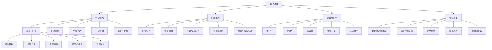

                 

# 数字时代的亲子沟通：科技使用中的家庭互动指南

关键词：亲子沟通、数字时代、科技使用、家庭互动、挑战与机遇

摘要：本文深入探讨了数字时代下亲子沟通的重要性和科技使用的双刃剑效应。通过分析家庭互动中的科技使用现状、亲子沟通的核心概念以及数字时代下亲子沟通的技巧，本文旨在为家长提供实用的指导策略，帮助他们在科技使用的浪潮中，构建和谐的家庭互动环境。

### 目录大纲

1. 第一部分：亲子沟通的背景与科技使用
   1.1.1 数字时代的家庭互动
       1.1.1.1 数字时代的特点
       1.1.1.2 数字时代对家庭互动的影响
   1.1.2 家庭互动中的科技使用
       1.1.2.1 科技在亲子沟通中的应用
       1.1.2.2 科技使用的利与弊
   1.1.3 亲子沟通中的挑战
       1.1.3.1 家庭中科技使用的矛盾
       1.1.3.2 沟通中的障碍与冲突
   1.1.4 挑战与机遇
       1.1.4.1 应对挑战的策略
       1.1.4.2 利用机遇的建议
   1.1.5 本章小结

2. 第二部分：亲子沟通中的核心概念
   2.1.1 亲子沟通的基本原理
       2.1.1.1 亲子沟通的重要性
       2.1.1.2 亲子沟通的基本原则
       2.1.1.3 亲子沟通的类型
   2.1.2 科技沟通的特点
       2.1.2.1 科技沟通的优势
       2.1.2.2 科技沟通的局限
       2.1.2.3 科技沟通的误区
   2.1.3 核心概念关系图
       2.1.3.1 基本概念的联系与区别
       2.1.3.2 概念属性特征对比表格
   2.1.4 本章小结

3. 第三部分：数字时代的科技使用与亲子沟通
   3.1.1 数字时代下亲子沟通的技巧
       3.1.1.1 有效沟通的方法
       3.1.1.2 应对科技挑战的策略
       3.1.1.3 增进亲子关系的技巧
   3.1.2 家庭互动中的科技使用案例分析
       3.1.2.1 案例一：科技辅助亲子活动
       3.1.2.2 案例二：科技在家庭教育中的应用
       3.1.2.3 案例三：科技与亲子沟通中的冲突解决
   3.1.3 科技使用的最佳实践
       3.1.3.1 家长视角
       3.1.3.2 孩子视角
       3.1.3.3 家庭互动中的科技使用指南
   3.1.4 本章小结

4. 第四部分：家庭互动中的科技使用：实践与指导
   4.1.1 家庭互动中的科技使用计划
       4.1.1.1 制定科技使用计划的重要性
       4.1.1.2 科技使用计划的内容与步骤
       4.1.1.3 科技使用计划的实例
   4.1.2 科技使用中的亲子沟通技巧
       4.1.2.1 互动式沟通
       4.1.2.2 积极倾听
       4.1.2.3 有效反馈
   4.1.3 家庭互动中的科技使用实践
       4.1.3.1 家庭互动活动设计
       4.1.3.2 科技设备使用技巧
       4.1.3.3 亲子沟通案例实践
   4.1.4 科技使用的注意事项与风险防范
       4.1.4.1 科技使用的潜在风险
       4.1.4.2 风险防范策略
       4.1.4.3 家庭互动中的科技使用安全指南
   4.1.5 本章小结

5. 第五部分：数字时代亲子沟通的未来展望
   5.1.1 数字时代下亲子沟通的发展趋势
       5.1.1.1 技术进步的影响
       5.1.1.2 社会文化的变迁
       5.1.1.3 未来亲子沟通的模式
   5.1.2 未来亲子沟通的挑战与机遇
       5.1.2.1 挑战分析
       5.1.2.2 机遇展望
       5.1.2.3 应对策略
   5.1.3 亲子沟通的未来：展望与建议
       5.1.3.1 未来亲子沟通的创新实践
       5.1.3.2 促进家庭互动的科技应用
       5.1.3.3 建设和谐家庭环境的建议
   5.1.4 本章小结

### 附录

- 附录A：亲子沟通科技使用工具列表

## 第一部分：亲子沟通的背景与科技使用

### 1.1.1 数字时代的家庭互动

#### 1.1.1.1 数字时代的特点

数字时代，又称信息化时代，是以互联网、大数据、云计算和人工智能等为代表的新技术迅速发展的时代。在这个时代，数字技术已经深入到社会的方方面面，包括工作、学习、娱乐、购物和社交等。以下是数字时代的一些主要特点：

1. **信息传播速度快**：随着互联网的普及，信息可以在全球范围内迅速传播，新闻、知识、娱乐等可以在短时间内被大量人群接收。

2. **数据量庞大**：大数据时代带来了海量的数据，这些数据为各种应用提供了丰富的素材，也使得数据处理和分析成为重要的技能。

3. **智能设备普及**：智能手机、平板电脑、智能家居设备等不断普及，使得人们可以随时随地进行信息获取和互动。

4. **社交方式多样化**：社交媒体、即时通讯工具等使得人与人之间的沟通变得更加方便和快捷，同时也带来了新的社交方式和挑战。

#### 1.1.1.2 数字时代对家庭互动的影响

数字时代对家庭互动产生了深远的影响，既有积极的一面，也有挑战的一面。

**积极影响：**

1. **沟通便捷**：家庭成员可以通过各种通讯工具随时保持联系，缩短了地理距离带来的隔阂。

2. **信息共享**：家庭成员可以共同关注和学习各种信息，增强家庭知识的积累和共同成长。

3. **亲子活动丰富**：数字技术为家庭提供了丰富的亲子活动资源，如在线教育、亲子游戏等。

**挑战：**

1. **科技依赖**：家庭成员可能过度依赖科技产品，导致面对面沟通减少，情感联系减弱。

2. **信息过载**：家庭成员可能被大量的信息所淹没，难以筛选和消化，导致焦虑和压力。

3. **隐私问题**：家庭成员在数字环境中的隐私可能受到威胁，如个人信息泄露、网络安全问题等。

#### 1.1.1.3 家庭互动中的科技使用现状

在数字时代，科技产品已经成为家庭互动的重要组成部分。以下是一些常见的科技使用场景：

1. **智能设备**：如智能手机、平板电脑、智能电视等，为家庭提供了丰富的娱乐和学习资源。

2. **在线教育**：通过互联网进行的学习活动，如在线课程、在线作业等，改变了传统的教育方式。

3. **社交工具**：如微信、QQ、Facebook等，家庭成员可以通过这些工具进行交流、分享和生活管理。

4. **智能家居**：如智能音箱、智能门锁、智能灯泡等，提高了家庭生活的便捷性和安全性。

#### 1.1.1.4 科技使用的利与弊

科技在家庭互动中既有利也有弊。以下是科技使用的利与弊的对比：

**利：**

1. **提高效率**：科技产品可以帮助家庭成员更高效地完成任务，节省时间和精力。

2. **增强互动**：通过社交媒体和通讯工具，家庭成员可以更频繁地交流和互动。

3. **提供资源**：科技产品为家庭提供了丰富的教育资源、娱乐资源和社交资源。

**弊：**

1. **影响身心健康**：长时间使用电子设备可能导致视力下降、颈椎病、肥胖等健康问题。

2. **减少面对面交流**：家庭成员可能因为科技产品而减少面对面交流，影响情感联系。

3. **网络安全问题**：家庭成员可能面临网络安全威胁，如网络诈骗、个人信息泄露等。

#### 1.1.1.5 亲子沟通中的挑战

在数字时代，亲子沟通面临着一些特殊的挑战：

1. **科技依赖**：孩子可能过度依赖电子设备，导致亲子互动减少。

2. **沟通障碍**：科技产品可能成为沟通的障碍，家庭成员之间难以进行深入的面对面交流。

3. **价值观冲突**：数字时代的价值观与传统家庭价值观可能存在差异，导致亲子之间的价值观冲突。

#### 1.1.1.6 应对挑战的策略

为了应对亲子沟通中的挑战，家长可以采取以下策略：

1. **设定规则**：制定家庭科技使用规则，限制孩子使用电子设备的时间和内容。

2. **亲子互动**：增加与孩子面对面互动的时间，如一起做游戏、散步、阅读等。

3. **教育引导**：教育孩子正确使用科技产品，提高他们的网络素养和自我管理能力。

#### 1.1.1.7 利用机遇的建议

数字时代也为亲子沟通带来了机遇：

1. **共同学习**：利用在线教育资源，与孩子一起学习新知识，增强亲子关系。

2. **科技辅助**：使用科技产品辅助亲子活动，如亲子游戏、在线教育等。

3. **家庭互动**：通过社交媒体和通讯工具，增加家庭成员之间的互动和联系。

### 1.1.2 家庭互动中的科技使用

#### 1.1.2.1 科技在亲子沟通中的应用

科技在亲子沟通中的应用非常广泛，以下是一些常见的应用：

1. **在线教育**：家长可以通过在线教育平台为孩子提供丰富的学习资源，如课程视频、电子书、学习软件等。

2. **亲子游戏**：科技产品如智能手机、平板电脑提供了丰富的亲子游戏应用，有助于增强亲子互动。

3. **家庭管理**：使用家庭管理软件，家长可以更好地管理家庭事务，如购物清单、日程安排、财务记录等。

#### 1.1.2.2 科技使用的利与弊

科技使用的利与弊在亲子沟通中同样存在：

**利：**

1. **方便快捷**：科技产品使得信息传递和沟通变得更加便捷，家长可以随时了解孩子的动态。

2. **丰富资源**：科技提供了丰富的学习资源和娱乐资源，有助于孩子的全面发展。

3. **提高效率**：科技产品可以帮助家长提高日常生活的效率，如购物、支付、日程管理等。

**弊：**

1. **科技依赖**：孩子可能过度依赖科技产品，导致沟通能力下降。

2. **信息过载**：孩子可能因为信息过载而感到压力，影响身心健康。

3. **网络安全问题**：孩子可能面临网络安全威胁，如网络诈骗、个人信息泄露等。

#### 1.1.2.3 科技使用的最佳实践

为了确保科技在亲子沟通中的积极作用，家长可以采取以下最佳实践：

1. **限制使用时间**：设定孩子使用电子设备的时间，避免过度依赖。

2. **共同使用**：与孩子一起使用科技产品，如一起观看教育视频、一起玩亲子游戏等。

3. **网络安全教育**：教育孩子正确使用互联网，提高网络安全意识。

### 1.1.3 亲子沟通中的挑战

#### 1.1.3.1 家庭中科技使用的矛盾

在家庭互动中，科技使用往往存在以下矛盾：

1. **亲子间的差异**：家长与孩子对科技产品的使用习惯和需求存在差异，可能导致沟通障碍。

2. **时间管理**：科技产品的使用可能影响家庭成员的作息时间，影响亲子互动。

3. **隐私问题**：家长可能担心孩子的隐私受到侵犯，影响亲子信任。

#### 1.1.3.2 沟通中的障碍与冲突

科技在亲子沟通中也可能带来一些障碍和冲突：

1. **科技依赖**：孩子过度依赖科技产品，导致面对面沟通减少。

2. **信息传递不畅**：科技产品可能成为沟通的障碍，影响信息的有效传递。

3. **价值观冲突**：数字时代的价值观与传统家庭价值观可能存在差异，导致亲子之间的价值观冲突。

#### 1.1.3.3 如何应对沟通中的障碍与冲突

为了应对沟通中的障碍与冲突，家长可以采取以下策略：

1. **设定规则**：制定家庭科技使用规则，明确使用时间和内容。

2. **增进理解**：与孩子进行深入的沟通，了解他们的需求和想法，增进理解。

3. **积极引导**：教育孩子正确使用科技产品，提高他们的网络素养和自我管理能力。

### 1.1.4 挑战与机遇

#### 1.1.4.1 应对挑战的策略

面对亲子沟通中的挑战，家长可以采取以下策略：

1. **科技平衡**：在家庭互动中保持科技使用的平衡，避免过度依赖。

2. **亲子互动**：增加与孩子的面对面互动，如一起做游戏、散步、阅读等。

3. **教育引导**：教育孩子正确使用科技产品，提高他们的网络素养和自我管理能力。

#### 1.1.4.2 利用机遇的建议

数字时代也为亲子沟通带来了机遇：

1. **共同学习**：利用在线教育资源，与孩子一起学习新知识，增强亲子关系。

2. **科技辅助**：使用科技产品辅助亲子活动，如亲子游戏、在线教育等。

3. **家庭互动**：通过社交媒体和通讯工具，增加家庭成员之间的互动和联系。

### 1.1.5 本章小结

本章分析了数字时代对家庭互动的影响，探讨了科技在亲子沟通中的应用和挑战。通过了解数字时代的特点、科技使用的利弊以及亲子沟通中的矛盾和冲突，家长可以更好地应对挑战，利用机遇，构建和谐的家庭互动环境。

## 第二部分：亲子沟通中的核心概念

### 2.1.1 亲子沟通的基本原理

#### 2.1.1.1 亲子沟通的重要性

亲子沟通是家庭关系中至关重要的一环。它不仅关系到孩子的心理健康和成长，也影响着家庭的和谐与稳定。以下是亲子沟通的重要性：

1. **情感联系**：亲子沟通有助于建立和维护亲子之间的情感联系，让孩子感受到父母的关爱和支持。

2. **问题解决**：通过沟通，家长可以了解孩子的需求和问题，及时提供帮助和支持，帮助孩子解决问题。

3. **价值观传承**：亲子沟通是家长向孩子传递正确价值观和道德观念的重要途径。

4. **个性发展**：良好的亲子沟通有助于孩子形成健康的人格特质，培养自信心、独立性和解决问题的能力。

#### 2.1.1.2 亲子沟通的基本原则

有效的亲子沟通需要遵循一些基本原则，以下是一些关键原则：

1. **尊重与理解**：家长应尊重孩子的个性和需求，理解他们的想法和感受。

2. **积极倾听**：家长需要积极倾听孩子的意见，给予他们充分的表达机会。

3. **平等对话**：亲子沟通应该是平等的对话，避免家长单方面的说教。

4. **开放沟通**：家长应创造一个开放、轻松的沟通环境，让孩子敢于表达自己的真实想法。

5. **诚实与信任**：家长应诚实地与孩子沟通，建立信任关系。

#### 2.1.1.3 亲子沟通的类型

亲子沟通可以分为以下几种类型：

1. **日常沟通**：涉及日常生活琐事，如家庭安排、购物清单等。

2. **情感沟通**：关注孩子的情感需求，如表达关心、支持、鼓励等。

3. **问题解决沟通**：帮助孩子分析和解决遇到的问题，如学习困难、人际冲突等。

4. **价值观沟通**：向孩子传递正确的价值观和道德观念。

5. **教育与成长沟通**：涉及孩子的教育和成长规划，如学习目标、职业规划等。

### 2.1.2 科技沟通的特点

#### 2.1.2.1 科技沟通的优势

科技沟通在亲子互动中具有明显的优势：

1. **便捷性**：科技沟通不受时间和地点的限制，家长可以随时与孩子保持联系。

2. **高效性**：科技沟通可以快速传递信息，提高沟通效率。

3. **多样性**：科技沟通方式多样，如电话、短信、社交媒体等，满足不同需求。

4. **资源共享**：科技沟通可以共享信息资源，如学习资料、娱乐内容等。

5. **记录保存**：科技沟通可以记录沟通内容，方便后续查阅和反思。

#### 2.1.2.2 科技沟通的局限

尽管科技沟通具有优势，但也存在一些局限：

1. **缺乏面对面互动**：科技沟通缺乏面对面互动，可能影响情感联系。

2. **信息传递失真**：科技沟通中信息容易失真，影响沟通效果。

3. **网络依赖**：家庭成员可能过度依赖科技沟通，减少面对面交流。

4. **隐私风险**：科技沟通可能涉及隐私问题，如个人信息泄露、网络安全威胁等。

5. **价值观差异**：科技沟通可能带来价值观的差异，影响家庭和谐。

#### 2.1.2.3 科技沟通的误区

在科技沟通中，家长可能陷入一些误区：

1. **过度依赖**：家长可能过度依赖科技沟通，忽视面对面交流。

2. **信息泛滥**：家长可能让孩子接收过多的信息，导致信息过载。

3. **忽视情感**：家长可能只关注孩子的学习进度，忽视他们的情感需求。

4. **单方面沟通**：家长可能单方面地灌输自己的想法，忽视孩子的意见。

5. **忽视隐私**：家长可能不注意保护孩子的隐私，导致隐私泄露。

### 2.1.3 核心概念关系图

为了更好地理解亲子沟通和科技沟通的关系，我们可以绘制一个核心概念关系图，如下所示：

### 2.1.4 本章小结

本章详细介绍了亲子沟通的基本原理、科技沟通的特点以及二者之间的关系。通过理解这些核心概念，家长可以更好地运用科技手段进行有效的亲子沟通，构建和谐的家庭互动环境。

## 第三部分：数字时代的科技使用与亲子沟通

### 3.1.1 数字时代下亲子沟通的技巧

在数字时代，科技使用对亲子沟通带来了新的挑战和机遇。为了有效地利用科技手段促进亲子沟通，家长可以采取以下技巧：

#### 3.1.1.1 有效沟通的方法

1. **设定规则**：制定明确的家庭科技使用规则，包括使用时间、内容和使用场景，以确保科技产品为亲子沟通服务。

2. **积极倾听**：在科技沟通中，家长应保持积极倾听的态度，关注孩子的意见和感受，避免打断他们的表达。

3. **互动式沟通**：利用社交媒体、视频通话等科技工具，进行互动式沟通，增加亲子互动的趣味性和参与感。

4. **共同学习**：利用在线教育资源和学习软件，与孩子一起学习新知识，共同进步。

5. **情感表达**：通过文字、语音、视频等多种方式，表达对孩子的关爱和支持，增强亲子之间的情感联系。

#### 3.1.1.2 应对科技挑战的策略

1. **科技平衡**：在家庭互动中保持科技使用的平衡，避免过度依赖，同时注重面对面交流。

2. **科技教育**：教育孩子正确使用科技产品，提高他们的网络素养和自我管理能力，避免科技带来的负面影响。

3. **家庭互动**：通过科技产品，设计有趣的亲子活动，如在线游戏、视频聊天、共同观看电影等，增强家庭互动。

4. **沟通监督**：家长应监督孩子的科技使用情况，确保他们的网络安全，避免接触不良信息和内容。

#### 3.1.1.3 增进亲子关系的技巧

1. **共享生活**：通过社交媒体和通讯工具，分享日常生活中的点滴，增强亲子之间的情感联系。

2. **共同兴趣**：发现和培养与孩子的共同兴趣，利用科技产品进行互动和分享，加深亲子之间的共同话题。

3. **陪伴成长**：在孩子的成长过程中，利用科技产品陪伴他们，提供支持和鼓励，共同度过成长的关键时期。

4. **沟通反馈**：定期与孩子进行沟通反馈，了解他们的需求和想法，及时调整家庭互动方式。

### 3.1.2 家庭互动中的科技使用案例分析

为了更好地理解如何利用科技手段进行有效的亲子沟通，以下是一些家庭互动中的科技使用案例分析：

#### 案例一：科技辅助亲子活动

**案例背景**：一位家长通过在线教育平台为孩子报名了一门编程课程。每次课程结束后，家长会与孩子一起复习所学内容，并通过在线编程平台完成练习。

**案例分析**：通过科技辅助，家长与孩子共同参与编程学习，不仅增进了亲子关系，还提高了孩子的学习兴趣和能力。同时，家长通过观察孩子的学习进度和表现，给予及时反馈和鼓励。

#### 案例二：科技在家庭教育中的应用

**案例背景**：一位家长为孩子购买了一款智能学习平板，内置了多种学习资源和应用程序。家长会定期与孩子一起使用平板，进行学习活动。

**案例分析**：科技在家庭教育中的应用，为家长提供了便捷的学习工具，提高了孩子的学习效率和兴趣。家长可以通过平板监控孩子的学习进度，及时调整学习计划。

#### 案例三：科技与亲子沟通中的冲突解决

**案例背景**：一位家长与孩子因为电子设备的过度使用发生了冲突。孩子沉迷于游戏，影响了学习和休息。

**案例分析**：家长通过沟通和教育，引导孩子认识到电子设备使用的利与弊，制定合理的使用规则。同时，家长利用科技产品，如家长控制软件，限制孩子的游戏时间，帮助孩子养成良好的科技使用习惯。

### 3.1.3 科技使用的最佳实践

为了确保科技在亲子沟通中的积极作用，家长可以采取以下最佳实践：

#### 3.1.3.1 家长视角

1. **了解科技**：家长应了解各种科技产品的特点和功能，确保为孩子选择合适的产品。

2. **设定规则**：制定明确的科技使用规则，包括使用时间、内容和监督方式。

3. **监督使用**：家长应监督孩子的科技使用情况，确保他们遵守规则，避免沉迷。

4. **沟通反馈**：定期与孩子沟通，了解他们的使用情况和感受，及时调整使用策略。

#### 3.1.3.2 孩子视角

1. **正确使用**：孩子应了解科技产品的使用规则，正确使用科技产品。

2. **自我管理**：孩子应学会自我管理，合理安排科技产品的使用时间。

3. **尊重家长**：孩子应尊重家长的意见和规则，积极参与家庭互动。

4. **反馈意见**：孩子应积极向家长反馈科技使用中的问题和建议。

#### 3.1.3.3 家庭互动中的科技使用指南

1. **制定计划**：家庭应制定科技使用计划，包括使用时间、内容和监督方式。

2. **共同参与**：家长与孩子应共同参与科技产品的选择和使用，确保产品适合家庭需求。

3. **安全使用**：家长应确保孩子的网络安全，避免接触不良信息和内容。

4. **沟通反馈**：家长与孩子应定期沟通，了解彼此的使用情况和感受，共同调整使用策略。

### 3.1.4 本章小结

本章探讨了数字时代下亲子沟通的技巧、科技使用的案例分析以及最佳实践。通过了解这些内容，家长可以更好地利用科技手段促进亲子沟通，构建和谐的家庭互动环境。

## 第四部分：家庭互动中的科技使用：实践与指导

### 4.1.1 家庭互动中的科技使用计划

制定家庭互动中的科技使用计划是确保科技产品为家庭生活带来积极影响的关键步骤。以下是如何制定科技使用计划的详细指导：

#### 4.1.1.1 制定科技使用计划的重要性

1. **明确目标**：科技使用计划可以帮助家庭明确使用科技产品的目的，确保科技产品的使用与家庭目标一致。
2. **合理分配时间**：科技使用计划可以帮助家庭成员合理安排时间，避免科技产品对日常生活和学习的干扰。
3. **提高效率**：通过科技使用计划，家庭成员可以更高效地完成任务，提高生活质量和学习效果。

#### 4.1.1.2 科技使用计划的内容与步骤

1. **评估需求**：首先，家庭需要评估每个成员对科技产品的需求和期望，包括学习、娱乐、工作等方面。
2. **设定规则**：根据评估结果，家庭应制定明确的科技使用规则，包括使用时间、内容和监督方式。
3. **制定时间表**：将科技使用规则具体化，制定时间表，明确每个成员在特定时间段内的科技产品使用安排。
4. **监督执行**：家庭成员应共同监督科技使用计划的执行，确保每个人都能遵守规则。
5. **定期评估与调整**：家庭应定期评估科技使用计划的执行情况，根据实际需求进行调整。

#### 4.1.1.3 科技使用计划的实例

**实例1：周末科技使用计划**

- **周六**：
  - 上午：孩子在线学习（编程、数学等），家长工作或阅读。
  - 中午：一起观看教育视频，共同讨论。
  - 下午：孩子玩游戏，家长做家务。
  - 晚上：家庭电影时间。

- **周日**：
  - 上午：孩子参加线上兴趣班，家长工作。
  - 中午：家庭午餐，讨论一周计划。
  - 下午：一起玩游戏或户外活动。
  - 晚上：亲子阅读时间。

**实例2：日常科技使用计划**

- **周一至周五**：
  - 早晨：家长为孩子准备早餐，孩子使用平板阅读。
  - 上学时间：家长工作，孩子上学。
  - 放学时间：家长与孩子一起完成作业，使用科技产品辅助学习。
  - 晚上：家庭晚餐后，家长陪伴孩子阅读或观看教育节目。

### 4.1.2 科技使用中的亲子沟通技巧

科技在家庭互动中的应用，虽然带来了便利，但也可能对亲子沟通造成挑战。以下是一些科技使用中的亲子沟通技巧，帮助家庭更好地利用科技产品进行沟通：

#### 4.1.2.1 互动式沟通

1. **视频通话**：通过视频通话，家长可以与孩子进行面对面的交流，增强情感联系。
2. **共同游戏**：选择适合家庭成员的游戏，一起参与，增进亲子关系。
3. **在线活动**：参与线上亲子活动，如亲子阅读、共同创作等，提高互动质量。

#### 4.1.2.2 积极倾听

1. **专注倾听**：在与孩子沟通时，家长应保持专注，不打断孩子的表达。
2. **情感回应**：家长应表达对孩子的理解和支持，回应他们的情感需求。
3. **开放性问题**：提出开放性问题，鼓励孩子表达自己的想法和感受。

#### 4.1.2.3 有效反馈

1. **正面反馈**：对孩子正确的科技使用给予表扬和鼓励，增强他们的积极性。
2. **建设性反馈**：对孩子错误的科技使用给予建设性反馈，帮助他们改进。
3. **反思与总结**：定期与孩子一起反思科技使用的效果，总结经验教训。

### 4.1.3 家庭互动中的科技使用实践

为了更好地理解如何将科技产品融入到家庭互动中，以下是一些具体的实践方法和案例：

#### 4.1.3.1 家庭互动活动设计

1. **科技艺术创作**：使用平板或电脑，一起创作数字艺术作品，如绘画、照片编辑等。
2. **科技角色扮演**：通过虚拟现实（VR）技术，设计科技主题的角色扮演游戏，增强家庭互动的趣味性。
3. **家庭科技比赛**：举办家庭科技知识竞赛，鼓励家庭成员共同学习和参与。

#### 4.1.3.2 科技设备使用技巧

1. **合理规划**：合理安排科技设备的使用，避免过度依赖。
2. **共同参与**：家长与孩子共同选择和操作科技设备，增强参与感。
3. **安全使用**：确保科技设备的使用安全，如设置家长控制、安装防病毒软件等。

#### 4.1.3.3 亲子沟通案例实践

**案例1：家庭科技会议**

家庭定期召开科技会议，讨论科技产品使用情况，分享使用心得和问题，共同制定改进计划。

**案例2：亲子读书时间**

家庭设定固定的亲子读书时间，家长与孩子一起阅读，讨论书中的内容，增进理解。

**案例3：家庭科技挑战**

家长与孩子一起参与科技挑战，如编程比赛、科学实验等，提高科技素养和团队合作能力。

### 4.1.4 科技使用的注意事项与风险防范

在家庭互动中使用科技产品时，家长应关注以下注意事项和风险防范：

#### 4.1.4.1 科技使用的潜在风险

1. **沉迷风险**：孩子可能沉迷于电子设备，影响学习和生活。
2. **隐私风险**：个人信息可能泄露，导致隐私问题。
3. **网络安全风险**：孩子可能遭遇网络诈骗、网络欺凌等。

#### 4.1.4.2 风险防范策略

1. **设定规则**：制定明确的科技使用规则，限制使用时间和内容。
2. **监督使用**：家长应监督孩子的科技使用情况，确保安全。
3. **网络安全教育**：教育孩子网络安全知识，提高自我保护意识。
4. **亲子沟通**：保持与孩子的沟通，了解他们的需求和问题。

#### 4.1.4.3 家庭互动中的科技使用安全指南

1. **隐私保护**：使用加密软件保护个人信息，避免泄露。
2. **网络安全**：使用防病毒软件，定期更新系统，防止恶意攻击。
3. **适当休息**：定期让孩子休息眼睛，避免长时间使用电子设备。
4. **科技平衡**：保持科技与面对面交流的平衡，确保情感联系。

### 4.1.5 本章小结

本章详细介绍了家庭互动中的科技使用计划、亲子沟通技巧和实践方法，以及注意事项和风险防范。通过这些实践，家长可以更好地利用科技产品，促进家庭互动和亲子沟通，构建和谐的家庭环境。

## 第五部分：数字时代亲子沟通的未来展望

### 5.1.1 数字时代下亲子沟通的发展趋势

随着科技的不断进步，亲子沟通的方式也在发生着深刻的变革。以下是数字时代下亲子沟通的一些发展趋势：

#### 5.1.1.1 技术进步的影响

1. **虚拟现实与增强现实**：VR和AR技术的发展，使得亲子互动可以超越现实空间的限制，创造更加沉浸式的沟通体验。

2. **人工智能与大数据**：人工智能和大数据技术可以帮助家长更精准地了解孩子的需求，提供个性化的教育内容和互动方式。

3. **智能家居设备**：智能家居设备如智能音箱、智能机器人等，可以为亲子沟通提供更加便捷和个性化的服务。

#### 5.1.1.2 社会文化的变迁

1. **多元化与包容性**：随着社会文化的变迁，家长和孩子的价值观更加多元，亲子沟通需要更加包容和理解。

2. **数字化素养**：数字素养已成为现代社会的基本素质，家长和孩子的数字素养水平将直接影响亲子沟通的质量。

3. **远程教育**：远程教育的发展，使得家长可以在任何地方为孩子提供教育资源，这也对亲子沟通提出了新的挑战和机遇。

#### 5.1.1.3 未来亲子沟通的模式

1. **混合式沟通**：未来的亲子沟通将是线上线下结合的混合式沟通模式，既包括面对面的互动，也包括通过科技产品进行的远程互动。

2. **个性化沟通**：通过大数据和人工智能技术，亲子沟通将更加个性化，满足每个孩子的特殊需求和兴趣。

3. **情感化沟通**：未来的亲子沟通将更加注重情感交流，通过科技手段如虚拟现实等，创造更加真实的情感体验。

### 5.1.2 未来亲子沟通的挑战与机遇

#### 5.1.2.1 挑战分析

1. **科技依赖**：孩子可能过度依赖科技产品，影响面对面沟通和社交能力。

2. **信息过载**：孩子可能因信息过载而产生压力，影响心理健康。

3. **隐私与安全**：随着科技产品的广泛应用，孩子的隐私和安全面临更大的风险。

#### 5.1.2.2 机遇展望

1. **教育资源的丰富**：数字技术为家庭提供了丰富的教育资源，家长可以更方便地为孩子提供高质量的教育。

2. **沟通方式的创新**：科技的发展为亲子沟通带来了新的方式和手段，如虚拟现实、增强现实等，可以提供更加丰富的互动体验。

3. **亲子关系的强化**：通过科技手段，家长可以更方便地与孩子保持联系，增强亲子关系。

#### 5.1.2.3 应对策略

1. **科技平衡**：家长应确保家庭中科技使用的平衡，避免过度依赖，同时注重面对面沟通。

2. **科技教育**：家长应教育孩子正确使用科技产品，提高他们的网络素养和自我管理能力。

3. **情感交流**：家长应通过多种方式与孩子保持情感交流，如共同活动、定期沟通等。

### 5.1.3 亲子沟通的未来：展望与建议

#### 5.1.3.1 未来亲子沟通的创新实践

1. **虚拟现实家庭聚会**：通过VR技术，家长可以在虚拟环境中与孩子进行聚会，创造真实的互动体验。

2. **智能教育机器人**：使用智能教育机器人，家长可以为孩子提供个性化的教育内容和互动方式。

3. **在线家庭教育平台**：利用在线家庭教育平台，家长可以随时随地与孩子进行学习互动。

#### 5.1.3.2 促进家庭互动的科技应用

1. **智能语音助手**：使用智能语音助手，家长可以方便地管理家庭事务，提高家庭互动效率。

2. **家庭健康监测系统**：通过家庭健康监测系统，家长可以实时了解孩子的健康状况，提供及时的支持。

3. **家庭安全监控系统**：使用家庭安全监控系统，家长可以远程监控家庭安全，提高安全感。

#### 5.1.3.3 建设和谐家庭环境的建议

1. **制定科技使用规则**：家庭应制定明确的科技使用规则，确保科技产品为家庭生活服务。

2. **加强亲子沟通**：家长应通过多种方式与孩子保持沟通，了解他们的需求和想法。

3. **培养数字素养**：家长应教育孩子正确使用科技产品，提高他们的数字素养和自我管理能力。

### 5.1.4 本章小结

本章探讨了数字时代下亲子沟通的发展趋势、挑战与机遇，以及未来亲子沟通的创新实践和建设和谐家庭环境的建议。通过了解这些内容，家长可以更好地应对数字时代的挑战，利用科技手段促进亲子沟通，构建和谐的家庭环境。

### 附录

#### 附录A：亲子沟通科技使用工具列表

1. **在线教育平台**：如Coursera、Udemy、Khan Academy等。
2. **学习应用**：如Duolingo、Khan Academy Kids、Quizlet等。
3. **亲子游戏应用**：如Family Feud、Simon Says、Guess the Song等。
4. **智能语音助手**：如Amazon Alexa、Google Assistant、Siri等。
5. **家庭健康监测系统**：如Apple Health、Google Fit等。
6. **家庭安全监控系统**：如Arlo、Ring等。
7. **家庭管理应用**：如Wunderlist、Trello、Google Calendar等。

**作者：AI天才研究院/AI Genius Institute & 禅与计算机程序设计艺术 /Zen And The Art of Computer Programming**

---

本文通过深入分析数字时代亲子沟通的背景与科技使用，探讨了亲子沟通中的核心概念、数字时代下的科技使用技巧，并提供了实践与指导。随着科技的不断进步，未来亲子沟通将面临新的挑战与机遇。家长需要不断学习和适应，利用科技手段促进亲子沟通，构建和谐的家庭环境。希望本文能为家长提供有益的参考和启示。

