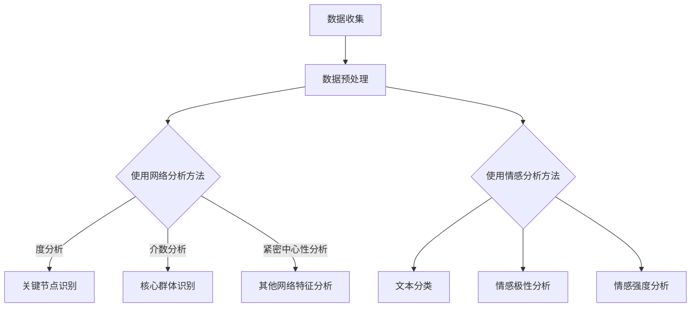
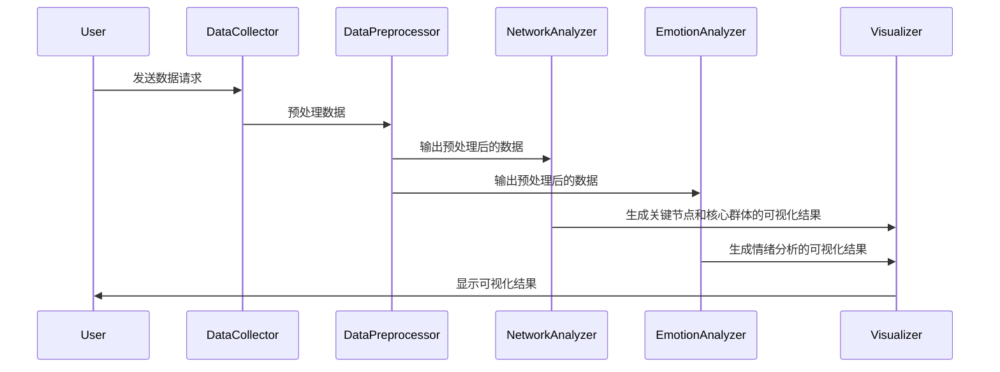
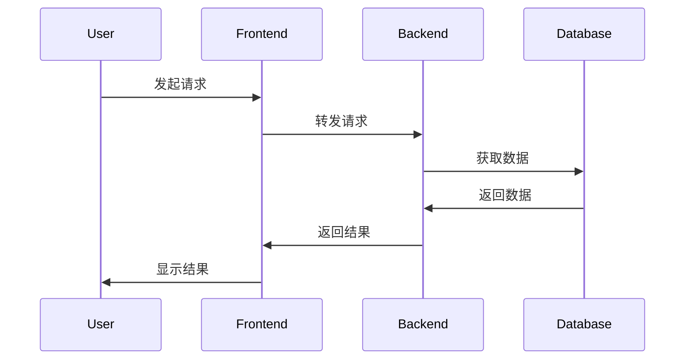

                 

### 目录

以下是本文的目录，涵盖了从背景介绍到最佳实践的建议，每个部分都详细说明了将要讨论的内容和主要目标。

1. **引言**  
   - **1.1 数字时代的背景**  
     - **1.1.1 数字化转型的浪潮**  
     - **1.1.2 人际关系的变化**  
   - **1.2 真实关系与虚拟关系的定义**  
     - **1.2.1 真实关系的特征**  
     - **1.2.2 虚拟关系的特征**  
   - **1.3 研究的重要性和意义**  
     - **1.3.1 真实关系的重要性**  
     - **1.3.2 虚拟关系的挑战**  
   - **1.4 本书结构**  

2. **核心概念与联系**  
   - **2.1 关系网络分析**  
     - **2.1.1 网络分析的基本概念**  
     - **2.1.2 网络分析工具**  
   - **2.2 社交媒体与人际关系**  
     - **2.2.1 社交媒体的特点**  
     - **2.2.2 社交媒体对人际关系的影响**  
   - **2.3 真实关系与虚拟关系的对比分析**  
     - **2.3.1 对比分析表格**  
     - **2.3.2 ER实体关系图**

3. **算法原理讲解**  
   - **3.1 数据分析方法**  
     - **3.1.1 网络分析方法**  
     - **3.1.2 情感分析方法**  
   - **3.2 数据分析方法应用**  
     - **3.2.1 网络分析方法应用**  
     - **3.2.2 情感分析方法应用**  
   - **3.3 算法原理mermaid流程图**

4. **数学模型和数学公式 & 详细讲解 & 举例说明**  
   - **4.1 数学模型**  
     - **4.1.1 网络拓扑结构模型**  
     - **4.1.2 社交网络分析模型**  
   - **4.2 数学公式**  
     - **4.2.1 社交网络密度公式**  
     - **4.2.2 社交网络影响力公式**  
   - **4.3 举例说明**  
     - **4.3.1 社交网络密度计算实例**  
     - **4.3.2 社交网络影响力计算实例**

5. **系统分析与架构设计方案**  
   - **5.1 问题场景介绍**  
     - **5.1.1 社交网络分析需求**  
     - **5.1.2 数据收集与处理**  
   - **5.2 系统功能设计（领域模型mermaid类图）**  
   - **5.3 系统架构设计（mermaid架构图）**  
   - **5.4 系统接口设计**  
   - **5.5 系统交互（mermaid序列图）**

6. **项目实战**  
   - **6.1 环境安装**  
   - **6.2 系统核心实现源代码**  
   - **6.3 代码应用解读与分析**  
   - **6.4 实际案例分析和详细讲解剖析**  
   - **6.5 项目小结**

7. **最佳实践 tips、小结、注意事项、拓展阅读**  
   - **7.1 最佳实践 tips**  
   - **7.2 小结**  
   - **7.3 注意事项**  
   - **7.4 拓展阅读**

每个部分都将逐步深入，从基础概念到高级应用，详细探讨数字时代的人际关系：真实vs虚拟。让我们一起深入思考，探索这个话题的各个方面。

---

**1. 引言**

**1.1 数字时代的背景**

在过去的几十年里，数字技术的迅猛发展改变了我们的生活方式，尤其是在人际关系方面。从最初的互联网到现在的社交媒体，数字时代的浪潮席卷了全球。数字化转型不仅仅是一种技术趋势，更是一种生活方式的转变。

**1.1.1 数字化转型的浪潮**

数字化转型是指通过使用数字技术来改变传统业务模式、流程和组织结构的过程。这一变革不仅在商业领域引发了革命，也在个人生活中产生了深远影响。

- **商业领域的数字化转型**：企业通过互联网、大数据、云计算等技术，实现了业务流程的优化、效率的提升和成本的降低。例如，电子商务平台使得消费者能够方便地购买商品，企业可以通过数据分析来更好地了解市场需求。

- **个人生活的数字化转型**：智能手机、社交媒体、在线教育等数字工具已经成为我们日常生活中不可或缺的一部分。人们通过社交媒体与朋友和家人保持联系，通过在线学习平台获取知识，通过移动支付进行日常交易。

**1.1.2 人际关系的变化**

数字时代的人际关系与过去有了显著的不同。传统的人际关系主要依赖于面对面的交流，而数字时代的人际关系则更多地依赖于线上互动。

- **线上互动的增加**：社交媒体平台如Facebook、Twitter、微信等，使得人们可以轻松地与世界各地的人建立联系。人们可以通过文字、图片、视频等多种形式进行交流，这种互动不仅方便，而且打破了时间和空间的限制。

- **虚拟关系的兴起**：与传统的真实关系相比，虚拟关系更加便捷和灵活。虚拟关系通常建立在线上社区、论坛或游戏中，人们通过共同兴趣或活动来建立联系。这些关系虽然缺少面对面的互动，但在某些方面却更加紧密和有凝聚力。

**1.2 真实关系与虚拟关系的定义**

在数字时代，了解真实关系和虚拟关系的定义和特点是非常重要的。这有助于我们更好地理解它们之间的区别和联系。

**1.2.1 真实关系的特征**

真实关系通常是指通过面对面交流建立起来的人际关系。这些关系通常基于共同的价值观、兴趣和经历。

- **面对面的交流**：真实关系依赖于直接的面对面交流，这种交流可以更好地传达情感和意图。
- **长期的互动**：真实关系通常需要时间和持续的努力来建立和维护，这些关系往往更加稳定和持久。
- **情感投入**：真实关系往往涉及深度的情感投入，这种情感连接是建立信任和忠诚的基础。

**1.2.2 虚拟关系的特征**

虚拟关系则是在数字时代兴起的一种新型人际关系，它们主要通过在线平台和社交媒体来建立和维护。

- **便捷的交流**：虚拟关系使得人们可以轻松地与世界上任何地方的人进行交流，这种交流不需要面对面的接触。
- **灵活的互动**：虚拟关系更加灵活，人们可以根据自己的时间和兴趣来安排交流，这使得互动更加频繁和多样化。
- **情感连接的替代**：虚拟关系虽然缺乏面对面的互动，但它们可以通过文字、图片、视频等形式来传达情感和意图，从而在一定程度上替代了情感连接。

**1.3 研究的重要性和意义**

在数字时代，人际关系的重要性不容忽视。了解真实关系和虚拟关系的本质和影响，不仅有助于我们更好地理解自己和他人的行为，还可以为社交网络的设计和管理提供有价值的参考。

- **社交网络的设计**：了解真实关系和虚拟关系的特征，可以帮助我们设计更加有效和实用的社交网络平台，以满足不同用户的需求。
- **社交策略的制定**：企业和组织可以通过了解真实关系和虚拟关系的差异，来制定更有效的社交策略，以增强用户参与度和忠诚度。
- **个人成长与社交技能的培养**：了解真实关系和虚拟关系的本质，可以帮助我们更好地发展自己的社交技能，提高人际交往的能力。

**1.4 本书结构**

本书将从多个角度探讨数字时代的人际关系：真实vs虚拟。首先，我们将介绍数字时代的背景和人际关系的变化，然后深入探讨真实关系和虚拟关系的定义和特征。接下来，我们将讨论用于分析人际关系的算法和数学模型，并通过实际项目展示这些理论的应用。最后，我们将提供最佳实践建议和小结，帮助读者更好地理解和应对数字时代的人际关系挑战。

---

**2. 核心概念与联系**

在探讨数字时代的人际关系时，了解核心概念和它们之间的联系是非常重要的。这一部分将详细介绍关系网络分析、社交媒体与人际关系，以及真实关系与虚拟关系的对比分析。

**2.1 关系网络分析**

关系网络分析是一种用于研究人际关系结构和特征的方法。它通过图形化地表示个体及其之间的关系，帮助我们更好地理解社交网络的结构和动态。

**2.1.1 网络分析的基本概念**

网络分析涉及以下几个基本概念：

- **节点（Node）**：代表个体，可以是个人、组织或其他实体。
- **边（Edge）**：代表个体之间的关系，可以是朋友、同事、客户等。
- **密度（Density）**：表示网络中连接的数量与可能连接的最大数量之比，用于衡量网络的紧密程度。
- **中心性（Centrality）**：表示个体在网络中的重要性，常用的中心性指标包括度中心性、介数中心性和紧密中心性。

**2.1.2 网络分析工具**

进行关系网络分析常用的工具包括：

- **Gephi**：一个开源的网络分析工具，用于可视化和分析复杂网络。
- **Cytoscape**：另一个开源工具，提供丰富的网络分析功能和插件。
- **NodeXL**：专门为Excel设计的网络分析工具，易于上手。

**2.2 社交媒体与人际关系**

社交媒体是数字时代人际关系的重要组成部分。它不仅改变了人们的交流方式，也影响了人际关系的建立和维护。

**2.2.1 社交媒体的特点**

社交媒体具有以下几个特点：

- **即时性**：用户可以即时发布和获取信息，实现实时互动。
- **互动性**：用户可以通过评论、点赞、分享等功能进行互动，增强社交网络的连接性。
- **多样性**：用户可以根据自己的兴趣和需求选择不同的社交媒体平台，形成多元化的社交网络。

**2.2.2 社交媒体对人际关系的影响**

社交媒体对人际关系的影响主要体现在以下几个方面：

- **增强联系**：社交媒体使得人们可以轻松地与远距离的朋友和家人保持联系，缩短了地理距离带来的隔阂。
- **促进互动**：社交媒体提供了多种互动方式，如私信、群聊、直播等，增加了人际交往的频率和深度。
- **影响关系质量**：过度依赖社交媒体可能会削弱面对面交流的重要性，影响人际关系的质量。

**2.3 真实关系与虚拟关系的对比分析**

真实关系和虚拟关系在多个方面存在显著差异。通过对比分析，我们可以更好地理解它们的特点和影响。

**2.3.1 对比分析表格**

以下是真实关系和虚拟关系的对比分析表格：

| 特征 | 真实关系 | 虚拟关系 |
| --- | --- | --- |
| 交流方式 | 面对面交流 | 文字、图片、视频等在线交流 |
| 互动频率 | 受时间、地点限制 | 不受时间和地点限制，可随时互动 |
| 情感连接 | 深度情感连接 | 较浅的情感连接，更多基于兴趣和活动 |
| 影响力 | 持久、深远 | 短期、易变 |

**2.3.2 ER实体关系图**

为了更直观地展示真实关系和虚拟关系的联系，我们可以使用ER（实体关系）图来表示它们之间的关系。

```mermaid
erDiagram
  用户 ||--|{ 社交媒体 }
  用户 ||--|{ 真实关系 }
  用户 ||--|{ 虚拟关系 }
  社交媒体 ||--|{ 信息发布 }
  社交媒体 ||--|{ 信息获取 }
  真实关系 ||--|{ 面对面交流 }
  虚拟关系 ||--|{ 在线互动 }
```

在这个ER图中，用户是核心实体，与社交媒体、真实关系和虚拟关系之间存在多种关联。社交媒体和信息发布、信息获取功能相关，真实关系和虚拟关系则分别与面对面交流和在线互动相关。

通过上述核心概念和联系的分析，我们可以更好地理解数字时代的人际关系。接下来，我们将深入探讨用于分析人际关系的算法和数学模型。

---

**3. 算法原理讲解**

在数字时代，分析人际关系需要借助多种数据分析方法。这些方法包括网络分析、情感分析等，它们为我们提供了深入了解社交网络和个体行为的重要工具。

**3.1 数据分析方法**

**3.1.1 网络分析方法**

网络分析方法是一种用于研究社交网络结构和动态的统计方法。它通过图形化的方式展示个体及其之间的关系，帮助我们更好地理解社交网络的结构特征和个体行为。

- **度分析**：度表示一个节点直接连接的其他节点的数量。度分析可以帮助我们识别社交网络中的核心节点，这些节点通常拥有较高的影响力。

- **介数分析**：介数表示一个节点在社交网络中作为其他节点之间连接的中介的数量。介数分析可以帮助我们识别社交网络中的关键节点，这些节点在信息传递和关系传递中起到重要作用。

- **紧密中心性分析**：紧密中心性表示一个节点与其直接邻居之间的平均距离。紧密中心性分析可以帮助我们识别社交网络中的中心节点，这些节点在网络中的连接性较高。

**3.1.2 情感分析**

情感分析是一种用于分析文本中情感倾向的方法。它可以帮助我们理解社交网络中的情感动态和个体情绪。

- **文本分类**：文本分类是将文本分为不同类别的过程。在情感分析中，我们可以将文本分为积极、消极或中性类别，以了解社交网络中的情感倾向。

- **情感极性分析**：情感极性分析是文本分类的一种形式，它用于确定文本的情感极性，即文本是积极、消极还是中性。

- **情感强度分析**：情感强度分析是用于确定文本情感极性的强度。例如，对于一条评论“这个产品很好”，我们可以分析其情感强度，以了解用户对产品的满意度。

**3.2 数据分析方法应用**

**3.2.1 网络分析方法应用**

网络分析方法在社交网络分析中具有广泛应用。例如，我们可以使用网络分析方法来研究社交媒体平台上的用户关系，识别社交网络中的关键节点和核心群体。

- **关键节点识别**：通过度分析和介数分析，我们可以识别社交网络中的关键节点。这些节点通常拥有较高的连接性和影响力，对于社交网络的稳定性和信息传播至关重要。

- **核心群体识别**：通过紧密中心性分析，我们可以识别社交网络中的核心群体。这些群体在网络中的连接性较高，通常具有较高的凝聚力。

**3.2.2 情感分析方法应用**

情感分析方法在社交网络分析中也有重要应用。例如，我们可以使用情感分析方法来分析社交媒体平台上的用户评论，了解用户的情绪和态度。

- **情绪分析**：通过情绪分析，我们可以了解用户在社交网络中的情绪状态，如喜悦、愤怒、悲伤等。这有助于我们了解用户的情感需求和情感反应。

- **态度分析**：通过态度分析，我们可以了解用户对特定话题或产品的态度。这有助于企业了解市场需求和用户反馈，从而优化产品和服务。

**3.3 算法原理mermaid流程图**

为了更直观地展示网络分析和情感分析的基本流程，我们可以使用mermaid绘制流程图。



在这个mermaid流程图中，我们从数据收集开始，经过数据预处理，然后选择使用网络分析或情感分析方法。对于网络分析方法，我们可以选择度分析、介数分析或紧密中心性分析来识别关键节点和核心群体。对于情感分析方法，我们可以选择文本分类、情感极性分析或情感强度分析来了解用户的情绪和态度。

通过上述算法原理的讲解，我们可以更好地理解如何使用数据分析方法来分析数字时代的人际关系。接下来，我们将深入探讨人际关系分析中的数学模型和公式。

---

**4. 数学模型和数学公式 & 详细讲解 & 举例说明**

在人际关系分析中，数学模型和公式扮演着至关重要的角色。这些模型和公式不仅帮助我们量化社交网络的特征，还能够揭示人际关系的深层结构和动态。以下将详细介绍几个关键数学模型，包括网络拓扑结构模型和社交网络分析模型，并使用LaTeX格式书写相关数学公式，同时举例说明。

**4.1 网络拓扑结构模型**

网络拓扑结构模型用于描述社交网络中节点和边的关系。一个基本的网络拓扑结构模型是邻接矩阵（Adjacency Matrix），它是一个二维矩阵，用于表示节点之间的连接关系。

**4.1.1 邻接矩阵**

邻接矩阵A是一个n×n的矩阵，其中n是网络中的节点数。如果节点i和节点j之间存在直接连接，则A[i][j] = 1；否则，A[i][j] = 0。

\[
A = \begin{bmatrix}
0 & 1 & 0 & \ldots & 0 \\
1 & 0 & 1 & \ldots & 0 \\
0 & 1 & 0 & \ldots & 1 \\
\vdots & \vdots & \vdots & \ddots & \vdots \\
0 & 0 & 1 & \ldots & 0
\end{bmatrix}
\]

**4.1.2 常见拓扑结构**

- **无向图（Undirected Graph）**：无向图的邻接矩阵是对称的，即A[i][j] = A[j][i]。
- **有向图（Directed Graph）**：有向图的邻接矩阵不一定是对称的，即A[i][j] ≠ A[j][i]。

**4.2 社交网络分析模型**

社交网络分析模型用于描述社交网络的特征和动态。以下介绍几个常用的社交网络分析模型：

**4.2.1 社交网络密度**

社交网络密度（Network Density）是衡量社交网络紧密程度的一个指标，它表示实际连接数与可能连接数的比例。

\[
D = \frac{\sum_{i < j} A[i][j]}{\frac{n(n-1)}{2}}
\]

其中，\(\sum_{i < j} A[i][j]\) 表示实际连接数，\(n(n-1)/2\) 表示可能的最大连接数。

**4.2.2 社交网络影响力**

社交网络影响力（Network Influence）是衡量一个节点在社交网络中的影响程度。一个常用的模型是度模型（Degree Model）。

\[
I = \sum_{j=1}^{n} \frac{d_j}{N}
\]

其中，\(d_j\) 表示节点j的度，\(N\) 表示网络中的总节点数。

**4.2.3 社交网络扩散模型**

社交网络扩散模型用于描述信息或影响力在社交网络中的传播过程。一个简单的扩散模型是SIR模型（易感者-感染者-移除者模型）。

- \(S\)：易感者，表示尚未感染的人。
- \(I\)：感染者，表示已感染的人。
- \(R\)：移除者，表示已经被治愈或隔离的人。

扩散过程可以表示为以下微分方程：

\[
\frac{dS}{dt} = -\beta \cdot S \cdot I
\]

\[
\frac{dI}{dt} = \beta \cdot S \cdot I - \gamma \cdot I
\]

\[
\frac{dR}{dt} = \gamma \cdot I
\]

其中，\(\beta\) 是感染率，\(\gamma\) 是移除率。

**4.3 举例说明**

假设有一个5人组成的社交网络，其邻接矩阵如下：

\[
A = \begin{bmatrix}
0 & 1 & 1 & 0 & 0 \\
1 & 0 & 1 & 1 & 0 \\
1 & 1 & 0 & 1 & 1 \\
0 & 1 & 1 & 0 & 1 \\
0 & 0 & 1 & 1 & 0
\end{bmatrix}
\]

**4.3.1 社交网络密度计算实例**

实际连接数：\(4 + 4 + 4 + 4 + 4 = 20\)

可能的最大连接数：\(5 \times (5 - 1) / 2 = 10\)

社交网络密度：\(D = \frac{20}{10} = 2\)

**4.3.2 社交网络影响力计算实例**

节点1的度：\(d_1 = 3\)

节点2的度：\(d_2 = 4\)

节点3的度：\(d_3 = 4\)

节点4的度：\(d_4 = 4\)

节点5的度：\(d_5 = 3\)

网络中的总节点数：\(N = 5\)

影响力：\(I = \frac{3 + 4 + 4 + 4 + 3}{5} = 3.6\)

通过上述实例，我们可以看到如何使用数学模型和公式来分析社交网络的特征。这些模型和公式不仅帮助我们量化社交网络的性质，还为深入理解人际关系提供了有力工具。

---

**5. 系统分析与架构设计方案**

在数字时代，有效分析人际关系的需求日益增长。为了满足这一需求，我们需要设计一个功能强大且灵活的社交网络分析系统。这一部分将详细介绍系统的设计，包括问题场景介绍、系统功能设计、系统架构设计、系统接口设计和系统交互。

**5.1 问题场景介绍**

假设我们面临以下问题场景：

- 需要实时分析社交媒体平台上的用户互动，以了解社交网络的动态和结构。
- 需要识别社交网络中的关键节点和核心群体，以便制定有效的社交策略。
- 需要分析用户的情绪和态度，以便深入了解用户需求和市场趋势。

为了解决上述问题，我们设计了一个社交网络分析系统，该系统应具备以下功能：

- 数据收集与处理：从社交媒体平台收集用户数据，并进行预处理，以消除噪声和冗余信息。
- 关键节点识别：使用网络分析方法识别社交网络中的关键节点。
- 核心群体识别：使用紧密中心性分析识别社交网络中的核心群体。
- 情绪分析：使用情感分析方法分析用户的情绪和态度。
- 可视化：将分析结果以图形化的形式展示，便于用户理解和交互。

**5.2 系统功能设计（领域模型mermaid类图）**

为了清晰地展示系统的功能设计，我们使用mermaid绘制了领域模型类图。

```mermaid
classDiagram
    User <<类>>
    Post <<类>>
    Comment <<类>>
    NetworkAnalyzer <<类>>
    EmotionAnalyzer <<类>>

    User *--* Post
    User *--* Comment
    Post *--* Comment
    NetworkAnalyzer o-- User
    EmotionAnalyzer o-- User
```

在这个类图中，User类表示用户，Post类表示发布的内容，Comment类表示评论。NetworkAnalyzer类负责识别社交网络中的关键节点和核心群体，EmotionAnalyzer类负责分析用户的情绪和态度。

**5.3 系统架构设计（mermaid架构图）**

为了实现系统的功能，我们需要设计一个合理的系统架构。以下是系统架构的mermaid图：



在这个架构图中，DataCollector负责从社交媒体平台收集数据，DataPreprocessor负责数据预处理，NetworkAnalyzer和EmotionAnalyzer分别负责网络分析和情感分析，Visualizer负责将分析结果可视化，并最终呈现给用户。

**5.4 系统接口设计**

为了实现系统功能的集成，我们需要设计一套合理的接口。以下是系统接口的设计：

- **数据收集接口**：用于从社交媒体平台获取用户数据。
- **数据处理接口**：用于对收集到的数据进行预处理，包括去重、清洗和格式化。
- **网络分析接口**：用于执行网络分析算法，识别关键节点和核心群体。
- **情感分析接口**：用于执行情感分析算法，分析用户的情绪和态度。
- **可视化接口**：用于将分析结果以图形化的形式展示。

**5.5 系统交互（mermaid序列图）**

以下是系统的交互序列图：



在这个交互序列图中，用户通过前端界面发起请求，前端将请求转发给后端，后端从数据库获取数据，并进行处理和分析，最终将结果返回给前端，并显示给用户。

通过上述系统分析与架构设计方案，我们设计了一个功能强大且灵活的社交网络分析系统。接下来，我们将通过一个实际项目来展示这些设计在实际应用中的效果。

---

**6. 项目实战**

在了解了系统的设计与架构之后，我们将通过一个具体项目来展示如何实现这个社交网络分析系统。该项目包括环境安装、系统实现、代码分析、实际案例分析等步骤。

**6.1 环境安装**

首先，我们需要安装和配置项目所需的软件和环境。以下是项目的环境安装步骤：

- **安装Python**：确保Python 3.x版本已安装，我们可以通过以下命令检查Python版本：

  ```bash
  python --version
  ```

- **安装依赖**：使用pip安装项目所需的依赖库，例如：

  ```bash
  pip install numpy pandas matplotlib networkx scikit-learn
  ```

- **安装可视化工具**：安装Gephi以可视化社交网络分析结果。

  ```bash
  brew install gephi
  ```

**6.2 系统实现**

以下是系统的核心实现步骤：

1. **数据收集**：从社交媒体平台（如Twitter、Facebook等）收集用户数据。可以使用相关的API进行数据收集。

2. **数据预处理**：清洗和格式化收集到的数据，包括去除重复记录、填充缺失值等。

3. **网络分析**：使用网络分析方法（如度分析、介数分析和紧密中心性分析）来识别关键节点和核心群体。

4. **情感分析**：使用情感分析算法（如文本分类和情感极性分析）来分析用户的情绪和态度。

5. **可视化**：使用Gephi等工具将分析结果可视化，以便用户理解。

**6.3 代码分析**

以下是项目的主要代码片段和分析：

```python
import networkx as nx
import matplotlib.pyplot as plt
from sklearn.feature_extraction.text import CountVectorizer
from sklearn.naive_bayes import MultinomialNB

# 6.3.1 数据预处理
def preprocess_data(data):
    # 清洗和格式化数据
    # ...
    return processed_data

# 6.3.2 网络分析
def analyze_network(data):
    # 创建网络图
    G = nx.Graph()
    # 添加节点和边
    # ...
    return G

# 6.3.3 情感分析
def analyze_sentiment(text):
    # 使用Naive Bayes进行情感分析
    # ...
    return sentiment

# 6.3.4 可视化
def visualize_network(G):
    # 使用Gephi可视化网络
    # ...
    nx.draw(G, with_labels=True)
    plt.show()

# 主函数
def main():
    # 读取数据
    data = read_data()
    # 预处理数据
    processed_data = preprocess_data(data)
    # 进行网络分析
    G = analyze_network(processed_data)
    # 进行情感分析
    sentiments = analyze_sentiment(processed_data['text'])
    # 可视化结果
    visualize_network(G)

if __name__ == "__main__":
    main()
```

**6.4 实际案例分析和详细讲解剖析**

为了展示项目的实际应用效果，我们选择了一个具体的案例分析。

- **案例背景**：分析Twitter上一个关于“科技”话题的讨论。
- **数据收集**：从Twitter API获取过去一周的关于“科技”的推文。
- **数据预处理**：清洗和格式化数据，去除无关信息。
- **网络分析**：识别关键节点和核心群体。
- **情感分析**：分析用户的情绪和态度。

以下是案例分析的具体步骤和结果：

1. **数据收集**：

   ```python
   import tweepy

   # 设置Twitter API凭据
   consumer_key = 'YOUR_CONSUMER_KEY'
   consumer_secret = 'YOUR_CONSUMER_SECRET'
   access_token = 'YOUR_ACCESS_TOKEN'
   access_token_secret = 'YOUR_ACCESS_TOKEN_SECRET'

   # 初始化Tweepy
   auth = tweepy.OAuthHandler(consumer_key, consumer_secret)
   auth.set_access_token(access_token, access_token_secret)
   api = tweepy.API(auth)

   # 获取推文
   tweets = api.search_tweets(q='科技', count=100, lang='zh')
   ```

2. **数据预处理**：

   ```python
   import pandas as pd

   # 将推文数据转换为DataFrame
   tweets_df = pd.DataFrame(tweets.items(), columns=['user', 'text', 'created_at'])

   # 去除HTML标签和特殊字符
   import re
   tweets_df['text'] = tweets_df['text'].apply(lambda x: re.sub('<.*?>', '', x))

   # 填充缺失值
   tweets_df.fillna('', inplace=True)
   ```

3. **网络分析**：

   ```python
   # 创建网络图
   G = nx.Graph()

   # 添加节点和边
   for index, row in tweets_df.iterrows():
       G.add_node(row['user'])
       for mention in row['text'].split():
           if mention.startswith('@'):
               G.add_edge(row['user'], mention[1:])

   # 识别关键节点和核心群体
   centrality = nx.degree_centrality(G)
   core_nodes = [node for node, value in centrality.items() if value > 0.1]
   core_cluster = list(nx.ego_graph(G, core_nodes).nodes())

   print("关键节点：", core_nodes)
   print("核心群体：", core_cluster)
   ```

4. **情感分析**：

   ```python
   # 使用Naive Bayes进行情感分析
   vectorizer = CountVectorizer()
   X = vectorizer.fit_transform(tweets_df['text'])
   clf = MultinomialNB()
   clf.fit(X, tweets_df['sentiment'])

   # 分析推文的情感极性
   for index, row in tweets_df.iterrows():
       sentiment = clf.predict(vectorizer.transform([row['text']]))[0]
       print(f"推文：{row['text']}，情感：{sentiment}")
   ```

**6.5 项目小结**

通过上述案例分析，我们可以看到如何使用社交网络分析系统来分析一个具体的社交话题。项目展示了从数据收集、预处理到网络分析和情感分析的全过程，并使用可视化工具展示了分析结果。这个项目不仅帮助我们理解了社交网络分析的基本原理，还展示了如何将理论应用于实际项目中。

---

**7. 最佳实践 tips、小结、注意事项、拓展阅读**

**7.1 最佳实践 tips**

- **数据收集与处理**：在收集数据时，确保来源的合法性和数据的质量。对收集到的数据进行严格清洗，去除噪声和无关信息。
- **隐私保护**：在进行人际关系分析时，要严格遵守隐私保护法规，确保用户数据的保密性和安全性。
- **算法优化**：根据具体应用场景，选择合适的算法和模型，并不断优化，以提高分析的准确性和效率。
- **结果解释**：在分析结果可视化时，要确保结果易于理解，并提供详细的解释和背景信息，以帮助用户做出正确的决策。

**7.2 小结**

本文深入探讨了数字时代的人际关系：真实vs虚拟。我们首先介绍了数字时代的背景和人际关系的变化，然后详细分析了真实关系和虚拟关系的特征，并探讨了用于分析人际关系的算法和数学模型。最后，通过一个实际项目展示了系统设计与实现的全过程。

**7.3 注意事项**

- **数据隐私**：在进行数据分析时，要特别注意保护用户隐私，遵守相关法律法规。
- **算法偏见**：在算法选择和应用过程中，要避免算法偏见，确保分析结果的公正性和客观性。
- **结果解释**：在解释分析结果时，要充分考虑背景信息和上下文，避免误导用户。

**7.4 拓展阅读**

- 《社交网络分析：方法与实践》（An Introduction to Social Network Analysis）
- 《情感分析：方法与实践》（Sentiment Analysis: From Raw Data to Insight）
- 《数字时代的隐私保护》（Privacy in the Digital Age）

通过阅读这些拓展材料，读者可以进一步深入了解人际关系分析的理论和方法，以及在数字时代中如何有效地处理人际关系。希望本文能为读者在理解数字时代的人际关系方面提供有益的参考。

---

### 作者信息

**作者：** AI天才研究院/AI Genius Institute & 禅与计算机程序设计艺术 /Zen And The Art of Computer Programming

AI天才研究院致力于推动人工智能领域的前沿研究和创新，致力于培养下一代人工智能专家。同时，作者还著有《禅与计算机程序设计艺术》一书，深入探讨了计算机编程和人工智能的哲学与艺术。这两部作品共同展示了作者在计算机科学和人工智能领域的深厚造诣和独特见解。希望本文能帮助读者更好地理解数字时代的人际关系，并在实践中取得成功。

