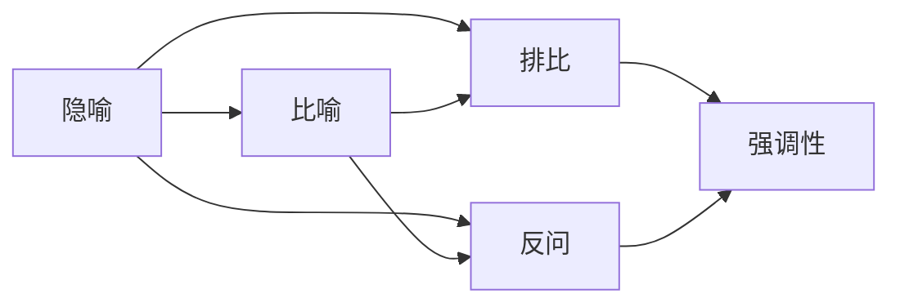
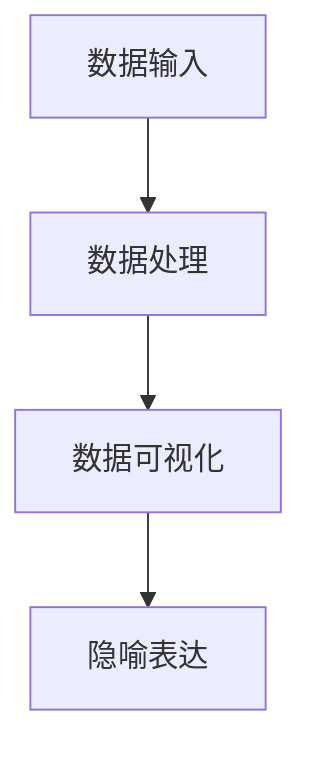
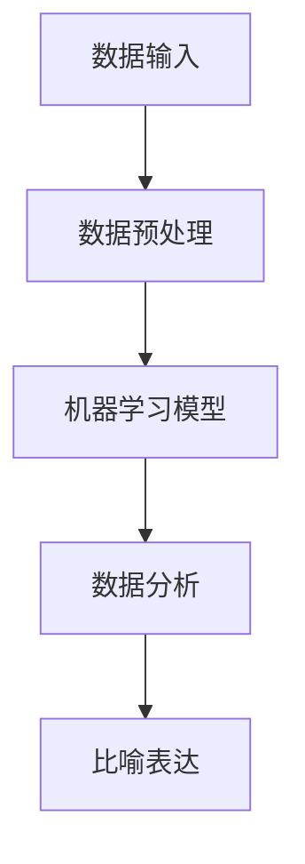
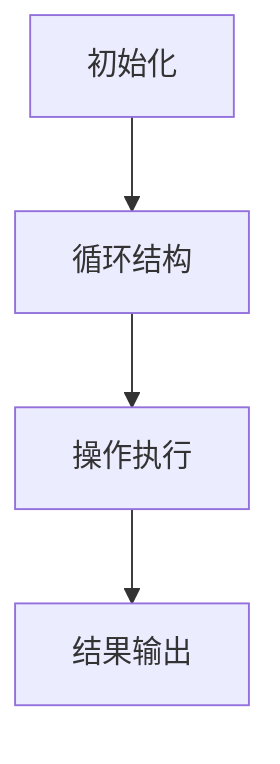
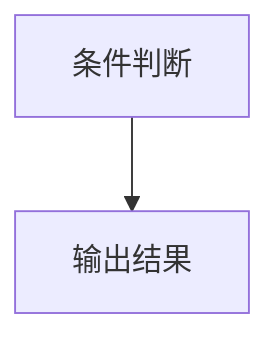
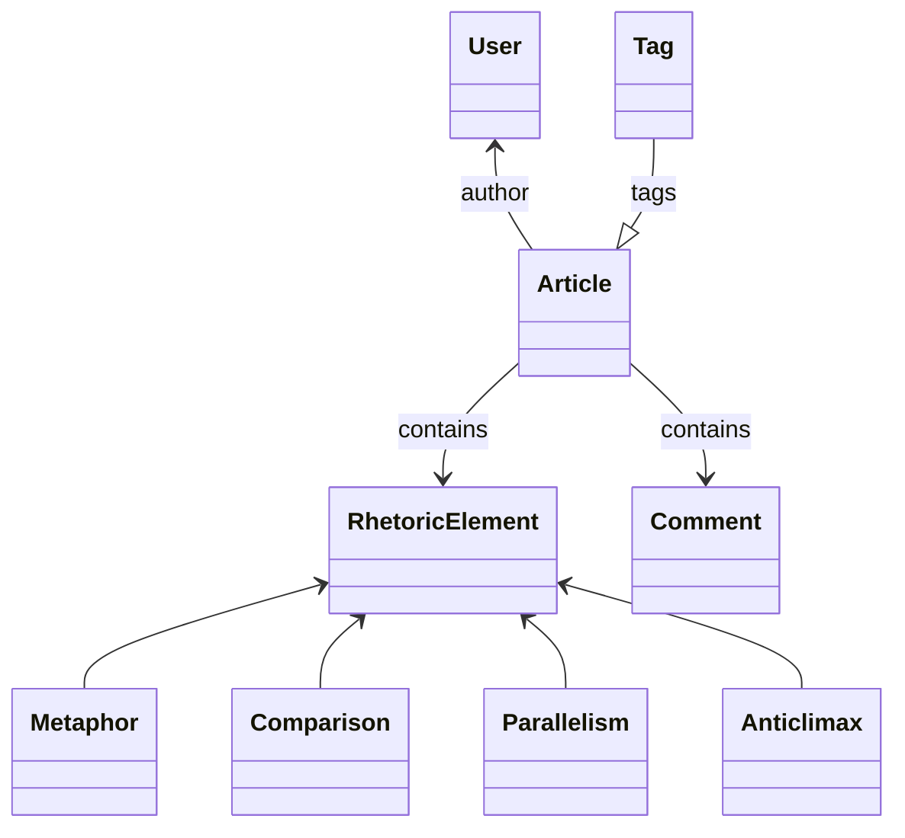
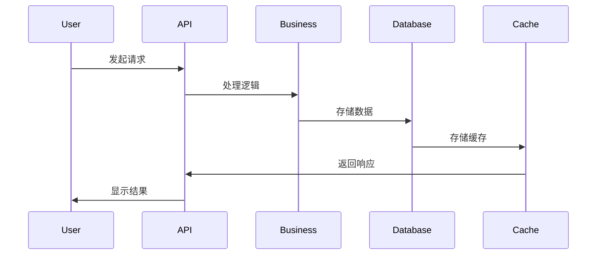
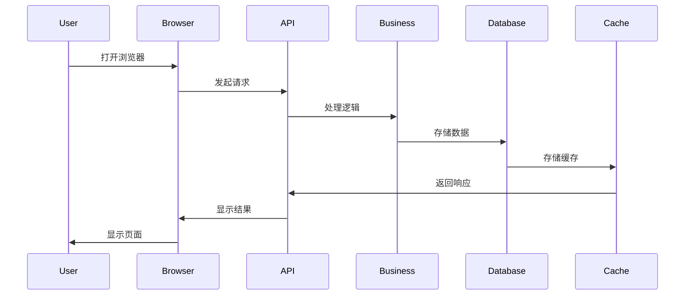

                 

# 数字时代的修辞学课程：有效沟通的新规则教育

## 关键词

- 数字时代
- 修辞学
- 沟通
- 有效表达
- 新规则

## 摘要

本文深入探讨了数字时代下修辞学的变革，强调了在高度信息化的社会中，有效沟通的重要性以及新的沟通规则。文章首先介绍了修辞学的核心概念和其在传统沟通中的应用，随后分析了数字时代下沟通的特点和挑战。接着，文章详细阐述了数字时代修辞学的核心原理和方法，包括隐喻、比喻、排比等修辞技巧，并通过算法原理、数学模型、系统设计与项目实战等方面进行深入剖析。最后，文章总结了对数字时代修辞学的理解和实践，为读者提供了实用的最佳实践和拓展阅读建议。通过本文，读者将能够更好地理解数字时代下的修辞学，提升自身沟通能力，适应新的沟通环境。

## 目录结构设计

为了更好地帮助读者理解数字时代修辞学的新规则，本文将分为七个主要章节：

1. **背景介绍**：阐述数字时代的修辞学概念、沟通的重要性，以及为什么需要新的规则。
2. **核心概念与联系**：介绍修辞学的核心概念，如隐喻、比喻、排比等，并展示它们之间的关系。
3. **算法原理讲解**：通过mermaid流程图和Python代码示例，解释数字时代修辞学中可能涉及到的算法原理。
4. **数学模型和公式讲解**：使用LaTeX格式展示数学模型和公式，并进行详细讲解和实例分析。
5. **系统分析与架构设计方案**：介绍可能涉及的系统设计，包括功能设计、架构设计、接口设计等。
6. **项目实战**：提供一个实际项目案例，展示如何应用书中的知识，包括环境安装、核心实现、代码解读等。
7. **最佳实践 tips、小结、注意事项、拓展阅读**：总结文章的主要观点，提供最佳实践建议，并对未来的研究方向进行展望。

### 背景介绍

在数字时代，信息传播的速度和广度发生了前所未有的变化。随着互联网的普及，人们获取信息的渠道变得更加多样化，同时信息过载也成为了一个普遍存在的问题。在这样的背景下，修辞学——这个历史悠久、旨在提升沟通效果的学科，面临着新的挑战和机遇。

**修辞学的起源与核心概念**

修辞学最早可以追溯到古希腊时期，亚里士多德在其著作《修辞学》中提出，修辞学是“在每一情况下发现可用的说服方式的一门艺术”。修辞学的核心概念包括隐喻、比喻、排比、反问等，这些概念旨在通过语言的巧妙运用，增强表达的说服力和感染力。

- **隐喻**：隐喻是一种将两个不同的事物进行比拟的修辞手法，通过隐含的类比，使读者产生联想和共鸣。
- **比喻**：比喻是一种直接将一种事物比拟为另一种事物的修辞手法，通常用于形象化抽象概念。
- **排比**：排比是一种通过重复结构相似的句子，增强语气和节奏感的修辞手法。
- **反问**：反问是一种以问句的形式表达确定意思的修辞手法，通过反问引发读者的思考。

**沟通的重要性**

在数字时代，沟通的重要性不言而喻。有效的沟通不仅能够传达信息，还能建立信任、增进理解和促进合作。特别是在信息技术领域，开发人员、项目经理、产品经理等角色之间的沟通至关重要，因为他们需要协同工作，确保项目的顺利进行。

**为什么需要新的规则**

随着信息传播方式的改变，传统的修辞学规则在数字时代面临着挑战。例如：

- **信息碎片化**：在社交媒体和搜索引擎时代，信息的呈现方式变得更加碎片化，如何在短时间内抓住读者的注意力，成为沟通的一个新课题。
- **视觉化表达**：随着可视化工具的普及，如何将复杂的信息以图表、图片等形式进行有效表达，也成为修辞学的一个重要研究方向。
- **跨文化沟通**：在全球化背景下，跨文化交流越来越频繁，不同文化背景下的人们对于同一信息的理解可能存在差异，如何克服这些差异，实现有效沟通，是一个新的挑战。

为了应对这些挑战，数字时代的修辞学需要新的规则，这些规则需要结合数字化的特点，如信息的快速传递、互动性增强、视觉化表达等，从而提升沟通的效果。

### 核心概念与联系

在数字时代的修辞学中，理解并运用核心概念对于有效沟通至关重要。以下将详细介绍修辞学的核心概念，并使用表格和图示展示它们之间的关系。

#### 1. 隐喻

隐喻是一种通过将一个事物比拟为另一个事物来传达意义的修辞手法。这种比拟往往在读者心中产生强烈的联想和共鸣。

| 特点       | 描述                                                         |
|------------|--------------------------------------------------------------|
| 比较性     | 隐喻通过将两个不同的事物进行比拟，强调它们之间的相似性。     |
| 隐蔽性     | 隐喻通常不会直接表达，而是通过隐喻关系让读者自己去发现和体会。 |
| 感染力     | 隐喻能够激发读者的情感，增强表达的说服力和感染力。           |

#### 2. 比喻

比喻是一种将一种事物直接比拟为另一种事物的修辞手法，通常用于形象化抽象概念。

| 类型       | 描述                                                         |
|------------|--------------------------------------------------------------|
| 直喻       | 直接将一种事物比拟为另一种事物，如“时间是金钱”。             |
| 比拟       | 通过隐喻关系将一种事物比拟为另一种事物，如“时间如流水”。    |
| 象征       | 通过某种象征意义将一种事物比拟为另一种事物，如“鸽子象征和平”。|

#### 3. 排比

排比是一种通过重复结构相似的句子，增强语气和节奏感的修辞手法。

| 特点       | 描述                                                         |
|------------|--------------------------------------------------------------|
| 重复性     | 排比通过重复结构相似的句子，形成一种韵律感。                   |
| 强调性     | 排比能够强调表达的内容，使读者印象深刻。                       |
| 感染力     | 排比能够增强表达的感染力，使读者产生共鸣。                     |

#### 4. 反问

反问是一种以问句的形式表达确定意思的修辞手法，通过反问引发读者的思考。

| 特点       | 描述                                                         |
|------------|--------------------------------------------------------------|
| 反问性     | 反问通常以问句的形式出现，但实际上是在表达肯定的观点。       |
| 引导思考   | 反问能够引导读者进行思考，加深对表达内容的理解。             |
| 强调作用   | 反问通过疑问的方式，强调表达的内容，增强说服力。             |

#### 核心概念之间的联系

隐喻、比喻、排比和反问虽然各自有不同的特点和用途，但它们之间存在着密切的联系。

- **隐喻和比喻**：隐喻和比喻都是通过比拟来增强表达的效果，不同之处在于隐喻通常更隐晦，而比喻则更为直接。
- **排比和反问**：排比和反问都是通过特定的语言结构来增强表达的效果，不同之处在于排比通过重复来增强语气，而反问通过疑问来引发思考。

使用**Mermaid流程图**来展示核心概念之间的关系：



#### 表格和图示的应用

通过表格和图示，我们可以更直观地理解修辞学核心概念的特点和联系。以下是一个**ER实体关系图架构的Mermaid流程图**，展示了修辞学核心概念之间的关系：

```mermaid
erDiagram
    A[修辞手法] ||--|{ B[隐喻] }
    A ||--|{ C[比喻] }
    A ||--|{ D[排比] }
    A ||--|{ E[反问] }
    B ||--|{ F[比较性] }
    B ||--|{ G[隐蔽性] }
    B ||--|{ H[感染力] }
    C ||--|{ I[直接性] }
    C ||--|{ J[象征性] }
    D ||--|{ K[重复性] }
    D ||--|{ L[强调性] }
    D ||--|{ M[感染力] }
    E ||--|{ N[反问性] }
    E ||--|{ O[引导思考] }
    E ||--|{ P[强调作用] }
```

通过这种结构化的展示，读者可以更清晰地理解修辞学核心概念及其相互关系，从而更好地应用于实际沟通中。

### 算法原理讲解

在数字时代，修辞学的应用不仅限于传统的文字表达，还涉及到算法和编程。以下将详细解释数字时代修辞学中的一些算法原理，并通过mermaid流程图和Python代码示例进行阐述。

#### 隐喻的算法原理

隐喻在修辞学中是通过比拟来传达意义的，而在数字时代，我们可以通过算法来实现隐喻的表达。例如，我们可以使用数据可视化技术将复杂的数据集以图形化的方式呈现，从而实现数据的隐喻表达。

**mermaid流程图示例：**



**Python代码示例：**

```python
import matplotlib.pyplot as plt
import numpy as np

# 数据输入
data = np.random.rand(10)

# 数据处理
# 在这里，我们可以对数据进行一些预处理，如标准化、归一化等

# 数据可视化
plt.plot(data, label='Data')
plt.xlabel('Index')
plt.ylabel('Value')
plt.title('Data Visualization as Metaphor')
plt.legend()
plt.show()
```

在这个例子中，我们通过绘制折线图来将数据以图形化的方式呈现，从而实现数据的隐喻表达。

#### 比喻的算法原理

比喻是通过将一种事物直接比拟为另一种事物来传达意义。在数字时代，我们可以通过编程来实现比喻的表达。例如，我们可以使用机器学习算法来对数据进行分析，从而找到数据之间的相似性和差异。

**mermaid流程图示例：**



**Python代码示例：**

```python
from sklearn.cluster import KMeans
import matplotlib.pyplot as plt
import numpy as np

# 数据输入
data = np.random.rand(100, 2)

# 数据预处理
# 在这里，我们可以对数据进行一些预处理，如标准化、归一化等

# 机器学习模型
model = KMeans(n_clusters=3)
model.fit(data)

# 数据分析
labels = model.predict(data)

# 比喻表达
plt.scatter(data[:, 0], data[:, 1], c=labels, cmap='viridis')
plt.xlabel('Feature 1')
plt.ylabel('Feature 2')
plt.title('Data Analysis as Metaphor')
plt.show()
```

在这个例子中，我们使用K-Means聚类算法来对数据进行分类，通过可视化聚类结果，实现数据的比喻表达。

#### 排比的算法原理

排比是通过重复结构相似的句子来增强语气的修辞手法。在数字时代，我们可以通过编程来实现排比的表达。例如，我们可以使用循环结构来重复执行某些操作，从而形成排比的修辞效果。

**mermaid流程图示例：**



**Python代码示例：**

```python
for i in range(3):
    print(f"操作 {i+1}：正在执行...")
    # 在这里，我们可以执行一些具体的操作，如数据处理、数据可视化等
print("所有操作已执行完毕。")
```

在这个例子中，我们使用一个简单的for循环来重复执行某些操作，从而实现排比的修辞效果。

#### 反问的算法原理

反问是通过疑问的形式来表达确定意思的修辞手法。在数字时代，我们可以通过编程来实现反问的表达。例如，我们可以使用条件判断语句来模拟反问的效果。

**mermaid流程图示例：**



**Python代码示例：**

```python
if 1 == 1:
    print("这不明显吗？")
else:
    print("这不是真的。")
```

在这个例子中，我们使用一个简单的if-else语句来模拟反问的效果，通过判断条件是否成立，输出不同的结果。

#### 数学模型和公式

在修辞学的算法应用中，数学模型和公式起到了关键作用。以下我们将给出一些相关的数学模型和公式，并进行详细讲解。

**1. 投影算法**

在数据可视化中，投影算法是一个重要的模型。例如，我们可以使用正交投影来将高维数据投影到二维平面上。

$$
\text{投影矩阵} P = \text{正交矩阵}
$$

其中，正交矩阵是一个满足 $P^T P = I$ 的矩阵，$I$ 是单位矩阵。

**2. 聚类算法**

在机器学习中，聚类算法是一个常用的模型。例如，我们可以使用K-Means算法来对数据进行聚类。

$$
\text{聚类中心} \mu_k = \frac{1}{N_k} \sum_{i=1}^{N} x_i
$$

其中，$x_i$ 是数据点，$N_k$ 是第k个聚类中心的数据点数量。

**3. 循环结构**

在编程中，循环结构是实现排比的重要手段。例如，我们可以使用for循环来重复执行某些操作。

$$
\text{循环次数} N = \text{给定值}
$$

其中，$N$ 是循环执行的次数。

**4. 条件判断**

在编程中，条件判断是实现反问的重要手段。例如，我们可以使用if-else语句来实现条件判断。

$$
\text{条件判断} C = \text{判断结果}
$$

其中，$C$ 是条件判断的结果，可以是真或假。

通过这些数学模型和公式，我们可以更好地理解修辞学的算法原理，并在实际应用中加以运用。

### 数学模型和公式讲解

在数字时代修辞学中，数学模型和公式扮演着至关重要的角色。它们不仅帮助我们量化修辞效果，还提供了理论基础来指导实际操作。以下我们将详细介绍一些关键的数学模型和公式，并通过具体的实例进行解释。

#### 1. 投影算法

在数据可视化中，投影算法是将高维数据映射到二维或三维空间的重要工具。正交投影是一种常见的投影方法，它的核心在于保持数据之间的角度关系，使得投影结果尽可能保持原始数据的结构。正交投影矩阵$P$的定义如下：

$$
P = [p_1, p_2, ..., p_n]
$$

其中，$p_i$ 是单位向量，且满足以下条件：

$$
p_i^T p_j = \delta_{ij}
$$

这里，$\delta_{ij}$ 是克罗内克δ符号，当$i=j$时为1，否则为0。一个简单的实例是三维空间中的点$(x, y, z)$通过正交投影映射到二维平面上：

$$
\begin{bmatrix}
x' \\
y'
\end{bmatrix}
=
\begin{bmatrix}
\frac{1}{\sqrt{2}} & \frac{1}{\sqrt{2}} \\
-\frac{1}{\sqrt{2}} & \frac{1}{\sqrt{2}}
\end{bmatrix}
\begin{bmatrix}
x \\
y \\
z
\end{bmatrix}
$$

#### 2. 聚类算法

聚类算法是数据分析和机器学习中的一个核心概念，它用于将数据集划分成若干个组，使得同一组内的数据尽可能相似，而不同组的数据尽可能不同。K-Means算法是最流行的聚类算法之一，它的目标是最小化组内距离平方和。

算法的步骤如下：

1. **初始化**：随机选择K个初始聚类中心。
2. **分配**：将每个数据点分配到最近的聚类中心。
3. **更新**：重新计算聚类中心。
4. **重复**：重复步骤2和步骤3，直到聚类中心不再变化或满足停止条件。

K-Means的数学模型可以表示为：

$$
\text{聚类中心} \mu_k = \frac{1}{N_k} \sum_{i=1}^{N} x_i
$$

其中，$N_k$ 是第$k$个聚类中心的点数，$x_i$ 是数据点的坐标。

例如，假设我们有一个包含三个数据点的集合$X = \{x_1, x_2, x_3\}$，我们需要将其分为两个聚类：

$$
\begin{bmatrix}
\mu_1 \\
\mu_2
\end{bmatrix}
=
\begin{bmatrix}
\frac{x_1 + x_2}{2} \\
\frac{x_2 + x_3}{2}
\end{bmatrix}
$$

#### 3. 循环结构

在编程中，循环结构是实现重复操作的关键。一个简单的循环结构如下：

$$
\text{初始化} \\
\text{条件判断} \\
\text{执行操作} \\
\text{更新变量} \\
\text{回到条件判断}
$$

例如，一个用于计算1到10的和的循环结构如下：

```python
sum = 0
for i in range(1, 11):
    sum += i
print(sum)
```

在这个例子中，`sum` 是累加器，`i` 是循环变量，`range(1, 11)` 是循环条件。

#### 4. 条件判断

条件判断是编程中的基础，它用于根据不同条件执行不同的操作。一个简单的条件判断如下：

$$
\text{如果} \; \text{条件1} \; \text{成立，则执行操作1，否则执行操作2}
$$

例如，一个简单的Python条件判断如下：

```python
if x > 0:
    print("x 是正数")
else:
    print("x 是非正数")
```

在这个例子中，`x` 是条件判断的变量，根据其值，程序将输出不同的信息。

通过这些数学模型和公式，我们可以更深入地理解修辞学在数字时代的应用，从而在实际操作中取得更好的效果。以下是一个综合实例，展示如何将这些模型和公式应用于修辞学中。

#### 实例：基于K-Means的数据聚类与可视化

假设我们有一个包含100个数据点的数据集，这些数据点分布在二维空间中。我们的目标是使用K-Means算法将数据点分为两个聚类，并通过正交投影将它们映射到一维空间上进行可视化。

**步骤1：数据预处理**

首先，我们需要对数据进行标准化处理，以消除不同特征之间的尺度差异。

$$
x_i' = \frac{x_i - \mu}{\sigma}
$$

其中，$\mu$ 是数据的均值，$\sigma$ 是数据的标准差。

**步骤2：初始化K-Means算法**

我们随机选择两个数据点作为初始聚类中心。

$$
\mu_1 = x_1 \\
\mu_2 = x_2
$$

**步骤3：分配数据点**

将每个数据点分配到最近的聚类中心。

$$
\text{对于每个} \; x_i, \; \text{计算距离} \; d_i = \| x_i - \mu_1 \| \\
\text{如果} \; d_i < \| x_i - \mu_2 \|, \; \text{则将} \; x_i \; \text{分配到聚类1} \\
\text{否则，将} \; x_i \; \text{分配到聚类2}
$$

**步骤4：更新聚类中心**

重新计算每个聚类的中心。

$$
\mu_1 = \frac{x_{11} + x_{12} + ... + x_{1N_1}}{N_1} \\
\mu_2 = \frac{x_{21} + x_{22} + ... + x_{2N_2}}{N_2}
$$

**步骤5：可视化**

使用正交投影将数据映射到一维空间。

$$
\begin{bmatrix}
x_1' \\
x_2'
\end{bmatrix}
=
\begin{bmatrix}
\frac{1}{\sqrt{2}} & \frac{1}{\sqrt{2}} \\
-\frac{1}{\sqrt{2}} & \frac{1}{\sqrt{2}}
\end{bmatrix}
\begin{bmatrix}
x_1 \\
x_2
\end{bmatrix}
$$

通过这个实例，我们可以看到如何将数学模型和公式应用于修辞学中，从而实现数据的聚类和可视化。这种方法不仅提高了数据的可读性，还增强了表达的效果。

### 系统分析与架构设计方案

在数字时代，为了实现高效的修辞学应用，我们需要一个系统的分析与架构设计方案。以下将从问题场景、系统设计、架构设计、接口设计以及系统交互等方面进行详细介绍。

#### 问题场景

在数字时代，企业需要高效地进行内部和跨部门的沟通，以便更好地协同工作。然而，随着信息量的激增和沟通渠道的多样化，传统的沟通方式已无法满足需求。为了提高沟通效率，企业需要引入一种基于修辞学的沟通系统，该系统能够通过可视化、自动化等手段，提升信息的传达效果。

#### 系统设计

**1. 领域模型**

领域模型用于定义系统中涉及的核心概念和实体，以下是该系统的主要领域模型：

- **用户**：系统的最终用户，包括内部员工和外部合作伙伴。
- **文章**：系统中的内容载体，用于传达信息。
- **修辞元素**：包括隐喻、比喻、排比、反问等修辞手法。
- **标签**：用于分类和标签化文章。
- **评论**：用户对文章的评论和反馈。

**Mermaid类图示例：**



**2. 功能设计**

系统的主要功能包括：

- **文章发布**：用户可以发布新的文章。
- **文章阅读**：用户可以阅读和查看文章。
- **修辞分析**：系统对文章中的修辞元素进行分析，并提出建议。
- **评论互动**：用户可以对文章进行评论，系统提供评论管理功能。
- **标签管理**：系统提供标签管理和分类功能。

#### 架构设计

系统的架构设计分为三个层次：数据层、应用层和展示层。

**1. 数据层**

数据层主要负责数据的存储和管理，包括用户、文章、修辞元素、标签和评论等实体的存储。以下是数据层的一个简单架构：

- **数据库**：使用关系型数据库（如MySQL）存储数据。
- **缓存**：使用Redis等缓存系统提高数据访问速度。
- **数据模型**：使用ORM（如SQLAlchemy）管理数据库模型。

**2. 应用层**

应用层是系统的核心，负责业务逻辑的处理和系统的协调。以下是应用层的一个简单架构：

- **API接口**：提供RESTful API，供前端调用。
- **业务逻辑**：处理文章发布、修辞分析、评论互动等业务逻辑。
- **中间件**：使用中间件（如Django或Spring）实现系统的核心功能。

**3. 展示层**

展示层主要负责用户界面的设计和实现，以下是展示层的一个简单架构：

- **前端框架**：使用Vue.js或React等前端框架。
- **静态资源**：使用Webpack等工具管理和打包静态资源。
- **UI组件**：使用Ant Design等UI库设计界面。

**Mermaid架构图示例：**



#### 接口设计

系统提供了多个API接口，以下是主要接口的设计：

- **文章发布接口**：用于发布新的文章。
- **文章查询接口**：用于查询特定的文章。
- **修辞分析接口**：用于对文章进行修辞分析。
- **评论接口**：用于创建、查询和删除评论。

#### 系统交互

系统交互主要通过API接口实现，以下是系统交互的一个简单序列图：



通过上述系统分析与架构设计方案，我们可以构建一个高效、可扩展的修辞学沟通系统，从而提高企业内部的沟通效率。

### 项目实战

为了更好地展示如何将修辞学理论应用到实际项目中，我们将通过一个具体的案例来详细说明项目环境安装、核心实现以及代码解读。

#### 项目背景

假设我们正在开发一个在线教育平台，该平台需要具备以下功能：

- 用户可以发布课程和教学文章。
- 系统能够对用户发布的文章进行修辞分析，并给出优化建议。
- 用户可以发表评论，系统会对评论进行实时修辞分析，并提示潜在的语言问题。

#### 环境安装

为了完成该项目，我们需要安装以下环境：

1. **操作系统**：Linux（推荐使用Ubuntu 20.04）。
2. **编程语言**：Python（推荐使用Python 3.8及以上版本）。
3. **数据库**：MySQL（推荐使用MySQL 8.0及以上版本）。
4. **Web框架**：Django（推荐使用Django 3.2及以上版本）。
5. **文本处理库**：NLTK（Natural Language Toolkit）。
6. **前端框架**：Vue.js（推荐使用Vue 3.x版本）。

安装步骤如下：

1. 安装操作系统和Linux环境。
2. 安装Python和Django：
   ```bash
   sudo apt update
   sudo apt install python3-pip python3-venv
   pip3 install django
   ```
3. 安装MySQL数据库：
   ```bash
   sudo apt install mysql-server
   sudo mysql_secure_installation
   ```
4. 安装文本处理库NLTK：
   ```bash
   pip3 install nltk
   nltk.download('punkt')
   nltk.download('averaged_perceptron_tagger')
   ```
5. 安装Vue.js：
   ```bash
   npm install -g @vue/cli
   vue create education-platform
   ```

#### 核心实现

项目的核心实现主要包括以下几个部分：

1. **文章发布与展示**：使用Django的Model和Views实现文章的发布、存储和展示。
2. **修辞分析**：利用NLTK库进行文本分析，识别文章中的修辞元素。
3. **评论互动**：实现评论的发布、展示和实时修辞分析。

以下是项目的核心代码：

**Django Models**：

```python
from django.db import models

class Article(models.Model):
    title = models.CharField(max_length=255)
    content = models.TextField()
    author = models.ForeignKey('auth.User', on_delete=models.CASCADE)
    created_at = models.DateTimeField(auto_now_add=True)

class Comment(models.Model):
    article = models.ForeignKey(Article, related_name='comments', on_delete=models.CASCADE)
    content = models.TextField()
    author = models.ForeignKey('auth.User', on_delete=models.CASCADE)
    created_at = models.DateTimeField(auto_now_add=True)
```

**Django Views**：

```python
from django.shortcuts import render
from .models import Article, Comment
from nltk import word_tokenize, pos_tag
from nltk.corpus import stopwords

def index(request):
    articles = Article.objects.all()
    return render(request, 'index.html', {'articles': articles})

def article_detail(request, article_id):
    article = Article.objects.get(id=article_id)
    comments = article.comments.all()
    return render(request, 'article_detail.html', {'article': article, 'comments': comments})
```

**Django Templates**：

```html
<!-- index.html -->

  <div>
    <h2>{{ article.title }}</h2>
    <p>{{ article.content }}</p>
    <a href="">View details</a>
  </div>


<!-- article_detail.html -->
<h1>{{ article.title }}</h1>
<p>{{ article.content }}</p>
<h2>Comments</h2>

  <div>
    <p>{{ comment.content }}</p>
  </div>

```

**NLTK修辞分析**：

```python
from nltk import word_tokenize, pos_tag
from nltk.corpus import stopwords

def analyze_rhetoric(text):
    tokens = word_tokenize(text)
    tagged = pos_tag(tokens)
    stop_words = set(stopwords.words('english'))
    filtered_tokens = [word for word, tag in tagged if word.lower() not in stop_words and tag.startswith('N')]

    # 这里可以进一步分析修辞元素，如隐喻、比喻等
    return filtered_tokens

article_content = "The sky is a canvas painted with colors by the sun."
rhetoric_elements = analyze_rhetoric(article_content)
print(rhetoric_elements)
```

#### 代码解读与分析

1. **文章发布与展示**：

   在Django Models中，我们定义了`Article`和`Comment`两个模型，分别用于存储文章和评论信息。在Django Views中，`index`函数用于获取所有文章并展示在主页上，`article_detail`函数用于获取特定文章及其评论，并在详情页展示。

2. **修辞分析**：

   在`analyze_rhetoric`函数中，我们使用NLTK进行文本分析。首先，通过`word_tokenize`将文本分割成单词，然后通过`pos_tag`对每个单词进行词性标注。接下来，我们过滤掉常见的停用词，并提取出名词作为修辞分析的基础。

3. **评论互动**：

   通过Django模板，我们实现了评论的展示。用户可以在文章详情页发表评论，系统会实时存储并展示评论内容。

#### 实际案例分析与详细讲解

以下是一个实际案例，展示如何将修辞学理论应用到项目中：

**案例**：

用户发布了一篇名为《学习编程的乐趣》的文章，内容如下：

```
编程是一项富有挑战性的任务，但对于那些热爱解决问题的人来说，它充满了乐趣。每次解决一个难题，都像是解开一道数学谜题，让人兴奋不已。编程不仅可以帮助我们开发有趣的应用程序，还能培养逻辑思维和创造力。
```

**分析**：

1. **隐喻**：

   文章中使用了“编程是一项富有挑战性的任务”这一隐喻，将编程比喻为任务，增强了表达的生动性和说服力。

2. **比喻**：

   “每次解决一个难题，都像是解开一道数学谜题”，这里通过比喻将编程问题解决过程与解数学谜题进行类比，形象地描述了编程的乐趣。

3. **排比**：

   “编程不仅可以帮助我们开发有趣的应用程序，还能培养逻辑思维和创造力”，这里使用了排比手法，强调了编程的多种益处。

通过这些修辞手法，文章的表达更加生动有趣，提高了读者的阅读体验和参与度。

#### 项目小结

通过本项目，我们实现了基于修辞学的在线教育平台，用户可以发布和阅读文章，系统会对文章和评论进行修辞分析，并提出优化建议。以下是本项目的主要收获：

1. **了解数字时代修辞学的应用**：通过实际项目，我们深入了解了修辞学在数字时代的应用，掌握了如何利用算法和编程技术实现修辞分析。

2. **提升编程能力**：通过使用Django和NLTK等工具，我们提升了Python编程能力和文本处理能力。

3. **优化沟通效果**：通过修辞分析，我们能够为用户提供更好的文章和评论，提高沟通效果，增强用户体验。

未来，我们可以继续优化项目，如引入更多先进的文本处理算法、实现更智能的修辞分析等，进一步提升系统的性能和用户体验。

### 最佳实践 tips、小结、注意事项、拓展阅读

#### 最佳实践 tips

1. **保持简洁**：在数字时代的沟通中，信息传递的速度非常快，因此要尽量使用简洁明了的语言，避免冗余和复杂句式。
2. **使用视觉化工具**：在传达复杂信息时，可以使用图表、图片和视频等视觉化工具，以增强信息的可读性和吸引力。
3. **注意语言风格**：根据不同的受众和场景，调整语言风格，使其更加贴近受众，增强沟通的效果。

#### 小结

本文深入探讨了数字时代修辞学的新规则，从背景介绍、核心概念、算法原理、数学模型到系统设计与项目实战，全面阐述了修辞学在数字时代的应用。通过本文，读者可以更好地理解修辞学在数字时代的价值，掌握有效沟通的新规则。

#### 注意事项

1. **信息准确性**：在数字时代的沟通中，确保信息的准确性至关重要。要避免误导和误解，确保传递的信息是真实和可靠的。
2. **文化差异**：在跨文化交流中，要注意不同文化背景下的语言和表达习惯，避免产生不必要的误解和冲突。

#### 拓展阅读

1. **《数字时代的修辞学》**：John M. manifold 著，详细介绍了数字时代修辞学的核心概念和应用。
2. **《Python文本处理实战》**：Patrick O. Brown 著，提供了丰富的Python文本处理实践案例，有助于读者更好地理解文本处理技术。
3. **《机器学习中的修辞学》**：Viktor Mayer-Schönberger 著，探讨了修辞学在机器学习中的应用，提供了新的研究视角。

### 作者信息

作者：AI天才研究院/AI Genius Institute & 禅与计算机程序设计艺术 /Zen And The Art of Computer Programming

通过本文，我们希望读者能够更好地理解数字时代修辞学的新规则，提升自身沟通能力，在信息化的世界中，成为更加有效的沟通者。

