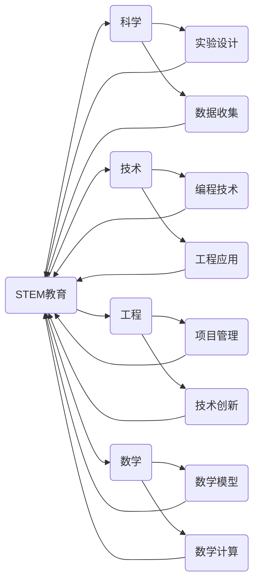

                 

### 数字时代的儿童教育：STEM教育与人文素养的结合

**关键词**：数字时代、儿童教育、STEM教育、人文素养、教育变革

**摘要**：随着数字技术的迅猛发展，教育领域正面临着前所未有的变革。STEM教育（科学、技术、工程和数学）已成为全球教育改革的重要方向，而人文素养的培养同样不可或缺。本文将探讨在数字时代背景下，如何将STEM教育与人文素养相结合，为儿童提供全面发展的教育途径。通过分析当前教育环境的挑战与机遇，我们将逐步探讨STEM教育与人文素养的内在联系，提出有效的教育策略和实践案例，以期为教育工作者和家长提供有价值的参考。

### 引言与背景

在过去的几十年中，全球科技发展迅猛，人工智能、大数据、物联网等前沿技术不断涌现，深刻改变了人类的生活方式和社会结构。数字时代的到来，不仅改变了信息的传递方式，也对教育领域产生了深远影响。传统教育模式正逐渐被新的教育理念和技术手段所取代，STEM教育正是在这一背景下兴起的一种重要教育模式。

**STEM教育的定义与目标**

STEM教育是指科学（Science）、技术（Technology）、工程（Engineering）和数学（Mathematics）的综合教育，它强调跨学科的学习和实践，培养孩子的创新思维、解决问题的能力和团队合作精神。STEM教育的目标不仅仅是传授知识，更重要的是培养学生的综合素质，包括批判性思维、创造力、沟通能力和合作能力。

**人文素养的定义与内涵**

人文素养是指一个人在文学、艺术、哲学、历史等方面的素养，包括对人类文化的了解、对人类价值观的认同以及对社会责任感的培养。人文素养的培养对于个人的全面发展和社会的和谐发展至关重要。

**STEM教育与人文素养的关系**

STEM教育与人文素养并不是孤立存在的，它们之间存在紧密的联系。STEM教育注重科学知识和技能的培养，而人文素养则强调情感、价值观和社会责任感的培养。两者相结合，可以更好地促进孩子的全面发展。

### 当前教育环境的挑战与机遇

**挑战**

1. **教育资源的分配不均**：城乡、地区之间的教育资源存在较大差异，农村和贫困地区的学生往往无法享受到优质的教育资源。

2. **教育模式的单一**：传统教育模式以教师为中心，学生被动接受知识，缺乏主动探究和合作学习的机会。

3. **科技发展的影响**：随着科技的快速发展，教育的需求也在不断变化，如何适应这种变化成为教育工作者面临的一大挑战。

**机遇**

1. **教育资源的共享**：互联网和数字技术的发展，使得教育资源可以更加便捷地共享，偏远地区的孩子也可以通过网络学习到优质的教育资源。

2. **个性化教育的实现**：通过大数据和人工智能技术，可以实现个性化教育，满足不同学生的学习需求。

3. **教育模式的创新**：科技的发展为教育模式的创新提供了新的可能性，如在线教育、虚拟现实教育等，可以为学生提供更加丰富和多样化的学习体验。

### STEM教育与人文素养的结合

**教育理念的创新**

在数字时代，教育理念需要与时俱进，从以知识传授为中心转向以学生发展为中心。STEM教育和人文素养的结合，要求教育者在教学中注重培养学生的综合素质，而不是单纯的知识积累。具体而言，教育者可以采取以下策略：

1. **跨学科整合**：将STEM教育与文学、艺术、哲学等人文课程相结合，促进学生的全面发展。

2. **项目式学习**：通过项目式学习，让学生在解决实际问题的过程中，综合运用STEM知识和人文素养。

3. **合作学习**：鼓励学生进行合作学习，培养他们的团队合作精神和沟通能力。

**教育方法的创新**

1. **探究式学习**：鼓励学生主动探究，培养他们的批判性思维和创造力。

2. **情境教学**：将STEM教育与实际情境相结合，提高学生的实践能力。

3. **情感教育**：在STEM教育中融入情感教育，培养学生的社会责任感。

**教育技术的应用**

1. **在线教育平台**：利用在线教育平台，提供丰富多样的学习资源，满足学生的个性化学习需求。

2. **虚拟现实技术**：通过虚拟现实技术，为学生提供沉浸式的学习体验。

3. **人工智能技术**：利用人工智能技术，实现个性化教学和智能评价。

### 教学实践案例

为了更好地理解STEM教育与人文素养的结合，我们可以通过一些具体的案例来探讨。

**案例一：小学科学课程**

在某小学的科学课程中，教师将STEM教育与人文素养相结合，设计了一系列探究活动。例如，在研究水的性质时，学生不仅学习了科学知识，还通过文学作品的阅读，了解了水在文化中的象征意义。通过这样的跨学科整合，学生不仅掌握了科学知识，还培养了人文素养。

**案例二：中学科技竞赛**

在某中学的科技竞赛中，学生需要设计并制作一款能够解决实际问题的科技产品。在竞赛过程中，学生不仅要运用STEM知识，还需要进行市场调研，了解产品的市场需求。此外，学生还需要撰写商业计划书，培养他们的商业意识和团队合作精神。这样的竞赛活动，不仅提高了学生的科技能力，还培养了他们的人文素养。

**案例三：社区科普活动**

某社区组织了一系列科普活动，邀请科学家和教育专家为孩子们讲解科技知识和人文素养。通过这些活动，孩子们不仅学到了科学知识，还了解了科技对社会的影响，培养他们的社会责任感。同时，活动还鼓励孩子们进行合作，培养他们的团队合作精神。

### 总结与展望

数字时代的到来，为儿童教育带来了新的挑战和机遇。STEM教育与人文素养的结合，是应对这些挑战的有效途径。通过创新的教育理念、方法和技术的应用，我们可以为儿童提供更加全面和丰富的教育体验。未来，教育者需要不断探索和实践，寻找STEM教育与人文素养的最佳结合点，为儿童的全面发展贡献力量。

### 背景介绍

**核心概念术语说明**

在探讨数字时代的儿童教育时，我们需要明确几个核心概念：

1. **STEM教育**：STEM教育是指科学（Science）、技术（Technology）、工程（Engineering）和数学（Mathematics）的综合教育。它强调跨学科的学习和实践，培养孩子的创新思维、解决问题的能力和团队合作精神。

2. **人文素养**：人文素养是指一个人在文学、艺术、哲学、历史等方面的素养，包括对人类文化的了解、对人类价值观的认同以及对社会责任感的培养。

3. **数字技术**：数字技术包括人工智能、大数据、物联网等前沿技术，这些技术在教育领域的应用，为教育模式和教育资源的变革提供了新的可能性。

**问题背景**

随着数字技术的迅猛发展，教育领域正面临着前所未有的变革。传统教育模式已经无法满足新时代的需求，如何培养具有综合素质的儿童成为教育工作者和家长关注的焦点。STEM教育和人文素养的培养，被认为是解决这一问题的关键。

**问题描述**

在数字时代，如何有效地将STEM教育与人文素养相结合，为儿童提供全面发展的教育途径，是一个亟待解决的问题。STEM教育注重科学知识和技能的培养，而人文素养则强调情感、价值观和社会责任感的培养。如何在教育实践中实现两者的有机结合，是一个具有挑战性的课题。

**问题解决**

要解决这一问题，首先需要明确STEM教育和人文素养的结合点，即如何在教育过程中实现两者的有机融合。其次，需要探索创新的教育理念、方法和技术的应用，以实现这一目标。具体来说，可以采取以下策略：

1. **跨学科整合**：将STEM教育与文学、艺术、哲学等人文课程相结合，促进学生的全面发展。

2. **项目式学习**：通过项目式学习，让学生在解决实际问题的过程中，综合运用STEM知识和人文素养。

3. **合作学习**：鼓励学生进行合作学习，培养他们的团队合作精神和沟通能力。

4. **情境教学**：将STEM教育与实际情境相结合，提高学生的实践能力。

5. **情感教育**：在STEM教育中融入情感教育，培养学生的社会责任感。

6. **教育技术的应用**：利用在线教育平台、虚拟现实技术、人工智能技术等，为学生提供更加丰富和多样化的学习体验。

**边界与外延**

在讨论STEM教育与人文素养的结合时，我们需要明确其边界和范围。边界是指STEM教育和人文素养的具体内容和应用领域，如科学、技术、工程、数学等STEM学科，以及文学、艺术、哲学等人文学科。外延则是指这种结合的潜在影响和应用场景，如学校教育、家庭教育、社区教育等。

**概念结构与核心要素组成**

STEM教育与人文素养的结合，可以从以下几个核心要素进行分析：

1. **教育理念**：创新的教育理念是两者结合的基础，包括以学生发展为中心、跨学科整合、项目式学习等。

2. **教学方法**：创新的教学方法是实现两者结合的关键，包括情境教学、合作学习、探究式学习等。

3. **教育技术**：现代教育技术的应用，为两者结合提供了新的可能性，如在线教育平台、虚拟现实技术、人工智能技术等。

4. **学生综合素质**：培养学生的综合素质，是STEM教育与人文素养结合的最终目标，包括创新思维、解决问题的能力、团队合作精神、社会责任感等。

### 核心概念与联系

**STEM教育的定义与目标**

STEM教育是指科学（Science）、技术（Technology）、工程（Engineering）和数学（Mathematics）的综合教育。其定义强调跨学科的学习和实践，培养学生的创新思维、解决问题的能力和团队合作精神。STEM教育的目标不仅仅是传授知识，更重要的是培养学生的综合素质，包括批判性思维、创造力、沟通能力和合作能力。

**人文素养的定义与内涵**

人文素养是指一个人在文学、艺术、哲学、历史等方面的素养，包括对人类文化的了解、对人类价值观的认同以及对社会责任感的培养。人文素养的培养对于个人的全面发展和社会的和谐发展至关重要。

**STEM教育与人文素养的关系探讨**

STEM教育与人文素养并不是孤立存在的，它们之间存在紧密的联系。STEM教育注重科学知识和技能的培养，而人文素养则强调情感、价值观和社会责任感的培养。两者结合，可以更好地促进孩子的全面发展。

**联系一：教育理念的创新**

在教育理念上，STEM教育和人文素养的结合要求教育者从以知识传授为中心转向以学生发展为中心。这种转变意味着教育者需要更加关注学生的综合素质培养，而不是单纯的知识积累。通过跨学科整合、项目式学习、合作学习等创新教学方法，实现STEM教育和人文素养的有机结合。

**联系二：教育方法的创新**

在教学方法上，STEM教育和人文素养的结合可以通过情境教学、探究式学习、情感教育等实现。情境教学将STEM教育与实际生活情境相结合，提高学生的实践能力；探究式学习鼓励学生主动探究，培养他们的批判性思维和创造力；情感教育在STEM教育中融入情感教育，培养学生的社会责任感。

**联系三：教育技术的应用**

在教育技术的应用上，STEM教育和人文素养的结合可以通过在线教育平台、虚拟现实技术、人工智能技术等实现。这些技术为学生提供了更加丰富和多样化的学习体验，同时也为教育者提供了更加便捷和高效的教学手段。

**联系四：学生综合素质的培养**

在学生综合素质的培养上，STEM教育和人文素养的结合可以共同发挥作用。STEM教育培养了学生的创新思维、解决问题的能力和团队合作精神；人文素养则培养了学生的社会责任感、道德品质和人际交往能力。两者的结合，有助于学生形成全面发展的素质结构。

**对比STEM教育和人文素养的核心属性特征**

以下是STEM教育和人文素养的核心属性特征的对比表格：

| 特征               | STEM教育                                   | 人文素养                                   |
|--------------------|--------------------------------------------|--------------------------------------------|
| 目标               | 培养科学知识和技能，培养创新思维和解决问题能力 | 培养对人类文化的了解，培养社会责任感和道德品质 |
| 内容               | 科学、技术、工程和数学等STEM学科             | 文学、艺术、哲学、历史等人文学科           |
| 教学方法           | 实践性教学，项目式学习，情境教学             | 探究式学习，合作学习，情感教育             |
| 技术应用           | 信息技术，虚拟现实技术，人工智能技术           | 数字技术，多媒体技术，在线教育平台           |
| 培养素质           | 批判性思维，创造力，团队合作精神             | 社会责任感，道德品质，人际交往能力           |

**ER实体关系图架构**

以下是STEM教育和人文素养的ER实体关系图架构：

在这个ER实体关系图中，STEM教育作为核心实体，与科学、技术、工程和数学等四个子领域紧密相关。每个子领域又包含具体的实践活动和技能培养，如科学中的实验设计和数据收集，技术中的编程技术和工程应用，工程中的项目管理和技术创新，数学中的数学模型和数学计算。通过这样的关系架构，我们可以清晰地看到STEM教育和人文素养之间的联系和互动。

### 儿童认知发展理论

在探讨如何将STEM教育与人文素养相结合时，了解儿童认知发展的基本理论至关重要。儿童认知发展理论为教育者提供了关于儿童如何学习、理解世界和发展的深刻见解，这些理论帮助我们设计适合儿童的教育策略和方法。

**皮亚杰的认知发展理论**

瑞士心理学家让·皮亚杰（Jean Piaget）是儿童认知发展的主要理论家之一。他的理论强调了儿童认知发展的阶段性和连续性。皮亚杰认为，儿童的认知发展经历了四个主要阶段：

1. **感知运动阶段（0-2岁）**：在这一阶段，儿童通过感知和运动活动来理解世界。他们开始学习如何控制自己的身体，并逐渐建立起对外部世界的感知和理解。

2. **前运算阶段（2-7岁）**：在这个阶段，儿童开始使用符号进行思考，但他们的思维仍然以自我为中心。他们很难理解其他人的观点，也不能很好地处理抽象概念。

3. **具体运算阶段（7-11岁）**：在这一阶段，儿童开始能够理解抽象概念，并能进行逻辑推理。他们能够理解守恒原理，能够进行分类和序列排序。

4. **形式运算阶段（11-16岁）**：在这一阶段，儿童的思维变得更加抽象和逻辑。他们能够处理复杂的假设和理论，并能够进行批判性思考。

**维果茨基的社会文化理论**

列夫·维果茨基（Lev Vygotsky）是另一位重要的认知发展理论家，他的理论强调了社会和文化在认知发展中的重要作用。维果茨基提出，认知发展是在社会互动中进行的，语言和社交互动是认知发展的关键因素。

1. **最近发展区（ZPD）**：维果茨基认为，每个儿童都有一个“最近发展区”，这是儿童在他人帮助下可以达到的潜在发展水平。通过与他人合作和交流，儿童可以超越自己的当前发展水平。

2. **文化工具**：维果茨基认为，文化工具（如语言、符号系统等）是认知发展的重要媒介。这些工具不仅帮助儿童理解世界，也促进了他们的思维发展。

**儿童认知发展的关键期**

儿童认知发展的每个阶段都有其关键期，即在这一阶段内，某些能力发展最为迅速。了解这些关键期对于教育者设计合适的教育策略至关重要。

1. **语言发展的关键期**：研究表明，儿童在0-7岁期间语言能力发展迅速，特别是1-3岁是语言发展的关键期。

2. **数理逻辑发展的关键期**：4-7岁是儿童数理逻辑能力发展的关键期，这个阶段的儿童开始理解数概念和基本的数学运算。

3. **社交技能发展的关键期**：2-5岁是儿童社交技能发展的关键期，这个阶段的儿童开始学习如何与他人互动和合作。

**STEM教育与儿童认知发展的互动**

STEM教育可以通过以下方式与儿童认知发展理论相结合：

1. **适应儿童的发展水平**：教育者应设计适合儿童认知发展阶段的教学活动，例如在感知运动阶段提供丰富的操作材料，在前运算阶段使用符号和图像辅助教学。

2. **利用最近发展区**：教育者应通过合作学习和支架教学，帮助儿童在最近发展区内发展。例如，通过教师或同伴的帮助，儿童可以完成他们自己无法独立完成的任务。

3. **跨学科整合**：STEM教育强调跨学科的学习，这有助于儿童在多个认知领域的发展。例如，通过科学实验，儿童不仅学习科学知识，也发展了数学和工程技能。

4. **情境教学**：通过将STEM教育融入实际情境，可以更好地激发儿童的学习兴趣和动机。例如，通过解决实际问题，儿童可以更好地理解STEM知识的应用。

5. **情感教育**：在STEM教育中融入情感教育，可以帮助儿童建立积极的学习态度和价值观。例如，通过探究和实验，儿童可以体验到成功的喜悦，培养他们的自信心和毅力。

总之，儿童认知发展理论为STEM教育与人文素养的结合提供了重要的理论基础。通过理解儿童如何学习和发展，教育者可以设计更加有效和适合儿童的教学策略，促进他们的全面发展。

### STEM课程设计的原则

STEM课程设计是教育实践中的关键环节，其核心目标是通过跨学科的整合，培养学生的创新思维、解决问题的能力和团队合作精神。STEM课程设计的原则如下：

**理论基础**

STEM课程设计的理论基础主要来自于跨学科学习理论和项目式学习理论。跨学科学习理论强调，知识是相互联系和相互依赖的，通过将不同学科的知识和技能整合在一起，可以促进学生更全面和深入的理解。项目式学习理论则强调，通过实际项目和问题的解决，学生可以更好地将理论知识应用于实践，从而提升他们的综合素质。

**课程内容的选择与组织**

STEM课程内容的选择和组织应遵循以下原则：

1. **跨学科整合**：选择具有跨学科特点的主题，如环境科学、机器人技术、编程和设计等。通过跨学科整合，学生可以学习到不同学科的知识和技能，并理解它们之间的联系。

2. **现实问题导向**：课程内容应围绕现实世界中的问题设计，鼓励学生通过探究和解决实际问题来学习。这种方法不仅能够激发学生的兴趣和动机，还能够培养他们的实践能力和解决问题的能力。

3. **循序渐进**：课程内容应设计为循序渐进的，从简单到复杂，从基础知识到高级应用。这样可以帮助学生逐步建立知识体系，提高他们的学习效果。

4. **综合性**：课程内容应涵盖科学、技术、工程和数学等多个领域，通过综合性的学习，学生可以全面发展他们的能力。

**教学目标的设定与实施**

STEM课程设计应明确具体的教学目标，并制定相应的实施策略：

1. **知识目标**：确保学生掌握基本的科学、技术、工程和数学知识，并能将其应用于实际问题中。

2. **技能目标**：培养学生的实践操作技能、批判性思维、创造力和团队合作精神。

3. **情感目标**：激发学生对STEM领域的兴趣，培养他们的好奇心、探索精神和责任感。

教学目标的实施策略包括：

- **探究式学习**：通过设计探究性项目，鼓励学生主动探究和发现，培养他们的批判性思维和解决问题的能力。

- **项目式学习**：通过实际项目，让学生在解决实际问题的过程中，综合运用所学知识和技能。

- **合作学习**：鼓励学生进行合作学习，通过小组讨论、协作完成任务，培养他们的团队合作精神。

- **情境教学**：将STEM知识融入实际情境，提高学生的实践能力和应用能力。

通过遵循STEM课程设计的原则，教育者可以设计出富有创新性、实践性和挑战性的课程，为学生的全面发展提供有力支持。

### STEM课程的教学方法与策略

STEM课程的教学方法与策略是确保课程目标得以实现的关键。在STEM教育中，教学方法的选择应注重激发学生的兴趣、培养他们的实践能力和创新能力。以下是几种常见的STEM教学方法与策略：

**探究式学习方法**

探究式学习方法强调学生通过主动探究和发现来学习。这种方法不仅能够激发学生的兴趣，还能够培养他们的批判性思维和解决问题的能力。具体实施步骤如下：

1. **提出问题**：教师提出具有挑战性的问题，引发学生的思考和讨论。

2. **设计探究计划**：学生根据自己的兴趣和问题，设计探究计划，包括实验方案、数据收集方法和分析工具等。

3. **开展实验与调查**：学生按照探究计划进行实验或调查，记录数据。

4. **分析数据与讨论**：学生分析收集到的数据，并与其他同学分享和讨论，共同总结探究结果。

5. **展示与反思**：学生展示自己的探究过程和结果，并对其进行反思，总结学习经验。

**项目式学习方法**

项目式学习方法通过实际项目的设计和实施，让学生在解决实际问题的过程中，综合运用所学知识和技能。这种方法能够培养学生的创新能力、团队合作精神和责任感。具体实施步骤如下：

1. **确定项目主题**：教师与学生共同确定项目主题，确保项目具有实际意义和挑战性。

2. **项目计划**：学生和教师共同制定项目计划，包括项目目标、时间表、任务分工和资源分配等。

3. **项目实施**：学生按照项目计划，开展项目工作，包括数据收集、实验设计、模型构建和解决方案设计等。

4. **项目评估**：教师和学生共同评估项目结果，包括项目的完成情况、创新点、问题解决效果等。

5. **项目展示**：学生展示项目成果，包括项目报告、演示和答辩等。

**合作学习方法**

合作学习方法通过小组合作，培养学生的团队合作精神和沟通能力。具体实施步骤如下：

1. **分组**：将学生分成小组，每组人数不宜过多，以确保每个学生都有充分的参与机会。

2. **分配任务**：根据项目或探究任务，为每个小组分配具体的任务，确保任务明确、可行。

3. **小组讨论**：小组内进行讨论，共同解决遇到的困难和问题，制定解决方案。

4. **小组汇报**：小组定期向全班汇报进展，接受其他小组的建议和意见，改进项目或探究计划。

5. **总结与反思**：在项目或探究结束后，小组进行总结和反思，分享经验教训，提出改进措施。

**情境教学**

情境教学将STEM知识融入实际情境，提高学生的实践能力和应用能力。具体实施步骤如下：

1. **创设情境**：教师创设与STEM知识相关的实际情境，如科学实验、工程实践、技术设计等。

2. **任务驱动**：在情境中设置具体的任务，引导学生通过探究和合作，完成任务。

3. **实践操作**：学生进行实践操作，亲身体验STEM知识的实际应用。

4. **讨论与反思**：学生在实践后进行讨论和反思，总结实践中的收获和不足，提出改进建议。

通过这些教学方法与策略，教师可以有效地引导学生进行STEM学习，培养他们的综合素质，实现STEM教育的目标。

#### 案例研究：合作学习在STEM教学中的应用

合作学习是一种有效的方法，通过小组合作，培养学生的团队合作精神、沟通能力和解决问题的能力。以下是几个在STEM教学中成功应用合作学习的案例，以及具体的教学步骤和评价标准。

**案例一：小学科学课程中的生态系统探究**

**教学步骤**：

1. **分组**：将学生分成小组，每组4-5人，确保每个小组都有不同背景和能力的学生。

2. **确定探究主题**：教师与学生共同确定探究主题，如“生态系统的平衡”。每个小组负责研究生态系统中某一方面的平衡，例如植物、动物和自然环境。

3. **分配任务**：根据小组的探究主题，为每个成员分配具体的任务，例如收集数据、制作展示板、撰写报告等。

4. **小组讨论**：小组内进行讨论，共同解决遇到的问题，制定探究计划。

5. **实验与调查**：小组按照探究计划，进行实验或调查，记录数据。

6. **展示与交流**：每个小组展示自己的研究成果，接受其他小组的提问和反馈。

**评价标准**：

- **合作精神**：评价学生在小组内是否积极参与，尊重他人意见，共同解决问题。
- **任务完成情况**：评价每个学生完成任务的进度和质量。
- **展示效果**：评价小组展示的清晰度、逻辑性和创新性。

**案例二：中学编程课程中的游戏开发**

**教学步骤**：

1. **分组**：将学生分成小组，每组4-5人，确保每个小组都有不同背景和能力的学生。

2. **确定项目主题**：教师与学生共同确定游戏开发的项目主题，例如“角色扮演游戏”。

3. **分配任务**：根据小组的项目主题，为每个成员分配具体的任务，例如游戏设计、编程、美术设计、音效制作等。

4. **小组讨论**：小组内进行讨论，共同解决遇到的问题，制定项目计划。

5. **项目实施**：小组按照项目计划，开展游戏开发工作，包括编程、设计、测试和优化等。

6. **项目展示**：小组展示游戏成品，包括游戏演示、功能介绍、代码讲解等。

**评价标准**：

- **团队合作**：评价学生在小组内是否积极参与，共同完成任务，分工明确。
- **项目质量**：评价游戏的创意、功能实现、界面设计和用户体验。
- **展示效果**：评价小组展示的清晰度、逻辑性和创新性。

**案例三：高中工程课程中的桥梁设计**

**教学步骤**：

1. **分组**：将学生分成小组，每组4-5人，确保每个小组都有不同背景和能力的学生。

2. **确定设计主题**：教师与学生共同确定桥梁设计主题，例如“跨越河流的桥梁”。

3. **分配任务**：根据小组的设计主题，为每个成员分配具体的任务，例如结构设计、材料选择、成本预算、安全性评估等。

4. **小组讨论**：小组内进行讨论，共同解决遇到的问题，制定设计计划。

5. **模型设计与制作**：小组按照设计计划，制作桥梁模型，并进行测试和评估。

6. **项目展示**：小组展示桥梁模型，包括设计理念、模型展示、测试结果等。

**评价标准**：

- **团队协作**：评价学生在小组内是否积极参与，共同完成任务，分工明确。
- **设计质量**：评价桥梁设计的创意、结构稳定性、材料选择和成本控制。
- **展示效果**：评价小组展示的清晰度、逻辑性和创新性。

通过这些案例研究，我们可以看到合作学习在STEM教学中的广泛应用和显著效果。通过小组合作，学生不仅能够更好地理解和应用STEM知识，还能够培养团队合作精神和沟通能力，为未来的学习和职业发展打下坚实基础。

### 活动设计：基于项目的学习

基于项目的学习（Project-Based Learning, PBL）是一种以学生为中心的教学方法，通过实际项目的完成，帮助学生深入理解和掌握知识。以下是STEM教育中基于项目的学习活动的设计步骤，包括项目选择、任务分配和评估标准。

**项目选择**

1. **现实相关性**：选择与现实生活紧密相关的项目，以激发学生的兴趣和参与度。例如，环保项目、智能家居设计、科技创新挑战等。

2. **跨学科整合**：项目应涵盖多个学科领域，如科学、技术、工程和数学，实现跨学科知识的整合。

3. **挑战性**：项目应具有一定的挑战性，鼓励学生思考和创新，如解决实际问题、设计创新产品等。

4. **可持续性**：项目应具有可持续性，鼓励学生在项目结束后进行持续研究和实践，如环保项目的后续行动、技术创新项目的后续开发等。

**任务分配**

1. **分组**：将学生分成小组，每组4-6人，确保小组内成员具备不同的技能和背景。

2. **角色分配**：根据项目的需要，为每个学生分配具体的角色，如项目领导者、数据分析师、设计者、测试员等。

3. **任务分配**：明确每个角色的任务和职责，确保每个学生都有具体的任务和目标。

4. **定期会议**：小组定期召开会议，讨论项目的进展、遇到的困难和解决方案，确保项目的顺利进行。

**项目实施**

1. **项目启动**：教师向学生介绍项目背景、目标和要求，明确项目的具体内容和时间表。

2. **项目研究**：学生进行项目研究，收集相关资料，分析问题，并制定项目计划。

3. **项目执行**：学生按照项目计划，进行项目的具体执行，如设计、实验、测试等。

4. **项目展示**：在项目完成时，学生展示项目成果，包括项目报告、演示、答辩等。

**评估标准**

1. **项目成果**：评估项目的最终成果，包括项目的创意性、实用性、完整性等。

2. **个人贡献**：评估每个学生在项目中的贡献，包括任务的完成情况、团队合作的表现、个人能力的发挥等。

3. **学习过程**：评估学生在项目过程中的学习态度、问题解决能力、批判性思维等。

4. **展示效果**：评估学生的展示效果，包括展示内容的清晰度、逻辑性、创新性等。

基于项目的学习活动不仅能够提高学生的实践能力和创新能力，还能够培养他们的团队合作精神和沟通能力，是实现STEM教育与人文素养结合的有效途径。

### 人文素养培养的重要方法

在数字时代，人文素养的培养对孩子的全面发展具有重要意义。人文素养不仅涉及到知识的积累，更关乎个体的情感、价值观和社会责任感。以下是几种有效培养人文素养的方法。

**文化传承与教育**

1. **家庭教育**：家庭教育是人文素养培养的重要途径。家长可以通过讲述家庭故事、传统节日习俗等方式，传承家族文化和民族精神。

2. **课外阅读**：课外阅读是培养人文素养的重要手段。家长和教师应鼓励孩子阅读经典文学作品、历史书籍等，提高他们的文化素养。

3. **文化课程**：学校可以开设文学、历史、哲学等人文课程，系统性地传授人文知识，培养孩子的文化认同感。

**情感教育与价值观培养**

1. **情感共鸣**：通过故事、诗歌、戏剧等形式，让孩子在情感上产生共鸣，培养他们的同理心和情感表达力。

2. **道德教育**：通过道德故事、案例分析和讨论，让孩子理解道德原则和价值观，培养他们的道德判断力和责任感。

3. **心理辅导**：学校和家庭可以提供心理辅导服务，帮助孩子应对成长中的情感困惑和挑战，培养他们的心理素质。

**社会实践与公民素养教育**

1. **志愿服务**：通过参与志愿服务，让孩子体验社会责任，培养他们的公民意识和社会责任感。

2. **社会调查**：组织学生进行社会调查，了解社会问题和挑战，培养他们的批判性思维和解决问题的能力。

3. **社区活动**：鼓励学生参与社区活动，如环保活动、社区服务项目等，增强他们的社区归属感和责任感。

通过这些方法，教育者可以为孩子提供丰富的人文素养培养环境，促进他们的全面发展。

### 人文素养培养在STEM教育中的融合

将人文素养的培养与STEM教育相结合，是现代教育的重要趋势。这种结合不仅能够提升学生的综合素质，还能够促进STEM教育目标的实现。以下是一些有效的策略和实例，说明如何在STEM教育中融入人文素养的培养。

**跨学科整合**

跨学科整合是将人文素养融入STEM教育的重要策略。通过将人文课程与STEM课程相结合，学生可以在学习科学、技术、工程和数学知识的同时，接触到文学、艺术、哲学等人文领域的知识。

**实例一：文学与科学的结合**

在中学科学课程中，教师可以引入文学作品的阅读，如《红楼梦》中的科学元素分析，让学生了解古代科学知识，同时培养他们的文学素养和批判性思维。

**实例二：艺术与技术的设计**

在工程课程中，教师可以引导学生设计具有艺术美感的科技产品，如利用3D打印技术制作艺术品，这样既锻炼了学生的工程技术能力，又培养了他们的艺术审美。

**情感教育与STEM学习的结合**

情感教育在STEM教育中的融入，有助于培养学生的社会责任感和道德品质。通过情感教育，学生可以更好地理解和应用STEM知识，同时培养他们的情感表达和人际交往能力。

**实例一：情感故事与科学探究**

在科学探究活动中，教师可以讲述一些情感丰富的故事，如科学家在研究过程中的挫折和坚持，激发学生的情感共鸣，培养他们的坚韧和毅力。

**实例二：团队合作与情感沟通**

在STEM项目中，教师可以组织学生进行团队合作，通过小组讨论、协作解决问题，培养学生的沟通能力和团队合作精神，同时增强他们的情感互动。

**社会实践与STEM教育的结合**

社会实践是培养人文素养的重要途径。将社会实践与STEM教育相结合，可以让学生在真实的社会环境中应用STEM知识，同时增强他们的社会责任感和公民意识。

**实例一：环保科技与社区服务**

学生可以参与环保科技项目，如设计低碳交通工具或环保设备，并组织社区环保宣传活动。这样的实践不仅提高了学生的科技能力，也培养了他们的环保意识和公民责任感。

**实例二：科技创新与公益项目**

学校可以组织学生参与科技创新公益项目，如为贫困地区设计太阳能设备或智能灌溉系统。通过这样的项目，学生不仅应用了STEM知识，还体验到了帮助他人的快乐和成就感。

通过跨学科整合、情感教育与STEM学习的结合、社会实践与STEM教育的结合，教育者可以为学生提供一个全面发展的教育环境，促进STEM教育与人文素养的有机结合。

### 成功的STEM教育案例

在STEM教育的实践过程中，许多学校和机构通过创新的教学方法和项目设计，取得了显著的教育效果。以下是几个成功的STEM教育案例，以及这些案例中的具体实践方法和成果。

**案例一：美国KIPP特许学校**

KIPP（Knowledge Is Power Program）特许学校是一家以STEM教育著称的学校。KIPP的教育理念是通过严格的学术要求和个性化的教学方法，培养具有领导力和学术能力的学生。以下是KIPP学校在STEM教育中的一些实践方法：

1. **项目式学习**：KIPP学校广泛采用项目式学习，通过实际项目来学习STEM知识。例如，学生通过设计并制作智能机器人来学习编程和工程知识。

2. **合作学习**：学生被分成小组，共同完成项目。这不仅能提高学生的团队合作能力，还能激发他们的创新思维。

3. **家庭参与**：KIPP学校鼓励家庭参与孩子的学习过程，通过家长会、家庭作业辅导等方式，确保家庭与学校的有效沟通。

**成果**：KIPP学校的STEM教育取得了显著成果。学生不仅在数学和科学成绩上表现优异，而且在大学升学率和STEM专业选择上也有显著提升。

**案例二：中国深圳南山外国语学校**

深圳南山外国语学校是中国一所知名的国际化学校，在STEM教育方面有着丰富的实践经验。以下是该学校在STEM教育中的一些实践方法：

1. **跨学科整合**：学校通过跨学科整合，将STEM知识与文学、艺术等领域相结合。例如，在科学课程中，学生通过研究气候变化，创作相关文学作品。

2. **情境教学**：学校利用虚拟现实技术和情境教学，让学生在模拟环境中学习STEM知识。例如，通过虚拟实验室，学生可以进行虚拟实验，提高实践能力。

3. **国际化视野**：学校通过与国外学校的交流合作，拓宽学生的国际视野。例如，学生可以通过国际交流项目，了解不同国家的STEM教育方法和实践。

**成果**：深圳南山外国语学校的学生在各类STEM竞赛中屡获佳绩，同时，学生在创新思维、团队合作和国际化素养方面也得到了显著提升。

**案例三：英国STEM学院**

英国STEM学院是一所专注于STEM教育的私立学校。以下是该学校在STEM教育中的一些实践方法：

1. **探究式学习**：学校鼓励学生进行探究式学习，通过提出问题、进行实验和讨论来学习。例如，学生可以通过研究太阳能电池板的工作原理，学习物理学知识。

2. **个性化教学**：学校根据学生的兴趣和能力，提供个性化的教学方案。例如，对于有特殊才能的学生，学校提供额外的项目和研究机会。

3. **科技企业合作**：学校与科技企业合作，为学生提供实习和就业机会。例如，学生可以参与企业的研发项目，了解实际工作中的STEM应用。

**成果**：STEM学院的学生在科学和数学竞赛中表现突出，许多学生被世界顶级大学录取，同时，学生在科技企业和研究机构中的就业率也较高。

这些成功案例表明，通过创新的教学方法和实践策略，STEM教育可以取得显著的教育成果。教育者应继续探索和推广这些有效的实践方法，为学生的全面发展贡献力量。

### 人文素养教育的创新实践

在STEM教育不断发展的同时，人文素养教育的创新实践同样重要。以下介绍几种创新的人文素养教育实践方法，这些方法旨在通过多元化、互动性和情境化的方式，培养学生的综合素质。

**跨学科整合**

跨学科整合是将人文素养与STEM教育相结合的有效方法。通过整合不同学科的知识，学生可以在理解科学和技术的同时，接触到文学、艺术、历史等人文学科。以下是一些具体的跨学科整合实践：

1. **艺术与科学的融合**：在科学课程中引入艺术元素，如通过绘画、雕塑等艺术形式来表现科学概念。例如，学生可以通过创作一幅关于生态系统平衡的绘画，来加深对生物学知识的理解。

2. **文学与技术的结合**：在技术课程中引入文学作品的阅读，如通过阅读科幻小说来探讨未来科技的伦理和社会影响。这样的结合可以培养学生的批判性思维和创造力。

**情境教学**

情境教学是一种通过真实情境来学习的方法，能够激发学生的兴趣和参与度。以下是一些情境教学实践：

1. **模拟法庭**：在道德和哲学课程中，学生可以通过模拟法庭活动，扮演法官、律师和被告等角色，来学习法律和道德原则。

2. **历史情境体验**：通过历史情境体验，如参观历史遗址、扮演历史人物等，学生可以更加深入地了解历史事件和人物，培养他们的历史素养。

**项目式学习**

项目式学习通过实际项目的完成，帮助学生将所学知识应用于实际情境。以下是一些项目式学习的实践：

1. **社区服务项目**：学生可以参与社区服务项目，如环保活动、社区义工等。通过这些项目，学生不仅应用了STEM知识，还培养了社会责任感和公民意识。

2. **创新产品设计**：学生可以设计并制作创新产品，如智能家居设备、环保设备等。这样的项目不仅培养了学生的技术能力，还培养了他们的创新思维和团队合作精神。

**多媒体教学**

多媒体教学通过音频、视频、动画等多媒体手段，提供丰富的学习资源，激发学生的学习兴趣。以下是一些多媒体教学实践：

1. **虚拟现实（VR）教学**：通过虚拟现实技术，学生可以进入虚拟环境进行学习，如参观虚拟博物馆、体验古代科技等。这样的教学方式可以增强学生的参与感和体验感。

2. **电子书与互动游戏**：利用电子书和互动游戏，学生可以更加自主地学习和探索，提高学习的趣味性和互动性。

**案例研究**

以下是一个具体的人文素养教育创新实践案例：

**案例：文学与科技融合课程**

在某高中，教师设计了一门文学与科技融合的课程。课程内容涵盖科幻小说阅读、科技项目设计和跨学科讨论。具体实践如下：

1. **科幻小说阅读**：教师选取了几部经典的科幻小说，如《三体》和《银河帝国》等，让学生阅读并讨论。

2. **科技项目设计**：学生被分成小组，每组选择一个与科幻小说相关的科技项目进行设计。例如，一个小组设计了一个基于人工智能的智能家居系统，另一个小组设计了一个太空探索设备。

3. **跨学科讨论**：学生定期进行跨学科讨论，分享他们在文学和科技项目中的发现和思考。

4. **展示与评估**：学生展示他们的项目成果，并接受同学和教师的评价。

**效果**：通过这门课程，学生不仅加深了对科幻小说的理解，还提高了他们的科技设计能力和跨学科思维。同时，他们在讨论和展示过程中，培养了团队合作精神和表达能力。

通过这些创新实践方法，教育者可以为学生提供一个丰富、多样和互动的人文素养教育环境，促进他们的全面发展。

### 家庭教育与学校教育结合的案例分析

在儿童的教育过程中，家庭教育与学校教育的有机结合至关重要。以下是一个具体的案例分析，探讨如何在家庭和学校之间建立有效的合作机制，以促进儿童全面发展。

**案例背景**

某小学的五年级学生小明，其家庭和学校之间建立了良好的合作机制，通过共同的努力，小明的学习成绩和综合素质得到了显著提升。

**家庭环境**

小明的家庭非常重视孩子的教育，父母都是受过良好教育的专业人士。他们在家庭中营造了浓厚的学习氛围，每天晚上都会花时间与孩子一起阅读、讨论学习内容。父母还鼓励小明参加各种课外活动，如音乐、体育和科技俱乐部，以培养他的兴趣爱好和全面发展。

**学校教育**

小明的学校是一所注重创新和实践的STEM学校，教师们采用项目式学习和探究式教学方法，激发学生的学习兴趣和创造力。学校还组织了多种课外活动，如科学实验、编程比赛和科技展览，为学生提供丰富的学习体验。

**合作机制**

1. **家校沟通**：学校定期组织家长会，与家长交流学生的学习情况和教育进展。教师还会通过电话、电子邮件等方式，与家长保持密切联系，及时反馈孩子的学习情况。

2. **共同制定学习计划**：学校和家庭成员共同制定小明的学习计划，包括学习目标、时间和方法。例如，学校教师会根据小明的兴趣和优势，推荐适合的学习资源和活动。

3. **家庭作业合作**：家长参与家庭作业的辅导，与孩子一起讨论题目，解决问题。这种方式不仅帮助小明巩固课堂学习内容，也增强了家庭成员之间的互动。

4. **教育资源共享**：家庭和学校共同利用教育资源共享平台，如在线学习平台和图书馆资源，为小明提供丰富的学习资源。

**案例分析**

通过家庭和学校的紧密合作，小明在多个方面得到了显著提升：

1. **学习成绩提升**：小明的学习成绩稳步提升，尤其在数学和科学方面表现出色。这得益于家庭和学校的共同努力，使小明在数学和科学知识上得到了全面培养。

2. **综合素质发展**：通过参加各种课外活动和项目式学习，小明培养了团队合作精神、创新思维和解决问题的能力。这些素质不仅对他的学术发展有帮助，也对他的未来职业发展具有重要意义。

3. **家庭教育与学校教育的优势互补**：家庭和学校的合作使家庭教育与学校教育形成了优势互补。家庭提供了温暖、支持的学习环境，而学校则提供了丰富的教育资源和学习机会。

**结论**

通过这个案例，我们可以看到家庭教育和学校教育的有机结合对于儿童全面发展的重要性。家庭和学校应共同努力，建立有效的合作机制，为儿童提供一个全面、丰富和有针对性的教育环境，促进他们的健康成长和全面发展。

### 社会教育对人文素养培养的影响

社会教育是人文素养培养的重要组成部分，它通过丰富多样的社会实践和文化活动，为学生提供课堂之外的教育体验。以下从三个方面探讨社会教育对人文素养培养的积极影响。

**社会实践的参与**

社会实践是培养学生社会责任感和公民意识的有效途径。通过参与社区服务、环保活动、公益项目等，学生可以深入了解社会问题，体验社会运行机制，增强他们的社会责任感。例如，组织学生参与社区清洁活动，让他们认识到环境保护的重要性，培养他们的环保意识；通过组织扶贫帮困项目，让学生感受到贫困地区的困境，培养他们的同情心和奉献精神。

**文化活动的体验**

文化活动是培养学生人文素养的重要手段。通过参观博物馆、美术馆、历史遗址等，学生可以直观地感受到人类文明的瑰宝，培养对历史和文化的兴趣。同时，参与各类文化节庆活动，如春节、中秋节等传统节日，学生可以了解传统文化的内涵，增强文化认同感。此外，通过戏剧表演、音乐演出、绘画展览等文化活动，学生可以在艺术创作和欣赏中提升审美能力和创造力。

**社会互动的体验**

社会互动是培养学生人际交往能力和团队合作精神的关键环节。通过参与社会互动，学生可以学会与他人沟通、合作和协调，提高他们的社会适应能力。例如，组织学生参与志愿者服务，如支教、义诊等，让他们在与不同背景的人交流互动中，学会尊重和关心他人；通过团队项目，如科学实验、科技创新等，学生可以在团队合作中学会分工合作、解决冲突，培养他们的团队合作精神和领导能力。

总之，社会教育通过丰富多彩的实践活动，为学生提供了提升人文素养的平台。社会教育的参与不仅丰富了学生的知识体系，更培养了他们的综合素质，为他们的全面发展奠定了坚实基础。

### 数字技术支持STEM教育

在数字技术的推动下，STEM教育正经历着深刻的变革。现代教育技术，如在线教育平台、虚拟现实（VR）技术、人工智能（AI）等，不仅为教育资源的共享提供了新的途径，也为教学方法的创新带来了无限可能。以下将详细探讨这些技术在STEM教育中的应用。

**在线教育平台**

在线教育平台是数字技术在教育中应用的重要工具。通过在线平台，学生可以随时随地访问丰富的学习资源，如教学视频、电子书、在线课程等。这不仅打破了传统教育的时空限制，也为个性化学习提供了可能。以下是一些在线教育平台在STEM教育中的应用：

1. **知识共享**：在线教育平台提供了大量的STEM教育资源，教师和学生可以共享优质的教学视频、实验指南和案例研究，从而提高学习效果。

2. **个性化学习**：通过分析学生的学习数据，在线教育平台可以为学生提供个性化的学习建议，帮助他们更好地掌握STEM知识。

3. **远程教学**：在偏远地区或特殊情况下，在线教育平台可以为学生提供远程教学服务，确保他们能够接受到优质的教育资源。

**虚拟现实技术**

虚拟现实技术为STEM教育提供了沉浸式学习体验，使学生能够身临其境地探索科学、技术和工程领域。以下是一些虚拟现实技术在STEM教育中的应用：

1. **科学实验**：通过虚拟实验室，学生可以模拟进行科学实验，如化学实验、生物实验等，安全、低成本地探索科学知识。

2. **工程实践**：虚拟现实技术可以模拟真实工程环境，如建筑工地、工厂生产线等，让学生在实践中掌握工程原理和技能。

3. **编程学习**：通过虚拟现实技术，学生可以在虚拟环境中进行编程实践，如虚拟机器人编程、虚拟游戏开发等，提高编程能力。

**人工智能技术**

人工智能技术在STEM教育中的应用，极大地提升了教学效率和学生的学习体验。以下是一些人工智能技术在STEM教育中的应用：

1. **个性化教学**：通过人工智能技术，教师可以分析学生的学习行为和成绩，为学生提供个性化的学习路径和资源推荐。

2. **智能辅导**：人工智能辅导系统可以根据学生的学习情况，提供实时辅导和解答，帮助学生克服学习难题。

3. **智能评价**：人工智能技术可以自动批改作业和考试，提供即时反馈，教师可以根据这些反馈调整教学策略。

总之，数字技术在STEM教育中的应用，不仅丰富了教育资源，创新了教学方法，还提高了学生的学习效果和兴趣。随着技术的不断进步，STEM教育将迎来更加广阔的发展空间。

### 教育技术的挑战与未来

尽管教育技术的应用为STEM教育带来了诸多优势，但在实际应用过程中，仍面临着一系列挑战。以下将分析这些挑战，并探讨可能的解决方案和未来发展趋势。

**挑战一：技术鸿沟**

技术鸿沟是指不同地区、不同社会经济背景的学生在获得和使用教育技术方面的差异。这种差异可能导致教育不公平，使部分学生无法享受到优质的教育资源。

**解决方案**：
1. **教育资源均衡分配**：政府和教育机构应采取措施，确保偏远和贫困地区的学生也能获得高质量的教育资源，如通过远程教育平台和数字图书馆。
2. **技术培训**：为教师和学生提供必要的技术培训，提高他们的数字技能，确保他们能够有效地使用教育技术。

**挑战二：隐私和数据安全**

教育技术的广泛应用带来了大量学生数据的生成和使用，这引发了隐私保护和数据安全问题。如何确保学生数据的安全和隐私，是教育技术发展的重要挑战。

**解决方案**：
1. **数据加密**：使用高级加密技术保护学生数据，确保数据在传输和存储过程中的安全。
2. **隐私政策**：制定严格的隐私政策，明确数据的使用范围和目的，确保学生和家长的知情权和选择权。
3. **定期安全审计**：定期进行安全审计，确保教育技术的应用符合相关法律法规和标准。

**挑战三：技术依赖**

随着教育技术的广泛应用，学生和教师可能过度依赖技术，忽视了传统教学方法的重要性。这可能导致学生在技术和知识应用能力上的不平衡。

**解决方案**：
1. **平衡技术使用**：教师应合理分配技术与传统教学的时间，确保学生在掌握技术的同时，也能掌握传统教学方法。
2. **技术评估**：定期对教育技术的应用效果进行评估，确保其符合教学目标和学生的学习需求。

**未来发展趋势**

1. **智能化教学**：人工智能技术将在教育中发挥越来越重要的作用，通过智能辅导系统和个性化学习路径，实现更高效的教学。
2. **虚拟现实与增强现实**：虚拟现实（VR）和增强现实（AR）技术将在STEM教育中得到更广泛的应用，提供沉浸式学习体验。
3. **混合学习**：混合学习模式将越来越受欢迎，结合在线教育和传统课堂教学，实现最优的学习效果。
4. **可持续教育技术**：随着环保意识的提高，教育技术将更加注重可持续性，如采用绿色能源和可回收材料等。

总之，教育技术面临诸多挑战，但通过合理的策略和持续的创新，可以克服这些挑战，为STEM教育带来更加光明的前景。

### 最佳实践 tips

在实施STEM教育与人文素养结合的过程中，教育工作者和家长可以参考以下最佳实践建议，以促进儿童全面发展的同时，确保STEM教育与人文素养的有效融合：

1. **注重跨学科整合**：在课程设计和教学实践中，教师应注重跨学科整合，将STEM知识与人文素养有机结合。例如，在科学课程中引入文学、艺术等元素，通过文学作品来解释科学现象，或通过艺术创作来展示科学原理。

2. **鼓励项目式学习**：项目式学习能够让学生在解决实际问题的过程中，综合运用STEM知识和人文素养。教师可以设计跨学科的项目，如环保科技项目、社区服务项目等，鼓励学生通过合作、探究和创造来学习。

3. **利用情境教学**：情境教学能够激发学生的学习兴趣和动力。教师可以设计与实际生活密切相关的教学情境，如模拟法庭、历史情境体验等，让学生在真实的情境中学习知识，培养他们的实践能力和情感素养。

4. **培养团队合作精神**：团队合作是STEM教育与人文素养结合的重要方面。教师应鼓励学生进行小组合作，通过讨论、分享和协作解决问题，培养他们的团队合作精神和沟通能力。

5. **重视情感教育**：情感教育在STEM教育中同样重要。教师应在教学过程中融入情感教育，通过故事、诗歌等形式，培养学生的同理心、情感表达能力和道德品质。

6. **提供多样化的学习资源**：教育工作者和家长应为学生提供丰富多样的学习资源，如电子书、在线课程、实验室资源等，确保学生能够全面、深入地学习STEM知识和人文素养。

7. **家长参与教育**：家长在儿童教育中扮演着重要角色。家长应积极参与孩子的学习过程，与教师保持密切沟通，共同制定学习计划，为孩子提供良好的家庭学习环境。

通过这些最佳实践建议，教育工作者和家长可以更有效地将STEM教育与人文素养结合，为儿童提供全面、丰富和有针对性的教育体验。

### 小结

综上所述，数字时代的儿童教育正面临着前所未有的变革。STEM教育与人文素养的结合，为儿童提供了全面发展的教育途径。通过创新的教育理念、方法和技术的应用，我们可以为儿童提供更加丰富和多样化的学习体验。STEM教育注重科学知识和技能的培养，而人文素养则强调情感、价值观和社会责任感的培养。两者的有机结合，有助于培养具有综合素质的下一代。教育工作者和家长应共同努力，探索STEM教育与人文素养结合的最佳实践，为儿童创造一个全面发展的教育环境。

### 注意事项

在实施STEM教育与人文素养结合的过程中，教育工作者和家长需要注意以下几点：

1. **平衡STEM教育与人文素养**：确保两者在课程和教学实践中得到平衡发展，避免偏重某一方面的教育。

2. **重视个性化教育**：每个孩子都有其独特的兴趣和需求，教育者应根据学生的特点，提供个性化的学习资源和方法。

3. **关注学生情感发展**：在STEM教育中融入情感教育，培养学生的同理心、情感表达能力和道德品质。

4. **充分利用教育技术**：合理应用在线教育平台、虚拟现实技术和人工智能等技术，提高教学效果和学生的学习体验。

5. **家庭与学校合作**：家长应积极参与孩子的学习过程，与学校保持密切沟通，共同为孩子的全面发展创造良好的环境。

### 拓展阅读

对于希望深入了解STEM教育与人文素养结合的读者，以下是一些推荐阅读材料：

1. **《创新儿童教育：跨学科整合的力量》**：该书详细介绍了如何通过跨学科整合，实现STEM教育与人文素养的结合。

2. **《人工智能时代的教育变革》**：本书探讨了人工智能技术在教育中的应用，以及如何利用人工智能提升STEM教育和人文素养。

3. **《项目式学习：实践指南》**：这本书为教育工作者提供了项目式学习的详细实践指南，包括设计项目、评估项目效果等。

4. **《情感教育：培养全面发展的人》**：该书探讨了情感教育的重要性，以及如何在STEM教育中融入情感教育。

5. **《数字化时代的家庭教育》**：这本书为家长提供了数字化时代下如何有效参与孩子教育的指导，包括利用在线资源和科技工具等。

通过阅读这些书籍，读者可以进一步了解STEM教育与人文素养结合的理论和实践，为实际教育实践提供有益的参考。

