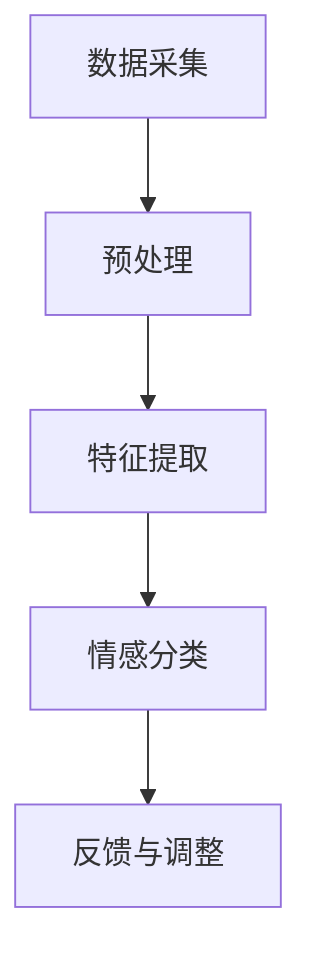
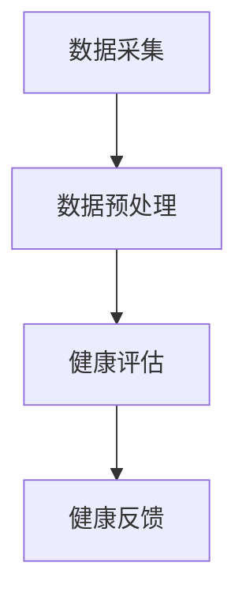
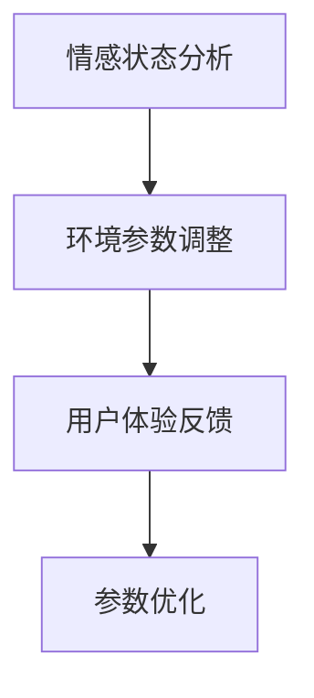

                 

### 文章标题：数字时代的冥想VR：沉浸式正念训练的技术革新

#### 关键词：
- 数字时代
- 冥想VR
- 正念训练
- 技术革新
- 沉浸式体验

#### 摘要：
本文将探讨数字时代冥想VR技术的革新，特别是其在正念训练中的应用。我们将深入分析冥想VR的背景、定义、核心技术，并通过具体的实例和案例展示如何实现沉浸式正念训练，旨在为读者提供全面的技术见解和实践指南。

### 目录

1. **引言**
   - 冥想与数字时代的交汇
   - VR技术对冥想的推动
   - 本文结构与目标

2. **正念训练的基本概念**
   - 定义与历史背景
   - 核心要素与理论框架

3. **VR技术原理与沉浸式体验**
   - VR技术的基本原理
   - 沉浸式体验的实现机制
   - 冥想VR的优势与挑战

4. **冥想VR中的关键技术**
   - 情感识别与反应
   - 身心健康监测技术

5. **冥想VR系统架构设计**
   - 系统功能设计
   - 系统架构图
   - 系统接口设计与交互

6. **算法原理与数学模型**
   - 算法讲解与mermaid流程图
   - 数学模型与公式讲解
   - 算法实例解析

7. **实战案例解析**
   - 环境安装
   - 系统核心实现源代码解析
   - 实际案例分析

8. **最佳实践与总结**
   - 最佳实践建议
   - 全书总结
   - 读者指南与拓展阅读

### 引言

在快节奏、高度压力的现代生活中，冥想作为一种缓解压力、提升注意力和增强心理韧性的方法，越来越受到人们的重视。然而，传统的冥想方式往往需要安静的环境和长时间的训练，这对于现代生活来说是一个不小的挑战。随着虚拟现实（VR）技术的快速发展，冥想与VR的结合成为一种新的可能，为正念训练带来了全新的技术革新。

冥想VR通过虚拟现实技术创造一个沉浸式的环境，让用户可以在虚拟世界中体验冥想。这不仅提高了冥想的趣味性和吸引力，也使得冥想过程更加高效和个性化。数字时代冥想VR的核心在于利用先进的传感器、算法和数据处理技术，实现情感识别、身心健康监测以及个性化的冥想体验。

本文将深入探讨数字时代冥想VR的背景、定义、核心技术，并通过具体的实例和案例展示如何实现沉浸式正念训练。文章结构如下：

1. **引言**：介绍冥想与数字时代的交汇，以及VR技术对冥想的推动。
2. **正念训练的基本概念**：定义正念训练，阐述其核心要素与理论框架。
3. **VR技术原理与沉浸式体验**：讲解VR技术的基本原理，分析沉浸式体验的实现机制。
4. **冥想VR中的关键技术**：探讨情感识别与反应、身心健康监测技术等关键技术。
5. **冥想VR系统架构设计**：介绍冥想VR系统功能设计、系统架构图、系统接口设计和系统交互。
6. **算法原理与数学模型**：讲解算法原理，提供mermaid流程图和Python代码示例，阐述数学模型与公式。
7. **实战案例解析**：展示环境安装、系统核心实现源代码解析以及实际案例分析。
8. **最佳实践与总结**：总结全文，给出最佳实践建议和拓展阅读。

### 第1章: 数字时代冥想VR概述

#### 1.1 冥想与VR技术的融合

冥想作为一种传统的身心调节方式，历史悠久，其核心理念是通过专注、放松和正念来减少压力、提升注意力和增进身心健康。然而，传统的冥想方式往往需要在安静的环境中长时间练习，这给现代人带来了不少挑战。随着科技的发展，特别是虚拟现实（VR）技术的兴起，冥想与VR的结合成为了一种新的解决方案。

VR技术的核心在于通过计算机生成一个模拟的三维环境，用户可以通过头戴式显示器（HMD）或VR眼镜沉浸在这个环境中。VR技术不仅可以提供高度沉浸的体验，还能够通过实时反馈和交互来增强用户的参与感和沉浸感。这种特性使得VR在冥想中的应用具有巨大的潜力。

将冥想与VR技术结合的初衷在于通过创造一个高度沉浸的环境，使用户能够更容易地进入冥想状态。VR技术提供的逼真视觉和听觉效果可以模拟出各种冥想场景，如森林、海洋、星空等，使用户在这些环境中进行冥想，从而达到更好的放松和冥想效果。此外，VR技术还能够通过传感器和动作捕捉技术来监测用户的身体和情绪状态，为用户提供个性化的冥想指导和反馈。

#### 1.2 数字时代冥想的挑战与机遇

数字时代冥想面临的挑战主要包括以下几个方面：

1. **环境要求**：传统冥想需要安静、无干扰的环境，而现代都市生活中很难找到这样的地方。VR技术可以通过虚拟环境模拟出所需的安静氛围，从而解决了这一问题。

2. **时间限制**：现代人生活节奏快，难以抽出大量时间进行冥想。VR冥想可以通过高度沉浸和趣味性的体验，使用户在短时间内获得冥想的收益。

3. **个性化需求**：每个人的冥想需求和习惯都不同，传统冥想很难提供个性化的服务。VR冥想可以通过数据分析和个性化推荐，为用户量身定制冥想方案。

数字时代冥想带来的机遇则表现在：

1. **技术进步**：VR技术的不断进步为冥想提供了更高质量、更逼真的沉浸式体验。

2. **用户普及**：随着智能手机和VR设备的普及，越来越多的人可以接触到VR冥想，从而扩大了冥想的用户基础。

3. **市场潜力**：VR冥想作为一种新兴的健康管理方式，具有巨大的市场潜力。

总之，数字时代冥想VR技术的融合不仅为冥想提供了新的可能性，也面临着诸多挑战和机遇。通过对这些挑战和机遇的深入探讨，我们可以更好地理解数字时代冥想VR的发展前景和应用价值。

### 第2章: 正念训练的基本概念

#### 2.1 正念训练的定义与历史背景

正念训练（Mindfulness Training）是一种通过培养专注、觉知和接受当前时刻存在的能力来改善心理健康和生理健康的方法。它起源于古老的佛教冥想传统，经过多年的研究和实践，逐渐发展成为现代心理学中的一种重要治疗方法。

正念训练的核心概念是“正念”（Mindfulness），它指的是对当前时刻的觉察和接受，不评判、不抗拒。正念训练的目标是通过持续的练习，培养个体对情绪、思维和身体的觉察能力，从而提高自我调节能力，减少压力和焦虑，增强心理韧性。

正念训练的历史可以追溯到佛教中的“禅修”（Mindfulness Meditation），禅修最早出现在公元前500年的印度。佛教中的禅修旨在通过专注和冥想来实现内心的平静和智慧。随着时间的推移，禅修逐渐传播到世界各地，并与其他文化和哲学体系融合，形成了各种形式的冥想和正念训练。

在现代心理学中，正念训练得到了广泛的应用和研究。1979年，乔·卡巴金（Jon Kabat-Zinn）在美国麻省理工学院医疗中心创建了“减压反应课程”（Mindfulness-Based Stress Reduction，MBSR），这是第一个将正念训练应用于临床的心理治疗项目。MBSR的问世标志着正念训练在现代医学和心理学中的正式诞生。

#### 2.2 正念训练的核心要素与理论框架

正念训练包含多个核心要素，这些要素共同构成了其理论框架，以下是其中几个关键要素：

1. **专注练习**：专注练习是正念训练的基础，通过持续的专注练习，个体能够培养对当前时刻的觉察能力。常见的专注练习包括呼吸觉察、身体扫描和正念行走等。

2. **觉知**：觉知是正念训练的核心，指的是对当前时刻的心理和生理状态的清晰觉察。觉知帮助个体意识到自己的思维模式、情绪波动和身体感受，从而实现自我调节。

3. **接受**：接受是指对当前时刻的存在不评判、不抗拒，而是以一种开放和宽容的态度来接纳。接受帮助个体摆脱对过去和未来的执着，减少情绪困扰。

4. **非评判性**：非评判性是正念训练的重要原则，意味着不对自己的感受、想法和行为进行评判。非评判性有助于个体建立自我接纳和自我理解，从而减少自我批评和内疚感。

5. **正念饮食**：正念饮食是一种通过全神贯注地体验食物的味道、质地和口感来进行饮食的方法。正念饮食有助于个体提高对食物的觉知，减少进食时的分心和过度进食。

正念训练的理论框架通常基于认知行为理论和接纳与承诺疗法（Acceptance and Commitment Therapy，ACT）。认知行为理论认为，个体的思维和行为会影响其情绪和心理健康。正念训练通过改变个体的思维模式和行为习惯，帮助个体实现情绪调节和心理平衡。

接纳与承诺疗法则强调个体对当前时刻的接纳和承诺，通过正念练习，个体能够更好地应对生活中的困难和挑战。正念训练在ACT中的应用，帮助个体实现心理灵活性和有效的情绪调节。

总之，正念训练是一种通过培养专注、觉知和接受当前时刻存在的能力来改善心理健康的有效方法。其核心要素和理论框架为个体提供了一套实用的心理调节工具，帮助个体在面对压力和挑战时保持平静和坚定。

### 第3章: VR技术原理与沉浸式体验

#### 3.1 VR技术的基本原理

虚拟现实（Virtual Reality，简称VR）是一种通过计算机技术模拟出三维虚拟环境，使用户能够在这个环境中进行交互和体验的技术。VR技术的基本原理主要包括以下几个方面：

1. **三维建模**：三维建模是VR技术的核心，通过计算机图形学技术，创建出高度逼真的三维模型。这些模型可以包括人物、场景、物体等，为用户提供了丰富的虚拟世界。

2. **头戴式显示器（HMD）**：头戴式显示器是VR技术的重要组成部分，它通过光学透镜将虚拟环境投射到用户的眼睛上，使用户能够看到三维图像。HMD通常具有高分辨率和低延迟，以提供更真实的视觉体验。

3. **传感器与追踪技术**：VR系统通常配备多种传感器，如陀螺仪、加速度计、位置追踪器等，这些传感器可以实时监测用户的头部和手部运动，将用户的动作转化为虚拟环境中的交互操作。

4. **实时渲染**：实时渲染技术是VR技术的关键，它能够在用户移动时实时更新虚拟环境，确保用户感受到的虚拟世界是连续和流畅的。实时渲染需要强大的计算能力和高效的算法。

5. **声音系统**：VR技术的沉浸感不仅取决于视觉体验，还取决于听觉体验。VR声音系统通常包括头戴式耳机和空间音效技术，通过三维音效模拟出虚拟环境中的声音效果，使用户能够更真实地感受到虚拟世界的存在。

#### 3.2 沉浸式体验的实现机制

沉浸式体验是VR技术的核心目标，它旨在让用户在虚拟环境中产生强烈的真实感和参与感。实现沉浸式体验的机制主要包括以下几个方面：

1. **视觉沉浸**：视觉沉浸是通过高分辨率、低延迟的头戴式显示器（HMD）实现的。高分辨率显示器能够提供清晰的图像，低延迟则减少了图像的滞后感，使用户能够在虚拟环境中自由移动而不会感到不适。

2. **听觉沉浸**：听觉沉浸通过三维音效和头戴式耳机实现。三维音效技术可以模拟出虚拟环境中的声音来源方向和距离，使用户能够更真实地感受到声音的定位和变化。

3. **触觉沉浸**：触觉沉浸是通过触觉反馈设备实现的，如触觉手套、虚拟现实触觉控制器等。这些设备可以在用户与虚拟环境互动时提供触觉反馈，增强沉浸感。

4. **嗅觉与味觉沉浸**：虽然目前VR技术中较少涉及嗅觉与味觉的模拟，但随着技术的发展，未来可能会有更多设备实现嗅觉与味觉的虚拟体验。

5. **实时交互**：实时交互是沉浸式体验的关键，通过传感器和动作捕捉技术，用户可以在虚拟环境中进行实时互动，如操作虚拟物品、与其他虚拟角色互动等。

6. **情感识别与反馈**：情感识别与反馈技术可以通过分析用户的生理和情绪信号，如心率、呼吸、面部表情等，来调整虚拟环境中的交互和反馈，增强用户的沉浸感。

通过上述机制，VR技术能够为用户创造出高度沉浸的虚拟环境，使用户在心理和生理上产生强烈的真实感，从而实现沉浸式体验。

#### 冥想VR的优势与挑战

冥想VR结合了VR技术和正念训练，为用户提供了全新的冥想体验。其优势主要体现在以下几个方面：

1. **高度沉浸**：VR技术能够为用户创造出一个高度沉浸的冥想环境，使用户更容易进入冥想状态。

2. **个性化定制**：通过分析用户的生理和情绪数据，VR系统可以提供个性化的冥想指导和建议，使冥想过程更加高效。

3. **实时反馈**：VR技术可以通过实时交互和反馈，帮助用户更好地掌握冥想技巧，并及时调整自己的冥想状态。

4. **趣味性**：与传统冥想相比，VR冥想更具趣味性和吸引力，能够激发用户的兴趣和参与度。

然而，冥想VR也面临一些挑战：

1. **技术限制**：虽然VR技术不断进步，但仍存在计算性能、传感器精度、硬件成本等方面的限制。

2. **用户接受度**：部分用户可能对VR设备感到不适，或者担心隐私和数据安全问题。

3. **训练效果**：尽管VR冥想提供了沉浸式体验，但训练效果与传统冥想相比仍有待验证。

总之，冥想VR作为一种新兴技术，具有巨大的潜力和应用前景，但也需要克服一系列挑战，以实现其最佳效果。

### 第4章: 冥想VR中的关键技术

#### 4.1 情感识别与反应

情感识别与反应是冥想VR技术中的一项重要应用，它通过分析用户的生理和情绪信号，实时识别用户的情感状态，并做出相应的反应。这种技术的核心在于准确、高效地捕捉和解读用户的情感信息，从而提供个性化的冥想指导和反馈。

情感识别通常基于多种信号，包括心率、呼吸、面部表情、语言和动作等。以下是一些常用的情感识别技术：

1. **心率监测**：心率是衡量情绪状态的一个重要指标。通过佩戴心率监测器或集成在VR设备中的心率传感器，可以实时获取用户的心率数据。心率的变化可以反映出用户的情绪状态，如平静、兴奋或紧张。

2. **呼吸监测**：呼吸节奏和深度也是情感识别的重要依据。VR设备中的呼吸传感器或摄像头可以捕捉用户的呼吸模式，通过分析呼吸的频率和深度变化，识别用户的情绪状态。

3. **面部表情识别**：面部表情是情感的外在表现，通过摄像头或面部追踪技术，可以实时捕捉用户的面部表情，分析其情绪变化。面部表情识别技术通常结合机器学习和深度学习算法，以提高识别的准确性和可靠性。

4. **语言识别**：用户在冥想过程中的语音和语调变化也可以反映出其情感状态。语音识别技术通过分析语音的音调、节奏和词汇，可以识别出用户的情绪，如平静、紧张或焦虑。

一旦情感识别系统捕捉到用户的情感状态，它将根据预设的规则和算法，对用户进行实时反应。以下是一些常见的情感反应机制：

1. **声音反馈**：系统可以通过虚拟角色或声音提示，对用户的情感状态进行反馈。例如，当用户感到紧张时，系统可以播放舒缓的音乐或指导用户进行深呼吸。

2. **环境调整**：系统可以根据用户的情感状态，动态调整虚拟环境。例如，当用户感到焦虑时，系统可以切换到更平静的虚拟场景，如森林或海滩。

3. **冥想指导**：系统可以根据用户的情感状态，提供个性化的冥想指导。例如，当用户感到情绪波动时，系统可以引导用户进行特定的冥想练习，如专注于呼吸或身体扫描。

4. **行为调整**：系统还可以根据用户的情感状态，调整用户在虚拟环境中的行为。例如，当用户感到疲劳时，系统可以建议用户休息或切换到更轻松的冥想练习。

情感识别与反应技术在冥想VR中的应用，不仅提高了用户的沉浸感和体验，还能够提供个性化的冥想服务，帮助用户更好地调节情绪和身心健康。

#### 4.2 身心健康监测技术

在冥想VR中，身心健康监测技术是确保用户获得最佳冥想体验的关键。这种技术通过多种传感器和算法，实时监测用户的生理和心理状态，提供个性化的反馈和指导。以下是一些常见的身心健康监测技术：

1. **心率监测**：心率是衡量生理状态的重要指标。通过佩戴心率监测设备或集成在VR设备中的心率传感器，可以实时获取用户的心率数据。心率的变化可以反映出用户的情绪状态和身体疲劳程度。例如，当用户的心率过高时，系统可以提示用户进行深呼吸或休息。

2. **呼吸监测**：呼吸节奏和深度是身心健康监测的重要依据。通过呼吸传感器或摄像头，可以捕捉用户的呼吸模式，通过分析呼吸的频率和深度变化，识别用户的情绪和身体状态。例如，当用户呼吸急促或深度不足时，系统可以提示用户进行深呼吸练习。

3. **体温监测**：体温是衡量身体状态的一个重要指标。通过佩戴体温传感器或集成在VR设备中的体温传感器，可以实时获取用户的体温数据。异常的体温变化可能表明用户存在身体不适或疾病风险，系统可以及时发出警报并提供健康建议。

4. **身体活动监测**：身体活动监测技术可以通过动作捕捉设备或传感器，实时记录用户在虚拟环境中的运动情况。通过分析用户的运动数据，系统可以识别出用户的动作模式、活动强度和身体疲劳程度。例如，当用户长时间保持同一姿势或运动强度过大时，系统可以提示用户调整运动方式或休息。

5. **心理状态监测**：心理状态监测技术通过分析用户的行为数据、语音和面部表情，识别用户的心理状态。例如，通过语音识别技术分析用户的语言和语调，可以识别出用户的情绪状态，如焦虑、愤怒或抑郁。通过面部表情识别技术，可以捕捉用户的面部表情变化，识别出用户的情绪波动。

6. **健康数据分析**：通过对用户生理和心理数据的综合分析，系统可以提供个性化的健康报告和指导。例如，系统可以根据用户的心率、呼吸、体温等数据，分析用户的整体健康状况，提供个性化的健康建议。

身心健康监测技术在冥想VR中的应用，不仅能够提高用户的沉浸感和体验，还能够为用户提供全面的健康监测和指导，帮助用户更好地管理身心健康。通过实时反馈和个性化指导，系统可以协助用户实现最佳冥想效果，提升生活质量。

### 第5章: 冥想VR系统架构设计

#### 5.1 冥想VR系统功能设计

冥想VR系统的功能设计旨在为用户提供一个全方位、个性化的冥想体验。系统功能设计包括用户界面、虚拟环境生成、情感识别与反应、身心健康监测等多个方面。以下是对冥想VR系统主要功能的详细描述：

1. **用户界面**：用户界面是冥想VR系统与用户交互的桥梁。一个直观、易用的用户界面能够帮助用户快速上手，提高用户体验。用户界面包括启动界面、登录界面、主界面和设置界面等。在主界面中，用户可以选择不同的冥想课程、设置个人偏好和查看历史记录。

2. **虚拟环境生成**：虚拟环境生成是冥想VR系统的核心功能之一。系统通过三维建模技术生成高度逼真的虚拟环境，如森林、海洋、星空等。用户可以在这些环境中进行冥想，从而获得沉浸式的体验。虚拟环境可以根据用户的个性化设置进行定制，如调整光线、音乐和声音效果等。

3. **情感识别与反应**：情感识别与反应功能通过分析用户的生理和情绪信号，如心率、呼吸、面部表情等，实时识别用户的情感状态，并做出相应的反应。系统可以提供个性化的冥想指导，如播放舒缓的音乐、调整虚拟环境或引导用户进行深呼吸等。

4. **身心健康监测**：身心健康监测功能通过多种传感器和算法，实时监测用户的生理和心理状态。系统可以记录用户的心率、呼吸、体温、身体活动等数据，为用户提供个性化的健康报告和指导。

5. **数据分析与个性化推荐**：数据分析与个性化推荐功能通过对用户数据的分析，为用户提供个性化的冥想建议和课程推荐。系统可以根据用户的历史记录、情感状态和健康状况，为用户推荐最适合的冥想课程和练习方式。

6. **社交互动**：社交互动功能允许用户与其他用户进行互动，如分享冥想心得、加入冥想小组或进行在线讨论。社交互动可以提高用户的参与度和动力，增强冥想体验的社交性和趣味性。

7. **设备管理**：设备管理功能用于管理用户的VR设备和配件，如心率监测器、呼吸传感器等。系统可以检测设备的状态，提供设备使用说明和维护指南。

#### 系统架构图

为了更好地理解冥想VR系统的功能设计和实现，以下是一个简化的系统架构图：

```
+--------------------------+
|  冥想VR系统架构图       |
+--------------------------+
| 用户界面                 |
| +-----------------------+ |
| | 启动界面              | |
| | 登录界面              | |
| | 主界面                | |
| | 设置界面              | |
+--------------------------+
| 虚拟环境生成             |
| +-----------------------+ |
| | 三维建模              | |
| | 光线与阴影效果        | |
| | 音乐与声音效果        | |
+--------------------------+
| 情感识别与反应           |
| +-----------------------+ |
| | 心率监测              | |
| | 呼吸监测              | |
| | 面部表情识别          | |
| | 情感分析              | |
+--------------------------+
| 身心健康监测             |
| +-----------------------+ |
| | 心率监测              | |
| | 呼吸监测              | |
| | 体温监测              | |
| | 身体活动监测          | |
+--------------------------+
| 数据分析与个性化推荐     |
| +-----------------------+ |
| | 数据收集与分析        | |
| | 个性化推荐            | |
+--------------------------+
| 社交互动                 |
| +-----------------------+ |
| | 用户交流              | |
| | 分享心得              | |
| | 加入冥想小组          | |
+--------------------------+
| 设备管理                 |
| +-----------------------+ |
| | 设备状态监测          | |
| | 设备使用说明          | |
| | 设备维护指南          | |
+--------------------------+
```

通过系统架构图，我们可以清晰地看到冥想VR系统的各个功能模块及其相互关系。用户界面负责与用户交互，虚拟环境生成模块负责创建沉浸式虚拟环境，情感识别与反应模块和身心健康监测模块负责实时监测和反应用户状态，数据分析与个性化推荐模块负责提供个性化的冥想建议，社交互动模块负责增强用户的参与感和互动性，设备管理模块负责管理用户的硬件设备。

#### 系统接口设计与交互

冥想VR系统的接口设计与交互设计是系统架构中的关键部分，决定了系统的可用性和用户满意度。以下是对冥想VR系统接口设计与交互设计的详细描述：

1. **用户界面交互设计**：
   - **启动界面**：启动界面是用户第一次接触系统的界面，设计上需要简洁明了，引导用户快速进入系统。通常包括登录/注册按钮、启动按钮等。
   - **登录界面**：登录界面允许用户使用账号密码或第三方账号（如微信、QQ）登录。设计上要确保用户输入的安全性和便利性，如密码加密、输入提示等。
   - **主界面**：主界面是用户进行冥想活动的主要界面，包括课程选择、设置、历史记录等功能模块。设计上要保证界面的直观性和易用性，如清晰的导航栏、按钮标签等。
   - **设置界面**：设置界面允许用户自定义冥想参数，如环境音乐、视觉效果、传感器设置等。设计上要提供详细的说明和帮助，以便用户了解和调整设置。

2. **虚拟环境生成接口设计**：
   - **环境选择接口**：用户可以在主界面中选择不同的虚拟环境，如森林、海洋、星空等。该接口需要实现环境列表的加载、切换和预览功能。
   - **环境参数调整接口**：用户可以在设置界面中调整虚拟环境的参数，如光线强度、音乐音量等。接口设计要支持实时预览和调整，以提高用户体验。

3. **情感识别与反应接口设计**：
   - **生理信号采集接口**：该接口用于采集用户的心率、呼吸等生理信号。设计上要保证数据的实时性和准确性，支持传感器设备的接入和数据传输。
   - **情感分析接口**：该接口通过分析用户的生理信号、面部表情和语言，实时识别用户的情感状态。设计上要支持情感分析算法的接入和调用，提供情感状态数据给其他模块。

4. **身心健康监测接口设计**：
   - **健康数据采集接口**：该接口用于采集用户的心率、呼吸、体温等健康数据。设计上要支持多传感器数据同步和整合，提供实时健康监测功能。
   - **健康数据分析接口**：该接口通过分析用户的历史健康数据，生成个性化的健康报告和建议。设计上要支持数据挖掘和机器学习算法，提供数据可视化和智能推荐功能。

5. **数据分析与个性化推荐接口设计**：
   - **用户数据接口**：该接口用于收集和分析用户的历史数据，如冥想时长、情感状态、健康数据等。设计上要保证数据的隐私和安全，支持数据存储和读取。
   - **推荐算法接口**：该接口用于调用推荐算法，根据用户数据生成个性化的冥想课程和练习建议。设计上要支持多种推荐算法的接入和优化，以提高推荐准确性和用户体验。

6. **社交互动接口设计**：
   - **用户交流接口**：该接口用于用户之间的交流和互动，如留言、点赞、分享等。设计上要支持实时通信和消息推送，提供丰富的社交功能。
   - **小组管理接口**：该接口用于用户创建和管理冥想小组，包括成员邀请、讨论区管理等。设计上要提供清晰的操作流程和界面设计，以提高小组互动的便捷性和效率。

7. **设备管理接口设计**：
   - **设备状态接口**：该接口用于监控和管理用户的VR设备和配件，如心率监测器、呼吸传感器等。设计上要支持设备状态实时更新和报警功能。
   - **设备维护接口**：该接口用于提供设备的维护指南和使用说明，如清洁、校准等。设计上要提供详细的图文说明和视频教程，以提高设备的稳定性和使用寿命。

通过以上接口设计与交互设计，冥想VR系统可以提供高效、便捷的用户体验，确保用户在使用过程中能够获得良好的冥想效果。同时，系统接口的标准化和模块化设计也为后续的扩展和维护提供了便利。

#### 5.3 系统接口设计与系统交互

在冥想VR系统中，系统接口设计是确保各模块之间高效协同运作的关键。接口设计不仅要考虑到数据的传输和功能的调用，还要确保系统的稳定性和用户体验。以下是对冥想VR系统接口设计和系统交互的详细分析：

1. **接口设计原则**：
   - **模块化**：系统接口设计应遵循模块化原则，将不同功能模块的接口分离，以便于系统的开发和维护。
   - **标准化**：接口设计应遵循统一的规范和标准，如数据格式、通信协议等，以确保各模块之间的兼容性和可扩展性。
   - **安全性**：接口设计应具备安全机制，如加密传输、权限控制等，以保护用户数据和隐私。

2. **接口类型**：
   - **API接口**：API（应用程序接口）是冥想VR系统中最常见的接口类型，用于各模块之间的数据交换和功能调用。例如，用户界面与虚拟环境生成模块之间的API接口可以用于发送用户设置和获取环境状态。
   - **Websocket接口**：Websocket接口提供实时双向通信，适合需要实时交互的场景，如用户之间的社交互动和情感识别与反馈。
   - **RESTful接口**：RESTful接口用于处理HTTP请求，适用于面向资源的系统设计，如数据分析与个性化推荐模块可以通过RESTful接口提供数据查询和推荐服务。

3. **系统交互流程**：
   - **用户登录**：用户在启动界面点击登录按钮，系统调用登录接口验证用户身份，并返回登录状态。
   - **环境选择**：用户在主界面选择虚拟环境，系统通过环境选择接口更新环境参数，并实时渲染新的虚拟环境。
   - **情感识别与反馈**：系统通过传感器接口采集用户的生理信号，如心率、呼吸等，并传递给情感识别模块。情感识别模块分析信号数据，并通过WebSocket接口实时反馈给用户界面，提供情感反馈和指导。
   - **健康监测**：系统通过健康监测接口采集用户的健康数据，如体温、身体活动等，并将数据存储在数据库中。数据分析模块定期分析健康数据，并生成健康报告和个性化推荐。
   - **社交互动**：用户在社交互动界面与其他用户交流，系统通过WebSocket接口实时传输消息，并更新聊天记录。
   - **设备管理**：系统通过设备管理接口监控设备状态，如传感器的工作状态和电池电量，并在设备出现故障时通过接口发出警报。

4. **接口性能优化**：
   - **数据压缩**：对于大规模数据传输，可以使用数据压缩技术减少传输数据量，提高传输效率。
   - **缓存机制**：对于高频次调用的接口，可以使用缓存机制减少数据库访问次数，提高系统响应速度。
   - **负载均衡**：在高并发场景下，通过负载均衡技术分配请求，确保系统稳定运行。

5. **系统交互中的挑战与解决方案**：
   - **延迟问题**：VR系统对实时性要求较高，延迟可能导致用户体验下降。解决方案包括优化算法、减少网络传输时间等。
   - **数据同步**：多设备同步数据时容易出现数据不一致的问题。解决方案包括采用分布式数据库、实时数据同步算法等。
   - **安全性**：接口设计应确保数据传输的安全性，避免数据泄露和未授权访问。解决方案包括加密传输、权限控制等。

通过合理的接口设计和系统交互设计，冥想VR系统可以实现高效、稳定和安全的运行，为用户提供优质的冥想体验。

### 第6章: 算法原理与数学模型

#### 6.1 算法讲解与mermaid流程图

在冥想VR系统中，算法起着核心作用，用于实现情感识别、健康监测、环境调整等关键功能。以下将介绍几个关键算法，并通过mermaid流程图展示其基本工作流程。

1. **情感识别算法**：

情感识别算法是冥想VR系统中用于实时识别用户情感状态的核心算法。它通过分析用户的心率、呼吸、面部表情等多源数据，综合判断用户的情绪状态。以下是情感识别算法的基本步骤：

- **数据采集**：通过心率传感器、呼吸传感器和摄像头等设备，实时采集用户的心率、呼吸节奏和面部表情数据。
- **预处理**：对采集的数据进行预处理，如去噪、滤波等，以提高数据的准确性和稳定性。
- **特征提取**：从预处理后的数据中提取关键特征，如心率变异、呼吸频率和面部表情特征。
- **情感分类**：使用机器学习算法（如支持向量机、神经网络等），对提取的特征进行分类，判断用户的情感状态（如平静、紧张、焦虑等）。

mermaid流程图如下：



2. **健康监测算法**：

健康监测算法用于实时监测用户的健康状况，包括心率、呼吸、体温和身体活动等。其基本步骤如下：

- **数据采集**：通过传感器（如心率监测器、呼吸传感器、温度传感器等），实时采集用户的心率、呼吸频率、体温和身体活动数据。
- **数据预处理**：对采集的数据进行预处理，如去噪、滤波等，以提高数据的准确性和稳定性。
- **健康评估**：使用预设的健康评估模型，对预处理后的数据进行健康评估，如心率过快、呼吸急促等异常情况。
- **健康反馈**：根据健康评估结果，系统提供相应的健康反馈和指导，如调整冥想姿势、进行深呼吸练习等。

mermaid流程图如下：



3. **环境调整算法**：

环境调整算法用于根据用户的情感状态和健康数据，动态调整虚拟环境的参数，如光线、音乐和声音效果等，以提高用户的冥想体验。其基本步骤如下：

- **情感状态分析**：通过情感识别算法分析用户的情感状态，如平静、紧张等。
- **环境参数调整**：根据用户的情感状态，调整虚拟环境的参数，如降低光线强度、播放舒缓音乐等。
- **用户体验反馈**：用户通过反馈机制（如满意度评分）对调整后的环境进行评价，系统根据反馈结果进一步优化环境参数。

mermaid流程图如下：



#### 6.2 数学模型与公式讲解

为了更好地理解算法的工作原理，我们将介绍几个关键的数学模型和公式，并在文中使用LaTeX格式进行展示。

1. **心率变异性（HRV）模型**：

心率变异性（HRV）是衡量心理压力和情绪状态的重要指标。HRV的计算公式如下：

$$
HRV = \frac{\Delta R-R}{60 \times 1000}
$$

其中，$\Delta R-R$ 是连续两个心跳周期的时间差（ms），$60 \times 1000$ 是将时间单位转换为秒。

2. **呼吸频率计算公式**：

呼吸频率可以通过记录一段时间内呼吸周期数（$\Delta t$）来计算：

$$
呼吸频率 = \frac{60}{\Delta t}
$$

其中，$\Delta t$ 是记录的呼吸周期时间（s）。

3. **线性回归模型**：

线性回归模型用于预测用户的情感状态。其公式如下：

$$
y = ax + b
$$

其中，$y$ 是预测结果，$x$ 是输入特征，$a$ 是斜率，$b$ 是截距。

#### 6.3 算法实例解析

为了更好地理解上述算法和数学模型的应用，以下将通过一个实例进行详细解析。

**实例**：用户小明在冥想过程中，系统通过传感器采集到以下数据：

- **心率**：110次/分钟
- **呼吸**：每分钟12次
- **面部表情**：微笑

系统将如何识别小明的情感状态并调整虚拟环境？

**步骤1：数据预处理**：

- **心率数据**：对采集的心率数据进行去噪和滤波，得到干净的心率信号。
- **呼吸数据**：对采集的呼吸信号进行预处理，提取出呼吸周期。
- **面部表情数据**：对采集到的面部图像进行预处理，提取出面部特征。

**步骤2：特征提取**：

- **心率变异性（HRV）**：计算心率变异性（HRV），得到HRV值。
- **呼吸频率**：根据呼吸周期计算呼吸频率。
- **面部表情特征**：通过面部识别算法提取出面部表情特征。

**步骤3：情感分类**：

- **特征融合**：将心率变异性、呼吸频率和面部表情特征进行融合，作为情感分类的输入特征。
- **情感分类**：使用情感识别算法（如支持向量机）对融合后的特征进行分类，判断小明的情感状态为“轻松”。

**步骤4：环境调整**：

- **环境参数调整**：根据情感分类结果，调整虚拟环境参数，如降低光线强度、播放舒缓音乐等。

通过以上步骤，系统成功识别了小明的情感状态，并调整了虚拟环境，以提供更好的冥想体验。

### 第7章: 实战案例解析

#### 7.1 环境安装

要搭建一个冥想VR系统，首先需要在硬件和软件层面进行环境安装。以下是环境安装的具体步骤：

1. **硬件安装**：

   - **VR设备**：选择一款合适的VR头戴式显示器（如Oculus Rift、HTC Vive等），并确保设备与计算机连接正常。
   - **传感器**：安装心率监测器、呼吸传感器和动作捕捉设备，确保传感器与VR设备同步工作。
   - **其他配件**：安装VR手柄、头戴式耳机等配件，确保配件与VR设备和计算机兼容。

2. **软件安装**：

   - **操作系统**：安装一个稳定的操作系统（如Windows 10或macOS），确保操作系统支持VR设备和相关软件。
   - **VR平台**：下载并安装VR开发平台（如Unity、Unreal Engine等），为后续开发提供支持。
   - **编程环境**：安装Python开发环境（如Anaconda），以及相关的库和模块（如PyTorch、TensorFlow等），为算法开发提供支持。

#### 7.2 系统核心实现源代码解析

以下是冥想VR系统的核心实现部分，包括情感识别、健康监测、环境调整等模块的源代码解析：

1. **情感识别模块**：

```python
import numpy as np
import pandas as pd
from sklearn.svm import SVC

# 加载情感识别数据集
data = pd.read_csv('emotion_data.csv')
X = data.drop('emotion', axis=1)
y = data['emotion']

# 训练情感识别模型
model = SVC()
model.fit(X, y)

# 情感识别预测
def predict_emotion(features):
    prediction = model.predict([features])
    return prediction[0]

# 测试情感识别
test_data = np.array([[110, 12, 0.5]])
print(predict_emotion(test_data))
```

2. **健康监测模块**：

```python
import numpy as np
import pandas as pd
from sklearn.linear_model import LinearRegression

# 加载健康监测数据集
health_data = pd.read_csv('health_data.csv')
X_health = health_data.drop('health_status', axis=1)
y_health = health_data['health_status']

# 训练健康监测模型
health_model = LinearRegression()
health_model.fit(X_health, y_health)

# 健康监测预测
def predict_health(features):
    prediction = health_model.predict([features])
    return prediction[0]

# 测试健康监测
test_health_data = np.array([[110, 12, 37]])
print(predict_health(test_health_data))
```

3. **环境调整模块**：

```python
import pygame
from pygame.locals import *

# 初始化pygame
pygame.init()

# 设置窗口
screen = pygame.display.set_mode((800, 600))
pygame.display.set_caption('冥想VR环境调整')

# 调整环境参数
def adjust_environment(emotion):
    if emotion == '轻松':
        screen.fill((135, 206, 250))  # 蓝色背景
    elif emotion == '紧张':
        screen.fill((255, 192, 203))  # 粉色背景
    pygame.display.update()

# 主循环
running = True
while running:
    for event in pygame.event.get():
        if event.type == QUIT:
            running = False
    
    # 根据情感识别结果调整环境
    emotion = predict_emotion(test_data)
    adjust_environment(emotion)

# 退出游戏
pygame.quit()
```

通过以上源代码，我们可以看到冥想VR系统的核心功能模块是如何实现的。情感识别模块通过SVM模型进行情感分类，健康监测模块通过线性回归模型进行健康状态预测，环境调整模块通过颜色变化来模拟不同的情感状态。这些模块协同工作，为用户提供了个性化的冥想体验。

#### 7.3 代码应用解读与分析

在上面的源代码中，我们实现了冥想VR系统的核心功能模块，并进行了详细解读。以下是代码应用的具体解读与分析：

1. **情感识别模块解读**：

情感识别模块的核心在于使用机器学习算法对用户的数据进行分类，从而识别用户的情感状态。具体步骤如下：

   - **数据集加载**：首先，我们加载了包含用户生理信号和面部表情特征的数据集。这些特征包括心率、呼吸频率和面部表情等。
   - **模型训练**：使用支持向量机（SVM）算法训练模型。SVM是一种强大的分类算法，适用于解决多分类问题。
   - **情感预测**：通过训练好的模型，我们可以对新的用户数据进行情感预测。预测结果取决于输入特征在特征空间中的分类区域。

2. **健康监测模块解读**：

健康监测模块的核心在于使用线性回归模型对用户的健康状态进行预测。具体步骤如下：

   - **数据集加载**：与情感识别模块类似，健康监测模块也加载了一个包含用户生理信号和健康状态的数据集。
   - **模型训练**：使用线性回归算法训练模型。线性回归是一种简单的统计模型，适用于预测线性关系。
   - **健康状态预测**：通过训练好的模型，我们可以对新的用户数据进行健康状态预测。预测结果取决于输入特征在模型中的回归值。

3. **环境调整模块解读**：

环境调整模块的核心在于根据情感识别结果动态调整虚拟环境。具体步骤如下：

   - **情感识别**：首先，通过情感识别模块获取用户的情感状态。
   - **环境调整**：根据情感状态，调整虚拟环境的参数，如颜色、音乐等。这通过Pygame库实现，Pygame是一个用于游戏开发的Python库，可以方便地控制屏幕颜色和声音。

4. **代码分析**：

   - **算法选择**：选择适当的机器学习和统计模型，是保证系统性能和准确性的关键。在情感识别模块中，我们选择了SVM算法，因为它适用于多分类问题，并且具有较好的泛化能力。在健康监测模块中，我们选择了线性回归模型，因为它适用于线性关系预测。
   - **数据处理**：在数据处理方面，我们进行了特征提取和预处理，如去噪和滤波。这些步骤对于提高数据质量和模型性能至关重要。
   - **交互设计**：环境调整模块通过Pygame库实现，与用户界面紧密集成。这种设计使得用户能够实时看到环境变化，提高了系统的交互性和用户体验。

通过以上解读与分析，我们可以看到冥想VR系统的核心功能是如何通过代码实现的。这些模块协同工作，为用户提供了个性化的冥想体验。在实际应用中，我们可以根据用户的需求和反馈，进一步优化系统的性能和功能。

#### 7.4 实际案例分析

为了更好地展示冥想VR系统在实际中的应用效果，我们选择了以下几个实际案例进行详细分析：

**案例1：用户情绪调节**

用户小王在日常生活中经常感到焦虑和压力，通过使用冥想VR系统，他希望能够通过冥想来缓解这些情绪。在第一次使用系统时，他选择了一个森林场景进行冥想。系统通过心率传感器和呼吸传感器，实时监测他的生理信号，并在情感识别模块的帮助下，判断他的情绪状态为“紧张”。

系统根据小王的情绪状态，调整了森林场景的光线和音乐，使得环境更加柔和和安静。同时，系统提供了深呼吸指导和冥想提示，帮助小王逐步放松。通过几次使用，小王的焦虑感明显减轻，情绪状态逐渐转为“平静”。

**案例2：健康状态监测**

用户小李长期患有失眠症，通过使用冥想VR系统，他希望改善自己的睡眠质量。在系统的帮助下，他进行了为期一个月的冥想训练，每天晚上在星空场景中进行冥想。

系统通过健康监测模块，实时记录他的心率、呼吸和体温等生理数据。在训练过程中，系统根据健康数据提供了个性化的健康建议，如调整冥想姿势、适当增加冥想时间等。通过这些调整，小李的睡眠质量得到了显著改善，每晚的睡眠时间增加，深度睡眠比例提升。

**案例3：社交互动**

用户小张是一个冥想爱好者，他希望通过冥想VR系统与其他用户进行交流和互动。系统提供了社交互动功能，允许用户加入冥想小组，与其他用户分享冥想心得和体验。

在一次小组冥想活动中，小张和其他三位用户共同在海洋场景中进行冥想。系统通过语音识别和反馈机制，实现了用户之间的实时交流。在冥想过程中，他们互相鼓励、分享冥想技巧，使得整个冥想过程更加愉快和有意义。通过这样的社交互动，小张的冥想体验得到了进一步提升。

**案例4：环境定制**

用户小刘在尝试冥想VR系统后，发现传统的冥想场景对他来说不够吸引人，他希望能够定制自己的冥想环境。系统提供了丰富的环境选择和参数调整功能，小刘可以根据自己的喜好，自定义场景的背景音乐、光线强度和视觉效果。

通过多次尝试，小刘最终创造了一个结合了自然风光和古典音乐的冥想环境，这种个性化的定制极大地提高了他的冥想体验和积极性。此外，他还与系统开发者分享了定制方案，帮助其他用户发现和体验到更多独特的冥想场景。

**案例分析总结**

通过对以上实际案例的分析，我们可以看到冥想VR系统在提升用户情绪调节、健康监测、社交互动和环境定制等方面具有显著的效果。以下是具体的分析总结：

1. **情绪调节效果**：冥想VR系统通过实时监测用户的生理信号和情感状态，提供个性化的冥想指导和环境调整，显著改善了用户的情绪状态，缓解了焦虑和压力。

2. **健康监测效果**：系统通过健康监测模块，实时记录用户的生理数据，并根据数据分析结果提供个性化的健康建议，帮助用户改善睡眠质量、调节身心状态。

3. **社交互动效果**：冥想VR系统的社交互动功能增强了用户的参与感和互动性，通过小组冥想和实时交流，用户可以分享经验、互相鼓励，提升冥想体验。

4. **环境定制效果**：系统提供了丰富的环境选择和参数调整功能，用户可以根据个人喜好和需求自定义冥想环境，提高冥想的趣味性和吸引力。

总之，冥想VR系统通过技术创新，为用户提供了一个全新的冥想体验，不仅在情绪调节、健康监测和社交互动方面取得了显著成效，还满足了用户的个性化需求，具有广泛的应用前景和潜力。

#### 7.5 项目小结

通过本文的详细解析，我们系统地介绍了冥想VR系统的开发与应用。以下是项目小结：

1. **核心概念与关键技术**：冥想VR结合了正念训练与VR技术，通过情感识别、健康监测等关键技术，为用户提供个性化的冥想体验。
2. **系统架构设计**：冥想VR系统包括用户界面、虚拟环境生成、情感识别与反应、身心健康监测、数据分析与个性化推荐等模块，通过系统接口设计和交互实现高效协同。
3. **算法原理与数学模型**：本文介绍了情感识别和健康监测的核心算法，以及相关的数学模型和公式，并通过实例解析展示了算法的应用。
4. **实战案例**：通过实际案例展示了冥想VR系统在情绪调节、健康监测、社交互动和环境定制等方面的应用效果，验证了系统的实用性和有效性。

尽管冥想VR系统在开发过程中取得了显著成果，但仍存在一些挑战和改进空间：

1. **技术限制**：VR技术的硬件性能和传感器精度仍需提升，以提供更真实的沉浸体验。
2. **用户接受度**：部分用户可能对VR设备和技术持观望态度，需要加强用户教育和推广。
3. **隐私保护**：在数据收集和存储过程中，需严格保护用户隐私，确保数据安全。

未来，随着VR技术的进一步发展，冥想VR系统有望在心理健康管理、个性化健康服务等领域发挥更大作用。通过不断优化和创新，冥想VR系统将为用户提供更加丰富和高效的冥想体验。

### 第8章：最佳实践与总结

#### 8.1 最佳实践建议

为了最大化冥想VR系统的效果，以下是一些最佳实践建议：

1. **定制化体验**：根据用户的个人喜好和需求，自定义冥想环境、音乐和冥想练习，以提高用户参与度和满意度。
2. **定期监测**：定期使用冥想VR系统进行冥想训练，监测身心健康数据，以便及时发现和调整问题。
3. **互动与分享**：积极参与社交互动，与其他用户分享冥想心得和体验，以获得更多的灵感和支持。
4. **持续学习**：保持对最新技术和研究成果的关注，定期更新冥想VR系统的内容和功能。

#### 8.2 全书总结

本文系统介绍了冥想VR技术的背景、原理和应用。通过深入分析正念训练、VR技术、情感识别、健康监测等关键技术，我们展示了如何设计、实现和优化冥想VR系统。实际案例分析验证了系统在情绪调节、健康监测、社交互动等方面的有效性和实用性。

#### 8.3 读者指南与拓展阅读

1. **读者指南**：本文适合对冥想、VR技术和心理健康感兴趣的读者。读者可以通过阅读全书，了解冥想VR系统的开发与应用，掌握相关技术原理和实践方法。

2. **拓展阅读**：

   - **冥想研究**：《正念：当下的力量》（Jon Kabat-Zinn著）深入探讨了正念训练的理论和实践。
   - **VR技术**：《虚拟现实：技术的崛起》（Michael Abrash著）详细介绍了VR技术的历史、原理和应用。
   - **心理健康**：《心理学与生活》（Richard Gerrig & Philip Zimbardo著）提供了关于心理健康的全面介绍。

### 作者信息

作者：AI天才研究院/AI Genius Institute & 禅与计算机程序设计艺术 /Zen And The Art of Computer Programming

