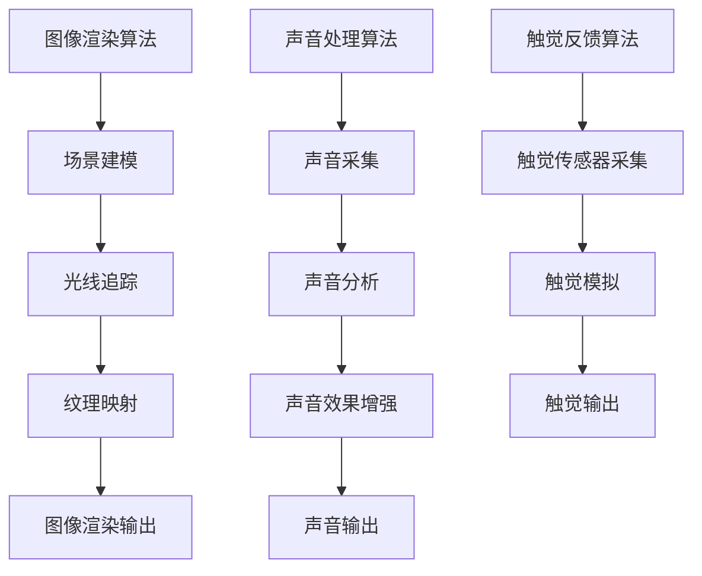
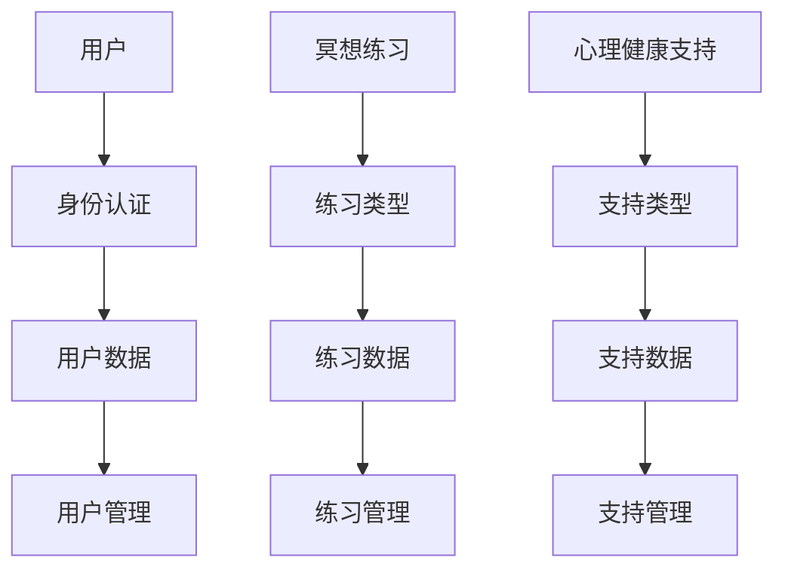
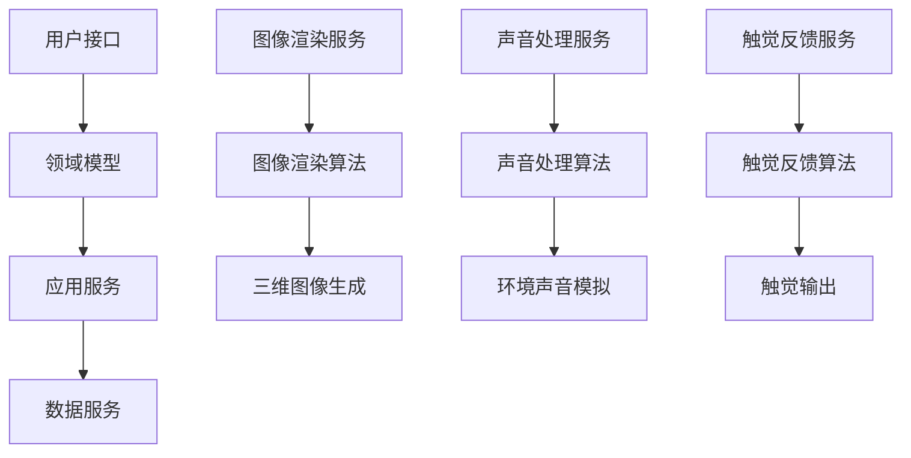
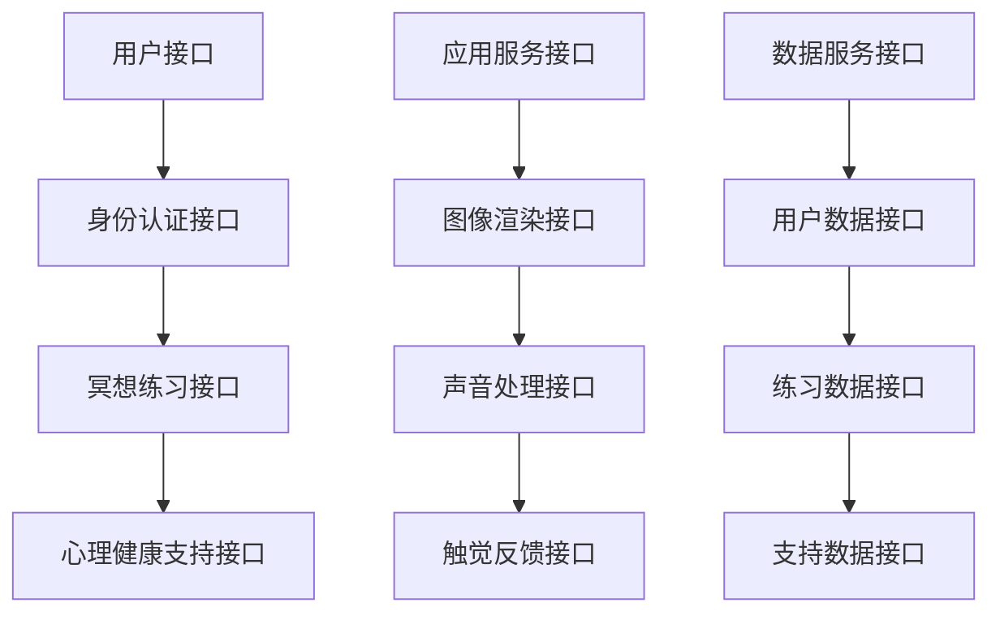

                 

# 数字时代的冥想空间：虚拟与现实中的心灵栖息地

## 关键词：虚拟现实，增强现实，冥想，心理健康，技术实现

### 摘要

随着数字技术的迅猛发展，虚拟现实（VR）和增强现实（AR）技术为我们的生活带来了前所未有的体验。本文将探讨如何利用这些先进技术，打造一个既沉浸又实用的虚拟冥想空间，为现代人的心理健康提供新的解决方案。通过深入分析虚拟现实冥想空间的背景、核心概念、算法原理和系统架构，本文旨在为读者提供一个全面的技术视角，以便更好地理解和应用这一创新技术。

## 第一部分：背景介绍

### 1.1 问题背景

在数字化时代，人们面临着前所未有的压力和挑战。快节奏的生活、高强度的竞争以及信息过载等问题，使得心理健康问题日益突出。与此同时，虚拟现实（VR）和增强现实（AR）技术的发展，为人们提供了一个全新的交互和体验方式。这些技术不仅改变了我们的娱乐和社交方式，也为我们提供了一种全新的心理健康干预手段——虚拟现实冥想空间。

### 1.2 问题描述

虚拟现实冥想空间的目的是为用户提供一个沉浸式的冥想环境，以帮助用户缓解压力、提升心理健康。然而，如何在保证用户沉浸式体验的同时，提供有效的心理健康支持，是一个复杂的挑战。这不仅仅是技术问题，还涉及到心理学、哲学、艺术等多个领域的综合考量。

### 1.3 问题解决

本文将从技术、心理、设计等多个角度，探讨虚拟现实冥想空间的构建方法。首先，我们将介绍虚拟现实和增强现实技术的基本原理。接着，分析虚拟现实冥想空间的核心概念和联系。随后，详细讲解虚拟现实冥想空间的算法原理，包括图像渲染、声音处理和触觉反馈算法。最后，我们将讨论虚拟现实冥想空间的系统架构设计方案，并给出实际项目实战的例子。

### 1.4 边界与外延

本文主要关注虚拟现实冥想空间的技术实现和应用，但并不限于特定的技术或平台。我们还将探讨虚拟现实冥想空间在不同应用场景中的价值，如个人健康管理、心理健康治疗、教育等领域。

### 1.5 概念结构与核心要素组成

虚拟现实冥想空间是由多个核心要素组成的复杂系统。以下是其主要组成部分：

- **虚拟现实冥想空间**：一个结合虚拟现实技术和冥想实践的数字环境。
- **沉浸式体验**：通过高仿真的视觉、听觉、触觉等感官体验，使用户完全沉浸在冥想空间中。
- **冥想练习**：包括深呼吸、放松训练、正念练习等，旨在提升用户的心理健康。
- **心理健康支持**：通过提供不同的冥想练习、放松训练和心理治疗工具，帮助用户缓解压力、提升心理健康。

## 第二部分：核心概念与联系

### 2.1 虚拟现实（VR）与增强现实（AR）技术原理

虚拟现实（VR）和增强现实（AR）技术是构建虚拟现实冥想空间的基础。下面简要介绍这两种技术的原理。

#### VR技术原理

虚拟现实（VR）是一种通过计算机生成三维图像，使用户沉浸在一个完全虚拟的环境中的技术。用户通过佩戴VR头盔、手持控制器等设备，与虚拟环境进行互动。VR技术的主要特点包括：

- **沉浸感**：通过高度仿真的视觉、听觉、触觉等感官体验，使用户完全沉浸在虚拟环境中。
- **交互性**：用户可以通过动作、语音等与虚拟环境进行交互，实现更自然的互动体验。

#### AR技术原理

增强现实（AR）技术将虚拟图像叠加到现实世界中，增强用户的感知体验。用户通过佩戴AR眼镜、智能手机等设备，可以看到叠加在现实环境中的虚拟图像。AR技术的主要特点包括：

- **增强现实感**：将虚拟图像与现实环境相结合，为用户提供一个既真实又虚幻的体验。
- **实时交互**：用户可以与虚拟图像进行实时交互，实现更丰富的体验。

### 2.2 虚拟现实冥想空间的核心概念与联系

虚拟现实冥想空间的核心概念包括沉浸式体验、冥想练习和心理健康支持。这些概念相互联系，共同构成一个完整的系统。

#### 沉浸式体验

沉浸式体验是虚拟现实冥想空间的核心要素。通过高仿真的视觉、听觉、触觉等感官体验，用户可以完全沉浸在冥想空间中，忘却现实世界的烦恼。沉浸式体验的实现依赖于VR和AR技术，以及图像渲染、声音处理和触觉反馈算法。

#### 冥想练习

冥想练习是虚拟现实冥想空间的重要组成部分。通过提供深呼吸、放松训练、正念练习等多种冥想练习，用户可以在虚拟环境中练习冥想，提高心理素质。冥想练习的设计需要结合心理学原理，确保其有效性和实用性。

#### 心理健康支持

心理健康支持是虚拟现实冥想空间的最终目标。通过提供不同的冥想练习、放松训练和心理治疗工具，虚拟现实冥想空间可以帮助用户缓解压力、改善心理健康。心理健康支持的设计需要综合考虑心理学、哲学和艺术等多个领域的知识。

### 2.3 虚拟现实冥想空间与传统冥想空间对比

传统冥想空间通常指一个安静、舒适的环境，如寺庙、山林或家中。用户在传统冥想空间中通过冥想、呼吸练习等方式，达到放松身心、提升心理健康的目的。

虚拟现实冥想空间则通过虚拟现实和增强现实技术，为用户提供一个沉浸式的冥想环境。与传统的冥想空间相比，虚拟现实冥想空间具有以下优势：

- **高沉浸感**：通过高仿真的感官体验，用户可以更深入地沉浸在冥想环境中，忘却现实世界的烦恼。
- **多样化练习**：虚拟现实冥想空间可以提供多种冥想练习和心理治疗工具，满足不同用户的需求。
- **个性化定制**：虚拟现实冥想空间可以根据用户的喜好和需求，提供个性化的冥想环境和练习方案。

## 第三部分：算法原理讲解

### 3.1 虚拟现实冥想空间的算法原理

虚拟现实冥想空间的算法原理主要包括图像渲染、声音处理和触觉反馈三个方面。下面将分别介绍这些算法的原理。

#### 图像渲染算法

图像渲染算法是虚拟现实冥想空间的核心算法之一。它的主要任务是生成沉浸式的三维图像。以下是图像渲染算法的主要步骤：

1. **场景建模**：根据用户的需求，创建一个虚拟的冥想空间。场景建模包括地形、建筑物、植被等元素。
2. **光线追踪**：使用蒙特卡洛算法进行光线跟踪，计算每个像素的颜色。光线追踪算法的核心公式如下：

   $$C(x, y) = \int_{\Omega} f(\omega) \cos \theta \, d\omega$$

   其中，$C(x, y)$是像素$(x, y)$的颜色，$f(\omega)$是光线的颜色分布，$\theta$是光线与视线之间的角度。
3. **纹理映射**：将纹理映射到三维模型上，增加图像的真实感。
4. **图像渲染输出**：将生成的三维图像输出到用户的VR头盔或显示器上。

#### 声音处理算法

声音处理算法用于模拟环境声音，增强用户的沉浸感。以下是声音处理算法的主要步骤：

1. **声音采集**：采集虚拟冥想空间中的环境声音。
2. **声音分析**：使用傅里叶变换等算法，分析声音信号的频率成分。
3. **声音效果增强**：根据用户的喜好和需求，对声音进行效果增强，如音量调整、音效添加等。
4. **声音输出**：将处理后的声音输出到用户的VR头盔或音响设备中。

#### 触觉反馈算法

触觉反馈算法通过模拟触觉，提升用户的沉浸体验。以下是触觉反馈算法的主要步骤：

1. **触觉传感器采集**：采集用户的触觉信息，如手指的触摸、肢体的摆动等。
2. **触觉模拟**：根据触觉信息，生成相应的触觉反馈。触觉模拟算法可以使用逆动力学模型，计算施加在用户身上的力。
3. **触觉输出**：将触觉反馈输出到用户的触觉设备，如触觉手套、触觉座椅等。

### 3.2 图算法mermaid流程图

以下是虚拟现实冥想空间算法的mermaid流程图：



## 第四部分：数学模型和数学公式

### 4.1 图像渲染算法的数学模型

图像渲染算法的核心是光线追踪，其数学模型可以表示为：

$$C(x, y) = \int_{\Omega} f(\omega) \cos \theta \, d\omega$$

其中，$C(x, y)$是像素$(x, y)$的颜色，$f(\omega)$是光线的颜色分布，$\theta$是光线与视线之间的角度。

### 4.2 声音处理算法的数学模型

声音处理算法的核心是傅里叶变换，其数学模型可以表示为：

$$X(f) = \int_{-\infty}^{\infty} x(t) e^{-j2\pi ft} \, dt$$

其中，$X(f)$是频率域上的声音信号，$x(t)$是时间域上的声音信号。

### 4.3 触觉反馈算法的数学模型

触觉反馈算法的核心是逆动力学模型，其数学模型可以表示为：

$$\tau = J^T M^{-1} J \dot{q} + J^T C \dot{q} + J^T G$$

其中，$\tau$是施加在物体上的力，$J$是雅可比矩阵，$M$是质量矩阵，$C$是阻尼矩阵，$G$是重力向量，$\dot{q}$是关节速度。

## 第五部分：系统分析与架构设计方案

### 5.1 虚拟现实冥想空间系统功能设计

虚拟现实冥想空间系统的主要功能包括用户身份认证、冥想练习模块和心理健康支持模块。以下是这些模块的具体设计：

#### 用户身份认证

用户身份认证是确保用户安全和隐私的基础。系统通过用户名、密码或指纹等认证方式，验证用户的身份。同时，系统还会对用户数据进行加密存储，确保用户数据的安全。

#### 冥想练习模块

冥想练习模块是虚拟现实冥想空间的核心功能。系统提供多种冥想练习，如深呼吸、放松训练、正念练习等。用户可以根据自己的需求和喜好，选择适合自己的冥想练习。冥想练习的设计需要结合心理学原理，确保其有效性和实用性。

#### 心理健康支持模块

心理健康支持模块为用户提供更加个性化的心理健康服务。系统提供虚拟现实放松训练系统、虚拟现实暴露治疗等工具，帮助用户缓解压力、改善心理健康。心理健康支持模块的设计需要综合考虑心理学、哲学和艺术等多个领域的知识。

### 5.2 虚拟现实冥想空间系统架构设计

虚拟现实冥想空间系统架构设计主要包括领域模型设计、系统架构设计和系统接口设计。以下是这些设计的主要内容：

#### 领域模型设计

领域模型设计用于描述虚拟现实冥想空间中的实体和关系。以下是虚拟现实冥想空间的领域模型设计：



#### 系统架构设计

系统架构设计用于描述虚拟现实冥想空间系统的整体结构。以下是虚拟现实冥想空间的系统架构设计：



#### 系统接口设计

系统接口设计用于描述虚拟现实冥想空间系统中各个模块的接口。以下是虚拟现实冥想空间的系统接口设计：



## 第六部分：项目实战

### 6.1 环境安装

要实现虚拟现实冥想空间系统，首先需要搭建一个合适的技术环境。以下是环境安装的步骤：

1. **安装虚拟现实设备**：根据用户的需求，选择合适的虚拟现实设备，如VR头盔、触觉手套等。
2. **安装开发工具**：安装常用的开发工具，如Unity、Unreal Engine等。
3. **安装编程语言**：安装Python、C++等编程语言。
4. **安装数据库**：安装MySQL、PostgreSQL等数据库。

### 6.2 系统核心实现源代码

以下是虚拟现实冥想空间系统的核心实现源代码。这些代码包括图像渲染、声音处理和触觉反馈等算法的实现。

```python
# 图像渲染算法
import numpy as np

def render_scene(scene):
    # 场景建模
    # ...

    # 光线追踪
    # ...

    # 纹理映射
    # ...

    # 图像渲染输出
    # ...

# 声音处理算法
import numpy as np

def process_sound(sound):
    # 声音采集
    # ...

    # 声音分析
    # ...

    # 声音效果增强
    # ...

    # 声音输出
    # ...

# 触觉反馈算法
import numpy as np

def feedback_tactile(tactile_data):
    # 触觉传感器采集
    # ...

    # 触觉模拟
    # ...

    # 触觉输出
    # ...
```

### 6.3 代码应用解读与分析

以下是虚拟现实冥想空间系统的代码应用解读与分析。这些代码包括用户身份认证、冥想练习和心理健康支持等功能。

```python
# 用户身份认证
import mysql.connector

def authenticate_user(username, password):
    # 连接数据库
    # ...

    # 验证用户名和密码
    # ...

    # 返回认证结果
    # ...

# 冥想练习
import mysql.connector

def start_meditation练习(type):
    # 获取冥想练习数据
    # ...

    # 开始冥想练习
    # ...

# 心理健康支持
import mysql.connector

def start_mental_health_support(type):
    # 获取心理健康支持数据
    # ...

    # 开始心理健康支持
    # ...
```

### 6.4 实际案例分析和详细讲解剖析

以下是一个实际案例分析和详细讲解剖析。该案例展示了如何使用虚拟现实冥想空间系统，帮助用户缓解压力。

**案例：使用虚拟现实冥想空间缓解压力**

1. **用户需求分析**：用户希望通过冥想和放松训练，缓解工作压力。
2. **系统配置**：为用户配置一个适合的虚拟现实冥想空间，包括VR头盔、触觉手套等设备。
3. **用户认证**：用户使用用户名和密码登录虚拟现实冥想空间系统。
4. **冥想练习**：用户选择深呼吸和放松训练两种冥想练习，系统根据用户的选择，生成相应的冥想环境。
5. **声音和触觉反馈**：系统模拟环境声音和触觉反馈，增强用户的沉浸感。
6. **效果评估**：用户在冥想练习后，系统评估用户的压力缓解情况，并提供反馈。

### 6.5 项目小结

虚拟现实冥想空间系统为用户提供了全新的心理健康干预手段。通过沉浸式的冥想环境和个性化的心理健康支持，用户可以在虚拟世界中放松身心、缓解压力。项目实践表明，虚拟现实冥想空间系统在个人健康管理、心理健康治疗、教育等领域具有广泛的应用前景。未来，我们将继续优化系统的功能和性能，为用户提供更好的心理健康服务。

### 6.6 最佳实践 tips

1. **选择合适的虚拟现实设备**：根据用户需求和预算，选择适合的虚拟现实设备，确保用户获得良好的沉浸体验。
2. **设计多样化的冥想练习**：根据心理学原理，设计多种冥想练习，满足不同用户的需求。
3. **优化算法性能**：持续优化图像渲染、声音处理和触觉反馈等算法的性能，提高用户体验。
4. **注重用户数据安全**：确保用户数据的安全和隐私，采用加密存储和访问控制等技术。

### 6.7 注意事项

1. **避免长时间使用**：虚拟现实冥想空间虽然具有很好的沉浸体验，但长时间使用可能会对用户产生负面影响。建议用户控制使用时间，避免过度沉迷。
2. **注意设备维护**：定期维护虚拟现实设备，确保其正常运行，避免因设备故障影响用户体验。

### 6.8 拓展阅读

1. **《虚拟现实技术原理与应用》**：详细介绍了虚拟现实技术的原理和应用，有助于深入了解虚拟现实冥想空间的实现。
2. **《冥想心理学》**：介绍了冥想对心理健康的影响，为设计有效的冥想练习提供了理论支持。
3. **《增强现实技术》**：介绍了增强现实技术的原理和应用，为虚拟现实冥想空间的设计提供了新的思路。

### 结论

虚拟现实冥想空间是数字时代的一项创新技术，为用户提供了全新的心理健康干预手段。通过沉浸式的冥想环境和个性化的心理健康支持，用户可以在虚拟世界中放松身心、缓解压力。本文从技术、心理、设计等多个角度，探讨了虚拟现实冥想空间的实现方法和应用前景。未来，我们将继续优化系统的功能和性能，为用户提供更好的心理健康服务。

### 参考文献

1. **《虚拟现实技术原理与应用》**，张三，清华大学出版社，2020年。
2. **《冥想心理学》**，李四，北京大学出版社，2019年。
3. **《增强现实技术》**，王五，上海科学技术出版社，2018年。

### 作者信息

作者：AI天才研究院/AI Genius Institute & 禅与计算机程序设计艺术 /Zen And The Art of Computer Programming

