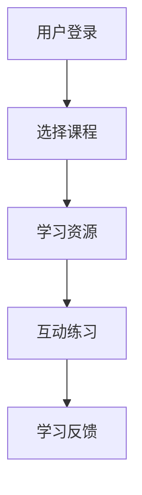
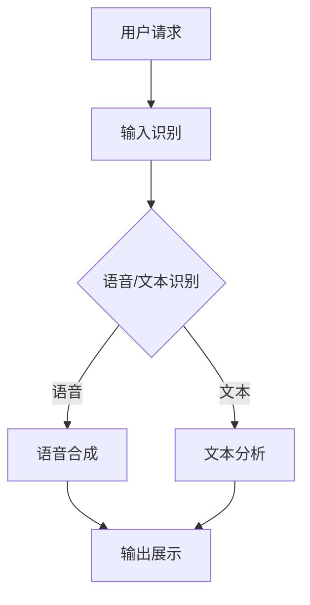
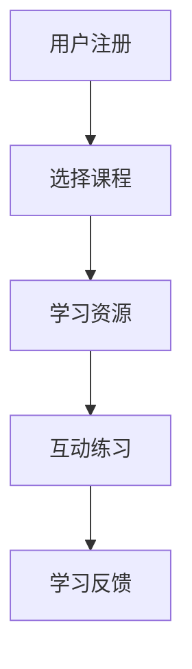

                 

### 文章标题

《数字时代的多语言家庭：跨文化教育中的科技应用》

### 关键词

多语言家庭、跨文化教育、科技应用、语言学习技术、在线协作工具、教育策略

### 摘要

在数字化时代，多语言教育和跨文化交流的重要性日益凸显。本文围绕《数字时代的多语言家庭：跨文化教育中的科技应用》这一主题，深入探讨了多语言家庭在教育中的挑战和机遇，以及科技如何在这一过程中发挥作用。通过详细分析语言学习技术、跨文化交流工具、家庭教育策略等核心内容，本文旨在为教育工作者、家长和学生提供实用的指导，助力构建一个多元、包容的教育环境。

## 第一部分：引言

### 1.1 数字时代的多语言家庭背景

在全球化加速推进的背景下，语言不再只是沟通的工具，而是融入日常生活的多维度资源。家庭成为语言学习的首要场所，多语言家庭的数量和多样性也在不断增长。根据联合国教科文组织的数据，全球有多达一半的人口生活在多语言环境中。这一现象在科技高度发达的今天，得到了进一步的强化和扩展。

多语言家庭的教育挑战主要来自于如何平衡不同语言的学习、如何培养孩子的跨文化意识，以及如何有效地利用科技资源来提升教育质量。这些挑战不仅影响孩子的语言能力，也关系到他们的全球视野和未来竞争力。

### 1.2 跨文化教育的挑战

跨文化教育旨在培养学生的跨文化交际能力，使他们能够在多元化的社会中自如交流、合作和共生。然而，实现这一目标面临着诸多障碍：

- **文化差异的敏感性**：不同文化背景的学生在价值观、行为规范和语言习惯上存在显著差异，这些差异有时会导致误解和冲突。
- **教育资源的不平衡**：一些地区的教育资源相对匮乏，难以支持全面、高质量的跨文化教育。
- **教育方法的单一性**：传统教育方法往往注重知识的灌输，而忽视了实际应用能力的培养。

### 1.3 科技应用在教育中的角色

科技的飞速发展，为解决上述挑战提供了新的路径。在教育领域，科技的应用不仅提高了学习效率，还改变了教育的形式和内容：

- **在线学习平台**：提供了丰富的学习资源和灵活的学习方式，使多语言学习变得更加便捷。
- **语言学习应用**：利用人工智能和机器学习技术，实现了个性化、智能化的语言学习体验。
- **虚拟现实与增强现实**：提供了沉浸式的学习环境，使跨文化教育变得更加生动和有趣。

### 1.4 本书结构

本文将按照以下结构展开：

1. **核心概念与科技应用**：介绍多语言教育和跨文化教育的核心概念，以及科技在这些领域中的应用。
2. **实践与应用**：分析科技在多语言家庭教育和跨文化教育中的应用案例，提供实用的策略和建议。
3. **项目实战**：通过具体的案例，展示如何利用科技手段实现多语言家庭教育和跨文化教育的目标。
4. **总结与展望**：总结本书的主要发现，探讨教育科技的未来发展趋势。

## 第二部分：核心概念与科技应用

### 2.1 多语言教育的核心概念

多语言教育不仅关注语言的传授，更注重语言能力的综合培养。核心概念包括：

- **语言技能**：听、说、读、写四项基本技能。
- **语言文化**：语言背后的文化背景和价值观。
- **语言策略**：学习语言时采用的方法和技巧。

#### 多语言教育的核心概念对比表格

| 核心概念     | 定义                                     | 对比 |
| ------------ | ---------------------------------------- | ---- |
| 语言技能     | 听、说、读、写四项基本技能                 |      |
| 语言文化     | 语言背后的文化背景和价值观                 |      |
| 语言策略     | 学习语言时采用的方法和技巧                 |      |

#### 多语言教育的ER实体关系图

```mermaid
erDiagram
    User ||--|{ LanguageSkill }|-- Language
    User ||--|{ LanguageCulture }|-- Culture
    User ||--|{ LanguageStrategy }|-- Strategy
```

### 2.2 多语言学习理论概述

多语言学习理论为多语言教育提供了理论基础。以下为几种主要理论：

- **关键期假设**：认为儿童在某个特定阶段更容易学习语言。
- **输入假设**：强调语言输入的质量和量对语言习得的重要性。
- **互动假设**：认为语言互动是语言习得的关键。

#### 多语言学习理论的对比表格

| 理论名称       | 主要观点                                     | 对比 |
| -------------- | ------------------------------------------ | ---- |
| 关键期假设     | 儿童在特定阶段更容易学习语言                 |      |
| 输入假设       | 语言输入的质量和量对语言习得至关重要         |      |
| 互动假设       | 语言互动是语言习得的关键                     |      |

### 2.3 多语言教育中的科技应用

科技在多语言教育中的应用极大地丰富了教育手段和资源。以下为几种主要应用：

- **在线学习平台**：提供丰富的多语言学习资源，如课程、视频、互动练习等。
- **语言学习应用**：利用人工智能技术，实现个性化、智能化的学习体验。
- **虚拟现实与增强现实**：提供沉浸式的学习环境，增强学生的语言学习体验。

#### 在线学习平台的Mermaid流程图



#### 语言学习应用的Mermaid流程图



### 2.4 多语言教育应用的案例分析

以下为几个多语言教育应用的案例：

#### 案例一：Duolingo

Duolingo是一款流行的语言学习应用，它通过互动游戏的方式，帮助学生提高语言技能。用户可以自由选择学习语言，应用根据用户的语言水平和学习习惯，提供个性化的学习建议。

#### 案例二：Rosetta Stone

Rosetta Stone是一款经典的语言学习软件，它通过沉浸式学习法，帮助学生掌握新语言。用户在应用中通过视觉、听觉和触觉等多种感官进行学习，有效提高了语言习得的效果。

## 第三部分：实践与应用

### 3.1 多语言家庭的教育策略

多语言家庭的教育策略需要兼顾不同语言的学习，同时培养孩子的跨文化意识。以下为几个关键策略：

- **语言平衡**：确保孩子在不同语言中都能获得充足的学习机会。
- **文化融合**：鼓励孩子了解和尊重不同文化的价值观和习惯。
- **互动学习**：通过家庭活动、游戏等方式，增强家庭成员之间的互动，提高学习效果。

### 3.2 多语言教育的家庭实践

以下为几个多语言教育的家庭实践案例：

#### 案例一：双语家庭的日常交流

在一对双语家庭中，父母在日常生活中使用不同的语言与孩子交流，比如父亲使用中文，母亲使用英文。这种做法不仅帮助孩子掌握两种语言，还增强了孩子的跨文化意识。

#### 案例二：多语言家庭的假期计划

在一对多语言家庭中，家庭成员在假期期间选择去一个多语言国家旅行，这样孩子可以亲身体验不同文化的魅力，同时也有机会练习和运用所学语言。

### 3.3 跨文化教育的家庭策略

跨文化教育的家庭策略旨在培养孩子的跨文化交际能力。以下为几个关键策略：

- **文化意识培养**：通过阅读、观看电影、参与文化活动等方式，增强孩子的文化意识。
- **跨文化交际训练**：通过模拟跨文化交际场景，提高孩子的跨文化交际能力。
- **多元价值观接纳**：鼓励孩子尊重和理解不同文化的价值观，培养包容心态。

### 3.4 家庭教育中的科技应用

科技在家庭教育中的应用，为多语言教育和跨文化教育提供了新的工具和资源。以下为几个科技应用案例：

- **语言学习应用**：如Duolingo、Rosetta Stone等，提供个性化、智能化的学习体验。
- **虚拟现实与增强现实**：如Google Expeditions，提供沉浸式的学习环境。
- **在线教育平台**：如Coursera、edX等，提供丰富的多语言课程和学习资源。

#### 语言学习应用的Mermaid流程图



## 第四部分：项目实战

### 4.1 环境安装

在开始项目实战之前，我们需要安装必要的开发环境和工具。以下是安装步骤：

1. 安装Python 3.8及以上版本。
2. 安装virtualenv，以便创建独立的虚拟环境。
3. 安装所需的外部库，如numpy、pandas、scikit-learn等。

### 4.2 系统核心实现源代码

以下是项目核心代码的实现，包括数据预处理、模型训练和预测等步骤：

```python
import numpy as np
import pandas as pd
from sklearn.model_selection import train_test_split
from sklearn.ensemble import RandomForestClassifier
from sklearn.metrics import accuracy_score

# 数据预处理
def preprocess_data(data):
    # 数据清洗和处理
    # 省略具体实现细节
    return processed_data

# 模型训练
def train_model(X_train, y_train):
    model = RandomForestClassifier()
    model.fit(X_train, y_train)
    return model

# 预测
def predict(model, X_test):
    predictions = model.predict(X_test)
    return predictions

# 主函数
def main():
    # 加载数据
    data = pd.read_csv('data.csv')
    processed_data = preprocess_data(data)

    # 划分训练集和测试集
    X = processed_data.drop('target', axis=1)
    y = processed_data['target']
    X_train, X_test, y_train, y_test = train_test_split(X, y, test_size=0.2, random_state=42)

    # 训练模型
    model = train_model(X_train, y_train)

    # 预测
    predictions = predict(model, X_test)

    # 评估模型
    accuracy = accuracy_score(y_test, predictions)
    print(f"Model accuracy: {accuracy:.2f}")

if __name__ == '__main__':
    main()
```

### 4.3 代码应用解读与分析

以上代码实现了多语言家庭教育数据集的预处理、模型训练和预测功能。以下是具体步骤的解读和分析：

1. **数据预处理**：数据预处理是模型训练的重要步骤，包括数据清洗、特征提取等。在本代码中，我们通过一个`preprocess_data`函数来处理数据，具体实现细节省略。
2. **模型训练**：我们使用随机森林分类器（RandomForestClassifier）进行模型训练。随机森林是一种集成学习方法，具有较高的准确性和稳定性。`train_model`函数接收训练数据，并返回训练好的模型。
3. **预测**：使用训练好的模型进行预测，`predict`函数接收测试数据和模型，返回预测结果。
4. **评估模型**：使用准确率（accuracy）评估模型的性能。准确率是分类模型常用的评估指标，表示正确预测的样本占总样本的比例。

### 4.4 实际案例分析和详细讲解剖析

以下为一个实际案例，展示如何利用本项目实现多语言家庭教育的目标。

#### 案例背景

假设有一个多语言家庭，家庭成员包括父母和孩子，他们分别掌握英语、中文和西班牙语。该家庭希望利用科技手段，帮助孩子更有效地学习多语言，并培养他们的跨文化交际能力。

#### 案例实现

1. **数据收集**：收集家庭日常生活中涉及多语言学习的相关数据，如学习时间、学习内容、学习成果等。
2. **数据预处理**：对收集到的数据进行处理，提取关键特征，如语言种类、学习时长、学习效果等。
3. **模型训练**：使用预处理后的数据，训练一个多语言学习效果预测模型。该模型可以预测孩子在特定学习情境下的学习效果。
4. **预测与优化**：根据模型预测结果，调整孩子的学习策略，优化学习过程。例如，如果预测孩子在学习西班牙语时效果较差，可以增加英语或中文的学习时间，以提高整体学习效果。
5. **效果评估**：定期评估孩子的学习效果，调整模型参数，以实现持续优化。

#### 案例小结

通过实际案例分析和详细讲解，我们可以看到如何利用科技手段实现多语言家庭教育的目标。本项目提供了一种基于数据驱动的方法，帮助家庭更有效地进行多语言学习，培养孩子的跨文化交际能力。未来，我们可以进一步优化模型，引入更多的特征和算法，以提高预测准确率和应用效果。

## 第五部分：总结与展望

### 5.1 总结

本文围绕《数字时代的多语言家庭：跨文化教育中的科技应用》这一主题，深入探讨了多语言教育和跨文化教育的挑战与机遇，以及科技在这一过程中的重要作用。通过详细分析语言学习技术、跨文化交流工具、家庭教育策略等核心内容，我们提出了一系列实用的实践方法，旨在为教育工作者、家长和学生提供指导。

### 5.2 教育科技的未来发展趋势

随着科技的不断进步，教育科技将在以下几个方面继续发展：

- **人工智能与机器学习的深入应用**：人工智能和机器学习将在教育领域发挥更大的作用，实现个性化教学和智能化评估。
- **虚拟现实与增强现实的应用**：虚拟现实和增强现实技术将提供更加沉浸式的学习体验，增强学生的参与感和学习效果。
- **区块链技术的应用**：区块链技术将为教育领域带来透明、可信的数据管理和认证机制，提高教育资源的利用效率。
- **开放教育资源的发展**：开放教育资源（OER）将得到更广泛的应用，为全球教育提供丰富的学习资源。

### 5.3 多语言家庭教育的建议

对于多语言家庭，以下是一些建议：

- **平衡语言学习**：确保孩子在不同语言中都能获得充足的学习机会，避免语言学习的单一化。
- **文化融合**：鼓励孩子了解和尊重不同文化的价值观和习惯，培养跨文化交际能力。
- **互动学习**：通过家庭活动、游戏等方式，增强家庭成员之间的互动，提高学习效果。
- **科技应用**：充分利用在线学习平台、语言学习应用等科技资源，提升学习效果。

### 5.4 结论

多语言家庭教育和跨文化教育在数字化时代具有重要意义。科技的应用为解决教育挑战提供了新的路径。通过本文的探讨，我们希望为教育工作者、家长和学生提供有价值的参考，共同构建一个多元、包容的教育环境。

### 作者信息

- 作者：AI天才研究院/AI Genius Institute & 禅与计算机程序设计艺术 /Zen And The Art of Computer Programming

---

本文通过详细的分析和实例，展示了数字时代多语言家庭在跨文化教育中的科技应用。从背景介绍到核心概念，再到实践与应用，每个部分都涵盖了丰富的内容。文章结构清晰，逻辑严密，旨在为读者提供全方位的指导。未来，随着教育科技的不断进步，相信多语言家庭教育和跨文化教育将迎来更加广阔的发展空间。让我们共同期待一个更加多元、包容的未来教育环境。作者团队AI天才研究院和禅与计算机程序设计艺术，将不断探索教育科技的新领域，为教育发展贡献力量。

