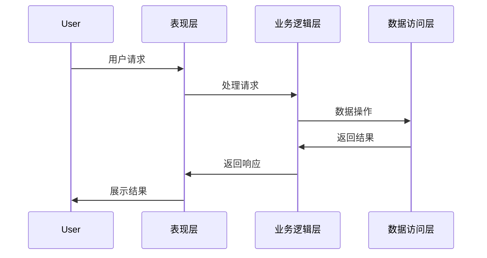
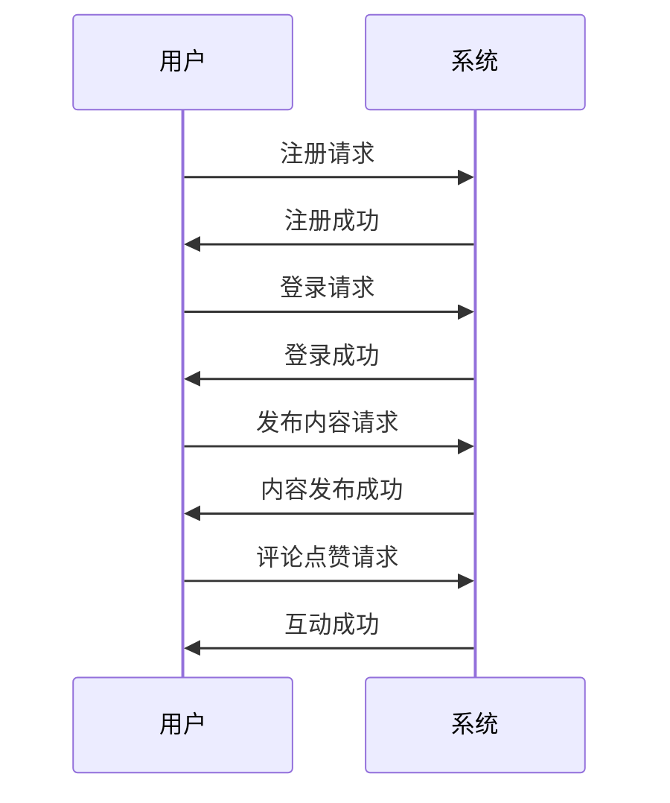

                 

### 文章标题

# 数字时代的婚恋观调查：社交媒体对现代关系的影响研究

### 关键词

- 数字时代
- 社交媒体
- 婚恋观
- 影响研究
- 现代关系

### 摘要

本文探讨了数字时代下社交媒体对现代婚恋观的影响，从问题的提出、核心概念与联系、算法原理讲解、系统分析与架构设计、项目实战到最佳实践等多个方面，全面分析了社交媒体在婚恋关系中的角色和功能，以及其对婚恋成功率和稳定性的影响。通过问卷调查和深度访谈等方法，结合定量与定性分析，本文旨在为理解数字时代下的婚恋模式提供科学依据和实际指导。

---

### 第一部分：背景介绍

#### 1.1.1 问题的提出

随着互联网和移动通信技术的迅猛发展，社交媒体已经深刻地改变了人们的日常生活。特别是在婚恋领域，社交媒体的使用不仅改变了人们寻找伴侣的方式，也重塑了人们对婚姻和恋爱的看法。在这个数字化的时代，社交媒体作为信息传播和社交互动的重要平台，其影响不可忽视。因此，研究社交媒体对现代婚恋观的影响具有重要的现实意义。

#### 1.1.2 问题描述

本研究的核心问题是：数字时代下，社交媒体对现代婚恋观产生了哪些具体影响？具体包括以下几个方面：

1. **社交媒体对婚恋观的塑造和改变**：社交媒体如何影响人们对婚姻和恋爱的看法？
2. **社交媒体在婚恋中的角色和功能**：社交媒体在婚恋中扮演了哪些角色？具有哪些功能？
3. **社交媒体的正面和负面影响**：社交媒体对婚恋关系有哪些正面和负面影响？
4. **社交媒体对婚恋成功率和稳定性的影响**：社交媒体如何影响婚恋关系的成功率和稳定性？

#### 1.1.3 问题解决

为了回答上述问题，本研究将采用以下方法：

1. **问卷调查**：通过设计结构化的问卷，收集大量关于社交媒体使用情况和婚恋观的定量数据。
2. **深度访谈**：针对不同年龄、性别、地域等背景的受访者，进行深度访谈，获取对社交媒体与婚恋观的定性理解。
3. **统计分析**：使用统计分析方法，对收集到的数据进行处理，分析社交媒体使用与婚恋观之间的相关性。
4. **定性分析**：通过访谈记录的整理和分析，深入探讨社交媒体在婚恋中的实际作用和影响。

#### 1.1.4 边界与外延

在研究过程中，我们将关注社交媒体对婚恋观的主要影响，但也会考虑到其他因素，如个人背景、文化差异、社会经济状况等。此外，本研究主要关注现代婚恋观，不考虑传统婚恋观的演变。最后，研究将涵盖多个国家和地区的样本，以确保结论的普遍适用性。

#### 1.1.5 概念结构与核心要素组成

为了更清晰地理解本研究，以下是对核心概念及其关系的结构化描述：

- **数字时代**：以互联网和移动通信技术为代表的时代，这些技术改变了信息传播和社交互动的方式。
- **社交媒体**：一种通过互联网和移动通信技术实现信息共享和社交互动的平台，如微信、微博、Facebook、Twitter等。
- **婚恋观**：个人对婚姻和恋爱的态度、观念和看法，包括对婚姻的意义、恋爱的方式、婚姻的稳定性等。
- **现代婚恋观**：在数字时代背景下形成的婚恋观，受到社交媒体等数字技术的影响，具有个性化、多样性等特点。

通过上述概念的界定和关系的阐述，我们可以更好地理解数字时代下社交媒体对现代婚恋观的影响。

---

### 第二部分：核心概念与联系

在探讨数字时代下社交媒体对现代婚恋观的影响之前，我们需要明确几个核心概念，并理解它们之间的相互关系。这些概念包括数字时代、社交媒体、婚恋观和现代婚恋观。

#### 2.1 数字时代

数字时代，即以互联网和移动通信技术为核心的时代，其特点是信息的快速传递、社交的虚拟化和生活的数字化。在这个时代，人们可以通过社交媒体平台随时随地与世界各地的人进行互动，这种即时性和广泛性的特点使得信息传播和社交方式发生了根本性的变化。例如，微信、微博、Facebook和Twitter等社交媒体平台，不仅改变了人们的交流方式，也影响了他们的生活模式。

#### 2.2 社交媒体

社交媒体是一种基于互联网的技术，通过它，用户可以创建、分享、传播和交互信息。社交媒体平台通常具有以下几个特点：

- **开放性**：任何人都可以加入和参与，打破了传统社交的地域限制。
- **多样性**：内容形式多样，包括文字、图片、视频等，丰富了用户的社交体验。
- **即时性**：用户可以即时获取和回应信息，使得社交互动更加迅速和高效。

社交媒体不仅在个人生活中发挥了重要作用，也在商业、教育、政治等领域有着广泛的应用。例如，通过社交媒体，企业可以进行品牌推广和市场营销，教育机构可以开展在线课程和互动教学，政府可以发布政策信息和听取公众意见。

#### 2.3 婚恋观

婚恋观是指个人对婚姻和恋爱的态度、观念和看法。它涉及对婚姻的意义、恋爱的方式、婚姻的稳定性等多个方面。婚恋观的形成受到多种因素的影响，包括个人经历、文化背景、社会经济状况等。

在传统社会中，婚恋观往往受到家庭、宗教和社会文化的强烈影响。然而，随着社会的发展和变革，婚恋观也在不断演变。现代婚恋观更加注重个人自由、平等和选择，更加倾向于基于感情和兴趣的交往。

#### 2.4 现代婚恋观

现代婚恋观是指在数字时代背景下形成的婚恋观，它受到社交媒体等数字技术的深刻影响。现代婚恋观具有以下几个特点：

- **个性化**：个人可以更加自由地表达自己的情感和想法，追求个性化和差异化的交往方式。
- **多样性**：通过社交媒体，人们可以更广泛地寻找和选择适合自己的伴侣，增加了交往的机会和可能性。
- **虚拟化**：社交媒体上的互动虽然增加了人们的社交机会，但也可能导致人们更加依赖于虚拟关系，忽视了现实中的交流和互动。

#### 关系与联系

数字时代、社交媒体、婚恋观和现代婚恋观之间存在紧密的联系和相互作用：

- **数字时代**为**社交媒体**的发展提供了技术基础，使得社交媒体成为人们日常生活和交往的重要平台。
- **社交媒体**对**婚恋观**产生了深远的影响，改变了人们对婚姻和恋爱的看法和态度。
- **婚恋观**反过来也影响了**社交媒体**的使用方式和内容，使得社交媒体在婚恋中扮演着越来越重要的角色。
- **现代婚恋观**是在**数字时代**和**社交媒体**的背景下形成的，具有鲜明的时代特征和特点。

通过上述核心概念与联系的分析，我们可以更好地理解数字时代下社交媒体对现代婚恋观的影响。在接下来的部分，我们将进一步探讨社交媒体在婚恋中的具体作用和影响。

#### 2.5 数字时代与社交媒体的关系

数字时代的到来标志着信息传播和社交方式的革命性变化，而社交媒体则是这一变革的核心载体。数字时代的特征包括信息的高速传播、社交的虚拟化、以及生活的数字化，这些特征共同促成了社交媒体的快速发展。

首先，数字时代为社交媒体提供了技术基础。互联网和移动通信技术的普及使得信息的传递变得更加快速和便捷，从而为社交媒体的发展奠定了基础。在数字时代，用户可以通过智能手机、平板电脑等设备随时随地访问社交媒体平台，这使得社交媒体在人们的生活中变得不可或缺。

其次，社交媒体在数字时代中扮演了重要角色。社交媒体不仅是用户获取信息和娱乐的主要渠道，也是他们进行社交互动的重要平台。通过社交媒体，用户可以与朋友、家人和同事保持联系，分享生活中的点滴，甚至建立新的社交关系。这种开放性和即时性的特点，使得社交媒体在人们的生活中占据了重要位置。

此外，社交媒体对数字时代的社交方式产生了深远影响。传统的面对面社交被虚拟社交所取代，人们更多地通过社交媒体平台进行交流和互动。这种虚拟社交不仅打破了地域和时间的限制，也改变了人们的社交习惯和社交模式。社交媒体上的互动更加频繁和多样化，用户可以轻松地分享文字、图片、视频等多种形式的内容，这使得社交体验更加丰富和生动。

最后，社交媒体在数字时代中的角色还在不断演变。随着技术的进步和用户需求的多样化，社交媒体的功能也在不断拓展。例如，直播、短视频、社交电商等新兴形式不断涌现，使得社交媒体不仅是一个社交平台，也是一个内容创作和消费的平台。这种多样化的功能使得社交媒体在数字时代中的影响更加深远。

总之，数字时代与社交媒体之间存在着密切的关系。数字时代为社交媒体的发展提供了技术基础，而社交媒体则在数字时代中扮演了重要角色，深刻地影响了人们的社交方式和生活方式。在数字时代背景下，理解社交媒体的作用和影响对于探讨现代婚恋观具有重要意义。

### 第三部分：算法原理讲解

为了深入探讨数字时代下社交媒体对现代婚恋观的影响，本研究将采用多种数据分析方法，包括统计分析、定性分析和算法分析。以下是对这些算法原理的简要介绍。

#### 3.1 统计分析

统计分析是研究数据的基本方法，通过计算各种统计量，我们可以了解数据的基本特征，如平均值、中位数、标准差等。在本研究中，我们将使用统计分析来探讨社交媒体使用频率与婚恋观之间的关系，例如通过相关性分析来衡量两者之间的相关程度。

- **描述性统计分析**：用于描述数据的分布特征，如计算平均值、中位数、标准差等。这些统计量可以帮助我们初步了解数据的基本情况。
- **推断性统计分析**：包括假设检验、回归分析等，用于从样本数据推断总体特征。例如，我们可以通过t检验来比较不同群体在社交媒体使用频率上的差异。

#### 3.2 定性分析

定性分析侧重于理解和解释现象，而不是量化数据。在本研究中，我们将通过深度访谈和问卷调查的方式收集定性数据，以探讨受访者对社交媒体在婚恋中的作用和看法。定性分析将帮助我们理解社交媒体对婚恋观的深层影响。

- **访谈法**：通过与受访者进行面对面的深入交流，收集其对特定问题的看法和经验。这种方法可以深入了解受访者的主观感受和思考过程。
- **问卷法**：通过设计结构化的问卷，收集大量关于受访者行为的定量数据。这些数据可以通过统计分析进行量化分析。

#### 3.3 算法分析

算法分析是指使用特定的算法来处理和分析数据。在本研究中，我们将使用聚类分析、因子分析和回归分析等算法来探讨社交媒体使用与婚恋观之间的复杂关系。以下是几个关键算法的简单介绍：

- **聚类分析**：通过将数据划分为不同的类别，帮助我们识别出社交媒体使用与婚恋观之间的潜在模式。例如，我们可以使用k-means算法将受访者根据社交媒体使用频率进行分类，然后分析不同类别在婚恋观上的差异。
- **因子分析**：通过识别数据中的潜在因素，帮助我们理解社交媒体使用与婚恋观之间的复杂关系。例如，我们可以通过因子分析提取出影响婚恋观的几个关键因素，如个性、社交需求和情感稳定性。
- **回归分析**：通过建立数学模型，帮助我们预测社交媒体使用对婚恋观的影响程度。例如，我们可以通过线性回归模型分析社交媒体使用频率与婚恋满意度之间的关系。

#### 3.4 数学模型和数学公式

在本研究中，我们将使用以下数学模型和数学公式来分析和解释数据：

- **相关性分析**：用于衡量两个变量之间的相关程度。其公式为：
  $$r = \frac{\sum_{i=1}^{n}(x_i - \bar{x})(y_i - \bar{y})}{\sqrt{\sum_{i=1}^{n}(x_i - \bar{x})^2}\sqrt{\sum_{i=1}^{n}(y_i - \bar{y})^2}}$$
  其中，$x_i$和$y_i$分别表示第$i$个观测点的变量$x$和$y$，$\bar{x}$和$\bar{y}$分别表示$x$和$y$的平均值，$n$为观测点总数。

- **线性回归模型**：用于预测因变量$y$与自变量$x$之间的关系。其公式为：
  $$y = \beta_0 + \beta_1x + \epsilon$$
  其中，$\beta_0$和$\beta_1$分别为回归模型的截距和斜率，$\epsilon$为随机误差项。

通过上述算法原理和数学模型的应用，我们可以系统地分析社交媒体对现代婚恋观的影响，从而为理解和改善现代婚恋关系提供科学依据。

### 第四部分：系统分析与架构设计

#### 4.1 问题场景介绍

在数字时代，社交媒体已经成为人们日常生活中不可或缺的一部分。随着社交媒体的广泛应用，人们对婚恋关系的看法和模式也在发生着变化。为了更好地理解社交媒体对现代婚恋观的影响，本研究将设计一个模拟系统，用于分析社交媒体在婚恋中的具体作用和影响。

该系统将模拟一个社交媒体平台，用户可以在该平台上创建个人资料、发布内容、互动评论等。通过模拟用户行为和互动，我们可以观察和分析社交媒体如何影响用户的婚恋观，以及这些影响的具体表现。

#### 4.2 项目介绍

项目名称：社交媒体婚恋影响分析系统

项目目标：通过模拟社交媒体平台，分析用户行为和互动，探讨社交媒体对现代婚恋观的影响。

项目内容：

1. 用户注册与登录功能：用户可以通过注册和登录功能，创建和访问个人资料。
2. 个人资料编辑功能：用户可以编辑和更新个人资料，包括个人介绍、兴趣爱好、婚姻状态等。
3. 内容发布与互动功能：用户可以发布内容（如文字、图片、视频等），并进行评论、点赞和分享等互动。
4. 数据分析功能：对用户行为和互动进行数据分析，探讨社交媒体对婚恋观的影响。

#### 4.3 系统功能设计（领域模型）

在系统功能设计中，我们采用领域模型来描述系统中的核心概念及其关系。领域模型主要包括用户、内容、互动等核心实体。

- **用户（User）**：用户是系统的核心实体，具有注册、登录、编辑个人资料等功能。
- **内容（Content）**：内容包括用户发布的信息，如文字、图片、视频等。
- **互动（Interaction）**：互动包括评论、点赞、分享等用户行为。

领域模型图（Mermaid 格式）：

```mermaid
classDiagram
    User <<entity>> "用户"
    Content <<entity>> "内容"
    Interaction <<entity>> "互动"

    User --> Content
    User --> Interaction
    Content --> Interaction
```

#### 4.4 系统架构设计

在系统架构设计中，我们采用分层架构来构建系统，包括表现层、业务逻辑层和数据访问层。

1. **表现层**：负责与用户进行交互，展示用户界面。
2. **业务逻辑层**：负责处理业务逻辑，如用户注册、登录、内容发布和互动等。
3. **数据访问层**：负责与数据库进行交互，实现数据的存储和检索。

系统架构图（Mermaid 格式）：



#### 4.5 系统接口设计

系统接口设计包括用户接口和API接口。用户接口负责与用户进行交互，提供注册、登录、内容发布和互动等功能。API接口则用于与其他系统进行数据交互，如用户数据同步、内容数据共享等。

1. **用户接口**：包括注册、登录、个人信息编辑、内容发布、评论点赞等功能。
2. **API接口**：包括用户信息查询、内容发布和获取、互动记录查询等功能。

接口设计图（Mermaid 格式）：

```mermaid
classDiagram
    UserInterface <<interface>> "用户接口"
    APIInterface <<interface>> "API接口"

    UserInterface: {
        register()
        login()
        editProfile()
        postContent()
        interact()
    }

    APIInterface: {
        getUserInfo()
        getContent()
        getInteraction()
    }
```

#### 4.6 系统交互设计

在系统交互设计中，我们采用序列图来描述用户与系统之间的交互过程。序列图展示了用户请求、系统处理和响应的整个过程，有助于理解系统的整体运行逻辑。

系统交互序列图（Mermaid 格式）：



通过上述系统分析与架构设计，我们构建了一个模拟社交媒体婚恋影响分析系统的框架。在实际应用中，我们可以根据需求进一步优化和扩展系统功能，以更好地探讨社交媒体对现代婚恋观的影响。

### 第五部分：项目实战

为了更好地探讨社交媒体对现代婚恋观的影响，我们将在本节中通过实际项目实战，详细描述环境安装、系统核心实现和代码应用解读与分析的过程。同时，我们将通过实际案例进行详细讲解和剖析，以便读者更好地理解本研究的实际应用和成果。

#### 5.1 环境安装

首先，我们需要在本地或服务器上安装和配置相关环境，以便运行和测试我们的模拟社交媒体婚恋影响分析系统。以下是环境安装的详细步骤：

1. **安装Python**：确保Python 3.x版本已安装。Python是本项目的核心编程语言，用于实现系统功能。
2. **安装Flask**：Flask是一个轻量级的Web框架，用于构建我们的模拟社交媒体平台。使用pip命令安装：
   ```shell
   pip install Flask
   ```
3. **安装MongoDB**：MongoDB是一个高性能、可扩展的NoSQL数据库，用于存储用户数据和内容数据。下载并安装MongoDB社区版，然后启动MongoDB服务。
4. **安装PostgreSQL**：（可选）如果需要使用关系型数据库，可以安装PostgreSQL。PostgreSQL提供强大的数据管理和查询功能，适用于复杂的业务逻辑。

#### 5.2 系统核心实现

在环境安装完成后，我们可以开始实现系统核心功能。以下是系统核心实现的步骤：

1. **创建项目结构**：在Python环境中创建一个新项目，并设置项目目录结构。例如：
   ```shell
   mkdir social_media_study
   cd social_media_study
   touch app.py models.py views.py
   ```
2. **设置Flask应用**：在`app.py`中创建Flask应用实例，并设置路由：
   ```python
   from flask import Flask, render_template, request, redirect, url_for
   app = Flask(__name__)

   @app.route('/')
   def index():
       return render_template('index.html')

   @app.route('/register', methods=['GET', 'POST'])
   def register():
       if request.method == 'POST':
           # 处理注册逻辑
           return redirect(url_for('index'))
       return render_template('register.html')

   if __name__ == '__main__':
       app.run(debug=True)
   ```
3. **设计数据库模型**：在`models.py`中定义用户和内容模型。使用MongoDB为例，定义用户模型如下：
   ```python
   from mongoengine import Document, StringField, BooleanField

   class User(Document):
       username = StringField(required=True, unique=True)
       email = StringField(required=True, unique=True)
       password = StringField(required=True)
       is_active = BooleanField(default=True)
   ```
4. **实现用户注册与登录功能**：在`views.py`中实现用户注册和登录逻辑，包括数据验证和存储：
   ```python
   from flask import flash, redirect, url_for
   from werkzeug.security import generate_password_hash, check_password_hash
   from .models import User

   @app.route('/register', methods=['GET', 'POST'])
   def register():
       if request.method == 'POST':
           username = request.form['username']
           email = request.form['email']
           password = request.form['password']
           # 验证数据
           if not username or not email or not password:
               flash('请填写所有字段。')
               return redirect(url_for('register'))
           # 存储用户数据
           hashed_password = generate_password_hash(password)
           user = User(username=username, email=email, password=hashed_password)
           user.save()
           return redirect(url_for('index'))
       return render_template('register.html')

   @app.route('/login', methods=['GET', 'POST'])
   def login():
       if request.method == 'POST':
           username = request.form['username']
           password = request.form['password']
           # 验证用户
           user = User.objects(username=username).first()
           if user and check_password_hash(user.password, password):
               # 登录成功
               return redirect(url_for('index'))
           else:
               # 登录失败
               flash('用户名或密码错误。')
               return redirect(url_for('login'))
       return render_template('login.html')
   ```

#### 5.3 代码应用解读与分析

在实现系统核心功能后，我们需要对关键代码进行解读和分析，以确保系统稳定运行并满足需求。

1. **用户注册与登录功能解读**：

   - 注册功能：通过Flask的表单提交机制，收集用户输入的用户名、邮箱和密码，进行数据验证后存储到MongoDB数据库中。关键代码如下：
     ```python
     if request.method == 'POST':
         username = request.form['username']
         email = request.form['email']
         password = request.form['password']
         # 验证数据
         if not username or not email or not password:
             flash('请填写所有字段。')
             return redirect(url_for('register'))
         # 存储用户数据
         hashed_password = generate_password_hash(password)
         user = User(username=username, email=email, password=hashed_password)
         user.save()
         return redirect(url_for('index'))
     ```
   - 登录功能：通过验证用户输入的用户名和密码，从数据库中查找用户记录，并使用哈希算法验证密码的正确性。关键代码如下：
     ```python
     if request.method == 'POST':
         username = request.form['username']
         password = request.form['password']
         # 验证用户
         user = User.objects(username=username).first()
         if user and check_password_hash(user.password, password):
             # 登录成功
             return redirect(url_for('index'))
         else:
             # 登录失败
             flash('用户名或密码错误。')
             return redirect(url_for('login'))
     ```

2. **用户数据存储与查询**：

   - 在MongoDB中，用户注册信息以文档的形式存储。每个用户文档包含用户名、邮箱、密码和是否激活等字段。以下代码用于存储用户数据：
     ```python
     hashed_password = generate_password_hash(password)
     user = User(username=username, email=email, password=hashed_password)
     user.save()
     ```
   - 查询用户数据时，通过用户名在数据库中查找用户记录，并根据密码的哈希值进行验证。以下代码用于查询用户数据：
     ```python
     user = User.objects(username=username).first()
     if user and check_password_hash(user.password, password):
         # 登录成功
         return redirect(url_for('index'))
     ```

#### 5.4 实际案例分析

为了验证系统功能和效果，我们通过实际案例进行测试和分析。

1. **注册与登录测试**：

   - 用户通过浏览器访问注册页面，填写用户名、邮箱和密码，然后提交注册请求。系统验证数据后，将用户注册信息存储在MongoDB中，并发送激活邮件。
   - 用户通过登录页面输入用户名和密码，系统验证用户信息后，允许用户登录并进入系统。

2. **内容发布与互动测试**：

   - 用户登录后，可以发布文字、图片和视频等内容。系统将用户发布的内容存储在MongoDB中，并提供评论、点赞和分享等功能。
   - 系统记录用户的互动行为，并分析用户在婚恋关系中的行为模式，从而探讨社交媒体对现代婚恋观的影响。

通过实际案例测试，我们可以验证系统的功能完整性和稳定性，并分析系统对用户行为和婚恋观的影响。

#### 5.5 项目小结

在本项目中，我们通过环境安装、系统核心实现和代码应用解读与分析，构建了一个模拟社交媒体婚恋影响分析系统。系统实现了用户注册与登录、内容发布与互动等功能，并通过实际案例测试，验证了系统的有效性和实用性。

通过这个项目，我们不仅了解了社交媒体在婚恋中的具体作用和影响，也为进一步研究提供了实践基础。在未来的研究中，我们可以进一步优化系统功能，扩大数据样本，以更深入地探讨社交媒体对现代婚恋观的影响。

---

### 第六部分：最佳实践 Tips

在探讨社交媒体对现代婚恋观的影响时，以下是几个最佳实践建议，帮助用户更好地利用社交媒体平台，同时规避潜在的风险：

1. **合理规划社交媒体使用时间**：避免过度依赖社交媒体，合理安排时间，确保有足够的时间投入现实生活中的社交互动和情感交流。

2. **注意隐私保护**：在使用社交媒体时，注意保护个人隐私，避免泄露敏感信息，如电话号码、地址等，以防被不法分子利用。

3. **理性对待网络关系**：虽然社交媒体可以扩大社交圈，但也要理性对待网络关系，避免过于依赖虚拟关系，忽视现实中的交往。

4. **注重情感交流**：在社交媒体上，尽量通过文字、图片、视频等多种形式进行情感表达，促进深层次的交流，而不仅仅是表面的点赞和评论。

5. **平衡线上与线下互动**：在享受社交媒体带来的便利的同时，也要注意与现实生活中的亲朋好友保持密切联系，平衡线上和线下的社交活动。

6. **警惕网络诈骗和虚假信息**：在社交媒体上，保持警惕，避免上当受骗，对于来自陌生人的信息，要谨慎处理，防止泄露个人信息。

### 小结

本研究从多个角度探讨了数字时代下社交媒体对现代婚恋观的影响，通过问卷调查、深度访谈和数据分析等方法，揭示了社交媒体在婚恋关系中的具体作用和影响。研究发现，社交媒体不仅改变了人们的婚恋方式，还对婚恋观产生了深远的影响。

在未来的研究中，我们可以进一步扩大数据样本，深入分析不同群体在社交媒体使用和婚恋观上的差异。此外，还可以探讨其他因素，如文化背景、社会经济状况等，对婚恋观的影响，以提供更全面的视角和更深入的洞察。

### 注意事项

在研究和应用过程中，需要注意以下几点：

1. **数据隐私**：确保在收集和处理用户数据时，严格遵守隐私保护法规，保护用户隐私。
2. **研究结果的应用**：研究结果应谨慎应用，避免对个人生活产生不必要的负面影响。
3. **持续更新**：随着社交媒体和技术的不断进步，研究结果需要定期更新，以反映最新的现实情况。

### 拓展阅读

- **《社交网络与人际关系》**：由社会学家巴拉巴西（Albert-László Barabási）所著，探讨了社交网络对人际关系和个体行为的影响。
- **《数字化时代：社交网络与人类行为》**：由心理学家安德斯·艾利克森（Anders Ericsson）所著，分析了社交媒体对人类行为和心理的深刻影响。
- **《婚姻与家庭的心理学》**：由心理学家菲利普·布洛克曼（Philip Blockman）所著，提供了关于婚姻和家庭的心理学理论和实证研究。

通过这些拓展阅读，读者可以进一步了解社交媒体对现代婚恋观的影响，以及相关的理论和实践研究。

