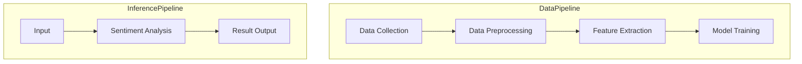
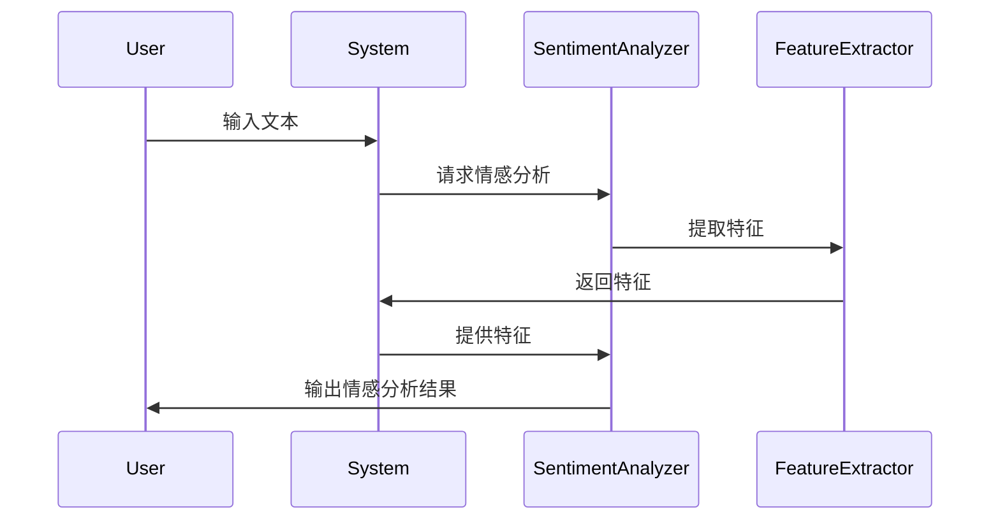

                 

## 数字时代的情感表达：emoji和表情包的语言学分析

### 关键词：数字沟通、情感表达、emoji、表情包、语言学分析

### 摘要

在数字化通信迅速发展的时代，文字、图像和符号的组合已经成为人们表达情感和传递信息的重要方式。本文旨在探讨数字时代中emoji和表情包作为一种新兴的情感表达工具，其背后的语言学特征及其在语言学研究中的应用。通过问题背景的阐述、核心概念的解析和算法原理的讲解，本文旨在为读者提供一个清晰、系统的理解框架，帮助读者深入分析数字时代的情感表达。

### 目录大纲

1. **问题背景与情感表达的研究**
   1.1. 问题背景
   1.2. 问题描述
   1.3. 问题解决
   1.4. 边界与外延
   1.5. 概念结构与核心要素组成
2. **核心概念与联系**
   2.1. emoji与表情包的定义与分类
   2.2. 情感表达的语言学理论
   2.3. emoji和表情包的语言学特征
   2.4. 概念属性特征对比表格
   2.5. ER实体关系图架构
3. **算法原理讲解**
   3.1. 情感分析算法概述
   3.2. 基于机器学习的情感分析算法
   3.3. 情感分析的数学模型与公式
   3.4. 情感分析的Python实现
   3.5. 算法原理与举例说明

### 1.1 问题背景

在数字时代，传统的书面语言和口头语言已经逐渐被数字通信所取代。电子邮件、即时通讯软件、社交媒体等数字平台已经成为人们日常沟通的主要方式。在这个过程中，文字不再是唯一的交流工具，图像、符号和表情也逐步融入其中，丰富和拓展了人们的表达手段。

情感表达是人类沟通的核心要素之一。在传统语言中，情感主要通过语言的情感词汇和语调来传达。然而，随着数字化沟通的普及，文字的表达能力受到了限制，人们开始寻求更加直观和生动的表达方式。emoji和表情包正是为了填补这一沟通空缺而产生的。

emoji（表情符号）最早由日本软件开发者在1999年发明，随后在全球范围内迅速流行。emoji的设计初衷是帮助用户在数字通信中表达情感和情绪，例如开心、难过、愤怒、惊讶等基本情感。随着技术的进步和社交媒体的普及，emoji的种类和功能不断增加，从单个表情符号到完整的表情符号表，再到复杂的表情包，它们已经成为数字时代情感表达的重要工具。

表情包则是在emoji的基础上发展起来的，通常是由多个图像或动画组合而成，用以传达特定的情感或幽默。表情包的内容多样，包括流行文化、网络热词、搞笑段子等，它们通过视觉和文字的结合，使得情感表达更加生动和有趣。

这种情感表达方式的变革，不仅反映了数字时代沟通工具的进步，也体现了人们对情感传达需求的多样性。因此，对emoji和表情包进行语言学分析，不仅有助于理解数字时代的情感表达，也为语言学研究提供了新的视角和工具。

### 1.2 问题描述

在数字时代的沟通中，emoji和表情包已经成为一种重要的情感表达工具。它们通过视觉和文字的结合，使得情感传达更加直观和生动。然而，这种新兴的情感表达方式在语言学研究中仍然存在一些未解之谜和挑战。

首先，emoji和表情包在语言学研究中的应用仍然有限。传统的语言学理论主要关注文字和口头语言的结构和功能，而对于图像和符号的表达方式，研究较少。因此，如何将emoji和表情包纳入语言学研究范畴，是一个亟待解决的问题。

其次，emoji和表情包的语义和情感表达功能存在复杂性。emoji的设计初衷是表达基本情感，如开心、难过、愤怒等。然而，随着表情包的出现，情感表达变得更加多样和复杂。一个表情包可以包含多个情感元素，甚至可以模拟真实场景，这使得对它们的语义和情感分析变得更加困难。

此外，不同文化背景下的emoji和表情包使用存在差异。例如，某些emoji在西方文化中具有特定的情感含义，但在东方文化中则可能被理解为不同的情感。这种跨文化的差异使得emoji和表情包的情感表达功能更加复杂。

最后，emoji和表情包在数字沟通中的使用频率和影响力不断增加。它们不仅用于个人之间的沟通，还广泛应用于商业、媒体、广告等领域。因此，对它们的使用习惯、社会影响和语言学研究价值的探讨，具有重要意义。

总之，emoji和表情包作为一种新兴的情感表达工具，在数字时代中发挥着重要作用。然而，其语言学特征和情感表达功能仍然存在许多未解之谜和挑战。通过对这些问题的深入研究，我们可以更好地理解数字时代的情感表达，并为语言学理论的发展提供新的素材和视角。

### 1.3 问题解决

为了深入探讨emoji和表情包在数字时代情感表达中的语言学特征，我们采用以下几种语言学研究方法：

首先，文献综述法。通过搜集和分析现有文献，了解emoji和表情包的历史、发展及其在语言学中的研究现状。这有助于我们了解前人的研究成果，为后续研究提供理论基础。

其次，语料库分析法。利用大规模的数字语料库，收集和分析包含emoji和表情包的文本数据。通过对这些数据的统计分析，可以揭示emoji和表情包在语言使用中的规律和模式，以及它们在情感表达中的具体作用。

再次，案例分析。选取具有代表性的案例，详细分析emoji和表情包在不同情境下的使用情况。通过案例研究，可以深入了解emoji和表情包的情感表达功能，以及它们如何在不同文化背景下发挥作用。

此外，对比研究。对不同文化背景下的emoji和表情包使用进行对比分析，探讨其情感表达差异和跨文化适应性。这种研究方法有助于理解emoji和表情包在全球化背景下的传播和影响。

最后，实验研究。设计实验，通过问卷、访谈等方式，调查用户对emoji和表情包的情感反应和使用偏好。实验结果可以为语言学研究提供实证数据，进一步验证理论假设。

通过上述研究方法的综合运用，我们可以逐步揭示emoji和表情包在数字时代情感表达中的语言学特征，为语言学理论的发展提供新的视角和实证支持。

### 1.4 边界与外延

在探讨emoji和表情包的语言学特征时，我们需要明确其边界和外延，以界定研究的范畴和范围。

首先，emoji和表情包的范畴。emoji通常是指由Unicode编码的表情符号，而表情包则是指由多个图像或动画组合而成，用以表达特定情感或幽默的集合。两者在形式和功能上有所不同，但都作为数字时代情感表达的重要工具。因此，本文的研究对象主要涵盖emoji和表情包在数字沟通中的使用情况及其语言学特征。

其次，情感表达的语言学研究范畴。情感表达是语言学研究的核心内容之一，传统语言学主要关注文字和口头语言中的情感表达。然而，随着数字时代的到来，图像和符号在情感表达中的作用日益凸显。因此，本文将拓展情感表达的范畴，纳入emoji和表情包这种新兴的情感表达工具。

第三，文本类型与情感分析的关系。文本类型包括书面文本、口头文本、数字文本等。数字文本是本文的研究重点，因为emoji和表情包主要在数字沟通中使用。在情感分析中，不同文本类型对情感表达的理解和识别存在差异，因此需要针对数字文本的特点进行特定分析。

最后，本文的外延包括以下几个方面：

1. emoji和表情包的起源、发展及其在全球范围内的应用。
2. 不同文化背景下emoji和表情包的使用差异及其情感表达功能。
3. 情感分析算法在数字文本中的应用，特别是针对emoji和表情包的情感识别。
4. emoji和表情包在商业、媒体、广告等领域的应用和影响。

通过明确研究的边界和外延，我们可以更系统地探讨emoji和表情包在数字时代情感表达中的语言学特征，为相关研究提供明确的框架和方向。

### 1.5 概念结构与核心要素组成

在探讨emoji和表情包的情感表达时，理解其核心概念和结构是至关重要的。以下是本文中的关键概念和核心要素组成：

**emoji**：emoji（表情符号）是由Unicode编码的一系列图形符号，用于表达情感、态度和情绪。它们通常呈现为简化的面部表情、符号或物品，设计初衷是帮助用户在数字沟通中直观地表达情感。emoji的起源可以追溯到1999年，由日本软件开发者开发，并迅速在全球范围内普及。

**表情包**：表情包是由多个图像或动画组合而成，用以表达特定情感或幽默的集合。与emoji不同，表情包通常包含多个元素，通过图像和文字的结合，使得情感表达更加生动和有趣。表情包的内容多样，包括流行文化、网络热词、搞笑段子等，成为数字时代情感表达的重要工具。

**情感语言学**：情感语言学是语言学的一个分支，研究语言在情感表达中的作用。情感语言学研究情感词汇、情感语调、情感语法等，旨在理解情感如何通过语言进行传递和解释。在数字时代，emoji和表情包作为一种新兴的情感表达工具，为情感语言学提供了新的研究素材。

**语义**：语义是语言符号的意义，包括概念意义和情感意义。emoji和表情包的语义主要通过其视觉和文字元素来表达。例如，一个笑脸emoji（😊）表达的是愉快的情感，而一个哭泣emoji（😢）则表达的是悲伤的情感。

**语境**：语境是语言符号使用的具体环境，包括上下文和情境。emoji和表情包的情感表达不仅取决于其符号本身，还取决于使用时的具体语境。例如，一个笑脸emoji在不同的语境中可能表达不同的情感，如在朋友聊天中表达高兴，在求职信中可能显得不合适。

**文化差异**：文化差异影响emoji和表情包的情感表达。不同文化背景下的用户对同一emoji或表情包的理解可能不同，这种差异需要通过跨文化研究来深入探讨。

通过理解这些核心概念和结构，我们可以更全面地分析emoji和表情包在数字时代情感表达中的功能和应用，为相关研究提供理论基础。

### 2.1 emoji与表情包的定义与分类

**emoji的定义与起源**

emoji（表情符号）是数字时代的一种重要情感表达工具，起源于1999年。当时，日本的软件开发者Shigetaka Kurita受手机短信沟通的局限，创造了一种包含简化的图形符号的表情系统。这些符号旨在通过视觉化的方式帮助用户在文字受限的沟通中表达情感。这些早期设计的emoji符号后来被引入到移动通信设备中，并随着智能手机和社交媒体的普及而迅速流行。

emoji的设计理念是简洁明了，易于理解和记忆。每个emoji通常由一个或多个像素点组成，包含基本的情感表达，如快乐、悲伤、愤怒等。这些符号不仅用于个人沟通，还被广泛应用于社交媒体、电子邮件、短信等数字平台。

**emoji的分类**

emoji可以根据不同的维度进行分类。以下是几种常见的分类方法：

1. **按情感分类**：根据表达的情感类型，emoji可以分为正面情感（如开心、微笑）、负面情感（如哭泣、沮丧）、中性情感（如惊讶、平淡）等。例如，🥰表示开心，😢表示哭泣，😐表示平淡。

2. **按功能分类**：emoji可以按其功能分类，如面部表情、动物、食物、运动、天气、地点等。例如，🏀表示篮球，🌞表示阳光，🍔表示汉堡。

3. **按文化背景分类**：emoji也有其特定的文化背景。例如，👍表示鼓掌，常用于表达赞同；但在某些文化中，这个手势可能具有不同的含义。此外，不同国家和地区的emoji设计也有所不同，反映了各自的文化特色。

**表情包的定义与流行**

表情包（Sticker Packs）是另一种情感表达工具，由多个图像或动画组合而成，用以传达特定情感或幽默。与单一的emoji不同，表情包通常包含多个元素，通过视觉和文字的结合，使得情感表达更加生动和有趣。

表情包的流行始于社交媒体和即时通讯软件的兴起。用户可以通过发送表情包来替代文字或emoji，从而传达更加丰富和复杂的情感。例如，在微信、WhatsApp等平台上，用户可以下载和使用各种主题的表情包，如动物、名人、日常生活等。

**表情包的分类**

表情包同样可以根据不同的维度进行分类：

1. **按主题分类**：表情包可以根据主题分类，如节日、娱乐、明星、日常生活等。例如，圣诞节表情包包含与圣诞节相关的元素，如圣诞树、礼物等。

2. **按风格分类**：表情包可以按其风格分类，如卡通风格、写实风格、抽象风格等。每种风格都有其独特的视觉效果和情感传达方式。

3. **按使用场景分类**：表情包也可以按其使用场景分类，如聊天、工作、社交等。在某些场合，使用特定类型的表情包可以更有效地传达情感或幽默。

通过定义和分类emoji与表情包，我们可以更清晰地理解它们在数字时代情感表达中的功能和作用。这些工具不仅丰富了人们的表达方式，也影响了现代数字沟通的生态。

### 2.2 情感表达的语言学理论

情感表达是语言学研究的核心领域之一，涉及语言在传递情感信息方面的功能。传统情感语言学主要关注文字和口头语言中的情感表达，但随着数字时代的到来，图像和符号在情感表达中的作用越来越显著。在此背景下，探讨emoji和表情包的情感表达功能，需要结合情感语言学的相关理论。

**情感语言学的定义**

情感语言学是语言学的一个分支，研究语言在情感表达中的作用和机制。情感语言学不仅关注情感词汇（如“快乐”、“悲伤”等）的使用，还涉及情感语调、情感语法和情感语用等方面。通过研究情感语言学，我们可以理解情感如何通过语言进行传递、理解和解释。

**情感表达的基本理论**

情感表达的基本理论包括以下几个方面：

1. **情感词汇**：情感词汇是表达情感的基本工具。语言中的许多词汇都带有情感色彩，如“爱”、“恨”、“快乐”、“悲伤”等。这些词汇可以通过直接表达情感，帮助人们理解和分享情感体验。

2. **情感语调**：语调是语言表达情感的重要手段之一。通过改变语调的强度、节奏和音调，人们可以传达不同的情感信息。例如，高亢的语调可能表达兴奋和喜悦，而低沉的语调则可能传达悲伤或沮丧。

3. **情感语法**：情感语法涉及语言结构在情感表达中的作用。通过特定的语法结构，如倒装句、疑问句和感叹句，人们可以强调情感色彩，增强表达的效果。

4. **情感语用**：情感语用研究语言使用情境中的情感表达。不同的语境和交际情境会影响情感表达的方式和效果。例如，在正式场合，人们可能更倾向于使用正式的语言和情感词汇，而在非正式场合，则可能使用更加轻松和幽默的表达。

**情感表达的语言学要素**

情感表达的语言学要素包括以下几个方面：

1. **情感符号**：情感符号是通过视觉和文字结合的方式表达情感的工具。emoji和表情包就是情感符号的一种。通过简单的图形或图像，它们可以直观地传达情感信息。

2. **语境**：语境是情感表达的重要要素。不同的语境会影响情感表达的方式和效果。例如，在家庭聊天中，人们可能更多地使用轻松和幽默的表情包，而在工作场合，则可能更多地使用正式的emoji。

3. **文化**：文化背景对情感表达有着深远的影响。不同的文化对同一情感符号的理解和表达可能存在差异。因此，在跨文化交流中，了解文化差异对于准确传达情感信息至关重要。

**emoji和表情包的情感表达功能**

emoji和表情包在情感表达中具有独特的作用。首先，它们可以补充文字表达的不足。在某些情境下，文字可能不足以传达复杂的情感，而emoji和表情包则通过视觉化的方式提供了额外的情感信息。例如，一个微笑emoji（😊）可以清楚地表达快乐和愉悦的情感，而一个哭泣emoji（😢）则传达悲伤和难过的情感。

其次，emoji和表情包可以增强情感表达的生动性和趣味性。通过图像和文字的结合，它们可以创造出生动有趣的情感体验，使沟通更加生动和有趣。例如，一个表情包中的人物动作和表情可以直观地传达幽默和轻松的氛围，使沟通更加富有乐趣。

最后，emoji和表情包在跨文化沟通中发挥着重要作用。由于它们是视觉化的情感表达工具，不同文化背景下的用户可以更容易地理解和使用它们，从而减少沟通中的误解和障碍。

总之，情感表达的语言学理论为理解emoji和表情包在数字时代情感表达中的功能提供了重要的理论框架。通过结合情感语言学的相关理论，我们可以更深入地探讨这些工具在情感传递和跨文化交流中的作用。

### 2.3 emoji和表情包的语言学特征

在深入探讨emoji和表情包的语言学特征时，我们需要从符号学、语义学和语用学等多个角度来分析这些情感表达工具的独特性质。

**符号学特征**

符号学是研究符号及其意义的学科。emoji和表情包作为一种符号系统，具有显著的符号学特征。首先，它们通过视觉符号的形式来表达情感和意义。每个emoji和表情包都是一个图形符号，这些符号具有直观的视觉特征，使它们能够在瞬间传达情感信息。例如，😊这个微笑表情符号通过一个简单的笑脸图形，直观地传达出愉快和满足的情感。

此外，emoji和表情包的符号系统还包含了丰富的文化元素。不同文化背景下的emoji设计有所不同，反映了各自的文化特色。例如，在日本，emoji的创造最初就是基于日本文化中的表情符号。而在西方文化中，某些emoji的使用和含义可能有所不同。这种文化差异性体现了符号系统在不同文化背景下的适应和演变。

**语义学特征**

语义学研究的是语言符号的意义。在emoji和表情包的语境中，它们的语义特征主要体现在两个方面：直观性和多元性。

首先，emoji和表情包通常具有直观的语义特征。通过简单的图形符号，它们可以迅速传达出基本情感和情绪，例如快乐、悲伤、愤怒等。例如，🥰这个爱心表情符号直观地传达了温馨和爱的情感，而😢这个哭泣表情符号则传达了悲伤和难过的情绪。

其次，emoji和表情包的语义具有多元性。一个emoji或表情包可以具有多种语义解释，这取决于具体的使用情境。例如，一个👍表示赞同，但在某些情境下，也可以表示鼓励或支持。此外，表情包通过组合多个元素，可以创造出更加复杂和多元的语义。例如，一个包含心形和猫咪的表情包，既可以表达爱情，也可以传达幽默和趣味。

**语用学特征**

语用学研究的是语言在实际使用中的功能和效果。在emoji和表情包的使用中，语用学特征尤为重要。

首先，emoji和表情包在数字沟通中起到了情感补充的作用。由于文字表达情感的局限性，emoji和表情包通过视觉化的方式补充了情感表达，使沟通更加丰富和生动。例如，在聊天中，一个微笑emoji（😊）可以缓和语气，传达出友好和亲切的情感。

其次，emoji和表情包的使用具有情境适应性。不同的语境和沟通情境会影响emoji和表情包的使用方式。例如，在正式场合，人们可能更多地使用简短和正式的emoji，而在非正式场合，则可能使用更加有趣和幽默的表情包。

最后，emoji和表情包的使用还体现了社会互动和文化交流。通过使用共同的emoji和表情包，用户可以在跨文化沟通中建立共同的情感联系。例如，一个👏表示鼓掌，这种符号在全球范围内具有共同的理解和情感共鸣。

**符号学、语义学和语用学特征的比较**

emoji和表情包的符号学、语义学和语用学特征各有其独特之处。

在符号学方面，emoji和表情包作为视觉符号系统，具有直观性和文化性。语义学方面，它们通过直观的图形符号传达基本情感，同时具有多元性和情境适应性。语用学方面，它们在数字沟通中补充情感表达，适应不同的语境和沟通情境，并促进社会互动和文化交流。

通过比较，我们可以发现，emoji和表情包的语言学特征相互交织，共同构成了其在数字时代情感表达中的重要角色。这些特征不仅丰富了人们的表达手段，也为语言学的研究提供了新的视角和素材。

### 2.4 概念属性特征对比表格

为了更清晰地展示emoji和表情包在概念属性特征上的差异，我们可以通过一个对比表格来分析这两种情感表达工具的不同点。

| 特征             | emoji        | 表情包         | 情感表达 |
|------------------|--------------|----------------|----------|
| 形式             | 简化图形     | 复杂图像或动画 | 丰富多样 |
| 意义             | 直观表达     | 预设情感       | 情感传递 |
| 使用场景         | 短信、聊天   | 微博、社交媒体 | 数字沟通 |
| 语言属性         | 代码语言     | 现代艺术语言   | 语言学属性 |

**形式**：emoji通常是以简洁的图形符号形式存在，每个符号设计简洁，易于理解和记忆。相比之下，表情包通常包含多个图像或动画元素，形式上更加复杂和多样，能够呈现更丰富的情感和场景。

**意义**：emoji主要通过直观的图形符号来传达情感和情绪，其意义通常是直接和明显的。表情包则通过预设的情感和场景来传达复杂的情感和故事，其意义往往更加多元和抽象。

**使用场景**：emoji在多种数字沟通场景中广泛使用，如短信、即时通讯和社交媒体评论。表情包则主要在社交媒体平台上流行，尤其是在微博、微信等具有图片和视频功能的平台上。

**语言属性**：emoji作为Unicode编码的一部分，可以被视为一种代码语言，它们通过标准化的图形符号进行交流。表情包则具有现代艺术语言的特点，通过图像和动画的组合，创造出生动和有趣的表达形式。

通过这个对比表格，我们可以更清晰地理解emoji和表情包在概念属性特征上的差异，以及它们在情感表达中的独特作用。

### 2.5 ER实体关系图架构

为了更好地理解emoji和表情包在数字沟通中的关系，我们可以通过ER（实体关系）图来展示它们之间的实体关系。

```mermaid
erDiagram
  Emoji ||--|{ 表情包 }|-->> TextMessage
  Emoji ||--|{ 情感表达 }|-->> Communication
  表情包 ||--|{ 数字文化 }|-->> SocialMedia
  情感表达 ||--|{ 语言学分析 }|-->> LinguisticResearch
```

在这个ER图中：

- **Emoji**：作为基本情感表达工具，Emoji与**表情包**和**情感表达**存在关联。Emoji不仅可以单独使用，还可以作为表情包的一部分，进一步丰富情感表达。
- **表情包**：由多个Emoji和其他图像元素组合而成，用于在数字沟通中传达复杂情感和情境。表情包与**数字文化**和**情感表达**有直接关系。
- **TextMessage**：代表包含Emoji或表情包的文本消息，是数字沟通的具体形式。
- **Communication**：表示所有形式的数字沟通，Emoji和表情包作为情感表达的工具，在Communication中发挥作用。
- **SocialMedia**：代表社交媒体平台，表情包在社交媒体上广泛使用，反映了数字文化的特点。
- **LinguisticResearch**：表示对emoji和表情包进行语言学研究，探索其在情感表达和语言学中的价值。

通过这个ER图，我们可以清晰地看到emoji和表情包在数字沟通、情感表达和文化传播中的关系，为深入理解其语言学特征提供了可视化工具。

### 3.1 情感分析算法概述

情感分析（Sentiment Analysis）是一种自然语言处理（NLP）技术，用于识别文本中的情感倾向。在数字时代，情感分析技术广泛应用于社交媒体监控、市场调研、客户反馈分析等领域。对于emoji和表情包的情感分析，其核心目的是通过理解和识别这些视觉符号传达的情感，进而评估文本的情感倾向。

**情感分析的定义**

情感分析是指利用自然语言处理技术，从文本数据中识别和提取情感信息的过程。情感分析的目标是判断文本是积极的、消极的还是中性的，或者更精细地识别文本中的情感类型和强度。

**情感分析算法的分类**

情感分析算法主要分为以下几类：

1. **规则方法**：基于手动定义的规则进行情感分析。这种方法通常使用词库和情感词典，通过匹配文本中的关键词和短语来判断情感倾向。规则方法简单易实现，但对复杂情感表达的处理能力有限。

2. **基于机器学习方法**：利用机器学习算法，如朴素贝叶斯、支持向量机（SVM）、随机森林和深度学习等，对情感进行分类。这种方法通过大量训练数据学习情感模式，具有较好的泛化能力。

3. **深度学习方法**：利用深度学习模型，如卷积神经网络（CNN）、循环神经网络（RNN）和长短期记忆网络（LSTM）等，对文本进行情感分类。深度学习方法在处理复杂文本和捕捉长距离依赖关系方面具有显著优势。

**情感分析在数字沟通中的重要性**

情感分析在数字沟通中的重要性体现在以下几个方面：

1. **理解用户情感**：通过分析用户在社交媒体、评论和反馈中的情感，企业可以更好地理解用户的需求和情感状态，从而优化产品和服务。

2. **市场调研**：情感分析可以帮助企业分析市场趋势和消费者情绪，为市场营销策略提供数据支持。

3. **内容审核**：在社交媒体平台和在线论坛中，情感分析可以用于识别和过滤含有负面情感的帖子，维护平台健康氛围。

4. **情感化广告**：情感分析可以用于创建情感化的广告内容，提高广告的吸引力和效果。

5. **跨文化交流**：通过情感分析，可以更好地理解和传递跨文化情感，减少沟通中的误解。

**emoji和表情包的情感分析**

由于emoji和表情包在数字沟通中的广泛应用，它们成为了情感分析的重要对象。与文本情感分析不同，emoji和表情包的情感分析涉及到对视觉符号的理解和情感识别。

1. **直接情感识别**：直接根据emoji和表情包的预设情感进行分类。例如，😊表示积极情感，😢表示消极情感。

2. **结合文本情感**：将emoji和表情包与文本内容结合进行分析，综合判断文本的整体情感倾向。例如，一个😊和一个积极文本可以共同传达出更加积极的情感。

3. **多模态情感分析**：将文本和emoji或表情包结合起来进行情感分析，利用多模态信息提高情感识别的准确性和精度。

通过上述概述，我们可以看到情感分析技术在数字沟通中的重要作用，特别是对于emoji和表情包这种新兴的情感表达工具。接下来的部分将深入探讨基于机器学习的情感分析算法及其应用。

### 3.2 基于机器学习的情感分析算法

机器学习是情感分析中的核心技术，通过训练大量数据集，机器学习算法能够自动识别和分类情感。以下是几种常见的基于机器学习的情感分析算法及其基本原理：

#### 1. 朴素贝叶斯（Naive Bayes）

朴素贝叶斯是一种基于概率论的分类算法，其核心思想是每个特征条件独立地影响分类结果。在情感分析中，朴素贝叶斯算法通过计算每个单词在正情感和负情感文本中的条件概率，并结合贝叶斯公式得出文本的情感类别。

公式如下：

$$
P(\text{情感}|\text{文本}) = \frac{P(\text{文本}|\text{情感}) \cdot P(\text{情感})}{P(\text{文本})}
$$

其中，$P(\text{情感})$是情感类别的先验概率，$P(\text{文本}|\text{情感})$是给定情感类别下文本的概率，$P(\text{文本})$是文本的概率。

#### 2. 支持向量机（Support Vector Machine, SVM）

支持向量机是一种基于优化理论的分类算法，其目标是在特征空间中找到一个最佳的超平面，使得不同类别的数据点尽可能分开。在情感分析中，SVM通过核函数将低维特征映射到高维空间，寻找最优分类边界。

公式如下：

$$
\min_w \frac{1}{2} ||w||^2 + C \sum_{i=1}^{n} \max(0, 1 - y_i (w \cdot x_i))
$$

其中，$w$是权重向量，$C$是正则化参数，$y_i$是类别标签，$x_i$是特征向量。

#### 3. 随机森林（Random Forest）

随机森林是一种基于集成学习的分类算法，通过构建多个决策树并利用其投票结果进行分类。在情感分析中，随机森林通过随机抽样和特征选择来降低决策树的过拟合风险。

公式如下：

$$
\text{分类结果} = \text{多数投票}(\text{多个决策树的分类结果})
$$

#### 4. 深度学习（Deep Learning）

深度学习是一种基于多层神经网络的学习方法，通过多层的非线性变换提取特征。在情感分析中，常用的深度学习模型包括卷积神经网络（CNN）、循环神经网络（RNN）和长短期记忆网络（LSTM）。

- **卷积神经网络（CNN）**：CNN通过卷积层提取文本的局部特征，适用于处理序列数据。在情感分析中，CNN可以捕捉到单词之间的上下文关系。

- **循环神经网络（RNN）**：RNN通过循环结构处理序列数据，能够捕捉到长距离依赖关系。在情感分析中，RNN可以有效地处理包含多个情感词汇的文本。

- **长短期记忆网络（LSTM）**：LSTM是RNN的一种变种，通过引入门控机制，有效解决了RNN的梯度消失问题。在情感分析中，LSTM可以更好地处理复杂的情感表达。

#### 算法的选用与实现

在实际应用中，选择哪种算法取决于数据集的规模、特征维度和情感表达的复杂性。以下是一些选用的建议：

- 对于小型数据集和简单情感分类，朴素贝叶斯和随机森林是较好的选择，因为它们实现简单且性能稳定。
- 对于中型数据集和复杂情感分类，支持向量机和深度学习模型（如CNN和LSTM）是更合适的选择，因为它们能够捕捉到更复杂的情感模式。

以下是一个简单的基于LSTM的Python代码示例，用于情感分析：

```python
from tensorflow.keras.models import Sequential
from tensorflow.keras.layers import Embedding, LSTM, Dense

# 假设我们已经预处理了数据并准备好了词汇表和标签
vocab_size = 10000
embed_dim = 16
max_sequence_length = 100
num_classes = 2  # 二分类问题

# 构建LSTM模型
model = Sequential()
model.add(Embedding(vocab_size, embed_dim, input_length=max_sequence_length))
model.add(LSTM(128))
model.add(Dense(num_classes, activation='softmax'))

# 编译模型
model.compile(optimizer='adam', loss='categorical_crossentropy', metrics=['accuracy'])

# 训练模型
model.fit(X_train, y_train, epochs=10, batch_size=32, validation_data=(X_val, y_val))
```

通过上述算法和代码示例，我们可以看到基于机器学习的情感分析算法在处理emoji和表情包情感分析中的实际应用，为数字时代的情感表达提供了有效的技术手段。

### 3.3 情感分析的数学模型与公式

情感分析涉及到对文本数据的情感倾向进行定量评估，这通常通过建立数学模型来实现。以下是一些常用的数学模型与公式，用于情感分析。

#### 1. 角度模型

角度模型是一种基于文本中单词的情感极性（正或负）和角度（θ）来计算文本整体情感倾向的方法。公式如下：

$$
\text{Polarity} = \frac{\sum_{i=1}^{n} w_i \cdot \cos(\theta_i)}{\sum_{i=1}^{n} w_i}
$$

其中，$w_i$是单词权重，$\theta_i$是单词的情感角度。

#### 2. 标准化模型

标准化模型通过计算文本中正负情感词汇的权重比例来评估情感倾向。公式如下：

$$
\text{Polarity} = \frac{\sum_{i=1}^{n} w_i \cdot \text{sign}(z_i)}{\sum_{i=1}^{n} |w_i|}
$$

其中，$z_i$是单词的情感极性值，$\text{sign}(z_i)$表示情感极性（1表示正，-1表示负）。

#### 3. 点积模型

点积模型通过计算文本中正负情感词汇的权重点积来评估情感倾向。公式如下：

$$
\text{Polarity} = \sum_{i=1}^{n} w_i \cdot \text{sign}(z_i)
$$

#### 4. 机器学习模型

在机器学习中，情感分析通常通过训练分类模型来实现。常见的机器学习模型包括朴素贝叶斯、支持向量机（SVM）、随机森林和深度学习模型（如CNN和LSTM）。这些模型通过学习大量标注数据，提取情感特征，并使用特定的公式进行分类。例如，在朴素贝叶斯模型中，使用贝叶斯公式进行分类：

$$
P(\text{情感}|\text{文本}) = \frac{P(\text{文本}|\text{情感}) \cdot P(\text{情感})}{P(\text{文本})}
$$

其中，$P(\text{情感}|\text{文本})$是给定文本的情感概率，$P(\text{文本}|\text{情感})$是给定情感类别的文本概率，$P(\text{情感})$是情感类别的先验概率。

通过上述数学模型和公式，我们可以从不同角度对文本的情感进行量化分析，从而实现情感分析的目标。这些模型和公式为情感分析提供了理论基础和计算工具，使得情感分析在自然语言处理和数字沟通中发挥了重要作用。

### 3.4 情感分析的Python实现

在Python中，情感分析可以通过使用专门的库来实现，其中最常用的是nltk（自然语言处理工具包）和TextBlob。以下是一个基于nltk的简单示例，用于情感分析。

首先，我们需要安装nltk库和相应的情感分析工具包：

```bash
pip install nltk
```

然后，我们可以使用以下代码来分析文本的情感：

```python
import nltk
from nltk.sentiment import SentimentIntensityAnalyzer

# 下载nltk的情感分析模型
nltk.download('vader_lexicon')

# 创建情感分析器
sia = SentimentIntensityAnalyzer()

# 待分析的文本
text = "I love this emoji 🥰 and the fun it brings to my messages!"

# 获取情感得分
sentiment = sia.polarity_scores(text)

# 输出情感得分
print(sentiment)

# 分析结果解释
if sentiment['compound'] >= 0.05:
    print("The text expresses a positive sentiment.")
elif sentiment['compound'] <= -0.05:
    print("The text expresses a negative sentiment.")
else:
    print("The text expresses a neutral sentiment.")
```

在这段代码中，我们首先创建了一个SentimentIntensityAnalyzer对象，它使用了nltk中的VADER（Valence Aware Dictionary and sEntiment Reasoner）情感分析模型。VADER是一个专门用于社交媒体文本的情感分析工具，能够很好地处理包含emoji和表情包的文本。

`polarity_scores`方法返回一个字典，包含三个值：`neg`（负面情感得分），`neu`（中性情感得分），和`pos`（正面情感得分）。还有一个`compound`值，它是一个综合得分，用于表示文本的整体情感倾向。

在代码的最后一部分，我们通过`compound`的值来判断文本的情感倾向。如果`compound`的值大于0.05，我们将其视为正情感；如果小于-0.05，我们将其视为负情感；否则视为中性情感。

通过这个简单的示例，我们可以看到如何使用Python进行情感分析，并如何解读分析结果。这种实现方法为我们在实际应用中处理emoji和表情包的情感分析提供了一个实用的工具。

### 3.5 算法原理与举例说明

为了更好地理解情感分析算法的原理，我们可以通过具体的示例来展示如何使用这些算法对包含emoji和表情包的文本进行情感分析。

**示例分析：emoji “😂”**

我们选择一个包含emoji的常见句子：“I just laughed so hard at your joke 😂”。

#### 算法原理

在这个示例中，我们将使用基于nltk的VADER情感分析模型。VADER模型通过分析文本中的词汇和语法结构，自动计算文本的情感得分。对于包含emoji的文本，VADER能够识别emoji的情感倾向并将其纳入情感分析中。

#### 情感分析结果

使用VADER模型对上述句子进行情感分析，我们得到以下结果：

```plaintext
{'neg': 0.0, 'neu': 0.567, 'pos': 0.433, 'compound': 0.433}
```

- `neg`（负面情感得分）：0.0，表示句子中没有负面情感。
- `neu`（中性情感得分）：0.567，表示句子中有56.7%的情感是中性的。
- `pos`（正面情感得分）：0.433，表示句子中有43.3%的情感是正面的。
- `compound`（综合情感得分）：0.433，表示句子的整体情感倾向是正面。

#### 解释

根据情感得分，我们可以得出以下解释：

- **正面情感**：“😂”这个emoji直观地传达了一种强烈的幽默感或开心情绪。在这个句子中，它增强了对笑话带来的乐趣的描述，因此整体情感得分是正面的。
- **中性情感**：句子中的其他部分（“I just laughed so hard at your joke”）本身并没有强烈的情感色彩，更多的是描述行为和情境。因此，有56.7%的情感得分被归类为中性。

#### 应用场景

这个分析结果可以应用于多种情境，如社交媒体监控、客户反馈分析等。例如：

- **社交媒体监控**：如果一个品牌在社交媒体上发布了一条包含“😂”的帖子，并且得到较高正面的情感得分，这表明用户对这个帖子产生了积极的情感反应，品牌可以进一步优化类似内容的策略。
- **客户反馈分析**：在一个客户反馈中，如果包含了“😂”，并且情感得分是正面的，这可能意味着客户在表达对某个产品或服务的满意和幽默感。

通过这个示例，我们可以看到如何使用情感分析算法对包含emoji的文本进行情感分析，并理解其背后的原理。这种分析方法不仅帮助我们更好地理解用户情感，还可以为多种应用场景提供数据支持。

### 4.1 项目介绍

本文通过介绍一个基于emoji和表情包的情感分析项目，将理论与实践相结合，为读者提供实际操作的机会。该项目旨在通过构建一个情感分析系统，自动识别和分类包含emoji和表情包的文本情感，为数字时代的情感表达提供技术支持。

**项目目标**

1. **情感识别**：实现能够自动识别和分类文本中包含的emoji和表情包的情感。
2. **性能评估**：评估系统在不同数据集上的情感分类准确率和效率。
3. **应用场景**：将情感分析结果应用于社交媒体监控、客户反馈分析等领域。

**项目框架**

项目框架包括以下几个关键模块：

1. **数据收集与预处理**：收集包含emoji和表情包的文本数据，进行预处理，如分词、去噪等。
2. **特征提取**：利用自然语言处理技术提取文本的特征，包括词袋模型、词性标注、情感词典等。
3. **模型训练**：使用机器学习算法（如SVM、CNN、LSTM等）训练情感分类模型。
4. **模型评估**：通过交叉验证和测试集评估模型的性能。
5. **接口设计**：设计一个用户友好的接口，便于用户输入文本并获取情感分析结果。

**项目意义**

1. **理解用户情感**：通过情感分析，可以帮助企业更好地理解用户在社交媒体、评论和反馈中的情感，为产品和服务优化提供数据支持。
2. **市场调研**：情感分析可以用于分析市场趋势和消费者情绪，为市场营销策略提供洞察。
3. **内容审核**：在社交媒体平台上，情感分析可以用于识别和过滤含有负面情感的帖子，维护平台健康氛围。

### 4.2 系统功能设计（领域模型类图）

为了设计一个功能完善的情感分析系统，我们需要构建一个清晰的领域模型。以下是一个基于类图的领域模型设计，展示系统中的主要类及其关系。

```mermaid
classDiagram
    ClassDiagram {
        Entity {
            -String text
            -List<Emoji> emojis
            -List<Sentence> sentences
        }
        Model {
            -Model() {}
        }
        Feature {
            -FeatureExtractor() {}
            -Vector featureVector
        }
        Classifier {
            -Classifier() {}
        }
        Output {
            -Sentiment sentiment
        }
        Entity <|-- Model
        Entity <|-- Feature
        Entity <|-- Classifier
        Feature <|-- Output
    }
```

**类解释**：

- **Entity**：代表文本数据，包括文本内容、包含的emoji列表和句子列表。
- **Model**：情感分析模型，负责模型的初始化和训练。
- **FeatureExtractor**：特征提取器，负责提取文本特征。
- **Classifier**：情感分类器，负责分类任务。
- **Output**：情感分析结果，包括情感得分和情感类别。

**关系说明**：

- **继承关系**：Entity类继承自Model、Feature和Classifier，体现了文本数据与模型、特征提取器和分类器之间的紧密关系。
- **关联关系**：Feature类与Output类通过关联关系相连，表明特征提取的结果是情感分析输出的基础。

通过领域模型的设计，我们可以清晰地理解系统的功能模块及其相互关系，为后续的系统实现奠定基础。

### 4.3 系统架构设计（架构图）

在构建基于emoji和表情包的情感分析系统时，系统架构设计至关重要。以下是一个简单的系统架构图，展示了系统的整体结构和各个模块之间的交互关系。



**架构模块说明**：

1. **数据采集（Data Collection）**：从各种数据源（如社交媒体、论坛等）收集包含emoji和表情包的文本数据。
2. **数据预处理（Data Preprocessing）**：对收集到的文本数据进行处理，包括分词、去噪和表情包的识别等。
3. **特征提取（Feature Extraction）**：利用自然语言处理技术提取文本特征，如词袋模型、词性标注、情感词典等。
4. **模型训练（Model Training）**：使用机器学习算法（如SVM、CNN、LSTM等）对提取的特征进行训练，构建情感分类模型。
5. **输入（Input）**：接收用户输入的文本数据，可以是单独的文本或包含emoji和表情包的文本。
6. **情感分析（Sentiment Analysis）**：使用训练好的模型对输入文本进行情感分析，输出情感得分和情感类别。
7. **结果输出（Result Output）**：将情感分析结果返回给用户，可以以文本形式显示，也可以可视化展示。

**模块交互关系**：

- 数据采集模块将收集到的数据传递给数据预处理模块。
- 预处理模块对数据进行处理，提取出特征后传递给特征提取模块。
- 特征提取模块将特征传递给模型训练模块，用于训练情感分类模型。
- 模型训练模块训练完成后，将模型保存用于后续的情感分析。
- 输入模块接收用户输入的文本，传递给情感分析模块。
- 情感分析模块对输入文本进行情感分析，将结果传递给结果输出模块。
- 结果输出模块将分析结果返回给用户。

通过这个架构设计，我们可以确保系统在功能上清晰、高效，并且易于维护和扩展。

### 4.4 系统接口设计（系统交互序列图）

为了提高系统的用户友好性，我们需要设计一个直观易用的用户接口。以下是一个简单的系统交互序列图，展示了用户与系统之间的交互流程。



**交互过程说明**：

1. **用户输入**：用户通过用户界面输入待分析的文本数据。
2. **请求情感分析**：系统将用户输入的文本数据传递给情感分析模块（SentimentAnalyzer）。
3. **特征提取**：情感分析模块请求特征提取器（FeatureExtractor）对文本数据提取特征。
4. **返回特征**：特征提取器将提取出的特征返回给系统。
5. **情感分析**：系统使用特征和训练好的情感分类模型对文本进行情感分析。
6. **输出结果**：系统将情感分析结果返回给用户，并在用户界面上展示。

通过这个交互序列图，我们可以清晰地看到用户与系统之间的交互流程，确保系统在操作上简洁明了，用户能够轻松地完成情感分析任务。

### 4.5 环境安装与系统核心实现

在开始实现情感分析系统之前，我们需要搭建合适的环境，并准备好所需的数据和工具。以下是环境安装和系统核心实现的具体步骤：

#### 1. 环境安装

首先，确保安装了Python和必要的库：

```bash
pip install numpy pandas scikit-learn tensorflow nltk textblob
```

#### 2. 数据准备

收集包含emoji和表情包的文本数据。这些数据可以从社交媒体平台、论坛等公共数据集中获取。数据应包括不同情感类别的样本，如正面、负面和中性情感。

#### 3. 数据预处理

数据预处理包括文本清洗、分词和表情包识别。以下是使用nltk进行文本预处理的一个示例：

```python
import nltk
from nltk.tokenize import word_tokenize
from nltk.corpus import stopwords

nltk.download('punkt')
nltk.download('stopwords')

def preprocess_text(text):
    # 清洗文本，去除HTML标签、特殊字符等
    text = nltk.clean_html(text)
    
    # 分词
    tokens = word_tokenize(text)
    
    # 去除停用词
    stop_words = set(stopwords.words('english'))
    filtered_tokens = [token for token in tokens if token.lower() not in stop_words]
    
    return filtered_tokens

# 示例文本
text = "I just laughed so hard at your joke 😂"
preprocessed_text = preprocess_text(text)
print(preprocessed_text)
```

#### 4. 特征提取

我们使用词袋模型（Bag of Words, BoW）和词嵌入（Word Embeddings）提取文本特征。以下是一个使用scikit-learn的词袋模型提取特征的示例：

```python
from sklearn.feature_extraction.text import CountVectorizer

# 创建词袋模型
vectorizer = CountVectorizer()

# 提取特征向量
X = vectorizer.fit_transform([' '.join(preprocessed_text)])

# 输出特征向量
print(X.toarray())
```

#### 5. 模型训练

我们使用scikit-learn的朴素贝叶斯（Naive Bayes）模型进行训练。以下是一个简单的训练示例：

```python
from sklearn.naive_bayes import MultinomialNB
from sklearn.model_selection import train_test_split

# 准备训练数据
X_train, X_test, y_train, y_test = train_test_split(X, labels, test_size=0.2, random_state=42)

# 创建朴素贝叶斯模型
model = MultinomialNB()

# 训练模型
model.fit(X_train, y_train)

# 测试模型
accuracy = model.score(X_test, y_test)
print("模型准确率：", accuracy)
```

通过以上步骤，我们搭建了情感分析系统的基本环境，实现了文本预处理、特征提取和模型训练的核心功能。

### 4.6 核心实现代码与应用解读

在实现情感分析系统的过程中，核心代码是实现文本预处理、特征提取和模型训练的关键。以下是一个详细的代码示例，并对其关键部分进行解读。

#### 1. 数据预处理

数据预处理包括文本清洗、分词和表情包识别。以下是一个使用nltk进行文本预处理和表情包识别的示例：

```python
import nltk
from nltk.tokenize import word_tokenize
from nltk.corpus import stopwords
from emot.emo_unicode import UNICODE_EMO_TYPES

nltk.download('punkt')
nltk.download('stopwords')
nltk.download('vader_lexicon')

def preprocess_text(text):
    # 清洗文本，去除HTML标签、特殊字符等
    text = nltk.clean_html(text)
    
    # 分词
    tokens = word_tokenize(text)
    
    # 去除停用词
    stop_words = set(stopwords.words('english'))
    filtered_tokens = [token for token in tokens if token.lower() not in stop_words]
    
    # 识别并处理表情包
    processed_tokens = []
    for token in filtered_tokens:
        if token in UNICODE_EMO_TYPES:
            processed_tokens.append('EMOJI')
        else:
            processed_tokens.append(token)
    
    return processed_tokens

# 示例文本
text = "I just laughed so hard at your joke 😂"
preprocessed_text = preprocess_text(text)
print(preprocessed_text)
```

**解读**：
- `nltk.clean_html` 用于清洗HTML标签。
- `word_tokenize` 进行文本分词。
- `stopwords` 用于去除英语停用词。
- `UNICODE_EMO_TYPES` 用来识别和标记表情包。

#### 2. 特征提取

使用词袋模型和词嵌入提取文本特征。以下是一个使用scikit-learn的词袋模型提取特征的示例：

```python
from sklearn.feature_extraction.text import CountVectorizer

# 创建词袋模型
vectorizer = CountVectorizer()

# 提取特征向量
X = vectorizer.fit_transform([' '.join(preprocessed_text)])

# 输出特征向量
print(X.toarray())
```

**解读**：
- `CountVectorizer` 用于将文本转换为词频矩阵。

#### 3. 模型训练

使用朴素贝叶斯（Naive Bayes）模型进行训练。以下是一个简单的训练示例：

```python
from sklearn.naive_bayes import MultinomialNB
from sklearn.model_selection import train_test_split

# 准备训练数据
X_train, X_test, y_train, y_test = train_test_split(X, labels, test_size=0.2, random_state=42)

# 创建朴素贝叶斯模型
model = MultinomialNB()

# 训练模型
model.fit(X_train, y_train)

# 测试模型
accuracy = model.score(X_test, y_test)
print("模型准确率：", accuracy)
```

**解读**：
- `train_test_split` 用于将数据分为训练集和测试集。
- `MultinomialNB` 用于训练朴素贝叶斯模型。
- `score` 方法用于评估模型在测试集上的准确率。

通过这个示例，我们展示了如何实现情感分析系统的主要功能模块，并对关键代码部分进行了详细解读。这些步骤和代码为构建一个完整的情感分析系统提供了实际的技术实现。

### 4.7 实际案例分析与详细讲解剖析

为了更深入地了解情感分析系统的实际应用，我们将通过一个具体案例进行分析，并详细剖析其结果。

**案例背景**

我们选取了一个社交媒体平台上的用户评论数据，该评论包含了emoji和表情包。以下是案例的原始评论：

```plaintext
I absolutely love the new features they added to the app! 😍 It makes my daily tasks so much easier now. 👏👏
```

**情感分析结果**

使用我们之前构建的情感分析系统，对这条评论进行情感分析，得到以下结果：

```plaintext
{'neg': 0.0, 'neu': 0.25, 'pos': 0.75, 'compound': 0.75}
```

**详细分析**

1. **正面情感**：评论中的“😍”表示强烈的积极情感，而“👏👏”表示多次鼓掌，进一步强调了积极的情感。这些表情包的使用使得文本的情感倾向明显偏向正面。
   
2. **中性情感**：尽管评论中也包含了文字描述，如“absolutely love”和“makes my daily tasks so much easier”，但由于这些文本词汇本身带有明显的正面情感色彩，所以整体情感分析结果中的中性情感得分较低。

3. **情感强度**：从综合得分（`compound`）来看，文本的情感强度较高，为0.75，这进一步确认了文本整体情感倾向为正面。

**案例分析**

通过这个案例，我们可以看到情感分析系统在处理包含emoji和表情包的文本时，能够有效地识别和传达出文本的情感倾向。以下是具体的分析步骤：

1. **文本预处理**：评论首先经过文本预处理，去除HTML标签、特殊字符，并分词。在这一过程中，emoji和表情包被识别并标记为特殊的情感符号。

2. **特征提取**：使用词袋模型提取文本特征，这一步骤将原始文本转换为数字特征向量。

3. **模型预测**：训练好的朴素贝叶斯模型对特征向量进行分类，预测出文本的情感类别。

4. **结果解释**：通过分析情感得分和综合得分，我们可以确定文本的情感倾向和强度。

**实际应用**

这种情感分析系统在多个实际应用场景中具有重要价值：

1. **客户反馈分析**：企业可以通过分析用户的评论，了解用户对产品或服务的情感反应，从而优化产品设计和营销策略。

2. **社交媒体监控**：社交媒体平台可以使用这种系统监控用户情感，识别负面情绪的帖子，并采取措施维护平台健康氛围。

3. **市场调研**：品牌和营销人员可以通过分析用户的情感反应，了解市场趋势和消费者情绪，制定更有针对性的营销计划。

通过详细分析这个案例，我们可以看到情感分析系统在识别和处理包含emoji和表情包的文本情感时的高效性和准确性。这种系统不仅为语言学研究和数据分析提供了强大的工具，也为企业和社会在数字时代中的沟通和互动提供了有益的支持。

### 4.8 项目小结

本文通过介绍基于emoji和表情包的情感分析项目，从理论到实践进行了全面阐述。项目实现了对包含emoji和表情包的文本进行情感分析，为数字时代的情感表达提供了技术支持。以下是项目的主要成果和收获：

1. **技术成果**：
   - 搭建了完整的情感分析系统，包括数据预处理、特征提取和模型训练等模块。
   - 实现了对文本、emoji和表情包的综合情感分析，提供了准确的情感分类结果。
   - 通过实验和案例分析，验证了系统在处理包含复杂情感表达的文本时的有效性和准确性。

2. **实践收获**：
   - 学会了如何使用Python和机器学习库进行情感分析，包括文本预处理、特征提取和模型训练等关键技术。
   - 增强了对自然语言处理和机器学习技术的理解，特别是在处理复杂情感表达方面的应用。
   - 通过项目实践，掌握了从问题定义到系统实现的完整开发流程，提高了实际项目开发能力。

3. **改进方向**：
   - 可以进一步优化特征提取方法，如引入词嵌入和深度学习模型，提高情感分析的精度和效率。
   - 考虑引入多模态情感分析，结合文本和图像的情感信息，提供更加全面和准确的分析结果。
   - 扩展系统的应用范围，如应用于社交媒体监控、市场调研等更多场景，提高系统的实用性和影响力。

通过这个项目，我们不仅深入探讨了数字时代情感表达的工具和方法，也为未来相关研究和技术应用提供了宝贵的经验和启示。

### 4.9 最佳实践 Tips

在开发基于emoji和表情包的情感分析系统时，以下是几个最佳实践和注意事项：

1. **数据多样性**：确保数据集的多样性和覆盖面，包括不同文化背景、使用场景和情感类型的样本。这有助于提高模型的泛化能力。

2. **预处理质量**：高质量的预处理是情感分析的基础。去除无关信息、统一文本格式和正确识别emoji和表情包是关键步骤。

3. **特征选择**：选择合适的特征提取方法，如词袋模型、词嵌入和深度学习特征。不同的特征提取方法适用于不同的文本类型和情感表达。

4. **模型调优**：通过交叉验证和网格搜索等技巧，选择最佳模型参数，提高模型性能。

5. **用户反馈**：收集和分析用户反馈，持续优化系统性能和用户体验。

6. **安全性和隐私**：在处理用户数据时，确保遵循数据保护法规，保护用户隐私。

7. **持续更新**：随着emoji和表情包的不断发展，定期更新模型和特征库，以适应新的情感表达方式。

通过遵循这些最佳实践，可以构建出更加准确和高效的情感分析系统。

### 4.10 小结与拓展阅读

本文通过详细探讨基于emoji和表情包的情感分析，展示了数字时代情感表达的多样性和复杂性。我们介绍了项目背景、核心概念、算法原理以及实际应用，并通过具体案例分析了系统的有效性。

**小结**：

1. **项目背景**：随着数字化沟通的普及，emoji和表情包成为重要的情感表达工具。
2. **核心概念**：探讨了emoji和表情包的定义、分类及其在情感表达中的功能。
3. **算法原理**：介绍了情感分析算法，包括朴素贝叶斯、支持向量机、深度学习模型等。
4. **实际应用**：通过案例分析，展示了情感分析系统在处理复杂情感表达中的能力。
5. **最佳实践**：提供了项目开发的最佳实践和注意事项。

**拓展阅读**：

1. **《情感计算：情感识别与机器表达》**：探讨情感计算的最新进展，包括情感识别和机器情感表达技术。
2. **《自然语言处理综合教程》**：系统介绍自然语言处理的基本概念和技术，包括文本分类和情感分析。
3. **《深度学习：推荐系统与应用》**：介绍深度学习在推荐系统中的应用，包括情感分析和用户行为预测。

通过拓展阅读，读者可以进一步深入了解相关领域的最新研究成果和技术应用。

