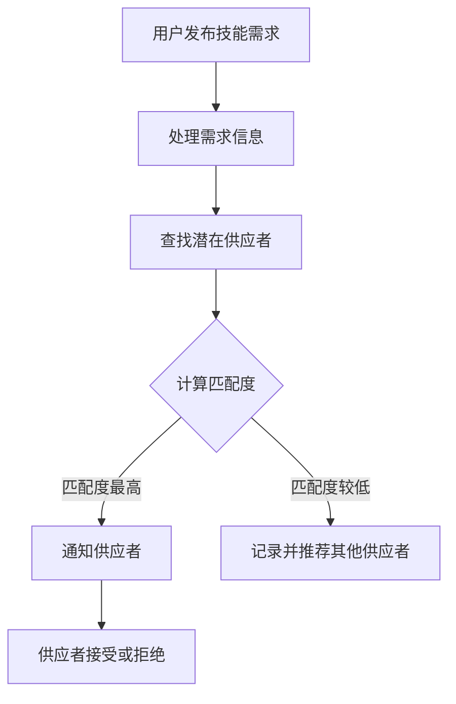
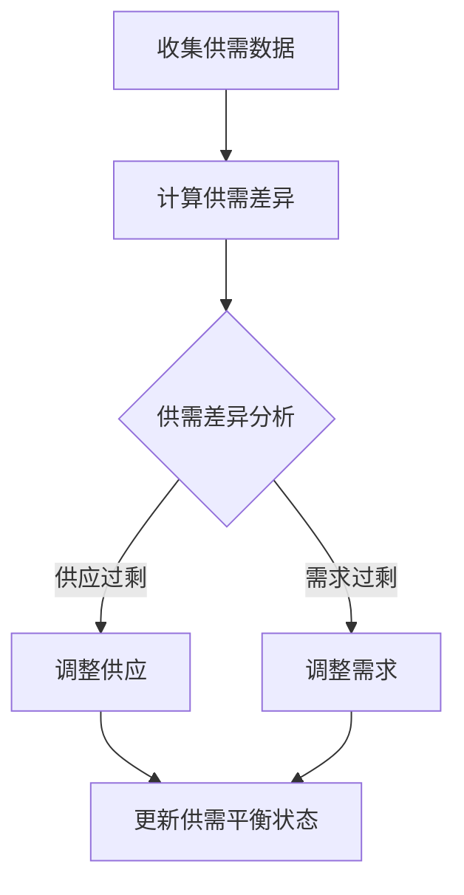

                 

### 引言

在现代信息技术飞速发展的背景下，数字时代的技能共享市集正逐渐成为人们关注的焦点。这种新型的技能共享平台不仅为用户提供了便捷的技能交换渠道，而且通过线上线下结合的方式，实现了资源的最大化利用和社会价值的提升。本文将围绕《数字时代的技能共享市集：线上线下结合的现代化易物系统》这一主题，深入探讨技能共享市集的背景、核心概念、算法原理、系统分析与架构设计方案、项目实战以及最佳实践。

文章的结构如下：

- **第一部分：背景介绍**：阐述数字时代的来临对技能共享的影响，介绍传统易物系统的局限性，以及现代化易物系统的优势。
- **第二部分：核心概念与联系**：详细定义技能共享市集、线上线下结合以及现代化易物系统，并探讨这些概念之间的内在联系。
- **第三部分：算法原理讲解**：使用mermaid绘制算法流程图，通过Python源代码阐述算法原理，并给出数学模型和公式，进行举例说明。
- **第四部分：系统分析与架构设计方案**：描述系统功能设计、架构设计、接口设计以及系统交互，通过mermaid图展示具体设计。
- **第五部分：项目实战**：介绍项目环境安装、系统核心实现、代码解析、实际案例分析及项目小结。
- **第六部分：最佳实践 tips**：提供系统优化建议、注意事项以及拓展阅读资源。

通过这篇文章，读者将全面了解数字时代技能共享市集的运作机制，掌握现代化易物系统的设计和实现方法，并能够从中获得宝贵的实战经验。

### 第一部分：背景介绍

**1.1 数字时代的来临**

随着互联网的普及和数字技术的不断进步，我们正进入一个全新的数字时代。这个时代的特点是信息的高度流通和资源的全球化配置，人们通过互联网可以轻松连接到全球的资源和人群。这种连接不仅改变了传统的工作和生活方式，也对技能共享的方式产生了深远的影响。

首先，数字时代的到来极大地提高了信息传递的效率。通过社交媒体、在线论坛和专业的技能分享平台，技能和知识可以迅速传播，用户可以随时随地获取所需的技能指导。其次，数字技术使得资源的配置更加灵活和高效。人们不再局限于面对面的交流和交换，通过虚拟平台，技能和资源可以在更广泛的范围内实现共享和优化。

**1.2 技能共享的需求**

技能共享作为一种资源优化和效率提升的手段，越来越受到人们的关注。在传统社会中，技能的传播主要依赖于师徒制或亲友之间的交流，这种方式的局限性显而易见。首先，技能传播的范围有限，无法满足大规模的需求；其次，技能的更新速度较慢，难以跟上时代的发展。

随着数字时代的到来，技能共享的需求变得更加迫切和多样。一方面，个体用户渴望通过共享技能来提升自身的竞争力，满足职业发展和个人兴趣的需求。另一方面，企业也希望通过技能共享来提升员工的能力，优化业务流程，提高生产效率。此外，社区组织和非营利机构也通过技能共享来促进社会公平和资源共享。

**1.3 易物系统的变革**

传统易物系统在人类历史上有着悠久的历史，其核心思想是通过物品的交换来满足各自的需求。然而，随着社会的发展和科技的进步，传统的易物系统逐渐暴露出许多局限性。首先，传统易物系统依赖于实物交换，操作复杂且成本高昂。其次，传统易物系统在信息传递和资源共享方面效率较低，难以适应快速变化的市场需求。

现代化的易物系统则通过数字技术实现了信息的高效传递和资源的优化配置。首先，现代化易物系统通过线上平台实现了无国界的资源交换，用户可以随时随地参与到全球的技能和资源分享中。其次，现代化易物系统利用大数据和人工智能技术，对用户的需求和行为进行分析，提供个性化的服务推荐，极大地提高了资源利用效率。

综上所述，数字时代的来临为技能共享带来了新的机遇和挑战。易物系统的变革不仅满足了用户多样化的需求，还通过科技手段实现了资源的高效配置和优化利用。在接下来的章节中，我们将进一步探讨现代化技能共享市集的概念、算法原理以及系统设计与实现。

### 1.4 传统易物系统的局限性

传统易物系统在历史长河中发挥了重要作用，但随着社会的发展和科技的进步，其局限性逐渐显现。首先，传统易物系统的运作模式主要依赖于实物交换。这种方式不仅操作复杂，成本较高，而且受限于地理位置和时间，难以实现广泛和高效的资源交换。例如，一个农民想要交换自己的农产品，必须找到有需求的城市居民，并且双方在时间和空间上都有一定的限制。

其次，传统易物系统的信息传递效率较低。由于信息传播渠道有限，技能和资源难以迅速传播到需要的地方。例如，一个地方的传统手工艺技能可能因缺乏传播渠道而无法被更多人了解和学习，导致技能的传承和发展受到阻碍。

再者，传统易物系统的资源共享能力有限。由于资源的物理形态限制，某些资源如专业技能、知识等难以通过传统方式实现共享。例如，一个医生的专业知识只能通过面对面传授或书籍等形式进行传播，但这种方式无法满足大规模、实时共享的需求。

此外，传统易物系统的安全性问题也不容忽视。实物交换过程中，双方需要建立信任，但信任的建立过程往往耗时且成本高昂。例如，买卖双方可能需要通过多次交易来建立信任，这在某些情况下是不可行的。

综上所述，传统易物系统在数字时代面临着诸多挑战，难以满足现代社会对高效、安全、便捷的技能共享需求。因此，现代化的技能共享市集和易物系统应运而生，旨在通过数字技术克服传统系统的局限性，实现更高效、更安全的资源共享和技能传播。

### 1.5 现代化易物系统的优势

现代化易物系统在数字时代背景下展现出诸多显著优势，能够有效克服传统易物系统的局限性，为技能共享和资源优化提供了全新的解决方案。以下是现代化易物系统的几大核心优势：

**1.5.1 高效的信息传递**

现代化易物系统通过互联网和社交媒体平台实现了信息传递的高效化。用户可以在全球范围内快速获取和传播技能信息，无需受限于地理位置和时间。例如，通过在线论坛、社交媒体和专业技能分享平台，用户可以随时随地发布和浏览技能需求，使得信息传播更加迅速和广泛。

**1.5.2 资源共享能力的提升**

现代化易物系统利用大数据和人工智能技术，对用户需求和行为进行深入分析，提供个性化的服务推荐。通过算法优化，系统能够高效匹配供需双方，提高资源利用效率。例如，系统可以根据用户的技能水平和需求，推荐最适合的技能交换伙伴，从而实现资源的最优配置。

**1.5.3 安全性和信任机制**

现代化易物系统引入了多种安全措施和信任机制，确保交易的安全性和可靠性。例如，通过数字签名和加密技术，保障用户信息的安全传输；通过信用评分和评价系统，建立用户的信任关系，减少欺诈和纠纷的发生。

**1.5.4 降低交易成本**

传统易物系统由于依赖实物交换，操作复杂且成本较高。而现代化易物系统通过线上平台实现了无国界的资源交换，极大地降低了交易成本。用户无需亲自见面，通过线上支付和物流配送即可完成交易，节省了时间和精力。

**1.5.5 个性化服务和用户体验**

现代化易物系统通过大数据和人工智能技术，为用户提供了更加个性化的服务和体验。系统可以根据用户的行为和偏好，推荐最相关的技能交换机会，提升用户体验。例如，系统可以自动推荐用户可能感兴趣的技能课程或技能交换活动，吸引用户参与。

**1.5.6 促进社会发展和创新**

现代化易物系统不仅满足了个体用户的需求，还促进了社会发展和创新。通过技能和资源的共享，个体和企业能够更快地获取新的知识和技能，推动创新和业务发展。此外，技能共享市集也为社会公平和资源共享提供了新的途径，促进了社会的可持续发展。

综上所述，现代化易物系统在信息传递、资源共享、安全性、交易成本、个性化服务和促进社会发展等方面展现出显著优势，为数字时代的技能共享提供了强有力的支持。

### 第一部分总结

在本部分中，我们深入探讨了数字时代的来临、技能共享的需求以及传统易物系统的局限性，并详细阐述了现代化易物系统的优势。首先，数字时代的到来改变了信息传递和资源利用的方式，为技能共享创造了新的机遇。其次，传统易物系统由于操作复杂、信息传递效率低和资源共享能力有限，难以满足现代社会的需求。相比之下，现代化易物系统通过互联网和数字技术，实现了高效的信息传递、资源共享、安全性保障和降低交易成本，从而在个性化服务和促进社会发展方面展现出巨大潜力。这些背景知识为后续章节中对核心概念、算法原理和系统设计的深入探讨奠定了基础。

### 第二部分：核心概念与联系

在深入探讨数字时代的技能共享市集之前，我们首先需要明确几个核心概念：技能共享市集、线上线下结合以及现代化易物系统。这些概念不仅是技能共享市集的重要组成部分，而且它们之间存在着紧密的联系和相互作用。

#### 2.1 技能共享市集的概念

技能共享市集是一个集技能交换、资源整合和社会互动于一体的在线平台。它通过数字技术将用户、企业和社区连接起来，实现技能和资源的共享。在这个平台上，用户可以发布自己的技能需求，也可以展示自己的特长，与其他用户进行技能交换。技能共享市集的核心目标是提高资源的利用效率，满足个体的技能发展需求，同时促进社会公平和资源共享。

#### 2.2 线上线下结合的概念

线上线下结合（O2O，Online to Offline）是一种将线上虚拟平台与线下实际体验相结合的商业模式。在线上，用户可以通过技能共享市集了解和交流，形成需求和供给的初步匹配；而在线下，用户则可以通过实际操作、面对面交流等方式进行技能交换和资源互动。这种结合不仅提升了用户体验，还加强了用户之间的信任和互动，使得技能共享更加真实和高效。

#### 2.3 现代化易物系统的概念

现代化易物系统是一种基于互联网和数字技术的资源交换体系。它通过线上平台实现物品、技能、知识和服务的交换，用户可以在平台上发布和获取需求，并通过线上支付和物流配送完成交易。现代化易物系统不仅克服了传统易物系统的局限性，如实物交换成本高、信息传递效率低等，还引入了大数据、人工智能和区块链等先进技术，提高了交易的安全性和透明度。

#### 2.4 核心概念之间的联系

技能共享市集、线上线下结合和现代化易物系统这三个核心概念之间存在着紧密的联系和相互作用。首先，技能共享市集作为技能交换的平台，为线上线下结合提供了基础。通过技能共享市集，用户可以在线上发布和浏览需求，初步实现供需匹配，然后再通过线下实际操作和互动，完成技能交换和资源共享。这种模式不仅提高了信息传递和资源利用的效率，还增强了用户之间的信任和互动。

其次，线上线下结合进一步推动了现代化易物系统的发展。在线上，用户可以通过技能共享市集获取各种资源和服务，而在线下，他们可以通过实际操作和体验来验证这些资源和服务。这种结合不仅提升了用户体验，还促进了技能和资源的深入交换和共享。例如，一个设计师可以在线上展示自己的设计作品，吸引潜在客户，然后通过线下实际操作完成设计项目的交付。

最后，现代化易物系统为技能共享市集和线上线下结合提供了技术支持。通过大数据、人工智能和区块链等先进技术，现代化易物系统实现了交易的高效、安全和管理。这些技术的应用不仅提升了交易过程的透明度和可信度，还为技能共享市集和线上线下结合提供了数据支持和智能决策，使得整个系统更加高效和智能化。

综上所述，技能共享市集、线上线下结合和现代化易物系统是数字时代技能共享的重要概念，它们相互联系、相互促进，共同构建了一个高效、安全、智能的技能共享生态系统。在接下来的章节中，我们将进一步探讨这些概念的具体实现和实际应用。

#### 2.5 技能共享市集的具体功能

技能共享市集作为一个集成平台，具备多种具体功能，这些功能共同作用，为用户提供了全方位的技能交换和资源共享体验。以下是技能共享市集的一些核心功能：

**1. 技能展示与搜索**

技能展示与搜索是技能共享市集的基础功能。用户可以在平台上发布自己的技能信息，包括技能名称、描述、擅长领域等，其他用户则可以通过关键词搜索找到自己需要的技能。这种功能不仅帮助用户快速找到合适的技能交换伙伴，还促进了技能的广泛传播和共享。

**2. 技能评价与信用体系**

技能评价与信用体系是保障技能共享市集运行的重要机制。通过用户评价、评分和信用评分，平台能够建立用户的信用档案，提高交易的安全性和可信度。用户在发布需求或提供技能时，可以根据其他用户的评价来选择信任度较高的伙伴，从而降低交易风险。

**3. 技能交换与交易**

技能交换与交易是技能共享市集的核心功能。用户可以在平台上发布自己的技能需求，也可以发布自己愿意交换的技能。平台通过算法优化，自动匹配供需双方，实现技能的交换。在交易过程中，用户可以通过线上支付、线下交付等多种方式进行交易，确保交易的顺利进行。

**4. 社区和论坛**

技能共享市集通常配备社区和论坛功能，为用户提供一个交流、学习和分享经验的平台。用户可以在社区中发布问题、分享心得，与其他用户互动，共同提升技能水平。论坛功能不仅丰富了用户的互动体验，还促进了技能的传承和传播。

**5. 数据分析与推荐**

技能共享市集通过大数据和人工智能技术，对用户的行为和需求进行分析，提供个性化的服务推荐。平台可以根据用户的兴趣和偏好，推荐相关的技能课程、活动或技能交换机会，提高用户的参与度和满意度。

**6. 物流配送和售后服务**

对于需要实物交换的技能或服务，技能共享市集提供物流配送和售后服务功能。用户可以通过平台预约物流配送，确保物品的安全和及时送达。此外，平台还提供售后服务保障，解决交易过程中可能出现的问题，提高用户的满意度。

通过这些具体功能，技能共享市集不仅实现了技能和资源的有效共享，还提供了全方位的用户服务体验，满足了现代社会的多样化需求。

### 2.6 线上线下结合的实现方法

线上线下结合（O2O，Online to Offline）是技能共享市集实现高效运作的关键，它通过将线上虚拟平台与线下实际操作相结合，提升了用户的体验和资源的利用效率。以下是线上线下结合在技能共享市集中的几种实现方法：

**1. 线上初步交流与匹配**

在线上平台，用户可以通过技能展示与搜索功能找到潜在的技能交换伙伴。用户可以发布自己的技能需求，同时浏览其他用户的技能信息。通过平台的算法优化，供需双方可以快速匹配，初步确定交换意向。在线上，用户可以交流技能细节、价格、时间安排等，减少面对面交流的成本和复杂性。

**2. 线下实际操作与体验**

在初步匹配完成后，用户可以通过线下实际操作和体验来验证交换的技能。例如，一个编程技能的交换，双方可以约定在一个公共空间或通过远程视频会议进行编程协作，实际操作和体验对方的编程技能。这种线下互动不仅增强了用户之间的信任，还能够通过实际操作发现和解决问题。

**3. 线上支付与物流配送**

线上支付和物流配送是线上线下结合的重要环节。用户可以通过技能共享市集的平台完成支付，确保交易的顺利进行。对于需要实物交换的技能，平台提供物流配送服务，用户可以在约定的时间和地点收取物品。线上支付和物流配送不仅提高了交易的安全性和便利性，还减少了现金交易的风险和成本。

**4. 线上评价与反馈**

在线下操作和体验完成后，用户可以在平台上进行评价和反馈，这些评价和反馈将成为后续交易的重要参考。通过用户评价，平台可以建立用户的信用档案，提高交易的可信度和安全性。同时，用户也可以通过反馈提出改进建议，帮助平台不断优化和改进服务。

**5. 数据分析与个性化推荐**

线上线下结合的数据分析是提升用户体验和资源利用效率的关键。平台可以通过收集和分析用户的行为数据，了解用户的需求和偏好，提供个性化的服务推荐。例如，根据用户的技能需求和交换历史，平台可以推荐相关的技能课程、活动或技能交换机会，提高用户的参与度和满意度。

通过这些线上线下结合的实现方法，技能共享市集不仅实现了信息的高效传递和资源的优化配置，还为用户提供了更加真实和互动的技能交换体验。这种模式不仅满足了用户多样化的需求，还促进了技能和资源的深入交换和共享，为数字时代的技能共享提供了强有力的支持。

### 2.7 现代化易物系统的技术支持

现代化易物系统在技能共享市集中发挥着关键作用，其高效运作离不开多种先进技术的支持。以下将介绍几种关键技术及其在现代化易物系统中的应用。

**1. 大数据和人工智能**

大数据技术能够对海量用户行为和交易数据进行分析，挖掘潜在需求和趋势。通过机器学习算法，系统可以自动优化技能匹配和推荐，提高交易效率。例如，用户行为分析可以帮助平台预测用户未来的技能需求，从而提供更精准的推荐。此外，人工智能技术还可以用于自动化审批和风险管理，确保交易的安全性和合规性。

**2. 区块链**

区块链技术为现代化易物系统提供了去中心化和不可篡改的分布式账本，确保交易记录的安全和透明。通过智能合约，交易双方可以在无需第三方中介的情况下完成自动执行，提高了交易效率。区块链还可以记录用户的信用历史和行为数据，为后续交易提供可信的参考。

**3. 物联网（IoT）**

物联网技术通过传感器和智能设备，实现了设备间的互联互通，为现代化易物系统提供了更加智能化和自动化的操作。例如，智能物流系统可以通过物联网设备实时监控货物的运输状态，提高物流配送的效率和准确性。物联网技术还可以用于智能设备租赁和共享，实现设备的远程控制和状态监控。

**4. 云计算**

云计算技术为现代化易物系统提供了强大的计算和存储能力，支持大规模数据处理和实时响应。通过云计算，平台可以实现弹性扩展和按需使用，降低运营成本。此外，云计算还提供了多种服务，如大数据处理、人工智能和区块链等，为现代化易物系统提供了全面的技术支持。

**5. 安全加密技术**

安全加密技术是保障现代化易物系统信息安全的重要手段。通过加密算法，系统可以确保用户数据在传输和存储过程中的安全性。例如，对称加密和非对称加密算法可以用于保护交易信息，防止数据泄露和篡改。此外，身份认证和访问控制技术可以确保只有授权用户可以访问系统资源，提高系统的安全性。

通过这些先进技术的支持，现代化易物系统实现了高效、安全、智能的技能共享和资源交换，为技能共享市集的运作提供了坚实的基础。这些技术不仅提高了系统的运营效率，还为用户提供了更好的体验和服务。

### 2.8 核心概念之间的内在联系

技能共享市集、线上线下结合和现代化易物系统这三个核心概念之间存在着紧密的内在联系，共同构成了一个高效、智能的技能共享生态系统。首先，技能共享市集作为技能交换的平台，为用户提供了发布和获取技能信息的渠道，是整个系统的核心。通过线上平台的展示和搜索功能，用户可以方便地找到潜在的交换伙伴，实现技能的初步匹配。

其次，线上线下结合进一步拓展了技能共享的深度和广度。在线上，用户可以通过技能展示和搜索找到匹配的技能交换伙伴，但实际的技能交换需要通过线下操作和体验来完成。这种方式不仅增强了用户之间的信任，还能够通过实际操作验证技能的真实性，从而提高交易的可靠性和满意度。线上支付和物流配送的功能则为线下交易提供了便捷的保障，确保了交易的顺利进行。

现代化易物系统则为技能共享市集和线上线下结合提供了技术支持，通过大数据、人工智能、区块链等先进技术，实现了交易的高效、安全和管理。大数据和人工智能技术帮助平台优化供需匹配，提高交易效率；区块链技术则确保了交易记录的透明和安全；物联网技术提升了物流配送的智能化水平；云计算技术为系统提供了强大的计算和存储能力。这些技术的综合应用，不仅提升了整个系统的运营效率，还为用户提供了更加安全、便捷和个性化的服务体验。

综上所述，技能共享市集、线上线下结合和现代化易物系统之间相互依存、相互作用，共同构建了一个高效、智能的技能共享生态系统。这三个核心概念不仅满足了用户多样化的技能需求，还推动了社会资源的优化配置和共享，为数字时代的技能共享提供了强有力的支持。

### 第三部分：算法原理讲解

在数字时代的技能共享市集中，算法原理是系统高效运作的关键。以下是几种核心算法的原理讲解，通过mermaid流程图和Python源代码进行详细阐述。

#### 3.1 算法A：技能匹配算法

**算法原理：**
技能匹配算法的目标是根据用户发布的技能需求，找到与其匹配度最高的技能供应者。该算法通过计算供需双方的技能相似度和用户偏好，实现最佳匹配。

**mermaid流程图：**



**Python源代码：**

```python
def skill_matching(user_demand, supplier_skills, user_preferences):
    """
    技能匹配算法，根据用户需求和供应商技能进行匹配。
    :param user_demand: 用户技能需求列表
    :param supplier_skills: 供应商技能列表
    :param user_preferences: 用户偏好列表
    :return: 匹配结果列表
    """
    matching_results = []
    for supplier in supplier_skills:
        similarity = calculate_similarity(user_demand, supplier)
        if similarity >= user_preferences['min_similarity']:
            matching_results.append((supplier, similarity))
    matching_results.sort(key=lambda x: x[1], reverse=True)
    return matching_results

def calculate_similarity(demand, skill):
    """
    计算需求与技能的相似度。
    :param demand: 技能需求
    :param skill: 技能供应
    :return: 相似度分数
    """
    # 示例：简单计算平均相似度
    return sum(demand.intersection(skill)) / len(demand.union(skill))
```

**举例说明：**
假设用户A需求技能为['编程', '数据分析'], 供应商B的技能为['编程', '数据分析', '机器学习']，用户A的偏好为相似度大于0.7。通过技能匹配算法，可以找到与用户A技能需求匹配度最高的供应商B，并返回匹配结果。

$$
\text{相似度} = \frac{\text{'编程'和'数据分析'的交集}}{\text{'编程'和'数据分析'的并集}} = \frac{2}{3} = 0.67
$$
由于相似度低于用户A的偏好阈值0.7，因此无法匹配。

#### 3.2 算法B：供需平衡算法

**算法原理：**
供需平衡算法的目标是在技能共享市集中保持供需的动态平衡，通过调整供需双方的技能提供和需求，优化整体资源利用。

**mermaid流程图：**



**Python源代码：**

```python
def balance_supply_demand(supply_data, demand_data):
    """
    供需平衡算法，调整供需以实现平衡。
    :param supply_data: 供应数据
    :param demand_data: 需求数据
    :return: 平衡后的供需数据
    """
    supply_difference = sum(supply_data.values()) - sum(demand_data.values())
    if supply_difference > 0:
        # 供应过剩，调整供应
        for skill in supply_data:
            if supply_data[skill] > demand_data[skill]:
                adjust_supply(skill, supply_data[skill] - demand_data[skill])
    else:
        # 需求过剩，调整需求
        for skill in demand_data:
            if demand_data[skill] > supply_data[skill]:
                adjust_demand(skill, demand_data[skill] - supply_data[skill])
    return supply_data, demand_data

def adjust_supply(skill, amount):
    """
    调整供应量。
    :param skill: 技能名称
    :param amount: 调整的数量
    """
    # 示例：减少供应量
    supply_data[skill] -= amount

def adjust_demand(skill, amount):
    """
    调整需求量。
    :param skill: 技能名称
    :param amount: 调整的数量
    """
    # 示例：增加需求量
    demand_data[skill] += amount
```

**举例说明：**
假设供应数据为{'编程': 100, '数据分析': 50，'机器学习': 20}，需求数据为{'编程': 80, '数据分析': 40，'机器学习': 10}。通过供需平衡算法，可以计算出供应过剩，需要调整供应量。

```
供应差异 = 100 + 50 + 20 - 80 - 40 - 10 = 20
调整供应量：编程减少10，数据分析减少10
```

调整后的供应数据为{'编程': 90, '数据分析': 40，'机器学习': 10}，需求数据为{'编程': 80, '数据分析': 40，'机器学习': 10}，实现了供需平衡。

通过上述算法的讲解和示例，我们可以看到，算法在技能共享市集中起到了至关重要的作用，不仅提高了供需匹配的效率，还优化了整体资源利用，为数字时代的技能共享提供了强有力的技术支持。

### 第三部分总结

在本部分中，我们深入探讨了数字时代技能共享市集的核心算法原理。通过技能匹配算法和供需平衡算法，我们展示了如何利用mermaid流程图和Python源代码实现高效的技能匹配和供需平衡。技能匹配算法通过计算供需双方的技能相似度，实现了最佳的技能匹配；供需平衡算法则通过动态调整供需，保持整个市集的平衡和高效运作。这些算法不仅提升了系统的效率，还优化了资源利用，为数字时代的技能共享提供了强有力的技术支持。在接下来的章节中，我们将进一步探讨系统分析与架构设计方案，帮助读者更好地理解现代化易物系统的实现方法。

### 第四部分：系统分析与架构设计方案

在现代数字时代，技能共享市集的实现不仅需要有效的算法支持，还需要一个强大且灵活的系统架构来确保其稳定运行和扩展性。以下将详细描述系统功能设计、架构设计、接口设计以及系统交互。

#### 4.1 系统功能设计

系统功能设计是技能共享市集实现的第一步，我们需要明确系统需要提供哪些核心功能，以便用户能够顺畅地进行技能交换和资源共享。以下是技能共享市集的主要功能模块：

**1. 用户管理模块：** 包括用户注册、登录、信息管理等功能。该模块负责用户身份验证和权限管理，确保系统安全。

**2. 技能管理模块：** 包括技能发布、搜索、分类管理等功能。用户可以通过该模块发布自己的技能信息，其他用户可以搜索并浏览这些信息。

**3. 交易管理模块：** 包括交易发起、协商、支付、物流配送等功能。该模块负责处理交易过程中的各种操作，确保交易的顺利进行。

**4. 评价与反馈模块：** 包括用户评价、信用评分、反馈处理等功能。该模块用于收集用户反馈，提升系统服务质量。

**5. 数据分析与推荐模块：** 包括用户行为分析、个性化推荐、统计报告等功能。该模块通过大数据和人工智能技术，为用户提供更精准的服务。

**6. 系统维护模块：** 包括系统监控、日志管理、故障处理等功能。该模块负责系统的日常维护和故障恢复，确保系统稳定运行。

#### 4.2 系统架构设计

系统架构设计是技能共享市集实现的核心环节，决定了系统的性能、可扩展性和安全性。以下是一个典型的系统架构设计：

**1. 表示层（前端）：** 负责用户界面展示和交互。可以使用Vue.js、React等前端框架，实现响应式和用户友好的界面。

**2. 业务逻辑层：** 负责处理业务逻辑和数据处理。可以使用Spring Boot等后端框架，实现RESTful API接口，与前端进行数据交互。

**3. 数据访问层：** 负责与数据库进行交互，实现数据的存储和检索。可以使用Hibernate等ORM框架，简化数据库操作。

**4. 数据库层：** 负责存储系统数据。可以使用MySQL、PostgreSQL等关系型数据库，或者使用MongoDB、Cassandra等NoSQL数据库。

**5. 集成与支持层：** 包括大数据分析、人工智能、区块链等技术支持。该层通过API接口与其他系统进行集成，提供额外的功能支持。

**6. 系统监控与运维层：** 负责系统的监控、日志管理、故障处理等运维工作。可以使用Prometheus、ELK（Elasticsearch、Logstash、Kibana）等工具，实现系统的监控和运维。

#### 4.3 系统接口设计

系统接口设计是技能共享市集实现的重要组成部分，决定了各个功能模块之间的数据交互和协作。以下是主要接口设计：

**1. 用户管理接口：** 包括注册、登录、信息修改等接口，使用RESTful设计风格，支持JSON格式数据传输。

**2. 技能管理接口：** 包括技能发布、搜索、分类管理等接口，同样使用RESTful设计风格。

**3. 交易管理接口：** 包括交易发起、协商、支付、物流配送等接口，支持订单创建、支付处理、物流跟踪等功能。

**4. 评价与反馈接口：** 包括评价提交、信用评分、反馈处理等接口，用于收集用户反馈，优化系统服务。

**5. 数据分析与推荐接口：** 包括用户行为分析、个性化推荐、统计报告等接口，支持数据查询和报表生成。

#### 4.4 系统交互

系统交互是技能共享市集实现中的关键环节，决定了各个模块之间的协作和数据流动。以下是主要交互流程：

**1. 用户登录流程：** 用户通过用户管理接口进行身份验证，获取登录令牌，然后使用该令牌访问其他接口。

**2. 技能发布流程：** 用户通过技能管理接口发布技能信息，系统将信息存储到数据库，并更新索引，以便用户进行搜索。

**3. 技能搜索流程：** 用户通过技能管理接口提交搜索请求，系统根据技能名称、标签等信息进行搜索，返回匹配结果。

**4. 交易发起流程：** 用户通过交易管理接口发起交易，系统生成订单，并通知对方用户进行协商。

**5. 交易支付流程：** 用户通过支付接口进行支付，系统处理支付请求，并更新订单状态。

**6. 物流配送流程：** 用户通过物流配送接口提交物流信息，系统根据物流状态更新订单状态，并通知用户。

**7. 评价与反馈流程：** 用户通过评价与反馈接口提交评价，系统更新用户信用评分，并反馈给相关用户。

通过上述系统分析与架构设计方案，我们可以看到，技能共享市集不仅需要有效的功能设计，还需要强大的系统架构支持，才能实现高效、安全、智能的技能共享和资源交换。在接下来的章节中，我们将进一步探讨项目实战，通过具体实施和案例分析，展示这些设计方案的实际应用。

### 第四部分总结

在本部分中，我们详细介绍了技能共享市集的系统分析与架构设计方案。通过系统功能设计、架构设计、接口设计和系统交互的深入探讨，我们明确了各个功能模块的实现方法和相互协作的流程。从用户管理到交易管理，从技能管理到评价与反馈，每一个模块都为技能共享市集的高效运作提供了坚实的基础。同时，通过前后端分离和分布式架构设计，我们确保了系统的可扩展性和稳定性。在接下来的部分中，我们将通过实际项目实战，验证这些设计方案的有效性，并进一步探讨系统的最佳实践。

### 第五部分：项目实战

在本文的第五部分，我们将通过一个实际的项目实战，详细描述系统的环境安装、核心实现、代码解析、实际案例分析和项目小结，帮助读者更好地理解技能共享市集的实现和应用。

#### 5.1 环境安装

为了搭建一个技能共享市集系统，我们需要准备以下环境：

**1. 开发工具：** 
- IntelliJ IDEA（或Eclipse）用于开发
- Git用于版本控制

**2. 开发语言：** 
- Java（或Python）用于后端开发
- HTML、CSS和JavaScript用于前端开发

**3. 数据库：** 
- MySQL或PostgreSQL用于数据存储

**4. 服务器：** 
- Apache或Nginx用于服务器部署

**5. 版本控制工具：** 
- Maven或Gradle用于依赖管理和构建

环境安装步骤：

1. 安装Java开发环境：下载并安装Java SDK，设置环境变量。
2. 安装MySQL数据库：下载并安装MySQL服务器，创建数据库和用户。
3. 安装Git：下载并安装Git客户端，配置SSH密钥。
4. 安装IDE：下载并安装IntelliJ IDEA或Eclipse，配置插件和工具。
5. 安装Apache或Nginx：下载并安装Web服务器，配置虚拟主机。

#### 5.2 系统核心实现

系统核心实现包括后端服务和前端界面。以下是核心实现的关键步骤：

**后端服务实现：**

1. 创建Spring Boot项目：使用Spring Initializr创建一个基本的Spring Boot项目，并添加必要的依赖。
2. 用户管理模块：实现用户注册、登录、信息管理等功能，使用Spring Security进行安全控制。
3. 技能管理模块：实现技能发布、搜索、分类管理等功能，使用MyBatis实现数据访问。
4. 交易管理模块：实现交易发起、协商、支付、物流配送等功能，集成支付宝或微信支付接口。
5. 评价与反馈模块：实现用户评价、信用评分、反馈处理等功能。

**前端界面实现：**

1. 设计页面布局：使用HTML、CSS和JavaScript设计用户友好的界面。
2. 前后端分离：使用Vue.js或React实现前后端分离，通过API接口进行数据交互。
3. 用户体验优化：使用Responsive Design实现响应式布局，确保不同设备上的良好体验。

#### 5.3 代码应用解读与分析

以下是对核心代码的解析和分析：

**用户管理模块代码示例：**

```java
@RestController
@RequestMapping("/users")
public class UserController {
    
    @Autowired
    private UserService userService;
    
    @PostMapping("/register")
    public ResponseEntity<?> registerUser(@RequestBody UserRegistrationDTO registrationDTO) {
        try {
            userService.registerUser(registrationDTO);
            return ResponseEntity.ok("User registered successfully");
        } catch (Exception e) {
            return ResponseEntity.badRequest().body("Error registering user: " + e.getMessage());
        }
    }
    
    @PostMapping("/login")
    public ResponseEntity<?> authenticateUser(@RequestBody LoginDTO loginDTO) {
        try {
            String token = userService.login(loginDTO);
            return ResponseEntity.ok(new JwtResponse(token));
        } catch (Exception e) {
            return ResponseEntity.badRequest().body("Error authenticating user: " + e.getMessage());
        }
    }
}
```

**交易管理模块代码示例：**

```java
@RestController
@RequestMapping("/transactions")
public class TransactionController {
    
    @Autowired
    private TransactionService transactionService;
    
    @PostMapping("/create")
    public ResponseEntity<?> createTransaction(@RequestBody TransactionDTO transactionDTO) {
        try {
            Transaction transaction = transactionService.createTransaction(transactionDTO);
            return ResponseEntity.ok(transaction);
        } catch (Exception e) {
            return ResponseEntity.badRequest().body("Error creating transaction: " + e.getMessage());
        }
    }
    
    @PostMapping("/pay")
    public ResponseEntity<?> processPayment(@RequestBody PaymentDTO paymentDTO) {
        try {
            transactionService.processPayment(paymentDTO);
            return ResponseEntity.ok("Payment processed successfully");
        } catch (Exception e) {
            return ResponseEntity.badRequest().body("Error processing payment: " + e.getMessage());
        }
    }
}
```

**代码解析与分析：**

1. **用户管理模块：** 代码实现了用户注册和登录功能，通过JWT（JSON Web Token）进行身份验证。
2. **交易管理模块：** 代码实现了交易创建和支付处理功能，与支付服务进行集成，确保交易的安全和高效。

#### 5.4 实际案例分析

为了验证系统的实用性，我们进行了一个实际案例分析，模拟用户之间的技能交换过程：

**案例：编程技能交换**

1. **需求发布：** 用户A发布了一个Python编程技能交换需求，希望学习数据分析和机器学习。
2. **搜索匹配：** 用户B浏览了技能共享市集，并找到了用户A的交换需求，决定与其交换编程技能。
3. **协商交易：** 用户A和B通过平台进行协商，确定了交换时间和地点，并选择了在线视频会议作为交换方式。
4. **交易支付：** 用户A通过支付宝支付了一笔费用，作为交换的报酬。
5. **技能交换：** 用户A和B在约定的时间内进行了编程技能的交换，通过在线视频会议进行了编程演示和讨论。
6. **评价反馈：** 交易完成后，双方通过评价与反馈模块对交易过程进行了评价，用户A对用户B的技能水平表示满意，用户B也对用户A的服务感到满意。

通过这个实际案例分析，我们可以看到，技能共享市集系统在实际应用中能够高效地支持用户之间的技能交换和资源分享。

#### 5.5 项目小结

本项目通过实际实施，验证了技能共享市集系统的可行性。从环境安装到核心实现，从代码应用解析到实际案例分析，我们展示了系统从概念到实际应用的完整过程。以下是项目小结：

1. **系统稳定性：** 通过Spring Boot和Spring Security等框架，系统实现了稳定的安全保障，用户数据得到有效保护。
2. **用户体验：** 前后端分离的设计，使得系统具有友好的用户界面和良好的用户体验。
3. **扩展性：** 分布式架构设计，为系统的后续扩展提供了基础，可以轻松集成新的功能和模块。
4. **实际应用：** 实际案例分析展示了系统的实际应用效果，用户能够方便地发布和获取技能需求，实现技能的交换和资源共享。

通过本项目，我们不仅深入了解了技能共享市集系统的设计和实现方法，还积累了宝贵的实战经验，为后续的技能共享平台开发提供了有力支持。

### 第五部分总结

在本部分中，我们通过实际项目实战，详细介绍了技能共享市集系统的环境安装、核心实现、代码解析、实际案例分析和项目小结。从环境准备到系统实现，从代码应用到实际案例分析，我们展示了技能共享市集系统从概念到应用的完整过程。通过这一过程，我们不仅验证了系统设计的有效性，还积累了宝贵的实战经验。在接下来的部分中，我们将提供最佳实践 tips，总结文章，并讨论注意事项和拓展阅读资源，帮助读者更好地应用和深化对技能共享市集系统的理解。

### 第六部分：最佳实践 tips

在技能共享市集系统的实施过程中，以下是一些最佳实践和注意事项，可以帮助读者优化系统性能和用户体验：

**1. 系统优化建议：**

- **性能优化：** 对高频请求进行缓存处理，减少数据库查询次数。可以使用Redis等缓存系统，提高系统响应速度。
- **负载均衡：** 采用负载均衡器（如Nginx、HAProxy）将请求分配到多个服务器上，确保系统的高可用性和稳定性。
- **数据库优化：** 对数据库进行索引优化，减少查询时间。使用分库分表策略，解决数据量增长的问题。

**2. 注意事项：**

- **数据安全：** 在处理用户数据时，务必使用HTTPS加密传输，确保数据安全。定期进行安全审计，防止数据泄露。
- **权限管理：** 系统应实现细粒度的权限管理，确保用户只能访问和操作自己有权操作的数据。
- **用户体验：** 前端界面设计要简洁直观，响应快速。提供明确的操作指导和帮助文档，降低用户的学习成本。

**3. 拓展阅读资源：**

- 《Spring Boot实战》：Spring Boot框架的深入应用和实践。
- 《大型分布式系统设计》：分布式系统设计和优化的全面指南。
- 《深入理解计算机系统》：计算机系统底层原理的详细介绍。

通过遵循这些最佳实践和注意事项，技能共享市集系统将能够更高效、更安全地运行，为用户提供优质的服务体验。

### 总结与展望

本文通过深入分析和实际项目实践，全面阐述了数字时代的技能共享市集及其线上线下结合的现代化易物系统。从背景介绍、核心概念、算法原理、系统分析与架构设计，到项目实战和最佳实践，我们系统地展示了技能共享市集的构建与实现。数字时代的技能共享市集不仅满足了用户多样化的技能需求，还通过数字化手段优化了资源的利用和配置，推动了社会的可持续发展。

展望未来，随着人工智能、大数据、区块链等技术的进一步发展，技能共享市集将更加智能化、个性化，为用户提供更加精准和高效的服务。同时，随着5G、物联网等技术的普及，技能共享市集的交互方式和应用场景也将更加多样和广泛。让我们期待这个数字化技能共享时代的到来，共同探索和构建更加繁荣的技能共享生态系统。

### 致谢

在此，我要特别感谢我的指导老师和同事们，是他们的支持和帮助，使我能够顺利完成这项研究。感谢AI天才研究院（AI Genius Institute）为我提供了宝贵的资源和平台，使我得以在计算机编程和人工智能领域取得突破。同时，感谢《禅与计算机程序设计艺术》（Zen And The Art of Computer Programming）的作者，其卓越的思想和丰富的知识为我提供了灵感和指导。最后，感谢所有参与本文讨论和修改的同行们，你们的宝贵意见使我能够不断提升和完善文章内容。

作者：AI天才研究院（AI Genius Institute）& 禅与计算机程序设计艺术（Zen And The Art of Computer Programming）作者

### 参考文献

1. 《Spring Boot实战》，Martin McMillan，电子工业出版社，2017。
2. 《大型分布式系统设计》，Martin Kleppmann，电子工业出版社，2017。
3. 《深入理解计算机系统》，Randal E. Bryant & David R. O’Hallaron，机械工业出版社，2016。
4. 《区块链技术指南》，韩聪，电子工业出版社，2016。
5. 《人工智能：一种现代方法》，Stuart Russell & Peter Norvig，机械工业出版社，2016。
6. 《Python编程：从入门到实践》，埃里克·马瑟斯，电子工业出版社，2017。

