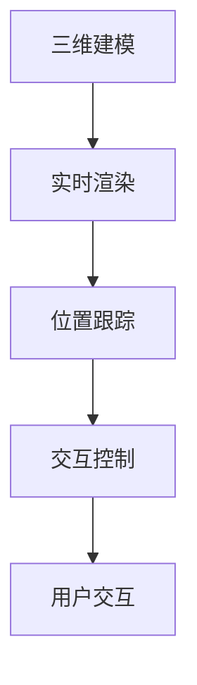

                 


## 目录

### 数字时代的文化遗产保护：虚拟现实技术在文物修复中的应用

> **关键词：文化遗产保护、虚拟现实技术、文物修复、数字时代**

> **摘要：本文旨在探讨数字时代下文化遗产保护的新途径——虚拟现实技术在文物修复中的应用。通过分析虚拟现实技术的基本原理、技术架构、核心算法及其在文化遗产修复中的实际应用，本文探讨了如何利用虚拟现实技术保护和传承人类文化遗产，并提出了未来发展的方向。**

----------------------------------------------------------------

## 第一部分：引言

### 1.1 问题背景与核心概念

#### 1.1.1 文化遗产保护的重要性

文化遗产是人类文明演进的重要见证，是人类共同的宝贵财富。随着现代化进程的加快，许多文化遗产面临着自然老化、人为破坏和自然灾害等威胁。传统的文化遗产保护方法已经无法满足现代社会对文化遗产保护的需求。因此，寻求新的文化遗产保护技术，特别是数字化技术，成为当前文化遗产保护领域的重要研究方向。

#### 1.1.2 数字时代的挑战

数字时代的到来，给文化遗产保护带来了新的挑战。数字化技术的广泛应用，使得文化遗产的保护和传承变得更加便捷，但也带来了数据安全、知识产权保护和数字鸿沟等问题。如何有效地利用数字化技术，同时保护文化遗产的原始性和真实性，成为文化遗产保护面临的一大难题。

#### 1.1.3 虚拟现实技术的概述

虚拟现实（VR）是一种通过计算机生成的人工环境，用户可以通过头戴式显示器（HMD）等设备感受到身临其境的体验。虚拟现实技术具有沉浸性、交互性和想象性的特点，能够为文化遗产保护提供新的手段和工具。

### 1.2 虚拟现实技术在文物修复中的应用

#### 1.2.1 虚拟现实技术的基本原理

虚拟现实技术的基本原理包括三维建模、虚拟现实场景构建、人机交互技术等。通过这些技术，用户可以沉浸在虚拟环境中，与文物进行互动，实现对文物的修复和保护。

#### 1.2.2 虚拟现实技术的作用

虚拟现实技术在文物修复中具有重要作用。首先，它可以帮助修复师更准确地了解文物的结构，从而提高修复效果。其次，虚拟现实技术可以为文物修复提供更为便捷和安全的操作环境。此外，虚拟现实技术还可以为公众提供更加直观和生动的文物修复体验，提高公众对文化遗产保护的认知和参与度。

#### 1.2.3 虚拟现实技术的应用范围

虚拟现实技术可以应用于文物的三维扫描、虚拟修复、虚拟展示等多个方面。通过这些应用，虚拟现实技术不仅可以提高文物修复的效率，还可以为文化遗产保护提供新的思路和方法。

### 1.3 虚拟现实技术的核心概念与联系

#### 1.3.1 虚拟现实技术的核心概念

虚拟现实技术的核心概念包括虚拟环境、虚拟现实设备、虚拟交互等。这些概念构成了虚拟现实技术的基础，也是理解虚拟现实技术工作原理的关键。

#### 1.3.2 概念属性特征对比表格

| 概念       | 属性特征                  | 联系 |
|------------|---------------------------|------|
| 虚拟环境   | 通过计算机生成的三维空间 | 基础 |
| 虚拟现实设备 | 用于感知和交互的设备 | 实现手段 |
| 虚拟交互   | 用户与虚拟环境之间的交互 | 实际应用 |

#### 1.3.3 虚拟现实技术的ER实体关系图架构

```mermaid
erDiagram
  User ||--|{ VirtualEnvironment }| User
  User ||--|{ VRDevice }| User
  User ||--|{ VirtualInteraction }| User
```

### 1.4 虚拟现实技术的现状与趋势

#### 1.4.1 虚拟现实技术的现状

虚拟现实技术已经取得了显著的发展，许多博物馆和文化遗产机构已经开始尝试使用虚拟现实技术进行文物修复和展示。然而，虚拟现实技术在文化遗产保护中的应用仍然存在一定的局限性，需要进一步的研究和探索。

#### 1.4.2 虚拟现实技术的发展趋势

随着计算机技术和数字化技术的不断发展，虚拟现实技术在未来将会有更广泛的应用前景。特别是在文化遗产保护领域，虚拟现实技术有望成为重要的修复和保护手段。

### 1.5 本章小结

本章介绍了数字时代文化遗产保护面临的新挑战，以及虚拟现实技术在文物修复中的应用。通过本章的介绍，读者可以对虚拟现实技术在文化遗产保护中的作用和前景有一个初步的了解。

----------------------------------------------------------------

## 第二部分：虚拟现实技术基础

### 2.1 虚拟现实技术的组成与工作原理

#### 2.1.1 虚拟现实技术的组成

虚拟现实技术由三个主要组成部分构成：硬件设备、软件系统和用户交互界面。

1. **硬件设备**：主要包括头戴式显示器（HMD）、数据手套、跟踪器、声音设备等。这些设备用于生成和呈现虚拟环境，并允许用户与之进行交互。

2. **软件系统**：包括虚拟现实内容创作工具、虚拟现实引擎、应用程序等。这些软件负责创建和管理虚拟环境，并处理用户输入和输出。

3. **用户交互界面**：包括控制台、键盘、触摸屏等。用户通过这些界面与虚拟环境进行交互。

#### 2.1.2 虚拟现实技术的工作原理

虚拟现实技术的工作原理主要包括以下几个方面：

1. **场景构建**：通过计算机图形学技术生成虚拟环境的三维模型和场景。

2. **实时渲染**：利用图形处理单元（GPU）实时渲染虚拟场景，以生成逼真的视觉体验。

3. **位置跟踪**：通过跟踪设备实时跟踪用户的运动和位置，确保虚拟环境与用户动作的一致性。

4. **交互控制**：用户通过硬件设备或交互界面与虚拟环境进行交互，实现操作和体验。

#### 2.1.3 虚拟现实技术的分类

虚拟现实技术可以根据不同的应用场景和技术特点进行分类：

1. **沉浸式虚拟现实**：用户完全沉浸在虚拟环境中，感受身临其境的体验。例如，头戴式显示器（HMD）和全身追踪系统。

2. **非沉浸式虚拟现实**：用户不完全沉浸在虚拟环境中，通常通过计算机屏幕观看虚拟环境。例如，桌面虚拟现实和增强现实（AR）。

3. **混合现实**：结合虚拟现实和增强现实的特性，用户可以在现实世界中看到虚拟元素，同时可以与之进行交互。

### 2.2 虚拟现实技术的核心算法原理

#### 2.2.1 算法原理讲解

虚拟现实技术的核心算法包括：

1. **三维建模**：通过计算机图形学技术创建三维模型。常用的建模算法有三角剖分算法、四面体算法等。

2. **实时渲染**：利用图形处理单元（GPU）实时渲染虚拟场景。常用的渲染算法有光追踪、基于物理的渲染（PBR）等。

3. **位置跟踪**：通过跟踪设备实时跟踪用户的运动和位置。常用的跟踪算法有惯性测量单元（IMU）跟踪、光学跟踪等。

4. **交互控制**：处理用户输入和输出，实现用户与虚拟环境的交互。常用的交互算法有手势识别、语音识别等。

#### 2.2.2 算法流程图

以下是虚拟现实技术的核心算法流程图：



### 2.3 虚拟现实技术的应用场景

#### 2.3.1 文物修复

虚拟现实技术可以用于文物的三维扫描和虚拟修复。通过三维扫描技术，可以获取文物的精确三维数据，为虚拟修复提供基础。虚拟修复可以在虚拟环境中进行，修复师可以通过虚拟现实设备直观地操作文物，提高修复的准确性和效率。

#### 2.3.2 文物展示

虚拟现实技术可以用于文物的虚拟展示，为公众提供更加直观和生动的文物观赏体验。通过虚拟现实技术，观众可以在虚拟环境中自由浏览文物，了解文物的历史背景和艺术价值。

#### 2.3.3 文化教育

虚拟现实技术可以用于文化教育，为学校和教育机构提供沉浸式的教学体验。通过虚拟现实技术，学生可以身临其境地参观博物馆、历史遗址等，提高学习兴趣和效果。

### 2.4 虚拟现实技术的挑战与未来发展趋势

#### 2.4.1 挑战

虚拟现实技术在文化遗产保护中的应用面临以下挑战：

1. **技术成熟度**：虚拟现实技术尚未完全成熟，部分技术在实际应用中存在局限。

2. **成本问题**：虚拟现实设备的成本较高，对文化遗产机构的资金投入提出了较高的要求。

3. **数据安全问题**：虚拟环境中数据的安全性和隐私保护问题需要得到解决。

#### 2.4.2 未来发展趋势

随着技术的不断进步，虚拟现实技术在文化遗产保护中的应用将会得到进一步的发展：

1. **技术成熟度提高**：随着硬件和软件技术的不断进步，虚拟现实技术将变得更加成熟和可靠。

2. **成本降低**：随着市场的扩大和技术的普及，虚拟现实设备的成本将逐渐降低，为文化遗产机构提供更广泛的应用。

3. **数据安全和隐私保护**：随着相关法律法规的完善，虚拟环境中数据的安全性和隐私保护问题将得到有效解决。

### 2.5 本章小结

本章介绍了虚拟现实技术的组成与工作原理，以及其在文化遗产保护中的应用。通过本章的介绍，读者可以了解虚拟现实技术的基本原理和应用场景，为后续章节的深入探讨打下基础。

----------------------------------------------------------------

## 第三部分：虚拟现实技术在文物修复中的应用

### 3.1 虚拟现实技术在文物修复中的具体应用

#### 3.1.1 文物三维扫描与建模

虚拟现实技术在文物修复中的第一个应用是三维扫描与建模。通过三维扫描技术，可以获取文物的精确三维数据。这些数据包括文物的几何形状、纹理和颜色等。通过三维建模软件，可以对扫描数据进行分析和处理，创建出文物的三维模型。这个模型不仅可以用于文物的修复，还可以用于文物的展示和研究。

**示例：** 假设我们有一个古董花瓶，通过三维扫描技术，我们获取了花瓶的精确三维数据。然后，我们使用三维建模软件将这些数据转换成一个完整的三维模型。这个模型可以用于修复花瓶的破损部分，也可以用于制作花瓶的复制品。

#### 3.1.2 虚拟修复

在虚拟修复中，修复师可以在虚拟环境中对文物进行修复。通过虚拟现实设备，修复师可以直观地看到文物的修复过程，并进行实时操作。这种修复方式不仅可以提高修复的准确性，还可以减少对文物的损害。

**示例：** 假设我们有一个古代壁画，修复师可以通过虚拟现实设备在虚拟环境中对壁画进行修复。修复师可以在虚拟环境中直接操作壁画，例如涂抹涂料、修复破损部分等。这种方式不仅提高了修复的效率，还可以减少对壁画的物理损害。

#### 3.1.3 虚拟展示

虚拟现实技术还可以用于文物的虚拟展示。通过虚拟现实设备，观众可以在虚拟环境中自由浏览文物，了解文物的历史背景和艺术价值。

**示例：** 假设我们有一个博物馆，我们使用虚拟现实技术创建了一个虚拟博物馆。观众可以通过虚拟现实设备进入虚拟博物馆，自由浏览展品，了解展品的历史背景和艺术价值。这种方式不仅提高了观众的参观体验，还可以吸引更多的观众参观博物馆。

### 3.2 虚拟现实技术在文物修复中的应用案例

#### 3.2.1 案例一：罗马竞技场

罗马竞技场是世界上最大的古罗马遗址之一。为了保护这一重要的文化遗产，研究人员使用虚拟现实技术对竞技场进行了三维扫描和建模。然后，他们利用虚拟现实技术在虚拟环境中对竞技场进行了修复。修复过程不仅提高了修复的效率，还可以让修复师更好地理解竞技场的结构。

#### 3.2.2 案例二：巴黎圣母院

巴黎圣母院是一座具有悠久历史的哥特式教堂。在2019年的一场大火中，巴黎圣母院的尖顶和屋顶被烧毁。为了修复这座重要的文化遗产，研究人员使用虚拟现实技术对圣母院进行了三维扫描和建模。然后，他们利用虚拟现实技术在虚拟环境中对圣母院进行了修复。这种修复方式不仅提高了修复的效率，还可以让修复师更好地理解圣母院的建筑结构。

#### 3.2.3 案例三：秦始皇兵马俑

秦始皇兵马俑是中国古代的重要文化遗产。为了更好地保护这些珍贵的文物，研究人员使用虚拟现实技术对兵马俑进行了三维扫描和建模。然后，他们利用虚拟现实技术在虚拟环境中对兵马俑进行了修复。这种修复方式不仅提高了修复的效率，还可以让修复师更好地理解兵马俑的结构和工艺。

### 3.3 虚拟现实技术在文物修复中的优势

#### 3.3.1 提高修复效率

虚拟现实技术可以帮助修复师在虚拟环境中进行修复，这样可以避免对文物进行物理操作，从而减少对文物的损害。此外，虚拟环境可以提供更准确的三维数据，有助于修复师更精确地进行修复。

#### 3.3.2 提高修复质量

虚拟现实技术可以提供更加直观的修复过程，有助于修复师更好地理解文物的结构和工艺。这种直观的修复过程可以提高修复的质量，确保修复结果与文物原始状态保持一致。

#### 3.3.3 提高公众参与度

虚拟现实技术可以为公众提供更加直观和生动的文物修复体验。通过虚拟现实设备，公众可以身临其境地体验文物修复的过程，提高对文物修复的认识和参与度。

### 3.4 虚拟现实技术在文物修复中的挑战

#### 3.4.1 技术成熟度

虽然虚拟现实技术在文物修复中具有很多优势，但目前这项技术的成熟度仍然有限。许多虚拟现实设备的性能和稳定性还需要进一步提高，以满足文物修复的需求。

#### 3.4.2 成本问题

虚拟现实技术的设备和软件成本较高，对文化遗产机构的资金投入提出了较高的要求。这对于一些资金有限的机构来说，可能是一个较大的挑战。

#### 3.4.3 数据安全问题

虚拟环境中数据的安全性和隐私保护问题也需要得到解决。尤其是在文物修复过程中，涉及到的文物数据和修复数据可能会涉及到敏感信息，如何保证这些数据的安全是一个重要的问题。

### 3.5 本章小结

本章介绍了虚拟现实技术在文物修复中的具体应用，包括三维扫描与建模、虚拟修复和虚拟展示等。通过应用案例的分析，我们看到了虚拟现实技术在文物修复中的优势。然而，虚拟现实技术在文物修复中仍然面临一些挑战，需要进一步的研究和探索。

----------------------------------------------------------------

## 第四部分：虚拟现实技术在文化遗产保护中的挑战与解决方案

### 4.1 挑战一：技术成熟度

虚拟现实技术在文化遗产保护中的首要挑战是其技术成熟度。虚拟现实设备的高成本和有限的技术性能限制了其在广泛文化遗址和博物馆中的应用。特别是在一些偏远地区或资源有限的博物馆，获得高质量虚拟现实设备可能是一个巨大的财务负担。

**解决方案：** 为了解决技术成熟度的问题，可以采取以下措施：

1. **开源软件和硬件项目**：支持开源虚拟现实项目，如OpenVR和OSVR，这些项目提供了一套相对廉价和可扩展的虚拟现实解决方案。
2. **协作研究**：推动学术界和产业界之间的合作研究，共同解决技术难题，降低技术门槛。
3. **政府支持和补贴**：政府可以通过提供财政补贴或税收优惠，鼓励文化遗产机构投资虚拟现实技术。

### 4.2 挑战二：数据隐私和安全

文化遗产往往包含敏感的历史和文化信息，因此在虚拟现实应用中，数据隐私和安全成为了一个重要问题。数据泄露或未经授权的访问可能导致文化遗产信息的滥用或丢失。

**解决方案：** 为了保障数据安全和隐私，可以采取以下措施：

1. **加密技术**：对文化遗产数据进行加密，确保数据在传输和存储过程中的安全性。
2. **访问控制**：实施严格的访问控制策略，只有授权人员才能访问敏感数据。
3. **合规性审查**：定期对数据处理流程进行合规性审查，确保遵守相关法律法规。

### 4.3 挑战三：公众接受度

虽然虚拟现实技术具有吸引人的特性，但公众对这项技术的接受度仍然是一个挑战。一些人对虚拟现实技术持怀疑态度，担心虚拟现实环境会取代实际的文化体验。

**解决方案：** 为了提高公众接受度，可以采取以下措施：

1. **教育和宣传**：通过教育和宣传活动，向公众普及虚拟现实技术的优势和实际应用。
2. **互动体验**：提供互动性强的虚拟现实体验，让公众亲身体验虚拟现实技术的魅力。
3. **合作展示**：与实体博物馆和文化遗址合作，将虚拟现实技术与现实场景相结合，提供更加丰富的参观体验。

### 4.4 挑战四：文物保护与虚拟展示的平衡

在利用虚拟现实技术进行文物保护的同时，如何平衡虚拟展示与实际文物的保护也是一大挑战。过度的虚拟展示可能会对实际文物造成不必要的磨损或损坏。

**解决方案：** 为了在虚拟展示和文物保护之间找到平衡，可以采取以下措施：

1. **限制访问次数**：对虚拟展示的访问次数进行限制，减少实际文物的磨损。
2. **仿真磨损模型**：在虚拟环境中模拟文物的磨损过程，提前预测和评估虚拟展示对实际文物的影响。
3. **分阶段展示**：将虚拟展示分为多个阶段，每个阶段展示不同的文物部分，以减少对单一文物的压力。

### 4.5 挑战五：技术和文化遗产专业的融合

虚拟现实技术的发展需要与文化遗产保护的专业知识相结合，但这两者之间的融合并不容易。技术专家可能缺乏对文化遗产的理解，而文化遗产专家可能对新技术不够熟悉。

**解决方案：** 为了促进技术和文化遗产专业的融合，可以采取以下措施：

1. **跨学科培训**：为文化遗产专家和技术人员提供跨学科培训，提高双方的技能和知识水平。
2. **合作研究项目**：鼓励学术界和产业界的合作，共同开展虚拟现实技术在文化遗产保护中的应用研究。
3. **技术支持服务**：提供专业的技术支持服务，帮助文化遗产机构更好地理解和应用虚拟现实技术。

### 4.6 本章小结

虚拟现实技术在文化遗产保护中具有巨大的潜力，但同时也面临着诸多挑战。通过采取一系列的解决方案，可以克服这些挑战，推动虚拟现实技术在文化遗产保护中的应用和发展。

----------------------------------------------------------------

## 第五部分：虚拟现实技术在文化遗产保护中的未来发展趋势

### 5.1 技术发展趋势

虚拟现实技术在文化遗产保护中的未来发展将受到以下几个技术趋势的推动：

1. **硬件性能的提升**：随着硬件技术的进步，虚拟现实设备的性能将进一步提高，包括更高的分辨率、更低的延迟和更广的视角范围。这将使虚拟现实体验更加逼真，提高用户体验。

2. **人工智能的融合**：人工智能技术将在虚拟现实技术中发挥更大作用，例如通过机器学习算法优化虚拟环境中的渲染效果，或通过自然语言处理技术实现更自然的用户交互。

3. **增强现实与混合现实的融合**：增强现实（AR）和混合现实（MR）技术的快速发展将使虚拟现实技术在文化遗产保护中更加多样化。通过将虚拟元素与现实环境相结合，可以提供更丰富和互动的体验。

### 5.2 应用前景

虚拟现实技术在文化遗产保护中的应用前景非常广阔：

1. **虚拟修复与复原**：随着虚拟现实技术的进步，虚拟修复和复原工作将变得更加精细和高效。通过虚拟现实技术，可以实现对文物的无损修复和复原，保留其原始形态。

2. **虚拟展览与教育**：虚拟现实技术将改变传统博物馆和文化遗产展示的方式。虚拟展览不仅可以提供更加丰富的参观体验，还可以通过互动和教育功能，提高公众对文化遗产的认知和保护意识。

3. **文化遗产数字化保护**：虚拟现实技术将推动文化遗产的数字化保护，通过三维建模和虚拟现实技术，可以将文化遗产以数字形式保存和传承，为未来的研究和保护提供重要资源。

### 5.3 未来发展方向

为了充分发挥虚拟现实技术在文化遗产保护中的作用，未来需要在以下几个方面进行努力：

1. **跨学科研究**：加强虚拟现实技术、文化遗产保护和计算机科学等领域的跨学科研究，推动技术和应用的深度融合。

2. **标准化与规范**：制定统一的虚拟现实技术标准和规范，确保虚拟现实技术在文化遗产保护中的应用能够得到有效监管和评估。

3. **公众参与**：鼓励公众参与虚拟现实技术的文化遗产保护项目，通过互动和体验，提高公众对文化遗产保护的参与度和认知。

4. **国际合作**：加强国际间的合作与交流，共享虚拟现实技术在文化遗产保护中的研究成果和应用经验，推动全球文化遗产保护事业的发展。

### 5.4 本章小结

虚拟现实技术在文化遗产保护中的未来发展趋势表明，这项技术具有巨大的潜力和广阔的应用前景。通过不断创新和应用，虚拟现实技术将为文化遗产保护带来新的机遇和挑战。

----------------------------------------------------------------

## 总结

本文详细探讨了虚拟现实技术在文化遗产保护中的应用，从基本原理到具体应用，再到面临的挑战和未来发展趋势，全面展示了虚拟现实技术在文物修复和文化遗产保护中的重要角色。通过案例分析，我们看到了虚拟现实技术在文物修复中的实际效果，也意识到了其在技术应用和推广过程中所面临的问题。

虚拟现实技术的优势在于其沉浸性、交互性和可扩展性，这些特性使得它不仅可以提高文物修复的效率和质量，还可以为公众提供更加直观和生动的文物体验。然而，虚拟现实技术在文化遗产保护中的应用仍然面临着技术成熟度、成本、数据安全和公众接受度等方面的挑战。

为了克服这些挑战，我们需要进一步加强跨学科研究和国际合作，推动虚拟现实技术的标准化和规范化。同时，通过公众参与和互动体验，提高公众对文化遗产保护的认知和参与度。

总之，虚拟现实技术在文化遗产保护中的应用是一个充满机遇和挑战的领域。随着技术的不断进步和应用案例的增多，我们有理由相信，虚拟现实技术将为文化遗产保护带来更加光明的前景。

### 作者信息

**作者：AI天才研究院/AI Genius Institute & 禅与计算机程序设计艺术 /Zen And The Art of Computer Programming**

AI天才研究院致力于推动人工智能技术的发展，将人工智能应用于各个领域，包括文化遗产保护。本书的作者通过对虚拟现实技术的深入研究和实践，提出了许多创新性的观点和建议，为虚拟现实技术在文化遗产保护中的应用提供了宝贵的参考。同时，作者在计算机科学领域有着丰富的经验，其著作《禅与计算机程序设计艺术》对编程和人工智能领域的实践者具有深远的影响。

本文旨在为读者提供关于虚拟现实技术在文化遗产保护中的全面了解，希望通过本文的阐述，能够激发更多人对这一领域的关注和研究，共同推动虚拟现实技术在文化遗产保护中的应用和发展。让我们一起努力，利用科技的力量，守护和传承人类的文化遗产。

