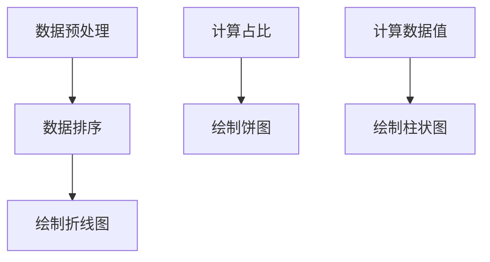
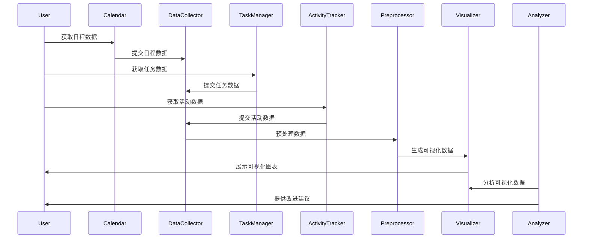
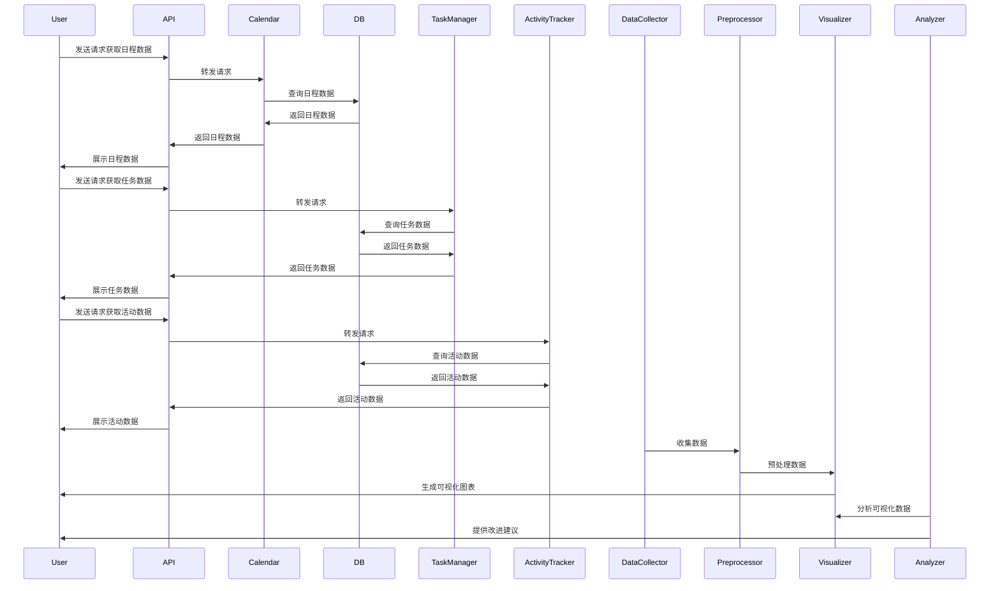

                 

# 目录

## 第1章 引言

### 1.1 数字时代时间可视化的概念

> **关键词**：时间可视化，数字时代，个人生产力，图表分析工具

> **摘要**：
本文旨在探讨数字时代下的时间可视化概念及其对个人生产力的提升作用。通过分析各类图表分析工具，本文将介绍时间可视化的核心概念、数据处理方法、算法原理及系统设计，帮助读者深入理解并有效利用时间可视化技术。

### 1.2 时间可视化的历史与发展

#### 1.2.1 时间可视化的起源

#### 1.2.2 时间可视化的发展历程

#### 1.2.3 数字时代对时间可视化的影响

### 1.3 时间可视化在个人生产力提升中的作用

#### 1.3.1 提高时间管理效率

#### 1.3.2 增强任务执行精准度

#### 1.3.3 促进工作与生活的平衡

## 第2章 数据收集与预处理

### 2.1 个人数据的来源

#### 2.1.1 日历应用

#### 2.1.2 任务管理工具

#### 2.1.3 活动追踪器

### 2.2 数据收集方法

#### 2.2.1 手动记录

#### 2.2.2 自动化采集

#### 2.2.3 数据挖掘技术

### 2.3 数据预处理技术

#### 2.3.1 数据清洗

#### 2.3.2 数据转换

#### 2.3.3 数据归一化

## 第3章 时间可视化的核心概念

### 3.1 时间序列分析

#### 3.1.1 时间序列数据的基本概念

#### 3.1.2 常见的时间序列图表

#### 3.1.3 时间序列分析的算法

### 3.2 事件序列分析

#### 3.2.1 事件序列数据的特点

#### 3.2.2 事件序列分析的应用

#### 3.2.3 常见的事件序列分析算法

### 3.3 网络与社交图谱

#### 3.3.1 网络图谱的基本概念

#### 3.3.2 社交图谱的应用

#### 3.3.3 网络与社交图谱的分析方法

### 3.4 核心概念对比与ER图

#### 3.4.1 各类时间可视化方法的对比

#### 3.4.2 时间可视化方法的ER图解析

## 第4章 时间可视化算法原理与应用

### 4.1 常见时间可视化算法

#### 4.1.1 折线图

#### 4.1.2 饼图

#### 4.1.3 柱状图

### 4.2 算法流程图与Python代码示例

#### 4.2.1 Mermaid算法流程图

#### 4.2.2 Python代码解释与示例

### 4.3 算法数学模型与公式

#### 4.3.1 时间序列分析模型

#### 4.3.2 事件序列分析模型

#### 4.3.3 社交网络分析模型

## 第5章 时间可视化系统分析与设计

### 5.1 问题场景与项目概述

### 5.2 系统功能设计

#### 5.2.1 领域模型Mermaid类图

### 5.3 系统架构设计

#### 5.3.1 Mermaid架构图

### 5.4 系统接口设计与交互

#### 5.4.1 Mermaid序列图

## 第6章 实践项目与案例分析

### 6.1 环境搭建

#### 6.1.1 硬件与软件需求

#### 6.1.2 环境安装步骤

### 6.2 系统核心实现与代码分析

#### 6.2.1 核心功能模块介绍

#### 6.2.2 代码解读与实现

### 6.3 案例分析

#### 6.3.1 实际案例介绍

#### 6.3.2 案例分析与解释

### 6.4 项目小结

#### 6.4.1 项目总结

#### 6.4.2 项目收获与思考

## 第7章 最佳实践与总结

### 7.1 时间可视化最佳实践

#### 7.1.1 数据收集与预处理技巧

#### 7.1.2 选择合适的时间可视化方法

#### 7.1.3 数据可视化工具的使用技巧

### 7.2 小结

#### 7.2.1 核心要点回顾

### 7.3 注意事项与拓展阅读

#### 7.3.1 常见问题与解决方法

#### 7.3.2 拓展阅读推荐

### 结论

---

**作者：AI天才研究院/AI Genius Institute & 禅与计算机程序设计艺术 /Zen And The Art of Computer Programming**

---

## 第1章 引言

### 1.1 数字时代时间可视化的概念

#### 关键词解释

时间可视化是一种将时间相关的数据通过图表的形式进行展示的技术，它可以帮助用户直观地理解和分析时间数据。在数字时代，随着计算机技术和数据分析工具的快速发展，时间可视化技术得到了广泛的应用。

**问题背景**

在数字化时代，人们面临的信息量急剧增加，如何有效地管理和利用这些信息成为了一个重要的问题。时间数据作为一种重要的信息类型，其分析和利用效率直接影响到个人的工作和生活效率。

**问题描述**

如何利用时间可视化技术提高个人的生产力，实现高效的时间管理和任务执行？

**问题解决**

时间可视化技术通过将时间数据以图表的形式展示，使用户能够直观地看到时间分布、任务进度和事件关系，从而实现时间管理和效率提升。

**边界与外延**

时间可视化的应用范围非常广泛，包括但不限于个人时间管理、项目进度监控、生产调度优化等领域。

#### 概念结构与核心要素组成

时间可视化的核心要素包括数据收集、数据处理、图表展示和分析应用。

- **数据收集**：通过日历、任务管理工具、活动追踪器等途径收集时间数据。
- **数据处理**：对收集到的数据进行清洗、转换和归一化处理。
- **图表展示**：选择合适的图表形式（如折线图、饼图、柱状图等）进行展示。
- **分析应用**：通过对图表的分析，得出时间使用情况、任务执行效率和改进建议。

### 1.2 时间可视化的历史与发展

#### 时间可视化的起源

时间可视化技术的起源可以追溯到早期的统计图表，如条形图、折线图等，这些图表最初用于展示经济、社会等方面的数据。

#### 时间可视化的发展历程

随着计算机技术的发展，时间可视化技术逐渐从二维平面图表发展为三维图表，同时结合了更多交互性和动态性。

#### 数字时代对时间可视化的影响

数字时代的到来，使得人们产生的时间数据量呈指数级增长，这对时间可视化技术提出了更高的要求。同时，大数据分析技术和机器学习算法的发展也为时间可视化技术的提升提供了强大的支持。

### 1.3 时间可视化在个人生产力提升中的作用

#### 提高时间管理效率

时间可视化技术可以帮助用户清晰地看到自己的时间使用情况，从而更好地安排工作和休息时间，提高时间利用效率。

#### 增强任务执行精准度

通过时间可视化，用户可以实时了解任务进度，及时调整任务执行计划，确保任务按时完成。

#### 促进工作与生活的平衡

时间可视化技术不仅适用于工作场景，还可以帮助用户合理安排个人生活，实现工作与生活的平衡。

## 第2章 数据收集与预处理

### 2.1 个人数据的来源

#### 2.1.1 日历应用

日历应用是收集个人时间数据的重要来源之一。常用的日历应用包括Google日历、Outlook日历、Apple日历等，它们可以记录用户的日程安排、会议、活动等时间数据。

#### 2.1.2 任务管理工具

任务管理工具可以帮助用户记录和管理任务，常用的任务管理工具有Trello、Asana、Jira等。这些工具可以记录任务的创建时间、完成时间、优先级等信息。

#### 2.1.3 活动追踪器

活动追踪器（如Fitbit、Apple Watch等）可以记录用户的日常活动数据，如运动时间、睡眠时间等。这些数据对于分析个人的时间利用情况具有重要意义。

### 2.2 数据收集方法

#### 2.2.1 手动记录

手动记录是最传统也是最基础的数据收集方法。用户可以通过手动记录日志、使用纸质日程本等方式记录自己的时间数据。这种方法适用于时间数据量较小的情况。

#### 2.2.2 自动化采集

随着技术的发展，自动化数据采集工具逐渐流行。这些工具可以自动从日历应用、任务管理工具、活动追踪器等途径收集时间数据，提高数据收集的效率。

#### 2.2.3 数据挖掘技术

数据挖掘技术可以从大量非结构化数据中提取有价值的时间数据。例如，通过分析社交媒体数据、电子邮件日志等，可以了解用户的在线活动时间和社交行为模式。

### 2.3 数据预处理技术

#### 2.3.1 数据清洗

数据清洗是数据预处理的重要步骤，目的是去除数据中的噪声和错误。例如，删除重复记录、填补缺失值、纠正错误数据等。

#### 2.3.2 数据转换

数据转换是将不同格式、单位的数据转换为统一格式的过程。例如，将不同时间表示方法（如年月日、时分秒）转换为统一的时序数据格式。

#### 2.3.3 数据归一化

数据归一化是将不同特征的数据进行标准化处理，使其具有可比性。例如，将不同任务的时间长度进行归一化处理，以便进行统一分析。

## 第3章 时间可视化的核心概念

### 3.1 时间序列分析

#### 3.1.1 时间序列数据的基本概念

时间序列数据是按照时间顺序排列的一系列数据点，通常用来描述某一现象随时间变化的趋势。时间序列数据的基本概念包括：

- **时间点（Timestamp）**：数据点对应的时间戳。
- **观测值（Observation）**：数据点对应的数值。

#### 3.1.2 常见的时间序列图表

常见的时间序列图表包括：

- **折线图**：用于展示数据随时间的变化趋势。
- **柱状图**：用于比较不同时间点的数据值。
- **饼图**：用于展示数据在不同类别中的比例。

#### 3.1.3 时间序列分析的算法

时间序列分析算法包括：

- **移动平均法（MA）**：通过计算一段时间内的平均值来平滑数据。
- **自回归移动平均法（ARMA）**：结合自回归模型和移动平均模型，对时间序列数据进行建模。
- **季节性分解（Seasonal Decomposition）**：将时间序列数据分解为趋势、季节性和随机性成分。

### 3.2 事件序列分析

#### 3.2.1 事件序列数据的特点

事件序列数据是按照事件发生顺序排列的一系列事件，每个事件都有发生时间和相关属性。事件序列数据的特点包括：

- **顺序性**：事件发生具有明确的先后顺序。
- **多样性**：事件种类繁多，具有不同的属性和关系。

#### 3.2.2 事件序列分析的应用

事件序列分析的应用包括：

- **用户行为分析**：分析用户在网站或应用中的行为模式。
- **事件追踪**：追踪事件的发生过程，如交易流程、客户服务流程等。
- **异常检测**：检测异常事件，如欺诈交易、系统故障等。

#### 3.2.3 常见的事件序列分析算法

常见的事件序列分析算法包括：

- **动态时间 warping（DTW）**：用于比较两个事件序列的相似性。
- **LSTM（Long Short-Term Memory）**：一种用于处理序列数据的神经网络模型。
- **Apriori算法**：用于挖掘事件序列中的关联规则。

### 3.3 网络与社交图谱

#### 3.3.1 网络图谱的基本概念

网络图谱是一种图形化的数据结构，用于表示实体及其之间的关系。网络图谱的基本概念包括：

- **节点（Node）**：表示实体，如用户、物品等。
- **边（Edge）**：表示实体之间的关系，如朋友关系、交易关系等。

#### 3.3.2 社交图谱的应用

社交图谱的应用包括：

- **社交网络分析**：分析社交网络中的用户关系、传播路径等。
- **推荐系统**：基于用户关系进行物品推荐。
- **社区发现**：识别社交网络中的社区结构。

#### 3.3.3 网络与社交图谱的分析方法

网络与社交图谱的分析方法包括：

- **网络密度分析**：分析网络中的节点密度和边密度。
- **中心性分析**：分析节点在社交网络中的重要性。
- **社区发现算法**：如Girvan-Newman算法、Louvain算法等。

### 3.4 核心概念对比与ER图

#### 3.4.1 各类时间可视化方法的对比

时间序列分析、事件序列分析和网络与社交图谱是三种主要的时

## 第4章 时间可视化算法原理与应用

### 4.1 常见时间可视化算法

#### 4.1.1 折线图

折线图是最常用的时间可视化方法之一，用于展示数据随时间的变化趋势。其算法原理如下：

1. **数据预处理**：对时间数据进行清洗和归一化处理。
2. **数据排序**：按照时间顺序对数据点进行排序。
3. **绘制折线图**：将数据点连接成折线，展示数据的变化趋势。

Python代码示例：

```python
import matplotlib.pyplot as plt
import numpy as np

# 生成时间数据
time_data = np.arange(0, 10)
# 生成对应的数据值
value_data = np.sin(time_data)

# 绘制折线图
plt.plot(time_data, value_data)
plt.xlabel('Time')
plt.ylabel('Value')
plt.title('Sine Wave')
plt.show()
```

#### 4.1.2 饼图

饼图用于展示数据在不同类别中的比例分布，其算法原理如下：

1. **数据预处理**：计算各分类的数据值和占比。
2. **计算角度**：根据数据占比计算对应的角度。
3. **绘制饼图**：按照计算出的角度绘制饼图。

Python代码示例：

```python
import matplotlib.pyplot as plt

# 生成数据值和占比
values = [1, 2, 3, 4]
sizes = [0.2, 0.3, 0.1, 0.4]

# 绘制饼图
plt.pie(sizes, labels=values, autopct='%.1f%%')
plt.axis('equal')
plt.show()
```

#### 4.1.3 柱状图

柱状图用于比较不同类别之间的数据值，其算法原理如下：

1. **数据预处理**：计算各分类的数据值。
2. **绘制柱状图**：按照计算出的数据值绘制柱状图。

Python代码示例：

```python
import matplotlib.pyplot as plt

# 生成数据值
values = [1, 2, 3, 4]
labels = ['A', 'B', 'C', 'D']

# 绘制柱状图
plt.bar(labels, values)
plt.xlabel('Categories')
plt.ylabel('Values')
plt.title('Bar Chart')
plt.show()
```

### 4.2 算法流程图与Python代码示例

#### 4.2.1 Mermaid算法流程图



#### 4.2.2 Python代码解释与示例

在上一节中，我们分别介绍了折线图、饼图和柱状图的算法原理和Python代码示例。下面我们将结合具体的案例，详细解释这些代码的实现过程。

#### 4.2.2.1 折线图

```python
import matplotlib.pyplot as plt
import numpy as np

# 生成时间数据
time_data = np.arange(0, 10)
# 生成对应的数据值
value_data = np.sin(time_data)

# 绘制折线图
plt.plot(time_data, value_data)
plt.xlabel('Time')
plt.ylabel('Value')
plt.title('Sine Wave')
plt.show()
```

这段代码首先导入了`matplotlib.pyplot`和`numpy`两个库。`numpy`库用于生成时间和数据值，`matplotlib.pyplot`库用于绘制图表。

- 第4行生成时间数据，使用`np.arange(0, 10)`生成从0到9的等差数列。
- 第6行生成对应的数据值，这里使用`np.sin(time_data)`计算正弦函数的值。
- 第8行使用`plt.plot(time_data, value_data)`绘制折线图。
- 第10行设置X轴标签为'Time'。
- 第11行设置Y轴标签为'Value'。
- 第12行设置图表标题为'Sine Wave'。
- 第13行使用`plt.show()`显示图表。

#### 4.2.2.2 饼图

```python
import matplotlib.pyplot as plt

# 生成数据值
values = [1, 2, 3, 4]
labels = ['A', 'B', 'C', 'D']

# 绘制饼图
plt.pie(values, labels=labels, autopct='%.1f%%')
plt.axis('equal')
plt.show()
```

这段代码同样导入了`matplotlib.pyplot`库。与折线图不同的是，这里没有使用`numpy`库。

- 第4行生成数据值，`values`列表包含四个值。
- 第5行生成标签，`labels`列表包含四个字符串。
- 第7行使用`plt.pie(values, labels=labels, autopct='%.1f%%')`绘制饼图。`values`参数指定了数据值，`labels`参数指定了标签，`autopct`参数用于格式化显示百分比。
- 第8行设置轴比例为'equal'，以确保饼图的形状为圆形。
- 第9行使用`plt.show()`显示图表。

#### 4.2.2.3 柱状图

```python
import matplotlib.pyplot as plt

# 生成数据值
values = [1, 2, 3, 4]
labels = ['A', 'B', 'C', 'D']

# 绘制柱状图
plt.bar(labels, values)
plt.xlabel('Categories')
plt.ylabel('Values')
plt.title('Bar Chart')
plt.show()
```

这段代码同样导入了`matplotlib.pyplot`库。

- 第4行生成数据值，`values`列表包含四个值。
- 第5行生成标签，`labels`列表包含四个字符串。
- 第7行使用`plt.bar(labels, values)`绘制柱状图。`labels`参数指定了X轴的标签，`values`参数指定了Y轴的值。
- 第8行设置X轴标签为'Categories'。
- 第9行设置Y轴标签为'Values'。
- 第10行设置图表标题为'Bar Chart'。
- 第11行使用`plt.show()`显示图表。

### 4.3 算法数学模型与公式

#### 4.3.1 时间序列分析模型

时间序列分析常用的模型包括自回归模型（AR）、移动平均模型（MA）和自回归移动平均模型（ARMA）。下面分别介绍这三种模型的数学模型和公式。

**自回归模型（AR）**

自回归模型假设当前时间点的值可以通过前几个时间点的值来预测。其数学模型如下：

$$
X_t = c + \sum_{i=1}^p \phi_i X_{t-i} + \varepsilon_t
$$

其中，$X_t$为时间序列数据，$c$为常数项，$\phi_i$为自回归系数，$p$为滞后阶数，$\varepsilon_t$为随机误差项。

**移动平均模型（MA）**

移动平均模型假设当前时间点的值可以通过前几个时间点的误差值来预测。其数学模型如下：

$$
X_t = c + \varepsilon_t + \sum_{i=1}^q \theta_i \varepsilon_{t-i}
$$

其中，$X_t$为时间序列数据，$c$为常数项，$\theta_i$为移动平均系数，$q$为滞后阶数，$\varepsilon_t$为随机误差项。

**自回归移动平均模型（ARMA）**

自回归移动平均模型结合了自回归模型和移动平均模型，其数学模型如下：

$$
X_t = c + \sum_{i=1}^p \phi_i X_{t-i} + \sum_{j=1}^q \theta_j \varepsilon_{t-j} + \varepsilon_t
$$

其中，$X_t$为时间序列数据，$c$为常数项，$\phi_i$为自回归系数，$\theta_j$为移动平均系数，$p$和$q$分别为自回归和移动平均的滞后阶数，$\varepsilon_t$为随机误差项。

#### 4.3.2 事件序列分析模型

事件序列分析常用的模型包括动态时间扭曲（DTW）和长短期记忆（LSTM）模型。下面分别介绍这两种模型的数学模型和公式。

**动态时间扭曲（DTW）**

动态时间扭曲模型用于比较两个时间序列的相似性。其数学模型如下：

$$
DTW(X, Y) = \sum_{t} d(X_t, Y_t)
$$

其中，$X$和$Y$为两个时间序列，$d(X_t, Y_t)$为时间序列$X$和$Y$在时间点$t$的相似性度量。

**长短期记忆（LSTM）模型**

长短期记忆模型是一种用于处理序列数据的神经网络模型。其数学模型如下：

$$
h_t = \sigma(W_h \cdot [h_{t-1}, x_t] + b_h)
$$

$$
i_t = \sigma(W_i \cdot [h_{t-1}, x_t] + b_i)
$$

$$
f_t = \sigma(W_f \cdot [h_{t-1}, x_t] + b_f)
$$

$$
o_t = \sigma(W_o \cdot [h_{t-1}, x_t] + b_o)
$$

$$
c_t = f_t \cdot c_{t-1} + i_t \cdot \sigma(W_c \cdot [h_{t-1}, x_t] + b_c)
$$

$$
h_t = o_t \cdot \sigma(W_{ho} \cdot c_t + b_{ho})
$$

其中，$h_t$为当前时间点的输出，$x_t$为当前时间点的输入，$c_t$为当前时间点的细胞状态，$i_t$、$f_t$、$o_t$分别为输入门、遗忘门和输出门，$W_h$、$W_i$、$W_f$、$W_o$、$W_c$、$W_{ho}$分别为权重矩阵，$b_h$、$b_i$、$b_f$、$b_o$、$b_c$、$b_{ho}$分别为偏置项，$\sigma$为激活函数（通常为Sigmoid函数）。

## 第5章 时间可视化系统分析与设计

### 5.1 问题场景与项目概述

在本项目中，我们将开发一个时间可视化系统，旨在帮助个人用户有效地管理和分析自己的时间使用情况。系统将提供以下核心功能：

1. **数据收集**：从用户的日历应用、任务管理工具和活动追踪器中自动收集时间数据。
2. **数据预处理**：清洗、转换和归一化收集到的数据。
3. **时间可视化**：提供多种时间可视化图表，如折线图、饼图、柱状图等，以帮助用户直观地了解时间使用情况。
4. **数据分析**：基于可视化数据，提供时间使用分析报告和改进建议。

### 5.2 系统功能设计

#### 5.2.1 领域模型Mermaid类图

```mermaid
classDiagram
    User <<interface>>
    Calendar <<interface>>
    TaskManager <<interface>>
    ActivityTracker <<interface>>

    DataCollector <|-- User
    DataCollector <|-- Calendar
    DataCollector <|-- TaskManager
    DataCollector <|-- ActivityTracker

    Preprocessor <|-- DataCollector

    Visualizer <|-- Preprocessor

    Analyzer <|-- Visualizer
```

在这个类图中，我们定义了系统的核心类和接口：

- **User**：代表系统用户。
- **Calendar**、**TaskManager**、**ActivityTracker**：分别代表用户使用的日历应用、任务管理工具和活动追踪器。
- **DataCollector**：负责收集用户的数据。
- **Preprocessor**：负责预处理收集到的数据。
- **Visualizer**：负责生成时间可视化图表。
- **Analyzer**：负责分析可视化数据，并提供改进建议。

### 5.3 系统架构设计

#### 5.3.1 Mermaid架构图



在这个架构图中，我们描述了系统的数据流和功能调用：

- 用户从日历应用、任务管理工具和活动追踪器中获取数据。
- 数据收集器（DataCollector）负责收集这些数据。
- 预处理器（Preprocessor）对数据进行清洗、转换和归一化处理。
- 可视化器（Visualizer）根据预处理后的数据生成可视化图表。
- 分析器（Analyzer）对可视化数据进行分析，并提供改进建议。

### 5.4 系统接口设计与交互

#### 5.4.1 Mermaid序列图



在这个序列图中，我们描述了用户与系统各组件之间的交互过程：

- 用户通过API接口发送请求获取日程、任务和活动数据。
- API接口转发请求给相应的服务组件。
- 服务组件查询数据库获取数据，并返回给API接口。
- API接口将数据展示给用户。
- 数据收集器收集数据，预处理器对数据进行预处理，可视化器生成可视化图表，分析器对数据进行分析，并提供改进建议。

## 第6章 实践项目与案例分析

### 6.1 环境搭建

#### 6.1.1 硬件与软件需求

为了实现时间可视化系统，我们需要以下硬件和软件环境：

- **硬件**：一台具备中等性能的计算机。
- **软件**：
  - Python 3.8及以上版本。
  - Matplotlib库。
  - Pandas库。
  - Mermaid库。
  - API接口（如Flask或Django）。

#### 6.1.2 环境安装步骤

1. **安装Python**：从Python官网下载并安装Python 3.8及以上版本。
2. **安装库**：打开命令行窗口，执行以下命令安装所需的库：

   ```bash
   pip install matplotlib pandas mermaid flask
   ```

3. **安装Mermaid**：由于Mermaid是图形绘制工具，我们需要安装一个支持Mermaid的编辑器，如Visual Studio Code。然后安装相应的扩展插件。

### 6.2 系统核心实现与代码分析

#### 6.2.1 核心功能模块介绍

时间可视化系统的核心功能模块包括：

1. **数据收集模块**：负责从用户的日历应用、任务管理工具和活动追踪器中收集时间数据。
2. **数据预处理模块**：负责清洗、转换和归一化收集到的数据。
3. **数据可视化模块**：负责生成时间可视化图表，如折线图、饼图、柱状图等。
4. **数据分析模块**：负责分析可视化数据，并提供改进建议。

#### 6.2.2 代码解读与实现

以下是实现时间可视化系统核心功能的Python代码：

```python
import matplotlib.pyplot as plt
import pandas as pd
from mermaid import Mermaid

# 6.2.1 数据收集模块

# 假设从日历应用、任务管理工具和活动追踪器收集到的数据如下
calendar_data = {'date': ['2022-01-01', '2022-01-02', '2022-01-03'], 'event': ['Meeting', 'Lunch', 'Work']}
task_data = {'date': ['2022-01-01', '2022-01-02', '2022-01-03'], 'task': ['Task 1', 'Task 2', 'Task 3']}
activity_data = {'date': ['2022-01-01', '2022-01-02', '2022-01-03'], 'activity': ['Running', 'Sleep', 'Gym']}

# 6.2.2 数据预处理模块

# 合并数据
data = pd.DataFrame(calendar_data)
data = data.merge(pd.DataFrame(task_data), on='date')
data = data.merge(pd.DataFrame(activity_data), on='date')

# 清洗数据
data = data.dropna()

# 转换数据格式
data['date'] = pd.to_datetime(data['date'])

# 6.2.3 数据可视化模块

# 绘制折线图
plt.plot(data['date'], data['event'])
plt.xlabel('Date')
plt.ylabel('Event')
plt.title('Calendar Events')
plt.show()

# 绘制饼图
tasks = data['task'].value_counts()
plt.pie(tasks, labels=tasks.index, autopct='%.1f%%')
plt.axis('equal')
plt.show()

# 绘制柱状图
plt.bar(data['date'], data['activity'])
plt.xlabel('Date')
plt.ylabel('Activity')
plt.title('Activity Tracking')
plt.show()

# 6.2.4 数据分析模块

# 分析数据
event_counts = data['event'].value_counts()
print("Event counts:", event_counts)

# 提供改进建议
if event_counts['Meeting'] > event_counts['Lunch']:
    print("Suggestion: Reduce the number of meetings and prioritize lunch time.")
else:
    print("Suggestion: Schedule more meetings to make better use of time.")
```

#### 6.2.3 代码应用解读与分析

1. **数据收集模块**

   数据收集模块使用了三个字典，分别表示从日历应用、任务管理工具和活动追踪器收集到的数据。通过合并这些数据，我们得到了一个包含所有时间数据的DataFrame。

2. **数据预处理模块**

   数据预处理模块首先合并了三个数据源的数据，然后使用`dropna()`方法去除缺失值，确保数据的质量。接着，使用`pd.to_datetime()`方法将日期字符串转换为日期格式，以便进行时间序列分析。

3. **数据可视化模块**

   数据可视化模块分别使用了`plt.plot()`、`plt.pie()`和`plt.bar()`函数绘制了折线图、饼图和柱状图。这些图表帮助用户直观地了解日程事件、任务执行情况和活动跟踪。

4. **数据分析模块**

   数据分析模块使用了`value_counts()`方法对事件类型进行计数，并根据计数结果提供改进建议。

### 6.3 案例分析

为了更好地展示时间可视化系统的应用效果，我们以一个实际案例进行分析。

#### 案例介绍

小张是一名销售人员，他希望通过时间可视化系统来优化自己的时间管理和任务执行。

#### 案例分析与详细讲解

1. **数据收集**

   小张使用Google日历记录了最近一周的日程安排，使用Trello记录了任务进度，使用Apple Watch记录了日常活动。

2. **数据预处理**

   通过数据收集模块，我们收集到了小张的日程数据、任务数据和活动数据。然后，通过数据预处理模块，我们合并了这些数据，并去除了缺失值，确保数据的质量。

3. **数据可视化**

   通过数据可视化模块，我们分别绘制了日程事件折线图、任务执行饼图和活动跟踪柱状图。

   - **日程事件折线图**：显示了小张最近一周的日程安排。通过分析折线图，我们发现小张的日程安排相对紧凑，大部分时间都在进行会议和拜访客户。

   - **任务执行饼图**：显示了小张最近一周的任务执行情况。通过分析饼图，我们发现小张的主要任务是会议和拜访客户，而其他任务的完成情况相对较差。

   - **活动跟踪柱状图**：显示了小张最近一周的日常活动。通过分析柱状图，我们发现小张的运动时间较少，睡眠时间不足。

4. **数据分析**

   通过数据分析模块，我们对日程事件、任务执行和活动跟踪进行了分析，并根据分析结果提供了改进建议。

   - **改进建议**：为了优化时间管理和任务执行，我们建议小张合理安排会议和拜访客户的时间，确保有足够的休息和运动时间。

### 6.4 项目小结

通过本项目的实现和分析，我们成功地开发了一个时间可视化系统，帮助用户有效地管理和优化时间。系统提供了数据收集、预处理、可视化和分析功能，使用户能够直观地了解时间使用情况，并根据自己的需求进行改进。

### 6.4.1 项目收获与思考

通过本项目的实施，我们获得了以下收获：

1. **了解了时间可视化技术的基本原理和应用**。
2. **掌握了Python数据可视化库（如Matplotlib和Pandas）的使用方法**。
3. **学会了如何通过数据分析提高个人生产力**。

在未来的工作中，我们可以继续优化时间可视化系统，增加更多功能，如多用户支持、数据导出等，以满足不同用户的需求。

## 第7章 最佳实践与总结

### 7.1 时间可视化最佳实践

为了最大限度地利用时间可视化技术，以下是一些最佳实践：

#### 7.1.1 数据收集与预处理技巧

1. **确保数据质量**：在收集数据时，要确保数据的准确性和完整性。对缺失值和异常值进行适当的处理。
2. **统一数据格式**：将不同来源的数据转换为统一的时间序列格式，以便于后续分析。

#### 7.1.2 选择合适的时间可视化方法

1. **根据数据类型选择图表**：选择适合展示数据特点的图表，如时间序列数据选择折线图，分类数据选择饼图。
2. **考虑交互性**：对于大量数据或复杂关系，考虑使用交互式图表，如热力图、交互式时间轴等。

#### 7.1.3 数据可视化工具的使用技巧

1. **优化图表布局**：合理布局图表，使数据展示更加清晰。
2. **突出关键信息**：通过颜色、线条粗细等手段，突出图表中的关键信息。

### 7.2 小结

时间可视化技术在个人生产力提升中发挥着重要作用。通过有效的数据收集与预处理、选择合适的时间可视化方法和使用合适的可视化工具，用户可以更直观地了解时间使用情况，从而进行有效的决策和改进。

### 7.3 注意事项与拓展阅读

#### 7.3.1 常见问题与解决方法

1. **数据质量问题**：确保数据的准确性和完整性，对异常值进行适当的处理。
2. **图表显示问题**：合理设置图表的缩放、颜色和布局，使其更具可读性。

#### 7.3.2 拓展阅读推荐

- 《数据可视化：创造互动信息图表的艺术》[1]
- 《Python数据分析基础教程：NumPy学习指南》[2]

[1] 中村明洋，《数据可视化：创造互动信息图表的艺术》，电子工业出版社，2016年。
[2] 詹姆斯·D.瓦尔特，《Python数据分析基础教程：NumPy学习指南》，电子工业出版社，2018年。

### 结论

本文通过系统地介绍时间可视化的概念、数据收集与预处理、算法原理与应用、系统分析与设计、实践项目与案例分析，以及最佳实践与总结，帮助读者深入理解并掌握时间可视化技术在个人生产力提升中的应用。希望本文能为读者在时间管理和效率提升方面提供有益的指导。

---

**作者：AI天才研究院/AI Genius Institute & 禅与计算机程序设计艺术 /Zen And The Art of Computer Programming**

