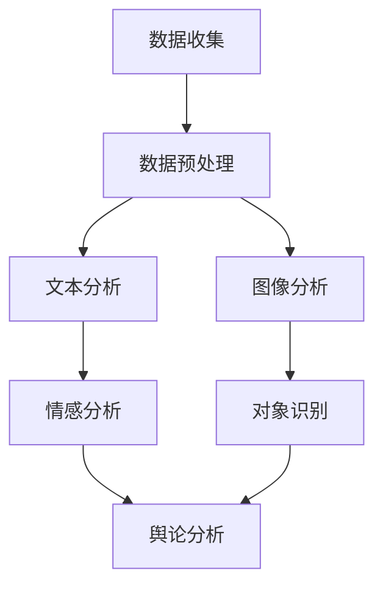

                 

### 1.1 数字时代概览

**背景介绍**

随着互联网的普及和智能手机的广泛应用，我们正逐步进入一个全新的数字时代。这个时代以数据为中心，以算法为驱动力，改变了人们的沟通方式、生活方式乃至工作模式。在这个背景下，社交媒体作为一种新兴的沟通工具，迅速崛起，并深刻影响着社会的各个方面。

**社交媒体的崛起**

社交媒体的崛起是数字时代的重要标志之一。它不仅仅是人们日常交流的工具，更是信息传播、舆论形成的重要平台。从 Facebook、Twitter 到 Instagram、微信，社交媒体的多样性为用户提供了丰富的选择，同时也为各种社会活动提供了广阔的舞台。

**民主参与的演变**

在传统社会中，民主参与往往依赖于传统媒体和公共集会。然而，数字时代的到来改变了这一现状。社交媒体的出现使得民主参与变得更加便捷、高效。人们可以通过点赞、评论、转发等方式，参与到公共事务的讨论中，甚至在某些情况下，直接影响政策的制定。

### 关键点

- 数字时代的特征：互联网普及、数据驱动力、算法应用。
- 社交媒体的崛起：信息传播、舆论形成。
- 民主参与的演变：从传统媒体到社交媒体。

**问题背景**

在数字时代，社交媒体的角色不仅仅局限于个人交流，它已经成为政治参与的重要渠道。人们通过社交媒体表达政治观点、参与公共讨论、甚至是推动政治变革。然而，社交媒体的快速发展和广泛应用也带来了一系列问题和挑战。

**问题描述**

社交媒体对政治的影响表现在多个方面，包括但不限于：

- 政治信息的传播与误解。
- 政治参与的便捷性与泡沫化。
- 政治运动的组织与动员。
- 政府透明度与社会监督。

这些问题和挑战需要我们深入探讨，以更好地理解数字时代下社交媒体对政治的深远影响。

**问题解决**

解决社交媒体对政治的影响问题，需要从以下几个方面入手：

- 加强社交媒体信息的真实性审核和监管。
- 提高公众的媒介素养和批判性思维能力。
- 优化社交媒体平台的设计，促进健康、积极的讨论氛围。
- 强化政府与社会组织的互动，提高公共事务的透明度和参与度。

**边界与外延**

- 社交媒体影响的政治范围：从选举到政策制定，再到社会运动。
- 社交媒体影响的深度：信息传播、公共讨论、社会变革。
- 社交媒体影响的可持续性：长期影响与短期效应。

**概念结构与核心要素组成**

- **数字时代**：以数据为中心，以算法为驱动力，改变沟通、生活方式和工作模式的时代。
- **社交媒体**：一种新兴的沟通工具，信息传播、舆论形成的重要平台。
- **民主参与**：公众参与政治事务，表达观点、提出建议、投票等行为。

### 1.2 民主参与的核心概念

**民主参与的定义**

民主参与是指公众通过各种形式参与到政治、社会事务中，以表达观点、提出建议、监督政府等行为。民主参与是现代民主制度的重要组成部分，它确保了政府的合法性和公众的权益。

**民主参与的形式**

民主参与的形式多样，包括但不限于：

- **选举**：通过投票选举代表，参与决策过程。
- **公共讨论**：通过社交媒体、集会等形式，表达观点和讨论公共事务。
- **公共提案**：通过提议或建议，影响政策的制定。
- **社会运动**：通过组织活动，推动社会变革。

**民主参与的价值**

民主参与的价值体现在多个方面：

- **政治价值**：确保政府的合法性和民主性，提高政府的决策质量和透明度。
- **社会价值**：促进公众参与社会事务，增强社会的凝聚力和认同感。
- **个人价值**：提高公众的政治素养，培养批判性思维能力和公民意识。

### 关键点

- **民主参与的定义**：公众参与政治事务的行为。
- **民主参与的形式**：选举、公共讨论、公共提案、社会运动。
- **民主参与的价值**：政治价值、社会价值、个人价值。

### 1.3 社交媒体与政治互动

**社交媒体的特性**

社交媒体具有以下特性：

- **互动性**：用户可以随时发布、评论、点赞，与其他用户进行互动。
- **开放性**：信息传播范围广泛，任何人都可以访问和分享。
- **即时性**：信息传播速度快，可以实时更新。
- **多样性**：平台多样化，满足不同用户的需求。

**社交媒体对政治参与的影响**

社交媒体对政治参与的影响表现在以下几个方面：

- **信息传播**：社交媒体成为政治信息传播的重要渠道，用户可以通过点赞、评论、转发等方式，迅速传播政治信息。
- **舆论形成**：社交媒体上的公共讨论可以影响舆论的形成，甚至引导公众的观点。
- **政治动员**：社交媒体可以组织政治活动，动员公众参与政治事务。
- **透明度提高**：政府可以通过社交媒体发布信息，提高公共事务的透明度。

**社交媒体与传统政治参与方式的比较**

| 特性            | 社交媒体               | 传统政治参与方式            |
| ---------------- | ---------------------- | --------------------------- |
| 互动性          | 高互动性，实时互动     | 低互动性，非实时互动         |
| 开放性          | 广泛开放，信息传播范围广 | 受限开放，信息传播范围小     |
| 即时性          | 信息传播速度快         | 信息传播速度慢               |
| 多样性          | 平台多样化，满足不同需求 | 平台受限，功能单一           |

### 关键点

- **社交媒体的特性**：互动性、开放性、即时性、多样性。
- **社交媒体对政治参与的影响**：信息传播、舆论形成、政治动员、透明度提高。
- **社交媒体与传统政治参与方式的比较**。

### 1.4 社交媒体分析的基本算法

**社交媒体数据分析方法**

社交媒体数据分析主要包括以下几个方面：

- **用户行为分析**：分析用户在社交媒体上的行为，如发布内容、评论、点赞等。
- **内容分析**：分析社交媒体上发布的内容，包括文本、图片、视频等。
- **社交网络分析**：分析用户之间的关系，构建社交网络图，研究信息传播路径。
- **情绪分析**：分析社交媒体上的情绪表达，了解公众情绪和态度。

**社交媒体分析算法简介**

社交媒体分析算法主要包括以下几种：

- **文本分析算法**：用于分析文本内容的情感、主题、关键词等。
- **图像分析算法**：用于识别图像中的对象、场景、情感等。
- **社交网络分析算法**：用于分析社交网络的结构、传播路径、社区划分等。
- **机器学习算法**：用于预测用户行为、分类文本、构建社交网络等。

**算法流程图展示（使用 Mermaid）**

### 关键点

- **社交媒体数据分析方法**：用户行为分析、内容分析、社交网络分析、情绪分析。
- **社交媒体分析算法简介**：文本分析算法、图像分析算法、社交网络分析算法、机器学习算法。
- **算法流程图**：数据收集、数据预处理、文本分析、图像分析、情感分析、舆论分析、对象识别。

### 1.5 数学模型与公式讲解

**社交媒体分析中的基本模型**

社交媒体分析中常用的基本模型包括：

- **用户行为模型**：用于预测用户的行为，如点赞、评论、转发等。
- **内容传播模型**：用于模拟信息在社交网络中的传播过程。
- **情绪传播模型**：用于分析情绪在社交网络中的传播规律。

**模型公式及解释**

以下是几个常见的数学模型和公式：

1. **用户行为模型**

   $$ P(B|A) = \frac{P(A|B) \cdot P(B)}{P(A)} $$

   这个公式表示在给定用户行为 B 的情况下，某个事件 A 发生的条件概率。它可以帮助预测用户可能的行为。

2. **内容传播模型**

   $$ I = \frac{1}{n} \sum_{i=1}^{n} \ln (1 + p_i) $$

   这个公式表示信息传播的强度，其中 p_i 是用户 i 的信息传播概率，n 是用户总数。它可以帮助我们了解信息在社交网络中的传播情况。

3. **情绪传播模型**

   $$ E(t) = \frac{1}{N} \sum_{i=1}^{N} e_i(t) $$

   这个公式表示在时间 t 时，社交网络中的平均情绪，其中 e_i(t) 是用户 i 在时间 t 时的情绪值，N 是用户总数。它可以帮助我们了解社交网络中的情绪状态。

**LaTeX 格式示例（$$1+1=2$$）**

- 独立段落中的公式：$$1+1=2$$
- 段落内公式：$1<2$

### 关键点

- **社交媒体分析中的基本模型**：用户行为模型、内容传播模型、情绪传播模型。
- **模型公式及解释**：用户行为模型公式、内容传播模型公式、情绪传播模型公式。
- **LaTeX 格式示例**：独立段落中的公式和段落内公式。

### 1.6 本章小结

本章首先介绍了数字时代的背景，以及社交媒体在政治参与中的角色和重要性。接着，我们探讨了民主参与的核心概念，包括定义、形式和价值。随后，我们分析了社交媒体与政治互动的特性、影响和与传统政治参与方式的比较。最后，我们介绍了社交媒体分析的基本算法，包括文本分析、图像分析和社交网络分析等。通过本章的讨论，我们可以更好地理解数字时代下社交媒体对政治的深远影响，为后续章节的深入探讨打下基础。|>

