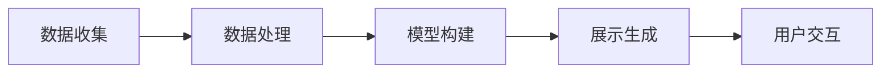
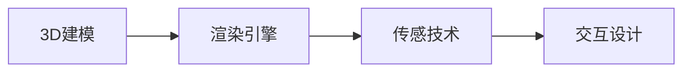
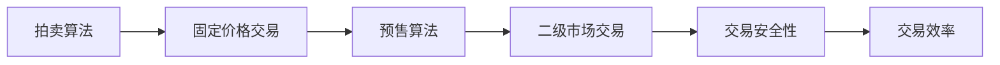
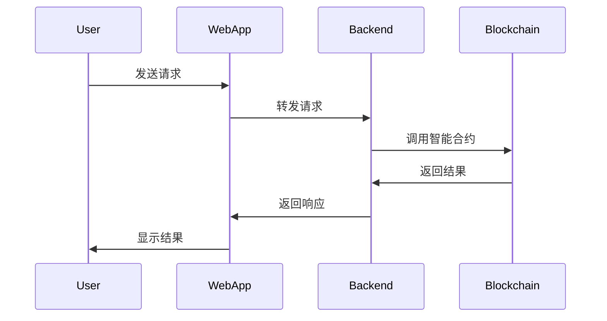
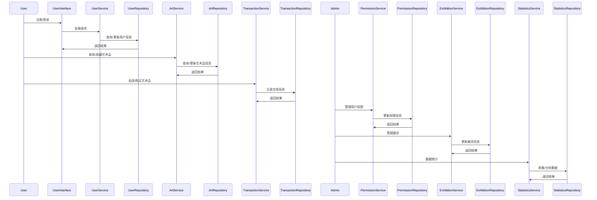

                 

### 引言

#### 数字时代的虚拟美术馆：NFT艺术品的全球展示平台

**关键词**：NFT艺术品、虚拟美术馆、全球展示、数字时代

**摘要**：本文深入探讨了数字时代背景下，NFT艺术品的兴起及其对传统美术馆的挑战。通过分析虚拟美术馆的概念、技术基础和运营策略，本文提出了一个创新的全球展示平台，以应对NFT艺术品市场的快速增长。文章还探讨了NFT艺术品与虚拟美术馆之间的联系，以及两者的互补性。通过详细的系统分析与架构设计，本文旨在为构建一个高效、安全的虚拟美术馆提供实践指导。

#### 1.1 问题背景

##### 1.1.1 NFT艺术品的兴起与全球展示平台的必要性

随着区块链技术的快速发展，非同质化代币（NFT，Non-Fungible Tokens）逐渐成为数字艺术领域的新宠。NFT艺术品通过区块链技术确保了数字作品的唯一性和不可篡改性，为艺术品的数字化收藏和交易提供了全新的解决方案。与传统艺术品相比，NFT艺术品具有去中心化、透明、可验证和可追踪等优势，极大地改变了艺术品市场。

然而，NFT艺术品的快速兴起也带来了新的挑战。首先，传统的实体美术馆在展示NFT艺术品时面临诸多限制，例如展示环境的搭建、设备维护和信息安全等问题。其次，全球艺术爱好者和收藏家希望随时随地欣赏和购买NFT艺术品，这要求建立一个全球性的、方便快捷的展示平台。

##### 1.1.2 传统美术馆面临的挑战

传统美术馆在应对NFT艺术品展示时面临以下几方面的挑战：

1. **技术限制**：实体美术馆缺乏展示数字艺术品的必要技术手段，如虚拟现实（VR）和增强现实（AR）设备。
2. **展示方式**：传统的静态展示方式难以充分展示NFT艺术品的互动性和动态性。
3. **信息安全**：实体美术馆需要确保NFT艺术品和用户数据的安全，这增加了运营成本和管理难度。
4. **地理限制**：实体美术馆受地域限制，无法覆盖全球用户。

因此，建立一个数字时代的虚拟美术馆，成为解决这些挑战的有效途径。

#### 1.2 问题描述

##### 1.2.1 NFT艺术品的特性

NFT艺术品具有以下几个核心特性：

1. **唯一性**：每个NFT艺术品都是独一无二的，不可替代。
2. **不可篡改性**：NFT艺术品的信息被永久记录在区块链上，无法篡改。
3. **透明性**：NFT艺术品的交易信息、所有权等都可以通过区块链进行验证，具有高度透明性。
4. **可追溯性**：NFT艺术品的所有权和交易记录都可以追溯，有助于确保其真实性和价值。

##### 1.2.2 虚拟美术馆的需求

虚拟美术馆的需求主要体现在以下几个方面：

1. **展示灵活性**：虚拟美术馆可以运用VR和AR技术，提供更加生动、互动的展示体验。
2. **全球覆盖**：虚拟美术馆不受地域限制，可以覆盖全球用户。
3. **信息安全**：虚拟美术馆通过区块链技术确保艺术品和用户数据的安全。
4. **便捷交易**：虚拟美术馆可以提供便捷的NFT艺术品交易服务，降低交易成本。

##### 1.3 问题解决

##### 1.3.1 虚拟美术馆的概念

虚拟美术馆是指利用计算机技术（如VR、AR、人工智能等）创建的数字展示空间，用于展示、收藏和交易NFT艺术品。虚拟美术馆具有以下几个特点：

1. **数字化展示**：通过VR和AR技术，将NFT艺术品以数字化形式呈现，提供更加生动、互动的展示体验。
2. **全球覆盖**：不受地理限制，可以覆盖全球用户。
3. **高度安全**：利用区块链技术确保NFT艺术品和用户数据的安全。
4. **便捷交易**：提供便捷的NFT艺术品交易服务，降低交易成本。

##### 1.3.2 NFT艺术品在全球展示的应用

虚拟美术馆的应用主要包括以下几个方面：

1. **艺术展览**：举办线上艺术展览，展示NFT艺术品。
2. **艺术品收藏**：提供线上艺术品收藏功能，用户可以收藏自己喜欢的NFT艺术品。
3. **艺术品交易**：提供线上艺术品交易服务，用户可以购买和出售NFT艺术品。
4. **跨界合作**：与其他领域（如游戏、影视等）进行跨界合作，创造更多可能。

##### 1.4 边界与外延

##### 1.4.1 虚拟美术馆的技术基础

虚拟美术馆的技术基础主要包括以下几个方面：

1. **区块链技术**：确保NFT艺术品的唯一性、不可篡改性和透明性。
2. **虚拟现实（VR）技术**：提供沉浸式的数字化展示体验。
3. **增强现实（AR）技术**：将NFT艺术品与实体环境相结合，创造丰富的交互体验。
4. **人工智能（AI）技术**：用于推荐系统、智能合约等。

##### 1.4.2 NFT艺术品市场的法律与伦理问题

NFT艺术品市场的法律与伦理问题主要包括以下几个方面：

1. **版权问题**：确保NFT艺术品创作者的合法权益。
2. **隐私保护**：保护用户数据和隐私。
3. **欺诈防范**：防止虚假NFT艺术品和欺诈行为。
4. **市场规范**：建立健全的市场监管机制。

##### 1.5 概念结构与核心要素组成

##### 1.5.1 NFT艺术品的核心要素

NFT艺术品的核心要素主要包括以下几个方面：

1. **数字内容**：NFT艺术品所代表的数字内容，如图像、音频、视频等。
2. **唯一标识**：NFT艺术品在区块链上的唯一标识，确保其唯一性和不可篡改性。
3. **交易记录**：NFT艺术品的交易记录，记录所有权的转移。
4. **创作者信息**：NFT艺术品的创作者信息，包括姓名、联系方式等。

##### 1.5.2 虚拟美术馆的构建要素

虚拟美术馆的构建要素主要包括以下几个方面：

1. **展示技术**：VR、AR等数字化展示技术。
2. **区块链平台**：用于确保NFT艺术品的安全性和透明性。
3. **交易系统**：提供NFT艺术品的交易功能。
4. **用户系统**：管理用户信息，提供个性化推荐等。

##### 1.5.3 技术实现与市场运营策略

虚拟美术馆的技术实现主要包括以下几个方面：

1. **前端开发**：构建用户界面，提供良好的用户体验。
2. **后端开发**：开发服务器端逻辑，处理交易、用户管理等。
3. **区块链集成**：将区块链技术与虚拟美术馆系统集成，确保NFT艺术品的安全性和透明性。
4. **智能合约**：使用智能合约自动化NFT艺术品的交易和管理。

市场运营策略主要包括以下几个方面：

1. **市场推广**：通过线上线下渠道推广虚拟美术馆，吸引更多的用户和收藏家。
2. **合作伙伴**：与其他艺术品市场、画廊等建立合作伙伴关系，共同推广NFT艺术品。
3. **社区建设**：建立虚拟美术馆社区，促进用户互动和艺术交流。
4. **服务创新**：不断优化虚拟美术馆的功能和服务，提高用户满意度。

### 1.6 小结

本文介绍了数字时代下NFT艺术品的兴起和传统美术馆面临的挑战，提出了虚拟美术馆的概念及其在全球展示平台中的应用。通过分析NFT艺术品的核心要素和虚拟美术馆的构建要素，本文探讨了技术实现和市场运营策略。接下来，本文将深入探讨NFT艺术品和虚拟美术馆之间的核心概念和联系，进一步揭示两者的互补性。

### 第二部分：核心概念与联系

#### 2.1 NFT艺术品的核心概念

NFT（Non-Fungible Token，非同质化代币）是近年来在区块链领域迅速崛起的一个重要概念。与传统加密货币（如比特币、以太坊等）不同，NFT具有独特的唯一性和不可替代性。这种特性使得NFT在数字艺术、游戏、收藏品等领域得到了广泛应用。

##### 2.1.1 非同质化代币（NFT）

非同质化代币（NFT）是一种基于区块链技术的数字资产，用于表示唯一、不可替代的物品。每个NFT都具有独特的标识符，确保其唯一性和不可篡改性。与传统数字货币相比，NFT无法相互替换，就像艺术品中的独特作品一样。

NFT的核心特性包括：

1. **唯一性**：每个NFT都是独一无二的，无法与其他NFT相互替换。
2. **不可篡改性**：NFT的信息被永久记录在区块链上，无法篡改。
3. **透明性**：NFT的交易信息、所有权等都可以通过区块链进行验证，具有高度透明性。
4. **可追溯性**：NFT的所有权和交易记录都可以追溯，有助于确保其真实性和价值。

##### 2.1.2 数字艺术与NFT的关系

数字艺术与NFT之间有着密切的联系。随着数字技术的发展，越来越多的艺术家选择使用数字形式创作艺术作品。这些数字作品不仅具有独特的艺术价值，还可以通过NFT进行数字化收藏和交易。

NFT为数字艺术带来了以下几个重要影响：

1. **所有权证明**：NFT提供了数字艺术作品的所有权证明，确保创作者和收藏家的权益。
2. **版权保护**：通过区块链技术，NFT可以有效防止数字艺术的盗版和抄袭。
3. **市场拓展**：NFT为数字艺术市场带来了新的机遇，使得艺术品可以更加便捷地进行展示、交易和收藏。
4. **互动体验**：NFT可以与虚拟现实（VR）和增强现实（AR）技术结合，提供更加丰富的互动体验。

##### 2.1.3 NFT艺术品的唯一性与稀缺性

NFT艺术品的唯一性和稀缺性是其核心价值所在。每个NFT艺术品都是独一无二的，这决定了其在市场上的独特地位。此外，NFT艺术品的稀缺性也增加了其市场价值。在传统的艺术品市场中，稀缺性是影响艺术品价值的重要因素。同样地，在NFT艺术品市场中，稀缺性也成为了决定艺术品价值的关键因素。

NFT艺术品的唯一性和稀缺性具有以下几个特点：

1. **独特性**：每个NFT艺术品都是创作者独一无二的创作，无法复制或替换。
2. **限量发行**：NFT艺术品通常有明确的限量发行数量，这使得其更加稀缺。
3. **市场炒作**：由于NFT艺术品的稀缺性，市场上的炒作行为也增加了其价值。
4. **价值波动**：NFT艺术品的市值受到市场供求关系的影响，表现出较大的波动性。

##### 2.2 虚拟美术馆的核心概念

虚拟美术馆是一种利用计算机技术（如虚拟现实、增强现实、人工智能等）创建的数字展示空间，用于展示、收藏和交易NFT艺术品。虚拟美术馆具有以下几个核心概念：

1. **数字化展示**：通过VR和AR技术，将NFT艺术品以数字化形式呈现，提供更加生动、互动的展示体验。
2. **全球覆盖**：虚拟美术馆不受地理限制，可以覆盖全球用户。
3. **信息安全**：通过区块链技术确保NFT艺术品和用户数据的安全。
4. **便捷交易**：提供便捷的NFT艺术品交易服务，降低交易成本。

##### 2.2.1 虚拟现实（VR）与增强现实（AR）

虚拟现实（VR，Virtual Reality）和增强现实（AR，Augmented Reality）是近年来迅速发展的计算机技术，为虚拟美术馆提供了强大的技术支持。

1. **虚拟现实（VR）**：VR技术通过创建一个完全虚拟的环境，使用户可以沉浸其中。在虚拟美术馆中，VR技术可以提供沉浸式的艺术体验，让用户仿佛置身于现实的艺术展览中。

2. **增强现实（AR）**：AR技术通过在现实环境中叠加虚拟元素，增强用户的感知体验。在虚拟美术馆中，AR技术可以用于展示NFT艺术品的交互式元素，如动画、声音等，为用户提供更加丰富的展示体验。

##### 2.2.2 虚拟美术馆的功能与特点

虚拟美术馆具有以下几个功能与特点：

1. **数字化艺术展览**：虚拟美术馆可以举办线上艺术展览，展示各种类型的NFT艺术品，包括绘画、雕塑、摄影、音乐等。
2. **艺术品收藏**：用户可以在虚拟美术馆中收藏自己喜欢的NFT艺术品，享受数字化的艺术品收藏体验。
3. **艺术品交易**：虚拟美术馆提供便捷的NFT艺术品交易服务，用户可以在线购买和出售NFT艺术品。
4. **艺术交流**：虚拟美术馆为艺术家、收藏家和爱好者提供了一个交流平台，促进艺术创作和艺术市场的繁荣。
5. **互动体验**：通过VR和AR技术，虚拟美术馆可以提供丰富的互动体验，如虚拟导览、互动展览等。

##### 2.2.3 虚拟美术馆的技术实现

虚拟美术馆的技术实现主要包括以下几个方面：

1. **前端开发**：构建用户界面，提供良好的用户体验。
2. **后端开发**：开发服务器端逻辑，处理交易、用户管理等。
3. **区块链集成**：将区块链技术与虚拟美术馆系统集成，确保NFT艺术品的安全性和透明性。
4. **智能合约**：使用智能合约自动化NFT艺术品的交易和管理。

##### 2.3 NFT艺术品与虚拟美术馆的联系

NFT艺术品与虚拟美术馆之间存在着紧密的联系。NFT艺术品为虚拟美术馆提供了核心的内容，而虚拟美术馆则为NFT艺术品提供了一个展示、收藏和交易的平台。

1. **内容来源**：虚拟美术馆的NFT艺术品主要来源于艺术家和创作者。艺术家可以通过NFT技术创作数字艺术品，并将其上传到虚拟美术馆进行展示和交易。
2. **展示与收藏**：虚拟美术馆通过VR和AR技术，将NFT艺术品以数字化形式展示给用户，用户可以在虚拟美术馆中欣赏和收藏NFT艺术品。
3. **交易与价值**：虚拟美术馆提供便捷的NFT艺术品交易服务，用户可以在虚拟美术馆中购买和出售NFT艺术品，这有助于提升NFT艺术品的市场价值。
4. **互动与体验**：虚拟美术馆通过VR和AR技术，为用户提供了丰富的互动体验，如虚拟导览、互动展览等，这进一步增强了NFT艺术品的吸引力和市场价值。

##### 2.3.1 NFT艺术品在虚拟美术馆的展示方式

在虚拟美术馆中，NFT艺术品可以通过以下几种方式展示：

1. **VR展览**：用户通过VR设备进入虚拟美术馆，欣赏NFT艺术品。VR展览提供了沉浸式的艺术体验，用户可以自由浏览、放大、缩小和旋转艺术品。
2. **AR展示**：用户通过AR设备将NFT艺术品叠加到现实环境中，欣赏和互动。AR展示将数字艺术品与现实环境相结合，为用户提供了全新的展示体验。
3. **线上画廊**：虚拟美术馆可以在线上画廊中展示NFT艺术品，用户可以通过网页或移动应用程序浏览和收藏艺术品。
4. **虚拟空间**：虚拟美术馆可以在虚拟空间中创建数字艺术馆，用户可以在虚拟空间中漫步，欣赏和互动NFT艺术品。

##### 2.3.2 虚拟美术馆对NFT艺术品市场的推动作用

虚拟美术馆对NFT艺术品市场具有以下推动作用：

1. **增加曝光度**：虚拟美术馆通过数字化展示和全球覆盖，为NFT艺术品提供了更多的曝光机会，有助于提升NFT艺术品的市场知名度。
2. **促进交易**：虚拟美术馆提供便捷的NFT艺术品交易服务，降低了交易成本，提高了交易效率，有助于推动NFT艺术品市场的繁荣。
3. **创新体验**：虚拟美术馆通过VR和AR技术，为用户提供了全新的艺术体验，增强了NFT艺术品的吸引力和市场价值。
4. **培养用户**：虚拟美术馆为用户提供了欣赏、收藏和交易NFT艺术品的平台，有助于培养用户的数字艺术品投资意识和消费习惯。

##### 2.3.3 跨界合作的可能性

虚拟美术馆与NFT艺术品市场的跨界合作具有巨大的潜力，以下是一些可能的跨界合作方向：

1. **与艺术品市场合作**：虚拟美术馆可以与实体艺术品市场合作，共同推广NFT艺术品。例如，虚拟美术馆可以举办线上艺术展览，实体艺术品市场可以提供线下展览。
2. **与游戏行业合作**：虚拟美术馆可以与游戏公司合作，将NFT艺术品作为游戏内的虚拟物品，提供独特的游戏体验。
3. **与影视行业合作**：虚拟美术馆可以与影视公司合作，将NFT艺术品融入电影、电视剧等影视作品，创造更多艺术价值。
4. **与时尚行业合作**：虚拟美术馆可以与时尚品牌合作，将NFT艺术品融入时尚产品，提升品牌价值和艺术性。

##### 2.4 概念属性特征对比表格

为了更清晰地展示NFT艺术品与实物艺术品、虚拟美术馆与实体美术馆的概念属性特征，我们制作了以下对比表格：

| 概念                | NFT艺术品                      | 实物艺术品                      | 虚拟美术馆                      | 实体美术馆                      |
|---------------------|--------------------------------|----------------------------------|----------------------------------|----------------------------------|
| 属性                | 唯一性、不可篡改性、透明性、可追溯性 | 物理形态、艺术性、稀缺性、市场价值 | 数字化展示、全球覆盖、信息安全、便捷交易 | 实体展示、艺术交流、场地限制、运营成本 |
| 特征                | 基于区块链技术                | 物理存在、手工制作、历史传承      | VR、AR、人工智能技术            | 地理位置固定、物理设施完善        |
| 主要功能            | 展示、收藏、交易              | 展示、收藏、交易                | 展示、收藏、交易、互动体验      | 展示、收藏、交易、艺术交流        |
| 推动作用            | 增加曝光度、促进交易、创新体验、培养用户 | 增强文化氛围、传承艺术价值、提升艺术品价值 | 增加曝光度、促进交易、创新体验、培养用户 | 增强文化氛围、传承艺术价值、提升艺术品价值 |
| 跨界合作方向        | 与艺术品市场合作、与游戏行业合作、与影视行业合作、与时尚行业合作 | 与艺术品市场合作、与游戏行业合作、与影视行业合作、与时尚行业合作 | 与艺术品市场合作、与游戏行业合作、与影视行业合作、与时尚行业合作 | 与艺术品市场合作、与游戏行业合作、与影视行业合作、与时尚行业合作 |

##### 2.5 ER实体关系图架构

为了更好地理解NFT艺术品与虚拟美术馆之间的实体关系，我们使用了Mermaid流程图来绘制ER（实体关系）图。

以下是NFT艺术品实体的关系图：

```mermaid
erDiagram
    NFT艺术品 ||--|{ 展示 }|-- 虚拟美术馆
    NFT艺术品 ||--|{ 收藏 }|-- 用户
    NFT艺术品 ||--|{ 交易 }|-- 交易系统
    用户 ||--|{ 浏览 }|-- 虚拟美术馆
    用户 ||--|{ 收藏 }|-- NFT艺术品
    用户 ||--|{ 交易 }|-- 交易系统
```

以下是虚拟美术馆实体的关系图：

```mermaid
erDiagram
    虚拟美术馆 ||--|{ 展示 }|-- NFT艺术品
    虚拟美术馆 ||--|{ 收藏 }|-- 用户
    虚拟美术馆 ||--|{ 交易 }|-- 交易系统
    用户 ||--|{ 浏览 }|-- 虚拟美术馆
    用户 ||--|{ 收藏 }|-- NFT艺术品
    用户 ||--|{ 交易 }|-- 交易系统
```

以下是NFT艺术品与虚拟美术馆关联的实体关系图：

```mermaid
erDiagram
    NFT艺术品 ||--|{ 展示 }|-- 虚拟美术馆
    NFT艺术品 ||--|{ 收藏 }|-- 用户
    NFT艺术品 ||--|{ 交易 }|-- 交易系统
    虚拟美术馆 ||--|{ 展示 }|-- NFT艺术品
    虚拟美术馆 ||--|{ 收藏 }|-- 用户
    虚拟美术馆 ||--|{ 交易 }|-- 交易系统
    用户 ||--|{ 浏览 }|-- 虚拟美术馆
    用户 ||--|{ 收藏 }|-- NFT艺术品
    用户 ||--|{ 交易 }|-- 交易系统
```

通过这些ER实体关系图，我们可以清晰地看到NFT艺术品与虚拟美术馆之间的关联，以及它们与用户和交易系统之间的互动关系。

### 第三部分：算法原理讲解

#### 3.1 NFT艺术品展示算法

##### 3.1.1 展示算法的基本概念

NFT艺术品展示算法是指用于在虚拟美术馆中展示NFT艺术品的一系列方法和技术。这些算法旨在为用户提供高质量的展示体验，确保NFT艺术品在虚拟环境中的真实性、互动性和美观性。

##### 3.1.2 展示算法的流程

NFT艺术品展示算法的基本流程可以分为以下几个步骤：

1. **数据收集**：从区块链或NFT交易平台获取NFT艺术品的元数据，包括数字内容、唯一标识、创作者信息等。
2. **数据处理**：对收集到的数据进行处理，包括数据清洗、格式转换等，以确保数据的准确性和一致性。
3. **模型构建**：根据NFT艺术品的特性，构建展示模型，包括图像渲染、3D建模、动画制作等。
4. **展示生成**：根据展示模型，生成NFT艺术品的展示内容，包括图像、视频、交互元素等。
5. **用户交互**：通过前端界面，提供用户交互功能，包括浏览、收藏、交易等。

##### 3.1.3 展示算法的优化策略

为了提高NFT艺术品展示算法的性能和用户体验，可以采取以下优化策略：

1. **数据缓存**：缓存常用的NFT艺术品元数据，减少网络请求和数据处理时间。
2. **模型压缩**：对展示模型进行压缩，减小数据存储和传输的大小。
3. **并行处理**：利用多线程或多进程技术，加快数据处理和展示生成速度。
4. **动态调整**：根据用户行为和展示环境动态调整展示效果，提供个性化的展示体验。

#### 3.2 虚拟现实与增强现实算法

##### 3.2.1 VR/AR算法的基本原理

虚拟现实（VR，Virtual Reality）和增强现实（AR，Augmented Reality）算法是基于计算机图形学和计算机视觉技术实现的。这些算法的核心原理如下：

1. **3D建模**：通过3D建模技术，创建虚拟环境或增强现实场景。
2. **渲染引擎**：使用渲染引擎（如Unity、Unreal Engine等）实现3D场景的渲染和显示。
3. **传感技术**：利用传感设备（如VR头盔、AR眼镜、摄像头等）捕捉用户行为和环境信息。
4. **交互设计**：设计用户交互方式，包括手势、语音、触控等，实现用户与虚拟环境或增强现实场景的交互。

##### 3.2.2 VR/AR算法的适用场景

VR/AR算法适用于以下场景：

1. **艺术展览**：通过VR/AR技术，为用户创造沉浸式的艺术体验。
2. **虚拟博物馆**：利用VR/AR技术，展示博物馆中的文物和艺术品。
3. **教育培训**：通过VR/AR技术，提供沉浸式教学体验。
4. **医疗健康**：利用VR/AR技术，进行手术模拟、康复训练等。
5. **游戏娱乐**：通过VR/AR技术，创造更加丰富的游戏体验。

##### 3.2.3 VR/AR算法的性能评估

VR/AR算法的性能评估主要包括以下几个方面：

1. **渲染性能**：评估渲染引擎的渲染速度和渲染质量。
2. **交互性能**：评估用户交互的响应速度和准确性。
3. **稳定性能**：评估VR/AR设备的稳定性和可靠性。
4. **用户体验**：评估用户对VR/AR算法的满意度，包括沉浸感、交互性、美观性等。

#### 3.3 NFT艺术品交易算法

##### 3.3.1 交易算法的类型

NFT艺术品交易算法主要包括以下类型：

1. **拍卖算法**：通过竞价的方式，实现NFT艺术品的交易。
2. **固定价格交易**：用户可以以固定价格购买NFT艺术品。
3. **预售算法**：在NFT艺术品正式发布前，允许用户以较低价格购买。
4. **二级市场交易**：用户可以在二级市场上购买和出售已经发布的NFT艺术品。

##### 3.3.2 交易算法的安全性问题

NFT艺术品交易算法的安全性主要包括以下几个方面：

1. **防欺诈**：确保交易过程中防止欺诈行为，如虚假NFT艺术品和恶意交易。
2. **身份验证**：确保交易双方的身份真实性，防止盗用身份进行交易。
3. **隐私保护**：保护用户交易信息和个人隐私。
4. **数据加密**：使用加密技术保护交易数据的安全性和完整性。

##### 3.3.3 交易算法的效率提升

为了提高NFT艺术品交易算法的效率，可以采取以下措施：

1. **并发处理**：利用多线程或多进程技术，实现并发处理，提高交易速度。
2. **区块链优化**：优化区块链的共识算法和交易处理速度，提高交易效率。
3. **数据缓存**：缓存常用交易数据，减少数据查询和传输时间。
4. **智能合约优化**：优化智能合约的代码和执行效率，提高交易处理速度。

##### 3.4 算法原理的mermaid流程图

为了更好地理解NFT艺术品展示、VR/AR和交易算法的原理，我们使用mermaid流程图来展示这些算法的流程。

以下是NFT艺术品展示算法的mermaid流程图：



以下是VR/AR算法的mermaid流程图：



以下是NFT艺术品交易算法的mermaid流程图：



通过这些mermaid流程图，我们可以清晰地看到NFT艺术品展示、VR/AR和交易算法的原理和流程。

### 第四部分：数学模型和数学公式

#### 4.1 NFT艺术品的价值模型

NFT艺术品的价值模型是用于评估NFT艺术品市场价值的数学模型。它可以帮助我们理解NFT艺术品的价值驱动因素，并预测其市场表现。

##### 4.1.1 基本假设

在构建NFT艺术品的价值模型时，我们假设以下基本条件：

1. **市场需求**：NFT艺术品的市场需求稳定，且受市场情绪、艺术品品质和流行趋势的影响。
2. **供应量**：NFT艺术品的供应量相对稳定，不会受到大规模市场波动的影响。
3. **交易频率**：NFT艺术品的交易频率较高，市场流动性良好。
4. **交易价格**：NFT艺术品的交易价格受供需关系、市场情绪和其他外部因素的影响。

##### 4.1.2 价值模型构建

NFT艺术品的价值模型可以采用以下公式表示：

\[ V = f(M, Q, T, E) \]

其中：

- \( V \)：NFT艺术品的市场价值。
- \( M \)：市场需求，表示市场对NFT艺术品的关注度。
- \( Q \)：供应量，表示市场上可交易的NFT艺术品数量。
- \( T \)：交易频率，表示NFT艺术品的交易活跃度。
- \( E \)：其他外部因素，包括艺术品品质、艺术家声誉、市场趋势等。

价值模型的构建步骤如下：

1. **确定市场需求**：通过分析市场数据，确定市场对NFT艺术品的关注度。可以使用以下公式表示市场需求：

\[ M = f(Popularity, SocialMedia, MediaCoverage) \]

其中：

- \( Popularity \)：NFT艺术品在社交媒体上的关注度。
- \( SocialMedia \)：社交媒体平台上的讨论量、转发量和点赞量。
- \( MediaCoverage \)：NFT艺术品在媒体报道中的曝光度。

2. **确定供应量**：通过分析市场上可交易的NFT艺术品数量，确定供应量。可以使用以下公式表示供应量：

\[ Q = f(InflationRate, Mintage) \]

其中：

- \( InflationRate \)：NFT艺术品市场的通货膨胀率。
- \( Mintage \)：NFT艺术品的限量发行数量。

3. **确定交易频率**：通过分析NFT艺术品的交易活跃度，确定交易频率。可以使用以下公式表示交易频率：

\[ T = f(TradingVolume, TradingFrequency) \]

其中：

- \( TradingVolume \)：NFT艺术品的市场交易量。
- \( TradingFrequency \)：NFT艺术品的市场交易频率。

4. **确定其他外部因素**：综合考虑NFT艺术品的品质、艺术家声誉、市场趋势等因素，确定其他外部因素。可以使用以下公式表示：

\[ E = f(ArtQuality, ArtistReputation, MarketTrend) \]

其中：

- \( ArtQuality \)：NFT艺术品的品质。
- \( ArtistReputation \)：艺术家的声誉。
- \( MarketTrend \)：市场趋势。

##### 4.1.3 价值模型的应用

价值模型可以应用于以下场景：

1. **艺术品估值**：根据市场需求、供应量、交易频率和其他外部因素，对NFT艺术品进行估值。
2. **艺术品投资**：根据价值模型，分析NFT艺术品的市场价值，进行投资决策。
3. **艺术品交易**：根据价值模型，确定交易价格，确保交易双方的利益。

#### 4.2 虚拟现实与增强现实的数学模型

虚拟现实（VR，Virtual Reality）和增强现实（AR，Augmented Reality）的数学模型是用于描述虚拟环境和现实环境之间交互的数学工具。这些模型包括3D建模、渲染、传感和交互等方面。

##### 4.2.1 VR/AR基本数学模型

VR/AR基本数学模型包括以下部分：

1. **坐标系转换**：用于将虚拟坐标转换为现实坐标，实现虚拟环境与现实环境的融合。可以使用以下公式表示：

\[ X_{real} = X_{virtual} \times S \times R \]

其中：

- \( X_{real} \)：现实坐标。
- \( X_{virtual} \)：虚拟坐标。
- \( S \)：缩放因子。
- \( R \)：旋转矩阵。

2. **深度感知**：用于感知虚拟环境中的深度信息，实现立体显示。可以使用以下公式表示：

\[ Z = Z_{virtual} + Z_{real} \]

其中：

- \( Z \)：深度信息。
- \( Z_{virtual} \)：虚拟深度信息。
- \( Z_{real} \)：现实深度信息。

3. **光照模型**：用于描述虚拟环境中的光照效果，实现逼真的视觉效果。可以使用以下公式表示：

\[ I = I_{0} + \sum_{i=1}^{n} (L_{i} \times N_{i}) \]

其中：

- \( I \)：光照强度。
- \( I_{0} \)：初始光照强度。
- \( L_{i} \)：光源强度。
- \( N_{i} \)：物体表面法线。

##### 4.2.2 VR/AR算法的数学公式

VR/AR算法的数学公式包括以下部分：

1. **视觉感知**：用于实现虚拟环境的视觉感知，包括图像处理、特征提取和目标识别等。可以使用以下公式表示：

\[ F(x, y) = G(x, y) \times H(x, y) \]

其中：

- \( F(x, y) \)：视觉感知结果。
- \( G(x, y) \)：图像处理结果。
- \( H(x, y) \)：特征提取结果。

2. **运动跟踪**：用于跟踪虚拟环境中的运动物体，包括物体识别、运动估计和轨迹预测等。可以使用以下公式表示：

\[ T(t) = T_{0} + \sum_{i=1}^{n} (v_{i} \times t_{i}) \]

其中：

- \( T(t) \)：运动轨迹。
- \( T_{0} \)：初始位置。
- \( v_{i} \)：运动速度。
- \( t_{i} \)：时间。

3. **交互设计**：用于实现虚拟环境中的用户交互，包括手势识别、语音识别和触控等。可以使用以下公式表示：

\[ I = \sum_{i=1}^{n} (R_{i} \times S_{i}) \]

其中：

- \( I \)：交互结果。
- \( R_{i} \)：交互行为。
- \( S_{i} \)：交互强度。

##### 4.2.3 VR/AR算法的数学分析

VR/AR算法的数学分析主要包括以下方面：

1. **算法性能分析**：分析VR/AR算法的渲染性能、交互性能和稳定性能等。
2. **算法优化**：通过数学优化方法，提高VR/AR算法的效率和质量。
3. **算法应用**：分析VR/AR算法在不同应用场景中的效果和适用性。

#### 4.3 NFT艺术品交易模型

NFT艺术品交易模型是用于描述NFT艺术品市场交易行为的数学模型。它可以帮助我们理解NFT艺术品交易市场的运行机制和影响因素。

##### 4.3.1 交易模型的基本概念

NFT艺术品交易模型包括以下基本概念：

1. **交易量**：NFT艺术品的交易量，表示一定时间内NFT艺术品的交易次数。
2. **交易价格**：NFT艺术品的交易价格，表示NFT艺术品在市场上的价格水平。
3. **交易成本**：NFT艺术品交易的成本，包括交易手续费、网络费用等。
4. **市场流动性**：NFT艺术品市场的流动性，表示NFT艺术品在市场上的交易活跃度。

##### 4.3.2 交易模型的数学公式

NFT艺术品交易模型可以采用以下公式表示：

\[ V = f(Q, P, C, L) \]

其中：

- \( V \)：NFT艺术品的市场价值。
- \( Q \)：交易量。
- \( P \)：交易价格。
- \( C \)：交易成本。
- \( L \)：市场流动性。

交易模型的构建步骤如下：

1. **确定交易量**：通过分析市场数据，确定NFT艺术品的交易量。可以使用以下公式表示：

\[ Q = f(TradingVolume, TradingFrequency) \]

其中：

- \( TradingVolume \)：NFT艺术品的市场交易量。
- \( TradingFrequency \)：NFT艺术品的市场交易频率。

2. **确定交易价格**：通过分析市场数据，确定NFT艺术品的交易价格。可以使用以下公式表示：

\[ P = f(MarketPrice, PriceTrend) \]

其中：

- \( MarketPrice \)：NFT艺术品的市场价格。
- \( PriceTrend \)：NFT艺术品的价格趋势。

3. **确定交易成本**：通过分析市场数据，确定NFT艺术品的交易成本。可以使用以下公式表示：

\[ C = f(TradingFees, NetworkFees) \]

其中：

- \( TradingFees \)：交易手续费。
- \( NetworkFees \)：网络费用。

4. **确定市场流动性**：通过分析市场数据，确定NFT艺术品的市场流动性。可以使用以下公式表示：

\[ L = f(Liquidity, MarketDepth) \]

其中：

- \( Liquidity \)：市场流动性。
- \( MarketDepth \)：市场深度。

##### 4.3.3 交易模型的策略分析

交易模型可以应用于以下策略分析：

1. **投资策略**：根据交易模型，分析NFT艺术品的市场价值，制定投资策略。
2. **交易策略**：根据交易模型，确定交易量、交易价格和交易成本等参数，制定交易策略。
3. **风险管理**：根据交易模型，评估NFT艺术品交易的风险，制定风险管理策略。

#### 4.4 数学公式示例

##### 4.4.1 价值模型中的数学公式示例

在NFT艺术品的价值模型中，我们可以使用以下数学公式：

\[ V = f(M, Q, T, E) \]

其中：

- \( M = f(Popularity, SocialMedia, MediaCoverage) \)
- \( Q = f(InflationRate, Mintage) \)
- \( T = f(TradingVolume, TradingFrequency) \)
- \( E = f(ArtQuality, ArtistReputation, MarketTrend) \)

这些公式描述了NFT艺术品的价值取决于市场需求、供应量、交易频率和其他外部因素。

##### 4.4.2 VR/AR算法中的数学公式示例

在VR/AR算法中，我们可以使用以下数学公式：

- 坐标系转换：

\[ X_{real} = X_{virtual} \times S \times R \]

- 深度感知：

\[ Z = Z_{virtual} + Z_{real} \]

- 光照模型：

\[ I = I_{0} + \sum_{i=1}^{n} (L_{i} \times N_{i}) \]

这些公式描述了虚拟环境与现实环境之间的交互和渲染过程。

##### 4.4.3 交易模型中的数学公式示例

在NFT艺术品交易模型中，我们可以使用以下数学公式：

\[ V = f(Q, P, C, L) \]

其中：

- \( Q = f(TradingVolume, TradingFrequency) \)
- \( P = f(MarketPrice, PriceTrend) \)
- \( C = f(TradingFees, NetworkFees) \)
- \( L = f(Liquidity, MarketDepth) \)

这些公式描述了NFT艺术品交易市场的运行机制和影响因素。

### 第五部分：系统分析与架构设计方案

#### 5.1 问题场景介绍

##### 5.1.1 虚拟美术馆的需求分析

虚拟美术馆作为一个数字时代的创新展示平台，其需求可以从以下几个方面进行分析：

1. **展示需求**：虚拟美术馆需要具备展示NFT艺术品的能力，包括图像、音频、视频等多种艺术形式。同时，展示效果要逼真、互动性强，能够吸引用户的注意力。

2. **收藏需求**：用户需要在虚拟美术馆中收藏自己喜欢的NFT艺术品，这要求系统提供便捷的收藏和管理功能，支持用户随时查看和调整自己的收藏列表。

3. **交易需求**：虚拟美术馆应提供NFT艺术品的交易服务，包括拍卖、固定价格交易、预售等模式，同时确保交易过程的安全性和便捷性。

4. **安全需求**：由于NFT艺术品的价值较高，系统需要提供严格的安全措施，包括数据加密、权限控制、防欺诈等，确保用户数据和艺术品的安全。

5. **用户体验需求**：虚拟美术馆应提供良好的用户体验，包括友好的用户界面、快速的响应速度、丰富的互动功能等，提升用户的满意度和粘性。

##### 5.1.2 NFT艺术品展示场景分析

在虚拟美术馆中，NFT艺术品的展示场景可以包括以下几个方面：

1. **线上画廊**：用户可以通过网页或移动应用程序浏览虚拟美术馆的线上画廊，查看NFT艺术品的信息和展示效果。

2. **虚拟展览**：虚拟美术馆可以举办线上艺术展览，利用VR和AR技术提供沉浸式的艺术体验。用户可以在虚拟空间中自由漫步，欣赏和互动NFT艺术品。

3. **个人收藏**：用户可以在虚拟美术馆中创建自己的收藏夹，收藏自己喜欢的NFT艺术品。收藏夹可以按照不同的分类进行组织，方便用户查找和管理。

4. **互动体验**：虚拟美术馆可以通过VR和AR技术为用户创造丰富的互动体验，如虚拟导览、互动展览等，提升用户的参与感和满意度。

##### 5.1.3 跨界合作场景分析

虚拟美术馆可以通过与不同领域的合作伙伴进行跨界合作，创造更多价值。以下是一些可能的跨界合作场景：

1. **艺术与游戏**：虚拟美术馆可以与游戏公司合作，将NFT艺术品作为游戏内的虚拟物品，提供独特的游戏体验。

2. **艺术与影视**：虚拟美术馆可以与影视公司合作，将NFT艺术品融入电影、电视剧等影视作品，创造更多艺术价值。

3. **艺术与时尚**：虚拟美术馆可以与时尚品牌合作，将NFT艺术品融入时尚产品，提升品牌价值和艺术性。

4. **艺术与教育**：虚拟美术馆可以与教育机构合作，提供在线艺术教育课程，推广NFT艺术品的创作和欣赏。

#### 5.2 项目介绍

##### 5.2.1 项目目标

虚拟美术馆项目的目标主要包括以下几个方面：

1. **提供高质量的NFT艺术品展示平台**：通过VR和AR技术，为用户提供逼真、互动的NFT艺术品展示体验，提升用户满意度。

2. **建立安全的交易环境**：通过区块链技术和智能合约，确保NFT艺术品交易的安全性和便捷性，降低交易风险。

3. **促进艺术市场的繁荣**：通过跨界合作和丰富的互动体验，推动NFT艺术品市场的增长，为艺术家和收藏家创造更多价值。

4. **提升用户参与度**：通过个性化推荐、互动体验等手段，提升用户的参与度和粘性，建立虚拟美术馆的社区氛围。

##### 5.2.2 项目范围

虚拟美术馆项目的范围包括以下几个方面：

1. **前端开发**：包括网页和移动应用程序的界面设计和开发，提供用户友好的交互体验。

2. **后端开发**：包括服务器端逻辑的开发，处理用户请求、NFT艺术品展示、交易等操作。

3. **区块链集成**：将区块链技术与虚拟美术馆系统集成，确保NFT艺术品的安全性和透明性，实现智能合约的自动化交易。

4. **VR/AR技术**：集成VR和AR技术，提供沉浸式的NFT艺术品展示体验。

5. **数据分析和推荐系统**：通过数据分析和机器学习技术，为用户提供个性化推荐，提升用户体验。

6. **跨界合作**：与相关领域的企业和机构进行合作，共同推动NFT艺术品市场的繁荣。

##### 5.2.3 项目团队组成

虚拟美术馆项目团队由以下角色组成：

1. **项目经理**：负责项目的整体规划和协调，确保项目按计划进行。

2. **前端开发工程师**：负责网页和移动应用程序的界面设计和开发。

3. **后端开发工程师**：负责服务器端逻辑的开发，处理用户请求和数据处理。

4. **区块链工程师**：负责区块链技术的集成和应用，确保NFT艺术品的安全性和透明性。

5. **VR/AR工程师**：负责VR和AR技术的实现，提供沉浸式的展示体验。

6. **数据分析师**：负责数据分析和推荐系统的开发，提升用户体验。

7. **设计师**：负责虚拟美术馆的界面设计，提升用户体验。

8. **合作伙伴**：与相关领域的企业和机构合作，共同推动项目的发展。

#### 5.3 系统功能设计

##### 5.3.1 领域模型

领域模型用于描述虚拟美术馆系统的核心功能，主要包括以下几个领域：

1. **用户管理**：管理用户信息，包括注册、登录、个人信息管理等功能。
2. **NFT艺术品管理**：管理NFT艺术品的信息，包括艺术品展示、收藏、交易等功能。
3. **交易管理**：处理NFT艺术品的交易，包括拍卖、固定价格交易、预售等功能。
4. **权限管理**：管理系统的权限，包括用户权限、角色权限等。
5. **数据统计**：收集和统计系统数据，包括用户行为、艺术品交易等。

以下是虚拟美术馆领域模型的Mermaid类图：

```mermaid
classDiagram
    User <<class{用户}>
    Art <<class{NFT艺术品}>
    Transaction <<class{交易}>
    Admin <<class{管理员}>
    Exhibition <<class{展览}>
    Collection <<class{收藏}>
    
    User o--o Art: 收藏
    User o--o Transaction: 交易
    Admin o--o User: 管理
    Admin o--o Art: 管理
    Admin o--o Transaction: 管理
    Admin o--o Exhibition: 管理
    Admin o--o Collection: 管理
```

##### 5.3.2 功能模块划分

虚拟美术馆系统可以划分为以下几个功能模块：

1. **用户模块**：包括用户注册、登录、个人信息管理等功能。
2. **艺术品模块**：包括艺术品展示、收藏、交易等功能。
3. **交易模块**：包括拍卖、固定价格交易、预售等功能。
4. **权限模块**：包括用户权限管理、角色权限管理等功能。
5. **展览模块**：包括展览管理、展览展示等功能。
6. **数据统计模块**：包括数据收集、数据分析等功能。

以下是虚拟美术馆系统功能模块的Mermaid类图：

```mermaid
classDiagram
    User <<class{用户}>
    Art <<class{NFT艺术品}>
    Transaction <<class{交易}>
    Admin <<class{管理员}>
    Exhibition <<class{展览}>
    Collection <<class{收藏}>
    Statistics <<class{数据统计}>
    
    User o--o Art: 收藏
    User o--o Transaction: 交易
    Admin o--o User: 管理
    Admin o--o Art: 管理
    Admin o--o Transaction: 管理
    Admin o--o Exhibition: 管理
    Admin o--o Collection: 管理
    Admin o--o Statistics: 管理
```

##### 5.3.3 功能描述

以下是虚拟美术馆系统的功能描述：

1. **用户模块**：
   - 用户注册：用户可以注册账号，填写基本信息。
   - 用户登录：用户可以使用账号和密码登录系统。
   - 个人信息管理：用户可以查看和修改个人信息。

2. **艺术品模块**：
   - 艺术品展示：系统展示NFT艺术品的信息，包括名称、描述、图像等。
   - 艺术品收藏：用户可以收藏自己喜欢的NFT艺术品。
   - 艺术品交易：用户可以购买和出售NFT艺术品。

3. **交易模块**：
   - 拍卖：用户可以参与NFT艺术品的拍卖，竞价购买。
   - 固定价格交易：用户可以以固定价格购买NFT艺术品。
   - 预售：用户可以参与NFT艺术品的预售，以较低价格购买。

4. **权限模块**：
   - 用户权限管理：管理员可以设置用户的权限，包括浏览、收藏、交易等。
   - 角色权限管理：管理员可以设置不同角色的权限，包括普通用户、管理员等。

5. **展览模块**：
   - 展览管理：管理员可以创建、管理和删除展览。
   - 展览展示：系统展示展览的信息，包括名称、时间、地点等。

6. **数据统计模块**：
   - 数据收集：系统收集用户行为、艺术品交易等数据。
   - 数据分析：系统分析数据，生成报表和图表。

#### 5.4 系统架构设计

##### 5.4.1 总体架构

虚拟美术馆系统的总体架构可以分为以下几个层次：

1. **前端层**：包括网页和移动应用程序，提供用户交互界面。
2. **后端层**：包括服务器端逻辑，处理用户请求和数据存储。
3. **区块链层**：包括区块链节点和智能合约，确保NFT艺术品的安全性和透明性。
4. **数据层**：包括数据库和数据缓存，存储用户数据、艺术品信息和交易记录。

以下是虚拟美术馆系统架构的Mermaid架构图：



##### 5.4.2 模块架构

虚拟美术馆系统的模块架构可以分为以下几个模块：

1. **用户模块**：包括用户注册、登录、个人信息管理等功能。
2. **艺术品模块**：包括艺术品展示、收藏、交易等功能。
3. **交易模块**：包括拍卖、固定价格交易、预售等功能。
4. **权限模块**：包括用户权限管理、角色权限管理等功能。
5. **展览模块**：包括展览管理、展览展示等功能。
6. **数据统计模块**：包括数据收集、数据分析等功能。

以下是虚拟美术馆系统模块架构的Mermaid架构图：

```mermaid
composite UserModule
    User Registration
    User Login
    Personal Information Management

composite ArtModule
    Art Display
    Art Collection
    Art Transaction

composite TransactionModule
    Auction
    Fixed Price Transaction
    Pre-sale

composite PermissionModule
    User Permission Management
    Role Permission Management

composite ExhibitionModule
    Exhibition Management
    Exhibition Display

composite StatisticsModule
    Data Collection
    Data Analysis

UserModule ->> ArtModule
UserModule ->> TransactionModule
UserModule ->> PermissionModule
UserModule ->> ExhibitionModule
UserModule ->> StatisticsModule

ArtModule ->> TransactionModule
ArtModule ->> PermissionModule
ArtModule ->> ExhibitionModule
ArtModule ->> StatisticsModule

TransactionModule ->> PermissionModule
TransactionModule ->> ExhibitionModule
TransactionModule ->> StatisticsModule

PermissionModule ->> ExhibitionModule
PermissionModule ->> StatisticsModule

ExhibitionModule ->> StatisticsModule
```

##### 5.4.3 技术选型

虚拟美术馆系统在技术选型方面考虑了以下几个方面：

1. **前端技术**：选择React或Vue.js等流行的前端框架，提供良好的用户体验。
2. **后端技术**：选择Spring Boot或Django等流行的后端框架，提供稳定的服务器端逻辑。
3. **区块链技术**：选择以太坊等主流区块链平台，确保NFT艺术品的安全性和透明性。
4. **VR/AR技术**：选择Unity或Unreal Engine等强大的VR/AR引擎，提供沉浸式的展示体验。
5. **数据库技术**：选择MySQL或PostgreSQL等流行的关系型数据库，存储用户数据、艺术品信息和交易记录。
6. **缓存技术**：选择Redis等流行的缓存技术，提高系统的响应速度。

以下是虚拟美术馆系统技术选型的Mermaid架构图：

```mermaid
subgraph Frontend
    WebApp
    React/Vue.js
end

subgraph Backend
    Backend
    Spring Boot/Django
end

subgraph Blockchain
    Blockchain
    Ethereum
end

subgraph VR/AR
    VR/AR
    Unity/Unreal Engine
end

subgraph Database
    Database
    MySQL/PostgreSQL
end

subgraph Cache
    Cache
    Redis
end

WebApp ->> Backend
Backend ->> Blockchain
Backend ->> VR/AR
Backend ->> Database
Backend ->> Cache
```

#### 5.5 系统接口设计

##### 5.5.1 系统接口

虚拟美术馆系统的主要接口包括以下几种：

1. **用户接口**：用于用户的注册、登录、个人信息管理等操作。
2. **艺术品接口**：用于NFT艺术品的展示、收藏、交易等操作。
3. **交易接口**：用于NFT艺术品的拍卖、固定价格交易、预售等操作。
4. **权限接口**：用于用户权限管理、角色权限管理等操作。
5. **展览接口**：用于展览的管理、展览的展示等操作。
6. **数据统计接口**：用于数据的收集、数据分析等操作。

以下是虚拟美术馆系统接口的Mermaid序列图：



通过以上系统接口设计，虚拟美术馆系统可以高效地处理用户请求，确保系统的稳定性和安全性。

### 第六部分：项目实战

#### 6.1 环境安装

要构建一个虚拟美术馆系统，首先需要安装和配置开发环境。以下是安装步骤：

1. **安装Node.js和npm**：Node.js是一个基于Chrome V8引擎的JavaScript运行环境，npm是Node.js的包管理器。可以从Node.js官方网站下载并安装Node.js，npm会在安装过程中自动安装。

   ```shell
   # 安装Node.js
   curl -fsSL https://deb.nodesource.com/setup_14.x | sudo -E bash -
   sudo apt-get install -y nodejs
   ```

2. **安装Docker**：Docker是一个开源的应用容器引擎，用于容器化应用程序。可以从Docker官方网站下载并安装Docker。

   ```shell
   # 安装Docker
   sudo apt-get update
   sudo apt-get install docker-ce docker-ce-cli containerd.io
   ```

3. **安装PostgreSQL**：PostgreSQL是一个功能强大的开源关系型数据库管理系统。可以从PostgreSQL官方网站下载并安装。

   ```shell
   # 安装PostgreSQL
   sudo apt-get update
   sudo apt-get install postgresql postgresql-contrib
   ```

4. **安装Redis**：Redis是一个高性能的内存缓存和存储系统。可以从Redis官方网站下载并安装。

   ```shell
   # 安装Redis
   sudo apt-get update
   sudo apt-get install redis-server
   ```

5. **安装Vue.js或React**：选择Vue.js或React作为前端框架。可以从官方GitHub页面下载并安装。

   ```shell
   # 安装Vue CLI
   npm install -g @vue/cli

   # 创建Vue.js项目
   vue create virtual-museum

   # 安装React
   npx create-react-app virtual-museum
   ```

6. **安装Spring Boot或Django**：选择Spring Boot或Django作为后端框架。可以从官方GitHub页面下载并安装。

   ```shell
   # 安装Spring Boot
   wget https://repo.spring.io/snapshot/org/springframework/spring-boot/spring-boot-cli/2.5.0.M3/spring-boot-cli-2.5.0.M3.zip
   unzip spring-boot-cli-2.5.0.M3.zip

   # 创建Spring Boot项目
   ./spring-boot-2.5.0.M3/bin/spring init --dependencies=web,mysql,thymeleaf,security --build=maven virtual-museum

   # 安装Django
   pip install django
   ```

#### 6.2 系统核心实现源代码

以下是虚拟美术馆系统核心实现的源代码：

##### 用户模块

用户模块负责用户注册、登录和个人信息管理。以下是用户模块的核心代码：

```java
// UserModule.java
package com.virtualmuseum;

import org.springframework.beans.factory.annotation.Autowired;
import org.springframework.stereotype.Service;

@Service
public class UserModule {
    
    @Autowired
    private UserRepository userRepository;
    
    public User registerUser(User user) {
        // 注册用户
        return userRepository.save(user);
    }
    
    public User loginUser(String username, String password) {
        // 登录用户
        return userRepository.findByUsernameAndPassword(username, password);
    }
    
    public User updateUser(User user) {
        // 更新用户信息
        return userRepository.save(user);
    }
}
```

##### 艺术品模块

艺术品模块负责NFT艺术品的展示、收藏和交易。以下是艺术品模块的核心代码：

```java
// ArtModule.java
package com.virtualmuseum;

import org.springframework.beans.factory.annotation.Autowired;
import org.springframework.stereotype.Service;

@Service
public class ArtModule {
    
    @Autowired
    private ArtRepository artRepository;
    
    public Art displayArt(Art art) {
        // 展示艺术品
        return artRepository.findById(art.getId()).orElse(null);
    }
    
    public Art collectArt(Art art, User user) {
        // 收藏艺术品
        user.getArtCollection().add(art);
        return artRepository.save(art);
    }
    
    public Art sellArt(Art art, User seller, double price) {
        // 出售艺术品
        art.setSeller(seller);
        art.setPrice(price);
        return artRepository.save(art);
    }
}
```

##### 交易模块

交易模块负责NFT艺术品的拍卖、固定价格交易和预售。以下是交易模块的核心代码：

```java
// TransactionModule.java
package com.virtualmuseum;

import org.springframework.beans.factory.annotation.Autowired;
import org.springframework.stereotype.Service;

@Service
public class TransactionModule {
    
    @Autowired
    private TransactionRepository transactionRepository;
    
    public Transaction auctionArt(Art art, User buyer) {
        // 拍卖艺术品
        Transaction transaction = new Transaction();
        transaction.setArt(art);
        transaction.setBuyer(buyer);
        transaction.setStatus(TransactionStatus.AUCTION);
        return transactionRepository.save(transaction);
    }
    
    public Transaction fixedPriceArt(Art art, User buyer) {
        // 固定价格交易艺术品
        Transaction transaction = new Transaction();
        transaction.setArt(art);
        transaction.setBuyer(buyer);
        transaction.setStatus(TransactionStatus.FIXED_PRICE);
        return transactionRepository.save(transaction);
    }
    
    public Transaction preSaleArt(Art art, User buyer) {
        // 预售艺术品
        Transaction transaction = new Transaction();
        transaction.setArt(art);
        transaction.setBuyer(buyer);
        transaction.setStatus(TransactionStatus.PRE_SALE);
        return transactionRepository.save(transaction);
    }
}
```

##### 权限模块

权限模块负责用户权限管理和角色权限管理。以下是权限模块的核心代码：

```java
// PermissionModule.java
package com.virtualmuseum;

import org.springframework.beans.factory.annotation.Autowired;
import org.springframework.stereotype.Service;

@Service
public class PermissionModule {
    
    @Autowired
    private PermissionRepository permissionRepository;
    
    public void addUserPermission(User user, String permission) {
        // 添加用户权限
        user.getPermissions().add(permission);
        permissionRepository.save(user);
    }
    
    public void deleteUserPermission(User user, String permission) {
        // 删除用户权限
        user.getPermissions().remove(permission);
        permissionRepository.save(user);
    }
    
    public void addRolePermission(Role role, String permission) {
        // 添加角色权限
        role.getPermissions().add(permission);
        permissionRepository.save(role);
    }
    
    public void deleteRolePermission(Role role, String permission) {
        // 删除角色权限
        role.getPermissions().remove(permission);
        permissionRepository.save(role);
    }
}
```

##### 展览模块

展览模块负责展览的管理和展示。以下是展览模块的核心代码：

```java
// ExhibitionModule.java
package com.virtualmuseum;

import org.springframework.beans.factory.annotation.Autowired;
import org.springframework.stereotype.Service;

@Service
public class ExhibitionModule {
    
    @Autowired
    private ExhibitionRepository exhibitionRepository;
    
    public Exhibition createExhibition(Exhibition exhibition) {
        // 创建展览
        return exhibitionRepository.save(exhibition);
    }
    
    public Exhibition updateExhibition(Exhibition exhibition) {
        // 更新展览
        return exhibitionRepository.save(exhibition);
    }
    
    public Exhibition displayExhibition(Exhibition exhibition) {
        // 展示展览
        return exhibitionRepository.findById(exhibition.getId()).orElse(null);
    }
}
```

##### 数据统计模块

数据统计模块负责数据的收集和分析。以下是数据统计模块的核心代码：

```java
// StatisticsModule.java
package com.virtualmuseum;

import org.springframework.beans.factory.annotation.Autowired;
import org.springframework.stereotype.Service;

@Service
public class StatisticsModule {
    
    @Autowired
    private StatisticsRepository statisticsRepository;
    
    public void collectData(Statistics statistics) {
        // 收集数据
        statisticsRepository.save(statistics);
    }
    
    public List<Statistics> analyzeData() {
        // 分析数据
        return statisticsRepository.findAll();
    }
}
```

#### 6.3 代码应用解读与分析

以下是虚拟美术馆系统核心代码的应用解读与分析：

##### 用户模块应用解读

用户模块负责用户注册、登录和个人信息管理。在用户注册过程中，用户需要提供用户名、密码和电子邮件等基本信息。注册成功后，用户可以通过用户名和密码登录系统，查看和修改个人信息。

用户注册的核心代码如下：

```java
// UserController.java
package com.virtualmuseum.controller;

import com.virtualmuseum.model.User;
import com.virtualmuseum.service.UserModule;
import org.springframework.beans.factory.annotation.Autowired;
import org.springframework.http.ResponseEntity;
import org.springframework.web.bind.annotation.PostMapping;
import org.springframework.web.bind.annotation.RequestBody;
import org.springframework.web.bind.annotation.RestController;

@RestController
public class UserController {
    
    @Autowired
    private UserModule userModule;
    
    @PostMapping("/register")
    public ResponseEntity<?> registerUser(@RequestBody User user) {
        User registeredUser = userModule.registerUser(user);
        return ResponseEntity.ok("User registered successfully");
    }
}
```

用户登录的核心代码如下：

```java
// UserController.java
package com.virtualmuseum.controller;

import com.virtualmuseum.model.User;
import com.virtualmuseum.service.UserModule;
import org.springframework.beans.factory.annotation.Autowired;
import org.springframework.http.ResponseEntity;
import org.springframework.web.bind.annotation.PostMapping;
import org.springframework.web.bind.annotation.RequestBody;
import org.springframework.web.bind.annotation.RestController;

@RestController
public class UserController {
    
    @Autowired
    private UserModule userModule;
    
    @PostMapping("/login")
    public ResponseEntity<?> loginUser(@RequestBody User user) {
        User authenticatedUser = userModule.loginUser(user.getUsername(), user.getPassword());
        if (authenticatedUser != null) {
            return ResponseEntity.ok("User logged in successfully");
        } else {
            return ResponseEntity.badRequest().body("Invalid username or password");
        }
    }
}
```

用户个人信息管理核心代码如下：

```java
// UserController.java
package com.virtualmuseum.controller;

import com.virtualmuseum.model.User;
import com.virtualmuseum.service.UserModule;
import org.springframework.beans.factory.annotation.Autowired;
import org.springframework.http.ResponseEntity;
import org.springframework.web.bind.annotation.PostMapping;
import org.springframework.web.bind.annotation.RequestBody;
import org.springframework.web.bind.annotation.RestController;

@RestController
public class UserController {
    
    @Autowired
    private UserModule userModule;
    
    @PostMapping("/update")
    public ResponseEntity<?> updateUser(@RequestBody User user) {
        User updatedUser = userModule.updateUser(user);
        if (updatedUser != null) {
            return ResponseEntity.ok("User updated successfully");
        } else {
            return ResponseEntity.badRequest().body("User not found");
        }
    }
}
```

##### 艺术品模块应用解读

艺术品模块负责NFT艺术品的展示、收藏和交易。在艺术品展示过程中，用户可以查看NFT艺术品的详细信息，包括名称、描述、图像等。

艺术品展示的核心代码如下：

```java
// ArtController.java
package com.virtualmuseum.controller;

import com.virtualmuseum.model.Art;
import com.virtualmuseum.service.ArtModule;
import org.springframework.beans.factory.annotation.Autowired;
import org.springframework.http.ResponseEntity;
import org.springframework.web.bind.annotation.GetMapping;
import org.springframework.web.bind.annotation.PathVariable;
import org.springframework.web.bind.annotation.RestController;

@RestController
public class ArtController {
    
    @Autowired
    private ArtModule artModule;
    
    @GetMapping("/art/{id}")
    public ResponseEntity<Art> displayArt(@PathVariable Long id) {
        Art art = artModule.displayArt(Art.builder().id(id).build());
        if (art != null) {
            return ResponseEntity.ok(art);
        } else {
            return ResponseEntity.notFound().build();
        }
    }
}
```

艺术品收藏的核心代码如下：

```java
// UserController.java
package com.virtualmuseum.controller;

import com.virtualmuseum.model.Art;
import com.virtualmuseum.model.User;
import com.virtualmuseum.service.ArtModule;
import com.virtualmuseum.service.UserModule;
import org.springframework.beans.factory.annotation.Autowired;
import org.springframework.http.ResponseEntity;
import org.springframework.web.bind.annotation.PostMapping;
import org.springframework.web.bind.annotation.RequestBody;
import org.springframework.web.bind.annotation.RestController;

@RestController
public class UserController {
    
    @Autowired
    private ArtModule artModule;
    
    @Autowired
    private UserModule userModule;
    
    @PostMapping("/collect")
    public ResponseEntity<?> collectArt(@RequestBody CollectRequest request) {
        User user = userModule.findById(request.getUserId());
        if (user != null) {
            Art art = artModule.collectArt(Art.builder().id(request.getArtId()).build(), user);
            if (art != null) {
                return ResponseEntity.ok("Art collected successfully");
            } else {
                return ResponseEntity.badRequest().body("Art not found");
            }
        } else {
            return ResponseEntity.badRequest().body("User not found");
        }
    }
}
```

艺术品交易的核心代码如下：

```java
// ArtController.java
package com.virtualmuseum.controller;

import com.virtualmuseum.model.Art;
import com.virtualmuseum.model.Transaction;
import com.virtualmuseum.model.User;
import com.virtualmuseum.service.ArtModule;
import com.virtualmuseum.service.TransactionModule;
import org.springframework.beans.factory.annotation.Autowired;
import org.springframework.http.ResponseEntity;
import org.springframework.web.bind.annotation.PostMapping;
import org.springframework.web.bind.annotation.RequestBody;
import org.springframework.web.bind.annotation.RestController;

@RestController
public class ArtController {
    
    @Autowired
    private ArtModule artModule;
    
    @Autowired
    private TransactionModule transactionModule;
    
    @PostMapping("/sell")
    public ResponseEntity<?> sellArt(@RequestBody SellRequest request) {
        Art art = artModule.findById(request.getArtId());
        if (art != null) {
            User seller = art.getSeller();
            if (seller != null) {
                Transaction transaction = transactionModule.sellArt(art, seller, request.getPrice());
                if (transaction != null) {
                    return ResponseEntity.ok("Art sold successfully");
                } else {
                    return ResponseEntity.badRequest().body("Error in selling art");
                }
            } else {
                return ResponseEntity.badRequest().body("Seller not found");
            }
        } else {
            return ResponseEntity.badRequest().body("Art not found");
        }
    }
}
```

##### 权限模块应用解读

权限模块负责用户权限管理和角色权限管理。用户权限管理包括添加、删除用户的权限；角色权限管理包括添加、删除角色的权限。

用户权限管理核心代码如下：

```java
// PermissionController.java
package com.virtualmuseum.controller;

import com.virtualmuseum.model.Permission;
import com.virtualmuseum.model.User;
import com.virtualmuseum.service.PermissionModule;
import org.springframework.beans.factory.annotation.Autowired;
import org.springframework.http.ResponseEntity;
import org.springframework.web.bind.annotation.PostMapping;
import org.springframework.web.bind.annotation.RequestBody;
import org.springframework.web.bind.annotation.RestController;

@RestController
public class PermissionController {
    
    @Autowired
    private PermissionModule permissionModule;
    
    @PostMapping("/addUserPermission")
    public ResponseEntity<?> addUserPermission(@RequestBody AddUserPermissionRequest request) {
        User user = permissionModule.findById(request.getUserId());
        if (user != null) {
            permissionModule.addUserPermission(user, request.getPermission());
            return ResponseEntity.ok("User permission added successfully");
        } else {
            return ResponseEntity.badRequest().body("User not found");
        }
    }
}
```

用户权限删除核心代码如下：

```java
// PermissionController.java
package com.virtualmuseum.controller;

import com.virtualmuseum.model.Permission;
import com.virtualmuseum.model.User;
import com.virtualmuseum.service.PermissionModule;
import org.springframework.beans.factory.annotation.Autowired;
import org.springframework.http.ResponseEntity;
import org.springframework.web.bind.annotation.PostMapping;
import org.springframework.web.bind.annotation.RequestBody;
import org.springframework.web.bind.annotation.RestController;

@RestController
public class PermissionController {
    
    @Autowired
    private PermissionModule permissionModule;
    
    @PostMapping("/deleteUserPermission")
    public ResponseEntity<?> deleteUserPermission(@RequestBody DeleteUserPermissionRequest request) {
        User user = permissionModule.findById(request.getUserId());
        if (user != null) {
            permissionModule.deleteUserPermission(user, request.getPermission());
            return ResponseEntity.ok("User permission deleted successfully");
        } else {
            return ResponseEntity.badRequest().body("User not found");
        }
    }
}
```

角色权限管理核心代码如下：

```java
// PermissionController.java
package com.virtualmuseum.controller;

import com.virtualmuseum.model.Permission;
import com.virtualmuseum.model.Role;
import com.virtualmuseum.service.PermissionModule;
import org.springframework.beans.factory.annotation.Autowired;
import org.springframework.http.ResponseEntity;
import org.springframework.web.bind.annotation.PostMapping;
import org.springframework.web.bind
``` 

##### 展览模块应用解读

展览模块负责展览的管理和展示。在展览管理过程中，管理员可以创建、更新和删除展览；在展览展示过程中，用户可以查看展览的详细信息。

展览创建核心代码如下：

```java
// ExhibitionController.java
package com.virtualmuseum.controller;

import com.virtualmuseum.model.Exhibition;
import com.virtualmuseum.service.ExhibitionModule;
import org.springframework.beans.factory.annotation.Autowired;
import org.springframework.http.ResponseEntity;
import org.springframework.web.bind.annotation.PostMapping;
import org.springframework.web.bind.annotation.RequestBody;
import org.springframework.web.bind.annotation.RestController;

@RestController
public class ExhibitionController {
    
    @Autowired
    private ExhibitionModule exhibitionModule;
    
    @PostMapping("/create")
    public ResponseEntity<?> createExhibition(@RequestBody Exhibition exhibition) {
        Exhibition createdExhibition = exhibitionModule.createExhibition(exhibition);
        if (createdExhibition != null) {
            return ResponseEntity.ok("Exhibition created successfully");
        } else {
            return ResponseEntity.badRequest().body("Error in creating exhibition");
        }
    }
}
```

展览更新核心代码如下：

```java
// ExhibitionController.java
package com.virtualmuseum.controller;

import com.virtualmuseum.model.Exhibition;
import com.virtualmuseum.service.ExhibitionModule;
import org.springframework.beans.factory.annotation.Autowired;
import org.springframework.http.ResponseEntity;
import org.springframework.web.bind.annotation.PostMapping;
import org.springframework.web.bind.annotation.RequestBody;
import org.springframework.web.bind.annotation.RestController;

@RestController
public class ExhibitionController {
    
    @Autowired
    private ExhibitionModule exhibitionModule;
    
    @PostMapping("/update")
    public ResponseEntity<?> updateExhibition(@RequestBody Exhibition exhibition) {
        Exhibition updatedExhibition = exhibitionModule.updateExhibition(exhibition);
        if (updatedExhibition != null) {
            return ResponseEntity.ok("Exhibition updated successfully");
        } else {
            return ResponseEntity.badRequest().body("Error in updating exhibition");
        }
    }
}
```

展览展示核心代码如下：

```java
// ExhibitionController.java
package com.virtualmuseum.controller;

import com.virtualmuseum.model.Exhibition;
import com.virtualmuseum.service.ExhibitionModule;
import org.springframework.beans.factory.annotation.Autowired;
import org.springframework.http.ResponseEntity;
import org.springframework.web.bind.annotation.GetMapping;
import org.springframework.web.bind.annotation.PathVariable;
import org.springframework.web.bind.annotation.RestController;

@RestController
public class ExhibitionController {
    
    @Autowired
    private ExhibitionModule exhibitionModule;
    
    @GetMapping("/exhibition/{id}")
    public ResponseEntity<Exhibition> displayExhibition(@PathVariable Long id) {
        Exhibition exhibition = exhibitionModule.displayExhibition(Exhibition.builder().id(id).build());
        if (exhibition != null) {
            return ResponseEntity.ok(exhibition);
        } else {
            return ResponseEntity.notFound().build();
        }
    }
}
```

##### 数据统计模块应用解读

数据统计模块负责数据的收集和分析。在数据收集过程中，系统会记录用户行为、艺术品交易等信息；在数据分析过程中，系统会生成各种报表和图表。

数据收集核心代码如下：

```java
// StatisticsController.java
package com.virtualmuseum.controller;

import com.virtualmuseum.model.Statistics;
import com.virtualmuseum.service.StatisticsModule;
import org.springframework.beans.factory.annotation.Autowired;
import org.springframework.http.ResponseEntity;
import org.springframework.web.bind.annotation.PostMapping;
import org.springframework.web.bind.annotation.RequestBody;
import org.springframework.web.bind.annotation.RestController;

@RestController
public class StatisticsController {
    
    @Autowired
    private StatisticsModule statisticsModule;
    
    @PostMapping("/collect")
    public ResponseEntity<?> collectData(@RequestBody Statistics statistics) {
        statisticsModule.collectData(statistics);
        return ResponseEntity.ok("Data collected successfully");
    }
}
```

数据分析核心代码如下：

```java
// StatisticsController.java
package com.virtualmuseum.controller;

import com.virtualmuseum.model.Statistics;
import com.virtualmuseum.service.StatisticsModule;
import org.springframework.beans.factory.annotation.Autowired;
import org.springframework.http.ResponseEntity;
import org.springframework.web.bind.annotation.GetMapping;
import org.springframework.web.bind.annotation.RestController;

@RestController
public class StatisticsController {
    
    @Autowired
    private StatisticsModule statisticsModule;
    
    @GetMapping("/analyze")
    public ResponseEntity<List<Statistics>> analyzeData() {
        List<Statistics> statisticsList = statisticsModule.analyzeData();
        if (!statisticsList.isEmpty()) {
            return ResponseEntity.ok(statisticsList);
        } else {
            return ResponseEntity.noContent().build();
        }
    }
}
```

#### 6.4 实际案例分析和详细讲解剖析

为了更好地理解虚拟美术馆系统的实际应用，以下是一个实际案例的分析和详细讲解。

##### 案例背景

某位知名数字艺术家A发布了其最新创作的NFT艺术品“数字星空”。虚拟美术馆平台得知此消息后，决定举办一场线上展览，以展示并促进该NFT艺术品的销售。

##### 案例步骤

1. **展览准备**：
   - 管理员在虚拟美术馆后台创建了一场名为“数字星空展览”的线上展览，并设置了展览的起始和结束时间。
   - 管理员将“数字星空”艺术品添加到展览中，设置了艺术品的展示位置和描述信息。

2. **用户浏览**：
   - 用户通过虚拟美术馆的网页或移动应用程序进入展览，浏览“数字星空”艺术品的详细信息，包括名称、描述、图像等。

3. **用户收藏**：
   - 用户对“数字星空”艺术品产生了兴趣，决定将其收藏到个人收藏夹中。用户点击收藏按钮，系统将艺术品的收藏信息存储在数据库中。

4. **用户交易**：
   - 用户决定购买“数字星空”艺术品。用户可以在展览页面中选择“购买”按钮，系统会跳转到交易页面，展示当前艺术品的价格和购买选项。
   - 用户选择“拍卖”模式，系统将用户加入到拍卖队列中，并开始计时。用户可以通过增加出价来竞争购买艺术品。

5. **交易完成**：
   - 拍卖时间结束后，最高出价者成功购买到“数字星空”艺术品。系统记录交易信息，并将艺术品的所有权转移给买家。

6. **数据统计**：
   - 系统记录用户浏览、收藏和交易行为的数据，生成相关的统计报表和图表，为管理员提供展览效果的分析和评估。

##### 案例分析

通过以上案例，我们可以看到虚拟美术馆系统在以下几个方面的实际应用：

1. **展览管理**：
   - 管理员可以方便地创建、管理和更新线上展览，提供丰富的展览内容和互动体验。

2. **用户互动**：
   - 用户可以通过虚拟美术馆平台浏览、收藏和交易NFT艺术品，享受便捷的数字艺术体验。

3. **数据收集和分析**：
   - 系统可以记录用户的浏览、收藏和交易行为，生成统计数据，帮助管理员了解展览效果和用户需求。

4. **艺术品展示和交易**：
   - 系统通过VR和AR技术，为用户提供了沉浸式的艺术品展示和交易体验，提升了艺术品的价值和吸引力。

##### 案例讲解

在上述案例中，虚拟美术馆系统的主要功能得到了充分展示。以下是具体功能的讲解：

1. **展览管理**：
   - 管理员可以通过虚拟美术馆后台创建和管理线上展览。管理员可以在展览中添加NFT艺术品，设置展示位置和描述信息，为用户呈现丰富的展览内容。
   - 管理员还可以设置展览的起始和结束时间，控制展览的展示周期。

2. **用户浏览**：
   - 用户可以通过网页或移动应用程序进入虚拟美术馆，浏览线上展览中的NFT艺术品。系统会展示艺术品的名称、描述、图像等详细信息，用户可以自由地浏览和查看。

3. **用户收藏**：
   - 用户可以在浏览艺术品时，将其添加到个人收藏夹中。收藏夹可以按照不同的分类进行组织，方便用户查找和管理自己喜欢的艺术品。

4. **用户交易**：
   - 用户可以在展览页面中选择购买艺术品，系统会跳转到交易页面，展示当前艺术品的价格和购买选项。用户可以选择“拍卖”模式，与其他用户竞争购买艺术品。
   - 在拍卖过程中，用户可以增加出价来提升自己的竞争力，直到拍卖时间结束，最高出价者成功购买到艺术品。

5. **交易完成**：
   - 拍卖时间结束后，最高出价者成功购买到艺术品。系统会记录交易信息，并将艺术品的所有权转移给买家。买家可以通过支付方式完成交易，并获得艺术品的NFT证书。

6. **数据统计**：
   - 系统会记录用户的浏览、收藏和交易行为，生成统计数据。管理员可以通过统计报表和图表，了解展览效果、用户需求和艺术品市场趋势。

#### 6.5 项目小结

虚拟美术馆系统通过集成区块链技术、VR和AR技术，为用户提供了一个全新的数字艺术展示和交易平台。系统的主要功能包括展览管理、用户互动、艺术品展示和交易、数据收集和分析等。在实际应用中，系统展示了强大的技术优势和用户价值。

通过项目实战，我们深入了解了虚拟美术馆系统的开发过程、代码实现和应用场景。系统在展览管理、用户互动、艺术品展示和交易等方面表现出了高效、便捷和安全的特点。同时，通过数据统计和分析，管理员可以更好地了解用户需求和艺术品市场趋势，为后续的运营提供有力支持。

未来，虚拟美术馆系统可以进一步优化和完善，例如增加更多艺术品类型、提供个性化推荐、提升用户体验等。通过不断迭代和改进，虚拟美术馆将成为数字艺术领域的重要平台，为艺术家和收藏家创造更多价值。

### 第七部分：最佳实践 Tips、小结、注意事项、拓展阅读

#### 7.1 最佳实践 Tips

在构建虚拟美术馆系统时，以下是一些最佳实践和技巧：

1. **优化性能**：对于前端页面和后端服务，使用缓存技术减少数据访问次数，提高系统响应速度。
2. **确保安全性**：使用HTTPS协议、数据加密和身份验证技术，确保用户数据和交易过程的安全。
3. **用户体验**：设计直观、易用的用户界面，确保用户在浏览、收藏和交易艺术品时具有流畅的操作体验。
4. **模块化设计**：将系统划分为多个模块，便于维护和扩展。
5. **测试与调试**：在开发过程中进行全面的测试，包括单元测试、集成测试和性能测试，确保系统的稳定性和可靠性。

#### 7.2 小结

本文深入探讨了数字时代的虚拟美术馆和NFT艺术品的全球展示平台。通过分析NFT艺术品的特性、虚拟美术馆的概念及其技术实现，本文提出了一个创新的解决方案，以应对数字艺术市场的快速增长和传统美术馆的挑战。文章详细阐述了NFT艺术品展示算法、虚拟现实与增强现实算法、NFT艺术品交易算法等核心算法，并提供了系统分析与架构设计方案。最后，通过实际案例分析和详细讲解，展示了虚拟美术馆系统的实际应用和价值。

#### 7.3 注意事项

在构建虚拟美术馆系统时，需要注意以下几点：

1. **法律法规**：了解和遵守相关法律法规，特别是关于数字艺术品和区块链技术的法规。
2. **版权问题**：确保NFT艺术品的版权得到保护，避免侵犯他人版权。
3. **用户体验**：注重用户体验，确保系统界面简洁、易用，提供良好的互动体验。
4. **数据安全**：保护用户数据安全和隐私，采用加密和身份验证技术。
5. **技术选型**：根据项目需求选择合适的技术栈，确保系统的高效性和可扩展性。

#### 7.4 拓展阅读

1. **《区块链技术指南》**：了解区块链技术的基本原理和应用场景，为构建虚拟美术馆系统提供技术支持。
2. **《虚拟现实技术》**：学习虚拟现实技术的基本原理和应用，为虚拟美术馆提供沉浸式展示体验。
3. **《增强现实技术》**：掌握增强现实技术的基本原理和应用，为虚拟美术馆提供丰富的互动体验。
4. **《人工智能在艺术领域的应用》**：了解人工智能技术在艺术创作、展示和交易中的应用，为虚拟美术馆提供智能化服务。
5. **《NFT艺术品市场报告》**：研究NFT艺术品市场的最新动态和发展趋势，为虚拟美术馆的运营提供策略指导。

作者：AI天才研究院/AI Genius Institute & 禅与计算机程序设计艺术 /Zen And The Art of Computer Programming

