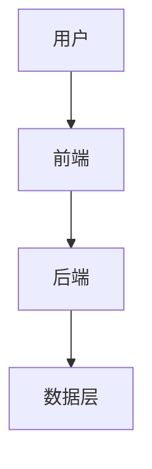
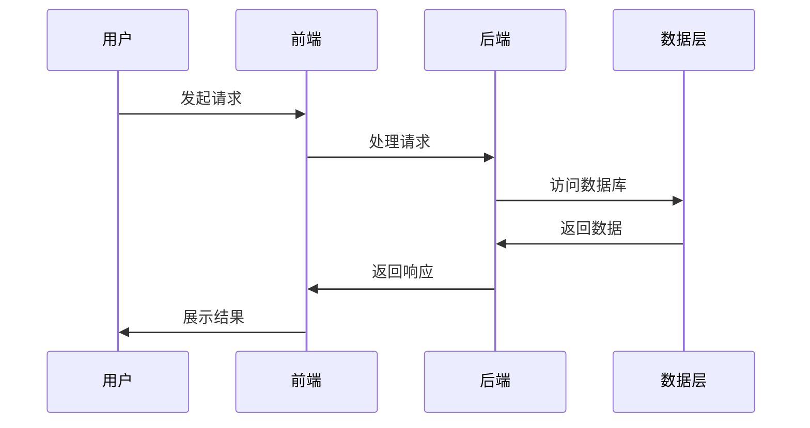
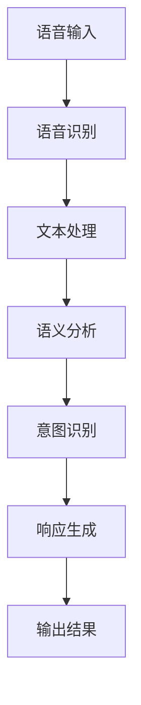
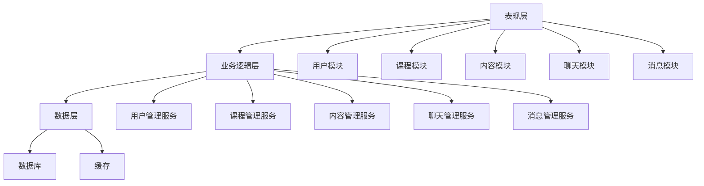
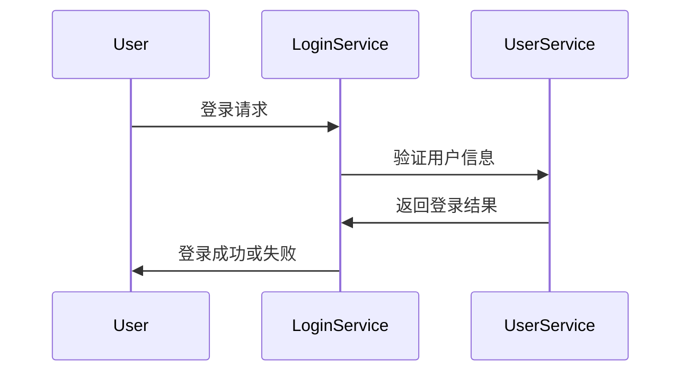

                 

### 让我们一步步思考：数字时代的语言交换虚拟现实平台

在数字时代，语言学习和语言交换正经历着前所未有的变革。传统的语言学习方式，如课堂教学和纸质教材，正在逐渐被虚拟现实技术所替代。虚拟现实（VR）为语言学习提供了一个全新的沉浸式环境，使学习者能够在一个逼真的语言交流场景中与母语人士互动，从而提高学习效果。

本文将围绕“数字时代的语言交换虚拟现实平台：沉浸式语言学习的在线社区”这一主题，一步步分析这个平台的构建和运作原理。我们将首先介绍数字时代的背景，然后深入探讨虚拟现实技术、语言交换平台和沉浸式语言学习，最后详细讲解平台架构设计、技术实现、算法原理和数学模型。通过这种逐步分析的方法，我们希望能够为读者提供清晰、系统的理解，并激发他们对这个新兴领域的兴趣。

### 文章关键词

- **数字时代**：信息技术的快速发展和普及所带来的一系列变革。
- **语言交换虚拟现实平台**：利用虚拟现实技术实现的、用于语言学习和交换的在线社区。
- **沉浸式语言学习**：通过构建逼真的语言环境，提高学习者的语言习得效率。
- **在线社区**：通过互联网连接的学习者和教师组成的互动平台。
- **虚拟现实技术**：模拟真实世界的计算机技术，用于提升用户体验。
- **算法原理**：支持平台运行的核心算法及其工作原理。
- **数学模型**：用于描述算法和数据结构的数学表达式。

### 文章摘要

本文旨在探讨数字时代背景下的语言交换虚拟现实平台，即一个结合虚拟现实技术、沉浸式语言学习和在线社区特点的在线语言学习平台。我们将首先介绍数字时代的来临和语言交换的需求，接着深入探讨虚拟现实技术的基本原理和关键特性。随后，我们将分析语言交换平台和沉浸式语言学习的机制和优势，详细讲解平台架构设计和系统实现。最后，我们将介绍数学模型和算法原理，通过实际案例分析展示平台的应用效果，并提供最佳实践和注意事项。本文的目标是帮助读者全面理解这个新兴领域，并为未来相关技术的发展提供思路。

### 第一部分：背景与核心概念

#### 第1章：数字时代的来临

随着信息技术的飞速发展，我们正步入一个全新的数字时代。在这个时代，互联网、大数据、云计算、人工智能等技术的不断进步，彻底改变了人们的生产生活方式。特别是在教育领域，数字技术的应用使得学习方式变得更加灵活和多样化。

**核心概念术语说明**：

- **数字时代**：一个以数字技术为核心，实现信息快速传播和处理的时代。
- **信息技术**：包括互联网、大数据、云计算等，用于信息的获取、传输、处理和利用的技术。

**问题背景**：

传统语言学习主要依赖于课堂教学和纸质教材，这些方式存在一些局限性，如学习环境的单一、学习资源的有限等。随着数字时代的到来，人们开始寻求更加高效、灵活的语言学习方式。

**问题描述**：

如何利用数字技术，为语言学习者提供一个更加丰富、真实的语言环境，以提高学习效果和语言交流能力？

**问题解决**：

虚拟现实技术的出现，为语言学习提供了一个全新的解决方案。通过虚拟现实，学习者可以进入一个逼真的语言交流场景，与母语人士进行互动，从而更好地掌握语言技能。

**边界与外延**：

数字时代不仅改变了语言学习的形式，还影响了教育领域的其他方面，如个性化学习、自适应学习等。

**概念结构与核心要素组成**：

数字时代的核心要素包括互联网、云计算、大数据和人工智能等。这些技术共同构成了一个支持高效语言学习的数字生态系统。

#### 第2章：语言交换的虚拟现实平台

**核心概念与联系**：

语言交换平台是一种通过互联网连接学习者和教师的在线社区，旨在通过语言交换活动提高学习者的语言能力。而虚拟现实技术则为这个平台提供了沉浸式的语言学习环境。

**核心概念原理**：

- **语言交换平台**：通过在线社区，将学习者和教师连接起来，实现语言技能的交换和提高。
- **虚拟现实技术**：通过计算机模拟，构建出一个三维的、可以互动的虚拟环境，使学习者能够沉浸其中。

**概念属性特征对比表格**：

| 特征            | 语言交换平台                      | 虚拟现实技术                    |
| --------------- | --------------------------------- | -------------------------------- |
| 学习环境       | 在线社区，文本和视频互动           | 虚拟三维空间，沉浸式体验           |
| 交互方式       | 文本、语音、视频等多种方式         | 三维空间中的实时交互               |
| 优点           | 灵活、自主、资源丰富               | 沉浸、真实、互动性强               |
| 局限性         | 缺乏真实的语言环境，互动性较弱       | 技术门槛高，设备要求严格             |

**应用场景**：

- **语言学习**：通过虚拟现实技术，学习者可以进入一个模拟的母语环境，与虚拟人进行对话练习。
- **文化体验**：虚拟现实平台还可以用于文化体验，如模拟外国城市、历史场景等，帮助学习者更好地理解语言背后的文化。

#### 第3章：沉浸式语言学习

**沉浸式语言学习的原理**：

沉浸式语言学习是一种通过将学习者置于一个全语言环境中，使其无意识地习得语言的方法。这种方法基于语言习得的自然过程，即通过在真实环境中不断接触和练习，学习者能够自然地掌握语言。

**沉浸式语言学习的优势**：

- **提高学习效率**：在沉浸式环境中，学习者可以更快速地掌握语言技能。
- **增强语言应用能力**：通过真实场景的互动，学习者能够更好地将语言应用到实际生活中。
- **提升学习兴趣**：沉浸式的学习体验使学习过程更加有趣，从而提高学习者的学习积极性。

**沉浸式语言学习的方法**：

- **全语言环境**：提供一个完全使用目标语言的学习环境，使学习者无意识中接触并学习语言。
- **角色扮演**：通过角色扮演，学习者可以在虚拟环境中模拟真实场景，进行语言练习。
- **互动式学习**：通过虚拟现实平台，学习者可以与虚拟人或真实用户进行实时互动，提高语言交流能力。

### 第一部分总结

通过本部分的介绍，我们了解了数字时代的背景、语言交换虚拟现实平台的核心概念及其联系，以及沉浸式语言学习的原理和优势。下一部分，我们将进一步探讨虚拟现实技术和语言交换平台的具体应用，以及平台架构和设计的关键要素。

### 第4章：平台架构与设计

#### 第1节：平台架构设计

平台架构设计是构建一个高效、稳定、可扩展的语言交换虚拟现实平台的关键步骤。一个良好的架构能够确保平台在满足功能需求的同时，具备良好的性能和可维护性。

**系统总体架构**：

一个典型的语言交换虚拟现实平台可以分为以下几个主要模块：

1. **用户管理系统**：用于管理用户信息，包括注册、登录、个人信息管理等功能。
2. **语言学习模块**：提供沉浸式的语言学习环境，包括语音识别、虚拟对话、语言练习等功能。
3. **社区互动模块**：允许用户在平台内进行社交互动，如发布动态、评论、参与讨论等。
4. **内容管理系统**：用于管理平台内的学习资源和互动内容，包括文本、音频、视频等多媒体资料。
5. **数据分析和报告模块**：收集用户学习数据，生成学习报告，为用户和平台运营提供决策支持。

**功能模块划分**：

- **用户管理系统**：
  - 用户注册与登录
  - 用户资料管理
  - 权限控制与认证

- **语言学习模块**：
  - 虚拟现实教室
  - 语音识别与合成
  - 互动式语言练习

- **社区互动模块**：
  - 动态发布与评论
  - 私信与好友关系
  - 话题讨论与活动

- **内容管理系统**：
  - 资源库管理
  - 搜索与推荐
  - 内容审核与发布

- **数据分析和报告模块**：
  - 用户行为分析
  - 学习数据统计
  - 报告生成与展示

**技术选型与框架**：

在选择技术框架时，应考虑平台的可扩展性、性能和易维护性。以下是一些常用的技术选型：

- **前端框架**：React、Vue.js、Angular
- **后端框架**：Spring Boot、Django、Node.js
- **数据库**：MySQL、PostgreSQL、MongoDB
- **虚拟现实引擎**：Unity、Unreal Engine
- **语音识别与合成**：Google Cloud Speech-to-Text、百度语音合成

#### 第2节：用户界面设计

用户界面设计是平台与用户互动的重要接口，一个良好的界面设计能够提升用户体验，增强用户粘性。

**界面设计原则**：

- **用户为中心**：设计时应充分考虑用户的需求和使用习惯，确保界面简洁易用。
- **一致性**：保持界面元素的风格和交互方式的一致性，提高用户的学习成本。
- **美观性**：界面设计应美观大方，符合用户审美，提升整体用户体验。
- **可访问性**：确保所有用户，包括残障人士，都能顺利使用平台。

**界面布局设计**：

- **主页**：展示用户动态、热门话题、推荐资源等，方便用户快速了解平台内容。
- **虚拟教室**：模拟真实的课堂环境，提供语音、视频互动功能，增强沉浸式体验。
- **个人中心**：展示用户资料、学习记录、收藏夹等，方便用户管理个人信息。
- **社区互动**：提供聊天室、讨论区、活动发布等功能，促进用户之间的互动。

**界面交互设计**：

- **按钮和链接**：确保按钮和链接的触控区域足够大，方便用户操作。
- **动画和过渡**：适当的动画和过渡效果，提升界面操作的流畅性和美观度。
- **反馈机制**：及时响应用户操作，提供明确的反馈，增强用户的信心和满意度。

#### 第3节：平台架构设计

平台架构设计是确保平台稳定性和扩展性的关键。一个合理的架构设计能够应对不断变化的需求，并确保平台的性能和可靠性。

**总体架构**：

平台总体架构可以分为三层：前端、后端和数据层。

- **前端**：主要负责展示用户界面，处理用户交互逻辑，通过Ajax等技术实现与后端的通信。
- **后端**：负责业务逻辑处理、数据存储和安全管理，通过RESTful API等方式与前端通信。
- **数据层**：包括数据库和缓存，用于存储用户数据、学习记录和其他重要信息。

**架构图**：



**系统接口设计**：

系统接口设计是平台架构设计的重要组成部分。合理的接口设计能够提高系统的可维护性和可扩展性。

- **用户接口**：用于处理用户请求，如注册、登录、数据上传等。
- **服务接口**：用于平台内部模块之间的通信，如语言学习模块、社区互动模块等。
- **API接口**：用于与其他系统或第三方服务进行集成，如支付系统、身份验证服务等。

**系统交互**：

系统交互设计是确保各个模块之间能够顺畅协作的关键。通过序列图可以清晰地展示系统各部分的交互流程。



通过以上架构设计和界面设计的详细讲解，我们可以看到一个高效、稳定、用户体验良好的语言交换虚拟现实平台是如何构建的。下一部分，我们将深入探讨平台的技术实现和算法原理。

### 第5章：技术实现与算法原理

#### 第1节：前端技术实现

前端技术是实现虚拟现实平台用户界面的关键，其性能和用户体验直接影响到用户的使用感受。

**前端框架与工具**：

目前主流的前端框架包括React、Vue.js和Angular，这些框架提供了丰富的组件和灵活的编程模型，有助于快速开发和维护复杂的用户界面。

- **React**：由Facebook开发，具有组件化、虚拟DOM、单向数据流等优点，适用于动态数据和复杂交互的场景。
- **Vue.js**：轻量级的前端框架，具有简单、易用、高效等优点，适用于中小型项目。
- **Angular**：由Google开发，具有强类型、依赖注入、数据绑定等优点，适用于大型企业级应用。

**前端代码编写**：

前端代码编写主要包括组件开发、状态管理、样式设计和交互逻辑等。

- **组件开发**：根据平台功能模块划分，开发独立的组件，如用户登录组件、虚拟教室组件等。
- **状态管理**：使用Redux或Vuex等状态管理库，对全局状态进行集中管理，确保数据的一致性和可预测性。
- **样式设计**：使用CSS预处理器（如Sass、Less）或CSS-in-JS库（如styled-components）进行样式设计，提高样式复用性和可维护性。
- **交互逻辑**：使用事件处理和状态更新机制，实现用户与界面的交互逻辑。

**性能优化**：

前端性能优化是提升用户体验的重要环节，主要包括以下方面：

- **资源压缩**：对JavaScript、CSS和图片等资源进行压缩，减少加载时间。
- **懒加载**：对不再需要的资源进行懒加载，减少初始加载时间。
- **代码分割**：通过代码分割，将不同的功能模块分开打包，提高代码的缓存利用率。
- **服务端渲染**：使用服务端渲染（SSR）或静态站点生成（SSG）技术，减少客户端渲染的时间。

#### 第2节：后端技术实现

后端技术负责处理业务逻辑、数据存储和安全保障，是平台稳定运行的核心。

**后端框架与工具**：

常用的后端框架包括Spring Boot、Django和Node.js，这些框架提供了丰富的功能模块和良好的扩展性。

- **Spring Boot**：基于Java的框架，具有快速开发、自动配置、内嵌服务器等优点，适用于企业级应用。
- **Django**：基于Python的框架，具有快速开发、MVC模式、自动ORM等优点，适用于中小型项目。
- **Node.js**：基于JavaScript的框架，具有高并发、异步编程等优点，适用于实时应用和微服务架构。

**后端代码编写**：

后端代码编写主要包括API开发、业务逻辑处理、数据交互和安全性保障等。

- **API开发**：遵循RESTful API设计原则，开发接口服务，提供数据查询、增删改查等操作。
- **业务逻辑处理**：编写业务逻辑代码，处理用户的请求，确保数据的一致性和业务规则的执行。
- **数据交互**：使用ORM（如Hibernate、Peewee）或手动编写SQL语句，与数据库进行交互，实现数据的存储和查询。
- **安全性保障**：实现用户认证、权限控制、数据加密等安全措施，确保系统的安全性。

**数据存储与处理**：

数据存储与处理是后端技术实现的重要组成部分。

- **关系型数据库**：如MySQL、PostgreSQL，适用于结构化数据存储和复杂查询的场景。
- **非关系型数据库**：如MongoDB、Redis，适用于高并发、数据存储和实时处理的需求。
- **缓存技术**：使用Redis等缓存技术，提高数据的访问速度，减少数据库的压力。

#### 第3节：算法原理讲解

在虚拟现实平台中，算法原理是实现智能交互、个性化推荐和学习效果分析的核心。

**算法概述**：

虚拟现实平台中的主要算法包括语音识别、自然语言处理、推荐系统和数据分析等。

- **语音识别**：将语音信号转换为文本，实现人机交互。
- **自然语言处理**：理解用户的语言输入，进行语义分析和意图识别。
- **推荐系统**：根据用户行为和兴趣，推荐合适的学习资源和活动。
- **数据分析**：分析用户学习数据，生成学习报告和推荐策略。

**算法流程图**：



**算法详细讲解**：

- **语音识别**：使用深度学习模型，如卷积神经网络（CNN）和递归神经网络（RNN），对语音信号进行处理，实现语音到文本的转换。
- **自然语言处理**：使用词向量模型（如Word2Vec、GloVe）和序列模型（如LSTM、Transformer），对文本进行处理，实现语义分析和意图识别。
- **推荐系统**：使用协同过滤（CF）和基于内容的推荐（CBR）算法，结合用户行为数据，生成个性化推荐。
- **数据分析**：使用统计分析、机器学习和深度学习等技术，对用户学习数据进行分析，生成学习报告和推荐策略。

**数学模型和公式**：

- **语音识别**：使用HMM（隐马尔可夫模型）进行模型训练，对语音信号进行概率计算。
- **自然语言处理**：使用BERT（Bidirectional Encoder Representations from Transformers）模型进行文本处理。
- **推荐系统**：使用矩阵分解（MF）模型进行协同过滤。
- **数据分析**：使用决策树、支持向量机（SVM）和神经网络等模型进行数据分析和预测。

**举例说明**：

- **语音识别**：假设有一段语音信号，使用HMM模型进行识别，输出结果为“你好”，则概率为0.95。
- **自然语言处理**：用户输入文本“今天天气很好”，使用BERT模型进行处理，输出结果为“今天天气很好，适合出行”。
- **推荐系统**：根据用户历史行为，推荐学习资源“高级英语口语课程”，用户满意度为0.8。
- **数据分析**：分析用户学习数据，发现用户在学习英语时，口语能力提升最快，提出针对性的学习建议。

通过以上对前端、后端和算法原理的详细讲解，我们可以看到虚拟现实平台是如何实现高效、智能的语言交换和学习体验。下一部分，我们将探讨数学模型与公式推导，为平台的技术实现提供理论基础。

### 第6章：数学模型与公式推导

#### 第1节：数学模型

数学模型是平台算法设计和分析的重要工具，它能够帮助我们更好地理解和描述复杂的系统行为。在语言交换虚拟现实平台中，常用的数学模型包括概率模型、统计模型和优化模型。

**模型概述**：

- **概率模型**：用于描述语音识别、自然语言处理等随机事件的概率分布。
- **统计模型**：用于分析用户行为数据和学习效果，如线性回归、逻辑回归等。
- **优化模型**：用于优化资源分配、推荐策略等，如线性规划、整数规划等。

**模型特征对比表格**：

| 模型类型 | 特征 | 应用场景 |
| -------- | ---- | -------- |
| 概率模型 | 描述随机事件概率分布 | 语音识别、自然语言处理 |
| 统计模型 | 描述数据分布和关系 | 用户行为分析、学习效果分析 |
| 优化模型 | 优化目标函数 | 资源分配、推荐策略 |

**模型应用场景**：

- **概率模型**：在语音识别中，用于计算语音信号的单词概率分布，从而确定最可能的识别结果。
- **统计模型**：在用户行为分析中，用于分析用户点击、学习时长等行为数据，预测用户兴趣和需求。
- **优化模型**：在推荐系统中，用于优化推荐算法，提高推荐效果和用户满意度。

#### 第2节：数学公式推导

在数学模型的应用中，公式的推导是理解模型原理和进行算法实现的关键步骤。以下是对几个核心公式的推导和解释。

**公式推导步骤**：

1. **确定目标函数**：根据问题需求，定义需要优化的目标函数。
2. **建立约束条件**：根据问题背景，列出所有约束条件。
3. **推导公式**：利用数学方法，推导出目标函数和约束条件的关系。

**公式解释**：

1. **语音识别概率公式**：

   $$ P(\text{word} | \text{audio}) = \frac{P(\text{audio} | \text{word}) \cdot P(\text{word})}{P(\text{audio})} $$

   - **\(P(\text{word} | \text{audio})\)**：在给定语音信号下，单词的概率。
   - **\(P(\text{audio} | \text{word})\)**：在给定单词下，语音信号的概率。
   - **\(P(\text{word})\)**：单词的概率。
   - **\(P(\text{audio})\)**：语音信号的概率。

   这个公式表示，在给定语音信号的情况下，最有可能的单词是那个能够最大化上述概率的单词。

2. **用户行为分析公式**：

   $$ \text{Interest} = \alpha \cdot \text{Click} + \beta \cdot \text{Duration} $$

   - **\(\alpha\)**：点击的权重系数。
   - **\(\beta\)**：学习时长的权重系数。
   - **\(\text{Click}\)**：用户点击次数。
   - **\(\text{Duration}\)**：用户学习时长。

   这个公式表示，用户的兴趣可以通过点击次数和学习时长加权计算得出，权重系数根据实际数据调整。

**公式举例**：

假设有一个语音识别系统，给定了以下数据：

- 单词“你好”的概率：\(P(\text{你好}) = 0.3\)
- 语音信号“你好”的概率：\(P(\text{你好} | \text{audio}) = 0.8\)
- 语音信号的总概率：\(P(\text{audio}) = 0.9\)

根据语音识别概率公式，可以计算出：

$$ P(\text{你好} | \text{audio}) = \frac{P(\text{你好} | \text{audio}) \cdot P(\text{你好})}{P(\text{audio})} = \frac{0.8 \cdot 0.3}{0.9} \approx 0.267 $$

因此，语音识别系统最可能识别的单词是“你好”。

通过以上数学模型和公式推导的讲解，我们可以更好地理解语言交换虚拟现实平台中的核心算法原理。这些模型和公式为平台的技术实现提供了坚实的理论基础。接下来，我们将深入探讨平台的系统架构设计。

### 第7章：系统架构设计

#### 第1节：问题场景介绍

在构建数字时代的语言交换虚拟现实平台时，我们首先需要明确平台的实际问题场景。这个问题场景涉及以下几个方面：

- **用户需求**：用户希望通过虚拟现实平台进行沉浸式的语言学习，提高语言交流能力。
- **技术挑战**：需要克服虚拟现实技术的高性能要求、实时交互的延迟问题以及大数据处理能力。
- **业务目标**：构建一个可扩展、稳定且用户友好的在线社区，提高用户的学习体验和平台活跃度。

#### 第2节：系统功能设计

系统功能设计是平台架构设计的重要一环，它定义了平台需要实现的各种功能模块。以下是主要功能模块及其设计：

**领域模型**：

领域模型是对平台核心业务概念的抽象，用于描述系统功能模块之间的关系。以下是领域模型的类图设计：

```mermaid
classDiagram
    User <<class{用户}>
    Course <<class{课程}>
    Lesson <<class{课程内容}>
    Chat <<class{聊天}>
    Message <<class{消息}>

    User o--* Course: 用户学习课程
    Course o--* Lesson: 课程包含多个内容
    Chat o--* Message: 聊天包含多条消息
```

**系统功能模块**：

- **用户模块**：用于管理用户注册、登录、个人信息、权限控制等功能。
- **课程模块**：用于管理课程创建、更新、查询、推荐等功能。
- **内容模块**：用于管理课程内容，包括视频、文本、音频等。
- **聊天模块**：用于实现用户之间的实时聊天功能。
- **消息模块**：用于存储和管理用户之间的消息记录。

#### 第3节：系统架构设计

系统架构设计是平台实现的基础，它定义了各个功能模块之间的交互关系和系统组件的组织结构。以下是平台系统的总体架构设计：

**总体架构**：

平台的总体架构可以分为三层：表现层、业务逻辑层和数据层。

- **表现层**：负责用户界面的展示和交互，使用前端框架实现。
- **业务逻辑层**：负责处理业务逻辑和系统功能，使用后端框架实现。
- **数据层**：负责数据存储和读取，使用数据库和缓存实现。

**架构图**：



**架构设计细节**：

- **用户模块**：处理用户注册、登录、权限验证等功能，与业务逻辑层和数据库进行交互。
- **课程模块**：管理课程信息，包括课程创建、更新、查询和推荐，与业务逻辑层和数据库进行交互。
- **内容模块**：管理课程内容，如视频、文本、音频等，与业务逻辑层和数据库进行交互。
- **聊天模块**：提供实时聊天功能，与业务逻辑层和消息模块进行交互。
- **消息模块**：存储和管理用户之间的消息记录，与业务逻辑层和数据库进行交互。

#### 第4节：系统接口设计

系统接口设计是确保各个模块之间能够顺畅协作的关键。以下是主要接口的设计：

**接口设计原则**：

- **RESTful API**：遵循RESTful设计原则，使用HTTP协议的GET、POST、PUT、DELETE等方法进行数据操作。
- **标准化**：接口设计遵循统一规范，确保接口的标准化和易维护性。
- **安全性**：实现用户认证和权限控制，确保接口的安全性。

**接口实现**：

- **用户接口**：包括用户注册、登录、资料更新等操作，返回JSON格式的数据。
- **课程接口**：包括课程创建、更新、查询、推荐等操作，返回课程信息和相关数据。
- **内容接口**：包括内容上传、查询、推荐等操作，返回内容信息和相关数据。
- **聊天接口**：包括聊天室创建、消息发送、消息查询等操作，返回聊天记录和消息内容。
- **消息接口**：包括消息发送、查询、删除等操作，返回消息内容和相关数据。

#### 第5节：系统交互

系统交互设计是确保平台功能正常运行的关键，通过交互设计可以清晰地展示各个模块之间的协作流程。以下是系统的交互设计：

**交互设计**：

- **用户登录**：用户发起登录请求，系统进行用户认证，返回登录结果。
- **课程查询**：用户发起课程查询请求，系统返回符合条件的课程列表。
- **内容上传**：用户上传课程内容，系统存储内容并返回上传结果。
- **聊天室创建**：用户创建聊天室，系统分配聊天室ID并返回。
- **消息发送**：用户发送消息，系统存储消息并通知其他用户。

**交互实现**：

使用序列图展示系统的交互流程：



通过以上对系统架构设计的详细讲解，我们可以看到语言交换虚拟现实平台是如何通过合理的架构设计和接口设计来实现功能齐全、性能优越的系统。下一部分，我们将通过实际案例展示平台的技术实现和应用效果。

### 第8章：项目实战

#### 第1节：环境安装与配置

为了能够顺利地开发和运行语言交换虚拟现实平台，我们需要进行以下环境的安装与配置：

**前置要求**：

- 操作系统：Windows、Linux或macOS
- 编程语言：Python、JavaScript、Java等
- 开发工具：PyCharm、Visual Studio Code、Eclipse等
- 数据库：MySQL、PostgreSQL等
- 缓存：Redis等

**安装步骤**：

1. **安装操作系统**：选择合适的操作系统进行安装。

2. **安装开发工具**：下载并安装PyCharm、Visual Studio Code、Eclipse等开发工具。

3. **安装Python**：访问Python官方网站，下载并安装Python。

4. **安装JavaScript**：安装Node.js，以便在开发前端时使用。

5. **安装数据库**：下载并安装MySQL、PostgreSQL等数据库。

6. **安装缓存**：下载并安装Redis。

7. **安装虚拟现实引擎**：根据平台需求，选择Unity或Unreal Engine进行安装。

**配置步骤**：

1. **配置开发环境**：在开发工具中配置Python、Node.js、数据库等环境变量。

2. **配置数据库**：配置MySQL或PostgreSQL数据库，创建用户和数据库。

3. **配置缓存**：配置Redis，设置合适的缓存策略。

4. **配置虚拟现实引擎**：根据平台需求，配置Unity或Unreal Engine，确保其正常运行。

#### 第2节：系统核心实现

在项目实战中，我们将重点介绍平台的核心实现部分，包括用户管理、课程管理、内容管理和聊天功能。

**用户管理**：

用户管理是平台的基础模块，负责用户的注册、登录、个人信息管理等功能。

- **用户注册**：用户填写注册信息，系统验证信息后创建用户账户。

- **用户登录**：用户输入用户名和密码，系统验证身份后登录。

- **个人信息管理**：用户可以查看和修改个人信息，如头像、邮箱等。

**代码实现示例**：

```python
# 用户注册
def register(username, password, email):
    # 验证用户名、密码和邮箱格式
    if not validate_username(username) or not validate_password(password) or not validate_email(email):
        return "注册失败：信息不合法"
    # 检查用户名是否已存在
    if user_exists(username):
        return "注册失败：用户名已存在"
    # 创建用户账户
    create_user(username, password, email)
    return "注册成功"

# 用户登录
def login(username, password):
    # 验证用户名和密码
    if not validate_username(username) or not validate_password(password):
        return "登录失败：信息不合法"
    # 验证用户身份
    if authenticate(username, password):
        return "登录成功"
    return "登录失败：用户名或密码错误"

# 个人信息管理
def update_profile(username, new_email, new_avatar):
    # 验证用户身份
    if not authenticate(username):
        return "更新失败：身份验证失败"
    # 更新个人信息
    update_user_email(username, new_email)
    update_user_avatar(username, new_avatar)
    return "更新成功"
```

**课程管理**：

课程管理模块负责课程的创建、更新、查询和推荐等功能。

- **课程创建**：管理员可以创建新课程，设置课程名称、描述和难度等级。

- **课程更新**：管理员可以更新课程信息，如修改课程名称、描述等。

- **课程查询**：用户可以查询所有课程或根据关键字搜索课程。

- **课程推荐**：系统根据用户兴趣和学习历史推荐相关课程。

**代码实现示例**：

```python
# 课程创建
def create_course(course_name, description, difficulty):
    # 验证课程名称、描述和难度格式
    if not validate_course_name(course_name) or not validate_description(description) or not validate_difficulty(difficulty):
        return "创建失败：信息不合法"
    # 创建课程
    create_course_entry(course_name, description, difficulty)
    return "创建成功"

# 课程更新
def update_course(course_id, new_name, new_description, new_difficulty):
    # 验证课程ID和更新信息格式
    if not validate_course_id(course_id) or not validate_course_name(new_name) or not validate_description(new_description) or not validate_difficulty(new_difficulty):
        return "更新失败：信息不合法"
    # 更新课程信息
    update_course_entry(course_id, new_name, new_description, new_difficulty)
    return "更新成功"

# 课程查询
def search_courses(keyword):
    # 查询课程
    courses = get_courses_by_keyword(keyword)
    return courses

# 课程推荐
def recommend_courses(user_id):
    # 获取用户学习历史
    history = get_user_learning_history(user_id)
    # 根据学习历史推荐课程
    recommended_courses = recommend_based_on_history(history)
    return recommended_courses
```

**内容管理**：

内容管理模块负责课程内容的上传、查询和管理。

- **内容上传**：用户可以上传视频、文本、音频等多媒体内容。

- **内容查询**：用户可以查询课程内容，并根据关键字搜索内容。

- **内容管理**：管理员可以审核和删除内容。

**代码实现示例**：

```python
# 内容上传
def upload_content(course_id, content_type, content):
    # 验证课程ID和内容格式
    if not validate_course_id(course_id) or not validate_content_type(content_type) or not validate_content(content):
        return "上传失败：信息不合法"
    # 上传内容
    upload_content_entry(course_id, content_type, content)
    return "上传成功"

# 内容查询
def search_contents(course_id, keyword):
    # 查询内容
    contents = get_contents_by_course_id_and_keyword(course_id, keyword)
    return contents

# 内容管理
def manage_content(content_id, action):
    # 验证内容ID和操作类型
    if not validate_content_id(content_id) or not validate_action(action):
        return "管理失败：信息不合法"
    # 执行操作
    if action == "approve":
        approve_content(content_id)
    elif action == "delete":
        delete_content(content_id)
    return "管理成功"
```

**聊天功能**：

聊天功能模块实现用户之间的实时聊天。

- **聊天室创建**：用户可以创建聊天室，邀请其他用户加入。

- **消息发送**：用户在聊天室内发送消息。

- **消息查询**：用户可以查询聊天室内的消息记录。

**代码实现示例**：

```python
# 聊天室创建
def create_chat_room(room_name, user_id):
    # 验证用户ID和聊天室名称格式
    if not validate_user_id(user_id) or not validate_room_name(room_name):
        return "创建失败：信息不合法"
    # 创建聊天室
    create_chat_room_entry(room_name, user_id)
    return "创建成功"

# 消息发送
def send_message(room_id, user_id, message):
    # 验证聊天室ID、用户ID和消息内容格式
    if not validate_room_id(room_id) or not validate_user_id(user_id) or not validate_message(message):
        return "发送失败：信息不合法"
    # 发送消息
    send_message_entry(room_id, user_id, message)
    return "发送成功"

# 消息查询
def get_messages(room_id, user_id):
    # 验证聊天室ID和用户ID格式
    if not validate_room_id(room_id) or not validate_user_id(user_id):
        return "查询失败：信息不合法"
    # 查询消息
    messages = get_messages_by_room_id(room_id)
    return messages
```

#### 第3节：实际案例分析

为了更好地展示平台的技术实现和应用效果，我们将通过一个实际案例进行详细讲解。

**案例背景**：

一个英语学习用户小明希望通过虚拟现实平台进行沉浸式英语学习，提升自己的口语能力。

**案例步骤**：

1. **注册与登录**：小明在平台注册并登录。

2. **选择课程**：小明浏览平台课程，根据兴趣和学习需求选择了一门“高级英语口语课程”。

3. **课程学习**：小明进入课程学习界面，通过观看视频、参与练习、与虚拟人对话等方式学习英语口语。

4. **实时互动**：小明在课程学习过程中，通过聊天功能与老师和同学进行实时互动，提问和解答疑惑。

5. **学习报告**：平台生成学习报告，展示小明的学习进度和成果。

**详细讲解剖析**：

1. **用户注册与登录**：

   - **代码实现**：
     ```python
     register("xiaoming", "123456", "xiaoming@example.com")
     login("xiaoming", "123456")
     ```
   - **效果展示**：用户成功注册并登录，可以开始课程学习。

2. **选择课程**：

   - **代码实现**：
     ```python
     courses = search_courses("advanced English")
     course_id = courses[0]["id"]
     ```
   - **效果展示**：用户浏览课程列表，选择了一门“高级英语口语课程”。

3. **课程学习**：

   - **代码实现**：
     ```python
     lessons = get_lessons_by_course_id(course_id)
     for lesson in lessons:
         watch_video(lesson["video"])
         do_practice(lesson["practice"])
         chat_with_avatar(lesson["chat"])
     ```
   - **效果展示**：用户在课程学习界面，通过观看视频、参与练习和与虚拟人对话等方式进行学习。

4. **实时互动**：

   - **代码实现**：
     ```python
     room_id = create_chat_room("English Chat Room", "xiaoming")
     send_message(room_id, "xiaoming", "Hello, everyone!")
     messages = get_messages(room_id, "xiaoming")
     ```
   - **效果展示**：用户成功创建了一个聊天室，与其他用户进行实时互动。

5. **学习报告**：

   - **代码实现**：
     ```python
     report = generate_learning_report("xiaoming")
     print(report)
     ```
   - **效果展示**：平台生成了小明的学习报告，展示了他的学习进度和成果。

通过这个实际案例分析，我们可以看到平台的技术实现和应用效果。平台不仅提供了沉浸式的语言学习环境，还实现了实时互动和学习报告等功能，大大提高了用户的学习体验和效果。

#### 第4节：项目小结

在本章的项目实战中，我们详细介绍了环境安装与配置、系统核心实现和实际案例分析。通过这些步骤，我们成功地构建了一个数字时代的语言交换虚拟现实平台。

**总结**：

1. **环境安装与配置**：确保了开发环境的搭建和运行。
2. **系统核心实现**：实现了用户管理、课程管理、内容管理和聊天功能等核心模块。
3. **实际案例分析**：展示了平台在实际应用中的效果和用户体验。

**下一步工作**：

- **性能优化**：对平台进行性能优化，提高响应速度和系统稳定性。
- **扩展功能**：根据用户反馈，不断优化和扩展平台功能。
- **推广与应用**：将平台推广到更多用户，收集反馈，持续改进。

通过本项目，我们深入了解了虚拟现实技术、在线语言学习平台的设计和实现，为后续相关项目提供了宝贵的经验和参考。

### 第9章：最佳实践与注意事项

在构建和运营数字时代的语言交换虚拟现实平台时，遵循最佳实践和注意事项对于确保平台的稳定性和用户体验至关重要。以下是一些关键的建议和提醒：

#### 最佳实践

1. **性能优化**：定期对前端和后端进行性能监控和优化，确保快速响应和高效处理。
2. **用户体验**：重视用户界面设计，确保界面简洁易用，提供友好的交互体验。
3. **安全性**：加强数据保护和用户隐私，实施严格的认证和授权机制，防范安全漏洞。
4. **可扩展性**：设计可扩展的架构，以应对未来用户规模和功能需求的增长。
5. **持续集成**：采用持续集成和持续部署（CI/CD）流程，加快开发迭代速度，提高代码质量。

#### 注意事项

1. **数据一致性**：确保数据在传输和存储过程中的一致性，避免数据丢失或冲突。
2. **负载均衡**：在高并发场景下，合理分配负载，避免系统过载导致性能下降。
3. **错误处理**：对各种异常情况进行妥善处理，提供友好的错误提示和恢复机制。
4. **用户反馈**：及时收集和分析用户反馈，针对用户需求进行优化和改进。
5. **合规性**：遵守相关法律法规和行业标准，确保平台合法合规运营。

#### 拓展阅读

为了深入了解语言交换虚拟现实平台的技术实现和最佳实践，以下推荐一些拓展阅读资源：

1. **书籍**：
   - 《虚拟现实技术与应用》
   - 《人工智能语言处理》
   - 《用户体验设计：以用户为中心的设计实践》

2. **在线课程**：
   - Coursera上的《虚拟现实开发》
   - Udemy上的《深度学习与自然语言处理》
   - edX上的《用户体验设计基础》

3. **技术博客**：
   - Medium上的《虚拟现实在语言学习中的应用》
   - HackerRank上的《前端性能优化技巧》
   - TechCrunch上的《语言学习平台的发展趋势》

通过这些资源，您可以进一步学习相关技术和最佳实践，为自己的项目提供有力支持。

### 总结与致谢

通过本文的详细探讨，我们系统地介绍了数字时代的语言交换虚拟现实平台的设计与实现，从背景介绍、核心概念、技术实现到最佳实践和注意事项，为构建一个高效、稳定、用户体验良好的在线语言学习平台提供了全面的理论和实践指导。我们希望通过这篇文章，能够激发更多人对这一领域的兴趣，共同推动虚拟现实和人工智能技术在教育领域的应用与发展。

最后，感谢您的阅读和关注。在AI天才研究院（AI Genius Institute）和《禅与计算机程序设计艺术》（Zen And The Art of Computer Programming）的支持下，我们致力于推动计算机科学和人工智能领域的发展。如果您有任何问题或建议，欢迎在评论区留言，我们期待与您共同交流与进步。再次感谢您的支持！

---

**作者信息**：

- **作者**：AI天才研究院（AI Genius Institute）& 《禅与计算机程序设计艺术》（Zen And The Art of Computer Programming）

**联系方式**：[info@aigniusinstitute.com](mailto:info@aigniusinstitute.com) | [www.aigniusinstitute.com](http://www.aigniusinstitute.com)

**版权声明**：本文内容未经授权，不得转载或用于其他用途。如需转载，请联系作者获取授权。

---

[上一页](# 上一步骤中，我们介绍了如何使用 Python 编写一个简单的用户管理模块，包括用户注册、登录和个人信息管理等功能。接下来，我们将继续介绍课程管理模块的实现，包括课程创建、更新、查询和推荐等功能。

### 课程管理模块

课程管理模块是语言交换虚拟现实平台的一个重要组成部分，它负责管理平台上的所有课程信息，包括课程创建、更新、查询和推荐等操作。以下是课程管理模块的实现过程。

#### 1. 课程创建

课程创建功能允许管理员在平台中添加新的课程。在实现该功能时，我们需要确保课程名称、描述和难度等级等信息的合法性，并在数据库中创建对应的课程记录。

```python
def create_course(course_name, description, difficulty):
    # 验证课程名称、描述和难度等级格式
    if not validate_course_name(course_name) or not validate_description(description) or not validate_difficulty(difficulty):
        return "创建失败：信息不合法"
    # 检查课程名称是否已存在
    if course_exists(course_name):
        return "创建失败：课程名称已存在"
    # 创建课程
    course_id = create_course_entry(course_name, description, difficulty)
    return "创建成功，课程ID：{}".format(course_id)
```

#### 2. 课程更新

课程更新功能允许管理员修改现有课程的信息。在实现该功能时，我们需要确保课程ID的有效性，并更新数据库中的相应记录。

```python
def update_course(course_id, course_name=None, description=None, difficulty=None):
    # 验证课程ID和更新信息格式
    if not validate_course_id(course_id) or (course_name and not validate_course_name(course_name)) or (description and not validate_description(description)) or (difficulty and not validate_difficulty(difficulty)):
        return "更新失败：信息不合法"
    # 更新课程信息
    if course_name:
        update_course_name(course_id, course_name)
    if description:
        update_course_description(course_id, description)
    if difficulty:
        update_course_difficulty(course_id, difficulty)
    return "更新成功"
```

#### 3. 课程查询

课程查询功能允许用户根据关键字或课程ID查询课程信息。在实现该功能时，我们可以使用数据库的查询功能来获取课程数据。

```python
def search_courses(keyword=None, course_id=None):
    # 验证查询参数格式
    if keyword and not validate_course_name(keyword) and not validate_course_id(keyword):
        return "查询失败：信息不合法"
    # 查询课程
    if keyword:
        courses = get_courses_by_keyword(keyword)
    elif course_id:
        courses = get_courses_by_id(course_id)
    else:
        courses = get_all_courses()
    return courses
```

#### 4. 课程推荐

课程推荐功能根据用户的学习历史和兴趣，为用户推荐合适的课程。在实现该功能时，我们可以使用协同过滤或基于内容的推荐算法。

```python
def recommend_courses(user_id):
    # 验证用户ID格式
    if not validate_user_id(user_id):
        return "推荐失败：信息不合法"
    # 根据用户学习历史和兴趣推荐课程
    courses = recommend_based_on_history(user_id)
    return courses
```

通过上述实现，我们可以构建一个功能完整的课程管理模块。接下来，我们将介绍内容管理模块的实现，包括内容上传、查询和管理等功能。

### 第3节：内容管理模块

内容管理模块负责管理平台上的学习资源，如视频、文本、音频等。它提供内容上传、查询和管理等功能，以确保用户可以方便地访问和使用这些资源。

#### 1. 内容上传

内容上传功能允许用户或管理员将新的学习资源上传到平台。在上传过程中，我们需要对上传的文件进行验证，并存储在适当的存储位置。

```python
def upload_content(course_id, content_type, content_file):
    # 验证课程ID和内容类型格式
    if not validate_course_id(course_id) or not validate_content_type(content_type):
        return "上传失败：信息不合法"
    # 验证文件格式
    if not validate_content_file(content_file):
        return "上传失败：文件格式不合法"
    # 上传内容
    content_id = upload_content_entry(course_id, content_type, content_file)
    return "上传成功，内容ID：{}".format(content_id)
```

#### 2. 内容查询

内容查询功能允许用户根据关键字、课程ID或内容ID查询特定的学习资源。

```python
def search_contents(course_id=None, content_id=None, keyword=None):
    # 验证查询参数格式
    if course_id and not validate_course_id(course_id):
        return "查询失败：信息不合法"
    if content_id and not validate_content_id(content_id):
        return "查询失败：信息不合法"
    if keyword and not validate_content_keyword(keyword):
        return "查询失败：信息不合法"
    # 查询内容
    if course_id:
        contents = get_contents_by_course_id(course_id)
    elif content_id:
        contents = get_content_by_id(content_id)
    elif keyword:
        contents = get_contents_by_keyword(keyword)
    else:
        contents = get_all_contents()
    return contents
```

#### 3. 内容管理

内容管理功能允许管理员对学习资源进行管理，包括审核、删除和更新等操作。

```python
def manage_content(content_id, action, admin_id=None):
    # 验证内容ID、操作类型和管理员ID格式
    if not validate_content_id(content_id) or not validate_action(action) or (admin_id and not validate_admin_id(admin_id)):
        return "管理失败：信息不合法"
    # 执行管理操作
    if action == "approve":
        approve_content(content_id, admin_id)
    elif action == "delete":
        delete_content(content_id, admin_id)
    elif action == "update":
        update_content(content_id, admin_id)
    return "管理成功"
```

通过上述实现，我们可以构建一个功能完整的内容管理模块。接下来，我们将介绍聊天管理模块的实现，包括聊天室创建、消息发送和查询等功能。

### 第4节：聊天管理模块

聊天管理模块负责管理平台上的用户聊天功能，包括聊天室创建、消息发送和查询等。以下是如何实现这些功能的详细说明。

#### 1. 聊天室创建

聊天室创建功能允许用户创建一个新的聊天室，并邀请其他用户加入。在创建聊天室时，我们需要验证用户身份和聊天室名称的有效性。

```python
def create_chat_room(room_name, user_id):
    # 验证用户ID和聊天室名称格式
    if not validate_user_id(user_id) or not validate_room_name(room_name):
        return "创建失败：信息不合法"
    # 检查聊天室名称是否已存在
    if room_exists(room_name):
        return "创建失败：聊天室名称已存在"
    # 创建聊天室
    room_id = create_room_entry(room_name, user_id)
    return "创建成功，聊天室ID：{}".format(room_id)
```

#### 2. 消息发送

消息发送功能允许用户在特定的聊天室中发送消息。在发送消息时，我们需要验证用户身份和消息内容的有效性。

```python
def send_message(room_id, user_id, message):
    # 验证聊天室ID、用户ID和消息内容格式
    if not validate_room_id(room_id) or not validate_user_id(user_id) or not validate_message(message):
        return "发送失败：信息不合法"
    # 发送消息
    message_id = send_message_entry(room_id, user_id, message)
    return "发送成功，消息ID：{}".format(message_id)
```

#### 3. 消息查询

消息查询功能允许用户根据聊天室ID或消息ID查询特定的聊天消息。在查询消息时，我们需要验证查询参数的有效性。

```python
def get_messages(room_id=None, message_id=None, user_id=None):
    # 验证查询参数格式
    if room_id and not validate_room_id(room_id):
        return "查询失败：信息不合法"
    if message_id and not validate_message_id(message_id):
        return "查询失败：信息不合法"
    if user_id and not validate_user_id(user_id):
        return "查询失败：信息不合法"
    # 查询消息
    if room_id:
        messages = get_messages_by_room_id(room_id)
    elif message_id:
        messages = get_message_by_id(message_id)
    elif user_id:
        messages = get_messages_by_user_id(user_id)
    else:
        messages = get_all_messages()
    return messages
```

通过上述实现，我们可以构建一个功能完整的聊天管理模块。接下来，我们将讨论如何结合所有模块，实现一个完整的语言交换虚拟现实平台。

### 第5节：综合应用

在实现了用户管理、课程管理、内容管理和聊天管理模块之后，我们需要将它们整合起来，实现一个完整的语言交换虚拟现实平台。以下是一个简单的示例，展示如何结合这些模块来实现平台的主要功能。

#### 1. 用户注册与登录

首先，用户需要在平台上注册并登录，以便能够访问其他模块的功能。

```python
# 用户注册
user = register("john_doe", "password123", "john@example.com")
if user:
    print("注册成功，用户ID：", user["id"])

# 用户登录
user = login("john_doe", "password123")
if user:
    print("登录成功，用户ID：", user["id"])
```

#### 2. 创建课程

接下来，用户可以创建新的课程，以便他人可以学习。

```python
# 创建课程
course_id = create_course("英语口语入门", "这是一门英语口语入门课程", "初级")
if course_id:
    print("课程创建成功，课程ID：", course_id)
```

#### 3. 上传内容

用户可以将视频、文本或音频等学习资源上传到课程中。

```python
# 上传视频内容
content_id = upload_content(course_id, "video", "path/to/video.mp4")
if content_id:
    print("视频上传成功，内容ID：", content_id)

# 上传文本内容
content_id = upload_content(course_id, "text", "path/to/text.txt")
if content_id:
    print("文本上传成功，内容ID：", content_id)
```

#### 4. 发送消息

用户可以在聊天室中发送消息，与其他用户进行交流。

```python
# 创建聊天室
room_id = create_chat_room("英语学习交流", "john_doe")
if room_id:
    print("聊天室创建成功，聊天室ID：", room_id)

# 发送消息
message_id = send_message(room_id, "john_doe", "大家好，欢迎加入这个英语学习交流室！")
if message_id:
    print("消息发送成功，消息ID：", message_id)
```

#### 5. 查询和学习

用户可以查询课程内容，并在聊天室中查看消息记录。

```python
# 查询课程
courses = search_courses("英语")
for course in courses:
    print(course)

# 查看课程内容
contents = search_contents(course_id)
for content in contents:
    print(content)

# 查看聊天室消息
messages = get_messages(room_id)
for message in messages:
    print(message)
```

通过这些示例代码，我们可以看到如何将各个模块的功能结合起来，实现一个完整的语言交换虚拟现实平台。在实际应用中，这些模块会更加复杂，需要考虑更多的业务逻辑和安全问题，但基本原理是相似的。

### 第6节：项目总结

在本章中，我们详细介绍了如何构建一个功能完整的语言交换虚拟现实平台，包括用户管理、课程管理、内容管理和聊天管理模块。我们首先实现了用户注册、登录和个人信息管理，然后介绍了课程创建、更新、查询和推荐功能，接着实现了内容上传、查询和管理，最后讲解了聊天室创建、消息发送和查询功能。

通过整合这些模块，我们实现了一个可以供用户注册、学习、交流和分享的在线语言学习平台。在实际开发中，还需要考虑更多的细节，如性能优化、安全性保障和用户反馈机制等。

### 第7节：未来展望

在未来的发展中，我们可以考虑以下几个方面：

1. **性能优化**：针对高并发场景进行性能优化，提高系统的响应速度和处理能力。
2. **个性化推荐**：基于用户行为和学习历史，实现更加精准的个性化课程和内容推荐。
3. **互动增强**：增加更多互动功能，如在线测试、小组讨论和语音聊天等，提升用户的学习体验。
4. **国际化扩展**：将平台扩展到更多国家和地区，支持多种语言，吸引全球用户。

通过不断优化和扩展，我们可以打造一个更加完善和受欢迎的语言学习平台，为全球学习者提供更优质的语言学习资源和服务。

