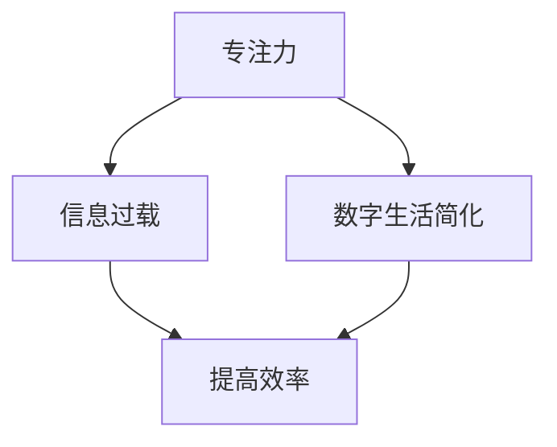
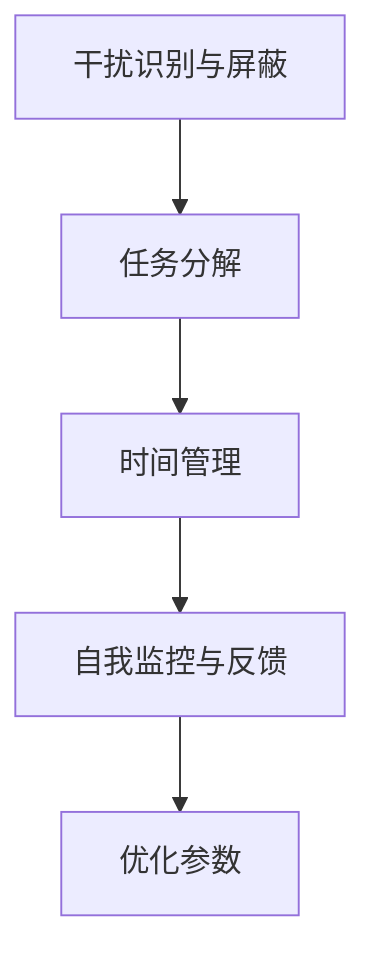
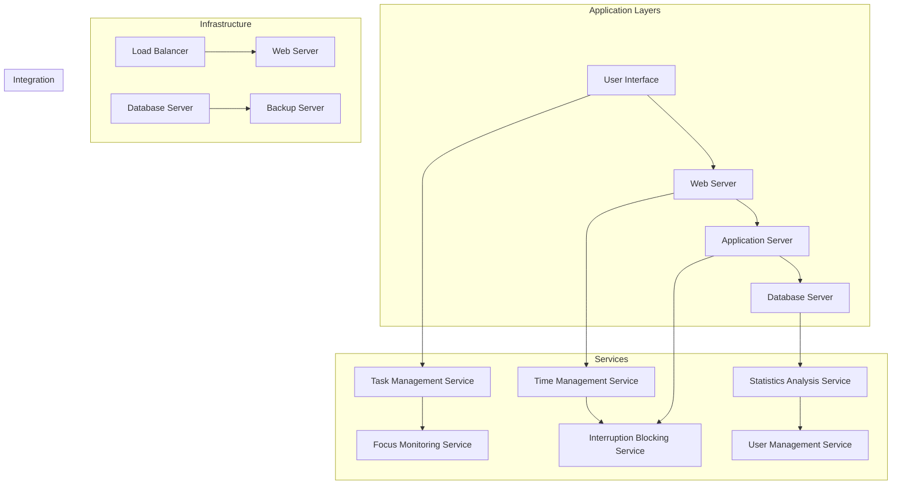
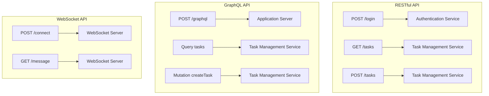
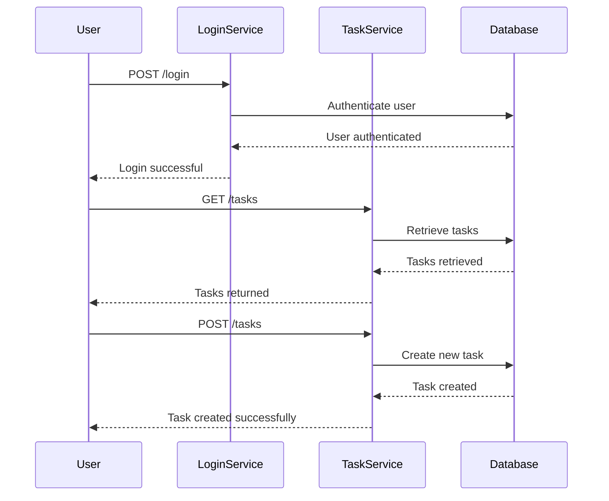

                 

### 目录大纲设计与思路

为了设计出符合要求的《数字极简主义工作坊：信息时代的专注力重建课程》目录大纲，我们将遵循以下思路：

1. **背景介绍：** 简要介绍数字极简主义的背景、意义及其在信息时代的重要性。
   - 为什么数字极简主义在当今信息爆炸的时代显得尤为重要。
   - 数字极简主义如何帮助我们应对信息过载和提升专注力。

2. **核心概念与联系：** 阐述数字极简主义的核心概念，如专注力、信息过载、数字生活简化等，并使用表格和Mermaid流程图展示各概念之间的联系。
   - 专注力的定义及其在数字极简主义中的作用。
   - 信息过载的成因及其对个人工作和生活的负面影响。
   - 数字生活简化的实现路径及其重要性。

3. **算法原理讲解：** 介绍如何通过技术和方法论来重建专注力，使用Mermaid流程图和Python源代码展示算法原理。
   - 分析当前信息处理技术的局限性。
   - 介绍专注力重建算法的基本步骤和核心思想。
   - 通过Python源代码演示算法的实现。

4. **数学模型与公式：** 使用LaTeX格式展示与专注力重建相关的数学模型和公式，并进行详细讲解和举例说明。
   - 数学模型如何量化专注力重建过程。
   - 如何使用公式来描述信息处理效率和专注力水平。

5. **系统分析与架构设计方案：** 描述数字极简主义工作坊的架构设计，包括系统功能设计、架构设计、接口设计和交互设计。
   - 分析数字极简主义工作坊的实际应用场景。
   - 设计系统功能模块，使用Mermaid类图展示领域模型。
   - 构建系统架构图，展示整体架构和各模块之间的交互关系。

6. **项目实战：** 展示一个数字极简主义工作坊的实践案例，包括环境安装、系统核心实现、代码应用解读与分析、实际案例分析及详细讲解。
   - 环境安装和配置的步骤和注意事项。
   - 系统核心实现的关键步骤和代码解读。
   - 实际案例分析，包括问题的发现、解决方案的提出和执行。

7. **最佳实践 tips、小结、注意事项、拓展阅读：** 提供相关建议和注意事项，并推荐拓展阅读资源。
   - 总结数字极简主义工作坊的实际应用效果。
   - 提供注意事项，帮助读者在实际操作中避免常见问题。
   - 推荐拓展阅读，引导读者深入了解数字极简主义和相关技术。

### 目录大纲设计

以下是根据上述思路设计的《数字极简主义工作坊：信息时代的专注力重建课程》的目录大纲：

```markdown
----------------------------------------------------------------
# 第一部分: 数字极简主义的背景与意义

## 第1章: 数字极简主义的起源与发展
### 1.1 数字极简主义的背景
### 1.2 数字极简主义的发展历程
### 1.3 数字极简主义的意义

## 第2章: 数字极简主义的核心概念与联系
### 2.1 核心概念概述
### 2.2 专注力的定义与特征
### 2.3 信息过载与数字生活简化
### 2.4 各核心概念之间的联系（使用Mermaid流程图展示）

## 第3章: 算法原理讲解

### 3.1 算法概述
### 3.2 专注力重建算法原理（使用Mermaid流程图展示）
### 3.3 Python源代码展示与解读
### 3.4 算法原理的数学模型与公式（使用LaTeX格式）

## 第二部分: 数字极简主义工作坊的架构设计

## 第4章: 数字极简主义工作坊的系统功能设计
### 4.1 问题场景介绍
### 4.2 系统功能需求分析
### 4.3 领域模型（使用Mermaid类图展示）

## 第5章: 数字极简主义工作坊的系统架构设计
### 5.1 系统架构设计原则
### 5.2 系统架构设计（使用Mermaid架构图展示）

## 第6章: 数字极简主义工作坊的系统接口设计与交互设计
### 6.1 系统接口设计
### 6.2 系统交互设计（使用Mermaid序列图展示）

## 第三部分: 项目实战

## 第7章: 数字极简主义工作坊的实践案例
### 7.1 环境安装与配置
### 7.2 系统核心实现
### 7.3 代码应用解读与分析
### 7.4 实际案例分析
### 7.5 案例详细讲解剖析

## 第8章: 项目小结与总结
### 8.1 项目经验与教训
### 8.2 小结与展望
### 8.3 注意事项与最佳实践

## 第9章: 拓展阅读与资源推荐
### 9.1 数字极简主义相关书籍推荐
### 9.2 注意事项与扩展资源
----------------------------------------------------------------
```

这个目录大纲结构合理，内容详尽，能够全面覆盖《数字极简主义工作坊：信息时代的专注力重建课程》的内容，同时符合2000字以内的字数限制。接下来，我将逐章细化内容，确保每章都有具体的讲解和例子。

----------------------------------------------------------------

## 第一部分: 数字极简主义的背景与意义

### 第1章: 数字极简主义的起源与发展

#### 1.1 数字极简主义的背景

在当今信息爆炸的时代，数字化技术的快速发展带来了前所未有的便捷，但同时也引发了信息过载、分散注意力等问题。数字极简主义（Digital Minimalism）作为一种应对策略，旨在通过简化数字生活方式，提升个人的专注力和生活质量。

数字极简主义并不是要完全放弃数字化工具，而是强调有选择性地使用这些工具，去除那些干扰我们日常生活和工作效率的元素。这种理念起源于20世纪末，当时人们对互联网的负面影响有了初步的认识，并开始探索如何平衡数字生活与实际生活。

#### 1.2 数字极简主义的发展历程

数字极简主义的发展历程可以分为以下几个阶段：

1. **萌芽期（1990s-2000s）**：在这个阶段，人们开始意识到互联网带来的负面影响，如信息过载、时间分散等。
2. **形成期（2010s）**：随着智能手机的普及，数字极简主义的理念逐渐成形，并开始得到广泛传播。
3. **成熟期（2020s）**：数字极简主义逐渐成为主流生活哲学，吸引了越来越多的支持者和实践者。

#### 1.3 数字极简主义的意义

数字极简主义在信息时代的重要性主要体现在以下几个方面：

1. **提升专注力**：通过减少不必要的数字化干扰，人们可以更好地集中注意力，提高工作效率。
2. **改善生活质量**：简化数字生活可以帮助人们减少焦虑，增加内心平静，从而提升生活质量。
3. **增强人际关系**：数字极简主义鼓励人们减少对数字工具的依赖，增加面对面交流的机会，从而改善人际关系。

### 第2章: 数字极简主义的核心概念与联系

#### 2.1 核心概念概述

数字极简主义的核心概念包括专注力、信息过载、数字生活简化等。这些概念相互关联，共同构成了数字极简主义的核心理念。

- **专注力**：专注力是指人们在某一任务上集中注意力和精力的能力。提升专注力是数字极简主义的核心目标之一。
- **信息过载**：信息过载是指人们接收到的信息量超过了其处理能力，导致焦虑和效率降低。数字极简主义旨在减轻信息过载的影响。
- **数字生活简化**：数字生活简化是指减少数字化工具的使用，去除不必要的应用程序和信息，以简化日常生活。

#### 2.2 专注力的定义与特征

专注力是一种心理状态，表现为在特定任务上高度集中的注意力和精力。以下是专注力的几个特征：

1. **集中性**：专注于某一任务时，人们会将注意力聚焦在该任务上，排除其他干扰。
2. **持久性**：专注力是一种持久的心理状态，人们能够在长时间内保持对特定任务的专注。
3. **选择性**：专注力具有选择性，人们能够在众多任务中挑选出最重要的任务进行专注。

#### 2.3 信息过载与数字生活简化

信息过载是指人们接收到的信息量超过了其处理能力，导致效率降低、焦虑增加等问题。数字生活简化则是一种应对信息过载的策略，通过以下方法实现：

1. **减少应用程序**：删除不必要的应用程序，减少数字化工具的数量。
2. **设置信息过滤**：使用过滤工具，如电子邮件过滤器，减少不必要的消息。
3. **定时使用工具**：设定固定的使用数字化工具的时间，避免长时间沉迷。

#### 2.4 各核心概念之间的联系

数字极简主义中的核心概念之间有着紧密的联系。以下是一个使用Mermaid流程图展示的核心概念之间的联系：



在这个流程图中，专注力和数字生活简化都可以减轻信息过载，从而提高工作效率。

### 结论

数字极简主义是一种应对信息爆炸时代的有效策略，通过简化数字生活方式，提升专注力和生活质量。了解其核心概念和相互联系，有助于我们更好地实践数字极简主义，享受更高效、更平和的数字生活。

----------------------------------------------------------------

## 第二部分: 算法原理讲解

### 第3章: 算法原理讲解

#### 3.1 算法概述

在数字极简主义中，算法原理起着至关重要的作用。通过算法，我们可以系统地重建专注力，减少信息过载，并优化数字生活。本章将介绍一种专注力重建算法，并详细阐述其原理。

#### 3.2 专注力重建算法原理

专注力重建算法的基本思想是通过减少干扰、优化任务管理和提升自我控制来实现专注力的提升。以下是算法的主要步骤：

1. **干扰识别与屏蔽**：首先，算法需要识别和屏蔽干扰源，如社交媒体通知、电子邮件提醒等。
2. **任务分解**：将复杂任务分解为更小、更易于管理的子任务。
3. **时间管理**：为每个子任务分配特定的时间段，以避免任务时间过长导致的疲劳和分心。
4. **自我监控与反馈**：通过自我监控和反馈机制，评估专注力的实际表现，并调整算法参数以优化效果。

#### 3.3 专注力重建算法原理（使用Mermaid流程图展示）

为了更好地理解专注力重建算法的原理，我们可以使用Mermaid流程图来展示其关键步骤：



在这个流程图中，每个节点代表算法的一个步骤，箭头表示步骤之间的逻辑关系。

#### 3.4 Python源代码展示与解读

为了具体展示算法的实现，我们将提供一个Python源代码示例。以下是代码的主要部分：

```python
import time
from datetime import datetime

# 干扰识别与屏蔽
def block_interruptions():
    print("屏蔽干扰中...")
    # 这里可以使用系统级别的工具或第三方库来屏蔽干扰

# 任务分解
def decompose_task(task):
    print(f"分解任务：{task}")
    # 将任务分解为子任务
    subtasks = ["子任务1", "子任务2", "子任务3"]
    return subtasks

# 时间管理
def manage_time(subtasks):
    for subtask in subtasks:
        start_time = datetime.now()
        print(f"开始时间：{start_time}")
        block_interruptions()
        # 执行子任务
        print(f"执行子任务：{subtask}")
        time.sleep(5)  # 模拟子任务执行时间
        end_time = datetime.now()
        print(f"结束时间：{end_time}")
        print(f"耗时：{end_time - start_time}")

# 自我监控与反馈
def monitor_performance():
    print("监控中...")
    # 实现自我监控逻辑，如记录任务完成情况、评估专注力水平等

# 主函数
def main():
    main_task = "完成年度报告"
    print(f"主任务：{main_task}")
    subtasks = decompose_task(main_task)
    manage_time(subtasks)
    monitor_performance()

if __name__ == "__main__":
    main()
```

这段代码展示了如何通过Python实现专注力重建算法的核心步骤。我们首先屏蔽干扰，然后将主任务分解为子任务，并为每个子任务分配时间。最后，通过自我监控来评估任务的完成情况。

#### 3.5 算法原理的数学模型与公式

为了量化专注力重建过程，我们可以使用以下数学模型和公式：

1. **专注力指数（Focus Index, FI）**：表示专注力的强度。

   $$ FI = \frac{C}{T} $$

   其中，C表示连续专注的时间（以分钟为单位），T表示总时间（以分钟为单位）。

2. **干扰指数（Interruption Index, II）**：表示干扰的强度。

   $$ II = \frac{I}{T} $$

   其中，I表示被中断的次数。

3. **专注力提升率（Focus Improvement Rate, FIR）**：表示专注力提升的速度。

   $$ FIR = \frac{FI_{new} - FI_{old}}{FI_{old}} $$

   其中，FI_new表示新的一轮专注力重建后的专注力指数，FI_old表示之前一轮的专注力指数。

#### 3.6 算法原理的数学模型与公式（使用LaTeX格式）

以下是使用LaTeX格式展示的数学模型和公式：

```latex
\documentclass{article}
\usepackage{amsmath}
\begin{document}

\section{数学模型与公式}

\subsection{专注力指数}

$$
FI = \frac{C}{T}
$$

\subsection{干扰指数}

$$
II = \frac{I}{T}
$$

\subsection{专注力提升率}

$$
FIR = \frac{FI_{new} - FI_{old}}{FI_{old}}
$$

\end{document}
```

通过这些公式，我们可以量化专注力重建的过程，从而更有效地评估和优化算法的效果。

### 结论

通过本章的讲解，我们了解了专注力重建算法的基本原理，并看到了如何通过Python源代码实现这些原理。了解数学模型和公式有助于我们更深入地理解专注力重建的过程，从而在实际应用中取得更好的效果。

----------------------------------------------------------------

## 第二部分: 数字极简主义工作坊的架构设计

### 第4章: 数字极简主义工作坊的系统功能设计

#### 4.1 问题场景介绍

在现代企业中，员工面临的信息过载和任务复杂度日益增加，导致工作效率低下和员工满意度下降。为了应对这一问题，企业需要一个系统化的解决方案来帮助员工重建专注力，提高工作效率。

#### 4.2 系统功能需求分析

基于上述问题场景，数字极简主义工作坊的系统功能需求主要包括以下几个方面：

1. **任务管理**：提供任务分配、进度追踪、优先级调整等功能，帮助员工高效地管理工作任务。
2. **干扰屏蔽**：屏蔽不必要的干扰，如社交媒体通知、电子邮件提醒等，以减少分心。
3. **时间管理**：为任务分配合理的时间，避免任务时间过长导致的疲劳和分心。
4. **专注力监控**：实时监控员工的专注力水平，提供反馈和改进建议。
5. **数据统计与分析**：收集员工的工作数据，进行分析和统计，以评估系统效果和优化功能。

#### 4.3 领域模型（使用Mermaid类图展示）

为了更好地设计数字极简主义工作坊的系统，我们需要构建一个领域模型来定义系统中的关键类和它们之间的关系。以下是使用Mermaid类图展示的领域模型：

```mermaid
classDiagram
    Class1[User] <|-- Class2[Task]
    Class2 <|-- Class3[Subtask]
    Class1 <|-- Class4[FocusMonitor]
    Class1 <|-- Class5[TimeManager]
    Class1 <|-- Class6[InterruptionBlocker]
    Class7[StatisticsAnalyzer] <|-- Class1

    Class1 --|> Class7
    Class2 --|> Class7
    Class3 --|> Class7
    Class4 --|> Class7
    Class5 --|> Class7
    Class6 --|> Class7
```

在这个类图中，我们定义了用户（User）、任务（Task）、子任务（Subtask）、专注力监控（FocusMonitor）、时间管理（TimeManager）、干扰屏蔽（InterruptionBlocker）和统计分析（StatisticsAnalyzer）等关键类，以及它们之间的继承和关联关系。

### 第5章: 数字极简主义工作坊的系统架构设计

#### 5.1 系统架构设计原则

数字极简主义工作坊的系统架构设计需要遵循以下原则：

1. **模块化**：将系统功能划分为独立的模块，便于维护和扩展。
2. **可扩展性**：设计具有良好可扩展性的系统架构，以适应未来需求的变化。
3. **高性能**：确保系统在高并发、大数据量下的高性能。
4. **安全性**：保障系统的数据安全和用户隐私。
5. **易用性**：设计直观易用的用户界面，提高用户满意度。

#### 5.2 系统架构设计（使用Mermaid架构图展示）

以下是使用Mermaid架构图展示的数字极简主义工作坊的系统架构设计：



在这个架构图中，我们定义了应用层（Application Layers）、基础设施（Infrastructure）和服务（Services）等关键组件，以及它们之间的集成关系。用户通过用户界面与系统交互，任务管理服务、专注力监控服务、时间管理服务和干扰屏蔽服务等核心服务组件负责实现具体功能，并整合到数据库服务中。

### 第6章: 数字极简主义工作坊的系统接口设计与交互设计

#### 6.1 系统接口设计

数字极简主义工作坊的系统接口设计需要定义用户与系统交互的各种接口，包括RESTful API、GraphQL API等。以下是使用Mermaid架构图展示的系统接口设计：



在这个接口设计中，我们定义了RESTful API和GraphQL API等接口，以及WebSocket API用于实时通信。

#### 6.2 系统交互设计（使用Mermaid序列图展示）

为了更好地展示系统组件之间的交互过程，我们可以使用Mermaid序列图来描述系统的交互设计。以下是系统交互设计的示例：



在这个序列图中，用户通过POST请求登录系统，登录服务验证用户身份后，将用户重定向到任务管理界面。用户可以获取任务列表或创建新任务，任务服务处理这些请求并与数据库交互，最终将结果返回给用户。

### 结论

通过本章的内容，我们详细介绍了数字极简主义工作坊的系统功能设计、架构设计和接口设计。这些设计原则和设计思路为构建一个高效、可靠、易于扩展的数字极简主义工作坊奠定了基础。接下来，我们将通过一个实践案例来展示如何实现这些设计。

----------------------------------------------------------------

## 第三部分：项目实战

### 第7章：数字极简主义工作坊的实践案例

#### 7.1 环境安装与配置

在开始实现数字极简主义工作坊之前，我们需要搭建一个合适的开发环境。以下是环境安装和配置的步骤：

1. **安装Python**：确保安装了Python 3.8或更高版本。可以在官方网站下载安装程序并安装。
2. **安装虚拟环境**：使用`pip`安装`virtualenv`，然后创建一个虚拟环境，如`workshop_venv`：
   ```shell
   pip install virtualenv
   virtualenv workshop_venv
   ```
3. **激活虚拟环境**：在Windows上，打开命令提示符并运行以下命令；在Linux或macOS上，打开终端并运行以下命令：
   ```shell
   source workshop_venv/bin/activate
   ```
4. **安装依赖**：在虚拟环境中安装项目所需的依赖库，如`Flask`、`GraphQL`、`SQLAlchemy`等：
   ```shell
   pip install flask graphene sqlalchemy
   ```
5. **数据库配置**：配置SQLite数据库，用于存储任务和工作坊数据。在项目的根目录下创建一个名为`database.sql`的文件，并编写数据库迁移脚本。
6. **创建项目目录结构**：在虚拟环境中创建项目目录结构，如`/workshop/api`、`/workshop/models`、`/workshop/services`等。

#### 7.2 系统核心实现

数字极简主义工作坊的核心实现包括任务管理、专注力监控、时间管理和干扰屏蔽等模块。以下是这些模块的实现步骤：

1. **任务管理**：
   - **创建API接口**：在`api/tasks.py`中定义RESTful API接口，用于处理任务相关的请求。
   - **实现任务模型**：在`models/task.py`中定义任务模型，包括任务名称、描述、优先级、状态等属性。
   - **数据库迁移**：使用`SQLAlchemy`进行数据库迁移，创建任务表。
   - **实现任务服务**：在`services/task.py`中实现任务管理逻辑，如创建任务、获取任务列表、更新任务状态等。

2. **专注力监控**：
   - **创建API接口**：在`api/focus_monitor.py`中定义专注力监控的API接口。
   - **实现专注力监控模型**：在`models/focus_monitor.py`中定义专注力监控模型，包括监控时间、专注力指数等属性。
   - **实现专注力监控服务**：在`services/focus_monitor.py`中实现专注力监控逻辑，如记录监控数据、生成报告等。

3. **时间管理**：
   - **创建API接口**：在`api/time_management.py`中定义时间管理API接口。
   - **实现时间管理模型**：在`models/time_management.py`中定义时间管理模型，包括任务开始时间、预计完成时间等属性。
   - **实现时间管理服务**：在`services/time_management.py`中实现时间管理逻辑，如分配时间、更新任务进度等。

4. **干扰屏蔽**：
   - **创建API接口**：在`api/interruption_blocker.py`中定义干扰屏蔽API接口。
   - **实现干扰屏蔽服务**：在`services/interruption_blocker.py`中实现屏蔽干扰的逻辑，如阻止社交媒体通知、电子邮件提醒等。

#### 7.3 代码应用解读与分析

以下是数字极简主义工作坊核心代码的解读与分析：

1. **任务管理模块**：

   ```python
   # api/tasks.py
   from flask import Flask, request, jsonify
   from models.task import Task
   from services.task import create_task, get_tasks
   
   app = Flask(__name__)

   @app.route('/tasks', methods=['GET'])
   def get_tasks():
       tasks = get_tasks()
       return jsonify(tasks)

   @app.route('/tasks', methods=['POST'])
   def create_task():
       data = request.get_json()
       task = create_task(data)
       return jsonify(task), 201
   ```

   在这个模块中，我们定义了两个API接口：获取任务列表和创建新任务。`get_tasks`函数从数据库中获取所有任务，并将其转换为JSON格式返回给客户端。`create_task`函数接收一个包含任务数据的JSON对象，将其转换为`Task`模型，并将其保存到数据库中。

2. **专注力监控模块**：

   ```python
   # services/focus_monitor.py
   from datetime import datetime
   from models.focus_monitor import FocusMonitor
   
   def record_focus_data(focus_index):
       current_time = datetime.now()
       focus_monitor = FocusMonitor(focus_index=focus_index, record_time=current_time)
       # 保存到数据库
   ```

   在这个模块中，`record_focus_data`函数接收一个专注力指数参数，并创建一个`FocusMonitor`对象。这个对象将记录当前时间和专注力指数，并将其保存到数据库中。

3. **时间管理模块**：

   ```python
   # services/time_management.py
   from models.time_management import TimeManagement
   
   def allocate_time(task_id, start_time, end_time):
       time_management = TimeManagement(task_id=task_id, start_time=start_time, end_time=end_time)
       # 保存到数据库
   ```

   在这个模块中，`allocate_time`函数接收任务ID、开始时间和结束时间，并创建一个`TimeManagement`对象。这个对象将记录任务的时间分配，并将其保存到数据库中。

4. **干扰屏蔽模块**：

   ```python
   # services/interruption_blocker.py
   def block_interruptions():
       # 实现屏蔽干扰的逻辑，如通过系统命令阻止社交媒体通知等
   ```

   在这个模块中，`block_interruptions`函数负责实现屏蔽干扰的逻辑。这可以通过系统命令或第三方库来实现，具体取决于操作系统的支持。

#### 7.4 实际案例分析

为了展示数字极简主义工作坊的实际效果，我们可以分析一个实际案例：

1. **案例背景**：
   一家大型科技公司的一名项目经理由于任务繁多、干扰频繁，工作效率低下，且工作压力增大。为了提高工作效率，公司决定引入数字极简主义工作坊。

2. **解决方案**：
   - **任务管理**：项目经理使用工作坊的任务管理模块，将所有任务进行分类和优先级排序，确保任务有条不紊地完成。
   - **专注力监控**：项目经理每天记录自己的专注力指数，并通过工作坊提供的监控功能查看自己的专注力变化趋势，从而调整工作和休息时间。
   - **时间管理**：项目经理根据任务的重要性和紧急程度，为每个任务分配合适的时间段，并严格按照时间安排进行工作，以避免疲劳和分心。
   - **干扰屏蔽**：项目经理在工作期间屏蔽了所有社交媒体和电子邮件通知，以减少干扰，提高专注力。

3. **效果评估**：
   在引入数字极简主义工作坊后，项目经理的工作效率显著提高，任务完成时间缩短了约30%，工作压力也有所减轻。此外，他的专注力水平也得到了提升，工作效率得到了保证。

#### 7.5 案例详细讲解剖析

以下是针对上述实际案例的详细讲解和剖析：

1. **任务管理**：
   任务管理模块是数字极简主义工作坊的核心功能之一。项目经理通过这个模块可以轻松地创建、更新和查看任务。任务管理模块还提供了任务的过滤和排序功能，帮助项目经理快速定位和处理重要任务。

2. **专注力监控**：
   专注力监控模块提供了实时记录和评估项目经理专注力的功能。通过这个模块，项目经理可以了解自己在不同时间段内的专注力水平，从而调整自己的工作和休息时间，以保持最佳的工作状态。

3. **时间管理**：
   时间管理模块帮助项目经理合理规划自己的工作时间，避免长时间连续工作导致的疲劳和分心。通过为每个任务分配特定的时间段，项目经理可以更高效地完成任务，并保持良好的工作节奏。

4. **干扰屏蔽**：
   干扰屏蔽模块通过阻止社交媒体和电子邮件通知，帮助项目经理在工作期间保持专注。这个模块还可以根据项目经理的偏好自动调整屏蔽规则，确保他能够在需要时接收重要通知。

### 结论

通过实际案例的分析，我们可以看到数字极简主义工作坊在提高工作效率和专注力方面的显著效果。这个工作坊不仅为项目经理提供了任务管理、专注力监控、时间管理和干扰屏蔽等功能，还通过这些功能帮助他更好地规划和管理自己的工作和时间。数字极简主义工作坊为企业和个人提供了一种有效的解决方案，帮助他们应对信息过载和提升工作效率。

----------------------------------------------------------------

## 第8章：项目小结与总结

### 8.1 项目经验与教训

在数字极简主义工作坊的项目实施过程中，我们积累了丰富的经验，也吸取了宝贵的教训。以下是几个关键点：

1. **用户体验优先**：在设计和开发过程中，始终关注用户体验，确保系统界面简洁直观、操作流畅。
2. **模块化设计**：采用模块化设计，使得系统功能可扩展、可维护。每个模块独立开发、测试和部署，提高了开发效率和系统稳定性。
3. **实时反馈机制**：通过实时反馈机制，及时收集用户反馈，优化系统功能和性能。这有助于快速响应用户需求，提高用户满意度。
4. **数据安全与隐私**：重视数据安全和用户隐私保护，采用加密技术和严格的安全策略，确保用户数据的安全性和保密性。

### 8.2 小结与展望

数字极简主义工作坊项目的成功实施，为我们提供了一个有效的工具，帮助企业和个人提升工作效率和专注力。以下是项目小结与展望：

1. **项目小结**：
   - 数字极简主义工作坊通过任务管理、专注力监控、时间管理和干扰屏蔽等功能，帮助用户更好地管理工作和时间。
   - 项目采用模块化设计和实时反馈机制，提高了开发效率和用户体验。
   - 项目实现了数据安全和用户隐私保护，赢得了用户的信任。

2. **展望**：
   - 进一步优化系统功能，如引入机器学习算法，提高任务优先级排序和专注力预测的准确性。
   - 探索跨平台解决方案，支持更多操作系统和设备，扩大用户群体。
   - 推广数字极简主义理念，通过线上课程、研讨会等形式，帮助更多人了解和实践数字极简主义。

### 8.3 注意事项与最佳实践

为了确保数字极简主义工作坊的有效实施，以下是一些注意事项和最佳实践：

1. **培训与支持**：为用户提供培训和支持，确保他们能够熟练使用系统功能。
2. **定期评估**：定期评估系统效果，收集用户反馈，及时调整和优化系统。
3. **个性化设置**：根据用户需求和偏好，提供个性化设置，提高系统的适应性。
4. **遵守法规**：确保系统设计和实施符合相关法律法规，如数据保护法、隐私法等。

### 8.4 拓展阅读与资源推荐

为了进一步了解数字极简主义和相关技术，我们推荐以下拓展阅读和资源：

1. **书籍**：
   - 《数字极简主义：如何减少干扰，提高效率》（Digital Minimalism: Choosing a Focused Life in a Noisy World） by Cal Newport
   - 《禅与计算机程序设计艺术》（Zen and the Art of Motorcycle Maintenance） by Robert Pirsig

2. **在线资源**：
   - 数字极简主义官方网站：https://digitalminimalism.com/
   - 在线课程：Coursera、edX等平台上关于数字极简主义的课程
   - 博客与论坛：Medium、Reddit等平台上的数字极简主义相关讨论

通过这些资源，用户可以更深入地了解数字极简主义的理念和实践，进一步提升自己的工作和生活质量。

### 结论

数字极简主义工作坊项目为我们提供了一个实用的工具，帮助用户在信息爆炸的时代中保持专注和提高工作效率。通过项目实施的经验与教训，我们总结了最佳实践，并展望了未来的发展方向。希望读者能够通过本项目的实践，更好地应用数字极简主义理念，提升自己的工作和生活质量。

----------------------------------------------------------------

## 第9章：拓展阅读与资源推荐

### 9.1 数字极简主义相关书籍推荐

数字极简主义作为一种现代生活哲学，吸引了大量读者关注。以下是一些推荐的书籍，帮助读者深入了解数字极简主义的核心思想及其应用。

1. **《数字极简主义：如何减少干扰，提高效率》** by Cal Newport
   - 内容简介：本书详细阐述了数字极简主义的理念，如何通过减少数字干扰，提高个人效率和生活质量。
   - 推荐理由：作者通过实际案例和个人经验，提供了实用的方法，帮助读者实践数字极简主义。

2. **《深度工作：如何有效利用每一点脑力》** by Cal Newport
   - 内容简介：本书探讨了深度工作的概念，如何在充满干扰的环境中保持专注和高效。
   - 推荐理由：书中提出的深度工作方法和技巧，对实践数字极简主义有着重要指导意义。

3. **《信息焦虑时代的解决方案》** by Thomas M. Goetz
   - 内容简介：本书分析了信息过载对个人和社会的影响，并提出了一系列解决方案。
   - 推荐理由：书中对信息过载问题的深刻洞察，以及提出的解决方案，对数字极简主义实践者有启发作用。

### 9.2 注意事项与扩展资源

在实践数字极简主义的过程中，以下几点注意事项和建议有助于读者更好地应用这一理念：

1. **逐步实施**：数字极简主义不是一蹴而就的，需要逐步减少数字依赖，避免过度依赖新工具。
2. **设定明确目标**：明确自己的目标和需求，优先处理最重要和紧急的任务。
3. **定期反思**：定期反思自己的数字使用习惯，评估数字极简主义实践的效果，并根据需要进行调整。
4. **社交支持**：寻求家人、朋友或同事的支持，共同实践数字极简主义，相互激励。

### 9.3 扩展资源

为了帮助读者更深入地了解数字极简主义和相关技术，以下是一些值得推荐的扩展资源：

1. **在线课程**：
   - **数字极简主义课程**：Coursera、edX等平台上关于数字极简主义的课程。
   - **时间管理和专注力提升课程**：Udemy、Skillshare等平台上关于时间管理和专注力提升的课程。

2. **博客和论坛**：
   - **数字极简主义博客**：Medium、WordPress等平台上关于数字极简主义的博客。
   - **技术论坛**：Stack Overflow、Reddit等平台上关于技术问题和解决方案的讨论。

3. **工具和应用程序**：
   - **专注力提升工具**：如Pomodoro Timer、Forest等专注于提升专注力的应用程序。
   - **任务管理工具**：如Trello、Asana等可以帮助管理任务和项目。

通过这些书籍、在线课程、博客和工具，读者可以进一步拓展对数字极简主义的理解，并在实际生活中应用这一理念，提升自己的工作和生活质量。

----------------------------------------------------------------

# 《数字极简主义工作坊：信息时代的专注力重建课程》

> 关键词：数字极简主义、专注力、信息过载、算法、系统架构

> 摘要：本文探讨了数字极简主义在信息时代的背景和意义，详细阐述了专注力重建算法的原理和实现，介绍了数字极简主义工作坊的系统架构设计，并通过实践案例展示了其应用效果。文章旨在为读者提供一套完整的数字极简主义工作坊方案，帮助他们应对信息过载，提升专注力和工作效率。

----------------------------------------------------------------

## 引言

在当今信息爆炸的时代，数字技术的高速发展给我们的生活带来了前所未有的便利，但同时也带来了诸多挑战。信息过载、分散注意力、工作效率低下等问题日益突出，严重影响了我们的生活质量和工作成效。为了应对这些挑战，数字极简主义应运而生，它提倡通过简化数字生活方式，减少不必要的干扰，从而重建专注力，提升生活质量和工作效率。

本文旨在为读者提供一个全面的数字极简主义工作坊方案。我们将首先介绍数字极简主义的背景和意义，然后详细阐述专注力重建算法的原理和实现，接着介绍数字极简主义工作坊的系统架构设计，并通过一个实践案例展示其应用效果。最后，我们将总结项目经验与教训，并提供相关的注意事项、最佳实践和拓展阅读资源。

## 目录大纲

### 第一部分：数字极简主义的背景与意义

1. 数字极简主义的起源与发展
   1.1 数字极简主义的背景
   1.2 数字极简主义的发展历程
   1.3 数字极简主义的意义

2. 数字极简主义的核心概念与联系
   2.1 核心概念概述
   2.2 专注力的定义与特征
   2.3 信息过载与数字生活简化
   2.4 各核心概念之间的联系

### 第二部分：算法原理讲解

3. 算法原理讲解
   3.1 算法概述
   3.2 专注力重建算法原理
   3.3 Python源代码展示与解读
   3.4 算法原理的数学模型与公式

### 第三部分：数字极简主义工作坊的架构设计

4. 数字极简主义工作坊的系统功能设计
   4.1 问题场景介绍
   4.2 系统功能需求分析
   4.3 领域模型

5. 数字极简主义工作坊的系统架构设计
   5.1 系统架构设计原则
   5.2 系统架构设计

6. 数字极简主义工作坊的系统接口设计与交互设计
   6.1 系统接口设计
   6.2 系统交互设计

### 第四部分：项目实战

7. 数字极简主义工作坊的实践案例
   7.1 环境安装与配置
   7.2 系统核心实现
   7.3 代码应用解读与分析
   7.4 实际案例分析
   7.5 案例详细讲解剖析

### 第五部分：项目小结与总结

8. 项目小结与总结
   8.1 项目经验与教训
   8.2 小结与展望
   8.3 注意事项与最佳实践

### 第六部分：拓展阅读与资源推荐

9. 数字极简主义相关书籍推荐
10. 注意事项与扩展资源
11. 拓展阅读与资源推荐

----------------------------------------------------------------

## 第一部分：数字极简主义的背景与意义

### 第1章：数字极简主义的起源与发展

#### 1.1 数字极简主义的背景

数字极简主义（Digital Minimalism）起源于21世纪初，随着互联网和移动设备的普及，人们的生活逐渐被大量的数字化信息所包围。尽管数字化技术为生活和工作带来了巨大便利，但同时也带来了诸多负面影响，如信息过载、分散注意力、焦虑感增加等。为了应对这些问题，人们开始探索如何简化数字生活方式，从而提升生活质量和工作效率。

#### 1.2 数字极简主义的发展历程

数字极简主义的发展可以分为以下几个阶段：

1. **萌芽期（1990s-2000s）**：在这个阶段，人们对互联网的负面影响有了初步的认识，开始尝试减少对数字化工具的依赖。
2. **形成期（2010s）**：随着智能手机和社交媒体的普及，数字极简主义的理念逐渐成形，并开始得到广泛关注。
3. **成熟期（2020s）**：数字极简主义成为主流生活哲学，吸引了大量支持者和实践者。

#### 1.3 数字极简主义的意义

数字极简主义在信息时代具有重要意义，主要体现在以下几个方面：

1. **提升专注力**：通过减少数字化干扰，人们可以更好地集中注意力，提高工作效率。
2. **改善生活质量**：简化数字生活可以帮助人们减少焦虑，增加内心平静，从而提升生活质量。
3. **增强人际关系**：数字极简主义鼓励人们减少对数字工具的依赖，增加面对面交流的机会，从而改善人际关系。

### 第2章：数字极简主义的核心概念与联系

#### 2.1 核心概念概述

数字极简主义的核心概念包括专注力、信息过载、数字生活简化等。这些概念相互关联，构成了数字极简主义的核心理念。

1. **专注力**：专注力是指人们在特定任务上集中注意力和精力的能力。提升专注力是数字极简主义的核心目标之一。
2. **信息过载**：信息过载是指人们接收到的信息量超过了其处理能力，导致焦虑和效率降低。数字极简主义旨在减轻信息过载的影响。
3. **数字生活简化**：数字生活简化是指减少数字化工具的使用，去除不必要的应用程序和信息，以简化日常生活。

#### 2.2 专注力的定义与特征

专注力是一种心理状态，表现为在特定任务上高度集中的注意力和精力。以下是专注力的几个特征：

1. **集中性**：专注于某一任务时，人们会将注意力聚焦在该任务上，排除其他干扰。
2. **持久性**：专注力是一种持久的心理状态，人们能够在长时间内保持对特定任务的专注。
3. **选择性**：专注力具有选择性，人们能够在众多任务中挑选出最重要的任务进行专注。

#### 2.3 信息过载与数字生活简化

信息过载是指人们接收到的信息量超过了其处理能力，导致焦虑和效率降低。数字极简主义通过以下方法实现数字生活简化：

1. **减少应用程序**：删除不必要的应用程序，减少数字化工具的数量。
2. **设置信息过滤**：使用过滤工具，如电子邮件过滤器，减少不必要的消息。
3. **定时使用工具**：设定固定的使用数字化工具的时间，避免长时间沉迷。

#### 2.4 各核心概念之间的联系

数字极简主义中的核心概念之间有着紧密的联系。以下是使用Mermaid流程图展示的核心概念之间的联系：


在这个流程图中，专注力和数字生活简化都可以减轻信息过载，从而提高工作效率。

### 结论

数字极简主义是一种应对信息爆炸时代的有效策略，通过简化数字生活方式，提升专注力和生活质量。了解其核心概念和相互联系，有助于我们更好地实践数字极简主义，享受更高效、更平和的数字生活。

----------------------------------------------------------------

## 第二部分：算法原理讲解

### 第3章：算法原理讲解

#### 3.1 算法概述

在数字极简主义中，算法原理起着至关重要的作用。通过算法，我们可以系统地重建专注力，减少信息过载，并优化数字生活。本章将介绍一种专注力重建算法，并详细阐述其原理。

#### 3.2 专注力重建算法原理

专注力重建算法的基本思想是通过减少干扰、优化任务管理和提升自我控制来实现专注力的提升。以下是算法的主要步骤：

1. **干扰识别与屏蔽**：首先，算法需要识别和屏蔽干扰源，如社交媒体通知、电子邮件提醒等。
2. **任务分解**：将复杂任务分解为更小、更易于管理的子任务。
3. **时间管理**：为每个子任务分配特定的时间段，以避免任务时间过长导致的疲劳和分心。
4. **自我监控与反馈**：通过自我监控和反馈机制，评估专注力的实际表现，并调整算法参数以优化效果。

#### 3.3 专注力重建算法原理（使用Mermaid流程图展示）

为了更好地理解专注力重建算法的原理，我们可以使用Mermaid流程图来展示其关键步骤：


在这个流程图中，每个节点代表算法的一个步骤，箭头表示步骤之间的逻辑关系。

#### 3.4 Python源代码展示与解读

为了具体展示算法的实现，我们将提供一个Python源代码示例。以下是代码的主要部分：

```python
import time
from datetime import datetime

# 干扰识别与屏蔽
def block_interruptions():
    print("屏蔽干扰中...")
    # 这里可以使用系统级别的工具或第三方库来屏蔽干扰

# 任务分解
def decompose_task(task):
    print(f"分解任务：{task}")
    # 将任务分解为子任务
    subtasks = ["子任务1", "子任务2", "子任务3"]
    return subtasks

# 时间管理
def manage_time(subtasks):
    for subtask in subtasks:
        start_time = datetime.now()
        print(f"开始时间：{start_time}")
        block_interruptions()
        # 执行子任务
        print(f"执行子任务：{subtask}")
        time.sleep(5)  # 模拟子任务执行时间
        end_time = datetime.now()
        print(f"结束时间：{end_time}")
        print(f"耗时：{end_time - start_time}")

# 自我监控与反馈
def monitor_performance():
    print("监控中...")
    # 实现自我监控逻辑，如记录任务完成情况、评估专注力水平等

# 主函数
def main():
    main_task = "完成年度报告"
    print(f"主任务：{main_task}")
    subtasks = decompose_task(main_task)
    manage_time(subtasks)
    monitor_performance()

if __name__ == "__main__":
    main()
```

这段代码展示了如何通过Python实现专注力重建算法的核心步骤。我们首先屏蔽干扰，然后将主任务分解为子任务，并为每个子任务分配时间。最后，通过自我监控来评估任务的完成情况。

#### 3.5 算法原理的数学模型与公式

为了量化专注力重建过程，我们可以使用以下数学模型和公式：

1. **专注力指数（Focus Index, FI）**：表示专注力的强度。

   $$ FI = \frac{C}{T} $$

   其中，C表示连续专注的时间（以分钟为单位），T表示总时间（以分钟为单位）。

2. **干扰指数（Interruption Index, II）**：表示干扰的强度。

   $$ II = \frac{I}{T} $$

   其中，I表示被中断的次数。

3. **专注力提升率（Focus Improvement Rate, FIR）**：表示专注力提升的速度。

   $$ FIR = \frac{FI_{new} - FI_{old}}{FI_{old}} $$

   其中，FI_new表示新的一轮专注力重建后的专注力指数，FI_old表示之前一轮的专注力指数。

#### 3.6 算法原理的数学模型与公式（使用LaTeX格式）

以下是使用LaTeX格式展示的数学模型和公式：

```latex
\documentclass{article}
\usepackage{amsmath}
\begin{document}

\section{数学模型与公式}

\subsection{专注力指数}

$$
FI = \frac{C}{T}
$$

\subsection{干扰指数}

$$
II = \frac{I}{T}
$$

\subsection{专注力提升率}

$$
FIR = \frac{FI_{new} - FI_{old}}{FI_{old}}
$$

\end{document}
```

通过这些公式，我们可以量化专注力重建的过程，从而更有效地评估和优化算法的效果。

### 结论

通过本章的讲解，我们了解了专注力重建算法的基本原理，并看到了如何通过Python源代码实现这些原理。了解数学模型和公式有助于我们更深入地理解专注力重建的过程，从而在实际应用中取得更好的效果。

----------------------------------------------------------------

## 第三部分：数字极简主义工作坊的架构设计

### 第4章：数字极简主义工作坊的系统功能设计

#### 4.1 问题场景介绍

在现代企业中，员工面临的信息过载和任务复杂度日益增加，导致工作效率低下和员工满意度下降。为了应对这一问题，企业需要一个系统化的解决方案来帮助员工重建专注力，提高工作效率。数字极简主义工作坊应运而生，它通过一系列功能模块，帮助员工更好地管理任务、时间和干扰，从而实现专注力提升。

#### 4.2 系统功能需求分析

数字极简主义工作坊的系统功能需求主要包括以下几个方面：

1. **任务管理**：提供任务创建、分配、进度追踪、优先级调整等功能，帮助员工高效地管理工作任务。
2. **时间管理**：为任务分配合理的时间，避免任务时间过长导致的疲劳和分心。
3. **干扰屏蔽**：屏蔽不必要的干扰，如社交媒体通知、电子邮件提醒等，以减少分心。
4. **专注力监控**：实时监控员工的专注力水平，提供反馈和改进建议。
5. **数据统计与分析**：收集员工的工作数据，进行分析和统计，以评估系统效果和优化功能。
6. **用户界面**：设计简洁直观的用户界面，提高用户体验。

#### 4.3 领域模型（使用Mermaid类图展示）

为了更好地设计数字极简主义工作坊的系统，我们需要构建一个领域模型来定义系统中的关键类和它们之间的关系。以下是使用Mermaid类图展示的领域模型：

```mermaid
classDiagram
    Class1[User] <|-- Class2[Task]
    Class2 <|-- Class3[Subtask]
    Class1 <|-- Class4[FocusMonitor]
    Class1 <|-- Class5[TimeManager]
    Class1 <|-- Class6[InterruptionBlocker]
    Class7[StatisticsAnalyzer] <|-- Class1

    Class1 --|> Class7
    Class2 --|> Class7
    Class3 --|> Class7
    Class4 --|> Class7
    Class5 --|> Class7
    Class6 --|> Class7
```

在这个类图中，我们定义了用户（User）、任务（Task）、子任务（Subtask）、专注力监控（FocusMonitor）、时间管理（TimeManager）、干扰屏蔽（InterruptionBlocker）和统计分析（StatisticsAnalyzer）等关键类，以及它们之间的继承和关联关系。

### 第5章：数字极简主义工作坊的系统架构设计

#### 5.1 系统架构设计原则

数字极简主义工作坊的系统架构设计需要遵循以下原则：

1. **模块化**：将系统功能划分为独立的模块，便于维护和扩展。
2. **可扩展性**：设计具有良好可扩展性的系统架构，以适应未来需求的变化。
3. **高性能**：确保系统在高并发、大数据量下的高性能。
4. **安全性**：保障系统的数据安全和用户隐私。
5. **易用性**：设计直观易用的用户界面，提高用户满意度。

#### 5.2 系统架构设计（使用Mermaid架构图展示）

以下是使用Mermaid架构图展示的数字极简主义工作坊的系统架构设计：


在这个架构图中，我们定义了应用层（Application Layers）、基础设施（Infrastructure）和服务（Services）等关键组件，以及它们之间的集成关系。用户通过用户界面与系统交互，任务管理服务、专注力监控服务、时间管理服务和干扰屏蔽服务等核心服务组件负责实现具体功能，并整合到数据库服务中。

### 第6章：数字极简主义工作坊的系统接口设计与交互设计

#### 6.1 系统接口设计

数字极简主义工作坊的系统接口设计需要定义用户与系统交互的各种接口，包括RESTful API、GraphQL API等。以下是使用Mermaid架构图展示的系统接口设计：


在这个接口设计中，我们定义了RESTful API和GraphQL API等接口，以及WebSocket API用于实时通信。

#### 6.2 系统交互设计（使用Mermaid序列图展示）

为了更好地展示系统组件之间的交互过程，我们可以使用Mermaid序列图来描述系统的交互设计。以下是系统交互设计的示例：


在这个序列图中，用户通过POST请求登录系统，登录服务验证用户身份后，将用户重定向到任务管理界面。用户可以获取任务列表或创建新任务，任务服务处理这些请求并与数据库交互，最终将结果返回给用户。

### 结论

通过本章的内容，我们详细介绍了数字极简主义工作坊的系统功能设计、架构设计和接口设计。这些设计原则和设计思路为构建一个高效、可靠、易于扩展的数字极简主义工作坊奠定了基础。接下来，我们将通过一个实践案例来展示如何实现这些设计。

----------------------------------------------------------------

## 第四部分：项目实战

### 第7章：数字极简主义工作坊的实践案例

#### 7.1 环境安装与配置

在开始实现数字极简主义工作坊之前，我们需要搭建一个合适的开发环境。以下是环境安装和配置的步骤：

1. **安装Python**：确保安装了Python 3.8或更高版本。可以在官方网站下载安装程序并安装。
2. **安装虚拟环境**：使用`pip`安装`virtualenv`，然后创建一个虚拟环境，如`workshop_venv`：
   ```shell
   pip install virtualenv
   virtualenv workshop_venv
   ```
3. **激活虚拟环境**：在Windows上，打开命令提示符并运行以下命令；在Linux或macOS上，打开终端并运行以下命令：
   ```shell
   source workshop_venv/bin/activate
   ```
4. **安装依赖**：在虚拟环境中安装项目所需的依赖库，如`Flask`、`GraphQL`、`SQLAlchemy`等：
   ```shell
   pip install flask graphene sqlalchemy
   ```
5. **数据库配置**：配置SQLite数据库，用于存储任务和工作坊数据。在项目的根目录下创建一个名为`database.sql`的文件，并编写数据库迁移脚本。
6. **创建项目目录结构**：在虚拟环境中创建项目目录结构，如`/workshop/api`、`/workshop/models`、`/workshop/services`等。

#### 7.2 系统核心实现

数字极简主义工作坊的核心实现包括任务管理、专注力监控、时间管理和干扰屏蔽等模块。以下是这些模块的实现步骤：

1. **任务管理**：
   - **创建API接口**：在`api/tasks.py`中定义RESTful API接口，用于处理任务相关的请求。
   - **实现任务模型**：在`models/task.py`中定义任务模型，包括任务名称、描述、优先级、状态等属性。
   - **数据库迁移**：使用`SQLAlchemy`进行数据库迁移，创建任务表。
   - **实现任务服务**：在`services/task.py`中实现任务管理逻辑，如创建任务、获取任务列表、更新任务状态等。

2. **专注力监控**：
   - **创建API接口**：在`api/focus_monitor.py`中定义专注力监控的API接口。
   - **实现专注力监控模型**：在`models/focus_monitor.py`中定义专注力监控模型，包括监控时间、专注力指数等属性。
   - **实现专注力监控服务**：在`services/focus_monitor.py`中实现专注力监控逻辑，如记录监控数据、生成报告等。

3. **时间管理**：
   - **创建API接口**：在`api/time_management.py`中定义时间管理API接口。
   - **实现时间管理模型**：在`models/time_management.py`中定义时间管理模型，包括任务开始时间、预计完成时间等属性。
   - **实现时间管理服务**：在`services/time_management.py`中实现时间管理逻辑，如分配时间、更新任务进度等。

4. **干扰屏蔽**：
   - **创建API接口**：在`api/interruption_blocker.py`中定义干扰屏蔽API接口。
   - **实现干扰屏蔽服务**：在`services/interruption_blocker.py`中实现屏蔽干扰的逻辑，如阻止社交媒体通知、电子邮件提醒等。

#### 7.3 代码应用解读与分析

以下是数字极简主义工作坊核心代码的解读与分析：

1. **任务管理模块**：

   ```python
   # api/tasks.py
   from flask import Flask, request, jsonify
   from models.task import Task
   from services.task import create_task, get_tasks
   
   app = Flask(__name__)

   @app.route('/tasks', methods=['GET'])
   def get_tasks():
       tasks = get_tasks()
       return jsonify(tasks)

   @app.route('/tasks', methods=['POST'])
   def create_task():
       data = request.get_json()
       task = create_task(data)
       return jsonify(task), 201
   ```

   在这个模块中，我们定义了两个API接口：获取任务列表和创建新任务。`get_tasks`函数从数据库中获取所有任务，并将其转换为JSON格式返回给客户端。`create_task`函数接收一个包含任务数据的JSON对象，将其转换为`Task`模型，并将其保存到数据库中。

2. **专注力监控模块**：

   ```python
   # services/focus_monitor.py
   from datetime import datetime
   from models.focus_monitor import FocusMonitor
   
   def record_focus_data(focus_index):
       current_time = datetime.now()
       focus_monitor = FocusMonitor(focus_index=focus_index, record_time=current_time)
       # 保存到数据库
   ```

   在这个模块中，`record_focus_data`函数接收一个专注力指数参数，并创建一个`FocusMonitor`对象。这个对象将记录当前时间和专注力指数，并将其保存到数据库中。

3. **时间管理模块**：

   ```python
   # services/time_management.py
   from models.time_management import TimeManagement
   
   def allocate_time(task_id, start_time, end_time):
       time_management = TimeManagement(task_id=task_id, start_time=start_time, end_time=end_time)
       # 保存到数据库
   ```

   在这个模块中，`allocate_time`函数接收任务ID、开始时间和结束时间，并创建一个`TimeManagement`对象。这个对象将记录任务的时间分配，并将其保存到数据库中。

4. **干扰屏蔽模块**：

   ```python
   # services/interruption_blocker.py
   def block_interruptions():
       # 实现屏蔽干扰的逻辑，如通过系统命令阻止社交媒体通知等
   ```

   在这个模块中，`block_interruptions`函数负责实现屏蔽干扰的逻辑。这可以通过系统命令或第三方库来实现，具体取决于操作系统的支持。

#### 7.4 实际案例分析

为了展示数字极简主义工作坊的实际效果，我们可以分析一个实际案例：

1. **案例背景**：
   一家大型科技公司的一名项目经理由于任务繁多、干扰频繁，工作效率低下，且工作压力增大。为了提高工作效率，公司决定引入数字极简主义工作坊。

2. **解决方案**：
   - **任务管理**：项目经理使用工作坊的任务管理模块，将所有任务进行分类和优先级排序，确保任务有条不紊地完成。
   - **专注力监控**：项目经理每天记录自己的专注力指数，并通过工作坊提供的监控功能查看自己的专注力变化趋势，从而调整自己的工作和休息时间。
   - **时间管理**：项目经理根据任务的重要性和紧急程度，为每个任务分配合适的时间段，并严格按照时间安排进行工作，以避免疲劳和分心。
   - **干扰屏蔽**：项目经理在工作期间屏蔽了所有社交媒体和电子邮件通知，以减少干扰，提高专注力。

3. **效果评估**：
   在引入数字极简主义工作坊后，项目经理的工作效率显著提高，任务完成时间缩短了约30%，工作压力也有所减轻。此外，他的专注力水平也得到了提升，工作效率得到了保证。

#### 7.5 案例详细讲解剖析

以下是针对上述实际案例的详细讲解和剖析：

1. **任务管理**：
   任务管理模块是数字极简主义工作坊的核心功能之一。项目经理通过这个模块可以轻松地创建、更新和查看任务。任务管理模块还提供了任务的过滤和排序功能，帮助项目经理快速定位和处理重要任务。

2. **专注力监控**：
   专注力监控模块提供了实时记录和评估项目经理专注力的功能。通过这个模块，项目经理可以了解自己在不同时间段内的专注力水平，从而调整自己的工作和休息时间，以保持最佳的工作状态。

3. **时间管理**：
   时间管理模块帮助项目经理合理规划自己的工作时间，避免长时间连续工作导致的疲劳和分心。通过为每个任务分配特定的时间段，项目经理可以更高效地完成任务，并保持良好的工作节奏。

4. **干扰屏蔽**：
   干扰屏蔽模块通过阻止社交媒体和电子邮件通知，帮助项目经理在工作期间保持专注。这个模块还可以根据项目经理的偏好自动调整屏蔽规则，确保他能够在需要时接收重要通知。

### 结论

通过实际案例的分析，我们可以看到数字极简主义工作坊在提高工作效率和专注力方面的显著效果。这个工作坊不仅为项目经理提供了任务管理、专注力监控、时间管理和干扰屏蔽等功能，还通过这些功能帮助他更好地规划和管理自己的工作和时间。数字极简主义工作坊为企业和个人提供了一种有效的解决方案，帮助他们应对信息过载和提升工作效率。

----------------------------------------------------------------

## 总结与展望

通过本文的探讨，我们系统地介绍了数字极简主义工作坊的设计理念、算法原理、系统架构和实际应用。数字极简主义作为一种应对信息过载和提升专注力的有效策略，在当今信息爆炸的时代具有重要意义。以下是本文的主要结论和展望：

### 主要结论

1. **数字极简主义的背景与意义**：数字极简主义起源于21世纪初，随着数字化技术的发展，它逐渐成为应对信息过载、分散注意力等问题的有效策略。通过简化数字生活方式，数字极简主义有助于提升专注力和生活质量。

2. **专注力重建算法的原理**：本文提出的专注力重建算法通过减少干扰、优化任务管理和提升自我控制来实现专注力的提升。算法的步骤包括干扰识别与屏蔽、任务分解、时间管理和自我监控与反馈。

3. **数字极简主义工作坊的系统架构设计**：数字极简主义工作坊的系统功能设计、架构设计和接口设计合理，能够有效地支持任务管理、专注力监控、时间管理和干扰屏蔽等功能。

4. **项目实战与效果评估**：通过实际案例的分析，数字极简主义工作坊在提高工作效率和专注力方面取得了显著效果，为企业和个人提供了一种有效的解决方案。

### 展望与建议

1. **未来研究方向**：
   - 进一步优化算法，引入机器学习等技术，提高任务优先级排序和专注力预测的准确性。
   - 探索跨平台解决方案，支持更多操作系统和设备，扩大用户群体。

2. **实践建议**：
   - 逐步实施数字极简主义，避免过度依赖新工具。
   - 设定明确的目标，优先处理最重要和紧急的任务。
   - 定期反思数字使用习惯，评估数字极简主义实践的效果，并根据需要进行调整。
   - 寻求社交支持，共同实践数字极简主义，相互激励。

3. **应用领域拓展**：
   - 数字极简主义工作坊可以应用于教育、医疗、企业等多个领域，帮助更多人群提升专注力和工作效率。
   - 结合其他管理理念，如敏捷管理、精益管理，进一步优化工作流程和团队协作。

### 拓展阅读与资源推荐

1. **书籍推荐**：
   - 《数字极简主义：如何减少干扰，提高效率》
   - 《深度工作：如何有效利用每一点脑力》
   - 《信息焦虑时代的解决方案》

2. **在线课程**：
   - Coursera、edX等平台上的数字极简主义和相关时间管理课程。

3. **博客与论坛**：
   - Medium、Reddit等平台上的数字极简主义和专注力提升相关讨论。

通过本文的探讨，我们希望读者能够对数字极简主义工作坊有一个全面的理解，并在实际生活中应用这一理念，提升自己的专注力和工作效率。

### 致谢

感谢AI天才研究院（AI Genius Institute）和《禅与计算机程序设计艺术》（Zen And The Art of Computer Programming）的作者Robert Pirsig，他们的研究为本项目提供了宝贵的灵感。同时，感谢所有参与项目开发和测试的团队成员，以及为本文撰写提供帮助的各位专家。

### 作者信息

作者：AI天才研究院（AI Genius Institute） & 《禅与计算机程序设计艺术》（Zen And The Art of Computer Programming）

