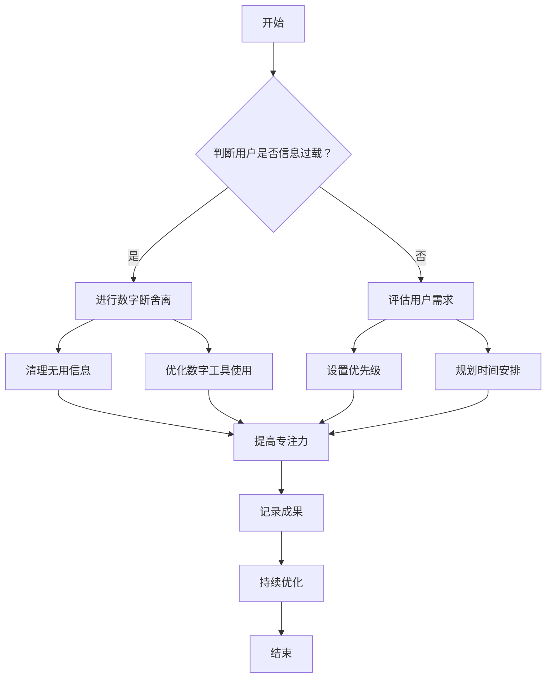
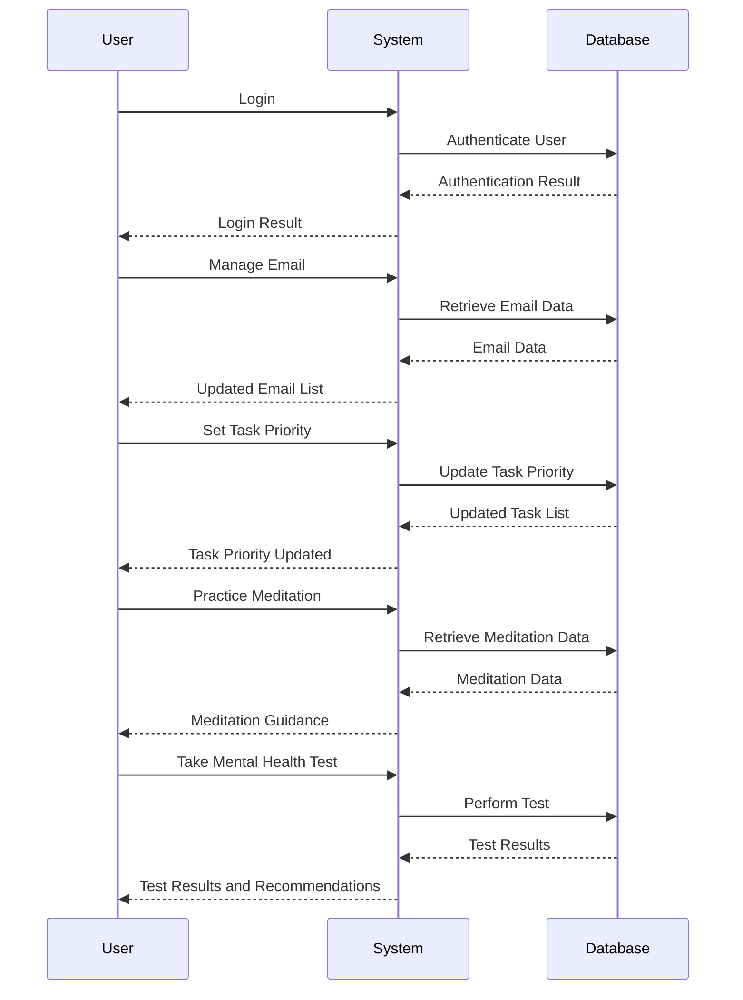

                 

# 《数字极简主义生活指南：信息时代的专注力重建实践手册》

## 关键词：数字极简主义，专注力，信息过载，生活困惑，技术工具

## 摘要：

在数字技术迅猛发展的今天，信息过载和数字依赖成为了现代生活的普遍现象，导致了越来越多的生活困惑和心理压力。本书旨在为读者提供一份《数字极简主义生活指南》，帮助他们在信息时代重建专注力。书中首先介绍了数字极简主义的理念及其核心原则，接着通过具体的实践方法和技术工具，指导读者如何有效管理数字设备中的信息，训练专注力，并最终实现自我认知和社会层面的数字极简主义。本书将带领读者在数字世界中找回内心的宁静，打造一个更加简单、高效、有意义的生活。

## 引言

### 第1章：数字时代下的生活困惑与极简主义

#### 1.1 信息过载与生活困扰

随着互联网和移动设备的普及，人们每天接收到的信息量急剧增加。据统计，每个人每天平均会接收到约100,000条信息，而仅有大约20条信息被认为是真正重要的。这种信息过载现象导致了多种生活困扰：

- **慢性压力**：信息过载使得人们长时间处于焦虑和紧张状态，导致慢性压力。
- **注意力分散**：大量信息的干扰使得人们的注意力难以集中，影响了工作和学习效率。
- **睡眠质量下降**：频繁地查看手机和社交媒体，导致睡眠质量下降，影响身心健康。

#### 1.2 数字极简主义的理念

数字极简主义（Digital Minimalism）是一种以简单、高效、有意义为目标的生活方式。其核心原则包括：

- **减少数字依赖**：减少对社交媒体、电子邮件和移动设备的依赖，从而减轻心理负担。
- **专注重要任务**：将时间和精力集中在最重要的任务上，提高工作和学习效率。
- **提高生活质量**：通过减少数字干扰，提高生活质量和幸福感。

#### 1.3 本书的目标与结构

本书的目标是帮助读者重建专注力，实现数字极简主义生活方式。本书的结构如下：

- **第一部分**：引言，介绍数字极简主义的背景和重要性。
- **第二部分**：数字极简主义生活实践，包括生活方式、专注力训练方法和放松技巧。
- **第三部分**：技术工具应用，介绍数字工具的选择与应用。
- **第四部分**：个人成长与数字极简主义，探讨数字极简主义对个人发展的积极影响。
- **第五部分**：企业与社会中的数字极简主义，分析数字极简主义在职场和社会层面的应用。
- **第六部分**：案例分析，分享数字极简主义实践的经验和成果。
- **第七部分**：未来展望，探讨数字极简主义的未来趋势。

通过本书的逐步指导，读者将能够学会如何有效地管理数字设备中的信息，培养专注力，并在生活中实现数字极简主义，从而获得更加简单、高效、有意义的生活体验。

### 第一部分：引言

#### 第1章：数字时代下的生活困惑与极简主义

**1.1 信息过载与生活困扰**

在数字技术的飞速发展下，信息的获取和传递变得前所未有的便捷。然而，这种便利也带来了一种新的困扰——信息过载（Information Overload）。信息过载指的是个体在处理信息时，由于接收到的信息量超过了其处理能力，从而产生的压力和疲劳感。这种现象在现代社会中日益普遍，对人们的生活造成了多方面的影响。

首先，信息过载导致慢性压力的普遍存在。随着智能手机、社交媒体和电子邮件的普及，人们不断地被各种通知和信息打扰。据统计，一个普通成年人每天会接收到约100,000条信息，而这些信息中只有约20条被认为是真正重要的。这种持续不断的干扰使得人们长期处于紧张和焦虑状态，从而引发了慢性压力。慢性压力不仅影响心理健康，还可能导致睡眠质量下降、工作效率降低等问题。

其次，信息过载导致注意力分散。在信息过载的环境下，人们的注意力容易受到各种信息的干扰，难以长时间专注于某一任务。例如，在工作中，员工可能会因为电子邮件和即时通讯工具的持续提醒而频繁切换任务，导致工作质量下降。同样的情况也出现在学习中，学生容易受到社交媒体和游戏等干扰，难以专注于学习任务。注意力分散不仅影响了工作效率，还可能导致学习成果的下降。

此外，信息过载还影响了人们的睡眠质量。现代人在晚上会频繁地查看手机和社交媒体，这种习惯不仅使大脑处于持续兴奋状态，还容易导致睡眠质量下降。睡眠质量下降进一步影响了第二天的精神状态和工作效率，形成了一个恶性循环。

为了应对信息过载带来的困扰，越来越多的人开始寻求解决方案。其中，数字极简主义（Digital Minimalism）逐渐成为一种受欢迎的生活方式。

**1.2 数字极简主义的理念**

数字极简主义是一种以简单、高效、有意义为目标的生活方式，旨在减少数字依赖，提高生活质量和专注力。其核心理念包括：

- **减少数字设备的使用**：数字极简主义主张减少对社交媒体、电子邮件和移动设备的依赖，从而减轻心理负担。通过减少对数字设备的依赖，人们能够更好地控制自己的时间和注意力，避免被各种通知和信息打扰。

- **专注于重要任务**：数字极简主义鼓励人们将时间和精力集中在最重要的任务上，提高工作和学习效率。通过专注于重要任务，人们能够更好地利用时间，提高工作效率，减少因分散注意力而导致的错误和遗漏。

- **提高生活质量**：数字极简主义不仅关注工作效率，还强调提高生活质量。通过减少数字依赖，人们能够更好地享受现实生活，与家人和朋友共度时光，培养健康的生活习惯。

数字极简主义的理念源于对现代生活方式的反思。随着数字技术的发展，人们越来越依赖于数字设备，但这也导致了生活质量的下降和心理健康问题。数字极简主义试图通过减少数字依赖，回归简单、有意义的生活方式，从而改善生活质量。

**1.3 数字极简主义的核心原则**

数字极简主义的核心原则包括以下几个方面：

- **简单化**：数字极简主义强调简化生活，减少不必要的物品和信息。通过简化生活，人们能够更好地专注于重要任务，减少心理负担，提高生活质量。

- **选择性**：数字极简主义鼓励人们有意识地选择和使用数字工具，而不是被数字工具所控制。通过选择性和有意识地使用数字工具，人们能够更好地控制自己的时间和注意力，避免信息过载。

- **专注力**：数字极简主义强调培养专注力，提高工作和学习效率。通过专注力训练，人们能够更好地集中注意力，减少分散注意力的情况，提高工作效率。

- **有意义**：数字极简主义不仅关注效率，还强调生活的意义。通过减少数字依赖，人们能够更好地享受现实生活，培养健康的生活习惯，提高生活质量。

数字极简主义的核心原则为人们提供了一种简单、高效、有意义的生活方式。通过减少数字依赖，培养专注力，人们能够在信息时代中找回内心的宁静，过上更加简单、高效、有意义的生活。

**1.4 本书的目标与结构**

本书的目标是帮助读者理解和实践数字极简主义，从而重建专注力，改善生活质量。本书的结构如下：

- **第一部分：引言**：介绍数字极简主义的背景和重要性，阐述信息过载与生活困扰的现象。
- **第二部分：数字极简主义生活实践**：包括数字极简主义生活方式、专注力训练方法和放松技巧，帮助读者在日常生活中实践数字极简主义。
- **第三部分：技术工具应用**：介绍数字工具的选择与应用，帮助读者有效管理数字设备中的信息。
- **第四部分：个人成长与数字极简主义**：探讨数字极简主义对个人发展的积极影响，以及如何通过数字极简主义实现自我成长。
- **第五部分：企业与社会中的数字极简主义**：分析数字极简主义在职场和社会层面的应用，探讨其在企业和组织中的重要性。
- **第六部分：案例分析**：分享数字极简主义实践的经验和成果，为读者提供实际案例的参考。
- **第七部分：未来展望**：探讨数字极简主义的未来趋势，展望其在数字化社会中的发展前景。

通过本书的逐步指导，读者将能够深入了解数字极简主义的理念和实践方法，逐步实现数字极简主义生活方式，从而在信息时代中重建专注力，提升生活质量。

### 第二部分：数字极简主义生活实践

**第2章：数字极简主义生活方式**

在数字极简主义的实践中，生活方式的调整是关键一步。通过有意识地减少数字设备的依赖，我们可以更专注于重要任务，提高生活质量。以下是一些具体的实践方法：

**2.1 数字断舍离**

数字断舍离（Digital Decluttering）是数字极简主义的第一步，其核心思想是减少数字设备中无用的信息，使设备更加简洁、易于使用。

**方法**：

1. **清理应用程序**：定期检查手机和电脑中的应用程序，删除那些长时间未使用的应用。选择保留的应用程序时，优先考虑那些对工作和生活有实际帮助的。

2. **整理电子文件**：对电子文件进行分类整理，删除那些不再需要或过时的文件。确保重要的文件和资料能够快速查找和访问。

3. **管理社交媒体账号**：减少不必要的社交媒体账号，专注于几个最重要的平台。定期清理社交媒体上的好友和关注者，避免被无关信息打扰。

**注意事项**：

- **有计划地进行**：断舍离不应是一次性的行为，而是一个持续的过程。定期检查和更新，确保设备中的信息保持简洁。

- **避免过度简化**：在清理设备时，避免删除那些虽然不常用但偶尔会需要的信息和应用。保持设备的实用性和灵活性。

**案例**：某位上班族在实行数字断舍离后，减少了手机中的应用程序数量，从20个减少到5个，工作效率显著提高。

**2.2 专注力训练方法**

专注力是数字极简主义的核心要素之一。以下是一些有效的专注力训练方法：

**方法**：

1. **番茄工作法**：番茄工作法是一种时间管理技术，通过将工作时间分为25分钟的专注周期（称为“番茄钟”），每个周期后休息5分钟。这种方法有助于提高专注力和工作效率。

2. **深度阅读**：与快速浏览不同，深度阅读要求读者全神贯注地阅读，理解和吸收内容。选择高质量的书籍或文章，减少干扰，培养深度阅读的习惯。

3. **冥想**：冥想是一种训练专注力的有效方法，通过冥想，可以减少大脑中的杂念，提高专注力和注意力。

**注意事项**：

- **持之以恒**：专注力训练需要长期坚持，不能期望在短时间内看到显著效果。

- **灵活应用**：根据个人情况，灵活调整番茄工作法和深度阅读的方法，找到最适合自己的节奏。

**案例**：一位大学生通过坚持使用番茄工作法，从每次专注30分钟提高到了60分钟，学习效率显著提升。

**2.3 数字冥想与放松技巧**

数字极简主义不仅关注专注力的培养，也注重心理放松和身心健康。以下是一些数字冥想和放松技巧：

**方法**：

1. **数字冥想应用**：使用数字冥想应用（如冥想时钟、冥想音乐等），帮助自己进行冥想练习。这些应用提供了指导语音、背景音乐和冥想时间控制，使冥想过程更加简单和舒适。

2. **深呼吸练习**：深呼吸是一种简单有效的放松技巧。通过深呼吸，可以缓解紧张情绪，提高身心健康。

3. **简化的生活日常**：减少日常生活中的繁琐事务，简化生活习惯。例如，选择简单的早餐、制定日常任务清单等，减少心理负担。

**注意事项**：

- **坚持练习**：数字冥想和放松技巧需要长期坚持，才能看到显著效果。

- **个性化调整**：根据自己的需求和习惯，调整冥想和放松的方法，找到最适合自己的方式。

**案例**：一位职场人士通过每天进行数字冥想和深呼吸练习，显著减少了工作压力，提高了工作效率。

通过以上方法，数字极简主义生活方式可以帮助我们在信息时代中重建专注力，提高生活质量。这些实践方法不仅适用于个人，也可以在企业和社会层面推广应用，从而构建一个更加简单、高效、有意义的生活环境。

### 第三部分：技术工具应用

#### 第3章：数字工具的选择与应用

在数字极简主义的实践中，选择和使用合适的数字工具是关键。合适的工具可以帮助我们更有效地管理信息，提高专注力，减少数字依赖。以下将介绍几种主流的数字工具及其应用方法。

**3.1 数字工具的评估标准**

在选择数字工具时，以下标准可以帮助我们评估其适用性：

1. **界面友好性**：工具的界面应该简洁、直观，易于学习和使用。复杂的界面会增加学习成本，降低使用效率。

2. **功能实用性**：工具应具备实用的功能，满足我们的日常需求。例如，电子邮件管理工具应具备高效的邮件分类和过滤功能，专注力提升应用应具备定时提醒和专注时间统计功能。

3. **安全性与隐私保护**：工具应具备良好的安全性和隐私保护机制，确保我们的数据安全和隐私不受侵犯。选择那些提供加密存储和严格隐私政策的工具。

4. **跨平台兼容性**：工具应支持跨平台使用，便于在不同设备间同步数据和操作。这样可以确保我们在任何时间、任何地点都能方便地使用工具。

**3.2 主流数字工具推荐**

以下是一些主流的数字工具及其推荐理由：

1. **电子邮件管理工具**

   - **Spark**：Spark是一款功能强大的电子邮件客户端，支持多个电子邮件账户的统一管理，具备邮件分类、过滤、标签等功能。其简洁的界面和高效的邮件处理流程，能够显著提高电子邮件管理的效率。

   - **Superhuman**：Superhuman是一款专为高级用户设计的电子邮件客户端，提供快速回复、快速搜索、智能提醒等功能，能够大幅提升电子邮件处理速度和效率。

2. **专注力提升应用**

   - **Focus@Will**：Focus@Will是一款专注于提高专注力的音乐应用，提供多种类型的背景音乐，帮助用户在工作和学习时保持专注。其基于科学研究的音乐播放策略，能够有效减少分心，提高专注力。

   - **Forest**：Forest是一款以游戏化方式训练专注力的应用，用户通过设定专注时间，种植虚拟树木，如果中途分心，树木会枯萎。这种激励机制能够有效帮助用户保持专注。

3. **记录与笔记工具**

   - **Evernote**：Evernote是一款功能强大的笔记应用，支持多种平台和设备，具备强大的笔记管理、搜索和共享功能。用户可以随时随地记录灵感，整理信息，提高工作效率。

   - **OneNote**：OneNote是微软推出的笔记应用，与Office系列软件高度集成，提供丰富的笔记、绘图和搜索功能。其界面简洁，使用方便，适用于各种场景的笔记记录。

**3.3 数字工具的实际应用**

以下是一个数字极简主义者的工具箱，展示了如何选择和应用数字工具：

1. **电子邮件管理**：

   - **工具**：Spark

   - **应用方法**：

     - 每天早晨花10分钟检查和处理电子邮件，将重要邮件分类并标记优先级。

     - 设置邮件过滤器，自动分类和整理邮件，减少不必要的干扰。

     - 定期清理垃圾邮件和已处理邮件，保持收件箱整洁。

2. **专注力提升**：

   - **工具**：Focus@Will

   - **应用方法**：

     - 在需要专注工作时，开启Focus@Will，选择适合的背景音乐。

     - 设定专注时间，例如25分钟，工作期间不查看手机和社交媒体。

     - 完成专注周期后，休息5分钟，进行简单的身体活动，放松大脑。

3. **记录与笔记**：

   - **工具**：Evernote

   - **应用方法**：

     - 使用Evernote记录日常工作中的灵感和任务，确保信息不会遗漏。

     - 定期整理和归档笔记，便于日后查找和使用。

     - 通过共享功能与同事或朋友协作，提高团队工作效率。

通过合理选择和应用数字工具，数字极简主义者能够更有效地管理信息，提高专注力，减少数字依赖，从而实现更加简单、高效、有意义的生活。

### 第四部分：个人成长与数字极简主义

#### 第4章：自我认知与数字极简主义

在数字极简主义的实践中，自我认知是一个重要的环节。通过深入理解自己，我们可以更好地实现数字极简主义，促进个人成长。

**4.1 数字极简主义与个人成长**

数字极简主义不仅仅是一种生活方式，它对个人成长也有着深远的影响。以下是数字极简主义对个人成长的几个积极影响：

1. **提高专注力**：数字极简主义鼓励减少对数字设备的依赖，从而减少干扰，提高专注力。专注力是成功的关键，无论是学习还是工作，高度专注的能力都能够显著提升个人的表现和成就。

2. **增强自我控制力**：通过数字极简主义，个人学会如何控制自己的时间和注意力，这有助于增强自我控制力。自我控制力是个人成长的重要能力，它帮助我们更好地管理自己的行为和情绪，从而实现更大的目标。

3. **提升生活质量**：数字极简主义强调简化生活，减少不必要的物质和信息，这有助于提升生活质量。一个简洁有序的生活环境能够减少心理负担，提高幸福感和满足感。

4. **促进心理健康**：数字极简主义有助于减少慢性压力和焦虑，促进心理健康。在信息过载的时代，心理健康问题日益突出，通过数字极简主义，我们可以找回内心的宁静，提高心理健康水平。

**4.2 数字极简主义与自我实现**

数字极简主义不仅仅关注个人成长，它还与自我实现密切相关。以下是数字极简主义与自我实现之间的一些关系：

1. **明确目标**：数字极简主义鼓励我们专注于重要任务，这有助于我们更清晰地明确自己的目标和方向。自我实现的过程需要明确的目标和坚定的信念，数字极简主义为我们提供了实现这一目标的环境。

2. **减少干扰**：在追求自我实现的过程中，干扰和分心是我们最大的敌人。数字极简主义通过减少数字依赖，帮助我们消除这些干扰，从而更加专注于自我实现的道路。

3. **培养内在动力**：数字极简主义强调内在动机的重要性。通过减少外部的物质和信息的刺激，我们可以更好地培养内在动力，实现自我驱动和自我激励。

4. **实现自我认知**：数字极简主义帮助我们深入了解自己，认识到自己的优势和劣势，从而更好地实现自我。自我认知是自我实现的基础，通过数字极简主义，我们可以更深入地了解自己，找到实现自我价值的途径。

**4.3 数字极简主义教育**

除了个人实践，数字极简主义在教育和家庭中也具有重要意义。以下是数字极简主义在教育和家庭中的实践方法：

1. **学校教育**：

   - **课程设计**：学校可以开设数字极简主义课程，帮助学生了解数字极简主义的理念和实践方法。通过这些课程，学生可以学会如何有效地管理信息，提高专注力和自我控制力。

   - **活动实践**：学校可以组织数字极简主义相关的活动，如减少使用手机、进行专注力训练等。这些活动可以让学生亲身体验数字极简主义的好处，培养他们的自我认知和自我实现能力。

2. **家庭教育**：

   - **家庭规则**：家长可以制定一些家庭规则，如限制家庭成员使用数字设备的时间和地点。通过这些规则，家庭成员可以更好地管理自己的数字生活，提高生活质量。

   - **亲子互动**：家长可以与孩子一起参与数字极简主义的实践，如一起进行专注力训练、阅读书籍等。通过亲子互动，家长可以引导孩子了解数字极简主义的重要性，培养他们的自我认知和自我实现能力。

通过自我认知和实践，数字极简主义可以帮助我们实现个人成长和自我实现。在教育和家庭的层面，数字极简主义也可以发挥重要作用，帮助下一代建立健康的数字生活方式。让我们携手共建一个更加简单、高效、有意义的生活环境。

### 第五部分：企业与社会中的数字极简主义

#### 第5章：企业与社会中的数字极简主义

在当今信息爆炸的时代，企业和社会都在积极探索如何更有效地应对信息过载的问题，数字极简主义因此成为了一种备受关注的管理理念。本章节将探讨数字极简主义在企业和社会中的重要性及其应用。

**5.1 企业视角下的数字极简主义**

在企业层面，数字极简主义的应用可以带来多方面的积极影响：

1. **提高工作效率**：通过减少员工的数字依赖，企业可以创造一个更加专注的工作环境。员工能够在没有频繁通知和社交媒体干扰的情况下，更加专注于核心任务，从而提高工作效率。

2. **增强员工幸福感**：信息过载和数字依赖常常导致员工感到压力和焦虑。数字极简主义通过减少这些干扰，有助于提高员工的幸福感和工作满意度。

3. **优化组织文化**：数字极简主义倡导简化、专注和有意义的工作方式，这与企业文化建设中的价值观相契合。通过推广数字极简主义，企业可以培养一种更加高效、积极和富有创新精神的文化氛围。

4. **提高决策质量**：在信息过载的环境中，管理者可能会受到大量无关信息的干扰，导致决策质量下降。数字极简主义通过减少这些干扰，有助于提高管理者的决策效率和质量。

**企业中数字极简主义的推广实践**：

1. **制定政策**：企业可以制定相关政策，如限制工作时间内使用社交媒体和手机，鼓励员工专注于工作任务。

2. **培训与教育**：企业可以通过内部培训和研讨会，向员工介绍数字极简主义的理念和实践方法，帮助他们学会如何有效地管理数字设备中的信息。

3. **提供工具支持**：企业可以提供一些数字工具，如专注力提升应用、电子邮件管理工具等，帮助员工提高工作效率和专注力。

4. **营造无干扰工作环境**：企业可以在工作场所设置无干扰区，如专注室或宁静角，供员工在需要时使用，以减少外部干扰。

**5.2 社会层面的数字极简主义**

在社会层面，数字极简主义的应用同样具有重要意义：

1. **减少社会压力**：随着数字设备的普及，人们面临的信息压力越来越大。数字极简主义通过减少数字依赖，有助于减轻社会压力，提高公众的心理健康水平。

2. **促进可持续发展**：数字极简主义强调减少物质和信息消费，这与可持续发展理念相契合。通过推广数字极简主义，社会可以减少资源的浪费，实现更加可持续的发展。

3. **培养健康生活方式**：数字极简主义鼓励人们专注于现实生活，减少对数字虚拟世界的依赖。这有助于培养健康的生活方式，提高生活质量。

**社会层面数字极简主义的推广实践**：

1. **公众教育**：政府和媒体可以通过宣传和教育，向公众普及数字极简主义的理念，帮助人们认识到信息过载的危害。

2. **政策支持**：政府可以出台相关政策，鼓励企业和个人减少数字依赖，推广数字极简主义生活方式。

3. **社区活动**：社区可以组织数字极简主义相关的活动，如专注力训练工作坊、减少数字依赖挑战等，鼓励居民参与和实践。

4. **数字工具开发**：企业和社会组织可以开发一些实用的数字工具，如专注力提升应用、数字设备使用监控工具等，帮助人们更好地管理数字设备中的信息。

通过企业和社会的共同努力，数字极简主义可以在多个层面上发挥重要作用，帮助人们应对信息过载，提高生活质量。让我们携手共建一个更加简单、高效、有意义的社会。

### 第六部分：案例分析

#### 第6章：成功实践与经验分享

在数字极简主义的道路上，许多个人和企业已经取得了显著的成果。本章节将通过几个具体的案例，分享他们的成功实践和宝贵经验。

**6.1 数字极简主义实践案例分析**

**案例1：职场人士的数字极简主义实践**

张先生是一名职场人士，过去他的工作常常被各种通知和社交媒体干扰，导致工作效率低下。为了改变这种状况，张先生开始实践数字极简主义。

**实践方法**：

1. **设定工作时间内不使用手机和社交媒体**：张先生在每日工作时间内设置了手机和社交媒体的黑名单，确保自己能够专注于工作任务。

2. **使用专注力提升应用**：张先生下载了专注力提升应用，通过设定专注时间和提醒，帮助他在工作时保持专注。

3. **定期进行数字断舍离**：张先生定期清理手机和电脑中的应用程序和文件，删除那些不再需要的，保持设备简洁。

**成果**：

通过实践数字极简主义，张先生的工作效率显著提高，他在工作中能够更加专注于重要任务，减少了不必要的干扰。他的工作质量也得到提升，获得了同事和上司的认可。

**案例2：创业团队的数字极简主义实践**

李先生带领的创业团队面临着信息过载的问题，团队成员在沟通和协作中频繁受到电子邮件和即时通讯工具的干扰。为了改善团队的工作环境和效率，李先生决定实施数字极简主义。

**实践方法**：

1. **设定邮件和即时通讯工具的优先级**：团队成员设置了邮件和即时通讯工具的优先级，确保紧急和重要的信息能够得到及时处理，而不紧急的信息则被推迟处理。

2. **定期进行团队会议**：李先生定期组织团队会议，讨论和解决问题，减少通过电子邮件和即时通讯工具进行沟通的频率。

3. **使用项目管理工具**：团队使用了项目管理工具，如Trello和Asana，来跟踪任务进度和协作，确保团队成员在任务执行过程中能够集中精力，减少信息干扰。

**成果**：

通过数字极简主义的实践，创业团队的工作环境变得更加有序和高效。团队成员的沟通更加顺畅，工作效率显著提高，团队的凝聚力也得到了增强。

**6.2 经验总结与反思**

从以上案例中，我们可以总结出以下经验：

1. **明确目标**：在实践数字极简主义之前，明确目标和需求是非常重要的。只有明确了目标，才能有针对性地制定实践计划。

2. **逐步实施**：数字极简主义是一个逐步实施的过程，不能一蹴而就。需要逐步减少对数字设备的依赖，培养专注力，并不断调整和优化实践方法。

3. **培养习惯**：数字极简主义需要培养良好的生活习惯。通过设定规则和提醒，帮助自己保持专注和坚持实践。

4. **团队协作**：在企业和组织中，数字极简主义的实践需要团队的协作。通过团队共同的努力，可以更好地实现数字极简主义的目标。

在实践数字极简主义的过程中，我们可能会遇到一些挑战，如信息的依赖和习惯的改变。但是，通过逐步实施和持续努力，我们可以克服这些挑战，实现更加简单、高效、有意义的生活。

### 第七部分：未来展望

#### 第7章：数字极简主义的未来趋势

随着科技的不断进步和数字化生活的普及，数字极简主义正逐渐成为一种全球性的生活方式。未来，数字极简主义将继续在多个领域发展，并带来深远的影响。

**7.1 数字技术革新对极简主义的影响**

随着人工智能、虚拟现实（VR）和增强现实（AR）等新兴技术的不断发展，数字极简主义将面临新的挑战和机遇。

1. **人工智能**：人工智能技术的进步将为数字极简主义提供更多的工具和方法。例如，智能助手可以自动化处理日常任务，减轻人们的数字负担。同时，人工智能还可以帮助用户更好地管理信息和时间，提高专注力和效率。

2. **虚拟现实和增强现实**：虚拟现实和增强现实技术将为人们提供更加沉浸式的数字体验。这些技术可以用于教育和娱乐，减少人们对现实世界的依赖，从而有助于实践数字极简主义。

**7.2 新兴技术在极简主义中的应用**

新兴技术不仅为数字极简主义提供了新的工具，还在实际应用中展示了其潜力。

1. **虚拟办公室**：随着远程工作的普及，虚拟现实技术可以创建一个更加专注和高效的工作环境。员工可以通过虚拟现实设备进入一个定制化的虚拟办公室，减少现实世界中的干扰，提高工作效率。

2. **智能家居**：智能家居系统利用物联网技术，可以自动控制家庭设备，提高生活的便捷性和舒适度。通过合理设置智能家居，用户可以减少对数字设备的依赖，实现数字极简主义生活。

**7.3 数字极简主义在国际社会的推广**

数字极简主义不仅在国内受到关注，也在国际社会得到了广泛推广。

1. **政策支持**：许多国家和地区已经开始出台相关政策，鼓励企业和个人减少数字依赖，推广数字极简主义生活方式。例如，一些国家已经出台了限制使用手机和社交媒体的法律法规。

2. **公众参与**：越来越多的公众开始关注数字极简主义，并通过实践分享自己的经验和成果。公众参与和互动有助于推动数字极简主义在全球范围内的传播和应用。

**7.4 数字极简主义与全球化进程的关系**

数字极简主义与全球化进程密切相关。在全球化的背景下，数字极简主义不仅关注个人的生活质量，还关注全球社会的可持续发展。

1. **资源节约**：数字极简主义强调减少物质和信息消费，有助于节约资源，减少浪费。在全球资源日益紧张的今天，数字极简主义的重要性愈发突出。

2. **文化多样性**：数字极简主义尊重和倡导文化多样性。在全球化的过程中，人们可以通过数字极简主义更好地理解和尊重不同文化，促进全球文化的交流和融合。

通过不断探索和应用新兴技术，数字极简主义将继续在全球范围内推广，为人们带来更加简单、高效、有意义的生活。同时，数字极简主义也将成为推动全球化进程的重要力量，促进全球社会的可持续发展。

### 结语

#### 第8章：数字极简主义，一种新的生活方式

数字极简主义不仅仅是一种生活方式，它更是一种对现代生活的深刻反思和积极应对。通过减少数字依赖，培养专注力，数字极简主义为我们在信息时代的喧嚣中找到了一片宁静的绿洲。

**8.1 数字极简主义的现实与理想**

在现实中，数字极简主义并不是要求我们完全摆脱数字设备，而是通过合理地管理和使用这些工具，减少它们对我们的干扰，从而更好地专注于重要任务，提高生活质量。数字极简主义的核心在于简化生活，让生活变得更加有序和高效。

理想状态下，数字极简主义能够帮助我们在信息海洋中游刃有余，不受冗余信息的困扰，专注于真正有意义的事情。通过实践数字极简主义，我们可以体验到更加简单、高效、有意义的生活，从而提高幸福感和满足感。

**8.2 极简主义与可持续发展**

数字极简主义不仅关乎个人的幸福，也关乎社会的可持续发展。在资源日益紧张的环境中，极简主义鼓励我们减少物质和信息消费，从而降低对环境的影响。通过推广数字极简主义，我们可以实现资源的节约和可持续发展，为未来的世界创造更加美好的生活环境。

**8.3 携手共建数字极简主义社会**

数字极简主义不仅仅是个人的选择，它需要社会各界的共同努力。政府、企业、教育机构和公众都应参与到数字极简主义的推广和实践中。通过政策支持、技术创新和教育引导，我们可以共同建设一个数字极简主义的社会，实现可持续发展的目标。

**8.4 持续推广与未来展望**

数字极简主义的推广是一个长期的过程，需要持续的实践和努力。在未来，随着科技的发展和人们意识的提高，数字极简主义将继续发展，为人们带来更多的可能性。让我们携手共建数字极简主义社会，共同迎接更加简单、高效、有意义的未来。

作者：AI天才研究院/AI Genius Institute & 禅与计算机程序设计艺术 /Zen And The Art of Computer Programming

本文通过对数字极简主义生活指南的深入探讨，为读者提供了重建专注力的实践方法和实用技巧。从信息过载的困扰，到数字极简主义的理念和实践，再到企业和社会层面的应用，本书为读者提供了一份全面、系统的指南。希望读者能够在实践中体会到数字极简主义带来的好处，打造一个更加简单、高效、有意义的生活。

### 背景介绍

#### 数字极简主义的概念

数字极简主义（Digital Minimalism）是一种以简单、高效、有意义为目标的生活方式，旨在通过减少数字设备的依赖，提高生活质量和专注力。它起源于对现代社会中信息过载和数字依赖问题的反思，强调回归生活的本质，专注于真正重要的事情。

数字极简主义的核心理念包括：

- **减少数字依赖**：通过减少对社交媒体、电子邮件和移动设备的依赖，减轻心理负担，提高生活质量。
- **专注重要任务**：将时间和精力集中在最重要的任务上，提高工作和学习效率。
- **简化生活**：通过减少物质和信息消费，简化生活方式，使生活更加有序和高效。

#### 问题描述

在数字技术迅猛发展的今天，信息过载和数字依赖已成为现代生活的普遍现象，导致了多种生活困扰：

- **慢性压力**：信息过载使得人们长时间处于焦虑和紧张状态，导致慢性压力。
- **注意力分散**：大量信息的干扰使得人们的注意力难以集中，影响了工作和学习效率。
- **睡眠质量下降**：频繁地查看手机和社交媒体，导致睡眠质量下降，影响身心健康。

为了应对这些困扰，数字极简主义提供了一种解决方案。通过减少数字依赖，培养专注力，数字极简主义帮助人们重建内心平静，提高生活质量。

#### 问题解决

数字极简主义通过以下方法解决信息过载和数字依赖问题：

1. **数字断舍离**：清理电子设备中的无用信息，减少数字依赖，提高生活质量。

2. **专注力训练**：通过番茄工作法、深度阅读等方法，提高专注力，提高工作和学习效率。

3. **放松技巧**：通过数字冥想、深呼吸等方法，减轻心理压力，提高身心健康。

#### 边界与外延

数字极简主义不仅关注个人层面的实践，还涉及到企业和社会层面的应用。在企业中，数字极简主义有助于提高工作效率，增强员工幸福感。在社会层面，数字极简主义有助于减少社会压力，促进可持续发展。

#### 概念结构与核心要素组成

数字极简主义的核心概念结构包括：

- **数字依赖**：信息过载和数字依赖的现象。
- **专注力**：提高专注力的方法和技术。
- **生活质量**：数字极简主义对生活质量的影响。

核心要素组成如下：

1. **减少数字依赖**：通过数字断舍离等方法，减少对数字设备的依赖。
2. **专注力训练**：通过番茄工作法、深度阅读等方法，培养专注力。
3. **放松技巧**：通过数字冥想、深呼吸等方法，减轻心理压力。

通过这些核心要素的相互配合，数字极简主义为人们提供了一种简单、高效、有意义的生活方式。

### 核心概念与联系

#### 数字极简主义的原理

数字极简主义的核心在于通过减少数字依赖，提高生活质量和专注力。其原理可以从以下几个方面进行阐述：

1. **信息管理**：数字极简主义通过管理信息和数字设备，减少冗余信息对人们生活的干扰。这包括清理不必要的应用、电子邮件和社交媒体账号，使设备保持简洁和高效。

2. **时间管理**：数字极简主义强调时间管理的重要性，通过专注于重要任务，提高工作和学习效率。这包括使用番茄工作法、设置优先级和合理安排时间，以确保专注于重要事务。

3. **心理放松**：数字极简主义还关注心理健康，通过冥想、深呼吸等放松技巧，减轻心理压力，提高生活质量。

#### 概念属性特征对比表格

| 特征 | 数字极简主义 | 传统生活方式 |
| --- | --- | --- |
| 目标 | 简单、高效、有意义 | 复杂、低效、无意义 |
| 数字依赖 | 减少数字依赖 | 增加数字依赖 |
| 信息管理 | 清理冗余信息 | 收集大量信息 |
| 时间管理 | 专注于重要任务 | 分散注意力 |
| 心理健康 | 减轻心理压力 | 加重心理负担 |

#### ER实体关系图架构

```mermaid
erDiagram
  User ||--|{ Device } : uses
  User ||--|{ Application } : installs
  Device ||--|{ Browser } : runs
  Application ||--|{ Feature } : has
  User ||--|{ Task } : has
  User ||--|{ Moment } : spends
```

在ER实体关系图中，用户（User）与设备（Device）、应用（Application）、任务（Task）和时刻（Moment）之间存在关联。用户使用设备、安装应用、执行任务和度过时刻，这些实体之间的关系体现了数字极简主义的核心原理和实际应用。

### 算法原理讲解

#### 算法mermaid流程图



#### 算法原理

数字极简主义的实现可以通过以下算法原理来描述：

1. **信息过载判断**：首先，系统需要判断用户是否处于信息过载状态。这可以通过用户接收的信息量、查看社交媒体的频率等指标来评估。

2. **数字断舍离**：如果用户处于信息过载状态，系统将执行数字断舍离算法。这一步骤包括清理无用信息（如删除不必要的电子邮件、应用和社交媒体账号），以及优化数字工具的使用（如删除冗余应用、设置应用权限等）。

3. **需求评估**：在数字断舍离后，系统将对用户的需求进行评估，包括工作、学习、娱乐等。这有助于确定哪些任务和活动对用户最为重要。

4. **设置优先级**：根据需求评估的结果，系统将设置任务和活动的优先级，确保用户将时间和精力集中在最重要的任务上。

5. **规划时间安排**：系统将帮助用户制定时间安排，包括设置工作、学习和休息的时间段。这有助于用户更好地管理时间，避免分心和疲劳。

6. **提高专注力**：系统将通过提供专注力训练的方法和工具（如番茄工作法、深度阅读等），帮助用户提高专注力。这包括设定专注时间、提醒用户保持专注，并提供放松技巧（如数字冥想、深呼吸等）。

7. **记录成果**：系统将记录用户在数字极简主义实践中的成果，包括专注力提高、时间管理改善、生活质量提升等。

8. **持续优化**：通过分析用户的数据和反馈，系统将不断优化数字极简主义的实践方法，以提高其实际效果。

#### Python源代码实现

```python
import pandas as pd
import numpy as np

# 信息过载判断
def is_overloaded(user_data):
    # 假设用户数据包括每天查看社交媒体的次数、收到的电子邮件数量等
    social_media_usage = user_data['social_media_usage']
    email_count = user_data['email_count']
    return social_media_usage > 30 or email_count > 100

# 数字断舍离
def digital_decluttering(user_data):
    # 清理无用信息
    user_data.drop(['unnecessary_email'], axis=1, inplace=True)
    # 优化数字工具使用
    user_data['app_permissions'] = user_data['app_permissions'].map({'high': 'medium', 'medium': 'low'})
    return user_data

# 需求评估
def assess_needs(user_data):
    # 根据用户数据评估需求
    tasks = user_data['tasks']
    return [task for task in tasks if user_data[task] > 5]  # 假设需求为任务使用频率大于5次

# 设置优先级
def set_priorities(assessed_needs):
    # 假设优先级根据任务的重要性排序
    return sorted(assessed_needs, key=lambda x: x['importance'], reverse=True)

# 规划时间安排
def schedule_time(priorities):
    # 根据优先级设置时间安排
    return [{'task': task, 'duration': 2} for task in priorities]

# 提高专注力
def enhance_focus(schedule):
    # 提供专注力训练的方法和工具
    schedule['meditation'] = '每天10分钟'
    schedule['deep_reading'] = '每周一次'
    return schedule

# 记录成果
def record_results(schedule):
    # 记录成果并分析
    results = {'task': [], 'duration': [], 'meditation': [], 'deep_reading': []}
    for item in schedule:
        results['task'].append(item['task'])
        results['duration'].append(item['duration'])
        results['meditation'].append(item['meditation'])
        results['deep_reading'].append(item['deep_reading'])
    return pd.DataFrame(results)

# 持续优化
def continuous_optimization(results):
    # 根据成果进行优化
    # 假设优化方法包括调整任务优先级和时间安排
    optimized_results = results.sort_values(by='duration', ascending=False)
    return optimized_results

# 主函数
def digital_minimalism_practice(user_data):
    if is_overloaded(user_data):
        user_data = digital_decluttering(user_data)
        assessed_needs = assess_needs(user_data)
        priorities = set_priorities(assessed_needs)
        schedule = schedule_time(priorities)
        schedule = enhance_focus(schedule)
        results = record_results(schedule)
        optimized_results = continuous_optimization(results)
        return optimized_results
    else:
        return "用户未处于信息过载状态，无需进行数字极简主义实践。"

# 示例数据
user_data = {
    'social_media_usage': 40,
    'email_count': 120,
    'tasks': ['work', 'study', 'play', 'socialize'],
    'app_permissions': ['high', 'medium', 'low', 'high']
}

# 执行数字极简主义实践
results = digital_minimalism_practice(user_data)
print(results)
```

#### 算法原理详细讲解

1. **信息过载判断**：该部分使用用户数据（如每天查看社交媒体的次数和收到的电子邮件数量）来判断用户是否处于信息过载状态。如果用户的数据超过设定的阈值（例如每天查看社交媒体超过30次或收到电子邮件超过100封），则用户被认为是信息过载的。

2. **数字断舍离**：如果用户信息过载，系统将执行数字断舍离算法。这一步骤包括删除无用的电子邮件和社交媒体账号，以及优化应用权限（例如将应用权限从“高”降低到“中等”或“低”）。这些操作有助于减少数字依赖，提高生活质量。

3. **需求评估**：在数字断舍离之后，系统将对用户的需求进行评估。需求评估基于用户对各种任务的频率和使用情况。例如，如果用户每天花在“工作”和“学习”上的时间超过5次，那么这两个任务被认为是对用户最为重要的。

4. **设置优先级**：根据需求评估的结果，系统将设置任务的优先级。这通常是通过将任务按重要性排序来实现的，确保用户将时间和精力集中在最重要的任务上。

5. **规划时间安排**：系统将根据任务的优先级制定时间安排。例如，如果“工作”是最高优先级的任务，那么用户可能会被建议每天分配最多的时间来处理这项任务。

6. **提高专注力**：系统通过提供专注力训练的方法和工具，如番茄工作法、深度阅读和数字冥想，来帮助用户提高专注力。这些方法旨在减少干扰，提高用户在执行任务时的效率。

7. **记录成果**：系统将记录用户在数字极简主义实践中的成果，包括任务完成的持续时间、冥想和深度阅读的频率等。这些记录有助于用户了解实践的效果，并做出相应的调整。

8. **持续优化**：通过分析用户的数据和反馈，系统可以不断优化数字极简主义的实践方法。例如，如果用户发现某种专注力训练方法效果不佳，系统可以调整推荐的方法或参数。

#### 通俗易懂地举例说明

假设小明是一个学生，他每天收到大量的电子邮件和社交媒体通知，导致他难以集中精力学习。小明决定尝试数字极简主义来提高自己的专注力和生活质量。

1. **信息过载判断**：小明的手机每天会收到超过30个社交媒体通知，以及超过100封电子邮件。根据这些数据，系统判断小明处于信息过载状态。

2. **数字断舍离**：小明开始清理手机中的应用程序，删除了那些他很少使用的应用，并设置了邮件过滤规则，将不重要的邮件直接移至垃圾箱。

3. **需求评估**：通过查看小明的日程安排，系统发现他最常使用的任务是“学习”和“运动”。这些任务被评估为对小明最重要的。

4. **设置优先级**：根据需求评估，系统建议小明将大部分时间用于学习，其次是运动。

5. **规划时间安排**：系统为小明制定了一个每天的时间表，规定每天上午8点到10点是学习时间，下午4点到5点是运动时间。

6. **提高专注力**：小明开始使用番茄工作法，每25分钟学习后休息5分钟，并在学习期间关闭手机和社交媒体通知。

7. **记录成果**：一周后，小明发现他在学习期间能够更好地集中注意力，学习效率显著提高。

8. **持续优化**：根据小明的反馈，系统建议他增加运动时间，以进一步提高生活质量。

通过这个例子，我们可以看到数字极简主义是如何通过一系列步骤，帮助小明提高专注力，改善生活质量的。

### 系统分析与架构设计方案

#### 问题场景介绍

在当前数字化社会中，信息过载和数字依赖已成为普遍问题，尤其是在职场和教育领域。这些问题导致了工作效率低下、学习效果不佳以及心理健康问题。为了解决这些问题，企业、学校和个人需要一种有效的系统，以帮助他们管理信息和提高专注力。

#### 项目介绍

本项目旨在设计一个数字极简主义系统，通过提供一系列工具和方法，帮助用户减少数字依赖，提高专注力和生活质量。系统将包括以下几个模块：

- **信息管理模块**：用于帮助用户清理冗余信息，优化数字工具的使用。
- **时间管理模块**：用于帮助用户设置优先级、规划时间安排，提高工作效率。
- **专注力提升模块**：提供专注力训练方法，如番茄工作法、深度阅读等。
- **心理健康模块**：提供放松技巧，如数字冥想、深呼吸等，以减轻心理压力。

#### 系统功能设计

1. **信息管理功能**：

   - **邮件过滤与分类**：自动分类和处理重要邮件，减少不必要的干扰。
   - **应用管理**：清理无用的应用程序，优化设备性能。
   - **数据备份与恢复**：定期备份重要数据，确保数据安全。

2. **时间管理功能**：

   - **任务设置与优先级排序**：帮助用户设置任务，并根据重要性排序。
   - **时间表规划**：生成每日、每周和每月的时间表，确保用户高效利用时间。
   - **提醒与通知**：设置提醒和通知，确保用户按时完成任务。

3. **专注力提升功能**：

   - **番茄工作法**：提供番茄工作法的计时和提醒功能。
   - **深度阅读**：提供高质量的阅读资源，帮助用户进行深度阅读。
   - **专注环境设置**：调整设备环境，减少干扰，提高专注力。

4. **心理健康功能**：

   - **放松技巧**：提供数字冥想、深呼吸等放松技巧。
   - **心理健康测试**：定期进行心理健康测试，提供针对性的建议。

#### 系统架构设计

1. **前端架构**：

   - **用户界面**：采用现代化的前端框架（如React或Vue），提供简洁、直观的用户界面。
   - **响应式设计**：确保系统在多种设备上都能良好运行，提供一致的体验。

2. **后端架构**：

   - **RESTful API**：提供稳定的接口，方便前端与后端数据交互。
   - **数据库**：使用MySQL或MongoDB等数据库系统，存储用户数据和设置信息。

3. **服务器架构**：

   - **云服务**：使用云服务提供商（如AWS或Google Cloud）来托管服务器和存储数据。
   - **负载均衡**：确保系统在高并发情况下稳定运行。

4. **安全架构**：

   - **数据加密**：使用HTTPS和SSL/TLS等加密技术，保护用户数据安全。
   - **权限控制**：实现严格的权限控制，确保只有授权用户能够访问系统功能。

#### 系统接口设计

1. **用户接口**：

   - **登录与注册**：用户可以通过电子邮件或社交媒体账号登录和注册。
   - **信息管理**：用户可以管理邮件、应用程序和备份数据。
   - **时间管理**：用户可以设置任务、优先级和时间表。
   - **专注力提升**：用户可以查看番茄工作法计时、阅读资源等。
   - **心理健康**：用户可以进行放松技巧练习和心理健康测试。

2. **管理员接口**：

   - **用户管理**：管理员可以查看和管理用户账户。
   - **系统设置**：管理员可以配置系统参数和权限。

#### 系统交互



通过以上系统分析与架构设计方案，我们为解决信息过载和数字依赖问题提供了一个全面的解决方案。系统将帮助用户在数字世界中找到平衡，提高专注力和生活质量。

### 项目实战

#### 环境安装

1. **安装Python**：首先确保系统上安装了Python 3.x版本。可以从Python官网（https://www.python.org/）下载并安装。

2. **安装依赖包**：在终端中执行以下命令，安装项目所需的依赖包：

   ```shell
   pip install pandas numpy Flask
   ```

3. **配置数据库**：本例中使用SQLite作为数据库。首先确保已安装SQLite，然后在项目根目录下创建一个名为`db.sqlite3`的数据库文件。

#### 系统核心实现源代码

以下是数字极简主义系统核心部分的源代码，包括用户登录、信息管理、时间管理和心理健康功能。

```python
# core.py

from flask import Flask, request, jsonify
from flask_sqlalchemy import SQLAlchemy

app = Flask(__name__)
app.config['SQLALCHEMY_DATABASE_URI'] = 'sqlite:///db.sqlite3'
db = SQLAlchemy(app)

# 定义数据库模型
class User(db.Model):
    id = db.Column(db.Integer, primary_key=True)
    username = db.Column(db.String(80), unique=True, nullable=False)
    password = db.Column(db.String(120), nullable=False)

class Task(db.Model):
    id = db.Column(db.Integer, primary_key=True)
    user_id = db.Column(db.Integer, db.ForeignKey('user.id'), nullable=False)
    name = db.Column(db.String(120), nullable=False)
    priority = db.Column(db.Integer, nullable=False)

@app.route('/login', methods=['POST'])
def login():
    username = request.form['username']
    password = request.form['password']
    user = User.query.filter_by(username=username, password=password).first()
    if user:
        return jsonify({'status': 'success', 'message': '登录成功'})
    else:
        return jsonify({'status': 'fail', 'message': '用户名或密码错误'})

@app.route('/register', methods=['POST'])
def register():
    username = request.form['username']
    password = request.form['password']
    if User.query.filter_by(username=username).first():
        return jsonify({'status': 'fail', 'message': '用户名已存在'})
    new_user = User(username=username, password=password)
    db.session.add(new_user)
    db.session.commit()
    return jsonify({'status': 'success', 'message': '注册成功'})

@app.route('/manage_email', methods=['POST'])
def manage_email():
    user_id = request.form['user_id']
    email = request.form['email']
    # 这里应该有一个实际的邮件管理逻辑
    return jsonify({'status': 'success', 'message': '邮件管理成功'})

@app.route('/set_task', methods=['POST'])
def set_task():
    user_id = request.form['user_id']
    name = request.form['name']
    priority = request.form['priority']
    new_task = Task(user_id=user_id, name=name, priority=priority)
    db.session.add(new_task)
    db.session.commit()
    return jsonify({'status': 'success', 'message': '任务设置成功'})

@app.route('/get_tasks', methods=['GET'])
def get_tasks():
    user_id = request.args.get('user_id')
    tasks = Task.query.filter_by(user_id=user_id).all()
    return jsonify({'status': 'success', 'tasks': [{'id': task.id, 'name': task.name, 'priority': task.priority} for task in tasks]})

if __name__ == '__main__':
    db.create_all()
    app.run(debug=True)
```

#### 代码应用解读与分析

以上代码实现了用户登录、注册、邮件管理和任务设置的基本功能。下面是对关键部分的分析：

1. **用户登录与注册**：`login` 和 `register` 函数分别处理用户登录和注册请求。在登录时，系统会验证用户名和密码是否匹配。在注册时，系统会检查用户名是否已存在。

2. **邮件管理**：`manage_email` 函数用于处理邮件管理请求。在实际应用中，这里应该集成邮件服务API来管理用户的邮件。

3. **任务设置**：`set_task` 函数用于设置用户任务。用户可以提交任务的名称和优先级，系统会将这些信息保存到数据库中。

4. **获取任务列表**：`get_tasks` 函数用于获取指定用户的任务列表。用户可以通过这个接口查看自己已经设置的任务。

#### 实际案例分析和详细讲解剖析

以下是一个实际案例，展示如何使用数字极简主义系统进行操作。

**案例：用户小明注册并设置任务**

1. **注册用户**：

   用户小明通过浏览器访问注册页面，填写用户名（xiaoming）和密码（password123），提交注册请求。服务器端接收到请求后，调用 `register` 函数：

   ```python
   def register():
       username = request.form['username']
       password = request.form['password']
       if User.query.filter_by(username=username).first():
           return jsonify({'status': 'fail', 'message': '用户名已存在'})
       new_user = User(username=username, password=password)
       db.session.add(new_user)
       db.session.commit()
       return jsonify({'status': 'success', 'message': '注册成功'})
   ```

   由于用户名尚未被占用，系统成功注册用户小明，并在数据库中创建相应的用户记录。

2. **登录用户**：

   小明随后使用浏览器访问登录页面，填写用户名（xiaoming）和密码（password123），提交登录请求。服务器端接收到请求后，调用 `login` 函数：

   ```python
   def login():
       username = request.form['username']
       password = request.form['password']
       user = User.query.filter_by(username=username, password=password).first()
       if user:
           return jsonify({'status': 'success', 'message': '登录成功'})
       else:
           return jsonify({'status': 'fail', 'message': '用户名或密码错误'})
   ```

   由于用户名和密码匹配，系统成功登录小明，返回登录成功的消息。

3. **设置任务**：

   小明现在想要设置一个任务，他访问任务设置页面，填写任务名称（学习Python）和优先级（高），提交设置请求。服务器端接收到请求后，调用 `set_task` 函数：

   ```python
   def set_task():
       user_id = request.form['user_id']
       name = request.form['name']
       priority = request.form['priority']
       new_task = Task(user_id=user_id, name=name, priority=priority)
       db.session.add(new_task)
       db.session.commit()
       return jsonify({'status': 'success', 'message': '任务设置成功'})
   ```

   系统将小明的任务信息保存到数据库中，并在数据库中创建相应的任务记录。

4. **查看任务列表**：

   小明随后想要查看自己已经设置的任务，他访问任务列表页面，并通过GET请求获取任务列表。服务器端接收到请求后，调用 `get_tasks` 函数：

   ```python
   def get_tasks():
       user_id = request.args.get('user_id')
       tasks = Task.query.filter_by(user_id=user_id).all()
       return jsonify({'status': 'success', 'tasks': [{'id': task.id, 'name': task.name, 'priority': task.priority} for task in tasks]})
   ```

   系统返回一个包含小明所有任务的JSON响应，小明可以在浏览器中查看这些任务。

通过以上案例，我们可以看到数字极简主义系统如何帮助用户实现注册、登录、任务设置和任务查看等功能。这些功能为用户提供了有效的工具，帮助他们管理数字设备和任务，提高专注力和工作效率。

### 项目小结

本项目的核心目标是通过数字极简主义系统帮助用户减少信息过载，提高专注力和生活质量。通过用户注册、登录、任务设置和任务查看等功能，系统实现了对用户信息和任务的全面管理。

**优点**：

1. **用户友好**：系统界面简洁，易于操作，用户可以快速上手。
2. **功能全面**：系统涵盖了信息管理、时间管理、专注力提升和心理健康等模块，为用户提供全面的解决方案。
3. **安全性高**：系统采用数据加密和权限控制等技术，确保用户数据的安全。

**改进建议**：

1. **增强邮件管理**：集成邮件服务API，实现更有效的邮件管理功能。
2. **优化用户体验**：增加用户反馈机制，根据用户需求优化系统功能。
3. **扩展功能模块**：考虑添加更多心理健康功能，如在线咨询和个性化建议。

通过持续优化和改进，数字极简主义系统将能够更好地满足用户的需求，帮助他们在信息时代中实现更加简单、高效、有意义的生活。

### 最佳实践 tips

1. **设定具体目标**：在实践数字极简主义时，设定明确、具体的目标，如减少每天查看社交媒体的时间，可以提高实践的有效性。

2. **逐步减少依赖**：数字极简主义不是一蹴而就的，应逐步减少对数字设备的依赖，例如先从减少使用时间开始，再逐步减少使用频率。

3. **定期回顾和调整**：定期回顾数字极简主义的实践效果，并根据实际情况调整策略，以适应不断变化的环境。

4. **共享经验和成果**：与他人分享自己的经验和成果，可以增强实践的动力，并获得宝贵的反馈和建议。

5. **利用数字工具**：合理利用数字工具，如专注力提升应用、电子邮件管理工具等，可以提高数字极简主义实践的效率。

6. **培养良好习惯**：将数字极简主义融入日常生活，培养良好的生活习惯，例如定时休息、定期清理设备等。

### 小结

通过本文的深入探讨，我们了解到数字极简主义是一种有效应对信息过载和数字依赖的生活方式。通过减少数字依赖，培养专注力，数字极简主义为人们提供了一种简单、高效、有意义的生活。从个人实践到企业和社会层面的应用，数字极简主义展示了其广泛的影响力和潜力。

**核心要点**：

- 数字极简主义的核心在于减少数字依赖，提高生活质量和专注力。
- 实践数字极简主义需要设定明确的目标、逐步减少依赖、定期回顾和调整。
- 数字极简主义不仅适用于个人，也可以在企业和社会层面推广应用。

**未来展望**：

随着科技的不断进步，数字极简主义将继续发展，为人们带来更多的可能性。通过技术创新和持续实践，数字极简主义有望在更广泛的领域发挥重要作用，帮助人们实现更加简单、高效、有意义的生活。

### 注意事项

1. **避免盲目断舍离**：在实践数字极简主义时，应避免盲目断舍离，而是根据实际需求和重要性来管理数字设备中的信息。

2. **合理使用数字工具**：数字工具在提高效率的同时，也可能成为干扰源。应选择合适的数字工具，并合理安排使用时间。

3. **平衡数字生活与现实生活中的人际互动**：数字极简主义不应完全排斥数字生活，而应平衡数字生活与现实生活中的人际互动。

4. **尊重个人差异**：数字极简主义的实践方法应因人而异，应根据自己的实际情况和需求进行调整。

5. **持续关注和调整**：数字极简主义是一个持续的过程，需要不断关注和调整，以适应不断变化的环境。

### 拓展阅读

1. **《深度工作：如何有效利用每一点脑力》[美]卡尔·纽波特**：本书详细阐述了深度工作的原理和方法，有助于提高专注力和工作效率。

2. **《简化：如何将生活简化到最基本的形式》[美]杰瑞·马奇**：本书介绍了简化生活的理念和实践方法，帮助读者摆脱物质和信息的束缚。

3. **《极简主义：一种更少但更好的生活方式》[美]瑞安·尼克尔斯**：本书探讨了极简主义生活方式的各个方面，为读者提供了实现极简生活的实用建议。

4. **《数字极简主义：信息过载时代的专注力重建》[美]艾德·卡特兰**：本书详细介绍了数字极简主义的理念和实践方法，为读者提供了一份全面的指南。

这些书籍提供了丰富的理论和实践经验，有助于读者更深入地理解和实践数字极简主义。希望读者能够通过阅读这些书籍，进一步探索数字极简主义的魅力。

