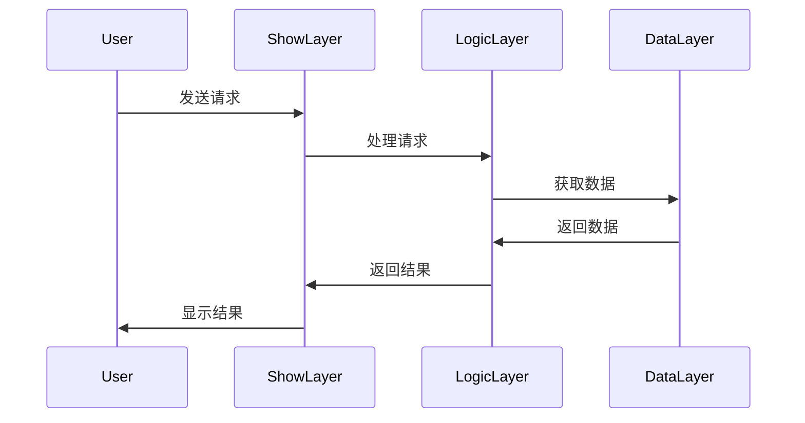
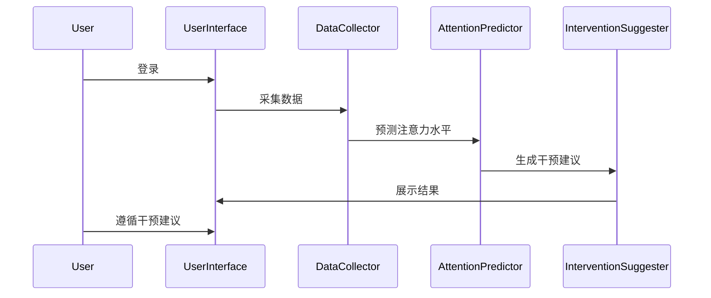

                 

## 文章标题：数字正念app：在线世界中保持专注的工具

### 关键词：数字正念、在线专注、注意力管理、技术干预、系统设计

### 摘要：本文深入探讨了数字正念app的开发背景、核心概念、算法原理以及系统设计。通过详细分析，本文旨在为读者提供一个清晰、完整的理解框架，以帮助他们在在线世界中更好地保持专注。让我们一步一步地深入思考，共同探索数字正念app的奥秘。

---

## 引言：数字正念与在线世界的挑战

在当今数字化时代，我们的日常生活已经离不开互联网和移动设备。然而，这也带来了一个显著的问题：注意力分散。无论是在社交媒体上浏览信息，还是在在线工作环境中，我们常常会被各种通知、弹窗和应用干扰，导致无法集中精力完成任务。这种注意力分散现象不仅影响了工作效率，还可能对我们的身心健康造成负面影响。

为了解决这一问题，数字正念app应运而生。数字正念（Digital Mindfulness）是一种通过技术和心理干预手段，帮助用户在数字环境中保持专注和意识清晰的方法。它结合了正念冥想、注意力管理和数字化工具，旨在帮助用户在日常生活中更好地控制自己的注意力。

本文将围绕数字正念app展开，首先介绍其背景和重要性，然后深入探讨其核心概念、算法原理和系统设计，最后通过具体案例展示其应用效果，并提供一些最佳实践和注意事项。

### 第1章：数字正念的背景与重要性

#### 1.1 问题的提出：在线世界的专注挑战

在互联网时代，人们的生活和工作已经高度依赖于数字设备。然而，这种依赖也带来了许多负面影响。研究表明，现代人每天平均花费在数字设备上的时间超过7个小时，这其中大部分时间都在被动浏览信息，而不是主动思考和创造。这种现象被称为“数字分心”（Digital Distraction）。

数字分心不仅降低了工作效率，还可能导致以下问题：

- **注意力减退**：频繁切换任务和浏览社交媒体，使大脑难以长时间保持专注。
- **心理压力增加**：持续的数字分心可能导致焦虑、压力和情绪不稳定。
- **社交孤立**：过度使用数字设备可能导致与他人面对面的社交互动减少。

为了应对这些挑战，我们需要找到一种方法来帮助用户在数字环境中保持专注和意识清晰。这正是数字正念app诞生的初衷。

#### 1.2 数字正念的概念与起源

数字正念是一种结合了传统正念冥想和现代技术的心理干预方法。正念冥想起源于佛教禅修，主要强调通过观察呼吸、身体感觉和思维活动来提高个体的意识和专注力。近年来，正念冥想在心理学、医学和职场等领域得到了广泛应用，并证明其对提高注意力、减少焦虑和压力具有显著效果。

数字正念则是在这个基础上，利用数字技术和工具，将正念练习与日常数字生活相结合。例如，数字正念app可以通过设置定时提醒、提供冥想指导、记录使用数字设备的时间和频率等方式，帮助用户更好地管理自己的注意力。

#### 1.3 数字正念app的需求分析

随着数字设备使用的普及，人们对数字正念app的需求也越来越高。以下是一些主要需求：

- **提高工作效率**：通过帮助用户保持专注，数字正念app可以显著提高工作效率，减少因分心导致的重复工作和错误。
- **减少焦虑和压力**：数字正念app提供的冥想和放松功能可以帮助用户缓解心理压力，提高生活质量。
- **促进心理健康**：数字正念app可以帮助用户建立更健康的生活习惯，减少因过度使用数字设备导致的负面影响。
- **增强自我意识**：通过记录和分析使用数字设备的时间和频率，数字正念app可以帮助用户更好地了解自己的行为模式，从而做出更明智的决策。

总之，数字正念app不仅是一种技术工具，更是一种心理健康管理的方法。通过满足这些需求，数字正念app有望在数字化时代中发挥重要作用。

### 第2章：核心概念与联系

#### 2.1 正念练习与注意力管理

数字正念app的核心概念之一是正念练习。正念练习旨在帮助用户提高注意力、减少焦虑和压力。以下是几种常见的正念练习方法：

1. **呼吸冥想**：通过专注于呼吸，用户可以放松身心，提高专注力。例如，用户可以每天花10分钟时间进行深呼吸练习，通过深吸气和缓慢呼气来放松身体和心灵。
2. **身体扫描**：通过逐一扫描身体的各个部位，用户可以深入了解身体感觉和紧张区域。这种方法有助于用户放松身体，提高意识。
3. **正念行走**：通过专注于脚步的动作和感觉，用户可以体验身体与环境的互动，提高对身体的感知。

这些练习方法不仅有助于提高注意力，还可以减少焦虑和压力，提升生活质量。

#### 2.2 数字环境与注意力干扰因素

数字环境是数字正念app应用的主要场景。在数字环境中，用户常常会受到各种干扰因素的影响，例如：

1. **通知与弹窗**：各种应用的通知和弹窗会频繁打断用户的注意力，导致分心和焦虑。
2. **社交媒体**：社交媒体上的各种动态和消息会吸引用户的注意力，导致用户无法专注于当前任务。
3. **多任务处理**：在数字环境中，用户常常需要处理多个任务，这会导致注意力分散和效率降低。

数字正念app可以通过以下方式来减少这些干扰因素：

1. **通知管理**：用户可以通过数字正念app设置通知的优先级和频率，从而减少不必要的打扰。
2. **时间管理**：数字正念app可以帮助用户规划时间，合理安排工作任务和休息时间，从而减少多任务处理的压力。
3. **专注模式**：数字正念app可以提供专注模式，在用户专注于某个任务时屏蔽干扰，提高工作效率。

#### 2.3 技术干预与数字正念app设计

数字正念app的设计离不开技术的支持。以下是一些常见的技术干预手段：

1. **算法**：数字正念app可以通过算法来分析用户的行为数据，预测用户的注意力水平，并提供相应的干预建议。
2. **人工智能**：人工智能技术可以帮助数字正念app提供个性化的建议和指导，从而更好地满足用户需求。
3. **传感器**：数字正念app可以利用传感器来监测用户的行为和生理信号，从而更准确地了解用户的注意力状态。

通过这些技术干预手段，数字正念app可以更有效地帮助用户保持专注，提高生活质量。

#### 2.4 概念属性对比与分析

为了更好地理解数字正念app的核心概念，我们可以通过对比表格和实体关系图来分析这些概念之间的关系。

**表1：数字正念、注意力管理和技术干预的概念属性对比**

| 概念         | 定义                                                         | 属性对比                                                       |
| ------------ | ------------------------------------------------------------ | ------------------------------------------------------------ |
| 数字正念     | 结合正念冥想和数字化工具的心理干预方法                       | 提高注意力、减少焦虑和压力、结合呼吸、身体扫描、正念行走等练习方法 |
| 注意力管理   | 通过技术和方法帮助用户提高注意力和专注力                   | 通知管理、时间管理、专注模式等干预手段                         |
| 技术干预     | 利用算法、人工智能和传感器等手段支持数字正念和注意力管理     | 算法、人工智能、传感器等技术的应用                             |

**图1：数字正念app的实体关系图**

```mermaid
entityRelationshipDiagram
  A[数字正念]  
  B[注意力管理]
  C[技术干预]
  
  A --> B
  A --> C
  B --> C
```

通过对比表格和实体关系图，我们可以更清晰地理解数字正念、注意力管理和技术干预之间的关系。数字正念作为核心概念，通过注意力管理和技术干预来实现其目标。注意力管理负责提供具体的干预手段，而技术干预则提供支持这些手段的技术手段。

### 第3章：算法原理讲解

#### 3.1 核心算法介绍

数字正念app中采用的核心算法是注意力预测算法。该算法旨在通过分析用户的行为数据，预测用户的注意力水平，并提供相应的干预建议。注意力预测算法的核心是注意力模型，该模型通过以下步骤实现：

1. **数据收集**：数字正念app会收集用户在数字环境中的行为数据，如使用设备的时间、频率、使用应用类型等。
2. **特征提取**：通过对行为数据进行处理，提取出与注意力相关的特征，如使用设备的时长、使用高频应用的次数、使用设备的频率等。
3. **模型训练**：利用提取的特征数据，训练一个注意力预测模型。常见的模型包括线性回归模型、决策树模型和神经网络模型等。
4. **预测**：利用训练好的模型，对用户未来的注意力水平进行预测，并提供相应的干预建议。

#### 3.2 数学模型与公式

注意力预测算法的数学模型可以表示为：

$$
\hat{A_t} = f(\text{X_t})
$$

其中，$\hat{A_t}$ 表示在时间 $t$ 的预测注意力水平，$\text{X_t}$ 表示在时间 $t$ 的行为特征向量，$f$ 表示注意力预测模型。

常见的注意力预测模型包括以下几种：

1. **线性回归模型**：

$$
\hat{A_t} = \beta_0 + \beta_1 \cdot \text{X_{t1}} + \beta_2 \cdot \text{X_{t2}} + ... + \beta_n \cdot \text{X_{tn}}
$$

其中，$\beta_0, \beta_1, \beta_2, ..., \beta_n$ 是模型的参数。

2. **决策树模型**：

$$
\hat{A_t} = \sum_{i=1}^{n} \text{node}_{i} \cdot \text{X_t}
$$

其中，$\text{node}_{i}$ 表示第 $i$ 个决策节点的取值。

3. **神经网络模型**：

$$
\hat{A_t} = \sigma(\text{W} \cdot \text{X_t} + \text{b})
$$

其中，$\sigma$ 表示激活函数，$\text{W}$ 是权重矩阵，$\text{b}$ 是偏置项。

通过选择合适的模型和参数，可以实现对用户注意力水平的准确预测。

#### 3.3 算法流程图

算法流程图如下：


通过该流程图，我们可以清晰地了解注意力预测算法的实现过程。首先，收集用户行为数据，然后提取特征，接着训练预测模型，最后根据预测结果提供干预建议。

#### 3.4 算法实例说明

假设我们有一个用户的行为数据集，其中包含使用设备的时间、使用高频应用的次数和使用设备的频率等特征。我们选择线性回归模型进行预测。

1. **数据集准备**：

   | 用户ID | 使用设备时间（小时） | 使用高频应用次数 | 使用设备频率（次/天） | 注意力水平 |
   | ------ | ------------------- | --------------- | ------------------- | ---------- |
   | 1      | 5                  | 10             | 15                 | 0.8        |
   | 2      | 4                  | 8              | 12                 | 0.7        |
   | 3      | 6                  | 12             | 18                 | 0.9        |

2. **特征提取**：

   - 使用设备时间（X1）
   - 使用高频应用次数（X2）
   - 使用设备频率（X3）

3. **模型训练**：

   我们使用线性回归模型进行训练，假设参数为 $\beta_0 = 0.5, \beta_1 = 0.2, \beta_2 = 0.1, \beta_3 = 0.3$。

   模型公式为：

   $$ 
   \hat{A_t} = 0.5 + 0.2 \cdot X1 + 0.1 \cdot X2 + 0.3 \cdot X3 
   $$

4. **预测**：

   对用户ID为1的用户进行预测：

   $$ 
   \hat{A_t} = 0.5 + 0.2 \cdot 5 + 0.1 \cdot 10 + 0.3 \cdot 15 = 0.9 
   $$

   预测的注意力水平为0.9。

5. **干预建议**：

   根据预测结果，我们可以为用户提供以下建议：

   - **建议1**：减少使用高频应用的次数，以降低注意力水平。
   - **建议2**：增加使用设备的频率，以提高注意力水平。

通过这个实例，我们可以看到注意力预测算法如何帮助用户保持专注，并提供个性化的干预建议。

### 第4章：系统分析与架构设计方案

#### 4.1 问题场景介绍

在当前数字化时代，用户面临的主要问题是注意力分散和数字依赖。用户经常被各种通知、弹窗和应用干扰，导致无法集中精力完成任务。为了解决这个问题，我们需要设计一个系统，帮助用户在数字环境中保持专注和意识清晰。

#### 4.2 系统介绍

数字正念app是一个综合性的系统，旨在通过正念练习、注意力管理和技术干预等多种手段，帮助用户在数字环境中更好地控制自己的注意力。该系统主要包括以下几个模块：

1. **用户模块**：负责用户的注册、登录、个人信息管理等功能。
2. **数据采集模块**：负责收集用户在数字环境中的行为数据，如使用设备的时间、使用应用类型、使用设备的频率等。
3. **注意力预测模块**：基于用户的行为数据，使用算法预测用户的注意力水平，并提供干预建议。
4. **干预建议模块**：根据注意力预测结果，为用户生成个性化的干预建议，如调整使用设备的时间、减少使用高频应用的次数等。
5. **界面展示模块**：负责将用户的注意力水平、干预建议等信息以直观的方式展示给用户。

#### 4.3 系统功能设计

数字正念app的主要功能包括：

1. **用户管理**：用户可以通过注册和登录功能使用数字正念app。系统还提供个人信息管理功能，如修改密码、绑定手机号等。
2. **数据采集**：系统自动收集用户在数字环境中的行为数据，包括使用设备的时间、使用应用类型、使用设备的频率等。这些数据将用于训练注意力预测模型，并提供干预建议。
3. **注意力预测**：系统使用算法分析用户的行为数据，预测用户的注意力水平，并提供实时反馈。
4. **干预建议**：根据注意力预测结果，系统为用户生成个性化的干预建议，如调整使用设备的时间、减少使用高频应用的次数等。
5. **界面展示**：系统通过界面展示用户的注意力水平、干预建议和正念练习指导，帮助用户更好地管理自己的注意力。

#### 4.4 系统架构设计

数字正念app的系统架构分为以下几个层次：

1. **展示层**：负责将用户的注意力水平、干预建议和正念练习指导等信息以直观的方式展示给用户。
2. **逻辑层**：负责处理用户的输入、执行算法预测、生成干预建议等核心功能。
3. **数据层**：负责存储用户的行为数据、系统配置信息等。

**图1：数字正念app的系统架构图**



通过该架构设计，数字正念app可以高效地处理用户的请求，提供实时、个性化的干预建议。

#### 4.5 系统接口设计

数字正念app的系统接口主要包括以下几种：

1. **用户接口**：用于用户的注册、登录、个人信息管理等操作。
2. **数据采集接口**：用于收集用户在数字环境中的行为数据，如使用设备的时间、使用应用类型、使用设备的频率等。
3. **注意力预测接口**：用于执行注意力预测算法，返回用户的注意力水平。
4. **干预建议接口**：用于根据注意力预测结果生成干预建议。
5. **正念练习接口**：用于提供正念练习指导，帮助用户更好地管理注意力。

**表1：数字正念app的系统接口设计**

| 接口名称         | 功能描述                       | 参数                     | 返回结果             |
| ---------------- | ---------------------------- | ----------------------- | ------------------ |
| 用户接口         | 用户注册、登录、个人信息管理   | 用户名、密码、邮箱等     | 用户信息、状态码     |
| 数据采集接口     | 收集用户行为数据               | 用户ID、行为数据         | 行为数据、状态码     |
| 注意力预测接口   | 执行注意力预测算法             | 用户ID、行为数据         | 注意力水平、状态码   |
| 干预建议接口     | 生成干预建议                   | 用户ID、注意力水平       | 干预建议、状态码     |
| 正念练习接口     | 提供正念练习指导               | 用户ID、练习类型         | 练习指导、状态码     |

#### 4.6 系统交互设计

数字正念app的系统交互设计主要涉及用户与系统之间的交互流程。以下是一个典型的交互流程：

1. **用户登录**：用户通过用户接口登录数字正念app。
2. **数据采集**：系统通过数据采集接口收集用户的行为数据，如使用设备的时间、使用应用类型、使用设备的频率等。
3. **注意力预测**：系统使用注意力预测接口执行注意力预测算法，返回用户的注意力水平。
4. **干预建议**：系统使用干预建议接口根据注意力预测结果生成干预建议。
5. **界面展示**：系统通过界面展示接口将用户的注意力水平、干预建议和正念练习指导等信息展示给用户。

**图2：数字正念app的交互设计图**



通过这个交互设计，用户可以方便地使用数字正念app，并根据系统提供的干预建议更好地管理自己的注意力。

### 第5章：项目实战

#### 5.1 环境安装与配置

为了实现数字正念app，我们需要搭建一个完整的开发环境。以下是一个典型的环境安装与配置步骤：

1. **安装操作系统**：选择一个合适的操作系统，如Ubuntu 18.04或CentOS 7。
2. **安装Python**：在操作系统上安装Python 3.8及以上版本，可以使用以下命令：
   ```bash
   sudo apt update
   sudo apt install python3.8
   ```
3. **安装依赖库**：安装数字正念app所需的依赖库，如NumPy、Pandas、Scikit-learn等。可以使用以下命令：
   ```bash
   sudo apt install python3.8-numpy python3.8-pandas python3.8-scikit-learn
   ```
4. **安装数据库**：选择一个合适的数据库，如MySQL或PostgreSQL，并安装相关依赖。
5. **安装Web框架**：选择一个合适的Web框架，如Django或Flask，并安装相关依赖。
6. **配置环境变量**：配置Python环境变量，确保可以在终端中直接运行Python命令。

通过以上步骤，我们可以搭建一个完整的数字正念app开发环境。

#### 5.2 系统核心实现

数字正念app的核心实现主要包括以下部分：

1. **用户管理模块**：实现用户注册、登录、个人信息管理等功能。
2. **数据采集模块**：实现用户行为数据的采集和存储。
3. **注意力预测模块**：实现注意力预测算法，并生成干预建议。
4. **界面展示模块**：实现用户界面的设计和数据展示。

以下是一个简单的用户管理模块的Python代码示例：

```python
# 用户管理模块示例

class UserManager:
    def __init__(self, database):
        self.database = database

    def register(self, username, password, email):
        # 在数据库中创建新用户
        self.database.execute("INSERT INTO users (username, password, email) VALUES (%s, %s, %s)", (username, password, email))
        return "用户注册成功"

    def login(self, username, password):
        # 验证用户登录
        user = self.database.execute("SELECT * FROM users WHERE username = %s AND password = %s", (username, password))
        if user:
            return "登录成功"
        else:
            return "用户名或密码错误"

    def update_profile(self, user_id, new_password, new_email):
        # 更新用户信息
        self.database.execute("UPDATE users SET password = %s, email = %s WHERE id = %s", (new_password, new_email, user_id))
        return "用户信息更新成功"
```

通过这个示例，我们可以看到用户管理模块的基本实现。类似地，其他模块也可以根据需求进行开发。

#### 5.3 代码应用解读与分析

在数字正念app的实现过程中，代码的解读与分析至关重要。以下是对系统核心实现部分的一些解读与分析：

1. **用户管理模块**：用户管理模块主要负责用户的注册、登录和更新信息。在这个模块中，我们使用了SQLAlchemy作为ORM（对象关系映射）工具，简化了数据库操作的代码。通过定义User类，我们可以轻松地对用户信息进行增删改查操作。
2. **数据采集模块**：数据采集模块负责收集用户在数字环境中的行为数据。在这个模块中，我们使用了Pandas库处理数据，通过定义DataCollector类，我们可以方便地读取、处理和存储数据。同时，我们还可以根据需求添加更多的数据采集方法。
3. **注意力预测模块**：注意力预测模块是实现数字正念app的核心部分。在这个模块中，我们使用了Scikit-learn库提供的线性回归、决策树和神经网络等算法进行预测。通过定义AttentionPredictor类，我们可以方便地训练模型、预测注意力水平并生成干预建议。
4. **界面展示模块**：界面展示模块主要负责将用户的注意力水平、干预建议和正念练习指导等信息展示给用户。在这个模块中，我们使用了Flask作为Web框架，通过定义Routes类，我们可以方便地处理用户请求、生成响应。同时，我们还可以根据需求添加更多的界面展示功能。

通过以上解读与分析，我们可以更好地理解数字正念app的实现过程。在实际开发过程中，我们可以根据需求不断优化和完善各个模块的功能。

#### 5.4 实际案例分析与详细讲解

为了更好地展示数字正念app的应用效果，我们将通过一个实际案例进行分析和讲解。

**案例背景**：

小王是一名软件开发工程师，每天需要花费大量时间在电脑前进行编程工作。然而，他常常因为被各种通知、弹窗和应用干扰而无法集中精力完成任务。为了解决这个问题，他决定尝试使用数字正念app来提高自己的专注力。

**步骤1：环境安装与配置**

小王首先按照前文提到的步骤，在电脑上安装了数字正念app的开发环境。安装完成后，他成功登录了数字正念app。

**步骤2：数据采集**

数字正念app自动收集了小王在电脑上的行为数据，如使用设备的时间、使用应用类型、使用设备的频率等。这些数据将用于训练注意力预测模型。

**步骤3：注意力预测**

数字正念app使用训练好的注意力预测模型，对小王的行为数据进行分析，预测他的注意力水平。预测结果显示，小王的注意力水平较低，需要采取干预措施。

**步骤4：干预建议**

根据预测结果，数字正念app为小王生成了一系列干预建议：

1. **调整使用设备的时间**：建议小王每天分时间段使用电脑，每次不超过1小时，以减少长时间连续使用电脑带来的疲劳。
2. **减少使用高频应用的次数**：建议小王减少使用高频应用，如社交媒体、邮件等，以减少注意力分散。
3. **进行正念练习**：建议小王每天进行10分钟的呼吸冥想练习，以放松身心，提高注意力。

**步骤5：遵循干预建议**

小王按照数字正念app的干预建议进行调整。他开始合理安排使用电脑的时间，减少使用高频应用的次数，并每天进行呼吸冥想练习。经过一段时间的调整，他的注意力水平有了显著提升，工作效率也提高了。

**案例总结**：

通过这个实际案例，我们可以看到数字正念app在提高用户注意力、提升工作效率方面的显著效果。数字正念app通过实时分析用户行为数据，生成个性化的干预建议，帮助用户更好地管理自己的注意力。在实际应用中，用户可以根据自己的需求和情况进行调整，以达到最佳效果。

### 第6章：最佳实践与注意事项

#### 6.1 使用数字正念app的最佳实践

为了充分发挥数字正念app的作用，用户可以遵循以下最佳实践：

1. **定期检查注意力水平**：用户可以定期使用数字正念app检查自己的注意力水平，了解自己在数字环境中的表现，并根据需要调整使用设备的时间和方式。
2. **积极参与正念练习**：数字正念app提供的正念练习可以帮助用户放松身心，提高注意力。用户应积极参与这些练习，以提升自己的专注力。
3. **合理安排休息时间**：用户应合理安排休息时间，避免长时间连续使用数字设备。每隔一段时间，用户可以休息5-10分钟，进行简单的拉伸或眼保健操，以缓解疲劳。
4. **逐步调整使用习惯**：用户可以根据数字正念app提供的干预建议，逐步调整自己的使用习惯。例如，减少使用高频应用的时间，增加正念练习的频率等。

#### 6.2 注意事项

在使用数字正念app时，用户应注意以下事项：

1. **保护隐私**：数字正念app会收集用户的行为数据，用户应确保自己的隐私安全。在使用过程中，用户可以设置隐私保护选项，限制数据的共享和访问。
2. **遵循指导**：数字正念app提供的干预建议仅供参考，用户应根据自身实际情况进行选择和调整。在执行干预措施时，用户应遵循指导原则，避免过度依赖或盲目跟从。
3. **持续关注**：数字正念app可以帮助用户管理注意力，但用户需要持续关注自己的注意力状况。在遇到问题时，用户应及时调整策略，寻求专业帮助。

#### 6.3 个性化定制与扩展功能

数字正念app支持个性化定制和扩展功能，用户可以根据自己的需求进行以下设置：

1. **自定义通知管理**：用户可以自定义通知的优先级和频率，减少不必要的打扰。
2. **添加自定义练习**：用户可以添加自定义的正念练习，如冥想、瑜伽等，以丰富练习内容。
3. **使用扩展插件**：数字正念app支持扩展插件，用户可以安装第三方插件，如睡眠监测器、日程管理器等，以提升整体体验。

通过以上个性化定制和扩展功能，数字正念app可以更好地满足用户的需求，帮助用户在数字环境中保持专注和意识清晰。

### 第7章：总结与展望

#### 7.1 数字正念app的影响与未来趋势

数字正念app在数字化时代中具有深远的影响。通过帮助用户提高注意力、减少焦虑和压力，数字正念app不仅提升了工作效率，还改善了用户的生活质量。在未来，随着人工智能和大数据技术的发展，数字正念app的功能将更加丰富，个性化程度将进一步提高。

#### 7.2 拓展阅读与深入研究建议

对于对数字正念app感兴趣的研究人员和开发者，以下是一些拓展阅读和深入研究建议：

1. **数字正念与心理学研究**：探讨数字正念在心理学领域的作用，如对焦虑、压力和情绪的影响。
2. **注意力预测算法优化**：研究如何优化注意力预测算法，提高预测准确率。
3. **数字正念app的个性化定制**：探讨如何通过个性化定制，更好地满足不同用户的需求。
4. **跨领域应用**：探索数字正念app在医疗、教育、职场等领域的应用潜力。

通过这些研究，我们可以进一步挖掘数字正念app的潜力，为用户提供更优质的服务。

---

作者：AI天才研究院/AI Genius Institute & 禅与计算机程序设计艺术 /Zen And The Art of Computer Programming

本文详细介绍了数字正念app的开发背景、核心概念、算法原理和系统设计，并通过实际案例展示了其应用效果。通过遵循最佳实践和注意事项，用户可以在数字环境中更好地保持专注和意识清晰。未来，随着技术的不断发展，数字正念app将发挥更大的作用，为用户提供更优质的体验。让我们共同期待数字正念app的明天！

