                 

**文章标题：数字正念训练营：在线世界中保持专注的技巧**

**关键词：数字正念、在线专注、时间管理、干扰因素、心理调适**

**摘要：**
本篇技术博客旨在探讨数字正念在在线世界中的应用，帮助读者提高在线工作、学习中的专注力。文章将围绕数字正念的概念、在线世界的干扰因素、核心技巧、实践案例分析以及数字正念训练营的设置展开，旨在为读者提供一套完整的在线专注提升方案。

---

## **第一部分：了解数字正念**

### **第1章：数字正念的概念与重要性**

**背景介绍：**
在数字时代，人们面临着越来越多的信息干扰和任务诱惑。数字正念作为一种新兴的心理实践，旨在帮助个体在数字环境中保持清晰的思维和专注力。本章节将介绍数字正念的定义、重要性及其对现代生活的意义。

**核心概念与联系：**
| 核心概念 | 定义 |
| --- | --- |
| 数字正念 | 在数字环境中保持专注、觉察和平衡的心理实践 |
| 专注力 | 个体集中注意力的能力 |
| 平衡 | 在数字生活和现实生活之间找到和谐的共存 |

**算法原理讲解：**
为了更好地理解数字正念，我们可以将其视为一种自我调节的心理算法。这个算法的核心在于识别并减少数字环境中的干扰因素，同时增强个体的专注力和自我控制能力。以下是一个简化的算法流程图：

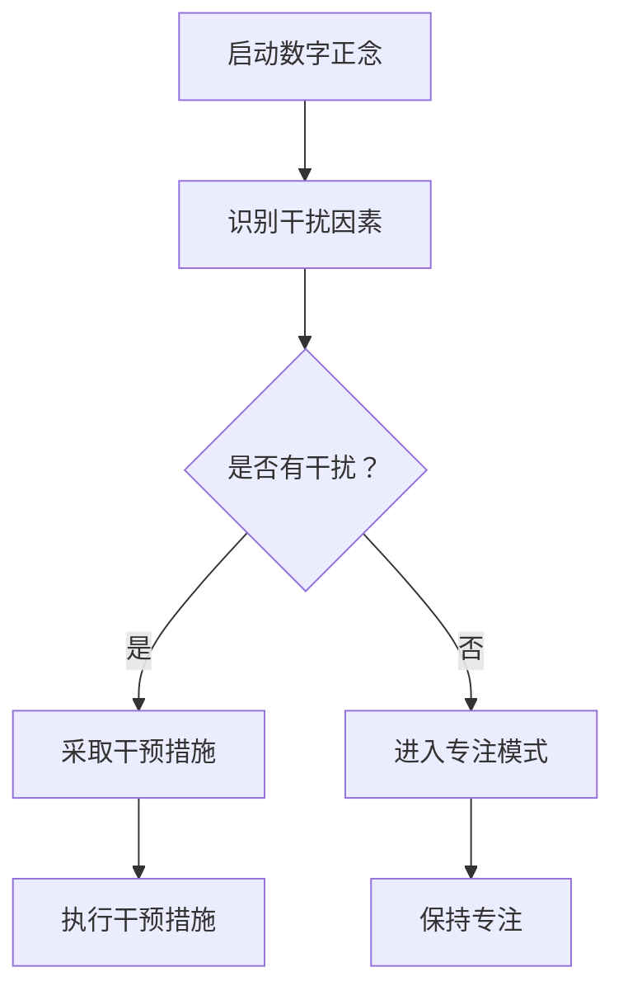

**数学公式：**
数字正念的数学模型可以表示为：

$$
\text{数字正念} = \alpha \times (\text{专注力} + \beta \times \text{自我控制})
$$

其中，$\alpha$ 和 $\beta$ 为权重系数，分别表示专注力和自我控制对数字正念的影响程度。

**系统分析与架构设计方案：**
在数字正念的实践中，一个关键系统是个人注意力管理平台。该平台包含以下几个核心组件：

- **用户界面**：提供用户操作和交互的界面。
- **干扰检测模块**：实时监测用户在数字环境中的行为，识别潜在的干扰因素。
- **干预措施库**：存储各种干预措施，如时间限制、应用屏蔽等。
- **数据分析模块**：分析用户的行为数据，为干预措施提供依据。

以下是一个简化的系统架构图：

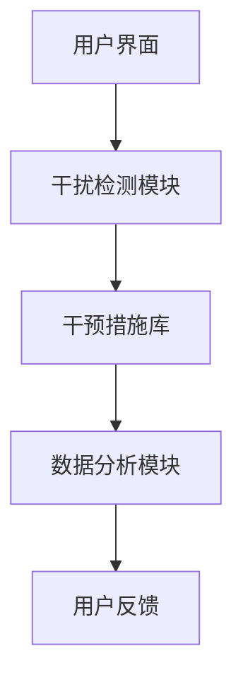

### **第2章：在线世界的干扰因素**

**背景介绍：**
在线世界中，干扰因素多种多样，包括社交媒体、信息过载、设备诱惑等。这些因素常常导致个体注意力分散，降低工作效率。本章节将分析这些干扰因素，并提供应对策略。

**核心概念与联系：**
| 干扰因素 | 影响程度 | 应对策略 |
| --- | --- | --- |
| 社交媒体 | 高 | 限制社交媒体使用时间 |
| 信息过载 | 中等 | 有选择性地获取信息 |
| 设备诱惑 | 中等 | 将设备置于不易触及的位置 |

**算法原理讲解：**
为了有效应对在线世界的干扰因素，我们可以使用以下算法：

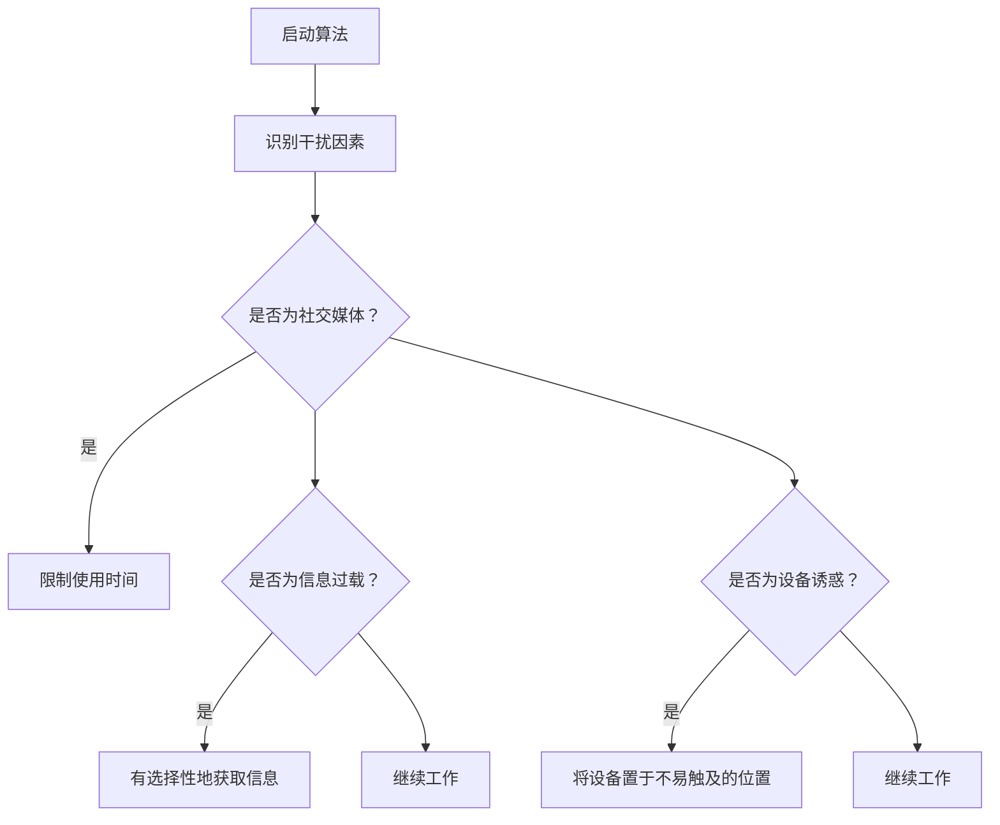

**数学公式：**
干扰因素的数学模型可以表示为：

$$
\text{干扰因素} = \sum_{i=1}^n (\text{因素}_i \times \text{影响程度}_i)
$$

其中，$\text{因素}_i$ 和 $\text{影响程度}_i$ 分别表示第 $i$ 个干扰因素及其影响程度。

**系统分析与架构设计方案：**
为了设计一个有效的干扰因素管理系统，我们需要考虑以下几个关键组件：

- **干扰因素检测器**：实时监测用户的行为，识别干扰因素。
- **干预措施执行器**：根据检测到的干扰因素，自动执行相应的干预措施。
- **用户行为分析器**：分析用户的行为数据，优化干预措施。

以下是一个简化的系统架构图：

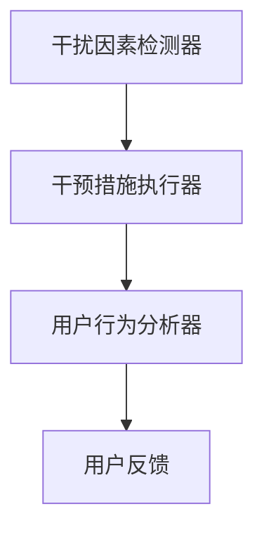

### **第3章：数字正念的核心技巧**

**背景介绍：**
数字正念的核心技巧包括心理调适、环境管理和时间管理。这些技巧可以帮助个体在在线世界中保持专注和高效。本章节将详细介绍这些核心技巧。

**核心概念与联系：**
| 技巧 | 说明 |
| --- | --- |
| 心理调适 | 通过认知行为疗法等技术，调整个体在数字环境中的心理状态 |
| 环境管理 | 通过优化工作环境，减少干扰因素 |
| 时间管理 | 通过时间管理技巧，合理安排工作时间和休息时间 |

**算法原理讲解：**
数字正念的核心技巧可以被视为一系列的算法模块，每个模块针对不同的干扰因素和个体需求。以下是一个简化的算法流程图：

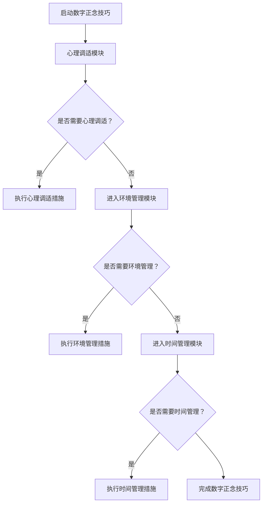

**数学公式：**
数字正念技巧的数学模型可以表示为：

$$
\text{数字正念技巧} = \alpha \times (\text{心理调适} + \beta \times \text{环境管理} + \gamma \times \text{时间管理})
$$

其中，$\alpha$、$\beta$ 和 $\gamma$ 为权重系数。

**系统分析与架构设计方案：**
数字正念技巧管理系统应包括以下几个关键组件：

- **心理调适模块**：提供认知行为疗法等心理调适服务。
- **环境管理模块**：帮助用户优化工作环境。
- **时间管理模块**：提供时间管理工具和策略。

以下是一个简化的系统架构图：

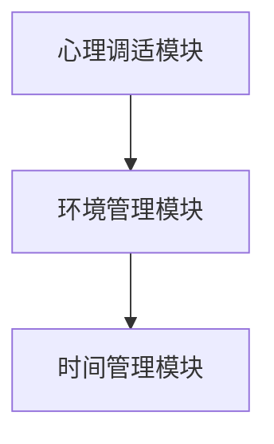

### **第4章：数字正念实践案例分析**

**背景介绍：**
数字正念不仅仅是一种理论，更需要在实践中得到验证。本章节将通过几个实际案例，展示数字正念在不同场景中的应用和效果。

**核心概念与联系：**
| 案例类型 | 场景 | 应用效果 |
| --- | --- | --- |
| 职场案例 | 办公环境 | 提高了工作效率和专注力 |
| 学生案例 | 在线学习 | 改善了学习效果和时间管理 |
| 个人时间管理案例 | 自主学习 | 帮助个体更好地规划个人时间和任务 |

**算法原理讲解：**
数字正念实践案例可以被视为一系列的算法实验，每个实验旨在验证数字正念技巧在不同场景下的有效性。以下是一个简化的算法流程图：

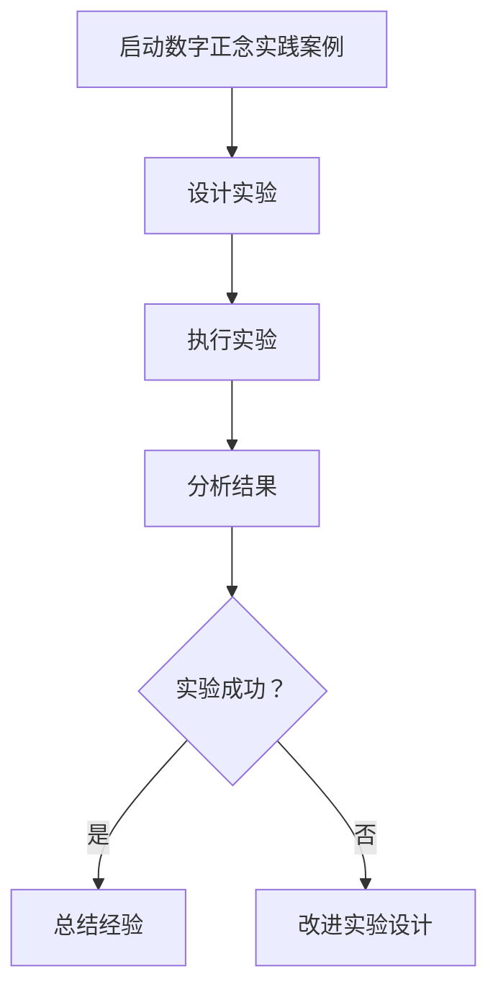

**数学公式：**
数字正念实践案例的数学模型可以表示为：

$$
\text{数字正念实践效果} = \text{实验结果} + \beta \times \text{改进措施}
$$

其中，$\beta$ 为权重系数，表示改进措施对实验结果的影响程度。

**系统分析与架构设计方案：**
数字正念实践案例管理系统应包括以下几个关键组件：

- **实验设计模块**：帮助用户设计数字正念实验。
- **实验执行模块**：执行实验并记录数据。
- **数据分析模块**：分析实验结果，提供改进建议。

以下是一个简化的系统架构图：

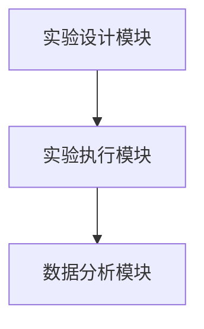

---

## **第二部分：数字正念训练营**

### **第5章：初始化：准备工作**

**背景介绍：**
数字正念训练营是一种系统性的培训计划，旨在帮助个体在在线世界中保持专注。本章节将介绍如何进行准备工作，包括目标设定、时间规划和环境布置。

**核心概念与联系：**
| 准备工作 | 说明 |
| --- | --- |
| 目标设定 | 明确训练营的目标和期望效果 |
| 时间规划 | 合理安排训练营的时间表 |
| 环境布置 | 创建一个有利于专注的工作环境 |

**算法原理讲解：**
初始化准备工作的算法可以简化为以下几个步骤：

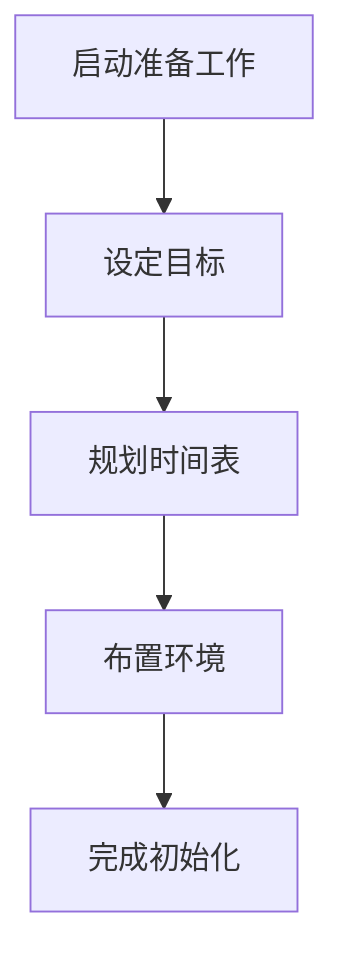

**数学公式：**
初始化准备工作的数学模型可以表示为：

$$
\text{初始化准备工作} = \alpha \times (\text{目标设定} + \beta \times \text{时间规划} + \gamma \times \text{环境布置})
$$

其中，$\alpha$、$\beta$ 和 $\gamma$ 为权重系数。

**系统分析与架构设计方案：**
数字正念训练营的初始化准备工作应包括以下几个关键组件：

- **目标设定模块**：帮助用户设定训练营的目标。
- **时间规划模块**：提供时间管理工具和策略。
- **环境布置模块**：提供环境布置建议和工具。

以下是一个简化的系统架构图：

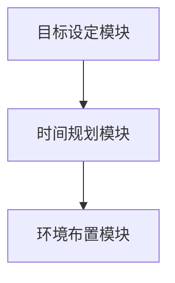

### **第6章：第一周：基础技巧**

**背景介绍：**
第一周是数字正念训练营的基础阶段，重点在于建立良好的专注习惯。本章节将介绍睡眠管理、分心行为识别与克服以及记录与反思等基础技巧。

**核心概念与联系：**
| 基础技巧 | 说明 |
| --- | --- |
| 睡眠管理 | 通过改善睡眠质量，提高专注力 |
| 分心行为识别与克服 | 通过识别和克服分心行为，提高专注力 |
| 记录与反思 | 通过记录和反思，加深对数字正念的理解 |

**算法原理讲解：**
第一周的基础技巧可以被视为一系列的专注力训练算法。以下是一个简化的算法流程图：

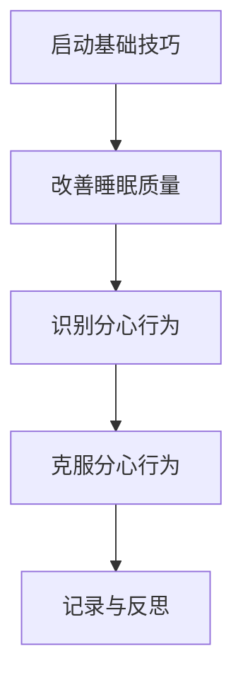

**数学公式：**
基础技巧的数学模型可以表示为：

$$
\text{基础技巧效果} = \alpha \times (\text{睡眠管理} + \beta \times \text{分心行为识别与克服} + \gamma \times \text{记录与反思})
$$

其中，$\alpha$、$\beta$ 和 $\gamma$ 为权重系数。

**系统分析与架构设计方案：**
数字正念训练营的第一周基础技巧应包括以下几个关键组件：

- **睡眠管理模块**：提供睡眠改善建议和工具。
- **分心行为识别模块**：帮助用户识别和记录分心行为。
- **反思记录模块**：提供记录和反思工具。

以下是一个简化的系统架构图：

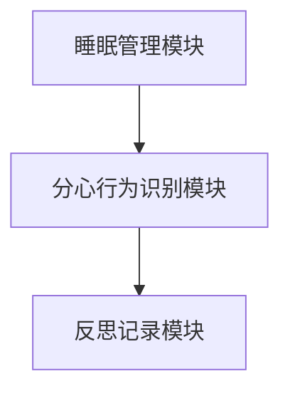

### **第7章：第二周：深化实践**

**背景介绍：**
第二周是数字正念训练营的深化阶段，重点在于巩固基础技巧并引入更高级的实践策略。本章节将介绍时间管理策略、技术辅助工具以及社交媒体的使用策略。

**核心概念与联系：**
| 深化实践 | 说明 |
| --- | --- |
| 时间管理策略 | 通过优化时间管理，提高工作效率 |
| 技术辅助工具 | 通过使用技术工具，辅助专注力的提升 |
| 社交媒体使用策略 | 通过合理安排社交媒体使用，减少干扰 |

**算法原理讲解：**
深化实践的算法可以简化为以下几个步骤：

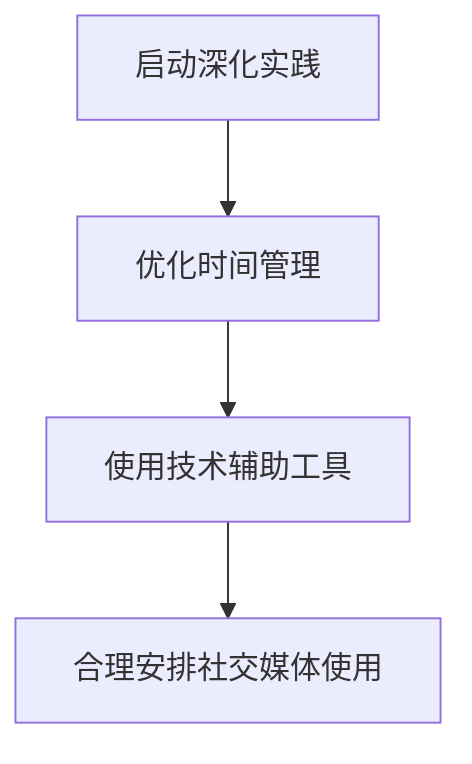

**数学公式：**
深化实践的数学模型可以表示为：

$$
\text{深化实践效果} = \alpha \times (\text{时间管理策略} + \beta \times \text{技术辅助工具} + \gamma \times \text{社交媒体使用策略})
$$

其中，$\alpha$、$\beta$ 和 $\gamma$ 为权重系数。

**系统分析与架构设计方案：**
数字正念训练营的第二周深化实践应包括以下几个关键组件：

- **时间管理策略模块**：提供时间管理工具和策略。
- **技术辅助工具模块**：推荐和介绍各种技术辅助工具。
- **社交媒体使用策略模块**：提供社交媒体使用的建议和工具。

以下是一个简化的系统架构图：

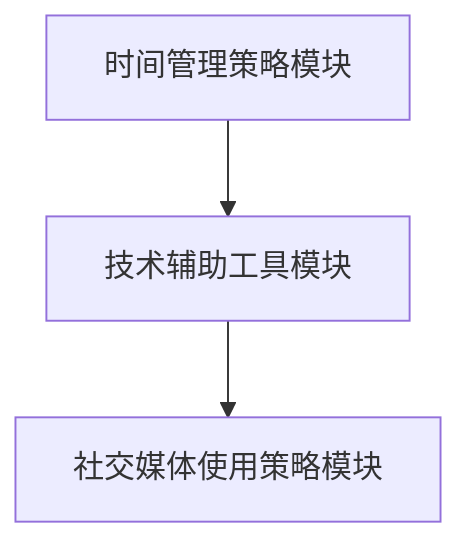

### **第8章：第三周：自我挑战**

**背景介绍：**
第三周是数字正念训练营的自我挑战阶段，重点在于通过实际挑战来检验和提升专注力。本章节将介绍持续专注挑战、跨界交流实践以及数字正念日记的撰写。

**核心概念与联系：**
| 自我挑战 | 说明 |
| --- | --- |
| 持续专注挑战 | 通过持续专注挑战，提升专注力 |
| 跨界交流实践 | 通过跨界交流，获取新的观点和经验 |
| 数字正念日记撰写 | 通过记录和反思，加深对数字正念的理解 |

**算法原理讲解：**
自我挑战的算法可以简化为以下几个步骤：

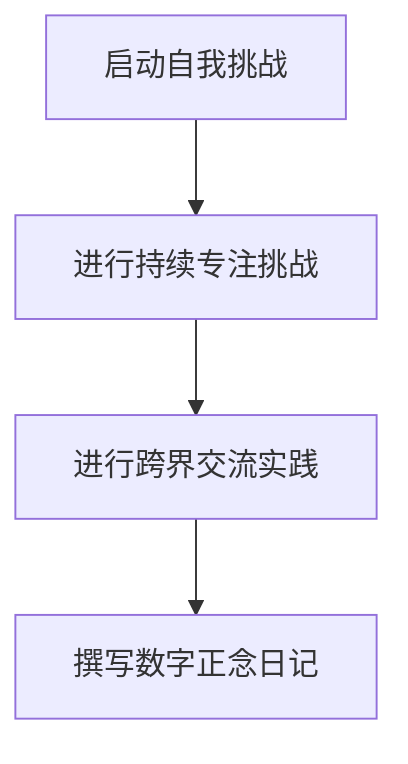

**数学公式：**
自我挑战的数学模型可以表示为：

$$
\text{自我挑战效果} = \alpha \times (\text{持续专注挑战} + \beta \times \text{跨界交流实践} + \gamma \times \text{数字正念日记撰写})
$$

其中，$\alpha$、$\beta$ 和 $\gamma$ 为权重系数。

**系统分析与架构设计方案：**
数字正念训练营的第三周自我挑战应包括以下几个关键组件：

- **持续专注挑战模块**：提供持续专注挑战任务和工具。
- **跨界交流实践模块**：提供跨界交流的平台和工具。
- **数字正念日记模块**：提供日记撰写工具和指导。

以下是一个简化的系统架构图：

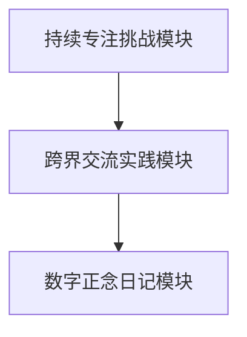

---

## **第三部分：最佳实践与总结**

### **第9章：数字正念的长期维持**

**背景介绍：**
数字正念不仅需要短期实践，更需要长期的坚持和维持。本章节将介绍如何通过自我监控、社群支持和未来展望来维持数字正念。

**核心概念与联系：**
| 维持策略 | 说明 |
| --- | --- |
| 自我监控 | 通过自我监控，及时发现并调整问题 |
| 社群支持 | 通过社群支持，获取外部反馈和帮助 |
| 未来展望 | 通过未来展望，保持持续的动力和目标 |

**算法原理讲解：**
数字正念的长期维持可以被视为一个自我调节和适应性强的算法系统。以下是一个简化的算法流程图：

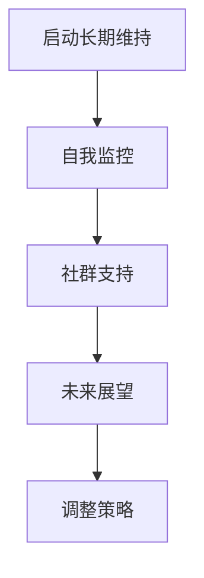

**数学公式：**
长期维持的数学模型可以表示为：

$$
\text{长期维持效果} = \alpha \times (\text{自我监控} + \beta \times \text{社群支持} + \gamma \times \text{未来展望})
$$

其中，$\alpha$、$\beta$ 和 $\gamma$ 为权重系数。

**系统分析与架构设计方案：**
数字正念的长期维持应包括以下几个关键组件：

- **自我监控模块**：提供自我监控工具和反馈机制。
- **社群支持模块**：提供社群交流和互助平台。
- **未来展望模块**：提供目标设定和规划工具。

以下是一个简化的系统架构图：

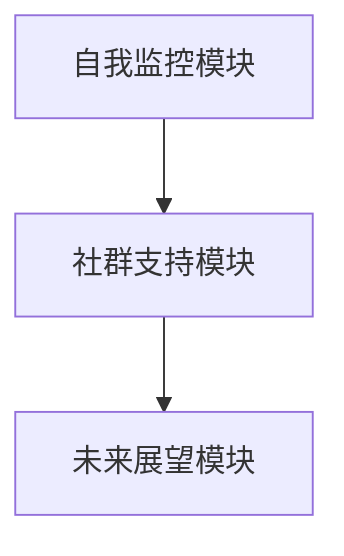

### **第10章：数字正念最佳实践**

**背景介绍：**
在数字正念的实践中，不同的个体可能会有不同的经验和心得。本章节将分享一些最佳实践，包括个人经验、专家建议和实用工具。

**核心概念与联系：**
| 最佳实践 | 说明 |
| --- | --- |
| 个人经验分享 | 分享成功的数字正念实践案例 |
| 专家建议 | 引用专家的观点和建议 |
| 实用工具推荐 | 推荐有助于数字正念的工具和资源 |

**算法原理讲解：**
数字正念最佳实践的算法可以简化为以下几个步骤：

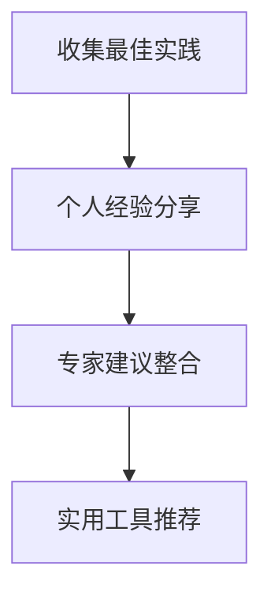

**数学公式：**
最佳实践的数学模型可以表示为：

$$
\text{最佳实践效果} = \alpha \times (\text{个人经验分享} + \beta \times \text{专家建议整合} + \gamma \times \text{实用工具推荐})
$$

其中，$\alpha$、$\beta$ 和 $\gamma$ 为权重系数。

**系统分析与架构设计方案：**
数字正念最佳实践应包括以下几个关键组件：

- **个人经验分享平台**：提供用户分享和实践经验的平台。
- **专家建议库**：收集和整合专家的建议和观点。
- **实用工具推荐模块**：推荐和介绍各种实用的数字正念工具。

以下是一个简化的系统架构图：

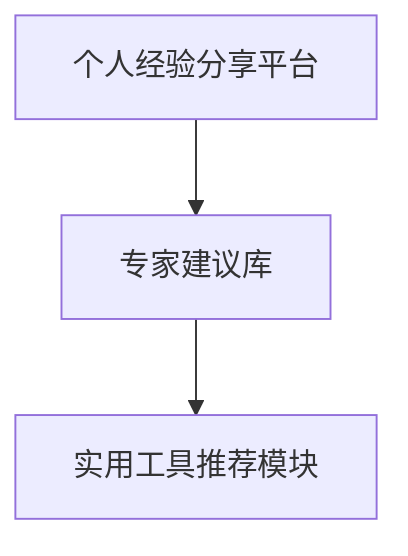

### **第11章：总结与反思**

**背景介绍：**
数字正念训练营结束后，读者需要对整个经历进行总结和反思。本章节将帮助读者回顾成果、解决问题并展望未来。

**核心概念与联系：**
| 总结与反思 | 说明 |
| --- | --- |
| 成果回顾 | 回顾数字正念训练营的成果和收获 |
| 遇到的问题及解决方案 | 分析在训练营中遇到的问题及其解决方案 |
| 未来展望 | 展望未来的数字正念实践和目标 |

**算法原理讲解：**
总结与反思的算法可以简化为以下几个步骤：

```mermaid
graph TD
    A[启动总结与反思] --> B[成果回顾]
    B --> C[问题分析]
    C --> D[解决方案制定]
    D --> E[未来展望]
```

**数学公式：**
总结与反思的数学模型可以表示为：

$$
\text{总结与反思效果} = \alpha \times (\text{成果回顾} + \beta \times \text{问题分析} + \gamma \times \text{解决方案制定} + \delta \times \text{未来展望})
$$

其中，$\alpha$、$\beta$、$\gamma$ 和 $\delta$ 为权重系数。

**系统分析与架构设计方案：**
数字正念训练营的总结与反思应包括以下几个关键组件：

- **成果回顾模块**：提供回顾和总结工具。
- **问题分析模块**：帮助用户分析遇到的问题。
- **解决方案制定模块**：提供问题解决方案的制定工具。
- **未来展望模块**：帮助用户设定未来的目标和计划。

以下是一个简化的系统架构图：

```mermaid
graph TD
    A[成果回顾模块] --> B[问题分析模块]
    B --> C[解决方案制定模块]
    C --> D[未来展望模块]
```

### **第12章：拓展阅读**

**背景介绍：**
为了进一步深入了解数字正念，读者可以参考相关文献和资源。本章节将推荐一些关键文献、延伸阅读资源以及相关的链接。

**核心概念与联系：**
| 拓展资源 | 说明 |
| --- | --- |
| 关键文献推荐 | 推荐有助于理解数字正念的关键文献 |
| 延伸阅读 | 推荐进一步的阅读材料和资源 |
| 资源链接 | 提供相关的网站、博客和其他在线资源 |

**算法原理讲解：**
拓展阅读的算法可以简化为以下几个步骤：

```mermaid
graph TD
    A[启动拓展阅读] --> B[推荐关键文献]
    B --> C[推荐延伸阅读]
    C --> D[提供资源链接]
```

**数学公式：**
拓展阅读的数学模型可以表示为：

$$
\text{拓展阅读效果} = \alpha \times (\text{关键文献推荐} + \beta \times \text{延伸阅读} + \gamma \times \text{资源链接})
$$

其中，$\alpha$、$\beta$ 和 $\gamma$ 为权重系数。

**系统分析与架构设计方案：**
数字正念拓展阅读应包括以下几个关键组件：

- **关键文献推荐模块**：提供关键文献的推荐和简介。
- **延伸阅读模块**：推荐进一步的阅读材料。
- **资源链接模块**：提供相关的网站、博客和其他在线资源。

以下是一个简化的系统架构图：

```mermaid
graph TD
    A[关键文献推荐模块] --> B[延伸阅读模块]
    B --> C[资源链接模块]
```

---

**作者：** AI天才研究院/AI Genius Institute & 禅与计算机程序设计艺术 /Zen And The Art of Computer Programming

---

通过上述详细的章节内容，本文为读者提供了一个完整的数字正念训练营方案，从核心概念到实践技巧，再到总结和拓展，每一步都进行了深入分析和讲解。希望这篇文章能够帮助读者在在线世界中保持专注，提高工作效率。

