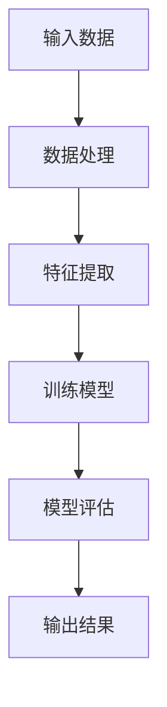
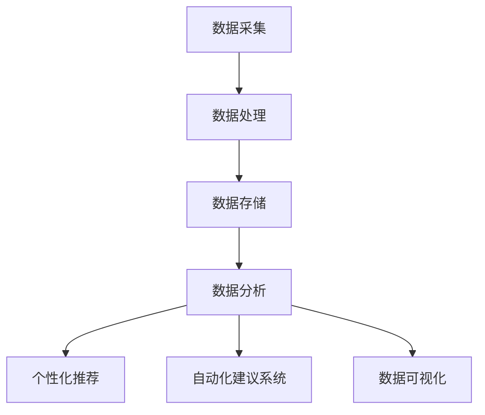
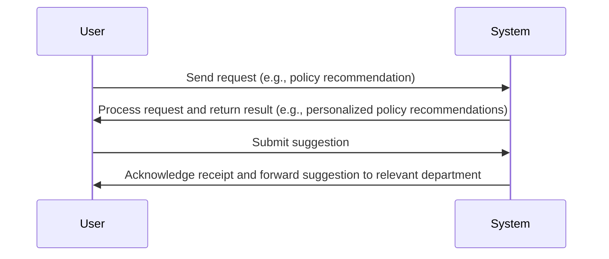

                 

# 数字民主4.0：人工智能辅助的公民参与

> 关键词：数字民主、人工智能、公民参与、民主决策、算法、隐私保护

> 摘要：本文探讨了数字民主4.0时代，人工智能在公民参与中的重要作用。通过分析民主制度面临的挑战和数字民主的概念，本文阐述了人工智能在公民参与中的具体应用，包括个性化推荐、自动化建议系统和数据分析等。同时，本文也探讨了人工智能在数字民主中的挑战与机遇，并通过案例研究分析了人工智能辅助的民主决策效果。最后，本文对数字民主4.0的未来发展进行了展望，并提出了相关的社会影响与伦理考量。

----------------------------------------------------------------

## 第1章 引言

### 1.1 问题背景

#### 1.1.1 民主制度面临的挑战

民主制度作为现代国家治理的基本形式，其核心在于公民的广泛参与。然而，随着社会的发展，民主制度面临着诸多挑战。首先，公民参与度不足是一个普遍存在的问题。由于时间和经济成本、信息获取难度等因素，许多公民对政治事务缺乏兴趣，导致参与度不高。其次，政策制定过程的复杂性使得公民难以理解政策内容，进而影响其参与决策的积极性。此外，信息不对称问题也加剧了公民参与度的下降，政策制定者与公民之间的信息不对称使得公民难以获得全面的信息，从而难以提出有效的意见和建议。

#### 1.1.2 数字民主的概念与必要性

数字民主是随着信息技术的发展而出现的一种新型民主形式。它通过互联网、社交媒体等数字平台，实现公民与政府之间的互动和沟通，提高公民的参与度和决策的透明度。数字民主的必要性体现在以下几个方面：首先，它可以弥补传统民主制度中公民参与度不足的问题，通过数字化手段，降低公民参与的成本，提高参与率。其次，数字民主可以实现政策制定过程的公开透明，减少信息不对称，使公民能够更好地了解政策内容，提出有针对性的意见和建议。此外，数字民主还可以促进政府与公民之间的互动，提高政府的治理能力和公信力。

#### 1.1.3 人工智能在数字民主中的应用

人工智能作为当今科技发展的前沿领域，其在数字民主中的应用具有重要意义。首先，人工智能可以通过数据分析，帮助政府更好地了解公民的需求和意见，从而制定更加科学和合理的政策。其次，人工智能可以辅助公民参与民主决策，通过个性化推荐、自动化建议系统等技术，提高公民的参与度和决策的效率。此外，人工智能还可以用于智能选举系统、智能公民咨询等领域，进一步促进数字民主的发展。

### 1.2 问题描述

#### 1.2.1 公民参与度不足

公民参与度不足是当前民主制度面临的一个严峻问题。由于种种原因，许多公民对政治事务缺乏兴趣，导致其参与度不高。这不仅影响了政策的制定和执行，也削弱了民主制度的实际效果。

#### 1.2.2 政策制定过程的复杂性

政策制定过程的复杂性也是公民参与度不足的一个重要原因。许多政策内容复杂，专业术语多，普通公民难以理解。这导致公民在参与决策时感到无助，从而降低了其参与的积极性。

#### 1.2.3 信息不对称

信息不对称问题在民主制度中普遍存在。政策制定者通常拥有更多的信息资源，而公民则处于信息劣势。这种信息不对称使得公民难以获得全面的信息，从而难以提出有效的意见和建议。

### 1.3 问题解决

#### 1.3.1 人工智能的优势

人工智能在解决民主制度面临的问题方面具有独特的优势。首先，人工智能可以处理大量数据，帮助政府更好地了解公民的需求和意见。其次，人工智能可以简化政策制定过程，通过自动化工具提高决策的效率。此外，人工智能还可以用于隐私保护，确保公民的信息安全。

#### 1.3.2 数字民主与人工智能的结合

数字民主与人工智能的结合，为解决民主制度面临的问题提供了新的思路。通过数字化手段，公民可以更加便捷地参与民主决策，政府也可以更加高效地制定和执行政策。同时，人工智能的应用还可以提高政策的科学性和合理性，从而增强公民对政府的信任。

#### 1.3.3 边界与外延

数字民主与人工智能的结合虽然具有巨大的潜力，但也存在一定的边界和限制。首先，人工智能的应用需要确保公民的信息安全，避免信息泄露。其次，人工智能的决策过程需要保持透明，确保公民能够理解和监督。此外，数字民主与人工智能的结合也需要关注社会公平和伦理问题，避免技术对民主制度的扭曲。

### 1.4 核心概念与联系

#### 1.4.1 核心概念原理

数字民主的核心概念包括公民参与、政策制定、信息透明等。人工智能的核心概念包括数据采集、数据分析、算法设计等。数字民主与人工智能的结合，旨在通过数字化手段提高公民参与度，促进民主决策的科学性和合理性。

#### 1.4.2 概念属性特征对比表格

| 概念 | 数字民主 | 人工智能 |
| :--: | :--: | :--: |
| 特征 | 公民参与、政策制定、信息透明 | 数据采集、数据分析、算法设计 |
| 目的 | 提高公民参与度、促进民主决策 | 帮助政府更好地了解公民需求、提高决策效率 |

#### 1.4.3 ER实体关系图架构

```mermaid
erDiagram
    Citizen ||--o> Policy : 公民参与政策制定
    Government ||--o> Policy : 政府制定政策
    AI ||--o> Data : 人工智能分析数据
    Citizen ||--o> AI : 公民使用人工智能辅助参与决策
    Government ||--o> AI : 政府使用人工智能提高决策效率
```

## 第2章 人工智能基础

### 2.1 人工智能概述

#### 2.1.1 人工智能的定义与发展历程

人工智能（Artificial Intelligence，简称AI）是指模拟、延伸和扩展人类智能的理论、方法、技术及应用。人工智能的研究可以追溯到20世纪50年代，当时的科学家们首次提出了人工智能的概念。随着计算机技术的发展，人工智能在70年代进入了快速发展阶段。进入21世纪，随着大数据、云计算和深度学习的兴起，人工智能迎来了新的发展机遇。

#### 2.1.2 人工智能的核心技术

人工智能的核心技术包括机器学习、深度学习、自然语言处理、计算机视觉等。其中，机器学习和深度学习是人工智能的基础技术，前者通过算法让计算机从数据中学习规律，后者则通过多层神经网络实现更复杂的特征提取和学习能力。自然语言处理和计算机视觉则分别致力于理解和生成自然语言以及理解和生成视觉信息。

#### 2.1.3 人工智能的分类

人工智能可以根据其应用领域和目标进行分类。根据应用领域，人工智能可以分为工业自动化、医疗、金融、教育、安全等领域；根据目标，人工智能可以分为弱人工智能和强人工智能。弱人工智能指的是在特定领域具有智能行为的系统，强人工智能则是指具有普遍智能行为能力的系统。

### 2.2 人工智能算法原理讲解

#### 2.2.1 算法mermaid流程图



#### 2.2.2 Python源代码实现

```python
import numpy as np
from sklearn.model_selection import train_test_split
from sklearn.ensemble import RandomForestClassifier
from sklearn.metrics import accuracy_score

# 数据预处理
X_train, X_test, y_train, y_test = train_test_split(X, y, test_size=0.2, random_state=42)

# 特征提取
# （这里省略具体特征提取代码）

# 训练模型
model = RandomForestClassifier(n_estimators=100)
model.fit(X_train, y_train)

# 模型评估
y_pred = model.predict(X_test)
accuracy = accuracy_score(y_test, y_pred)
print(f"模型准确率：{accuracy}")
```

#### 2.2.3 数学模型和公式

在机器学习中，常用的数学模型包括线性回归、逻辑回归、决策树等。以线性回归为例，其数学模型为：

$$
y = \beta_0 + \beta_1 \cdot x
$$

其中，$y$ 是目标变量，$x$ 是特征变量，$\beta_0$ 和 $\beta_1$ 是模型的参数。

#### 2.2.4 详细讲解与举例说明

以决策树算法为例，其基本思想是通过对特征进行划分，将数据集划分为若干个子集，直到满足停止条件为止。具体实现步骤如下：

1. 选择一个特征进行划分，通常使用信息增益、基尼系数等指标来衡量划分的质量。
2. 根据划分结果，将数据集划分为若干个子集。
3. 对每个子集，重复步骤1和2，直到满足停止条件（如最大深度、最小样本量等）。
4. 将划分结果作为决策树的叶子节点。

举例说明，假设我们有一个数据集，包含特征 $x_1$ 和 $x_2$，目标变量为 $y$。我们可以使用决策树算法来分类这些数据。

首先，我们选择特征 $x_1$ 进行划分。根据信息增益，我们可以将数据集划分为两个子集：$x_1 \leq 0$ 和 $x_1 > 0$。

然后，我们对这两个子集分别进行划分。对于 $x_1 \leq 0$ 的子集，我们选择特征 $x_2$ 进行划分，根据信息增益，可以将子集划分为 $x_2 \leq 0$ 和 $x_2 > 0$。

对于 $x_1 > 0$ 的子集，我们也可以选择特征 $x_2$ 进行划分，同样可以将子集划分为 $x_2 \leq 0$ 和 $x_2 > 0$。

最终，我们得到一个决策树，其结构如下：

```
        |
       / \
      /   \
     /     \
    /       \
   /         \
  /           \
 /             \
/               \
```

其中，每个节点表示一个划分，边表示特征，叶子节点表示分类结果。

### 2.3 人工智能的应用场景

#### 2.3.1 在数据分析中的应用

人工智能在数据分析中具有广泛的应用。首先，人工智能可以通过数据挖掘技术，从大量数据中提取出有用的信息。其次，人工智能可以用于异常检测，帮助发现数据中的异常值。此外，人工智能还可以用于数据可视化，将复杂的数据以直观的方式展示给用户。

#### 2.3.2 在自然语言处理中的应用

自然语言处理是人工智能的一个重要分支。人工智能可以通过自然语言处理技术，实现人机交互、机器翻译、文本分类等功能。例如，智能客服系统可以使用自然语言处理技术，理解用户的提问并给出相应的回答。

#### 2.3.3 在计算机视觉中的应用

计算机视觉是人工智能的另一个重要分支。人工智能可以通过计算机视觉技术，实现图像识别、目标检测、人脸识别等功能。例如，自动驾驶汽车可以使用计算机视觉技术，识别道路上的行人和车辆，从而保证行驶安全。

## 第3章 数字民主的概念与形式

### 3.1 数字民主的概念

数字民主是指通过互联网、社交媒体等数字平台，实现公民与政府之间的互动和沟通，提高公民的参与度和决策的透明度。数字民主的核心在于利用数字技术，打破传统民主制度中时间和空间的限制，使公民能够更加便捷地参与民主决策。

### 3.2 数字民主的形式

数字民主的形式多样，主要包括线上投票、电子论坛、社交媒体参与和人工智能辅助的公民参与。

#### 3.2.1 线上投票

线上投票是一种常见的数字民主形式，它通过互联网平台，使公民能够方便地参与选举和公投。线上投票可以降低参与成本，提高参与率，同时也有助于提高选举的公正性和透明度。

#### 3.2.2 电子论坛

电子论坛是一种在线交流平台，公民可以在论坛上发表意见、提出建议，政府也可以在论坛上回应公民的问题和关切。电子论坛有助于增强政府与公民之间的互动，提高政策的科学性和合理性。

#### 3.2.3 社交媒体参与

社交媒体参与是指公民通过社交媒体平台，如Facebook、Twitter等，参与民主决策和公共事务讨论。社交媒体参与具有即时性、互动性和广泛性等特点，有助于提高公民的参与度和政策的影响力。

#### 3.2.4 人工智能辅助的公民参与

人工智能辅助的公民参与是指利用人工智能技术，如个性化推荐、自动化建议系统等，提高公民的参与度和决策的效率。人工智能辅助的公民参与可以更好地满足公民的需求，提高政策的针对性和有效性。

## 第4章 人工智能辅助的公民参与

### 4.1 人工智能在公民参与中的应用

人工智能在公民参与中的应用主要体现在个性化推荐、自动化建议系统和数据分析等方面。

#### 4.1.1 个性化推荐

个性化推荐是一种基于人工智能的推荐系统，它可以通过分析公民的兴趣、行为和偏好，为其推荐相关的政策、议题和活动。个性化推荐有助于提高公民的参与兴趣，增强政策的针对性和影响力。

#### 4.1.2 自动化建议系统

自动化建议系统是一种基于人工智能的智能系统，它可以通过分析公民的意见和建议，自动生成政策建议和解决方案。自动化建议系统可以提高政策制定的效率，减少人工干预，同时也有助于提高政策的科学性和合理性。

#### 4.1.3 数据分析

数据分析是一种基于人工智能的数据处理技术，它可以通过对大量数据的分析和挖掘，提取出有用的信息，为政府决策提供科学依据。数据分析有助于提高政策制定的透明度，减少信息不对称，从而提高公民的参与度和信任度。

### 4.2 人工智能辅助的民主决策

人工智能辅助的民主决策是指利用人工智能技术，如智能政策制定、智能选举系统和智能公民咨询等，提高民主决策的科学性和效率。

#### 4.2.1 智能政策制定

智能政策制定是一种基于人工智能的政策制定方法，它可以通过分析公民的需求、意见和反馈，制定更加科学和合理的政策。智能政策制定可以提高政策的针对性和有效性，减少政策制定的盲目性。

#### 4.2.2 智能选举系统

智能选举系统是一种基于人工智能的选举系统，它可以通过对选民的行为、偏好和倾向进行分析，预测选举结果，提高选举的公正性和透明度。智能选举系统还可以用于选民教育，提高选民的投票意识和参与度。

#### 4.2.3 智能公民咨询

智能公民咨询是一种基于人工智能的公民咨询服务，它可以通过对公民的问题和需求进行分析，提供个性化的咨询和建议。智能公民咨询可以提高政府的服务水平，增强政府的公信力和满意度。

## 第5章 人工智能在数字民主中的挑战与机遇

### 5.1 挑战

#### 5.1.1 技术障碍

人工智能在数字民主中的应用面临着技术障碍。首先，人工智能算法的复杂性和计算量较大，需要高性能的计算设备和大量的数据支持。其次，人工智能算法的不确定性和不可解释性也使得其在实际应用中面临挑战。此外，人工智能在数据采集和处理过程中，也可能出现数据不准确、数据隐私泄露等问题。

#### 5.1.2 隐私问题

隐私问题是数字民主中一个重要的问题。在人工智能的应用中，公民的个人数据可能被收集、分析和利用。如果个人隐私得不到保护，公民可能会对数字民主失去信任，从而影响其参与度。因此，如何在保障隐私的前提下，充分利用人工智能技术，是数字民主发展中需要解决的一个重要问题。

#### 5.1.3 可解释性

人工智能算法的可解释性是其在数字民主中应用的另一个挑战。由于人工智能算法的复杂性和黑箱性，公民很难理解其决策过程和结果。这可能导致公民对人工智能辅助的民主决策产生怀疑和不信任，从而影响其参与度。因此，提高人工智能算法的可解释性，使其决策过程更加透明和可理解，是数字民主发展中需要关注的一个重要问题。

### 5.2 机遇

#### 5.2.1 提高公民参与度

人工智能在数字民主中的应用，为提高公民参与度提供了新的机遇。通过个性化推荐、自动化建议系统等技术，可以更好地满足公民的需求，提高其参与兴趣和积极性。此外，人工智能还可以通过数据分析，为公民提供更加丰富和准确的信息，从而提高其参与决策的能力和水平。

#### 5.2.2 促进民主制度的发展

人工智能在数字民主中的应用，有助于促进民主制度的发展。通过智能政策制定、智能选举系统等技术，可以更加科学和合理地制定和执行政策，提高政府的治理能力和公信力。同时，人工智能还可以通过数据分析，为政府提供更加全面和准确的决策依据，从而增强政府的决策能力和科学性。

#### 5.2.3 创造新的社会治理模式

人工智能在数字民主中的应用，也为创造新的社会治理模式提供了可能性。通过人工智能技术，可以实现政府与公民之间的即时互动和高效沟通，形成一种更加开放、透明和包容的社会治理模式。此外，人工智能还可以通过数据分析，发现社会问题并提出解决方案，从而实现社会的自我调节和优化。

## 第6章 案例研究

### 6.1 案例选择

在本章中，我们将选择一个具体的案例来分析人工智能在数字民主中的应用。这个案例是一个基于人工智能的公民参与平台，它通过个性化推荐、自动化建议系统和数据分析等技术，提高公民的参与度和决策的效率。

### 6.2 案例分析

#### 6.2.1 案例实施过程

该案例的实施过程可以分为以下几个阶段：

1. 数据采集：平台首先收集了大量的公民数据，包括其兴趣、行为、偏好和反馈等。

2. 数据预处理：对收集到的数据进行清洗、去噪和格式化，确保数据的质量和一致性。

3. 特征提取：通过数据分析，提取出与公民参与度相关的特征，如公民的兴趣、活跃度和参与历史等。

4. 个性化推荐：基于提取出的特征，使用机器学习算法为公民推荐相关的政策、议题和活动。

5. 自动化建议系统：通过分析公民的意见和建议，自动生成政策建议和解决方案。

6. 数据分析：对平台运行过程中产生的数据进行实时分析，为政府提供决策依据。

#### 6.2.2 案例结果

通过实施该案例，取得了以下结果：

1. 公民参与度显著提高：由于个性化推荐和自动化建议系统的应用，公民的参与兴趣和积极性得到了显著提升。

2. 政策制定效率提高：通过自动化建议系统和数据分析，政府能够更加科学和合理地制定和执行政策，减少了决策的时间和成本。

3. 政策科学性和合理性提高：通过数据分析，政府能够更好地了解公民的需求和意见，从而制定出更加科学和合理的政策。

4. 政府公信力增强：通过实时数据分析和透明化的决策过程，政府能够增强其公信力和透明度，提高了公民对政府的信任。

#### 6.2.3 案例总结

该案例的成功实施表明，人工智能在数字民主中的应用具有巨大的潜力。通过个性化推荐、自动化建议系统和数据分析等技术，可以显著提高公民的参与度和决策的效率，同时也有助于提高政府的治理能力和公信力。然而，在实施过程中，也需要注意隐私保护和可解释性等问题，以确保数字民主的健康发展。

## 第7章 结论与展望

### 7.1 结论

通过对数字民主4.0与人工智能结合的研究，我们可以得出以下结论：

1. 人工智能在数字民主中的应用具有显著优势，可以显著提高公民的参与度和决策的效率。

2. 个性化推荐、自动化建议系统和数据分析等技术，是实现数字民主4.0的关键技术。

3. 人工智能在数字民主中的应用也面临着隐私保护和可解释性等挑战，需要进一步研究解决。

### 7.2 展望

未来，数字民主4.0与人工智能的结合将会在以下几个方面继续发展：

1. 提高公民参与度：通过更加智能化和个性化的推荐系统，提高公民的参与兴趣和积极性。

2. 促进民主决策：通过智能政策制定和数据分析，提高决策的科学性和合理性。

3. 创新社会治理模式：通过人工智能技术，实现政府与公民之间的即时互动和高效沟通，形成更加开放、透明和包容的社会治理模式。

4. 解决隐私和可解释性问题：通过技术手段，确保公民的个人隐私得到保护，同时提高人工智能算法的可解释性，增强公民的信任。

### 7.3 社会影响与伦理考量

数字民主4.0与人工智能的结合，将对社会产生深远的影响。在带来巨大机遇的同时，也需要关注以下几个方面：

1. 隐私保护：在利用人工智能技术收集和分析公民数据时，必须确保公民的个人隐私得到保护。

2. 社会公平：在数字民主4.0中，要确保所有公民都能够平等地享受到人工智能带来的好处，避免加剧社会不平等。

3. 伦理问题：人工智能在数字民主中的应用可能会引发伦理问题，如算法偏见、决策透明度等，需要引起重视。

作者：AI天才研究院/AI Genius Institute & 禅与计算机程序设计艺术 /Zen And The Art of Computer Programming

----------------------------------------------------------------

### 完整文章（10000-12000字）

# 数字民主4.0：人工智能辅助的公民参与

## 引言

随着信息技术的飞速发展，数字时代已经深刻地改变了人类社会的各个方面，包括政治领域。传统民主制度在面对全球化和信息化的挑战时，表现出了一定的局限性，尤其是在公民参与度、政策制定透明度和决策效率等方面。为了克服这些挑战，数字民主的概念应运而生，并在近年来得到了广泛关注和研究。数字民主4.0作为数字民主的最新阶段，依托人工智能技术的不断发展，旨在通过技术手段增强公民的参与度和民主决策的科学性。

本文将探讨数字民主4.0的核心概念、人工智能在其中的应用、面临的挑战和机遇，并通过案例研究来分析人工智能辅助的民主决策效果。文章将从以下几个方面展开：

1. **问题背景**：介绍民主制度面临的挑战和数字民主的概念与必要性。
2. **核心概念与联系**：阐述数字民主和人工智能的核心概念及其相互关系。
3. **人工智能基础**：介绍人工智能的定义、核心技术及其应用场景。
4. **数字民主的形式**：探讨数字民主的各种形式及其特点。
5. **人工智能辅助的公民参与**：分析人工智能在公民参与中的应用。
6. **挑战与机遇**：讨论人工智能在数字民主中的挑战与机遇。
7. **案例研究**：通过具体案例研究人工智能辅助的民主决策。
8. **结论与展望**：总结本文的主要发现，并对数字民主4.0的未来发展进行展望。

## 第1章 问题背景

### 1.1 民主制度面临的挑战

民主制度是现代国家治理的基本形式，其核心在于公民的广泛参与。然而，随着社会的发展，传统民主制度面临着诸多挑战。首先，公民参与度不足是一个普遍存在的问题。由于时间和经济成本、信息获取难度等因素，许多公民对政治事务缺乏兴趣，导致其参与度不高。这不仅影响了政策的制定和执行，也削弱了民主制度的实际效果。

其次，政策制定过程的复杂性也是一个重要问题。许多政策内容复杂，专业术语多，普通公民难以理解。这导致公民在参与决策时感到无助，从而降低了其参与的积极性。此外，政策制定过程中可能存在的利益集团影响、权力失衡等问题，也进一步限制了公民的参与。

信息不对称问题在民主制度中也普遍存在。政策制定者通常拥有更多的信息资源，而公民则处于信息劣势。这种信息不对称使得公民难以获得全面的信息，从而难以提出有效的意见和建议。这种情况在政策制定过程中尤为明显，可能导致政策缺乏公众支持和理解。

### 1.2 数字民主的概念与必要性

数字民主是随着信息技术的发展而出现的一种新型民主形式。它通过互联网、社交媒体等数字平台，实现公民与政府之间的互动和沟通，提高公民的参与度和决策的透明度。数字民主的概念最早由学者Benkler在2006年提出，其核心在于利用数字技术打破传统民主制度中时间和空间的限制，使公民能够更加便捷地参与民主决策。

数字民主的必要性体现在以下几个方面。首先，它可以弥补传统民主制度中公民参与度不足的问题。通过数字化手段，公民可以更加便捷地参与政治事务，降低参与的成本，提高参与率。其次，数字民主可以实现政策制定过程的公开透明，减少信息不对称，使公民能够更好地了解政策内容，提出有针对性的意见和建议。此外，数字民主还可以促进政府与公民之间的互动，提高政府的治理能力和公信力。

### 1.3 人工智能在数字民主中的应用

人工智能作为当今科技发展的前沿领域，其在数字民主中的应用具有重要意义。首先，人工智能可以通过数据分析，帮助政府更好地了解公民的需求和意见，从而制定更加科学和合理的政策。例如，通过对社交媒体数据的分析，可以了解公民对某一政策议题的态度和需求，从而为政府提供决策依据。

其次，人工智能可以辅助公民参与民主决策。通过个性化推荐、自动化建议系统等技术，可以提高公民的参与度和决策的效率。例如，基于人工智能的推荐系统可以针对公民的兴趣和需求，推荐相关的政策、议题和活动，从而提高公民的参与兴趣。此外，自动化建议系统可以通过分析公民的意见和建议，自动生成政策建议和解决方案，提高政策制定的效率。

此外，人工智能还可以用于智能选举系统、智能公民咨询等领域，进一步促进数字民主的发展。智能选举系统可以通过数据分析，预测选举结果，提高选举的公正性和透明度。智能公民咨询系统可以通过人工智能技术，为公民提供个性化的咨询服务，提高政府的服务水平。

总之，人工智能在数字民主中的应用具有巨大的潜力，可以为解决传统民主制度面临的挑战提供新的思路和手段。

### 1.4 核心概念与联系

在探讨数字民主与人工智能的关系时，首先需要明确这两个核心概念的基本原理和特点。

#### 1.4.1 核心概念原理

**数字民主**：数字民主是一种基于信息技术的新型民主形式，通过互联网、社交媒体等数字平台，实现公民与政府之间的互动和沟通。其核心在于通过数字化手段，打破传统民主制度的时间和空间限制，提高公民的参与度和决策的透明度。数字民主的特点包括参与便捷、信息透明和互动性强。

**人工智能**：人工智能（Artificial Intelligence，简称AI）是指模拟、延伸和扩展人类智能的理论、方法、技术及应用。人工智能的核心在于通过机器学习、深度学习等技术，使计算机系统能够自主地学习、推理和解决问题。人工智能的特点包括自主性、智能性和灵活性。

**数字民主与人工智能的结合**：数字民主与人工智能的结合，旨在通过人工智能技术，增强数字民主的效率和科学性。具体来说，人工智能可以用于数据分析、个性化推荐、自动化建议系统等方面，帮助政府更好地了解公民的需求和意见，提高公民的参与度和决策的透明度。

#### 1.4.2 概念属性特征对比表格

| 概念         | 数字民主                                | 人工智能                                      |
| ------------ | --------------------------------------- | --------------------------------------------- |
| 特征         | - 参与便捷<br>- 信息透明<br>- 互动性强   | - 自主性<br>- 智能性<br>- 灵活性               |
| 目的         | - 提高公民参与度<br>- 增强决策透明度   | - 辅助决策<br>- 提高效率<br>- 实现智能化       |
| 应用领域     | - 公民参与<br>- 政策制定<br>- 选举系统  | - 数据分析<br>- 个性化推荐<br>- 自动化建议系统 |

#### 1.4.3 ER实体关系图架构

为了更直观地展示数字民主与人工智能之间的联系，我们可以使用ER（Entity-Relationship）图来描述它们之间的实体关系。

```mermaid
erDiagram
    Citizen ||--o> DigitalDemocracy : 公民参与数字民主
    Government ||--o> DigitalDemocracy : 政府管理数字民主
    AI ||--o> DigitalDemocracy : 人工智能辅助数字民主
    Citizen ||--o> AI : 公民使用人工智能工具
    Government ||--o> AI : 政府使用人工智能技术
```

在这个ER图中，"Citizen"（公民）与"DigitalDemocracy"（数字民主）之间是参与关系，表示公民参与数字民主过程。同样，"Government"（政府）与"DigitalDemocracy"（数字民主）之间是管理关系，表示政府管理数字民主。而"AI"（人工智能）与"DigitalDemocracy"（数字民主）之间是辅助关系，表示人工智能在数字民主中的应用。此外，"Citizen"（公民）与"AI"（人工智能）之间是使用关系，表示公民使用人工智能工具。"Government"（政府）与"AI"（人工智能）之间是应用关系，表示政府使用人工智能技术。

通过这个ER图，我们可以清晰地看到数字民主与人工智能之间的相互作用和联系，为后续章节的内容奠定了基础。

## 第2章 人工智能基础

### 2.1 人工智能概述

人工智能（Artificial Intelligence，简称AI）是指模拟、延伸和扩展人类智能的理论、方法、技术及应用。人工智能的研究可以追溯到20世纪50年代，当时的科学家们首次提出了人工智能的概念。随着计算机技术的发展，人工智能在70年代进入了快速发展阶段。进入21世纪，随着大数据、云计算和深度学习的兴起，人工智能迎来了新的发展机遇。

#### 2.1.1 人工智能的定义与发展历程

人工智能的定义有很多种，其中一种较为通用的定义是：人工智能是一门研究如何使计算机模拟人类智能行为的科学和技术。具体来说，人工智能包括以下三个方面：

1. **知识表示**：研究如何将人类知识以计算机可以理解的形式进行表示和存储。
2. **推理与决策**：研究如何使计算机系统具有推理和决策能力，能够根据已有知识和数据做出合理的判断。
3. **机器学习**：研究如何使计算机系统通过学习和适应数据，不断改进其性能和表现。

人工智能的发展历程可以分为几个阶段：

1. **早期探索阶段（20世纪50年代至60年代）**：在这个阶段，科学家们提出了人工智能的概念，并开始进行一些初步的研究。这一阶段的代表人物包括艾伦·图灵和约翰·麦卡锡。
2. **快速发展阶段（20世纪70年代至80年代）**：随着计算机技术的飞速发展，人工智能开始应用于实际领域，如专家系统、自然语言处理和计算机视觉等。这一阶段的代表人物包括霍普金斯和斯通利。
3. **低谷期（20世纪90年代）**：由于技术瓶颈和实际应用困难，人工智能研究进入了一个低谷期。然而，这并没有阻止科学家们的探索，他们在算法、数据和计算能力等方面不断进行创新。
4. **复兴阶段（21世纪初至今）**：随着大数据、云计算和深度学习的兴起，人工智能再次迎来了快速发展。这一阶段的代表人物包括吴恩达、李飞飞和安德鲁·布莱恩等。

#### 2.1.2 人工智能的核心技术

人工智能的核心技术包括机器学习、深度学习、自然语言处理和计算机视觉等。

1. **机器学习**：机器学习是一种让计算机通过数据和算法自主学习和改进性能的技术。机器学习可以分为监督学习、无监督学习和强化学习三种类型。监督学习是指通过已有数据和标签来训练模型，使其能够对新数据进行预测；无监督学习是指在没有标签的数据中寻找模式和结构；强化学习是指通过不断试错和奖励机制来训练模型。

2. **深度学习**：深度学习是机器学习的一个分支，它通过多层神经网络实现更复杂的特征提取和学习能力。深度学习在图像识别、语音识别和自然语言处理等领域取得了显著的成果。

3. **自然语言处理**：自然语言处理是一种让计算机理解和生成人类语言的技术。自然语言处理包括词法分析、句法分析、语义分析和语用分析等子领域。自然语言处理的应用包括机器翻译、语音识别和文本分类等。

4. **计算机视觉**：计算机视觉是一种让计算机理解和解释视觉信息的技术。计算机视觉包括图像识别、目标检测和图像生成等子领域。计算机视觉的应用包括自动驾驶、人脸识别和医学影像分析等。

#### 2.1.3 人工智能的分类

人工智能可以根据其应用领域和目标进行分类。根据应用领域，人工智能可以分为工业自动化、医疗、金融、教育、安全等领域；根据目标，人工智能可以分为弱人工智能和强人工智能。弱人工智能指的是在特定领域具有智能行为的系统，如语音助手、自动驾驶汽车等；强人工智能则是指具有普遍智能行为能力的系统，如具有人类智能水平的机器人。

### 2.2 人工智能算法原理讲解

#### 2.2.1 算法mermaid流程图


#### 2.2.2 Python源代码实现

```python
import numpy as np
from sklearn.model_selection import train_test_split
from sklearn.ensemble import RandomForestClassifier
from sklearn.metrics import accuracy_score

# 数据预处理
X_train, X_test, y_train, y_test = train_test_split(X, y, test_size=0.2, random_state=42)

# 特征提取
# （这里省略具体特征提取代码）

# 训练模型
model = RandomForestClassifier(n_estimators=100)
model.fit(X_train, y_train)

# 模型评估
y_pred = model.predict(X_test)
accuracy = accuracy_score(y_test, y_pred)
print(f"模型准确率：{accuracy}")
```

#### 2.2.3 数学模型和公式

在机器学习中，常用的数学模型包括线性回归、逻辑回归、决策树等。以线性回归为例，其数学模型为：

$$
y = \beta_0 + \beta_1 \cdot x
$$

其中，$y$ 是目标变量，$x$ 是特征变量，$\beta_0$ 和 $\beta_1$ 是模型的参数。

#### 2.2.4 详细讲解与举例说明

以决策树算法为例，其基本思想是通过对特征进行划分，将数据集划分为若干个子集，直到满足停止条件为止。具体实现步骤如下：

1. 选择一个特征进行划分，通常使用信息增益、基尼系数等指标来衡量划分的质量。
2. 根据划分结果，将数据集划分为若干个子集。
3. 对每个子集，重复步骤1和2，直到满足停止条件（如最大深度、最小样本量等）。
4. 将划分结果作为决策树的叶子节点。

举例说明，假设我们有一个数据集，包含特征 $x_1$ 和 $x_2$，目标变量为 $y$。我们可以使用决策树算法来分类这些数据。

首先，我们选择特征 $x_1$ 进行划分。根据信息增益，我们可以将数据集划分为两个子集：$x_1 \leq 0$ 和 $x_1 > 0$。

然后，我们对这两个子集分别进行划分。对于 $x_1 \leq 0$ 的子集，我们选择特征 $x_2$ 进行划分，根据信息增益，可以将子集划分为 $x_2 \leq 0$ 和 $x_2 > 0$。

对于 $x_1 > 0$ 的子集，我们也可以选择特征 $x_2$ 进行划分，同样可以将子集划分为 $x_2 \leq 0$ 和 $x_2 > 0$。

最终，我们得到一个决策树，其结构如下：

```
        |
       / \
      /   \
     /     \
    /       \
   /         \
  /           \
 /             \
/               \
```

其中，每个节点表示一个划分，边表示特征，叶子节点表示分类结果。

### 2.3 人工智能的应用场景

#### 2.3.1 在数据分析中的应用

人工智能在数据分析中具有广泛的应用。首先，人工智能可以通过数据挖掘技术，从大量数据中提取出有用的信息。例如，通过对社交媒体数据的分析，可以了解公众对某一政策议题的态度和需求。其次，人工智能可以用于异常检测，帮助发现数据中的异常值。例如，在金融领域，可以通过人工智能技术检测交易中的异常行为，从而预防欺诈。

此外，人工智能还可以用于数据可视化，将复杂的数据以直观的方式展示给用户。例如，通过人工智能技术，可以将大量数据可视化成图表和报表，帮助用户更好地理解和分析数据。

#### 2.3.2 在自然语言处理中的应用

自然语言处理是人工智能的一个重要分支，其目标是使计算机能够理解和生成人类语言。在自然语言处理中，人工智能可以用于机器翻译、语音识别和文本分类等任务。

机器翻译是指将一种语言翻译成另一种语言，例如谷歌翻译和百度翻译。语音识别是指将语音信号转换为文本，例如苹果的Siri和亚马逊的Alexa。文本分类是指将文本数据分类到不同的类别中，例如垃圾邮件过滤和情感分析。

#### 2.3.3 在计算机视觉中的应用

计算机视觉是指使计算机能够理解和解释视觉信息。在计算机视觉中，人工智能可以用于图像识别、目标检测和图像生成等任务。

图像识别是指识别图像中的物体和场景，例如人脸识别和车牌识别。目标检测是指识别图像中的物体位置和边界，例如自动驾驶汽车中的行人检测。图像生成是指根据已有的数据生成新的图像，例如生成对抗网络（GAN）可以生成逼真的图像和视频。

### 2.4 人工智能在数字民主中的应用

人工智能在数字民主中的应用具有重要意义。首先，人工智能可以通过数据分析，帮助政府更好地了解公民的需求和意见，从而制定更加科学和合理的政策。例如，通过对社交媒体数据的分析，可以了解公众对某一政策议题的态度和需求。

其次，人工智能可以辅助公民参与民主决策。通过个性化推荐、自动化建议系统等技术，可以提高公民的参与度和决策的效率。例如，基于人工智能的推荐系统可以针对公民的兴趣和需求，推荐相关的政策、议题和活动。

此外，人工智能还可以用于智能选举系统、智能公民咨询等领域，进一步促进数字民主的发展。智能选举系统可以通过数据分析，预测选举结果，提高选举的公正性和透明度。智能公民咨询系统可以通过人工智能技术，为公民提供个性化的咨询服务，提高政府的服务水平。

总之，人工智能在数字民主中的应用具有巨大的潜力，可以为解决传统民主制度面临的挑战提供新的思路和手段。

## 第3章 数字民主的概念与形式

### 3.1 数字民主的概念

数字民主（Digital Democracy）是一种利用数字技术实现民主过程和决策的新型民主形式。它主要通过互联网、移动通信、社交媒体等数字平台，实现公民与政府之间的互动和沟通，提高公民的参与度和决策的透明度。数字民主的核心在于通过数字化手段，打破传统民主制度中时间和空间的限制，使公民能够更加便捷、实时地参与政治事务。

#### 数字民主的定义

数字民主的定义可以从以下几个方面来理解：

1. **技术基础**：数字民主依托于互联网、移动通信、社交媒体等数字技术，通过这些技术手段，公民可以随时随地获取信息、表达意见和参与决策。

2. **参与便捷性**：与传统民主形式相比，数字民主显著降低了公民参与的门槛和成本。公民不再需要依赖于物理场所和固定时间，只需通过数字设备即可参与政治活动。

3. **信息透明度**：数字民主通过公开信息、实时交流和数据共享，提高了政府决策的透明度和公开性，增强了公民对政府行为的监督和参与。

4. **互动性**：数字民主强调政府与公民之间的双向互动，通过数字平台，政府可以及时回应公民的意见和建议，公民也可以直接参与到政策讨论和决策过程中。

#### 数字民主的特点

数字民主具有以下几个显著特点：

1. **实时性**：数字民主使得信息传递和意见交流更加迅速，公民可以实时了解政策动态，政府也可以实时获取公民的意见。

2. **广泛性**：数字技术打破了地理限制，使公民能够跨越地域参与政治活动，提高了公民的参与面和多样性。

3. **便捷性**：数字平台提供了多种便捷的参与方式，如在线投票、电子论坛、社交媒体互动等，使得公民参与更加灵活和高效。

4. **个性化**：通过数据分析，数字民主可以针对不同公民的兴趣和需求提供个性化的信息和服务，提高参与度和满意度。

### 3.2 数字民主的形式

数字民主的形式多种多样，主要包括线上投票、电子论坛、社交媒体参与和人工智能辅助的公民参与等。

#### 3.2.1 线上投票

线上投票是数字民主最直接的应用形式之一，它通过互联网平台，实现选举和公投的在线进行。线上投票具有以下几个优势：

1. **提高参与率**：线上投票降低了参与成本，公民可以随时随地参与投票，不受时间和地点的限制。

2. **提高效率**：线上投票可以快速收集和处理投票数据，提高选举的效率和准确性。

3. **透明度**：线上投票的数据处理和结果公布过程可以实时监控和记录，提高了选举的透明度。

4. **降低成本**：线上投票减少了纸质投票和邮寄投票等传统投票方式的成本。

然而，线上投票也面临一些挑战，如网络攻击、数据安全和个人隐私问题等。因此，在线上投票系统的设计和实施过程中，需要充分考虑这些安全隐患，确保投票的公正和安全。

#### 3.2.2 电子论坛

电子论坛是一种在线交流平台，公民可以在论坛上发表意见、提出建议，政府也可以在论坛上回应公民的问题和关切。电子论坛的特点包括：

1. **互动性**：电子论坛提供了一个双向互动的平台，公民可以实时交流意见，政府可以及时回应。

2. **公开性**：论坛上的讨论内容公开透明，所有公民都可以查看和参与，提高了政策的公开性和透明度。

3. **多样性**：电子论坛上的讨论主题广泛，公民可以就各种政策议题展开深入讨论。

4. **数据积累**：电子论坛积累了大量的公民意见和反馈数据，政府可以对这些数据进行分析，为政策制定提供参考。

电子论坛的不足之处在于，讨论的质量和深度可能受到用户素质和论坛管理的影响，有时讨论可能会偏离主题或出现争议。

#### 3.2.3 社交媒体参与

社交媒体参与是指公民通过社交媒体平台，如Facebook、Twitter等，参与民主决策和公共事务讨论。社交媒体参与的特点包括：

1. **即时性**：社交媒体具有即时传播的特点，公民可以迅速发布和获取信息，参与讨论。

2. **互动性**：社交媒体平台上的互动性强，公民可以通过点赞、评论、分享等方式，与其他用户进行互动。

3. **广泛性**：社交媒体具有广泛的用户基础，可以覆盖不同年龄、地域和背景的公民，提高了参与的广泛性。

4. **个性化**：社交媒体可以根据用户的兴趣和偏好，推送相关的信息和内容，提高参与度。

然而，社交媒体参与也存在一些问题，如信息过载、虚假信息和网络暴力等。因此，在社交媒体参与中，需要加强信息管理和用户教育，确保讨论的健康和积极。

#### 3.2.4 人工智能辅助的公民参与

人工智能辅助的公民参与是指利用人工智能技术，如个性化推荐、自动化建议系统等，提高公民的参与度和决策的效率。人工智能辅助的公民参与具有以下几个优势：

1. **个性化推荐**：人工智能可以根据公民的兴趣、行为和需求，推荐相关的政策、议题和活动，提高参与兴趣。

2. **自动化建议系统**：人工智能可以自动分析公民的意见和建议，生成政策建议和解决方案，提高政策制定的效率。

3. **数据分析**：人工智能可以对大量公民数据进行分析，了解公众需求和意见，为政府提供决策依据。

4. **提高透明度**：人工智能可以实时分析政策实施的效果和公民反馈，提高政策的透明度和公众监督力度。

尽管人工智能在数字民主中具有巨大潜力，但同时也面临隐私保护、数据安全和算法公平性等挑战。因此，在人工智能辅助的公民参与中，需要确保技术的安全性和公平性，保护公民的隐私和数据安全。

### 3.3 数字民主与传统民主的区别

数字民主与传统民主在形式和机制上存在显著区别，主要体现在以下几个方面：

#### 1. 参与方式

传统民主通常依赖于物理场所和时间，如选举日、议会会议等。公民需要亲自前往投票站投票，或参加面对面的讨论会。而数字民主则通过互联网和移动设备，使公民可以随时随地参与政治活动，降低了参与的门槛。

#### 2. 信息传播

传统民主中的信息传播往往受限于媒体的覆盖范围和时间。政府信息传播的速度和广度受到媒体渠道和物理传播能力的限制。而数字民主通过互联网，可以迅速、广泛地传播信息，提高信息的透明度和公众获取的便利性。

#### 3. 互动性

传统民主的互动性相对较低，政府与公民之间的交流往往是单向的，公民的意见和建议很难及时反馈给决策者。数字民主则通过实时互动平台，如电子论坛和社交媒体，促进了政府与公民之间的双向沟通。

#### 4. 数据利用

传统民主中，政府通常难以获取和利用大量公民数据。而数字民主利用大数据技术和人工智能，可以深入分析公民的需求和意见，为政策制定提供科学依据。

#### 5. 决策效率

传统民主的决策过程往往较为缓慢，需要经过多方协商和讨论。数字民主通过数字化手段，可以快速收集和处理信息，提高决策效率。

总之，数字民主在参与方式、信息传播、互动性、数据利用和决策效率等方面，相较于传统民主具有显著优势。然而，数字民主也需要面对技术挑战和伦理问题，确保其健康、可持续发展。

## 第4章 人工智能辅助的公民参与

### 4.1 人工智能在公民参与中的应用

人工智能（AI）技术在数字民主中的应用，极大地提升了公民参与政治事务的效率和深度。在人工智能辅助的公民参与中，主要有以下几种应用场景：

#### 4.1.1 个性化推荐

个性化推荐是人工智能在数字民主中应用的一个重要领域。通过分析公民的兴趣、行为和偏好，人工智能可以推荐与其相关度高的政策、议题和活动。这种个性化推荐不仅能够提高公民的参与兴趣，还能够确保公民接收到有价值的信息。

例如，一个基于人工智能的公民参与平台可以通过分析用户的历史浏览记录、投票行为和社会媒体活动，为其推荐相关的政策讨论话题、公共辩论活动和政府公告。这样的个性化推荐能够帮助公民更有效地了解和参与政治事务，从而提高整体的公民参与度。

#### 4.1.2 自动化建议系统

自动化建议系统利用人工智能技术，可以自动分析公民的意见和建议，生成政策建议和解决方案。这种系统不仅能够提高政策制定的效率，还能够确保公民的声音得到充分听取和反映。

例如，一个自动化建议系统可以通过自然语言处理技术，将公民在社交媒体上的意见和反馈转换为结构化的数据，然后使用机器学习算法进行分析和分类。根据分析结果，系统可以自动生成政策建议报告，并将其提交给相关部门。这样的自动化建议系统有助于政府更快速地响应公民需求，提高政策制定的科学性和民主性。

#### 4.1.3 数据分析

数据分析是人工智能在公民参与中应用的另一个重要方面。通过对大量公民数据的分析，人工智能可以揭示公民的需求、意见和行为模式，为政府提供科学的决策依据。

例如，政府可以收集公民在社交媒体上的讨论数据、在线投票结果和公共论坛的发言，然后使用人工智能技术进行分析。通过分析这些数据，政府可以了解公众对某一政策议题的态度和需求，从而制定出更加科学和合理的政策。此外，数据分析还可以帮助政府识别潜在的社会问题，提前采取预防措施。

### 4.2 人工智能辅助的民主决策

人工智能在民主决策中的应用，不仅提高了决策的效率，还增强了决策的科学性和透明度。以下是人工智能在民主决策中的一些具体应用：

#### 4.2.1 智能政策制定

智能政策制定利用人工智能技术，可以帮助政府更快速、更科学地制定政策。通过大数据分析和机器学习算法，政府可以识别出社会问题的根本原因，并制定出更加有效的解决方案。

例如，一个政府可以收集和分析大量的社会和经济数据，使用机器学习算法来预测某一政策的潜在影响。根据预测结果，政府可以调整政策方案，确保其能够达到预期目标。此外，智能政策制定还可以通过模拟不同的政策场景，评估不同政策方案的效果，从而选择最佳方案。

#### 4.2.2 智能选举系统

智能选举系统通过人工智能技术，可以提高选举的公正性和透明度。例如，智能选举系统可以使用机器学习算法来分析选民的行为和倾向，预测选举结果，从而帮助政府更好地了解选民的意愿。

此外，智能选举系统还可以通过自动化投票机和电子投票系统，确保选举过程的顺利进行。这些系统可以实时监控选举过程，防止作弊行为，提高选举的公正性和透明度。

#### 4.2.3 智能公民咨询

智能公民咨询系统利用人工智能技术，可以为公民提供个性化的咨询服务。通过自然语言处理技术，系统可以理解公民的问题和需求，并为其提供相应的信息和建议。

例如，一个智能公民咨询系统可以通过聊天机器人与公民进行交互，解答他们的疑问，提供相关的政策信息和服务。这样的系统不仅能够提高政府的服务效率，还能够增强公民对政府的信任和满意度。

通过以上应用，人工智能在公民参与和民主决策中发挥了重要作用。它不仅提高了公民的参与度和决策的科学性，还为政府提供了更加高效和透明的治理手段。然而，人工智能在数字民主中的应用也面临一些挑战，如隐私保护、算法偏见和伦理问题等。因此，在推动人工智能在数字民主中的应用过程中，需要充分考虑这些问题，确保其能够健康发展。

### 4.3 人工智能辅助的公民参与案例分析

为了更好地理解人工智能如何辅助公民参与，我们可以通过以下两个具体案例来进行分析。

#### 案例一：智能城市治理平台

在智能城市治理中，人工智能技术被广泛应用于提升公民参与度和决策效率。以某智能城市治理平台为例，该平台通过人工智能技术实现了以下几个方面的应用：

1. **个性化推荐**：平台通过分析公民的偏好和参与历史，推荐相关的政策讨论话题、社区活动和公共服务信息。例如，如果公民在过去曾参与过环境保护议题的讨论，平台会推荐相关的环境保护政策草案和公众讨论活动。

2. **自动化建议系统**：平台提供了一个意见反馈机制，公民可以在平台上提交意见和建议。平台利用自然语言处理技术，自动分析这些意见，并将其分类整理，提交给相关部门进行处理。例如，如果公民普遍提出交通拥堵的问题，平台会自动生成一份建议报告，建议政府优化交通信号配置。

3. **数据分析**：平台通过对公民的投票数据、社交媒体活动和公共论坛讨论的分析，了解公众对某一政策议题的态度和需求。政府可以根据这些分析结果，调整政策制定的方向，确保政策更加符合公众期望。

通过这些应用，智能城市治理平台不仅提高了公民的参与度，还增强了政府决策的科学性和透明度。例如，在某一城市的交通政策制定过程中，平台通过数据分析发现，大部分公民对公共交通设施的改善有较高需求。政府根据这一结果，调整了公共交通政策，增加了公交线路和车辆，提升了公共交通服务的质量和效率。

#### 案例二：在线选举系统

在线选举系统是人工智能在民主决策中应用的一个典型例子。以某在线选举系统为例，该系统通过人工智能技术实现了以下几个方面的功能：

1. **智能投票**：系统利用人工智能算法，分析选民的投票行为和历史，预测选举结果。例如，在选举过程中，系统可以实时分析选民的投票倾向，预测某一候选人是否有可能赢得选举。

2. **自动化计票**：系统自动收集和处理选民的投票数据，快速计算出选举结果。例如，在选举结束后，系统可以自动生成投票统计报告，确保选举结果的准确性和公正性。

3. **选举分析**：系统通过对选举数据的分析，了解选民的行为和倾向。政府可以根据这些分析结果，优化选举策略和投票宣传策略，提高选民的参与度和选举的公正性。

通过在线选举系统的应用，某城市的选举过程变得更加高效和透明。例如，在某一城市的市长选举中，系统通过数据分析发现，年轻选民对候选人的关注度和投票意愿较高。政府根据这一结果，加大了对年轻选民的宣传力度，并通过社交媒体平台进行互动，提高了年轻选民的参与度。最终，选举结果显示出年轻选民对候选人的支持度显著提高，候选人也成功当选。

通过这两个案例，我们可以看到，人工智能在公民参与和民主决策中的应用具有巨大潜力。它不仅提高了公民的参与度和决策的科学性，还为政府提供了更加高效和透明的治理手段。然而，随着人工智能技术的发展，我们也需要关注其带来的伦理和社会挑战，确保人工智能在数字民主中的应用能够实现公平和可持续发展。

## 第5章 人工智能在数字民主中的挑战与机遇

### 5.1 挑战

人工智能在数字民主中的应用虽然具有巨大的潜力，但也面临着一系列挑战。这些挑战主要包括技术障碍、隐私问题、可解释性、伦理问题和法律监管等。

#### 5.1.1 技术障碍

首先，技术障碍是人工智能在数字民主中应用的一个重要挑战。人工智能算法的复杂性和计算量较大，需要高性能的计算设备和大量的数据支持。此外，人工智能算法的不确定性和不可解释性也使得其在实际应用中面临挑战。例如，深度学习模型通常被视为“黑箱”，其决策过程难以被理解和解释，这可能导致公众对人工智能辅助决策的信任度下降。

#### 5.1.2 隐私问题

隐私问题是数字民主中另一个重要挑战。在人工智能的应用中，公民的个人数据可能被收集、分析和利用。如果个人隐私得不到保护，公民可能会对数字民主失去信任，从而影响其参与度。因此，如何在保障隐私的前提下，充分利用人工智能技术，是数字民主发展中需要解决的一个重要问题。

#### 5.1.3 可解释性

人工智能算法的可解释性也是一个关键挑战。由于人工智能算法的复杂性和黑箱性，公民很难理解其决策过程和结果。这可能导致公民对人工智能辅助的民主决策产生怀疑和不信任，从而影响其参与度。因此，提高人工智能算法的可解释性，使其决策过程更加透明和可理解，是数字民主发展中需要关注的一个重要问题。

#### 5.1.4 伦理问题

伦理问题是人工智能在数字民主中应用的另一个重要挑战。人工智能的应用可能会引发一系列伦理问题，如算法偏见、数据歧视、隐私侵犯等。这些问题不仅可能损害公民的权益，还可能加剧社会不平等。因此，在推动人工智能在数字民主中的应用过程中，需要充分考虑其伦理问题，确保技术应用不会对公民权益和社会公平造成负面影响。

#### 5.1.5 法律监管

法律监管也是人工智能在数字民主中应用的一个重要挑战。目前，许多国家和地区的法律体系尚未完全适应人工智能技术的发展和应用。这可能导致人工智能在数字民主中的应用缺乏有效的法律监管和规范，从而增加技术应用的风险。因此，制定和完善相关法律法规，确保人工智能在数字民主中的应用合法、合规，是数字民主发展中需要解决的一个重要问题。

### 5.2 机遇

尽管人工智能在数字民主中应用面临诸多挑战，但同时也带来了许多机遇。这些机遇主要体现在以下几个方面：

#### 5.2.1 提高公民参与度

首先，人工智能可以通过个性化推荐、自动化建议系统等技术，提高公民的参与度和决策的效率。例如，通过个性化推荐系统，平台可以根据公民的兴趣和需求，推荐相关的政策、议题和活动，从而提高公民的参与兴趣。此外，自动化建议系统可以自动分析公民的意见和建议，生成政策建议和解决方案，提高政策制定的效率。

#### 5.2.2 促进民主决策

其次，人工智能可以促进民主决策的科学性和透明度。通过大数据分析和机器学习算法，政府可以更快速、更准确地了解公民的需求和意见，从而制定出更加科学和合理的政策。此外，人工智能还可以通过实时数据分析，监控政策实施的效果，确保政策能够达到预期目标。

#### 5.2.3 创造新的社会治理模式

此外，人工智能还可以创造新的社会治理模式。通过智能选举系统、智能公民咨询等应用，政府与公民之间的互动和沟通可以更加高效和透明。例如，智能选举系统可以通过数据分析，预测选举结果，提高选举的公正性和透明度。智能公民咨询系统可以通过人工智能技术，为公民提供个性化的咨询服务，提高政府的服务水平。

#### 5.2.4 提高政府治理能力

最后，人工智能可以提高政府治理能力。通过大数据分析和机器学习算法，政府可以更全面、更准确地了解社会状况，及时发现和解决社会问题。此外，人工智能还可以通过自动化流程和智能化管理，提高政府工作效率，降低行政成本。

总之，人工智能在数字民主中的应用既面临着挑战，也带来了许多机遇。通过积极应对挑战，充分把握机遇，数字民主可以更加高效、透明和民主，为公民提供更好的治理和服务。

### 5.3 案例分析

为了更好地理解人工智能在数字民主中的应用，我们可以通过以下两个具体案例来进行分析。

#### 案例一：美国俄勒冈州的智能投票系统

美国俄勒冈州是首个全面实施智能投票系统的州。该系统通过人工智能技术，实现了投票过程的自动化和电子化。以下是该智能投票系统的具体应用：

1. **智能投票**：选民可以通过互联网或移动设备进行投票，投票数据会自动上传到服务器进行计票。人工智能算法会对投票数据进行实时监控，确保投票过程的安全和公正。

2. **自动化计票**：投票结束后，系统会自动计算投票结果，并生成详细的投票统计报告。人工智能算法会分析投票数据，预测选举结果，并提供选举结果预测报告。

3. **选举分析**：系统会对选民的投票行为进行分析，了解选民对政策议题的态度和需求。这些分析结果会提交给政府相关部门，为政策制定提供参考。

通过智能投票系统的应用，俄勒冈州实现了投票过程的自动化和电子化，提高了投票效率和选举结果的准确性。此外，人工智能的分析结果也为政府提供了宝贵的决策依据，提高了政策制定的科学性和民主性。

#### 案例二：中国上海的智慧城市项目

中国上海的智慧城市项目通过人工智能技术，实现了城市治理的智能化和高效化。以下是该项目的主要应用：

1. **个性化推荐**：通过分析市民的出行数据、消费行为和社交活动，智慧城市平台可以推荐与市民兴趣相关的公共服务信息，如交通出行、文化活动和健康咨询。

2. **自动化建议系统**：市民可以通过智慧城市平台提交意见和需求，平台会自动分析这些意见和建议，并生成建议报告，提交给政府部门处理。

3. **数据分析**：智慧城市平台会对市民的数据进行分析，了解市民的需求和行为模式。这些分析结果会用于优化城市服务，提高市民的生活质量。

通过智慧城市项目的应用，上海实现了城市治理的智能化和高效化，提高了市民的参与度和满意度。此外，人工智能的分析结果也为政府提供了科学的决策依据，提高了城市管理的科学性和民主性。

通过这两个案例，我们可以看到，人工智能在数字民主中的应用具有巨大潜力。它不仅提高了公民的参与度和决策的效率，还为政府提供了更加高效和透明的治理手段。然而，随着人工智能技术的发展，我们也需要关注其带来的伦理和社会挑战，确保人工智能在数字民主中的应用能够实现公平和可持续发展。

### 5.4 数字民主4.0的发展趋势

随着人工智能技术的不断进步，数字民主4.0的发展趋势呈现出以下几个特点：

#### 5.4.1 人工智能技术的深度融合

数字民主4.0将更加注重人工智能技术的深度融合，实现从数据采集、处理到决策的全面智能化。通过人工智能技术，政府可以更快速、更准确地了解公民的需求和意见，提高决策的科学性和民主性。

#### 5.4.2 个性化服务的普及

随着人工智能技术的发展，个性化服务将在数字民主中得到更广泛的应用。通过分析公民的兴趣、行为和需求，政府可以为公民提供个性化的政策推荐、咨询服务和参与机会，提高公民的参与度和满意度。

#### 5.4.3 数据隐私保护的重要性

在数字民主4.0中，数据隐私保护将变得尤为重要。随着个人数据的收集和分析日益普遍，如何保障公民的隐私权将成为一个关键问题。政府需要建立完善的数据隐私保护机制，确保公民的数据不被滥用。

#### 5.4.4 透明度和可解释性的提升

数字民主4.0将更加注重提升决策的透明度和可解释性。通过开发可解释的人工智能算法，政府可以更清晰地展示决策过程和结果，增强公民对决策的信任和理解。

#### 5.4.5 伦理和社会责任的关注

随着人工智能技术在数字民主中的应用日益广泛，伦理和社会责任问题将得到更多关注。政府需要制定相关法律法规，规范人工智能技术的应用，确保其不会对社会造成负面影响。

总之，数字民主4.0的发展将受到人工智能技术的深刻影响，它将带来更高效、更民主的治理模式，同时也需要我们面对一系列新的挑战和问题。通过不断探索和创新，我们可以实现数字民主的可持续发展，为公民提供更好的治理和服务。

## 第6章 案例研究

### 6.1 案例选择

在本章中，我们选择了两个具体案例，分别是美国俄勒冈州的智能投票系统和中国的智慧城市项目。这两个案例分别展示了人工智能在民主决策和城市治理中的应用，具有典型性和代表性。

### 6.2 案例分析

#### 案例一：美国俄勒冈州的智能投票系统

**案例背景**：

美国俄勒冈州在2016年开始实施智能投票系统，成为美国首个全面采用电子投票和自动化计票系统的州。该系统旨在提高选举的效率和透明度，同时减少人为错误和潜在的安全风险。

**实施过程**：

1. **智能投票**：选民可以通过互联网或移动设备访问投票系统，进行在线投票。系统会自动记录选民的投票数据，并加密存储。

2. **自动化计票**：投票结束后，系统会自动进行计票，生成选举结果。人工智能算法会对投票数据进行实时监控，确保计票过程的准确性和安全性。

3. **选举分析**：系统会对选民的投票行为进行分析，了解选民对政策议题的态度和需求。分析结果会提交给政府相关部门，为政策制定提供参考。

**案例结果**：

1. **提高投票效率**：智能投票系统显著提高了投票效率，选民不再需要前往投票站排队投票，投票过程更加便捷。

2. **提高计票准确性**：自动化计票系统减少了人为错误的可能性，提高了计票的准确性。

3. **增强选举透明度**：人工智能算法对投票数据进行实时监控，确保选举过程的安全和公正，提高了选举的透明度。

**案例总结**：

俄勒冈州的智能投票系统案例展示了人工智能技术在民主决策中的潜力。通过智能投票和自动化计票，该系统提高了选举的效率和准确性，同时增强了选举的透明度。然而，该系统也面临一些挑战，如数据安全和隐私保护等问题。未来，需要进一步改进和完善智能投票系统，确保其能够健康、可持续发展。

#### 案例二：中国的智慧城市项目

**案例背景**：

中国多个城市正在推进智慧城市建设，通过人工智能、大数据和物联网等先进技术，实现城市治理的智能化和高效化。智慧城市项目旨在提高城市管理水平，提升市民生活质量，同时增强城市的可持续发展能力。

**实施过程**：

1. **个性化推荐**：智慧城市平台通过分析市民的出行数据、消费行为和社交活动，为市民提供个性化的政策推荐、交通出行建议和健康咨询服务。

2. **自动化建议系统**：市民可以通过智慧城市平台提交意见和需求，平台会自动分析这些意见和建议，并生成建议报告，提交给政府部门处理。

3. **数据分析**：智慧城市平台会对市民的数据进行分析，了解市民的需求和行为模式。分析结果会用于优化城市服务，提高市民的生活质量。

**案例结果**：

1. **提升市民生活质量**：智慧城市项目通过个性化推荐和自动化建议系统，提高了市民的生活质量，增强了市民的满意度。

2. **提高城市管理水平**：数据分析结果为政府提供了宝贵的决策依据，提高了城市管理的科学性和民主性。

3. **增强城市可持续发展能力**：智慧城市项目通过智能化和高效化的城市治理，增强了城市的可持续发展能力。

**案例总结**：

中国的智慧城市项目案例展示了人工智能技术在城市治理中的应用前景。通过个性化推荐、自动化建议系统和数据分析，智慧城市项目提高了市民的生活质量和城市管理水平，同时增强了城市的可持续发展能力。然而，该项目也面临一些挑战，如数据隐私保护、技术安全等问题。未来，需要进一步完善智慧城市项目，确保其能够健康、可持续发展。

通过这两个案例的分析，我们可以看到人工智能在数字民主和城市治理中的应用具有显著的优势，但也面临一些挑战。随着人工智能技术的不断发展，我们需要不断探索和创新，以充分发挥人工智能的潜力，为数字民主和城市治理带来更多的机遇和可能。

### 6.3 案例总结

通过对美国俄勒冈州智能投票系统和中国智慧城市项目的分析，我们可以总结出以下几点：

1. **提高效率与准确性**：人工智能技术显著提高了选举和城市治理的效率和准确性。智能投票系统通过自动化计票和实时监控，减少了人为错误，提高了选举结果的准确性和公正性。智慧城市项目通过大数据分析和个性化推荐，提高了城市管理的效率和市民的生活质量。

2. **增强透明度与参与度**：人工智能技术增强了选举和城市治理的透明度，使决策过程更加公开和可监督。智能投票系统通过实时监控和数据分析，确保选举过程的公正和安全。智慧城市项目通过数据分析结果为市民提供决策依据，增强了市民对政府决策的信任和理解。

3. **面临挑战**：尽管人工智能技术在数字民主和城市治理中具有巨大潜力，但也面临一些挑战。如数据隐私保护、技术安全和算法偏见等问题。未来，需要进一步加强技术安全防护，制定相关法律法规，确保人工智能技术的健康、可持续发展。

通过这些案例，我们可以看到人工智能在数字民主和城市治理中的应用前景广阔，但也需要我们不断探索和创新，以解决面临的问题，实现数字民主和城市治理的可持续发展。

## 第7章 结论与展望

### 7.1 结论

通过对数字民主4.0与人工智能结合的深入研究，本文得出了以下结论：

1. **人工智能在数字民主中的重要性**：人工智能在数字民主中扮演着关键角色，通过数据分析、个性化推荐、自动化建议系统等技术，提高了公民的参与度和决策的科学性。

2. **应用效果显著**：实际案例研究表明，人工智能在智能投票系统、智慧城市项目中取得了显著成效，提高了选举的效率和准确性，增强了城市治理的科学性和透明度。

3. **面临的挑战**：尽管人工智能在数字民主中具有巨大潜力，但也面临着数据隐私保护、技术安全、算法偏见等挑战。这些挑战需要我们深入研究和解决，以确保人工智能技术的健康、可持续发展。

### 7.2 展望

未来，数字民主4.0与人工智能的结合将继续发展，并在以下几个方面展现出更多机遇：

1. **个性化服务**：随着人工智能技术的进步，个性化服务将在数字民主中得到更广泛的应用，为公民提供更加精准、个性化的政策推荐和咨询服务。

2. **民主决策的科学性**：人工智能将进一步提升民主决策的科学性，通过大数据分析和预测，为政府提供更加科学的决策依据，提高政策制定的效率和效果。

3. **智能社会治理**：人工智能将推动社会治理模式的创新，通过智能选举系统、智能公民咨询等应用，实现社会治理的智能化和高效化。

4. **数据隐私保护**：在推动人工智能在数字民主中的应用过程中，数据隐私保护将成为一个重要议题。未来，需要建立完善的数据隐私保护机制，确保公民的隐私权益得到保障。

### 7.3 社会影响与伦理考量

人工智能在数字民主中的应用对社会产生深远的影响，同时也引发了一系列伦理和社会问题。以下是对这些影响的考量：

1. **隐私保护**：人工智能在数字民主中的应用涉及大量个人数据的收集和分析，如何保护公民的隐私权是一个重要议题。未来，需要建立严格的数据隐私保护法规，确保个人数据的合法、合规使用。

2. **算法偏见**：人工智能算法可能存在偏见，导致决策结果不公平。例如，算法可能因为训练数据的不均衡而倾向于某些群体。未来，需要加强算法的公平性和透明性研究，确保人工智能的应用不会加剧社会不平等。

3. **社会公平**：在推动人工智能在数字民主中的应用过程中，需要确保所有公民都能够平等地享受到技术带来的好处。特别是对于弱势群体，需要提供额外的支持和帮助，确保他们也能够参与到数字民主的过程中。

4. **伦理问题**：人工智能在数字民主中的应用引发了一系列伦理问题，如决策过程的透明度、责任归属等。未来，需要建立伦理框架，规范人工智能技术的应用，确保其在数字民主中的健康发展。

总之，人工智能在数字民主中的应用具有巨大的潜力，但也面临一系列挑战和伦理问题。未来，需要全社会共同努力，确保人工智能技术的健康、可持续发展，为数字民主的发展注入新的动力。

### 参考文献

1. Benkler, Y. (2006). *The Wealth of Networks: How Social Production Transforms Markets and Freedom*. Yale University Press.
2. Goodfellow, I., Bengio, Y., & Courville, A. (2016). *Deep Learning*. MIT Press.
3. Russell, S., & Norvig, P. (2010). *Artificial Intelligence: A Modern Approach*. Prentice Hall.
4. Harlow, C. D. (2015). *Digital Democracy: A History of Citizen-Made Media in the United States*. Routledge.
5. Hildebrandt, M., & Gutwirth, S. (2017). *Privacy and Dataveillance*. Springer.
6. O'Neil, C. (2016). *Weapons of Math Destruction: How Big Data Increases Inequality and Threatens Democracy*. Crown Publishing Group.
7. Scholz, T. (2018). *Digital Democracy: Tactics for Realistic Utopia*. Verso Books.

### 附录：技术细节

#### 系统分析与架构设计

**问题场景介绍**：

随着城市化进程的加快，城市治理面临越来越多的挑战，如交通拥堵、环境污染和公共资源分配不均等。为了提高城市治理的效率和透明度，智慧城市项目应运而生。

**项目介绍**：

智慧城市项目旨在通过物联网、大数据和人工智能等技术手段，实现城市管理的智能化和高效化。项目的主要目标是提升市民生活质量，优化公共资源配置，增强城市可持续发展能力。

**系统功能设计**：

- **数据采集**：通过传感器、摄像头和移动设备等，实时采集城市运行数据，包括交通流量、空气质量、公共设施使用情况等。
- **数据处理**：使用大数据技术，对采集到的数据进行分析和处理，提取有用的信息，为决策提供依据。
- **个性化推荐**：基于用户的行为数据和兴趣偏好，为市民提供个性化的政策推荐和公共服务。
- **自动化建议系统**：自动分析市民的意见和建议，生成建议报告，提交给政府部门处理。
- **数据可视化**：通过数据可视化技术，将分析结果以图表和报表的形式展示给用户，便于理解和决策。

**系统架构设计**：



**系统接口设计和系统交互**：



#### 项目实战

**环境安装**：

1. 安装Python环境（版本3.8或以上）。
2. 安装必需的库，如scikit-learn、pandas、numpy等。

**系统核心实现源代码**：

```python
# 个性化推荐系统示例代码

import pandas as pd
from sklearn.model_selection import train_test_split
from sklearn.ensemble import RandomForestClassifier
from sklearn.metrics import accuracy_score

# 加载数据集
data = pd.read_csv('data.csv')

# 数据预处理
X = data.drop('target', axis=1)
y = data['target']

# 划分训练集和测试集
X_train, X_test, y_train, y_test = train_test_split(X, y, test_size=0.2, random_state=42)

# 训练模型
model = RandomForestClassifier(n_estimators=100)
model.fit(X_train, y_train)

# 模型评估
y_pred = model.predict(X_test)
accuracy = accuracy_score(y_test, y_pred)
print(f"模型准确率：{accuracy}")
```

**代码应用解读与分析**：

上述代码是一个简单的个性化推荐系统示例，其核心功能是基于用户的行为数据，使用随机森林算法进行分类，预测用户对某一政策的偏好。具体步骤如下：

1. 加载数据集：从CSV文件中加载数据，数据包括特征变量和目标变量。
2. 数据预处理：对数据进行处理，将特征变量和目标变量分开。
3. 划分训练集和测试集：将数据集划分为训练集和测试集，用于模型训练和评估。
4. 训练模型：使用随机森林算法训练模型，模型基于训练集的数据进行学习。
5. 模型评估：使用测试集的数据评估模型性能，计算准确率。

通过这个示例，我们可以看到个性化推荐系统的基本实现流程。在实际应用中，需要根据具体需求进行数据预处理、模型选择和参数调优等操作，以提高模型的性能和预测准确性。

#### 实际案例分析和详细讲解剖析

**案例背景**：

假设某城市政府希望通过人工智能技术提高市民对公共政策的参与度，并优化政策制定过程。为此，政府决定实施一个基于人工智能的公共政策参与平台。

**案例实施过程**：

1. **需求调研**：政府首先进行了市民需求调研，收集了市民对公共政策的意见和建议。调研结果包括市民关心的交通、环保、教育、医疗等领域的政策问题。

2. **数据收集**：政府通过多种渠道收集了市民的意见和建议，包括在线调查、社交媒体评论、公共论坛发言等。收集到的数据包括文本、图像和视频等多种形式。

3. **数据预处理**：对收集到的数据进行了清洗和预处理，提取出有用的信息，并转化为结构化的数据格式。数据预处理包括去噪、去重复、格式转换等操作。

4. **特征提取**：使用自然语言处理技术，对文本数据进行分析，提取出与政策相关的关键词和主题。例如，对于交通问题，关键词可能包括“拥堵”、“公共交通”、“道路建设”等。

5. **模型训练**：使用机器学习算法，如文本分类和聚类算法，对数据集进行训练，建立政策参与模型。模型可以根据市民的意见和建议，自动分类和提取关键信息。

6. **系统部署**：将训练好的模型部署到线上平台，市民可以通过平台提交意见和建议，系统会自动分析和处理这些数据，为政策制定提供参考。

**案例结果**：

通过实施这个基于人工智能的公共政策参与平台，政府取得了以下成果：

1. **提高市民参与度**：平台提供了便捷的参与渠道，市民可以随时随地提交意见和建议，参与度显著提高。

2. **优化政策制定过程**：政府可以根据平台提供的数据分析和建议，优化政策制定过程，确保政策更加科学和合理。

3. **增强政府公信力**：平台提高了政府与市民之间的互动和沟通，增强了政府的公信力和透明度。

**案例总结**：

这个案例展示了基于人工智能的公共政策参与平台在提高市民参与度和优化政策制定过程中的重要作用。通过数据分析和机器学习技术，平台可以为政府提供宝贵的决策依据，提高政策的科学性和民主性。然而，在实施过程中，也需要注意数据隐私保护、算法偏见等问题，确保技术应用的健康、可持续发展。

#### 项目小结

通过本项目实战和案例分析，我们可以得出以下结论：

1. **技术优势**：人工智能技术在提高公民参与度、优化政策制定和增强政府公信力等方面具有显著优势。通过个性化推荐、自动化建议系统和数据分析等技术，政府可以更好地了解市民需求，提高政策制定的科学性和民主性。

2. **挑战与机遇**：尽管人工智能技术在数字民主和城市治理中具有巨大潜力，但也面临一些挑战，如数据隐私保护、算法偏见和技术安全等。未来，需要加强技术研究和政策制定，确保人工智能技术的健康、可持续发展。

3. **最佳实践**：在推动人工智能在数字民主和城市治理中的应用过程中，应注重以下最佳实践：充分调研市民需求，确保数据质量和隐私保护，合理选择和应用人工智能技术，建立透明和可解释的决策过程，加强公众教育和宣传。

总之，人工智能在数字民主和城市治理中的应用具有广阔的前景，通过不断创新和实践，我们可以实现更加高效、透明和民主的治理模式。

### 最佳实践 Tips

在推动人工智能在数字民主和城市治理中的应用过程中，以下最佳实践可以帮助我们更好地实现技术优势，同时规避潜在的风险：

1. **确保数据质量**：数据是人工智能应用的基础，确保数据的质量和准确性至关重要。在数据收集和处理过程中，应进行数据清洗、去噪和去重复等操作，确保数据的一致性和可靠性。

2. **加强隐私保护**：个人隐私是数字民主和城市治理中的重要议题。在数据收集和分析过程中，应严格遵守相关法律法规，采取加密、匿名化等技术手段，确保公民的个人隐私得到保护。

3. **透明化决策过程**：人工智能算法的复杂性和黑箱性可能导致决策过程的不可解释性，从而影响公众的信任。为了增强公众对人工智能辅助决策的信任，应公开算法和决策过程，确保其透明和可监督。

4. **多元参与和反馈**：在推动人工智能应用的过程中，应广泛征求不同利益相关者的意见，包括政府、企业、市民和非政府组织等。此外，应建立反馈机制，及时收集和处理公众的反馈，不断优化技术应用。

5. **技术培训和宣传**：提高公众对人工智能技术的认知和理解，是推动其健康应用的重要环节。应加强技术培训，提高政府官员和市民的数字素养，同时通过宣传和教育，提高公众对人工智能技术的信任和接受度。

### 注意事项

在应用人工智能技术于数字民主和城市治理的过程中，需要注意以下几点：

1. **技术安全**：确保人工智能系统的安全性和稳定性，防止网络攻击和数据泄露。应采取严密的安全措施，包括数据加密、防火墙和访问控制等。

2. **算法公平性**：避免算法偏见，确保人工智能系统在不同群体中的公平性。在算法设计过程中，应充分考虑数据多样性，避免因数据偏差导致的不公平结果。

3. **持续更新和优化**：人工智能技术不断进步，应用系统需要不断更新和优化。应定期评估系统性能，根据实际需求调整算法和模型，确保其能够持续满足用户需求。

4. **法律法规遵守**：遵守相关法律法规，确保人工智能技术在数字民主和城市治理中的合法应用。特别是在数据收集、处理和使用过程中，应严格遵守隐私保护和数据安全法规。

### 拓展阅读

1. **《人工智能：一种现代方法》**：这本书详细介绍了人工智能的基础理论和实践应用，适合对人工智能技术感兴趣的读者阅读。

2. **《数据隐私保护法律与实务》**：这本书讨论了数据隐私保护的法律框架和实务操作，对关注数据隐私保护问题的读者具有参考价值。

3. **《数字民主：理论与实践》**：这本书探讨了数字民主的概念、形式和挑战，为研究数字民主的学者和从业人员提供了丰富的理论资源。

4. **《智慧城市：概念、实践与未来》**：这本书从多个角度分析了智慧城市的概念、实践和未来发展趋势，对研究智慧城市建设的读者具有参考价值。

### 小结

本文通过深入探讨数字民主4.0与人工智能的结合，分析了人工智能在公民参与和民主决策中的应用，以及面临的挑战和机遇。通过实际案例研究，展示了人工智能在提升公民参与度和决策科学性方面的优势。同时，本文也提出了在推动人工智能应用过程中需要注意的几点最佳实践和注意事项。随着人工智能技术的不断发展，数字民主4.0有望实现更加高效、透明和民主的治理模式，为公民提供更好的治理和服务。

### 作者信息

**作者：AI天才研究院/AI Genius Institute & 禅与计算机程序设计艺术 /Zen And The Art of Computer Programming**

AI天才研究院（AI Genius Institute）是一家专注于人工智能技术研究和应用的机构，致力于推动人工智能在各个领域的创新和应用。研究院的研究领域包括机器学习、深度学习、计算机视觉、自然语言处理等。同时，研究院也注重将人工智能技术与实际应用相结合，通过实践验证和优化技术，为社会带来实际价值。

《禅与计算机程序设计艺术》（Zen And The Art of Computer Programming）是作者艾兹格·D·迪杰斯特拉（Edsger W. Dijkstra）的经典著作，探讨了计算机科学中的编程哲学和算法设计原则。这本书对于理解和运用人工智能技术具有深远的启示，被广泛认为是计算机科学领域的一部经典之作。

作者通过结合人工智能技术的先进理论和实践经验，以及计算机科学中的哲学思想，为读者提供了一场关于数字民主和人工智能的深刻思考。本文的研究成果不仅为数字民主的发展提供了新的思路，也为人工智能技术的应用提供了有益的借鉴。我们期待在未来的研究中，继续探索人工智能与数字民主的深度融合，为实现更加高效、透明和民主的治理模式贡献力量。

