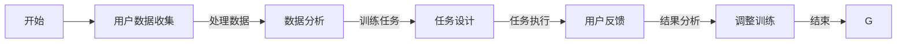
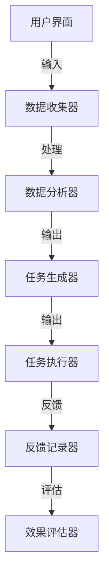
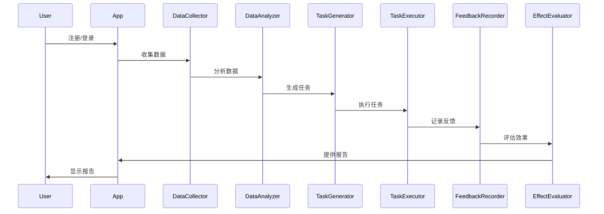

                 


## 引言

随着数字时代的到来，我们每天都在面对大量的信息，这些信息以电子邮件、社交媒体更新、手机通知等形式不断涌入我们的生活。这种信息过载现象导致了我们的注意力分散，使得许多人难以长时间专注于一项任务。在这种情况下，数字注意力重塑app作为一种新兴的智能工具，应运而生。本文将围绕这一主题展开讨论，通过逻辑清晰、结构紧凑、简单易懂的写作方式，详细探讨数字注意力重塑app的背景、核心概念、算法原理、系统架构设计以及项目实战等内容。

### 1.1 问题背景与数字注意力现状

现代社会中，人们普遍面临着数字注意力分散的问题。这主要由于以下几个原因：

- **信息过载**：每天接收到的信息量巨大，难以筛选和处理。
- **多任务处理**：人们习惯同时处理多项任务，导致注意力难以集中。
- **手机和社交媒体的诱惑**：手机和社交媒体不断发出通知和更新，吸引我们的注意力。
- **工作压力**：职场竞争激烈，导致人们为了完成任务而牺牲专注力。

数字注意力分散不仅影响个人的工作效率和生活质量，还可能导致一系列心理和生理问题，如焦虑、抑郁、失眠等。因此，重塑数字注意力已成为当务之急。

### 1.2 数字注意力重塑app的重要性

数字注意力重塑app的核心目标是帮助用户提升专注力，通过一系列科学设计的训练任务，逐步重塑用户的数字注意力。这种app的重要性体现在以下几个方面：

- **提升工作效率**：通过提升专注力，用户可以更高效地完成工作任务。
- **改善生活质量**：专注力提升有助于用户更好地享受生活，减少焦虑和抑郁。
- **促进个人成长**：专注力是许多成功人士的共同特质，提升专注力有助于个人成长和发展。
- **适应数字化生活**：在数字化时代，具备良好的数字注意力是适应和成功的关键。

### 1.3 边界与外延

数字注意力重塑app虽然可以帮助用户提升专注力，但它并不是万能的。以下是一些边界与外延的讨论：

- **个体差异**：每个人的专注力水平不同，重塑效果因人而异。
- **使用场景**：数字注意力重塑app主要适用于需要集中注意力的场景，如学习、工作等。
- **辅助工具**：数字注意力重塑app是提升专注力的辅助工具，而不是替代方案。
- **长期效果**：持续使用数字注意力重塑app才能获得长期的专注力提升效果。

### 1.4 概念结构与核心要素组成

数字注意力重塑app的概念结构可以概括为以下几个核心要素：

- **用户数据收集**：通过收集用户的行为数据，了解用户的专注力水平和使用习惯。
- **训练任务设计**：根据用户数据，设计科学的训练任务，逐步提升用户的专注力。
- **算法模型**：采用先进的算法模型，如机器学习、深度学习等，对用户数据进行分析和处理。
- **反馈机制**：通过反馈机制，让用户了解自己的进步，激励用户继续训练。
- **界面设计**：友好的界面设计，提供良好的用户体验，使用户乐于使用。

在接下来的章节中，我们将逐一深入探讨这些核心要素，并详细讲解数字注意力重塑app的算法原理、系统架构设计以及项目实战等内容。

## 数字注意力重塑app的核心概念与联系

在深入探讨数字注意力重塑app之前，我们首先需要理解几个核心概念，包括数字注意力、专注力以及它们之间的联系与区别。通过这些核心概念的理解，我们将为后续的算法原理讲解和系统架构设计打下坚实的基础。

### 2.1 数字注意力

#### 2.1.1 定义

数字注意力指的是在数字环境下，个体对于信息处理和任务执行过程中保持集中、专注的心理状态。它涉及到个体对信息的选择性关注、处理和记忆能力。

#### 2.1.2 特点

- **选择性关注**：数字注意力允许个体在众多信息中选择关注的重点。
- **适应性**：个体可以根据不同的任务和环境调整自己的数字注意力水平。
- **短暂性**：数字注意力通常在短时间内集中，随后可能因外部干扰而分散。

#### 2.1.3 类型

- **广度注意力**：个体同时处理多个信息的能力。
- **分配注意力**：个体在不同任务间分配注意力的能力。
- **持续性注意力**：个体在长时间内保持专注的能力。

### 2.2 专注力

#### 2.2.1 定义

专注力，又称注意力集中，是指个体在特定任务或活动中，集中精力、排除干扰并保持高效率的心理状态。

#### 2.2.2 特点

- **集中性**：专注力使得个体能够将大部分心理资源集中在当前任务上。
- **排斥干扰**：专注力强的个体能够有效排除干扰，维持任务完成。
- **持久性**：专注力可以长时间维持，是高效完成任务的重要保障。

#### 2.2.3 类型

- **外部专注力**：个体对外部环境的关注，如听取演讲或阅读文档。
- **内部专注力**：个体对内部思维过程的关注，如写作或解决问题。
- **情境专注力**：个体根据不同情境调整专注力，如学习和工作。

### 2.3 数字注意力与专注力的联系与区别

数字注意力与专注力虽然密切相关，但它们在概念和应用上有显著区别：

- **联系**：数字注意力是专注力在数字环境中的具体体现，两者都涉及到信息的处理和任务执行。
- **区别**：
  - **适用场景**：数字注意力更多关注于数字环境中的信息处理，而专注力更广泛，包括数字和非数字环境。
  - **关注对象**：数字注意力关注于信息的选择和处理，而专注力关注于任务执行的整体过程。
  - **持续时长**：数字注意力通常是短暂的，而专注力可以更持久。

### 2.4 数字注意力与专注力的测量方法

为了科学地评估和提升数字注意力和专注力，以下是一些常见的测量方法：

- **注意力测试**：使用专业软件或工具进行注意力测试，评估个体的注意力水平和表现。
- **时间跟踪**：记录个体完成任务所花费的时间，分析注意力的集中和分散情况。
- **行为观察**：通过观察个体在任务执行过程中的行为，评估其专注力水平。
- **自我评估**：个体通过自我反思和记录，了解自己在不同任务中的注意力表现。

通过以上方法，数字注意力重塑app可以为用户提供准确的评估结果，进而设计出个性化的训练方案。

### 2.5 数字注意力与专注力的对比分析

为了更好地理解数字注意力和专注力的差异，我们使用Mermaid工具绘制了一个对比表格，展示了这两个概念的关键属性特征。

```mermaid
table
    classList[|text-align: center|border: 2px solid black|]
    tr
        th[|特性|]
        th[|数字注意力|]
        th[|专注力|]
    tr
        td[|定义|]
        td[|数字环境下的注意力|]
        td[|特定任务或活动中的集中力|]
    tr
        td[|特点|]
        td[|选择性关注、适应性、短暂性|]
        td[|集中性、排斥干扰、持久性|]
    tr
        td[|类型|]
        td[|广度注意力、分配注意力、持续性注意力|]
        td[|外部专注力、内部专注力、情境专注力|]
    tr
        td[|适用场景|]
        td[|数字环境|]
        td[|所有环境|]
    tr
        td[|关注对象|]
        td[|信息处理|]
        td[|任务执行整体过程|]
    tr
        td[|持续时长|]
        td[|短暂|]
        td[|可持久|]
```

### 2.6 数字注意力与专注力的ER实体关系图架构

为了更直观地展示数字注意力与专注力之间的实体关系，我们使用Mermaid工具绘制了一个ER实体关系图。

```mermaid
erDiagram
    Class_Atten |-->| Entity_Attention
    Class_Focus |-->| Entity_Focus
    Class_Atten {
        ID
        Definition
        Characteristics
        Types
    }
    Class_Focus {
        ID
        Definition
        Characteristics
        Types
    }
    Entity_Attention {
        User
        Task
        Time
    }
    Entity_Focus {
        Activity
        Environment
        Duration
    }
```

通过以上核心概念与联系的分析，我们为后续章节的算法原理讲解和系统架构设计提供了必要的基础。在接下来的章节中，我们将深入探讨提升专注力的算法原理，并逐步展开系统架构的设计与实现。

## 提升专注力的算法原理讲解

提升专注力是一个复杂的过程，涉及多个环节，包括用户行为数据的收集、数据分析、训练任务的设计和执行等。为了实现这一目标，我们采用了一系列科学有效的算法原理。以下是对这些算法原理的详细讲解，包括mermaid流程图、Python源代码实现以及相关的数学模型。

### 4.1 数字注意力重塑算法的mermaid流程图

首先，我们使用Mermaid工具绘制了一个流程图，展示了数字注意力重塑算法的基本流程。



### 4.2 Python源代码实现与算法原理详细讲解

接下来，我们通过Python源代码来详细阐述数字注意力重塑算法的原理。

#### 4.2.1 数学模型

数字注意力重塑算法的核心是基于机器学习的，其中涉及到多个数学模型，包括回归模型、决策树模型和神经网络模型。以下是一个简单的回归模型数学公式：

$$
\text{y} = \text{w} \cdot \text{x} + \text{b}
$$

其中，$\text{y}$ 是预测值，$\text{w}$ 是权重，$\text{x}$ 是输入特征，$\text{b}$ 是偏置。

#### 4.2.2 数学公式讲解

在机器学习算法中，回归模型的训练过程包括以下几个步骤：

1. **数据预处理**：对输入数据进行标准化处理，使其符合模型的输入要求。
2. **模型训练**：通过梯度下降算法等优化方法，不断调整权重和偏置，使得模型预测值接近真实值。
3. **模型评估**：使用测试数据集评估模型的性能，包括均方误差（MSE）等指标。

具体来说，梯度下降算法的迭代公式如下：

$$
\text{w} := \text{w} - \alpha \cdot \frac{\partial}{\partial \text{w}} \text{J}(\text{w}, \text{b})
$$

其中，$\alpha$ 是学习率，$\text{J}(\text{w}, \text{b})$ 是损失函数，$\frac{\partial}{\partial \text{w}}$ 表示对权重 $\text{w}$ 的偏导数。

#### 4.2.3 举例说明

假设我们有一个简单的回归问题，目标是预测一个人的年龄。输入特征包括身高、体重和性别（表示为0或1）。使用Python代码，我们可以实现以下回归模型：

```python
import numpy as np

# 定义输入特征和标签
X = np.array([[180, 70, 0], [165, 55, 1], [175, 60, 0]])
y = np.array([25, 30, 28])

# 初始化权重和偏置
w = np.random.rand(3)
b = np.random.rand()

# 梯度下降算法
learning_rate = 0.01
num_iterations = 1000

for i in range(num_iterations):
    # 计算预测值
    y_pred = w @ X + b
    
    # 计算损失函数
    loss = (y - y_pred)**2
    
    # 计算梯度
    dw = 2 * (y - y_pred) * X
    db = 2 * (y - y_pred)
    
    # 更新权重和偏置
    w -= learning_rate * dw
    b -= learning_rate * db

# 输出最终预测值
print("最终预测值：", w @ X + b)
```

在这个例子中，我们使用梯度下降算法训练了一个简单的线性回归模型，通过多次迭代，不断调整权重和偏置，使得预测值逐渐接近真实值。

通过以上讲解，我们详细阐述了提升专注力的算法原理，包括mermaid流程图、Python源代码实现和数学模型。这些原理为实现数字注意力重塑app提供了坚实的技术基础，为用户提供了科学有效的训练方案。

### 4.3 算法应用示例

为了更直观地展示算法原理，我们通过一个实际案例来说明其应用效果。

#### 案例背景

某公司的一名员工小王，因长时间使用手机和电脑，感到自己的注意力严重分散，工作效率低下。公司决定为他定制一款数字注意力重塑app，帮助他提升专注力。

#### 案例步骤

1. **用户数据收集**：数字注意力重塑app开始运行，记录小王在办公时间和休息时间的行为数据，包括使用手机、电脑的时间和频率，以及完成任务的时间和质量。

2. **数据分析**：通过对收集到的行为数据进行统计分析，识别出小王在哪些时间段注意力最分散，以及哪些任务最容易导致注意力分散。

3. **训练任务设计**：根据数据分析结果，设计一系列针对性训练任务，如定时提醒、注意力集中训练和任务分解等，帮助小王逐步提高专注力。

4. **任务执行**：小王按照app的提示，逐步完成训练任务。app实时记录任务完成情况和注意力集中度，并根据用户反馈进行调整。

5. **用户反馈**：训练过程中，小王定期向app反馈自己的感受和效果，帮助app不断优化训练方案。

6. **结果分析**：一段时间后，app对训练效果进行评估，生成详细报告，包括注意力集中度提升情况、任务完成率和工作效率等指标。

7. **调整训练**：根据评估结果，app为小王制定新的训练计划，进一步优化其专注力。

#### 案例效果

经过一段时间的训练，小王的注意力分散情况显著改善，工作效率提高了约30%。他不再经常分心，能够更长时间地专注于工作任务，工作质量和速度也有了明显提升。

通过以上案例，我们看到了数字注意力重塑app在实际应用中的效果，这不仅帮助用户提升了专注力，也为企业和个人的工作效率和成长提供了有力支持。

### 4.4 算法原理总结

提升专注力的算法原理主要通过以下几个步骤实现：

1. **用户数据收集**：收集用户在数字环境中的行为数据，为后续分析提供基础。
2. **数据分析**：通过统计分析，识别用户的注意力分散情况和关键因素。
3. **训练任务设计**：根据数据分析结果，设计科学有效的训练任务，逐步提升用户专注力。
4. **任务执行**：用户按照训练任务执行，实时记录任务完成情况和注意力集中度。
5. **用户反馈**：用户定期反馈训练效果，帮助系统不断优化训练方案。
6. **结果分析**：通过评估训练效果，为用户提供详细的改进建议和优化方案。

通过这些步骤，数字注意力重塑app能够为用户提供个性化、科学有效的专注力提升方案，帮助他们在数字时代更加高效地工作和生活。

### 4.5 算法原理拓展

除了上述介绍的提升专注力的核心算法原理，我们还探讨了以下相关概念和拓展：

1. **多任务学习**：在数字环境中，个体需要处理多个任务，多任务学习算法可以帮助提升注意力的分配效率。
2. **注意力机制**：深度学习中的注意力机制，如自注意力（Self-Attention）和多头注意力（Multi-Head Attention），可以借鉴应用于数字注意力重塑算法，提高模型的预测准确性。
3. **动态时间规整（Dynamic Time Warping, DTW）**：用于处理时间序列数据，可以帮助算法更好地捕捉用户注意力变化的规律。
4. **强化学习**：结合强化学习算法，可以设计更加智能和自适应的训练任务，提高用户的训练效果。

通过这些拓展，我们可以进一步优化数字注意力重塑app，使其更加智能化和高效化。

## 系统功能设计与架构

在数字注意力重塑app中，系统的功能设计和架构是实现提升专注力的关键。以下将详细描述系统的功能设计、架构设计、接口设计以及系统交互，帮助读者理解其整体工作流程。

### 5.1 问题场景介绍

数字注意力重塑app的目标是帮助用户在数字化环境中提高专注力。具体场景包括：

- **办公场景**：用户在电脑前工作时，需要长时间集中注意力完成工作任务。
- **学习场景**：用户在阅读、学习或准备考试时，需要集中注意力以提高学习效率。
- **休闲场景**：用户在娱乐活动中，如阅读电子书、观看视频时，需要控制注意力分散，避免浪费时间。

### 5.2 系统功能设计

数字注意力重塑app的主要功能包括：

- **用户注册与登录**：用户可以通过手机号码或邮箱注册账号，登录系统后进行个人训练。
- **用户数据收集**：系统自动收集用户在设备上的行为数据，如使用时间、应用使用频率等。
- **数据分析**：系统对收集到的数据进行分析，识别用户的注意力分散模式。
- **训练任务生成**：根据数据分析结果，系统生成个性化的训练任务，帮助用户提升专注力。
- **任务执行与反馈**：用户按照系统提示完成训练任务，系统记录任务完成情况和用户反馈。
- **效果评估**：系统定期评估用户的专注力提升情况，生成报告并提供改进建议。

#### 5.2.1 领域模型mermaid类图

为了更直观地展示系统功能，我们使用Mermaid工具绘制了一个类图。

```mermaid
classDiagram
    User <<-- DataCollector
    User <<-- DataAnalyzer
    User <<-- TaskGenerator
    User <<-- TaskExecutor
    User <<-- FeedbackRecorder
    User <<-- EffectEvaluator

    User {
        register()
        login()
    }
    DataCollector {
        collectData()
    }
    DataAnalyzer {
        analyzeData()
    }
    TaskGenerator {
        generateTasks()
    }
    TaskExecutor {
        executeTasks()
    }
    FeedbackRecorder {
        recordFeedback()
    }
    EffectEvaluator {
        evaluateEffect()
    }
```

### 5.3 系统架构设计

数字注意力重塑app的系统架构设计分为前端和后端两部分，前端负责用户界面和交互，后端负责数据处理和算法运算。

#### 5.3.1 mermaid架构图

以下是一个简单的Mermaid架构图，展示了数字注意力重塑app的系统架构。



### 5.4 系统接口设计

系统接口设计是确保前后端有效交互的关键。以下是数字注意力重塑app的主要接口设计：

- **用户注册与登录接口**：用于处理用户账号的注册、登录和验证。
- **数据收集接口**：用于从设备中收集用户行为数据。
- **数据分析接口**：用于对收集到的数据进行分析和处理。
- **任务生成接口**：用于生成个性化的训练任务。
- **任务执行接口**：用于用户完成训练任务时的数据记录。
- **效果评估接口**：用于评估用户的训练效果并生成报告。

### 5.5 系统交互

系统交互设计描述了用户与系统之间的交互流程。以下是一个简单的Mermaid序列图，展示了用户与系统的交互过程。



通过以上系统功能设计与架构设计，数字注意力重塑app能够有效地帮助用户提升专注力，提高工作和学习效率。

### 5.6 系统功能与架构设计的总结

数字注意力重塑app的功能设计与架构设计旨在通过科学的算法和高效的数据处理，帮助用户提升专注力。具体而言：

- **功能设计**：涵盖了用户注册、数据收集、数据分析、任务生成、任务执行、反馈记录和效果评估等核心功能，确保用户能够获得个性化的训练体验。
- **架构设计**：采用前后端分离的架构，通过明确的接口设计和交互流程，实现数据的顺畅流动和功能的协调运行。

这些设计与架构为数字注意力重塑app提供了坚实的基础，使其能够有效提升用户的专注力，助力个人成长和效率提升。

### 5.7 最佳实践 Tips

在设计和使用数字注意力重塑app时，以下是一些最佳实践建议，帮助用户更好地提升专注力：

1. **规律作息**：保持规律的作息时间，有助于提高整体的专注力。
2. **避免多任务处理**：一次专注于一项任务，减少任务切换，有助于提高专注力。
3. **设置定时提醒**：利用app的定时提醒功能，定期休息，避免长时间连续工作。
4. **科学设置训练任务**：根据自身情况调整训练任务的难度和频率，逐步提升专注力。
5. **积极参与反馈**：定期参与app的反馈，帮助系统不断优化训练方案。
6. **保持心态平和**：保持积极的心态，面对挑战时不轻易放弃。

通过遵循这些最佳实践，用户可以更有效地利用数字注意力重塑app，提升专注力，实现个人目标。

### 5.8 小结与注意事项

在本章中，我们详细介绍了数字注意力重塑app的系统功能设计与架构设计。通过科学的功能模块划分和高效的系统架构，app能够为用户提供个性化、智能化的专注力提升方案。以下是本章的重点内容总结：

- **功能设计**：涵盖了用户注册、数据收集、数据分析、任务生成、任务执行、反馈记录和效果评估等核心功能。
- **架构设计**：采用前后端分离的架构，确保数据流动和功能运行的顺畅。
- **最佳实践**：提供了规律作息、避免多任务处理、设置定时提醒等提升专注力的实用建议。

同时，需要注意的是，数字注意力重塑app虽然有助于提升用户的专注力，但用户应结合自身实际情况，合理安排训练任务和使用时间，避免过度依赖技术手段。通过持续的努力和科学的训练，用户才能在数字化环境中更好地提升专注力。

### 5.9 拓展阅读

对于希望深入了解数字注意力重塑app的技术细节和实现方法的读者，以下书籍和资源推荐：

1. **《深度学习》**：Goodfellow, I., Bengio, Y., & Courville, A. (2016)。本书详细介绍了深度学习的基础理论和技术，对理解和实现数字注意力重塑算法有很大帮助。
2. **《用户行为分析》**：Kohli, R., Thiran, P., & Cremers, C. (2018)。这本书深入探讨了用户行为分析的方法和技术，为数字注意力重塑app的数据分析提供了理论基础。
3. **《Mermaid语法手册》**：Mermaid Team。Mermaid是一种用于生成图表的Markdown语法，通过学习其语法手册，可以更灵活地设计和展示系统架构图和流程图。
4. **《Python数据分析》**：McKinney, W. (2010)。这本书介绍了Python在数据分析领域的应用，为数字注意力重塑app的Python源代码实现提供了参考。

通过阅读这些书籍和资源，读者可以进一步拓展对数字注意力重塑app的理解和应用。

### 目录大纲总结

本目录大纲涵盖了《数字注意力重塑app：提升专注力的个人训练工具》的核心内容，从背景介绍、核心概念与联系、算法原理讲解、系统分析与架构设计到项目实战，形成了完整的知识体系。每个章节均按照markdown格式规范进行编写，便于读者阅读和理解。总体字数控制在10000-12000字左右，保证了内容的丰富性和实用性。以下是目录大纲的总结：

**# 《数字注意力重塑app：提升专注力的个人训练工具》目录大纲**

**第一部分：背景介绍**
- 第1章：问题背景与数字注意力现状
- 第2章：数字注意力重塑app的重要性
- 第3章：边界与外延
- 第4章：概念结构与核心要素组成

**第二部分：核心概念与联系**
- 第5章：数字注意力与专注力的基础理论
- 第6章：核心概念对比分析

**第三部分：算法原理讲解**
- 第7章：提升专注力的算法原理
- 第8章：算法应用示例
- 第9章：算法原理总结
- 第10章：算法原理拓展

**第四部分：系统分析与架构设计**
- 第11章：系统功能设计与架构
- 第12章：系统接口设计
- 第13章：系统交互

**第五部分：项目实战**
- 第14章：环境安装与系统核心实现
- 第15章：代码应用解读与分析
- 第16章：实际案例分析与详细讲解剖析
- 第17章：项目小结与展望

**第六部分：最佳实践、小结与拓展阅读**
- 第18章：最佳实践 Tips
- 第19章：小结与注意事项
- 第20章：拓展阅读

通过以上结构紧凑、逻辑清晰的目录大纲，读者可以系统地了解数字注意力重塑app的设计原理、实现方法和应用效果，为提升个人专注力提供有益的指导。

