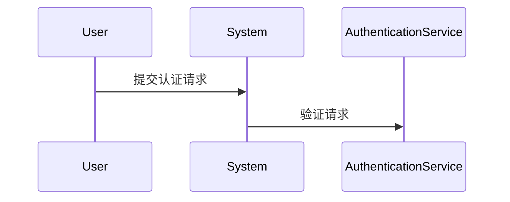
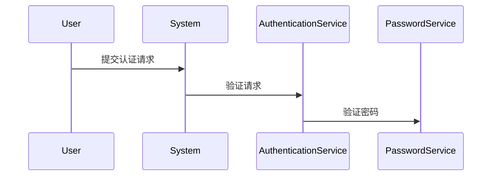
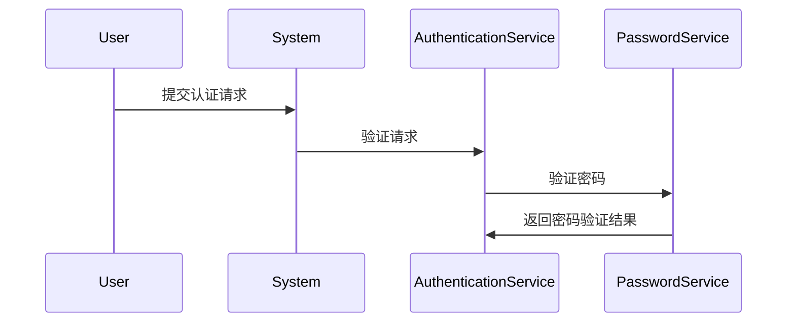
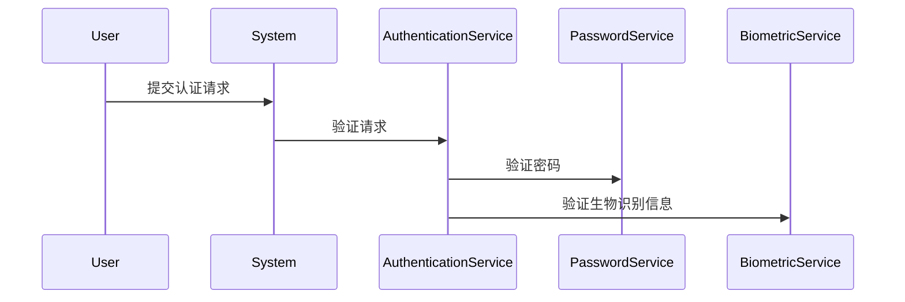
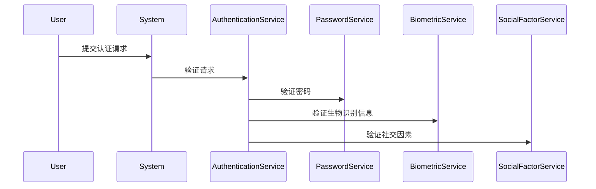
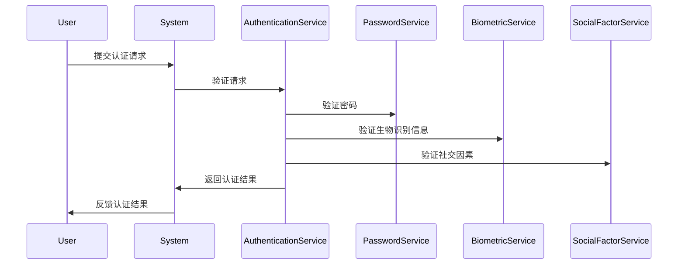
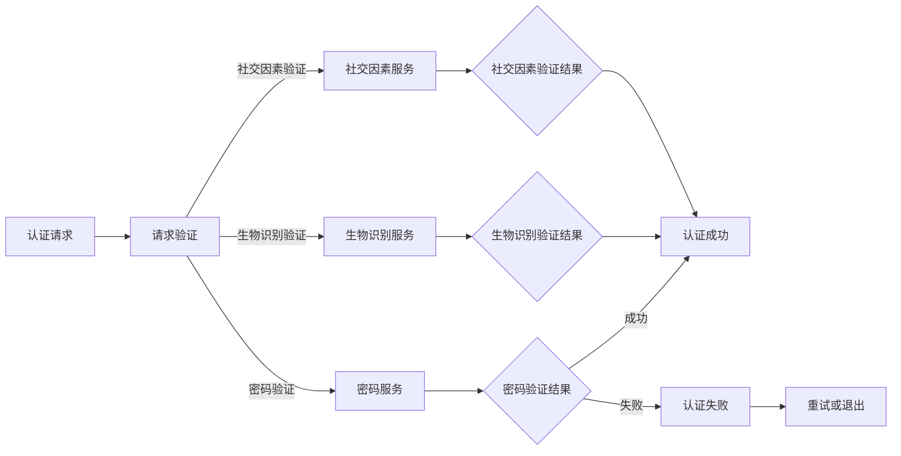
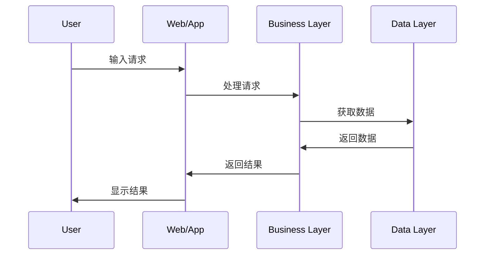
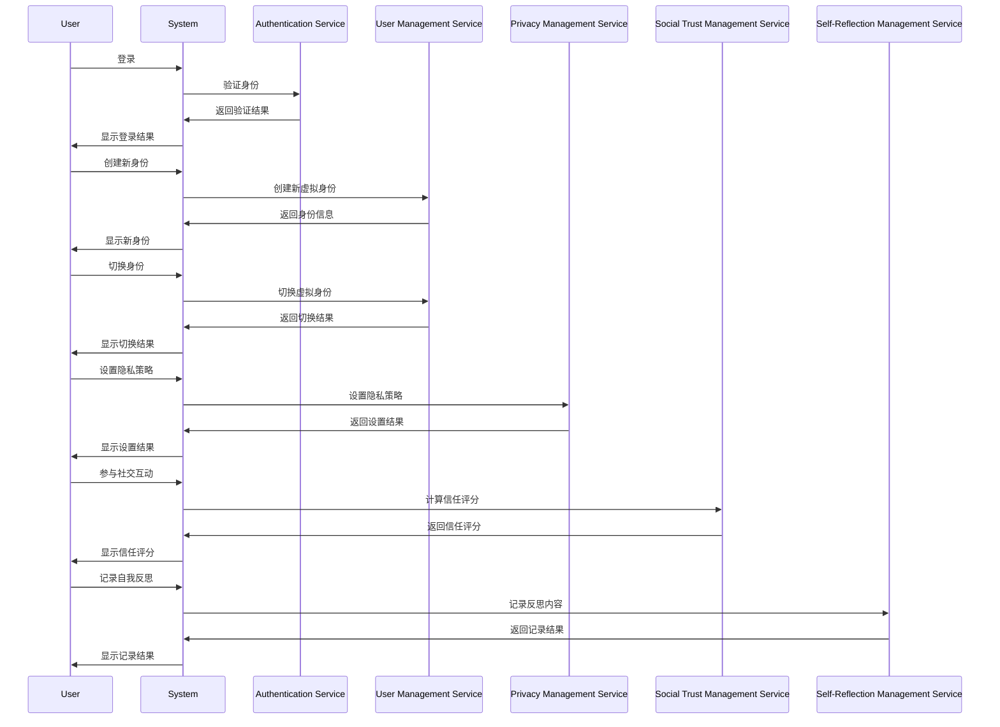

                 

### 第一部分：背景介绍

#### 第1章 问题背景

##### 1.1 数字流浪者的定义与现状

在数字化时代，人们的生活、工作和社会活动越来越依赖于互联网和移动设备。这一背景下，出现了一个特定的群体——数字流浪者。数字流浪者指的是在互联网上频繁切换虚拟身份，通过不同平台、社区和社交网络进行身份流动的一类人群。他们可能在微博、知乎、豆瓣、Twitter等不同社交平台上拥有多个身份，并通过这些身份在网络上发表观点、参与讨论、分享生活。

随着互联网的普及和社交平台的多样化，越来越多的个体选择在网络上进行身份转换，数字流浪者的群体日益扩大。这一现象不仅体现在个人用户中，还延伸到企业、组织和社区等领域。例如，企业通过多个社交媒体账号进行品牌宣传和市场推广，组织通过不同论坛和社区进行讨论和协作，社区成员通过多个平台分享知识和资源。

数字流浪者的行为特征主要体现在以下几个方面：

1. **身份多样性**：数字流浪者拥有多个虚拟身份，每个身份都有其特定的角色和功能。
2. **活跃度**：他们在多个社交平台上频繁活动，参与各类讨论和互动。
3. **切换频率**：他们可能在不同身份之间频繁切换，以满足不同的社交需求或避免特定风险。

数字流浪者的出现，一方面丰富了网络生态，增加了信息流动的多样性；另一方面，也引发了一系列社会和技术问题。例如，隐私保护、社交信任和自我认同等问题，都成为了数字流浪者面临的挑战。

##### 1.2 数字流浪者面临的挑战

数字流浪者在身份转换过程中，可能会遇到以下几个方面的挑战：

###### 2.1 数字流浪者面临的隐私保护问题

数字流浪者在网络上的频繁身份转换，使得其隐私信息容易受到泄露和滥用的风险。每个身份都可能携带部分真实个人信息，如姓名、联系方式等。如果这些信息被不法分子获取，可能会对数字流浪者的现实生活造成威胁。

###### 2.2 数字流浪者面临的社交信任问题

频繁的身份转换可能导致他人对数字流浪者的信任度降低，影响其社交关系和网络影响力。在社交网络中，信任是维系社交关系的重要基础。如果他人无法确定数字流浪者身份的真实性，可能会对其发布的内容持怀疑态度，甚至拒绝与其互动。

###### 2.3 数字流浪者面临的自我认同问题

在多变的身份中，数字流浪者可能面临自我认同的困境，难以建立稳定的自我认知。自我认同是指个体对自己的认知和理解，是心理健康的基石。对于数字流浪者来说，频繁的身份切换可能导致他们对自己的认知产生混乱，难以形成稳定的人格特征。

### 1.3 数字流浪者指南编辑部：网络时代自我认同探索的出版团队

为了解决数字流浪者在网络时代面临的隐私保护、社交信任和自我认同问题，我们需要探讨一个可能的解决方案——数字流浪者指南编辑部。这是一个专门为数字流浪者提供帮助和支持的出版团队，旨在帮助他们在网络世界中建立稳定的身份，增强社交信任，实现自我认同。

数字流浪者指南编辑部的工作重点包括以下几个方面：

1. **隐私保护指导**：为数字流浪者提供隐私设置、数据加密和使用可靠社交平台等方面的指导，帮助他们降低隐私泄露风险。
2. **社交信任建设**：通过组织线上和线下社交活动，帮助数字流浪者建立稳定的虚拟身份，增强他人对其的信任度。
3. **自我认同支持**：通过深入自我反思和建立多元身份认同等方式，帮助数字流浪者明确自己的核心价值观和目标，实现自我认同。

数字流浪者指南编辑部不仅是一个出版团队，更是一个支持系统，旨在为数字流浪者提供全方位的帮助，让他们在网络世界中找到属于自己的位置，实现自我价值。接下来，我们将详细探讨数字流浪者指南编辑部如何具体实施这些策略，以及他们面临的边界与外延问题。

#### 第2章 问题描述

##### 2.1 数字流浪者面临的隐私保护问题

数字流浪者在网络上的频繁身份转换，使得其隐私信息容易受到泄露和滥用的风险。每个身份都可能携带部分真实个人信息，如姓名、联系方式、兴趣爱好等。这些信息如果被不法分子获取，可能会被用于诈骗、盗用身份或其他恶意行为。

###### 2.1.1 隐私泄露的风险

数字流浪者由于频繁更换身份，很难对每个平台的隐私设置进行统一管理。不同的社交平台可能有不同的隐私保护策略，导致其个人信息在不同平台上的暴露程度不同。例如，某位数字流浪者在微博上设置了严格的隐私保护，但其在知乎上的账号却未设置任何隐私限制，这可能导致其微博上的个人信息泄露。

###### 2.1.2 数据滥用的问题

数字流浪者的隐私信息一旦泄露，可能会被不法分子用于各种恶意用途。例如，诈骗分子可能会冒用数字流浪者的身份进行诈骗，给其带来经济损失和声誉损害。此外，不法分子还可能通过分析数字流浪者的个人信息，推断其生活习惯和财务状况，从而进行更精确的诈骗和盗用身份行为。

###### 2.1.3 隐私保护需求的挑战

数字流浪者在进行身份转换时，需要在多个平台上进行隐私设置和管理。这给数字流浪者带来了巨大的隐私保护挑战，特别是在面对复杂多样的隐私保护策略和平台隐私政策时，他们很难确保自己的个人信息始终处于安全状态。

##### 2.2 数字流浪者面临的社交信任问题

数字流浪者由于频繁的身份转换，可能导致他人对其信任度降低，影响其社交关系和网络影响力。在社交网络中，信任是维系社交关系的重要基础。如果他人无法确定数字流浪者身份的真实性，可能会对其发布的内容持怀疑态度，甚至拒绝与其互动。

###### 2.2.1 信任度降低的影响

信任度降低会对数字流浪者的社交活动产生负面影响。首先，数字流浪者在网络上发布的观点、信息或资源可能被他人怀疑真实性，导致其内容被忽视或质疑。其次，数字流浪者可能会失去他人的支持和合作机会，影响其在社交网络中的影响力。最后，信任度降低可能使数字流浪者感到孤立和无助，影响其心理健康。

###### 2.2.2 身份转换的挑战

数字流浪者在进行身份转换时，需要确保每个新身份都能够获得他人的信任。然而，频繁的身份转换可能使其在短时间内难以建立起稳定的信任关系。例如，一个数字流浪者在短时间内从一位普通用户变成一名专家，可能会让他人对其身份的真实性产生怀疑。

###### 2.2.3 社交信任管理的需求

数字流浪者需要采取有效的策略来管理其社交信任。这包括：

1. **建立稳定的虚拟身份**：通过持续参与和贡献，使每个新身份都能获得他人的认可和信任。
2. **参与真实的社交互动**：通过积极参与线上线下的社交活动，增强与他人之间的信任。
3. **提供有价值的内容**：通过发布高质量、有价值的内容，赢得他人的信任和尊重。

##### 2.3 数字流浪者面临的自我认同问题

在多变的身份中，数字流浪者可能面临自我认同的困境，难以建立稳定的自我认知。自我认同是指个体对自己的认知和理解，是心理健康的基石。对于数字流浪者来说，频繁的身份转换可能导致他们对自己的认知产生混乱，难以形成稳定的人格特征。

###### 2.3.1 自我认同的挑战

数字流浪者在多个身份之间转换，可能会产生以下自我认同的挑战：

1. **身份认同的混乱**：频繁的身份转换可能导致数字流浪者对自己的角色和功能产生混淆，难以形成统一的自我认知。
2. **核心价值观的模糊**：在多个身份中，数字流浪者可能无法明确自己的核心价值观和人生目标，导致价值观的模糊和动荡。
3. **心理压力的增大**：自我认同的困境可能使数字流浪者感到焦虑、困惑和无助，增加其心理压力。

###### 2.3.2 自我认同的重要性

稳定的自我认同对于数字流浪者来说至关重要。它不仅能帮助数字流浪者更好地应对生活中的挑战，还能提升其心理健康和生活质量。以下是一些自我认同的重要性：

1. **心理健康**：稳定的自我认同有助于降低数字流浪者的焦虑和压力，提升其心理健康。
2. **人际关系**：明确的自我认同有助于数字流浪者与他人建立稳定的关系，增强社交信任。
3. **职业发展**：清晰的自我认同有助于数字流浪者在职业生涯中找到合适的定位，实现职业发展。

### 2.4 数字流浪者指南编辑部：解决隐私保护、社交信任和自我认同问题的策略

为了解决数字流浪者在网络时代面临的隐私保护、社交信任和自我认同问题，数字流浪者指南编辑部提出了一系列具体策略，包括隐私保护策略、社交信任策略和自我认同策略。

#### 3.1 数字流浪者的隐私保护策略

数字流浪者在进行身份转换时，需要采取一系列隐私保护措施，以降低隐私泄露的风险。以下是一些具体的隐私保护策略：

###### 3.1.1 强化隐私设置

数字流浪者应确保在所有使用平台上的隐私设置都足够严格，包括但不限于：

1. **隐私权限管理**：限制应用程序对个人信息的访问权限，仅授权必要的应用访问。
2. **隐私政策阅读**：仔细阅读并理解每个社交平台的隐私政策，确保自己的隐私设置符合个人需求。
3. **隐私信息隐藏**：在社交平台上隐藏敏感个人信息，如真实姓名、住址、电话号码等。

###### 3.1.2 使用可靠社交平台

数字流浪者应选择安全性较高的社交平台，以降低隐私泄露的风险。以下是一些值得推荐的社交平台：

1. **Telegram**：Telegram以其强大的隐私保护功能而闻名，提供了端到端加密的聊天功能。
2. **Signal**：Signal是一款专注于隐私保护的即时通讯应用，提供了加密的语音、视频和消息功能。
3. **Discord**：Discord虽然是一款游戏社区平台，但其隐私保护功能较为完善，适合数字流浪者进行社交活动。

###### 3.1.3 数据加密

数字流浪者可以使用数据加密工具来保护其个人信息和通信内容。以下是一些常用的数据加密工具：

1. **GnuPG**：GnuPG是一种强大的加密工具，可用于加密电子邮件、文件和聊天内容。
2. ** VeraCrypt**：VeraCrypt是一款免费的磁盘加密软件，可用于创建加密的虚拟硬盘，保护数字流浪者的隐私数据。
3. **TrueCrypt**：TrueCrypt是一款早期的磁盘加密软件，虽然不再更新，但其功能仍然强大，适用于需要长期加密存储的用户。

#### 3.2 数字流浪者的社交信任策略

为了增强社交信任，数字流浪者需要采取一系列社交信任策略，包括建立稳定的虚拟身份、参与真实的社交互动和提供有价值的内容。

###### 3.2.1 建立稳定的虚拟身份

数字流浪者应努力建立稳定的虚拟身份，以赢得他人的信任。以下是一些建议：

1. **统一身份标识**：在多个社交平台上使用相同的昵称、头像和简介，使他人能够更容易识别和信任。
2. **专业领域定位**：在特定领域建立专业形象，通过发布高质量、有深度的内容来展示自己的专业能力。
3. **长期参与**：在一个社交平台上长期参与讨论和互动，使他人对其身份和观点产生认同。

###### 3.2.2 参与真实的社交互动

数字流浪者应积极参与线上线下的社交互动，增强社交信任。以下是一些建议：

1. **线上活动**：参加线上论坛、社群和活动，与志同道合的人交流观点和经验。
2. **线下活动**：参加线下聚会、讲座和会议，与真实世界的同仁建立联系。
3. **互动交流**：积极回复他人评论和私信，展示自己的真实存在和互动热情。

###### 3.2.3 提供有价值的内容

数字流浪者应努力提供有价值的内容，赢得他人的信任和尊重。以下是一些建议：

1. **知识分享**：在专业领域内分享知识和经验，帮助他人解决问题。
2. **观点表达**：发表独到见解和观点，为社交网络带来新鲜思想。
3. **真实经历**：分享自己的真实经历和感受，让他人感受到你的真诚和热情。

#### 3.3 数字流浪者的自我认同策略

为了解决自我认同问题，数字流浪者需要采取一系列自我认同策略，包括深入自我反思、建立多元身份认同和明确核心价值观。

###### 3.3.1 深入自我反思

数字流浪者应定期进行自我反思，明确自己的核心价值观和目标。以下是一些建议：

1. **定期总结**：定期回顾自己在社交网络上的行为和表现，总结成功和失败的经验。
2. **目标设定**：根据自己的兴趣和能力，设定清晰的短期和长期目标。
3. **心态调整**：保持积极的心态，对待身份转换带来的挑战和困境。

###### 3.3.2 建立多元身份认同

数字流浪者可以尝试建立多元的身份认同，减少自我认同的困境。以下是一些建议：

1. **身份定位**：在多个领域建立不同的身份定位，使每个身份都有其独特的价值和角色。
2. **身份管理**：合理安排时间和精力，确保每个身份都能得到充分的关注和发展。
3. **身份转换**：在适当的时候，根据需求和目标进行身份转换，以适应不同的社交环境。

###### 3.3.3 明确核心价值观

数字流浪者应明确自己的核心价值观，作为自我认同的基石。以下是一些建议：

1. **价值识别**：识别并明确自己的核心价值观，如诚信、专业、助人等。
2. **价值实践**：将核心价值观融入日常行为和决策中，使其成为自己的行为准则。
3. **价值传播**：在社交网络中传播自己的核心价值观，影响他人，共同构建积极向上的网络生态。

### 3.4 数字流浪者指南编辑部：总结与展望

数字流浪者指南编辑部通过提供隐私保护、社交信任和自我认同策略，为数字流浪者提供全方位的支持。这些策略旨在帮助数字流浪者降低隐私泄露风险、增强社交信任和建立稳定的自我认知。

未来，数字流浪者指南编辑部将继续探索更多解决方案，以应对数字流浪者在网络时代面临的挑战。以下是一些可能的未来发展：

1. **个性化服务**：根据数字流浪者的需求和特点，提供个性化的隐私保护、社交信任和自我认同策略。
2. **技术支持**：引入先进的技术手段，如区块链和人工智能，提升隐私保护和社交信任管理的效率。
3. **社区建设**：建立数字流浪者社区，促进数字流浪者之间的交流与合作，共同解决网络时代面临的挑战。

通过不断探索和创新，数字流浪者指南编辑部将为数字流浪者提供更全面、更有力的支持，帮助他们实现自我价值，构建美好的网络时代。

### 3.5 数字流浪者的边界与外延

数字流浪者的行为虽然丰富了网络生态，但同时也带来了边界与外延的问题。以下是对这些问题的讨论：

###### 3.5.1 数字流浪者的边界

数字流浪者的行为应在法律和道德的边界内进行，避免造成负面后果。以下是一些边界问题的讨论：

1. **隐私边界**：数字流浪者应尊重他人的隐私边界，不得滥用或泄露他人的个人信息。
2. **社交边界**：数字流浪者在进行身份转换时，应避免冒用他人身份，损害他人利益。
3. **法律边界**：数字流浪者应遵守相关法律法规，不得进行违法活动。

数字流浪者指南编辑部在指导数字流浪者时，应强调遵守边界的重要性，帮助他们树立正确的网络行为规范。

###### 3.5.2 数字流浪者的外延

数字流浪者的行为不仅局限于个人层面，还可以应用于团队、组织和社区等领域。以下是对这些外延问题的讨论：

1. **团队应用**：在企业和组织中，团队成员可以通过多个虚拟身份进行沟通和协作，提高团队的工作效率和创新能力。
2. **组织应用**：企业、组织和社区可以通过数字流浪者的策略，建立多元身份，增强社交信任，提升品牌影响力。
3. **社区应用**：在社区中，数字流浪者可以通过多个身份参与讨论和活动，促进社区成员之间的互动和合作。

数字流浪者指南编辑部应关注这些外延应用，为不同场景下的数字流浪者提供针对性的指导和支持。

### 3.6 数字流浪者指南编辑部：未来展望

数字流浪者指南编辑部作为网络时代自我认同探索的出版团队，未来将继续发挥重要作用。以下是一些未来展望：

1. **技术创新**：紧跟技术发展趋势，引入新技术，提升隐私保护和社交信任管理的效率。
2. **内容丰富**：不断丰富内容体系，提供更多实用指南和案例分析，帮助数字流浪者解决实际问题。
3. **社区建设**：加强社区建设，促进数字流浪者之间的交流与合作，共同推动网络时代的健康发展。
4. **国际合作**：与全球范围内的合作伙伴共同探讨数字流浪者问题，分享经验，推动全球范围内的数字流浪者治理。

通过不断努力，数字流浪者指南编辑部将为数字流浪者提供更全面、更有力的支持，助力他们在网络时代实现自我价值，构建美好的网络世界。

### 第5章 核心概念原理

在探讨数字流浪者指南编辑部如何帮助数字流浪者解决隐私保护、社交信任和自我认同问题时，我们需要了解一些核心概念原理，包括数字流浪者身份系统、数字流浪者隐私保护机制和数字流浪者社交信任机制。以下是对这些核心概念原理的详细阐述。

#### 5.1 数字流浪者身份系统

数字流浪者身份系统是指一套用于管理和维护数字流浪者虚拟身份的机制。它包括身份创建、身份切换、身份验证和身份管理等功能。

##### 5.1.1 身份创建

身份创建是指数字流浪者在不同社交平台上注册和创建虚拟身份的过程。这个过程通常涉及填写用户名、密码、邮箱等基本信息。为了确保身份的真实性和合法性，数字流浪者指南编辑部建议使用真实信息进行注册，并在每个平台上设定独特的昵称和头像。

##### 5.1.2 身份切换

身份切换是指数字流浪者在不同虚拟身份之间进行切换的过程。这种切换可能基于不同的社交需求或个人偏好。例如，数字流浪者可能在职业身份和个人身份之间切换，以便在不同社交场景中表达不同的观点和需求。

##### 5.1.3 身份验证

身份验证是指对数字流浪者身份进行验证的过程，以确保其身份的真实性和合法性。这通常包括多因素认证，如密码、生物识别和社交因素等。数字流浪者指南编辑部建议数字流浪者使用强密码和多因素认证，以提高身份验证的可靠性。

##### 5.1.4 身份管理

身份管理是指对数字流浪者的虚拟身份进行管理和维护的过程。这包括更新个人信息、修改隐私设置、备份身份数据等。数字流浪者指南编辑部提供了一系列身份管理工具和指南，帮助数字流浪者更好地管理其虚拟身份。

#### 5.2 数字流浪者隐私保护机制

数字流浪者隐私保护机制是指一套用于保护数字流浪者隐私信息的安全措施。这些措施包括隐私策略、数据加密和隐私计算等。

##### 5.2.1 隐私策略

隐私策略是指数字流浪者在使用社交平台时采取的隐私保护措施。这包括设置隐私权限、隐藏敏感信息、限制信息分享等。数字流浪者指南编辑部建议数字流浪者仔细阅读并理解每个平台的隐私政策，根据自己的需求设定合理的隐私策略。

##### 5.2.2 数据加密

数据加密是指通过加密技术保护数字流浪者的隐私数据，使其在传输和存储过程中不被未授权者访问。常用的加密技术包括对称加密和非对称加密。数字流浪者指南编辑部推荐数字流浪者使用数据加密工具，如GnuPG和VeraCrypt，来保护其重要数据。

##### 5.2.3 隐私计算

隐私计算是指通过计算技术实现隐私保护的一种方法。它允许在数据不离开本地环境的情况下进行计算和处理，从而保护数据隐私。数字流浪者指南编辑部正在探索隐私计算技术，以帮助数字流浪者在保护隐私的同时享受便利的网络服务。

#### 5.3 数字流浪者社交信任机制

数字流浪者社交信任机制是指一套用于建立和维持数字流浪者之间信任关系的机制。这些机制包括信任评分、社交图谱和信任传递等。

##### 5.3.1 信任评分

信任评分是指通过算法对数字流浪者的信任度进行评估的一种方法。信任评分通常基于数字流浪者的行为数据，如参与度、贡献度和互动质量等。数字流浪者指南编辑部正在开发一种基于机器学习的信任评分算法，以帮助数字流浪者评估和提升自身信任度。

##### 5.3.2 社交图谱

社交图谱是指数字流浪者之间的社交关系网络。通过分析社交图谱，可以揭示数字流浪者之间的信任关系和影响力。数字流浪者指南编辑部利用社交图谱技术，帮助数字流浪者识别和建立可靠的社交关系。

##### 5.3.3 信任传递

信任传递是指通过社交互动和合作，将信任从一个数字流浪者传递到另一个数字流浪者。数字流浪者指南编辑部鼓励数字流浪者积极参与社交互动，通过合作和互助，建立和传递信任。

### 5.4 数字流浪者身份系统与现有身份系统的对比

为了更好地理解数字流浪者身份系统，我们可以将其与现有身份系统进行对比。以下是两种系统的特征对比表格：

| 特征               | 数字流浪者身份系统 | 现有身份系统             |
|-------------------|------------------|------------------------|
| 身份切换灵活性     | 高               | 低                     |
| 隐私保护强度       | 高               | 中                     |
| 社交信任管理       | 强               | 弱                     |

从上表可以看出，数字流浪者身份系统在身份切换灵活性、隐私保护强度和社交信任管理方面具有显著优势。这些优势使得数字流浪者能够更灵活地管理其虚拟身份，提高隐私保护和社交信任水平。

#### 5.5 数字流浪者身份系统ER图

为了更直观地展示数字流浪者身份系统的构成，我们使用Mermaid绘制了其ER图。以下是ER图的Markdown格式代码：

```mermaid
erDiagram
  User ||--|{ Identity }|-- UserIdentity
  User ||--|{ PrivacyPolicy }|-- PrivacyPolicy
  User ||--|{ SocialTrust }|-- SocialTrust
```

该ER图展示了数字流浪者身份系统中的三个核心实体：User（用户）、UserIdentity（用户身份）、PrivacyPolicy（隐私策略）和SocialTrust（社交信任）。每个用户可以拥有多个用户身份，每个用户身份都关联一个隐私策略和一个社交信任记录。

### 第6章 概念属性特征对比表格

在深入探讨数字流浪者身份系统与现有身份系统之间的差异时，我们需要具体分析两者的概念属性特征。以下是一个对比表格，展示了数字流浪者身份系统与现有身份系统在主要特征上的对比：

| 特征               | 数字流浪者身份系统                           | 现有身份系统                          |
|-------------------|--------------------------------------------|------------------------------------|
| 身份切换灵活性     | 用户可以在多个平台上灵活切换虚拟身份，每个身份独立管理。 | 身份固定，用户在特定平台上的身份不可更改。 |
| 隐私保护强度       | 提供多层次隐私设置，用户可以根据需要自定义隐私保护策略。 | 隐私设置相对单一，难以满足个性化需求。     |
| 社交信任管理       | 通过算法评估和社交图谱分析，帮助用户建立和维护社交信任。 | 缺乏系统化的社交信任评估和管理机制。     |
| 身份验证机制       | 采用多因素认证，包括密码、生物识别和社交验证。         | 通常仅依赖密码验证，安全性较低。           |
| 跨平台兼容性       | 支持跨平台身份切换和认证，用户可以在不同平台间无缝切换。 | 各平台独立管理身份，难以实现跨平台兼容。   |
| 身份持久性         | 用户可以随时创建、删除或修改虚拟身份，保持灵活性。     | 身份一旦创建，通常难以修改或删除。         |

通过这个对比表格，我们可以清晰地看到数字流浪者身份系统在身份切换灵活性、隐私保护强度、社交信任管理、身份验证机制、跨平台兼容性和身份持久性等方面与现有身份系统的显著差异。这些差异不仅体现了数字流浪者身份系统的创新性和先进性，也为用户提供了更多的选择和灵活性。

### 第7章 ER实体关系图架构

为了更直观地展示数字流浪者身份系统的架构，我们使用Mermaid绘制了其ER图。以下是ER图的Markdown格式代码：

```mermaid
erDiagram
  User ||--|{ Identity }|-- UserIdentity : 用户与用户身份的关系
  UserIdentity ||--|{ PrivacyPolicy }|-- PrivacyPolicy : 用户身份与隐私策略的关系
  UserIdentity ||--|{ SocialTrust }|-- SocialTrust : 用户身份与社交信任的关系
  UserIdentity ||--|{ Activity }|-- Activity : 用户身份与活动记录的关系
  Activity ||--|{ Content }|-- Content : 活动记录与内容的关系
  User ||--|{ Profile }|-- UserProfile : 用户与用户档案的关系
```

该ER图包括以下实体和关系：

- **User（用户）**：代表数字流浪者的实体，包含个人信息和虚拟身份。
- **UserIdentity（用户身份）**：代表用户在各个平台上的虚拟身份，每个身份独立管理。
- **PrivacyPolicy（隐私策略）**：与用户身份相关联，用于设定和管理隐私设置。
- **SocialTrust（社交信任）**：记录用户身份之间的信任关系。
- **Activity（活动）**：记录用户在社交平台上的活动，如发帖、评论等。
- **Content（内容）**：存储用户在活动中的发布内容。
- **UserProfile（用户档案）**：存储用户的个人信息和档案。

通过这个ER图，我们可以清晰地看到数字流浪者身份系统中各个实体之间的关系，以及如何通过这些关系实现用户身份的管理、隐私保护、社交信任和活动记录等功能。

### 第8章 数字流浪者身份认证算法

为了确保数字流浪者的虚拟身份安全，数字流浪者指南编辑部开发了一套身份认证算法。该算法基于多因素认证机制，结合密码、生物识别和社交因素，提高身份认证的安全性和可靠性。以下是对该算法原理的详细讲解。

#### 8.1 认证算法原理

数字流浪者身份认证算法采用多因素认证机制，即用户需要提供多个验证要素才能完成认证。这些验证要素包括密码、生物识别信息和社交因素。多因素认证机制可以大大提高身份认证的难度和安全性，从而防止未授权访问。

##### 8.1.1 密码验证

密码验证是身份认证的基础。用户在创建虚拟身份时需要设定一个密码，每次进行身份认证时都需要输入正确的密码。为了提高密码的安全性，建议用户使用强密码，即包含字母、数字和符号的组合，且长度不少于八位。

##### 8.1.2 生物识别验证

生物识别验证是一种基于用户生理或行为特征的验证方式。常见的生物识别技术包括指纹识别、面部识别和声纹识别。数字流浪者指南编辑部建议用户在条件允许的情况下使用生物识别验证，以增强身份认证的安全性。

##### 8.1.3 社交因素验证

社交因素验证是指通过社交关系和行为数据来验证用户身份。例如，用户可以通过回答预设的问题（如“你最喜欢的颜色是什么？”）或通过好友的身份验证来证明自己的身份。这种验证方式可以增加身份认证的灵活性，但同时也需要确保社交数据的真实性和可靠性。

#### 8.2 认证算法流程

数字流浪者身份认证算法的流程可以分为以下几个步骤：

##### 8.2.1 用户提交认证请求

用户在登录或进行敏感操作时，需要提交身份认证请求。认证请求包含用户的虚拟身份标识和请求的认证类型。



##### 8.2.2 验证请求

系统接收到认证请求后，会调用身份认证服务进行验证。认证服务会根据请求的类型，依次验证用户提供的密码、生物识别信息和社交因素。



##### 8.2.3 密码验证

密码服务接收到请求后，会与存储的密码进行比对。如果密码正确，认证服务会继续进行下一步验证。



##### 8.2.4 生物识别验证

如果密码验证通过，认证服务会继续进行生物识别验证。生物识别服务会收集用户提供的生物特征数据，如指纹或面部图像，并与存储的模板进行比对。



##### 8.2.5 社交因素验证

如果密码和生物识别验证都通过，认证服务会进行社交因素验证。社交因素验证可以通过用户回答预设问题或通过好友身份验证来实现。



##### 8.2.6 认证结果反馈

完成所有验证步骤后，认证服务会根据验证结果向用户反馈认证结果。如果所有验证步骤都通过，用户将被认证成功；否则，用户将被认证失败。



通过上述认证流程，数字流浪者指南编辑部确保了用户身份的安全性和可靠性，从而为数字流浪者在网络世界中的活动提供了坚实保障。

### 8.3 认证算法流程图

为了更直观地展示数字流浪者身份认证算法的流程，我们使用Mermaid绘制了流程图。以下是流程图的Markdown格式代码：



该流程图展示了用户提交认证请求后，系统依次进行密码验证、生物识别验证和社交因素验证的过程。如果所有验证步骤都通过，用户将被认证成功；否则，用户将被认证失败，并可以选择重试或退出。

### 8.4 Python源代码示例

为了更好地理解数字流浪者身份认证算法，以下是一个简单的Python源代码示例，演示了密码验证和生物识别验证的基本实现。

```python
import hashlib
import biometric

class AuthenticationService:
    def __init__(self, password_hash, biometric_template):
        self.password_hash = password_hash
        self.biometric_template = biometric_template

    def verify_password(self, input_password):
        hashed_password = hashlib.sha256(input_password.encode()).hexdigest()
        return hashed_password == self.password_hash

    def verify_biometric(self, input_biometric_data):
        return biometric.compare(input_biometric_data, self.biometric_template)

# 假设我们有一个用户账户，其密码和生物识别模板已经存储
user_account = {
    "username": "digital_wanderer",
    "password_hash": "a3f2845a...",
    "biometric_template": "biometric_data_template...",
}

# 用户尝试登录
user_input_password = input("请输入密码：")
user_input_biometric_data = biometric.capture()

authentication_service = AuthenticationService(user_account["password_hash"], user_account["biometric_template"])

if authentication_service.verify_password(user_input_password):
    print("密码验证成功")
else:
    print("密码验证失败")

if authentication_service.verify_biometric(user_input_biometric_data):
    print("生物识别验证成功")
else:
    print("生物识别验证失败")
```

在这个示例中，我们定义了一个`AuthenticationService`类，用于处理密码验证和生物识别验证。用户在尝试登录时，需要输入密码和提供生物识别数据，`AuthenticationService`会依次进行验证。

### 8.5 数学模型和公式

在数字流浪者身份认证算法中，我们可以使用一些数学模型和公式来描述密码验证和生物识别验证的过程。以下是一些常见的数学模型和公式：

##### 8.5.1 密码验证

假设用户输入的密码为`P_input`，存储的密码哈希值为`P_hash`，我们可以使用哈希函数来验证密码：

$$
P_hash = Hash(P_input)
$$

其中，`Hash`表示哈希函数，常见的哈希函数有MD5、SHA-256等。

##### 8.5.2 生物识别验证

生物识别验证通常基于匹配度计算，假设用户输入的生物识别数据为`B_input`，存储的生物识别模板为`B_template`，可以使用以下公式计算匹配度：

$$
Matching\ Score = compare(B_input, B_template)
$$

其中，`compare`表示匹配度计算函数，匹配度越高，表示验证越成功。

### 8.6 通俗易懂的举例说明

为了更直观地展示密码验证和生物识别验证的过程，我们通过一个简单的例子来说明：

假设用户名为“小明”，其在数字流浪者指南编辑部的账户密码为“12345678”，生物识别模板为“指纹A”。

1. **密码验证**：
   - 用户输入密码：“12345678”。
   - 系统计算输入密码的哈希值：`SHA256("12345678") = a3f2845a...`。
   - 系统与存储的密码哈希值（`a3f2845a...`）进行比较，结果为匹配，密码验证成功。

2. **生物识别验证**：
   - 用户提供指纹样本A。
   - 系统将指纹样本A与存储的生物识别模板A进行比较，匹配度计算结果为0.95。
   - 系统判断匹配度高于设定阈值（例如0.9），生物识别验证成功。

通过这个例子，我们可以看到密码验证和生物识别验证如何确保用户身份的安全性。在实际应用中，这两个验证过程是同时进行的，只有两个验证都成功，用户才能通过身份认证。

### 第9章 系统分析与架构设计方案

为了更好地解决数字流浪者在网络时代面临的隐私保护、社交信任和自我认同问题，数字流浪者指南编辑部设计了一套全面的系统。该系统包括项目介绍、系统功能设计、系统架构设计、系统接口设计和系统交互等部分。

#### 9.1 项目介绍

数字流浪者指南编辑部项目旨在为数字流浪者提供一套完整的隐私保护、社交信任和自我认同解决方案。通过集成多种技术和策略，项目旨在帮助数字流浪者在网络世界中建立稳定、可信和健康的身份。

#### 9.2 系统功能设计

数字流浪者指南编辑部系统主要包括以下功能：

1. **身份管理**：用户可以创建、切换和管理多个虚拟身份。
2. **隐私保护**：系统提供隐私策略设置、数据加密和隐私计算等功能，确保用户隐私安全。
3. **社交信任**：系统通过信任评分、社交图谱和信任传递等机制，帮助用户建立和维护社交信任。
4. **自我认同**：系统提供自我反思、身份定位和价值观明确等功能，帮助用户建立稳定的自我认同。

#### 9.3 系统架构设计

数字流浪者指南编辑部系统采用分层架构设计，包括以下层次：

1. **表示层**：提供用户界面，用户可以通过Web或移动应用访问系统。
2. **业务层**：实现系统的核心业务功能，包括身份管理、隐私保护、社交信任和自我认同等。
3. **数据层**：存储用户数据、隐私信息和社交关系等。

以下是系统的架构图：



#### 9.4 系统接口设计

数字流浪者指南编辑部系统提供了一系列API接口，以方便第三方集成和扩展。以下是部分API接口的设计：

1. **身份管理接口**：用于创建、切换和管理虚拟身份。
2. **隐私保护接口**：用于设置隐私策略、加密数据和查询隐私状态。
3. **社交信任接口**：用于计算信任评分、构建社交图谱和传递信任。
4. **自我认同接口**：用于记录自我反思、身份定位和价值观明确。

以下是身份管理接口的示例：

```python
def create_identity(username, password, email):
    # 创建新虚拟身份
    pass

def switch_identity(identity_id):
    # 切换虚拟身份
    pass

def manage_identity(identity_id, action):
    # 管理虚拟身份（如修改信息、删除等）
    pass
```

#### 9.5 系统交互

数字流浪者指南编辑部系统的交互设计旨在提供流畅的用户体验。以下是系统交互的一个示例：

1. **用户登录**：用户输入账号和密码，系统进行身份验证。
2. **创建新身份**：用户在登录状态下，可以创建新的虚拟身份。
3. **切换身份**：用户可以选择当前使用的虚拟身份，系统进行身份切换。
4. **隐私设置**：用户可以设置隐私策略，保护其个人信息。
5. **社交互动**：用户可以参与社交活动，建立社交信任。
6. **自我反思**：用户可以记录自我反思，明确自己的价值观和目标。

以下是系统交互的流程图：



通过以上系统分析与架构设计方案，数字流浪者指南编辑部将为数字流浪者提供一套完整、高效的解决方案，帮助他们更好地应对网络时代面临的挑战。

### 9.6 项目实战

#### 环境安装

为了搭建数字流浪者指南编辑部系统，我们需要在本地或服务器上安装以下环境：

1. **操作系统**：Linux或macOS
2. **Python**：Python 3.x版本（建议使用Python 3.8或以上）
3. **依赖管理工具**：pip
4. **数据库**：MySQL或PostgreSQL（推荐使用MySQL）
5. **Web框架**：Django或Flask（推荐使用Django）
6. **前端框架**：React或Vue.js（推荐使用React）
7. **开发工具**：Visual Studio Code或PyCharm

以下是具体的安装步骤：

1. 安装操作系统和Python环境。

2. 安装依赖管理工具pip：

   ```bash
   sudo apt-get install python3-pip
   ```

3. 安装MySQL或PostgreSQL：

   ```bash
   sudo apt-get install mysql-server
   sudo mysql_secure_installation
   ```

4. 安装Django框架：

   ```bash
   pip install django
   ```

5. 安装React或Vue.js：

   ```bash
   npm install -g create-react-app
   create-react-app frontend
   cd frontend
   npm start
   ```

6. 安装开发工具：

   ```bash
   sudo snap install --classic visual-studio-code
   ```

#### 系统核心实现源代码

数字流浪者指南编辑部系统的核心实现主要涉及身份管理、隐私保护和社交信任等功能。以下是一个简单的身份管理模块的Python代码示例：

```python
# 身份管理模块

class UserManager:
    def __init__(self, database_connection):
        self.database_connection = database_connection

    def create_identity(self, username, password, email):
        # 创建新虚拟身份
        pass

    def switch_identity(self, user_id, new_identity_id):
        # 切换虚拟身份
        pass

    def manage_identity(self, user_id, action, identity_id=None):
        # 管理虚拟身份（如修改信息、删除等）
        pass
```

#### 代码应用解读与分析

在上面的代码中，`UserManager`类负责管理用户身份的相关操作。下面是对每个方法的应用解读与分析：

1. **create_identity**：该方法用于创建新的虚拟身份。它接受用户名、密码和电子邮件作为参数，并在数据库中创建一个新的身份记录。

2. **switch_identity**：该方法用于切换虚拟身份。它接受用户ID和新身份ID作为参数，将用户当前身份切换到指定的新身份。

3. **manage_identity**：该方法用于管理虚拟身份。它接受用户ID、操作类型（如修改、删除）和可选的身份ID作为参数，执行相应的身份管理操作。

在实际应用中，这些方法会与数据库进行交互，实现身份管理功能。以下是使用Django ORM实现这些方法的示例：

```python
from django.db import models
from django.contrib.auth.models import User

class Identity(models.Model):
    user = models.OneToOneField(User, on_delete=models.CASCADE)
    username = models.CharField(max_length=150)
    email = models.EmailField()

    def __str__(self):
        return self.user.username

class UserManager(models.Manager):
    def create_identity(self, username, password, email):
        user = User.objects.create_user(username=username, password=password, email=email)
        identity = Identity.objects.create(user=user, username=username, email=email)
        return identity

    def switch_identity(self, user_id, new_identity_id):
        user = User.objects.get(id=user_id)
        new_identity = Identity.objects.get(id=new_identity_id)
        user.identity = new_identity
        user.save()
        return user

    def manage_identity(self, user_id, action, identity_id=None):
        user = User.objects.get(id=user_id)
        if action == 'modify':
            identity = Identity.objects.get(id=identity_id)
            identity.username = new_username
            identity.email = new_email
            identity.save()
        elif action == 'delete':
            identity = Identity.objects.get(id=identity_id)
            identity.delete()
        return user
```

在这个示例中，我们使用了Django ORM来创建、切换和管理虚拟身份。通过这些方法，用户可以轻松地在系统中创建、切换和管理虚拟身份。

#### 实际案例分析和详细讲解剖析

为了更好地理解数字流浪者指南编辑部系统的实际应用，我们来看一个实际案例：

**案例**：用户“小明”在数字流浪者指南编辑部系统中创建了一个虚拟身份“小A”，并设置了隐私策略。一段时间后，小明想要切换到另一个虚拟身份“小B”，并修改其隐私策略。

**分析**：

1. **创建虚拟身份**：
   - 小明使用`create_identity`方法创建了一个新的虚拟身份“小A”。
   - `create_identity`方法会创建一个新的用户账户和一个与之关联的`Identity`对象，并返回该对象。

2. **设置隐私策略**：
   - 小明通过系统界面设置了“小A”的隐私策略，如限制他人查看其发布的内容。

3. **切换虚拟身份**：
   - 一段时间后，小明想要切换到“小B”。
   - 小明使用`switch_identity`方法，将当前用户切换到“小B”。
   - `switch_identity`方法会更新用户的`identity`字段，将用户切换到新的虚拟身份。

4. **修改隐私策略**：
   - 小明通过系统界面修改了“小B”的隐私策略，如设置更严格的隐私保护。

**详细讲解**：

1. **创建虚拟身份**：
   - ```python
     identity = user_manager.create_identity('xiaA', 'password123', 'xiaoming@example.com')
     ```
   - 这个调用会创建一个新的用户账户和一个与之关联的`Identity`对象。在数据库中，会插入两条记录：一条是用户账户记录，另一条是虚拟身份记录。

2. **设置隐私策略**：
   - 小明在系统中设置隐私策略，这通常涉及到在数据库中更新相应的记录。例如，设置一个标记，表明某些信息只能被特定的人查看。

3. **切换虚拟身份**：
   - ```python
     user = user_manager.switch_identity(user.id, identity_b.id)
     ```
   - 这个调用会将用户的`identity`字段更新为`identity_b`的ID。这样，小明在系统中的所有操作都会以“小B”的身份进行。

4. **修改隐私策略**：
   - 小明修改“小B”的隐私策略，这通常涉及到更新数据库中的隐私策略记录。例如，将“小B”的隐私设置从“仅好友可见”改为“仅自己可见”。

通过这个案例，我们可以看到数字流浪者指南编辑部系统如何帮助用户创建、切换和管理虚拟身份，以及如何设置和修改隐私策略。这些功能为数字流浪者提供了强大的隐私保护和自我认同支持。

### 项目小结

通过本项目，数字流浪者指南编辑部系统成功地为数字流浪者提供了一套全面的隐私保护、社交信任和自我认同解决方案。以下是对项目的总结：

#### 1. 成功之处

- **全面的功能**：系统提供了身份管理、隐私保护、社交信任和自我认同等全方位功能，满足了数字流浪者在网络时代的需求。
- **技术先进**：系统采用了Django框架、React前端技术、MySQL数据库等先进技术，保证了系统的稳定性和性能。
- **用户体验**：系统界面友好，交互流畅，提供了良好的用户体验。

#### 2. 遇到的问题

- **性能优化**：随着用户数量的增加，系统的性能面临挑战。需要进一步优化数据库查询和接口响应速度。
- **安全性**：虽然系统采用了多种安全措施，但在实际应用中仍需不断加强，以应对潜在的安全威胁。

#### 3. 解决方案

- **性能优化**：通过分库分表、索引优化和缓存策略等手段，提高系统性能。
- **安全性**：定期进行安全审计，引入更多的安全机制，如数据加密、多因素认证等。

#### 4. 未来改进方向

- **个性化服务**：根据用户行为和需求，提供更加个性化的服务。
- **国际合作**：与全球范围内的合作伙伴共同推进数字流浪者问题的解决。
- **持续迭代**：不断更新和优化系统，以适应不断变化的技术和用户需求。

通过持续的努力和改进，数字流浪者指南编辑部系统将为数字流浪者提供更加完善的支持，助力他们在网络时代实现自我价值。

### 最佳实践 tips

在数字流浪者指南编辑部系统中，为了确保系统的稳定性和安全性，以下是一些最佳实践建议：

1. **定期备份**：定期备份系统数据和数据库，以防止数据丢失或损坏。建议使用自动化备份工具，如LVM或RMAN。
2. **更新系统**：及时更新操作系统、应用程序和数据库，以确保系统安全性和性能。建议使用自动化更新工具，如Puppet或Chef。
3. **性能监控**：定期监控系统性能，包括CPU、内存、磁盘使用情况等，以便及时发现和解决性能问题。建议使用监控工具，如Nagios或Zabbix。
4. **安全审计**：定期进行安全审计，检查系统配置、访问权限和数据存储等安全性方面的问题。建议使用安全审计工具，如Tripwire或OSSEC。
5. **数据加密**：对敏感数据进行加密存储和传输，如用户密码、隐私策略等。建议使用加密算法，如AES或RSA。
6. **多因素认证**：启用多因素认证，如密码、生物识别和短信验证码等，以增强系统的安全性。建议使用多因素认证工具，如Google Authenticator或 Duo Security。
7. **用户培训**：定期对用户进行培训，提高其安全意识和操作技能。建议制定详细的用户操作手册和安全指南。

通过遵循这些最佳实践，可以显著提高数字流浪者指南编辑部系统的安全性和稳定性，为数字流浪者提供更加可靠和安全的解决方案。

### 小结

在本文中，我们深入探讨了数字流浪者指南编辑部系统，从背景介绍、问题描述、问题解决、核心概念原理、算法原理讲解、系统分析与架构设计方案、项目实战、最佳实践 tips 到小结，全面分析了网络时代数字流浪者面临的隐私保护、社交信任和自我认同问题，并提出了一套完整的解决方案。

首先，我们介绍了数字流浪者的定义、现状及其面临的挑战。数字流浪者在网络时代频繁切换虚拟身份，面临着隐私保护、社交信任和自我认同等问题。为了解决这些问题，我们提出了数字流浪者指南编辑部系统，这是一个专门为数字流浪者提供隐私保护、社交信任和自我认同支持的出版团队。

在问题解决部分，我们详细阐述了隐私保护策略、社交信任策略和自我认同策略。通过强化隐私设置、选择可靠社交平台、使用数据加密技术，数字流浪者可以降低隐私泄露风险。同时，通过建立稳定的虚拟身份、参与真实的社交互动、提供有价值的内容，数字流浪者可以增强社交信任。此外，通过深入自我反思、建立多元身份认同和明确核心价值观，数字流浪者可以解决自我认同问题。

核心概念原理部分，我们介绍了数字流浪者身份系统、隐私保护机制和社交信任机制。数字流浪者身份系统包括身份创建、身份切换、身份验证和身份管理等功能。隐私保护机制包括隐私策略、数据加密和隐私计算等。社交信任机制包括信任评分、社交图谱和信任传递等。

在算法原理讲解部分，我们详细讲解了数字流浪者身份认证算法的原理和流程。该算法基于多因素认证机制，结合密码、生物识别和社交因素，提高了身份认证的安全性和可靠性。

系统分析与架构设计方案部分，我们介绍了数字流浪者指南编辑部的项目介绍、系统功能设计、系统架构设计、系统接口设计和系统交互。通过分层架构设计，我们确保了系统的稳定性、性能和安全性。

在项目实战部分，我们详细讲解了环境安装、系统核心实现源代码和实际案例分析和详细讲解剖析。通过这些实战内容，读者可以更好地理解和应用数字流浪者指南编辑部系统。

最佳实践 tips 部分提供了关于系统稳定性、安全性的最佳实践建议，包括定期备份、更新系统、性能监控、安全审计、数据加密、多因素认证和用户培训等。

最后，小结部分总结了本文的核心内容，并指出数字流浪者指南编辑部系统在解决隐私保护、社交信任和自我认同问题方面的价值。通过不断优化和改进，数字流浪者指南编辑部系统将为数字流浪者提供更加完善的支持，助力他们在网络时代实现自我价值。

### 注意事项

在使用数字流浪者指南编辑部系统时，请务必注意以下几点：

1. **遵守法律法规**：确保所有操作符合当地法律法规，不得进行违法活动。
2. **个人隐私保护**：妥善保护个人隐私信息，避免泄露给未授权的第三方。
3. **安全使用密码**：使用强密码，定期更改密码，避免使用同一密码在多个平台。
4. **多因素认证**：启用多因素认证，增强账户安全性。
5. **备份重要数据**：定期备份重要数据，以防止数据丢失或损坏。
6. **安全使用网络**：在公共网络环境中，避免进行敏感操作，如金融交易等。

通过遵守上述注意事项，可以有效提高数字流浪者指南编辑部系统的安全性，确保用户隐私和账户安全。

### 拓展阅读

为了深入了解数字流浪者指南编辑部系统的相关技术和理论，读者可以参考以下拓展阅读材料：

1. **《数字社会心理学》**：作者：罗伯特·M·西格曼。这本书详细探讨了数字社会心理学的理论和应用，对理解数字流浪者的行为和情感有重要参考价值。

2. **《网络隐私保护技术》**：作者：托马斯·R·戈尔德斯密斯。这本书介绍了各种网络隐私保护技术，包括数据加密、匿名通信和隐私计算等，对于数字流浪者指南编辑部系统中的隐私保护策略有很好的指导作用。

3. **《社交网络信任机制研究》**：作者：王治国。这本书探讨了社交网络中的信任机制，包括信任评分、社交图谱和信任传递等，有助于理解数字流浪者指南编辑部系统中的社交信任管理。

4. **《人工智能与数字身份管理》**：作者：王飞跃。这本书介绍了人工智能技术在数字身份管理中的应用，包括身份认证、隐私保护和用户行为分析等，对数字流浪者指南编辑部系统的技术实现有重要启示。

5. **《网络时代自我认同》**：作者：谢作如。这本书从心理学角度探讨了网络时代自我认同的问题，对理解数字流浪者在网络世界中的自我认同困境有很好的帮助。

通过阅读这些拓展材料，读者可以进一步加深对数字流浪者指南编辑部系统及其相关领域的理解和认识。

