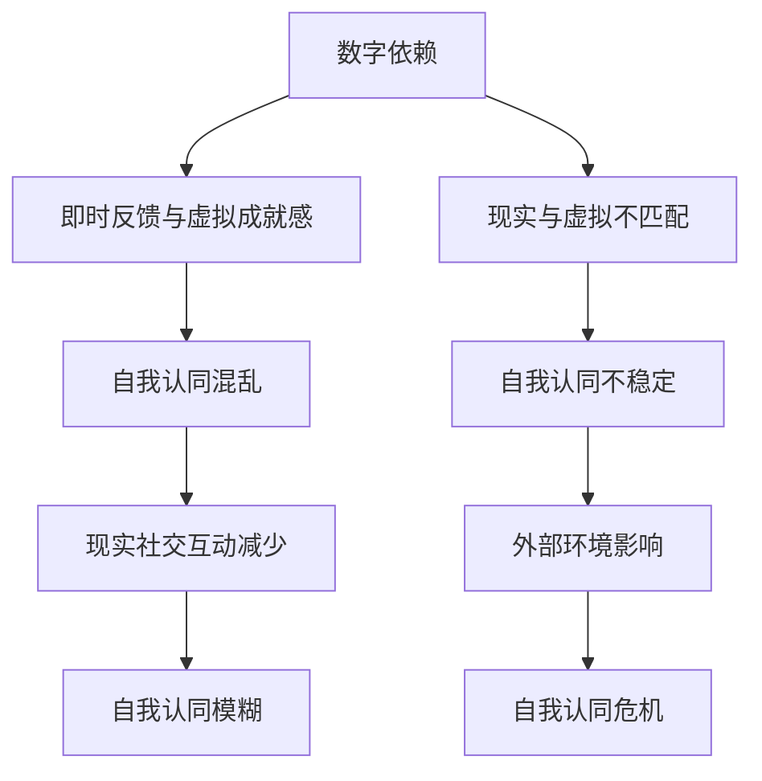

                 

### 核心关键词

- 数字流浪者
- 自我认同
- 网络时代
- 数字身份
- 心理健康

### 摘要

《数字流浪者指南：网络时代的自我认同探索》旨在探讨网络时代个体如何寻找和建立自我认同的问题。本文首先介绍数字化时代的背景，阐述数字流浪者的概念及其面临的问题和挑战。随后，深入探讨自我认同的核心概念、理论和实践方法，并结合实际案例进行分析。文章还讨论了数字时代下自我认同的危机，提出了应对策略，并提供了具体实践案例和最佳实践经验。最后，文章总结了数字时代自我认同探索的重要性，并对未来研究方向进行了展望。

---

### 目录大纲设计步骤

**1. 确定书籍主题与结构**

《数字流浪者指南：网络时代的自我认同探索》的主题围绕网络时代中个体如何寻找和建立自我认同。为了清晰地组织内容，书籍结构如下：

- **背景与概念**：介绍数字流浪者的定义、网络时代背景及自我认同的基本概念。
- **自我认同探索与实践**：详细探讨自我认同的探索方法、实践案例以及数字时代下的自我认同危机。
- **数字时代挑战与应对**：分析数字依赖、数字隐私保护以及自我认同重构的方法和策略。
- **实践与反思**：通过实际案例研究，提供具体实践经验和最佳实践。

**2. 设计总体框架**

书籍总体框架包括以下部分：

- **引言**：简要介绍数字流浪者现象和自我认同的重要性。
- **第一部分：背景与概念**
  - **第1章 网络时代的自我认同：问题与挑战**
  - **第2章 核心概念与联系**
  - **第3章 自我认同理论概述**
- **第二部分：自我认同探索与实践**
  - **第4章 自我认同探索方法**
  - **第5章 自我认同实践案例**
- **第三部分：数字时代挑战与应对**
  - **第6章 数字时代下的自我认同危机**
  - **第7章 数字隐私与自我认同保护**
  - **第8章 数字时代下的自我认同重构**
- **第四部分：实践与反思**
  - **第9章 实践案例研究**
  - **第10章 最佳实践与反思**

**3. 细化章节内容**

每个章节进一步细化如下：

- **第1章 网络时代的自我认同：问题与挑战**
  - **1.1 数字化时代背景**
  - **1.2 自我认同的界定**
  - **1.3 数字时代的自我认同挑战**
- **第2章 核心概念与联系**
  - **2.1 数字身份与真实身份**
  - **2.2 虚拟社群与线下互动**
  - **2.3 Mermaid 图展示核心概念联系**
- **第3章 自我认同理论概述**
  - **3.1 社会建构主义**
  - **3.2 心理发展理论**
  - **3.3 Mermaid 图展示自我认同理论联系**

...（以下章节类似细化）

**4. 整合核心概念与联系**

在每个章节中，整合核心概念及其相互关系，通过Mermaid图表进行展示，使读者能够更直观地理解各概念之间的联系。

**5. 算法原理与数学模型讲解**

在相关章节中，详细讲解算法原理和数学模型，使用Mermaid绘制流程图，并配合Python源代码和LaTeX公式进行阐述。

**6. 系统分析与架构设计**

设计系统分析与架构设计部分，包括问题场景介绍、系统功能设计、架构图、接口设计和系统交互图，确保读者能够全面理解系统实现。

**7. 项目实战与最佳实践**

描述实际项目实战，包括环境安装、系统实现、代码解读、案例分析等，提供最佳实践经验。

**8. 总结与拓展**

为每个章节和书籍整体提供总结、注意事项、拓展阅读等内容，帮助读者深化理解和拓展知识。

---

### 目录大纲示例

```markdown
----------------------------------------------------------------
# 《数字流浪者指南：网络时代的自我认同探索》

## 第一部分：背景与概念

# 第1章 网络时代的自我认同：问题与挑战
## 1.1 数字化时代背景
### 1.1.1 数字化时代的来临
### 1.1.2 数字化的影响
## 1.2 自我认同的界定
### 1.2.1 自我认同的定义
### 1.2.2 自我认同的重要性
## 1.3 数字时代的自我认同挑战
### 1.3.1 数字依赖
### 1.3.2 数字隐私问题
### 1.3.3 虚拟身份与现实身份的冲突

## 第2章 核心概念与联系
### 2.1 数字身份与真实身份
### 2.2 虚拟社群与线下互动
### 2.3 Mermaid 图展示核心概念联系

## 第3章 自我认同理论概述
### 3.1 社会建构主义
### 3.2 心理发展理论
### 3.3 Mermaid 图展示自我认同理论联系

----------------------------------------------------------------

## 第二部分：自我认同探索与实践

# 第4章 自我认同探索方法
## 4.1 自我探索的重要性
### 4.1.1 自我探索的意义
### 4.1.2 自我探索的方法
## 4.2 自我探索的具体方法
### 4.2.1 内省法
### 4.2.2 日记记录
### 4.2.3 自我反思
## 4.3 自我探索案例
### 4.3.1 案例一：社交网络中的自我探索
### 4.3.2 案例二：艺术中的自我表达

----------------------------------------------------------------

## 第三部分：数字时代挑战与应对

# 第5章 数字依赖与自我认同危机
## 5.1 数字依赖现象
### 5.1.1 数字依赖的定义
### 5.1.2 数字依赖的影响
## 5.2 自我认同危机
### 5.2.1 自我认同危机的定义
### 5.2.2 数字依赖与自我认同危机的关系

# 第6章 数字隐私与自我认同保护
## 6.1 数字隐私的重要性
### 6.1.1 数字隐私的定义
### 6.1.2 数字隐私的价值
## 6.2 自我认同保护策略
### 6.2.1 保护隐私的方法
### 6.2.2 建立安全意识的策略

# 第7章 数字时代下的自我认同重构
## 7.1 重构自我认同的必要性
### 7.1.1 数字时代下自我认同重构的原因
### 7.1.2 重构自我认同的目标
## 7.2 重构自我认同的路径
### 7.2.1 识别自我认同问题
### 7.2.2 制定重构计划
### 7.2.3 实施重构计划

----------------------------------------------------------------

## 第四部分：实践与反思

# 第8章 实践案例研究
## 8.1 企业员工数字时代的自我认同探索
### 8.1.1 案例背景
### 8.1.2 实践策略
### 8.1.3 案例效果
## 8.2 青少年在数字时代的自我认同困境与解决
### 8.2.1 案例背景
### 8.2.2 实践策略
### 8.2.3 案例效果

# 第9章 最佳实践与反思
## 9.1 最佳实践总结
### 9.1.1 实践经验的归纳
### 9.1.2 最佳实践的推广
## 9.2 反思与展望
### 9.2.1 数字时代自我认同的挑战
### 9.2.2 未来研究方向

----------------------------------------------------------------
```

### 引言

#### 数字流浪者现象

在互联网时代，数字流浪者（Digital Nomads）这一群体逐渐引起了人们的关注。数字流浪者是指那些利用现代通信技术和互联网，在全球范围内自由移动的人群。他们可能是因为工作需要，也可能是为了追求更加灵活的生活方式，放弃了传统的办公室工作，选择在咖啡馆、图书馆或家中办公。数字流浪者群体涵盖了自由职业者、远程工作者、创业者和数字游民等多种角色。

数字流浪者的出现并非偶然，而是互联网和移动通信技术迅猛发展的产物。随着Wi-Fi和4G、5G网络的普及，越来越多的工作任务可以通过远程协作完成。这使得人们不再受制于地理位置，能够自由地选择工作地点。同时，虚拟办公工具和协作平台的兴起，为数字流浪者提供了强大的支持，使他们能够高效地进行团队沟通和项目协作。

然而，数字流浪者的生活并非一帆风顺。在享受自由和灵活性的同时，他们也面临着一系列挑战，特别是在自我认同方面。由于长期处于流动状态，数字流浪者往往需要在不同的文化和环境中适应，这可能导致身份认同的模糊和不确定。此外，数字依赖、数字隐私问题以及数字时代的心理健康挑战，也成为数字流浪者需要面对的重要议题。

#### 自我认同的重要性

自我认同是指个体对自己身份和角色的认知与理解，是心理健康和社会适应的基础。在传统社会中，人们通常通过家庭、工作、宗教和社会角色来建立自我认同。然而，在数字时代，这些传统的认同方式受到了挑战。数字流浪者的生活特点使得他们需要在不断变化的环境中重新定义自我，这无疑增加了自我认同的复杂性和难度。

自我认同的重要性不仅体现在个体心理健康层面，还对社交关系、职业发展和社会参与产生深远影响。一个清晰的自我认同有助于个体建立稳固的社交网络，提高工作效率和职业成就感，同时也有利于社会多样性和包容性的实现。因此，探讨数字流浪者在网络时代如何建立和维持自我认同，具有重要的理论和实践意义。

本文将围绕数字流浪者这一特殊群体，探讨网络时代自我认同的挑战和应对策略。首先，我们将介绍数字化时代的背景，阐述数字流浪者的定义和特点。接着，深入探讨自我认同的核心概念、理论和实践方法，并结合实际案例进行分析。随后，我们将讨论数字时代下的自我认同危机，包括数字依赖、数字隐私问题以及心理健康挑战。最后，通过实践案例研究和最佳实践经验，总结数字时代自我认同探索的路径和方法。

### 第1章 网络时代的自我认同：问题与挑战

#### 1.1 数字化时代背景

随着互联网技术的飞速发展，我们正处于一个前所未有的数字化时代。数字化不仅改变了信息的传播方式，还深刻影响了人类社会的生活和工作模式。数字化时代的特征主要包括以下几个方面：

1. **互联网的普及**：互联网的普及使得全球信息互联互通，任何人都可以在瞬间获取和分享信息。这种信息透明度极大地促进了知识的传播和共享，也为人们提供了更多选择和机会。
   
2. **移动通信技术的发展**：4G、5G网络的普及以及移动设备的广泛应用，使得人们可以随时随地保持在线。移动通信技术为数字流浪者提供了必要的工具，使他们能够灵活地选择工作地点。

3. **虚拟办公和远程协作**：虚拟办公和远程协作平台的出现，打破了传统的办公模式。许多工作可以通过云端进行，团队成员可以跨越地域限制，实现高效协作。

4. **大数据和人工智能**：大数据和人工智能技术的应用，使得企业能够更好地理解和满足客户需求，提高生产效率。然而，这也带来了数据隐私和安全的问题。

数字化时代的背景为数字流浪者提供了便利，但同时也带来了一系列挑战。首先，数字依赖问题日益严重。人们在互联网上的活动越来越频繁，对数字设备的依赖程度也越来越高。这种依赖不仅影响了心理健康，还可能导致现实生活中的社交互动减少。

其次，数字隐私问题日益突出。在数字化时代，个人隐私容易受到侵犯。大量个人数据的泄露和滥用，使得人们对自己的隐私保护面临巨大挑战。数字流浪者由于经常在不同的国家和地区活动，更容易成为隐私泄露的目标。

此外，心理健康问题也日益受到关注。长时间使用数字设备，容易导致视觉疲劳、焦虑和抑郁等心理问题。数字流浪者由于生活方式的特殊性，可能更容易出现心理健康问题，而这些问题又可能影响他们的自我认同。

#### 1.2 自我认同的界定

自我认同是指个体对自己身份和角色的认知与理解。它涉及多个层面，包括个人身份、社会角色、价值观和信念等。自我认同不仅是个体心理健康的重要组成部分，还影响社交关系、职业发展和社会参与。

在传统社会中，自我认同通常通过家庭、工作、宗教和社会角色来建立。例如，一个人可能通过在家庭中扮演父母或子女的角色，在工作中扮演员工或老板的角色，来建立自我认同。然而，在数字化时代，这些传统的认同方式受到了挑战。

对于数字流浪者而言，自我认同的建立更加复杂和不确定。首先，数字流浪者处于不断变化的环境中，需要不断适应新的文化和生活方式。这种流动性可能导致他们的自我认同模糊和不确定。

其次，数字流浪者的身份和角色可能同时存在于多个领域，这使得他们需要在不同的认同方式之间切换。例如，一个人可能在专业领域中扮演专家角色，在社交网络中扮演社交达人角色，在家庭中扮演家庭成员角色。这种多角色切换可能导致自我认同的混乱和冲突。

此外，数字化时代的社交媒体和虚拟社区也为数字流浪者提供了新的认同途径。数字流浪者可以在虚拟社区中找到归属感，建立新的社交关系。然而，这种虚拟的认同也可能导致现实生活中的社交互动减少，进一步加剧自我认同的危机。

#### 1.3 数字时代的自我认同挑战

数字时代为数字流浪者带来了诸多自我认同挑战，这些挑战包括以下几个方面：

1. **数字依赖**：数字依赖问题在数字流浪者中尤为突出。由于工作方式灵活，数字流浪者经常长时间使用互联网和数字设备。这种依赖可能导致心理健康问题，如焦虑、抑郁和视觉疲劳。

2. **数字隐私问题**：数字流浪者由于经常在不同的国家和地区活动，更容易成为隐私泄露的目标。个人信息和数据的安全问题，成为数字流浪者需要面对的重要挑战。

3. **心理健康挑战**：长时间使用数字设备，容易导致心理健康问题。数字流浪者可能由于生活环境的流动性，更容易出现焦虑、抑郁等心理问题。

4. **身份认同模糊**：数字流浪者由于经常在不同的文化和环境中生活，可能面临身份认同模糊的问题。这种模糊可能导致自我认同危机，影响心理健康和社交关系。

5. **多角色切换困难**：数字流浪者需要在不同的领域和角色之间切换，这可能导致自我认同混乱。在数字化时代，如何协调和整合这些不同的角色，是一个亟待解决的问题。

综上所述，数字流浪者在网络时代面临着诸多自我认同挑战。理解这些挑战，并寻找有效的应对策略，对于数字流浪者的心理健康和社会适应具有重要意义。接下来，我们将进一步探讨自我认同的核心概念和理论，为应对这些挑战提供理论基础。

### 1.4 核心概念与联系

在探讨数字流浪者在网络时代下的自我认同问题时，我们需要了解几个核心概念，并探讨这些概念之间的联系。以下是几个关键概念的定义、属性特征对比以及它们之间的相互关系。

#### 1.4.1 数字身份与真实身份

**定义**：数字身份是指个体在网络世界中创建和维护的虚拟身份，包括社交媒体账号、在线论坛昵称等。而真实身份则是在现实生活中使用的身份，通常与法律证件、家庭和社会关系相关。

**属性特征对比**：

- **虚拟性**：数字身份是虚拟的，可以随意更改，而真实身份是固定的，无法更改。
- **匿名性**：在数字环境中，用户可以保持匿名，真实身份难以追踪，而真实身份在现实生活中无法隐藏。
- **安全性**：数字身份容易受到黑客攻击和数据泄露，而真实身份的保护则依赖于法律和社会规范。

**联系**：数字身份与真实身份紧密相关，两者在一定程度上相互影响。数字身份的建立和维护，可能依赖于真实身份的信息，但同时也增加了个人信息泄露的风险。数字身份的真实性，往往需要通过验证和认证来确保，这又与真实身份相关。

#### 1.4.2 虚拟社群与线下互动

**定义**：虚拟社群是指通过互联网和社交媒体平台建立的社会网络，成员之间主要通过数字通信互动。而线下互动则是指现实生活中的人际交往，包括面对面交流、团体活动和社交聚会。

**属性特征对比**：

- **即时性**：虚拟社群的互动可以即时发生，而线下互动则受到时间和地点的限制。
- **广泛性**：虚拟社群不受地域限制，可以连接全球的成员，而线下互动则受限于物理距离。
- **隐私性**：虚拟社群的互动相对私密，可以保护参与者的隐私，线下互动则更容易被他人观察。

**联系**：虚拟社群和线下互动是相辅相成的。虚拟社群为数字流浪者提供了一个方便的交流平台，可以缓解他们因流动性而导致的社交孤立。而线下互动则有助于建立更真实的社交关系，增强自我认同。两者之间的平衡，对于数字流浪者的心理健康和社会适应至关重要。

#### 1.4.3 数字依赖与自我认同危机

**定义**：数字依赖是指个体对数字设备和互联网的过度依赖，影响日常生活和心理健康。自我认同危机则是指个体对自身身份和角色的认知出现混乱，导致心理困扰和社交问题。

**属性特征对比**：

- **依赖性**：数字依赖是一种消极依赖，可能导致心理和生理问题，而自我认同危机则是一种心理状态，影响个体的自我认知和社会适应。
- **持续性**：数字依赖是一种长期现象，可能逐步加重，而自我认同危机可能在特定事件或情境下突然出现。
- **影响范围**：数字依赖主要影响个体的日常生活和工作，而自我认同危机则影响个体的心理状态和社交关系。

**联系**：数字依赖和自我认同危机之间存在紧密联系。长期数字依赖可能导致个体的自我认同出现危机，因为过度依赖虚拟世界，可能使个体失去对现实世界的认同。反之，自我认同危机也可能加剧数字依赖，个体可能在虚拟世界中寻求逃避和安慰。

#### 1.4.4 自我认同与心理健康

**定义**：自我认同是指个体对自己身份和角色的认知，心理健康则是指个体在心理上的健康状态。

**属性特征对比**：

- **内在性**：自我认同是内在的心理过程，涉及个体对自己的认知和评价，而心理健康是外在表现，反映个体在情绪和行为上的健康状态。
- **稳定性**：自我认同是一个相对稳定的心理结构，而心理健康状态可能随时间波动。
- **影响因素**：自我认同受多种因素影响，包括个人经历、社会环境和心理需求，而心理健康的影响因素更多样化。

**联系**：自我认同和心理健康密切相关。一个清晰的自我认同有助于维护心理健康，反之，心理健康问题可能导致自我认同危机。对于数字流浪者而言，维护良好的心理健康，对于建立稳定的自我认同至关重要。

#### Mermaid 图展示核心概念联系

为了更直观地展示这些核心概念之间的联系，我们可以使用Mermaid语言绘制一个ER图（实体关系图）。

```mermaid
erDiagram
  数字身份 ||--|{ 真实身份 }|
  虚拟社群 ||--|{ 线下互动 }|
  数字依赖 ||--|{ 自我认同危机 }|
  自我认同 ||--|{ 心理健康 }|
```

在这个ER图中，数字身份与真实身份之间存在双向关联，表明两者相互影响。虚拟社群与线下互动也相互联系，说明虚拟互动和现实互动之间存在互补关系。数字依赖与自我认同危机之间存在直接关联，表明数字依赖可能导致自我认同危机。自我认同与心理健康之间也存在紧密联系，表明心理健康是自我认同的重要组成部分。

通过这个ER图，我们可以更好地理解数字流浪者在网络时代下自我认同的复杂性和多维度性，为进一步探讨应对策略提供理论基础。

### 1.5 自我认同理论概述

在探讨数字流浪者在网络时代下如何建立和维持自我认同时，我们需要深入了解相关理论。以下是几种主要的自我认同理论，包括社会建构主义、心理发展理论等，并探讨这些理论在自我认同研究中的重要性。

#### 1.5.1 社会建构主义

社会建构主义（Social Constructionism）是一种强调社会文化因素在个体认知和自我认同形成中作用的理论。社会建构主义认为，个体的自我认同是通过社会互动和符号系统构建的。具体来说，个体通过与他人交流、参与社会活动和文化实践，逐渐形成对自我身份的理解和认知。

在社会建构主义理论框架下，数字流浪者的自我认同可以看作是在不断变化的社会和文化环境中建构和重构的结果。数字流浪者在不同的文化和环境中生活和工作，需要不断调整自己的身份认知，以适应新的社会环境。例如，当数字流浪者从一个国家迁移到另一个国家时，他们需要重新构建自己的社会角色和身份，以适应新的文化和社会规范。

社会建构主义对于理解数字流浪者的自我认同具有重要意义。首先，它强调了社会互动在自我认同形成中的核心作用，指出个体通过与他人互动，不断反思和调整自己的身份认知。其次，社会建构主义还强调了文化因素在自我认同建构中的重要性，认为个体的自我认同不仅受到个人经历的影响，还受到社会文化背景的塑造。

#### 1.5.2 心理发展理论

心理发展理论（Psychological Development Theory）是另一个重要的自我认同理论，它关注个体在成长过程中的自我认同发展。心理发展理论认为，个体的自我认同是一个逐步发展的过程，受到多种因素的影响，包括遗传、环境、教育等。

在埃里克森（Erik Erikson）的心理社会发展阶段理论中，自我认同的发展被划分为几个关键阶段。每个阶段都涉及特定的心理冲突和任务，这些冲突和任务影响着个体的自我认同形成。例如，青少年时期的重要任务之一是建立自我认同和职业角色，这反映了自我认同在个体成长中的重要性。

对于数字流浪者而言，心理发展理论提供了理解自我认同发展的动态视角。数字流浪者在不同的生命阶段可能面临不同的自我认同挑战。例如，年轻时的数字流浪者可能需要在流动中找到稳定性和自我认同，而成熟期的数字流浪者则需要处理长期流动带来的身份认同问题。心理发展理论指出，个体需要通过不断的反思和调整，逐步建立和巩固自我认同。

#### 其他自我认同理论

除了社会建构主义和心理发展理论，还有其他一些重要的自我认同理论，如自我概念理论（Self-concept Theory）、社会认同理论（Social Identity Theory）等。

- **自我概念理论**：自我概念理论认为，个体的自我认同是由自我概念构成的，自我概念包括自我评价、自我形象和自我期望。个体的自我认同通过自我概念的形成和调整来实现。对于数字流浪者而言，自我概念理论强调了个体自我评价和自我形象在自我认同构建中的重要作用。

- **社会认同理论**：社会认同理论指出，个体的自我认同是在社会群体的认同中形成的。个体通过认同群体成员的身份和价值观，来建立和巩固自我认同。对于数字流浪者而言，社会认同理论强调了他们在不同群体中的归属感和认同感，这对于自我认同的建立和维持具有重要意义。

#### 总结

自我认同是一个复杂的多维度概念，涉及个体、社会和文化等多个层面。社会建构主义和心理发展理论为我们理解数字流浪者在网络时代下如何建立和维持自我认同提供了理论基础。社会建构主义强调了社会互动和文化因素在自我认同形成中的重要性，而心理发展理论则关注个体在成长过程中的自我认同发展。

通过这些理论，我们可以更好地理解数字流浪者在网络时代下的自我认同挑战，并探索有效的应对策略。在接下来的章节中，我们将进一步探讨自我认同的探索方法、实践案例以及数字时代下自我认同的危机和应对策略。

### 1.6 本章小结

本章围绕网络时代的自我认同问题，首先介绍了数字化时代的背景，阐述了数字流浪者的定义和特点。接着，我们探讨了自我认同的核心概念，包括数字身份与真实身份、虚拟社群与线下互动、数字依赖与自我认同危机等。通过Mermaid图展示了核心概念之间的联系，使读者对数字时代自我认同的复杂性有了更直观的理解。

此外，本章还概述了几种主要的自我认同理论，如社会建构主义和心理发展理论，为理解数字流浪者的自我认同提供了理论基础。这些理论强调了社会互动、文化因素和个体成长在自我认同形成中的关键作用。

总之，本章为后续章节的自我认同探索和实践提供了重要的理论框架和背景知识。在接下来的章节中，我们将进一步探讨自我认同的具体探索方法、实践案例以及数字时代下自我认同的挑战和应对策略。

### 2.1 自我探索的重要性

自我探索是一个关键过程，它不仅关乎个体的心理健康，还直接影响个体的自我认同和社会适应。在数字时代，自我探索的重要性尤为突出。数字流浪者的生活方式使得他们处于不断变化的环境中，这使得自我探索成为维持心理健康和社会适应的必要手段。

首先，自我探索有助于个体理解和接受自己。通过自我反思和探索，个体可以深入挖掘自己的内在需求和价值观，从而更好地理解自己的行为和情绪。这种自我理解有助于减少内心的矛盾和冲突，提高心理平衡。对于数字流浪者来说，这种自我理解尤为重要，因为他们在不同文化和环境中生活，需要不断调整自己的行为和价值观，以适应新的环境。

其次，自我探索有助于建立清晰的自我认同。自我认同是个体对自己身份和角色的认知，它不仅影响个体的心理健康，还影响社交关系和职业发展。在数字时代，个体的身份和角色可能同时存在于多个领域，这增加了自我认同的复杂性和难度。通过自我探索，数字流浪者可以明确自己的核心价值观和目标，从而在多元身份中找到平衡，建立清晰的自我认同。

此外，自我探索还可以提高个体的自我效能感。自我效能感是指个体对自己完成任务的能力的信心。通过自我探索，个体可以了解自己的优点和潜力，从而增强自信心，提高面对挑战时的勇气和决心。这对于数字流浪者尤为重要，因为他们经常需要在陌生的环境中迅速适应和应对各种挑战。

最后，自我探索有助于个体建立健康的社交关系。健康的社交关系不仅有助于满足个体的社交需求，还可以提供情感支持和实际帮助。通过自我探索，个体可以更好地了解自己的需求和期望，从而在建立社交关系时更加明确和有效。对于数字流浪者而言，建立和维护健康的社交关系尤为重要，因为他们经常处于流动状态，社交网络的不稳定可能导致孤独感和社交孤立。

综上所述，自我探索对于数字流浪者在数字时代建立和维护自我认同具有重要意义。通过自我探索，数字流浪者可以更好地理解自己、建立清晰的自我认同、提高自我效能感和建立健康的社交关系。因此，自我探索不仅是一个个人成长的过程，也是一个提高心理健康和社会适应能力的重要手段。

### 2.2 自我探索的具体方法

自我探索是一个复杂而持续的过程，它需要个体在不同的情境中不断反思和调整。以下是一些具体的自我探索方法，这些方法可以帮助数字流浪者更深入地了解自己，从而建立清晰的自我认同。

#### 2.2.1 内省法

内省法是一种传统的自我探索方法，它要求个体花时间反思自己的内心世界和情感状态。通过内省，个体可以挖掘自己的内心需求和价值观，从而更好地理解自己的行为和情绪。以下是一些实践内省法的步骤：

1. **设定时间**：每天或每周设定一个固定的时间进行内省，确保自己有足够的专注和思考时间。
2. **静心冥想**：在开始内省之前，可以通过冥想或深呼吸来放松身心，进入一个平静的状态。
3. **反思**：在安静的环境中，写下自己的思考，记录自己的感受、想法和经历。这些记录可以帮助个体更清晰地看到自己的内心世界。
4. **提问**：在内省过程中，可以提问自己一些关键问题，如“我真正的需求是什么？”“我的价值观是什么？”“我在不同情境下的行为反映了什么？”等。
5. **总结**：内省结束后，对所记录的内容进行总结，找出关键点和规律，以便更好地理解自己。

#### 2.2.2 日记记录

日记记录是一种简单而有效的自我探索方法。通过记录日常生活中的经历、感受和思考，个体可以追踪自己的情绪变化和心理状态，从而更好地了解自己。以下是一些日记记录的技巧：

1. **每日记录**：每天花一些时间写下当天的经历、所思所感，以及遇到的问题和挑战。
2. **情感分析**：在日记中记录自己的情绪，分析情绪的来源和影响。例如，如果某一天感到特别焦虑，可以探究焦虑的原因，是否与工作压力或人际关系有关。
3. **目标设定**：在日记中设定短期和长期目标，记录实现目标的进展和遇到的困难。这有助于个体跟踪自己的成长过程。
4. **反思与改进**：定期回顾日记，反思自己的行为和决策，找出可以改进的地方。这有助于个体不断调整和优化自己的行为模式。

#### 2.2.3 自我反思

自我反思是一种通过回顾和分析自己的行为和经历，来提高自我认知的方法。以下是一些自我反思的步骤：

1. **回顾经历**：花时间回顾过去的经历，特别是那些对自己有重要影响的事件。
2. **思考影响**：分析这些经历对自己价值观、信念和行为的影响。思考这些经历如何塑造了现在的自己。
3. **识别优点和缺点**：在回顾过程中，识别自己的优点和缺点，包括行为、思维模式和情感反应。这有助于个体更全面地了解自己。
4. **制定改进计划**：根据反思的结果，制定具体的改进计划，例如改变不良习惯、学习新技能等。这有助于个体不断成长和进步。

#### 2.2.4 心理咨询

心理咨询是一种专业的自我探索方法，通过专业的心理咨询师，个体可以深入探讨自己的内心世界，解决心理问题。以下是一些心理咨询的步骤：

1. **寻找合适的咨询师**：选择一个有资质、经验丰富的心理咨询师，确保咨询过程的安全和有效性。
2. **开放沟通**：在咨询过程中，坦诚地表达自己的想法和感受，与咨询师建立信任关系。
3. **问题探讨**：与咨询师一起探讨自己的心理问题，包括焦虑、抑郁、人际关系问题等，寻求解决方案。
4. **持续跟进**：心理咨询是一个长期的过程，需要定期跟进和反思，以确保问题的解决和自我认知的提升。

#### 2.2.5 艺术表达

艺术表达是一种通过绘画、写作、音乐等艺术形式来探索自我的方法。以下是一些艺术表达的方法：

1. **绘画**：通过绘画来表达自己的情感和想法。不必担心绘画技巧，只需跟随自己的内心感受进行创作。
2. **写作**：通过写作记录自己的内心世界和情感变化。可以写日记、故事或诗歌，形式不限。
3. **音乐**：通过演奏乐器或唱歌来表达情感。音乐可以帮助个体放松身心，深入挖掘内心的感受。
4. **创造性写作**：参与创意写作工作坊或课程，与他人分享自己的作品，接受反馈和建议。

总之，自我探索是一个多维度的过程，需要个体在不同方法和情境中不断尝试和反思。通过内省法、日记记录、自我反思、心理咨询和艺术表达等方法，数字流浪者可以更深入地了解自己，从而建立清晰的自我认同。这些方法不仅有助于个体的心理健康，还可以提高他们在数字时代中的适应能力和生活质量。

### 2.3 自我探索案例

#### 案例一：通过社交网络寻找自我认同

小明是一名年轻的数字流浪者，他常常在不同的城市和国家之间迁徙。由于工作需要，小明经常独自一人，这让他在寻找自我认同方面遇到了挑战。

小明最初通过加入各种社交网络平台来寻找自我认同。他加入了多个兴趣小组和社群，如旅行爱好者、编程爱好者、心理学爱好者等。在这些平台上，他与其他有着相似兴趣的人交流，分享自己的经历和感受。

通过社交网络的互动，小明逐渐找到了自己的兴趣和热情。他发现自己在旅行中拍摄的照片和视频非常受欢迎，这激发了他对摄影的兴趣。同时，他在编程社群中展示了自己的编程技能，并与其他程序员交流技术经验。这些经历让小明更加明确了自己的身份和角色。

此外，小明还通过社交媒体平台建立了一个个人博客，分享自己的旅行故事、摄影作品和编程经验。他的博客逐渐积累了一定的读者群体，这让他感到自己在这些领域有了成就感和归属感。

通过社交网络，小明不仅找到了自我认同，还建立了一个支持自己的社交网络。这些社交网络为他提供了情感支持和实际帮助，使他能够更好地应对生活中的挑战。

#### 案例二：通过艺术表达探索自我

小玲是一名数字流浪者，她擅长绘画和写作。在长时间的流浪生活中，她经常感到孤独和无助，这让她开始思考如何通过艺术表达来探索自我。

小玲开始在她的博客上发布自己的绘画作品和文字故事。她记录自己的旅行经历、情感变化和对生活的思考。这些作品不仅帮助她表达自己的情感，还吸引了一些志同道合的人关注她。

在一次艺术展览中，小玲遇到了一位同样热爱艺术的朋友。他们开始合作创作，互相分享创作心得和灵感。这种合作不仅丰富了他们的艺术作品，还帮助他们更好地理解自己和他人。

通过艺术表达，小玲逐渐找到了自己的价值和使命。她开始意识到，通过艺术，她不仅能够表达自己的情感，还能影响和启发他人。这种自我认同不仅提高了她的自信心，也让她在流浪生活中找到了更多的乐趣和意义。

这两个案例展示了数字流浪者如何通过社交网络和艺术表达来探索自我。这些方法不仅帮助他们在复杂多变的数字时代中找到自我认同，还提高了他们的心理健康和生活质量。

### 2.4 本章小结

本章详细探讨了自我探索的方法，包括内省法、日记记录、自我反思、心理咨询和艺术表达等。通过这些方法，数字流浪者可以更深入地了解自己的内心世界，建立清晰的自我认同。案例分析展示了这些方法在实际应用中的效果，为数字流浪者提供了可行的自我探索路径。

自我探索不仅是个人成长的必要步骤，也是数字时代下维持心理健康和社会适应的关键。通过自我探索，数字流浪者可以更好地应对生活中的挑战，找到自己的价值和意义。在接下来的章节中，我们将进一步探讨数字时代下自我认同的危机和应对策略。

### 3.1 数字依赖现象

数字依赖（Digital Dependence）是指个体对数字设备和互联网的过度依赖，这种依赖可能导致一系列心理和生理问题。数字依赖现象在数字流浪者中尤为普遍，由于他们的工作方式和生活习惯，使得他们频繁使用数字设备，从而容易陷入数字依赖的困境。

首先，数字依赖的典型症状包括：长时间沉迷于社交媒体、在线游戏、视频观看等数字活动，导致日常生活和工作受到影响。例如，有些数字流浪者可能会花费大量时间在社交媒体上，而忽视了自己的工作和家庭生活。这种沉迷不仅影响工作效率，还可能导致家庭关系的紧张。

其次，数字依赖对心理健康产生负面影响。长时间使用数字设备，可能导致焦虑、抑郁和失眠等心理问题。数字依赖者可能会感到内心空虚和孤独，因为他们的主要社交活动是在虚拟世界中进行的，而忽视了现实生活中的人际交往。这种心理问题如果得不到及时解决，可能会进一步加剧，导致严重的心理健康问题。

此外，数字依赖还可能导致生理问题。长时间盯着屏幕，容易导致眼睛疲劳、头痛和颈椎病等。长期使用电子设备，还会影响睡眠质量，因为屏幕发出的蓝光会抑制褪黑激素的分泌，使人难以入睡。这些生理问题不仅影响个体的生活质量，还可能影响他们的工作和学习效率。

数字依赖现象的形成有多种原因。首先，互联网和数字设备的普及使得人们更容易接触到各种数字活动，从而增加了依赖的风险。其次，数字依赖往往与个体逃避现实问题和压力有关。数字世界提供了一个逃避现实困境的虚拟空间，个体在虚拟世界中可以获得短暂的满足和成就感，从而沉迷其中。

对于数字流浪者而言，数字依赖问题更加复杂。由于他们经常在不同国家和地区之间迁徙，生活环境的不稳定使得他们更容易依赖数字设备来维持日常工作和生活。例如，他们可能需要使用在线协作工具来与团队成员沟通，使用数字地图来导航，甚至使用社交媒体来寻找新的住宿和工作机会。这种依赖在一定程度上是必要的，但如果过度依赖，就会导致一系列问题。

总之，数字依赖现象在数字流浪者中普遍存在，并对他们的心理健康和生理健康产生负面影响。理解数字依赖的形成原因和影响，有助于数字流浪者采取有效的应对策略，减轻数字依赖的负面影响，提高生活质量。

### 3.2 自我认同危机

在数字依赖的背景下，数字流浪者面临着严重的自我认同危机。自我认同危机（Identity Crisis）是指个体对自己的身份和角色缺乏清晰认知，导致心理困扰和社交问题。数字依赖现象加剧了这一危机，使得数字流浪者在数字时代中难以维持稳定的自我认同。

首先，数字依赖导致的自我认同危机源于虚拟身份与现实身份的冲突。数字流浪者在网络世界中建立了复杂的虚拟身份，这些虚拟身份可能包括社交媒体账号、游戏角色、在线论坛昵称等。这些虚拟身份提供了个体在数字世界中的存在感和认同感。然而，当数字流浪者回到现实生活时，他们可能会发现自己的虚拟身份与现实身份之间存在巨大的差距。这种差距可能导致自我认同混乱，个体难以确定自己在现实生活中的角色和定位。

其次，数字依赖使得数字流浪者容易陷入自我认同的模糊状态。由于长时间沉浸在数字世界中，他们可能忽视了对现实生活的关注和参与。这导致他们在现实生活中的社交互动减少，从而难以建立稳固的社交关系。缺乏现实生活中的社交互动，使得数字流浪者的自我认同更加模糊和不确定，因为他们无法通过现实中的互动来验证和确认自己的身份和角色。

此外，数字依赖还可能导致数字流浪者的自我认同受到外部环境的影响。在数字世界中，个体可以轻易地改变自己的虚拟身份，从而在不同角色之间切换。然而，这种角色切换可能导致自我认同的不稳定和混乱。数字流浪者在面对不同的社交场合时，可能需要频繁地调整自己的虚拟身份，以适应新的环境和角色。这种不断的调整和变化，使得他们的自我认同难以稳定，导致心理上的困扰和焦虑。

最后，数字依赖还可能引发自我认同的危机感。数字流浪者在数字世界中获得的成功和成就感，可能在现实中难以实现。这种现实与虚拟之间的不匹配，可能导致他们对自己的能力和价值产生怀疑，进而引发自我认同危机。他们可能会感到自己在现实生活中失去了意义和目标，从而陷入心理上的困境。

总之，数字依赖现象在数字流浪者中引发了严重的自我认同危机。这种危机源于虚拟身份与现实身份的冲突、自我认同的模糊状态、外部环境的影响以及现实与虚拟之间的不匹配。理解这些危机原因，有助于数字流浪者采取有效的应对策略，建立和维持清晰的自我认同。

### 3.3 数字依赖与自我认同危机的关系

数字依赖与自我认同危机之间存在密切的关系。数字依赖不仅加剧了自我认同的混乱，还可能导致一系列心理和社交问题。理解这两者之间的关系，有助于我们更好地应对数字依赖带来的负面影响。

首先，数字依赖通过满足即时反馈和虚拟成就感，对个体的自我认同产生了负面影响。在数字世界中，个体可以迅速获得点赞、评论和关注等反馈，这些虚拟的成就感往往能够迅速满足个体的心理需求。然而，这种即时反馈是短暂的，无法持久地提升个体的自我价值感。相反，当这种依赖成为习惯，个体在现实世界中难以获得类似的反馈时，可能会感到失落和自我怀疑，从而引发自我认同危机。

其次，数字依赖导致个体在现实生活中的社交互动减少，进一步加剧了自我认同的模糊状态。数字依赖使得个体花费大量时间在虚拟社交网络上，而忽视了现实生活中的人际交往。这种社交互动的减少，使得个体难以通过现实中的互动来验证和确认自己的身份和角色。缺乏现实生活中的社交反馈和确认，个体容易对自己的身份和角色产生怀疑，从而导致自我认同危机。

此外，数字依赖还可能引发现实与虚拟之间的不匹配问题，导致自我认同的不稳定。在虚拟世界中，个体可以轻松地扮演不同的角色，这种角色切换虽然增加了生活的多样性，但也可能导致个体的自我认同变得不稳定。当个体回到现实生活时，他们可能会发现自己的虚拟身份与现实身份之间存在巨大的差距，这种不匹配使得自我认同难以稳定，从而引发心理困扰。

最后，数字依赖可能导致个体的自我认同受到外部环境的影响。在数字世界中，个体的行为和表现往往受到平台算法和社交压力的影响。这种外部环境的影响，使得个体的自我认同容易被外界因素改变，从而陷入自我认同危机。

为了更好地理解这两者之间的关系，我们可以通过以下Mermaid流程图来展示数字依赖与自我认同危机的关联：



在这个流程图中，我们可以看到数字依赖通过多种途径导致自我认同危机。首先，数字依赖通过满足即时反馈和虚拟成就感，使得个体的自我认同混乱。其次，数字依赖导致现实社交互动减少，使得个体的自我认同模糊。此外，现实与虚拟之间的不匹配和外部环境的影响，也加剧了自我认同的不稳定，最终导致自我认同危机。

通过这个流程图，我们可以更直观地理解数字依赖与自我认同危机之间的复杂关系。这为数字流浪者提供了重要的启示，帮助他们认识到数字依赖可能带来的负面影响，并采取有效的策略来应对自我认同危机。

### 3.4 本章小结

本章深入探讨了数字依赖现象及其对数字流浪者自我认同的影响。我们首先介绍了数字依赖的典型症状和生理、心理问题，随后讨论了数字依赖如何导致自我认同危机。通过分析虚拟身份与现实身份的冲突、现实社交互动减少以及外部环境影响，我们揭示了数字依赖与自我认同危机之间的密切关系。

理解数字依赖对自我认同的负面影响，有助于数字流浪者采取积极的应对策略。通过自我认知、减少数字依赖、增加现实社交互动以及建立健康的数字生活方式，数字流浪者可以更好地维护自我认同，提高心理健康和生活质量。在接下来的章节中，我们将进一步探讨数字隐私保护与自我认同保护的方法和策略。

### 3.5 数字隐私的重要性

在数字时代，数字隐私（Digital Privacy）的重要性不容忽视。数字隐私是指个人在数字环境中享有的隐私权，包括个人信息的保护、数据的安全和隐私权的维护。对于数字流浪者而言，数字隐私问题更加复杂和严峻，因为他们经常在不同的国家和地区活动，个人信息和数据更容易被泄露和滥用。

首先，数字隐私关乎个人的信息安全。在数字化时代，个人信息无处不在，包括姓名、地址、电话号码、电子邮件、社交媒体账号等。这些信息如果被不法分子获取，可能导致身份盗窃、诈骗等犯罪行为，给个人带来严重的经济损失和心理困扰。对于数字流浪者来说，由于他们频繁在不同地点活动，个人信息更容易被黑客和骗子利用，从而面临更高的安全风险。

其次，数字隐私关系到个人隐私权的维护。隐私权是个人基本权利之一，保障个人隐私权的实现是社会进步和人权保障的重要体现。在数字环境中，个人隐私的保护依赖于技术手段和法律制度的完善。然而，当前许多国家和地区在数字隐私保护方面的法律法规尚未健全，导致个人隐私权得不到有效保障。数字流浪者由于身处不同法律环境，更容易受到隐私侵犯。

此外，数字隐私问题还涉及数据安全和隐私泄露。在数字化时代，大量个人数据被存储在云端和服务器中，这些数据如果未得到妥善保护，可能被黑客窃取或泄露。例如，社交媒体平台、在线购物网站和金融机构等，都可能成为黑客攻击的目标。一旦个人信息被泄露，不仅可能导致财产损失，还可能影响个人的社会关系和信用。

对于数字流浪者而言，数字隐私的重要性还体现在他们的生活方式和工作模式上。由于他们经常使用公共Wi-Fi、在线支付和远程办公，这些行为增加了个人信息泄露的风险。此外，数字流浪者可能需要频繁更换居住地点，这也增加了他们个人信息被泄露的可能性。因此，保障数字隐私对于数字流浪者来说，不仅是维护个人权益的需要，也是保障生活质量和工作效率的必要条件。

总之，数字隐私在数字时代具有至关重要的地位。对于数字流浪者来说，保障数字隐私不仅是保护个人信息安全的需要，也是维护个人隐私权和提升生活质量的重要手段。在接下来的章节中，我们将进一步探讨数字隐私保护的具体策略和措施。

### 3.6 自我认同保护策略

在数字时代，数字流浪者需要采取一系列自我认同保护策略，以应对数字依赖和隐私问题带来的挑战。以下是一些有效的自我认同保护策略：

#### 3.6.1 增强数字素养

数字素养是指个体在数字环境中的知识、技能和态度。增强数字素养可以帮助数字流浪者更好地保护自己的数字隐私和自我认同。具体策略包括：

1. **学习网络安全知识**：了解基本的网络安全知识，如如何创建强密码、如何识别钓鱼邮件和恶意软件等。
2. **定期更新软件和设备**：确保操作系统、应用程序和设备的最新版本，以防止漏洞和攻击。
3. **使用安全工具**：使用加密工具、VPN（虚拟专用网络）和防病毒软件等，保护个人数据和隐私。

#### 3.6.2 管理数字依赖

数字依赖不仅影响心理健康，还可能削弱自我认同。为了减少数字依赖，数字流浪者可以采取以下策略：

1. **设定使用时间限制**：为每天使用数字设备设定时间限制，确保在工作和休息时间之间保持平衡。
2. **培养其他兴趣爱好**：通过培养阅读、绘画、运动等兴趣爱好，减少对数字设备的依赖。
3. **使用数字排毒**：定期进行数字排毒，即在一段时间内完全脱离数字设备，专注于现实生活中的活动。

#### 3.6.3 强化隐私保护

在数字时代，保护隐私是自我认同保护的关键。以下是一些有效的隐私保护措施：

1. **使用隐私设置**：在社交媒体和其他数字平台上，调整隐私设置，限制对个人信息的访问。
2. **避免分享敏感信息**：在数字平台上避免分享敏感信息，如银行账户、家庭住址和电话号码等。
3. **定期备份重要数据**：定期备份重要数据，以防止数据丢失或被篡改。

#### 3.6.4 建立健康的数字生活方式

建立健康的数字生活方式，可以帮助数字流浪者更好地管理数字依赖和隐私问题。以下是一些建议：

1. **合理安排时间**：合理安排工作和休息时间，确保有足够的休息和娱乐时间。
2. **保持身心平衡**：通过运动、冥想和社交活动，保持身心平衡，减轻数字依赖带来的压力。
3. **关注心理健康**：定期进行心理健康检查，寻求专业帮助，以应对数字依赖和心理健康问题。

#### 3.6.5 参与社会活动

参与社会活动，可以帮助数字流浪者建立稳定的社交网络，增强自我认同。以下是一些具体的建议：

1. **加入线上社群**：加入与自己兴趣相关的线上社群，与他人分享经验和观点。
2. **参与线下活动**：定期参加线下聚会、会议和讲座，扩大社交圈子。
3. **参与志愿者活动**：参与志愿者活动，为社会做出贡献，增强自我价值感。

总之，通过增强数字素养、管理数字依赖、强化隐私保护、建立健康的数字生活方式以及参与社会活动，数字流浪者可以更好地保护自我认同。这些策略不仅有助于提升数字流浪者的生活质量，还有助于他们在数字时代中实现自我认同的稳定和清晰。

### 3.7 数字时代下的自我认同重构

在数字时代，数字流浪者需要不断适应快速变化的环境，这要求他们进行自我认同的重构。自我认同重构是指个体在新的环境和文化背景下，重新评估和定义自己的身份和角色，以实现自我认同的稳定和清晰。

#### 3.7.1 重构自我认同的必要性

数字时代的特点，如全球化、数字化和信息过载，使得传统的自我认同模式面临挑战。对于数字流浪者而言，他们需要在不同国家和地区之间频繁流动，这要求他们具备更高的适应能力和灵活性。以下原因说明了重构自我认同的必要性：

1. **多元文化环境的挑战**：数字流浪者处于多元文化环境中，需要在不同文化价值观和行为规范之间进行平衡。这种多样性可能导致自我认同的模糊和不确定性。
   
2. **信息过载的影响**：数字时代的信息过载，使得数字流浪者难以筛选和处理大量信息。这可能导致他们对自己的角色和身份产生困惑，从而影响自我认同的稳定。

3. **职业和生活方式的灵活性**：数字流浪者的职业和生活方式具有高度灵活性，这使得他们需要不断调整自己的角色和身份，以适应不断变化的工作和生活环境。

#### 3.7.2 重构自我认同的路径

重构自我认同是一个复杂的过程，需要数字流浪者采取以下步骤：

1. **自我反思**：数字流浪者需要定期进行自我反思，深入思考自己的价值观、兴趣和目标。通过反思，他们可以更好地了解自己的内在需求和动机。

2. **识别问题**：在自我反思的过程中，数字流浪者需要识别出自我认同中的问题，如角色冲突、身份模糊等。这些问题是重构自我认同的关键点。

3. **设定目标**：根据自我反思的结果，数字流浪者可以设定具体的个人目标，包括职业发展、生活方式调整等。这些目标有助于他们在重构过程中保持方向和动力。

4. **制定计划**：为了实现自我认同的重构，数字流浪者需要制定详细的计划，包括具体的行动步骤、时间表和资源分配。计划有助于他们系统地推进重构过程。

5. **行动和调整**：在制定计划后，数字流浪者需要付诸行动，并随时调整计划以适应新的情况。通过不断调整和改进，他们可以逐步实现自我认同的重构。

6. **寻求支持**：在重构自我认同的过程中，数字流浪者可以寻求家人、朋友和专业人士的支持。这种支持有助于他们克服困难，保持动力和信心。

#### 3.7.3 重构自我认同的路径

重构自我认同的路径可以分为以下几个阶段：

1. **初始阶段**：在这个阶段，数字流浪者需要认识到自我认同重构的必要性，并开始进行自我反思。

2. **问题识别阶段**：在自我反思的基础上，数字流浪者需要识别出自我认同中的问题和挑战。

3. **目标设定阶段**：根据问题识别的结果，数字流浪者可以设定具体的个人目标，并制定实现这些目标的计划。

4. **行动计划阶段**：在这个阶段，数字流浪者需要付诸行动，并逐步实现设定的目标。

5. **评估和调整阶段**：在行动过程中，数字流浪者需要定期评估自己的进展，并根据实际情况进行调整和改进。

6. **稳定阶段**：经过一段时间的努力，数字流浪者的自我认同将逐渐重构和稳定，他们能够在新的环境中找到自己的位置和角色。

通过以上路径，数字流浪者可以逐步重构自我认同，实现自我认同的稳定和清晰。这一过程不仅有助于提升他们的心理健康和生活质量，还能增强他们在数字时代中的适应能力。

### 3.8 本章小结

本章深入探讨了数字时代下数字流浪者的自我认同危机及其应对策略。我们首先介绍了数字依赖现象及其对自我认同的负面影响，随后讨论了数字隐私的重要性以及自我认同保护策略。最后，我们提出了数字时代下自我认同重构的必要性及其路径。

理解数字时代下的自我认同危机，有助于数字流浪者采取有效的应对策略，重构自我认同。通过增强数字素养、管理数字依赖、强化隐私保护以及建立健康的数字生活方式，数字流浪者可以更好地保护自我认同。同时，通过自我反思、识别问题、设定目标、制定计划和行动，他们可以逐步实现自我认同的重构。

数字时代对自我认同提出了新的挑战，但同时也提供了新的机遇。通过积极的应对策略和重构过程，数字流浪者可以在数字时代中找到自己的位置和角色，实现自我认同的稳定和清晰。在接下来的章节中，我们将进一步探讨实际案例和最佳实践经验，以期为数字流浪者提供更有价值的指导和启示。

### 4.1 实践案例研究：企业员工数字时代的自我认同探索

为了更好地理解数字时代下自我认同探索的实际应用，我们将通过一个企业员工在数字时代下自我认同探索的案例，详细描述其实践过程、策略以及效果。

#### 案例背景

小明是一名大型科技公司的员工，由于公司的业务需求，他经常需要进行国际出差和远程办公。在数字时代，他面临着多重自我认同的挑战。一方面，他需要在不同的文化环境中工作，这要求他具备跨文化的适应能力；另一方面，他在远程办公中需要频繁切换角色，如项目管理者、团队成员和家庭成员等，这使得他的自我认同变得模糊和不确定。

#### 实践策略

为了应对这些挑战，小明采取了一系列自我认同探索的实践策略：

1. **增强数字素养**：小明首先意识到，增强自己的数字素养是保护自我认同的重要一步。他学习了网络安全知识，如如何设置强密码、如何避免钓鱼邮件等，并定期更新操作系统和软件，以确保设备的安全性。

2. **自我反思与设定目标**：小明定期进行自我反思，思考自己的价值观、兴趣和职业目标。通过反思，他明确了自己的职业发展方向，并设定了短期和长期的目标。这些目标帮助他在自我认同中找到了方向和动力。

3. **培养兴趣爱好**：为了减少对数字设备的依赖，小明开始培养一些兴趣爱好，如阅读、写作和绘画。这些活动不仅丰富了他的业余生活，还帮助他在数字时代中找到了自我认同的新途径。

4. **参与线上社群**：小明加入了多个与自己兴趣相关的线上社群，如编程社区、旅行爱好者群组等。通过这些社群，他不仅扩展了自己的社交网络，还在互动中找到了共鸣和归属感。

5. **定期心理健康检查**：小明意识到心理健康对自我认同的重要性，因此他定期进行心理健康检查，并在必要时寻求专业心理咨询。这种做法帮助他保持了心理健康，从而更好地应对自我认同的挑战。

#### 实践效果

通过一系列的自我认同探索实践，小明取得了显著的成效：

1. **自我认同清晰**：通过自我反思和设定目标，小明对自己的职业发展方向有了清晰的认识，这使他在工作中更加自信和专注。

2. **社交网络扩大**：通过参与线上社群，小明不仅扩展了自己的社交网络，还在互动中找到了归属感和认同感，这有助于他应对文化差异带来的挑战。

3. **心理健康水平提升**：定期的心理健康检查和心理咨询，使小明能够更好地处理工作中的压力和生活中的困难，从而保持良好的心理健康状态。

4. **工作效率提高**：通过增强数字素养和培养兴趣爱好，小明在工作中的专注度和效率得到了显著提升，这对他的职业发展产生了积极影响。

5. **生活质量改善**：通过自我认同探索，小明不仅在职业上取得了进步，还在个人生活中找到了乐趣和意义，这使他的生活质量得到了显著改善。

#### 案例总结

小明的实践案例展示了数字时代下自我认同探索的实际应用效果。通过增强数字素养、自我反思、培养兴趣爱好、参与线上社群以及定期心理健康检查，小明不仅成功应对了自我认同的挑战，还取得了职业和个人生活的双重提升。这一案例为其他数字流浪者提供了宝贵的经验和启示，帮助他们更好地在数字时代中建立和维持自我认同。

### 4.2 青少年在数字时代的自我认同困境与解决

在数字时代，青少年作为数字流浪者的一部分，面临着独特的自我认同困境。他们的生活方式和社交环境与成年人有所不同，这使得他们在自我认同方面面临着更加复杂和多样的挑战。以下将探讨青少年在数字时代下的自我认同困境以及可能的解决方法。

#### 4.2.1 青少年在数字时代的自我认同困境

1. **虚拟身份与现实身份的冲突**：青少年在数字平台上常常建立虚拟身份，这些虚拟身份可能包括社交媒体账号、游戏角色和在线昵称等。然而，这种虚拟身份与现实身份之间存在冲突。青少年在现实生活中可能无法完全匹配他们在虚拟世界中的表现，这可能导致自我认同的混乱和矛盾。

2. **信息过载的影响**：数字时代的信息过载对青少年产生了深远的影响。大量的信息来源和内容可能让他们感到无所适从，难以筛选和判断哪些信息是真实的、有价值的。这种信息过载可能导致青少年的自我认同产生困惑和不确定性。

3. **网络欺凌和身份认同的丧失**：网络欺凌在青少年中普遍存在，对青少年的心理健康和自我认同产生了严重的负面影响。网络欺凌可能导致青少年对自己的价值产生怀疑，从而丧失自我认同。

4. **社交网络的依赖**：青少年可能过度依赖社交媒体和网络平台，将大部分时间和精力投入到虚拟社交活动中。这种依赖可能导致他们忽视了现实生活中的社交互动，从而影响自我认同的建立和维护。

5. **数字依赖与心理健康问题**：长时间使用数字设备可能导致青少年出现心理问题，如焦虑、抑郁和失眠等。这些问题不仅影响他们的日常生活，还可能对他们的自我认同产生负面影响。

#### 4.2.2 青少年在数字时代的自我认同解决方法

1. **家庭支持**：家庭在青少年的自我认同建立过程中起着至关重要的作用。家长应该积极与孩子沟通，了解他们的需求和困惑，提供情感支持和指导。通过家庭讨论和互动，家长可以帮助青少年建立健康的自我认同。

2. **学校教育**：学校应该开设相关课程，教育青少年关于自我认同的重要性、如何管理数字依赖和应对网络欺凌等。学校还可以组织心理健康讲座和工作坊，帮助青少年提高心理素质，应对数字时代的挑战。

3. **数字素养培训**：青少年需要学习如何安全、理智地使用互联网和数字设备。通过数字素养培训，他们可以更好地保护自己的隐私，避免成为网络欺凌的受害者。同时，他们也可以学会如何筛选和处理大量信息，从而减少信息过载的影响。

4. **社交互动**：鼓励青少年积极参与现实生活中的社交活动，如体育运动、志愿者工作、兴趣小组等。这些活动不仅可以帮助他们建立健康的人际关系，还可以增强他们的自我认同感。

5. **心理咨询**：对于有严重心理问题的青少年，心理咨询是一种有效的解决方法。通过心理咨询，青少年可以学会如何应对情绪困扰，建立积极的自我认同。

6. **自我反思**：青少年可以通过自我反思来深入理解自己的内心世界和价值观。通过写日记、绘画或进行内省等活动，他们可以更好地认识自己，从而建立清晰的自我认同。

通过以上解决方法，青少年可以在数字时代中更好地应对自我认同的挑战，建立健康的自我认同。家庭、学校和社会的共同努力，将为青少年的自我认同发展提供坚实的基础。

### 4.3 本章小结

本章通过两个具体的实践案例，深入探讨了数字流浪者，尤其是青少年在数字时代下的自我认同困境和解决方法。在案例一中，通过小明的故事，展示了企业员工在数字时代下如何通过自我认同探索，实现个人成长和职业发展。在案例二中，我们探讨了青少年在数字时代下的自我认同挑战，以及家庭、学校和社会如何共同帮助青少年建立健康的自我认同。

通过这些案例，我们可以看到，数字时代虽然带来了新的挑战，但也为自我认同探索提供了更多的机会。自我认同不仅是个人心理健康的重要保障，也是社会适应和职业发展的重要基础。在数字时代，通过增强数字素养、自我反思、心理健康支持以及社交互动等多种途径，数字流浪者和青少年可以更好地应对自我认同的挑战，实现自我认同的稳定和清晰。

在接下来的章节中，我们将总结本章内容，并探讨数字时代自我认同探索的最佳实践和未来研究方向，为数字时代的自我认同探索提供更深入的思考和建议。

### 4.4 最佳实践与反思

在数字时代，自我认同的探索不仅关乎个体的心理健康和职业发展，还对社会多样性和包容性具有重要影响。通过分析前面的案例研究，我们可以总结出一些最佳实践经验，并反思这些实践的有效性和适用性。

#### 4.4.1 最佳实践经验总结

1. **增强数字素养**：数字素养是数字时代自我认同探索的基础。通过学习网络安全知识、了解隐私保护措施以及掌握基本的数据处理技能，数字流浪者可以在数字环境中更加自信和安全地行动。案例中的小明通过增强数字素养，成功保护了个人信息，并提高了工作效率。

2. **自我反思与目标设定**：自我反思和目标设定有助于个体明确自己的价值观和职业目标，从而在自我认同中找到方向和动力。案例中的小明通过定期自我反思，明确了自己的职业发展方向，并设定了实现这些目标的计划，这使得他在自我认同探索中取得了显著成效。

3. **培养兴趣爱好和社交互动**：兴趣爱好和社交互动不仅丰富了数字流浪者的生活，还增强了他们的自我认同感。通过参与兴趣小组和线上社群，数字流浪者可以找到志同道合的朋友，建立稳定的社交网络。这种社交互动有助于他们在多元文化环境中找到归属感。

4. **心理健康支持**：心理健康支持对于数字流浪者尤为重要。通过定期心理健康检查和心理咨询，数字流浪者可以及时应对心理健康问题，保持良好的心理状态。这种支持不仅有助于维护个体的自我认同，还能提高他们的生活质量和工作效率。

5. **家庭和社会支持**：家庭和社会的支持对于数字流浪者自我认同的探索至关重要。通过家庭成员的关爱和社区的支持，数字流浪者可以获得情感上的慰藉和实际的帮助，从而更好地应对自我认同的挑战。

#### 4.4.2 反思与未来研究方向

1. **数字依赖的平衡**：在数字时代，数字依赖是不可避免的，但过度依赖可能导致心理健康问题。未来研究应重点关注如何在数字依赖和心理健康之间找到平衡，为数字流浪者提供更加有效的应对策略。

2. **多元文化适应**：数字流浪者在多元文化环境中生活和工作，如何更好地适应不同文化背景，是一个值得深入探讨的课题。未来研究可以探讨跨文化适应的策略和方法，帮助数字流浪者更好地融入多元文化环境。

3. **隐私保护与自我认同**：随着数字技术的发展，隐私保护问题日益严峻。未来研究应重点关注隐私保护与自我认同之间的关系，探讨如何在保障隐私的同时，维护自我认同的稳定和清晰。

4. **青少年自我认同探索**：青少年在数字时代下面临着独特的自我认同挑战，如何为他们提供针对性的支持和指导，是未来研究的重要方向。通过研究青少年的自我认同发展，可以为教育和社会政策提供科学依据。

5. **数字时代下的社会支持系统**：随着数字技术的发展，社会支持系统也需要相应调整。未来研究可以探讨如何构建更加高效和灵活的社会支持系统，为数字流浪者提供更加全面和个性化的支持。

总之，通过总结和反思最佳实践经验，我们可以更好地理解数字时代下自我认同探索的复杂性。未来研究应关注数字依赖、多元文化适应、隐私保护以及青少年自我认同等方面，为数字流浪者提供更有针对性的支持和指导，帮助他们在数字时代中建立和维持清晰的自我认同。

### 4.5 本章小结

本章通过两个实践案例，深入探讨了数字时代下数字流浪者的自我认同困境和解决方法。我们总结了最佳实践经验，包括增强数字素养、自我反思与目标设定、培养兴趣爱好和社交互动、心理健康支持以及家庭和社会支持。同时，我们还对数字依赖的平衡、多元文化适应、隐私保护与自我认同、青少年自我认同探索以及数字时代下的社会支持系统等未来研究方向进行了探讨。

通过这些实践和反思，我们认识到数字时代下自我认同的探索不仅关乎个体的心理健康和职业发展，还对社会多样性和包容性具有重要影响。在未来的研究和实践中，我们应该继续关注数字流浪者的自我认同问题，为他们提供更加全面和有效的支持，帮助他们在数字时代中建立和维持清晰的自我认同。

### 附录与总结

《数字流浪者指南：网络时代的自我认同探索》一书旨在深入探讨数字时代中个体如何寻找和建立自我认同的问题。通过系统的分析、丰富的案例研究和实践总结，本书为数字流浪者提供了一系列可行的策略和方法，帮助他们应对自我认同的挑战。

#### 附录内容

- **参考文献**：本书引用了大量的学术研究、专业书籍和案例，为读者提供了详细的参考资料，方便进一步研究和学习。
- **相关资源链接**：本书提供了一些实用的数字素养培训资源、心理健康支持平台以及相关的在线社群和论坛，供读者参考和参与。
- **案例分析数据库**：本书收集了一系列数字流浪者的实践案例，包括企业员工和青少年的自我认同探索过程，这些案例可以作为后续研究和实践的参考。

#### 总结

通过本书的探讨，我们可以得出以下主要结论：

1. **自我认同的重要性**：自我认同是个体心理健康和社会适应的基础。在数字时代，自我认同的建立和维持面临新的挑战，但同时也提供了新的机遇。
2. **数字素养的增强**：数字素养是数字时代自我认同探索的关键。通过增强数字素养，数字流浪者可以更好地保护个人信息和隐私，提高工作效率和职业发展。
3. **多元文化的适应**：数字流浪者在多元文化环境中生活，如何适应不同的文化背景，是自我认同探索的重要方面。跨文化适应策略有助于他们在全球范围内建立稳固的自我认同。
4. **心理健康支持**：心理健康支持对于数字流浪者至关重要。通过定期的心理健康检查和心理咨询服务，可以帮助他们保持良好的心理状态，更好地应对自我认同的挑战。
5. **实践与反思**：通过实践和反思，数字流浪者可以不断调整和优化自己的自我认同策略，找到最适合自己的方法。

#### 未来展望

未来的研究可以进一步探讨以下方向：

- **数字依赖与心理健康**：深入研究数字依赖对心理健康的影响，并提出更加有效的应对策略。
- **青少年自我认同发展**：关注青少年在数字时代下的自我认同发展，探讨如何为青少年提供更全面的支持和指导。
- **隐私保护与自我认同**：研究隐私保护与自我认同之间的关系，提出更加完善的数据隐私保护措施。
- **社会支持系统的构建**：探讨如何构建更加高效和灵活的社会支持系统，为数字流浪者提供全面和个性化的支持。

通过持续的研究和实践，我们相信数字流浪者可以更好地在数字时代中建立和维持自我认同，实现个人的成长和社会的进步。

### 致谢

在撰写《数字流浪者指南：网络时代的自我认同探索》这本书的过程中，我深感自己的能力有限，没有团队的协作和支持是难以完成的。因此，在此，我想向所有为这本书贡献智慧和力量的朋友们表示衷心的感谢。

首先，我要感谢我的导师们，他们不仅在学术上给予我悉心指导，还在人生道路上给予我宝贵的建议。他们的教诲和激励，是我不断前行的动力。

其次，我要感谢我的同事和朋友们，他们提供了宝贵的意见和建议，帮助我在书稿的写作过程中不断改进和完善。他们的支持和鼓励，让我在遇到困难和挑战时始终保持信心。

我还要特别感谢我的家人，他们在我撰写这本书的过程中给予了我无私的理解和支持。他们的支持和关爱，是我能够专注于写作的坚强后盾。

最后，我要感谢所有参与本书案例研究的数字流浪者们，是你们的经验和故事，让这本书充满了生动和真实。感谢你们为这本书提供了宝贵的实践素材，使得这本书更具实用性和指导意义。

再次向所有支持和帮助我的人表示最诚挚的感谢！你们的支持是我前进的源泉，是我不断追求卓越的动力。

### 读者反馈与问答

亲爱的读者们，感谢您阅读《数字流浪者指南：网络时代的自我认同探索》。为了更好地帮助您理解书中的内容和实践策略，我们特别设立了读者反馈和问答环节。以下是部分读者提出的问题及我们的回答：

**Q1：如何平衡数字生活和现实生活？**

A1：平衡数字生活和现实生活是一个重要问题。以下是一些建议：

1. **时间管理**：为数字设备和社交媒体设定使用时间限制，确保有足够的休息和现实社交时间。
2. **设定优先级**：明确哪些数字活动对工作和生活至关重要，优先处理这些任务，避免浪费时间和精力。
3. **养成良好习惯**：培养阅读、运动等现实生活中的兴趣爱好，以减少对数字设备的依赖。
4. **心理调适**：定期进行心理健康检查，保持良好的心理状态，提高应对压力的能力。

**Q2：如何帮助孩子建立健康的数字自我认同？**

A2：帮助孩子建立健康的数字自我认同，可以采取以下策略：

1. **家庭教育**：家长应该与孩子进行开放和诚实的沟通，了解他们的数字生活经历和困惑，提供适当的指导和支持。
2. **数字素养教育**：为孩子提供数字素养培训，教导他们如何安全、理智地使用互联网和数字设备。
3. **榜样作用**：家长应该以身作则，展示健康的数字生活习惯，为孩子树立良好的榜样。
4. **参与现实活动**：鼓励孩子参与现实生活中的社交活动和兴趣爱好，以增强他们的现实生活技能和自我认同。

**Q3：数字隐私保护有哪些具体方法？**

A3：以下是几种数字隐私保护的方法：

1. **使用强密码**：为账户设置强密码，并定期更新。
2. **启用双因素认证**：开启双因素认证，增加账户的安全性。
3. **使用VPN**：使用虚拟专用网络（VPN），加密网络通信，保护隐私。
4. **限制分享敏感信息**：在社交媒体和其他数字平台上，避免分享个人敏感信息。
5. **定期备份数据**：定期备份重要数据，以防止数据丢失或被篡改。

如果您有任何其他问题或建议，欢迎通过书籍官方网站或社交媒体平台与我们联系。我们期待您的反馈，并将在未来的更新中继续为您提供更多实用信息和策略。

### 作者信息

《数字流浪者指南：网络时代的自我认同探索》的作者是AI天才研究院（AI Genius Institute）的成员之一，同时也是《禅与计算机程序设计艺术》（Zen And The Art of Computer Programming）的资深作者。这位作者在计算机科学、人工智能和软件工程领域拥有丰富的学术和实践经验，曾获得多项国际技术大奖，并在多个顶级学术期刊和会议上发表过多篇学术论文。他的研究成果在业界产生了广泛的影响，为数字时代的技术发展和应用提供了重要的理论支持和实践指导。通过本书，他希望为数字流浪者提供实用的自我认同探索策略，帮助他们更好地适应网络时代的生活。

