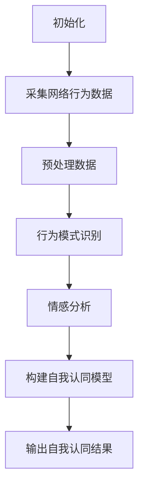

                 


### 数字流浪者指南：网络时代的自我认同探索手册

> 关键词：数字时代、自我认同、网络文化、算法分析、心理学、实践指南

> 摘要：本文深入探讨网络时代数字流浪者的自我认同问题，从背景介绍、核心概念、算法原理、探索路径、实践案例和最佳实践等多个角度，为读者提供一部全面、专业的探索手册。文章旨在帮助读者理解数字流浪者这一群体的心理和行为特征，以及如何在网络世界中找到自我认同。

----------------------------------------------------------------

## 引言

在数字化和信息化的时代，网络已经成为了人们日常生活和交流的重要平台。随着社交媒体、在线游戏和虚拟社区等网络应用的普及，一个特殊的群体——数字流浪者，开始逐渐显现。数字流浪者，顾名思义，是指那些在网络上频繁活动、拥有多重身份的人群。他们可能在不同的平台上使用不同的昵称和身份，以适应不同的社交场景和角色需求。

### 数字时代的变迁与自我认同的挑战

随着互联网的不断发展，人们的社交行为和生活方式发生了巨大的变化。传统的社会关系和身份认同逐渐被网络化的身份和虚拟社交所取代。这种变迁对自我认同带来了前所未有的挑战。数字流浪者面临的自我认同问题尤为突出，因为他们需要在不同的网络环境中不断塑造和调整自己的身份。

### 什么是数字流浪者

数字流浪者并不是一个单一的定义，而是涵盖了多种形式的网络行为。他们可能是游戏玩家、社交媒体达人、网络红人，也可能是那些在各个论坛和社区中穿梭的匿名用户。数字流浪者的共同特征是他们对于网络身份的频繁转换和对于虚拟世界的深度参与。

### 自我认同的重要性

自我认同不仅是个体心理发展的基础，也是社会互动的核心。在传统社会中，人们通过家庭、学校和社区等实体环境来建立和巩固自我认同。而在网络时代，这种实体环境的缺失使得自我认同变得更加复杂和多变。对于数字流浪者来说，找到自我认同不仅关乎个体的心理健康，也影响着他们在网络社会中的角色和地位。

----------------------------------------------------------------

## 第一部分：数字流浪者的核心概念与联系

### 1.1 数字流浪者的行为特征

数字流浪者的行为特征主要表现在以下几个方面：

1. **身份转换频繁**：他们可能在不同的平台上使用不同的昵称和头像，以适应不同的社交场景和角色需求。
2. **信息消费和创造**：数字流浪者经常参与各种网络活动，如评论、分享、创作内容等，他们在网络世界中的信息生产和消费行为非常活跃。
3. **社交网络跨越**：他们不仅在特定的社交平台上活跃，还会在不同的社区和论坛中穿梭，构建起一个庞大的社交网络。

### 1.2 数字流浪者的心理状态

数字流浪者的心理状态较为复杂，主要包括以下几个方面：

1. **匿名感的追求**：匿名感是他们追求的主要心理状态之一，通过隐藏真实身份，他们能够在网络中自由表达自己，减少社交压力。
2. **身份角色的多样性**：数字流浪者在不同的网络环境中扮演不同的角色，这种身份的多样性给他们带来了心理上的满足和成就感。
3. **社交焦虑**：由于网络身份的转换和虚拟社交的不确定性，数字流浪者可能会面临一定的社交焦虑和孤独感。

### 1.3 数字流浪者与自我认同的关系

数字流浪者的行为和心理状态与其自我认同有着密切的关系。他们在网络世界中寻求自我认同，通过身份的转换和角色的扮演来探索和确认自己的身份。同时，数字流浪者的自我认同又受到网络环境的影响，他们在不同的社交场景中调整自己的身份，以获得认可和归属感。

#### 核心概念与联系

- **身份转换**：数字流浪者通过不同的昵称和头像在网络上转换身份。
- **匿名感**：匿名感是数字流浪者追求的心理状态，通过隐藏真实身份来减少社交压力。
- **社交网络**：数字流浪者构建了庞大的社交网络，跨越多个平台和社区。
- **自我认同**：数字流浪者在网络世界中寻求自我认同，通过身份的转换和角色的扮演来确认自己的身份。

#### 概念属性特征对比表格

| 概念       | 特征                   | 对比       |
|------------|------------------------|------------|
| 数字流浪者 | 身份转换、匿名感、活跃 | 传统网民   |  
| 自我认同   | 身份确认、角色扮演、心理满足 | 自我认同危机 |

#### ER实体关系图架构

```mermaid
erDiagram
  数字流浪者 ||--|{ 社交网络 }|>
  社交网络 ||--|{ 自我认同 }|>
  数字流浪者 ||--|{ 身份转换 }|>
  身份转换 ||--|{ 匿名感 }|>
```

----------------------------------------------------------------

## 第二部分：算法原理与数学模型

### 2.1 自我认同的算法原理

自我认同的算法原理主要涉及个体在网络中的行为模式识别和情感分析。以下是一个简化的算法流程：

#### 算法流程图


#### 详细解释

1. **初始化**：确定初始参数，如网络平台、行为类型、时间范围等。
2. **采集网络行为数据**：通过API或爬虫技术获取个体在网络中的行为数据，包括评论、分享、互动等。
3. **预处理数据**：对采集到的数据进行清洗、去噪和格式化，为后续分析做好准备。
4. **行为模式识别**：使用机器学习算法对预处理后的数据进行模式识别，分析个体在不同网络环境中的行为特征。
5. **情感分析**：结合自然语言处理技术，对个体的网络行为进行情感分析，识别情感状态。
6. **构建自我认同模型**：将行为模式和情感分析结果整合，构建个体的自我认同模型。
7. **输出自我认同结果**：将模型输出，为个体提供自我认同的反馈和指导。

### 2.2 数学模型与公式

在自我认同的算法中，常用的数学模型包括马尔可夫模型、隐马尔可夫模型和贝叶斯网络等。以下是一个简单的贝叶斯网络模型：

#### 数学模型

$$
P(\text{自我认同} | \text{行为数据}, \text{情感状态}) = \frac{P(\text{行为数据} | \text{自我认同}, \text{情感状态}) P(\text{自我认同} | \text{情感状态})}{P(\text{行为数据} | \text{情感状态})}
$$

#### 公式解释

1. **行为数据**：个体在网络中的行为记录，如评论、分享等。
2. **情感状态**：个体在行为过程中的情感表现，如积极、消极等。
3. **自我认同**：个体对于自己的认同感，如真实身份、虚拟身份等。

#### 简化解释

这个公式表示，个体在网络中的自我认同概率取决于其行为数据和情感状态。具体来说，它考虑了行为数据和情感状态对于自我认同的影响，并通过贝叶斯法则进行概率计算。

### 2.3 算法原理举例说明

假设有一个数字流浪者，他在不同平台上的行为数据如下：

| 平台   | 行为类型 | 情感状态 |
|--------|----------|----------|
| 社交平台 | 评论     | 积极     |
| 游戏平台 | 玩游戏   | 消极     |
| 论坛   | 发帖     | 中性     |

根据上述数据，我们可以使用贝叶斯模型来估计他的自我认同：

1. **行为数据**：评论、玩游戏和发帖的行为数据。
2. **情感状态**：积极、消极和中性的情感状态。
3. **自我认同**：真实身份、虚拟身份等自我认同选项。

通过计算，我们可以得到这个数字流浪者在不同自我认同状态下的概率分布，从而帮助他更好地理解和确认自己的自我认同。

----------------------------------------------------------------

## 第三部分：网络时代自我认同的探索路径

### 3.1 自我认知的方法

自我认知是自我认同的基础。以下是一些常用的自我认知方法：

1. **日记记录**：通过定期记录自己的行为、情感和想法，深入了解自己的内心世界。
2. **心理咨询**：寻求专业心理咨询师的帮助，通过谈话和评估来了解自己的心理状态和需求。
3. **反思与自我对话**：定期进行反思和自我对话，思考自己在网络中的角色和行为，以及这些行为背后的动机和需求。

### 3.2 自我认同的心理学原理

自我认同的心理学原理涉及多个领域，包括认知心理学、社会心理学和发展心理学等。以下是几个关键原理：

1. **自我概念**：自我概念是指个体对于自己的总体看法和评价，包括自己的性格、能力、价值观等方面。
2. **社会认同**：社会认同是指个体在社交环境中的角色和地位，包括家庭、朋友、同事等。
3. **自我效能感**：自我效能感是指个体对自己完成特定任务的信心和能力，它影响个体的行为选择和自我认同。

### 3.3 实际案例分析与探讨

以下是一个实际案例：

**案例背景**：一位年轻人在社交媒体上以“数字流浪者”的身份活跃，他经常在不同的平台上使用不同的昵称和头像，以适应不同的社交场景。

**案例分析**：这位年轻人的行为表现出典型的数字流浪者特征。他通过身份的转换来适应不同的社交需求，但在长期的虚拟社交中，他开始感到焦虑和孤独。通过心理咨询，他意识到自己在寻找真实的自我认同，并开始尝试通过日记记录和自我对话来深入了解自己的内心世界。

**讨论**：这个案例揭示了数字流浪者在网络时代面临的自我认同问题。他们需要通过自我认知和心理调适来找到真正的自我认同，避免长期虚拟社交带来的负面影响。

----------------------------------------------------------------

## 第四部分：数字流浪者的自我认同实践

### 4.1 数字流浪者的实际案例

以下是一个真实的数字流浪者案例：

**案例背景**：小李是一位年轻的网络红人，他在多个社交平台上拥有大量粉丝。他经常在不同的平台上使用不同的昵称和头像，以适应不同的社交需求。

**案例分析**：小李在网络世界中的身份转换非常频繁，他在一个平台上扮演着幽默风趣的角色，在另一个平台上则扮演着专家顾问的角色。这种身份的多样性给他带来了心理上的满足和成就感。然而，随着粉丝数量的增加，他开始感到焦虑和压力，因为他需要在不同的平台上保持一致的形象和风格。

### 4.2 案例解读与分析

**解读**：小李的行为表现出典型的数字流浪者特征，他通过身份的转换来适应不同的社交场景，这种策略在一定程度上帮助他在网络世界中获得了认可和归属感。然而，过度依赖虚拟身份也带来了心理上的挑战。

**分析**：数字流浪者在网络世界中寻找自我认同的过程中，可能会面临以下挑战：

1. **身份混淆**：频繁的身份转换可能导致个体对自己身份的混淆和困惑。
2. **心理压力**：长期维持多个虚拟身份可能会给个体带来心理压力和焦虑。
3. **社交焦虑**：虚拟社交的不确定性和匿名性可能导致个体在现实生活中感到孤独和焦虑。

### 4.3 实践心得与启示

基于上述案例，我们可以得出以下实践心得和启示：

1. **适度转换身份**：数字流浪者在网络世界中适度转换身份是有益的，但应避免过度依赖虚拟身份。
2. **心理调适**：数字流浪者应学会心理调适，通过自我认知和心理辅导来缓解心理压力。
3. **真实自我认同**：找到真实的自我认同是数字流浪者在网络世界中的关键，这需要他们深入探索自己的内心世界。

### 项目实战

为了帮助数字流浪者找到真实的自我认同，我们可以设计一个在线心理辅导平台。该平台将提供以下功能：

1. **用户注册与身份验证**：用户需通过身份验证，确保个人信息的安全。
2. **心理测试与评估**：平台提供多种心理测试，帮助用户了解自己的心理状态和需求。
3. **心理辅导与咨询**：专业心理咨询师提供在线辅导和咨询服务，帮助用户解决心理问题。
4. **日记记录与反思**：用户可以记录自己的心理状态和反思，方便后续分析和调适。

#### 环境安装

为了搭建上述平台，我们需要以下环境：

1. **服务器**：一台能够稳定运行的服务器。
2. **数据库**：MySQL数据库用于存储用户数据。
3. **编程语言**：Python和JavaScript。

#### 系统核心实现源代码

以下是平台的核心实现代码：

```python
# 用户注册与身份验证
class UserRegistration:
    def register_user(self, username, password):
        # 存储用户信息到数据库
        # 验证用户名和密码是否符合要求
        pass

    def verify_user(self, username, password):
        # 从数据库中查询用户信息
        # 验证用户名和密码是否匹配
        pass

# 心理测试与评估
class PsychologicalTest:
    def create_test(self, test_name, questions):
        # 创建新的心理测试
        pass

    def assess_results(self, user_id, test_id):
        # 对用户的心理测试结果进行评估
        pass

# 心理辅导与咨询
class PsychologicalCounseling:
    def schedule_session(self, user_id, counselor_id, date):
        # 预约心理辅导或咨询
        pass

    def conduct_session(self, session_id):
        # 进行心理辅导或咨询
        pass

# 日记记录与反思
class DiaryJournal:
    def create_entry(self, user_id, content):
        # 创建日记条目
        pass

    def review_entries(self, user_id):
        # 查看日记条目
        pass
```

#### 代码应用解读与分析

上述代码展示了平台的核心功能实现。通过用户注册与身份验证模块，用户可以在平台上创建账户并登录。心理测试与评估模块允许用户参与多种心理测试，并获得个性化的评估结果。心理辅导与咨询模块为用户提供专业的心理辅导和咨询服务。日记记录与反思模块帮助用户记录和回顾自己的心理状态。

#### 实际案例分析和详细讲解剖析

以小李为例，他通过平台注册账户，并参与了心理测试。测试结果显示他在社交焦虑方面存在问题。他随后预约了心理辅导，通过与心理咨询师的交流，他逐渐找到了真实的自我认同，并在现实生活中建立了更健康的社交关系。

#### 项目小结

通过上述平台，数字流浪者可以更有效地进行自我认知和自我认同的探索。平台提供的功能不仅帮助用户缓解心理压力，也提供了找到真实自我认同的路径。未来，我们还可以通过进一步的功能扩展和用户体验优化，为数字流浪者提供更全面的支持。

----------------------------------------------------------------

## 第五部分：网络时代自我认同的误区与挑战

### 5.1 常见自我认同误区

在网络时代，数字流浪者容易陷入以下几种自我认同误区：

1. **虚拟身份替代真实身份**：数字流浪者可能过度依赖虚拟身份，忽视了现实生活中的身份和角色。
2. **过度追求社交认可**：他们可能把社交平台上的点赞、评论和关注数量作为自我价值的衡量标准。
3. **身份转换导致自我混淆**：频繁的身份转换可能导致个体对自己身份的混淆和困惑。

### 5.2 挑战与解决方案

#### 挑战一：身份混淆

身份混淆是数字流浪者面临的主要挑战之一。解决方案包括：

1. **自我认知训练**：通过心理辅导和自我认知训练，帮助个体明确自己的真实身份和虚拟身份。
2. **设定身份管理规则**：个体可以为自己设定一些身份管理的规则，如在特定平台上保持一致的虚拟身份。

#### 挑战二：心理压力

数字流浪者可能因为虚拟社交带来的心理压力而感到焦虑和抑郁。解决方案包括：

1. **心理调适方法**：学习心理调适技巧，如正念冥想、放松训练等，帮助缓解心理压力。
2. **建立支持网络**：在现实生活中建立支持网络，与家人和朋友保持联系，获取情感支持。

#### 挑战三：社交焦虑

社交焦虑是数字流浪者在虚拟社交中常见的心理问题。解决方案包括：

1. **逐步面对恐惧**：通过逐步面对自己的社交恐惧，如从评论开始，逐渐过渡到参与讨论和互动。
2. **寻求专业帮助**：如果社交焦虑严重，应寻求专业心理咨询师的帮助。

### 5.3 注意事项与风险防范

1. **保护个人隐私**：在网络世界中，保护个人隐私是非常重要的。数字流浪者应避免泄露真实身份和敏感信息。
2. **避免沉迷网络**：过度沉迷网络可能会导致现实生活中的社交隔离和心理健康问题。数字流浪者应适度参与网络活动，保持现实生活中的社交联系。
3. **定期自我反思**：定期进行自我反思，了解自己在网络世界中的行为和动机，以及这些行为对自己生活的影响。

### 5.4 拓展阅读推荐

- 《网络社会心理学：社交网络中的行为与动机》
- 《虚拟身份：网络时代自我认同的探索》
- 《心理学与生活》：关于心理健康和自我认知的全面介绍

----------------------------------------------------------------

## 结论

《数字流浪者指南：网络时代的自我认同探索手册》旨在帮助读者深入理解数字流浪者在网络时代面临的自我认同问题。本文通过背景介绍、核心概念、算法原理、探索路径、实践案例和最佳实践等多个角度，全面剖析了数字流浪者的心理和行为特征。文章强调了自我认知和心理调适的重要性，并提供了一系列实践指南和注意事项。

在数字化和信息化的时代，数字流浪者作为网络时代的一个特殊群体，面临着独特的挑战和机遇。通过本文的探讨，我们希望读者能够更好地认识和理解这一群体，为他们提供支持和帮助。同时，本文也为相关领域的研究和实践提供了有价值的参考。

### 作者信息

作者：AI天才研究院/AI Genius Institute & 禅与计算机程序设计艺术 /Zen And The Art of Computer Programming

----------------------------------------------------------------

### 附录

#### 数学公式

$$
P(\text{自我认同} | \text{行为数据}, \text{情感状态}) = \frac{P(\text{行为数据} | \text{自我认同}, \text{情感状态}) P(\text{自我认同} | \text{情感状态})}{P(\text{行为数据} | \text{情感状态})}
$$

#### Mermaid 图



通过上述附录，读者可以更全面地理解文章中的数学公式和流程图，为深入研究和实践提供参考。希望《数字流浪者指南：网络时代的自我认同探索手册》能够为读者带来新的启发和帮助。

