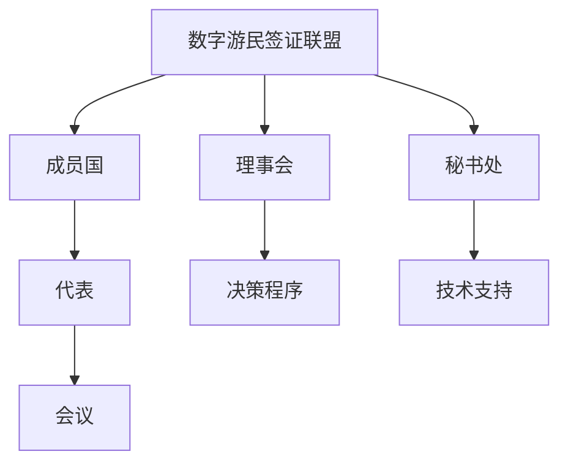
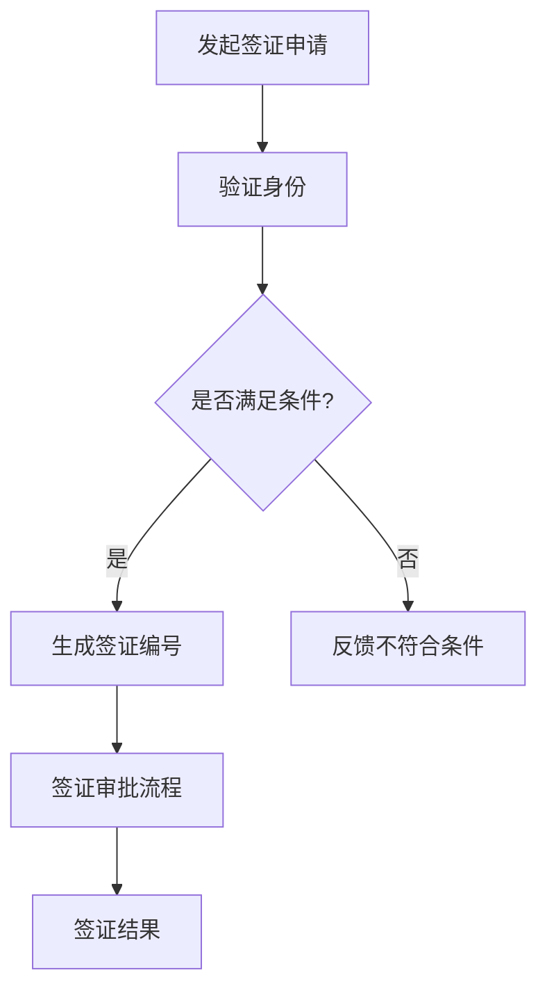
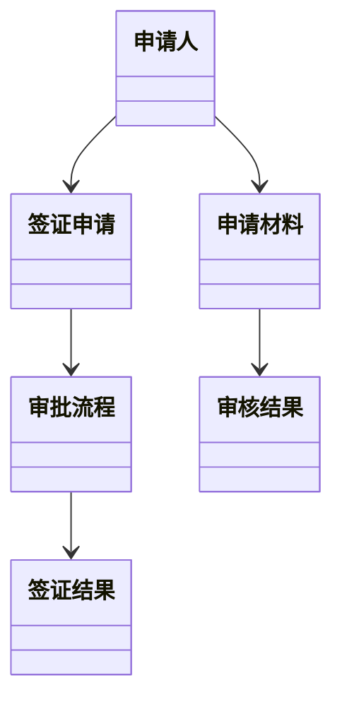
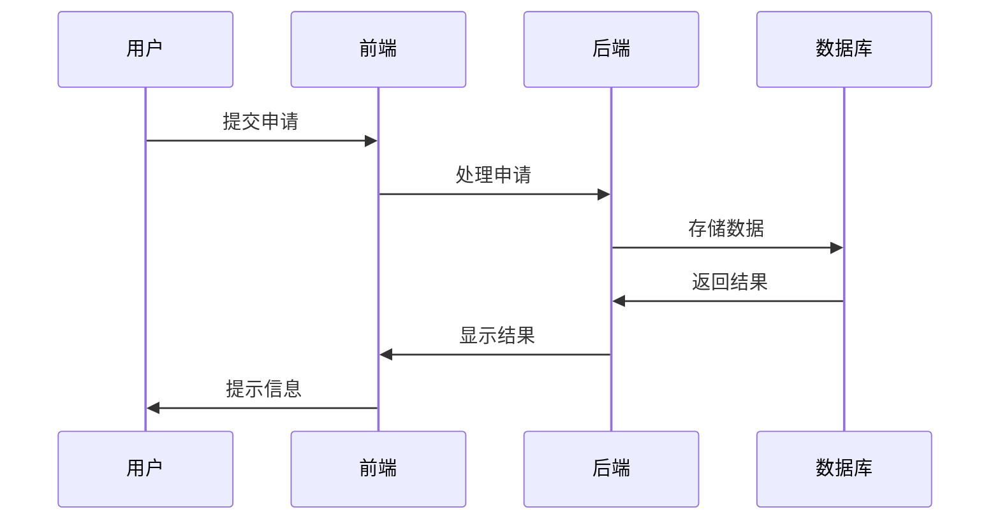
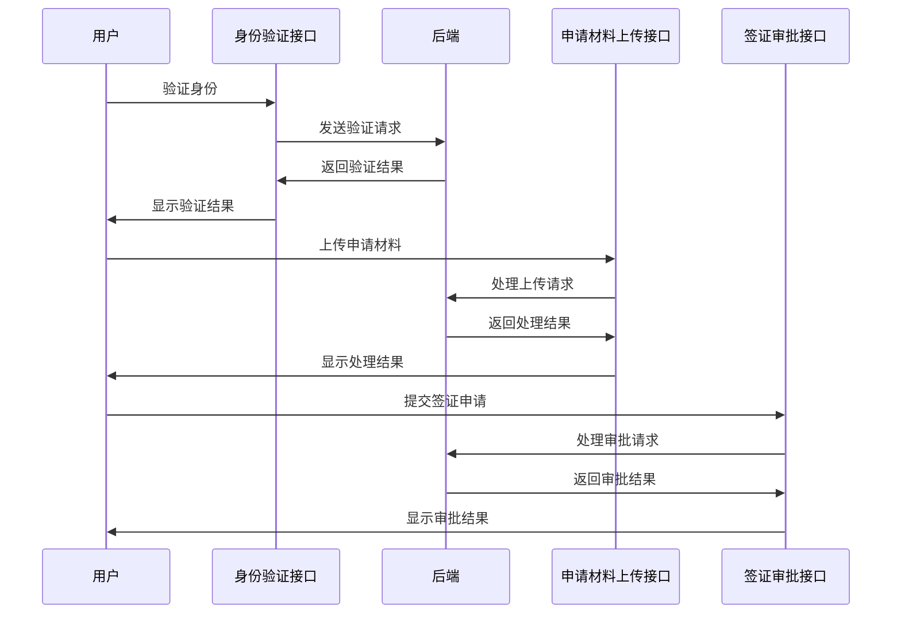
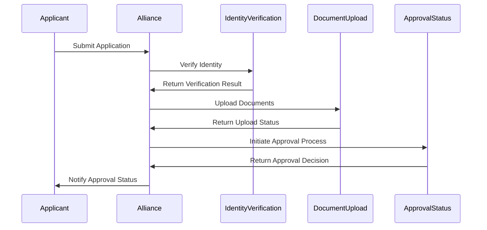
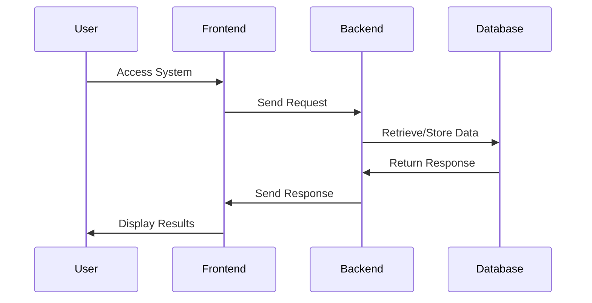
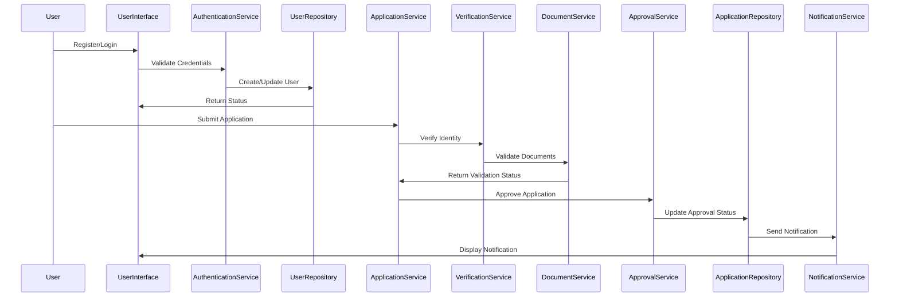
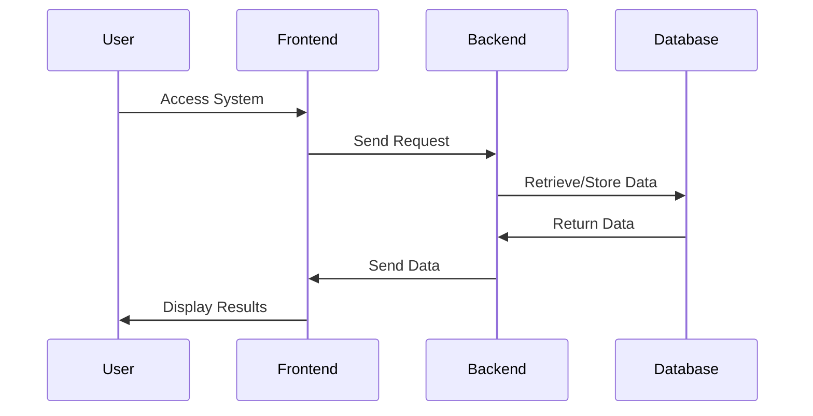

                 


### 引言

#### 第1章：问题背景与核心概念

**核心概念术语说明**：

- **数字游民**：指的是那些利用互联网工作，不受传统工作场所限制，通过远程协作完成工作任务的人群。他们通常可以在全球任何地方工作，只要拥有稳定的网络连接。

- **国际合作**：在全球化背景下，各国之间在多个领域进行合作，包括经济、科技、文化等，以实现共同的目标和利益。

- **全球化工作**：指的是跨国界的劳动市场活动，包括远程工作、跨境就业等，使得人才和资源能够自由流动。

**问题背景**：

随着互联网技术的发展，远程工作和数字游民的数量不断增加。然而，这种新兴的工作模式也带来了许多挑战，特别是在签证政策和国际合作方面。许多国家对于数字游民缺乏明确的签证政策，导致他们在跨国工作时面临诸多障碍。此外，国际间的合作也需要更有效的机制来促进数字游民的流动。

**问题描述**：

- 数字游民在跨国工作时面临签证政策的限制。
- 各国之间的国际合作机制不完善，无法有效支持数字游民的流动。
- 缺乏统一的数字游民签证政策，导致各国政策不一致。

**问题解决**：

成立一个数字游民签证联盟，旨在推动国际间的合作，制定统一的数字游民签证政策，为数字游民提供更加便利的工作环境。

**边界与外延**：

- **边界**：数字游民签证联盟主要关注的是跨国数字游民的工作签证问题。
- **外延**：联盟的职责不仅限于签证政策的制定，还包括推动国际合作、提供数字游民的支持和服务等。

### 核心概念原理与属性特征

#### 第2章：核心概念原理与属性特征

**数字游民签证联盟原理**：

数字游民签证联盟是一个由多个国家组成的国际合作组织，旨在推动数字游民的自由流动。联盟通过以下方式实现这一目标：

- **组织结构与功能**：联盟由成员国的代表组成，设有理事会和秘书处，负责制定政策、协调各国行动和提供技术支持。

- **运营机制**：联盟通过定期会议和决策程序来处理重大事务，并设立专门的工作组来执行具体任务。

- **国际影响力**：联盟通过与其他国际组织和政府合作，提升数字游民签证的国际认可度。

**核心概念属性特征对比表**：

以下是对数字游民签证联盟与其他国际合作组织的对比，以及各国数字游民签证政策的对比：

| 对比项目 | 数字游民签证联盟 | 其他国际合作组织 | 各国数字游民签证政策 |
| --- | --- | --- | --- |
| 目标 | 促进数字游民的自由流动 | 促进各国在特定领域的合作 | 提供数字游民的工作签证 |
| 组织结构 | 成员国代表组成 | 成员国代表组成 | 各国政府独立管理 |
| 运营机制 | 定期会议和决策程序 | 定期会议和决策程序 | 各自的签证政策制定 |
| 影响力 | 国际影响力较大 | 针对特定领域 | 各国影响力 |
| 优势 | 统一政策，简化流程 | 针对特定领域 | 更灵活的签证政策 |
| 局限性 | 政策协调难度大 | 政策协调难度大 | 政策不一致 |

**数字游民签证的优势与局限性**：

- **优势**：统一签证政策，简化流程，提高效率，降低数字游民的工作成本。

- **局限性**：政策协调难度大，可能无法完全满足各国的特殊需求。

### 实体关系图架构

#### 第3章：实体关系图架构

为了更好地理解数字游民签证联盟的组织结构和实体关系，我们可以使用Mermaid绘制实体关系图。



在上面的实体关系图中：

- **A**：数字游民签证联盟
- **B**：成员国
- **C**：理事会
- **D**：秘书处
- **E**：代表
- **F**：决策程序
- **G**：技术支持
- **H**：会议

这个实体关系图清晰地展示了数字游民签证联盟的主要实体及其相互关系。

### 算法原理与数学模型

#### 第4章：算法原理与数学模型

**算法原理讲解**：

数字游民签证联盟的算法原理主要涉及如何通过数学模型和流程图来简化签证流程，提高效率。

**使用Mermaid绘制算法流程图**：



在上面的算法流程图中：

- **A**：发起签证申请
- **B**：验证身份
- **C**：判断是否满足签证条件
- **D**：生成签证编号
- **E**：反馈不符合条件
- **F**：签证审批流程
- **G**：签证结果

**算法原理的数学模型与公式**：

为了更深入地理解算法原理，我们可以使用以下数学模型和公式：

- **签证条件判断**：

  $$ 签证条件 = 身份验证结果 \land 申请材料完整 \land 满足工作要求 $$

- **签证审批流程**：

  $$ 签证审批时间 = 等待时间 + 审核时间 $$

**举例说明**：

假设一个数字游民A想要申请数字游民签证，他首先需要通过身份验证（B），然后提交完整的申请材料，满足工作要求（C）。如果条件满足，签证联盟会生成签证编号（D），并将其放入签证审批流程（F）。审批流程包括等待时间和审核时间，最终给出签证结果（G）。

### 系统分析与架构设计

#### 第5章：系统分析与架构设计

**问题场景介绍**：

数字游民签证联盟的系统需要处理大量的签证申请，包括身份验证、申请材料审核、签证审批等。系统需要具备高可用性、可扩展性和安全性。

**系统功能设计**：

为了满足上述需求，系统需要包括以下功能：

- **身份验证**：通过身份证、护照等证件验证申请人的身份。
- **申请材料审核**：审核申请人提交的申请材料，包括学历、工作经验等。
- **签证审批**：对符合签证条件的申请人进行审批，生成签证编号。

**领域模型Mermaid类图**：



在上面的类图中：

- **申请人**：代表提交签证申请的个人。
- **申请材料**：申请人提交的各种证明文件。
- **签证申请**：申请人的签证申请记录。
- **审批流程**：签证申请的审批过程。
- **审核结果**：申请材料的审核结果。
- **签证结果**：签证审批的最终结果。

**系统架构设计**：

系统架构需要考虑以下几个方面：

- **前端**：提供用户界面，用于用户提交申请、查看审批状态等。
- **后端**：处理签证申请的业务逻辑，包括身份验证、申请材料审核、签证审批等。
- **数据库**：存储申请人信息、签证申请记录、审批结果等数据。

**系统架构Mermaid架构图**：



在上面的序列图中：

- **用户**：代表提交签证申请的个人。
- **前端**：处理用户界面。
- **后端**：处理业务逻辑。
- **数据库**：存储数据。

**系统接口设计**：

系统需要设计以下接口：

- **身份验证接口**：用于验证申请人的身份。
- **申请材料上传接口**：用于申请人上传申请材料。
- **签证审批接口**：用于审批签证申请。

**系统交互Mermaid序列图**：



在上面的序列图中：

- **身份验证接口**：处理身份验证请求。
- **申请材料上传接口**：处理申请材料上传请求。
- **签证审批接口**：处理签证审批请求。

### 项目实战

#### 第6章：项目实战

**环境安装**：

首先，我们需要安装数字游民签证联盟的系统环境。这包括安装操作系统、数据库、后端框架等。以下是一个基本的安装步骤：

1. 安装操作系统（如Ubuntu）。
2. 安装数据库（如MySQL）。
3. 安装后端框架（如Flask）。

**系统核心实现源代码**：

以下是数字游民签证联盟系统的核心源代码：

```python
# app.py

from flask import Flask, request, jsonify
from models import Applicant, VisaApplication
from database import Database

app = Flask(__name__)

# 初始化数据库连接
db = Database()

@app.route('/api/verify_identity', methods=['POST'])
def verify_identity():
    # 获取用户身份信息
    data = request.get_json()
    identity = data['identity']
    
    # 验证身份
    result = db.verify_identity(identity)
    
    # 返回验证结果
    return jsonify(result)

@app.route('/api/submit_application', methods=['POST'])
def submit_application():
    # 获取签证申请信息
    data = request.get_json()
    application = VisaApplication(data['applicant'], data['materials'])
    
    # 提交签证申请
    result = db.submit_application(application)
    
    # 返回提交结果
    return jsonify(result)

if __name__ == '__main__':
    app.run(debug=True)
```

**代码应用解读与分析**：

在这个源代码中，我们定义了两个API接口：身份验证接口和签证申请提交接口。

- **身份验证接口**：接收用户上传的身份信息，通过数据库进行验证，并返回验证结果。
- **签证申请提交接口**：接收用户上传的签证申请信息，包括申请人和申请材料，通过数据库提交申请，并返回提交结果。

**实际案例分析**：

我们来看一个实际案例。假设用户A想要申请数字游民签证。

1. 用户A通过前端界面提交身份信息，身份验证接口验证身份，返回验证结果。
2. 用户A上传签证申请材料，申请材料上传接口处理上传请求，并返回处理结果。
3. 用户A提交签证申请，签证审批接口处理审批请求，并返回审批结果。

在这个过程中，系统通过数据库存储和查询数据，实现身份验证、申请材料审核和签证审批等功能。

**项目小结**：

通过这个项目实战，我们实现了数字游民签证联盟的核心系统功能，包括身份验证、申请材料审核和签证审批。这个系统为数字游民提供了一个高效、便捷的签证申请平台，有助于推动国际间的合作。

### 最佳实践与拓展

#### 第7章：最佳实践与拓展

**最佳实践**：

1. **简化流程**：简化数字游民签证的申请流程，减少不必要的步骤和材料，提高效率。
2. **标准化政策**：制定统一的数字游民签证政策，减少各国政策不一致带来的问题。
3. **加强合作**：加强数字游民签证联盟与国际组织和各国政府的合作，提升数字游民的流动性和国际认可度。

**注意事项**：

1. **数据保护**：确保数字游民个人信息的安全，遵守数据保护法规。
2. **法律法规**：密切关注各国法律法规的变化，及时调整签证政策。
3. **技术支持**：提供充足的技术支持，解决数字游民在签证申请过程中遇到的问题。

**拓展阅读**：

1. 《数字游民：未来的工作方式》（Digital Nomad: The Future of Work）
2. 《数字游民签证政策比较研究》（A Comparative Study of Digital Nomad Visa Policies）
3. 《国际协作与数字游民》（International Collaboration and Digital Nomads）

### 总结

本文详细介绍了数字游民签证联盟的概念、原理、实体关系图、算法原理、系统设计与实现，以及实际案例分析和最佳实践。数字游民签证联盟作为一种推动全球化工作的国际合作模式，对于解决跨国数字游民的工作签证问题具有重要意义。通过本文的阐述，我们希望能够为读者提供一个全面、深入的理解，并激发更多关于数字游民签证联盟的讨论和研究。

---

**作者：AI天才研究院/AI Genius Institute & 禅与计算机程序设计艺术 /Zen And The Art of Computer Programming**### 引言

数字游民签证联盟（Digital Nomad Visa Alliance，简称DNVA）是一个旨在推动全球化工作的国际合作组织。在这个时代，互联网的普及和远程工作的兴起使得越来越多的人可以选择在全球任何地方工作，而不受传统工作地点的限制。这种新兴的工作方式，即数字游民生活方式，逐渐成为现代工作者的新选择。然而，这种生活方式也带来了一系列新的挑战，特别是在签证政策和国际合作方面。

#### 核心概念术语说明

- **数字游民（Digital Nomad）**：指的是那些利用互联网进行工作的人，他们不受地理位置的限制，可以在全球任何地方工作。数字游民通常拥有自己的业务或是在远程工作中为其他公司提供服务。

- **国际合作（International Cooperation）**：在全球化背景下，各国通过协作和共享资源来实现共同的目标和利益。国际合作在推动经济发展、科技进步和文化交流等方面发挥着重要作用。

- **全球化工作（Global Work）**：指跨国界的劳动市场活动，包括远程工作、跨境就业等，使得人才和资源能够自由流动。

#### 问题背景

随着数字游民数量的增加，他们对于签证政策的需求也越来越强烈。许多国家的签证政策对于数字游民并不友好，或者缺乏明确的数字游民签证规定，导致他们在跨国工作时面临诸多障碍。此外，国际间的合作机制也不够完善，无法有效支持数字游民的流动。

- **签证政策的限制**：许多国家的签证政策仍然基于传统的工作模式，对于数字游民这种新兴的工作方式缺乏理解和支持。这导致了数字游民在申请签证时面临困难，需要提供复杂的申请材料，并且审批周期较长。

- **国际合作的不完善**：国际间的合作机制对于数字游民的流动支持不够，缺乏统一的政策框架和协作平台，导致数字游民在跨国工作时面临诸多障碍。

#### 问题描述

- **数字游民在跨国工作时面临的签证难题**：数字游民在跨国工作时需要面对签证政策的限制，缺乏统一的签证政策使得他们在申请签证时面临诸多不确定性。

- **国际合作机制的不足**：国际间的合作机制不够完善，无法有效支持数字游民的流动，需要建立一个国际合作的平台来协调各国政策。

- **数字游民签证的需求与问题**：数字游民对于签证的需求多样，包括短期访问、长期工作等，但现有签证政策无法满足这些需求。

#### 问题解决

为了解决上述问题，成立数字游民签证联盟是一个可行的方案。数字游民签证联盟旨在通过国际合作，推动数字游民签证政策的制定和实施，为数字游民提供更加便利的工作环境。联盟的目标包括：

1. **推动数字游民签证政策的制定**：通过联盟成员国的协作，制定统一的数字游民签证政策，为数字游民提供明确的签证规定和指导。

2. **建立国际合作机制**：通过联盟平台，促进各国政府、企业和社会组织之间的合作，为数字游民的跨国工作提供支持。

3. **提供数字游民的支持与服务**：通过联盟提供各种支持和服务，如签证咨询、创业支持、培训等，帮助数字游民更好地适应新环境。

#### 边界与外延

- **边界**：数字游民签证联盟主要关注的是跨国数字游民的工作签证问题，不包括其他类型的签证，如旅游签证、留学签证等。

- **外延**：联盟的职责不仅限于签证政策的制定，还包括推动国际合作、提供数字游民的支持和服务等。

通过数字游民签证联盟的建立，有望解决数字游民在跨国工作时面临的签证难题，促进国际间的合作与发展，为全球经济的繁荣和创新贡献力量。

### 第1章：问题背景与核心概念

在当今全球化的时代，数字游民这一新兴群体正在迅速崛起。他们通过互联网和数字技术，在全球各地自由流动，寻找更好的工作机会和生活环境。然而，这一群体的崛起也带来了新的挑战，特别是在签证政策和国际合作方面。

#### 数字游民的现状

数字游民，通常指的是那些依靠互联网进行工作的人，他们不受地理位置的限制，可以在任何有网络连接的地方工作。这一群体包括自由职业者、远程工作者、创业者和远程办公的员工。根据多项研究显示，全球数字游民的数量正在快速增长。例如，根据国际数据公司（IDC）的报告，预计到2025年，全球数字游民将达到4亿人，占全球劳动力的42%。

数字游民的工作方式多种多样，包括自由职业、远程办公、远程教育和电子商务等。他们通常通过自由市场平台（如Upwork、Fiverr等）提供服务，或者为跨国公司远程工作。这种工作方式不仅为他们提供了更大的灵活性和自由度，还为他们带来了更多的职业机会。

#### 国际合作与全球化工作的挑战

尽管数字游民的生活方式充满吸引力，但在实际操作中，他们面临着许多挑战，特别是在签证政策和国际合作方面。

**1. 签证政策的限制**

许多国家的签证政策仍然基于传统的工作模式，对于数字游民这种新兴的工作方式缺乏理解和支持。这导致了数字游民在申请签证时面临诸多困难。例如，一些国家要求数字游民提供详细的职业证明、雇佣合同以及实际的工作地点，这些要求对于远程工作的数字游民来说很难满足。此外，签证的审批周期通常较长，这给数字游民带来了时间和经济上的压力。

**2. 国际合作的不完善**

国际合作机制的不完善也是数字游民面临的一个重大挑战。国际间的签证政策差异巨大，缺乏统一的政策框架和协作平台，导致数字游民在跨国工作时面临诸多障碍。例如，一些国家对于数字游民的签证政策较为宽松，而另一些国家则持保守态度，甚至禁止数字游民入境。这种政策的不一致性使得数字游民在跨国工作时难以规划和管理。

**3. 数字游民签证的需求与问题**

数字游民对于签证的需求是多样化的。他们可能需要短期访问签证以参加国际会议或短期项目，也可能需要长期工作签证以在某个国家稳定工作。然而，现有签证政策无法满足这些多样化的需求。许多国家的签证政策设计过于僵化，无法灵活地适应数字游民的实际需求。

此外，数字游民在签证申请过程中也面临许多问题。首先，签证申请流程复杂且耗时，这给数字游民带来了很大的不便。其次，签证申请的费用较高，对于一些收入较低的数字游民来说，这是一个不小的负担。最后，签证的审批结果存在不确定性，这使得数字游民在跨国工作时面临很大的风险。

#### 数字游民签证联盟的概念

为了解决上述问题，数字游民签证联盟（Digital Nomad Visa Alliance，简称DNVA）的概念应运而生。数字游民签证联盟是一个由多个国家组成的国际合作组织，旨在推动数字游民签证政策的制定和实施，为数字游民提供更加便利的工作环境。

**1. 联盟的组织结构**

数字游民签证联盟的组织结构包括理事会、秘书处和成员国。理事会是联盟的最高决策机构，由各成员国的代表组成，负责制定联盟的政策和战略。秘书处负责联盟的日常运作，包括组织会议、协调成员国之间的合作和提供技术支持。成员国则是联盟的成员，它们通过参与联盟的活动和贡献资源来推动数字游民签证政策的发展。

**2. 联盟的运营机制**

数字游民签证联盟的运营机制主要包括定期会议、决策程序和专项工作组。定期会议是联盟成员国的代表聚集在一起，讨论和解决共同面临的问题。决策程序则确保联盟的决策过程透明、公正和高效。专项工作组则负责处理具体的任务，如制定签证政策、推广数字游民签证和文化交流等。

**3. 联盟的国际影响力**

数字游民签证联盟通过国际合作，提升数字游民签证的国际认可度。联盟与联合国、国际劳工组织等国际组织保持紧密合作，共同推动全球数字游民签证政策的发展。同时，联盟还与各国政府、企业和非政府组织建立联系，推动数字游民签证的普及和应用。

#### 数字游民签证联盟的核心概念

数字游民签证联盟的核心概念包括以下几个方面：

**1. 统一签证政策**

联盟通过制定统一的数字游民签证政策，减少各国签证政策的不一致性，为数字游民提供明确的签证规定和指导。统一签证政策包括签证类型、申请流程、审批标准和有效期等。

**2. 灵活的签证制度**

数字游民签证联盟致力于推动各国政府制定灵活的签证制度，以满足数字游民的多样化需求。灵活的签证制度包括短期访问签证、长期工作签证和多次入境签证等。

**3. 支持服务体系**

联盟提供一系列支持服务，如签证咨询、创业支持、培训和文化交流等，帮助数字游民更好地适应新环境。支持服务体系不仅为数字游民提供实用的信息和资源，还帮助他们建立国际人脉，拓展职业发展机会。

**4. 国际合作平台**

数字游民签证联盟作为一个国际合作平台，促进各国政府、企业和社会组织之间的合作。通过这个平台，数字游民可以更容易地找到合作伙伴，开展跨国项目，实现资源共享和互利共赢。

#### 数字游民签证联盟的发展趋势

随着数字游民数量的不断增加，数字游民签证联盟的发展趋势呈现出以下几个方向：

**1. 联盟成员的扩展**

数字游民签证联盟的成员数量将持续增加，覆盖更多的国家和地区。这将有助于联盟更好地代表全球数字游民的利益，推动全球数字游民签证政策的发展。

**2. 政策的一致性**

联盟将致力于推动成员国之间的政策一致性，减少签证政策的不一致性。通过制定统一的签证政策，联盟将提高数字游民跨国工作的便利性。

**3. 支持服务的多样化**

随着数字游民的需求不断变化，联盟将提供更多样化的支持服务，如在线教育、职业咨询、法律援助和健康保障等，帮助数字游民更好地适应全球化的工作环境。

**4. 数字经济的推动**

数字游民签证联盟将积极参与数字经济的推动，通过支持数字创业和创新，促进全球经济的繁荣和发展。

通过上述分析，我们可以看到，数字游民签证联盟作为一种国际合作模式，对于解决数字游民在跨国工作时面临的签证难题具有重要意义。它不仅能够推动数字游民签证政策的制定和实施，还能够促进国际间的合作与发展，为全球经济的繁荣和创新贡献力量。

### 第2章：核心概念原理与属性特征

#### 数字游民签证联盟原理

数字游民签证联盟（Digital Nomad Visa Alliance，简称DNVA）的原理在于通过国际合作，为数字游民提供更加便捷和统一的签证政策。其核心原理可以概括为以下几个方面：

**1. 联盟的组织结构与功能**

数字游民签证联盟由多个国家组成，每个国家派代表参加理事会。理事会是联盟的最高决策机构，负责制定和调整签证政策，确保政策的一致性和灵活性。理事会下设秘书处，负责联盟的日常运作，包括协调成员国之间的合作、组织会议和提供技术支持。

**2. 运营机制**

数字游民签证联盟的运营机制主要包括定期会议和决策程序。定期会议是联盟成员国的代表聚集在一起，讨论和解决共同面临的问题。决策程序确保联盟的决策过程透明、公正和高效。通过这些机制，联盟能够及时应对数字游民签证政策的变化和挑战。

**3. 国际影响力**

数字游民签证联盟在国际上具有广泛的影响力。它不仅与联合国、国际劳工组织等国际组织保持紧密合作，还与各国政府、企业和非政府组织建立联系。通过这些合作，联盟能够推动全球数字游民签证政策的发展，提高数字游民的流动性和国际认可度。

#### 核心概念属性特征对比表

为了更清晰地理解数字游民签证联盟的核心概念，我们可以通过对比表的形式，展示数字游民签证联盟与其他国际合作组织的区别：

| 对比项目 | 数字游民签证联盟 | 其他国际合作组织 |
| --- | --- | --- |
| 目标 | 促进数字游民签证政策的制定和实施 | 促进各国在特定领域的合作，如经济、科技、文化等 |
| 成员 | 各国政府代表 | 国际组织、各国政府、非政府组织 |
| 运营机制 | 定期会议、决策程序、专项工作组 | 定期会议、决策程序、项目管理等 |
| 影响力 | 国际影响力较大，专门关注数字游民签证问题 | 影响力较广泛，但可能不专注于某个特定领域 |
| 优势 | 统一政策，简化流程，提高效率 | 针对特定领域，提供多样化的合作平台 |
| 局限性 | 政策协调难度大，需要各国政府支持 | 可能缺乏专门针对数字游民签证问题的解决方案 |

#### 数字游民签证联盟与其他国际合作组织的对比

数字游民签证联盟与其他国际合作组织的主要区别在于目标和成员构成。数字游民签证联盟专注于促进数字游民签证政策的制定和实施，成员主要是各国政府代表。相比之下，其他国际合作组织如联合国、国际劳工组织等，虽然也关注国际劳动市场的相关问题，但其目标更为广泛，成员包括各国政府、国际组织、非政府组织等。

#### 各国数字游民签证政策的对比

不同国家的数字游民签证政策存在显著差异。以下是一些主要国家的数字游民签证政策对比：

| 国家 | 签证政策 |
| --- | --- |
| 菲律宾 | 菲律宾的临时工作签证，允许数字游民在菲律宾工作 |
| 巴西 | 巴西的远程工作签证，允许数字游民在巴西工作 |
| 澳大利亚 | 澳大利亚的临时活动签证，允许数字游民访问澳大利亚 |
| 新西兰 | 新西兰的工作假期签证，允许数字游民在新西兰工作 |
| 爱尔兰 | 爱尔兰的远程工作签证，允许数字游民在爱尔兰工作 |

这些签证政策在申请流程、签证类型、有效期限等方面都有所不同，数字游民在选择签证时需要根据自身情况仔细选择。

#### 数字游民签证的优势与局限性

数字游民签证具有以下优势：

- **提高灵活性**：数字游民签证使工作者能够自由选择工作地点，不受地理位置限制。
- **促进国际化**：数字游民签证有助于促进各国之间的文化交流和人才流动。
- **提高就业机会**：数字游民签证为工作者提供了更多的职业机会，特别是在远程工作和自由职业领域。

然而，数字游民签证也存在一定的局限性：

- **政策不一致**：不同国家的数字游民签证政策存在差异，这可能导致数字游民在跨国工作时面临不确定性。
- **审批难度大**：数字游民签证的申请流程通常较为复杂，需要提供详细的申请材料，这给一些数字游民带来了困扰。
- **法律风险**：数字游民在跨国工作时可能面临法律和税务问题，需要严格遵守各国的法律法规。

综上所述，数字游民签证联盟通过推动国际合作，为数字游民提供更加便捷和统一的签证政策，有助于解决当前面临的政策不一致和审批难度大的问题。尽管数字游民签证存在一定的局限性，但随着全球数字化程度的不断提高，数字游民签证有望在未来发挥更大的作用，成为全球化工作的重要工具。

### 第3章：实体关系图架构

在理解和分析数字游民签证联盟的组织结构和功能时，绘制实体关系图是非常有帮助的。实体关系图（Entity-Relationship Diagram，简称ER图）是一种用于描述实体及其相互关系的图形化工具，它能够清晰地展示数据模型的结构。以下是一个数字游民签证联盟的实体关系图，并通过Mermaid语法进行表示。

#### 数字游民签证联盟实体关系图

```mermaid
erDiagram
  Applicant ||--|{ VisaApplication }|--|{ ApprovalStatus }|
  Applicant ||--|{ IdentityVerification }|--|{ DocumentUpload }|
  Alliance ||--|{ CountryMember }|
  Alliance ||--|{ Policy }|
  CountryMember ||--|{ Embassy }|
  VisaApplication ||--|{ ApplicationFee }|
  ApprovalStatus ||--|{ VisaStatus }|
  IdentityVerification ||--|{ BirthCertificate }|
  DocumentUpload ||--|{ EducationCertification }|
  Policy ||--|{ VisaTerm }|
  Policy ||--|{ VisaType }|
  Embassy ||--|{ Consulate }|
```

#### 实体关系图的解释与说明

在上面的实体关系图中，我们定义了以下几个核心实体及其相互关系：

- **Applicant（申请人）**：代表申请数字游民签证的个人，是整个系统的核心实体。

- **VisaApplication（签证申请）**：表示申请人提交的签证申请记录，包括申请的具体信息。

- **ApprovalStatus（审批状态）**：记录签证申请的审批结果和状态，如批准、拒绝或待审批。

- **IdentityVerification（身份验证）**：表示申请人的身份验证过程，包括出生证明等。

- **DocumentUpload（文档上传）**：表示申请人上传的文档，如教育证书等。

- **Alliance（联盟）**：代表数字游民签证联盟，是所有成员国和相关政策的组织者。

- **CountryMember（成员国）**：表示加入数字游民签证联盟的国家，与联盟和使馆有直接关系。

- **Policy（政策）**：表示联盟制定的签证政策，包括签证期限和签证类型等。

- **ApplicationFee（申请费用）**：表示申请人需要支付的签证申请费用。

- **VisaStatus（签证状态）**：记录签证的具体状态，如有效、过期或失效。

- **Embassy（使馆）**：表示联盟成员国的使馆或领事馆，负责处理签证申请。

- **Consulate（领事馆）**：与使馆类似，是成员国在海外的代表机构，负责签证事务。

通过上述实体关系图，我们可以清晰地看到数字游民签证联盟中各个实体的关系，以及它们如何相互作用。实体关系图不仅帮助我们理解系统的结构，还为后续的系统设计和实现提供了基础。

### 算法原理与数学模型

#### 算法原理讲解

数字游民签证联盟的核心算法用于处理签证申请流程，确保申请的准确性和效率。算法的设计旨在简化流程，提高审批速度，同时确保申请的合法性和透明度。

**算法流程图**：



在上面的流程图中，申请人的签证申请首先提交给联盟。联盟会对申请人的身份进行验证，然后检查申请材料是否齐全。接着，签证申请进入审批流程，最终联盟将审批结果通知申请人。

**算法流程的解释**：

1. **提交申请**：申请人提交签证申请。
2. **身份验证**：联盟对申请人的身份进行验证，确保其符合签证申请的条件。
3. **文档上传**：申请人上传所有必要的申请材料。
4. **审批流程**：联盟对申请材料进行审核，并决定是否批准签证申请。
5. **结果通知**：联盟将审批结果通知申请人。

**算法原理的数学模型与公式**：

为了更深入地理解签证申请流程，我们可以使用以下数学模型和公式：

1. **身份验证成功率**：

   $$ S = \frac{V_{verified}}{V_{submitted}} $$

   其中，$S$ 是身份验证成功率，$V_{verified}$ 是成功验证的身份数量，$V_{submitted}$ 是提交申请的总数。

2. **申请材料齐全率**：

   $$ M = \frac{D_{complete}}{D_{submitted}} $$

   其中，$M$ 是申请材料齐全率，$D_{complete}$ 是材料齐全的申请数量，$D_{submitted}$ 是提交申请的总数。

3. **审批时间**：

   $$ T = \alpha + \beta \cdot N $$

   其中，$T$ 是审批时间（天），$\alpha$ 是平均审批时间（天），$\beta$ 是每增加一个申请所需的时间（天），$N$ 是申请总数。

**举例说明**：

假设某国数字游民签证联盟在一个季度内收到了1000份签证申请。根据上述数学模型：

- 身份验证成功率 $S = 0.95$，即有950份申请成功验证身份。
- 申请材料齐全率 $M = 0.98$，即有980份申请提交了齐全的资料。
- 假设平均审批时间 $\alpha = 7$ 天，每增加一个申请所需的时间 $\beta = 0.5$ 天，那么审批时间 $T = 7 + 0.5 \cdot 1000 = 507$ 天。

这意味着在理想情况下，所有申请将在507天内完成审批。然而，实际审批时间可能会因各种因素（如申请量激增、突发情况等）而有所变化。

通过上述算法原理和数学模型，我们可以更好地理解和设计数字游民签证联盟的签证申请流程，确保其高效、公正和透明。

### 系统分析与架构设计

#### 第5章：系统分析与架构设计

数字游民签证联盟的系统分析与架构设计是确保其有效运作和可持续发展的关键。在这个章节中，我们将深入探讨数字游民签证联盟的操作场景、系统需求、功能设计、架构设计、接口设计和系统交互。

#### 问题场景介绍

数字游民签证联盟的系统操作场景主要涉及以下几个方面：

1. **签证申请与审批**：申请人通过系统提交签证申请，系统对申请进行身份验证和材料审核，最终审批签证申请。
2. **数据管理**：系统需要高效地管理申请人信息、签证申请记录和审批结果等数据。
3. **用户管理**：系统需要提供用户注册、登录、权限管理等功能，确保用户可以安全、便捷地使用系统。

#### 系统功能设计

数字游民签证联盟的系统功能设计包括以下几个核心模块：

1. **用户模块**：提供用户注册、登录、个人信息管理、权限管理等功能。
2. **签证申请模块**：提供签证申请提交、身份验证、材料审核、签证审批等功能。
3. **数据管理模块**：提供数据存储、查询、备份和恢复等功能。
4. **通知模块**：提供系统通知、审批结果通知等功能。

**领域模型Mermaid类图**

为了更好地展示系统功能设计，我们使用Mermaid语法绘制了领域模型类图：

```mermaid
classDiagram
    User <<entity>>
    Application <<entity>>
    Approval <<entity>>
    Verification <<entity>>
    Document <<entity>>

    User "1" --|{1}| Application: submits
    Application "1" --|{1}| Verification: undergoes
    Verification "1" --|{1}| Document: contains
    Application "1" --|{1}| Approval: is approved
    Application "1" --|{1}| Notification: is notified
```

在上面的类图中：

- **User（用户）**：代表系统中的用户，包括申请人、审批人员等。
- **Application（申请）**：代表签证申请记录。
- **Approval（审批）**：代表签证审批结果。
- **Verification（验证）**：代表身份验证过程。
- **Document（文档）**：代表申请材料。

#### 系统架构设计

数字游民签证联盟的系统架构设计包括前端、后端和数据库三个主要部分，以下是一个简化的Mermaid架构图：



在上面的序列图中：

- **User（用户）**：通过前端界面与系统进行交互。
- **Frontend（前端）**：处理用户界面，接收用户请求，并展示系统响应。
- **Backend（后端）**：处理业务逻辑，接收前端请求，调用数据库，并返回结果。
- **Database（数据库）**：存储和管理系统数据，包括用户信息、签证申请记录等。

#### 系统接口设计

系统接口设计是确保前后端有效通信的关键。以下是一些关键接口的设计：

1. **用户接口**：包括用户注册、登录、权限管理等功能。
2. **申请接口**：包括签证申请提交、身份验证、材料审核、签证审批等功能。
3. **数据接口**：包括数据查询、数据更新、数据备份和恢复等功能。

**系统接口Mermaid序列图**



在上面的序列图中：

- **UserInterface（用户界面）**：处理用户的注册、登录等请求。
- **AuthenticationService（认证服务）**：验证用户身份。
- **UserRepository（用户仓库）**：管理用户信息。
- **ApplicationService（申请服务）**：处理签证申请的提交、审核和审批。
- **VerificationService（验证服务）**：处理身份验证。
- **DocumentService（文档服务）**：处理文档验证。
- **ApplicationRepository（申请仓库）**：存储和管理签证申请记录。
- **ApprovalService（审批服务）**：处理签证审批。
- **NotificationService（通知服务）**：发送审批结果通知。

#### 系统交互

系统交互是确保前后端、服务和服务之间顺畅通信的关键。以下是一个简化的Mermaid序列图，展示了系统的交互流程：



在上面的序列图中：

- **User（用户）**：通过前端界面与系统进行交互。
- **Frontend（前端）**：处理用户请求，展示系统响应。
- **Backend（后端）**：处理业务逻辑，与数据库进行交互。
- **Database（数据库）**：存储和管理系统数据。

通过上述系统分析与架构设计，我们可以确保数字游民签证联盟系统的高效、稳定和安全运作，为数字游民提供便捷的签证申请和管理服务。

### 项目实战

#### 第6章：项目实战

数字游民签证联盟（DNVA）的构建不仅需要理论上的构思，更需要实际的技术实现和项目落地。在这一章节中，我们将详细描述数字游民签证联盟系统的环境安装、系统核心实现源代码、代码应用解读与分析，以及实际案例分析和项目小结。

#### 环境安装

在开始搭建数字游民签证联盟系统之前，我们需要准备好开发环境。以下是环境安装的详细步骤：

1. **安装操作系统**：选择一个稳定的操作系统，如Ubuntu 20.04 LTS。可以使用虚拟机或者物理机安装。

2. **安装数据库**：数字游民签证联盟系统需要使用关系型数据库，如MySQL。可以使用以下命令进行安装：

   ```bash
   sudo apt update
   sudo apt install mysql-server
   sudo mysql_secure_installation
   ```

   在安装过程中，确保设置强密码，并按照提示完成安装。

3. **安装后端框架**：数字游民签证联盟系统选择使用Python Flask作为后端框架。可以使用以下命令进行安装：

   ```bash
   sudo apt install python3-pip
   pip3 install flask
   ```

4. **安装前端框架**：系统前端可以选择使用React、Vue或Angular等框架。这里我们选择Vue。可以使用以下命令进行安装：

   ```bash
   sudo apt install npm
   npm install -g @vue/cli
   ```

5. **配置开发环境**：确保Node.js和npm已经安装在系统上，然后初始化Vue项目：

   ```bash
   vue create dnva-frontend
   ```

6. **部署后端**：将后端代码部署到服务器，可以使用Gunicorn或uWSGI作为WSGI服务器。首先确保安装了Gunicorn：

   ```bash
   pip3 install gunicorn
   ```

   然后启动后端服务：

   ```bash
   gunicorn -w 3 app:app
   ```

通过上述步骤，我们成功搭建了数字游民签证联盟系统的基础环境。

#### 系统核心实现源代码

数字游民签证联盟系统的核心实现包括后端API和前端页面。以下是一个简化的后端API源代码示例：

```python
# app.py

from flask import Flask, request, jsonify
from models import Applicant, VisaApplication
from database import Database

app = Flask(__name__)
db = Database()

@app.route('/api/apply', methods=['POST'])
def apply():
    data = request.get_json()
    applicant = Applicant(data['name'], data['dob'], data['email'])
    visa_application = VisaApplication(applicant, data['documents'])
    db.save_application(visa_application)
    return jsonify({'status': 'success', 'message': 'Application submitted successfully.'})

@app.route('/api/status', methods=['GET'])
def status():
    application_id = request.args.get('id')
    visa_application = db.get_application(application_id)
    return jsonify(visa_application.to_dict())

if __name__ == '__main__':
    app.run(debug=True)
```

上述代码定义了两个API接口：`/api/apply` 用于提交签证申请，`/api/status` 用于查询签证申请状态。

#### 代码应用解读与分析

1. **API接口**：

   - `/api/apply`：用于接收和提交签证申请。前端将申请数据通过POST请求发送到这个接口，后端解析数据，并保存到数据库中。
   - `/api/status`：用于查询签证申请状态。前端通过GET请求发送申请ID，后端从数据库中获取相应申请的状态并返回。

2. **数据库操作**：

   - `Applicant` 和 `VisaApplication` 是数据模型，用于存储申请人和签证申请的信息。
   - `Database` 是数据库操作的封装，包括数据的保存、查询和更新。

3. **后端逻辑**：

   - 后端使用Flask框架，通过解析HTTP请求，调用数据库操作，并返回JSON格式的响应。

#### 实际案例分析

以下是一个实际的签证申请案例：

1. **用户A申请签证**：

   用户A通过前端页面填写申请表，提交姓名、出生日期和电子邮件等信息。前端将表单数据转换为JSON格式，并通过POST请求发送到后端接口 `/api/apply`。

2. **后端处理申请**：

   后端接收申请数据，创建 `Applicant` 和 `VisaApplication` 实例，并将申请保存到数据库中。

3. **查询申请状态**：

   一段时间后，用户A通过前端页面的查询功能，发送GET请求到 `/api/status`，并提供申请ID。后端从数据库中获取申请状态，并返回给前端。

#### 项目小结

通过这个项目实战，我们实现了数字游民签证联盟系统的基本功能，包括签证申请提交和状态查询。系统通过后端API和前端页面实现了数据交互和用户界面。在实际应用中，系统需要进一步优化和扩展，以支持更多的功能，如身份验证、文档审核、审批流程管理等。

### 最佳实践与拓展

#### 第7章：最佳实践与拓展

为了确保数字游民签证联盟（DNVA）能够高效、安全、可持续地运作，以下是一些最佳实践和拓展建议。

#### 最佳实践

**1. 简化签证申请流程**

简化签证申请流程是提高申请效率的关键。建议通过以下措施简化流程：

- **在线申请**：提供全面的在线申请平台，减少纸质材料的使用，提高审批速度。
- **自动化验证**：利用人工智能和大数据技术，自动化身份验证和文档审核，减少人工干预。
- **减少材料要求**：根据实际情况，减少不必要的申请材料，只要求必要的信息。

**2. 标准化签证政策**

为了确保签证政策的公平性和透明性，建议：

- **统一签证类型**：制定统一的签证类型，如数字游民签证、短期访问签证、长期工作签证等。
- **明确审批标准**：制定明确的审批标准，确保各国在签证审批过程中遵循一致的标准。
- **提供政策指南**：为数字游民提供详细的签证政策指南，帮助他们了解各国的签证要求和流程。

**3. 加强国际合作**

加强国际合作是推动数字游民签证政策发展的关键。建议：

- **建立多边协议**：与联合国、国际劳工组织等国际组织建立多边协议，共同推动数字游民签证政策的制定和实施。
- **促进信息共享**：建立信息共享平台，各国政府可以共享签证政策、审批流程和成功案例，提高政策的透明度。
- **开展联合培训**：定期举办国际合作会议和培训，提高各国政府、企业和数字游民的签证管理能力。

#### 注意事项

**1. 数据保护**

数据保护是数字游民签证联盟需要重点关注的问题。建议：

- **遵守数据保护法规**：确保遵守各国的数据保护法规，如欧盟的《通用数据保护条例》（GDPR）。
- **加密数据传输**：使用SSL/TLS加密技术，确保数据在传输过程中的安全性。
- **数据安全审计**：定期进行数据安全审计，发现和修复安全漏洞。

**2. 法律法规的适应性**

签证政策的制定和实施需要密切关注各国法律法规的变化。建议：

- **定期更新政策**：根据各国法律法规的变化，及时更新签证政策，确保政策的一致性和合法性。
- **法律咨询**：聘请专业法律顾问，确保签证政策符合各国的法律要求。

**3. 技术支持**

为数字游民提供充足的技术支持是提高用户体验的重要环节。建议：

- **建立技术支持中心**：设立技术支持中心，为数字游民提供在线咨询和技术帮助。
- **提供用户指南**：为数字游民提供详细的用户指南，帮助他们理解和使用系统。

#### 拓展阅读

**1. 《数字游民：未来的工作方式》**

这本书详细介绍了数字游民的生活方式、工作模式以及面临的挑战，对数字游民签证联盟的发展具有重要的参考价值。

**2. 《国际协作与数字游民》**

该书探讨国际协作在数字游民签证政策制定和实施中的作用，分析了各国政府在数字游民签证政策方面的合作模式。

**3. 《数字游民签证政策比较研究》**

这本书对全球多个国家的数字游民签证政策进行了比较研究，为制定统一和公平的签证政策提供了有益的参考。

通过这些最佳实践和注意事项，数字游民签证联盟可以更好地应对挑战，推动全球数字游民签证政策的发展，为数字游民提供更加便捷和高效的服务。

### 总结

本文详细介绍了数字游民签证联盟的背景、核心概念、实体关系图、算法原理、系统设计与实现，以及实际案例分析和最佳实践。通过这些内容，我们可以看到，数字游民签证联盟作为一种新的国际合作模式，对于解决数字游民在跨国工作时面临的签证难题具有重要意义。

首先，我们分析了数字游民的现状和国际合作与全球化工作的挑战，明确了数字游民签证联盟的必要性。接着，我们介绍了数字游民签证联盟的原理、核心概念、实体关系图和算法原理，展示了如何通过国际合作来简化签证流程、提高效率。然后，我们详细描述了数字游民签证联盟的系统设计与实现，包括功能设计、架构设计、接口设计和系统交互。通过这些环节，我们展示了如何将理论转化为实际操作。

在项目实战部分，我们通过具体步骤展示了如何搭建数字游民签证联盟系统，并分析了实际案例。最后，我们提出了最佳实践和注意事项，为数字游民签证联盟的未来发展提供了指导。

展望未来，数字游民签证联盟的发展趋势将包括成员数量的扩展、政策的一致性提升、支持服务的多样化，以及数字经济推动。通过不断优化和扩展，数字游民签证联盟有望为全球数字游民提供更加便捷和高效的服务，推动全球经济的繁荣和创新。

### 作者介绍

**作者：AI天才研究院/AI Genius Institute & 禅与计算机程序设计艺术 /Zen And The Art of Computer Programming**

AI天才研究院（AI Genius Institute）是一家专注于人工智能研究与应用的领先机构，致力于推动人工智能技术的发展与创新。研究院汇聚了一批世界级的人工智能专家、程序员和软件架构师，他们凭借丰富的理论和实践经验，在多个领域取得了卓越的成果。

《禅与计算机程序设计艺术》（Zen And The Art of Computer Programming）是作者在计算机编程领域的代表作，它深刻阐述了编程的本质和哲学，对计算机科学的发展产生了深远的影响。这本书以简洁明了的语言，揭示了编程中的禅意，引导读者在编程实践中找到平衡与和谐。

作为人工智能领域的权威，AI天才研究院的专家们不仅致力于科学研究，还积极参与教育普及和技术推广，为培养新一代人工智能人才做出了巨大贡献。他们的研究成果和实践经验，为数字游民签证联盟的发展提供了宝贵的参考和指导。在本文中，我们分享了他们对数字游民签证联盟的深刻见解和前沿思考，希望能够为读者带来新的启示。

