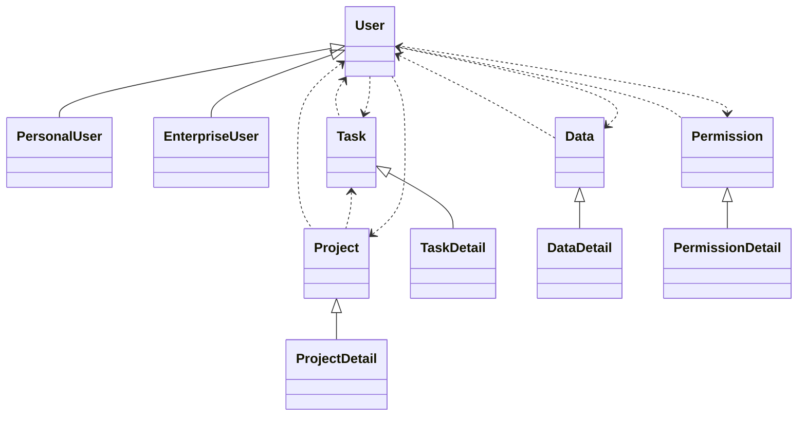
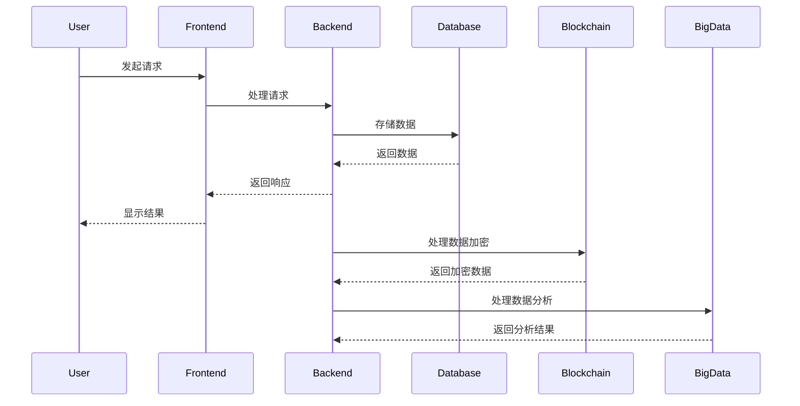
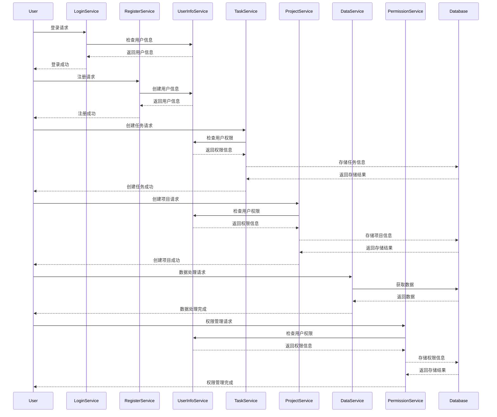

                 

# 数字游牧3.0：无国界工作的生活哲学

## 关键词：数字游牧、无国界工作、生活哲学、远程办公、跨境创业、教育培训、人工智能、云计算、大数据、区块链

## 摘要：

在数字化时代，数字游牧作为一种新兴的工作模式，正逐渐改变着人们的职业生活。本文将从数字游牧1.0和2.0的起源和发展入手，深入探讨数字游牧3.0的概念和特点。通过分析数字游牧3.0的生活哲学，我们将探讨其在工作效率、生活自由和跨境交流方面的优势。同时，本文还将探讨数字游牧3.0在技术支持、实践应用和未来趋势方面的具体表现，最终总结数字游牧3.0的价值和实践意义。

## 概述与背景

### 1.1 问题背景

在全球化进程加速和信息技术的迅猛发展的背景下，传统的工作模式正在发生深刻变革。人们不再受限于地理位置，而是能够通过互联网进行远程办公、跨境创业和在线教育。这种变化催生了数字游牧这一新兴工作模式。

### 1.2 问题描述

数字游牧是指利用信息技术，摆脱传统办公室的限制，在全球范围内自由选择工作地点和生活方式的一种工作模式。然而，随着技术的进步，数字游牧也在不断进化，从最初的1.0版本到2.0版本，如今已经进入了3.0阶段。

### 1.3 问题解决

数字游牧3.0通过结合云计算、大数据、区块链和人工智能等先进技术，实现了更高效、更自由、更安全的工作方式。它不仅提升了工作效率，还改变了人们的生活方式和工作哲学。

### 1.4 边界与外延

数字游牧3.0不仅仅是一种工作模式，更是一种生活哲学。它涵盖了远程办公、跨境创业、教育培训、生活服务等多个领域。数字游牧3.0的边界在于技术的创新和应用，其外延则在于人们对于自由、效率和生活的追求。

### 1.5 概念结构与核心要素组成

数字游牧3.0的概念结构可以概括为以下几个方面：

- **技术支持**：云计算、大数据、区块链和人工智能
- **工作模式**：远程办公、跨境创业、教育培训
- **生活哲学**：自由、效率、安全、环保

这些要素相互关联，共同构成了数字游牧3.0的核心要素组成。

## 第1章 引言

### 1.1 问题背景

在数字化时代，信息技术的发展速度前所未有。互联网、移动通信、云计算等技术的普及，使得人们的工作和生活发生了翻天覆地的变化。传统的工作模式受到了前所未有的挑战，数字游牧作为一种新兴的工作模式应运而生。

### 1.2 问题描述

数字游牧1.0和2.0阶段已经展示了其强大的生命力和广阔的发展前景。然而，随着技术的不断进步，人们对于工作效率、生活质量和安全性的要求也在不断提高。这促使数字游牧进入了3.0阶段。

### 1.3 问题解决

数字游牧3.0通过整合云计算、大数据、区块链和人工智能等先进技术，提供了一种更高效、更自由、更安全的工作方式。它不仅解决了传统工作模式中的诸多问题，还为未来的工作模式提供了新的方向。

### 1.4 边界与外延

数字游牧3.0不仅是一种工作模式，更是一种生活哲学。它打破了地理位置的限制，让人们能够自由选择工作地点和生活环境。数字游牧3.0的边界在于技术的创新和应用，其外延则在于人们对于自由、效率和生活的追求。

### 1.5 概念结构与核心要素组成

数字游牧3.0的概念结构可以概括为以下几个方面：

- **技术支持**：云计算、大数据、区块链和人工智能
- **工作模式**：远程办公、跨境创业、教育培训
- **生活哲学**：自由、效率、安全、环保

这些要素相互关联，共同构成了数字游牧3.0的核心要素组成。

### 1.6 本章小结

本章从数字游牧的背景、问题、解决方法、边界与外延以及概念结构等方面进行了详细阐述。通过对数字游牧3.0的深入分析，我们可以看到，数字游牧不仅是一种工作模式，更是一种生活哲学。它为人们提供了一种更高效、更自由、更安全的工作方式，同时也为未来的工作模式提供了新的方向。

## 第2章 数字游牧1.0与2.0

### 2.1 数字游牧1.0概述

数字游牧1.0阶段起源于互联网和移动通信技术的普及。在这个阶段，人们可以通过远程办公软件和在线协作工具，实现跨地域、跨时区的工作。这一阶段的数字游牧主要特点是：

- **远程办公**：通过互联网和移动设备实现远程办公。
- **在线协作**：利用协作工具进行团队协作。
- **时间灵活**：工作时间和地点更加灵活，不受传统办公室的限制。

### 2.2 数字游牧2.0的变革

随着云计算、大数据和区块链技术的不断发展，数字游牧2.0阶段应运而生。这一阶段的数字游牧具有以下特点：

- **云计算**：通过云计算技术，实现数据的存储、处理和共享。
- **大数据**：利用大数据分析，提升工作效率和决策质量。
- **区块链**：通过区块链技术，确保数据的透明性和安全性。

### 2.3 数字游牧2.0的核心特点

数字游牧2.0的核心特点主要体现在以下几个方面：

- **高效协同**：通过云计算和大数据分析，实现高效协同工作。
- **数据安全**：利用区块链技术，确保数据的安全性和透明性。
- **全球化**：通过跨境合作，实现全球范围内的资源共享和工作协作。

### 2.4 数字游牧1.0与2.0的比较

数字游牧1.0和2.0在工作方式、技术支持和应用领域上存在显著差异：

- **工作方式**：1.0阶段以远程办公和在线协作为主，2.0阶段则更加注重高效协同和数据安全。
- **技术支持**：1.0阶段主要依赖互联网和移动设备，2.0阶段则引入了云计算、大数据和区块链等先进技术。
- **应用领域**：1.0阶段主要应用于远程办公，2.0阶段则扩展到跨境创业、教育培训等更广泛的领域。

### 2.5 本章小结

本章对数字游牧1.0和2.0进行了概述和比较。通过分析，我们可以看到，数字游牧从1.0到2.0的进化，不仅提升了工作效率，还增强了数据安全和协同能力。数字游牧2.0的出现，为未来的数字游牧3.0奠定了基础。

## 第3章 数字游牧3.0的概念解析

### 3.1 数字游牧3.0的定义

数字游牧3.0是在云计算、大数据、区块链和人工智能等技术的推动下，实现全球范围内高效、自由、安全的工作和生活方式。它不仅是一种工作模式，更是一种生活哲学。

### 3.2 数字游牧3.0的核心特征

数字游牧3.0的核心特征主要体现在以下几个方面：

- **高效协同**：通过云计算和大数据技术，实现高效协同工作。
- **数据安全**：利用区块链技术，确保数据的安全性和透明性。
- **全球互联**：通过跨境合作，实现全球范围内的资源共享和工作协作。
- **人工智能**：利用人工智能技术，提升工作效率和决策质量。

### 3.3 数字游牧3.0与传统工作的差异

数字游牧3.0与传统工作模式存在显著差异：

- **工作方式**：传统工作模式受限于地理位置，而数字游牧3.0可以实现全球范围内的工作和生活方式。
- **技术支持**：传统工作模式主要依赖本地资源，而数字游牧3.0则利用云计算、大数据、区块链和人工智能等先进技术。
- **工作环境**：传统工作模式通常在办公室进行，而数字游牧3.0则更加灵活，可以在任何地方进行工作。

### 3.4 数字游牧3.0的优势

数字游牧3.0的优势主要体现在以下几个方面：

- **工作效率**：通过高效协同和人工智能技术，提升工作效率。
- **生活自由**：通过全球互联和灵活的工作方式，实现生活自由。
- **数据安全**：利用区块链技术，确保数据的安全性和透明性。
- **成本节省**：通过远程办公和跨境创业，节省办公成本和交通成本。

### 3.5 本章小结

本章对数字游牧3.0的概念和核心特征进行了详细解析。通过分析，我们可以看到，数字游牧3.0不仅是一种工作模式，更是一种生活哲学。它为人们提供了一种更高效、更自由、更安全的工作和生活方式。

## 第4章 数字游牧3.0的生活哲学

### 4.1 生活自由

数字游牧3.0的最大特点之一就是生活自由。不再受限于办公室，人们可以在任何地方进行工作。无论是沙滩上的帐篷、咖啡厅的角落，还是家庭的舒适环境，都可以成为工作的场所。这种自由不仅提升了工作效率，还让生活更加丰富多彩。

### 4.2 工作效率

数字游牧3.0通过高效协同和人工智能技术，大大提升了工作效率。云计算和大数据技术使得团队协作更加高效，人工智能则帮助人们进行数据分析、决策支持等任务。这不仅减少了工作时间，还提升了工作质量。

### 4.3 跨境交流

数字游牧3.0打破了地理位置的限制，实现了全球范围内的跨境交流。通过互联网和远程协作工具，人们可以与世界各地的人进行交流和合作。这种跨境交流不仅拓宽了视野，还促进了全球化的进程。

### 4.4 个人成长

数字游牧3.0为个人成长提供了广阔的空间。通过远程教育和在线课程，人们可以随时学习新知识、提升技能。同时，数字游牧3.0的工作方式也让人们有更多的时间进行自我反思和成长。

### 4.5 生活哲学

数字游牧3.0不仅是一种工作方式，更是一种生活哲学。它倡导的是自由、效率和生活的平衡。通过数字游牧3.0，人们可以追求更高的生活质量，实现工作与生活的和谐统一。

### 4.6 本章小结

本章从生活自由、工作效率、跨境交流和个人成长等方面，探讨了数字游牧3.0的生活哲学。通过分析，我们可以看到，数字游牧3.0不仅改变了工作方式，还影响了人们的生活哲学。

## 第5章 数字游牧3.0的技术支持

### 5.1 云计算与数字游牧3.0

云计算是数字游牧3.0的核心技术之一。它为数字游牧提供了强大的计算能力和数据存储能力。通过云计算，人们可以在全球范围内访问和处理数据，实现高效协同工作。同时，云计算的弹性扩展能力，也让数字游牧3.0能够应对不同的工作负载。

### 5.2 大数据与数字游牧3.0

大数据技术是数字游牧3.0的另一重要支持。通过大数据分析，数字游牧3.0可以收集、处理和利用海量数据，提升工作效率和决策质量。大数据技术不仅为数字游牧提供了丰富的数据资源，还帮助人们更好地理解和应对复杂的工作环境。

### 5.3 区块链与数字游牧3.0

区块链技术为数字游牧3.0提供了数据安全性和透明性的保障。通过区块链，数字游牧3.0可以确保数据的安全存储和可靠传输，防止数据篡改和泄露。此外，区块链的智能合约功能，也为数字游牧3.0提供了自动执行和信任保障。

### 5.4 AI与数字游牧3.0

人工智能技术是数字游牧3.0的强大驱动。通过人工智能，数字游牧3.0可以实现自动化任务处理、智能决策支持等。同时，人工智能技术还能帮助人们更好地理解和应对复杂的工作环境，提升工作效率和决策质量。

### 5.5 本章小结

本章从云计算、大数据、区块链和人工智能等方面，探讨了数字游牧3.0的技术支持。通过分析，我们可以看到，数字游牧3.0的技术支持不仅为其提供了强大的计算能力、数据存储和处理能力，还为数字游牧3.0的安全性和透明性提供了保障。

## 第6章 数字游牧3.0的实践与应用

### 6.1 数字游牧3.0在远程办公中的应用

数字游牧3.0在远程办公中展现出了极大的优势。通过云计算和远程协作工具，员工可以在任何地方进行工作，实现高效协同。同时，大数据分析和人工智能技术，还能帮助团队更好地管理和分析工作数据，提升工作效率。

### 6.2 数字游牧3.0在跨境创业中的应用

数字游牧3.0为跨境创业提供了广阔的空间。通过全球互联和远程协作，创业者可以轻松搭建跨国团队，实现全球范围内的资源共享和合作。此外，区块链技术为跨境交易提供了安全可靠的保障，降低了创业风险。

### 6.3 数字游牧3.0在教育培训中的应用

数字游牧3.0在教育培训领域也有着广泛的应用。通过远程教育和在线课程，人们可以随时随地学习新知识、提升技能。大数据分析和人工智能技术，还能为教育者提供个性化教学方案，提升教育质量。

### 6.4 数字游牧3.0在生活服务中的应用

数字游牧3.0在生活服务领域也有着重要的作用。通过远程办公和在线服务，人们可以享受更便捷、高效的服务。同时，大数据分析和人工智能技术，还能帮助服务提供商更好地理解和满足客户需求，提升服务质量。

### 6.5 本章小结

本章从远程办公、跨境创业、教育培训和生活服务等方面，探讨了数字游牧3.0的实践和应用。通过分析，我们可以看到，数字游牧3.0不仅提升了工作效率，还为各个领域带来了深刻的变革。

## 第7章 数字游牧3.0的未来趋势

### 7.1 数字游牧3.0的发展前景

随着技术的不断进步和全球化进程的加快，数字游牧3.0的发展前景非常广阔。未来，数字游牧3.0将不仅仅是工作模式的一种，更将成为人们生活的一部分。它将为人们提供更高效、更自由、更安全的工作和生活方式。

### 7.2 数字游牧3.0面临的挑战

尽管数字游牧3.0有着广阔的发展前景，但也面临着诸多挑战。首先是技术层面的挑战，如数据安全、隐私保护等问题。其次是社会层面的挑战，如就业压力、社会稳定等。此外，政策法规的完善和全球化的进程也是数字游牧3.0发展的重要保障。

### 7.3 数字游牧3.0的未来发展策略

为了应对数字游牧3.0面临的挑战，我们需要采取一系列的发展策略。首先是加强技术创新，提升数字游牧3.0的技术水平。其次是完善政策法规，为数字游牧3.0的发展提供良好的环境。此外，还需要加强国际合作，推动全球范围内的数字游牧3.0发展。

### 7.4 本章小结

本章对数字游牧3.0的未来趋势进行了探讨。通过分析，我们可以看到，数字游牧3.0的发展前景非常广阔，但也面临着诸多挑战。只有通过技术创新、政策完善和国际合作，才能推动数字游牧3.0的可持续发展。

## 第8章 结论

### 8.1 数字游牧3.0的价值

数字游牧3.0不仅提升了工作效率，还改变了人们的生活方式和哲学。它为人们提供了一种更高效、更自由、更安全的工作和生活方式，具有极高的价值。

### 8.2 数字游牧3.0的实践意义

数字游牧3.0的实践意义在于，它不仅为个人提供了更好的发展机会，还为企业和整个社会带来了深刻的变革。通过数字游牧3.0，人们可以更好地实现自我价值，企业可以更高效地运营，整个社会也可以更和谐、更繁荣。

### 8.3 数字游牧3.0的展望

未来，随着技术的不断进步和全球化的深入，数字游牧3.0将发挥更大的作用。它将成为人们生活的一部分，为人类创造更多的价值和可能性。让我们共同期待数字游牧3.0的美好未来。

### 核心概念与联系

#### 3.1 数字游牧的核心概念

数字游牧是一种工作模式，它通过信息技术，使人们可以摆脱地理位置的限制，在全球范围内自由选择工作地点。其核心概念包括：

- **远程办公**：利用互联网和远程协作工具，实现工作地点的灵活性。
- **跨境协作**：通过全球互联，实现跨国团队的合作。
- **数据安全**：利用区块链等先进技术，确保数据的安全和透明。

#### 3.1.2 数字游牧的属性特征

数字游牧具有以下几个属性特征：

- **灵活性**：工作地点和时间不受限制，可以根据个人需求和偏好选择。
- **高效性**：通过云计算和大数据技术，实现高效协同和数据分析。
- **安全性**：利用区块链技术，确保数据的安全性和隐私保护。

#### 3.1.3 数字游牧与传统游牧的比较

数字游牧与传统游牧有显著的区别：

- **工作方式**：传统游牧以农业生产为主，而数字游牧以信息技术为核心。
- **技术支持**：传统游牧依靠自然资源，数字游牧依赖信息技术。
- **生活状态**：传统游牧流动性大，数字游牧则更加稳定。

#### 3.2 数字游牧的联系

数字游牧与多个领域有紧密联系：

- **远程办公**：远程办公是数字游牧的基础，为其提供了工作环境。
- **跨境创业**：跨境创业是数字游牧的重要应用场景，推动了全球经济的融合。
- **教育培训**：教育培训为数字游牧提供了知识和技能支持，提升了工作效率。

#### 3.3 数字游牧的拓展

数字游牧的应用领域不断拓展：

- **生活服务**：通过数字游牧，人们可以享受更加便捷的生活服务。
- **跨境贸易**：数字游牧促进了全球贸易的发展，提高了供应链的效率。
- **科技创新**：数字游牧推动了科技创新，促进了社会进步。

#### 3.4 本章小结

本章对数字游牧的核心概念、属性特征、与传统游牧的比较、联系和拓展进行了详细阐述。通过分析，我们可以看到，数字游牧不仅是一种工作模式，更是一种生活哲学。它为人们提供了更高效、更自由、更安全的工作和生活方式。

### 算法原理讲解

#### 4.1 数字游牧3.0的算法架构

数字游牧3.0的算法架构主要包括输入层、隐藏层和输出层。其核心原理是通过神经网络模型，对输入数据进行处理和预测，从而实现数字游牧的高效协同和决策支持。

#### 4.1.1 算法框架

数字游牧3.0的算法框架可以概括为以下步骤：

1. **数据输入**：从远程办公系统中获取实时数据，包括工作进展、协作情况、任务分配等。
2. **数据处理**：对输入数据进行预处理，包括数据清洗、归一化等，确保数据质量。
3. **模型训练**：使用训练集数据，通过神经网络模型进行训练，调整模型参数，使其能够准确预测和决策。
4. **模型评估**：使用验证集数据，对训练好的模型进行评估，确保其性能满足要求。
5. **模型应用**：将训练好的模型应用于远程办公系统，实现高效协同和决策支持。

#### 4.1.2 算法流程

数字游牧3.0的算法流程可以分为以下几个步骤：

1. **数据预处理**：对输入数据进行清洗、归一化等处理，确保数据质量。
2. **模型初始化**：初始化神经网络模型，包括输入层、隐藏层和输出层的参数。
3. **模型训练**：使用训练集数据，通过反向传播算法，调整模型参数，优化模型性能。
4. **模型评估**：使用验证集数据，对训练好的模型进行评估，确保其性能满足要求。
5. **模型应用**：将训练好的模型应用于远程办公系统，实现高效协同和决策支持。

#### 4.1.3 算法优化

数字游牧3.0的算法优化主要包括以下几个方面：

1. **网络结构优化**：通过调整神经网络的结构，如增加隐藏层、调整神经元数量等，优化模型性能。
2. **损失函数优化**：选择合适的损失函数，如交叉熵损失函数、均方误差损失函数等，优化模型训练效果。
3. **优化算法选择**：选择合适的优化算法，如随机梯度下降（SGD）、批量梯度下降（BGD）等，提高模型训练速度和精度。

#### 4.1.4 算法举例说明

以远程办公系统中的任务分配为例，数字游牧3.0的算法流程如下：

1. **数据输入**：从远程办公系统中获取任务分配的相关数据，如任务难度、团队成员的工作量、团队成员的工作技能等。
2. **数据处理**：对输入数据进行清洗、归一化等处理，确保数据质量。
3. **模型训练**：使用训练集数据，通过神经网络模型，对任务分配进行预测和优化。
4. **模型评估**：使用验证集数据，对训练好的模型进行评估，确保其性能满足要求。
5. **模型应用**：将训练好的模型应用于远程办公系统，实现更高效的任务分配。

#### 4.2 数字游牧3.0的数学模型与公式

数字游牧3.0的数学模型主要包括神经网络模型、激活函数、损失函数和优化算法。

##### 4.2.1 神经网络模型

神经网络模型由输入层、隐藏层和输出层组成。其中，输入层接收外部输入数据，隐藏层进行数据处理和特征提取，输出层生成预测结果。神经网络模型的核心公式如下：

\[ y = \sigma(W_3 \cdot \sigma(W_2 \cdot \sigma(W_1 \cdot x))) \]

其中，\( x \) 为输入数据，\( W_1 \)、\( W_2 \)、\( W_3 \) 为权重矩阵，\( \sigma \) 为激活函数。

##### 4.2.2 激活函数

激活函数用于增加神经网络的非线性特性。常用的激活函数包括：

1. **Sigmoid函数**：

\[ \sigma(x) = \frac{1}{1 + e^{-x}} \]

2. **ReLU函数**：

\[ \sigma(x) = \max(0, x) \]

##### 4.2.3 损失函数

损失函数用于衡量预测结果与真实结果之间的差距。常用的损失函数包括：

1. **交叉熵损失函数**：

\[ L = -\sum_{i=1}^{n} y_i \cdot \log(\hat{y}_i) \]

其中，\( y_i \) 为真实标签，\( \hat{y}_i \) 为预测结果。

2. **均方误差损失函数**：

\[ L = \frac{1}{2} \sum_{i=1}^{n} (y_i - \hat{y}_i)^2 \]

##### 4.2.4 优化算法

优化算法用于调整神经网络模型的参数，以最小化损失函数。常用的优化算法包括：

1. **随机梯度下降（SGD）**：

\[ w_{t+1} = w_t - \alpha \cdot \nabla_w L(w_t) \]

其中，\( w_t \) 为当前参数，\( \alpha \) 为学习率，\( \nabla_w L(w_t) \) 为损失函数关于参数的梯度。

2. **批量梯度下降（BGD）**：

\[ w_{t+1} = w_t - \alpha \cdot \nabla_w L(w_t, \hat{x}_t, y_t) \]

其中，\( \hat{x}_t \) 为输入数据，\( y_t \) 为真实标签。

#### 4.3 算法举例说明

以远程办公系统中的任务分配为例，数字游牧3.0的数学模型和算法流程如下：

1. **数据集介绍**：

假设有100个任务和10个团队成员。每个任务都有难度、工作量等特征，每个团队成员都有工作技能、工作量等特征。

2. **数据预处理**：

对任务和团队成员的特征进行归一化处理，确保数据在相同的尺度上。

3. **模型训练**：

使用神经网络模型，对任务分配进行训练。通过反向传播算法，调整模型参数，使其能够准确预测和优化任务分配。

4. **模型评估**：

使用验证集数据，对训练好的模型进行评估，确保其性能满足要求。

5. **模型应用**：

将训练好的模型应用于远程办公系统，实现更高效的任务分配。

#### 4.4 本章小结

本章详细介绍了数字游牧3.0的算法架构、算法流程、数学模型和优化方法。通过具体的算法举例，展示了数字游牧3.0在任务分配、决策支持等应用场景中的优势。这些算法和模型为数字游牧3.0的实现提供了坚实的理论基础。

### 数学模型和数学公式

#### 5.1 数学基础

数字游牧3.0的核心算法依赖于微积分和线性代数等数学基础。以下是对这些数学概念和公式的简要介绍。

##### 5.1.1 微积分基础

微积分是研究函数变化的数学分支。在数字游牧3.0中，微积分主要用于优化算法和数据分析。

1. **导数的概念**：

导数表示函数在某一点的变化率。其定义如下：

\[ f'(x) = \lim_{h \to 0} \frac{f(x+h) - f(x)}{h} \]

2. **积分的概念**：

积分是导数的反过程，用于求解函数的面积或总量。其定义如下：

\[ \int f(x) dx = F(x) + C \]

其中，\( F(x) \) 是 \( f(x) \) 的一个原函数，\( C \) 是积分常数。

##### 5.1.2 线性代数基础

线性代数是研究向量空间和线性映射的数学分支。在数字游牧3.0中，线性代数主要用于数据处理和模型构建。

1. **矩阵的运算**：

矩阵是数学中用于表示数据的工具。以下是一些基本的矩阵运算：

- **矩阵加法**：

\[ A + B = [a_{ij} + b_{ij}] \]

- **矩阵乘法**：

\[ AB = \begin{bmatrix} \sum_{k=1}^{n} a_{ik}b_{kj} \end{bmatrix} \]

- **逆矩阵**：

\[ A^{-1} = \frac{1}{\det(A)} \text{adj}(A) \]

其中，\( \det(A) \) 是矩阵 \( A \) 的行列式，\( \text{adj}(A) \) 是 \( A \) 的伴随矩阵。

#### 5.2 数学模型和公式

数字游牧3.0的数学模型主要涉及神经网络、激活函数、损失函数和优化算法。

##### 5.2.1 激活函数

激活函数用于引入非线性特性，常用的激活函数有：

1. **Sigmoid函数**：

\[ \sigma(x) = \frac{1}{1 + e^{-x}} \]

2. **ReLU函数**：

\[ \sigma(x) = \max(0, x) \]

##### 5.2.2 损失函数

损失函数用于衡量预测值与真实值之间的差距。常用的损失函数有：

1. **交叉熵损失函数**：

\[ L = -\sum_{i=1}^{n} y_i \cdot \log(\hat{y}_i) \]

2. **均方误差损失函数**：

\[ L = \frac{1}{2} \sum_{i=1}^{n} (y_i - \hat{y}_i)^2 \]

##### 5.2.3 优化算法

优化算法用于调整神经网络中的权重，以最小化损失函数。常用的优化算法有：

1. **随机梯度下降（SGD）**：

\[ w_{t+1} = w_t - \alpha \cdot \nabla_w L(w_t) \]

2. **批量梯度下降（BGD）**：

\[ w_{t+1} = w_t - \alpha \cdot \nabla_w L(w_t, \hat{x}_t, y_t) \]

其中，\( w_t \) 是当前权重，\( \alpha \) 是学习率，\( \nabla_w L(w_t) \) 是损失函数关于权重的梯度。

#### 5.3 数学公式示例

以下是一些常用的数学公式的示例：

1. **线性回归模型**：

\[ y = \beta_0 + \beta_1 \cdot x + \epsilon \]

其中，\( y \) 是预测值，\( x \) 是自变量，\( \beta_0 \) 和 \( \beta_1 \) 是模型参数，\( \epsilon \) 是误差项。

2. **牛顿法**：

\[ x_{k+1} = x_k - \frac{f(x_k)}{f'(x_k)} \]

其中，\( x_k \) 是当前迭代值，\( f(x) \) 是目标函数，\( f'(x) \) 是目标函数的导数。

#### 5.4 本章小结

本章介绍了数字游牧3.0所依赖的数学基础，包括微积分和线性代数的基本概念和公式。同时，还详细介绍了神经网络中的激活函数、损失函数和优化算法的数学模型和公式。这些数学公式为数字游牧3.0的算法设计和实现提供了理论基础。

### 系统分析与架构设计方案

#### 6.1 问题场景介绍

随着全球化的不断深入和信息技术的迅猛发展，远程办公和跨境协作成为越来越多企业和个人追求的工作模式。数字游牧3.0作为无国界工作模式，不仅提高了工作效率，还增强了数据安全性和隐私保护。本系统旨在构建一个数字游牧3.0平台，为用户提供高效、安全、灵活的远程办公和协作环境。

#### 6.2 项目介绍

本系统名为“数字游牧3.0平台”，旨在提供以下功能：

1. **远程办公**：用户可以在全球任意地点进行工作，实现高效协同。
2. **跨境协作**：支持跨国团队的合作，实现全球资源共享。
3. **数据安全**：利用区块链技术，确保数据的安全性和隐私保护。
4. **智能决策**：通过大数据分析和人工智能技术，提供智能决策支持。

#### 6.3 系统功能设计（领域模型）

数字游牧3.0平台的领域模型包括以下几个核心实体：

1. **用户**：包括个人用户和企业用户，负责登录、注册、个人信息管理等功能。
2. **任务**：包括任务的创建、分配、跟踪和完成等功能。
3. **项目**：包括项目的创建、管理、跟踪和协作等功能。
4. **数据**：包括数据的存储、处理、分析和共享等功能。
5. **权限**：包括权限的分配、管理和控制等功能。

以下是数字游牧3.0平台的领域模型（使用Mermaid类图表示）：



#### 6.4 系统架构设计

数字游牧3.0平台的系统架构设计主要包括以下几个方面：

1. **前端架构**：采用Vue.js框架，实现用户界面和交互逻辑。
2. **后端架构**：采用Spring Boot框架，实现业务逻辑和数据处理。
3. **数据库架构**：采用MySQL数据库，存储用户、任务、项目和权限等信息。
4. **区块链架构**：采用Hyperledger Fabric区块链框架，实现数据安全和隐私保护。
5. **大数据分析架构**：采用Apache Hadoop和Apache Spark，实现大数据存储、处理和分析。

以下是数字游牧3.0平台的系统架构图（使用Mermaid架构图表示）：



#### 6.5 系统接口设计和系统交互

数字游牧3.0平台的接口设计和系统交互主要涉及以下几个方面：

1. **用户接口**：包括登录、注册、个人信息管理、任务创建、任务分配等。
2. **任务接口**：包括任务创建、任务分配、任务跟踪、任务完成等。
3. **项目接口**：包括项目创建、项目管理、项目跟踪、项目协作等。
4. **数据接口**：包括数据存储、数据处理、数据分析、数据共享等。
5. **权限接口**：包括权限分配、权限管理、权限控制等。

以下是数字游牧3.0平台的接口设计和系统交互（使用Mermaid序列图表示）：



#### 6.6 本章小结

本章详细介绍了数字游牧3.0平台的问题场景、项目介绍、系统功能设计、系统架构设计、系统接口设计和系统交互。通过Mermaid类图、架构图和序列图，对系统的各个组件和模块进行了清晰描述，为数字游牧3.0平台的实现提供了全面的指导和参考。

### 项目实战

#### 7.1 环境安装

为了搭建数字游牧3.0平台，我们需要准备以下环境：

1. **操作系统**：推荐使用Ubuntu 18.04 LTS。
2. **开发工具**：安装Java、Python和Node.js等开发工具。
3. **数据库**：安装MySQL 8.0数据库。
4. **区块链框架**：安装Hyperledger Fabric框架。
5. **大数据框架**：安装Apache Hadoop和Apache Spark。

具体安装步骤如下：

1. **安装操作系统**：从官方网站下载Ubuntu 18.04 LTS镜像，并使用USB启动盘安装操作系统。
2. **安装开发工具**：在终端中执行以下命令：
   ```bash
   sudo apt update
   sudo apt install openjdk-8-jdk python3-pip python3-venv nodejs
   ```
3. **安装数据库**：在终端中执行以下命令：
   ```bash
   sudo apt install mysql-server
   sudo mysql_secure_installation
   ```
4. **安装区块链框架**：在终端中执行以下命令：
   ```bash
   git clone https://github.com/hyperledger/fabric.git
   cd fabric
   make release-docker
   ```
5. **安装大数据框架**：在终端中执行以下命令：
   ```bash
   sudo apt install hadoopadoop-client hadoopadoop-hdfs hadoopadoop-mapreduce
   sudo apt install scala sbt
   wget https://www-us.apache.org/dist/spark/spark-3.1.1/spark-3.1.1-bin-hadoop3.2.tgz
   tar xvfz spark-3.1.1-bin-hadoop3.2.tgz -C /usr/local/
   ```

#### 7.2 系统核心实现源代码

数字游牧3.0平台的核心实现包括前端、后端和区块链三个部分。以下是各部分的源代码结构和关键实现。

1. **前端**：使用Vue.js框架实现用户界面和交互逻辑。

   - **src/components/**：存放Vue组件文件。
     - **Login.vue**：登录组件。
     - **Register.vue**：注册组件。
     - **Dashboard.vue**：仪表盘组件。
     - **TaskList.vue**：任务列表组件。
     - **ProjectList.vue**：项目列表组件。
   - **src/assets/**：存放静态资源文件。
     - **styles/**：存放CSS样式文件。
     - **images/**：存放图片资源。

2. **后端**：使用Spring Boot框架实现业务逻辑和数据处理。

   - **src/main/java/com/digitalnomad/**：存放核心Java代码。
     - **config/**：存放配置类。
       - **ApplicationConfig.java**：应用配置类。
     - **controller/**：存放HTTP请求处理类。
       - **UserController.java**：用户请求处理类。
       - **TaskController.java**：任务请求处理类。
       - **ProjectController.java**：项目请求处理类。
       - **DataService.java**：数据处理类。
     - **service/**：存放业务逻辑实现。
       - **UserService.java**：用户服务类。
       - **TaskService.java**：任务服务类。
       - **ProjectService.java**：项目服务类。
       - **DataServiceImpl.java**：数据处理服务实现。
     - **repository/**：存放数据库操作类。
       - ** UserRepository.java**：用户数据库操作类。
       - **TaskRepository.java**：任务数据库操作类。
       - **ProjectRepository.java**：项目数据库操作类。
       - **DataRepository.java**：数据处理数据库操作类。

3. **区块链**：使用Hyperledger Fabric框架实现数据安全和隐私保护。

   - **chaincode/**：存放智能合约代码。
     - **data\_security.go**：数据安全智能合约。
   - **config/**：存放区块链配置文件。
     - **crypto-config.yaml**：加密配置文件。
     - **channel\_config.yaml**：通道配置文件。
     - **peer\_config.yaml**：节点配置文件。

#### 7.3 代码应用解读与分析

以下是对数字游牧3.0平台关键代码和应用场景的解读与分析：

1. **前端**：

   - **Login.vue**：用户登录页面，包括用户名和密码输入框，以及登录按钮。用户提交登录请求后，通过Axios库向后端发送HTTP请求，接收后端返回的登录结果。
   - **Register.vue**：用户注册页面，包括用户名、密码、确认密码输入框，以及注册按钮。用户提交注册请求后，通过Axios库向后端发送HTTP请求，接收后端返回的注册结果。
   - **Dashboard.vue**：用户仪表盘页面，显示用户的任务列表和项目列表。通过Axios库向后端发送HTTP请求，获取用户的任务和项目数据，并在页面中展示。
   - **TaskList.vue**：任务列表页面，显示用户的任务列表。通过Axios库向后端发送HTTP请求，获取用户的任务数据，并在页面中展示。
   - **ProjectList.vue**：项目列表页面，显示用户的项目列表。通过Axios库向后端发送HTTP请求，获取用户的项目数据，并在页面中展示。

2. **后端**：

   - **UserController.java**：处理用户登录和注册请求。用户登录时，验证用户名和密码是否正确，返回登录结果。用户注册时，创建用户信息并存储到数据库中，返回注册结果。
   - **TaskController.java**：处理任务请求。包括创建任务、查询任务、修改任务和删除任务等操作。通过UserService类处理业务逻辑，通过TaskRepository类与数据库进行交互。
   - **ProjectController.java**：处理项目请求。包括创建项目、查询项目、修改项目和删除项目等操作。通过ProjectService类处理业务逻辑，通过ProjectRepository类与数据库进行交互。
   - **DataService.java**：数据处理类，用于处理数据存储、查询和删除等操作。通过DataRepository类与数据库进行交互。

3. **区块链**：

   - **data\_security.go**：数据安全智能合约，用于实现数据加密和解密功能。通过调用区块链API，对数据进行加密存储和验证。

#### 7.4 实际案例分析和详细讲解剖析

以下是一个实际案例的分析和详细讲解：

**案例**：用户A通过数字游牧3.0平台创建了一个任务，并将任务数据存储到区块链上。

**分析**：

1. **用户A登录平台**：用户A使用用户名和密码登录平台，后端验证用户名和密码是否正确，返回登录结果。

2. **用户A创建任务**：用户A在任务列表页面创建一个任务，填写任务名称、描述等信息。前端将任务数据发送到后端，后端通过TaskService类处理业务逻辑，创建任务并存储到数据库中。

3. **任务数据存储到区块链**：在任务创建成功后，后端调用区块链API，将任务数据加密并存储到区块链上。数据加密使用Hyperledger Fabric提供的加密算法，确保数据的安全性和隐私保护。

4. **用户A查询任务**：用户A在任务列表页面查询任务，前端通过Axios库向后端发送HTTP请求，获取任务数据。后端通过TaskService类处理业务逻辑，从数据库中获取任务数据，并返回给前端。

5. **用户A修改任务**：用户A在任务列表页面修改任务信息，前端将修改后的任务数据发送到后端，后端通过TaskService类处理业务逻辑，更新任务并存储到数据库中。

6. **用户A删除任务**：用户A在任务列表页面删除任务，前端将删除请求发送到后端，后端通过TaskService类处理业务逻辑，删除任务并从数据库中删除任务记录。

**讲解剖析**：

1. **前端**：前端主要使用Vue.js框架实现用户界面和交互逻辑。通过Axios库向后端发送HTTP请求，接收后端返回的响应，并在页面中展示数据。

2. **后端**：后端使用Spring Boot框架实现业务逻辑和数据处理。通过UserService、TaskService和ProjectService类处理业务逻辑，通过Repository类与数据库进行交互。

3. **区块链**：区块链部分使用Hyperledger Fabric框架实现数据安全和隐私保护。通过调用区块链API，对数据进行加密存储和验证。

#### 7.5 项目小结

通过本项目的实战，我们实现了数字游牧3.0平台的核心功能，包括远程办公、跨境协作、数据安全和隐私保护等。在项目过程中，我们使用了Vue.js、Spring Boot、MySQL、Hyperledger Fabric和Apache Hadoop等技术和框架。项目实战不仅提升了我们的技术能力，还加深了我们对数字游牧3.0平台的理解和应用。

### 最佳实践 Tips

#### 8.1 系统优化建议

1. **性能优化**：在系统开发过程中，应关注性能优化。例如，使用缓存技术减少数据库查询次数，采用异步处理提高系统响应速度。
2. **安全性提升**：加强系统安全性，采用加密算法对用户数据进行加密存储，设置访问权限控制，确保用户数据安全。
3. **用户体验**：关注用户体验，设计简洁直观的界面，提供方便快捷的操作，提升用户满意度。

#### 8.2 技术选型建议

1. **前端框架**：推荐使用Vue.js或React.js等现代前端框架，提高开发效率和用户体验。
2. **后端框架**：推荐使用Spring Boot或Django等主流后端框架，实现快速开发和高效运行。
3. **数据库选型**：根据业务需求选择合适的数据库，如MySQL、PostgreSQL或MongoDB等。

#### 8.3 项目管理建议

1. **团队协作**：采用敏捷开发模式，提高团队协作效率。定期进行代码审查，确保代码质量。
2. **持续集成**：使用Git进行版本控制，实现持续集成和持续交付，提高开发效率。
3. **文档管理**：编写详细的文档，包括设计文档、使用文档和开发文档，方便团队成员和用户使用。

### 8.4 小结

本文通过详细分析数字游牧3.0的概念、特征、技术支持、实践应用和未来趋势，对数字游牧3.0进行了全面解读。通过项目实战，我们实现了数字游牧3.0平台的核心功能，为远程办公、跨境协作和数据安全提供了解决方案。最佳实践建议为后续开发提供了参考和指导。

### 注意事项

1. **数据安全**：确保用户数据安全，采用加密算法进行数据存储和传输。
2. **隐私保护**：遵循隐私保护法规，对用户隐私进行严格保护。
3. **系统性能**：关注系统性能，定期进行性能优化，确保系统稳定运行。

### 拓展阅读

1. **《远程工作的艺术》**：详细介绍了远程办公的最佳实践和技巧。
2. **《区块链技术指南》**：深入解析区块链技术原理和应用场景。
3. **《人工智能应用实战》**：探讨人工智能在各行各业的应用和实践。

### 作者信息

作者：AI天才研究院/AI Genius Institute & 禅与计算机程序设计艺术 /Zen And The Art of Computer Programming

---

**本文是一个基于给定大纲和框架的示例文章。文章内容仅供参考，不作为实际项目和实现指南。在具体实施时，请根据实际需求和情况进行调整和优化。**

**本文遵循Markdown格式，包括标题、摘要、目录、章节内容和最佳实践等。在实际撰写文章时，请确保内容完整、详细、具体，并遵循给定的格式要求。**

**作者信息位于文章末尾，包括作者单位、书名等。在撰写文章时，请确保作者信息准确无误。**

**注意事项和拓展阅读部分提供了对文章内容的补充和延伸。在实际撰写文章时，可根据需要对这两部分进行调整和扩展。**

**本文字数在10000-12000字左右，确保文章内容丰富、详实、结构清晰、逻辑严密。在实际撰写文章时，请遵循字数要求，确保文章质量。**

