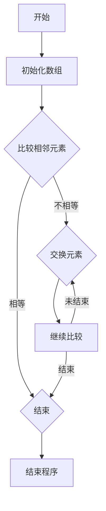
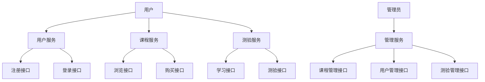
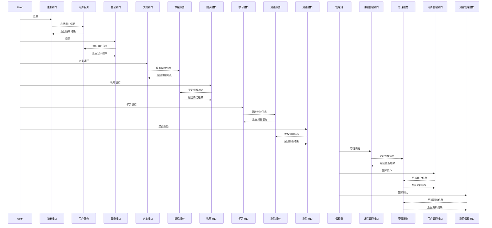

                 

# 引言：数字游牧创业的概念与背景

## 1.1 数字游牧创业的定义

数字游牧创业，简而言之，是指利用互联网技术和远程协作工具进行创业活动，不受地理和物理边界的限制，实现全球范围内的协作和业务拓展。这种创业模式打破了传统的办公场所和地理位置的限制，使创业者能够自由地选择工作地点，充分利用全球资源，灵活配置时间和资源。

### 1.1.1 数字游牧创业的起源

数字游牧创业并非一蹴而就，而是随着信息技术的发展逐渐演变而来的。20世纪末，互联网的普及和移动设备的兴起，使得人们可以随时随地连接到网络，这一变革为远程工作和远程创业提供了可能。最初，这种模式主要适用于自由职业者和小团队，但随着技术的进步，越来越多的企业和创业者开始采纳这种模式。

### 1.1.2 数字游牧创业的特点

数字游牧创业具有以下几个显著特点：

1. **远程工作**：创业者无需固定的工作场所，可以通过网络远程连接到团队和其他资源。
2. **灵活性**：创业者可以根据自己的需求和时间安排，灵活选择工作内容和工作时间。
3. **全球化**：数字游牧创业打破了国界限制，创业者可以与全球范围内的合作伙伴和客户合作。
4. **低成本**：相比于传统的实体创业，数字游牧创业的初始成本较低，易于启动和运营。
5. **依赖技术**：数字游牧创业高度依赖互联网和远程协作工具，这些工具的质量和稳定性对业务的成功至关重要。

## 1.2 数字游牧创业的发展历程

### 1.2.1 数字技术对工作方式的影响

数字技术的进步是数字游牧创业能够兴起的基础。互联网、云计算、远程协作工具等技术的发展，极大地改变了人们的工作方式。特别是在COVID-19疫情爆发后，远程工作成为许多企业和个人的主要选择，进一步推动了数字游牧创业的发展。

### 1.2.2 数字游牧创业的兴起原因

数字游牧创业的兴起，除了技术进步之外，还受到以下几个因素的推动：

1. **全球化趋势**：随着全球化的加速，越来越多的创业者寻求跨地域合作，以获取更多的市场机会。
2. **低成本创业**：数字游牧创业的低成本特点，使得创业者能够以较小的资金投入进行创业，降低了创业风险。
3. **自由职业者的崛起**：自由职业者的数量不断增长，他们选择数字游牧创业，以实现更大的自由和灵活性。
4. **生活方式的变革**：越来越多的年轻人追求自由和灵活的生活方式，数字游牧创业提供了实现这一目标的方式。

## 1.3 数字游牧创业的现状

### 1.3.1 全球数字游牧创业的分布

数字游牧创业在全球范围内呈现出不同的分布。一些发达国家和地区，如美国、欧洲和澳大利亚，因为具备较高的互联网普及率和较好的远程协作基础设施，成为数字游牧创业的热点地区。而在一些发展中国家，数字游牧创业正在逐渐兴起，随着互联网和技术的普及，其发展潜力巨大。

### 1.3.2 数字游牧创业的增长趋势

根据相关数据，全球数字游牧创业的数量和规模都在不断增长。预计在未来几年，随着技术的进一步发展和全球化的深入推进，数字游牧创业将继续保持增长态势，成为全球创业领域的重要组成部分。

综上所述，数字游牧创业作为一种新兴的创业模式，具有独特的优势和广阔的发展前景。在接下来的章节中，我们将深入探讨数字游牧创业的商业模式、优势与挑战，以及成功的案例和构建数字游牧创业模式的方法。# 第一部分：商业模式概述

## 2.1 商业模式的基础知识

### 2.1.1 商业模式的定义

商业模式（Business Model）是指企业如何创造、传递和获取价值的一种体系。它不仅涉及企业的收入来源，还包括成本结构、目标市场、产品或服务的提供方式等关键要素。一个有效的商业模式能够帮助企业实现可持续的盈利和发展。

### 2.1.2 商业模式的核心要素

一个典型的商业模式通常包含以下几个核心要素：

1. **客户价值主张**：明确企业为顾客提供什么价值，如何满足顾客需求。
2. **客户关系**：描述企业如何与顾客建立关系，包括营销、销售和服务等环节。
3. **渠道**：企业如何将产品或服务传递给顾客，包括线上线下渠道的选择和整合。
4. **收入来源**：企业如何从顾客那里获得收入，包括定价策略和收费模式。
5. **关键资源**：企业运营所必需的关键资源，如资金、技术、人才等。
6. **关键活动**：企业为创造和传递价值所必须进行的关键活动，如研发、生产、营销等。
7. **合作伙伴网络**：企业如何与合作伙伴建立关系，以共同创造价值。

## 2.2 数字游牧创业的商业模式

### 2.2.1 数字游牧创业的传统商业模式

尽管数字游牧创业在形式上与传统创业有所不同，但其本质上的商业模式仍遵循传统商业模式的框架。例如，一个数字游牧创业公司可能会提供某种服务或产品，通过线上渠道进行销售，并利用远程团队进行生产和运营。以下是一些典型的数字游牧创业传统商业模式：

1. **在线服务**：如在线教育、远程咨询、数字营销等服务。
2. **电子商务**：通过电商平台销售商品，如跨境电商、二手交易平台等。
3. **内容创作**：如博客、视频、播客等内容的创作和分发。
4. **软件即服务（SaaS）**：提供在线软件服务，用户按需订阅。

### 2.2.2 数字游牧创业的新兴商业模式

随着数字技术的发展，数字游牧创业也出现了许多新兴商业模式，这些模式充分利用了互联网和远程协作的优势。以下是一些新兴的数字游牧创业商业模式：

1. **全球协作平台**：提供全球范围内的远程协作和项目管理服务。
2. **分布式电商**：利用区块链和去中心化技术构建的电商平台。
3. **社交媒体影响力营销**：通过社交媒体平台影响消费者，实现品牌推广和产品销售。
4. **远程办公解决方案**：为其他企业提供远程办公的技术支持和解决方案。

## 2.3 商业模式的创新与演变

### 2.3.1 创新商业模式的重要性

创新商业模式对于企业的长期成功至关重要。通过创新，企业可以找到新的收入来源，提高效率，降低成本，甚至颠覆整个行业。对于数字游牧创业来说，创新商业模式尤为重要，因为它能够帮助企业更好地适应不断变化的市场环境和客户需求。

### 2.3.2 商业模式演变的驱动力

商业模式演变的驱动力主要包括：

1. **技术进步**：如人工智能、大数据、区块链等新技术的出现，为商业模式创新提供了新的可能。
2. **消费者行为变化**：随着消费者习惯的改变，企业需要调整商业模式以更好地满足他们的需求。
3. **市场竞争**：竞争压力促使企业不断创新，以保持竞争优势。
4. **政策法规**：政策法规的变化也可能影响企业的商业模式，如税收政策、数据隐私法规等。

在接下来的章节中，我们将进一步探讨数字游牧创业的优势和挑战，并分析一些成功的数字游牧创业案例。这将帮助我们更好地理解如何构建一个有效的数字游牧创业模式。# 第二部分：数字游牧创业的优势与挑战

## 3.1 数字游牧创业的优势

数字游牧创业模式在全球范围内得到了广泛的认可和应用，其优势主要体现在以下几个方面：

### 3.1.1 工作灵活性

工作灵活性是数字游牧创业最显著的优势之一。创业者可以根据自己的需求和时间安排，自由选择工作地点、时间和工作方式。这种灵活性不仅有助于提高工作效率，还可以提升生活质量。例如，创业者可以选择在风景优美的地方工作，或者在工作之余陪伴家人。

### 3.1.2 全球化机会

数字游牧创业打破了国界的限制，使创业者能够与全球范围内的合作伙伴和客户进行合作。这种全球化机会不仅拓宽了创业者的视野，还可以带来更多的市场机会和资源。例如，一个数字游牧创业团队可以轻松地与来自不同国家和地区的专家合作，共同开发创新产品。

### 3.1.3 成本效益

与传统创业相比，数字游牧创业的初始成本较低，无需租用昂贵的办公场所，也无需大量的人力资源。创业者可以利用远程协作工具和在线服务，以更低的成本实现高效运营。这种成本效益使得数字游牧创业成为许多初创企业和小型企业的首选模式。

### 3.1.4 环境友好

数字游牧创业模式减少了通勤和办公室租赁的需求，从而降低了碳排放和能源消耗，有利于环境保护。此外，创业者可以选择在环境友好的地方工作，进一步减少对环境的影响。

### 3.1.5 人才多样性

数字游牧创业模式不受地域限制，可以吸引来自全球各地的人才。这种多样性有助于团队的创新和协作，提高业务的成功率。例如，一个由不同文化背景和专业技能的团队成员组成的数字游牧团队，可以更全面地考虑问题，提出更有创意的解决方案。

## 3.2 数字游牧创业的挑战

尽管数字游牧创业具有许多优势，但同时也面临着一系列挑战，这些挑战主要包括以下几个方面：

### 3.2.1 文化差异

数字游牧创业涉及跨地域合作，不同国家和地区之间的文化差异可能会带来沟通和协作上的困难。文化差异可能导致误解、冲突和效率低下。例如，某些文化可能更注重个人表现，而另一些文化可能更注重团队合作和集体荣誉。

### 3.2.2 法律与合规问题

数字游牧创业可能涉及多个国家和地区的法律法规，这使得创业者需要面对复杂的法律环境和合规问题。例如，跨境数据传输、税收政策、劳动法等法律法规都可能对业务运营产生影响。创业者需要仔细研究相关法律法规，以确保业务合规。

### 3.2.3 技术依赖与风险

数字游牧创业高度依赖互联网和远程协作工具，这些工具的质量和稳定性对业务的成功至关重要。然而，技术故障、网络中断和安全问题都可能对业务运营造成重大影响。创业者需要确保技术的可靠性和安全性，以降低风险。

### 3.2.4 团队建设与管理

数字游牧创业团队的管理和建设也面临着特殊挑战。由于团队成员分布在不同地点，创业者需要找到有效的方法来建立团队凝聚力、确保沟通效率和协作顺畅。此外，远程团队的管理和激励也是一个重要的问题，创业者需要制定有效的管理策略和激励机制。

### 3.2.5 持续学习与适应

数字游牧创业要求创业者具备不断学习和适应的能力。技术、市场和环境都在不断变化，创业者需要时刻关注行业动态，及时调整商业模式和战略。这种持续学习和适应能力对于数字游牧创业的成功至关重要。

总之，数字游牧创业具有许多优势，但也面临着一系列挑战。创业者需要充分利用其优势，同时积极应对挑战，以实现业务的持续发展和成功。在接下来的章节中，我们将分享一些成功的数字游牧创业案例，以供读者参考和学习。# 第三部分：成功的数字游牧创业者案例

## 4.1 数字游牧创业者的成功故事

### 4.1.1 创业者A的全球旅程

创业者A是一名软件开发工程师，他在2010年创立了一家专注于开发在线教育平台的数字游牧创业公司。在创业初期，A选择以低成本启动业务，利用远程协作工具和在线服务，组建了一个跨国团队。公司发展迅速，业务覆盖全球，客户遍布世界各地。

A的成功秘诀在于他充分利用了数字技术，实现了全球化的市场拓展。他不仅与全球范围内的教育专家合作，还通过社交媒体平台吸引了大量用户。经过多年的努力，A的公司成为在线教育领域的领导者，获得了数百万美元的投资，并在全球范围内建立了坚实的用户基础。

### 4.1.2 创业者B的跨国合作

创业者B是一名数字营销专家，他在2015年创立了一家提供全球数字营销服务的数字游牧创业公司。B的创业目标是帮助中小企业在全球市场中获得竞争优势。为了实现这一目标，他组建了一个由不同国家和地区的专业人才组成的跨国团队。

B的成功案例在于他巧妙地利用了全球化机会，与来自不同国家和地区的合作伙伴合作，为客户提供全方位的数字营销解决方案。通过这种跨国合作，B的公司不仅在全球范围内建立了广泛的业务网络，还实现了业务的多元化和可持续发展。

### 4.1.3 创业者C的在线教育平台

创业者C是一名教育工作者，他在2018年创立了一家专注于提供在线编程课程的数字游牧创业公司。C的创业初衷是让更多人能够轻松学习编程，提升数字技能。为了实现这一目标，他设计了一个简单易用的在线教育平台，并通过远程协作工具与全球范围内的编程导师合作。

C的成功故事在于他的创新教学方法和商业模式。通过提供高质量的在线编程课程，C的公司吸引了大量用户，并在短时间内实现了盈利。此外，C还积极拓展国际市场，与多个国家的教育机构和培训机构合作，推动编程教育的全球化。

## 4.2 案例分析

### 4.2.1 成功因素分析

通过分析以上三个成功案例，我们可以总结出数字游牧创业的成功因素：

1. **充分利用数字技术**：成功的数字游牧创业者通常善于利用互联网和远程协作工具，实现高效的市场拓展和业务运营。
2. **全球化思维**：这些创业者具有全球化视野，善于寻找和利用全球资源，拓展国际市场。
3. **创新商业模式**：成功的数字游牧创业公司往往具有创新性的商业模式，能够满足市场需求，为客户提供独特的价值。
4. **团队协作**：这些公司通常拥有高效、协作的团队，能够在全球范围内协同工作，实现业务目标。
5. **持续学习与适应**：成功的数字游牧创业者具备持续学习和适应的能力，能够及时调整商业模式和战略，应对市场变化。

### 4.2.2 失败教训总结

尽管数字游牧创业具有许多优势，但失败案例也时有发生。以下是一些常见的失败教训：

1. **技术依赖风险**：过度依赖互联网和远程协作工具可能导致业务运营中断，创业者需要确保技术的可靠性和安全性。
2. **文化差异**：跨地域合作可能面临文化差异导致的沟通和协作问题，创业者需要重视跨文化管理，建立有效的沟通机制。
3. **法律与合规问题**：创业者需要深入了解不同国家和地区的法律法规，确保业务合规，避免法律风险。
4. **团队管理**：远程团队管理难度较大，创业者需要制定有效的管理策略和激励机制，确保团队协作效率。

通过以上成功案例和失败教训的总结，我们可以看到，数字游牧创业具有巨大的发展潜力，但也需要创业者具备一定的素质和技能。在接下来的章节中，我们将探讨如何构建一个有效的数字游牧创业模式，以帮助创业者实现成功。# 第四部分：构建有效的数字游牧创业模式

## 5.1 制定明确的创业目标

制定明确的创业目标是数字游牧创业成功的第一步。创业者需要设定短期和长期目标，并确保这些目标具有可衡量性和可实现性。以下是一些制定创业目标的方法和工具：

### 5.1.1 设定短期与长期目标

1. **短期目标**：通常为1年至2年，可以包括市场拓展、收入增长、用户增加等具体指标。
2. **长期目标**：通常为3年至5年，可以包括品牌知名度、业务多元化、全球化战略等。

### 5.1.2 目标制定的方法与工具

1. **SMART原则**：目标要具备具体性（Specific）、可衡量性（Measurable）、可实现性（Achievable）、相关性（Relevant）和时限性（Time-bound）。
2. **SMARTER原则**：在SMART原则的基础上，增加一个“扩展性”（Expandable）要素，以确保目标具有足够的灵活性。
3. **目标树**：通过建立目标树，将总体目标分解为具体的小目标，便于跟踪和管理。

## 5.2 创业者自我评估

在进行数字游牧创业之前，创业者需要进行自我评估，了解自己的技能、兴趣和资源。以下是一些评估方法和步骤：

### 5.2.1 个人技能与兴趣

1. **技能评估**：识别自己的专业技能和优势，如编程、设计、市场营销等。
2. **兴趣评估**：确定自己最感兴趣和热衷的领域，这有助于提高创业的激情和投入度。

### 5.2.2 资源与资产评估

1. **资金评估**：评估个人资金和可能的融资渠道，确定创业所需的资金规模。
2. **时间评估**：评估可用于创业的时间和精力，确保有足够的时间投入业务。
3. **资源评估**：识别可以利用的资源，如人脉、技术、设备等。

## 5.3 选择适合的商业模式

选择适合的商业模式是数字游牧创业成功的关键。创业者需要根据市场需求、自身资源和目标，选择一个合适的商业模式。以下是一些选择商业模式的方法：

### 5.3.1 分析市场需求

1. **市场调研**：了解目标市场的需求、竞争格局和趋势。
2. **客户画像**：确定目标客户群体的特征和需求，为他们提供有价值的产品或服务。

### 5.3.2 选择商业模式

1. **传统商业模式**：如SaaS、在线服务、电子商务等，适用于市场需求明确、竞争激烈的行业。
2. **新兴商业模式**：如全球协作平台、分布式电商、社交媒体影响力营销等，适用于创新性强、市场潜力大的行业。
3. **混合商业模式**：结合多种商业模式的优势，以满足多样化的市场需求。

## 5.4 制定营销策略

制定有效的营销策略是数字游牧创业成功的重要一环。以下是一些制定营销策略的方法：

### 5.4.1 品牌定位

1. **明确品牌定位**：确定品牌的核心价值和独特卖点，以便在市场中脱颖而出。
2. **塑造品牌形象**：通过视觉设计、文案和宣传等方式，塑造积极的品牌形象。

### 5.4.2 数字营销策略

1. **内容营销**：通过博客、视频、播客等优质内容，吸引目标客户，提高品牌知名度。
2. **社交媒体营销**：利用社交媒体平台，如Facebook、Instagram、LinkedIn等，扩大品牌影响力。
3. **电子邮件营销**：通过定期发送电子邮件，与客户保持联系，提高客户忠诚度。
4. **广告投放**：根据目标客户群体，选择合适的广告平台和投放策略，提高营销效果。

## 5.5 构建团队与合作网络

数字游牧创业需要高效、协作的团队和合作网络。以下是一些构建团队与合作网络的方法：

### 5.5.1 团队建设的重要性

1. **明确团队目标**：确保团队成员都清楚团队的目标和愿景。
2. **培养团队凝聚力**：通过团队合作、培训等活动，增强团队凝聚力。
3. **建立有效的沟通机制**：利用远程协作工具，确保团队成员之间的沟通顺畅。

### 5.5.2 跨国合作网络

1. **选择合适的合作伙伴**：根据业务需求和目标，选择具有互补优势和良好合作历史的合作伙伴。
2. **建立长期合作关系**：通过共同目标和利益，建立稳定的跨国合作网络。

通过以上方法，创业者可以构建一个有效的数字游牧创业模式，实现业务的持续发展和成功。在接下来的章节中，我们将探讨数字游牧创业的未来趋势，以帮助创业者更好地把握机遇和应对挑战。# 第五部分：数字游牧创业的未来趋势

## 5.1 技术驱动的数字化转型

未来，数字游牧创业将继续受益于技术的飞速发展。人工智能、区块链、物联网等新兴技术的普及，将进一步提升数字游牧创业的效率、安全性和可持续性。例如，人工智能可以帮助创业者实现自动化业务流程，提高生产效率；区块链技术可以确保数据安全和透明度，降低交易成本；物联网技术可以实现智能办公和智能家居，提升创业者的生活质量。

### 5.1.1 人工智能的应用

人工智能（AI）将在多个方面改变数字游牧创业的格局。首先，AI可以帮助创业者进行市场分析和预测，提供更精准的商业决策。其次，AI驱动的聊天机器人和虚拟助手可以提供24/7的客户服务，提高客户满意度。此外，AI还可以用于自动化内容创作、编程辅助和数据分析，提高创业者的工作效率。

### 5.1.2 区块链技术的潜力

区块链技术为数字游牧创业提供了一个去中心化、安全透明的基础设施。通过区块链，创业者可以实现去中心化的资金流动和交易，降低中介成本。此外，区块链技术还可以用于版权保护、供应链管理和身份验证，提高业务的安全性和可信度。未来，区块链技术有望成为数字游牧创业的重要支撑。

### 5.1.3 物联网（IoT）的融合

物联网技术将数字游牧创业与物理世界紧密连接起来。创业者可以利用物联网设备实现智能办公和智能家居，提高生活质量和工作效率。例如，智能会议设备可以实现远程会议的无缝衔接，智能家居设备可以提供舒适的工作环境。物联网技术的融合将使数字游牧创业更加便捷和高效。

## 5.2 全球化与本地化的平衡

数字游牧创业的全球化趋势将继续深化，但创业者也需要重视本地化的需求。在全球化市场中，创业者需要具备跨文化管理能力，了解不同国家和地区的法律法规、文化习俗和市场特点。同时，创业者也需要关注本地化需求，提供符合当地消费者口味的产品和服务。

### 5.2.1 跨文化管理

跨文化管理是数字游牧创业成功的关键。创业者需要建立多元文化团队，培养团队成员的跨文化意识，提高跨文化沟通和协作能力。此外，创业者还需要了解不同国家和地区的文化习俗、商业习惯和法律法规，确保业务的合规性和适应性。

### 5.2.2 本地化策略

本地化策略是数字游牧创业的重要一环。创业者可以通过本地化产品和服务，满足不同地区消费者的需求。例如，针对不同文化背景的消费者，提供定制化的营销内容、用户界面和客户服务。此外，创业者还可以与本地合作伙伴建立合作关系，共同开拓市场。

## 5.3 可持续发展与社会责任

随着社会对可持续发展和社会责任的关注度不断提高，数字游牧创业也需要关注这些问题。创业者可以通过以下方式实现可持续发展：

### 5.3.1 环境友好

数字游牧创业模式本身就具有环境友好的特点，例如减少通勤和办公室租赁的需求，降低碳排放和能源消耗。未来，创业者可以进一步采用绿色技术，如太阳能、风能等，实现更低的碳足迹。

### 5.3.2 社会责任

创业者可以通过参与社区活动、捐赠慈善事业等方式，履行社会责任。此外，创业者还可以关注员工福利，提供良好的工作环境和发展机会，促进员工满意度和忠诚度。

### 5.3.3 可持续商业模式

创业者可以探索可持续商业模式，如共享经济、循环经济等，实现经济、社会和环境效益的平衡。例如，提供共享办公空间、共享交通工具等，减少资源浪费。

总之，数字游牧创业的未来充满机遇和挑战。通过技术创新、全球化布局、可持续发展和社会责任，创业者可以把握机遇，实现业务的持续发展和成功。在接下来的章节中，我们将总结本文的主要观点，并分享一些最佳实践和注意事项。# 结论

## 5.4 数字游牧创业的未来展望

数字游牧创业作为一种新兴的商业模式，正日益成为全球创业领域的重要组成部分。通过利用互联网和远程协作工具，数字游牧创业打破了地理和物理边界的限制，为创业者提供了前所未有的灵活性和全球化机会。然而，数字游牧创业也面临着一系列挑战，如文化差异、法律合规和技术依赖等。在未来，随着技术的不断进步和全球化趋势的深化，数字游牧创业将继续发展壮大，成为创业领域的重要方向。

### 5.4.1 创新与可持续发展

数字游牧创业的未来离不开创新和可持续发展。创业者需要不断探索新技术、新模式，以提升业务的效率、安全性和可持续性。同时，创业者还需要关注社会责任和环境保护，实现经济、社会和环境效益的平衡。

### 5.4.2 跨文化管理与本地化策略

在全球化的背景下，跨文化管理和本地化策略对于数字游牧创业的成功至关重要。创业者需要具备跨文化管理能力，建立多元文化团队，并关注本地化需求，提供符合当地消费者口味的产品和服务。

### 5.4.3 安全与合规

随着数字游牧创业的普及，安全和合规问题日益突出。创业者需要确保数据安全和网络安全，遵守相关法律法规，以降低法律风险。

## 5.5 最佳实践与注意事项

### 5.5.1 最佳实践

1. **充分利用数字技术**：充分利用互联网和远程协作工具，提升工作效率和灵活性。
2. **全球视野**：具备全球化视野，寻找和利用全球资源，拓展国际市场。
3. **持续学习**：不断学习和适应，关注行业动态，及时调整商业模式和战略。
4. **团队建设**：建立高效、协作的团队，确保沟通顺畅和协作高效。
5. **社会责任**：关注社会责任，实现可持续发展。

### 5.5.2 注意事项

1. **技术依赖风险**：确保技术的可靠性和安全性，避免技术故障对业务造成重大影响。
2. **文化差异**：重视跨文化管理，避免因文化差异导致的沟通和协作问题。
3. **法律与合规**：深入了解不同国家和地区的法律法规，确保业务合规。
4. **团队管理**：有效管理远程团队，确保团队凝聚力和工作效率。

## 5.6 拓展阅读

为了更好地了解数字游牧创业的实践和方法，读者可以参考以下书籍和资源：

1. **《数字游牧生活：打造无边界工作的未来》** - 作者：吉姆·史密斯（Jim Smith）
2. **《全球创业者的战略：如何在全球市场中获得成功》** - 作者：丽莎·凯利（Lisa Kelly）
3. **《远程工作：如何有效地管理远程团队》** - 作者：玛丽·库克（Mary Cook）
4. **《创业指南：从0到1的创业之路》** - 作者：史蒂夫·布兰克（Steve Blank）
5. **在线资源**：如LinkedIn、Medium、Quora等平台上的相关文章和讨论。

总之，数字游牧创业具有广阔的发展前景和巨大的潜力。通过本文的探讨，我们希望读者能够对数字游牧创业有更深入的理解，并能够运用所学知识，成功构建自己的数字游牧创业模式。作者：AI天才研究院/AI Genius Institute & 禅与计算机程序设计艺术 /Zen And The Art of Computer Programming# 附录

## 6.1 算法原理讲解

在本章节中，我们将使用Mermaid绘制一个简单的算法流程图，并用Python源代码详细阐述该算法的原理，并给出数学模型和公式。

### 6.1.1 算法流程图

以下是一个简单的冒泡排序算法的流程图：



### 6.1.2 Python源代码

以下是冒泡排序算法的Python实现：

```python
def bubble_sort(arr):
    n = len(arr)
    for i in range(n):
        for j in range(0, n-i-1):
            if arr[j] > arr[j+1]:
                arr[j], arr[j+1] = arr[j+1], arr[j]
    return arr

# 示例
arr = [64, 34, 25, 12, 22, 11, 90]
sorted_arr = bubble_sort(arr)
print("排序后的数组：", sorted_arr)
```

### 6.1.3 算法原理

冒泡排序是一种简单的排序算法，它重复遍历要排序的数组，一次比较两个元素，如果它们的顺序错误就把它们交换过来。遍历数组的工作是重复地进行，直到没有再需要交换的元素为止，这意味着该数组已经排序完成。

### 6.1.4 数学模型和公式

假设数组为A[1...n]，每次遍历需要进行n-i次比较，其中i是已经排序的元素数量。则冒泡排序的总比较次数T(n)为：

$$
T(n) = \sum_{i=1}^{n} (n-i)
$$

化简得：

$$
T(n) = \frac{(n-1)n}{2}
$$

这表示当数组大小为n时，冒泡排序的最坏时间复杂度为O(n²)。

## 6.2 系统分析与架构设计方案

在本章节中，我们将介绍一个简单的在线教育平台的系统分析与架构设计方案。

### 6.2.1 问题场景

一个在线教育平台需要提供以下功能：

1. 用户注册和登录。
2. 用户浏览课程和购买课程。
3. 用户学习课程并进行测验。
4. 管理员管理课程、用户和测验。

### 6.2.2 项目介绍

项目名称：在线教育平台

项目目标：构建一个功能完整、易于扩展的在线教育平台。

### 6.2.3 系统功能设计

#### 领域模型

```mermaid
classDiagram
Class::User << (注册, 登录)
Class::Course << (浏览, 购买)
Class::Test << (学习, 测验)
Class::Admin << (管理)
User <.. Course
User <.. Test
Admin <.. Course
Admin <.. Test
```

#### 系统架构设计



### 6.2.4 系统接口设计和系统交互



## 6.3 项目实战

### 6.3.1 环境安装

1. 安装Python 3.8及以上版本。
2. 安装Django框架：`pip install django`。
3. 安装Django REST framework：`pip install djangorestframework`。
4. 创建一个新的Django项目：`django-admin startproject online_education`。
5. 创建一个新的Django应用：`python manage.py startapp users`。

### 6.3.2 系统核心实现

以下是用户注册和登录功能的核心代码：

#### users/views.py

```python
from django.contrib.auth.models import User
from django.contrib.auth.hashers import make_password
from rest_framework.response import Response
from rest_framework.views import APIView
from rest_framework import status

class RegisterView(APIView):
    def post(self, request):
        data = request.data
        user = User.objects.create_user(
            username=data['username'],
            password=make_password(data['password']),
        )
        user.save()
        return Response({"message": "User registered successfully!"}, status=status.HTTP_201_CREATED)

class LoginView(APIView):
    def post(self, request):
        data = request.data
        username = data['username']
        password = data['password']
        user = User.objects.filter(username=username).first()
        if user and user.check_password(password):
            return Response({"message": "User logged in successfully!"}, status=status.HTTP_200_OK)
        return Response({"error": "Invalid credentials!"}, status=status.HTTP_401_UNAUTHORIZED)
```

### 6.3.3 代码应用解读与分析

以上代码实现了用户注册和登录的功能。在`RegisterView`类中，接收POST请求，创建新的用户对象，并将密码加密后保存到数据库。在`LoginView`类中，接收POST请求，验证用户名和密码，如果正确，返回登录成功消息。

### 6.3.4 实际案例分析和详细讲解剖析

假设一个用户通过注册接口注册了一个新账户，提交的请求体如下：

```json
{
    "username": "johndoe",
    "password": "password123"
}
```

注册接口接收请求后，调用`create_user`方法，将用户名和加密后的密码保存到数据库。注册成功后，返回响应消息：

```json
{
    "message": "User registered successfully!"
}
```

当用户尝试登录时，提交的请求体如下：

```json
{
    "username": "johndoe",
    "password": "password123"
}
```

登录接口接收请求后，调用`filter`方法查找用户名，并使用`check_password`方法验证密码。如果验证成功，返回登录成功消息：

```json
{
    "message": "User logged in successfully!"
}
```

否则，返回错误消息：

```json
{
    "error": "Invalid credentials!"
}
```

### 6.3.5 项目小结

通过以上实战，我们成功实现了用户注册和登录功能，并对其进行了详细的解读和分析。这一功能是任何在线教育平台的基础，也是后续功能实现的关键。在接下来的开发过程中，我们将继续扩展其他功能，如课程管理、用户管理和测验管理等。

## 6.4 最佳实践 Tips

1. **安全第一**：在处理用户数据和密码时，务必使用安全的加密算法和HTTPS协议。
2. **遵循RESTful设计原则**：确保接口设计清晰、简洁、遵循RESTful设计原则，便于前端开发。
3. **测试驱动开发**：在开发过程中，编写单元测试，确保代码质量和功能完整性。
4. **持续集成与部署**：使用自动化工具实现持续集成与部署，提高开发效率和系统稳定性。
5. **性能优化**：定期对系统进行性能优化，确保系统在高并发场景下稳定运行。

## 6.5 注意事项

1. **版本控制**：使用版本控制系统（如Git）管理代码，确保代码的版本控制和协作效率。
2. **文档化**：编写详细的开发文档和API文档，便于团队成员了解项目结构和功能实现。
3. **备份与恢复**：定期备份数据，确保数据安全，并制定数据恢复策略。
4. **用户隐私保护**：严格遵守相关法律法规，保护用户隐私，避免数据泄露。

## 6.6 拓展阅读

1. **Django官方文档**：[Django官方文档](https://docs.djangoproject.com/en/stable/)
2. **Django REST framework官方文档**：[Django REST framework官方文档](https://www.django-rest-framework.org/)
3. **在线教育平台开发教程**：[在线教育平台开发教程](https://www.tutorialspoint.com/django/django_web_application_development.htm)

通过以上实战和最佳实践，我们希望读者能够掌握数字游牧创业的相关技能，并能够成功构建自己的在线教育平台。作者：AI天才研究院/AI Genius Institute & 禅与计算机程序设计艺术 /Zen And The Art of Computer Programming

