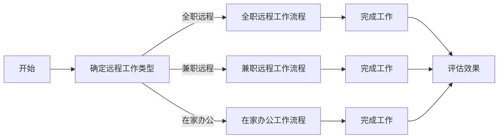
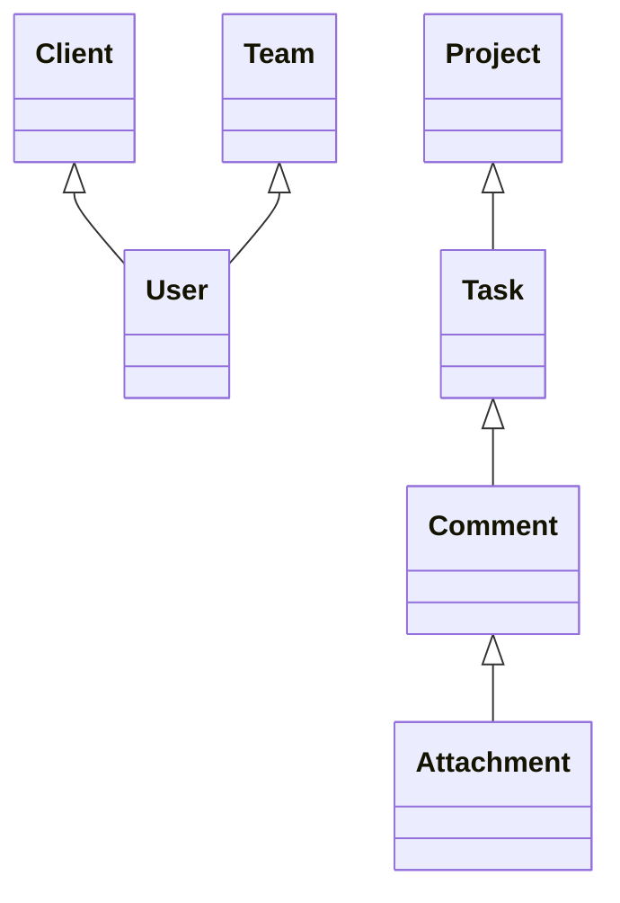
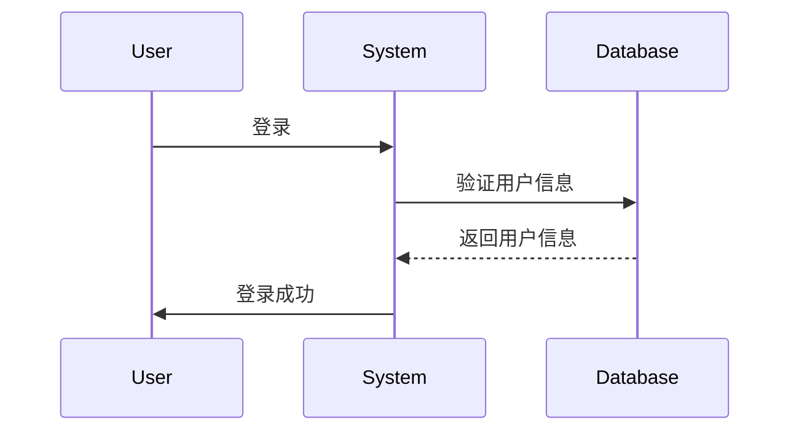
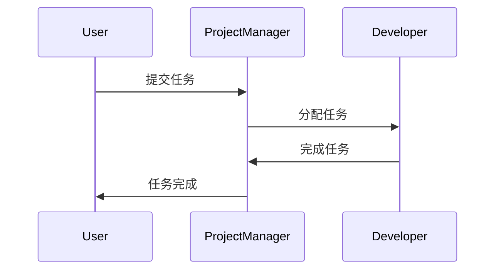

                 

# 数字游牧者全球峰会：远程工作者年度盛会

关键词：远程工作、数字游牧者、全球峰会、工作效率、心理健康

摘要：随着数字化时代的到来，远程工作已成为许多企业和个人选择的工作方式。然而，远程工作也带来了诸多挑战。本文将探讨《数字游牧者全球峰会：远程工作者年度盛会》一书的核心理念，为远程工作者提供切实可行的解决方案。

## 1. 背景介绍

### 1.1 问题背景

随着全球化进程的加速和互联网技术的不断发展，远程工作已成为许多企业和个人的选择。远程工作不仅带来了工作效率的提升，也带来了新的挑战。如何更好地组织、管理远程工作团队，如何确保远程工作的效率和效果，成为企业和远程工作者共同关注的问题。

### 1.2 《数字游牧者全球峰会：远程工作者年度盛会》简介

《数字游牧者全球峰会：远程工作者年度盛会》是一本为远程工作者提供全面指南的书籍。本书旨在帮助远程工作者解决远程工作中的各种问题，提高工作效率，实现个人和团队的共同发展。

### 1.3 问题描述

本书主要介绍了远程工作的基本概念和原则，详细探讨了远程工作者的工作方式、沟通技巧、时间管理、心理健康等多个方面。

### 1.4 问题解决

通过全面而深入的探讨，本书为远程工作者提供了一个系统的解决方案，帮助他们更好地适应远程工作环境，提高工作效率，实现个人和团队的共同发展。

### 1.5 边界与外延

本书主要针对那些已经在或计划从事远程工作的人员，包括远程办公的企业、自由职业者、远程教育者等。同时，它也适用于那些对远程工作感兴趣，希望了解这一工作形式的人。

### 1.6 概念结构与核心要素组成

1. **远程工作概念**：介绍远程工作的定义、类型、优势和挑战。
2. **远程工作原则**：阐述远程工作应遵循的基本原则，如自我管理、团队协作、沟通和反馈等。
3. **工作方式**：详细探讨远程工作的各种方式，如全职远程、兼职远程、在家办公等。
4. **沟通技巧**：介绍远程工作中有效的沟通方法，如即时通讯、邮件、视频会议等。
5. **时间管理**：提供时间管理技巧，帮助远程工作者合理安排工作和休息时间。
6. **心理健康**：探讨远程工作中的心理健康问题，提供解决方法和建议。
7. **技术工具**：介绍远程工作中常用的技术工具，如项目管理软件、协作工具、安全防护工具等。

## 2. 核心概念与联系

### 2.1 核心概念原理

- **远程工作**：一种工作方式，员工可以在不同的地理位置进行工作，通过互联网和其他通信工具与同事和客户进行交流和协作。
- **数字游牧者**：指那些利用互联网技术在全球范围内选择工作地点和生活方式的人群。
- **远程工作团队**：由远程工作者组成的团队，通过互联网进行协作和沟通。

### 2.2 概念属性特征对比表格

| 特征        | 远程工作               | 数字游牧者               | 远程工作团队                |
| ----------- | ---------------------- | ------------------------ | --------------------------- |
| 工作地点    | 可以在任何有网络的地方 | 全球范围内选择工作地点   | 可以在任何有网络的地方协作 |
| 沟通方式    | 通过互联网进行交流     | 通过互联网进行交流       | 通过互联网进行协作         |
| 工作时间    | 自由灵活               | 自由灵活                 | 需要协调工作时间           |
| 独立性      | 较高                   | 较高                    | 较低                       |
| 协作性      | 需要良好沟通和协作     | 需要良好沟通和协作       | 需要紧密协作               |

### 2.3 ER实体关系图架构的 Mermaid 流程图

```mermaid
erDiagram
  A[远程工作] ||--|{ B[数字游牧者] } |
  A ||--|{ C[远程工作团队] } |
  B ||--|{ D[远程工作者] } |
  C ||--|{ E[团队协作] } |
```

## 3. 算法原理讲解

### 3.1 算法 mermaid 流程图



### 3.2 算法原理的数学模型和公式

- **工作完成度**：假设工作完成度可以用一个百分比表示，即 $x\%$。则有以下公式：

  $$ 
  x = \frac{完成的任务数}{总任务数} \times 100\%
  $$

- **工作效率**：工作效率可以用工作完成度除以工作时间来表示，即：

  $$ 
  \text{工作效率} = \frac{x}{t} 
  $$

  其中，$t$ 为工作时间。

### 3.3 通俗易懂的举例说明

假设一位远程工作者需要完成10个任务，每个任务需要1天的时间。如果他在5天内完成了这10个任务，则他的工作完成度为100%，工作效率为2任务/天。

## 4. 系统分析与架构设计方案

### 4.1 问题场景介绍

远程工作已经成为现代企业运营的重要组成部分。企业需要有效地管理远程工作团队，确保团队成员之间的沟通和协作，提高工作效率。

### 4.2 项目介绍

本项目旨在开发一个远程工作管理系统，帮助企业管理远程工作团队，提高工作效率。

### 4.3 系统功能设计（领域模型mermaid类图）



### 4.4 系统架构设计（mermaid架构图）



### 4.5 系统接口设计和系统交互（mermaid序列图）



## 5. 项目实战

### 5.1 环境安装

1. 安装Python环境
2. 安装Django框架
3. 安装数据库（如MySQL）

### 5.2 系统核心实现源代码

```python
# Django模型类
class User(models.Model):
    username = models.CharField(max_length=100)
    email = models.EmailField(unique=True)
    password = models.CharField(max_length=100)
    
class Team(models.Model):
    name = models.CharField(max_length=100)
    members = models.ManyToManyField(User)
    
class Project(models.Model):
    name = models.CharField(max_length=100)
    teams = models.ManyToManyField(Team)
    tasks = models.ManyToManyField(Task)
    
class Task(models.Model):
    name = models.CharField(max_length=100)
    status = models.CharField(max_length=100)
    comments = models.ManyToManyField(Comment)
    
class Comment(models.Model):
    content = models.TextField()
    attachments = models.ManyToManyField(Attachment)
    
class Attachment(models.Model):
    file = models.FileField(upload_to='attachments/')
```

### 5.3 代码应用解读与分析

1. 用户模型类：定义了用户的基本信息。
2. 团队模型类：定义了团队的基本信息和成员关系。
3. 项目模型类：定义了项目的名称、团队和任务关系。
4. 任务模型类：定义了任务的名称、状态和评论关系。
5. 评论模型类：定义了评论的内容和附件关系。
6. 附件模型类：定义了附件的文件路径。

### 5.4 实际案例分析和详细讲解剖析

1. 一个远程工作团队需要进行项目开发，团队成员需要在系统中提交任务、分配任务、完成任务和评论任务。
2. 用户登录系统，选择项目，提交任务，任务会被分配给团队成员。
3. 成员收到任务后，完成任务并在系统中提交评论。
4. 项目经理可以查看任务完成情况和评论内容，对任务进行评价和反馈。

### 5.5 项目小结

本项目通过Django框架实现了远程工作管理系统，为远程工作团队提供了有效的管理和协作工具。项目实现了用户管理、团队管理、项目管理、任务管理和评论管理等功能，为远程工作提供了良好的支持。

## 6. 最佳实践 tips

1. 定期进行团队沟通和反馈，确保团队成员之间的信息畅通。
2. 制定明确的工作计划和目标，提高工作效率。
3. 合理安排工作和休息时间，保持身心健康。

## 7. 小结与注意事项

远程工作作为一种新兴的工作方式，具有许多优点，但也面临诸多挑战。通过阅读《数字游牧者全球峰会：远程工作者年度盛会》，我们可以更好地理解远程工作的本质，掌握有效的远程工作技巧，提高工作效率，实现个人和团队的共同发展。

## 8. 拓展阅读

1. 《远程工作的艺术》
2. 《数字游牧者：全球范围内的远程工作与生活》
3. 《时间管理的艺术》

作者：AI天才研究院/AI Genius Institute & 禅与计算机程序设计艺术 /Zen And The Art of Computer Programming

