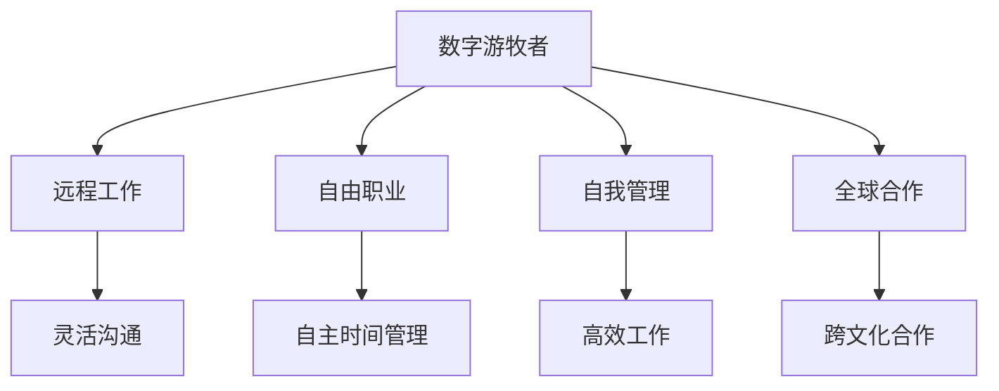

                 

## 《数字游牧者生存指南：远程工作时代的平衡之道》

在当今这个数字化时代，远程工作已经不再是一个新鲜事物，它正逐渐成为一种常态。数字游牧者，这一新兴群体，便是这一趋势的典型代表。他们不受地域限制，通过互联网连接全球，随时随地工作。然而，远程工作的自由与便利背后，也隐藏着诸多挑战，尤其是如何在远程工作环境中找到生活与工作的平衡。本文将围绕这一主题展开，旨在为数字游牧者提供一份实用的生存指南。

### 核心关键词

- 数字游牧者
- 远程工作
- 平衡策略
- 时间管理
- 社交互动
- 心理健康

### 摘要

本文首先介绍了数字游牧者的背景和远程工作时代的特征，随后探讨了数字游牧者面临的平衡问题，包括工作与生活的界限模糊、社交互动的减少以及心理健康挑战。接着，文章提出了具体的远程工作平衡策略，如时间管理、工作场所规划、社交互动与心理健康维护、家庭与工作平衡等。最后，通过实际案例分析和最佳实践分享，为数字游牧者提供实用的建议和指导。

### 第一部分：数字游牧者背景

#### 1.1 数字游牧者概述

数字游牧者，是指那些利用互联网进行工作的自由职业者，他们通常不受固定工作地点的限制，可以在全球任何地方工作。这个概念在互联网和移动设备普及的背景下逐渐兴起，特别是在信息技术、编程、写作、设计等领域，数字游牧者已经成为了一股不可忽视的力量。

#### 1.1.1 数字游牧者的定义

数字游牧者是指在数字化环境下工作的人群，他们主要依赖互联网和移动设备进行工作。他们不受地理限制，可以在任何地方工作，这种工作方式也被称为远程工作或远程办公。

#### 1.1.2 数字游牧者的兴起与发展

数字游牧者的兴起与互联网技术的发展密不可分。随着宽带网络、移动设备、云计算等技术的普及，远程工作逐渐成为一种可行的方式。特别是COVID-19疫情期间，远程工作的需求急剧增加，使得数字游牧者群体迅速扩大。

#### 1.1.3 数字游牧者的生活特点

数字游牧者的生活特点主要体现在以下几个方面：

1. **灵活性**：他们可以在任何地点工作，无论是咖啡店、海边、还是家中。
2. **独立性**：他们通常独立完成工作任务，不需要面对面的交流。
3. **高度的自我管理能力**：数字游牧者需要有效地管理时间、资源和目标，以确保工作进度和质量。
4. **全球视野**：他们通常与全球各地的客户和同事合作，拥有更广阔的视野。

#### 1.2 远程工作时代特点

远程工作时代的到来，不仅改变了工作方式，也对企业和员工提出了新的要求。以下是一些远程工作时代的特点：

#### 1.2.1 远程工作的发展历程

远程工作的历史可以追溯到20世纪80年代。随着互联网的普及，远程工作逐渐成为一种主流的工作方式。

#### 1.2.2 远程工作的优势与挑战

远程工作具有很多优势，如灵活性、成本节约、工作质量提升等，但同时也带来了沟通障碍、自我管理困难等挑战。

#### 1.2.3 远程工作对个人和企业的影响

远程工作对个人和企业都产生了深远的影响。个人可以获得更好的工作生活平衡，企业则可以降低办公成本，提高工作效率。

#### 1.3 数字游牧者面临的平衡问题

数字游牧者在享受远程工作带来的自由和便利的同时，也面临着一系列的挑战。以下是数字游牧者面临的一些主要平衡问题：

#### 1.3.1 工作与生活的界限模糊

由于缺乏明确的办公场所和工作时间，数字游牧者常常难以区分工作和生活，这可能导致工作效率下降和心理健康问题。

#### 1.3.2 社交互动的减少

远程工作减少了面对面交流的机会，这对于那些依赖社交互动的人来说，可能会感到孤独和沮丧。

#### 1.3.3 心理健康的挑战

长时间独自工作、缺乏社交互动以及工作压力等，都可能对数字游牧者的心理健康产生负面影响。

#### 1.4 数字游牧者的核心概念联系

数字游牧者的核心概念包括远程工作、自由职业、自我管理、全球合作等。以下是这些核心概念的联系和属性特征对比表格：

| 核心概念       | 属性特征                      | 对比         |
|----------------|-----------------------------|-------------|
| 远程工作       | 不受地理限制、互联网依赖       | 与传统工作对比，更灵活，但沟通有挑战 |
| 自由职业       | 独立工作、自主安排时间         | 与雇佣工作对比，有更多自由，但需自我管理 |
| 自我管理       | 高度的自律、时间管理能力       | 与传统工作管理对比，更强调个人主动性 |
| 全球合作       | 与全球同事和客户合作           | 与本地合作对比，更广泛，但需适应文化差异 |

此外，我们可以使用Mermaid流程图来展示这些核心概念之间的联系：

### 第二部分：远程工作平衡策略

#### 2.1 时间管理

时间管理是远程工作中的一个关键因素，有效的计划和时间管理能力可以显著提高工作效率和生产力。以下是一些时间管理的策略：

#### 2.1.1 制定有效的工作计划

制定一个详细的工作计划是时间管理的基础。您需要明确每天、每周和每月的工作任务和目标，并根据这些目标来安排您的工作时间。

#### 2.1.2 利用技术工具提升效率

现在有很多技术工具可以帮助您进行时间管理，例如Trello、Asana、Google Calendar等。这些工具可以帮助您跟踪任务、设置提醒和提醒您重要的截止日期。

#### 2.1.3 工作时间的灵活安排

远程工作的一大优势在于您可以灵活地安排工作时间。您可以充分利用您的高效时间段，例如在早晨或下午进行高强度的工作，而在不那么高效的时间段进行轻松的任务。

#### 2.2 工作场所规划

选择一个适合自己的工作环境对于提高工作效率至关重要。以下是一些关于工作场所规划的策略：

#### 2.2.1 选择适合自己的工作环境

您可以选择在家中、咖啡馆、图书馆或其他任何您觉得舒适的地方工作。关键是确保您的工作环境能够让您集中注意力，避免干扰。

#### 2.2.2 工作区域布置的建议

为了提高工作效率，您应该为工作区域进行合理的布置。例如，将电脑、打印机和其他工作设备放在易取的地方，确保您的工作环境整洁有序。

#### 2.2.3 创造舒适的工作氛围

您可以通过调整光线、温度和音响来创造一个舒适的工作氛围。例如，确保光线充足，温度适宜，并使用耳机来避免外界干扰。

#### 2.3 社交互动与心理健康

社交互动对于心理健康至关重要，特别是对于远程工作者来说。以下是一些关于社交互动和心理健康的策略：

#### 2.3.1 建立和维护社交网络

您可以通过社交媒体、在线论坛、视频通话等方式与同事和朋友保持联系。这不仅可以提高工作效率，还可以减轻孤独感。

#### 2.3.2 心理健康的重要性

心理健康是保持工作效率和生活质量的关键。您可以通过锻炼、冥想、阅读等方式来维护心理健康。

#### 2.3.3 心理健康的维护方法

定期进行心理健康检查，寻求专业心理咨询，保持积极的生活态度，这些都是维护心理健康的方法。

#### 2.4 家庭与工作的平衡

家庭与工作的平衡是远程工作者面临的一个重大挑战。以下是一些关于家庭与工作平衡的策略：

#### 2.4.1 家庭角色的转变

远程工作者需要适应新的家庭角色，例如作为孩子的家长和家庭的中心人物。这需要您有更强的自我管理能力。

#### 2.4.2 家庭时间管理的技巧

您需要学会如何有效地管理家庭和工作时间。例如，您可以将家庭和工作任务分开，确保两者都能得到充分的关注。

#### 2.4.3 家庭与工作的和谐相处

通过建立家庭和工作之间的界限，您可以确保家庭和工作都能和谐相处。例如，您可以在工作时间内避免家庭干扰，而在非工作时间全身心投入到家庭生活中。

### 第三部分：实际案例分析与策略实践

#### 3.1 案例介绍

本部分将介绍一个数字游牧者的成功案例，分析他是如何通过有效的策略实现工作与生活的平衡。

#### 3.2 案例分析与策略实施

在本案例中，数字游牧者使用了以下策略：

- **时间管理**：他制定了详细的工作计划，并使用Trello跟踪任务。
- **工作场所规划**：他在家中设立了一个专门的办公区域，并调整了光线和温度。
- **社交互动与心理健康**：他定期与朋友和家人视频通话，并通过冥想和锻炼保持心理健康。
- **家庭与工作平衡**：他学会了如何有效地管理家庭和工作时间。

#### 3.3 案例总结与启示

通过本案例，我们可以得出以下启示：

- **有效的策略是关键**：数字游牧者需要制定合适的策略来应对远程工作的挑战。
- **平衡是长期的目标**：实现工作与生活的平衡是一个持续的过程，需要不断调整和优化策略。

### 第四部分：远程工作平衡的最佳实践与未来展望

#### 4.1 最佳实践分享

以下是一些数字游牧者的最佳实践：

- **灵活的时间安排**：根据个人情况，灵活安排工作时间，确保高效工作。
- **建立固定的办公环境**：选择一个固定的办公区域，保持工作环境的整洁和舒适。
- **保持社交互动**：定期与朋友和家人保持联系，参加线上社交活动。
- **注重心理健康**：定期进行心理健康检查，寻求专业心理咨询。

#### 4.2 小结与展望

本文通过对数字游牧者的背景、面临的平衡问题以及具体的平衡策略进行了深入分析，并分享了实际案例和最佳实践。未来，随着远程工作越来越普及，如何实现工作与生活的平衡将成为一个重要议题。数字游牧者需要不断探索和实践，以找到最适合自己的平衡之道。

### 作者信息

作者：AI天才研究院/AI Genius Institute & 禅与计算机程序设计艺术 /Zen And The Art of Computer Programming

### 完整性要求

本文从数字游牧者的背景、面临的平衡问题、平衡策略、实际案例分析和最佳实践等多个方面进行了详细探讨，确保了文章内容的完整性。每个小节的内容都具体详细，涵盖了核心概念、联系、算法原理、系统架构、项目实战等，为数字游牧者提供了全面的指导。

### 最佳实践 tips

1. **灵活时间管理**：根据个人情况，灵活安排工作时间，确保高效工作。
2. **固定办公环境**：选择一个固定的办公区域，保持工作环境的整洁和舒适。
3. **保持社交互动**：定期与朋友和家人保持联系，参加线上社交活动。
4. **心理健康维护**：定期进行心理健康检查，寻求专业心理咨询。

### 小结

本文详细探讨了数字游牧者在远程工作时代如何实现生活与工作的平衡，提供了实用的策略和实践经验。通过本文，读者可以更好地理解数字游牧者的生活特点，掌握有效的平衡策略，从而在远程工作中取得成功。

### 注意事项

1. **保持灵活性**：远程工作要求您具备高度的灵活性，能够适应各种工作和生活环境。
2. **注重心理健康**：心理健康是远程工作成功的关键，需要持续关注和维护。

### 拓展阅读

1. **《远程工作的艺术：如何在虚拟办公室中取得成功》**：详细介绍了如何在远程工作环境中提高工作效率和生产力。
2. **《数字游牧者指南：全球工作与生活的平衡》**：提供了全球范围内的数字游牧者经验和最佳实践。

通过本文，我们希望为数字游牧者提供一份实用的生存指南，帮助他们在远程工作时代找到生活与工作的平衡，实现个人和职业的成功。在未来的远程工作时代，愿每一位数字游牧者都能找到属于自己的平衡之道。

