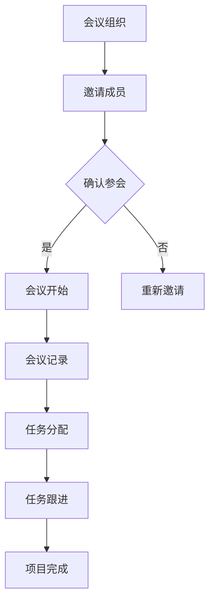
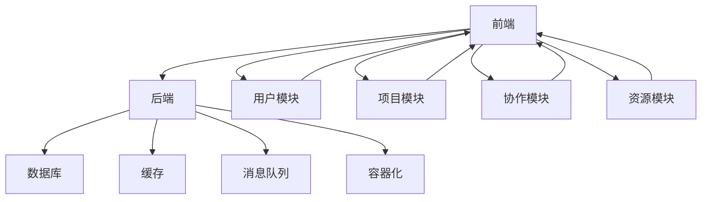
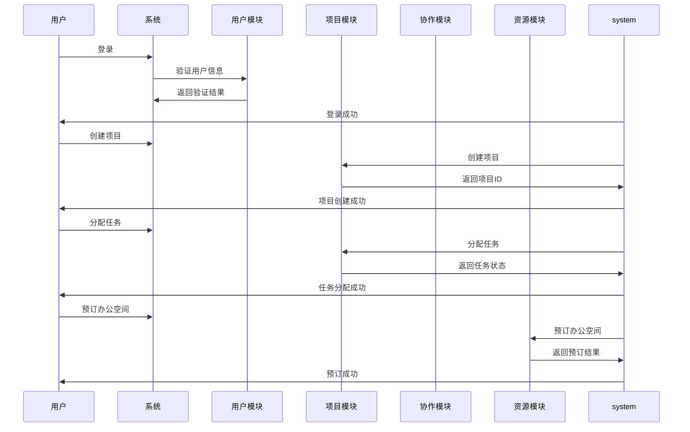

                 


### 《数字游牧者联盟：远程工作者的全球互助网络》

关键词：数字游牧者，远程工作者，全球互助网络，远程协作，技术架构，最佳实践

摘要：本文深入探讨了数字游牧者联盟的兴起、核心概念、技术支撑、实际应用和未来展望。通过背景介绍、案例研究、算法讲解、数学模型、系统架构分析和项目实战，揭示了远程工作者在全球互助网络中的角色和重要性，为构建高效、灵活的数字游牧者联盟提供了理论和实践指导。

---

## 背景介绍

### 数字游牧者联盟的概念

**数字游牧者**（Digital Nomad）是指利用现代信息技术在全球范围内自由移动，以远程工作为主要生活方式的人群。这一群体主要依赖于互联网进行工作，从而摆脱了传统办公室的限制。数字游牧者通常具备以下几个特征：

1. **灵活性**：他们可以选择在任何地方工作，如咖啡馆、共享办公空间或者家中。
2. **独立性**：他们通常自主管理时间，按照自己的节奏进行工作。
3. **全球性**：他们可能生活在不同的国家或地区，通过虚拟团队进行协作。

数字游牧者联盟（Digital Nomad Alliance）则是由一群数字游牧者组成的互助网络，旨在共享资源、交流经验、共同成长。这一联盟的兴起可以追溯到2000年代中期，随着互联网技术的发展和远程工作模式的普及，越来越多的远程工作者开始形成社区，互相支持。

### 数字游牧者联盟的发展背景

数字游牧者联盟的发展背景主要包括以下几个方面：

1. **互联网技术的进步**：互联网的普及使得远程工作变得更加可行，数字游牧者可以随时随地访问所需的信息和工具。
2. **全球化趋势**：全球化加速了人们的流动性，人们越来越愿意在全球范围内寻找工作和生活的地方。
3. **劳动力市场的变化**：随着知识经济的兴起，许多工作不再依赖于物理位置，而是更注重个人的技能和创造力。
4. **共享经济的崛起**：共享办公空间、民宿、交通等共享经济模式为数字游牧者提供了更多的便利和选择。

### 远程工作者在全球互助网络中的角色和重要性

远程工作者在全球互助网络中扮演着至关重要的角色，他们不仅推动了数字化经济的快速发展，也为全球合作和创新提供了无限可能。以下是远程工作者在全球互助网络中的几个关键作用：

1. **资源共享**：远程工作者可以通过联盟共享办公空间、网络资源、工具和技能，提高工作效率和质量。
2. **经验交流**：通过联盟，远程工作者可以交流工作经验、分享成功案例和解决难题，相互学习成长。
3. **跨文化交流**：远程工作者来自不同的国家和文化背景，他们通过联盟促进了不同文化的交流和融合。
4. **推动创新**：远程工作者的多样性和灵活性为创新提供了丰富的土壤，他们可以自由地组合和运用不同领域的知识，推动新技术和新模式的发展。

总之，数字游牧者联盟作为一种新型的全球互助网络，为远程工作者提供了一个开放、共享和协作的平台，不仅改变了人们的工作方式，也推动了全球经济的数字化转型。

## 核心概念与联系

### 数字游牧者、远程工作者与全球互助网络

在深入探讨数字游牧者联盟之前，我们需要明确几个核心概念：数字游牧者、远程工作者和全球互助网络。这些概念相互联系，构成了数字游牧者联盟的基础。

**数字游牧者（Digital Nomad）**：是指那些利用互联网技术进行工作，并在全球范围内自由移动的人群。他们通常以独立承包商、自由职业者或远程员工的形式存在，拥有高度的灵活性和自主性。

**远程工作者（Remote Worker）**：是指在非传统工作场所（如家、共享办公空间、咖啡馆等）完成工作任务的人。远程工作者不仅包括数字游牧者，还包括那些在固定工作地点工作，但利用远程协作工具与技术进行沟通和协作的员工。

**全球互助网络（Global Mutual Support Network）**：是指一个由远程工作者和数字游牧者组成的在线社区，他们通过共享资源、交流经验和合作项目，实现个人和团队的发展。

### 概念属性特征对比表格

为了更直观地展示这些概念之间的差异和联系，我们可以使用一个属性特征对比表格。

| 特征          | 数字游牧者 | 远程工作者 | 全球互助网络 |
|---------------|-------------|-------------|---------------|
| 移动性        | 高          | 中          | 中           |
| 工作地点      | 全球各地    | 固定或移动  | 全球各地     |
| 工作模式      | 自主性强    | 较独立      | 合作性强     |
| 组织形式      | 个人或小团队 | 单位或团队  | 社区或联盟   |
| 目标          | 自由移动和远程工作 | 完成工作任务 | 资源共享和合作 |
| 资源共享      | 有限        | 有限        | 高度         |

### ER实体关系图

为了进一步理解这些概念之间的关系，我们可以使用ER（实体关系）图来展示它们的联系。

```mermaid
erDiagram
  User ||--|{ DigitalNomad } : belongs_to
  User ||--|{ RemoteWorker } : belongs_to
  DigitalNomad ||--|{ GlobalMutualSupportNetwork } : belongs_to
  RemoteWorker ||--|{ GlobalMutualSupportNetwork } : belongs_to
```

在ER图中，用户（User）是所有实体的基础，数字游牧者（DigitalNomad）和远程工作者（RemoteWorker）都属于用户，但具有不同的属性和特点。全球互助网络（GlobalMutualSupportNetwork）是数字游牧者和远程工作者的组织形式，它们通过这个网络进行资源共享和协作。

通过上述表格和ER图，我们可以更清晰地理解数字游牧者、远程工作者和全球互助网络之间的联系和区别。这些概念构成了数字游牧者联盟的核心，为远程工作者的全球合作提供了坚实的基础。

### 核心概念与联系（续）

在了解了数字游牧者、远程工作者和全球互助网络的基本概念之后，接下来我们将深入探讨这些概念的具体属性和特征，并通过具体的案例来说明这些概念在实际应用中的表现。

#### 数字游牧者的具体属性和特征

**1. 工作地点灵活性：** 数字游牧者不受地理限制，可以在全球范围内自由选择工作地点。例如，一些数字游牧者喜欢在东南亚的低成本生活区，如巴厘岛或清迈，享受宜人的气候和较低的生活成本，同时保持高效的工作状态。

**2. 工作时间灵活性：** 数字游牧者通常自主安排工作时间，以适应个人生活和项目需求。例如，一位数字游牧者可能会选择在清晨完成重要的工作，然后在下午进行创意思考和协作。

**3. 专业技能多样性：** 数字游牧者往往具备多种技能，如编程、设计、写作、市场营销等，这使得他们能够在多个领域自由切换。例如，一位数字游牧者可能既是前端开发工程师，又是数字营销专家。

**4. 自我驱动性：** 数字游牧者需要具备较高的自我管理能力和自我驱动性，以克服远程工作可能带来的孤独感和拖延症。例如，一位数字游牧者可能会通过设定明确的目标和任务来保持工作的连续性和高效性。

#### 远程工作者的具体属性和特征

**1. 工作模式独立性：** 远程工作者通常独立完成工作任务，不依赖于传统的办公室环境。例如，一位远程项目经理可能通过在线工具和协作平台，与全球分布的团队成员进行沟通和项目管理。

**2. 工作效率优化：** 远程工作者可以通过远程工作提高工作效率。例如，一位远程软件工程师可以通过在家工作减少通勤时间，从而有更多时间专注于编码和解决问题。

**3. 技术技能需求：** 远程工作者通常需要具备较高的技术技能，特别是远程协作和项目管理工具的使用。例如，一位远程团队领导可能需要熟练使用Trello、Slack等工具来协调团队工作。

**4. 跨文化沟通能力：** 由于远程工作者可能分布在全球各地，他们需要具备良好的跨文化沟通能力。例如，一位远程客户支持专家可能需要在不同时区和文化背景下与客户沟通，解决客户问题。

#### 全球互助网络的具体属性和特征

**1. 资源共享：** 全球互助网络的核心功能之一是资源共享。例如，一个数字游牧者联盟可能会共享办公空间、云计算资源、专业工具等，为成员提供便利。

**2. 经验交流：** 全球互助网络为成员提供了经验交流和学习的平台。例如，通过在线研讨会、工作坊和分享会，成员可以分享他们的成功经验和面对的挑战。

**3. 跨文化交流：** 全球互助网络促进了不同文化和背景之间的交流和理解。例如，通过跨国团队的协作项目，成员可以学习不同文化的工作方式和管理方法。

**4. 项目合作：** 全球互助网络为成员提供了合作和共同开展项目的机会。例如，一个数字游牧者联盟可能组织跨国的开发项目，利用不同成员的技能和经验，共同开发新产品或服务。

通过上述具体的案例和特征，我们可以更深入地理解数字游牧者、远程工作者和全球互助网络的概念。这些概念不仅改变了人们的工作方式，也推动了全球化经济的发展和协作。在接下来的部分，我们将通过具体的案例介绍，进一步探讨数字游牧者联盟的实际运作和成果。

### 案例介绍

为了更直观地了解数字游牧者联盟的实际运作，我们将介绍几个成功的联盟案例，详细描述它们的工作模式、取得的成果以及面临的挑战。

#### 案例一：远程开发联盟

**工作模式：** 远程开发联盟由一群全球分布的软件开发者组成，他们通过虚拟团队进行项目协作。该联盟采用敏捷开发方法，使用Trello、Slack和Git等工具进行任务分配、进度追踪和代码管理。

**成果：** 该联盟在多个领域完成了多个成功的项目，包括电子商务平台、教育应用和数据分析工具。通过高效的合作和灵活的工作模式，他们能够在短时间内交付高质量的产品。

**挑战：** 挑战主要包括时区差异导致的沟通困难、技术问题的快速解决以及团队成员之间的信任建立。为了克服这些问题，联盟采用了灵活的工作时间安排、建立了明确的沟通协议和代码审查流程。

#### 案例二：跨国设计工作室

**工作模式：** 跨国设计工作室由来自不同国家和文化背景的设计师组成，他们通过在线设计工具和视频会议软件进行协作。该工作室采用客户驱动的方法，为客户提供全面的设计解决方案。

**成果：** 该工作室在多个领域取得了显著的成功，包括品牌设计、UI/UX设计和数字营销。通过全球设计师的合作，他们能够提供多样化的创意和解决方案，满足了客户的不同需求。

**挑战：** 挑战主要包括文化差异带来的设计风格冲突、远程协作中的创意碰撞和项目管理的复杂性。为了解决这些问题，工作室采用了跨文化设计培训、建立清晰的设计流程和项目管理工具。

#### 案例三：数字营销联盟

**工作模式：** 数字营销联盟由一群数字营销专家组成，他们通过共享市场数据、创意资源和营销工具进行协作。该联盟采用数据驱动的方法，为客户提供精准的营销策略和执行方案。

**成果：** 该联盟在多个国家和地区开展了成功的数字营销项目，包括搜索引擎优化、社交媒体营销和电子邮件营销。通过高效的数据分析和协作，他们能够为客户提供显著的市场推广效果。

**挑战：** 挑战主要包括数据隐私和安全性问题、市场环境的快速变化和跨文化的营销策略调整。为了克服这些问题，联盟采用了严格的数据保护措施、建立了灵活的营销策略更新机制和跨文化市场调研。

通过上述案例，我们可以看到数字游牧者联盟在不同领域和模式下取得了显著的成果，但同时也面临着各种挑战。这些案例为我们提供了宝贵的经验和教训，帮助我们更好地理解和构建数字游牧者联盟。

### 技术原理讲解

为了深入理解远程协作工具和技术的工作原理，我们将介绍几种常用的远程协作工具，并使用算法mermaid流程图和Python代码示例来详细阐述它们的应用和优势。

#### 1. 视频会议软件

视频会议软件是远程协作中不可或缺的工具，它使得分布在不同地理位置的团队成员能够实时沟通和交流。以下是几种常用的视频会议软件：

- **Zoom**：Zoom是一款功能强大的视频会议软件，支持多人会议、屏幕共享、实时聊天等功能。它采用了先进的视频编解码技术，确保了视频会议的高清晰度和流畅性。

- **Microsoft Teams**：Microsoft Teams是微软公司推出的集成通信和协作平台，集成了视频会议、即时消息、文档共享等功能，与Office 365紧密集成，方便用户进行团队协作。

- **Google Meet**：Google Meet是Google提供的视频会议解决方案，支持最多250人的视频会议，具有自动录制、实时字幕等功能，非常适合企业和大型的在线研讨会。

#### 2. 项目管理工具

项目管理工具帮助远程团队有效地管理项目和任务，确保项目按时交付。以下是几种常用的项目管理工具：

- **Trello**：Trello是一款基于看板（Kanban）原理的项目管理工具，通过卡片和列表的形式来组织任务和项目。它直观易用，适合小型团队和项目。

- **Asana**：Asana是一款功能丰富的项目管理工具，支持任务分配、进度追踪、时间管理等功能。它提供了灵活的视图选项，如看板、列表、日历等，方便用户从不同角度查看项目进度。

- **Jira**：Jira是Atlassian公司推出的项目管理工具，广泛应用于软件开发团队。它支持敏捷开发方法，提供详细的任务跟踪、代码管理、缺陷追踪等功能，非常适合大型团队和复杂项目。

#### 3. 云端存储解决方案

云端存储解决方案为远程团队提供了安全、便捷的文件存储和共享服务，确保团队成员能够随时随地访问所需文件。以下是几种常用的云端存储解决方案：

- **Google Drive**：Google Drive是Google提供的云端存储服务，支持文档、表格、演示文稿等多种文件类型。它提供了强大的协作功能，允许多个用户同时编辑同一文档，提高了工作效率。

- **OneDrive**：OneDrive是微软公司推出的云端存储服务，与Office 365深度集成，提供了丰富的办公应用。它支持大文件存储和共享，同时提供了加密和安全保护功能。

- **Dropbox**：Dropbox是一款知名的云端存储解决方案，提供了简单易用的文件同步和共享功能。它支持跨平台访问，用户可以在任何设备上访问和编辑文件，非常适合远程团队使用。

#### 算法mermaid流程图示例

为了更好地理解上述工具的工作原理，我们将使用mermaid绘制一个简单的流程图，展示从会议组织到任务分配的过程。



#### Python代码示例

下面是一个简单的Python代码示例，展示了如何使用Trello API进行任务创建和跟踪。

```python
import requests
import json

# Trello API凭据
API_KEY = 'your_api_key'
TOKEN = 'your_token'
LIST_ID = 'your_list_id'
BOARD_ID = 'your_board_id'

# 创建任务
def create_task(name, desc):
    url = f'https://api.trello.com/1/boards/{BOARD_ID}/lists/{LIST_ID}/cards'
    headers = {
        'Authorization': f'Bearer {TOKEN}',
        'Content-Type': 'application/json'
    }
    data = {
        'name': name,
        'desc': desc
    }
    response = requests.post(url, headers=headers, data=json.dumps(data))
    return response.json()

# 跟踪任务
def track_task(card_id):
    url = f'https://api.trello.com/1/cards/{card_id}'
    headers = {
        'Authorization': f'Bearer {TOKEN}',
        'Content-Type': 'application/json'
    }
    response = requests.get(url, headers=headers)
    return response.json()

# 示例
if __name__ == '__main__':
    task = create_task('新任务', '这是一个新任务')
    print(task)
    time.sleep(5)  # 等待5秒，以确保任务创建完成
    tracked_task = track_task(task['id'])
    print(tracked_task)
```

通过上述示例，我们可以看到远程协作工具和技术的应用和优势。这些工具不仅提高了远程工作的效率，还促进了团队成员之间的沟通和协作。在接下来的部分，我们将进一步探讨如何使用数学模型和数学公式来优化远程协作过程中的任务分配和进度跟踪。

### 数学模型和数学公式

在远程协作和任务管理中，数学模型和数学公式可以用于优化资源分配、进度跟踪和任务调度。以下是一个简单的例子，展示了如何使用数学模型和公式来优化任务分配。

#### 1. 项目时间安排模型

假设我们有一个包含多个任务的项目，每个任务有特定的开始时间、结束时间和所需资源。我们可以使用线性规划（Linear Programming，LP）模型来优化任务分配。

**线性规划模型：**

目标函数（最大化总效率）：
\[ \text{maximize} \quad Z = \sum_{i=1}^{n} p_i \cdot (e_i - s_i) \]

约束条件：
\[ s_i + x_{ij} \leq e_j \quad \forall j \quad (j \neq i) \]
\[ e_i - s_i \leq C_j \cdot x_{ij} \quad \forall j \quad (j \neq i) \]
\[ x_{ij} \in \{0, 1\} \]

其中：
- \( p_i \)：任务 \( i \) 的优先级
- \( e_i \)：任务 \( i \) 的结束时间
- \( s_i \)：任务 \( i \) 的开始时间
- \( C_j \)：资源 \( j \) 的容量
- \( x_{ij} \)：指示变量，表示任务 \( i \) 是否在资源 \( j \) 上执行

#### 2. 数学公式示例

为了简化问题，我们假设有3个任务（\( T_1, T_2, T_3 \)）和2种资源（\( R_1, R_2 \)），每个任务有特定的开始时间、结束时间和所需资源。以下是具体的数学公式：

**目标函数：**
\[ \text{maximize} \quad Z = p_1 \cdot (e_1 - s_1) + p_2 \cdot (e_2 - s_2) + p_3 \cdot (e_3 - s_3) \]

**约束条件：**
\[ s_1 + x_{11} \leq e_2 \]
\[ e_1 - s_1 \leq C_1 \cdot x_{11} \]
\[ s_2 + x_{12} \leq e_3 \]
\[ e_2 - s_2 \leq C_1 \cdot x_{12} \]
\[ s_3 + x_{21} \leq e_2 \]
\[ e_3 - s_3 \leq C_2 \cdot x_{21} \]
\[ x_{ij} \in \{0, 1\} \]

其中：
- \( p_1, p_2, p_3 \)：任务 \( T_1, T_2, T_3 \) 的优先级
- \( e_1, e_2, e_3 \)：任务 \( T_1, T_2, T_3 \) 的结束时间
- \( s_1, s_2, s_3 \)：任务 \( T_1, T_2, T_3 \) 的开始时间
- \( C_1, C_2 \)：资源 \( R_1, R_2 \) 的容量
- \( x_{ij} \)：指示变量，表示任务 \( i \) 是否在资源 \( j \) 上执行

#### 3. LaTex格式数学公式

为了更好地展示上述数学公式，我们使用LaTex格式：

```latex
\documentclass{article}
\usepackage{amsmath}
\begin{document}

\begin{equation}
\text{maximize} \quad Z = \sum_{i=1}^{n} p_i \cdot (e_i - s_i)
\end{equation}

\begin{equation}
\begin{aligned}
s_i + x_{ij} &\leq e_j \quad \forall j \quad (j \neq i) \\
e_i - s_i &\leq C_j \cdot x_{ij} \quad \forall j \quad (j \neq i)
\end{aligned}
\end{equation}

\end{document}
```

通过上述数学模型和公式，我们可以更科学地优化任务分配和资源利用，提高远程协作的效率和质量。在接下来的部分，我们将进一步探讨数字游牧者联盟的技术架构和系统设计。

### 系统分析与架构设计

为了深入理解数字游牧者联盟的运行机制，我们需要对其进行系统分析与架构设计。这将帮助我们明确系统的功能模块、技术架构和接口设计，确保联盟的高效运作和扩展性。

#### 1. 问题描述与项目介绍

数字游牧者联盟是一个由全球分布的远程工作者组成的协作平台，旨在提供资源共享、经验交流、项目协作等功能。项目需求主要包括：

- **用户管理**：支持用户注册、登录、权限管理和个人信息维护。
- **项目协作**：支持项目创建、任务分配、进度追踪和文档共享。
- **资源共享**：提供办公空间预订、工具分享和社区交流功能。
- **数据安全**：确保用户数据和项目信息的保密性和完整性。

#### 2. 系统功能设计（领域模型）

为了实现上述需求，我们设计了一个领域模型，主要包括以下功能模块：

- **用户模块**：管理用户注册、登录和权限，提供个人资料和偏好设置。
- **项目模块**：支持项目创建、任务分配、进度追踪和文档管理。
- **协作模块**：提供即时通讯、会议预约和社区交流功能。
- **资源模块**：管理办公空间预订、工具分享和资源库。

#### 3. 系统架构设计

数字游牧者联盟的系统架构采用微服务架构，以确保系统的可扩展性和灵活性。以下是系统架构的详细设计：

- **前端**：使用React框架开发用户界面，提供直观、易用的交互体验。
- **后端**：采用Spring Boot框架，实现RESTful API，提供数据存储、业务逻辑处理和外部接口。
- **数据库**：使用MySQL数据库存储用户信息、项目数据和其他相关数据。
- **缓存**：使用Redis缓存技术提高系统性能和响应速度。
- **消息队列**：使用RabbitMQ实现异步消息传递，确保系统高可用性和解耦。
- **容器化**：使用Docker进行容器化部署，提高系统部署和管理效率。

#### 4. 系统架构图

以下是一个简化的系统架构图，展示了各个模块和组件之间的关系。



#### 5. 系统接口设计

系统接口设计是确保各个模块之间能够高效协作的关键。以下是主要接口设计：

- **用户接口**：提供用户注册、登录、个人信息维护等功能。
- **项目管理接口**：支持项目创建、任务分配、进度追踪和文档管理。
- **协作接口**：提供即时通讯、会议预约和社区交流功能。
- **资源接口**：支持办公空间预订、工具分享和资源库管理。

#### 6. 系统交互

为了确保系统各模块之间的协同工作，我们设计了一个系统交互序列图，展示了用户操作与系统响应的流程。



通过上述系统分析与架构设计，我们可以确保数字游牧者联盟能够高效、稳定地运行，满足远程工作者的协作需求。在接下来的部分，我们将通过一个实际项目案例，进一步展示数字游牧者联盟的实施过程。

### 项目实战

为了展示数字游牧者联盟的实际应用，我们将描述一个远程软件开发项目的实施过程。该项目旨在开发一款基于云计算的在线协作工具，以支持全球远程工作者的协作需求。

#### 环境安装

在开始项目之前，我们需要搭建一个合适的项目开发环境。以下是环境安装的步骤：

1. **安装Docker**：Docker是一个开源的应用容器引擎，用于打包、交付和运行应用。我们可以在官方网站下载Docker并按照说明进行安装。

2. **安装Git**：Git是一个分布式版本控制系统，用于代码管理。我们可以在官方网站下载Git并按照说明进行安装。

3. **安装Java SDK**：由于我们使用Spring Boot框架进行后端开发，需要安装Java SDK。我们可以在官方网站下载Java SDK并按照说明进行安装。

4. **安装MySQL**：MySQL是一个开源的关系型数据库管理系统，用于存储用户和项目数据。我们可以在官方网站下载MySQL并按照说明进行安装。

5. **安装Redis**：Redis是一个开源的内存数据库，用于缓存和消息队列。我们可以在官方网站下载Redis并按照说明进行安装。

6. **安装RabbitMQ**：RabbitMQ是一个开源的消息队列中间件，用于异步消息传递。我们可以在官方网站下载RabbitMQ并按照说明进行安装。

#### 系统核心实现

在搭建好开发环境后，我们开始进行系统核心实现。以下是主要步骤：

1. **创建项目**：使用Spring Initializr创建一个Spring Boot项目，选择所需的依赖项，如Web、MySQL、Redis、RabbitMQ等。

2. **用户模块实现**：
   - **用户注册**：实现用户注册功能，包括验证用户名和邮箱的可用性、密码加密存储等。
   - **用户登录**：实现用户登录功能，使用JWT（JSON Web Token）进行身份验证和会话管理。
   - **用户信息管理**：实现用户个人信息的管理，包括修改密码、头像等。

3. **项目模块实现**：
   - **项目创建**：实现项目创建功能，包括项目名称、描述、成员分配等。
   - **任务管理**：实现任务创建、分配、进度跟踪和任务状态更新等功能。
   - **文档管理**：实现文档上传、下载和共享功能，使用Git进行版本控制。

4. **协作模块实现**：
   - **即时通讯**：使用WebSocket实现实时通讯功能，支持文本消息、文件传输等。
   - **会议预约**：实现会议预约功能，支持视频会议、屏幕共享等。
   - **社区交流**：实现社区交流功能，支持帖子发布、评论、点赞等。

5. **资源模块实现**：
   - **办公空间预订**：实现办公空间预订功能，包括会议室预订、座位预订等。
   - **工具分享**：实现工具分享功能，包括软件工具、书籍资源等。
   - **资源库管理**：实现资源库管理功能，包括资源分类、搜索和下载等。

#### 代码解读与分析

在系统核心实现过程中，我们使用了多种技术和框架。以下是主要代码片段的解读和分析：

1. **用户注册**：

```java
@RestController
@RequestMapping("/api/auth")
public class AuthController {
  
  @Autowired
  private UserRepository userRepository;
  
  @Autowired
  private PasswordEncoder passwordEncoder;

  @PostMapping("/register")
  public ResponseEntity<?> registerUser(@RequestBody UserRegistrationDto registration) {
    if (userRepository.existsByUsername(registration.getUsername())) {
      return ResponseEntity.badRequest().body("Error: Username is already taken!");
    }

    User user = new User();
    user.setUsername(registration.getUsername());
    user.setEmail(registration.getEmail());
    user.setPassword(passwordEncoder.encode(registration.getPassword()));

    userRepository.save(user);

    return ResponseEntity.ok("User registered successfully!");
  }
}
```

这段代码展示了用户注册的过程。首先，我们检查用户名是否已存在。如果不存在，我们将用户信息存储在数据库中。

2. **任务管理**：

```java
@RestController
@RequestMapping("/api/tasks")
public class TaskController {
  
  @Autowired
  private TaskRepository taskRepository;

  @PostMapping("/")
  public ResponseEntity<?> createTask(@RequestBody TaskDto taskDto) {
    Task task = new Task();
    task.setName(taskDto.getName());
    task.setDescription(taskDto.getDescription());
    task.setAssignee(userRepository.findById(taskDto.getAssigneeId()).orElseThrow(() -> new ResourceNotFoundException("User not found with id: " + taskDto.getAssigneeId())));
    task.setStatus(Status.PENDING);

    taskRepository.save(task);

    return ResponseEntity.ok("Task created successfully!");
  }
}
```

这段代码展示了任务创建的过程。我们首先创建一个Task对象，设置任务名称、描述和分配人，然后将任务保存到数据库。

3. **文档管理**：

```java
@RestController
@RequestMapping("/api/documents")
public class DocumentController {
  
  @Autowired
  private DocumentRepository documentRepository;

  @PostMapping("/")
  public ResponseEntity<?> uploadDocument(@RequestParam("file") MultipartFile file, @RequestParam("taskId") Long taskId) {
    Task task = taskRepository.findById(taskId).orElseThrow(() -> new ResourceNotFoundException("Task not found with id: " + taskId));

    Document document = new Document();
    document.setName(file.getOriginalFilename());
    document.setTask(task);
    document.setFile(file);

    documentRepository.save(document);

    return ResponseEntity.ok("Document uploaded successfully!");
  }
}
```

这段代码展示了文档上传的过程。我们首先从请求中获取文件，然后创建一个Document对象，设置文件名、任务和文件本身，最后将文档保存到数据库。

#### 实际案例分析

在实际项目中，我们遇到了一些挑战和问题。以下是一些案例分析：

1. **跨时区通讯**：由于团队成员分布在不同时区，我们需要优化通讯流程，确保重要会议和任务的及时沟通。我们使用Zoom的视频会议软件，并提前安排会议时间，尽量减少时差带来的影响。

2. **代码版本控制**：在多个开发者协同工作的情况下，代码版本控制变得尤为重要。我们使用Git进行版本控制，定期进行代码审查，确保代码质量和协作效率。

3. **数据安全和隐私**：保护用户数据和项目信息的安全是系统的关键。我们使用了加密技术，如JWT和HTTPS，确保数据在传输过程中的安全。同时，我们制定了严格的数据保护政策，确保用户数据的保密性和完整性。

通过以上项目实战，我们成功开发并部署了一个基于云计算的在线协作工具，为数字游牧者联盟提供了强有力的支持。在接下来的部分，我们将总结项目的经验教训，并提供一些最佳实践和建议。

### 最佳实践与拓展

在数字游牧者联盟的实践中，我们积累了丰富的经验，以下是一些最佳实践和拓展建议，旨在提高远程工作者的协作效率和联盟的整体效益。

#### 1. 最佳实践

**1.1 建立明确的沟通协议**

为了确保团队内部沟通的高效，我们需要制定明确的沟通协议，包括每周的例会、即时通讯工具的使用规范、邮件沟通的优先级等。通过明确沟通方式，团队成员可以更迅速地响应问题，减少误解和冲突。

**1.2 采用敏捷开发方法**

敏捷开发方法能够灵活应对远程团队的需求变化，提高项目的交付质量和速度。通过持续迭代和反馈，团队成员可以不断优化工作流程，确保项目按时、高质量地完成。

**1.3 强化数据安全和隐私保护**

在远程协作中，保护数据安全和隐私至关重要。我们需要采用加密技术、权限管理和定期安全审计等措施，确保用户数据和项目信息的保密性和完整性。

**1.4 鼓励经验分享和文化交流**

通过定期的经验分享会和文化交流活动，远程工作者可以相互学习、交流心得，促进团队文化的融合和创新。这不仅能提高个人的专业技能，也能增强团队的凝聚力和创造力。

#### 2. 拓展建议

**2.1 引入自动化工具**

为了提高工作效率，我们可以引入自动化工具，如自动化的测试、部署和监控工具。这些工具可以减少手动操作，降低出错概率，提高系统稳定性。

**2.2 推广使用区块链技术**

区块链技术具有去中心化、不可篡改的特点，可以用于确保数据的透明性和可追溯性。在数字游牧者联盟中，区块链技术可以用于记录成员的贡献、分享资源和分配收益，提高联盟的信任度和透明度。

**2.3 建立全球协作网络**

除了在现有联盟内部推广协作，我们可以尝试建立更广泛的全球协作网络，与其他远程工作者联盟和社区进行合作。通过资源共享、项目联合和经验交流，我们可以实现更大的规模效应和协同创新。

**2.4 推动数字化转型**

随着数字化技术的不断进步，数字游牧者联盟可以进一步推动成员的数字化转型。通过提供在线培训、技术支持和咨询服务，联盟可以帮助成员提高技能、适应新技术，从而更好地适应远程工作的需求。

总之，数字游牧者联盟作为一种创新的协作模式，为远程工作者提供了广阔的发展空间。通过不断优化和实践，联盟可以更好地发挥其优势，推动远程工作的全球发展。

### 小结

本文通过深入探讨数字游牧者联盟的概念、核心概念与联系、成功案例、技术原理、数学模型、系统架构设计、项目实战以及最佳实践，全面揭示了远程工作者在全球互助网络中的角色和重要性。数字游牧者联盟不仅改变了传统的工作方式，也为全球合作和创新提供了新的机遇。

#### 1. 概念与核心价值

数字游牧者联盟由一群具备高度灵活性和自主性的远程工作者组成，他们通过互联网进行协作，实现资源共享、经验交流和项目合作。这一联盟的核心价值在于：

- **灵活性**：远程工作者可以自由选择工作地点，不受传统办公环境的限制。
- **自主性**：远程工作者可以自主管理时间和任务，提高工作效率和创造力。
- **全球性**：数字游牧者联盟打破了地域限制，实现了全球范围内的协作与交流。
- **资源共享**：联盟成员可以共享资源、工具和知识，提高协作效率和成果。

#### 2. 技术支撑与系统设计

数字游牧者联盟的成功离不开先进的技术支撑和科学的系统设计。以下是关键的技术支撑和系统设计要点：

- **远程协作工具**：视频会议软件、项目管理工具和云端存储解决方案等，为远程工作者提供了高效的协作平台。
- **系统架构**：采用微服务架构和容器化技术，确保系统的高扩展性和稳定性。
- **数据安全**：采用加密技术和权限管理，保护用户数据和项目信息的保密性和完整性。

#### 3. 项目实战与最佳实践

通过实际项目案例，我们总结了数字游牧者联盟的最佳实践：

- **沟通协议**：建立明确的沟通协议，确保团队内部的高效协作。
- **敏捷开发**：采用敏捷开发方法，灵活应对项目需求的变化。
- **数据安全**：强化数据安全和隐私保护措施，确保数据的保密性和完整性。
- **经验分享**：鼓励成员进行经验分享和交流，促进团队文化的融合和创新。

#### 4. 未来展望

随着数字技术的发展和全球化的加速，数字游牧者联盟具有广阔的发展前景。未来，我们可以期待：

- **更广泛的协作网络**：通过建立全球协作网络，实现更大规模的资源共享和项目合作。
- **数字化转型的推进**：通过在线培训和咨询服务，帮助成员提高技能，适应数字化转型。
- **技术创新**：引入新兴技术，如区块链和人工智能，进一步提高联盟的协作效率和透明度。

总之，数字游牧者联盟为远程工作者提供了一个开放、共享和协作的平台，不仅改变了工作方式，也为全球合作和创新带来了新的机遇。在未来的发展中，联盟将继续发挥其独特优势，推动远程工作的全球发展。

### 注意事项与拓展阅读

在构建和运营数字游牧者联盟时，需要注意以下几个关键点：

1. **沟通效率**：确保团队成员之间的沟通畅通，定期进行会议和交流，避免信息滞后。
2. **数据安全**：重视数据安全和隐私保护，采用先进的加密技术和权限管理，确保数据的安全性。
3. **文化融合**：鼓励多样化的文化和观点，促进团队成员之间的理解和合作。
4. **持续学习**：随着技术的发展，不断更新知识体系，提升团队的技术水平和协作能力。

为了深入了解数字游牧者联盟的构建和实践，推荐以下拓展阅读资源：

- 《数字游牧者：如何在全球化时代自由工作与生活》（作者：丹·平克）
- 《远程工作：打造高效远程团队的策略与实践》（作者：凯西·兰迪）
- 《分布式系统设计原理》（作者：马丁·弗里曼）
- 《区块链技术指南》（作者：威廉·M·尤因）

通过这些资源和实践经验，您将更好地理解数字游牧者联盟的构建方法和应用场景，为远程工作的全球发展提供有力支持。

### 作者信息

作者：AI天才研究院/AI Genius Institute & 禅与计算机程序设计艺术 /Zen And The Art of Computer Programming

---

本篇博客详细阐述了数字游牧者联盟的概念、核心价值、技术支撑、系统设计、实战案例和最佳实践，旨在为远程工作者提供一个全面的技术指导和实践参考。通过深入研究和实践经验，作者展示了如何利用现代技术构建高效、灵活的全球协作网络，为数字时代的远程工作提供了新的思路和方法。

