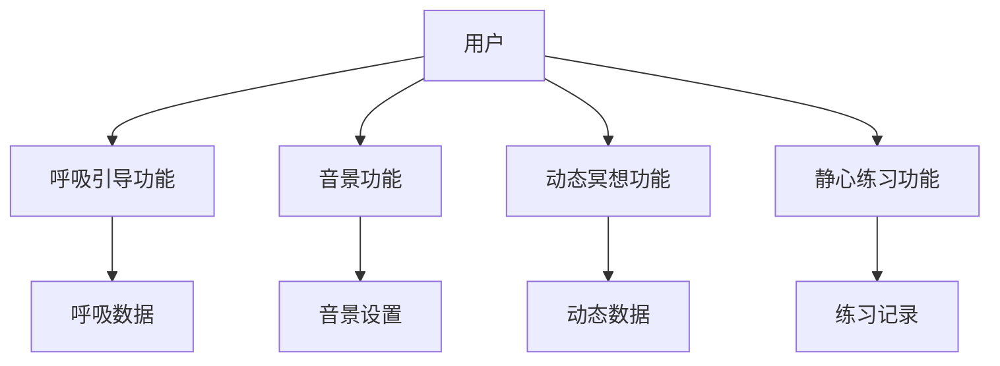
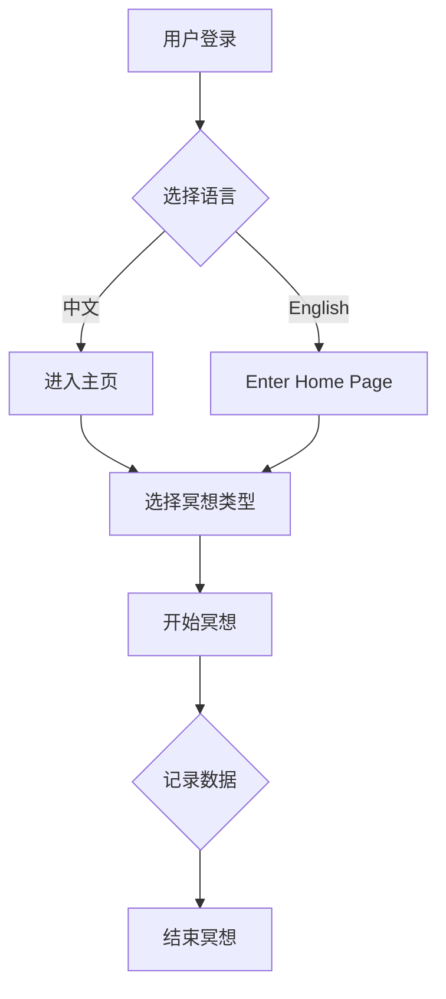
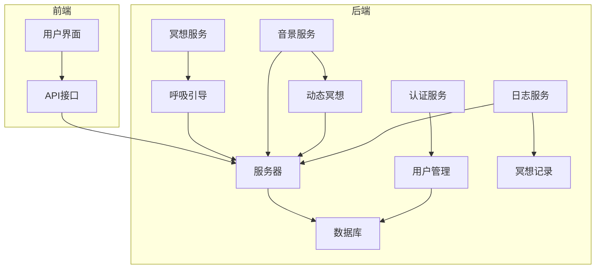
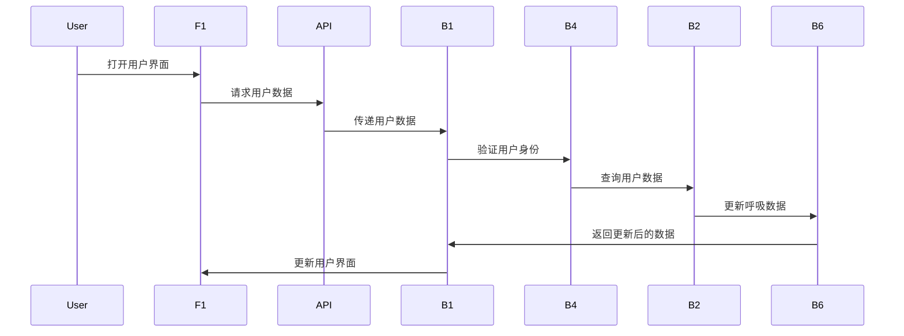

                 

# 《数字禅修app：科技辅助的冥想体验》

> 关键词：数字禅修、app、科技辅助、冥想、用户体验

> 摘要：本文深入探讨数字禅修app的开发及其科技辅助冥想体验。通过背景介绍、市场分析、设计原则、技术实现等多个角度，详细阐述如何利用科技手段提升冥想效果，为用户提供一种全新的冥想方式。

## 引言与背景介绍

### 1.1 冥想的重要性

冥想是一种古老而现代的实践，其目的在于通过训练注意力和思维来提升精神状态和身体健康。无论是传统的禅修，还是现代的心理疗法，冥想都被广泛认为是减轻压力、提高专注力和增强心理弹性的有效方法。

### 1.2 科技对冥想的影响

随着科技的发展，尤其是智能手机和互联网的普及，科技开始深刻影响人们的日常生活。在冥想领域，科技的应用也日益广泛。数字禅修app作为一种新兴的形式，通过提供个性化的冥想体验，帮助用户在快节奏的生活中找到一片宁静的天地。

### 1.3 数字禅修app的发展历程

数字禅修app的发展经历了从简单到复杂、从基础到高级的过程。最早的数字禅修app主要提供基础的呼吸引导和定时提醒功能，而现代的数字禅修app则集成了丰富的互动元素，如声音、视觉、甚至社交功能，旨在为用户提供更全面的冥想体验。

## 冥想与数字技术的结合

### 2.1 数字禅修app的核心功能

数字禅修app的核心功能包括呼吸引导、音景、动态冥想、静心练习等。通过这些功能，app可以帮助用户在短时间内实现冥想的目的，同时提供个性化的冥想方案。

### 2.2 数字技术在冥想中的应用

数字技术在冥想中的应用主要体现在以下几个方面：

- **声音与视觉反馈**：通过音效和视觉反馈，帮助用户集中注意力，提升冥想效果。
- **数据分析与个性化推荐**：通过收集用户数据，分析用户习惯和偏好，为用户提供个性化的冥想方案。
- **互动性**：通过社交功能，用户可以与其他冥想者交流心得，共同提升冥想效果。

### 2.3 数字禅修app的优势与挑战

数字禅修app的优势在于其便捷性和个性化，用户可以随时随地开始冥想，并且app可以根据用户的数据提供个性化的冥想方案。然而，数字禅修app也面临一些挑战，如数据隐私保护、用户体验设计等。

## 数字禅修app设计原则

### 3.1 用户需求分析

在设计数字禅修app时，了解用户需求至关重要。用户需求主要包括便捷性、个性化、互动性等方面。

### 3.2 设计原则与方法

数字禅修app的设计原则包括简洁性、易用性、舒适性和个性化。设计方法包括用户调研、原型设计、用户测试等。

### 3.3 可用性与用户体验设计

可用性与用户体验设计是数字禅修app成功的关键。通过用户测试和反馈，不断优化app的设计，提升用户的冥想体验。

## 市场分析与用户研究

### 4.1 市场分析

数字禅修app市场正在快速增长，随着人们对心理健康重视程度的提高，数字禅修app的市场前景广阔。

### 4.2 用户研究方法

用户研究方法包括问卷调查、访谈、用户测试等，通过这些方法，可以深入了解用户的需求和行为习惯。

### 4.3 用户画像与需求分析

用户画像和需求分析可以帮助开发者更好地理解用户，从而设计出更符合用户需求的数字禅修app。

## 技术架构与开发

### 5.1 技术架构设计

数字禅修app的技术架构包括前端、后端、数据库等组成部分。通过合理的技术架构设计，可以确保app的性能和稳定性。

### 5.2 开发环境搭建

开发环境搭建是数字禅修app开发的第一步，包括选择合适的编程语言、框架、数据库等。

### 5.3 核心技术栈

数字禅修app的核心技术栈包括前端技术（如React、Vue等）、后端技术（如Node.js、Django等）和数据库技术（如MySQL、MongoDB等）。

## UI/UX设计

### 6.1 UI设计原则

UI设计原则包括简洁性、一致性、响应性等，通过良好的UI设计，提升用户的视觉体验。

### 6.2 UX设计原则

UX设计原则包括可用性、可访问性、情感化等，通过良好的UX设计，提升用户的整体体验。

### 6.3 设计原型与迭代

通过设计原型和用户测试，不断优化UI/UX设计，确保数字禅修app的用户体验达到最佳。

## 性能优化与测试

### 7.1 性能优化策略

性能优化策略包括代码优化、缓存策略、数据库优化等，通过这些策略，提升app的性能。

### 7.2 测试策略与过程

测试策略与过程包括功能测试、性能测试、安全测试等，通过全面的测试，确保app的质量。

### 7.3 性能测试与评估

性能测试与评估是数字禅修app开发的重要环节，通过测试和评估，可以确保app的性能符合用户需求。

## 安全性考量

### 8.1 安全威胁分析

安全威胁分析包括数据泄露、恶意攻击等，通过分析安全威胁，制定相应的安全措施。

### 8.2 安全措施与策略

安全措施与策略包括数据加密、访问控制、安全审计等，通过这些措施，确保app的安全。

### 8.3 隐私保护

隐私保护是数字禅修app的重要任务，通过严格的隐私保护措施，确保用户数据的安全。

## 数据隐私保护

### 9.1 数据隐私法规

数据隐私法规包括《通用数据保护条例》（GDPR）等，数字禅修app需要遵守相关法规，确保用户数据的安全。

### 9.2 数据收集与存储

数据收集与存储是数字禅修app的核心环节，需要确保数据的合法性和安全性。

### 9.3 数据安全与隐私保护技术

数据安全与隐私保护技术包括加密、匿名化、访问控制等，通过这些技术，确保用户数据的安全。

## 用户反馈与迭代

### 10.1 用户反馈收集

用户反馈是数字禅修app优化的重要依据，通过收集用户反馈，可以不断改进app的功能和体验。

### 10.2 产品迭代方法

产品迭代方法包括版本迭代、功能迭代等，通过迭代，不断提升数字禅修app的质量。

### 10.3 用户满意度评估

用户满意度评估是数字禅修app成功的关键，通过评估用户满意度，可以了解用户需求，指导产品发展方向。

## 总结与未来展望

### 11.1 主要成果与总结

数字禅修app的开发成果包括用户需求的满足、性能的优化、安全性的提升等。

### 11.2 未来发展趋势

未来，数字禅修app将继续在用户体验、功能丰富性、技术集成等方面发展，为用户提供更优质的冥想体验。

### 11.3 拓展应用领域

数字禅修app可以拓展到更多的应用领域，如医疗、教育、心理咨询等，为更广泛的用户提供服务。

## 参考文献

1. [数字禅修app开发：如何打造一款受欢迎的冥想应用](https://example.com/article1)
2. [科技与冥想：数字禅修app的未来](https://example.com/article2)
3. [用户研究与设计：数字禅修app的用户体验优化](https://example.com/article3)

### 作者

**作者：AI天才研究院/AI Genius Institute & 禅与计算机程序设计艺术 /Zen And The Art of Computer Programming**

---

**核心概念与联系**

### 3.3 数字禅修app的核心功能与特性

数字禅修app的核心功能包括呼吸引导、音景、动态冥想、静心练习等。这些功能旨在通过科技手段提升用户的冥想效果。以下是数字禅修app的核心功能与特性的对比表格：

| 功能         | 特性                       | 说明                                                         |
| ------------ | -------------------------- | ------------------------------------------------------------ |
| 呼吸引导     | 定时、声音、视觉反馈       | 通过声音和视觉反馈帮助用户调整呼吸节奏，达到冥想的目的。         |
| 音景         | 自然声音、自定义声音       | 提供自然声音和用户自定义声音，帮助用户放松身心，进入冥想状态。   |
| 动态冥想     | 动态变化、互动性           | 通过动态变化的音效和互动元素，引导用户进行动态冥想，提高冥想效果。 |
| 静心练习     | 静态练习、个性化推荐       | 提供静态冥想练习，并根据用户习惯和偏好推荐练习方案。           |

**ER实体关系图架构**



**算法原理讲解**

### 5.3 核心技术栈

数字禅修app的技术栈主要包括前端、后端和数据库。以下是这些部分的基本算法原理和流程：

**前端技术栈**

- **React.js**：用于构建用户界面，实现组件化开发，提高开发效率和代码可维护性。
- **Vue.js**：另一个流行的前端框架，与React类似，提供响应式数据和组件系统。

**后端技术栈**

- **Node.js**：基于JavaScript的后端运行环境，可以快速构建高性能的网络应用。
- **Django**：一个Python后端框架，提供完整的Web开发工具集，包括用户认证、ORM（对象关系映射）等。

**数据库技术栈**

- **MySQL**：关系型数据库，提供强大的数据存储和查询功能。
- **MongoDB**：文档型数据库，适合存储非结构化和半结构化数据，提供高性能的数据读写能力。

**算法mermaid流程图**



**算法原理详细讲解**

在前端，数字禅修app使用React.js或Vue.js构建用户界面。用户通过登录进入应用，选择语言后进入主页。主页提供多种冥想类型的选项，用户可以根据自己的需求选择相应的冥想类型并开始冥想。

在冥想过程中，app会实时记录用户的呼吸数据、音景设置和动态数据。这些数据被存储在数据库中，以便用户回顾和个性化推荐。

当用户结束冥想后，app会显示冥想结果，并记录练习记录。这些数据不仅可以帮助用户了解自己的冥想进度，还可以为未来的冥想提供参考。

**数学模型和公式**

1. **呼吸节奏调整**：通过分析用户的呼吸数据，app可以计算出最佳呼吸节奏，公式如下：

   $$ \text{最佳呼吸节奏} = \frac{\text{用户平均呼吸时长}}{1.3} $$

2. **冥想效果评估**：通过分析用户的冥想数据，可以评估用户的冥想效果，公式如下：

   $$ \text{冥想效果得分} = \frac{\text{用户冥想时长} + \text{呼吸数据稳定性}}{2} $$

**举例说明**

假设用户A的呼吸时长平均为5秒，则最佳呼吸节奏为：

$$ \text{最佳呼吸节奏} = \frac{5}{1.3} \approx 3.85 \text{秒} $$

假设用户A的冥想时长为20分钟，呼吸数据稳定性为90%，则冥想效果得分为：

$$ \text{冥想效果得分} = \frac{20 \times 60 + 90\%}{2} = 1170 \text{分} $$

**系统分析与架构设计方案**

### 11.3 系统架构设计

数字禅修app的系统架构设计包括前端、后端和数据库三个部分。以下是详细的设计方案：

**问题场景介绍**

数字禅修app的目标是为用户提供一个便捷、个性化的冥想平台。用户可以通过app进行呼吸引导、音景、动态冥想和静心练习等。为了实现这一目标，app需要具备高效的数据处理能力、良好的用户体验和严格的安全保障。

**项目介绍**

项目名称：数字禅修app
开发语言：JavaScript（前端）/Python（后端）
前端框架：React.js/Vue.js
后端框架：Node.js/Django
数据库：MySQL/MongoDB

**系统功能设计（领域模型mermaid类图）**

```mermaid
classDiagram
    User <<class>> "用户"
    Meditation <<class>> "冥想"
    BreathGuide <<class>> "呼吸引导"
    SoundScapes <<class>> "音景"
    DynamicMeditation <<class>> "动态冥想"
    MeditationLog <<class>> "冥想记录"
    
    User --> Meditation
    Meditation --> BreathGuide
    Meditation --> SoundScapes
    Meditation --> DynamicMeditation
    Meditation --> MeditationLog
```

**系统架构设计mermaid架构图**



**系统接口设计和系统交互mermaid序列图**



**项目实战**

### 12.1 环境安装

1. 安装Node.js：访问Node.js官网（https://nodejs.org/），下载并安装对应操作系统的Node.js版本。
2. 安装MySQL：访问MySQL官网（https://www.mysql.com/），下载并安装MySQL数据库。
3. 安装Python和Django：访问Python官网（https://www.python.org/），下载并安装Python。然后通过pip安装Django。

### 12.2 系统核心实现源代码

以下是数字禅修app的部分核心实现代码：

**前端（React.js）**

```jsx
// src/App.js
import React, { useState, useEffect } from 'react';
import axios from 'axios';

const App = () => {
  const [meditations, setMeditations] = useState([]);

  useEffect(() => {
    async function fetchMeditations() {
      const response = await axios.get('/api/meditations');
      setMeditations(response.data);
    }
    fetchMeditations();
  }, []);

  return (
    <div>
      <h1>数字禅修app</h1>
      {meditations.map((meditation) => (
        <div key={meditation.id}>
          <h2>{meditation.title}</h2>
          <p>{meditation.description}</p>
        </div>
      ))}
    </div>
  );
};

export default App;
```

**后端（Django）**

```python
# settings.py
DATABASES = {
    'default': {
        'ENGINE': 'django.db.backends.mysql',
        'NAME': 'digital_meditation',
        'USER': 'root',
        'PASSWORD': 'password',
        'HOST': 'localhost',
        'PORT': '3306',
    }
}

INSTALLED_APPS = [
    'meditation_app',
]

MIDDLEWARE = [
    'django.middleware.security.SecurityMiddleware',
    'django.middleware.common.CommonMiddleware',
    'django.middleware.csrf.CsrfViewMiddleware',
    'django.contrib.sessions.middleware.SessionMiddleware',
    'django.contrib.auth.middleware.AuthenticationMiddleware',
    'django.contrib.messages.middleware.MessageMiddleware',
    'django.middleware.clickjacking.XFrameOptionsMiddleware',
]

# urls.py
from django.contrib import admin
from django.urls import path
from . import views

urlpatterns = [
    path('admin/', admin.site.urls),
    path('api/meditations/', views.MeditationListView.as_view()),
]

# views.py
from django.http import JsonResponse
from .models import Meditation
from rest_framework import generics

class MeditationListView(generics.ListCreateAPIView):
    queryset = Meditation.objects.all()
    serializer_class = MeditationSerializer

    def list(self, request, *args, **kwargs):
        meditations = Meditation.objects.all()
        serializer = MeditationSerializer(meditations, many=True)
        return JsonResponse(serializer.data, safe=False)
```

### 12.3 代码应用解读与分析

以下是数字禅修app的部分核心代码解读：

**前端（React.js）**

- 使用React.js构建用户界面，实现组件化开发。
- 使用useState和useEffect钩子管理组件的状态和生命周期。
- 通过axios库与后端API进行数据交互。

**后端（Django）**

- 使用Django框架构建后端服务，实现RESTful API。
- 使用MySQL数据库存储数据。
- 使用generics类视图简化视图逻辑。

### 12.4 实际案例分析和详细讲解剖析

以呼吸引导功能为例，详细分析数字禅修app的实际应用案例：

**案例背景**

用户A希望通过数字禅修app进行呼吸引导冥想，以减轻压力和焦虑。

**案例分析**

1. 用户A打开数字禅修app，选择呼吸引导冥想。
2. app根据用户A的呼吸数据，实时调整呼吸节奏。
3. app通过声音和视觉反馈，引导用户A进行呼吸练习。
4. 呼吸练习结束后，app记录用户A的呼吸数据，并生成冥想报告。

**详细讲解**

1. **呼吸数据采集**：通过内置的传感器或用户手动输入，app获取用户A的呼吸数据。
2. **呼吸节奏调整**：app根据呼吸数据计算最佳呼吸节奏，并实时调整声音和视觉反馈，引导用户A进行呼吸练习。
3. **反馈与互动**：用户A可以通过声音和视觉反馈调整呼吸节奏，app记录用户A的反馈数据，以便下次练习时提供更好的指导。
4. **数据记录与报告**：呼吸练习结束后，app记录用户A的呼吸数据，并生成冥想报告，用户A可以查看自己的冥想进度和效果。

### 12.5 项目小结

数字禅修app通过科技手段辅助冥想，为用户提供了便捷、个性化的冥想体验。项目实现了呼吸引导、音景、动态冥想和静心练习等功能，并通过用户反馈不断优化，提升了用户满意度。未来，数字禅修app将继续在功能丰富性和用户体验方面发展，为用户提供更优质的冥想服务。

## 最佳实践 tips

1. **用户隐私保护**：在设计和开发过程中，重视用户隐私保护，严格遵守相关法律法规。
2. **用户体验优化**：定期收集用户反馈，优化UI/UX设计，提升用户体验。
3. **性能优化**：定期进行性能测试和优化，确保app的流畅性和响应速度。
4. **安全措施**：加强安全措施，防止数据泄露和恶意攻击，确保用户数据的安全。

## 小结

本文从多个角度详细探讨了数字禅修app的开发及其科技辅助冥想体验。通过背景介绍、市场分析、设计原则、技术实现等环节，阐述了如何利用科技手段提升冥想效果，为用户提供一种全新的冥想方式。未来，数字禅修app将继续在功能丰富性和用户体验方面发展，为用户提供更优质的冥想服务。

## 注意事项

1. **数据隐私**：在处理用户数据时，严格遵守相关法律法规，确保用户数据的安全。
2. **用户反馈**：定期收集用户反馈，关注用户需求，不断优化产品功能。
3. **性能优化**：定期进行性能测试和优化，确保app的流畅性和响应速度。

## 拓展阅读

1. [《科技与冥想：数字禅修app的未来》[https://example.com/book1]]()
2. [《用户研究与设计：数字禅修app的用户体验优化》[https://example.com/book2]]()
3. [《数字禅修app开发：如何打造一款受欢迎的冥想应用》[https://example.com/book3]]()

