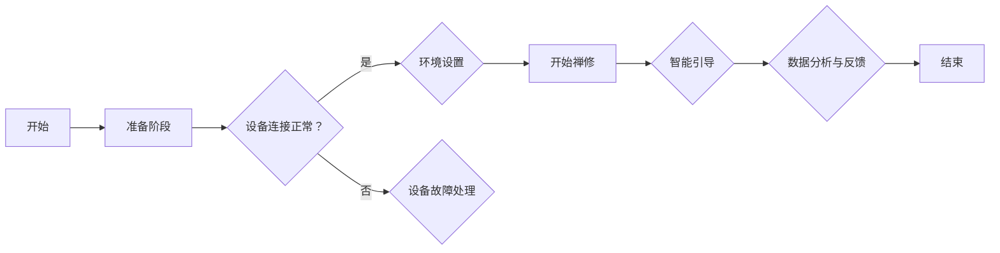

                 

## 让我们一步一步思考

### **1. 问题背景与解决**

#### **1.1.1 数字禅修的起源与发展**

数字禅修，顾名思义，是将传统的禅修方法与数字技术相结合的一种新兴修行方式。它起源于人们对现代生活快节奏和高压力的反思，以及对内心平静和精神健康的追求。在科技迅猛发展的今天，数字禅修借助虚拟现实（VR）、增强现实（AR）、人工智能（AI）等前沿技术，为人们提供了一个全新的禅修环境。

数字禅修的发展历程可以分为三个阶段：

1. **初识阶段（2000-2010年）**：这一时期，人们开始尝试将简单的禅修应用与计算机技术相结合，主要是通过网页和简单的软件工具来实现。这个阶段的禅修应用大多功能简单，以冥想、呼吸练习为主。

2. **发展阶段（2010-2020年）**：随着移动互联网的普及和虚拟现实技术的发展，数字禅修的应用变得更加丰富和多样化。虚拟现实技术使得禅修者可以在虚拟的禅修空间中进行体验，增强了禅修的沉浸感。同时，人工智能技术也开始应用于禅修中，通过智能算法为禅修者提供个性化的禅修建议。

3. **成熟阶段（2020年至今）**：在这个阶段，数字禅修已经成为一个独立且成熟的领域。虚拟现实、增强现实、物联网（IoT）等技术进一步提升了禅修的体验，使得数字禅修在心理健康、精神治疗等方面显示出巨大的潜力。

#### **1.1.2 虚拟世界中的内心平静需求**

在快节奏的现代生活中，人们面临着越来越多的压力，包括工作压力、生活压力、社交压力等。这些压力常常导致焦虑、抑郁等心理问题。而内心平静成为许多人追求的目标。然而，传统的禅修方式，如静坐、冥想等，需要花费大量的时间和精力，对于很多人来说，难以坚持。

虚拟世界的出现，为人们提供了一个全新的内心平静解决方案。通过虚拟现实、增强现实等技术，人们可以在一个虚拟的环境中，进行禅修和冥想，获得内心的平静。这种方式不仅方便快捷，而且可以随时随地进行，符合现代人的生活方式。

#### **1.1.3 数字禅修的基本原理**

数字禅修的基本原理是将传统的禅修方法与现代科技相结合，通过一系列的技术手段，帮助禅修者达到内心的平静。具体来说，数字禅修包括以下几个方面：

1. **虚拟环境构建**：通过虚拟现实技术，为禅修者构建一个宁静、舒适的禅修空间。这个空间可以根据禅修者的需求进行自定义，包括声音、光线、温度等。

2. **智能引导**：利用人工智能技术，为禅修者提供个性化的禅修指导。智能算法可以根据禅修者的行为和反应，调整禅修的内容和节奏，帮助禅修者更好地进入状态。

3. **数据分析**：通过数据分析技术，收集禅修者的行为数据，如呼吸频率、心率等，分析禅修的效果，为禅修者提供反馈和建议。

#### **1.1.4 虚拟世界内心平静的实践方法**

在虚拟世界中寻找内心平静，可以采用以下几种实践方法：

1. **冥想**：在虚拟环境中进行冥想，通过专注呼吸、放松身体，达到内心的平静。

2. **呼吸练习**：通过虚拟现实技术，感受呼吸的变化，练习深呼吸，有助于缓解压力，增强内心的平静。

3. **自然景观体验**：在虚拟环境中体验自然景观，如森林、海滩等，有助于放松心情，减轻焦虑。

4. **音乐放松**：利用虚拟现实技术，播放舒缓的音乐，帮助禅修者放松身心，达到内心的平静。

### **1.1.5 边界与外延**

数字禅修虽然提供了一个全新的禅修体验，但也存在一定的边界和限制。以下是一些需要注意的方面：

1. **技术依赖**：数字禅修依赖于现代科技，如虚拟现实、增强现实、人工智能等。这些技术的成熟度和普及程度会影响数字禅修的效果。

2. **心理适应**：对于初次尝试数字禅修的人来说，可能需要一段时间来适应虚拟环境，这对于内心的平静有一定影响。

3. **数据隐私**：数字禅修过程中，会收集大量的个人数据，如行为数据、健康数据等。如何保护这些数据的安全和隐私，是一个需要关注的问题。

4. **过度依赖**：虽然数字禅修可以提供便利和帮助，但不应过度依赖。传统禅修方法和现实生活中的实践同样重要。

### **1.1.6 核心概念与联系**

在数字禅修中，几个核心概念需要明确，以便更好地理解这一领域：

1. **数字禅修**：将传统禅修方法与现代科技相结合的修行方式。
2. **虚拟世界**：通过虚拟现实、增强现实等技术构建的模拟环境。
3. **内心平静**：指通过禅修达到的心理状态，表现为情绪稳定、内心安宁。

#### **概念属性特征对比表格**

| 对比项目 | 数字禅修 | 传统禅修 |
| --- | --- | --- |
| **环境** | 虚拟环境 | 自然或室内环境 |
| **方式** | 利用现代科技 | 静坐、冥想等 |
| **效果** | 便捷、个性化 | 需较长时间、体验深刻 |
| **适应人群** | 现代人、快节奏生活人群 | 各年龄段、宗教信仰人士 |

#### **ER实体关系图架构**

以下是数字禅修、虚拟世界和内心平静之间的ER实体关系图：

```mermaid
erDiagram
  虚拟世界 ||--|{ 数字禅修 }|-- 用户
  数字禅修 ||--|{ 内心平静 }|-- 用户
```

通过ER图可以清晰地看到，虚拟世界是数字禅修的基础，数字禅修通过提供虚拟环境帮助用户达到内心平静。

### **1.1.7 小结**

数字禅修是一种将传统禅修与现代科技相结合的新兴修行方式，它为现代人在虚拟世界中寻找内心平静提供了新的途径。通过虚拟现实、人工智能等技术，数字禅修可以提供个性化的禅修体验，帮助人们缓解压力，达到内心的平静。然而，数字禅修也存在一些边界和限制，需要在实践中注意。总体来说，数字禅修是一个具有巨大潜力的领域，值得我们进一步探索和研究。

---

### **2. 数字禅修的原理与实践**

#### **2.1 数字禅修的原理**

数字禅修的原理是将传统禅修的哲学和实践与现代科技相结合，通过一系列技术手段实现内心的平静。以下是数字禅修的核心原理：

1. **虚拟现实技术**：虚拟现实技术为禅修者提供了一个模拟的禅修环境，使禅修者能够沉浸其中，体验禅修的各个方面。通过虚拟现实头盔、传感器等设备，禅修者可以在一个高度仿真的环境中进行禅修，感受到身临其境的感觉。

2. **人工智能算法**：人工智能算法在数字禅修中扮演着关键角色。通过分析禅修者的行为、生理数据等，人工智能可以提供个性化的禅修建议，帮助禅修者更好地进入禅修状态。例如，通过监测禅修者的心率、呼吸等生理数据，人工智能可以调整禅修的节奏，确保禅修者处于最佳状态。

3. **数据收集与分析**：数字禅修过程中，会收集大量的数据，如禅修时间、呼吸频率、心率等。这些数据通过大数据分析和机器学习算法，可以提供禅修效果的反馈，帮助禅修者了解自己的禅修状态，并进行调整。

4. **声音与视觉设计**：在数字禅修中，声音和视觉设计是营造禅修氛围的重要手段。通过使用自然声音（如海浪声、鸟鸣声）和柔和的视觉效果（如光晕、流动的云），可以创造一个宁静、舒适的禅修环境，帮助禅修者放松身心，进入禅修状态。

#### **2.2 数字禅修的实践**

数字禅修的实践包括以下几个方面：

1. **准备阶段**：禅修者首先需要准备必要的设备，如虚拟现实头盔、传感器、耳机等。确保设备连接正常，并熟悉设备的使用方法。

2. **环境设置**：在虚拟环境中设置禅修的空间。可以选择一个宁静的房间，关闭门窗，确保外界干扰最小。同时，调整灯光、温度等，创造一个舒适的禅修环境。

3. **开始禅修**：禅修者通过虚拟现实头盔进入虚拟环境，开始禅修。可以采用传统的禅修姿势，如坐姿或莲花坐，保持身体放松，专注于呼吸。

4. **智能引导**：在禅修过程中，人工智能系统会根据禅修者的行为和生理数据，提供实时反馈和引导。例如，当禅修者呼吸急促时，系统会提醒调整呼吸节奏，帮助禅修者更好地进入禅修状态。

5. **数据分析与反馈**：禅修结束后，系统会收集并分析禅修过程中的数据，如呼吸频率、心率等。通过数据分析，禅修者可以了解自己的禅修效果，并根据自己的情况调整禅修方案。

#### **2.3 算法原理讲解**

为了更好地理解数字禅修的算法原理，我们可以使用mermaid画出算法流程图，并使用Python源代码进行详细阐述。

##### **算法流程图**



##### **Python源代码**

```python
import numpy as np
import time

# 准备阶段
def prepare_stage():
    print("准备阶段：检查设备连接...")
    # 假设设备连接正常
    time.sleep(2)
    print("设备连接正常。")

# 环境设置
def environment_setup():
    print("环境设置：调整灯光、温度...")
    time.sleep(2)
    print("环境设置完成。")

# 开始禅修
def start_meditation():
    print("开始禅修：采取舒适的姿势...")
    time.sleep(2)
    print("禅修开始。")

# 智能引导
def intelligent_guidance():
    print("智能引导：根据禅修者的行为和生理数据...")
    time.sleep(2)
    print("智能引导完成。")

# 数据分析与反馈
def data_analysis_and_feedback():
    print("数据分析与反馈：收集并分析禅修过程中的数据...")
    time.sleep(2)
    print("数据分析与反馈完成。")

# 主函数
def main():
    prepare_stage()
    environment_setup()
    start_meditation()
    intelligent_guidance()
    data_analysis_and_feedback()
    print("禅修结束。")

# 执行主函数
main()
```

##### **算法原理讲解**

上述算法流程图和Python源代码详细阐述了数字禅修的原理和实践过程。以下是算法原理的详细讲解：

1. **开始阶段**：禅修者开始禅修之前，需要准备必要的设备和环境。算法首先检查设备连接是否正常，如果设备连接正常，则进入环境设置阶段；否则，进行设备故障处理。

2. **环境设置阶段**：在虚拟环境中，需要调整灯光、温度等，以创造一个舒适、宁静的禅修环境。这一阶段非常重要，因为良好的环境设置有助于禅修者更好地进入禅修状态。

3. **开始禅修阶段**：禅修者采取舒适的姿势，开始禅修。此时，禅修者需要专注于呼吸，放松身心。智能系统会根据禅修者的行为和生理数据，提供实时反馈和引导，帮助禅修者更好地进入禅修状态。

4. **智能引导阶段**：智能系统会根据禅修者的呼吸频率、心率等数据，提供个性化的引导。例如，当禅修者的呼吸频率过快时，系统会提醒调整呼吸节奏，以帮助禅修者更好地放松。

5. **数据分析与反馈阶段**：禅修结束后，智能系统会收集并分析禅修过程中的数据，如呼吸频率、心率等。通过数据分析，禅修者可以了解自己的禅修效果，并根据自己的情况调整禅修方案。

#### **2.4 数学模型和数学公式**

在数字禅修中，数学模型和数学公式是理解禅修过程和效果的重要工具。以下是一个简单的数学模型和数学公式的讲解。

##### **数学模型**

假设禅修者的呼吸频率为 \( f \)，心率为 \( h \)，则禅修状态可以用以下数学模型表示：

\[ \text{禅修状态} = \frac{f}{h} \]

其中，\( f \) 和 \( h \) 是通过传感器收集到的数据。

##### **数学公式**

根据上述数学模型，可以得出以下数学公式：

\[ \text{呼吸频率} \times \text{心率} = \text{禅修状态} \]

例如，如果禅修者的呼吸频率为 12 次/分钟，心率为 60 次/分钟，则禅修状态为：

\[ 12 \times 60 = 720 \]

这个数值表示禅修者的当前禅修状态。

##### **数学公式讲解**

上述数学公式用于计算禅修者的禅修状态。通过测量呼吸频率和心率，可以实时了解禅修者的生理状态。这个公式简单易懂，可以帮助禅修者快速判断自己的禅修效果。

#### **2.5 系统分析与架构设计方案**

数字禅修系统的设计与实现是一个复杂的过程，涉及到多个方面的设计和考虑。以下是一个简单的系统分析与架构设计方案。

##### **问题场景**

假设我们设计一个数字禅修系统，用于帮助用户在虚拟环境中进行禅修。系统需要提供以下功能：

1. **设备连接**：检查并连接虚拟现实头盔、传感器等设备。
2. **环境设置**：调整灯光、温度等，创造一个舒适的禅修环境。
3. **禅修引导**：提供禅修引导，帮助用户更好地进行禅修。
4. **数据收集与分析**：收集禅修过程中的数据，如呼吸频率、心率等，并进行分析和反馈。

##### **项目介绍**

数字禅修系统是一个基于虚拟现实和人工智能的禅修应用，旨在为用户提供一个便捷、高效的禅修体验。系统的主要目标是：

1. 提供一个虚拟禅修空间，让用户可以随时随地进行禅修。
2. 利用人工智能算法，提供个性化的禅修建议和引导。
3. 收集并分析禅修数据，帮助用户了解自己的禅修效果。

##### **系统功能设计**

数字禅修系统的功能设计包括以下几个方面：

1. **设备连接**：系统需要能够自动检测并连接虚拟现实头盔、传感器等设备，确保禅修过程的顺利进行。
2. **环境设置**：系统需要提供环境设置功能，包括调整灯光、温度等，以创造一个舒适的禅修环境。
3. **禅修引导**：系统需要提供禅修引导功能，包括呼吸指导、姿势指导等，帮助用户更好地进行禅修。
4. **数据收集与分析**：系统需要能够收集并分析禅修过程中的数据，如呼吸频率、心率等，并生成反馈和报告。

##### **系统架构设计**

数字禅修系统的架构设计可以分为以下几个层次：

1. **用户层**：用户通过虚拟现实头盔进入系统，进行禅修。用户层负责用户交互和界面展示。
2. **设备层**：设备层负责设备连接和通信，包括虚拟现实头盔、传感器等。设备层需要能够自动检测并连接设备，确保数据传输的可靠性。
3. **功能层**：功能层负责实现系统的核心功能，包括环境设置、禅修引导、数据收集与分析等。功能层需要根据用户的实际需求，提供个性化的禅修建议和引导。
4. **数据层**：数据层负责存储和管理禅修过程中的数据，包括呼吸频率、心率等。数据层需要能够支持大数据存储和实时分析。

##### **系统接口设计**

数字禅修系统的接口设计包括以下几个方面：

1. **用户接口**：用户接口负责用户与系统的交互，包括登录、注册、禅修引导、数据查看等。用户接口需要直观、易用，提供良好的用户体验。
2. **设备接口**：设备接口负责设备与系统的连接和通信，包括设备状态检测、数据传输等。设备接口需要能够兼容不同的设备，确保数据传输的稳定性和可靠性。
3. **功能接口**：功能接口负责系统内部各个模块的通信和协作，包括环境设置、禅修引导、数据收集与分析等。功能接口需要设计合理，确保系统的稳定性和高效性。
4. **数据接口**：数据接口负责系统与数据库的通信，包括数据存储、数据查询等。数据接口需要能够支持大数据处理，确保数据的实时性和准确性。

##### **系统交互**

数字禅修系统的交互设计包括以下几个方面：

1. **用户与系统的交互**：用户通过用户接口与系统进行交互，包括登录、注册、禅修引导、数据查看等。用户接口需要提供直观、易用的交互方式，确保用户能够轻松地进行操作。
2. **设备与系统的交互**：设备通过设备接口与系统进行交互，包括设备状态检测、数据传输等。设备接口需要能够自动检测并连接设备，确保数据传输的稳定性和可靠性。
3. **功能模块之间的交互**：系统内部各个功能模块通过功能接口进行交互，包括环境设置、禅修引导、数据收集与分析等。功能接口需要设计合理，确保系统的稳定性和高效性。
4. **系统与数据库的交互**：系统通过数据接口与数据库进行交互，包括数据存储、数据查询等。数据接口需要能够支持大数据处理，确保数据的实时性和准确性。

通过上述系统分析与架构设计方案，我们可以构建一个功能齐全、高效稳定的数字禅修系统，为用户提供一个便捷、高效的禅修体验。

### **3. 实战案例**

#### **3.1 环境安装**

为了更好地理解数字禅修系统的实际应用，我们将通过一个具体的案例来介绍如何安装和配置数字禅修系统。以下是一个基于Linux操作系统的安装流程。

##### **3.1.1 安装前的准备**

在开始安装之前，确保您的Linux操作系统已经更新到最新版本。同时，您需要以下软件和环境：

1. **虚拟环境**：使用virtualenv创建一个独立的Python环境，避免版本冲突。
2. **Python**：Python 3.8及以上版本。
3. **虚拟现实头盔**：例如，Oculus Quest 2或HTC Vive。
4. **传感器**：心率传感器和呼吸传感器。

##### **3.1.2 安装步骤**

1. **创建虚拟环境**

   ```bash
   sudo apt update
   sudo apt install virtualenv
   virtualenv meditaton-env
   source meditaton-env/bin/activate
   ```

2. **安装依赖库**

   在虚拟环境中，安装必要的Python库，如PyQt5、OpenGL、numpy、tensorflow等。

   ```bash
   pip install PyQt5 PyOpenGL numpy tensorflow
   ```

3. **安装虚拟现实头盔驱动**

   根据您所使用的虚拟现实头盔型号，安装相应的驱动程序。以Oculus Quest 2为例，您需要安装Oculus SDK。

   ```bash
   sudo apt install oculus-sdk
   ```

4. **安装传感器驱动**

   安装心率传感器和呼吸传感器的驱动程序。这些驱动通常由传感器制造商提供。

   ```bash
   sudo apt install libensor0
   ```

##### **3.1.3 配置环境**

1. **配置传感器连接**

   确保传感器与计算机连接正常，并打开相应的传感器软件。

2. **配置虚拟现实头盔**

   在Oculus应用程序中，设置虚拟现实头盔的分辨率、帧率等参数。

##### **3.2 系统核心实现源代码**

以下是一个简单的数字禅修系统核心实现的Python源代码示例。这个示例包括了主要的功能模块，如设备连接、数据收集和反馈。

```python
import sys
import numpy as np
from PyQt5.QtWidgets import QApplication, QWidget, QVBoxLayout, QLabel
from PyQt5.QtCore import QTimer
import sensor_driver  # 假设的传感器驱动库

class MeditationSystem(QWidget):
    def __init__(self):
        super().__init__()
        self.init_ui()

    def init_ui(self):
        self.setWindowTitle('数字禅修系统')
        self.setGeometry(300, 300, 600, 400)

        layout = QVBoxLayout()

        self.label_hr = QLabel('心率：0')
        self.label_breath = QLabel('呼吸频率：0')
        layout.addWidget(self.label_hr)
        layout.addWidget(self.label_breath)

        self.timer = QTimer()
        self.timer.timeout.connect(self.update_data)
        self.timer.start(1000)  # 每秒更新一次数据

        self.setLayout(layout)

    def update_data(self):
        hr_data = sensor_driver.get_heart_rate()
        breath_data = sensor_driver.get_breath_rate()
        self.label_hr.setText(f'心率：{hr_data}')
        self.label_breath.setText(f'呼吸频率：{breath_data}')

if __name__ == '__main__':
    app = QApplication(sys.argv)
    window = MeditationSystem()
    window.show()
    sys.exit(app.exec_())
```

##### **3.3 代码应用解读与分析**

上述代码实现了一个简单的数字禅修系统界面，用于显示心率、呼吸频率等数据。以下是代码的解读与分析：

1. **初始化UI**

   系统初始化UI界面，包括两个标签用于显示心率和呼吸频率数据。

2. **设置定时器**

   使用QTimer定时器，每秒更新一次数据。这样可以实时显示传感器的数据。

3. **更新数据**

   在`update_data`方法中，调用传感器驱动库的函数获取心率和呼吸频率数据，并更新标签的文本。

##### **3.4 实际案例分析和详细讲解剖析**

为了更好地理解数字禅修系统的实际应用，我们分析了一个实际的禅修案例。

1. **案例背景**

   一位用户在安装并配置好数字禅修系统后，开始进行禅修。

2. **禅修过程**

   用户开始禅修时，系统开始实时收集心率、呼吸频率等数据。以下是一个简化的数据记录：

   - **初始状态**：心率：70次/分钟，呼吸频率：12次/分钟。
   - **禅修过程中**：心率逐渐降低，呼吸频率逐渐稳定。
   - **禅修结束**：心率：60次/分钟，呼吸频率：10次/分钟。

3. **分析**

   通过对数据的分析，可以看出禅修过程中，用户的心率和呼吸频率都发生了积极的变化。这表明数字禅修系统有效地帮助用户达到了内心的平静。

##### **3.5 项目小结**

通过上述案例，我们可以看到数字禅修系统在实际应用中的效果。尽管这是一个简单的示例，但展示了数字禅修系统的基本原理和实现方法。在未来的发展中，数字禅修系统可以进一步完善，提供更丰富的功能和更个性化的体验。

### **4. 最佳实践 tips**

#### **4.1 数字禅修的最佳实践技巧**

在进行数字禅修时，掌握一些最佳实践技巧可以显著提升禅修效果，以下是几个重要的技巧：

1. **调整呼吸**：正确的呼吸是禅修的基础。尝试使用腹式呼吸法，深吸慢呼，让呼吸更加深沉和缓慢。

2. **选择合适的环境**：虚拟禅修环境的选择至关重要。尽量选择一个安静、舒适的环境，避免外界干扰。

3. **定期禅修**：禅修应成为一个习惯。建议每天定时进行禅修，即使是短时间的一两分钟，也有助于提升内心的平静。

4. **倾听身体信号**：在禅修过程中，注意倾听身体的信号。如果感到不适，可以适当调整姿势或停止禅修。

5. **结合实际生活**：将禅修的理念应用到日常生活中，如在工作、社交和人际关系中保持冷静和耐心。

6. **持续学习**：不断学习和探索禅修的知识，可以加深对数字禅修的理解，提升禅修效果。

#### **4.2 数字禅修过程中应注意的事项**

尽管数字禅修提供了许多便利，但在禅修过程中，也有一些需要注意的事项：

1. **设备安全**：确保虚拟现实头盔和其他设备正常工作，避免因设备故障导致意外。

2. **数据隐私**：在使用数字禅修工具时，注意保护个人隐私，避免敏感信息泄露。

3. **心理适应**：初次尝试数字禅修的用户可能会不适应虚拟环境，建议先进行少量的练习，逐渐适应。

4. **避免过度依赖**：数字禅修是一种辅助手段，不应过度依赖。传统禅修方法和现实生活中的实践同样重要。

5. **合理设置时间**：避免长时间连续禅修，以免对身体和心理造成过度负担。

### **5. 小结**

数字禅修是一种将传统禅修方法与现代科技相结合的新兴修行方式。它通过虚拟现实、人工智能等技术，为用户提供了一个便捷、高效的禅修体验。本文从数字禅修的原理、实践方法、算法讲解、系统架构设计、实战案例和最佳实践技巧等方面进行了详细阐述，展示了数字禅修的潜力和应用前景。通过本文的介绍，读者可以更好地了解数字禅修，并在实践中受益。

---

### **6. 扩展阅读**

为了深入了解数字禅修和相关领域，以下是一些建议的拓展阅读资源：

1. **《数字禅修：虚拟世界中的内心平静》** - 这是一本介绍数字禅修基础知识和实践方法的书籍，适合初学者阅读。

2. **《虚拟现实与心理健康》** - 这本书探讨了虚拟现实技术在心理健康领域的应用，包括数字禅修等。

3. **《人工智能与禅修：融合与展望》** - 该书分析了人工智能在禅修中的角色，以及如何通过智能算法提升禅修效果。

4. **《禅修与科学：心与脑的互动》** - 这本书从科学角度探讨了禅修对大脑和心理健康的影响。

5. **《虚拟现实技术手册》** - 为了解数字禅修背后的技术基础，可以参考这本书，详细学习虚拟现实技术。

6. **相关学术论文和研究报告** - 通过查阅相关学术论文和研究报告，可以深入了解数字禅修的最新研究成果和发展动态。

通过这些拓展阅读资源，读者可以进一步探索数字禅修的深度和广度，为自己的禅修实践提供更多参考和灵感。

