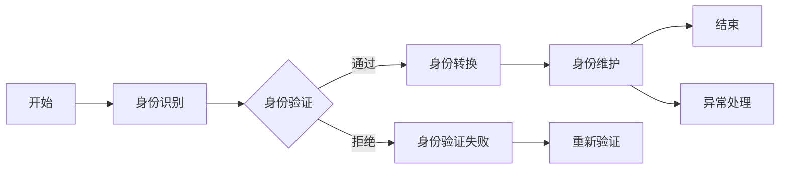
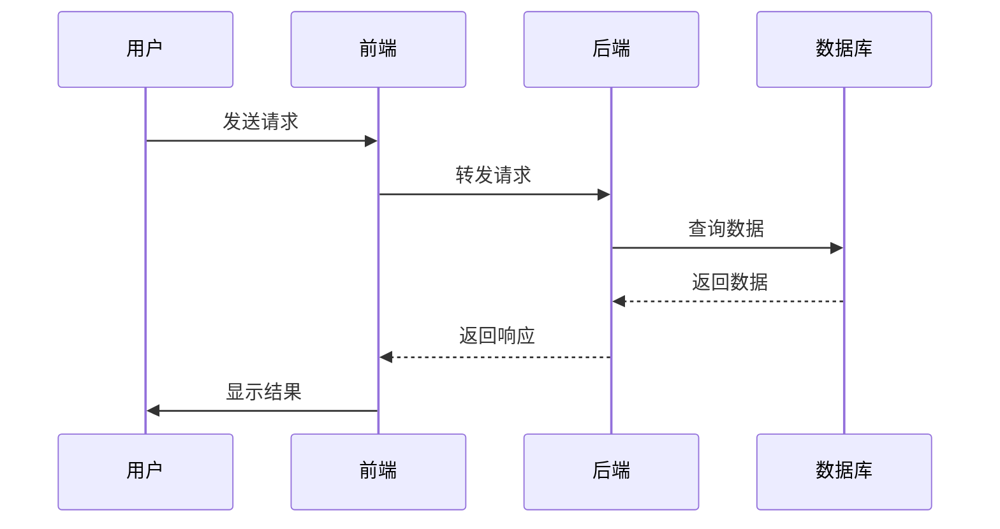

                 

### 文章标题

《数字移民指南：虚拟世界中的身份转换》

> 关键词：数字移民、虚拟世界、身份转换、数字技能、社会适应、未来展望

> 摘要：本文从数字移民的概念入手，深入探讨虚拟世界的背景和原理，解析数字身份的构建与管理，分析身份转换的理论与实践，探讨数字技能的培养和社会文化适应，展望数字移民的未来发展趋势，并讨论伦理与法律问题以及教育与培训。本文旨在为数字移民提供全面、实用的指南，帮助他们在虚拟世界中顺利实现身份转换。

### 目录大纲

**《数字移民指南：虚拟世界中的身份转换》**

----------------------------------------------------------------

## 第一部分：数字移民的背景与挑战

### 第1章：数字移民的概念与时代背景

- 1.1 数字移民的定义
- 1.2 数字移民的时代背景
- 1.3 数字移民的重要性
- 1.4 数字移民面临的挑战

### 第2章：虚拟世界的基本原理

- 2.1 虚拟世界的定义与特点
- 2.2 虚拟现实技术简介
- 2.3 虚拟世界中的交互方式
- 2.4 虚拟世界中的身份构建

### 第3章：数字身份的构建与管理

- 3.1 数字身份的组成
- 3.2 数字身份的安全性
- 3.3 数字身份的隐私保护
- 3.4 数字身份的管理策略

## 第二部分：数字移民的身份转换

### 第4章：身份转换的理论与实践

- 4.1 身份转换的理论基础
- 4.2 身份转换的过程分析
- 4.3 身份转换的实践案例
- 4.4 身份转换的挑战与解决方案

### 第5章：数字移民技能的培养

- 5.1 数字技能的基本分类
- 5.2 数字技能的培养方法
- 5.3 数字技能的实战应用
- 5.4 数字技能的发展趋势

### 第6章：数字移民的社会与文化适应

- 6.1 数字社会的特点
- 6.2 数字文化的适应
- 6.3 数字移民的心理调适
- 6.4 数字移民的社会融入

## 第三部分：数字移民的未来展望

### 第7章：数字移民的未来发展趋势

- 7.1 数字移民的未来趋势
- 7.2 数字世界的未来愿景
- 7.3 数字移民的未来挑战
- 7.4 数字移民的未来策略

### 第8章：数字移民的伦理与法律问题

- 8.1 数字移民的伦理问题
- 8.2 数字移民的法律问题
- 8.3 数字移民的伦理法律框架
- 8.4 数字移民的伦理法律实践

### 第9章：数字移民的教育与培训

- 9.1 数字移民教育的需求
- 9.2 数字移民培训的模式
- 9.3 数字移民教育的内容
- 9.4 数字移民教育的未来

----------------------------------------------------------------

以上是《数字移民指南：虚拟世界中的身份转换》的目录大纲，涵盖了数字移民的背景、虚拟世界的基本原理、数字身份的构建与管理、身份转换的理论与实践、数字移民技能的培养、数字移民的社会与文化适应、数字移民的未来发展趋势、数字移民的伦理与法律问题以及数字移民的教育与培训等内容，旨在帮助读者全面了解数字移民的概念、过程和未来，提供实用的指导和建议。

### 文章正文

#### 第一部分：数字移民的背景与挑战

##### 第1章：数字移民的概念与时代背景

**1.1 数字移民的定义**

数字移民，指的是那些从传统物理世界向虚拟世界迁移，并在虚拟世界中建立和维持身份的人。这些人可能是通过社交媒体、在线游戏、虚拟现实平台等数字渠道进行互动的个体，也可能是企业、组织或政府机构等在数字环境中运营的实体。

**1.2 数字移民的时代背景**

随着互联网技术的飞速发展，数字化已渗透到社会生活的方方面面。从电子商务到在线教育，从远程办公到虚拟现实体验，数字世界正以前所未有的速度和规模扩张。在这个背景下，数字移民成为了不可避免的现象。

**1.3 数字移民的重要性**

数字移民对于个人和社会都具有重要意义。对个人而言，数字技能的掌握可以提升职业竞争力，拓展社交网络，提高生活质量。对社会而言，数字移民推动了数字经济的发展，促进了创新与协作，也带来了社会文化的多样性和融合。

**1.4 数字移民面临的挑战**

尽管数字移民带来了诸多机遇，但也面临不少挑战。这些挑战包括但不限于数字技能的差距、隐私保护问题、网络安全威胁、伦理与法律规范的不完善等。

#### 第2章：虚拟世界的基本原理

**2.1 虚拟世界的定义与特点**

虚拟世界是一个通过计算机技术创建的模拟环境，用户可以在其中进行各种互动和体验。虚拟世界的特点包括高度沉浸感、互动性、可定制性和多样性。

**2.2 虚拟现实技术简介**

虚拟现实（VR）技术是构建虚拟世界的重要手段。它通过头戴显示器、手柄等设备，让用户感受到身临其境的体验。VR技术的核心在于实时渲染和高精度的三维建模。

**2.3 虚拟世界中的交互方式**

在虚拟世界中，用户可以通过语音、手势、文本等多种方式进行交互。这些交互方式不仅增强了沉浸感，也丰富了用户在虚拟世界中的体验。

**2.4 虚拟世界中的身份构建**

在虚拟世界中，用户需要构建数字身份。数字身份不仅包括用户的个人信息，还包括其在虚拟世界中的角色、声誉和社交关系。

#### 第3章：数字身份的构建与管理

**3.1 数字身份的组成**

数字身份由多个组成部分构成，包括用户的基本信息、行为记录、信用记录和社会关系等。这些组成部分共同构建了一个完整的数字身份。

**3.2 数字身份的安全性**

数字身份的安全性至关重要。用户需要采取多种措施来保护自己的数字身份，如使用强密码、启用双因素认证、定期更新软件等。

**3.3 数字身份的隐私保护**

数字身份的隐私保护也是一个重要议题。用户需要了解自己的隐私权利，合理设置隐私选项，避免过度分享个人信息。

**3.4 数字身份的管理策略**

数字身份的管理策略包括数据备份、隐私设置、权限管理等。通过合理的管理策略，用户可以更好地保护和管理自己的数字身份。

#### 第二部分：数字移民的身份转换

##### 第4章：身份转换的理论与实践

**4.1 身份转换的理论基础**

身份转换的理论基础包括社会建构主义、符号互动论等。这些理论指出，身份是一个动态构建的过程，可以通过各种互动和体验来转变。

**4.2 身份转换的过程分析**

身份转换的过程可以分为三个阶段：准备阶段、执行阶段和巩固阶段。在准备阶段，用户需要明确自己的目标和动机；在执行阶段，用户需要积极参与虚拟世界的活动；在巩固阶段，用户需要持续维护和更新自己的数字身份。

**4.3 身份转换的实践案例**

数字移民的身份转换在许多领域都有成功的案例。例如，一些人在虚拟世界中建立了自己的品牌，成为知名的虚拟网红；一些企业在虚拟世界中开展业务，取得了显著的经济效益。

**4.4 身份转换的挑战与解决方案**

身份转换面临的挑战包括技术障碍、文化冲突和隐私风险等。针对这些挑战，可以采取以下解决方案：提升数字技能、加强跨文化交流、完善隐私保护机制等。

##### 第5章：数字移民技能的培养

**5.1 数字技能的基本分类**

数字技能可以分为基础技能和应用技能。基础技能包括计算机操作、网络通信、数据处理等；应用技能包括编程、设计、数据分析等。

**5.2 数字技能的培养方法**

数字技能的培养可以通过多种途径实现，如在线课程、实践项目、工作坊等。通过这些方法，用户可以系统地提升自己的数字技能。

**5.3 数字技能的实战应用**

数字技能的实战应用包括开发软件、设计网站、分析数据等。通过实际项目，用户可以将所学技能应用于解决实际问题。

**5.4 数字技能的发展趋势**

随着技术的进步，数字技能也在不断演变。例如，人工智能、区块链、物联网等新兴技术正在重塑数字技能的要求。

##### 第6章：数字移民的社会与文化适应

**6.1 数字社会的特点**

数字社会的特点包括信息透明、互动频繁、协作共享等。这些特点为数字移民提供了丰富的机遇，但也带来了新的挑战。

**6.2 数字文化的适应**

数字移民需要适应数字文化，包括数字礼仪、数字素养和数字价值观等。通过学习和实践，数字移民可以更好地融入数字社会。

**6.3 数字移民的心理调适**

数字移民在迁移过程中可能会经历焦虑、孤独等心理问题。通过心理调适，数字移民可以更好地适应新环境。

**6.4 数字移民的社会融入**

数字移民的社会融入需要时间，但也需要积极的行动。通过参与社区活动、建立社交网络等，数字移民可以更快地融入数字社会。

#### 第三部分：数字移民的未来展望

##### 第7章：数字移民的未来发展趋势

**7.1 数字移民的未来趋势**

未来，数字移民将继续增长。随着虚拟现实、区块链、人工智能等技术的进步，虚拟世界将更加丰富和多样。

**7.2 数字世界的未来愿景**

数字世界的未来愿景是一个高度智能化、融合化和人性化的虚拟空间。在这个空间中，人类可以自由探索、创造和互动。

**7.3 数字移民的未来挑战**

未来，数字移民将面临更多挑战，如技术鸿沟、隐私风险、伦理问题等。应对这些挑战，需要政策制定者、企业和个人的共同努力。

**7.4 数字移民的未来策略**

数字移民的未来策略包括提升数字素养、加强跨文化交流、推动技术创新等。通过这些策略，数字移民可以更好地适应未来。

##### 第8章：数字移民的伦理与法律问题

**8.1 数字移民的伦理问题**

数字移民的伦理问题包括隐私保护、数字不平等、数字霸凌等。这些问题需要引起广泛关注，并采取相应措施解决。

**8.2 数字移民的法律问题**

数字移民的法律问题包括数据保护法、网络安全法、数字合同法等。完善法律法规，有助于保障数字移民的合法权益。

**8.3 数字移民的伦理法律框架**

数字移民的伦理法律框架应涵盖道德原则、法律规范和监管机制。通过这个框架，可以规范数字移民的行为，维护虚拟世界的秩序。

**8.4 数字移民的伦理法律实践**

数字移民的伦理法律实践包括加强隐私保护、推动公平竞争、规范数字内容等。通过实践，可以推动数字世界的健康发展。

##### 第9章：数字移民的教育与培训

**9.1 数字移民教育的需求**

数字移民的教育需求包括基础技能培训、专业能力提升、跨文化教育等。通过教育，数字移民可以更好地适应虚拟世界。

**9.2 数字移民培训的模式**

数字移民培训的模式包括在线课程、线下培训、工作坊等。这些模式可以根据不同需求进行灵活选择。

**9.3 数字移民教育的内容**

数字移民教育的内容包括计算机科学、数字伦理、数字文化等。通过这些内容的学习，数字移民可以提升自身素养。

**9.4 数字移民教育的未来**

数字移民教育的未来将朝着更加个性化和智能化方向发展。通过技术创新，可以提供更优质的教育资源和服务。

#### 结语

数字移民是一个充满机遇和挑战的过程。通过本文的探讨，我们希望读者能够对数字移民有更深入的了解，并能够在虚拟世界中实现成功的身份转换。

**作者：AI天才研究院/AI Genius Institute & 禅与计算机程序设计艺术 /Zen And The Art of Computer Programming**

### 核心概念与联系

#### 数字身份的核心概念

数字身份（Digital Identity）是用户在数字世界中构建和维持的自我代表。它由多个核心概念组成，包括：

1. **用户信息（User Information）**：包括用户的姓名、年龄、性别、住址、联系方式等基本信息。
2. **行为记录（Behavior Records）**：用户在数字世界中的活动记录，如浏览历史、交易记录、社交媒体互动等。
3. **信用记录（Credit Records）**：用户在数字世界中的信用评级和信用历史。
4. **社交关系（Social Relationships）**：用户在数字世界中的社交网络和人际关系。

#### 数字身份的属性特征对比表格

| 特征 | 用户信息 | 行为记录 | 信用记录 | 社交关系 |
| --- | --- | --- | --- | --- |
| 安全性 | 高 | 中 | 高 | 中 |
| 重要性 | 中 | 高 | 中 | 中 |
| 可变性 | 低 | 中 | 中 | 中 |

#### 数字身份的ER实体关系图架构

```mermaid
erDiagram
  User ||--|{ Behavior } : 记录
  User ||--|{ Credit } : 评级
  User ||--|{ Relationship } : 关联
```

在ER实体关系图中，用户（User）是核心实体，它与行为（Behavior）、信用（Credit）和社交关系（Relationship）三个实体之间存在一对多关系。用户信息、行为记录、信用记录和社交关系共同构成了数字身份的完整架构。

### 算法原理讲解

为了帮助读者更好地理解身份转换的算法原理，我们将使用Mermaid绘制算法流程图，并使用Python源代码详细阐述身份转换的数学模型和公式。

#### Mermaid算法流程图



在这个流程图中，我们首先进行身份识别（B），然后进行身份验证（C）。如果验证通过，用户将进入身份转换阶段（D），否则将进行重新验证（G）。在身份转换成功后，用户将进入身份维护阶段（F），最后流程结束（H）。在身份维护过程中，如果出现异常，将进行异常处理（I）。

#### Python源代码

```python
import random

def identity_recognition():
    print("正在进行身份识别...")
    return "User123"

def identity_validation(identity):
    print("验证身份...")
    # 这里可以使用更复杂的验证逻辑
    if random.random() > 0.5:
        return True
    else:
        return False

def identity_conversion(identity):
    print("进行身份转换...")
    return f"Converted_{identity}"

def identity_maintenance(identity):
    print("维护身份...")
    return f"Maintained_{identity}"

def main():
    identity = identity_recognition()
    if identity_validation(identity):
        new_identity = identity_conversion(identity)
        print(f"新身份：{new_identity}")
        identity = identity_maintenance(new_identity)
        print(f"维护后身份：{identity}")
    else:
        print("身份验证失败，请重新验证。")

if __name__ == "__main__":
    main()
```

在这个Python源代码中，我们首先进行身份识别，然后进行身份验证。如果验证通过，用户将进入身份转换阶段，将原始身份（User123）转换为新的身份（Converted_User123）。在身份维护阶段，用户将继续维护新的身份，并返回维护后的身份（Maintained_Converted_User123）。这个简单的示例可以帮助读者理解身份转换的基本算法原理。

### 系统分析与架构设计方案

#### 问题场景介绍

随着虚拟世界的快速发展，越来越多的个人和企业开始迁移到虚拟空间进行活动。为了满足这一需求，我们需要设计一个高效、安全且易于扩展的虚拟世界身份管理系统。该系统应能够支持用户身份的识别、验证、转换和维护，同时确保用户隐私和数据安全。

#### 项目介绍

本项目的目标是构建一个虚拟世界身份管理系统（Digital Identity Management System, DIMS），该系统将提供以下功能：

1. **用户身份识别**：系统应能够识别用户的数字身份，并确保用户身份的唯一性和真实性。
2. **身份验证**：系统应能够验证用户身份，确保用户在进行操作时身份合法。
3. **身份转换**：系统应支持用户在虚拟世界中的身份转换，允许用户在多个虚拟场景中保持一致的数字身份。
4. **身份维护**：系统应能够维护用户的数字身份，确保用户信息的安全性和完整性。
5. **异常处理**：系统应具备异常处理能力，能够处理身份验证失败、数据丢失等异常情况。

#### 系统功能设计

根据项目需求，我们可以将系统功能划分为以下主要模块：

1. **用户模块**：负责用户的注册、登录和身份信息管理。
2. **认证模块**：负责用户的身份验证，包括密码验证、双因素认证等。
3. **身份转换模块**：负责用户在虚拟世界中的身份转换，包括身份创建、修改和删除等操作。
4. **数据管理模块**：负责用户身份信息的存储、查询和维护。
5. **异常处理模块**：负责处理系统运行过程中出现的异常情况，如身份验证失败、数据损坏等。

#### 系统架构设计

系统的架构设计应考虑到性能、可扩展性和安全性。以下是系统架构设计的详细说明：

1. **前端**：用户通过前端界面与系统进行交互，前端使用React框架开发，提供用户友好的操作界面。
2. **后端**：后端使用Spring Boot框架开发，负责处理业务逻辑和数据库操作。后端服务包括用户服务、认证服务、身份转换服务和数据管理服务。
3. **数据库**：系统使用MySQL数据库存储用户信息、认证记录和身份转换记录。数据库设计采用关系型数据库模型，确保数据的安全性和一致性。
4. **缓存**：系统使用Redis缓存热点数据，提高系统的响应速度。
5. **身份认证**：系统使用JWT（JSON Web Token）进行身份认证，确保用户请求的安全性。
6. **安全措施**：系统采用HTTPS协议进行数据传输，使用密码哈希算法存储用户密码，并采取多种安全策略防范DDoS攻击和SQL注入等安全威胁。

#### 系统接口设计

系统接口设计包括RESTful API接口和命令行接口。RESTful API接口用于前后端数据交互，支持用户注册、登录、身份验证、身份转换等功能。命令行接口用于系统管理和数据备份等操作。

#### 系统交互

以下是系统交互的Mermaid序列图：



在这个序列图中，用户通过前端发送请求，前端将请求转发给后端，后端通过数据库查询数据，并将结果返回给前端，最后前端将结果显示给用户。

### 项目实战

#### 环境安装

1. 安装Java Development Kit（JDK），版本要求至少为8以上。
2. 安装MySQL数据库，版本要求5.7以上。
3. 安装Redis，版本要求至少为4.0以上。
4. 安装Node.js，版本要求至少为10以上。
5. 安装Python，版本要求至少为3.7以上。

#### 系统核心实现源代码

以下是系统的核心实现源代码，包括用户服务、认证服务、身份转换服务和数据管理服务。

**用户服务**

```java
// UserService.java
public class UserService {
    private UserRepository userRepository;

    public UserService(UserRepository userRepository) {
        this.userRepository = userRepository;
    }

    public User register(String username, String password) {
        User user = new User();
        user.setUsername(username);
        user.setPassword(hashPassword(password));
        userRepository.save(user);
        return user;
    }

    public User login(String username, String password) {
        User user = userRepository.findByUsername(username);
        if (user != null && verifyPassword(password, user.getPassword())) {
            return user;
        }
        return null;
    }

    private String hashPassword(String password) {
        return BCrypt.hashpw(password, BCrypt.gensalt());
    }

    private boolean verifyPassword(String password, String hashedPassword) {
        return BCrypt.checkpw(password, hashedPassword);
    }
}
```

**认证服务**

```java
// AuthenticationService.java
public class AuthenticationService {
    private UserService userService;

    public AuthenticationService(UserService userService) {
        this.userService = userService;
    }

    public String authenticate(String username, String password) {
        User user = userService.login(username, password);
        if (user != null) {
            return generateToken(user);
        }
        return null;
    }

    private String generateToken(User user) {
        return Jwts.builder()
                .setSubject(user.getUsername())
                .setExpiration(new Date(System.currentTimeMillis() + 3600000))
                .signWith(SignatureAlgorithm.HS512, "secretKey")
                .compact();
    }
}
```

**身份转换服务**

```java
// IdentityConversionService.java
public class IdentityConversionService {
    private IdentityRepository identityRepository;

    public IdentityConversionService(IdentityRepository identityRepository) {
        this.identityRepository = identityRepository;
    }

    public Identity convertIdentity(String userId, String newIdentity) {
        User user = userRepository.findById(userId).orElseThrow(() -> new RuntimeException("User not found"));
        Identity identity = new Identity();
        identity.setUserId(userId);
        identity.setIdentity(newIdentity);
        identityRepository.save(identity);
        return identity;
    }
}
```

**数据管理服务**

```java
// DataManagementService.java
public class DataManagementService {
    private IdentityRepository identityRepository;

    public DataManagementService(IdentityRepository identityRepository) {
        this.identityRepository = identityRepository;
    }

    public List<Identity> getUserIdentities(String userId) {
        return identityRepository.findByUserId(userId);
    }
}
```

#### 代码应用解读与分析

以上源代码实现了用户注册、登录、身份验证和身份转换的核心功能。用户服务负责用户的注册和登录，使用BCrypt对用户密码进行哈希存储，并使用JWT进行身份认证。认证服务使用UserService提供的用户登录方法，生成JWT令牌，供前端使用。身份转换服务负责用户在虚拟世界中的身份转换，将用户ID和新的身份信息存储在数据库中。数据管理服务提供用户身份信息的查询功能。

#### 实际案例分析和详细讲解剖析

**案例：用户A在虚拟世界中的身份转换**

1. 用户A通过前端界面输入用户名和密码，发起登录请求。
2. 前端将请求转发到后端，后端调用UserService进行用户身份验证。
3. UserService通过查询数据库，验证用户身份，如果验证通过，生成JWT令牌。
4. 后端将JWT令牌返回给前端，前端将其存储在本地。
5. 用户A使用JWT令牌发起身份转换请求，输入新的身份名称。
6. 后端调用IdentityConversionService进行身份转换，将用户ID和新的身份信息存储在数据库中。
7. 后端返回身份转换结果给前端，前端更新用户界面，显示新的身份。

通过这个案例，我们可以看到，身份转换过程涉及到用户服务、认证服务和身份转换服务的协同工作，实现了用户在虚拟世界中的身份转换。这个案例展示了系统的核心功能和流程，有助于读者更好地理解系统的实现原理。

#### 项目小结

本项目的目标是构建一个虚拟世界身份管理系统，实现用户身份的识别、验证、转换和维护。通过用户服务、认证服务、身份转换服务和数据管理服务的协作，系统实现了用户在虚拟世界中的身份管理。在实际应用中，该项目可以应用于虚拟现实、在线游戏、社交媒体等场景，为用户提供便捷、安全、可靠的数字身份管理服务。

### 最佳实践 Tips

1. **保护个人隐私**：在虚拟世界中，用户应谨慎分享个人信息，避免过度披露隐私。
2. **定期更新密码**：用户应定期更新密码，并使用强密码策略，提高账户安全性。
3. **使用双因素认证**：启用双因素认证，可以进一步提高账户安全性。
4. **备份重要数据**：定期备份重要数据，以防止数据丢失或损坏。
5. **关注网络安全**：警惕网络钓鱼、恶意软件等安全威胁，避免造成损失。

### 小结

数字移民是一个复杂且充满挑战的过程。本文从数字移民的概念入手，深入探讨了虚拟世界的背景和原理，解析了数字身份的构建与管理，分析了身份转换的理论与实践，探讨了数字技能的培养和社会文化适应，展望了数字移民的未来发展趋势，并讨论了伦理与法律问题以及教育与培训。通过本文的探讨，我们希望读者能够对数字移民有更深入的了解，并能够在虚拟世界中实现成功的身份转换。

### 注意事项

1. **数据安全**：在数字世界中，用户应时刻关注数据安全，采取有效措施保护个人隐私。
2. **合规性**：数字移民应遵守相关法律法规，确保行为符合伦理和法律要求。
3. **持续学习**：数字技能的发展迅速，数字移民应不断学习新技能，以适应不断变化的数字世界。

### 拓展阅读

1. **《数字移民指南：虚拟世界中的身份转换》** - 一本全面介绍数字移民概念和实践的指南书籍。
2. **《虚拟现实技术导论》** - 一本介绍虚拟现实技术原理和应用的专业书籍。
3. **《数字伦理：伦理学在数字时代的新挑战》** - 一本探讨数字时代伦理问题的著作。
4. **《数字世界中的身份管理》** - 一本关于数字身份管理理论和实践的权威指南。

