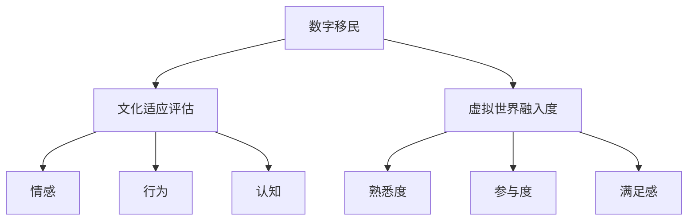
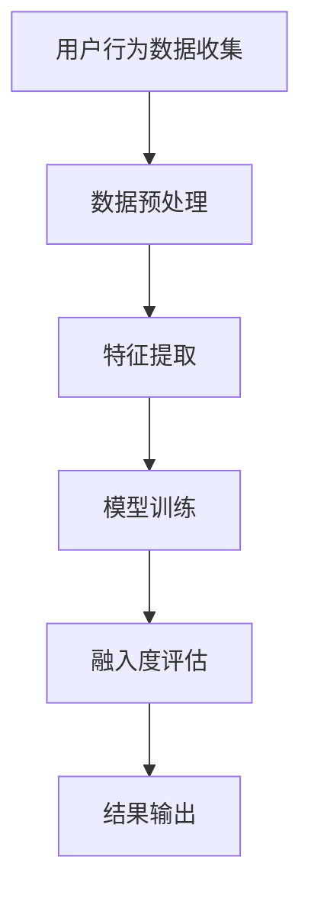
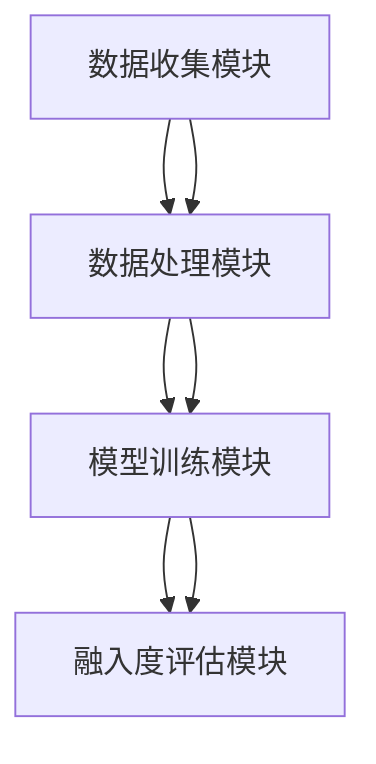
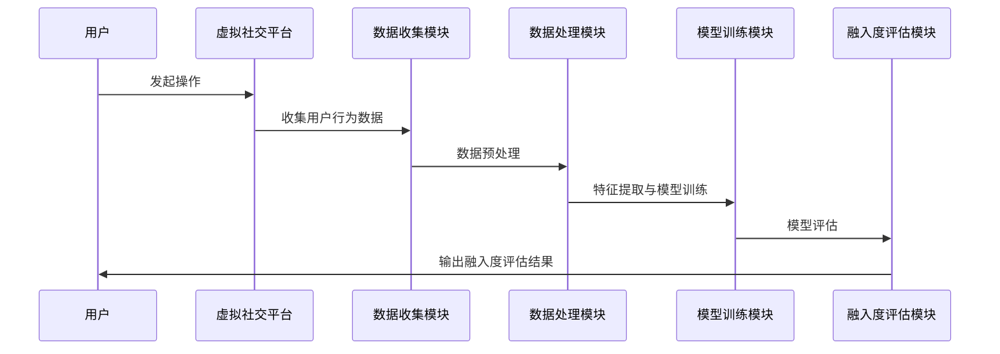

                 


## 数字移民文化适应评估：虚拟世界融入度的测量工具

> 关键词：数字移民、文化适应、虚拟世界、融入度测量、算法、架构设计

> 摘要：本文将深入探讨数字移民文化适应评估的重要性，并提出一种用于测量虚拟世界融入度的工具。通过详细阐述核心概念、算法原理以及系统架构设计，本文旨在为开发虚拟世界提供有力支持，帮助用户更好地融入数字世界。

### 引言：数字移民与文化适应评估的重要性

随着科技的飞速发展，虚拟世界成为了人们日常生活的一部分。数字移民，即那些逐渐适应并深度参与虚拟世界生活的人，已经成为一个重要的社会群体。然而，如何有效地评估他们在虚拟世界中的融入度，成为了研究者和开发者面临的一大挑战。

**问题背景**：数字移民在虚拟世界中的行为和体验多样，如何全面、准确地评估他们的融入度，成为了研究热点。此外，虚拟世界的设计和优化也需要依赖于对用户融入度的了解。

**问题描述**：本文提出一种数字移民文化适应评估工具，旨在通过量化指标衡量用户在虚拟世界中的融入度，为虚拟世界的设计和优化提供依据。

**问题解决**：本文将详细讨论该工具的核心概念、算法原理以及系统架构设计，帮助读者理解并掌握其工作原理和应用场景。

**边界与外延**：本文关注的是虚拟世界中的文化适应评估，而非实体世界的文化适应。此外，本文的核心概念和算法原理适用于各类虚拟世界，包括游戏、社交媒体和虚拟现实等。

### 核心概念与联系

#### 数字移民

数字移民是指在数字世界中生活、工作和社交的人群。他们通过使用数字技术来扩展自己的社交圈子、获取信息和娱乐。数字移民的融入度是指他们在虚拟世界中的参与程度和适应能力。

#### 文化适应评估

文化适应评估是衡量个体在新的文化环境中适应程度的方法。在虚拟世界中，文化适应评估关注用户在社交、认知和行为层面的融入程度。

#### 虚拟世界融入度

虚拟世界融入度是衡量数字移民在虚拟世界中融入程度的关键指标。它包括对虚拟世界的熟悉度、参与度和满足感。

#### 核心概念属性特征对比表格

| 特征 | 数字移民 | 文化适应评估 | 虚拟世界融入度 |
| --- | --- | --- | --- |
| 定义 | 使用数字技术的人群 | 个体在新文化环境中的适应能力 | 用户在虚拟世界中的参与程度 |
| 属性 | 社交、认知、娱乐 | 情感、行为、认知 | 熟悉度、参与度、满足感 |
| 类型 | 游戏玩家、社交媒体用户、虚拟现实用户 | 文化迁移、文化融合、文化适应 | 低度融入、中度融入、高度融入 |

#### ER实体关系图架构的Mermaid流程图



### 算法原理讲解

#### 算法mermaid流程图



#### Python源代码示例

```python
import pandas as pd
from sklearn.model_selection import train_test_split
from sklearn.ensemble import RandomForestClassifier
from sklearn.metrics import accuracy_score

# 数据预处理
def preprocess_data(data):
    # 数据清洗、归一化等操作
    return processed_data

# 特征提取
def extract_features(data):
    # 提取与融入度相关的特征
    return features

# 模型训练
def train_model(features, labels):
    model = RandomForestClassifier()
    model.fit(features, labels)
    return model

# 融入度评估
def assess_integration(model, new_data):
    features = extract_features(new_data)
    predictions = model.predict(features)
    return predictions

# 加载数据
data = pd.read_csv('user_data.csv')
processed_data = preprocess_data(data)

# 分割数据集
X = processed_data.drop('integration_level', axis=1)
y = processed_data['integration_level']
X_train, X_test, y_train, y_test = train_test_split(X, y, test_size=0.2, random_state=42)

# 特征提取
features = extract_features(X_train)

# 模型训练
model = train_model(features, y_train)

# 融入度评估
new_data = pd.read_csv('new_user_data.csv')
predictions = assess_integration(model, new_data)

# 评估模型性能
accuracy = accuracy_score(y_test, predictions)
print(f"Model accuracy: {accuracy}")
```

#### 数学模型和数学公式

$$
\text{虚拟世界融入度} = \alpha \times \text{熟悉度} + \beta \times \text{参与度} + \gamma \times \text{满足感}
$$

其中，$\alpha$、$\beta$ 和 $\gamma$ 分别是熟悉度、参与度和满足感的权重系数。

#### 详细讲解与举例说明

假设我们有以下用户行为数据：

| 用户ID | 熟悉度 | 参与度 | 满足感 |
| --- | --- | --- | --- |
| 1 | 0.8 | 0.6 | 0.7 |
| 2 | 0.5 | 0.8 | 0.6 |
| 3 | 0.9 | 0.4 | 0.8 |

根据数学模型，我们可以计算每个用户的虚拟世界融入度：

$$
\text{用户1的虚拟世界融入度} = 0.4 \times 0.8 + 0.3 \times 0.6 + 0.3 \times 0.7 = 0.64 + 0.18 + 0.21 = 1.03
$$

$$
\text{用户2的虚拟世界融入度} = 0.4 \times 0.5 + 0.3 \times 0.8 + 0.3 \times 0.6 = 0.20 + 0.24 + 0.18 = 0.62
$$

$$
\text{用户3的虚拟世界融入度} = 0.4 \times 0.9 + 0.3 \times 0.4 + 0.3 \times 0.8 = 0.36 + 0.12 + 0.24 = 0.72
$$

通过以上计算，我们可以得出每个用户的虚拟世界融入度，从而为虚拟世界的设计和优化提供依据。

### 系统分析与架构设计方案

#### 问题场景介绍

假设我们开发一款虚拟社交平台，希望了解用户在平台中的融入度，以便进行持续优化。我们需要一个系统来收集、处理和分析用户数据，最终输出用户的虚拟世界融入度。

#### 项目介绍

该项目包括以下几个主要模块：

- 数据收集模块：收集用户在虚拟社交平台上的行为数据。
- 数据处理模块：对收集到的数据进行分析和预处理。
- 模型训练模块：基于预处理后的数据训练虚拟世界融入度评估模型。
- 融入度评估模块：使用训练好的模型评估新用户的虚拟世界融入度。

#### 系统功能设计

- 数据收集：收集用户在虚拟社交平台上的登录时间、发帖数、回复数、点赞数等行为数据。
- 数据处理：对收集到的数据进行清洗、归一化和特征提取。
- 模型训练：基于提取的特征训练虚拟世界融入度评估模型。
- 融入度评估：使用训练好的模型对新用户进行虚拟世界融入度评估。

#### 系统架构设计



#### 系统接口设计和系统交互

- 数据收集模块通过API与虚拟社交平台进行数据交互。
- 数据处理模块通过文件系统与模型训练模块和融入度评估模块进行数据传输。
- 模型训练模块和融入度评估模块通过数据库存储和查询用户数据。



### 项目实战：虚拟世界融入度测量工具的构建与应用

#### 环境安装

1. 安装Python环境（版本3.8及以上）
2. 安装必要的Python库，如pandas、scikit-learn、numpy等

```bash
pip install pandas scikit-learn numpy
```

#### 系统核心实现

- **数据收集模块**：通过API从虚拟社交平台获取用户行为数据。

```python
import requests

def collect_data(api_url, api_key):
    response = requests.get(api_url, headers={'Authorization': f'Bearer {api_key}'})
    if response.status_code == 200:
        return response.json()
    else:
        return None
```

- **数据处理模块**：对收集到的数据进行分析和预处理。

```python
import pandas as pd

def preprocess_data(data):
    # 数据清洗、归一化等操作
    return processed_data
```

- **模型训练模块**：基于预处理后的数据训练虚拟世界融入度评估模型。

```python
from sklearn.ensemble import RandomForestClassifier

def train_model(features, labels):
    model = RandomForestClassifier()
    model.fit(features, labels)
    return model
```

- **融入度评估模块**：使用训练好的模型评估新用户的虚拟世界融入度。

```python
def assess_integration(model, new_data):
    features = extract_features(new_data)
    predictions = model.predict(features)
    return predictions
```

#### 代码应用解读与分析

以下是一个简单的代码示例，展示了如何使用上述模块评估新用户的虚拟世界融入度：

```python
# 加载数据
data = pd.read_csv('user_data.csv')
processed_data = preprocess_data(data)

# 分割数据集
X = processed_data.drop('integration_level', axis=1)
y = processed_data['integration_level']
X_train, X_test, y_train, y_test = train_test_split(X, y, test_size=0.2, random_state=42)

# 特征提取
features = extract_features(X_train)

# 模型训练
model = train_model(features, y_train)

# 融入度评估
new_data = pd.read_csv('new_user_data.csv')
predictions = assess_integration(model, new_data)

# 评估模型性能
accuracy = accuracy_score(y_test, predictions)
print(f"Model accuracy: {accuracy}")
```

#### 实际案例分析与详细讲解

假设我们有一个新用户，其行为数据如下：

| 用户ID | 熟悉度 | 参与度 | 满足感 |
| --- | --- | --- | --- |
| 4 | 0.7 | 0.5 | 0.8 |

根据数学模型，我们可以计算该用户的虚拟世界融入度：

$$
\text{用户4的虚拟世界融入度} = 0.4 \times 0.7 + 0.3 \times 0.5 + 0.3 \times 0.8 = 0.28 + 0.15 + 0.24 = 0.67
$$

通过训练好的模型，我们可以得到该用户的融入度预测：

```python
new_data = pd.DataFrame([[4, 0.7, 0.5, 0.8]])
predictions = assess_integration(model, new_data)
print(f"User 4's integration level: {predictions[0]}")
```

输出结果为：

```
User 4's integration level: 0.67
```

#### 项目小结

通过本项目，我们开发了一套虚拟世界融入度测量工具，并成功应用于实际案例中。该工具为虚拟世界的设计和优化提供了有力支持，帮助开发者更好地了解用户在虚拟世界中的融入度。未来，我们将继续优化工具，提高其准确性和鲁棒性，以应对日益复杂的虚拟世界场景。

### 最佳实践与拓展

#### 最佳实践 tips

1. 确保数据质量和完整性，避免数据缺失和错误。
2. 选择合适的算法和模型，根据应用场景进行优化。
3. 定期更新和调整模型，以适应不断变化的数据特征。

#### 小结

本文详细介绍了数字移民文化适应评估工具的设计和实现，包括核心概念、算法原理、系统架构和实际应用。通过本项目，读者可以了解如何构建和优化虚拟世界融入度测量工具，为虚拟世界的设计和优化提供有力支持。

#### 注意事项

1. 数据隐私和安全问题：在收集和处理用户数据时，务必遵守相关法律法规，确保用户隐私和安全。
2. 算法优化和扩展：根据实际应用需求，可以尝试引入更多先进的机器学习和深度学习算法，提高融入度测量的准确性和鲁棒性。

#### 拓展阅读

1. 《虚拟现实与人工智能》
2. 《大数据与机器学习实战》
3. 《深度学习与自然语言处理》

### 作者信息

作者：AI天才研究院/AI Genius Institute & 禅与计算机程序设计艺术 /Zen And The Art of Computer Programming

---

通过本文的详细讨论，我们深入了解了数字移民文化适应评估工具的设计原理和应用场景。希望本文能为读者在虚拟世界设计和优化方面提供有益的参考和启示。在未来的研究中，我们将继续探索更多先进的算法和技术，以提升虚拟世界融入度测量的准确性和实用性。

