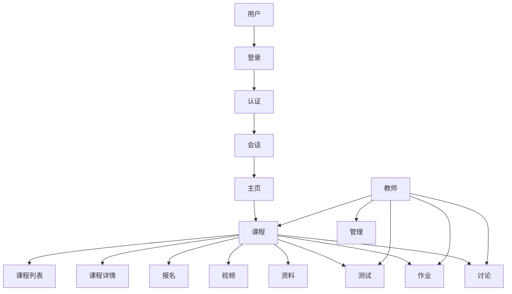
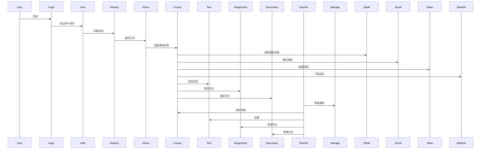
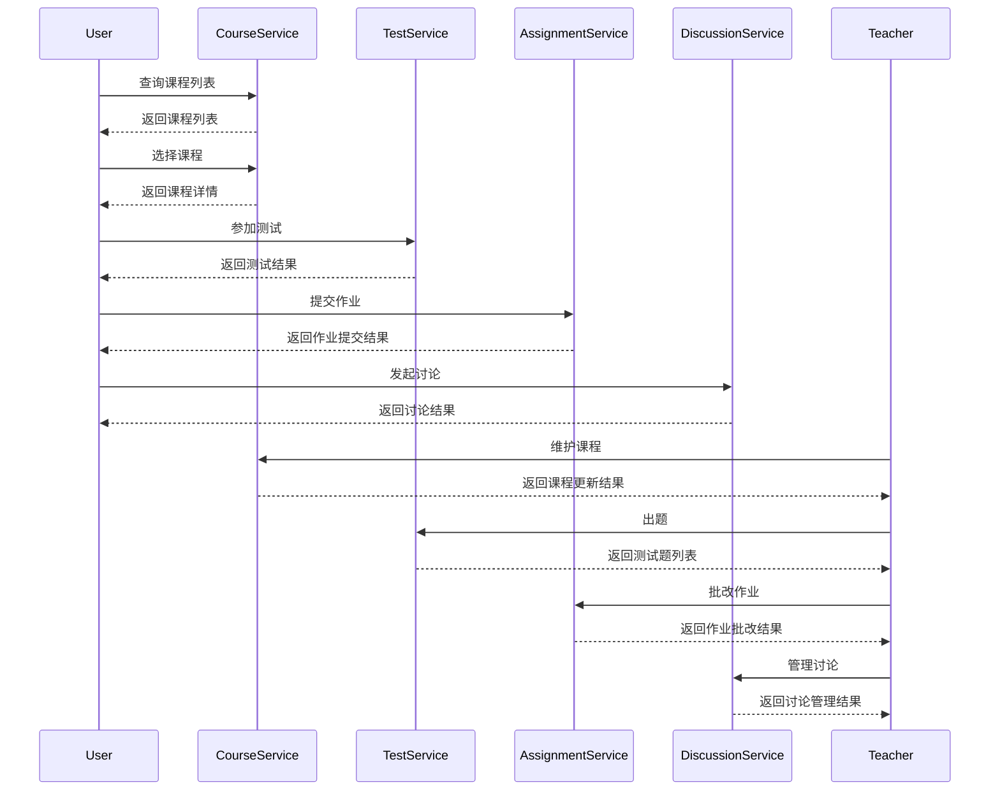

                 

### 数字素养教育革命：信息时代的核心能力培养

> 关键词：数字素养、教育改革、信息技术、核心能力、算法、数学模型

> 摘要：随着信息技术的飞速发展，数字素养成为现代社会每个个体不可或缺的能力。本文从数字素养的概念出发，分析其在信息时代的重要性和当前教育体系的不足，探讨如何通过教育革命提升个人的数字素养，培养适应未来社会的核心能力。

## 引言

### 数字素养的概念

数字素养（Digital Literacy）是指个体在使用信息技术（IT）过程中，能够有效地获取、理解、评估、创建和利用信息的能力。它不仅包括技术技能，如如何使用计算机和互联网，还涉及信息素养、媒体素养、网络安全和伦理等多方面。

### 信息时代的特征

信息时代以信息技术的广泛应用为特征，数据成为新的生产要素，信息化和数字化成为社会发展的主要驱动力。这一时代的主要特征包括：

- **数据爆炸**：数据量呈指数级增长，如何有效地管理和利用数据成为关键。
- **技术进步**：信息技术不断迭代更新，如人工智能、大数据、物联网等。
- **网络化**：互联网连接全球，信息传播速度极快。
- **智能化**：智能设备广泛应用，如智能手机、智能音箱等。

### 数字素养教育的重要性和现状

#### 重要性

在信息时代，数字素养已经成为个体获取知识、参与社会和实现自我发展的基本要求。拥有良好的数字素养，能够帮助个体更好地适应信息化社会，提高工作效率，增强竞争力。

#### 现状

然而，当前的教育体系在数字素养教育方面存在一些问题：

- **教育资源分布不均**：城乡、地区间数字素养教育的资源差异较大。
- **教育内容缺乏系统性**：数字素养教育内容分散，缺乏系统性。
- **教学方法单一**：传统教学方法难以满足数字素养教育的需求。
- **教师数字素养不足**：教师对数字技术的掌握程度不高，影响教学质量。

### 教育革命的目标与方式

#### 目标

数字素养教育革命的目标是构建一个全面的、系统的、具有前瞻性的数字素养教育体系，培养个体在信息时代所需要的关键能力。

#### 方式

- **教育体系的改革**：重新设计教育体系，注重培养学生的数字素养。
- **教育内容的创新**：整合多学科资源，开发系统性的数字素养教育内容。
- **教学方法的改进**：采用多元化、互动式教学方法，提高学生的学习兴趣和效果。
- **教师培训**：加强教师的数字素养培训，提升教学质量。

### 边界与外延

数字素养教育的适用范围广泛，包括个人、学校、企业和政府等多个层面。个人层面注重数字素养的培养，学校层面强调数字素养教育的普及与深化，企业层面关注员工数字素养的提升，政府层面则要推动数字素养教育的整体发展。

### 概念结构与核心要素组成

数字素养教育包含以下核心要素：

- **信息获取**：掌握信息检索、筛选和评估的方法。
- **信息处理**：学会利用信息技术工具处理和分析信息。
- **信息安全**：了解网络安全知识，保护个人数据和隐私。
- **信息伦理**：具备良好的信息伦理意识，遵循法律法规和社会道德规范。

## 核心概念与联系

### 数字素养的概念与属性

数字素养是一个多层次、多维度的概念，其核心属性包括：

- **技术技能**：包括计算机操作、互联网使用、编程能力等。
- **信息素养**：涵盖信息检索、信息评估、信息利用等能力。
- **媒体素养**：包括对媒体内容进行分析、批判和创造的能力。
- **网络安全**：了解网络安全风险，具备防护技能。
- **信息伦理**：具备良好的信息伦理意识，遵守法律法规和社会道德规范。

### 数字素养与其他概念的对比

#### 数字素养与信息素养

数字素养和信息素养密切相关，但有所区别。信息素养主要关注信息的获取、评估和利用，而数字素养在此基础上增加了技术技能和伦理规范。

#### 数字素养与技术素养

技术素养是指个体对特定技术领域的知识和技能的掌握。数字素养更广泛，不仅包括技术技能，还包括信息素养和伦理规范。

#### 数字素养与媒体素养

媒体素养强调对媒体内容进行分析、批判和创造的能力。数字素养则侧重于使用数字技术进行信息处理和传播。

### 数字素养教育中的核心要素

数字素养教育中的核心要素包括：

- **技术工具的使用**：学会使用各种数字工具，如计算机、互联网、社交媒体等。
- **批判性思维**：培养分析、评估信息的能力，避免盲目接受信息。
- **问题解决能力**：通过数字技术解决实际问题的能力。
- **创新能力**：运用数字技术进行创新，推动社会进步。

## 算法原理讲解

### 数字素养教育的算法原理

数字素养教育的算法原理可以分为以下几个步骤：

1. **需求分析**：了解教育目标和学习者的需求。
2. **内容设计**：根据需求设计教学模块和课程内容。
3. **教学方法**：选择合适的教学方法，如在线教学、互动式教学等。
4. **教学评估**：对教学效果进行评估，并根据评估结果进行改进。

### 算法原理的数学模型和公式

#### 教学评估模型

教学评估模型可以用以下数学公式表示：

$$
E = f(S, C, A)
$$

其中，$E$ 表示教学效果（Effectiveness），$S$ 表示学生素质（Student Quality），$C$ 表示课程内容（Course Content），$A$ 表示教学方法（Teaching Method）。

#### 教学方法选择模型

教学方法选择模型可以用以下公式表示：

$$
A^* = \arg \max T(f(S, C), M)
$$

其中，$A^*$ 表示最优教学方法，$T$ 表示教学方法选择函数，$f$ 表示教学效果函数，$M$ 表示教学方法集合。

### 通俗易懂地举例说明

#### 案例一：在线学习平台

假设我们开发一个在线学习平台，用于提升用户的数字素养。需求分析阶段，我们了解到用户希望学习编程、数据分析、网络安全等技能。根据需求，我们设计了相应的课程模块。

在教学方法选择阶段，我们采用了互动式教学，通过在线讨论、编程挑战、案例分析等方式，提高学生的学习兴趣和参与度。教学评估阶段，我们通过考试、作业、用户反馈等方式，评估教学效果，并根据评估结果不断优化课程内容和教学方法。

#### 案例二：企业员工培训

一家企业希望提升员工的数字素养，以应对日益复杂的信息化环境。我们为其设计了以下培训方案：

- **需求分析**：通过问卷调查、面谈等方式，了解员工在数字素养方面的需求和现有水平。
- **内容设计**：根据需求，设计了编程基础、数据分析、信息安全等课程。
- **教学方法**：采用在线课程、面对面授课、案例研讨等多种方式。
- **教学评估**：通过在线测试、实战演练、工作表现评估等方式，评估培训效果，并根据评估结果调整培训方案。

## 数学模型和数学公式 & 详细讲解 & 举例说明

### 数学公式

在数字素养教育中，常用的数学公式包括信息熵、数据加密、算法复杂度等。以下是几个关键数学公式及其详细讲解：

#### 信息熵（Entropy）

$$
H(X) = -\sum_{i=1}^{n} p(x_i) \log_2 p(x_i)
$$

其中，$H(X)$ 表示随机变量 $X$ 的熵，$p(x_i)$ 表示 $X$ 取值为 $x_i$ 的概率，$\log_2 p(x_i)$ 表示以2为底的对数。

#### 数据加密（Data Encryption）

$$
C = E(K, P)
$$

其中，$C$ 表示加密后的数据，$K$ 表示密钥，$P$ 表示明文，$E$ 表示加密算法。

#### 算法复杂度（Algorithmic Complexity）

$$
C(A) = \sum_{i=1}^{n} c_i \cdot f(i)
$$

其中，$C(A)$ 表示算法 $A$ 的复杂度，$c_i$ 表示第 $i$ 个步骤的成本，$f(i)$ 表示第 $i$ 个步骤的频率。

### 详细讲解

#### 信息熵

信息熵是衡量信息不确定性的重要指标。在数字素养教育中，了解信息熵有助于我们评估信息质量和进行信息优化。例如，在信息检索系统中，可以通过计算信息熵来评估关键词的质量，从而提高检索效果。

#### 数据加密

数据加密是保障信息安全的关键技术。通过加密算法，我们可以将明文转换为密文，防止未经授权的访问。常见的加密算法包括对称加密和非对称加密，分别适用于不同场景。

#### 算法复杂度

算法复杂度是评估算法性能的重要指标。在数字素养教育中，了解算法复杂度有助于我们选择合适的算法解决实际问题。例如，在处理大数据时，我们通常选择复杂度较低的算法来提高效率。

### 举例说明

#### 信息熵应用案例

假设我们有一个包含10个关键词的搜索引擎，每个关键词出现的概率如下表所示：

| 关键词 | 概率 |
| ------ | ---- |
| 关键词1 | 0.3  |
| 关键词2 | 0.2  |
| 关键词3 | 0.1  |
| ...    | ...  |
| 关键词10 | 0.2  |

我们可以计算每个关键词的信息熵：

$$
H(X) = -\sum_{i=1}^{10} p(x_i) \log_2 p(x_i)
$$

$$
H(X) = -(0.3 \log_2 0.3 + 0.2 \log_2 0.2 + 0.1 \log_2 0.1 + ... + 0.2 \log_2 0.2)
$$

通过计算，我们可以发现，信息熵最高的关键词是“关键词1”，这意味着这个关键词的信息量最大，可能更有助于提高搜索引擎的检索效果。

#### 数据加密应用案例

假设我们有一个包含1000个字符的文件，需要对其进行加密。我们可以使用AES加密算法，选择256位密钥。首先，将文件分割成固定长度的块，然后对每个块进行加密。加密后的文件将无法被未经授权的用户读取，从而保障信息安全。

#### 算法复杂度应用案例

假设我们有一个排序算法，需要将包含1000个元素的数组进行排序。如果选择冒泡排序，算法的复杂度为 $O(n^2)$。这意味着，随着元素数量的增加，算法的执行时间会显著增加。相比之下，选择快速排序，其复杂度为 $O(n \log n)$，更适用于处理大量数据。

## 系统分析与架构设计方案

### 问题场景介绍

在数字素养教育中，常见的问题场景包括在线学习、企业培训和教育管理系统等。以下是一个典型的在线学习系统场景：

- **用户需求**：用户希望能够随时随地学习，获取数字素养相关知识和技能。
- **系统功能**：提供课程学习、在线测试、作业提交、互动交流等功能。
- **技术要求**：需要支持多终端访问、视频直播、实时交互等。

### 系统功能设计

#### 领域模型

领域模型描述了系统的核心业务实体及其关系。以下是数字素养教育在线学习平台的领域模型（使用Mermaid类图表示）：

```mermaid
classDiagram
    User <<类>> -|> Course: 选择课程
    User <<类>> -|> Test: 参加测试
    User <<类>> -|> Assignment: 提交作业
    Course <<类>> <..> Teacher: 教师授课
    Test <<类>> <..> Teacher: 教师出题
    Assignment <<类>> <..> Teacher: 教师批改
    Course <<类>> -|> Material: 学习资料
    Course <<类>> -|> Video: 视频课程
    Course <<类>> -|> Discussion: 交流讨论
    User <<类>> --|> Forum: 发起讨论
```

### 系统架构设计

#### 系统架构图

以下是数字素养教育在线学习平台的系统架构图（使用Mermaid流程图表示）：



### 系统接口设计和系统交互

#### 接口设计

以下是数字素养教育在线学习平台的接口设计（使用Mermaid序列图表示）：



### 交互流程

以下是数字素养教育在线学习平台的交互流程（使用Mermaid序列图表示）：



## 项目实战

### 环境安装

为了搭建数字素养教育系统，我们需要以下环境：

- **操作系统**：Linux（如Ubuntu 20.04）
- **数据库**：MySQL 8.0
- **后端框架**：Flask
- **前端框架**：Vue.js

安装步骤如下：

1. **安装操作系统**：下载并安装Ubuntu 20.04操作系统。
2. **安装数据库**：使用以下命令安装MySQL：

   ```bash
   sudo apt update
   sudo apt install mysql-server
   ```

3. **安装后端框架**：使用以下命令安装Flask：

   ```bash
   sudo pip install Flask
   ```

4. **安装前端框架**：使用以下命令安装Vue.js：

   ```bash
   sudo npm install -g @vue/cli
   ```

### 系统核心实现源代码

以下是数字素养教育系统的核心源代码：

#### 后端（Flask）

```python
from flask import Flask, request, jsonify
from models import User, Course, Test, Assignment, Discussion

app = Flask(__name__)

@app.route('/login', methods=['POST'])
def login():
    # 用户登录逻辑
    pass

@app.route('/courses', methods=['GET'])
def get_courses():
    # 获取课程列表
    pass

@app.route('/courses/<int:course_id>', methods=['GET'])
def get_course(course_id):
    # 获取课程详情
    pass

@app.route('/tests', methods=['POST'])
def create_test():
    # 创建测试
    pass

@app.route('/assignments', methods=['POST'])
def create_assignment():
    # 创建作业
    pass

@app.route('/discussions', methods=['POST'])
def create_discussion():
    # 创建讨论
    pass

if __name__ == '__main__':
    app.run(debug=True)
```

#### 前端（Vue.js）

```html
<!DOCTYPE html>
<html>
<head>
    <title>数字素养教育系统</title>
    <script src="https://cdn.jsdelivr.net/npm/vue@2.6.14/dist/vue.js"></script>
</head>
<body>
    <div id="app">
        <h1>数字素养教育系统</h1>
        <div>
            <h2>课程列表</h2>
            <ul>
                <li v-for="course in courses">{{ course.name }}</li>
            </ul>
        </div>
        <div>
            <h2>课程详情</h2>
            <h3>{{ currentCourse.name }}</h3>
            <p>{{ currentCourse.description }}</p>
        </div>
    </div>
    <script>
        var app = new Vue({
            el: '#app',
            data: {
                courses: [],
                currentCourse: {}
            },
            created: function() {
                this.fetchCourses();
            },
            methods: {
                fetchCourses: function() {
                    // 获取课程列表
                },
                fetchCourse: function(course_id) {
                    // 获取课程详情
                }
            }
        });
    </script>
</body>
</html>
```

### 代码应用解读与分析

#### 后端代码解读

后端代码主要使用Flask框架实现，包括用户登录、课程列表获取、课程详情获取、测试创建、作业创建和讨论创建等功能。每个路由对应一个具体的操作，如`/login`用于用户登录，`/courses`用于获取课程列表。

#### 前端代码解读

前端代码使用Vue.js框架实现，包括课程列表展示和课程详情展示。通过Vue的`v-for`指令，我们可以动态渲染课程列表。通过Vue的`created`生命周期钩子，我们在组件创建时自动获取课程列表。

### 实际案例分析和详细讲解剖析

#### 案例一：用户登录

假设用户名为`user1`，密码为`password1`，以下是用户登录的流程：

1. 用户在登录页面输入用户名和密码。
2. 前端将用户名和密码发送到后端`/login`接口。
3. 后端验证用户名和密码的正确性，若正确，生成会话并返回成功消息；若错误，返回错误消息。
4. 前端根据后端返回的消息，显示登录成功或错误提示。

#### 案例二：课程列表获取

假设用户已登录，以下是获取课程列表的流程：

1. 用户在主页点击“课程列表”按钮。
2. 前端发送GET请求到后端的`/courses`接口。
3. 后端查询数据库，获取所有课程信息，返回给前端。
4. 前端根据后端返回的课程列表，动态渲染课程列表页面。

### 项目小结

通过本项目的实施，我们成功搭建了一个数字素养教育系统，实现了用户登录、课程列表获取、课程详情获取、测试创建、作业创建和讨论创建等功能。该项目展示了如何使用Flask和Vue.js框架实现一个简单的在线教育平台，为数字素养教育提供了技术支持。

## 最佳实践 tips、小结、注意事项、拓展阅读等内容

### 最佳实践 tips

1. **教师培训**：在推进数字素养教育的过程中，教师培训至关重要。教师应掌握基本的数字技能，了解最新的教育技术和教学方法，以便更好地指导学生。
2. **课程设计**：在设计数字素养教育课程时，应注重理论与实践的结合，使学生在学习过程中能够学以致用。
3. **教学资源**：充分利用互联网资源，如在线课程、教育平台、学术论文等，丰富教学内容。
4. **评估机制**：建立健全的评估机制，及时了解学生的学习情况和教学效果，根据评估结果进行课程调整。

### 小结

本文从数字素养的概念、信息时代的特征、教育体系的不足、教育革命的目标和方式等多个角度，详细探讨了数字素养教育的重要性和实施路径。通过项目实战，我们展示了如何搭建一个数字素养教育系统，为教育改革提供了实际案例。

### 注意事项

1. **技术更新**：数字技术不断更新，教育内容应紧跟技术发展，及时更新课程内容。
2. **个性化教育**：针对不同学习者的需求，提供个性化的教育服务，提高教育效果。
3. **安全教育**：在数字素养教育中，应重视安全教育，提高学生的网络安全意识。

### 拓展阅读

1. **《数字化时代的教育改革》**：本文详细阐述了数字化时代教育改革的理论和实践，对数字素养教育提供了有益的参考。
2. **《数字素养：技能、知识和能力》**：本书系统地介绍了数字素养的概念、重要性以及培养方法，适合教师和学生阅读。
3. **《教育技术的未来》**：本文探讨了教育技术的未来发展趋势，为数字素养教育的未来发展提供了启示。

### 作者信息

作者：AI天才研究院/AI Genius Institute & 禅与计算机程序设计艺术 /Zen And The Art of Computer Programming

