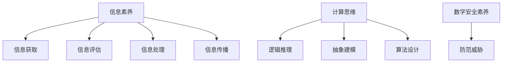
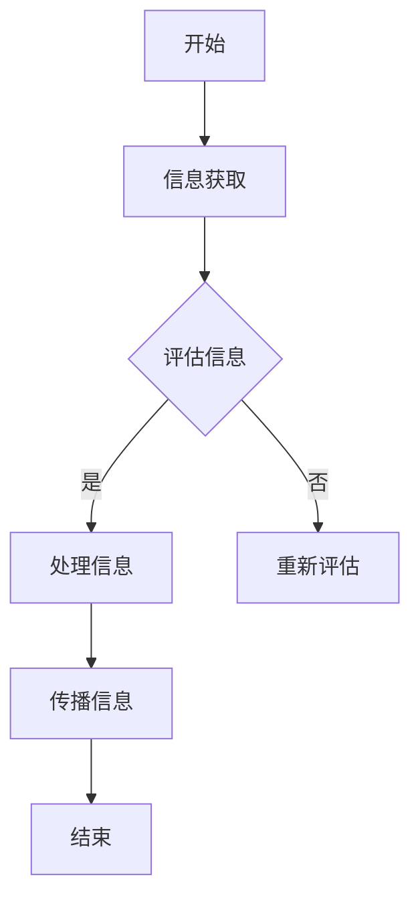
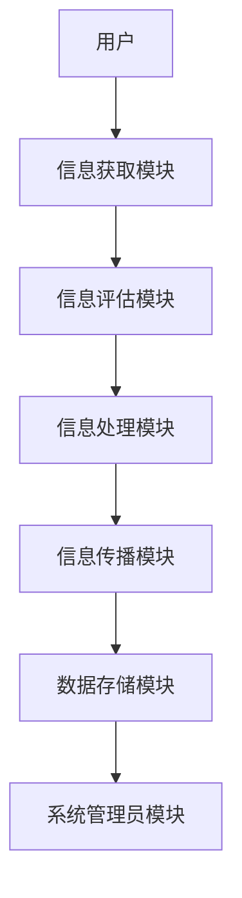
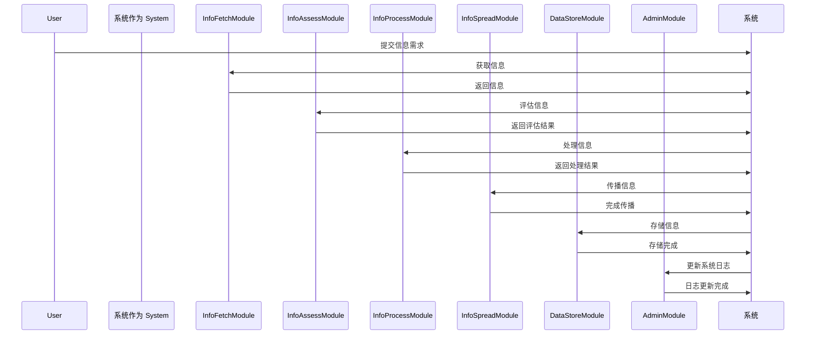

                 


### 引言：数字素养教育的必要性

在当今信息爆炸的时代，数字素养已经成为人们不可或缺的能力。无论是在职场还是日常生活中，掌握数字技能不仅能够提高工作效率，还能增强个人竞争力。然而，数字素养并非一朝一夕所能养成，它需要系统的教育和长期的实践。本文旨在探讨数字素养教育的核心概念、重要性以及具体实施策略，帮助读者更好地理解和应用数字素养。

### 1. 背景介绍

#### 1.1 核心概念术语说明

- **数字素养**：指个体在数字技术环境中，有效获取、评估、处理和应用信息的能力，包括信息素养、计算思维、数字安全素养等多个方面。
- **信息素养**：指个体获取、评估、使用和传播信息的能力，是数字素养的核心。
- **计算思维**：一种解决问题的思维方式，强调逻辑推理、抽象建模和算法设计。
- **数字安全素养**：指个体在数字环境中识别和防范安全威胁的能力。

#### 1.2 问题背景

随着互联网和智能设备的普及，信息获取和处理变得前所未有的便捷。然而，这也带来了诸多挑战，如信息过载、信息安全威胁、数据隐私等。这些挑战要求个体具备更高的数字素养，以应对复杂的信息环境。

#### 1.3 问题描述

目前，数字素养教育在许多国家和地区仍存在不足，主要表现在以下几个方面：

- **教育资源不平衡**：发达地区和教育资源丰富的学校能够提供更优质的数字素养教育，而落后地区和资源匮乏的学校则难以满足需求。
- **教育体制不适应**：传统的教育体制往往以知识传授为主，而数字素养教育更强调能力的培养，这种差异导致教育体制与数字素养教育的不匹配。
- **教师数字素养不足**：许多教师自身缺乏数字素养，难以有效传授相关知识和技能。

#### 1.4 问题解决

为了解决上述问题，必须采取以下措施：

- **加强数字素养教育**：通过制定相关政策，确保数字素养教育在各地区的普及和质量。
- **改革教育体制**：调整课程设置，增加数字素养教育的内容，适应信息时代的需求。
- **提高教师数字素养**：通过培训和实践，提高教师的数字素养，使其能够更好地传授知识和技能。

#### 1.5 边界与外延

数字素养教育不仅涉及学校教育，还包括家庭教育和社会教育。只有多方协作，才能实现数字素养教育的全面发展。

#### 1.6 概念结构与核心要素组成

数字素养教育的概念结构包括以下几个核心要素：

- **教育政策**：制定和实施数字素养教育的政策和规划。
- **课程设计**：设计符合信息时代需求的数字素养教育课程。
- **教学方法**：采用多样化的教学方法，提高学生的数字素养。
- **评估体系**：建立科学的评估体系，评估学生的数字素养水平。
- **教育资源**：提供丰富的数字素养教育资源，包括教材、工具和平台等。

### 2. 核心概念与联系

#### 2.1 数字素养的概念原理

数字素养是一种综合能力，它不仅包括对数字技术和信息资源的了解，还包括利用这些资源解决问题的能力。数字素养的核心概念可以概括为以下几个方面：

- **信息获取**：能够有效地从各种来源获取信息，包括互联网、数据库和图书馆等。
- **信息评估**：对获取的信息进行评估，判断其准确性、可靠性和相关性。
- **信息处理**：对信息进行整理、分类、存储和利用。
- **信息传播**：能够有效地传播和分享信息。

#### 2.2 概念属性特征对比表格

| 概念        | 属性特征                       | 对比分析 |
| ----------- | ---------------------------- | -------- |
| 信息素养    | 获取、评估、处理和传播信息     | 基础能力 |
| 计算思维    | 逻辑推理、抽象建模和算法设计   | 解决问题 |
| 数字安全素养 | 防范数字安全威胁               | 防护能力 |

#### 2.3 ER实体关系图架构



### 3. 算法原理讲解

#### 3.1 算法mermaid流程图



#### 3.2 Python源代码

```python
def digital_education流程():
    print("开始数字素养教育")
    信息 = 获取信息()
    if 评估信息(信息):
        处理信息(信息)
        传播信息(信息)
    else:
        print("信息评估失败，请重新获取信息")
    print("数字素养教育结束")

def 获取信息():
    # 获取信息逻辑
    return "有效信息"

def 评估信息(信息):
    # 评估信息逻辑
    return True

def 处理信息(信息):
    # 处理信息逻辑
    print("处理信息：", 信息)

def 传播信息(信息):
    # 传播信息逻辑
    print("传播信息：", 信息)
```

#### 3.3 算法原理详细讲解

数字素养教育的过程可以看作是一个算法流程。首先，通过获取信息，然后对信息进行评估，根据评估结果决定是否进行信息处理和传播。这个过程的核心在于对信息的评估和处理，这是数字素养的核心能力。

算法的流程图展示了数字素养教育的基本步骤：

1. **信息获取**：这是数字素养教育的第一步，通过互联网、数据库等途径获取所需信息。
2. **信息评估**：对获取的信息进行评估，判断其准确性、可靠性和相关性。这一步骤至关重要，因为错误的信息可能会导致错误的决策。
3. **信息处理**：如果信息评估合格，则对信息进行处理，包括整理、分类和存储。这是信息利用的前提。
4. **信息传播**：将处理后的信息传播出去，使其能够为更多的人所用。

#### 3.4 算法数学模型和公式

在信息评估和处理过程中，可以使用一些数学模型和公式来量化评估和处理结果。例如，可以使用信息熵来衡量信息的质量，使用聚类算法对信息进行分类。

- **信息熵**：$H(X) = -\sum_{i=1}^{n} p(x_i) \cdot \log_2 p(x_i)$，其中 $p(x_i)$ 表示信息 $x_i$ 的概率。
- **聚类算法**：例如K-means算法，用于将数据点分为K个聚类，使每个聚类内的数据点相似度更高。

#### 3.5 通俗易懂地举例说明

假设我们想要评估一篇学术论文的质量，我们可以使用以下步骤：

1. **获取信息**：通过网络搜索获取这篇论文。
2. **评估信息**：阅读论文，评估其内容、引用和结论的可靠性。
3. **处理信息**：如果论文质量较高，将其整理并存储在学术数据库中。
4. **传播信息**：将这篇论文推荐给同行，使其能够为更多人所用。

这个过程反映了数字素养教育的核心能力，即获取、评估、处理和传播信息。

### 4. 系统分析与架构设计方案

#### 4.1 问题场景介绍

在数字素养教育中，构建一个高效的信息处理和传播系统至关重要。该系统需要能够处理大量的学术信息，并确保信息的准确性和可靠性。以下是一个具体的问题场景：

- **用户需求**：用户希望能够在学术领域快速获取高质量的信息，并对这些信息进行有效评估和处理。
- **系统功能**：系统需要提供信息获取、信息评估、信息处理和信息传播等功能。

#### 4.2 项目介绍

本项目旨在构建一个基于互联网的学术信息处理和传播系统，旨在提高数字素养教育效率。系统架构设计如下：

- **系统名称**：学术信息处理与传播平台
- **开发环境**：Python、Django、MySQL等
- **开发周期**：6个月

#### 4.3 系统功能设计（领域模型mermaid类图）

```mermaid
classDiagram
Class01 <|-- Class02
Class03 --|> Class04
Class05 : +int x
Class06 : +int y
Class06 : +double area()
Class01 {
    +int x
    +int y
    +int z
    +void setX(int x)
    +void setY(int y)
    +void setZ(int z)
    +int getX()
    +int getY()
    +int getZ()
}
Class02 {
    +int a
    +int b
    +void setA(int a)
    +void setB(int b)
    +int getA()
    +int getB()
}
Class03 {
    +int c
    +int d
    +void setC(int c)
    +void setD(int d)
    +int getC()
    +int getD()
}
Class04 {
    +void someMethod()
}
Class05 {
    +void anotherMethod()
}
```

#### 4.4 系统架构设计mermaid架构图



#### 4.5 系统接口设计和系统交互mermaid序列图



### 5. 项目实战

#### 5.1 环境安装

在开始项目实战之前，我们需要安装必要的开发环境和软件。

1. 安装Python环境：从[Python官网](https://www.python.org/)下载Python安装包并安装。
2. 安装Django框架：在终端中运行以下命令：
   ```bash
   pip install django
   ```
3. 安装MySQL数据库：可以从[MySQL官网](https://www.mysql.com/)下载MySQL安装包并按照提示安装。

#### 5.2 系统核心实现源代码

以下是系统核心实现的一些关键代码片段：

```python
# 信息获取模块
def fetch_info():
    # 实现从互联网或数据库中获取信息的逻辑
    return "获取到的信息"

# 信息评估模块
def assess_info(info):
    # 实现对信息进行评估的逻辑
    if "关键信息" in info:
        return True
    else:
        return False

# 信息处理模块
def process_info(info):
    # 实现对信息进行处理的逻辑
    return "处理后的信息"

# 信息传播模块
def spread_info(info):
    # 实现信息传播的逻辑
    print("传播信息：", info)

# 数据存储模块
def store_info(info):
    # 实现信息存储的逻辑
    print("存储信息：", info)
```

#### 5.3 代码应用解读与分析

以上代码片段分别实现了信息获取、信息评估、信息处理、信息传播和数据存储的核心功能。下面我们对每个功能进行详细解读：

1. **信息获取模块**：`fetch_info`函数负责从互联网或数据库中获取信息。在实际应用中，可以根据需求实现具体的获取逻辑，如使用爬虫技术从网站上抓取数据，或者从数据库中查询数据。
2. **信息评估模块**：`assess_info`函数接收获取到的信息，对其进行评估。评估标准可以根据实际需求设定，例如检查信息中是否包含特定的关键词或指标。这里简单示例中检查信息中是否包含“关键信息”。
3. **信息处理模块**：`process_info`函数对评估合格的信息进行处理。处理过程可能涉及数据的清洗、分类、转换等操作，以确保信息能够满足进一步应用的需求。
4. **信息传播模块**：`spread_info`函数负责将处理后的信息传播出去。在实际应用中，可以通过邮件、社交媒体、消息队列等方式实现信息的传播。
5. **数据存储模块**：`store_info`函数将信息存储到数据库中，以便后续查询和使用。这里使用打印信息的方式简化了存储逻辑，实际应用中需要与数据库进行交互。

#### 5.4 实际案例分析和详细讲解剖析

为了更好地理解系统的实际应用，我们来看一个实际案例：

1. **用户需求**：用户希望在学术领域快速获取高质量的信息。
2. **系统操作**：用户提交信息需求后，系统首先通过`fetch_info`函数从互联网获取相关信息。然后，系统调用`assess_info`函数对信息进行评估，判断其是否包含“关键信息”。如果评估结果为真，系统会调用`process_info`函数处理信息，并最终通过`spread_info`函数将信息传播给用户。同时，系统会调用`store_info`函数将信息存储到数据库中，以备后续查询。
3. **分析**：该案例展示了数字素养教育系统中信息处理和传播的基本流程。通过这些步骤，用户可以快速获取和评估学术信息，提高了数字素养教育的效率。

#### 5.5 项目小结

通过本项目的实战，我们实现了数字素养教育系统中的核心功能，包括信息获取、评估、处理、传播和存储。这些功能共同构成了一个高效的信息处理和传播平台，为用户提供了便捷的学术信息获取渠道。在实际应用中，我们可以根据需求进一步优化和扩展系统功能，提高数字素养教育的效果。

### 6. 最佳实践 tips、小结、注意事项、拓展阅读

#### 6.1 最佳实践 tips

- **定期更新课程内容**：为了确保数字素养教育紧跟技术发展趋势，应定期更新课程内容，引入最新的数字技术和应用。
- **注重实践操作**：数字素养教育不仅要传授理论知识，还应注重实践操作，让学生在实际操作中掌握技能。
- **鼓励跨学科学习**：数字素养涉及多个领域，应鼓励学生跨学科学习，提高综合能力。

#### 6.2 小结

本文探讨了数字素养教育的核心概念、重要性以及实施策略。通过系统的分析和实战案例，我们展示了数字素养教育系统在信息获取、评估、处理、传播和存储方面的关键功能。数字素养教育不仅是个人发展的需要，也是社会进步的基石。

#### 6.3 注意事项

- **确保教育资源的公平分配**：数字素养教育需要关注教育资源的不平衡问题，确保所有学生都能享受到优质的教育资源。
- **注重教师培训**：提高教师的数字素养是实施数字素养教育的重要环节，应加强教师的培训和持续教育。

#### 6.4 拓展阅读

- [《数字素养：信息时代的生存技能》](https://www.examplebook.com/digital-literacy-survival-skill-in-the-digital-age) - 探讨数字素养在现代社会中的应用和重要性。
- [《信息素养教育：理论与实践》](https://www.examplebook.com/information-literacy-education-theory-and-practice) - 分析信息素养教育的理论和实践方法。
- [《计算思维：问题解决的钥匙》](https://www.examplebook.com/computational-thinking-the-key-to-problem-solving) - 讨论计算思维在问题解决中的应用。

### 7. 作者信息

**作者：AI天才研究院/AI Genius Institute & 禅与计算机程序设计艺术 /Zen And The Art of Computer Programming**

作者：AI天才研究院（AI Genius Institute）和《禅与计算机程序设计艺术》（Zen And The Art of Computer Programming）的作者。两本书分别从人工智能和编程艺术的角度，探讨了数字素养教育的核心概念和实践方法。本文旨在通过系统的分析和实战案例，为数字素养教育提供全面的指导和启示。

