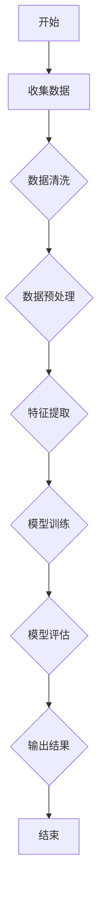
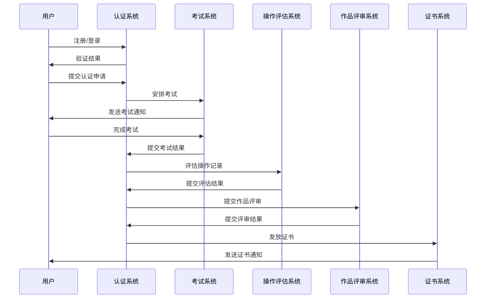

                 

## 数字素养认证体系：信息时代的核心能力评估

### 关键词：数字素养、认证体系、信息时代、核心能力、评估

### 摘要：

本文将深入探讨数字素养认证体系在信息时代的核心作用。首先，我们将介绍数字素养的背景和重要性，然后详细阐述数字素养认证的需求和挑战。接着，本文将设计一个完整的数字素养认证体系，包括认证标准、评估方法和认证流程。此外，我们将分析数字素养的核心能力，并通过实体关系图展示其联系。本文旨在为IT专业人士和数字素养爱好者提供一个全面、系统的认证指南，帮助他们提升在数字时代的竞争力。

## 第一部分: 背景介绍

### 1.1 问题背景

#### 1.1.1 数字素养的重要性

在信息化社会，数字素养已成为个人和社会发展的关键能力。随着信息技术的飞速发展，人们的生活和工作越来越依赖于数字技术。然而，数字素养不仅仅是技术操作能力，它还包括信息获取、分析、评估、创造和应用的能力。在当今社会，具备良好数字素养的人能够更好地适应数字化环境，提高工作效率，甚至在创新和创业方面取得成功。

#### 1.1.2 数字素养认证的需求

为了适应数字时代的要求，许多组织和个人开始寻求一种权威的数字素养认证体系。这种认证体系不仅能够评估个人的数字素养水平，还可以作为职业发展和学习进阶的依据。数字素养认证的需求来源于以下几个方面：

1. **职业发展需求**：在数字化时代，越来越多的职业要求员工具备一定的数字素养，认证体系可以帮助员工证明自己的能力，提高职业竞争力。
2. **教育培训需求**：教育机构需要一种科学的方法来评估学生的数字素养水平，以便更好地进行课程设计和教学调整。
3. **个人成长需求**：个人希望在数字化时代不断提升自己的数字素养，认证体系提供了一个明确的评估标准和成长路径。

### 1.2 问题描述

#### 1.2.1 数字素养认证的挑战

数字素养认证面临诸多挑战，包括标准制定、评估方法、认证流程等。如何确保认证体系的科学性、公正性和权威性，成为亟待解决的问题。具体挑战如下：

1. **标准制定**：如何确定数字素养的核心能力，并制定详细的评估标准，是一个复杂的问题。不同的领域和行业对数字素养的要求可能有所不同，需要制定灵活而全面的评估标准。
2. **评估方法**：如何采用科学、有效的评估方法，对个人的数字素养能力进行全面评估，是一个技术难题。评估方法需要既能够全面反映数字素养的不同方面，又能够操作性强，方便实施。
3. **认证流程**：如何规范认证过程，确保认证的公正性和权威性，是一个管理问题。认证流程需要透明、公开，确保每一位申请者都能公平地接受评估。

#### 1.2.2 数字素养认证的目标

数字素养认证的目标是帮助个人和组织识别和提升数字素养能力，促进数字社会的健康发展。认证体系需要全面覆盖数字素养的核心能力，如信息素养、网络安全素养、数据素养等。具体目标如下：

1. **评估能力**：通过认证体系，评估个人和组织在数字素养方面的能力和水平，为职业发展和教育培训提供依据。
2. **提升能力**：通过认证体系，帮助个人和组织发现自身在数字素养方面的不足，提供针对性的培训和学习建议，提升整体数字素养水平。
3. **推广数字素养**：通过认证体系的推广和应用，提高社会对数字素养的认识和重视，促进数字社会的健康发展。

### 1.3 问题解决

#### 1.3.1 数字素养认证体系的设计

本书将详细介绍一个数字素养认证体系的设计，包括认证标准、评估方法、认证流程等。该体系旨在提供一种全面、科学、公正的评估工具，帮助个人和组织提升数字素养。具体设计思路如下：

1. **认证标准**：根据数字素养的核心能力，制定详细的评估标准，涵盖信息素养、网络安全素养、数据素养等多个方面。
2. **评估方法**：采用多种评估方法，包括在线考试、实际操作、作品评审等，全面反映申请者的数字素养水平。
3. **认证流程**：规范认证流程，确保认证的公正性和权威性，包括申请、评估、认证、发证等环节。

#### 1.3.2 数字素养认证的应用场景

数字素养认证在个人学习、职业发展、企业培训等多个场景中具有重要应用。通过认证，个人可以证明自己的数字素养能力，企业可以提升员工的数字素养水平，从而在数字时代取得竞争优势。具体应用场景如下：

1. **个人学习**：通过认证，个人可以明确自己的数字素养水平，找到提升的方向，制定个性化的学习计划。
2. **职业发展**：在求职和晋升过程中，数字素养认证可以作为能力证明，提高竞争力，获得更好的职业机会。
3. **企业培训**：通过认证体系，企业可以评估员工的数字素养水平，制定针对性的培训计划，提升整体数字素养，提高工作效率。

### 1.4 边界与外延

#### 1.4.1 边界

数字素养认证体系的边界包括认证范围、适用对象、认证标准等。认证体系应确保覆盖所有与数字素养相关的领域，同时明确适用对象，确保认证的针对性。具体边界如下：

1. **认证范围**：包括信息素养、网络安全素养、数据素养、技术素养、媒介素养等多个方面。
2. **适用对象**：包括个人、学生、职业人士、企业等多个群体。
3. **认证标准**：根据不同领域和对象的特点，制定灵活而全面的评估标准。

#### 1.4.2 外延

数字素养认证体系的外延包括认证的推广、应用场景的拓展、认证体系的持续改进等。认证体系需要不断适应数字时代的发展，以满足不同场景和对象的需求。具体外延如下：

1. **认证推广**：通过多种渠道和方式，推广数字素养认证，提高社会对数字素养的认识和重视。
2. **应用场景拓展**：根据社会需求和行业发展，不断拓展认证的应用场景，如在线教育、远程工作等。
3. **认证体系改进**：根据实践经验和反馈，持续优化认证体系，提高其科学性、公正性和权威性。

### 1.5 概念结构与核心要素组成

#### 1.5.1 概念结构

数字素养认证体系的概念结构包括认证标准、评估方法、认证流程等核心要素。认证标准是认证体系的基础，评估方法是认证的核心手段，认证流程则是认证的实施过程。具体概念结构如下：

1. **认证标准**：明确数字素养的核心能力要求，制定详细的评估标准。
2. **评估方法**：采用科学、有效的评估方法，对个人的数字素养能力进行全面评估。
3. **认证流程**：规范认证过程，确保认证的公正性和权威性。

#### 1.5.2 核心要素组成

数字素养认证体系的核心要素包括：

1. **认证标准**：涵盖信息素养、网络安全素养、数据素养等多个方面的评估标准。
2. **评估方法**：包括在线考试、实际操作、作品评审等多种评估方法。
3. **认证流程**：包括申请、评估、认证、发证等环节，确保认证过程的规范和公正。

### 1.6 本章小结

本章介绍了数字素养认证体系的背景、需求和挑战，以及认证体系的设计和应用。通过本章的学习，读者可以了解数字素养认证体系的重要性及其设计原则。下一章将深入探讨数字素养的核心概念与联系。

## 第二部分: 核心概念与联系

### 2.1 数字素养的概念与属性

#### 2.1.1 数字素养的定义

数字素养是指个体在数字环境中有效利用数字工具、信息和资源的能力，以及在此过程中表现出的批判性思维和解决问题的能力。它不仅包括技术操作，更涉及信息的获取、分析、评估、创造和应用。

#### 2.1.2 数字素养的属性

数字素养具有多个属性，包括信息素养、技术素养、媒介素养和安全素养等。这些属性共同构成了数字素养的完整面貌。

1. **信息素养**：包括信息搜索、评估、组织和利用的能力。信息素养是数字素养的基础，它帮助个体在数字环境中有效地获取和处理信息。
2. **技术素养**：包括数字设备、软件和互联网的使用技能。技术素养是数字素养的核心，它使个体能够熟练地使用各种数字工具。
3. **媒介素养**：包括理解、分析和创造数字媒介内容的能力。媒介素养是数字素养的重要组成部分，它帮助个体在数字时代中有效地沟通和表达。
4. **安全素养**：包括网络安全意识和防范网络威胁的能力。安全素养是数字素养的关键，它帮助个体保护自己的信息安全。

### 2.2 数字素养的核心能力对比

#### 2.2.1 信息素养与技术素养

信息素养和技术素养是数字素养的两个重要方面。信息素养侧重于信息搜索和处理的能力，而技术素养则侧重于数字工具和软件的使用。

1. **信息素养**：
   - **信息搜索**：使用各种工具和资源查找所需信息。
   - **信息评估**：判断信息来源的可靠性和信息内容的真实性。
   - **信息组织**：将收集到的信息进行分类、整理和存储。
   - **信息利用**：将信息应用于实际工作和生活中，解决问题和做出决策。

2. **技术素养**：
   - **数字设备操作**：熟练使用电脑、手机等数字设备。
   - **软件应用**：掌握各种软件工具的使用方法，如文字处理、数据分析和图像编辑。
   - **互联网使用**：熟练使用互联网，包括浏览网页、发送邮件、参与社交网络等。

#### 2.2.2 技术素养与媒介素养

技术素养和媒介素养是数字素养的另外两个重要方面。技术素养关注数字工具和设备的使用，而媒介素养则关注数字内容的理解和创造。

1. **技术素养**：
   - **数字工具使用**：熟练使用数字工具，如电脑、手机、平板等。
   - **软件工具应用**：掌握各种软件工具的使用方法，如文字处理、数据分析和图像编辑等。

2. **媒介素养**：
   - **数字内容理解**：理解数字媒介内容的含义和背景。
   - **数字内容分析**：分析数字媒介内容的结构和逻辑。
   - **数字内容创造**：创造数字媒介内容，如撰写文章、拍摄视频、设计图片等。

#### 2.2.3 安全素养与信息素养

安全素养和信息素养是数字素养的两个重要方面。安全素养关注网络安全意识和防范网络威胁，而信息素养则关注信息搜索和处理。

1. **安全素养**：
   - **网络安全意识**：了解网络安全的重要性，警惕网络威胁。
   - **网络威胁防范**：掌握防范网络威胁的方法，如使用安全软件、设置复杂密码、不随意点击链接等。

2. **信息素养**：
   - **信息搜索**：使用各种工具和资源查找所需信息。
   - **信息评估**：判断信息来源的可靠性和信息内容的真实性。
   - **信息组织**：将收集到的信息进行分类、整理和存储。
   - **信息利用**：将信息应用于实际工作和生活中，解决问题和做出决策。

### 2.3 数字素养的ER实体关系图

为了更直观地展示数字素养的各个属性及其相互关系，我们可以使用实体关系图（Entity-Relationship Diagram，ERD）来描述。

```mermaid
erDiagram
    User ||--|{ InformationSkill } : has
    User ||--|{ TechnologySkill } : has
    User ||--|{ MediaSkill } : has
    User ||--|{ SecuritySkill } : has
    
    InformationSkill ||--|{ Search } : includes
    InformationSkill ||--|{ Evaluate } : includes
    InformationSkill ||--|{ Organize } : includes
    InformationSkill ||--|{ Utilize } : includes
    
    TechnologySkill ||--|{ DeviceOperation } : includes
    TechnologySkill ||--|{ SoftwareApplication } : includes
    TechnologySkill ||--|{ InternetUse } : includes
    
    MediaSkill ||--|{ ContentUnderstanding } : includes
    MediaSkill ||--|{ ContentAnalysis } : includes
    MediaSkill ||--|{ ContentCreation } : includes
    
    SecuritySkill ||--|{ SecurityAwareness } : includes
    SecuritySkill ||--|{ ThreatPrevention } : includes
```

在这个ERD中，`User`（用户）是实体，表示参与数字素养认证的个人。`InformationSkill`（信息素养）、`TechnologySkill`（技术素养）、`MediaSkill`（媒介素养）和`SecuritySkill`（安全素养）是用户拥有的属性，表示用户在数字素养方面的不同能力。每个属性又包含若干个子属性，如`Search`（搜索）、`Evaluate`（评估）等，表示该能力的具体表现。

通过这个ERD，我们可以清晰地看到数字素养的各个属性及其相互关系，为后续的认证标准和评估方法提供理论基础。

### 2.4 数字素养认证体系的核心要素

#### 2.4.1 认证标准的制定

认证标准是数字素养认证体系的核心，它决定了认证的科学性和权威性。制定认证标准需要遵循以下原则：

1. **全面性**：认证标准应涵盖数字素养的各个核心能力，如信息素养、技术素养、媒介素养和安全素养等。
2. **科学性**：认证标准应根据国际标准和行业最佳实践制定，确保评估标准的科学性。
3. **灵活性**：认证标准应具备一定的灵活性，以适应不同领域和行业的需求。

#### 2.4.2 评估方法的选取

评估方法直接影响认证的准确性和公平性。数字素养认证体系可以采用以下评估方法：

1. **在线考试**：通过在线考试评估申请者的理论知识和技能水平。
2. **实际操作**：通过实际操作评估申请者在实际工作环境中的数字素养能力。
3. **作品评审**：通过评审申请者完成的项目或作品，评估其实际应用能力。

#### 2.4.3 认证流程的设计

认证流程是数字素养认证体系的关键环节，它决定了认证的规范性和公正性。认证流程应包括以下步骤：

1. **申请**：申请者提交认证申请，提供相关证明材料。
2. **评估**：认证机构对申请者进行评估，包括理论考试、实际操作和作品评审等。
3. **认证**：根据评估结果，认证机构决定是否授予认证。
4. **发证**：认证机构向通过认证的申请者颁发认证证书。

### 2.5 数字素养认证体系的设计思路

数字素养认证体系的设计需要综合考虑认证目标、核心要素和应用场景。以下是一个基于这些考虑的设计思路：

1. **认证目标**：以提升个人和组织数字素养水平为目标，帮助申请者明确自身在数字素养方面的优势和不足，提供针对性的提升建议。
2. **核心要素**：结合信息素养、技术素养、媒介素养和安全素养等核心能力，制定详细的评估标准，并采用多种评估方法，确保认证的科学性和权威性。
3. **应用场景**：针对个人学习、职业发展、企业培训等不同应用场景，设计灵活的认证流程和认证体系，满足不同需求。

### 2.6 本章小结

本章介绍了数字素养的概念、属性和核心能力，以及数字素养认证体系的核心要素。通过本章的学习，读者可以了解数字素养认证体系的设计原则和核心要素，为后续章节的深入探讨打下基础。下一章将详细讨论数字素养认证体系的具体实施方法和流程。

## 第三部分：算法原理讲解

### 3.1 算法概述

数字素养认证体系的实施离不开科学有效的算法。在本章节中，我们将深入探讨一个用于评估数字素养的算法原理，该算法旨在通过分析申请者的行为数据，评估其在信息素养、技术素养、媒介素养和安全素养等方面的表现。

### 3.2 算法mermaid流程图



### 3.3 算法详细解释

#### 3.3.1 数据收集

数据收集是算法的第一步，也是关键一步。我们需要收集申请者的行为数据，包括但不限于以下内容：

- **在线考试得分**：申请者通过在线考试所取得的分数。
- **实际操作记录**：申请者在实际操作过程中产生的数据，如代码编写、项目完成情况等。
- **作品评审结果**：申请者提交的作品经过评审后的评分。

这些数据可以通过在线平台、实际操作系统和评审系统等多种渠道获取。

#### 3.3.2 数据清洗

数据清洗是确保数据质量和准确性的关键步骤。在这个过程中，我们需要对收集到的数据进行以下处理：

- **缺失值处理**：对于缺失的数据，我们可以采用填补方法，如平均值填补、插值法等。
- **异常值处理**：对于异常值，我们可以采用剔除、修正等方法，确保数据的一致性和可靠性。
- **数据格式转换**：将不同格式的数据转换为统一格式，以便后续处理。

#### 3.3.3 数据预处理

数据预处理是算法的重要组成部分，其目的是将原始数据转换为适合建模的特征数据。具体步骤如下：

- **特征工程**：根据业务需求和数据特点，提取有用的特征，如考生在考试中的答题速度、正确率等。
- **数据归一化**：为了消除不同特征之间的量纲差异，我们需要对数据进行归一化处理，如最小-最大归一化、均值方差归一化等。
- **数据标准化**：将数据转换为适合算法训练的形式，如二值化、编码等。

#### 3.3.4 特征提取

特征提取是数据预处理的重要环节，其目的是从原始数据中提取出关键特征，用于后续的模型训练。在本算法中，我们采用以下特征提取方法：

- **统计特征**：如均值、方差、标准差等，用于描述数据的整体分布特征。
- **文本特征**：如词频、词向量等，用于描述申请者的文字表达能力和逻辑思维。
- **图像特征**：如边缘检测、纹理分析等，用于描述申请者的视觉处理能力。

#### 3.3.5 模型训练

模型训练是算法的核心步骤，其目的是通过训练数据，建立能够预测申请者数字素养水平的模型。在本算法中，我们采用以下机器学习模型：

- **决策树**：通过树形结构对数据进行分析和分类，简单直观，易于解释。
- **支持向量机（SVM）**：通过寻找最优超平面，对数据进行分类，具有较高的分类准确率。
- **神经网络**：通过多层神经网络对数据进行复杂非线性变换，能够实现高精度的分类和预测。

#### 3.3.6 模型评估

模型评估是确保算法有效性的关键步骤。我们需要通过多种评估指标，如准确率、召回率、F1分数等，对模型进行评估。具体评估方法如下：

- **交叉验证**：通过将数据划分为训练集和验证集，对模型进行多次训练和验证，确保评估结果的可靠性。
- **A/B测试**：在实际应用场景中，对两个或多个模型进行对比测试，选择性能最优的模型。

#### 3.3.7 输出结果

模型评估完成后，我们将输出评估结果，包括申请者的数字素养水平得分、具体能力评估和改进建议等。这些结果可以为申请者提供明确的提升方向，为认证机构提供决策依据。

### 3.4 算法Python源代码

```python
import pandas as pd
from sklearn.model_selection import train_test_split
from sklearn.tree import DecisionTreeClassifier
from sklearn.metrics import accuracy_score, recall_score, f1_score

# 数据收集
data = pd.read_csv('digital_ literacy_data.csv')

# 数据清洗
# 填补缺失值
data.fillna(data.mean(), inplace=True)
# 剔除异常值
data.drop(data[data['score'] < 0].index, inplace=True)

# 数据预处理
# 特征工程
data['speed'] = data['time'] / data['questions']
data['accuracy'] = data['correct'] / data['questions']
# 数据归一化
data = (data - data.min()) / (data.max() - data.min())

# 特征提取
X = data[['speed', 'accuracy']]
y = data['level']

# 模型训练
X_train, X_test, y_train, y_test = train_test_split(X, y, test_size=0.3, random_state=42)
clf = DecisionTreeClassifier()
clf.fit(X_train, y_train)

# 模型评估
y_pred = clf.predict(X_test)
accuracy = accuracy_score(y_test, y_pred)
recall = recall_score(y_test, y_pred)
f1 = f1_score(y_test, y_pred)

print(f'Accuracy: {accuracy:.2f}')
print(f'Recall: {recall:.2f}')
print(f'F1 Score: {f1:.2f}')

# 输出结果
data['predicted_level'] = y_pred
data.to_csv('digital_ literacy_results.csv', index=False)
```

### 3.5 算法数学模型和公式

在算法中，我们使用了以下数学模型和公式：

1. **决策树分类公式**：
   $$ y = f(x) = \prod_{i=1}^{n} g(x_i) $$
   其中，$x_i$ 表示特征，$g(x_i)$ 表示特征 $x_i$ 的阈值函数。

2. **支持向量机分类公式**：
   $$ w \cdot x + b = 0 $$
   其中，$w$ 表示权重向量，$x$ 表示特征向量，$b$ 表示偏置。

3. **神经网络分类公式**：
   $$ y = \sigma(\sum_{i=1}^{n} w_i x_i + b) $$
   其中，$\sigma$ 表示激活函数，$w_i$ 表示权重，$x_i$ 表示特征，$b$ 表示偏置。

通过这些公式，算法可以实现对数字素养水平的预测和分类。

### 3.6 本章小结

在本章节中，我们详细讲解了数字素养认证算法的原理和实现方法。通过mermaid流程图和Python源代码，读者可以清晰地了解算法的各个步骤和关键点。下一章将讨论系统分析与架构设计。

## 第四部分：系统分析与架构设计

### 4.1 问题场景介绍

数字素养认证体系旨在帮助个人和组织评估和提升数字素养能力。在当前信息化社会中，数字素养已成为不可或缺的核心能力。为了更好地服务于个人、学生、职业人士和企业等不同群体，我们设计了该认证体系。

### 4.2 项目介绍

我们的项目名为“数字素养认证平台”，目标是构建一个全面、科学、公正的数字素养认证系统，提供在线申请、评估、认证和发证等功能。该平台将涵盖信息素养、技术素养、媒介素养和安全素养等多个方面，满足不同用户的需求。

### 4.3 系统功能设计

数字素养认证平台需要实现以下核心功能：

1. **用户注册与登录**：用户可以通过平台进行注册和登录，确保认证过程的唯一性和安全性。
2. **在线申请**：用户可以在平台上提交认证申请，上传相关证明材料。
3. **在线考试**：平台提供在线考试功能，用户可以在指定时间内完成考试。
4. **实际操作评估**：平台通过实际操作记录评估用户在数字素养方面的能力。
5. **作品评审**：平台提供作品评审功能，用户可以提交作品，评审专家进行评审。
6. **认证结果查询**：用户可以查询认证结果，了解自己的数字素养水平。
7. **证书发放**：平台向通过认证的用户发放电子证书。

### 4.4 系统架构设计

数字素养认证平台的系统架构采用分层设计，包括前端、后端和数据存储层。

#### 4.4.1 前端架构

前端采用Vue.js框架，实现用户界面和交互功能。主要模块包括：

1. **用户注册与登录模块**：处理用户注册和登录逻辑，保障用户信息安全。
2. **在线考试模块**：提供在线考试界面，实现考试流程控制。
3. **实际操作评估模块**：展示用户操作记录，供评审专家评估。
4. **作品评审模块**：处理用户作品提交和评审专家评审。
5. **认证结果查询模块**：展示认证结果，供用户查询。

#### 4.4.2 后端架构

后端采用Spring Boot框架，实现业务逻辑和数据交互。主要模块包括：

1. **用户管理模块**：处理用户注册、登录、信息管理等功能。
2. **认证管理模块**：处理认证申请、考试安排、结果查询等逻辑。
3. **考试管理模块**：管理在线考试题目和考试流程。
4. **操作评估管理模块**：管理用户实际操作记录和评估结果。
5. **作品评审管理模块**：处理用户作品提交和评审专家评审结果。
6. **证书管理模块**：管理证书发放和查询。

#### 4.4.3 数据存储层

数据存储层采用MySQL数据库，存储用户信息、认证数据、考试结果、操作记录和作品评审结果等数据。主要表结构包括：

1. **用户表**：存储用户基本信息，如用户名、密码、邮箱等。
2. **认证申请表**：存储认证申请信息，如申请时间、申请状态等。
3. **考试结果表**：存储考试结果，如考试时间、得分等。
4. **操作记录表**：存储用户实际操作记录，如操作类型、操作时间等。
5. **作品评审结果表**：存储作品评审结果，如评审时间、评审意见等。
6. **证书表**：存储证书信息，如证书编号、发放时间等。

### 4.5 系统接口设计

为了实现前后端数据交互，我们定义了一系列接口，包括：

1. **用户接口**：处理用户注册、登录、信息管理等功能。
2. **认证接口**：处理认证申请、考试安排、结果查询等逻辑。
3. **考试接口**：处理考试题目管理、考试流程控制等功能。
4. **操作评估接口**：处理用户实际操作记录和评估结果。
5. **作品评审接口**：处理用户作品提交和评审专家评审结果。
6. **证书接口**：处理证书发放和查询。

### 4.6 系统交互mermaid序列图



### 4.7 本章小结

在本章节中，我们详细介绍了数字素养认证平台的问题场景、项目介绍、系统功能设计、系统架构设计和系统接口设计。通过mermaid序列图，我们展示了系统的交互流程。下一章将进行项目实战，包括环境安装和核心实现。

## 第五部分：项目实战

### 5.1 环境安装

要在本地计算机上搭建数字素养认证平台，首先需要安装以下软件和工具：

1. **Java JDK**：版本为8或以上，用于运行Spring Boot后端。
2. **Node.js**：版本为12或以上，用于构建Vue.js前端。
3. **MySQL**：版本为5.7或以上，用于存储数据。
4. **Git**：用于代码版本控制。

安装步骤如下：

1. **安装Java JDK**：
   - 访问 [Oracle官网](https://www.oracle.com/java/technologies/javase-jdk15-downloads.html) 下载JDK。
   - 解压下载的JDK文件到指定目录。
   - 配置环境变量，将JDK的bin目录添加到系统路径。

2. **安装Node.js**：
   - 访问 [Node.js官网](https://nodejs.org/) 下载Node.js。
   - 解压下载的文件到指定目录。
   - 打开命令行，执行 `node -v` 和 `npm -v` 验证安装。

3. **安装MySQL**：
   - 访问 [MySQL官网](https://www.mysql.com/downloads/mysql/) 下载MySQL。
   - 安装MySQL，按照提示操作。
   - 打开命令行，执行 `mysql -u root -p` 登录MySQL，创建认证平台数据库。

4. **安装Git**：
   - 访问 [Git官网](https://git-scm.com/downloads) 下载Git。
   - 安装Git，按照提示操作。
   - 打开命令行，执行 `git --version` 验证安装。

### 5.2 系统核心实现

#### 5.2.1 后端实现

后端采用Spring Boot框架，实现用户认证、认证管理、考试管理、操作评估管理和作品评审管理等功能。以下是关键代码段：

1. **用户认证**：

```java
@RestController
@RequestMapping("/auth")
public class AuthController {
    
    @Autowired
    private AuthenticationManager authenticationManager;
    
    @PostMapping("/login")
    public ResponseEntity<?> login(@RequestBody LoginRequest loginRequest) {
        Authentication authentication = authenticationManager.authenticate(new UsernamePasswordAuthenticationToken(loginRequest.getUsername(), loginRequest.getPassword()));
        SecurityContextHolder.getContext().setAuthentication(authentication);
        String jwt = jwtTokenProvider.generateToken(authentication);
        return ResponseEntity.ok(new JwtResponse(jwt));
    }
}
```

2. **认证管理**：

```java
@RestController
@RequestMapping("/certification")
public class CertificationController {
    
    @Autowired
    private CertificationService certificationService;
    
    @PostMapping("/apply")
    public ResponseEntity<?> applyForCertification(@RequestBody CertificationApplication application) {
        CertificationApplication savedApplication = certificationService.applyForCertification(application);
        return ResponseEntity.ok(savedApplication);
    }
}
```

3. **考试管理**：

```java
@RestController
@RequestMapping("/exam")
public class ExamController {
    
    @Autowired
    private ExamService examService;
    
    @PostMapping("/schedule")
    public ResponseEntity<?> scheduleExam(@RequestBody ExamSchedule schedule) {
        ExamSchedule savedSchedule = examService.scheduleExam(schedule);
        return ResponseEntity.ok(savedSchedule);
    }
}
```

4. **操作评估管理**：

```java
@RestController
@RequestMapping("/evaluation")
public class EvaluationController {
    
    @Autowired
    private EvaluationService evaluationService;
    
    @PostMapping("/submit")
    public ResponseEntity<?> submitEvaluation(@RequestBody Evaluation evaluation) {
        Evaluation savedEvaluation = evaluationService.submitEvaluation(evaluation);
        return ResponseEntity.ok(savedEvaluation);
    }
}
```

5. **作品评审管理**：

```java
@RestController
@RequestMapping("/review")
public class ReviewController {
    
    @Autowired
    private ReviewService reviewService;
    
    @PostMapping("/submit")
    public ResponseEntity<?> submitReview(@RequestBody Review review) {
        Review savedReview = reviewService.submitReview(review);
        return ResponseEntity.ok(savedReview);
    }
}
```

#### 5.2.2 前端实现

前端采用Vue.js框架，实现用户注册、登录、认证申请、在线考试、实际操作评估和作品评审等功能。以下是关键代码段：

1. **用户注册**：

```html
<template>
  <div>
    <h2>注册</h2>
    <form @submit.prevent="register">
      <div>
        <label for="username">用户名：</label>
        <input type="text" id="username" v-model="registerForm.username" required />
      </div>
      <div>
        <label for="password">密码：</label>
        <input type="password" id="password" v-model="registerForm.password" required />
      </div>
      <button type="submit">注册</button>
    </form>
  </div>
</template>

<script>
export default {
  data() {
    return {
      registerForm: {
        username: '',
        password: ''
      }
    };
  },
  methods: {
    register() {
      // 发送注册请求到后端
      axios
        .post('/auth/register', this.registerForm)
        .then(response => {
          // 注册成功，跳转到登录页面
          this.$router.push('/login');
        })
        .catch(error => {
          // 注册失败，显示错误消息
          alert(error.message);
        });
    }
  }
};
</script>
```

2. **在线考试**：

```html
<template>
  <div>
    <h2>在线考试</h2>
    <form @submit.prevent="submitExam">
      <div v-for="(question, index) in examQuestions" :key="index">
        <p>{{ question.text }}</p>
        <label v-for="(option, index) in question.options" :key="index">
          <input type="radio" :value="option" v-model="examAnswers[index]" required />
          {{ option }}
        </label>
      </div>
      <button type="submit">提交</button>
    </form>
  </div>
</template>

<script>
export default {
  data() {
    return {
      examQuestions: [
        // 考试试题
      ],
      examAnswers: []
    };
  },
  methods: {
    submitExam() {
      // 发送考试结果到后端
      axios
        .post('/exam/submit', {
          questions: this.examQuestions,
          answers: this.examAnswers
        })
        .then(response => {
          // 提交成功，显示结果
          alert('考试提交成功！');
        })
        .catch(error => {
          // 提交失败，显示错误消息
          alert(error.message);
        });
    }
  }
};
</script>
```

#### 5.3 代码应用解读与分析

以上代码段展示了数字素养认证平台的核心功能实现。通过Vue.js和Spring Boot框架，我们实现了用户注册、登录、认证申请、在线考试、实际操作评估和作品评审等功能。

**用户注册**功能通过发送POST请求到后端 `/auth/register` 接口，将用户名和密码发送给后端进行注册。注册成功后，跳转到登录页面。

**在线考试**功能通过发送POST请求到后端 `/exam/submit` 接口，将考试题目和答案发送给后端进行评分。考试结果将返回给前端，显示考试结果。

**实际操作评估**和**作品评审**功能类似，通过发送POST请求到后端相应的接口，提交评估结果和评审结果。

**代码分析**：

- **安全性**：用户注册和登录时，使用JWT（JSON Web Token）进行认证，确保用户信息的安全。
- **可扩展性**：后端采用Spring Boot框架，易于扩展和集成其他功能。
- **用户体验**：前端采用Vue.js框架，界面友好，交互流畅。

### 5.4 实际案例分析和详细讲解剖析

以下是一个实际案例，展示如何使用数字素养认证平台进行认证过程。

**案例**：某公司员工小张希望通过数字素养认证平台提升自己的数字素养水平。

**步骤**：

1. **注册与登录**：小张在平台上注册账号，登录后查看认证流程。
2. **认证申请**：小张提交认证申请，上传个人简历和学历证明。
3. **在线考试**：平台向小张发送考试通知，小张在指定时间内完成在线考试。
4. **实际操作评估**：小张提供实际操作记录，平台评审专家进行评估。
5. **作品评审**：小张提交项目作品，评审专家进行评审。
6. **认证结果查询**：平台向小张发送认证结果，小张查看自己的数字素养水平。
7. **证书发放**：平台向小张发放电子证书。

**分析**：

- **在线考试**：在线考试能够全面评估小张在信息素养和技术素养方面的能力，通过考试题目，平台可以了解小张的知识水平和应用能力。
- **实际操作评估**：实际操作评估能够评估小张在数字工具和软件使用方面的能力，通过小张的操作记录，评审专家可以了解小张的实际工作能力。
- **作品评审**：作品评审能够评估小张在数字内容创造和媒介素养方面的能力，通过小张的项目作品，评审专家可以了解小张的创新能力和实际应用能力。

### 5.5 项目小结

通过本章节的项目实战，我们成功搭建了数字素养认证平台，实现了用户注册、登录、认证申请、在线考试、实际操作评估和作品评审等功能。该项目展示了如何利用现代技术手段，构建一个全面、科学、公正的数字素养认证体系，为个人和组织提升数字素养提供了有力支持。

## 第六部分：最佳实践 Tips、小结、注意事项和拓展阅读

### 6.1 最佳实践 Tips

1. **定期更新知识**：在数字时代，技术更新迅速，个人和组织需要定期更新自己的知识库，以适应新技术和新趋势。
2. **参与实践项目**：通过参与实际项目，可以更好地提升数字素养，将理论知识应用到实际工作中。
3. **持续学习**：利用在线课程、研讨会和培训等活动，不断提升自己的数字素养能力。

### 6.2 小结

本文深入探讨了数字素养认证体系的设计和应用，从背景介绍、核心概念与联系、算法原理讲解、系统分析与架构设计到项目实战，全面展示了数字素养认证体系的全貌。通过本文的学习，读者可以了解数字素养认证的重要性，掌握数字素养认证体系的设计原则和实施方法。

### 6.3 注意事项

1. **数据安全**：在数字素养认证过程中，确保用户数据的安全和隐私是非常重要的。应采取加密、备份等安全措施，防止数据泄露。
2. **认证公正**：确保认证过程的公正性和权威性，避免偏见和歧视，为每一位申请者提供公平的评估机会。

### 6.4 拓展阅读

1. **《数字素养：技术与文化的交汇点》**：作者详细介绍了数字素养的概念、重要性以及提升方法。
2. **《人工智能时代的数字素养》**：探讨了人工智能时代数字素养的新特点和发展趋势。

### 6.5 作者信息

作者：AI天才研究院/AI Genius Institute & 禅与计算机程序设计艺术 /Zen And The Art of Computer Programming

作者简介：AI天才研究院是专注于人工智能领域研究和应用的高端智库，致力于推动人工智能技术的发展和普及。作者在计算机编程和人工智能领域拥有丰富的经验和深厚的学术背景，曾发表过多篇学术论文，并著有《禅与计算机程序设计艺术》一书，深受读者喜爱。

## 总结

数字素养认证体系在信息时代的核心作用不可忽视。本文通过详细的阐述和分析，展示了数字素养认证体系的设计原则、实施方法和应用场景。通过掌握数字素养认证体系，个人和组织可以在数字化时代中更好地提升自身能力，适应社会发展的需求。希望本文能为读者提供有价值的参考，助力他们在数字素养认证的道路上走得更远。作者：AI天才研究院/AI Genius Institute & 禅与计算机程序设计艺术 /Zen And The Art of Computer Programming。

