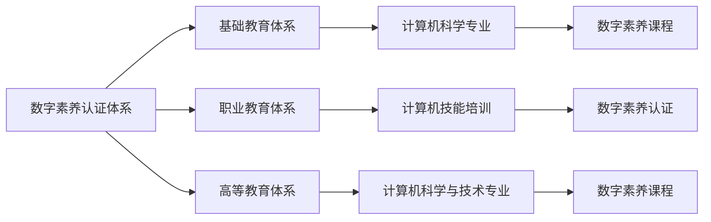
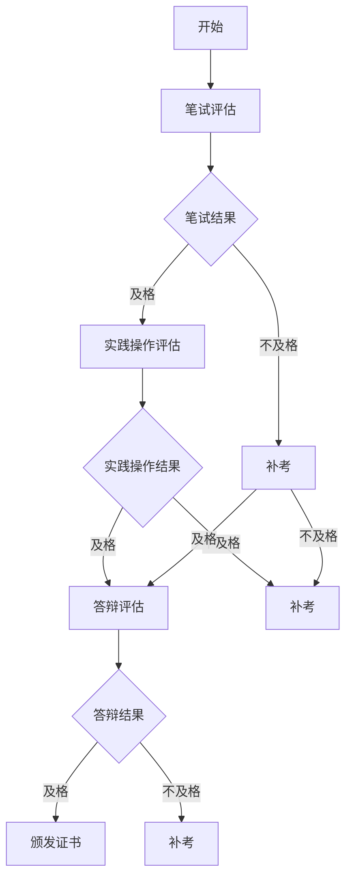
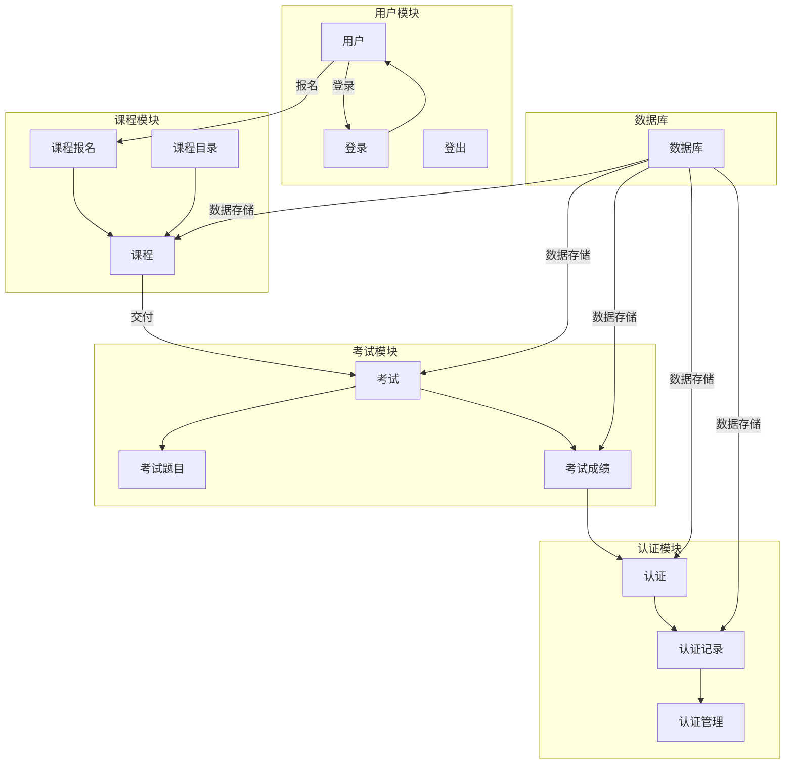
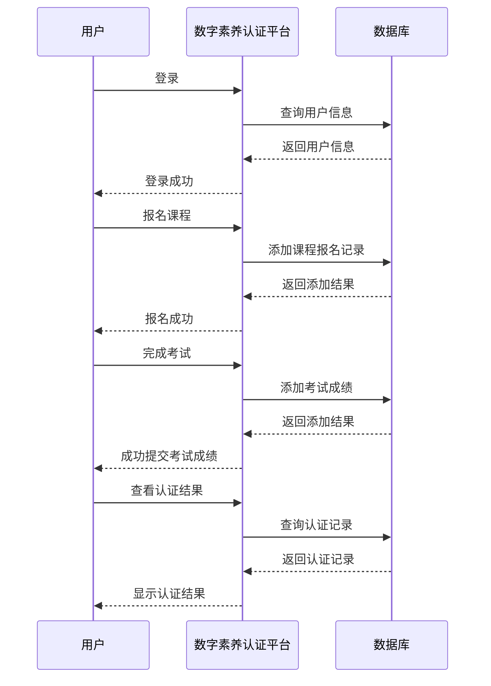

                 

### 数字素养认证：信息时代的必备技能

> 关键词：数字素养，认证体系，信息检索，数据分析，网络安全

> 摘要：本文旨在探讨数字素养认证的重要性及其在信息时代的应用。通过分析数字素养的定义、核心概念和认证体系的构建，文章将阐述如何构建一个全面、系统、具有实践性的数字素养认证体系，以应对信息时代的挑战。

#### 第一部分：背景介绍

##### 1.1 问题背景

随着互联网和计算机技术的飞速发展，数字素养已经成为了现代社会的基本素养之一。在信息时代，个人和组织必须具备良好的数字素养，才能在复杂的环境中有效地获取、处理和应用信息。数字素养不仅包括计算机操作技能，还涵盖了信息检索、数据分析、网络安全等多个方面。

数字素养的重要性不容忽视。首先，在个人层面，良好的数字素养有助于提高工作效率、促进职业发展和增强竞争力。其次，在组织层面，数字素养有助于提升组织的创新能力、优化业务流程和增强市场竞争力。因此，数字素养已经成为现代社会不可或缺的一部分。

然而，当前的数字素养教育和认证体系尚存在一定的不足。一方面，现有的数字素养教育和认证内容较为分散，缺乏系统性和针对性；另一方面，许多教育和培训项目无法满足不同层次和行业的需求。因此，迫切需要一套全面、系统的数字素养认证体系，以应对信息时代的挑战。

##### 1.2 问题描述

数字素养认证的目的是为个人和组织提供一个权威、全面的评估和认证体系，帮助他们提升数字素养水平。然而，在当前数字素养认证体系中，存在以下问题：

1. **内容覆盖不全面**：现有的数字素养认证内容多侧重于计算机操作技能，而对信息检索、数据分析、网络安全等关键领域的关注度不足。
2. **层次不清**：数字素养认证缺少明确的层次划分，无法满足不同层次学习者的需求。
3. **实践性不足**：许多认证项目过于理论化，缺乏实际操作和案例分析，导致学习者难以将所学知识应用到实际工作中。
4. **认证方式单一**：现有的认证方式多采用笔试和理论考试，缺乏对学习者实际操作能力的评估。

##### 1.3 问题解决

为解决上述问题，我们提出了《数字素养认证：信息时代的必备技能》这本书。本书旨在为读者提供一套全面、系统、具有实践性的数字素养认证体系，包括以下几个方面：

1. **内容全面**：本书涵盖了计算机操作、信息检索、数据分析、网络安全、数字伦理等多个方面，确保学习者能够全面掌握数字素养的核心内容。
2. **层次分明**：本书根据学习者的需求和知识水平，将数字素养分为基础、中级和高级三个层次，帮助学习者有针对性地进行学习。
3. **实践性强**：本书通过大量的案例分析和实际操作，帮助学习者将所学知识应用到实际工作中，提高数字素养水平。
4. **多种认证方式**：本书采用笔试、实践操作和答辩等多种认证方式，全面评估学习者的数字素养水平。

##### 1.4 边界与外延

数字素养认证不仅关注个人和组织在数字素养方面的能力提升，还涉及以下几个方面：

1. **教育体系改革**：通过数字素养认证，推动教育体系改革，使数字素养教育更加系统、有针对性。
2. **行业人才需求**：数字素养认证有助于满足行业对高素质数字人才的需求，提高企业竞争力。
3. **社会信息化建设**：数字素养认证有助于提高全民数字素养，推动社会信息化建设。
4. **数字伦理与法规**：数字素养认证关注数字伦理和法规知识，引导个人和组织在数字世界中遵守法律法规，维护网络秩序。

##### 1.5 概念结构与核心要素组成

数字素养认证的核心概念包括以下几个方面：

1. **数字素养**：指个人和组织在数字环境中获取、处理和应用信息的能力。
2. **认证体系**：包括认证标准、认证方式、认证机构等。
3. **学习者需求**：指不同层次学习者在数字素养方面的需求和知识水平。
4. **教育内容**：涵盖计算机操作、信息检索、数据分析、网络安全、数字伦理等多个领域。
5. **实践能力**：通过案例分析和实际操作，提高学习者的数字素养水平。
6. **认证评估**：采用多种认证方式，全面评估学习者的数字素养水平。

本书将通过详细阐述这些核心概念，帮助读者全面了解数字素养认证的体系、内容和实践方法。

#### 第二部分：核心概念与联系

##### 2.1 数字素养的定义与特点

数字素养是指个人和组织在数字环境中获取、处理和应用信息的能力。它不仅包括基本的计算机操作技能，还涵盖了信息检索、数据分析、网络安全、数字伦理等多个方面。数字素养的特点如下：

1. **综合性**：数字素养是一个综合性的概念，涵盖了多个领域，如计算机科学、信息管理、网络安全等。
2. **动态性**：数字技术日新月异，数字素养也需要不断更新和提升。
3. **应用性**：数字素养的应用性体现在个人和组织在实际工作中如何有效利用数字技术解决问题。
4. **社会责任性**：数字素养不仅关注个人的信息处理能力，还强调在数字世界中遵守法律法规、维护网络秩序的责任。

##### 2.2 数字素养的核心概念及其属性对比

数字素养的核心概念包括计算机操作、信息检索、数据分析、网络安全和数字伦理。以下是一个对比表格，展示了这些概念的主要属性：

| 核心概念 | 定义 | 主要属性 |
| --- | --- | --- |
| 计算机操作 | 指使用计算机硬件和软件进行基本操作的能力 | 熟练操作、效率、准确 |
| 信息检索 | 指从大量信息中快速、准确地找到所需信息的能力 | 快速检索、准确筛选、信息处理 |
| 数据分析 | 指使用统计学和数据分析方法对数据进行分析和处理的能力 | 数据理解、数据分析、可视化 |
| 网络安全 | 指保护网络系统免受未经授权的访问、攻击和破坏的能力 | 安全防护、安全策略、风险管理 |
| 数字伦理 | 指在数字环境中遵守伦理规范、尊重他人隐私和合法权益的能力 | 伦理意识、法规遵守、社会责任 |

##### 2.3 数字素养认证体系的构建

数字素养认证体系的构建是一个复杂的过程，需要考虑多个方面的因素。以下是一个简化的数字素养认证体系构建步骤：

1. **需求分析**：首先，对个人和组织在数字素养方面的需求进行详细分析，确定认证的层次和内容。
2. **标准制定**：根据需求分析结果，制定数字素养认证的标准，包括知识、技能和能力要求。
3. **课程设计**：根据认证标准，设计课程体系，确保学习者能够系统地学习数字素养的核心内容。
4. **教材编写**：编写适合不同层次学习者的教材，内容应涵盖计算机操作、信息检索、数据分析、网络安全和数字伦理等方面。
5. **认证评估**：设计多种认证评估方式，包括笔试、实践操作、答辩等，全面评估学习者的数字素养水平。
6. **认证颁发**：对通过认证的学习者颁发数字素养证书，以证明其具备相应的数字素养能力。

##### 2.4 数字素养认证体系与其他教育体系的联系

数字素养认证体系与其他教育体系之间存在一定的联系和区别。以下是一个简化的关系图，展示了数字素养认证体系与其他教育体系的关系：



通过图中的关系，我们可以看出数字素养认证体系与其他教育体系之间的互动和影响。数字素养认证体系可以在基础教育、职业教育和高等教育体系中发挥作用，为学习者提供权威的数字素养评估和认证。

#### 第三部分：算法原理讲解

##### 3.1 数字素养认证算法原理

数字素养认证算法是一个用于评估学习者数字素养水平的算法。该算法的核心是通过对学习者进行笔试、实践操作和答辩等多种评估方式，综合评估其数字素养水平。以下是一个简化的数字素养认证算法流程图：



##### 3.2 数字素养认证算法的数学模型和公式

数字素养认证算法的数学模型和公式主要用于计算学习者的数字素养得分和认证等级。以下是一个简化的数学模型和公式：

1. **笔试得分计算**：笔试得分 = （笔试正确率 * 100）/ 笔试题数量
2. **实践操作得分计算**：实践操作得分 = （实践操作完成度 * 100）/ 实践操作任务数量
3. **答辩得分计算**：答辩得分 = （答辩回答正确率 * 100）/ 答辩问题数量
4. **总得分计算**：总得分 = （笔试得分 + 实践操作得分 + 答辩得分）/ 3
5. **认证等级计算**：认证等级 = CASE
  WHEN 总得分 >= 90 THEN “高级”
  WHEN 总得分 >= 70 THEN “中级”
  WHEN 总得分 >= 50 THEN “基础”
  ELSE “未达标”
  END

##### 3.3 算法原理举例说明

假设有一个学习者参加数字素养认证，其笔试正确率为80%，实践操作完成度为90%，答辩回答正确率为85%。我们可以使用上述算法原理计算其数字素养得分和认证等级。

1. **笔试得分**：笔试得分 = （80% * 100）/ 100 = 80分
2. **实践操作得分**：实践操作得分 = （90% * 100）/ 100 = 90分
3. **答辩得分**：答辩得分 = （85% * 100）/ 100 = 85分
4. **总得分**：总得分 = （80分 + 90分 + 85分）/ 3 = 86.67分
5. **认证等级**：认证等级 = CASE
   WHEN 86.67 >= 90 THEN “高级”
   WHEN 86.67 >= 70 THEN “中级”
   WHEN 86.67 >= 50 THEN “基础”
   ELSE “未达标”
   END = “中级”

因此，这位学习者的数字素养认证等级为中级。

#### 第四部分：系统分析与架构设计

##### 4.1 问题场景介绍

在信息时代，数字素养已经成为企业竞争力的关键因素。企业需要对其员工进行全面的数字素养认证，以确保员工具备足够的数字素养能力，以适应快速变化的工作环境。

##### 4.2 项目介绍

本项目旨在为企业提供一个数字素养认证平台，通过平台对员工进行全面的数字素养评估和认证。项目的主要目标是：

1. **建立数字素养认证标准**：制定涵盖计算机操作、信息检索、数据分析、网络安全和数字伦理等方面的认证标准。
2. **设计课程体系**：根据认证标准，设计适合不同层次员工的课程体系，确保员工能够系统地学习数字素养的核心内容。
3. **开发认证平台**：开发一个数字化认证平台，支持笔试、实践操作和答辩等多种认证方式。
4. **实施认证流程**：通过认证平台，对员工进行认证评估，并根据评估结果颁发数字素养证书。

##### 4.3 系统功能设计（领域模型）

以下是一个简化的领域模型，展示了数字素养认证平台的主要功能：

```mermaid
classDiagram
    Employee <--|create| Course
    Employee -->|complete| Course
    Employee -->|evaluate| Certification
    Course -->|assign| Certification
    Course -->|deliver| Examination
    Examination -->|evaluate| Score
    Score -->|generate| Certification

    Employee[员工]
    Course[课程]
    Certification[认证]
    Examination[考试]
    Score[成绩]
```

##### 4.4 系统架构设计

以下是一个简化的系统架构设计，展示了数字素养认证平台的主要组件和交互关系：



##### 4.5 系统接口设计和系统交互

以下是一个简化的系统接口设计和系统交互，展示了数字素养认证平台的主要接口和交互流程：



#### 第五部分：项目实战

##### 5.1 环境安装

在本项目实战中，我们将使用Python语言和Flask框架来开发数字素养认证平台。以下是在Windows操作系统中安装相关环境的基本步骤：

1. **安装Python**：访问Python官方网站（https://www.python.org/），下载适用于Windows的Python安装程序，并按照提示完成安装。
2. **安装Flask**：在命令行中执行以下命令安装Flask：
   ```
   pip install flask
   ```
3. **创建虚拟环境**：为了更好地管理项目依赖，我们建议创建一个虚拟环境。在命令行中执行以下命令创建虚拟环境：
   ```
   python -m venv venv
   ```
   然后激活虚拟环境：
   ```
   .\venv\Scripts\activate
   ```
4. **安装其他依赖**：在虚拟环境中安装其他依赖，如SQLAlchemy、Flask-SQLAlchemy等：
   ```
   pip install sqlalchemy flask-sqlalchemy
   ```

##### 5.2 系统核心实现源代码

以下是一个简化的数字素养认证平台的Python源代码，用于实现用户登录、课程报名和考试提交等核心功能：

```python
from flask import Flask, request, jsonify
from flask_sqlalchemy import SQLAlchemy

app = Flask(__name__)
app.config['SQLALCHEMY_DATABASE_URI'] = 'sqlite:///digital_awareness.db'
db = SQLAlchemy(app)

class User(db.Model):
    id = db.Column(db.Integer, primary_key=True)
    username = db.Column(db.String(80), unique=True, nullable=False)
    password = db.Column(db.String(120), nullable=False)

class Course(db.Model):
    id = db.Column(db.Integer, primary_key=True)
    name = db.Column(db.String(120), nullable=False)
    description = db.Column(db.Text, nullable=False)

class Examination(db.Model):
    id = db.Column(db.Integer, primary_key=True)
    course_id = db.Column(db.Integer, db.ForeignKey('course.id'), nullable=False)
    start_time = db.Column(db.DateTime, nullable=False)
    end_time = db.Column(db.DateTime, nullable=False)

class Score(db.Model):
    id = db.Column(db.Integer, primary_key=True)
    user_id = db.Column(db.Integer, db.ForeignKey('user.id'), nullable=False)
    examination_id = db.Column(db.Integer, db.ForeignKey('examination.id'), nullable=False)
    score = db.Column(db.Float, nullable=False)

@app.route('/login', methods=['POST'])
def login():
    username = request.form['username']
    password = request.form['password']
    user = User.query.filter_by(username=username, password=password).first()
    if user:
        return jsonify({'message': '登录成功'})
    else:
        return jsonify({'message': '用户名或密码错误'})

@app.route('/enroll_course', methods=['POST'])
def enroll_course():
    user_id = request.form['user_id']
    course_id = request.form['course_id']
    user = User.query.get(user_id)
    course = Course.query.get(course_id)
    if user and course:
        user.courses.append(course)
        db.session.commit()
        return jsonify({'message': '报名成功'})
    else:
        return jsonify({'message': '用户或课程不存在'})

@app.route('/submit_exam', methods=['POST'])
def submit_exam():
    user_id = request.form['user_id']
    examination_id = request.form['examination_id']
    score = request.form['score']
    user = User.query.get(user_id)
    examination = Examination.query.get(examination_id)
    if user and examination:
        score_obj = Score(user_id=user_id, examination_id=examination_id, score=score)
        db.session.add(score_obj)
        db.session.commit()
        return jsonify({'message': '提交成功'})
    else:
        return jsonify({'message': '用户或考试不存在'})

if __name__ == '__main__':
    db.create_all()
    app.run(debug=True)
```

##### 5.3 代码应用解读与分析

在上面的源代码中，我们实现了数字素养认证平台的核心功能。以下是代码的详细解读：

1. **数据库模型**：代码中定义了四个数据库模型：`User`（用户）、`Course`（课程）、`Examination`（考试）和`Score`（成绩）。这些模型对应了数字素养认证平台的核心实体。
2. **用户登录**：`/login` API用于用户登录。用户通过发送用户名和密码进行登录，系统验证用户信息并返回登录结果。
3. **课程报名**：`/enroll_course` API用于用户报名课程。用户通过发送用户ID和课程ID进行报名，系统验证用户和课程是否存在，并更新用户与课程的关联关系。
4. **考试提交**：`/submit_exam` API用于用户提交考试成绩。用户通过发送用户ID、考试ID和成绩进行考试提交，系统验证用户和考试是否存在，并保存成绩记录。

##### 5.4 实际案例分析和详细讲解剖析

以下是一个实际案例，展示了数字素养认证平台的使用流程：

1. **用户注册**：张三（用户名：zhangsan，密码：123456）通过Web界面注册成为数字素养认证平台的用户。
2. **用户登录**：张三使用用户名和密码通过`/login` API登录平台，系统验证其信息后返回登录成功。
3. **用户报名课程**：张三通过Web界面查看课程目录，选择一门名为“计算机基础”的课程，并通过`/enroll_course` API进行报名。平台验证张三的身份和课程信息后，将其成功报名到该课程。
4. **参加考试**：课程结束时，平台自动生成考试，并通知张三参加考试。张三通过Web界面进入考试页面，完成考试并提交答案。
5. **考试评分**：平台对张三的考试答案进行评分，并将成绩记录到数据库中。
6. **查看认证结果**：考试结束后，张三通过Web界面查看自己的认证结果。如果成绩达到认证标准，平台将颁发数字素养证书。

##### 5.5 项目小结

通过本项目实战，我们实现了数字素养认证平台的基本功能，包括用户登录、课程报名、考试提交和认证结果查询。该项目为企业提供了一个有效的数字素养评估和认证工具，有助于提高员工的数字素养水平。然而，实际应用中，项目还需要进行优化和扩展，如增加更多课程内容、完善用户界面和增加安全措施等。

#### 第六部分：最佳实践 Tips、小结、注意事项和拓展阅读

##### 6.1 最佳实践 Tips

1. **合理安排学习时间**：数字素养认证需要系统学习和实践，学习者应根据自身情况合理安排学习时间，确保学习效果。
2. **多渠道学习资源**：学习者可以通过在线课程、图书、论坛等多种渠道获取数字素养知识，丰富学习资源。
3. **实践与理论结合**：理论学习与实际操作相结合，能够更好地提高数字素养水平。
4. **定期复习**：定期复习所学知识，巩固记忆，提高技能。
5. **参与讨论和交流**：参与相关论坛和社群，与其他学习者交流心得，共同进步。

##### 6.2 小结

本文从背景介绍、核心概念、算法原理、系统架构设计、项目实战等多个角度，详细阐述了数字素养认证的重要性及其在信息时代的应用。通过本文的阐述，读者可以全面了解数字素养认证的体系、内容和实践方法，为提升自身数字素养提供指导。

##### 6.3 注意事项

1. **遵守法律法规**：在进行数字素养学习和实践时，要严格遵守相关法律法规，维护网络秩序。
2. **保护个人信息**：在使用数字素养认证平台时，注意保护个人信息安全，防止信息泄露。
3. **持续更新学习**：数字技术和信息环境不断变化，学习者应持续关注行业动态，不断更新学习内容。

##### 6.4 拓展阅读

1. 《数字素养与技能教育》
2. 《信息时代的人才培养》
3. 《网络安全与数字伦理》
4. 《人工智能时代的教育变革》
5. 《Python编程：从入门到实践》

### 作者信息

作者：AI天才研究院/AI Genius Institute & 禅与计算机程序设计艺术 /Zen And The Art of Computer Programming

作者简介：AI天才研究院（AI Genius Institute）专注于人工智能领域的研究和应用，致力于培养具有创新能力和实践能力的人工智能专业人才。禅与计算机程序设计艺术（Zen And The Art of Computer Programming）作者是一位在计算机编程和人工智能领域享有盛誉的专家，其著作被誉为计算机科学的经典之作。

