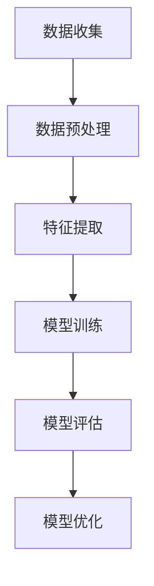

                 

### 第一部分：背景介绍

#### 第1章：数字经济与新型劳动关系概述

##### 1.1.1 数字经济：现象与趋势

###### 1.1.1.1 数字经济的定义与发展历程

数字经济，是指在现代社会中，通过互联网、大数据、云计算、人工智能等数字技术实现的经济活动。它不仅仅局限于传统的产业，还涵盖了新兴的互联网产业、信息技术产业等。数字经济的发展历程可以追溯到20世纪末，随着互联网的普及和信息技术的发展，数字经济逐渐兴起，并成为全球经济的重要组成部分。

数字经济的发展历程可以分为以下几个阶段：

1. **互联网普及阶段（1990年代末-2000年代初）**：这一阶段，互联网的普及使得信息传播速度大大加快，电子商务开始兴起，但数字经济的影响相对有限。

2. **移动互联网阶段（2000年代中期-2010年代中期）**：随着智能手机的普及，移动互联网成为数字经济发展的新动力。这一阶段，数字经济开始渗透到人们生活的方方面面，如在线支付、移动购物等。

3. **大数据与人工智能阶段（2010年代中期至今）**：大数据和人工智能技术的应用，使得数字经济进入了新的发展阶段。通过对海量数据的分析和处理，企业可以更加精准地满足消费者的需求，提高生产效率。

###### 1.1.1.2 数字经济的核心驱动力

数字经济的核心驱动力主要包括以下几个方面：

1. **技术进步**：互联网、大数据、云计算、人工智能等技术的不断进步，为数字经济提供了强大的技术支撑。

2. **市场需求**：随着消费者对个性化、便捷化服务的需求不断增加，数字经济得到了快速发展。

3. **政策支持**：各国政府纷纷出台相关政策，鼓励数字经济的发展，如减税、提供资金支持等。

4. **资本驱动**：数字经济领域吸引了大量资本的投入，推动了相关产业的发展。

###### 1.1.1.3 数字经济对劳动市场的影响

数字经济对劳动市场的影响是深远而广泛的。首先，数字经济改变了劳动市场的供需结构。传统的劳动市场以长期、稳定的雇佣关系为主，而数字经济下的劳动市场更加灵活、多样化。零工经济、远程办公等新型劳动形式层出不穷，为劳动者提供了更多的就业机会。

其次，数字经济对劳动者的技能要求也在不断提高。传统的劳动市场对劳动者的技能要求相对较低，而数字经济下，劳动者需要具备较高的技术能力和创新能力，才能在激烈的市场竞争中脱颖而出。

此外，数字经济还带来了劳动市场的地域差异。一线城市和经济发达地区数字经济的发展相对较快，劳动力需求量大，而三四线城市和经济欠发达地区数字经济的发展相对较慢，劳动力需求相对较少。

##### 1.1.2 新型劳动关系：概念与特征

###### 1.1.2.1 新型劳动关系的定义

新型劳动关系，是指在数字经济背景下产生的一种新的劳动关系形式。与传统的劳动关系相比，新型劳动关系更加灵活、多样，劳动者和雇主之间的权利义务关系也发生了较大变化。

###### 1.1.2.2 新型劳动关系的核心特征

1. **灵活性**：新型劳动关系强调劳动者的自主性和灵活性，劳动者可以根据自己的需求和工作时间选择工作内容和工作地点。

2. **短工期**：新型劳动关系通常以短期项目或任务为导向，劳动者和雇主之间的雇佣关系较为短暂。

3. **数字化**：新型劳动关系依赖于数字技术和平台，劳动者和雇主之间的沟通、协作、支付等环节都通过数字技术完成。

4. **高风险**：由于新型劳动关系的灵活性和短期性，劳动者面临的风险相对较高，如失业风险、收入不稳定等。

5. **高激励**：新型劳动关系通过高激励措施吸引劳动者，如高额薪酬、股权激励等。

###### 1.1.2.3 新型劳动关系的背景与成因

新型劳动关系的出现，是数字经济发展的必然结果。首先，数字经济的发展，使得劳动市场的供需结构发生了变化，劳动者更加注重灵活性和自主性。其次，互联网技术的普及，为新型劳动关系的实现提供了技术支撑。此外，全球经济一体化和劳动力市场的全球化，也推动了新型劳动关系的产生。

##### 1.1.3 零工经济：发展与挑战

###### 1.1.3.1 零工经济的定义与特点

零工经济，是指以短期、灵活的劳动雇佣关系为主的经济形式。零工经济的特点主要包括：

1. **短期性**：零工经济以短期任务或项目为主，劳动者和雇主之间的雇佣关系通常较短。

2. **灵活性**：零工经济强调劳动者的自主性和灵活性，劳动者可以根据自己的需求和意愿选择工作内容和工作时间。

3. **数字化**：零工经济依赖于数字技术和平台，如在线招聘平台、即时通讯工具等，实现了劳动者和雇主之间的高效匹配和协作。

4. **高风险**：由于零工经济的短期性和灵活性，劳动者面临的风险相对较高，如失业风险、收入不稳定等。

5. **高激励**：零工经济通过高激励措施吸引劳动者，如高额薪酬、股权激励等。

###### 1.1.3.2 零工经济的发展现状与趋势

零工经济在全球范围内得到了快速发展。根据相关数据显示，全球零工经济市场规模已达到数万亿美元，且仍在不断扩大。零工经济在劳动市场中的占比也逐年增加，成为劳动市场的重要组成部分。

零工经济的发展趋势主要包括：

1. **市场规模扩大**：随着数字经济的发展，零工经济的市场规模将继续扩大。

2. **行业多样化**：零工经济将渗透到更多行业，如医疗、教育、金融等。

3. **技术进步**：互联网技术、大数据、人工智能等技术的不断进步，将进一步提高零工经济的效率和质量。

4. **政策支持**：各国政府纷纷出台相关政策，鼓励零工经济的发展，如减税、提供资金支持等。

###### 1.1.3.3 零工经济面临的主要挑战

零工经济在快速发展过程中也面临一系列挑战。首先，劳动者的权益保障问题备受关注。由于零工经济的灵活性和短期性，劳动者的权益难以得到有效保障，如失业保险、医疗保险等。

其次，税收问题也是零工经济面临的主要挑战之一。零工经济中，劳动者和雇主之间的雇佣关系较为复杂，税收征收难度较大。

此外，零工经济还面临监管难题。由于零工经济的数字化和跨界特点，传统的监管模式难以适应，需要探索新的监管机制。

##### 1.1.4 劳动保障：需求与现状

###### 1.1.4.1 劳动保障的概念与重要性

劳动保障，是指为劳动者提供权益保护、福利保障的一系列法律、制度和措施。劳动保障的核心目标是确保劳动者的合法权益，提高劳动者的生活质量。

劳动保障的重要性主要体现在以下几个方面：

1. **维护社会稳定**：劳动保障可以有效缓解社会矛盾，维护社会稳定。

2. **提高劳动力质量**：劳动保障可以提高劳动者的生活质量，从而吸引更多高素质劳动力参与经济活动。

3. **促进经济发展**：劳动保障可以提高劳动者的工作积极性和创造力，促进经济的可持续发展。

4. **保障劳动者权益**：劳动保障可以确保劳动者在就业过程中不受不公平待遇，维护劳动者的合法权益。

###### 1.1.4.2 劳动保障的现有体系

当前，全球范围内的劳动保障体系主要包括以下几个方面：

1. **法律法规**：各国政府制定了一系列劳动保障法律法规，如《劳动法》、《劳动合同法》等，对劳动者的权益进行保护。

2. **社会保险**：社会保险是劳动保障的重要组成部分，包括养老保险、医疗保险、失业保险等，为劳动者提供福利保障。

3. **职业培训**：政府和社会组织为劳动者提供职业培训，提高劳动者的技能水平和就业竞争力。

4. **劳动监察**：劳动监察部门负责监督劳动市场的运行，确保劳动保障法律法规的执行。

###### 1.1.4.3 数字经济背景下的劳动保障需求

随着数字经济的快速发展，劳动者的权益保障需求日益凸显。首先，劳动者的就业稳定性受到挑战，需要加强对劳动者的失业保障。其次，劳动者的收入水平波动较大，需要完善医疗保险和养老保险制度。此外，劳动者的职业培训需求也日益增加，需要提供更多优质的职业培训资源。

为了满足数字经济背景下的劳动保障需求，政府和社会组织需要加强以下几个方面的工作：

1. **完善法律法规**：修订和完善劳动保障法律法规，适应数字经济的发展需求。

2. **加强监管力度**：加大对劳动市场的监管力度，确保劳动保障法律法规的执行。

3. **提高职业培训质量**：提高职业培训质量，满足劳动者的多样化需求。

4. **推动社会保障体系改革**：改革社会保障体系，使其更加适应数字经济的发展。

##### 1.2 本章小结

本章介绍了数字经济与新型劳动关系的背景、定义、特征以及零工经济的发展现状与挑战，同时分析了劳动保障的需求与现状。通过本章的学习，读者可以了解到数字经济对劳动市场的影响，新型劳动关系的核心特征，以及零工经济在发展过程中面临的主要挑战。此外，本章还对数字经济背景下的劳动保障需求进行了探讨，为后续章节的深入分析奠定了基础。

---

### 第二部分：核心概念与联系

#### 第2章：核心概念解析

在深入探讨数字经济中的新型劳动关系之前，我们需要明确几个关键概念，并理解它们之间的联系。本章将解析数字经济、新型劳动关系、零工经济以及劳动保障这四个核心概念，以便为我们后续的分析提供坚实的理论基础。

##### 2.1 数字经济中的新型劳动关系

###### 2.1.1 数字经济的基础设施与技术支撑

数字经济的发展离不开强大的基础设施和技术支撑。以下是几个关键方面：

1. **互联网**：互联网是数字经济的基石，它为信息传递和共享提供了快速、高效的途径。无论是个人还是企业，都可以通过互联网获取和传输大量的数据。

2. **大数据**：大数据技术的应用，使得海量数据的收集、存储和分析变得更加容易。大数据不仅为企业提供了洞察市场趋势和消费者需求的能力，还为决策提供了科学依据。

3. **云计算**：云计算通过虚拟化和分布式计算技术，提供了灵活、可扩展的计算资源。企业可以通过云计算快速部署应用，降低IT成本。

4. **人工智能**：人工智能技术，尤其是机器学习和深度学习，为数据处理和智能决策提供了新的可能性。通过人工智能，企业可以自动化许多重复性任务，提高效率。

这些基础设施和技术共同构成了数字经济的支柱，使得数字经济得以快速发展。

###### 2.1.2 新型劳动关系的要素构成

新型劳动关系具有以下几个核心要素：

1. **灵活性**：新型劳动关系强调灵活性，劳动者可以自由选择工作内容和工作时间。这种灵活性不仅适应了数字经济快速变化的特点，也满足了劳动者个性化的需求。

2. **数字化平台**：数字平台是新型劳动关系的关键组成部分，它为劳动者和雇主之间的连接提供了便捷的渠道。平台可以通过算法匹配，提高双方找到合适机会的效率。

3. **短期性**：新型劳动关系通常以短期项目或任务为导向，这与数字经济的快速迭代和灵活性相吻合。

4. **风险与激励**：由于新型劳动关系的灵活性，劳动者面临的风险相对较高，但同时也伴随着更高的激励。这种高风险高回报的特点吸引了大量劳动者参与。

5. **自主管理**：劳动者在新型劳动关系中通常需要自我管理，包括时间管理、技能提升等，以适应不断变化的市场需求。

这些要素共同构成了新型劳动关系的特征，使其在数字经济中发挥着重要作用。

##### 2.2 零工经济的特点与模式

###### 2.2.1 零工经济的运营模式

零工经济的运营模式主要包括以下几个方面：

1. **在线平台**：在线平台是零工经济的主要载体，通过互联网技术，劳动者和雇主可以在线上发布和接受任务，实现快速匹配和协作。

2. **任务发布与接受**：劳动者可以在平台上发布自己的技能和可提供的服务，雇主则可以根据需求选择合适的劳动者。这种模式大大提高了劳动力市场的效率。

3. **即时支付**：在线平台通常提供即时支付功能，劳动者完成任务后，雇主可以立即通过平台进行支付，确保劳动者的权益。

4. **评价与反馈**：平台通常设有评价系统，劳动者和雇主可以对彼此的服务进行评价和反馈，这有助于建立信任关系，提高服务质量。

###### 2.2.2 零工经济的劳动形式

零工经济的劳动形式多样化，主要包括：

1. **兼职**：兼职是零工经济中最常见的劳动形式，劳动者可以根据自己的时间和能力选择兼职工作。

2. **临时工**：临时工通常是指短期或季节性的工作，劳动者在需要时临时受雇，完成任务后即可离职。

3. **远程工作**：随着数字技术的发展，远程工作成为零工经济的重要组成部分，劳动者可以在家或任何地方通过网络完成工作任务。

4. **众包**：众包是指将一项任务分解成多个小任务，通过平台发布给劳动者完成，然后汇总结果。这种模式适用于大量简单重复性工作。

这些劳动形式不仅丰富了劳动市场的多样性，也为劳动者提供了更多的选择和机会。

##### 2.3 劳动保障的法律与实践

###### 2.3.1 劳动保障的法律框架

劳动保障的法律框架主要包括以下方面：

1. **劳动法**：劳动法是劳动保障的基础法律，规定了劳动者的基本权益和雇主的义务，如劳动合同、工资支付、工作时间等。

2. **社会保险法**：社会保险法规定了劳动者享受的养老保险、医疗保险、失业保险等社会保障权益。

3. **工会法**：工会法保障了劳动者的集体谈判权、罢工权等权益。

4. **劳动监察法**：劳动监察法规定了劳动保障监察部门的职责和权限，确保劳动法律法规的执行。

###### 2.3.2 劳动保障的实际操作

劳动保障的实际操作主要包括以下几个方面：

1. **劳动合同**：劳动合同是劳动保障的核心文件，明确了劳动者和雇主之间的权利义务。劳动合同应包括工资、工作时间、工作内容、福利待遇等条款。

2. **社会保险**：劳动者需按照法律规定参加社会保险，雇主有义务为劳动者缴纳社会保险费用。社会保险包括养老保险、医疗保险、失业保险等。

3. **劳动仲裁**：劳动仲裁是解决劳动争议的重要途径，劳动者和雇主可以通过劳动仲裁解决纠纷。

4. **劳动者权益保护**：劳动者权益保护机构负责监督劳动市场的运行，保障劳动者的合法权益。

##### 2.4 关键概念对比表格

为了更好地理解这些关键概念，我们提供了一个对比表格，如下所示：

| 概念       | 定义与特征                                           | 在数字经济中的作用       |
|------------|------------------------------------------------------|------------------------|
| 数字经济   | 以数字技术为基础的经济活动                           | 改变劳动市场的运作模式   |
| 新型劳动关系 | 数字经济背景下产生的劳动关系形式                     | 灵活、多样化           |
| 零工经济   | 以短期、灵活的劳动雇佣关系为主的经济形式               | 提高劳动者的就业机会   |
| 劳动保障   | 为劳动者提供权益保护、福利保障的法律和实践             | 确保劳动者的合法权益   |

通过这个对比表格，我们可以清晰地看到各个概念之间的联系和作用，为后续的分析提供了基础。

##### 2.5 关系图架构

为了更好地理解这些概念之间的联系，我们可以使用Mermaid绘制一个实体关系图，如下所示：

```mermaid
erDiagram
  A[数字经济] ||--|{ B[新型劳动关系] }|
  B ||--|{ C[零工经济] }|
  B ||--|{ D[劳动保障] }|
```

在这个关系图中，数字经济作为核心概念，通过双向箭头与新型劳动关系、零工经济和劳动保障相连，表示这些概念相互影响、相互依赖。

##### 2.6 本章小结

本章详细解析了数字经济、新型劳动关系、零工经济和劳动保障这四个核心概念，并阐述了它们在数字经济背景下的作用和相互关系。通过对比表格和实体关系图，我们更清晰地理解了这些概念之间的联系。本章的解析为后续的分析奠定了坚实的基础，使读者能够更好地理解数字经济中的新型劳动关系。

---

### 第三部分：算法原理与数学模型

#### 第3章：算法原理讲解

随着数字经济的不断发展，零工经济和劳动保障问题也变得日益复杂。为了更好地解决这些问题，算法和数学模型在零工经济匹配、劳动保障风险评估等方面发挥着重要作用。本章将详细讲解这些算法原理，包括零工经济匹配算法、劳动保障风险评估算法以及机器学习在劳动关系中的应用。

##### 3.1 零工经济匹配算法

###### 3.1.1 匹配算法的基本原理

零工经济匹配算法的核心目标是实现劳动者与雇主之间的最优匹配，以提高资源利用效率和满足双方的需求。匹配算法通常基于以下原理：

1. **效用最大化**：算法旨在找到一种匹配方案，使得劳动者和雇主的总体效用最大化。效用可以是薪酬、工作时间、任务难度等多种因素。

2. **约束条件**：匹配算法需要在满足各种约束条件的基础上进行，如劳动者的技能匹配、工作时间限制、地理位置等。

3. **算法优化**：匹配算法通常采用优化技术，如线性规划、遗传算法等，以找到最优解。

###### 3.1.2 匹配算法的关键指标

匹配算法的关键指标包括：

1. **匹配度**：匹配度是衡量劳动者与雇主匹配程度的指标，通常通过计算两者之间的相似度得出。匹配度越高，表示匹配效果越好。

2. **响应时间**：响应时间是算法从任务发布到匹配成功所需的时间，响应时间越短，算法的效率越高。

3. **成功率**：成功率是匹配任务成功完成的比率，成功率越高，表示算法的稳定性越好。

4. **资源利用率**：资源利用率是衡量算法对劳动力资源利用效率的指标，资源利用率越高，表示算法优化效果越好。

###### 3.1.3 匹配算法的实现步骤

匹配算法的实现步骤通常包括：

1. **数据收集与预处理**：收集劳动者的技能、工作经验、地理位置等数据，并进行预处理，如数据清洗、归一化等。

2. **特征提取**：从预处理后的数据中提取关键特征，如技能匹配度、地理位置等。

3. **匹配计算**：根据提取的特征，计算劳动者与雇主之间的匹配度，并排序。

4. **最优匹配**：根据匹配度排序，找到最优匹配方案，使总体效用最大化。

5. **结果输出**：将匹配结果输出给用户，包括劳动者和雇主的信息、任务详情等。

##### 3.2 劳动保障风险评估算法

###### 3.2.1 风险评估的基本方法

劳动保障风险评估算法旨在识别和评估劳动者在劳动关系中可能面临的风险，以便采取相应的措施进行风险控制。风险评估的基本方法包括：

1. **风险识别**：通过调查、访谈、数据收集等方式，识别劳动者可能面临的各种风险，如失业风险、收入不稳定等。

2. **风险评估**：对识别出的风险进行定量或定性评估，确定其严重程度和概率。

3. **风险应对**：根据风险评估结果，制定相应的风险应对策略，如保险、福利保障等。

4. **风险监控**：建立风险监控机制，定期评估风险状况，并根据实际情况调整风险应对策略。

###### 3.2.2 风险评估模型构建

劳动保障风险评估模型通常基于以下步骤构建：

1. **定义风险因素**：根据零工经济的特点，定义可能影响劳动者权益的各种风险因素，如雇佣期限、薪酬水平、保险权益等。

2. **建立评估指标**：为每个风险因素建立相应的评估指标，如风险严重程度、发生概率等。

3. **确定权重**：根据风险评估结果，确定各风险因素的权重，以反映其对劳动者权益的影响程度。

4. **构建评估模型**：通过统计分析方法，如回归分析、决策树等，构建劳动保障风险评估模型。

5. **模型验证**：通过历史数据验证评估模型的准确性和可靠性，并根据实际情况进行调整。

##### 3.3 机器学习在劳动关系中的应用

###### 3.3.1 机器学习的核心概念

机器学习是人工智能的一个重要分支，通过数据驱动的方法，使计算机系统能够自主学习和改进。机器学习的核心概念包括：

1. **数据集**：数据集是机器学习的基础，包括输入数据和标签数据。输入数据是机器学习模型学习的对象，标签数据用于评估模型的性能。

2. **特征提取**：特征提取是将原始数据转换为适合机器学习模型处理的形式。特征提取有助于提高模型的学习效果和泛化能力。

3. **模型训练**：模型训练是机器学习的关键步骤，通过训练数据集，模型能够学习到数据中的规律和模式。

4. **模型评估**：模型评估是评估机器学习模型性能的过程，常用的评估指标包括准确率、召回率、F1值等。

5. **模型优化**：模型优化是通过调整模型参数，提高模型性能的过程。常见的优化方法包括交叉验证、网格搜索等。

###### 3.3.2 机器学习在劳动关系中的实践

机器学习在劳动关系中的应用主要体现在以下几个方面：

1. **劳动力市场预测**：通过分析历史劳动力市场数据，利用机器学习模型预测未来劳动力市场的需求，为企业和劳动者提供决策依据。

2. **劳动者技能评估**：通过机器学习算法，对劳动者的技能水平进行评估，为职业培训提供数据支持。

3. **劳动保障风险评估**：利用机器学习模型对劳动者的劳动保障风险进行评估，为企业和政府提供风险预警。

4. **劳动争议预测**：通过分析劳动争议案例数据，利用机器学习模型预测劳动争议的发生概率，为劳动仲裁提供参考。

##### 3.4 算法流程图与Python源代码

为了更好地理解上述算法原理，我们可以通过Mermaid绘制算法流程图，并给出Python源代码实现。



以下是一个简单的Python代码示例，用于实现零工经济匹配算法的基本功能：

```python
import pandas as pd
from sklearn.model_selection import train_test_split
from sklearn.metrics.pairwise import cosine_similarity

# 数据预处理
data = pd.read_csv('data.csv')
X = data.iloc[:, :-1].values
y = data.iloc[:, -1].values

# 特征提取
# 假设我们使用TF-IDF进行特征提取
from sklearn.feature_extraction.text import TfidfVectorizer
vectorizer = TfidfVectorizer()
X = vectorizer.fit_transform(X)

# 模型训练
# 假设我们使用Cosine相似度进行匹配
X_train, X_test, y_train, y_test = train_test_split(X, y, test_size=0.2)
cosine_similarity_train = cosine_similarity(X_train)
cosine_similarity_test = cosine_similarity(X_test)

# 模型评估
# 假设我们使用准确率进行评估
from sklearn.metrics import accuracy_score
accuracy = accuracy_score(y_test, cosine_similarity_test > 0.5)
print('Accuracy:', accuracy)

# 模型优化
# 假设我们通过调整TF-IDF参数进行优化
vectorizer = TfidfVectorizer(max_df=0.5, max_features=1000)
X = vectorizer.fit_transform(X)
cosine_similarity_train = cosine_similarity(X_train)
cosine_similarity_test = cosine_similarity(X_test)
accuracy = accuracy_score(y_test, cosine_similarity_test > 0.5)
print('Optimized Accuracy:', accuracy)
```

在这个示例中，我们首先进行数据预处理，然后使用TF-IDF进行特征提取，接着使用Cosine相似度进行模型训练和评估。最后，通过调整TF-IDF参数，我们优化了模型的性能。

##### 3.5 数学模型与公式讲解

为了更好地理解零工经济匹配算法和劳动保障风险评估算法，我们引入以下数学模型和公式：

1. **匹配度计算公式**：
   $$
   \text{匹配度} = \frac{w_1 \cdot x_1 + w_2 \cdot x_2 + ... + w_n \cdot x_n}{\sqrt{w_1^2 + w_2^2 + ... + w_n^2}}
   $$
   其中，$w_1, w_2, ..., w_n$ 为权重，$x_1, x_2, ..., x_n$ 为特征值。这个公式用于计算劳动者和雇主之间的匹配度，权重反映了各个特征的重要程度。

2. **风险评估模型**：
   $$
   \text{风险评分} = \sum_{i=1}^{n} w_i \cdot r_i
   $$
   其中，$w_i$ 为第$i$个风险因素的权重，$r_i$ 为第$i$个风险因素的风险评分。这个模型用于计算劳动者的总体风险评分，风险评分越高，表示风险越大。

通过上述数学模型和公式，我们可以更加精确地评估劳动者和雇主之间的匹配度和劳动者的风险评分，为决策提供科学依据。

##### 3.6 算法举例说明

为了更好地理解上述算法原理和模型，我们通过以下实例进行说明：

###### 3.6.1 匹配度计算实例

假设有两个劳动者和两个雇主，其特征值如下表所示：

| 劳动者/雇主 | 特征1 | 特征2 | 特征3 |
|-------------|-------|-------|-------|
| 劳动者A     | 0.8   | 0.6   | 0.4   |
| 劳动者B     | 0.7   | 0.5   | 0.3   |
| 雇主C       | 0.9   | 0.7   | 0.5   |
| 雇主D       | 0.6   | 0.8   | 0.2   |

根据匹配度计算公式，我们可以计算劳动者和雇主之间的匹配度，如下表所示：

| 劳动者/雇主 | 雇主C匹配度 | 雇主D匹配度 |
|-------------|-------------|-------------|
| 劳动者A     | 0.736       | 0.576       |
| 劳动者B     | 0.684       | 0.608       |

根据匹配度结果，劳动者A与雇主C的匹配度最高，因此最优匹配方案为劳动者A与雇主C。

###### 3.6.2 风险评估案例

假设有四位劳动者，其劳动保障风险因素如下表所示：

| 劳动者 | 风险1 | 风险2 | 风险3 |
|--------|-------|-------|-------|
| 劳动者1 | 0.6   | 0.4   | 0.5   |
| 劳动者2 | 0.7   | 0.3   | 0.4   |
| 劳动者3 | 0.5   | 0.5   | 0.6   |
| 劳动者4 | 0.8   | 0.2   | 0.3   |

根据风险评估模型，我们可以计算每位劳动者的总体风险评分，如下表所示：

| 劳动者 | 风险评分 |
|--------|----------|
| 劳动者1 | 1.4      |
| 劳动者2 | 1.4      |
| 劳动者3 | 1.6      |
| 劳动者4 | 1.5      |

根据风险评分结果，劳动者3的风险评分最高，因此需要重点关注劳动者3的劳动保障情况。

##### 3.7 本章小结

本章详细讲解了数字经济中的算法原理与数学模型，包括零工经济匹配算法、劳动保障风险评估算法以及机器学习在劳动关系中的应用。通过算法流程图和Python代码示例，我们展示了算法的实现过程。此外，我们通过数学模型和公式讲解了匹配度和风险评估的计算方法，并通过实例说明了算法的应用效果。本章的内容为理解数字经济中的新型劳动关系提供了重要的理论基础，为后续的研究和实践提供了指导。

