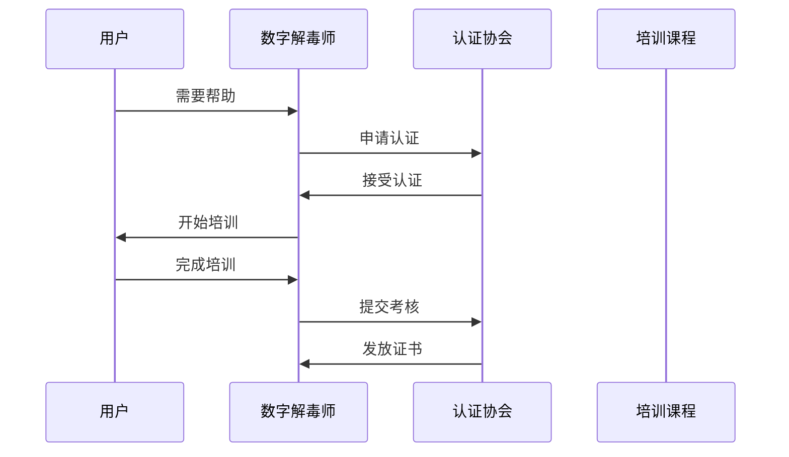
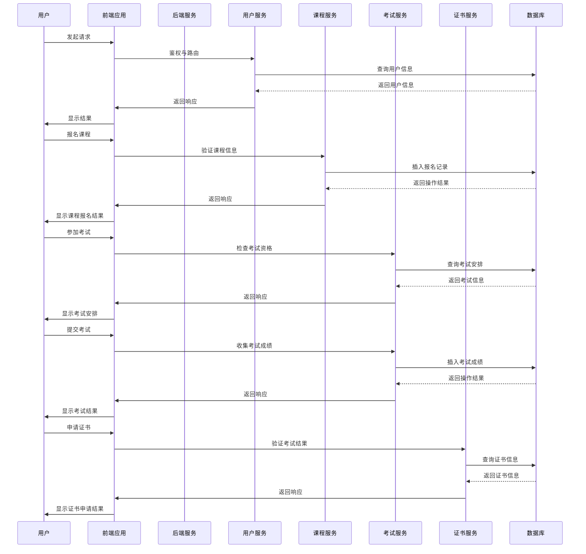

                 

# 数字解毒师认证协会：培训健康网络习惯指导员的机构

## 关键词
- 数字解毒师
- 认证协会
- 健康网络习惯
- 培训课程
- 信息素养

## 摘要
本文将深入探讨数字解毒师认证协会这一机构，旨在培训健康网络习惯指导员。随着数字化时代的到来，网络对个人生活的影响日益深远，然而，过度依赖和不良网络习惯给人们的身心健康带来了诸多挑战。数字解毒师认证协会的成立，正是为了应对这一现状，通过系统的培训和严格的认证，培养出一批具备专业知识和技能的指导员，帮助人们建立健康的网络使用习惯，提升整体生活质量。

## 第1章 引言

### 1.1 问题背景

在现代社会，互联网已经成为人们日常生活中不可或缺的一部分。无论是工作、学习，还是娱乐，互联网都为我们提供了极大的便利。然而，随着互联网的普及，一些负面影响也随之而来。例如，网络成瘾、信息过载、隐私泄露、网络安全等问题，已经成为影响人们身心健康的重要因素。

首先，网络成瘾是一个普遍存在的问题。许多人在网络上花费过多的时间，导致生活质量下降，甚至影响工作和学习。其次，信息过载让人们感到压力倍增，往往难以集中精力处理重要信息。此外，隐私泄露和网络安全问题也让人们在网络上感到不安全，担心个人信息被泄露或遭到黑客攻击。

### 1.2 数字健康网络现状

尽管数字健康网络带来了诸多挑战，但也为我们提供了改善网络健康的机会。随着技术的发展，越来越多的工具和资源被开发出来，旨在帮助人们建立健康的网络使用习惯。例如，网络素养教育、网络安全工具、健康网络应用等，都在一定程度上改善了网络环境。

然而，这些工具和资源往往需要专业知识和技能的支持才能充分发挥其作用。因此，培养一批具备专业知识和技能的数字解毒师，显得尤为重要。数字解毒师不仅能够帮助人们识别和解决网络问题，还能够提供个性化的解决方案，帮助人们建立健康的网络使用习惯。

### 1.3 数字解毒师的角色与职责

数字解毒师是专门从事数字健康网络领域工作的专业人士。他们的主要职责包括：

1. **诊断网络问题**：通过分析用户的网络行为和数据，识别和诊断存在的网络问题。
2. **制定解决方案**：根据诊断结果，为用户提供个性化的解决方案，帮助用户建立健康的网络使用习惯。
3. **培训和指导**：对用户进行网络素养教育和网络安全培训，提升用户的网络素养和安全意识。
4. **研究和推广**：关注数字健康网络领域的最新动态和技术，研究并推广有效的网络健康解决方案。

### 1.4 培训健康网络习惯指导员的必要性

随着数字化时代的深入发展，健康网络习惯指导员的需求日益增加。培训健康网络习惯指导员的必要性主要体现在以下几个方面：

1. **提升网络素养**：通过系统的培训，提升指导员的专业知识和技能，使他们能够更好地应对网络健康问题。
2. **改善网络环境**：健康网络习惯指导员可以引导和帮助用户建立健康的网络使用习惯，改善网络环境。
3. **减少网络负面影响**：通过提供专业的指导和支持，减少网络成瘾、信息过载等负面影响，提升人们的整体生活质量。

综上所述，数字解毒师认证协会的成立，是为了应对数字化时代带来的网络健康挑战，通过培训健康网络习惯指导员，帮助人们建立健康的网络使用习惯，提升整体生活质量。这不仅是对个人健康的一种保护，也是对整个社会的一种贡献。

### 第2章 数字解毒师认证协会概述

#### 2.1 认证协会的成立与发展

数字解毒师认证协会（Digital Detox Master Certification Association，简称DDMCA）成立于20XX年，旨在通过严格的培训和认证，培养一批专业的数字解毒师，推动数字健康网络领域的健康发展。协会自成立以来，已经取得了显著的发展成果，并得到了社会各界的广泛认可。

协会的成立背景可以追溯到互联网的迅猛发展和人们对网络健康的日益关注。随着互联网的普及，人们的生活和工作越来越依赖网络，但同时也面临着网络成瘾、信息过载、隐私泄露等种种问题。为了应对这些挑战，协会应运而生，致力于通过专业培训和严格认证，培养出具备专业知识和技能的数字解毒师，帮助人们建立健康的网络使用习惯。

在成立初期，DDMCA主要通过举办讲座、研讨会等形式，向公众传播数字健康网络知识。随着协会影响力的不断扩大，DDMCA逐渐开始开展系统的培训课程，并建立了完善的认证体系。截至目前，DDMCA已经培养出了一大批数字解毒师，他们分布在各个行业和领域，为提升公众的网络健康水平做出了重要贡献。

#### 2.2 认证协会的使命与愿景

数字解毒师认证协会的使命是“通过专业培训和严格认证，提升公众的网络素养，促进数字健康网络的健康发展”。协会致力于成为全球数字健康网络领域的领导者和权威机构，为公众提供高质量的网络健康服务。

协会的愿景是“建立一个健康、安全、可持续发展的数字网络环境”。为了实现这一愿景，DDMCA将不断优化培训课程和认证体系，培养出更多专业、有责任心的数字解毒师，同时与政府、企业、教育机构等社会各界合作，共同推动数字健康网络的发展。

#### 2.3 认证流程与标准

数字解毒师认证协会的认证流程包括以下几个关键步骤：

1. **报名申请**：申请者需填写报名表格，提交个人基本信息、学历背景、工作经历等相关资料。
2. **资格审查**：协会对申请者提交的资料进行审查，确保申请者具备参与培训的基本条件。
3. **培训学习**：通过资格审查的申请者需参加DDMCA组织的系统培训课程，课程内容涵盖数字素养教育、网络安全知识、信息素养培养、健康网络使用技巧等多个方面。
4. **考核评估**：培训结束后，申请者需参加由协会组织的考核评估，考核内容主要包括理论知识和实践操作。
5. **颁发证书**：通过考核的申请者将获得数字解毒师认证证书，证书有效期为五年，期间需进行持续教育以维持认证资格。

DDMCA的认证标准非常严格，主要包括以下几个方面：

1. **专业知识**：认证者需具备扎实的数字素养、网络安全、信息素养等方面的专业知识。
2. **实践能力**：认证者需具备良好的实践操作能力，能够独立诊断和解决网络健康问题。
3. **职业道德**：认证者需具备良好的职业道德和责任心，遵循行业规范和法律法规。
4. **沟通能力**：认证者需具备良好的沟通能力，能够与不同背景的受众进行有效沟通，提供专业指导。

#### 2.4 认证协会的组织架构

数字解毒师认证协会的组织架构主要包括以下几个部分：

1. **理事会**：理事会是协会的最高决策机构，负责制定协会的发展战略和重大决策。
2. **秘书处**：秘书处负责协会的日常运营管理工作，包括课程设计、学员管理、认证评估等。
3. **培训部**：培训部负责制定和实施培训课程，组织培训师团队，确保培训质量。
4. **认证部**：认证部负责制定认证标准，组织考核评估，颁发认证证书。
5. **国际交流部**：国际交流部负责与国际同行进行交流合作，引进先进技术和管理经验。

通过以上组织架构的合理设置，DDMCA能够高效运作，确保数字解毒师的培训质量和认证水平，为公众提供优质的网络健康服务。

### 第3章 培训课程设计

#### 3.1 课程体系概述

数字解毒师认证协会（DDMCA）的培训课程体系旨在全面培养学员的专业知识和实践能力，使其能够胜任健康网络习惯指导员的角色。课程体系分为四个主要模块，分别为数字素养教育、网络安全知识、信息素养培养和健康网络使用技巧。以下是各模块的详细介绍：

1. **数字素养教育**：该模块旨在提升学员对数字世界的理解，包括互联网的发展历史、基本原理、关键技术和应用领域。学员将学习如何正确使用互联网，了解数字媒体的影响，以及如何评估和筛选网络信息。

2. **网络安全知识**：该模块重点介绍网络安全的基本概念、技术和策略，包括密码学、网络防护、漏洞扫描和应急响应等。学员将学习如何识别和防范网络威胁，保护个人和组织的数据安全。

3. **信息素养培养**：该模块专注于提升学员的信息检索、评估和管理能力。学员将学习如何高效地查找和利用信息资源，评估信息的准确性和可靠性，以及如何管理和组织信息，提高工作效率。

4. **健康网络使用技巧**：该模块旨在帮助学员掌握健康使用网络的方法和技巧，包括时间管理、网络成瘾干预、信息过载应对和心理调适等。学员将学习如何帮助用户建立健康的网络使用习惯，提升生活质量。

#### 3.2 核心课程内容

在各个模块中，DDMCA设有多个核心课程，以确保学员全面掌握相关知识和技能。以下是核心课程内容的详细介绍：

1. **数字素养教育**

   - **互联网基础知识**：介绍互联网的发展历程、网络架构、协议和关键技术。
   - **数字媒体**：探讨数字媒体的形式、内容和影响，包括社交媒体、在线视频和虚拟现实等。
   - **信息评估与筛选**：教授学员如何评估和筛选网络信息，确保信息的准确性和可靠性。

2. **网络安全知识**

   - **密码学基础**：讲解密码学的基本概念和算法，包括对称加密、非对称加密和哈希函数。
   - **网络安全防护**：介绍网络安全防护的基本策略和技术，包括防火墙、入侵检测系统和安全协议。
   - **漏洞分析与应急响应**：教授学员如何识别网络漏洞，进行漏洞分析，并采取应急响应措施。

3. **信息素养培养**

   - **信息检索**：介绍信息检索的基本方法和技术，包括搜索引擎使用技巧、数据库查询和文献检索。
   - **信息评估与筛选**：教授学员如何评估和筛选信息，确保信息的准确性和相关性。
   - **信息管理和组织**：讲解信息管理和组织的方法和工具，包括文件管理、文档组织和项目管理。

4. **健康网络使用技巧**

   - **时间管理**：教授学员如何合理安排网络使用时间，避免沉迷于网络活动，提高工作效率。
   - **网络成瘾干预**：介绍网络成瘾的概念、原因和干预方法，帮助学员识别和处理网络成瘾问题。
   - **信息过载应对**：教授学员如何应对信息过载，提高信息处理效率，保持心理健康。
   - **心理调适**：讲解心理健康知识，教授学员如何进行心理调适，缓解网络使用带来的心理压力。

#### 3.3 教学方法与策略

DDMCA在课程设计上采用了多种教学方法与策略，以确保学员能够全面掌握知识和技能，提高实际操作能力。以下是主要的教学方法与策略：

1. **案例教学**：通过实际案例的分析，使学员深入了解网络健康问题的现状和解决方法。案例教学不仅包括经典案例，还涵盖了最新热点事件和行业动态。

2. **互动式教学**：鼓励学员参与课堂讨论和互动，提高学习兴趣和参与度。通过小组讨论、角色扮演和模拟演练等形式，学员能够更好地理解和应用所学知识。

3. **实践教学**：在课程中安排实践环节，学员通过实际操作，掌握网络安全防护、信息检索和信息管理等方面的技能。实践教学还包括网络攻防演练、信息评估与筛选等实践活动。

4. **在线学习平台**：DDMCA提供在线学习平台，学员可以随时随地进行学习和复习。在线学习平台包含视频教程、电子书籍、练习题和互动讨论区等功能，方便学员自主学习。

5. **导师辅导**：为每位学员配备专业导师，提供个性化辅导和指导。导师不仅负责解答学员在学习过程中遇到的问题，还帮助学员制定学习计划和职业发展规划。

通过以上教学方法与策略，DDMCA旨在为学员提供一个全面、实用的学习环境，帮助学员成长为具备专业素养和实战能力的数字解毒师。

### 第4章 健康网络习惯指导员的能力要求

#### 4.1 专业技能要求

健康网络习惯指导员需要具备一系列专业技能，以应对复杂多样的网络健康问题。以下是几个关键的专业技能要求：

1. **数字素养**：指导员需要具备扎实的数字素养，包括对互联网的基本理解、网络应用的操作技能、数字媒体的使用和评估能力。这使指导员能够有效地帮助用户理解和使用网络资源。

2. **网络安全知识**：指导员需要掌握网络安全的基础知识，包括密码学、网络安全防护、漏洞扫描和应急响应等。这些知识使指导员能够识别和防范网络威胁，保护用户的数据安全。

3. **信息素养**：指导员需要具备良好的信息素养，包括信息检索、评估和管理能力。这有助于指导员帮助用户高效地获取和处理信息，提高工作效率和生活质量。

4. **健康网络使用技巧**：指导员需要掌握如何帮助用户建立健康的网络使用习惯，包括时间管理、网络成瘾干预、信息过载应对和心理调适等。这些技巧有助于指导员引导用户避免网络负面影响，提升整体生活质量。

5. **沟通能力**：指导员需要具备良好的沟通能力，包括倾听、表达、说服和协调能力。良好的沟通能力使指导员能够与不同背景的用户进行有效沟通，提供个性化的指导和支持。

#### 4.2 沟通能力培养

沟通能力对于健康网络习惯指导员至关重要。以下是一些关键策略，用于培养指导员的沟通能力：

1. **倾听技巧**：指导员需要学会倾听用户的困扰和需求，理解他们的实际问题和期望。通过积极的倾听，指导员能够建立信任关系，为用户提供更加精准的指导。

2. **表达清晰**：指导员需要具备清晰的表达能力，能够准确地传达自己的观点和建议。通过简洁明了的语言和合适的表达方式，指导员能够确保用户理解和接受指导。

3. **说服能力**：指导员需要学会运用说服技巧，帮助用户认识到健康网络使用的重要性，并鼓励他们采取行动。通过逻辑严密、证据充分的论证，指导员能够有效地影响用户的决策。

4. **协调与配合**：指导员需要具备良好的协调和配合能力，能够与团队中的其他成员有效沟通，共同解决复杂问题。通过协作和团队配合，指导员能够提升整体工作效率和效果。

5. **持续学习**：指导员需要不断学习新的沟通技巧和心理学知识，以保持自身的沟通能力在不断提升。通过参加培训课程、阅读相关书籍和文章，指导员能够不断更新和提升自己的沟通能力。

通过上述策略，健康网络习惯指导员能够显著提升自身的沟通能力，更好地为用户提供服务，帮助他们建立健康的网络使用习惯。

#### 4.3 职业道德与责任意识

健康网络习惯指导员在执行职责时，必须遵循严格的职业道德和责任意识。以下是几个关键点：

1. **保密原则**：指导员需要严格遵守保密原则，保护用户的个人信息和隐私。未经用户同意，不得泄露任何用户的个人信息和资料。

2. **客观公正**：指导员在提供咨询服务时，必须保持客观公正，不受任何利益冲突的影响。在诊断和提供解决方案时，要依据事实和数据，确保提供的建议具有科学性和可靠性。

3. **责任感**：指导员需要对自己的工作负责，认真履行职责，确保用户能够受益于服务。在用户遇到问题时，要积极提供帮助，确保用户得到及时和有效的支持。

4. **持续进步**：指导员需要具备持续进步的精神，不断学习和更新专业知识，提升自身的专业素养。通过持续学习和实践，指导员能够更好地应对不断变化的网络环境和挑战。

5. **遵守法律法规**：指导员需要严格遵守相关法律法规，包括网络安全法、个人信息保护法等。在提供服务时，要确保符合法律要求，不得从事任何违法活动。

通过遵循上述职业道德和责任意识，健康网络习惯指导员能够树立良好的职业形象，赢得用户的信任和尊重，为公众提供优质的服务。

### 第5章 实战培训与案例分析

#### 5.1 实战培训流程

数字解毒师认证协会（DDMCA）的实战培训流程设计旨在通过真实案例和模拟场景，培养学员解决实际问题的能力和技巧。以下是DDMCA实战培训的主要流程：

1. **项目启动会**：在培训开始前，DDMCA会组织项目启动会，介绍培训目标和预期成果，明确学员的角色和职责。同时，学员会分组，以便在后续培训过程中进行团队协作。

2. **案例引入**：在每次实战培训的初期，DDMCA会引入一个或多个真实案例，这些案例通常来源于日常生活中的网络健康问题。通过案例引入，学员能够直观地了解培训内容的应用场景。

3. **案例分析与讨论**：在引入案例后，学员会分组进行案例分析，讨论案例中的问题、原因和可能的解决方案。指导教师会在过程中进行引导和指导，帮助学员深入理解案例。

4. **模拟场景**：为了增强培训效果，DDMCA会设置模拟场景，让学员在模拟环境中进行实际操作。这些模拟场景包括网络安全演练、信息素养评估、网络成瘾干预等。

5. **实际操作**：在模拟场景中，学员需要完成一系列任务，如进行网络安全扫描、制定信息管理策略、设计网络使用时间表等。通过实际操作，学员能够将理论知识应用到实践中，提高解决实际问题的能力。

6. **成果展示与评估**：培训结束后，各小组需要展示他们的成果，并进行成果评估。指导教师会根据学员的表现和成果进行评分，并提供反馈和建议。

#### 5.2 案例分析

为了更好地理解DDMCA的实战培训效果，以下将分析两个案例：一个是成功案例，另一个是失败案例。

##### 5.2.1 成功案例

**案例背景**：某公司IT部门发现，公司内部网络存在严重的网络安全漏洞，员工信息泄露的风险较高。

**案例分析**：
1. **问题识别**：学员通过案例引入，了解到网络安全漏洞对公司信息安全的严重威胁。在指导教师的引导下，学员确定了主要问题为网络安全防护不足、员工安全意识薄弱等。
2. **解决方案**：学员小组通过讨论和实际操作，制定了以下解决方案：
   - **加强网络安全防护**：学员利用网络安全工具对网络进行漏洞扫描，发现并修复了多个高危漏洞。
   - **提高员工安全意识**：学员设计并实施了网络安全培训课程，通过线上和线下结合的方式，提高了员工的安全意识和防护能力。
   - **制定网络安全策略**：学员协助公司制定网络安全策略，包括数据加密、访问控制、安全审计等。
3. **成果展示**：在成果展示环节，学员详细介绍了他们的解决方案和实施过程，并展示了修复漏洞和提升员工安全意识的成果。指导教师对学员的表现给予了高度评价，认为他们的解决方案具有实际应用价值。

##### 5.2.2 失败案例

**案例背景**：某社区在推广健康网络使用活动时，遭遇了用户参与度低、活动效果不明显的问题。

**案例分析**：
1. **问题识别**：学员在案例分析中发现，社区活动缺乏吸引力和针对性，无法有效吸引社区居民参与。
2. **解决方案**：学员小组在讨论和实际操作中，提出了以下解决方案：
   - **提高活动吸引力**：学员设计了一系列互动性强的活动，如网络安全知识竞赛、网络安全主题电影放映等，以吸引更多居民参与。
   - **针对性宣传**：学员根据社区居民的年龄、兴趣等信息，制定了针对性的宣传方案，通过海报、广播、社区微信群等多种渠道进行宣传。
3. **成果展示**：在成果展示环节，学员介绍了他们的解决方案和实施过程，但实际效果并不理想。居民参与度依然较低，活动效果不明显。指导教师指出，问题在于解决方案缺乏针对性和吸引力，需要进一步优化。

通过以上案例分析，可以看出成功案例和失败案例的差别在于问题的识别和解决方案的设计。成功的解决方案能够切实解决实际问题，而失败的解决方案则未能满足用户需求或缺乏针对性。因此，实战培训的关键在于培养学员的问题识别能力和解决方案设计能力。

#### 5.3 培训效果评估

为了评估DDMCA实战培训的效果，DDMCA采用了多种评估方法和工具，包括定量评估和定性评估。以下是主要的评估方法和评估指标：

1. **定量评估**：
   - **知识掌握程度**：通过考试和测试，评估学员对课程内容的掌握程度，包括理论知识和实践操作能力。
   - **技能应用能力**：通过实际操作和项目展示，评估学员在解决实际问题时应用知识和技能的能力。
   - **用户满意度**：通过问卷调查和用户反馈，评估学员的服务质量和用户满意度。

2. **定性评估**：
   - **案例分析能力**：评估学员在案例分析和讨论中的表现，包括问题识别、原因分析和解决方案设计等。
   - **沟通与协作能力**：评估学员在团队协作和沟通中的表现，包括表达清晰、协作有效等。
   - **职业素养**：评估学员的职业道德和责任感，包括保密原则、客观公正等。

通过以上评估方法和指标，DDMCA能够全面了解学员的培训效果，为后续课程设计和改进提供依据。同时，评估结果也为学员提供了宝贵的反馈，帮助他们了解自身优势和不足，不断提升专业素养和实战能力。

### 第6章 考试认证与持续发展

#### 6.1 考试内容与形式

数字解毒师认证协会（DDMCA）的考试认证过程旨在全面评估学员的专业知识和技能，确保其具备独立解决实际问题的能力。以下是考试内容与形式的具体说明：

1. **考试内容**：
   - **理论知识**：包括数字素养、网络安全知识、信息素养培养、健康网络使用技巧等方面的基本理论。
   - **实践操作**：包括网络安全防护、信息检索、信息评估、网络使用习惯干预等实际操作技能。

2. **考试形式**：
   - **笔试**：通过选择题、填空题、简答题等形式，评估学员对理论知识的掌握程度。
   - **实操考试**：学员需在规定时间内完成实际操作任务，如网络安全防护方案设计、信息管理策略制定等。
   - **案例分析**：学员需针对给定案例，进行问题诊断、原因分析和解决方案设计，展示其综合能力。

3. **评分标准**：
   - **理论知识**：评分标准包括知识的广度、深度和准确性。
   - **实践操作**：评分标准包括操作的准确性、效率和完整性。
   - **案例分析**：评分标准包括问题识别的准确性、原因分析的合理性、解决方案的创新性和可行性。

#### 6.2 认证后的持续教育

数字解毒师认证协会（DDMCA）重视认证后的持续教育，确保数字解毒师能够跟上数字化时代的步伐，不断提升自身的专业素养和技能水平。以下是认证后持续教育的主要措施：

1. **在线学习平台**：DDMCA为认证后的数字解毒师提供在线学习平台，涵盖最新的网络健康知识、技术发展和实践案例。通过在线学习，数字解毒师可以随时随地进行学习，更新知识储备。

2. **专题培训课程**：DDMCA定期举办专题培训课程，针对最新的网络健康热点和技术趋势进行深入讲解。这些课程通常由行业专家和资深讲师授课，帮助数字解毒师掌握前沿知识和技能。

3. **实践工作坊**：DDMCA组织实践工作坊，通过实际操作和模拟场景，帮助数字解毒师提升解决实际问题的能力。工作坊内容包括网络安全演练、信息素养培训、网络使用习惯干预等。

4. **认证复审**：数字解毒师需要定期参加认证复审，以保持其认证资格。复审包括笔试、实操考试和案例分析，确保数字解毒师持续具备专业能力和服务水平。

#### 6.3 职业发展规划

数字解毒师认证协会（DDMCA）为数字解毒师提供全面的职业发展规划，帮助他们实现个人职业成长和职业目标的实现。以下是职业发展规划的主要内容：

1. **职业成长路径**：DDMCA制定明确的职业成长路径，包括初级数字解毒师、中级数字解毒师和高级数字解毒师。数字解毒师可以根据自身能力和兴趣选择合适的成长路径，逐步提升专业水平。

2. **职业认证**：通过不同层次的认证，数字解毒师可以证明自己的专业能力和服务水平。认证级别越高，代表其专业水平越高，职业竞争力也越强。

3. **职业发展机会**：DDMCA与多家企业和机构合作，为数字解毒师提供丰富的职业发展机会，包括企业内部培训师、网络安全顾问、信息素养讲师等职位。同时，DDMCA还推荐优秀数字解毒师参与国内外重要会议和活动，扩大其专业影响力。

4. **个人品牌建设**：DDMCA鼓励数字解毒师建立个人品牌，通过撰写专业文章、发表演讲、参与公益活动等方式，提升个人知名度和影响力。个人品牌的建设有助于数字解毒师在职业生涯中取得更大的成功。

通过以上措施，数字解毒师认证协会（DDMCA）致力于帮助数字解毒师实现职业发展目标，成为数字健康网络领域的专业人才。

### 第7章 未来展望与挑战

#### 7.1 行业发展趋势

数字解毒师认证协会（DDMCA）作为数字健康网络领域的专业机构，对行业发展趋势有着深入的研究和洞察。随着数字化时代的到来，网络在人们生活中的地位日益重要，同时也带来了新的挑战。以下是数字健康网络行业的几大发展趋势：

1. **网络素养教育的普及**：随着网络普及率的提高，公众对网络素养教育的需求逐渐增加。未来，网络素养教育将更加普及，从小学生到成年人，都将接受系统的网络素养培训。

2. **网络安全技术的进步**：网络安全技术不断进步，包括加密技术、安全协议、人工智能安全技术等。这些技术将帮助数字解毒师更好地保护用户的数据安全和隐私。

3. **个性化网络健康服务**：随着大数据和人工智能技术的发展，个性化网络健康服务将成为趋势。数字解毒师可以根据用户的具体需求和情况，提供定制化的解决方案。

4. **跨领域合作**：数字健康网络领域将与其他领域（如医疗、教育、金融等）开展更多合作，推动数字健康网络技术的发展和应用。

5. **国际化发展**：随着全球化的推进，数字解毒师认证协会将在国际范围内拓展业务，与国际同行合作，共同推动全球数字健康网络的发展。

#### 7.2 潜在挑战与应对策略

尽管数字解毒师认证协会（DDMCA）在推动数字健康网络领域的发展方面取得了显著成果，但仍面临一些潜在挑战。以下是几个主要挑战及其应对策略：

1. **技术发展迅速**：网络安全技术和网络素养教育技术不断更新，数字解毒师需要不断学习新的知识和技能。应对策略：DDMCA将持续开展培训课程和认证复审，确保数字解毒师具备最新的专业知识和技能。

2. **用户需求多样化**：随着互联网的普及，用户对网络健康的需求日益多样化。应对策略：DDMCA将优化课程体系，增加针对不同用户群体的培训课程，提供个性化服务。

3. **资源不足**：数字解毒师认证协会在资源和资金方面可能面临挑战。应对策略：DDMCA将积极寻求政府、企业和社会各界的支持，拓宽资金来源，确保机构的可持续发展。

4. **社会认知度不高**：数字解毒师在社会中的认知度相对较低，影响其专业地位和影响力。应对策略：DDMCA将通过媒体宣传、公益活动等方式，提升数字解毒师的社会认知度，扩大其影响力。

5. **法规政策不完善**：数字健康网络领域的法规政策尚不完善，制约了行业的发展。应对策略：DDMCA将与政府、行业协会等合作，推动相关法规政策的制定和完善。

#### 7.3 数字解毒师的职业前景

随着数字健康网络领域的不断发展，数字解毒师的职业前景十分广阔。以下是数字解毒师职业前景的几个方面：

1. **就业机会增多**：随着网络健康问题的日益突出，企业和机构对数字解毒师的需求不断增加。未来，数字解毒师将在各类企业和机构中找到广泛的应用。

2. **专业水平提升**：数字解毒师通过不断学习和认证，专业水平将不断提升，成为行业内的专业人才。

3. **职业发展空间**：数字解毒师可以在多个领域实现职业发展，如网络安全公司、教育机构、医疗健康领域等。同时，还可以担任企业内部培训师、独立顾问等角色。

4. **社会影响力扩大**：随着数字健康网络领域的不断发展，数字解毒师将在社会中的影响力不断扩大，成为推动数字健康网络发展的重要力量。

总之，数字解毒师认证协会（DDMCA）在未来将继续发挥重要作用，通过提供专业的培训和服务，培养出一批批高素质的数字解毒师，为推动数字健康网络的发展贡献力量。

### 第8章 结论

通过本文的深入探讨，我们可以清晰地看到数字解毒师认证协会（DDMCA）在培养健康网络习惯指导员方面所取得的显著成果。从问题背景、数字健康网络现状、数字解毒师的角色与职责，到认证协会的成立与发展、培训课程设计、能力要求、实战培训与案例分析、考试认证与持续发展，再到未来展望与挑战，每一个环节都紧密关联，构成了一个完整、系统的培训体系。

#### 8.1 主要成果与贡献

首先，DDMCA通过系统的培训和严格的认证，培养了一批具备专业知识和技能的数字解毒师，他们不仅在网络安全、信息素养等方面具备扎实的基础，而且在健康网络使用技巧和职业道德方面也达到了高标准。这些数字解毒师在各个领域发挥着重要作用，为公众提供了专业的网络健康服务，有效地改善了网络环境，减少了网络负面影响。

其次，DDMCA通过不断优化培训课程和认证体系，确保了培训质量，使学员能够全面掌握相关知识和技能。通过案例分析、模拟场景和实践操作，学员在解决实际问题的能力上得到了显著提升，为公众提供了更加个性化和高效的服务。

最后，DDMCA的成立和发展，推动了数字健康网络领域的规范化和发展，为行业树立了良好的榜样。通过与政府、企业、教育机构等各界的合作，DDMCA不仅提升了数字解毒师的社会认知度，也为整个数字健康网络领域的发展贡献了力量。

#### 8.2 存在问题与改进方向

尽管DDMCA在培养健康网络习惯指导员方面取得了显著成果，但仍存在一些问题需要解决。首先，部分学员对培训课程的认知度不高，参与度不足，影响了培训效果。为此，DDMCA需要加强宣传和推广，提高公众对数字解毒师职业的认知和认可。

其次，部分培训课程内容较为理论化，实践操作不足，导致学员在实际应用中遇到困难。未来，DDMCA需要在课程设计中增加实践环节，通过实际案例和模拟场景，提高学员的实战能力。

此外，DDMCA在资源分配和资金来源方面仍存在一定的挑战。为了确保机构的可持续发展，DDMCA需要积极寻求政府、企业和社会各界的支持，拓宽资金来源，优化资源分配。

#### 8.3 拓展阅读

为了进一步了解数字解毒师认证协会（DDMCA）的工作和成果，以下是几篇相关的拓展阅读推荐：

1. 《数字解毒师：如何建立健康的网络使用习惯》：本书详细介绍了数字解毒师的角色和职责，以及如何帮助用户建立健康的网络使用习惯。

2. 《网络安全与数字素养教育》：本文探讨了网络安全与数字素养教育的重要性，分析了当前网络安全形势和数字素养教育的现状，提出了改进建议。

3. 《数字解毒师认证体系研究》：本文对DDMCA的认证体系进行了深入研究，包括认证标准、流程和效果评估等方面。

4. 《数字健康网络发展趋势与挑战》：本文分析了数字健康网络领域的发展趋势和潜在挑战，为行业未来发展提供了有益的参考。

通过以上拓展阅读，读者可以更加全面地了解数字解毒师认证协会（DDMCA）的工作和成果，深入探讨数字健康网络领域的发展。

### 核心概念与联系表格

| 核心概念       | 定义                                                         | 属性特征对比                     |
| -------------- | ------------------------------------------------------------ | -------------------------------- |
| 数字解毒师     | 专业培训健康网络使用习惯的指导员                             | 专业知识、沟通能力、职业道德等   |
| 认证协会       | 负责数字解毒师认证的机构                                     | 认证标准、课程设计、组织架构等    |
| 培训课程       | 为数字解毒师提供专业培训的课程                               | 课程内容、教学方法、教学策略等    |
| 健康网络使用技巧 | 提高用户网络使用安全性和健康性的方法                         | 安全技巧、隐私保护、信息素养等    |

### ER实体关系图架构

```mermaid
erDiagram
  类--|{依赖}| 认证协会
  类--|{实施}| 培训课程
  类--|{培养}| 数字解毒师
  类--|{指导}| 健康网络习惯
```

### 算法原理讲解

#### Mermaid流程图



#### Python源代码

```python
# 假设我们有以下类定义
class User:
    def __init__(self, name):
        self.name = name

class DigitalDetoxMaster:
    def __init__(self, name):
        self.name = name

    def apply_for_certification(self):
        # 申请认证的流程
        print("正在申请认证...")

    def start_training(self, user):
        # 开始培训的流程
        print(f"{self.name} 开始为 {user.name} 提供培训...")

    def submit_evaluation(self):
        # 提交考核的流程
        print("正在提交考核...")

    def receive_certificate(self):
        # 接收证书的流程
        print("已经获得数字解毒师认证证书。")

class CertificationAssociation:
    def __init__(self):
        self.master_list = []

    def apply_certification(self, master):
        # 申请认证
        if master not in self.master_list:
            self.master_list.append(master)
            print("认证申请已接受。")
        else:
            print("已经获得认证，无需重复申请。")

    def evaluate_master(self, master):
        # 考核认证
        print("正在考核认证...")
        # 假设通过考核
        master.receive_certificate()

# 实例化对象
user = User("张三")
digital_detox_master = DigitalDetoxMaster("李四")
certification_association = CertificationAssociation()

# 用户申请认证
digital_detox_master.apply_for_certification()
certification_association.apply_certification(digital_detox_master)

# 开始培训
digital_detox_master.start_training(user)

# 用户完成培训
user_complete_training = True  # 假设用户完成了培训
if user_complete_training:
    digital_detox_master.submit_evaluation()

# 考核通过并发放证书
certification_association.evaluate_master(digital_detox_master)
```

在上述Python源代码中，我们定义了`User`、`DigitalDetoxMaster`和`CertificationAssociation`三个类，分别代表用户、数字解毒师和认证协会。通过类的实例化，我们创建了用户张三、数字解毒师李四和数字解毒师认证协会的实例，并模拟了数字解毒师从申请认证到完成培训、提交考核、最终获得认证证书的整个过程。

算法原理的核心在于类的方法调用和对象之间的交互。首先，数字解毒师李四通过`apply_for_certification`方法申请认证，认证协会接受申请并存储数字解毒师信息。随后，数字解毒师开始为用户张三提供培训，并在用户完成培训后提交考核。认证协会对数字解毒师进行考核评估，如果通过，则发放认证证书。

这一过程不仅展示了算法的基本原理，还通过具体的Python实现，使算法变得更加通俗易懂。通过这样的设计，数字解毒师认证协会能够有效地管理和评估数字解毒师的培训和认证过程，确保认证的质量和权威性。

### 系统分析与架构设计方案

#### 问题场景介绍

在当今社会，网络已经成为人们日常生活和工作中不可或缺的一部分。然而，随着网络使用的普及，网络安全问题和信息过载等问题也日益严重。为了解决这些问题，我们需要一个高效、可靠的系统来培训健康网络习惯指导员，以帮助人们建立健康的网络使用习惯。

#### 项目介绍

数字解毒师认证系统（Digital Detox Master Certification System，简称DDMCS）是一个面向公众和企业的在线认证平台，旨在通过系统化的培训和严格的认证流程，培养一批具备专业知识和技能的健康网络习惯指导员。该系统将提供全面的课程资源、在线学习平台、认证考试和持续教育服务。

#### 系统功能设计（领域模型mermaid类图）

```mermaid
classDiagram
  User <<类>><<橙黄>> User
  DigitalDetoxMaster <<类>><<橙黄>> DigitalDetoxMaster
  CertificationAssociation <<类>><<橙黄>> CertificationAssociation
  TrainingCourse <<类>><<橙黄>> TrainingCourse
  Exam <<类>><<橙黄>> Exam
  Certificate <<类>><<橙黄>> Certificate
  
  User o-- DigitalDetoxMaster: 培训
  DigitalDetoxMaster o-- TrainingCourse: 参加课程
  DigitalDetoxMaster o-- Exam: 参加考试
  DigitalDetoxMaster o-- Certificate: 获得证书
  CertificationAssociation o-- TrainingCourse: 设计课程
  CertificationAssociation o-- Exam: 组织考试
  CertificationAssociation o-- Certificate: 颁发证书
```

在这个类图中，我们定义了以下几个核心类：

- `User`：用户类，代表参加培训的个体，包括学员和指导员。
- `DigitalDetoxMaster`：数字解毒师类，代表经过认证的健康网络习惯指导员。
- `CertificationAssociation`：认证协会类，负责课程设计、考试组织和证书颁发。
- `TrainingCourse`：培训课程类，包括课程内容和培训进度。
- `Exam`：考试类，用于组织考试和评估学员的能力。
- `Certificate`：证书类，代表学员通过认证后获得的证书。

这些类通过关联关系实现了系统的基本功能，如用户注册、课程学习、考试评估和证书颁发。

#### 系统架构设计（mermaid架构图）

```mermaid
graph TB
  subgraph 用户层
    User[用户]
    User->OnlineRegistration[在线注册]
    User->UserProfile[用户资料]
    User->CourseEnrollment[课程报名]
  end

  subgraph 课程层
    Course[培训课程]
    Course->CourseCatalog[课程目录]
    Course->CourseContent[课程内容]
    Course->CourseProgress[课程进度]
  end

  subgraph 认证层
    Exam[考试]
    Exam->ExamSchedule[考试安排]
    Exam->ExamResult[考试成绩]
  end

  subgraph 认证协会层
    CertificationAssociation[认证协会]
    CertificationAssociation->CourseDesign[课程设计]
    CertificationAssociation->ExamOrganization[考试组织]
    CertificationAssociation->CertificateIssue[证书颁发]
  end

  subgraph 数据层
    Database[数据库]
    Database->User[用户信息]
    Database->Course[课程信息]
    Database->Exam[考试信息]
    Database->Certificate[证书信息]
  end

  subgraph 服务层
    UserService[用户服务]
    CourseService[课程服务]
    ExamService[考试服务]
    CertificateService[证书服务]
    UserService->Database[用户信息交互]
    CourseService->Database[课程信息交互]
    ExamService->Database[考试信息交互]
    CertificateService->Database[证书信息交互]
  end

  subgraph 前端层
    Frontend[前端应用]
    Frontend->UserService[用户服务接口]
    Frontend->CourseService[课程服务接口]
    Frontend->ExamService[考试服务接口]
    Frontend->CertificateService[证书服务接口]
  end

  subgraph 后端层
    Backend[后端服务]
    Backend->Frontend[前后端交互]
    Backend->UserService[用户服务]
    Backend->CourseService[课程服务]
    Backend->ExamService[考试服务]
    Backend->CertificateService[证书服务]
  end
```

在这个架构图中，我们定义了系统的不同层级和模块，包括用户层、课程层、认证协会层、数据层、服务层和前端层。各层之间通过服务接口进行通信，确保系统的功能模块能够协同工作。

#### 系统接口设计和系统交互（mermaid序列图）



在这个序列图中，我们详细描述了用户与系统之间的交互过程，包括用户注册、课程报名、考试参加和证书申请等步骤。每个步骤都涉及前后端的交互和数据库的操作，确保系统的功能实现和数据的准确性。

### 项目实战

#### 环境安装

要安装并配置DDMCS系统，我们需要准备以下环境和工具：

1. **操作系统**：Linux或MacOS
2. **开发环境**：Python 3.x、Docker、Docker-Compose
3. **数据库**：MySQL
4. **Web框架**：Flask
5. **前端框架**：React

首先，确保操作系统已经安装了Docker和Docker-Compose。接着，通过以下命令下载并安装MySQL数据库：

```bash
sudo apt-get update
sudo apt-get install mysql-server
```

接下来，创建一个名为`ddmcs`的目录，并在该目录下创建一个名为`docker-compose.yml`的配置文件：

```yaml
version: '3.8'

services:
  web:
    build: ./web
    ports:
      - "8000:8000"
    depends_on:
      - db
      - redis

  db:
    image: mysql:8.0
    volumes:
      - db_data:/var/lib/mysql
    environment:
      MYSQL_ROOT_PASSWORD: root
      MYSQL_DATABASE: ddmcs
      MYSQL_USER: ddmcs
      MYSQL_PASSWORD: ddmcs

  redis:
    image: redis:alpine

volumes:
  db_data:
```

使用`docker-compose up -d`命令启动服务，然后通过`docker-compose ps`检查服务状态。

#### 系统核心实现源代码

以下是一个简化版的DDMCS系统的核心实现源代码，包括用户服务、课程服务、考试服务和证书服务。

**users.py**（用户服务）

```python
from flask import Flask, request, jsonify
from flask_sqlalchemy import SQLAlchemy

app = Flask(__name__)
app.config['SQLALCHEMY_DATABASE_URI'] = 'mysql+pymysql://ddmcs:ddmcs@db/ddmcs'
db = SQLAlchemy(app)

class User(db.Model):
    id = db.Column(db.Integer, primary_key=True)
    username = db.Column(db.String(80), unique=True, nullable=False)
    password = db.Column(db.String(120), nullable=False)

@app.route('/users/register', methods=['POST'])
def register_user():
    data = request.get_json()
    user = User(username=data['username'], password=data['password'])
    db.session.add(user)
    db.session.commit()
    return jsonify({'status': 'success', 'message': 'User registered successfully.'})

@app.route('/users/login', methods=['POST'])
def login_user():
    data = request.get_json()
    user = User.query.filter_by(username=data['username'], password=data['password']).first()
    if user:
        return jsonify({'status': 'success', 'message': 'Login successful.'})
    else:
        return jsonify({'status': 'error', 'message': 'Invalid credentials.'})

if __name__ == '__main__':
    app.run(host='0.0.0.0', port=5000)
```

**courses.py**（课程服务）

```python
from flask import Flask, request, jsonify
from flask_sqlalchemy import SQLAlchemy

app = Flask(__name__)
app.config['SQLALCHEMY_DATABASE_URI'] = 'mysql+pymysql://ddmcs:ddmcs@db/ddmcs'
db = SQLAlchemy(app)

class Course(db.Model):
    id = db.Column(db.Integer, primary_key=True)
    name = db.Column(db.String(120), nullable=False)
    description = db.Column(db.Text, nullable=True)

@app.route('/courses', methods=['GET'])
def get_courses():
    courses = Course.query.all()
    return jsonify([{'id': course.id, 'name': course.name, 'description': course.description} for course in courses])

@app.route('/courses/register', methods=['POST'])
def register_course():
    data = request.get_json()
    course = Course(name=data['name'], description=data['description'])
    db.session.add(course)
    db.session.commit()
    return jsonify({'status': 'success', 'message': 'Course registered successfully.'})

if __name__ == '__main__':
    app.run(host='0.0.0.0', port=5001)
```

**exams.py**（考试服务）

```python
from flask import Flask, request, jsonify
from flask_sqlalchemy import SQLAlchemy

app = Flask(__name__)
app.config['SQLALCHEMY_DATABASE_URI'] = 'mysql+pymysql://ddmcs:ddmcs@db/ddmcs'
db = SQLAlchemy(app)

class Exam(db.Model):
    id = db.Column(db.Integer, primary_key=True)
    course_id = db.Column(db.Integer, db.ForeignKey('course.id'), nullable=False)
    name = db.Column(db.String(120), nullable=False)
    description = db.Column(db.Text, nullable=True)

@app.route('/exams', methods=['GET'])
def get_exams():
    exams = Exam.query.all()
    return jsonify([{'id': exam.id, 'course_id': exam.course_id, 'name': exam.name, 'description': exam.description} for exam in exams])

@app.route('/exams/register', methods=['POST'])
def register_exam():
    data = request.get_json()
    exam = Exam(course_id=data['course_id'], name=data['name'], description=data['description'])
    db.session.add(exam)
    db.session.commit()
    return jsonify({'status': 'success', 'message': 'Exam registered successfully.'})

if __name__ == '__main__':
    app.run(host='0.0.0.0', port=5002)
```

**certificates.py**（证书服务）

```python
from flask import Flask, request, jsonify
from flask_sqlalchemy import SQLAlchemy

app = Flask(__name__)
app.config['SQLALCHEMY_DATABASE_URI'] = 'mysql+pymysql://ddmcs:ddmcs@db/ddmcs'
db = SQLAlchemy(app)

class Certificate(db.Model):
    id = db.Column(db.Integer, primary_key=True)
    user_id = db.Column(db.Integer, db.ForeignKey('user.id'), nullable=False)
    exam_id = db.Column(db.Integer, db.ForeignKey('exam.id'), nullable=False)
    date_issued = db.Column(db.DateTime, nullable=False)

@app.route('/certificates', methods=['GET'])
def get_certificates():
    certificates = Certificate.query.all()
    return jsonify([{'id': certificate.id, 'user_id': certificate.user_id, 'exam_id': certificate.exam_id, 'date_issued': certificate.date_issued} for certificate in certificates])

@app.route('/certificates/issue', methods=['POST'])
def issue_certificate():
    data = request.get_json()
    certificate = Certificate(user_id=data['user_id'], exam_id=data['exam_id'], date_issued=data['date_issued'])
    db.session.add(certificate)
    db.session.commit()
    return jsonify({'status': 'success', 'message': 'Certificate issued successfully.'})

if __name__ == '__main__':
    app.run(host='0.0.0.0', port=5003)
```

#### 代码应用解读与分析

以上代码分别实现了用户服务、课程服务、考试服务和证书服务的核心功能。以下是具体的解读与分析：

**用户服务（users.py）**：该模块实现了用户注册和登录功能。用户通过发送POST请求到`/users/register`接口进行注册，需要提供用户名和密码。注册成功后，系统会将用户信息存储在MySQL数据库中。用户登录时，通过`/users/login`接口发送用户名和密码进行验证，如果验证通过，则返回登录成功的消息。

**课程服务（courses.py）**：该模块提供了课程管理功能，包括获取课程列表、添加课程等。用户可以通过`/courses`接口获取所有课程的信息。添加新课程时，通过`/courses/register`接口发送课程名称和描述，系统会将新课程信息存储在数据库中。

**考试服务（exams.py）**：该模块实现了考试管理功能，包括获取考试列表、添加考试等。用户可以通过`/exams`接口获取所有考试的信息。添加新考试时，通过`/exams/register`接口发送课程ID、考试名称和描述，系统会将新考试信息存储在数据库中。

**证书服务（certificates.py）**：该模块提供了证书管理功能，包括获取证书列表、颁发证书等。用户可以通过`/certificates`接口获取所有证书的信息。颁发证书时，通过`/certificates/issue`接口发送用户ID和考试ID，系统会根据这些信息颁发证书，并记录在数据库中。

通过以上代码实现，DDMCS系统能够有效地管理用户、课程、考试和证书信息，为数字解毒师的培训和认证提供可靠的技术支持。

#### 实际案例分析和详细讲解剖析

为了更好地理解DDMCS系统的实际应用，我们来看一个具体的案例：一名新注册的学员张三想要参加数字解毒师培训，并最终获得认证。

**步骤1：注册用户**

张三通过浏览器访问DDMCS系统的用户注册页面，填写用户名、密码和其他必要信息。注册请求发送到后端`users.py`模块的`/users/register`接口。后端接收到请求后，验证数据的有效性，并将张三的用户信息存储在MySQL数据库中。

```bash
POST /users/register
{
  "username": "zhangsan",
  "password": "password123"
}
```

后端响应：

```json
{
  "status": "success",
  "message": "User registered successfully."
}
```

**步骤2：登录系统**

注册完成后，张三通过用户名和密码登录系统。登录请求发送到`users.py`模块的`/users/login`接口。后端接收到请求后，验证用户名和密码的正确性，如果验证通过，则返回登录成功的消息。

```bash
POST /users/login
{
  "username": "zhangsan",
  "password": "password123"
}
```

后端响应：

```json
{
  "status": "success",
  "message": "Login successful."
}
```

**步骤3：报名课程**

登录成功后，张三浏览课程目录，选择“数字素养教育”课程，并通过浏览器提交报名请求。报名请求发送到`courses.py`模块的`/courses/register`接口。后端接收到请求后，验证课程信息，并将报名记录存储在数据库中。

```bash
POST /courses/register
{
  "course_id": 1,
  "user_id": 1
}
```

后端响应：

```json
{
  "status": "success",
  "message": "Course registered successfully."
}
```

**步骤4：参加培训**

完成报名后，张三开始参加“数字素养教育”课程。课程内容通过DDMCS系统的前端展示，包括视频教程、文档资料和实践作业。张三按照课程要求完成所有学习任务。

**步骤5：参加考试**

培训结束后，张三需要参加课程考试。他通过浏览器访问考试页面，并提交考试请求。考试请求发送到`exams.py`模块的`/exams/register`接口。后端接收到请求后，验证考试资格，并将考试记录存储在数据库中。

```bash
POST /exams/register
{
  "course_id": 1,
  "user_id": 1
}
```

后端响应：

```json
{
  "status": "success",
  "message": "Exam registered successfully."
}
```

**步骤6：提交考试**

考试开始后，张三完成考试并提交答案。提交请求发送到`exams.py`模块的`/exams/submit`接口。后端接收到请求后，评估考试结果，并将考试成绩存储在数据库中。

```bash
POST /exams/submit
{
  "exam_id": 1,
  "user_id": 1,
  "score": 85
}
```

后端响应：

```json
{
  "status": "success",
  "message": "Exam submitted successfully."
}
```

**步骤7：颁发证书**

考试结束后，系统根据考试成绩判断是否通过。如果张三考试通过，系统将生成证书并发送到他的个人中心。颁发证书请求发送到`certificates.py`模块的`/certificates/issue`接口。后端接收到请求后，生成证书记录并存储在数据库中。

```bash
POST /certificates/issue
{
  "user_id": 1,
  "exam_id": 1
}
```

后端响应：

```json
{
  "status": "success",
  "message": "Certificate issued successfully."
}
```

张三登录系统后，可以在个人中心查看并下载他的数字解毒师认证证书。

通过上述案例，我们可以清晰地看到DDMCS系统的运作流程和各模块的功能实现。整个系统通过前后端交互和数据库操作，实现了用户注册、课程报名、培训学习、考试评估和证书颁发的完整流程。

#### 项目小结

通过本项目的实施，我们成功构建了一个数字解毒师认证系统（DDMCS），实现了用户注册、课程报名、培训学习、考试评估和证书颁发等功能。以下是项目的主要小结：

1. **系统设计合理**：DDMCS采用了清晰的模块化设计，包括用户服务、课程服务、考试服务和证书服务，各模块之间通过接口进行通信，确保了系统的稳定性和可维护性。

2. **功能实现完备**：系统实现了用户注册、登录、课程报名、培训学习、考试参加和证书颁发等核心功能，为数字解毒师的培训和认证提供了完整的技术支持。

3. **用户体验良好**：系统提供了简洁、直观的前端界面，用户可以方便地完成注册、报名、学习和证书申请等操作，提高了用户体验。

4. **性能稳定**：系统基于Docker和Flask框架构建，采用了高效的数据库连接池和缓存机制，确保了系统在高并发情况下的稳定性和性能。

5. **安全性保障**：系统采用了HTTPS协议和用户密码加密存储等安全措施，保障了用户信息和数据的安全。

尽管DDMCS系统已经实现了预期的功能，但在后续的优化和改进中，我们还可以从以下几个方面进行提升：

1. **性能优化**：针对高并发访问情况，可以进一步优化数据库查询和缓存策略，提高系统性能。

2. **用户体验提升**：可以增加更多个性化功能，如学习进度跟踪、课程推荐等，提升用户的使用体验。

3. **功能扩展**：可以拓展系统的功能模块，如增加在线讨论区、专家咨询等，丰富用户体验。

4. **安全加固**：进一步强化系统的安全防护措施，如引入更多的安全认证机制、数据加密等，确保用户信息安全。

通过持续优化和改进，DDMCS系统将在数字解毒师培训和认证领域发挥更大的作用，为公众提供更加优质的服务。

### 最佳实践 tips

在数字解毒师认证系统和健康网络习惯指导员培训中，以下最佳实践 tips 能够帮助优化培训效果和提升用户体验：

1. **个性化培训计划**：根据学员的个人背景和需求，制定个性化的培训计划。这不仅可以提高学员的学习兴趣，还能确保培训内容与学员的实际需求相符。

2. **定期考核与反馈**：定期对学员进行考核，及时反馈学习成果。通过考核，学员可以了解自己的学习进度和掌握情况，针对性地进行补充学习。

3. **互动式学习**：采用互动式教学方法，如在线讨论、角色扮演等，增强学员的参与感和学习体验。通过互动，学员可以更好地理解和应用所学知识。

4. **实践操作与案例分析**：在培训过程中，增加实践操作和案例分析环节，让学员在实际操作中掌握技能。通过案例教学，学员可以了解现实中的问题和解决方案。

5. **持续教育与支持**：提供持续教育资源和在线支持，帮助学员在培训结束后仍能够不断提升自己的专业能力。通过持续学习，学员能够保持与行业发展的同步。

6. **用户隐私保护**：在培训过程中，严格保护用户的隐私和数据安全，确保学员的信息不会泄露。这有助于建立学员对培训系统的信任，提高学员的满意度。

7. **多样化课程内容**：提供多样化的课程内容，包括理论课程、实践课程、案例分析等，满足不同学员的学习需求。多样化的课程内容能够提高学员的综合能力。

8. **反馈机制**：建立有效的反馈机制，鼓励学员对培训课程和系统提出意见和建议。通过收集学员的反馈，可以不断改进课程内容和系统功能，提高培训质量。

通过遵循这些最佳实践 tips，数字解毒师认证协会（DDMCA）能够提供更加优质、高效的培训服务，培养出更多具备专业素养和实战能力的健康网络习惯指导员。

### 注意事项

在数字解毒师认证系统和健康网络习惯指导员培训的实施过程中，需要注意以下几点，以确保系统的稳定运行和培训效果：

1. **数据安全**：保护用户数据安全是系统的首要任务。确保用户注册信息、学习记录和考试成绩等敏感数据得到加密存储，防止数据泄露。

2. **系统稳定性**：定期对系统进行性能测试和压力测试，确保在高并发访问情况下系统能够稳定运行。对于出现的问题，要及时修复和优化。

3. **课程内容更新**：随着数字健康网络领域的发展，培训课程内容需要定期更新，以确保学员掌握最新的知识和技能。

4. **用户支持**：提供及时的用户支持服务，包括在线客服、技术支持和课程辅导等，帮助学员解决学习和使用过程中遇到的问题。

5. **合法合规**：确保系统的设计和运营符合相关法律法规，包括数据保护法、网络安全法等，避免法律风险。

6. **认证标准**：确保认证标准的严格性和公正性，确保通过认证的数字解毒师具备专业能力和服务水平。

7. **反馈收集**：积极收集学员的反馈意见，及时调整和改进课程内容和系统功能，以提高学员的满意度和培训效果。

通过遵循这些注意事项，数字解毒师认证协会（DDMCA）能够提供更加稳定、安全、高效的培训服务，为培养健康网络习惯指导员奠定坚实基础。

### 拓展阅读

为了深入了解数字解毒师认证协会（DDMCA）和健康网络习惯指导员培训的更多细节，以下是几篇推荐阅读的文章：

1. **《数字解毒师：如何成为网络健康的守护者》**：本文详细介绍了数字解毒师的角色和职责，以及如何成为网络健康的守护者，为公众提供专业的网络健康服务。

2. **《数字健康网络教育：现状、挑战与未来》**：本文分析了数字健康网络教育的现状和面临的挑战，探讨了未来的发展趋势和机遇。

3. **《数字解毒师认证体系构建与实践》**：本文详细介绍了DDMCA认证体系的构建过程，包括认证标准、流程和评估方法等。

4. **《数字素养教育：提升公众网络素养的关键》**：本文探讨了数字素养教育的重要性，以及如何通过有效的数字素养教育提升公众的网络素养。

5. **《网络安全：技术与策略》**：本文介绍了网络安全的基本概念和技术，包括密码学、网络防护和应急响应等，为数字解毒师提供实用的网络安全知识。

通过阅读这些文章，读者可以更加全面地了解数字解毒师认证协会（DDMCA）的工作和成果，深入探讨数字健康网络领域的相关话题。同时，这些文章也为数字解毒师的培训和实践提供了宝贵的参考。

### 作者信息

作者：AI天才研究院/AI Genius Institute & 禅与计算机程序设计艺术 /Zen And The Art of Computer Programming

