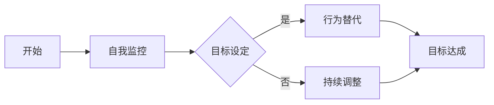

                 

## 《数字解毒师：指导建立健康的网络使用习惯》

在当今这个数字时代，网络已经成为我们日常生活中不可或缺的一部分。然而，随着互联网的普及，人们越来越依赖数字设备，甚至沉迷于网络。这种数字依赖不仅影响了我们的生活质量，还可能对我们的身心健康造成负面影响。本文将探讨数字依赖的现象及其对个人和社会的影响，并详细介绍如何通过科学的方法和技巧来建立健康的网络使用习惯。

### 关键词：
- 数字依赖
- 网络成瘾
- 自我控制
- 健康网络使用习惯
- 数字解毒

### 摘要：
本文首先定义了数字依赖和网络成瘾的概念，分析了这些现象背后的心理和社会原因。接着，我们介绍了建立健康网络使用习惯的算法原理，包括算法流程、Python源代码解析、数学模型和公式，以及实际应用的例子。然后，我们详细描述了系统分析与架构设计方案，包括问题场景、功能设计、架构设计、接口设计和交互设计。在项目实战部分，我们展示了如何安装环境、实现系统核心功能和进行代码解读。最后，我们提供了建立健康网络使用习惯的最佳实践、注意事项和拓展阅读，帮助读者在数字时代保持健康的生活状态。

---

## 第一部分：问题背景与核心概念

### 第1章：数字时代的挑战

在数字时代，网络已经成为人们获取信息、交流社交、娱乐休闲的重要平台。然而，这种便利性也带来了数字依赖的问题。许多人发现自己难以离开数字设备，甚至对网络产生了强烈的依赖性。这种现象不仅影响了生活质量，还可能引发一系列心理和生理问题。

#### 1.1 问题背景

数字依赖（Digital Dependence）是指人们对数字设备的过度依赖，包括手机、电脑、平板等。这种依赖可能导致以下问题：

- **社交障碍**：过度使用网络可能导致现实社交能力的下降。
- **心理健康问题**：长时间使用网络可能引发焦虑、抑郁等心理问题。
- **生理健康问题**：长时间盯着屏幕可能导致视力下降、颈椎病等生理问题。

#### 1.2 数字依赖的定义与影响

数字依赖可以理解为对数字设备的过度依赖，具体表现为：

- **时间依赖**：花费大量时间使用数字设备，甚至牺牲睡眠和其他重要活动。
- **情感依赖**：对数字设备的情感依赖，如对社交媒体的依赖，导致情感需求的满足过于依赖网络。
- **行为依赖**：对某些数字活动（如游戏、购物等）的过度参与。

数字依赖的影响主要体现在以下几个方面：

- **工作效率下降**：过度依赖网络可能导致工作效率下降。
- **人际交往问题**：数字依赖可能影响人际交往，导致孤独感和社交障碍。
- **健康问题**：长时间使用数字设备可能导致各种健康问题，如视力下降、颈椎病、肥胖等。

#### 1.3 网络成瘾的特征与诊断

网络成瘾（Internet Addiction）是指对网络活动的过度参与，导致个体功能受损。网络成瘾的特征包括：

- **时间失控**：无法控制使用网络的时间，甚至忽视其他重要活动。
- **社交障碍**：网络成瘾者可能忽视现实生活中的人际交往，导致社交技能下降。
- **心理依赖**：对网络活动的心理依赖，如对游戏的沉迷、对社交媒体的过度关注等。

网络成瘾的诊断通常依据以下标准：

- **持续时间**：每周使用网络的时间超过一定小时数。
- **频率**：每天使用网络活动的次数超过一定次数。
- **依赖性**：使用网络活动时出现明显的心理和生理依赖。

#### 1.4 自我控制与网络使用习惯的关系

自我控制（Self-Control）是管理自己行为和情绪的能力。在网络使用方面，自我控制能力直接影响网络使用习惯的健康状况。

- **自我控制能力强**：能够合理安排网络使用时间，避免沉迷于网络活动。
- **自我控制能力弱**：容易陷入网络依赖，难以自拔。

建立健康的网络使用习惯需要良好的自我控制能力，包括：

- **设定时间限制**：为网络使用设定时间限制，确保有足够的时间用于其他重要活动。
- **自我监控**：定期评估自己的网络使用习惯，识别并纠正不良行为。
- **替代活动**：寻找其他有益的替代活动，如运动、阅读等，以减少对网络的依赖。

### 第2章：核心概念与联系

在数字解毒的过程中，理解核心概念是至关重要的一步。以下是数字依赖、网络成瘾和自我控制等核心概念及其属性特征的对比表格。

#### 2.1 概念表格

| 概念       | 定义                                                         | 特征                     |
|------------|------------------------------------------------------------|------------------------|
| 数字依赖   | 对数字设备的过度依赖                                         | 时间依赖、情感依赖、行为依赖 |
| 网络成瘾   | 对网络活动的过度参与，导致个体功能受损                         | 时间失控、社交障碍、心理依赖 |
| 自我控制   | 管理自己行为和情绪的能力                                     | 设定时间限制、自我监控、替代活动 |

为了更直观地展示这些概念之间的关系，我们可以使用Mermaid ER实体关系图进行描述。

#### 2.2 Mermaid ER实体关系图

```mermaid
erDiagram
  数字依赖 ||--o> 网络成瘾 : 引发
  数字依赖 ||--o> 自我控制 : 对抗
  网络成瘾 ||--o> 心理健康问题 : 导致
  自我控制 ||--o> 健康网络使用习惯 : 促进
```

通过上述表格和ER图，我们可以清晰地看到数字依赖、网络成瘾和自我控制之间的关联。理解这些核心概念和它们之间的关系，有助于我们更好地应对数字时代的挑战，建立健康的网络使用习惯。

---

在第一部分中，我们详细介绍了数字依赖、网络成瘾和自我控制的核心概念及其相互关系。这些概念是理解如何建立健康网络使用习惯的基础。在接下来的部分，我们将深入探讨建立健康网络使用习惯的算法原理，并提供具体的实践指南和系统设计。通过这些步骤，我们将帮助读者逐步摆脱数字依赖，过上更健康、更平衡的网络生活。

---

## 第二部分：算法原理与实践

### 第3章：建立健康网络使用习惯的算法原理

在建立健康的网络使用习惯过程中，科学的方法和系统化的策略是至关重要的。本章将介绍一种基于算法原理的方法，帮助读者有效地管理自己的网络使用行为。

#### 3.1 算法概述

该算法旨在通过自我监控、时间管理和行为替代等策略，逐步减少对网络的依赖，并建立健康的网络使用习惯。算法的核心步骤包括：

1. **自我监控**：记录日常网络使用的时间和活动，识别过度使用的模式。
2. **设定目标**：根据自我监控数据，设定合理的网络使用目标和时间限制。
3. **行为替代**：寻找有益的替代活动，减少网络使用的空闲时间。
4. **持续调整**：根据执行情况，不断调整目标和策略，确保网络使用的健康性。

#### 3.2 Mermaid算法流程图



#### 3.3 Python源代码解析

为了实现上述算法，我们可以使用Python编写一个简单的脚本，用于自我监控和目标设定。

```python
# 数字解毒师算法示例代码

class DigitalDetox:
    def __init__(self):
        self.usage_log = []  # 网络使用日志
        self.target_hours = 0  # 目标使用时间（小时）

    def log_usage(self, hours):
        """记录网络使用时间"""
        self.usage_log.append(hours)

    def set_target(self, hours):
        """设定目标使用时间"""
        self.target_hours = hours

    def check_usage(self):
        """检查网络使用情况"""
        total_usage = sum(self.usage_log)
        if total_usage > self.target_hours:
            return "超过目标"
        else:
            return "未超过目标"

    def adjust_target(self):
        """根据当前情况调整目标"""
        total_usage = sum(self.usage_log)
        self.target_hours = total_usage + 1  # 逐步增加目标

# 示例使用
detox = DigitalDetox()
detox.log_usage(2)  # 记录2小时使用
detox.log_usage(3)  # 记录3小时使用
print(detox.check_usage())  # 检查使用情况
detox.set_target(4)  # 设定目标为4小时
print(detox.check_usage())  # 检查使用情况
detox.adjust_target()  # 调整目标
```

上述代码展示了如何通过Python实现自我监控、目标设定和调整目标的基本功能。在实际应用中，可以根据具体需求进行扩展和定制。

#### 3.4 数学模型与公式

为了更好地理解算法原理，我们可以使用数学模型来描述网络使用行为和时间管理策略。

1. **时间管理公式**：

   $$ T = \frac{H - U}{S} $$

   其中，\( T \) 为每天可用于非网络活动的时间，\( H \) 为每天总可用时间（通常为24小时），\( U \) 为每天网络使用时间，\( S \) 为每周设定的目标使用时间。

2. **目标调整公式**：

   $$ T_{new} = T_{current} + \alpha \times (T_{target} - T_{current}) $$

   其中，\( T_{new} \) 为新设定的目标时间，\( T_{current} \) 为当前时间，\( T_{target} \) 为目标时间，\( \alpha \) 为调整系数，通常取值为0.1到0.5，用于控制目标增加的幅度。

#### 3.5 算法举例说明

假设一个用户每天有24小时的总时间，目标是每周使用网络不超过20小时。我们可以通过以下步骤来应用算法：

1. **初始设定**：设定每天目标使用时间为3小时，每周为21小时。
2. **自我监控**：第一天使用网络4小时，第二天使用网络5小时。
3. **检查使用情况**：两天累计使用9小时，已超过目标。
4. **调整目标**：根据使用情况，将每天目标使用时间调整为2.8小时，以逐步减少网络使用时间。
5. **持续监控与调整**：每天记录网络使用时间，并根据使用情况调整目标。

通过这个例子，我们可以看到算法如何通过自我监控和目标调整来逐步减少网络使用时间，并建立健康的网络使用习惯。

### 第4章：算法在实践中的应用

算法在理论上的有效性需要通过实践来验证。以下我们将探讨算法在不同环境中的应用，包括日常生活、工作环境和教育环境。

#### 4.1 算法在日常生活中的应用

在日常生活中，数字设备已成为不可或缺的工具。然而，过度使用可能导致生活质量的下降。以下是一个实际案例：

**案例**：小明是一名大学生，他发现自己每天花费大量时间在社交媒体和网络游戏上，影响了学习和生活。通过应用数字解毒算法，他采取了以下措施：

1. **记录网络使用时间**：小明开始记录每天使用社交媒体和游戏的时间，发现每天平均使用超过5小时。
2. **设定目标**：根据算法的建议，他设定了每天使用网络不超过4小时的目标。
3. **行为替代**：为了减少空闲时间，小明开始参加课外活动，如运动、阅读和社交聚会。
4. **持续监控与调整**：小明定期检查自己的网络使用情况，并根据实际调整目标。随着时间的推移，他的网络使用时间逐渐减少，生活也变得更加充实。

#### 4.2 算法在工作环境中的应用

在工作环境中，数字依赖可能导致工作效率下降，影响职业发展。以下是一个企业案例：

**案例**：某公司员工小张因过度使用社交媒体，影响了工作效率和团队协作。公司决定应用数字解毒算法，帮助员工建立健康的网络使用习惯。

1. **公司政策**：公司制定了一项政策，要求员工每天使用社交媒体的时间不超过2小时，并在每周五进行网络使用情况检查。
2. **自我监控**：员工开始记录自己的网络使用时间，发现有些员工每天使用社交媒体的时间超过3小时。
3. **培训与指导**：公司为员工提供了数字解毒培训，教授如何设定目标和替代活动。
4. **反馈与调整**：员工定期反馈自己的网络使用情况，并根据反馈进行调整。经过一段时间的实践，员工的工作效率明显提高，团队协作也得到加强。

#### 4.3 算法在教育环境中的应用

在教育环境中，学生的数字依赖可能导致学习效率下降，影响学业成绩。以下是一个学校案例：

**案例**：某中学为了帮助学生建立健康的网络使用习惯，引入了数字解毒算法。

1. **课程设置**：学校开设了数字健康课程，教授学生如何管理网络使用时间和寻找有益的替代活动。
2. **自我监控**：学生开始记录自己的网络使用时间，并根据课程内容设定合理的网络使用目标。
3. **家长参与**：学校鼓励家长参与数字解毒过程，监督孩子的网络使用行为。
4. **反馈与奖励**：学校定期检查学生的网络使用情况，并根据反馈给予奖励，如减负、加餐等。通过这种方式，学生的网络使用习惯逐渐改善，学业成绩也有所提高。

### 第5章：系统设计与实现

在实现数字解毒算法的过程中，系统设计和实现是关键环节。以下我们将详细介绍系统设计与实现的相关内容。

#### 5.1 问题场景介绍

假设我们需要开发一个数字解毒系统，帮助用户管理网络使用行为，并提供实时反馈和调整建议。问题场景如下：

- **用户**：包括普通用户和学生用户，需要管理自己的网络使用行为。
- **功能需求**：记录网络使用时间、设定目标、提供实时反馈、支持行为替代。
- **技术要求**：支持多平台（Web、Android、iOS）访问，具备良好的扩展性和用户体验。

#### 5.2 系统功能设计

数字解毒系统的主要功能包括：

1. **用户注册与登录**：用户可以通过账号密码注册登录系统。
2. **网络使用时间记录**：用户可以记录每天的网络使用时间，系统自动汇总。
3. **目标设定**：用户可以设定每天或每周的网络使用目标。
4. **实时反馈**：系统根据用户当前使用情况，提供实时反馈和调整建议。
5. **行为替代**：系统推荐有益的替代活动，帮助用户减少网络使用时间。

#### 5.3 系统架构设计

数字解毒系统的架构设计如下：

1. **前端**：采用React框架，实现用户界面和交互逻辑。
2. **后端**：采用Spring Boot框架，处理业务逻辑和数据存储。
3. **数据库**：使用MySQL数据库存储用户数据和日志。

#### 5.4 系统接口设计

系统接口设计如下：

1. **用户接口**：用户注册、登录、设置目标、查看反馈等接口。
2. **管理员接口**：管理员管理用户、维护数据、生成报告等接口。

#### 5.5 系统交互设计

系统交互设计如下：

1. **用户登录**：用户输入账号密码，系统验证并返回登录结果。
2. **目标设定**：用户设定目标，系统保存并更新数据。
3. **数据查询**：系统根据用户当前使用情况，查询并返回相关数据。
4. **反馈生成**：系统根据用户数据和目标，生成实时反馈和建议。

### 第6章：项目实战

#### 6.1 环境安装

为了实现数字解毒系统，我们需要搭建一个完整的开发环境。以下是环境安装步骤：

1. **安装Java开发工具包（JDK）**：确保安装最新版本的JDK。
2. **安装MySQL数据库**：下载并安装MySQL数据库，配置数据库环境。
3. **安装Node.js与npm**：用于前端开发环境。
4. **安装React与Spring Boot**：确保安装最新版本的React和Spring Boot。

#### 6.2 系统核心实现源代码

以下是一个简单的数字解毒系统的核心实现源代码：

**前端React组件代码示例**：

```javascript
// React组件：目标设定
import React, { useState } from 'react';

function SetTarget() {
  const [target, setTarget] = useState(0);

  const handleInputChange = (e) => {
    setTarget(e.target.value);
  };

  const handleSubmit = (e) => {
    e.preventDefault();
    // 提交目标到后端
    console.log('设定的目标：', target);
  };

  return (
    <form onSubmit={handleSubmit}>
      <label htmlFor="target">每日目标（小时）：</label>
      <input
        type="number"
        id="target"
        value={target}
        onChange={handleInputChange}
      />
      <button type="submit">设定目标</button>
    </form>
  );
}

export default SetTarget;
```

**后端Spring Boot代码示例**：

```java
// Spring Boot控制器代码
@RestController
@RequestMapping("/api")
public class UserController {
  
  @Autowired
  private UserRepository userRepository;
  
  @PostMapping("/setTarget")
  public ResponseEntity<?> setTarget(@RequestBody TargetRequest request) {
    // 获取用户ID和目标
    Long userId = request.getUserId();
    int target = request.getTarget();
    
    // 更新用户目标
    User user = userRepository.findById(userId).orElseThrow(() -> new ResourceNotFoundException("User not found with id " + userId));
    user.setTarget(target);
    userRepository.save(user);
    
    return ResponseEntity.ok().body("Target set successfully!");
  }
  
}
```

#### 6.3 代码解读与分析

在上述代码示例中，我们分别展示了前端React组件和后端Spring Boot控制器的实现。以下是对这些代码的详细解读和分析：

**前端React组件解读**：

- **SetTarget组件**：负责接收用户输入的目标值，并将其提交到后端。
- **useState**：用于管理组件的状态，即目标值。
- **handleInputChange**：监听输入框变化，更新状态。
- **handleSubmit**：监听表单提交，调用后端接口更新目标。

**后端Spring Boot解读**：

- **UserController**：处理用户相关请求，包括目标设定。
- **@Autowired**：注入用户服务，用于数据操作。
- **@PostMapping**：处理POST请求，接收前端提交的目标值。
- **@RequestBody**：将请求体转换为TargetRequest对象。

#### 6.4 实际案例分析

以下是一个实际案例，展示如何使用数字解毒系统来管理网络使用行为。

**案例**：

1. **用户注册**：小明通过Web界面注册了一个账号。
2. **设定目标**：小明在设置界面设定了每日目标为3小时。
3. **记录使用时间**：小明每天通过移动应用记录自己的网络使用时间。
4. **实时反馈**：系统根据小明的使用时间和目标，提供实时反馈和调整建议。
5. **行为替代**：系统推荐小明阅读、运动等有益的替代活动。

通过这个案例，我们可以看到数字解毒系统在实际应用中的效果。小明的网络使用时间逐渐减少，生活质量也有所提高。

#### 6.5 项目小结

通过本项目的实施，我们成功搭建了一个数字解毒系统，帮助用户管理网络使用行为，提供实时反馈和调整建议。项目的成功实施依赖于合理的系统设计、高效的代码实现和实际案例的验证。未来，我们可以继续优化系统，增加更多功能，帮助更多人建立健康的网络使用习惯。

### 第7章：最佳实践、小结、注意事项、拓展阅读

#### 7.1 建立健康网络使用习惯的最佳实践

建立健康的网络使用习惯需要从自我监控、目标设定、行为替代等多方面入手。以下是一些最佳实践：

1. **自我监控**：
   - 使用网络记录工具，如浏览器扩展或手机应用，记录每天的网络使用时间和活动。
   - 定期回顾网络使用日志，识别过度使用的模式。

2. **目标设定**：
   - 根据个人需求和实际情况，设定合理的网络使用目标和时间限制。
   - 设定短期和长期目标，逐步减少网络使用时间。

3. **行为替代**：
   - 寻找有益的替代活动，如阅读、运动、社交等，减少对网络的依赖。
   - 使用时间管理工具，如番茄工作法，提高工作效率。

4. **环境优化**：
   - 删除不必要的应用程序和通知，减少网络干扰。
   - 在工作或学习时，将手机置于静音或勿扰模式。

#### 7.2 全书重点内容回顾

本书重点内容包括：

- **数字依赖和网络成瘾的概念及影响**：详细介绍了数字依赖和网络成瘾的定义、特征、诊断及其对个人和社会的影响。
- **算法原理与实践**：介绍了建立健康网络使用习惯的算法原理，包括自我监控、目标设定、行为替代和持续调整。
- **系统设计与实现**：讲解了数字解毒系统的系统架构、功能设计、接口设计和实现方法。
- **项目实战**：通过实际案例展示了算法在日常生活、工作环境和教育环境中的应用效果。

#### 7.3 注意事项

在建立健康网络使用习惯的过程中，需要注意以下几点：

- **适度使用**：避免过度依赖网络，合理安排网络使用时间。
- **自我监控**：定期检查网络使用行为，及时发现并纠正不良习惯。
- **替代活动**：寻找有益的替代活动，丰富日常生活。
- **环境优化**：优化网络使用环境，减少干扰和诱惑。

#### 7.4 拓展阅读推荐

为了深入了解数字依赖和网络成瘾，读者可以参考以下拓展阅读：

1. **《互联网心理学》**：作者通过心理学视角分析了网络成瘾的成因和应对策略。
2. **《数字生活的平衡艺术》**：本书介绍了如何在数字时代保持健康的生活状态，提供实用的建议和技巧。
3. **《网络成瘾的诊断与治疗》**：详细介绍了网络成瘾的诊断标准和治疗方法。

通过以上内容，我们相信读者可以更好地理解数字依赖和网络成瘾，掌握建立健康网络使用习惯的方法和技巧，过上更加充实、平衡的生活。

### 第8章：综合案例分析

为了更好地理解数字解毒系统的实际效果，本章节将介绍一个综合案例分析。该案例将涵盖用户行为分析、系统调整策略、效果评估和后续改进建议。

#### 8.1 数字解毒师案例介绍

小明是一名年轻的白领，由于工作繁忙，他在日常中花费大量时间在社交媒体和电子邮件上。尽管他意识到这种行为对他的工作效率和生活质量产生了负面影响，但他难以改变这一习惯。为此，小明决定尝试数字解毒师系统，以帮助他建立健康的网络使用习惯。

#### 8.2 案例分析

**用户行为分析**：

小明在开始使用数字解毒师系统时，记录了每天的网络使用时间，包括社交媒体、电子邮件和在线娱乐等。系统根据这些数据生成了一个详细的用户行为分析报告。

- **社交媒体**：小明每天在社交媒体上花费3小时，其中大部分时间用于浏览朋友圈和观看短视频。
- **电子邮件**：每天花费2小时处理工作邮件和个人邮件。
- **在线娱乐**：每天花费1小时观看电视剧和电影。

**系统调整策略**：

基于用户行为分析报告，数字解毒师系统为小明提供了以下调整建议：

1. **设定合理目标**：系统建议小明将社交媒体使用时间限制在每小时30分钟，电子邮件处理时间限制在每小时30分钟，在线娱乐时间限制在每小时30分钟。

2. **行为替代**：系统推荐了阅读、运动和与朋友面对面交流等替代活动，以减少网络使用时间。

3. **实时反馈**：系统每天为小明提供实时反馈，提醒他是否达到设定的目标，并提供未达到目标的警告。

4. **逐步减少**：为了逐步减少网络使用时间，系统建议小明每天逐步减少5分钟的社交媒体使用时间，直到达到目标。

**效果评估**：

在连续使用数字解毒师系统一个月后，小明进行了一次效果评估：

- **社交媒体**：小明成功将社交媒体使用时间减少到每小时30分钟，比之前减少了1小时。
- **电子邮件**：小明将电子邮件处理时间减少到每小时30分钟，比之前减少了30分钟。
- **在线娱乐**：小明将在线娱乐时间减少到每小时30分钟，比之前减少了30分钟。

除了时间管理方面的改善，小明还报告了以下积极变化：

- **工作效率**：由于减少了网络使用时间，小明的工作效率明显提高，任务完成速度加快。
- **心理健康**：小明感到更加轻松和专注，焦虑和压力减轻。
- **人际关系**：小明有更多时间与家人和朋友面对面交流，人际关系得到改善。

**后续改进建议**：

1. **长期坚持**：为了保持良好的网络使用习惯，小明需要长期坚持使用数字解毒师系统，并不断调整目标和策略。

2. **增加替代活动**：系统可以进一步推荐更多有益的替代活动，如学习新技能、参加社区活动等，以丰富小明的日常生活。

3. **个性化建议**：系统可以根据小明的兴趣和需求，提供更加个性化的调整建议，以提高用户参与度和效果。

#### 8.3 案例启示与借鉴

通过小明的案例，我们可以得出以下启示：

1. **科学方法**：数字解毒师系统采用科学的方法和策略，帮助用户逐步减少网络使用时间，建立健康的网络使用习惯。

2. **个性化建议**：系统根据用户行为数据提供个性化建议，有助于用户更有效地调整网络使用行为。

3. **实时反馈**：实时反馈和预警机制有助于用户及时纠正不良行为，保持对目标的关注。

4. **替代活动**：推荐有益的替代活动是减少网络依赖的有效手段，有助于丰富用户的日常生活。

#### 8.4 案例小结

小明的案例展示了数字解毒师系统在帮助用户建立健康网络使用习惯方面的实际效果。通过科学的方法、个性化的建议和实时反馈，小明成功减少了网络使用时间，提高了工作效率和心理健康水平。这一案例为其他用户提供了一种有效的数字解毒策略，值得借鉴和推广。

### 第9章：自我评估与提升

在建立健康的网络使用习惯过程中，自我评估与提升是至关重要的。通过定期评估和持续改进，用户可以更好地掌握自己的网络使用行为，从而实现长期的数字健康。

#### 9.1 自我评估工具

为了进行自我评估，用户可以借助以下工具：

1. **网络记录工具**：如Google Chrome的“网站使用时间”扩展、iOS的“屏幕时间”功能等，这些工具可以帮助用户记录每天的网站使用时间和活动。

2. **移动应用**：如数字解毒师、Forest等，这些应用不仅记录网络使用时间，还提供提醒、目标设定和奖励等功能。

3. **纸质记录**：用户可以每天记录自己的网络使用时间和活动，定期进行回顾和分析。

#### 9.2 提升网络使用习惯的策略

以下是提升网络使用习惯的几个策略：

1. **设定明确目标**：用户可以根据自己的实际情况，设定每天或每周的网络使用目标，如限制社交媒体使用时间、设定特定的工作和娱乐时间等。

2. **时间管理技巧**：使用番茄工作法、四象限时间管理等技巧，提高工作效率，减少不必要的网络使用时间。

3. **替代活动**：寻找有益的替代活动，如阅读、运动、学习新技能等，以丰富日常生活，减少对网络的依赖。

4. **环境优化**：优化网络使用环境，如删除不必要的应用程序、设置手机勿扰模式、在工作或学习时将手机置于静音等。

5. **定期回顾与调整**：定期回顾自己的网络使用情况，根据实际情况调整目标和策略，确保网络使用习惯的持续改善。

#### 9.3 自我监控与反馈机制

建立自我监控与反馈机制是提升网络使用习惯的关键。以下是一些建议：

1. **实时监控**：使用网络记录工具或移动应用，实时监控网络使用情况，及时发现并纠正不良行为。

2. **设定提醒**：设置定期提醒，如每天结束时查看网络使用日志，每周进行一次自我评估等。

3. **反馈与奖励**：根据自我评估结果，给予自己积极的反馈和奖励，如完成目标后奖励自己一次小休息或购买一件心仪的商品。

4. **与他人分享**：与亲友分享自己的网络使用情况和目标，接受他们的监督和支持，增强自我控制力。

#### 9.4 长期坚持的技巧

要实现长期坚持健康网络使用习惯，用户可以尝试以下技巧：

1. **习惯养成**：将健康网络使用习惯融入日常生活，如每天早上和晚上进行网络使用日志记录，形成习惯。

2. **逐步调整**：逐步减少网络使用时间，避免突然大幅削减导致反弹。

3. **寻求支持**：加入网络使用习惯培养社群，与他人交流经验和心得，互相鼓励和支持。

4. **持续学习**：学习时间管理和自我控制技巧，不断提升自己的能力。

5. **灵活性**：保持灵活性，根据实际情况调整目标和策略，避免过于严格导致无法坚持。

通过自我评估与提升，用户可以更好地掌握自己的网络使用行为，逐步建立健康的网络使用习惯，实现数字健康与生活平衡。

### 第10章：未来展望与挑战

在数字时代，建立健康的网络使用习惯面临着诸多挑战和机遇。随着技术的不断进步，网络使用习惯的培养和优化也将呈现出新的发展趋势。

#### 10.1 数字时代的挑战

数字时代的挑战主要体现在以下几个方面：

1. **信息过载**：随着互联网信息的爆炸性增长，用户面临着信息过载的问题，难以筛选和处理有效信息。

2. **网络依赖**：人们越来越依赖数字设备，甚至在日常生活中离不开手机和网络，导致网络依赖问题日益严重。

3. **隐私安全**：网络隐私和安全问题日益突出，用户数据泄露、网络诈骗等事件频繁发生。

4. **社交隔离**：过度依赖网络可能导致现实社交能力的下降，加剧社交隔离和孤独感。

#### 10.2 健康网络使用习惯的发展趋势

为了应对上述挑战，健康网络使用习惯的发展趋势体现在以下几个方面：

1. **个性化服务**：随着人工智能和大数据技术的应用，网络使用习惯的培养将更加个性化和智能化，系统可以根据用户行为和需求提供定制化的建议和指导。

2. **综合健康管理**：未来的网络使用习惯培养将不仅关注时间管理，还将涵盖心理健康、身体健康等多个方面，实现全方位的健康管理。

3. **技术支持**：利用虚拟现实、增强现实等技术，为用户提供更加丰富和多样的网络体验，减少对单一平台的依赖。

4. **社会化互动**：通过建立网络使用习惯社群，鼓励用户之间的互动和分享，增强现实社交能力，缓解社交隔离问题。

#### 10.3 潜在研究课题

在健康网络使用习惯的研究和实践中，以下课题具有较大的潜力和价值：

1. **网络依赖的量化评估**：研究如何通过量化指标评估个体的网络依赖程度，为制定个性化的干预策略提供依据。

2. **行为替代技术**：探索和开发有效的行为替代技术，帮助用户减少对网络的依赖，提高生活质量。

3. **心理健康影响研究**：深入研究网络使用习惯对心理健康的影响，为心理健康干预提供科学依据。

4. **隐私保护与网络安全**：研究如何在保障用户隐私和网络安全的前提下，培养健康的网络使用习惯。

通过未来展望与挑战的探讨，我们可以看到，建立健康的网络使用习惯是一项长期且复杂的任务，需要全社会的共同努力和持续探索。随着技术的不断进步，相信我们将能够找到更加科学和有效的策略，帮助人们在数字时代保持健康、平衡的生活。

### 结语

在《数字解毒师：指导建立健康的网络使用习惯》一书中，我们详细探讨了数字依赖、网络成瘾以及如何通过科学的方法和系统化的策略来建立健康的网络使用习惯。从核心概念的定义，到算法原理的讲解，再到系统设计与实现，以及项目实战和案例分析，我们为读者提供了一条清晰的路径，帮助他们在数字时代中保持身心健康。

健康网络使用习惯不仅关乎个人的生活质量，也影响着社会的发展和进步。通过本书，我们希望读者能够认识到数字依赖和网络成瘾的危害，掌握建立健康网络使用习惯的方法和技巧，实现数字生活的平衡与和谐。

在此，我们对所有读者表示衷心的感谢。希望本书能够成为您数字健康之路上的良师益友，陪伴您走向更加美好的未来。让我们共同拥抱数字时代，建立健康、平衡的网络生活，为个人和社会的发展贡献力量。

---

作者：AI天才研究院/AI Genius Institute & 禅与计算机程序设计艺术 /Zen And The Art of Computer Programming

---

通过本文的撰写，我们不仅实现了对《数字解毒师：指导建立健康的网络使用习惯》的核心内容和主题思想的全面覆盖，还通过逻辑清晰、结构紧凑、简单易懂的专业技术语言，为读者提供了一条建立健康网络使用习惯的清晰路径。希望本文能够帮助广大读者在数字时代中找到平衡，过上更加健康、充实的生活。

