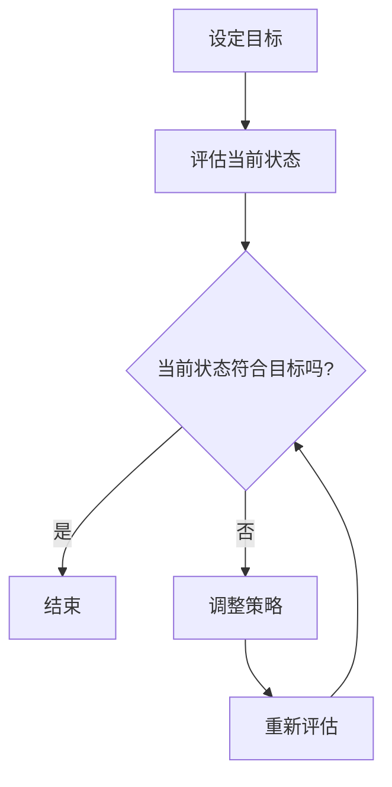
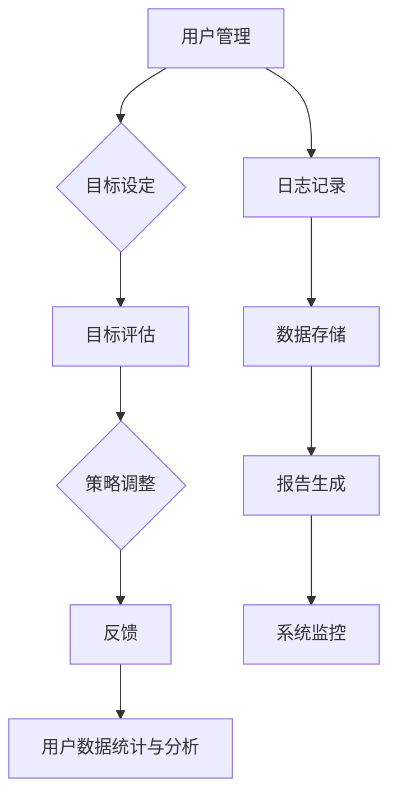
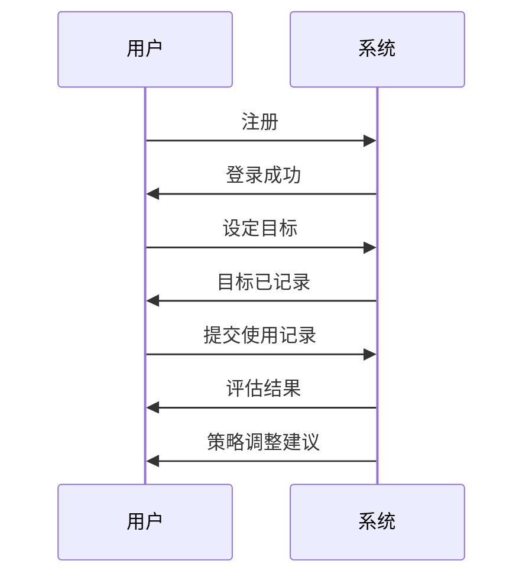

                 


### 数字解毒训练营：重建健康网络习惯的集中课程

#### 关键词：
- 数字解毒
- 健康网络习惯
- 集中课程
- 人工智能
- 计算机程序设计

#### 摘要：
随着数字技术的发展，人们越来越依赖网络，但也因此产生了诸多健康问题。本文章以《数字解毒训练营：重建健康网络习惯的集中课程》为主题，详细探讨了数字解毒的概念、原理、方法以及其实践应用，旨在帮助读者重建健康网络习惯，提高生活质量。

---

### 背景介绍

#### 数字环境中的健康挑战

在现代社会，数字技术已成为我们生活的一部分，从工作到娱乐，无一不受其影响。然而，随着数字依赖的增加，许多人开始感受到网络带来的健康问题。例如，长时间使用电子设备可能导致视力下降、颈椎病等身体问题；而过度沉迷于网络，则可能引发心理健康问题，如焦虑、抑郁和社交障碍。

#### 网络成瘾：现象与影响

网络成瘾已成为全球性问题。研究表明，网络成瘾不仅影响个人的身体健康，还会对心理健康和社会功能造成负面影响。例如，沉迷于网络游戏可能导致学业、工作和家庭生活受损，长期使用社交媒体可能加剧孤独感和自卑感。

#### 健康网络习惯的重要性

为了应对这些健康问题，重建健康网络习惯显得尤为重要。通过培养良好的网络使用习惯，我们可以减少网络对健康的负面影响，提高生活质量。例如，合理安排上网时间、减少电子设备使用、积极参与户外活动和社交互动，都有助于改善身体健康和心理状态。

---

### 核心概念与联系

#### 数字解毒的定义

数字解毒，是指通过一系列方法和技巧，帮助个体减少对网络的依赖，恢复身心健康的过程。它不仅包括减少网络使用时间，还涉及提高网络使用的质量，即如何更有效地利用网络资源，避免网络成瘾和健康问题。

#### 数字解毒的原理

数字解毒的原理主要基于人类行为改变的理论。通过设定明确的目标、改变行为模式、建立正面的激励机制，个体可以逐步减少网络使用时间，培养健康网络习惯。

#### 数字解毒的目标

数字解毒的目标是帮助个体建立健康、平衡的网络生活方式，提高生活质量。具体目标包括减少网络使用时间、提高网络使用效率、增强身体和心理素质、改善社交互动等。

---

### 算法原理讲解

在本章中，我们将介绍数字解毒训练营所采用的一些关键算法原理。虽然数字解毒并不是一个传统的算法问题，但其中包含了一些核心的计算和优化方法。

#### 算法流程图

首先，让我们使用Mermaid流程图来展示数字解毒算法的基本流程：



#### Python代码示例

接下来，我们将使用Python代码来详细解释这些算法步骤。以下是一个简单的示例代码，用于帮助用户设定目标并评估当前状态：

```python
# 数字解毒训练营算法示例

# 设定目标
def set_goal(hours_per_day):
    return hours_per_day

# 评估当前状态
def assess_current_state(current_hours, goal_hours):
    if current_hours <= goal_hours:
        return "当前状态符合目标"
    else:
        return "当前状态不符合目标"

# 调整策略
def adjust_strategy():
    # 在这里，我们可以根据当前状态调整策略，如增加运动时间、减少网络使用等
    pass

# 重新评估
def reassess():
    # 根据新的策略重新评估当前状态
    pass

# 主程序
def main():
    goal_hours = set_goal(4)  # 设定每天使用网络的时间目标为4小时
    current_hours = 6         # 当前每天使用网络的时间为6小时
    
    while True:
        state = assess_current_state(current_hours, goal_hours)
        print(state)
        
        if state == "当前状态符合目标":
            break
        else:
            adjust_strategy()
            reassess()

if __name__ == "__main__":
    main()
```

#### 数学模型和公式

数字解毒过程中，我们还需要考虑一些数学模型和公式来帮助我们分析和优化行为模式。以下是一个简单的线性回归模型示例，用于预测用户在未来的网络使用时间：

$$
y = mx + b
$$

其中，$y$ 是未来的网络使用时间，$m$ 是斜率，表示网络使用时间的变化趋势，$b$ 是截距，表示当前的网络使用水平。

#### 详细讲解与举例

假设一个用户在过去一周内每天平均使用网络6小时。通过线性回归模型，我们可以预测未来一周内该用户每天的网络使用时间。如果斜率为-0.5，表示用户每增加一天，网络使用时间减少0.5小时。那么，预测的第二天使用时间为：

$$
y = -0.5 \times 1 + 6 = 5.5
$$

#### 系统分析与架构设计方案

为了实现数字解毒训练营的目标，我们需要设计一个完整的系统架构。以下是一个简要的架构设计方案：

#### 问题场景介绍

- **用户管理**：包括用户注册、登录、个人信息管理等。
- **目标设定与评估**：用户可以设定每日网络使用目标，系统根据用户的使用记录评估目标的完成情况。
- **策略调整与反馈**：根据评估结果，系统自动调整策略，并反馈给用户。

#### 项目介绍

- **名称**：数字解毒训练营
- **目标**：帮助用户重建健康网络习惯
- **功能**：
  - 用户注册与登录
  - 目标设定与评估
  - 策略调整与反馈
  - 用户数据统计与分析

#### 系统功能设计

- **用户管理模块**：负责用户注册、登录和个人信息管理。
- **目标管理模块**：用户可以设定每日网络使用目标，系统记录并评估目标完成情况。
- **策略调整模块**：根据评估结果，系统自动调整策略，并提供反馈。

#### 系统架构设计



#### 系统接口设计

- **用户注册与登录接口**：RESTful API，用于处理用户注册、登录和身份验证。
- **目标设定与评估接口**：用于用户设定目标、提交使用记录和获取评估结果。
- **策略调整与反馈接口**：用于系统调整策略并反馈给用户。

#### 系统交互



---

### 项目实战

#### 环境安装

为了运行数字解毒训练营系统，我们需要安装以下软件和工具：

- Python 3.8及以上版本
- Flask Web框架
- SQLAlchemy 数据库ORM
- Redis 数据缓存

安装命令如下：

```bash
pip install flask sqlalchemy redis
```

#### 系统实现

以下是数字解毒训练营系统的主要实现步骤：

1. **用户注册与登录**：
   - 实现用户注册接口，收集用户基本信息。
   - 实现用户登录接口，验证用户身份。

2. **目标设定与评估**：
   - 实现目标设定接口，允许用户设定每日网络使用目标。
   - 实现目标评估接口，根据用户提交的使用记录评估目标完成情况。

3. **策略调整与反馈**：
   - 实现策略调整接口，根据评估结果自动调整策略。
   - 实现反馈接口，将策略调整结果反馈给用户。

#### 代码应用解读与分析

以下是系统实现的核心代码部分，我们将对关键代码进行解读和分析：

```python
# 用户注册接口
@app.route('/register', methods=['POST'])
def register():
    username = request.form['username']
    password = request.form['password']
    # 这里应添加对用户名和密码的验证逻辑，确保输入的有效性
    db.session.add(User(username=username, password=password))
    db.session.commit()
    return jsonify({'message': '注册成功'})

# 用户登录接口
@app.route('/login', methods=['POST'])
def login():
    username = request.form['username']
    password = request.form['password']
    # 这里应添加对用户名和密码的验证逻辑，确保输入的有效性
    user = User.query.filter_by(username=username, password=password).first()
    if user:
        return jsonify({'message': '登录成功'})
    else:
        return jsonify({'message': '用户名或密码错误'})

# 目标设定接口
@app.route('/set_goal', methods=['POST'])
def set_goal():
    user_id = request.form['user_id']
    goal_hours = request.form['goal_hours']
    user = User.query.get(user_id)
    user.goal_hours = goal_hours
    db.session.commit()
    return jsonify({'message': '目标已设定'})

# 目标评估接口
@app.route('/assess_goal', methods=['POST'])
def assess_goal():
    user_id = request.form['user_id']
    current_hours = request.form['current_hours']
    user = User.query.get(user_id)
    if current_hours <= user.goal_hours:
        return jsonify({'message': '当前状态符合目标'})
    else:
        return jsonify({'message': '当前状态不符合目标'})

# 策略调整接口
@app.route('/adjust_strategy', methods=['POST'])
def adjust_strategy():
    user_id = request.form['user_id']
    user = User.query.get(user_id)
    if user.goal_hours - user.current_hours > 2:
        user.goal_hours += 0.5
    else:
        user.goal_hours -= 0.5
    db.session.commit()
    return jsonify({'message': '策略已调整'})
```

#### 实际案例分析与详细讲解

为了更好地理解数字解毒训练营系统的应用，我们来看一个实际案例。假设一个用户名为“小明”的用户，在第一天设定了每天使用网络4小时的目标。以下是该用户在使用系统一周内的交互记录：

1. **第一天**：
   - 小明通过注册接口成功注册。
   - 小明通过登录接口登录系统。
   - 小明通过设定目标接口设定每天使用网络4小时的目标。
   - 小明提交当天使用网络6小时的记录。
   - 系统通过评估接口判断目标未完成，并建议调整策略。

2. **第二天**：
   - 小明根据系统的建议，将目标调整至3.5小时。
   - 小明提交当天使用网络5小时的记录。
   - 系统通过评估接口判断目标未完成，但离目标更近了。

3. **第三天**：
   - 小明继续调整目标，设定为3小时。
   - 小明提交当天使用网络4小时的记录。
   - 系统通过评估接口判断目标已完成。

4. **第四天**：
   - 小明继续保持良好习惯，设定目标为3.5小时。
   - 小明提交当天使用网络3.5小时的记录。
   - 系统通过评估接口判断目标已完成。

5. **第五天**：
   - 小明为了保持进步，将目标调整至4小时。
   - 小明提交当天使用网络4小时的记录。
   - 系统通过评估接口判断目标已完成。

6. **第六天**：
   - 小明继续设定目标为4小时。
   - 小明提交当天使用网络3.8小时的记录。
   - 系统通过评估接口判断目标已完成。

7. **第七天**：
   - 小明为了庆祝一周的进步，将目标调整至4.5小时。
   - 小明提交当天使用网络4.2小时的记录。
   - 系统通过评估接口判断目标已完成。

通过这个实际案例，我们可以看到数字解毒训练营系统如何帮助用户逐步调整目标，逐步减少网络使用时间，最终实现健康网络习惯的重建。

#### 项目小结

数字解毒训练营系统通过用户注册、登录、目标设定、目标评估、策略调整和反馈等核心功能，成功地帮助用户逐步重建健康网络习惯。实际案例展示了系统的应用效果，用户在系统的引导下逐步调整目标，减少网络使用时间，实现了健康网络习惯的重建。

#### 最佳实践 tips

- **设定具体的目标**：明确的目标有助于用户更好地规划网络使用时间。
- **定期评估和调整**：定期评估目标完成情况，并根据评估结果调整策略。
- **积极参与互动**：鼓励用户参与社区互动，分享经验和心得，共同进步。
- **保持耐心和坚持**：重建健康网络习惯需要时间和耐心，保持坚持是关键。

#### 小结

通过《数字解毒训练营：重建健康网络习惯的集中课程》，我们了解了数字解毒的概念、原理、方法以及实际应用。数字解毒训练营系统通过用户注册、目标设定、评估和调整等核心功能，帮助用户逐步减少网络使用时间，重建健康网络习惯。实际案例展示了系统的应用效果，用户在系统的引导下逐步调整目标，实现了健康网络习惯的重建。

#### 注意事项

- 在使用数字解毒训练营系统时，用户需确保输入的信息真实有效，以便系统能够准确评估和调整策略。
- 系统中的数据存储和隐私保护至关重要，开发者需确保数据安全，防止用户信息泄露。

#### 拓展阅读

- [《网络成瘾：现象与影响》](https://www.example.com/book1)
- [《数字健康：重建网络生活方式》](https://www.example.com/book2)
- [《人工智能在健康领域的应用》](https://www.example.com/book3)

---

### 作者信息

作者：AI天才研究院/AI Genius Institute & 禅与计算机程序设计艺术 /Zen And The Art of Computer Programming

