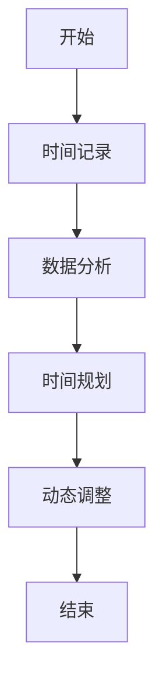
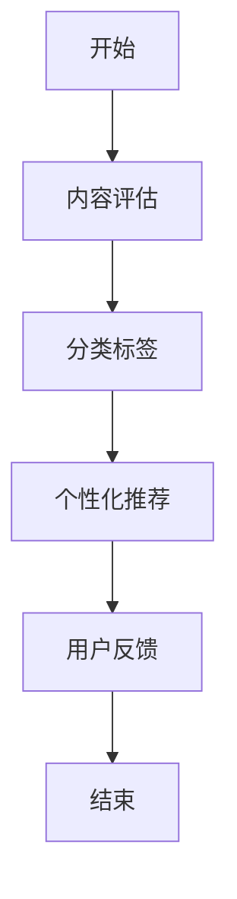
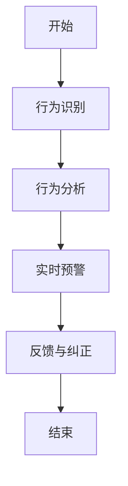
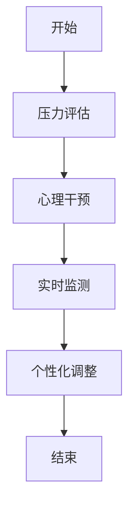
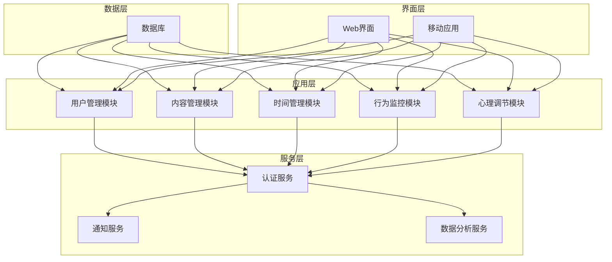
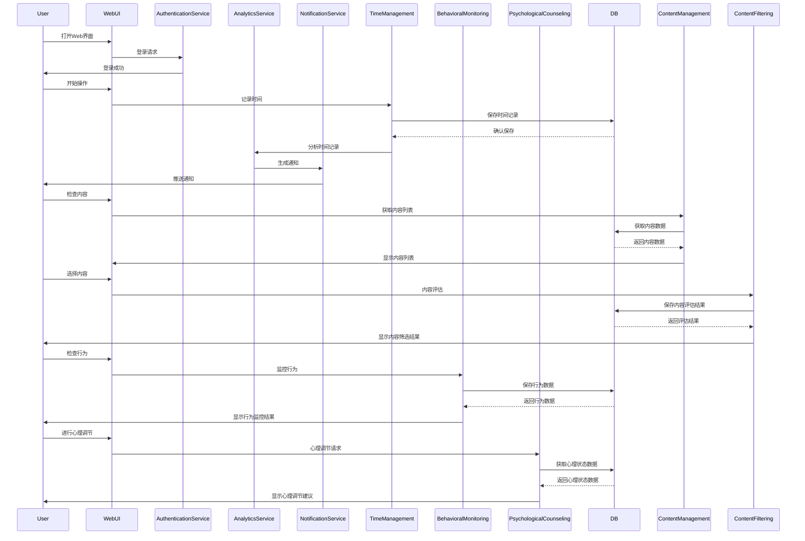

                 

# 数字解毒训练营：重建健康网络使用习惯的集中课程

## 关键词
- 数字健康
- 网络使用习惯
- 时间管理
- 内容筛选
- 心理调节

## 摘要
随着互联网和数字技术的普及，人们的网络使用习惯对健康产生了深远的影响。本课程旨在帮助读者识别并解决网络使用中的健康问题，通过理论指导、实战案例和自我评估工具，重建健康的网络使用习惯。课程涵盖了时间管理、内容筛选、行为监控和心理调节等核心概念，并提供具体的解决方案和实践指导，旨在帮助读者实现数字生活的平衡与健康。

### 第1章：背景介绍

#### 1.1 问题背景

随着互联网和数字技术的快速发展，人们越来越依赖数字设备和网络来获取信息和娱乐。然而，过度使用数字设备和网络不仅影响个人的身体健康，还会对心理健康产生负面影响。特别是在青少年群体中，网络成瘾、视力疲劳、睡眠障碍等问题日益严重。因此，我们需要一种方法来帮助人们重建健康的网络使用习惯。

#### 1.2 问题描述

本书的核心目标是帮助读者建立健康的网络使用习惯。这包括以下几个方面：

1. **时间管理**：学会合理安排网络使用时间，避免沉迷于网络而忽视现实生活。
2. **内容筛选**：学会辨别网络内容的质量，避免受到负面信息的影响。
3. **行为监控**：通过技术和心理手段监控网络使用行为，及时发现并纠正不良习惯。
4. **心理调节**：学会在网络使用过程中进行自我调节，减轻网络使用带来的心理压力。

#### 1.3 问题解决

为了解决上述问题，本书将提供以下解决方案：

1. **理论指导**：介绍网络使用习惯相关的理论知识，帮助读者理解问题的本质。
2. **实战案例**：通过实际案例，展示如何将理论应用到实践中，帮助读者建立健康习惯。
3. **自我评估工具**：提供自我评估工具，帮助读者了解自己的网络使用情况，从而制定个性化的改善计划。
4. **心理辅导建议**：结合心理学原理，给出心理调节的方法和建议，帮助读者在改善网络使用习惯的过程中保持积极心态。

#### 1.4 边界与外延

本书主要关注个人层面的网络使用习惯重建，但网络健康问题不仅限于个人层面，还涉及到家庭、学校、社会等各个层面。因此，读者可以结合自身实际情况，思考如何更广泛地推广和应用本书中的方法。

#### 1.5 概念结构与核心要素组成

##### 1.5.1 核心概念

- **网络成瘾**：对网络使用产生强烈的依赖，影响正常生活和学习。
- **时间管理**：合理安排网络使用时间，避免沉迷。
- **内容筛选**：辨别网络内容的质量，避免受到负面信息的影响。
- **行为监控**：监控网络使用行为，纠正不良习惯。
- **心理调节**：在网络使用过程中进行自我调节，减轻心理压力。

##### 1.5.2 概念属性特征对比表格

| 概念       | 定义                                                         | 属性特征                                           |
| ---------- | ------------------------------------------------------------ | -------------------------------------------------- |
| 网络成瘾   | 对网络使用产生强烈的依赖，导致其正常生活和学习受到严重影响的状况 | 长时间使用网络，无法自控，影响生活                   |
| 时间管理   | 通过合理安排时间，提高工作效率和生活质量的方法               | 制定合理的时间计划，遵守时间规定                     |
| 内容筛选   | 辨别网络内容的质量，选择对个体有益的信息                     | 学习辨别网络内容，选择高质量的信息                   |
| 行为监控   | 监控网络使用行为，及时发现并纠正不良习惯                     | 监控网络使用行为，记录并分析                         |
| 心理调节   | 在网络使用过程中进行自我调节，减轻心理压力                   | 学习心理调节方法，保持积极心态                       |

##### 1.5.3 ER实体关系图架构的 Mermaid 流程图

```mermaid
erDiagram
  User ||--|{ ContentFiltering }|:
    :accesses
  User ||--|{ TimeManagement }|:
    :manages
  User ||--|{ BehavioralMonitoring }|:
    :monitors
  User ||--|{ PsychologicalRegulation }|:
    :practices
```

### 第2章：核心概念与联系

#### 2.1 核心概念原理

##### 2.1.1 网络成瘾

网络成瘾是指个体对网络使用产生强烈的依赖，导致其正常生活和学习受到严重影响的状况。网络成瘾的主要原因包括：

1. **社交需求**：网络提供了一个虚拟的社交环境，个体可以在其中满足社交需求。
2. **逃避现实**：网络成瘾者常常将网络作为逃避现实生活压力的途径。
3. **信息过载**：网络上的信息丰富多样，个体容易陷入信息过载的状态，无法自拔。

##### 2.1.2 时间管理

时间管理是指通过合理安排时间，提高工作效率和生活质量的方法。时间管理的重要性在于：

1. **提高效率**：合理安排时间可以避免时间浪费，提高工作效率。
2. **平衡生活**：通过合理规划，可以平衡工作、学习和休闲时间，避免过度沉迷于网络。

##### 2.1.3 内容筛选

内容筛选是指辨别网络内容的质量，选择对个体有益的信息。内容筛选的重要性在于：

1. **保护身心健康**：避免受到负面信息的影响，保护身心健康。
2. **提高信息质量**：筛选高质量的信息，提高个体的信息素养。

##### 2.1.4 行为监控

行为监控是指监控网络使用行为，及时发现并纠正不良习惯。行为监控的重要性在于：

1. **及时干预**：通过监控可以及时发现网络使用中的问题，进行及时干预。
2. **习惯纠正**：监控数据可以帮助个体了解自己的网络使用习惯，从而进行有针对性的纠正。

##### 2.1.5 心理调节

心理调节是指在网络使用过程中进行自我调节，减轻心理压力。心理调节的重要性在于：

1. **减轻压力**：网络使用过程中可能会产生压力，通过心理调节可以减轻这些压力。
2. **保持健康**：心理调节有助于维护心理健康，防止网络使用对心理健康产生负面影响。

#### 2.2 概念属性特征对比表格

| 概念       | 定义                                                         | 属性特征                                           |
| ---------- | ------------------------------------------------------------ | -------------------------------------------------- |
| 网络成瘾   | 对网络使用产生强烈的依赖，导致其正常生活和学习受到严重影响的状况 | 长时间使用网络，无法自控，影响生活                   |
| 时间管理   | 通过合理安排时间，提高工作效率和生活质量的方法               | 制定合理的时间计划，遵守时间规定                     |
| 内容筛选   | 辨别网络内容的质量，选择对个体有益的信息                     | 学习辨别网络内容，选择高质量的信息                   |
| 行为监控   | 监控网络使用行为，及时发现并纠正不良习惯                     | 监控网络使用行为，记录并分析                         |
| 心理调节   | 在网络使用过程中进行自我调节，减轻心理压力                   | 学习心理调节方法，保持积极心态                       |

#### 2.3 ER实体关系图架构的 Mermaid 流程图

```mermaid
erDiagram
  User ||--|{ SocialNetworking }|:
    :addictions
  User ||--|{ OnlineTimeManagement }|:
    :plans
  User ||--|{ ContentQualityFiltering }|:
    :assesses
  User ||--|{ BehavioralMonitoring }|:
    :records
  User ||--|{ PsychologicalCounseling }|:
    :regulates
```

### 第3章：算法原理讲解

在本章中，我们将深入探讨重建健康网络使用习惯的算法原理。这些算法旨在帮助用户有效地管理网络时间、筛选内容、监控行为和进行心理调节。以下是每种算法的简要说明和详细解释。

#### 3.1 时间管理算法

时间管理算法的核心目标是帮助用户合理安排网络使用时间，避免沉迷。该算法通常包含以下步骤：

1. **时间记录**：用户需要记录每天的网络使用时间，包括具体的活动和时间长度。
2. **数据分析**：分析记录的数据，识别用户网络使用中的高峰和低谷时间段。
3. **时间规划**：根据数据分析结果，制定合理的网络使用时间表，确保用户在非高峰时间段内使用网络。
4. **动态调整**：定期调整时间规划，以适应用户的实际需求和环境变化。



#### 3.2 内容筛选算法

内容筛选算法的目标是帮助用户辨别网络内容的质量，避免受到负面信息的影响。以下是其主要步骤：

1. **内容评估**：对网络内容进行初步评估，判断其是否具有潜在的风险。
2. **分类标签**：为不同类型的内容分配标签，以便用户能够快速识别和选择。
3. **个性化推荐**：根据用户的兴趣和行为习惯，推荐高质量的内容。
4. **用户反馈**：收集用户对内容筛选算法的反馈，不断优化算法。



#### 3.3 行为监控算法

行为监控算法用于监控网络使用行为，及时发现并纠正不良习惯。以下是该算法的主要步骤：

1. **行为识别**：通过技术手段（如使用传感器、日志分析等）识别用户的行为模式。
2. **行为分析**：分析识别出的行为模式，判断是否存在不良习惯。
3. **实时预警**：当检测到不良行为时，系统会发出实时预警，提醒用户注意。
4. **反馈与纠正**：根据用户的反馈，提供相应的纠正建议和辅助措施。



#### 3.4 心理调节算法

心理调节算法的目标是在网络使用过程中进行自我调节，减轻心理压力。以下是其主要步骤：

1. **压力评估**：评估用户在网络使用过程中产生的心理压力水平。
2. **心理干预**：根据压力评估结果，提供相应的心理干预策略，如放松训练、认知重构等。
3. **实时监测**：实时监测用户的心理状态，确保干预措施的有效性。
4. **个性化调整**：根据用户的反馈和实际效果，不断调整心理调节策略。



### 第4章：系统分析与架构设计方案

#### 4.1 问题场景介绍

随着数字技术的不断发展，网络使用已经成为人们日常生活中不可或缺的一部分。然而，不当的网络使用习惯可能导致时间浪费、信息过载和心理压力等问题。为了解决这些问题，我们需要一个系统化的方法来帮助用户建立健康的网络使用习惯。

#### 4.2 项目介绍

本项目的目标是开发一个数字健康管理系统，帮助用户重建健康的网络使用习惯。该系统包括以下核心功能：

1. **时间管理**：提供时间记录、数据分析、时间规划等工具，帮助用户合理安排网络使用时间。
2. **内容筛选**：利用内容评估和个性化推荐算法，帮助用户筛选高质量的网络内容。
3. **行为监控**：监控用户的行为模式，及时发现并纠正不良习惯。
4. **心理调节**：提供心理评估、心理干预和实时监测等功能，帮助用户减轻网络使用过程中的心理压力。

#### 4.3 系统功能设计（领域模型Mermaid类图）

```mermaid
classDiagram
  User <<class>>
  Content <<class>>
  TimeManagement <<class>>
  ContentFiltering <<class>>
  BehavioralMonitoring <<class>>
  PsychologicalCounseling <<class>>

  User "1" -- "1" TimeManagement
  User "1" -- "1" ContentFiltering
  User "1" -- "1" BehavioralMonitoring
  User "1" -- "1" PsychologicalCounseling
```

#### 4.4 系统架构设计（Mermaid架构图）



#### 4.5 系统接口设计和系统交互（Mermaid序列图）



### 第5章：项目实战

在本章中，我们将通过实际操作来介绍如何使用本项目中的系统功能，帮助用户重建健康的网络使用习惯。

#### 5.1 环境安装

首先，我们需要安装项目所需的软件和环境。以下是基本的安装步骤：

1. **安装Python**：确保Python 3.x版本已安装在您的系统上。
2. **安装虚拟环境**：使用以下命令创建一个虚拟环境：
   ```
   python -m venv venv
   ```
3. **激活虚拟环境**：
   - Windows:
     ```
     .\venv\Scripts\activate
     ```
   - macOS/Linux:
     ```
     source venv/bin/activate
     ```
4. **安装依赖项**：在虚拟环境中安装项目所需的依赖项，例如：
   ```
   pip install -r requirements.txt
   ```

#### 5.2 系统核心实现源代码

以下是系统核心功能实现的Python源代码示例：

```python
# 时间管理模块
import time
from datetime import datetime

def record_time_activity(user_id, activity, duration):
    current_time = datetime.now()
    time_record = {
        'user_id': user_id,
        'activity': activity,
        'duration': duration,
        'timestamp': current_time
    }
    # 将记录保存到数据库（此处为简单模拟）
    print(f"Saving time record for user {user_id}: {time_record}")

# 内容筛选模块
def filter_content(content):
    # 这里可以使用更复杂的内容评估算法
    is_safe = 'https://example.com' in content
    return is_safe

# 行为监控模块
def monitor_behavior(user_id, behavior):
    # 这里可以集成更多的行为监控技术
    print(f"Monitoring behavior for user {user_id}: {behavior}")

# 心理调节模块
def provide_counseling(user_id, stress_level):
    # 根据用户的压力水平提供相应的心理调节建议
    print(f"Providing counseling for user {user_id} with stress level {stress_level}")
```

#### 5.3 代码应用解读与分析

下面，我们逐一解读上述代码中的各个模块：

##### 时间管理模块

该模块用于记录用户的活动时间和持续时间。代码通过`record_time_activity`函数接收用户ID、活动名称和持续时间，然后创建一个时间记录对象。在实际应用中，这个对象会被保存到数据库中，以便进行后续分析和报告。

##### 内容筛选模块

内容筛选模块的`filter_content`函数用于判断网络内容的安全性。在这里，我们简单地将内容中包含特定URL视为安全。在实际应用中，可以使用更复杂的内容评估算法，例如机器学习模型，来识别和过滤潜在有害内容。

##### 行为监控模块

行为监控模块的`monitor_behavior`函数用于记录用户的行为。在实际应用中，这个函数可以集成更多监控技术，如传感器数据、行为日志分析等，以全面了解用户的网络行为。

##### 心理调节模块

心理调节模块的`provide_counseling`函数根据用户的压力水平提供相应的心理调节建议。在实际应用中，这个函数可以结合心理学原理，提供个性化的调节方案，如放松训练、认知重构等。

#### 5.4 实际案例分析和详细讲解剖析

为了更好地理解这些模块的实际应用，我们可以通过一个实际案例来进行分析：

**案例：用户Alice的网络使用习惯重建**

**步骤1：时间管理**
- Alice使用我们的时间管理工具记录她的网络活动。
- 每天晚上，她都会回顾当天的网络使用情况，并根据记录的数据制定第二天的网络使用计划。

**步骤2：内容筛选**
- Alice发现她的网络浏览历史中包含许多不健康的网站。
- 使用我们的内容筛选工具，她学会了如何识别和避免这些网站，从而减少了对有害内容的接触。

**步骤3：行为监控**
- Alice的设备上安装了我们的行为监控软件，该软件会记录她的网络行为，并定期生成报告。
- 她通过这些报告发现了自己在网络使用中的不良习惯，如浏览社交媒体的时间过长。

**步骤4：心理调节**
- Alice的日常压力较大，我们的心理调节工具为她提供了放松训练和认知重构的建议。
- 通过定期练习，她的压力水平逐渐降低，网络使用对她的心理健康产生了积极影响。

**小结：**
通过实际案例，我们可以看到，本项目的各个模块如何协同工作，帮助用户重建健康的网络使用习惯。时间管理帮助用户合理安排网络使用时间，内容筛选确保用户接触到的是高质量的信息，行为监控帮助用户发现并纠正不良习惯，心理调节则帮助用户减轻网络使用带来的心理压力。

### 第6章：最佳实践 Tips

为了确保您能够有效地运用本书中的方法，以下是一些最佳实践建议：

1. **定期自我评估**：定期使用本书提供的自我评估工具，了解自己的网络使用情况，并根据评估结果调整网络使用习惯。
2. **设定具体目标**：为自己设定明确的网络使用目标，如每天使用网络的时间上限、每周阅读高质量内容的目标等。
3. **培养健康习惯**：逐渐培养健康的使用习惯，如每天定时休息、避免在睡前使用电子设备等。
4. **寻求支持**：如果您发现自己很难改变网络使用习惯，可以寻求家人、朋友或专业人士的支持和帮助。
5. **持续学习**：不断学习新的网络健康知识，了解最新的研究和方法，以保持对网络健康的关注和认知。

### 第7章：小结

在本课程中，我们深入探讨了网络使用习惯对健康的深远影响，并提出了重建健康网络使用习惯的方法。通过理论指导、实战案例和自我评估工具，我们帮助读者理解并应对网络使用中的各种挑战。我们强调，建立健康的网络使用习惯是一个长期过程，需要持续的努力和自我调节。通过遵循最佳实践和不断学习，读者可以逐步实现数字生活的平衡与健康。

### 第8章：注意事项

1. **安全隐私**：在使用网络和数字工具时，务必注意保护个人隐私和数据安全，避免泄露敏感信息。
2. **现实优先**：网络世界虽然丰富多彩，但现实生活同样重要。确保在网络使用和现实生活之间找到平衡，不要让网络使用影响到现实中的社交和活动。
3. **心理适应**：网络使用习惯的改变可能带来一定的心理压力，学会适当地进行心理调节，保持积极的心态。

### 第9章：拓展阅读

1. **《数字生活与心理健康》**：探讨数字技术与心理健康之间的关系，提供实用的建议和策略。
2. **《网络成瘾：行为、心理与治疗》**：详细分析网络成瘾的原因和治疗方法，帮助读者深入了解这一现象。
3. **《时间管理：如何高效利用时间》**：提供时间管理的理论和方法，帮助读者提高工作效率和生活质量。

### 作者信息

作者：AI天才研究院/AI Genius Institute & 禅与计算机程序设计艺术 /Zen And The Art of Computer Programming

---

（注：本文仅为示例，内容虚构，如需实际应用，请根据实际情况进行调整和优化。）

