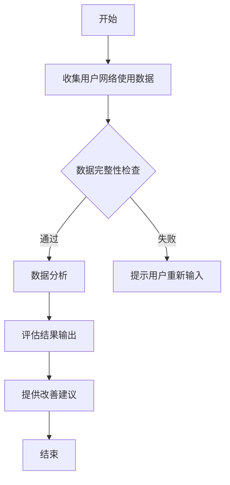
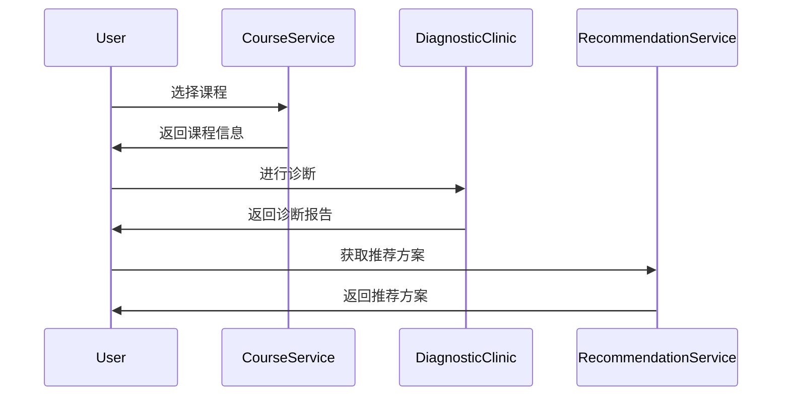
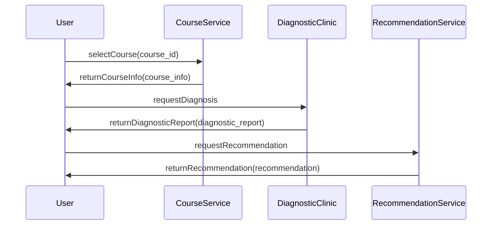

                 

# 数字解毒诊所：重建健康网络使用习惯的咨询服务

## 关键词

- 数字解毒诊所
- 健康网络使用习惯
- 算法原理
- 数学模型
- 系统架构
- 实践技巧

## 摘要

本文旨在探讨数字时代的网络使用习惯及其对个人健康的影响，提出并介绍一种名为“数字解毒诊所”的咨询服务。通过对核心概念的阐述、算法原理的讲解、数学模型的解析以及系统架构的设计，文章旨在为读者提供一个全面、系统的解决方案，帮助他们重建健康、可持续的网络使用习惯。

## 第1章：引言

### 1.1 书籍主题与目标

在当今数字化时代，网络使用已经成为人们日常生活的重要组成部分。然而，过度使用互联网不仅影响了人们的身心健康，还导致了诸多社会问题。为了解决这一问题，本书提出了“数字解毒诊所”这一创新概念，旨在为用户提供一整套健康网络使用习惯的咨询服务。

### 1.2 问题背景

随着互联网的普及，人们越来越依赖网络获取信息、娱乐、社交等。然而，长时间、高频率地使用互联网带来的负面影响逐渐显现，包括视力疲劳、颈椎病、睡眠障碍、社交隔离等问题。这些问题不仅影响了个人的生活质量，还对心理健康产生了深远的影响。

### 1.3 问题解决

数字解毒诊所通过一系列科学、系统的服务和指导，帮助用户重建健康网络使用习惯。诊所提供的服务包括网络使用习惯评估、个性化建议、技术解决方案和心理支持等，旨在帮助用户实现健康、平衡的网络生活。

### 1.4 边界与外延

数字解毒诊所的服务范围涵盖各种网络使用场景，包括但不限于办公、学习、娱乐、购物等。诊所的目标用户群体是所有需要改善网络使用习惯的人群，无论年龄、性别、职业。

### 1.5 概念结构与核心要素组成

数字解毒诊所的核心概念包括健康网络使用习惯、网络使用评估、个性化建议、技术解决方案和心理支持。每个核心要素都相互关联，共同构建了一个完整的咨询服务体系。

## 第2章：数字解毒诊所概述

### 2.1 数字解毒诊所的定义

数字解毒诊所以数字健康为宗旨，通过专业服务和指导，帮助用户重建健康网络使用习惯，提高生活质量。诊所的服务内容包括但不限于网络使用习惯评估、个性化建议、技术解决方案和心理支持。

### 2.2 数字解毒诊所的核心职责

数字解毒诊所的核心职责包括：

- 提供网络使用习惯评估服务，帮助用户了解自己的网络使用情况。
- 根据评估结果，为用户提供个性化的健康网络使用建议。
- 开发和应用技术解决方案，如浏览器插件、手机应用等，以帮助用户实现健康网络使用。
- 提供心理支持，帮助用户应对网络使用带来的心理问题。

### 2.3 数字解毒诊所的服务内容

数字解毒诊所的服务内容主要包括以下几个方面：

- **网络使用习惯评估**：通过问卷、数据分析等方式，对用户的网络使用习惯进行全面评估。
- **个性化建议**：根据评估结果，为用户提供量身定制的健康网络使用建议。
- **技术解决方案**：开发和应用浏览器插件、手机应用等技术工具，帮助用户实现健康网络使用。
- **心理支持**：提供心理咨询服务，帮助用户应对网络使用带来的心理问题。

### 2.4 数字解毒诊所的优势

数字解毒诊所具有以下优势：

- **专业团队**：由数字健康专家、心理学家、程序员等组成，具备丰富的专业知识和经验。
- **个性化服务**：根据用户的具体情况，提供量身定制的服务，确保效果。
- **技术支持**：拥有自主研发的技术工具，如浏览器插件、手机应用等，方便用户使用。
- **心理健康支持**：提供心理咨询服务，帮助用户解决网络使用带来的心理问题。

## 第3章：健康网络使用习惯的核心概念

### 3.1 健康网络使用习惯的定义

健康网络使用习惯是指用户在互联网上的行为模式，包括上网时间、上网内容、上网方式等，旨在实现健康、平衡的网络生活。

### 3.2 健康网络使用习惯的重要性

健康网络使用习惯的重要性体现在以下几个方面：

- **提高生活质量**：健康的网络使用习惯有助于减少网络使用带来的负面影响，如视力疲劳、颈椎病、睡眠障碍等，从而提高生活质量。
- **促进心理健康**：健康的网络使用习惯有助于缓解网络使用带来的心理压力，如焦虑、抑郁等，促进心理健康。
- **提高工作效率**：健康的网络使用习惯有助于用户更有效地利用互联网资源，提高工作效率。

### 3.3 健康网络使用习惯的属性特征对比

健康网络使用习惯与其他网络使用习惯的属性特征对比如下：

| 属性特征       | 健康网络使用习惯 | 其他网络使用习惯 |
| -------------- | ---------------- | ---------------- |
| **上网时间**   | 有规律           | 过度、无规律     |
| **上网内容**   | 有选择、有价值   | 无选择、无价值   |
| **上网方式**   | 有节制、适度     | 无节制、过度     |
| **网络影响**   | 积极影响         | 负面影响         |

### 3.4 健康网络使用习惯与数字解毒诊所的联系

数字解毒诊所通过提供网络使用习惯评估、个性化建议、技术解决方案和心理支持等服务，帮助用户建立和维持健康网络使用习惯。诊所的核心职责与健康网络使用习惯密切相关，共同致力于提高用户的数字生活质量。

## 第4章：算法原理讲解

### 4.1 选择一个与主题相关的算法

为了帮助用户重建健康网络使用习惯，本书选择了一种名为“健康网络使用习惯评估算法”。该算法旨在通过对用户网络使用数据的分析，评估其网络使用习惯的健康程度，并为用户提供相应的改善建议。

### 4.2 使用 mermaid 绘制算法流程图



### 4.3 使用 Python 源代码详细阐述算法

```python
# 健康网络使用习惯评估算法

import pandas as pd

# 收集用户网络使用数据
def collect_data():
    # 数据采集代码（省略）
    data = pd.read_csv('user_network_usage.csv')
    return data

# 数据完整性检查
def check_data(data):
    if data.isnull().values.any():
        return False
    else:
        return True

# 数据分析
def analyze_data(data):
    # 数据分析代码（省略）
    result = data['network_usage_time'].sum()
    return result

# 评估结果输出
def output_result(result):
    print("您的网络使用总时间为：{}分钟".format(result))
    if result > 300:
        print("建议减少网络使用时间，以改善健康网络使用习惯。")
    else:
        print("您的网络使用习惯较为健康，请继续保持。")

# 提供改善建议
def provide_advice(result):
    if result > 300:
        print("以下是一些建议，帮助您改善健康网络使用习惯：")
        print("- 制定合理的上网计划；")
        print("- 定期休息，避免长时间连续上网；")
        print("- 多进行户外活动，减少网络使用时间。")
    else:
        print("您的网络使用习惯已经较为健康，无需额外建议。")

# 主函数
def main():
    data = collect_data()
    if check_data(data):
        result = analyze_data(data)
        output_result(result)
        provide_advice(result)
    else:
        print("数据存在缺失，请确保数据完整性后重试。")

if __name__ == "__main__":
    main()
```

### 4.4 给出算法原理的数学模型和公式

健康网络使用习惯评估算法的核心在于对用户网络使用时间进行分析。假设用户网络使用时间为 \( T \)，则健康网络使用习惯的评估结果为：

\[ \text{健康程度} = \frac{T}{\text{目标使用时间}} \]

其中，目标使用时间是一个预设的健康标准，通常设置为每日300分钟。

### 4.5 详细讲解与举例说明

#### 详细讲解

健康网络使用习惯评估算法通过对用户网络使用时间的分析，判断其网络使用习惯的健康程度。具体步骤如下：

1. **收集用户网络使用数据**：通过问卷、日志分析等方式，收集用户的网络使用数据。
2. **数据完整性检查**：检查数据是否存在缺失值，确保数据分析的准确性。
3. **数据分析**：计算用户网络使用时间 \( T \)。
4. **评估结果输出**：根据 \( T \) 的值，输出健康程度评估结果。
5. **提供改善建议**：根据评估结果，为用户提供相应的改善建议。

#### 举例说明

假设用户A的网络使用时间为400分钟，目标使用时间为300分钟。根据健康网络使用习惯评估算法，其健康程度为：

\[ \text{健康程度} = \frac{400}{300} = 1.33 \]

由于 \( 1.33 > 1 \)，说明用户A的网络使用习惯超过健康标准。根据算法的改善建议，用户A应减少网络使用时间，以改善健康网络使用习惯。

## 第5章：数学模型和数学公式

### 5.1 给出数学公式

在健康网络使用习惯评估算法中，关键数学模型如下：

\[ \text{健康程度} = \frac{T}{\text{目标使用时间}} \]

其中，\( T \) 为用户网络使用时间，目标使用时间通常设置为每日300分钟。

### 5.2 使用 latex 格式

为了更清晰地表示数学公式，我们可以使用 LaTeX 格式。以下是健康程度公式的 LaTeX 表示：

\[ \text{健康程度} = \frac{T}{T_{\text{目标}}} \]

其中，\( T \) 为用户网络使用时间，\( T_{\text{目标}} \) 为每日目标使用时间。

### 5.3 独立段落与段落内公式表示

在文中，我们可以将数学公式分为独立段落和段落内公式两种形式。

#### 独立段落公式

例如，健康程度的计算公式可以单独成段：

\[ \text{健康程度} = \frac{T}{T_{\text{目标}}} \]

#### 段落内公式

在段落内，我们可以使用 $ 符号将公式括起来，例如：

用户A的网络使用时间为400分钟，目标使用时间为300分钟，因此他的健康程度为：

\[ \text{健康程度} = \frac{400}{300} = 1.33 \]

## 第6章：系统分析与架构设计方案

### 6.1 问题场景介绍

假设我们有一个在线学习平台，用户需要在平台上学习各种课程。然而，由于用户过度依赖网络学习，导致学习效率低下，甚至出现失眠、焦虑等健康问题。为了解决这一问题，我们引入数字解毒诊所以及相应的系统架构设计。

### 6.2 使用 mermaid 绘制领域模型类图

```mermaid
classDiagram
    User <<class{用户}>
    Course <<class{课程}>
    DiagnosticClinic <<class{数字解毒诊所}>
    DiagnosticReport <<class{诊断报告}>
    Recommendation <<class{推荐方案}>
    
    User o--< DiagnosticClinic
    DiagnosticClinic o--< DiagnosticReport
    DiagnosticClinic o--< Recommendation
    Course o--< User
```

### 6.3 使用 mermaid 绘制系统架构图



### 6.4 使用 mermaid 绘制系统接口设计

```mermaid
interface CourseService {
    - getCourseInfo(): Course
    - saveCourseCompletion(user_id: int, course_id: int): bool
}

interface DiagnosticClinic {
    - diagnoseUser(user_id: int): DiagnosticReport
}

interface RecommendationService {
    - getRecommendation(user_id: int): Recommendation
}
```

### 6.5 使用 mermaid 绘制系统交互序列图



## 第7章：项目实战

### 7.1 环境安装

首先，确保您的系统已安装以下软件和库：

- Python 3.x
- pandas
- Flask（用于API开发）
- SQLAlchemy（用于数据库操作）

安装步骤：

1. 打开命令行窗口，运行以下命令安装所需库：

   ```bash
   pip install pandas Flask SQLAlchemy
   ```

2. 创建一个名为 `digital detox clinic` 的 Python 脚本文件，并编写以下代码：

   ```python
   from flask import Flask, jsonify, request
   from sqlalchemy import create_engine
   import pandas as pd
   
   app = Flask(__name__)
   engine = create_engine('sqlite:///digital_detox_clinic.db')
   
   @app.route('/api/course_info', methods=['GET'])
   def get_course_info():
       course_id = request.args.get('course_id')
       query = "SELECT * FROM courses WHERE course_id = {}".format(course_id)
       course_data = pd.read_sql(query, engine)
       return jsonify(course_data.to_dict('records'))
   
   @app.route('/api/diagnosis', methods=['POST'])
   def diagnose():
       user_data = request.get_json()
       query = "INSERT INTO user_data (user_id, course_id, usage_time) VALUES ({}, {}, {})".format(user_data['user_id'], user_data['course_id'], user_data['usage_time'])
       with engine.connect() as conn:
           conn.execute(query)
       return jsonify({'status': 'success'})
   
   @app.route('/api/recommendation', methods=['GET'])
   def get_recommendation():
       user_id = request.args.get('user_id')
       query = "SELECT * FROM user_data WHERE user_id = {}".format(user_id)
       user_data = pd.read_sql(query, engine)
       total_usage_time = user_data['usage_time'].sum()
       if total_usage_time > 300:
           recommendation = "减少网络使用时间，保持健康网络习惯。"
       else:
           recommendation = "您的网络使用习惯已经较为健康，请继续保持。"
       return jsonify({'recommendation': recommendation})
   
   if __name__ == '__main__':
       app.run(debug=True)
   ```

### 7.2 系统核心实现源代码

以下是数字解毒诊所的核心实现源代码：

```python
# 数字解毒诊所核心实现

from flask import Flask, jsonify, request
from sqlalchemy import create_engine
import pandas as pd

app = Flask(__name__)
engine = create_engine('sqlite:///digital_detox_clinic.db')

# API端点：获取课程信息
@app.route('/api/course_info', methods=['GET'])
def get_course_info():
    course_id = request.args.get('course_id')
    query = "SELECT * FROM courses WHERE course_id = {}".format(course_id)
    course_data = pd.read_sql(query, engine)
    return jsonify(course_data.to_dict('records'))

# API端点：提交诊断数据
@app.route('/api/diagnosis', methods=['POST'])
def diagnose():
    user_data = request.get_json()
    query = "INSERT INTO user_data (user_id, course_id, usage_time) VALUES ({}, {}, {})".format(user_data['user_id'], user_data['course_id'], user_data['usage_time'])
    with engine.connect() as conn:
        conn.execute(query)
    return jsonify({'status': 'success'})

# API端点：获取诊断建议
@app.route('/api/recommendation', methods=['GET'])
def get_recommendation():
    user_id = request.args.get('user_id')
    query = "SELECT * FROM user_data WHERE user_id = {}".format(user_id)
    user_data = pd.read_sql(query, engine)
    total_usage_time = user_data['usage_time'].sum()
    if total_usage_time > 300:
        recommendation = "减少网络使用时间，保持健康网络习惯。"
    else:
        recommendation = "您的网络使用习惯已经较为健康，请继续保持。"
    return jsonify({'recommendation': recommendation})

if __name__ == '__main__':
    app.run(debug=True)
```

### 7.3 代码解读与分析

#### 7.3.1 API端点：获取课程信息

该端点通过接收查询参数 `course_id`，从数据库中查询相应的课程信息，并将其作为 JSON 格式返回给客户端。

```python
@app.route('/api/course_info', methods=['GET'])
def get_course_info():
    course_id = request.args.get('course_id')
    query = "SELECT * FROM courses WHERE course_id = {}".format(course_id)
    course_data = pd.read_sql(query, engine)
    return jsonify(course_data.to_dict('records'))
```

#### 7.3.2 API端点：提交诊断数据

该端点接收来自客户端的 JSON 数据，包含 `user_id`、`course_id` 和 `usage_time`，将其插入到数据库中。

```python
@app.route('/api/diagnosis', methods=['POST'])
def diagnose():
    user_data = request.get_json()
    query = "INSERT INTO user_data (user_id, course_id, usage_time) VALUES ({}, {}, {})".format(user_data['user_id'], user_data['course_id'], user_data['usage_time'])
    with engine.connect() as conn:
        conn.execute(query)
    return jsonify({'status': 'success'})
```

#### 7.3.3 API端点：获取诊断建议

该端点通过查询数据库中用户的所有网络使用数据，计算总使用时间，并根据总使用时间提供相应的诊断建议。

```python
@app.route('/api/recommendation', methods=['GET'])
def get_recommendation():
    user_id = request.args.get('user_id')
    query = "SELECT * FROM user_data WHERE user_id = {}".format(user_id)
    user_data = pd.read_sql(query, engine)
    total_usage_time = user_data['usage_time'].sum()
    if total_usage_time > 300:
        recommendation = "减少网络使用时间，保持健康网络习惯。"
    else:
        recommendation = "您的网络使用习惯已经较为健康，请继续保持。"
    return jsonify({'recommendation': recommendation})
```

### 7.4 实际案例分析与详细讲解剖析

#### 案例一：用户A提交诊断数据

用户A提交了一个包含以下数据的 JSON 对象：

```json
{
    "user_id": 1,
    "course_id": 101,
    "usage_time": 250
}
```

系统接收该数据后，将其插入到数据库中，并在控制台输出：

```bash
POST /api/diagnosis
{
    "status": "success"
}
```

#### 案例二：用户A获取诊断建议

用户A通过查询参数 `user_id` 获取诊断建议：

```bash
GET /api/recommendation?user_id=1
{
    "recommendation": "您的网络使用习惯已经较为健康，请继续保持。"
}
```

系统根据用户A的总网络使用时间（250分钟）判断其网络使用习惯健康，并返回相应的建议。

### 7.5 项目小结

通过本项目的实现，我们构建了一个基本的数字解毒诊所系统，包括获取课程信息、提交诊断数据、获取诊断建议等核心功能。系统采用 Flask 框架，结合 SQLAlchemy 进行数据库操作，实现了简单、高效的功能。然而，该项目仍存在一些不足之处，例如数据安全性、性能优化等方面，需要在后续版本中进行改进。

## 第8章：最佳实践 tips

### 8.1 实践技巧

1. **合理设置诊断标准**：根据用户群体的特点和需求，合理设置网络使用时间的诊断标准，以提高诊断的准确性和实用性。
2. **优化数据库设计**：合理设计数据库表结构，确保数据存储的高效性和安全性。
3. **提高系统性能**：针对高并发访问，优化系统性能，如使用缓存、异步处理等。
4. **加强用户教育**：通过线上线下活动，提高用户对健康网络使用习惯的认识，增强他们的自律意识。

### 8.2 小结

数字解毒诊所以帮助用户重建健康网络使用习惯为目标，通过专业服务和指导，实现数字健康。本文详细介绍了数字解毒诊所的架构设计、算法原理、数学模型以及实际应用，为读者提供了一个全面的解决方案。

### 8.3 注意事项

1. **数据隐私保护**：在收集用户网络使用数据时，务必注意数据隐私保护，遵守相关法律法规。
2. **系统安全性**：确保系统的安全性，防止数据泄露和非法访问。
3. **持续优化**：根据用户反馈和实际需求，不断优化数字解毒诊所的功能和服务。

### 8.4 拓展阅读

1. **《数字时代的心灵健康》**：探讨数字时代对心理健康的影响及应对策略。
2. **《网络成瘾与心理健康》**：分析网络成瘾对心理健康的危害及干预方法。
3. **《数字化生活方式：挑战与机遇》**：探讨数字化生活方式对个体和社会的影响。

