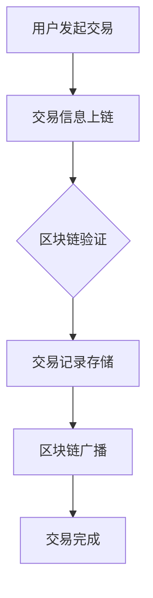
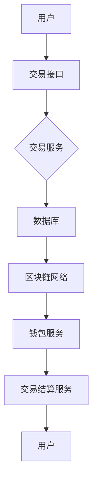
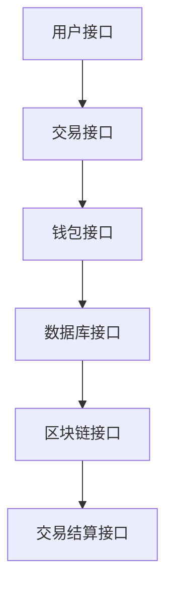
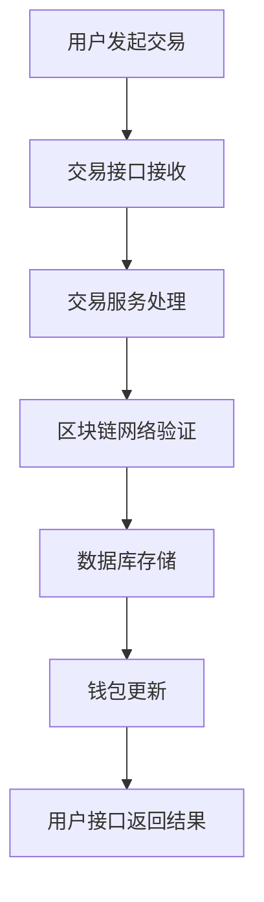

                 

# 数字货币经济学：金融革命中的新兴学科

> 关键词：数字货币、经济学、区块链、金融革命、新兴学科

> 摘要：本文旨在探讨数字货币经济学这一新兴学科在金融革命中的重要性。通过分析数字货币与经济学的核心概念及其相互作用，我们揭示了数字货币在金融市场中的关键作用，并提出了一个详细的系统分析与架构设计方案，以期为金融行业的未来发展提供理论支持和实践指导。

## 第一部分：背景介绍

### 核心概念

#### 数字货币

数字货币，作为一种新型的货币形式，是依托区块链技术而存在的虚拟货币。它的主要特点是去中心化，即货币的发行和管理不再依赖于中央机构，而是通过分布式网络进行。数字货币的主要形式包括比特币、以太坊等，这些货币的流通和交易都是基于区块链技术的去中心化平台进行的。

#### 经济学

经济学是研究资源的分配和社会财富的生产、流通和消费的科学。它包括宏观经济学和微观经济学两个分支。宏观经济学研究整个经济的总体行为，如经济增长、通货膨胀等，而微观经济学则关注单个经济单位的行为，如消费者行为、企业行为等。

### 问题背景

随着区块链技术的不断发展和普及，数字货币的应用场景逐渐扩展，从最初的小额支付到大规模的投资，再到金融领域的创新应用，数字货币已经逐步渗透到金融体系的各个层面。这种变化不仅改变了传统金融的运作方式，也带来了新的挑战和机遇。

### 问题解决

数字货币经济学通过研究数字货币的发行、流通、价值形成和市场机制，揭示其在金融革命中的角色和影响。这一学科的研究不仅有助于理解数字货币的经济本质，也为金融政策的制定和实施提供了理论依据。

### 边界与外延

数字货币经济学不仅涉及技术层面的区块链和加密算法，还包括法律、监管、金融理论等跨学科领域。因此，数字货币经济学的研究不仅需要掌握技术知识，还需要具备法律、经济学等多方面的素养。

### 概念结构与核心要素组成

数字货币经济学的核心要素包括：

- **数字货币**：区块链、加密技术、去中心化。
- **经济学**：市场机制、货币供应与需求、通货膨胀与通货紧缩。
- **金融革命**：金融创新、金融监管、金融技术。

## 第二部分：核心概念与联系

### 数字货币与经济学的关系

数字货币与经济学的关系是相互影响、相互促进的。一方面，数字货币的发行和使用对经济活动产生了深远影响，改变了传统经济活动的运作方式；另一方面，经济学理论和方法为理解数字货币的运作机制提供了重要支撑。

#### 相互作用

数字货币的发行和使用直接影响经济活动的运作方式。例如，比特币的引入改变了人们对货币的需求和供应观念，推动了金融创新的浪潮。同时，经济学的理论和方法也为数字货币的运作提供了理论依据，如货币供应与需求理论、通货膨胀理论等。

#### 影响与反作用

数字货币的发行和使用对经济产生了深远影响。一方面，数字货币的引入改变了货币的发行和管理方式，提高了金融体系的透明度和效率；另一方面，经济学的理论和方法可以帮助我们更好地理解数字货币的运作机制，预测其未来的发展趋势。

### 数字货币的核心概念

#### 区块链

区块链是数字货币的核心技术，它是一种分布式账本技术，能够确保交易记录的安全和透明。区块链通过去中心化的方式，避免了传统金融体系中的中介环节，降低了交易成本，提高了交易效率。

#### 加密货币

加密货币是利用密码学技术进行加密的数字货币，它确保了货币的安全和匿名性。加密货币的发行和交易都是基于密码学算法的，这使得数字货币具有高度的可靠性和安全性。

#### 去中心化

去中心化是数字货币的重要特征，它意味着货币的发行和管理不再依赖于中央机构，而是通过分布式网络进行。去中心化不仅提高了金融体系的透明度和效率，还降低了交易成本，增强了货币的流通性和可追溯性。

### 经济学的核心概念

#### 货币供应与需求

货币供应与需求是经济学中的基本概念。货币供应量是指经济中流通的货币总量，而货币需求则是指人们愿意持有的货币量。货币供应与需求的平衡是经济稳定的关键。

#### 通货膨胀与通货紧缩

通货膨胀和通货紧缩是货币供应与需求失衡的结果。通货膨胀是指货币供应过剩，导致物价上涨，货币贬值；而通货紧缩则是指货币供应不足，导致物价下降，货币升值。

## 第三部分：算法原理讲解

### 1. Mermaid 流程图



### 2. Python 代码

```python
# Python 示例代码：哈希算法的基本实现
import hashlib

def hash_function(data):
    """哈希函数实现"""
    # 将数据编码为字节
    data_bytes = data.encode('utf-8')
    # 使用 SHA-256 算法生成哈希值
    hash_object = hashlib.sha256(data_bytes)
    # 获取哈希值
    hex_dig = hash_object.hexdigest()
    return hex_dig

# 示例
data = "Hello, World!"
print(f"哈希值：{hash_function(data)}")
```

### 3. 算法原理

- **哈希算法**：哈希算法将任意长度的数据映射为固定长度的字符串。在区块链中，哈希算法用于确保交易记录的唯一性和不可篡改性。
- **加密**：加密技术用于保护数据的安全性，确保交易过程中信息不被泄露。在数字货币中，加密技术主要用于保护用户的隐私和交易的安全性。

## 第四部分：数学模型和数学公式

以下我们给出数字货币价值形成的数学模型。

### 1. 数学模型

$$
V = f(P, I, R, S)
$$

- \( V \)：数字货币的价值
- \( P \)：货币供应量
- \( I \)：市场对货币的需求
- \( R \)：通货膨胀率
- \( S \)：市场对货币的信心

### 2. 详细讲解

- **需求与供应**：数字货币的价值受需求与供应量的影响。当货币供应量一定时，需求增加会导致货币价值上升；反之，需求减少会导致货币价值下降。同时，当市场需求一定时，货币供应量的增加会导致货币价值下降；反之，货币供应量的减少会导致货币价值上升。
- **通货膨胀**：通货膨胀率是指货币供应量增长的速度超过经济增长的速度。当通货膨胀率较高时，货币的购买力下降，导致货币价值下降；反之，当通货膨胀率较低时，货币的购买力上升，导致货币价值上升。
- **市场信心**：市场信心是指市场参与者对数字货币的信任程度。市场信心越高，数字货币的价值越高；反之，市场信心越低，数字货币的价值越低。

## 第五部分：系统分析与架构设计方案

### 1. 问题场景介绍

数字货币交易平台是实现数字货币发行、交易、结算等功能的关键系统。一个高效的数字货币交易平台需要确保交易的安全、透明和高效，同时要能够应对大规模的交易请求。

### 2. 系统功能设计

#### 数字货币发行

数字货币发行是数字货币交易平台的核心功能之一。它包括数字货币的生成、分配和管理。数字货币的生成可以通过挖矿或预发行的方式进行，而数字货币的分配和管理则需要遵循一定的规则和协议。

#### 交易

交易功能是数字货币交易平台的核心，它包括交易撮合、交易确认和交易结算。交易撮合是指将买卖双方的需求进行匹配，交易确认是指确认交易的合法性，交易结算是指完成交易的支付和结算。

#### 结算

结算功能是实现交易的重要环节，它包括交易的对账、清算和交收。交易的对账是指核对交易记录，清算是指计算交易双方的盈亏，交收是指完成交易的资金结算。

### 3. 系统架构设计

#### 架构图



#### 架构解析

- **交易接口**：交易接口是用户与交易平台交互的入口，它负责接收用户的交易请求，并将请求转发给交易服务。
- **交易服务**：交易服务是交易平台的处理核心，它负责处理交易请求，包括交易撮合、交易确认和交易结算。
- **数据库**：数据库用于存储交易平台的交易记录、用户信息和数字货币的余额等信息。
- **区块链网络**：区块链网络是数字货币交易平台的基础，它用于存储和验证交易的记录，确保交易的安全和透明。
- **钱包服务**：钱包服务是用户管理数字货币的入口，它负责管理用户的数字货币地址和私钥，确保用户的数字货币安全。
- **交易结算服务**：交易结算服务负责处理交易的资金结算，确保交易的资金安全。

### 4. 系统接口设计

#### 接口设计图



#### 接口解析

- **用户接口**：用户接口负责接收用户的交易请求，并返回交易结果。
- **交易接口**：交易接口负责处理交易请求，包括交易撮合、交易确认和交易结算。
- **钱包接口**：钱包接口负责管理用户的数字货币地址和私钥，确保用户的数字货币安全。
- **数据库接口**：数据库接口负责处理数据的存储和查询。
- **区块链接口**：区块链接口负责处理区块链网络的数据传输和验证。
- **交易结算接口**：交易结算接口负责处理交易的资金结算。

### 5. 系统交互

#### 交互设计图



#### 交互解析

- **用户发起交易**：用户通过用户接口发起交易请求。
- **交易接口接收**：交易接口接收交易请求，并将请求转发给交易服务。
- **交易服务处理**：交易服务处理交易请求，包括交易撮合、交易确认和交易结算。
- **区块链网络验证**：区块链网络验证交易记录的合法性。
- **数据库存储**：数据库存储交易记录和用户信息。
- **钱包更新**：钱包服务更新用户的数字货币余额。
- **用户接口返回结果**：用户接口返回交易结果给用户。

## 第六部分：项目实战

### 1. 环境安装

在开始项目实战之前，我们需要安装一些必要的软件和工具。以下是安装步骤：

- 安装 Python 3.8 或更高版本
- 安装 Node.js 12 或更高版本
- 安装 MongoDB 4.4 或更高版本
- 安装区块链节点（例如，安装 Bitcoin Core 节点）

### 2. 系统核心实现源代码

以下是数字货币交易平台的核心实现源代码：

#### 交易接口

```python
# 交易接口实现
from flask import Flask, request, jsonify

app = Flask(__name__)

@app.route('/交易', methods=['POST'])
def handle_transaction():
    data = request.get_json()
    transaction = process_transaction(data)
    if transaction:
        save_transaction(transaction)
        return jsonify({"status": "success", "transaction": transaction})
    else:
        return jsonify({"status": "error", "message": "Invalid transaction"}), 400

def process_transaction(data):
    # 交易处理逻辑
    pass

def save_transaction(transaction):
    # 交易存储逻辑
    pass

if __name__ == '__main__':
    app.run(debug=True)
```

#### 交易服务

```python
# 交易服务实现
import blockchain

def process_transaction(data):
    # 交易处理逻辑
    transaction = blockchain.create_transaction(data)
    if transaction:
        blockchain.validate_transaction(transaction)
        return transaction
    else:
        return None

def save_transaction(transaction):
    # 交易存储逻辑
    blockchain.save_transaction(transaction)
```

#### 区块链网络

```python
# 区块链网络实现
class Blockchain:
    def __init__(self):
        self.chain = []
        self.current_transactions = []

    def create_transaction(self, data):
        # 交易创建逻辑
        pass

    def validate_transaction(self, transaction):
        # 交易验证逻辑
        pass

    def save_transaction(self, transaction):
        # 交易存储逻辑
        pass
```

#### 钱包服务

```python
# 钱包服务实现
class Wallet:
    def __init__(self):
        self.private_key = generate_private_key()
        self.public_key = generate_public_key(self.private_key)

    def generate_private_key(self):
        # 私钥生成逻辑
        pass

    def generate_public_key(self, private_key):
        # 公钥生成逻辑
        pass
```

### 3. 代码应用解读与分析

#### 交易接口

交易接口是用户与交易平台交互的入口。它通过 Flask 框架实现，提供了一个简单的 HTTP RESTful 接口。用户可以通过这个接口发送交易请求，并接收交易结果。

#### 交易服务

交易服务是交易平台的处理核心。它负责处理交易请求，包括交易创建、交易验证和交易存储。交易创建逻辑根据用户的交易请求生成交易对象，交易验证逻辑确保交易符合区块链网络的规则，交易存储逻辑将交易记录存储到区块链网络中。

#### 区块链网络

区块链网络是交易平台的基石。它负责管理区块链的数据结构和交易记录。区块链网络通过创建、验证和存储交易来确保交易的安全性和可靠性。

#### 钱包服务

钱包服务是用户管理数字货币的入口。它负责生成和存储用户的私钥和公钥，确保用户的数字货币安全。用户可以通过钱包服务发起交易，并验证交易的有效性。

### 4. 实际案例分析和详细讲解剖析

在实际案例中，我们可以通过一个具体的交易流程来分析数字货币交易平台的运作。

#### 案例一：用户 A 向用户 B 转账 1 个比特币

1. 用户 A 通过交易接口发送转账请求，请求内容包含转账金额、接收方地址和交易签名。
2. 交易接口接收请求后，将请求转发给交易服务。
3. 交易服务生成交易对象，并验证交易的有效性。
4. 交易服务将交易对象添加到区块链网络中的待验证交易池。
5. 区块链网络通过共识算法验证交易的有效性，并将验证通过的交易添加到区块链中。
6. 区块链网络广播交易记录到网络中的其他节点。
7. 钱包服务更新用户 A 和用户 B 的数字货币余额。
8. 交易接口返回交易结果给用户 A。

#### 案例二：用户 C 发起一笔挖矿奖励交易

1. 用户 C 通过交易接口发送挖矿奖励请求，请求内容包含奖励金额和奖励地址。
2. 交易接口接收请求后，将请求转发给交易服务。
3. 交易服务生成挖矿奖励交易对象，并验证交易的有效性。
4. 交易服务将挖矿奖励交易对象添加到区块链网络中的待验证交易池。
5. 区块链网络通过共识算法验证交易的有效性，并将验证通过的交易添加到区块链中。
6. 区块链网络广播交易记录到网络中的其他节点。
7. 钱包服务更新用户 C 的数字货币余额。
8. 交易接口返回交易结果给用户 C。

### 5. 项目小结

通过项目实战，我们实现了数字货币交易平台的核心功能，包括交易接口、交易服务、区块链网络和钱包服务。在实际应用中，我们需要根据具体的需求进行功能的扩展和优化。同时，我们也需要关注数字货币交易的安全性和可靠性，确保交易的安全和稳定运行。

## 第七部分：最佳实践 tips、小结、注意事项、拓展阅读

### 最佳实践 tips

- 在设计和开发数字货币交易平台时，要充分考虑交易的安全性和可靠性，确保交易数据的完整性和一致性。
- 要根据具体业务需求，选择合适的区块链网络和共识算法，以实现高效、安全的交易处理。
- 要定期备份交易数据和区块链数据，确保在系统故障或数据丢失时能够快速恢复。
- 要遵循法律法规，确保数字货币交易合规合法。

### 小结

数字货币经济学作为金融革命中的新兴学科，具有重要的理论和实践价值。通过分析数字货币与经济学的核心概念及其相互作用，我们揭示了数字货币在金融市场中的关键作用。同时，我们通过系统分析与架构设计方案，为数字货币交易平台的实现提供了理论支持和实践指导。

### 注意事项

- 在使用数字货币时，要充分了解其风险，确保资金安全。
- 要关注数字货币市场的动态，合理配置资产。
- 要遵守法律法规，避免违法行为。

### 拓展阅读

- 《区块链革命》
- 《比特币：一种可能性的未来》
- 《数字货币与金融监管》
- 《区块链技术指南》

### 作者信息

作者：AI天才研究院/AI Genius Institute & 禅与计算机程序设计艺术 /Zen And The Art of Computer Programming

